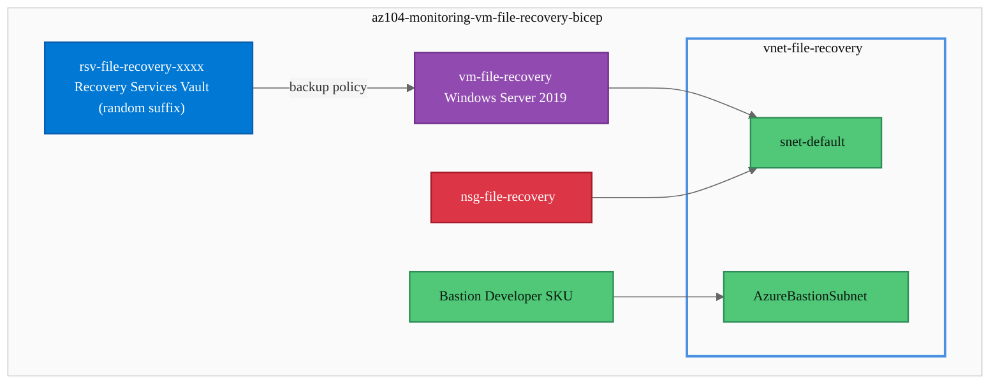
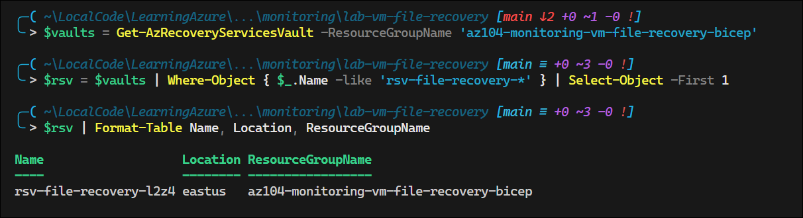
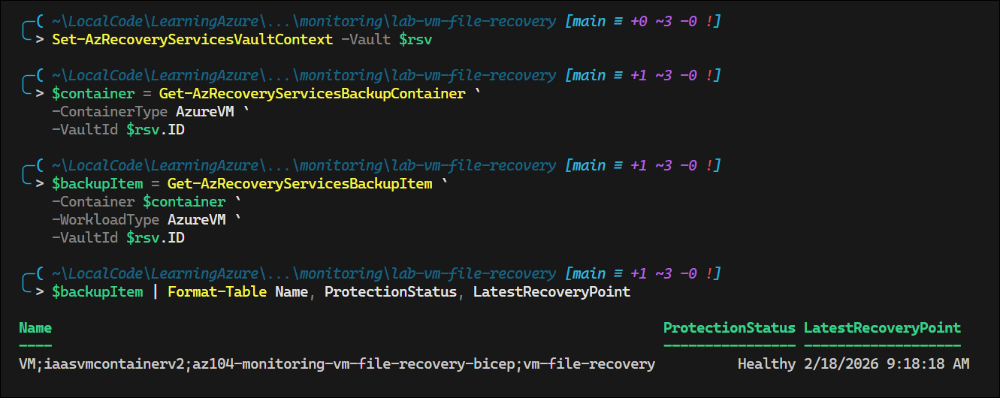
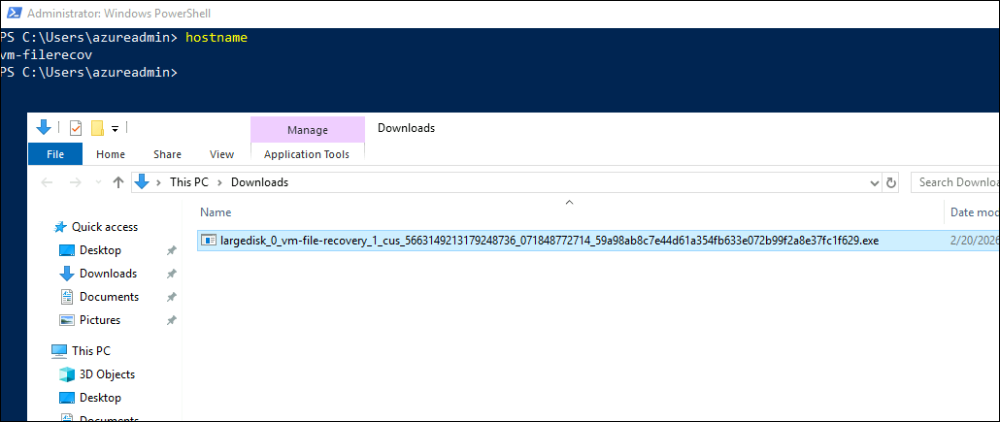
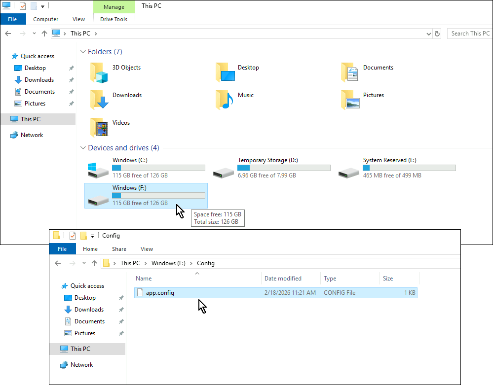
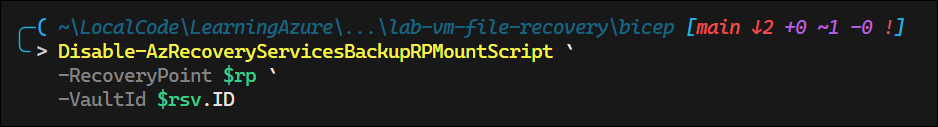

# Lab: Recover Configuration File from Azure VM Backup

## Exam Question Scenario

You have two Azure virtual machines (VMs) named VM1 and VM2 running Windows Server 2019. The VMs are backed up by an Azure Recovery Services vault. A configuration file on VM1 was updated, and you need to restore it to a version from six days ago.

You need to perform this action as quickly as possible without affecting other system files.

Which four actions should you perform in sequence? To answer, move the appropriate actions from the list of actions to the answer area and arrange them in the correct order.

**Available options:**

- Start the file recovery process and select the recovery point of six days ago.
- Download and execute the PowerShell script to mount the recovery volume.
- Copy the file from the mounted volume to the VM.
- Unmount the volumes.
- Restore the disk containing the configuration file.
- Restore the VM to a previous state.

---

## Solution Architecture

This lab deploys a Windows Server 2019 VM backed up by an Azure Recovery Services vault. A sample configuration file is placed on the VM so that you can practice the **file-level recovery** workflow — selecting a recovery point, mounting the recovery volume, copying the file, and unmounting.

### Key Components

| Resource | Purpose |
|---|---|
| Recovery Services Vault | Stores VM backup data and enables file-level recovery |
| Windows VM (VM1) | Target VM with configuration file to recover |
| Virtual Network + Subnet | Network infrastructure for VM connectivity |
| NSG | Controls inbound/outbound traffic |
| Bastion (Developer SKU) | Secure remote access without public IP |

---

## Architecture Diagram



---

## Lab Objectives

1. Deploy a Windows Server 2019 VM with a Recovery Services vault and backup policy
2. Understand the file-level recovery process from Azure VM backup
3. Practice selecting recovery points and mounting recovery volumes
4. Distinguish file-level recovery from full VM/disk restore scenarios

---

## Lab Structure

```
lab-vm-file-recovery/
├── README.md
├── bicep/
│   ├── main.bicep
│   ├── main.bicepparam
│   ├── bicepconfig.json
│   ├── bicep.ps1
│   └── modules/
│       ├── network.bicep
│       ├── vm.bicep
│       └── recovery.bicep
└── validation/
    └── test-vm-file-recovery.ps1
```

---

## Prerequisites

- Azure subscription with Contributor access
- Azure CLI installed and authenticated
- Azure PowerShell module (`Az`) installed
- PowerShell 7+
- `Use-AzProfile Lab` configured

---

## Deployment

```powershell
# Switch to lab subscription
Use-AzProfile Lab

# Navigate to bicep directory
cd AZ-104/hands-on-labs/monitoring/lab-vm-file-recovery/bicep

# Validate the template
.\bicep.ps1 validate

# Preview the deployment
.\bicep.ps1 plan

# Deploy the lab
.\bicep.ps1 apply
```

> **Note:** After deployment, wait approximately 15-20 minutes for the initial VM backup to complete before testing file-level recovery.

---

## Testing the Solution

### Step 1: Verify the Recovery Services Vault and Backup

```powershell
# 1. Verify Recovery Services vault exists (vault name includes random 4-char suffix)
$vaults = Get-AzRecoveryServicesVault -ResourceGroupName 'az104-monitoring-vm-file-recovery-bicep'
$rsv = $vaults | Where-Object { $_.Name -like 'rsv-file-recovery-*' } | Select-Object -First 1
$rsv | Format-Table Name, Location, ResourceGroupName
```
<!-- Screenshot -->


```powershell
# 2. Set vault context and verify backup item
Set-AzRecoveryServicesVaultContext -Vault $rsv

$container = Get-AzRecoveryServicesBackupContainer `
    -ContainerType AzureVM `
    -VaultId $rsv.ID

$backupItem = Get-AzRecoveryServicesBackupItem `
    -Container $container `
    -WorkloadType AzureVM `
    -VaultId $rsv.ID

$backupItem | Format-Table Name, ProtectionStatus, LatestRecoveryPoint
```
<!-- Screenshot -->


### Step 2: Initiate File-Level Recovery

```powershell
# 3. Get recovery points (select the most recent one for testing)
$recoveryPoints = Get-AzRecoveryServicesBackupRecoveryPoint `
    -Item $backupItem `
    -VaultId $rsv.ID

$recoveryPoints | Format-Table RecoveryPointType, RecoveryPointTime, RecoveryPointId -AutoSize
```
<!-- Screenshot -->


```powershell
# 4. Start file recovery and generate the mount script
$rp = $recoveryPoints[0]

$fileRecoveryScript = Get-AzRecoveryServicesBackupRPMountScript `
    -RecoveryPoint $rp `
    -VaultId $rsv.ID

Write-Host "Script path: $($fileRecoveryScript.OsType)"
Write-Host "Password: $($fileRecoveryScript.Password)"
```
<!-- Screenshot -->


### Step 3: Mount, Copy, and Unmount (On the VM)

> **Important:** Steps 5-7 must be run on VM1 itself via Bastion connection.

```powershell
# 5. Connect to VM1 via Bastion, then run the downloaded script
#    The script mounts the recovery volume as a drive letter
#    (Run the script downloaded in Step 4 on the VM)
```
<!-- Screenshot -->



```powershell
# 6. Copy the configuration file from the mounted recovery volume
#    Example: Copy-Item "F:\Windows\System32\config\app.config" "C:\Config\app.config"
```
<!-- Screenshot -->


```powershell
# 7. Unmount the recovery volumes
Disable-AzRecoveryServicesBackupRPMountScript `
    -RecoveryPoint $rp `
    -VaultId $rsv.ID
```
<!-- Screenshot -->



---

## Cleanup

Destroy all lab resources within 7 days per governance policy.

```powershell
cd AZ-104/hands-on-labs/monitoring/lab-vm-file-recovery/bicep

.\bicep.ps1 destroy
```

> **Note:** The deployment stack removes the lab resource group and all managed resources. Azure Backup also creates a separate resource group (`az104-monitoring-vm-file-recovery-bicep-rpc-1`) for instant restore point collections — this is an Azure platform requirement. Delete it manually if it persists after stack destruction:
>
> ```powershell
> Remove-AzResourceGroup -Name 'az104-monitoring-vm-file-recovery-bicep-rpc-1' -Force
> ```
>
> Recovery Services vaults have a 14-day soft-delete retention. If backup items exist, you may need to stop backup and delete backup data before the vault can be removed.

---

## Scenario Analysis

### Correct Answer

1. **Start the file recovery process and select the recovery point of six days ago.**
2. **Download and execute the PowerShell script to mount the recovery volume.**
3. **Copy the file from the mounted volume to the VM.**
4. **Unmount the volumes.**

### Why This Is Correct

Azure Backup's **file-level recovery** (also called Item Level Recovery or ILR) allows you to restore individual files from a VM backup without restoring the entire VM or disk. The process:

1. **Start file recovery** — In the Recovery Services vault, initiate a file recovery and pick the recovery point from six days ago. This is the entry point for granular file restore.
2. **Download and run the script** — Azure generates a PowerShell script that, when executed on the VM, connects to the recovery point via iSCSI and mounts the backed-up volumes as local drives.
3. **Copy the file** — Browse the mounted volume and copy only the configuration file you need back to its original location on the VM.
4. **Unmount the volumes** — Clean up by unmounting the recovery volumes to release the iSCSI connection.

### Why Other Options Are Incorrect

| Option | Reasoning |
|---|---|
| **Restore the disk containing the configuration file** | Restores the entire managed disk to a new disk. This is overkill for a single file — it takes longer and requires additional steps to attach the disk and copy the file. Does not meet the "as quickly as possible" requirement. |
| **Restore the VM to a previous state** | Performs a full VM restore, which replaces or creates a new VM from the recovery point. This affects all system files and is the slowest option — the exact opposite of what the question asks. |

---

## Key Learning Points

1. **File-level recovery** (ILR) is the fastest method to restore individual files from Azure VM backups
2. The recovery process uses **iSCSI** to mount backup volumes as local drives on the target machine
3. Azure generates a **PowerShell script** that handles the iSCSI connection and volume mounting
4. File recovery does **not** require stopping or restarting the VM
5. Always **unmount volumes** after copying files to release the iSCSI session
6. Full VM restore and disk restore are appropriate for larger-scale recovery scenarios, not single-file recovery
7. Recovery points are retained per the backup policy — ensure the desired point-in-time exists before starting
8. File-level recovery can be performed from any machine with network access to the vault, not just the original VM

---

## Related AZ-104 Objectives

- **Monitor and back up Azure resources** — Configure backup for Azure VMs
- **Monitor and back up Azure resources** — Restore Azure VMs and individual files
- **Monitor and back up Azure resources** — Manage Recovery Services vaults

---

## Additional Resources

- [Recover files from Azure VM backup](https://learn.microsoft.com/en-us/azure/backup/backup-azure-restore-files-from-vm)
- [About Azure VM backup](https://learn.microsoft.com/en-us/azure/backup/backup-azure-vms-introduction)
- [Recovery Services vault overview](https://learn.microsoft.com/en-us/azure/backup/backup-azure-recovery-services-vault-overview)
- [Azure Backup pricing](https://azure.microsoft.com/en-us/pricing/details/backup/)

---

## Related Labs

▶ Related Lab: [lab-alert-notification-rate-limits](../lab-alert-notification-rate-limits/README.md) - Understand notification rate limits for Azure Monitor action groups
