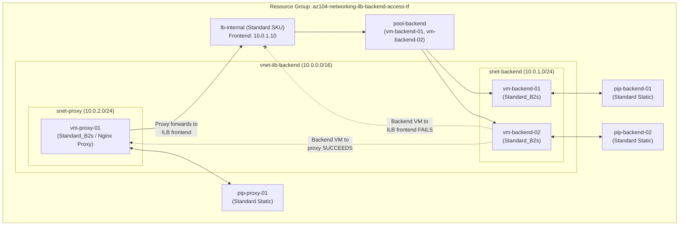
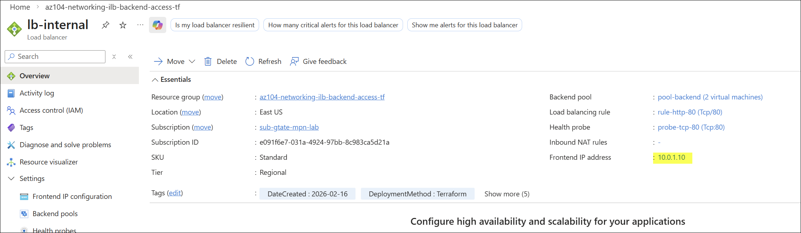
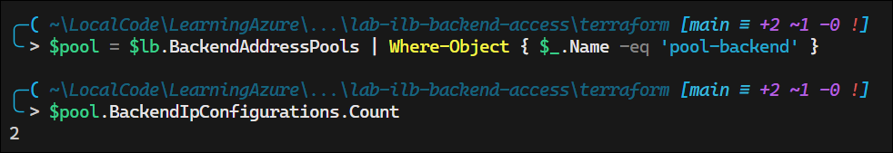
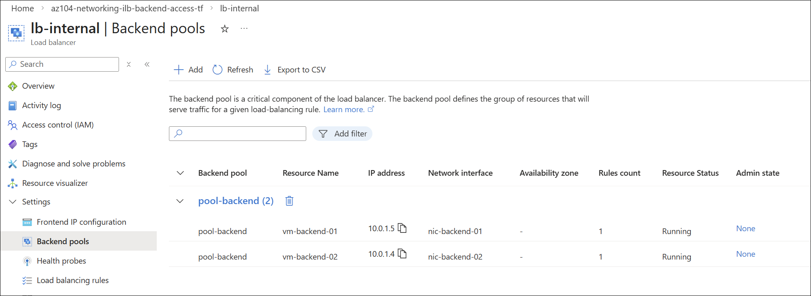
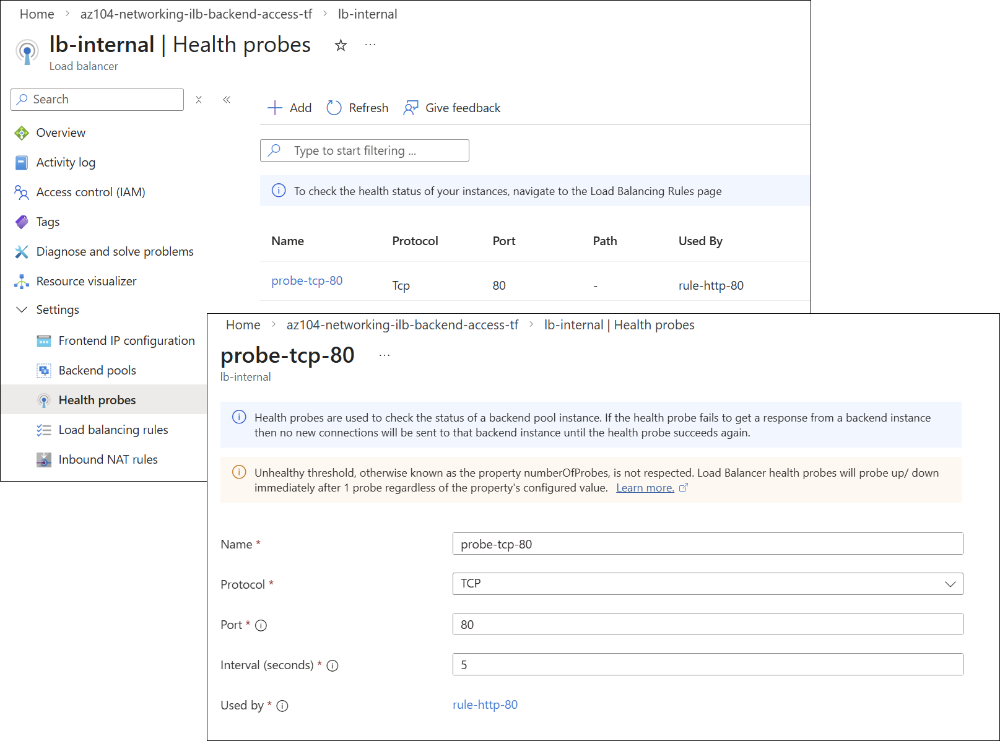
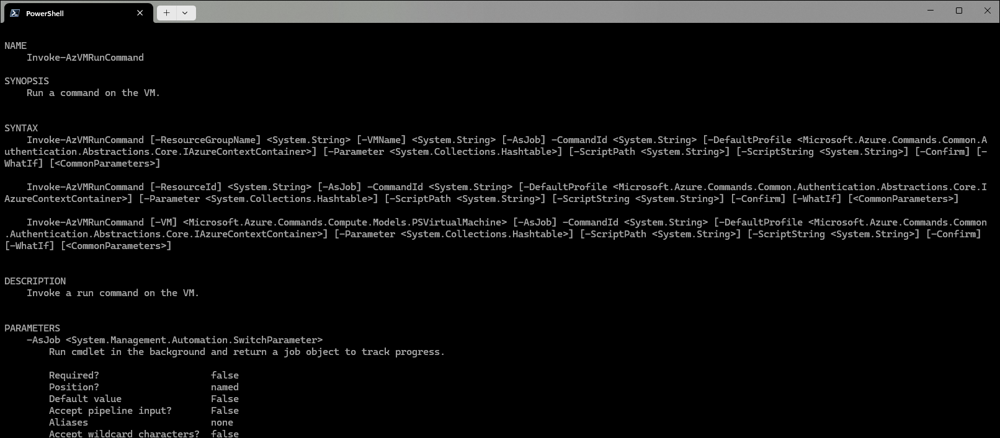

# Troubleshoot Internal Load Balancer Backend VM Access

## Exam Question Scenario

You are an Azure administrator at an independent software vendor. Your company is using an Azure internal load balancer that is configured inside an Azure virtual network (VNet).

Your virtual machines (VMs) comprising the backend pool VM behind the load balancer are listed as healthy and respond to the health probes. However, the backend VMs are not responding to traffic on the configured data port.

You diagnose and find that one of the participant backend VMs is trying to access the internal load balancer frontend, resulting in the failure of data flow.

You need to troubleshoot this issue.

Which two actions should you perform? Each correct answer presents a complete solution.

- A) Combine the Azure internal load balancer with a third-party proxy (e.g., Nginx).
- B) Use internal Application Gateway with HTTP/HTTPS.
- C) Configure separate backend pool VMs per application.
- D) Evaluate the network security groups (NSGs) configured on the backend VM, list them, and reconfigure the NSG rules on the backend VMs.

---

## Solution Architecture

This lab deploys an Internal Load Balancer environment that demonstrates the **hairpin/loopback limitation** — a backend pool member VM cannot access its own ILB's frontend IP. The architecture includes:

- **Two Linux backend VMs** (`vm-backend-01`, `vm-backend-02`) running Nginx web servers in the ILB backend pool
- **Internal Standard Load Balancer** (`lb-internal`) with a private static frontend IP (`10.0.1.10`) on the backend subnet
- **Nginx reverse proxy VM** (`vm-proxy-01`) on a separate subnet, forwarding requests to the ILB frontend — demonstrating the proxy-based solution
- **Health probe** (TCP port 80) confirming backend VMs are healthy

The lab validates that a backend pool member **cannot** reach the ILB frontend directly (hairpin failure), but **can** reach it through an intermediary proxy VM that is not in the backend pool.

### Architecture Diagram



## Lab Objectives

1. Deploy an Internal Standard Load Balancer with a private frontend IP and healthy backend pool
2. Demonstrate the hairpin/loopback failure when a backend VM accesses its own ILB frontend
3. Deploy a Nginx reverse proxy VM as the documented solution to bypass the hairpin limitation
4. Validate that non-pool VMs can access the ILB frontend directly (proving the ILB itself works)
5. Understand why NSG reconfiguration and separate backend pools do not resolve the issue

## Lab Structure

```
lab-ilb-backend-access/
├── README.md
├── terraform/
│   ├── main.tf              # Module orchestration and resource group
│   ├── variables.tf          # Input variable declarations
│   ├── outputs.tf            # Root output values
│   ├── providers.tf          # Provider and version configuration
│   ├── terraform.tfvars      # Lab-specific variable values
│   └── modules/
│       ├── networking/       # VNet, Subnets, NSGs, Public IPs
│       ├── loadbalancer/     # Internal LB, pool, probe, rule
│       └── compute/          # Backend VMs, Proxy VM, NICs, pool associations
└── validation/
    └── test-ilb-backend-access.ps1
```

## Prerequisites

- Azure subscription with Contributor access
- [Azure CLI](https://learn.microsoft.com/en-us/cli/azure/install-azure-cli) or [Azure PowerShell](https://learn.microsoft.com/en-us/powershell/azure/install-azure-powershell) installed
- [Terraform >= 1.0](https://developer.hashicorp.com/terraform/downloads) installed
- Connected to lab subscription (`e091f6e7-031a-4924-97bb-8c983ca5d21a`)

## Deployment

```powershell
# Switch to lab subscription context
Use-AzProfile Lab

# Navigate to the terraform directory
cd AZ-104/hands-on-labs/networking/lab-ilb-backend-access/terraform

# Initialize, plan, and apply
terraform init
terraform plan
terraform apply -auto-approve
```

## Testing the Solution

After deployment, validate the architecture and demonstrate the hairpin limitation:

```powershell
# 1. Verify Internal LB exists with correct frontend IP
$lb = Get-AzLoadBalancer -Name 'lb-internal' -ResourceGroupName 'az104-networking-ilb-backend-access-tf'
$lb.FrontendIpConfigurations[0].PrivateIpAddress  # Should be 10.0.1.10
```




```powershell
# 2. Verify backend pool has 2 VMs
$pool = $lb.BackendAddressPools | Where-Object { $_.Name -eq 'pool-backend' }
$pool.BackendIpConfigurations.Count  # Should be 2
```





```powershell
# 3. Verify health probe is configured for TCP:80
$lb.Probes[0] | Select-Object Name, Protocol, Port
```




```powershell
# 4. Test hairpin failure: backend VM cannot reach ILB frontend
Invoke-AzVMRunCommand `
    -ResourceGroupName 'az104-networking-ilb-backend-access-tf' `
    -VMName 'vm-backend-01' `
    -CommandId 'RunShellScript' `
    -ScriptString 'curl -s --connect-timeout 5 --max-time 10 http://10.0.1.10 2>&1 || echo "HAIRPIN_FAILED"'
# Expected: timeout or connection failure
```



```powershell
# 5. Test proxy solution: backend VM reaches content via proxy
Invoke-AzVMRunCommand `
    -ResourceGroupName 'az104-networking-ilb-backend-access-tf' `
    -VMName 'vm-backend-01' `
    -CommandId 'RunShellScript' `
    -ScriptString 'curl -s --connect-timeout 5 --max-time 10 http://10.0.2.10 2>&1'
# Expected: "Hello from vm-backend-01" or "Hello from vm-backend-02"
```

```powershell
# 6. Control test: non-pool VM can access ILB frontend directly
Invoke-AzVMRunCommand `
    -ResourceGroupName 'az104-networking-ilb-backend-access-tf' `
    -VMName 'vm-proxy-01' `
    -CommandId 'RunShellScript' `
    -ScriptString 'curl -s --connect-timeout 5 --max-time 10 http://10.0.1.10 2>&1'
# Expected: "Hello from vm-backend-01" or "Hello from vm-backend-02"
```

```powershell
# 7. Run the full validation script
cd AZ-104/hands-on-labs/networking/lab-ilb-backend-access/validation
.\test-ilb-backend-access.ps1
```

## Cleanup

```powershell
cd AZ-104/hands-on-labs/networking/lab-ilb-backend-access/terraform
terraform destroy -auto-approve
```

## Scenario Analysis

### Option A: "Combine the Azure internal load balancer with a third-party proxy (e.g., Nginx)" — **CORRECT** ✅

A reverse proxy (Nginx, HAProxy, etc.) placed **outside** the ILB backend pool acts as an intermediary. The backend VM connects to the proxy, which makes its own independent connection to the ILB frontend. Since the proxy is not a backend pool member, the Azure network fabric handles the request/response flow correctly — no hairpin occurs.

**How it works:**

1. Backend VM sends request to proxy VM (10.0.2.10)
2. Proxy VM opens a new connection to ILB frontend (10.0.1.10)
3. ILB distributes to a backend VM normally
4. Backend VM responds to proxy
5. Proxy relays response back to the requesting backend VM

### Option B: "Use internal Application Gateway with HTTP/HTTPS" — **CORRECT** ✅

Azure Application Gateway is a Layer 7 (HTTP/HTTPS) load balancer that operates as a **full reverse proxy**. Unlike the Azure Load Balancer (Layer 4, DSR-based), Application Gateway terminates incoming connections and creates new backend connections. This architectural difference eliminates the hairpin problem entirely.

Replacing the Internal Load Balancer with an Internal Application Gateway provides:

- Full proxy behavior (no Direct Server Return)
- Backend VMs can safely access the App Gateway frontend
- Built-in WAF, SSL termination, and URL-based routing capabilities
- Native Azure solution without third-party dependencies

### Option C: "Configure separate backend pool VMs per application" — **INCORRECT** ❌

Separating VMs into different backend pools does not resolve the fundamental issue. The hairpin/loopback limitation applies to **any** backend pool member attempting to access **any** frontend IP of its own Internal Load Balancer. Even if the VMs are in separate pools, they are still members of the same ILB, and the Azure network fabric cannot properly route traffic from a pool member back through the same load balancer's frontend.

### Option D: "Evaluate NSGs and reconfigure NSG rules on the backend VMs" — **INCORRECT** ❌

NSGs (Network Security Groups) control network traffic at the IP/port level. The hairpin issue is not caused by NSG rules blocking traffic — it is a fundamental limitation of how Azure's Software Defined Networking fabric handles traffic flows between backend pool members and their own load balancer frontend. Reconfiguring NSG rules cannot fix an asymmetric routing problem at the SDN layer.

The scenario confirms this is not an NSG issue: the VMs are listed as healthy and respond to health probes, meaning the NSGs already allow the required traffic on port 80.

## Key Learning Points

1. **ILB hairpin is unsupported** — A backend pool member VM cannot access its own Internal Load Balancer's frontend IP; Azure's SDN fabric cannot properly handle this traffic flow
2. **Proxy tier bypasses the limitation** — Placing a reverse proxy (Nginx, HAProxy) outside the backend pool creates an intermediary that can access the ILB normally
3. **Application Gateway is the Azure-native solution** — As a Layer 7 full proxy, App Gateway does not suffer from the DSR-based hairpin issue that affects Azure Load Balancer
4. **Healthy probes ≠ working data flow** — VMs can pass health probes while still experiencing data plane failures due to architectural limitations like hairpin routing
5. **Standard ILB has no default outbound** — Unlike Basic LB, Standard ILB does not provide implicit outbound connectivity; backend VMs need instance-level PIPs or NAT Gateway for internet access
6. **NSGs don't control SDN-level routing** — NSG rules operate at the packet filtering level and cannot influence Azure's internal load balancer traffic routing behavior
7. **Separate pools don't fix hairpin** — The limitation is tied to membership in any pool of the same ILB, not to a specific pool configuration
8. **Non-pool VMs confirm ILB works** — Testing from a VM outside the backend pool proves the ILB is functioning correctly and isolates the hairpin as the root cause

## Related AZ-104 Exam Objectives

- **Configure and manage virtual networking (25–30%)**
  - Configure load balancing
  - Configure Azure Load Balancer
  - Troubleshoot load balancing
  - Configure Azure Application Gateway

## Additional Resources

- [Troubleshoot Azure Load Balancer backend traffic responses](https://learn.microsoft.com/en-us/azure/load-balancer/load-balancer-troubleshoot-backend-traffic)
- [Azure Load Balancer components](https://learn.microsoft.com/en-us/azure/load-balancer/components)
- [Azure Application Gateway overview](https://learn.microsoft.com/en-us/azure/application-gateway/overview)
- [Outbound connections in Azure](https://learn.microsoft.com/en-us/azure/load-balancer/load-balancer-outbound-connections)
- [Azure Load Balancer SKU comparison](https://learn.microsoft.com/en-us/azure/load-balancer/skus)

## Related Labs

- [Configure Standard Load Balancer Outbound Traffic and IP Allocation](../lab-slb-outbound-traffic/) — Covers Standard public Load Balancer outbound rules, SNAT behavior, and multi-frontend IP allocation
