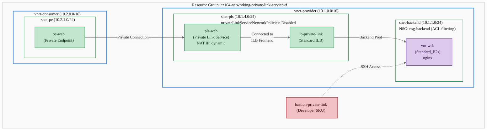
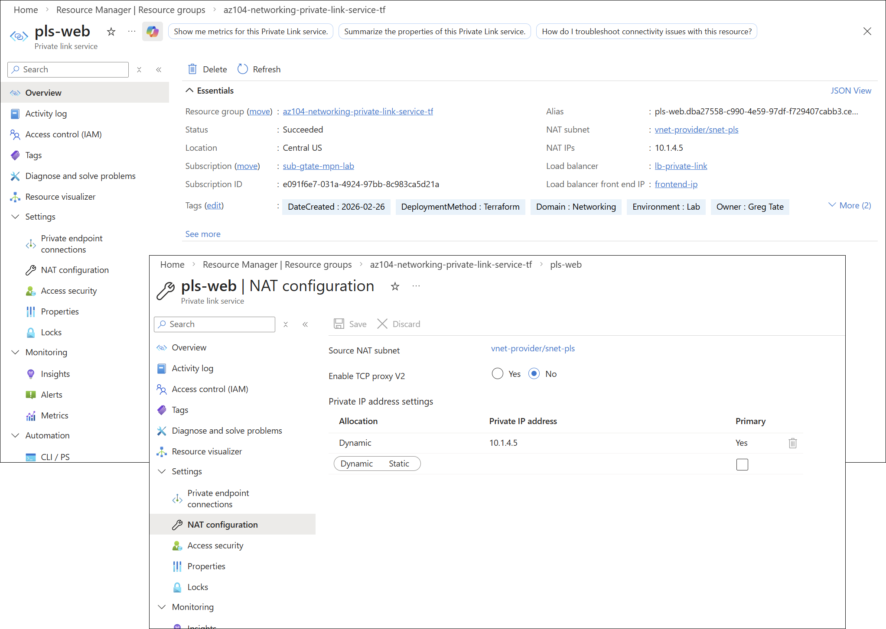
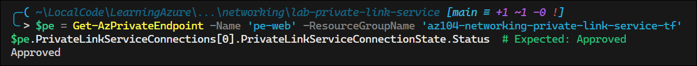
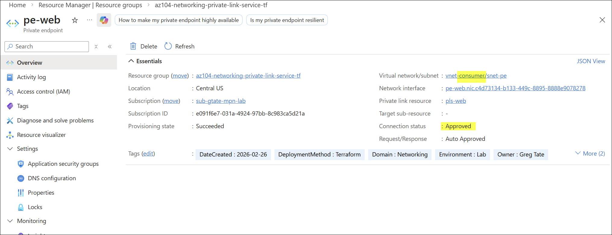
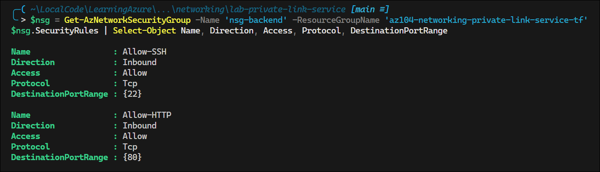
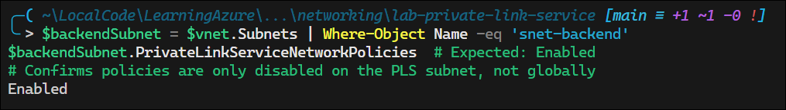
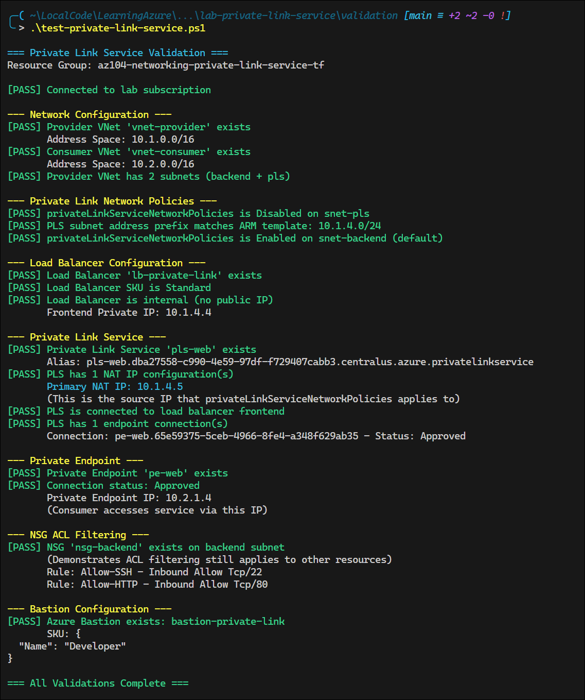

# Azure Private Link Service Network Policies

## Exam Question Scenario

You are an Azure administrator for an e-commerce company. Your organization wants to access Azure SQL Database services and Azure-hosted customer-owned resources over a private endpoint in your virtual network (VNet).

You use Azure Private Link service to achieve the desired outcome.

You need to select a source IP address for your Azure Private Link service.

You have created the following JSON code in order to use an Azure Resource Manager (ARM) template:

```json
{
    "name": "orgvirtualN",
    "type": "Microsoft.Network/virtualNetworks",
    "apiVersion": "2023-02-01",
    "location": "EastUS",
    "properties": {
        "addressSpace": {
            "addressPrefixes": [
                "10.1.0.0/16"
            ]
        },
        "subnets": [
            {
                "name": "default",
                "properties": {
                    "addressPrefix": "10.1.4.0/24",
                    "privateLinkServiceNetworkPolicies": "Disabled"
                }
            }
        ]
    }
}
```

For each of the following statements, select Yes if the statement is true. Otherwise, select No.

| Statement | Yes | No |
|-----------|-----|----|
| The "privateLinkServiceNetworkPolicies": "Disabled" setting is only applicable for the specific private IP address you select as the source IP of the Private Link service. | ☐ | ☐ |
| The "privateLinkServiceNetworkPolicies": "Disabled" setting is configured automatically if you are using Azure portal to create a Private Link service. | ☐ | ☐ |
| For other resources in the subnet, network traffic is filtered by Access Control Lists (ACL). | ☐ | ☐ |

---

## Solution Architecture

This lab deploys a complete Private Link Service environment that demonstrates how `privateLinkServiceNetworkPolicies` works on subnets, how source NAT IPs are selected, and how ACL filtering applies to other resources in the subnet. The architecture includes:

- **Provider VNet** (`vnet-provider`, 10.1.0.0/16) with two subnets:
  - `snet-backend` (10.1.1.0/24) — hosts the backend VM with NSG (ACL) filtering
  - `snet-pls` (10.1.4.0/24) — hosts the ILB frontend and PLS NAT IP, with `privateLinkServiceNetworkPolicies` disabled
- **Standard Internal Load Balancer** (`lb-private-link`) with frontend IP in the PLS subnet
- **Linux VM** (`vm-web`) running nginx behind the ILB as the backend service
- **Private Link Service** (`pls-web`) connected to the ILB frontend, with NAT IP sourced from the PLS subnet
- **Consumer VNet** (`vnet-consumer`, 10.2.0.0/16) with a Private Endpoint (`pe-web`) connecting to the PLS
- **NSG** (`nsg-backend`) on the backend subnet demonstrating that ACL filtering still applies to non-PLS resources
- **Azure Bastion** (Developer SKU) for secure VM access

### Architecture Diagram



## Lab Objectives

1. Deploy a Private Link Service with a Standard Internal Load Balancer and understand the subnet network policy requirement
2. Observe how `privateLinkServiceNetworkPolicies: Disabled` applies only to the PLS source NAT IP, not to all resources in the subnet
3. Verify that NSG (ACL) filtering continues to apply to other resources in the same VNet
4. Create a consumer Private Endpoint and validate cross-VNet private connectivity through Private Link
5. Understand how the Azure portal automatically configures subnet network policies when creating a Private Link Service

## Lab Structure

```
lab-private-link-service/
├── README.md
├── terraform/
│   ├── main.tf              # Module orchestration and resource group
│   ├── variables.tf          # Input variable declarations
│   ├── outputs.tf            # Root output values
│   ├── providers.tf          # Provider and version configuration
│   ├── terraform.tfvars      # Lab-specific variable values
│   └── modules/
│       ├── networking/       # Provider VNet, Consumer VNet, subnets, NSG
│       ├── loadbalancer/     # Standard Internal Load Balancer
│       ├── compute/          # Linux VM, Bastion Developer SKU
│       └── private-link/     # Private Link Service, Private Endpoint
└── validation/
    └── test-private-link-service.ps1
```

## Prerequisites

- Azure subscription with Contributor access
- [Azure CLI](https://learn.microsoft.com/en-us/cli/azure/install-azure-cli) or [Azure PowerShell](https://learn.microsoft.com/en-us/powershell/azure/install-azure-powershell) installed
- [Terraform >= 1.0](https://developer.hashicorp.com/terraform/downloads) installed
- Connected to lab subscription (`e091f6e7-031a-4924-97bb-8c983ca5d21a`)

## Deployment

```powershell
# Switch to lab subscription context
Use-AzProfile Lab

# Navigate to the terraform directory
cd AZ-104/hands-on-labs/networking/lab-private-link-service/terraform

# Initialize, plan, and apply
terraform init
terraform plan
terraform apply -auto-approve
```


## Testing the Solution

After deployment, validate the architecture matches the exam scenario:

```powershell
# 1. Verify the PLS subnet has privateLinkServiceNetworkPolicies disabled
$vnet = Get-AzVirtualNetwork -Name 'vnet-provider' -ResourceGroupName 'az104-networking-private-link-service-tf'
$plsSubnet = $vnet.Subnets | Where-Object Name -eq 'snet-pls'
$plsSubnet.PrivateLinkServiceNetworkPolicies  # Expected: Disabled
```

<!-- Screenshot -->


> The setting shown below refers to Private Endpoint policy, which is distinct from `privateLinkServiceNetworkPolicies`. The portal does not expose a setting for PLS network policies because it automatically disables it when creating the PLS.


```powershell
# 2. Verify the Private Link Service exists and show its NAT IP (source IP)
$pls = Get-AzPrivateLinkService -Name 'pls-web' -ResourceGroupName 'az104-networking-private-link-service-tf'
Get-AzNetworkInterface -ResourceId $pls.NetworkInterfaces[0].Id |
    Select-Object -ExpandProperty IpConfigurations |
    Select-Object Name, PrivateIpAddress, Primary, PrivateIpAllocationMethod
# The NAT IP is the specific IP that the disabled network policy applies to
```

<!-- Screenshot -->




```powershell
# 3. Verify the PLS is connected to the Standard Internal Load Balancer
$pls.LoadBalancerFrontendIpConfigurations | Select-Object Id
```

<!-- Screenshot -->


```powershell
# 4. Verify the Private Endpoint exists and its connection is approved
$pe = Get-AzPrivateEndpoint -Name 'pe-web' -ResourceGroupName 'az104-networking-private-link-service-tf'
$pe.PrivateLinkServiceConnections[0].PrivateLinkServiceConnectionState.Status  # Expected: Approved
```

<!-- Screenshot -->




```powershell
# 5. Get the Private Endpoint's private IP (consumer access point)
$peNic = Get-AzNetworkInterface -ResourceId $pe.NetworkInterfaces[0].Id
$peNic.IpConfigurations[0].PrivateIpAddress  # IP in consumer VNet (10.2.1.x)
```

<!-- Screenshot -->


```powershell
# 6. Verify NSG (ACL) filtering is active on the backend subnet
$nsg = Get-AzNetworkSecurityGroup -Name 'nsg-backend' -ResourceGroupName 'az104-networking-private-link-service-tf'
$nsg.SecurityRules | Select-Object Name, Direction, Access, Protocol, DestinationPortRange
# NSG rules apply to other resources — ACL filtering is NOT bypassed
```

<!-- Screenshot -->


```powershell
# 7. Verify the backend subnet still has default network policies enabled
$backendSubnet = $vnet.Subnets | Where-Object Name -eq 'snet-backend'
$backendSubnet.PrivateLinkServiceNetworkPolicies  # Expected: Enabled
# Confirms policies are only disabled on the PLS subnet, not globally
```

<!-- Screenshot -->


```powershell
# 8. Run the full validation script
.\validation\test-private-link-service.ps1
```

<!-- Screenshot -->



## Cleanup

```powershell
cd AZ-104/hands-on-labs/networking/lab-private-link-service/terraform
terraform destroy -auto-approve
```

## Scenario Analysis

### Statement 1: "The privateLinkServiceNetworkPolicies: Disabled setting is only applicable for the specific private IP address you select as the source IP of the Private Link service" — **YES**

When `privateLinkServiceNetworkPolicies` is set to `Disabled` on a subnet, it **only** bypasses network security group (NSG) rules for the **specific Private Link Service NAT IP address** — the source IP you select for the PLS. This is by design: the PLS source NAT IP needs to bypass NSG filtering so that Private Link traffic can flow from the consumer through the PLS to the backend load balancer without being blocked.

All other IP addresses in the subnet continue to be subject to normal NSG rules. The policy disable is surgically targeted at the PLS source IP, not a blanket exemption for the entire subnet.

### Statement 2: "The privateLinkServiceNetworkPolicies: Disabled setting is configured automatically if you are using Azure portal to create a Private Link service" — **YES**

When creating a Private Link Service through the Azure portal, the portal **automatically disables** `privateLinkServiceNetworkPolicies` on the selected subnet. This is a convenience feature — the portal detects that the subnet needs this setting for PLS deployment and configures it without requiring manual intervention.

However, when deploying via ARM templates, Terraform, Bicep, or Azure CLI, you **must explicitly set** this property to `Disabled` (or `false`) before creating the Private Link Service. The ARM template in the exam question correctly includes this setting, which would be necessary for a non-portal deployment.

### Statement 3: "For other resources in the subnet, network traffic is filtered by Access Control Lists (ACL)" — **YES**

Disabling `privateLinkServiceNetworkPolicies` does **not** exempt the entire subnet from network security filtering. Only the PLS source NAT IP bypasses NSG rules. All other resources deployed in the subnet — VMs, NICs, other services — continue to have their network traffic filtered by NSGs (Access Control Lists).

This is demonstrated in the lab by the `nsg-backend` security group on the backend subnet: the NSG rules (Allow-HTTP, Allow-SSH) continue to filter traffic for the VM, even though the PLS subnet in the same VNet has network policies disabled. The policy disable is scoped exclusively to Private Link Service source IPs.

## Key Learning Points

1. **`privateLinkServiceNetworkPolicies` is subnet-level** — The setting is configured per subnet, not per VNet or per resource. Only subnets hosting PLS NAT IPs need it disabled.
2. **Policy disable targets only PLS source NAT IPs** — When disabled, NSG bypass applies only to the specific private IP selected as the PLS source IP, not to all resources in the subnet.
3. **Azure portal auto-configures the setting** — The portal automatically disables network policies on the subnet when creating a Private Link Service, but CLI/ARM/Terraform/Bicep deployments require explicit configuration.
4. **Other resources retain ACL filtering** — VMs, NICs, and other resources in the subnet (or other subnets) continue to have traffic filtered by NSGs regardless of the PLS policy setting.
5. **Standard ILB is required** — Private Link Service requires a Standard SKU Internal Load Balancer; Basic SKU and public load balancers are not supported.
6. **PLS NAT IP and ILB frontend can share a subnet** — The PLS NAT IP and the ILB frontend IP configuration can reside in the same subnet, which must have `privateLinkServiceNetworkPolicies` disabled.
7. **Private Endpoint provides cross-VNet access** — Consumers in a different VNet (or subscription/tenant) connect to the PLS through a Private Endpoint, receiving a private IP in their own address space.
8. **There is a separate `privateEndpointNetworkPolicies` setting** — Do not confuse `privateLinkServiceNetworkPolicies` (for PLS provider side) with `privateEndpointNetworkPolicies` (for PE consumer side). They control different features.

## Related AZ-104 Exam Objectives

- **Configure and manage virtual networking (25–30%)**
  - Configure private access to Azure services
  - Configure Azure Private Link and Private Endpoints
  - Configure network security groups (NSGs)

## Additional Resources

- [What is Azure Private Link service?](https://learn.microsoft.com/en-us/azure/private-link/private-link-service-overview)
- [Disable network policies for Private Link Service source IP](https://learn.microsoft.com/en-us/azure/private-link/disable-private-link-service-network-policy)
- [What is Azure Private Endpoint?](https://learn.microsoft.com/en-us/azure/private-link/private-endpoint-overview)
- [Manage network policies for private endpoints](https://learn.microsoft.com/en-us/azure/private-link/disable-private-endpoint-network-policy)
- [Create a Private Link Service — Azure portal](https://learn.microsoft.com/en-us/azure/private-link/create-private-link-service-portal)
- [Tutorial: Create a Private Link Service using Terraform](https://learn.microsoft.com/en-us/azure/private-link/create-private-link-service-terraform)

## Related Labs

▶ Related Lab: [lab-vnet-peering](../lab-vnet-peering/README.md) - Configure VNet peering for cross-network connectivity
