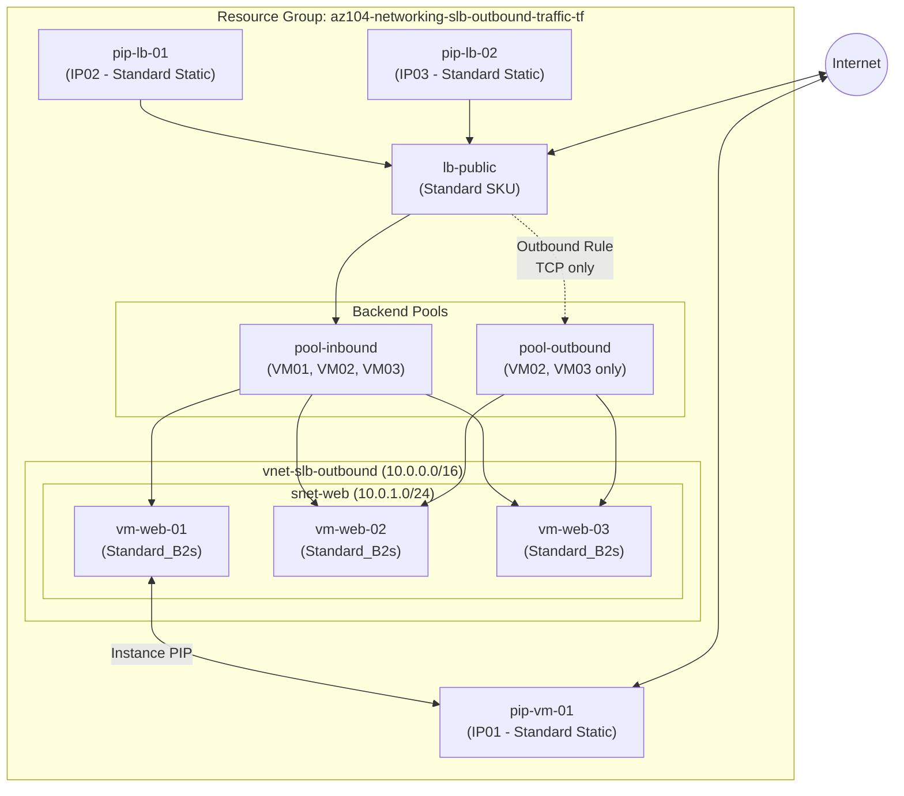
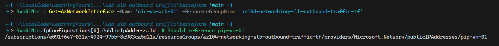
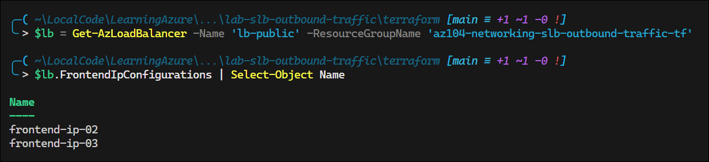
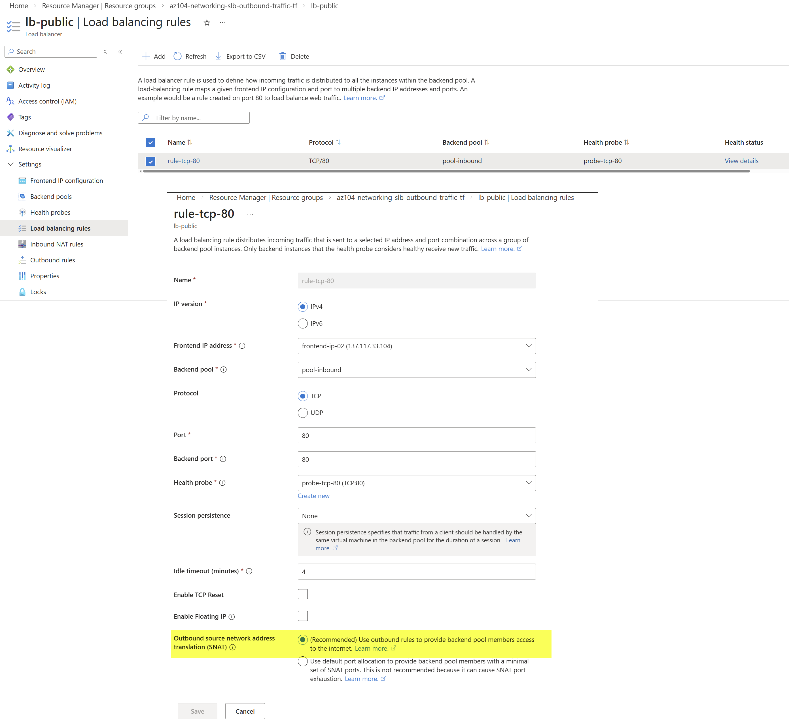
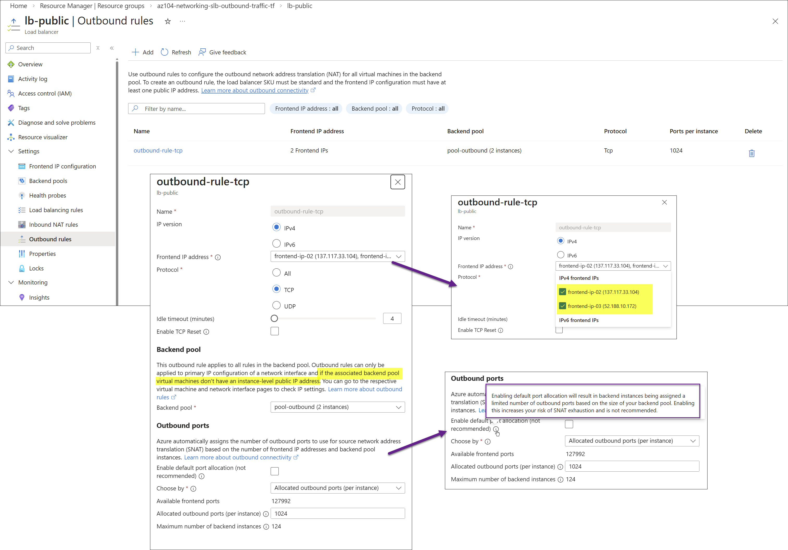
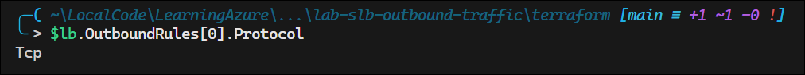

# Configure Standard Load Balancer Outbound Traffic and IP Allocation

## Exam Question Scenario

You deploy three Windows virtual machines (VMs) named VM01, VM02, and VM03 that host the front-end layer of a web application. You configure a Standard Load Balancer named LB01. VM01, VM02, and VM03 are configured as part of the backend pool for LB01. You configure a load balancing rule for Transmission Control Protocol (TCP) traffic only.

You also configure three public static IP addresses named IP01, IP02, and IP03 which are assigned as follows:

- IP01 is assigned to VM01.
- IP02 and IP03 are assigned to LB01.

For each of the following statements, select Yes if the statement is true. Otherwise, select No.

| Statement | Yes | No |
|-----------|-----|----|
| Outbound flow on VM01 will always use IP02. | | |
| Outbound flow on LB01 uses IP02 and IP03 at the same time. | | |
| Outbound flow on VM03 will use IP02 or IP03 for User Datagram Protocol (UDP) traffic. | | |

---

## Solution Architecture

This lab deploys a Standard Load Balancer environment that demonstrates how outbound traffic and IP allocation work with Azure Standard Load Balancers. The architecture includes:

- **Three Windows VMs** (`vm-web-01`, `vm-web-02`, `vm-web-03`) hosting IIS in a single subnet
- **Standard Load Balancer** (`lb-public`) with two frontend IPs (IP02, IP03) and a TCP-only load balancing rule
- **Instance-level public IP** (`pip-vm-01` / IP01) assigned directly to VM01's NIC
- **Split backend pools**: An inbound pool (all 3 VMs) and a separate outbound pool (VM02 and VM03 only)
- **Outbound rule** configured for TCP protocol only, using both frontend IPs (IP02 and IP03)

Standard SKU is required for both the Load Balancer and all Public IPs (Basic SKU public IPs are incompatible with Standard Load Balancers). The outbound rule uses TCP only, matching the load balancing rule protocol, to demonstrate how protocol-specific rules affect outbound connectivity.

### Architecture Diagram



## Lab Objectives

1. Deploy a Standard Load Balancer with multiple frontend IP configurations and split backend pools
2. Understand how instance-level public IPs affect outbound traffic for VMs behind a load balancer
3. Observe how outbound rules distribute SNAT across multiple frontend IPs
4. Verify that protocol-specific rules (TCP only) do not provide outbound connectivity for other protocols (UDP)
5. Practice the critical pattern of disabling outbound SNAT on LB rules when outbound rules share the same frontend IP

## Lab Structure

```
lab-slb-outbound-traffic/
├── README.md
├── terraform/
│   ├── main.tf              # Module orchestration and resource group
│   ├── variables.tf          # Input variable declarations
│   ├── outputs.tf            # Root output values
│   ├── providers.tf          # Provider and version configuration
│   ├── terraform.tfvars      # Lab-specific variable values
│   └── modules/
│       ├── networking/       # VNet, Subnet, NSG, Public IPs
│       ├── loadbalancer/     # LB, pools, probes, rules
│       └── compute/          # VMs, NICs, pool associations
└── validation/
    └── test-outbound-traffic.ps1
```

## Prerequisites

- Azure subscription with Contributor access
- [Azure CLI](https://learn.microsoft.com/en-us/cli/azure/install-azure-cli) or [Azure PowerShell](https://learn.microsoft.com/en-us/powershell/azure/install-azure-powershell) installed
- [Terraform >= 1.0](https://developer.hashicorp.com/terraform/downloads) installed
- Connected to lab subscription (`e091f6e7-031a-4924-97bb-8c983ca5d21a`)

## Deployment

```powershell
# Switch to lab subscription context
Use-AzProfile Lab

# Navigate to the terraform directory
cd AZ-104/hands-on-labs/networking/lab-slb-outbound-traffic/terraform

# Initialize, plan, and apply
terraform init
terraform plan
terraform apply -auto-approve
```

## Testing the Solution

After deployment, validate the architecture matches the exam scenario:

```powershell
# 1. Verify VM01 has an instance-level public IP (IP01)
$vm01Nic = Get-AzNetworkInterface -Name 'nic-vm-web-01' -ResourceGroupName 'az104-networking-slb-outbound-traffic-tf'
$vm01Nic.IpConfigurations[0].PublicIpAddress.Id  # Should reference pip-vm-01
```



```powershell
# 2. Verify LB has two frontend IP configurations (IP02, IP03)
$lb = Get-AzLoadBalancer -Name 'lb-public' -ResourceGroupName 'az104-networking-slb-outbound-traffic-tf'
$lb.FrontendIpConfigurations | Select-Object Name  # Should show frontend-ip-02 and frontend-ip-03
```



```powershell
# 3. Verify inbound pool has all 3 VMs
$inboundPool = $lb.BackendAddressPools | Where-Object { $_.Name -eq 'pool-inbound' }
$inboundPool.BackendIpConfigurations.Count  # Should be 3
```


```powershell
# 4. Verify outbound pool has only VM02 and VM03 (not VM01)
$outboundPool = $lb.BackendAddressPools | Where-Object { $_.Name -eq 'pool-outbound' }
$outboundPool.BackendIpConfigurations.Count  # Should be 2
```


```powershell
# 5. Verify LB rule has disable_outbound_snat = true
$lb.LoadBalancingRules[0].DisableOutboundSnat  # Should be True
```


> **Note – Load Balancer Rule SNAT vs Outbound Rule SNAT**
>
> In a Standard Azure Load Balancer, outbound SNAT can be configured in two places (see below):
>
> * **Load balancing rule (implicit SNAT)**
>   When enabled, the frontend IP of the load balancing rule is used to provide outbound internet access for the backend pool. This method uses default port allocation and offers limited control. It is primarily intended for simple scenarios and is not recommended for controlled outbound connectivity.
>
> * **Outbound rule (explicit SNAT)**
>   This is the recommended approach for managing outbound traffic. It allows you to:
>
>   * Select specific frontend IPs for egress
>   * Control SNAT port allocation per instance
>   * Configure idle timeout and TCP reset behavior
>   * Scale outbound capacity more predictably
>
> When both a load balancing rule and an outbound rule exist, disable outbound SNAT on the load balancing rule to avoid conflicts and ensure that the outbound rule exclusively controls egress behavior.





```powershell
# 6. Verify outbound rule protocol is TCP only
$lb.OutboundRules[0].Protocol  # Should be Tcp
```



```powershell
# 7. Verify outbound rule uses both frontend IPs
$lb.OutboundRules[0].FrontendIpConfigurations.Count  # Should be 2
```


```powershell
# 8. Get all public IP addresses for reference
Get-AzPublicIpAddress -ResourceGroupName 'az104-networking-slb-outbound-traffic-tf' |
    Select-Object Name, IpAddress
```


To test actual outbound behavior, RDP into each VM and check the outbound IP:

```powershell
# From within VM01 (should show IP01 / pip-vm-01 address)
Invoke-RestMethod -Uri 'https://api.ipify.org'

# From within VM02 or VM03 (should show IP02 or IP03 for TCP connections)
# TCP test - will use outbound rule IPs
Invoke-WebRequest -Uri 'https://api.ipify.org' -UseBasicParsing

# UDP test from VM02/VM03 - will fail (no outbound rule for UDP)
# Standard LB blocks outbound for protocols not covered by rules
```

## Cleanup

```powershell
cd AZ-104/hands-on-labs/networking/lab-slb-outbound-traffic/terraform
terraform destroy -auto-approve
```

## Scenario Analysis

### Statement 1: "Outbound flow on VM01 will always use IP02" — **NO**

VM01 has an **instance-level public IP** (IP01) assigned directly to its NIC. When a VM has both an instance-level public IP and membership in a Standard Load Balancer backend pool, the instance-level public IP takes precedence for **all outbound flows**. VM01 will always use IP01 (not IP02) for outbound traffic, regardless of the load balancer configuration.

This is a key Azure networking principle: instance-level public IPs override load balancer frontend IPs for outbound SNAT.

### Statement 2: "Outbound flow on LB01 uses IP02 and IP03 at the same time" — **YES**

When a Standard Load Balancer has an outbound rule configured with **multiple frontend IP configurations**, Azure allocates SNAT ports from **all** specified frontend IPs simultaneously. Both IP02 and IP03 are used concurrently for outbound SNAT port allocation. Individual flows use a single IP, but the load balancer distributes SNAT ports across all available frontend IPs at the same time, providing a larger pool of outbound ports.

### Statement 3: "Outbound flow on VM03 will use IP02 or IP03 for UDP traffic" — **NO**

The load balancing rule is configured for **TCP traffic only**, and the outbound rule is also **TCP only**. Azure Standard Load Balancers provide outbound SNAT only for protocols explicitly covered by load balancing rules or outbound rules. Since no rule covers UDP, VM03 (which has no instance-level public IP) has **no outbound path for UDP traffic** through the load balancer. UDP outbound connections from VM03 will fail.

To enable UDP outbound, you would need to either:

- Add a separate outbound rule for UDP (or use protocol "All")
- Assign an instance-level public IP to VM03
- Configure a NAT Gateway on the subnet

## Key Learning Points

1. **Instance-level PIPs override LB frontend IPs** — A VM with its own public IP uses that IP for all outbound traffic, even if the VM is in a load balancer backend pool
2. **Standard LB requires explicit outbound configuration** — Unlike Basic LB, Standard LB does not provide default outbound access; you must configure outbound rules or instance-level PIPs
3. **Multiple frontend IPs increase SNAT capacity** — Outbound rules with multiple frontend IPs distribute SNAT ports across all IPs, providing more outbound connections
4. **Protocol-specific rules limit outbound** — A TCP-only outbound rule does not provide outbound connectivity for UDP or ICMP
5. **`disable_outbound_snat` is critical** — When a frontend IP is shared between a load balancing rule and an outbound rule, the LB rule must have outbound SNAT disabled to avoid SNAT port conflicts
6. **Split pools prevent deployment errors** — VMs with instance-level PIPs must be excluded from outbound-rule backend pools to avoid Azure configuration conflicts
7. **Standard SKU alignment is required** — Standard Load Balancers require Standard SKU public IPs; mixing SKUs causes deployment failure
8. **Outbound rule frontend IPs work together** — All frontend IPs in an outbound rule are used simultaneously, not in failover/priority order

## Related AZ-104 Exam Objectives

- **Configure and manage virtual networking (25–30%)**
  - Configure load balancing
  - Configure Azure Load Balancer
  - Configure load balancing rules
  - Configure outbound rules for Azure Load Balancer

## Additional Resources

- [Azure Load Balancer outbound connections](https://learn.microsoft.com/en-us/azure/load-balancer/load-balancer-outbound-connections)
- [Outbound rules for Azure Load Balancer](https://learn.microsoft.com/en-us/azure/load-balancer/outbound-rules)
- [Standard Load Balancer and Public IP addresses](https://learn.microsoft.com/en-us/azure/load-balancer/load-balancer-standard-overview)
- [Default outbound access in Azure](https://learn.microsoft.com/en-us/azure/virtual-network/ip-services/default-outbound-access)
- [SNAT for outbound connections](https://learn.microsoft.com/en-us/azure/load-balancer/load-balancer-outbound-connections#snat)

## Related Labs

No related labs currently exist in the networking domain.
