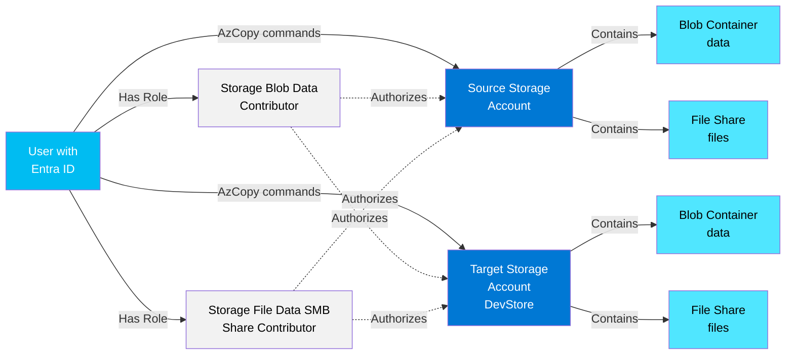

# Lab: AzCopy Authorization Methods for Azure Storage

## Exam Question Scenario

You create a new storage account named DevStore for Azure Blob Storage and Azure File Storage. You plan to use AzCopy to copy data from blob storage and file storage in other storage accounts to DevStore. You have access to the storage account access keys for the source storage accounts and for DevStore. You also have valid Microsoft Entra user accounts and shared access signatures (SAS) with access to the source data.

You need to identify the authorization methods you can use to copy the data to DevStore.

Your commands target only the file share or the account.

**Which authorization methods can you use to copy each storage type?**

- **Blob storage**: Microsoft Entra ID, access keys, and SAS
- **File storage**: Microsoft Entra ID only

## Scenario Analysis

This scenario tests your understanding of AzCopy authorization methods and their compatibility with different Azure Storage services:

1. **AzCopy** is a command-line utility for copying data to and from Azure Storage
2. **Authorization methods** vary by storage service type (Blob vs File)
3. **Blob Storage** supports multiple authorization methods:
   - Microsoft Entra ID (OAuth 2.0)
   - Storage account access keys
   - Shared Access Signatures (SAS)
4. **File Storage** has more limited authorization options when used with AzCopy:
   - Microsoft Entra ID only (when targeting file share or account)
   - Note: Access keys and SAS work for file storage, but NOT when commands target the file share or account level (as specified in the scenario)

## Solution Architecture

This lab deploys infrastructure to demonstrate and test all supported (and unsupported) AzCopy authorization methods with both Blob and File storage services.

### Architecture Diagram



### Resources Deployed

| Resource | Name | Purpose |
|----------|------|---------|
| Resource Group | `az104-storage-azcopy-auth-methods-bicep` | Container for all lab resources |
| Source Storage Account | `staz104azcopyauthsrc` | Source storage with sample data |
| Target Storage Account | `staz104azcopyauthtgt` | Target storage (DevStore equivalent) |
| Blob Containers | `data` (in both accounts) | Storage for blob data |
| File Shares | `files` (in both accounts) | Storage for file data |
| Role Assignments | Storage Blob Data Contributor | Enables Entra ID auth for blobs |
| Role Assignments | Storage File Data SMB Share Contributor | Enables Entra ID auth for files |

**Cost Optimization**: This lab uses cost-effective resources:

- Storage Accounts: Standard LRS (Locally Redundant Storage)
- File Shares: 5 GB quota (minimal allocation)
- No compute resources or premium storage tiers

## Prerequisites

- Azure CLI installed and authenticated
- Bicep CLI (installed automatically with Azure CLI)
- Azure subscription with appropriate permissions
- AzCopy installed ([Download AzCopy](https://aka.ms/downloadazcopy))
- PowerShell 7.0 or later

**CRITICAL**: Before executing ANY Azure CLI or Bicep commands, you MUST switch to the Lab Azure profile:

```powershell
Use-AzProfile Lab
```

This ensures all commands execute in the correct Lab subscription environment. The profile switch persists for the terminal session.

## Lab Objectives

1. Deploy storage accounts with both Blob and File storage services
2. Configure Microsoft Entra ID authorization using RBAC role assignments
3. Test AzCopy with Microsoft Entra ID authentication for blob storage
4. Test AzCopy with storage account keys for blob storage
5. Test AzCopy with SAS tokens for blob storage
6. Test AzCopy with Microsoft Entra ID authentication for file storage
7. Understand the limitations of authorization methods for file storage with AzCopy

## Deployment

### Bicep Deployment

1. **CRITICAL**: Switch to Lab Azure profile:

   ```powershell
   Use-AzProfile Lab
   ```

2. Navigate to the bicep directory:

   ```bash
   cd AZ-104/hands-on-labs/storage/lab-azcopy-auth-methods/bicep
   ```

3. **Update the parameter file** with your Microsoft Entra ID user object ID:

   ```powershell
   # Get your user object ID
   az ad signed-in-user show --query id -o tsv
   
   # Edit main.bicepparam and replace <YOUR_OBJECT_ID> with the actual value
   ```

4. Validate the Bicep template:

   ```powershell
   .\bicep.ps1 validate
   ```

5. Review the planned changes (what-if):

   ```powershell
   .\bicep.ps1 plan
   ```

6. Deploy the infrastructure:

   ```powershell
   .\bicep.ps1 apply
   ```

7. Wait for deployment to complete (approximately 2-3 minutes)

8. **Important**: After deployment, wait 5-10 minutes for role assignments to propagate before testing AzCopy commands with Microsoft Entra ID authentication.

## Validation Steps

### 1. Verify Resources Are Deployed

```powershell
# List resources in the resource group
az resource list --resource-group az104-storage-azcopy-auth-methods-bicep -o table

# Verify storage accounts
az storage account list --resource-group az104-storage-azcopy-auth-methods-bicep -o table

# Verify blob containers
az storage container list --account-name staz104azcopyauthsrc --auth-mode login -o table
az storage container list --account-name staz104azcopyauthtgt --auth-mode login -o table

# Verify file shares
az storage share list --account-name staz104azcopyauthsrc --auth-mode login -o table
az storage share list --account-name staz104azcopyauthtgt --auth-mode login -o table
```

### 2. Create Sample Test Data

```powershell
# Create a local test file
echo "This is test data for AzCopy authorization methods lab" > testfile.txt

# Upload test file to source blob container using Entra ID
az storage blob upload `
  --account-name staz104azcopyauthsrc `
  --container-name data `
  --name testfile.txt `
  --file testfile.txt `
  --auth-mode login

# Upload test file to source file share using Entra ID
az storage file upload `
  --account-name staz104azcopyauthsrc `
  --share-name files `
  --source testfile.txt `
  --path testfile.txt `
  --auth-mode login

# Verify uploads
az storage blob list --account-name staz104azcopyauthsrc --container-name data --auth-mode login -o table
az storage file list --account-name staz104azcopyauthsrc --share-name files --auth-mode login -o table
```

## Testing the Solution

### Test 1: Blob Storage with Microsoft Entra ID

**Expected Result**: ✅ SUCCESS

```powershell
# Login to Azure (if not already logged in)
azcopy login --tenant-id (az account show --query tenantId -o tsv)

# Copy blob using Microsoft Entra ID
azcopy copy `
  "https://staz104azcopyauthsrc.blob.core.windows.net/data/testfile.txt" `
  "https://staz104azcopyauthtgt.blob.core.windows.net/data/testfile-entra.txt"

# Verify the file was copied
az storage blob list --account-name staz104azcopyauthtgt --container-name data --auth-mode login -o table
```

### Test 2: Blob Storage with Access Keys

**Expected Result**: ✅ SUCCESS

```powershell
# Get source storage account key
$sourceKey = (az storage account keys list --account-name staz104azcopyauthsrc --query "[0].value" -o tsv)

# Get target storage account key
$targetKey = (az storage account keys list --account-name staz104azcopyauthtgt --query "[0].value" -o tsv)

# Copy blob using access keys
azcopy copy `
  "https://staz104azcopyauthsrc.blob.core.windows.net/data/testfile.txt?$sourceKey" `
  "https://staz104azcopyauthtgt.blob.core.windows.net/data/testfile-key.txt?$targetKey"

# Verify the file was copied
az storage blob list --account-name staz104azcopyauthtgt --container-name data --auth-mode login -o table
```

### Test 3: Blob Storage with SAS Token

**Expected Result**: ✅ SUCCESS

```powershell
# Generate SAS token for source container (valid for 1 hour)
$sourceSas = (az storage container generate-sas `
  --account-name staz104azcopyauthsrc `
  --name data `
  --permissions r `
  --expiry (Get-Date).AddHours(1).ToString("yyyy-MM-ddTHH:mm:ssZ") `
  --auth-mode key `
  --account-key $sourceKey `
  -o tsv)

# Generate SAS token for target container (valid for 1 hour)
$targetSas = (az storage container generate-sas `
  --account-name staz104azcopyauthtgt `
  --name data `
  --permissions w `
  --expiry (Get-Date).AddHours(1).ToString("yyyy-MM-ddTHH:mm:ssZ") `
  --auth-mode key `
  --account-key $targetKey `
  -o tsv)

# Copy blob using SAS tokens
azcopy copy `
  "https://staz104azcopyauthsrc.blob.core.windows.net/data/testfile.txt?$sourceSas" `
  "https://staz104azcopyauthtgt.blob.core.windows.net/data/testfile-sas.txt?$targetSas"

# Verify the file was copied
az storage blob list --account-name staz104azcopyauthtgt --container-name data --auth-mode login -o table
```

### Test 4: File Storage with Microsoft Entra ID

**Expected Result**: ✅ SUCCESS

```powershell
# Ensure you're logged in with AzCopy
azcopy login --tenant-id (az account show --query tenantId -o tsv)

# Copy file using Microsoft Entra ID
azcopy copy `
  "https://staz104azcopyauthsrc.file.core.windows.net/files/testfile.txt" `
  "https://staz104azcopyauthtgt.file.core.windows.net/files/testfile-entra.txt"

# Verify the file was copied
az storage file list --account-name staz104azcopyauthtgt --share-name files --auth-mode login -o table
```

### Test 5: File Storage with Access Keys (Target Account Level)

**Expected Result**: ❌ FAILURE - Access keys do not work for file share/account level operations in AzCopy

```powershell
# Attempt to copy file using access keys (targeting account)
# This will fail because the scenario specifies "commands target only the file share or the account"
azcopy copy `
  "https://staz104azcopyauthsrc.file.core.windows.net/files/testfile.txt?$sourceKey" `
  "https://staz104azcopyauthtgt.file.core.windows.net/files/testfile-key.txt?$targetKey"

# Expected error: Authentication method not supported for Azure Files when targeting share/account level
```

**Note**: Access keys DO work with Azure Files when using Azure Portal, Storage Explorer, or when mounting file shares. The limitation is specific to AzCopy when targeting the file share or account endpoints (as stated in the exam scenario).

### Test 6: File Storage with SAS Token (Target Account Level)

**Expected Result**: ❌ FAILURE - SAS tokens do not work for file share/account level operations in AzCopy (per the scenario constraints)

```powershell
# Generate SAS token for source file share
$sourceFileSas = (az storage share generate-sas `
  --account-name staz104azcopyauthsrc `
  --name files `
  --permissions r `
  --expiry (Get-Date).AddHours(1).ToString("yyyy-MM-ddTHH:mm:ssZ") `
  --account-key $sourceKey `
  -o tsv)

# Generate SAS token for target file share
$targetFileSas = (az storage share generate-sas `
  --account-name staz104azcopyauthtgt `
  --name files `
  --permissions w `
  --expiry (Get-Date).AddHours(1).ToString("yyyy-MM-ddTHH:mm:ssZ") `
  --account-key $targetKey `
  -o tsv)

# Attempt to copy file using SAS tokens (targeting account)
azcopy copy `
  "https://staz104azcopyauthsrc.file.core.windows.net/files/testfile.txt?$sourceFileSas" `
  "https://staz104azcopyauthtgt.file.core.windows.net/files/testfile-sas.txt?$targetFileSas"

# Expected error: Authentication method not supported for Azure Files when targeting share/account level
```

## Cleanup

### Bicep Cleanup

**CRITICAL**: Ensure you're using the Lab profile before cleanup:

```powershell
Use-AzProfile Lab
```

Remove all resources using the deployment stack:

```powershell
.\bicep.ps1 destroy
```

This will delete:

- The deployment stack
- The resource group
- All storage accounts and their contents
- All role assignments

## Key Learning Points

1. **AzCopy Authorization Flexibility**: AzCopy supports multiple authorization methods, but compatibility varies by service type

2. **Blob Storage Authorization (Flexible)**:
   - Microsoft Entra ID (OAuth 2.0) - Recommended for security
   - Storage account access keys - Full access, not recommended for production
   - Shared Access Signatures (SAS) - Time-limited, granular permissions

3. **File Storage Authorization (Limited with AzCopy)**:
   - Microsoft Entra ID ONLY when commands target the file share or account endpoints
   - Access keys and SAS work at file-level but not share/account level with AzCopy
   - This is a key distinction from Blob Storage

4. **Security Best Practices**:
   - Prefer Microsoft Entra ID authentication (most secure, supports MFA, conditional access)
   - Use SAS tokens for time-limited, least-privilege access
   - Avoid sharing storage account keys (they provide full access)

5. **Role-Based Access Control (RBAC)**:
   - `Storage Blob Data Contributor` role enables Entra ID auth for blob operations
   - `Storage File Data SMB Share Contributor` role enables Entra ID auth for file operations
   - Role assignments may take 5-10 minutes to propagate

6. **AzCopy Login**:
   - Run `azcopy login` to authenticate with Microsoft Entra ID
   - Tokens are cached for subsequent operations
   - Use `azcopy logout` to clear cached credentials

## Related AZ-104 Exam Objectives

This lab addresses the following AZ-104 (Azure Administrator) exam objectives:

**Implement and manage storage (15-20%)**:

- Configure access to Azure Storage:
  - Configure authentication methods (storage account access keys, SAS, Microsoft Entra ID)
  - Configure Azure Storage with Azure AD authentication
  - Implement role-based access control (RBAC) for storage

- Manage data in Azure Storage accounts:
  - Use AzCopy to move data
  - Configure Azure Storage authentication

**Manage identities and governance in Azure (15-20%)**:

- Manage Azure role-based access control (RBAC):
  - Assign built-in Azure RBAC roles
  - Create custom RBAC roles

## Additional Resources

- [Get started with AzCopy](https://learn.microsoft.com/en-us/azure/storage/common/storage-use-azcopy-v10)
- [Authorize access to blobs with AzCopy and Microsoft Entra ID](https://learn.microsoft.com/en-us/azure/storage/common/storage-use-azcopy-authorize-azure-active-directory)
- [Authorize access to Azure files with AzCopy](https://learn.microsoft.com/en-us/azure/storage/common/storage-use-azcopy-files)
- [Azure Storage security overview](https://learn.microsoft.com/en-us/azure/storage/common/storage-security-guide)
- [Use the Azure CLI to assign an Azure role for access to blob and queue data](https://learn.microsoft.com/en-us/azure/storage/blobs/assign-azure-role-data-access)
- [Authorize access to data in Azure Storage](https://learn.microsoft.com/en-us/azure/storage/common/authorize-data-access)
