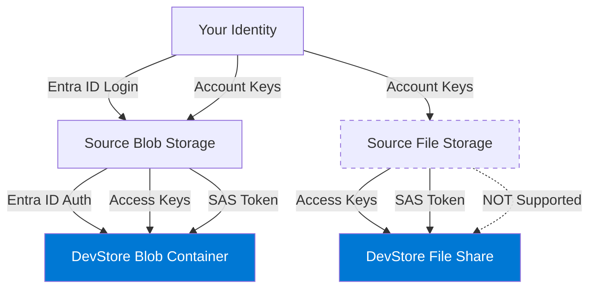
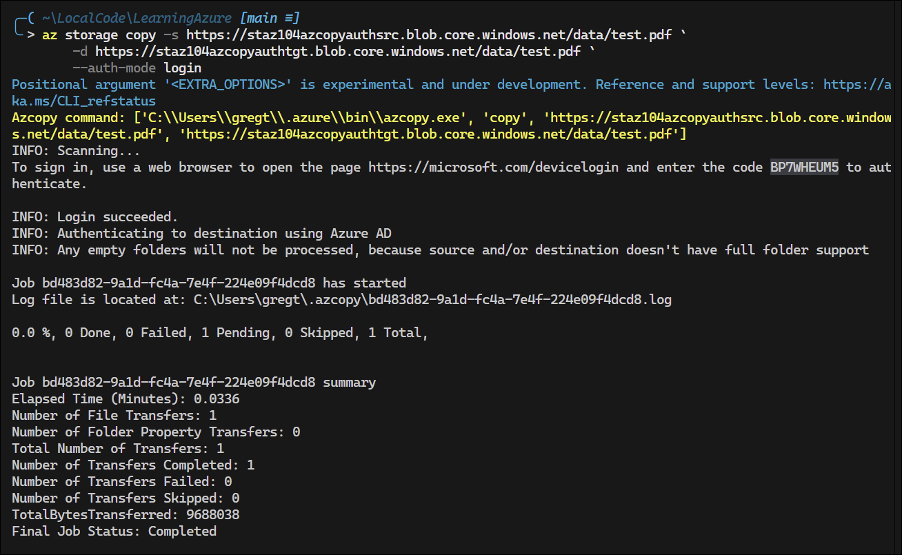
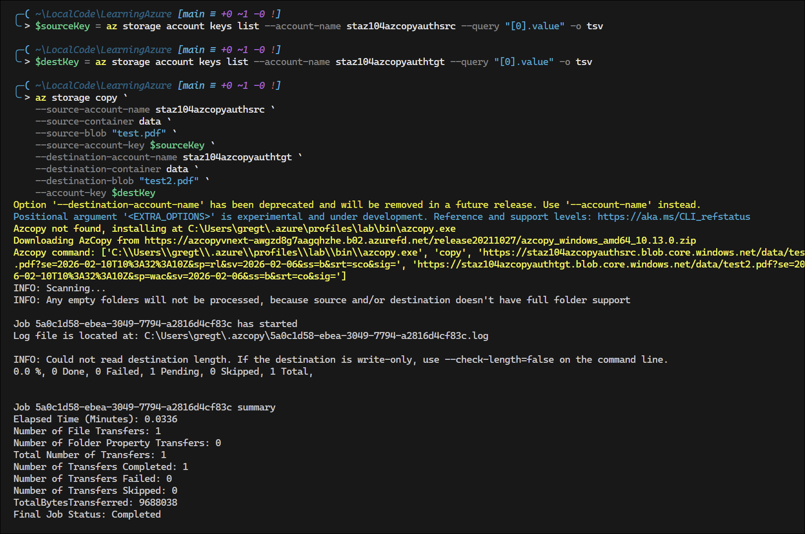
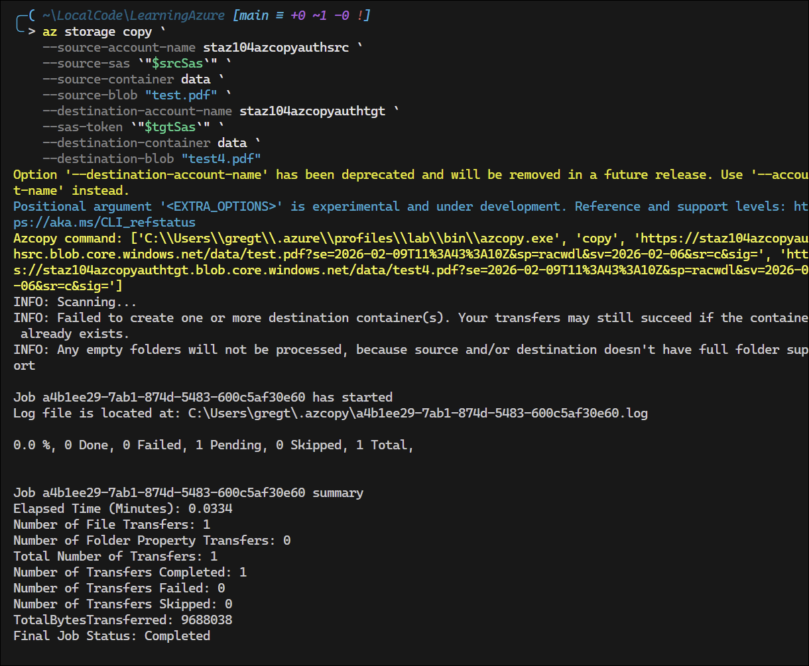
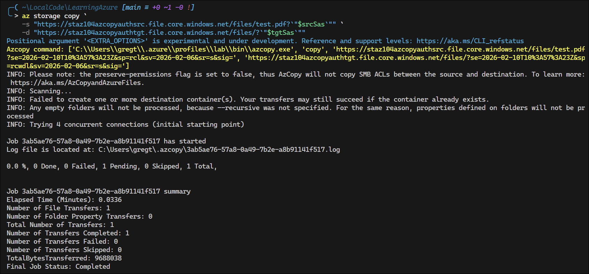

# Lab: Azure CLI Copy Authentication Methods for Blob and File Storage

## Exam Question Scenario

You create a new storage account named DevStore for Azure Blob Storage and Azure File Storage. You plan to use Azure CLI's copy command to copy data from blob storage and file storage in other storage accounts to DevStore. You have access to the storage account access keys for the source storage accounts and for DevStore. You also have valid Microsoft Entra user accounts and shared access signatures (SAS) with access to the source data.

You need to identify the authorization methods you can use to copy the data to DevStore.

Your commands target only the file share or the account.

**Which authorization methods can you use to copy each storage type?**

## Scenario Analysis

This scenario tests understanding of Azure CLI's copy command authentication capabilities across different storage types. The key distinction is that **Blob Storage and File Storage support different authentication methods** when using the copy command.

### Critical Understanding

**Blob Storage** supports all three authentication methods:

- ✅ Microsoft Entra ID (Azure AD)
- ✅ Storage Account Access Keys
- ✅ Shared Access Signatures (SAS)

**File Storage (Azure Files)** has **limited authentication support**:

- ❌ Microsoft Entra ID (NOT supported or very limited with AzCopy)
- ✅ Storage Account Access Keys
- ✅ Shared Access Signatures (SAS)

### Common Misconception

Many assume that since Azure AD authentication works for Blob Storage with the copy command, it would also work for File Storage. However, **Azure CLI's copy command Azure AD integration is primarily designed for Blob Storage and ADLS Gen2**, not Azure Files.

## Solution Architecture

This lab creates a destination storage account (DevStore) and two source storage accounts to demonstrate different authentication methods with Azure CLI's copy command:

1. **DevStore** - Destination storage account with both Blob and File storage
2. **Source Blob Storage** - Source storage account for blob data
3. **Source File Storage** - Source storage account for file share data

### Resources Created

- 3 Storage Accounts (Standard_LRS, hot tier)
- 2 Blob Containers (in DevStore and source blob storage)
- 2 File Shares (in DevStore and source file storage)
- Sample test files uploaded to source storage
- Role assignments for Entra ID authentication (Blob only)
- SAS tokens generated for both storage types

### Architecture Diagram



## Lab Objectives

1. **Create storage infrastructure** - Deploy storage accounts with blob containers and file shares
2. **Understand authentication differences** - Learn which auth methods work with each storage type
3. **Test Blob authentication methods**:
   - Microsoft Entra ID authentication (`azcopy login`)
   - Storage Account Access Keys (environment variable or connection string)
   - SAS Token authentication
4. **Test File authentication methods**:
   - Storage Account Access Keys
   - SAS Token authentication
   - Verify Azure AD is NOT supported for File Storage
5. **Document results** - Validate which methods succeed and which fail

## Prerequisites

- **Azure CLI installed** - The `az storage copy` command is built into Azure CLI
- **Azure PowerShell (optional)** - Alternative for retrieving storage keys and generating SAS tokens
- **Contributor or Storage Blob Data Contributor role** - For Entra ID authentication tests

### Azure CLI vs Standalone AzCopy

This lab uses **Azure CLI's built-in `az storage copy` command**, which is the preferred approach for Azure-native scripted workflows.

**Use standalone AzCopy binary if you need:**

- `--put-md5` flag for MD5 hash validation
- `--log-level`, `--log-location` for detailed logging control
- Pipe / stdin uploads
- Benchmark operations
- Fine-grained POSIX permission handling
- Absolute parity with documentation/examples written for standalone AzCopy

**For everything else (especially scripted Azure-native workflows):**
👉 **`az storage copy` is now the preferred path**

The authentication principles and methods covered in this lab apply equally to both `az storage copy` and standalone `azcopy`.

## Testing the Solution

After deploying the lab infrastructure, the validation script will help test all authentication methods. Run it to test systematically:

```powershell
# Navigate to validation directory
cd validation/

# Run the authentication test script
.\test-az-copy-auth.ps1
```

### Manual Testing Steps

#### 1. Test Blob Storage with Entra ID ✅

```powershell
# Login with Azure AD (Azure CLI handles authentication)
az login

# Copy blob using Entra ID auth
az storage copy -s "https://sourceblob.blob.core.windows.net/container/file.txt" `
    -d "https://devstore.blob.core.windows.net/container/"
```

**Expected**: ✅ Success



#### 2. Test Blob Storage with Access Keys ✅

```powershell
# Retrieve account keys
$sourceKey = az storage account keys list --account-name staz104azcopyauthsrc --query "[0].value" -o tsv
$destKey = az storage account keys list --account-name staz104azcopyauthtgt --query "[0].value" -o tsv

# Copy blob using access keys (use account/container/blob flags, not URLs)
az storage copy `
    --source-account-name staz104azcopyauthsrc `
    --source-container data `
    --source-blob "test.pdf" `
    --source-account-key $sourceKey `
    --destination-account-name staz104azcopyauthtgt `
    --destination-container data `
    --destination-blob "test.pdf" `
    --account-key $destKey
```

**Expected**: ✅ Success

> **Important**: When using access keys, use the `--source-account-name`, `--source-container`, `--source-blob` pattern instead of full URLs. Azure CLI constructs the URLs internally. Provide `--source-account-key` for source and `--account-key` for destination.



#### 3. Test Blob Storage with SAS Token ✅

```powershell
# Retrieve account keys (needed for SAS generation)
$sourceKey = az storage account keys list --account-name staz104azcopyauthsrc --query "[0].value" -o tsv
$destKey = az storage account keys list --account-name staz104azcopyauthtgt --query "[0].value" -o tsv

# Generate SAS tokens (valid for 1 hour)
$expiry = (Get-Date).AddHours(1).ToUniversalTime().ToString("yyyy-MM-ddTHH:mm:ssZ")

$srcSas = az storage container generate-sas `
    --account-name staz104azcopyauthsrc `
    --account-key $sourceKey `
    --name data `
    --permissions racwdl `
    --expiry $expiry `
    -o tsv

$tgtSas = az storage container generate-sas `
    --account-name staz104azcopyauthtgt `
    --account-key $destKey `
    --name data `
    --permissions racwdl `
    --expiry $expiry `
    -o tsv

# Copy blob using SAS tokens (use account/container/blob flags, not URLs)
az storage copy `
    --source-account-name staz104azcopyauthsrc `
    --source-sas `"$srcSas`" `
    --source-container data `
    --source-blob "test.pdf" `
    --destination-account-name staz104azcopyauthtgt `
    --sas-token `"$tgtSas`" `
    --destination-container data `
    --destination-blob "test.pdf"
```

**Expected**: ✅ Success

> **PowerShell Gotcha**: SAS tokens contain `&` characters that PowerShell interprets as command separators. Use backtick escaping: `` `"$srcSas`" `` or single quotes: `'$srcSas'` to prevent parsing errors like "sp is not recognized as a command".

> **Note**: Use `--account-key` for SAS generation (more reliable than `--auth-mode login`). Use `--source-sas` for source SAS token and `--sas-token` for destination SAS token. Use `--destination-account-name` (not `--account-name`) for the destination. Azure CLI constructs the URLs internally.



#### 4. Test File Storage with Entra ID ❌

```powershell
# Login with Azure AD
az login

# Attempt to copy file using Entra ID auth
az storage copy -s "https://sourcefile.file.core.windows.net/share/file.txt" `
    -d "https://devstore.file.core.windows.net/share/"
```

**Expected**: ❌ **FAIL** - Azure AD not supported for File Storage with Azure CLI copy command

#### 5. Test File Storage with Access Keys ✅

```powershell
# Copy file using access key (specify with --account-key parameter)
az storage copy -s "https://sourcefile.file.core.windows.net/share/file.txt" `
    -d "https://devstore.file.core.windows.net/share/" `
    --destination-account-name devstore `
    --destination-account-key "<access-key>"
```

**Expected**: ✅ Success

#### 6. Test File Storage with SAS Token ✅

```powershell
# Retrieve account keys
$sourceKey = az storage account keys list --account-name staz104azcopyauthsrc --query "[0].value" -o tsv
$destKey = az storage account keys list --account-name staz104azcopyauthtgt --query "[0].value" -o tsv

# Generate SAS tokens for file shares (valid for 1 hour)
$expiry = (Get-Date).AddHours(1).ToUniversalTime().ToString("yyyy-MM-ddTHH:mm:ssZ")

$srcSas = az storage share generate-sas `
    --account-name staz104azcopyauthsrc `
    --account-key $sourceKey `
    --name files `
    --permissions rcl `
    --expiry $expiry `
    -o tsv

$tgtSas = az storage share generate-sas `
    --account-name staz104azcopyauthtgt `
    --account-key $destKey `
    --name files `
    --permissions rwcld `
    --expiry $expiry `
    -o tsv

# Copy file using SAS tokens (append to URL)
az storage copy `
    -s "https://staz104azcopyauthsrc.file.core.windows.net/files/test.pdf?`"$srcSas`"" `
    -d "https://staz104azcopyauthtgt.file.core.windows.net/files/?`"$tgtSas`""
```

**Expected**: ✅ Success



> **PowerShell Gotcha**: If using variables with SAS tokens, escape them: `` -s "https://...?`"$sasToken`"" `` to prevent `&` characters from being interpreted as command separators.

## Validation Criteria

The lab is successful when you can verify:

- ✅ All three authentication methods work for **Blob Storage**
- ✅ Access Keys and SAS work for **File Storage**
- ❌ Azure AD authentication **FAILS** for **File Storage**
- ✅ Files successfully copied to destination containers/shares
- ✅ Appropriate error messages when using unsupported authentication

## Key Learning Points

### 1. Authentication Support Varies by Storage Type

**Blob Storage** has comprehensive authentication support in Azure CLI copy command:

- Microsoft Entra ID (preferred for user access)
- Access Keys (full control)
- SAS tokens (delegated permissions)

**File Storage** has limited authentication support:

- Access Keys (full control)
- SAS tokens (delegated permissions)
- **NO Azure AD support** with Azure CLI copy command

### 2. Why Azure AD Doesn't Work for File Storage

- Azure CLI copy command's Azure AD implementation is optimized for **Blob Storage and ADLS Gen2**
- Azure Files uses **SMB protocol** for primary access, which has different authentication flows
- Azure Files does support Azure AD for **SMB-based access** (not Azure CLI copy)
- Azure CLI copy primarily uses REST APIs, where File Storage has limited Azure AD support

### 3. Best Practices for Production

**For Blob Storage**:

- ✅ **Use Azure AD** for user-driven operations (az login)
- ✅ **Use SAS tokens** for application access with limited scope
- ⚠️ **Avoid access keys** in production (use only for testing/admin)

**For File Storage**:

- ✅ **Use SAS tokens** for Azure CLI copy operations
- ✅ **Use Azure AD** for SMB mount access (not Azure CLI copy)
- ⚠️ **Avoid access keys** in production scripts

### 4. SAS Token Scope

When the scenario states "commands target only the file share or the account," this hints at:

- **File share level**: Use SAS tokens scoped to the specific share
- **Account level**: Use account keys for full access

SAS tokens can be scoped to:

- Container/share level (recommended)
- Account level (broader access)
- Specific operations (read, write, list, delete)

### 5. Security Considerations

**Access Keys**:

- Grant full control to the entire storage account
- Should be rotated regularly
- Use Azure Key Vault for storage in production

**SAS Tokens**:

- Can be scoped to specific resources and operations
- Can have expiration times
- Can be revoked (stored access policy)

**Azure AD**:

- Most secure option (when supported)
- Integrates with Azure RBAC
- Supports conditional access policies

## Common Errors and Solutions

### Error: "Failed to perform storage operation using Azure AD"

**Cause**: Attempting to use Azure AD authentication with File Storage

**Solution**: Use SAS token or access key instead

```powershell
# Wrong - Azure AD with File Storage
az login
az storage copy -s "https://source.file.core.windows.net/share/file.txt" -d "dest"

# Correct - SAS token with File Storage
az storage copy -s "https://source.file.core.windows.net/share/file.txt?<sas>" -d "dest"
```

### Error: "Authentication failed"

**Cause**: Missing or incorrect authentication method

**Solution**: Verify authentication method is set correctly

```powershell
# For access keys, use the --destination-account-key parameter
az storage copy -s "source" -d "dest" --destination-account-key "<key>"

# For SAS, ensure token is appended to URL (with ? for first parameter)
```

### Error: "'sp' is not recognized as a command" or "'sv' is not recognized as a command"

**Cause**: PowerShell is interpreting `&` characters in SAS tokens as command separators

**Solution**: Escape the SAS token variable with backticks or use single quotes

```powershell
# Wrong - PowerShell parses & as command separator
--source-sas "$srcSas"

# Correct - Backtick escape prevents parsing
--source-sas `"$srcSas`"

# Also correct - Single quotes prevent variable expansion parsing
--source-sas '$srcSas'
```

### Error: "This request is not authorized to perform this operation"

**Cause**: SAS token missing required permissions or has expired

**Solution**: Generate new SAS with appropriate permissions (read, write, list)

## Related AZ-104 Exam Objectives

This lab covers the following AZ-104 exam objectives:

### Implement and manage storage (15-20%)

- **Configure access to storage**
  - Configure Azure Storage firewalls and virtual networks
  - Manage access keys and SAS tokens
  - Configure Azure AD authentication for storage accounts
  
- **Manage data in Azure Storage**
  - Use Azure CLI copy command to transfer data
  - Configure object replication
  - Import and export data using Azure Import/Export service

### Manage identities and governance in Azure (20-25%)

- **Manage Azure Active Directory (AD) objects**
  - Configure Azure AD authentication for Azure resources
  - Assign RBAC roles at different scopes

## Additional Resources

### Microsoft Learn Modules

- [Copy blobs with Azure CLI](https://learn.microsoft.com/en-us/cli/azure/storage/blob/copy)
- [Azure CLI storage commands](https://learn.microsoft.com/en-us/cli/azure/storage)
- [Authorize access to data in Azure Storage](https://learn.microsoft.com/en-us/azure/storage/common/authorize-data-access)
- [Grant limited access with SAS](https://learn.microsoft.com/en-us/azure/storage/common/storage-sas-overview)

### Azure Documentation

- [Azure CLI storage copy command](https://learn.microsoft.com/en-us/cli/azure/storage/copy)
- [Get started with standalone AzCopy](https://learn.microsoft.com/en-us/azure/storage/common/storage-use-azcopy-v10) - For advanced scenarios
- [Copy and move blobs with AzCopy](https://learn.microsoft.com/en-us/azure/storage/common/storage-use-azcopy-blobs)
- [Authorize access to blobs with Azure AD](https://learn.microsoft.com/en-us/azure/storage/blobs/authorize-access-azure-active-directory)
- [Azure Files authentication overview](https://learn.microsoft.com/en-us/azure/storage/files/storage-files-active-directory-overview)
- [Storage account access keys](https://learn.microsoft.com/en-us/azure/storage/common/storage-account-keys-manage)

### Related Labs

- [lab-storage-explorer-permissions](../lab-storage-explorer-permissions/README.md) - Understanding RBAC for Storage Explorer
- [lab-object-replication](../lab-object-replication/README.md) - Blob replication with change feed

---

**Author**: Greg Tate  
**Context**: AZ-104 Lab - Storage authentication methods with Azure CLI copy command  
**Date**: February 7, 2026
