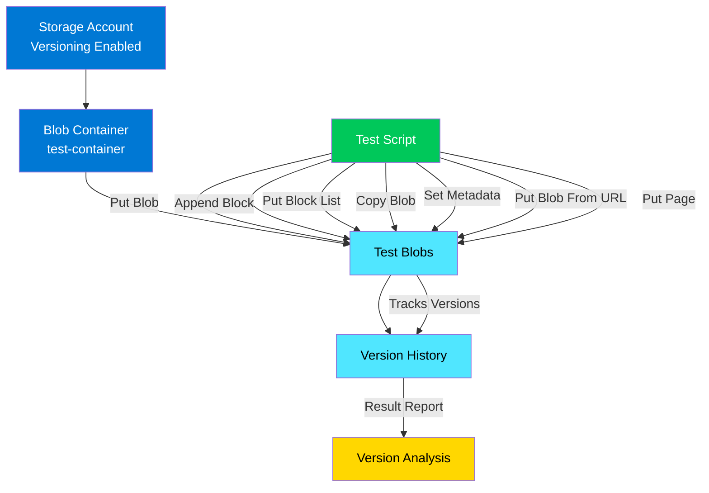
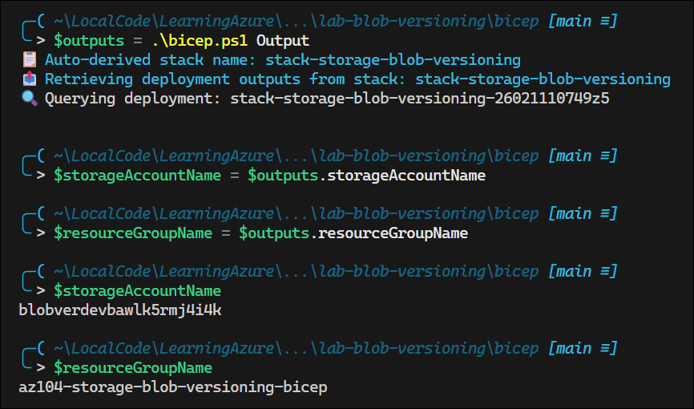
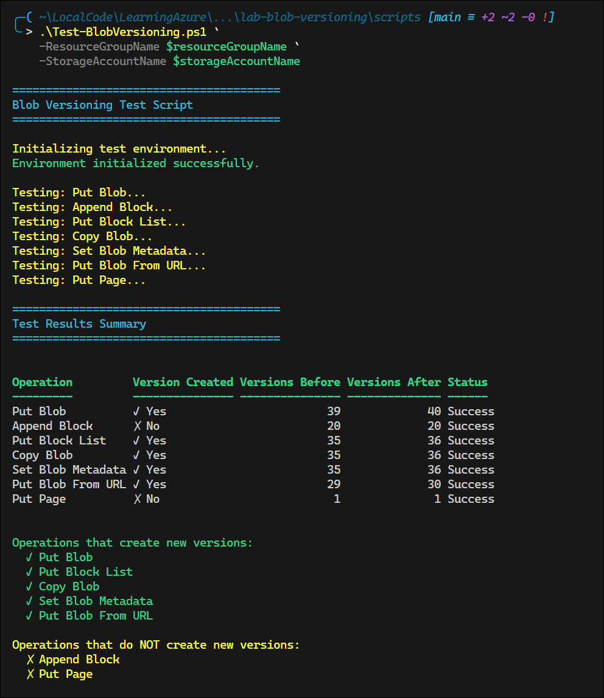

# Lab: Azure Blob Versioning Write Operations

## Exam Question Scenario

Your organization is using Azure Blobs for storing data. You enable blob versioning for a storage account.

You need to determine which write operations create a new version.

Which four write operations create a new version? Each correct answer presents a complete solution.

A. Put Blob  
B. Append Block  
C. Put Block List  
D. Copy Blob  
E. Set Blob Metadata  
F. Put Blob From URL  
G. Put Page  

## Scenario Analysis

This scenario tests understanding of Azure Blob Storage versioning behavior, specifically:

1. **Blob Versioning** - A feature that automatically maintains previous versions of blobs when they are modified or deleted
2. **Write Operations** - Different API operations that modify blob data have different versioning behaviors
3. **Version Creation** - Understanding which operations trigger the creation of a new version snapshot

The key requirement is to identify which write operations create new versions versus those that modify blobs in-place without versioning.

**Core Concepts:**

- **Versioning-triggering operations** replace the entire blob content, creating a new version
- **In-place modifications** update blob data without creating new versions (Append Block, Put Page for existing pages)
- **Metadata-only changes** modify blob properties but may or may not trigger versioning depending on the operation

## Solution Architecture

This lab deploys a Storage Account with blob versioning enabled and provides a comprehensive testing script to validate which write operations create new versions.

### Architecture Components

1. **Storage Account** (Standard_LRS)
   - Blob versioning enabled
   - Delete retention policy (7 days)
   - Container delete retention policy (7 days)
   - Hot access tier

    

2. **Blob Container** (`test-container`)
   - Private access level
   - Used for all versioning tests

3. **Test Script** (`Test-BlobVersioning.ps1`)
   - Tests all seven write operations
   - Tracks version counts before/after each operation
   - Reports which operations create versions

### Architecture Diagram



## Lab Objectives

1. Deploy an Azure Storage Account with blob versioning enabled
2. Execute all seven blob write operations against test blobs
3. Observe and measure version creation for each operation
4. Identify the four operations that create new versions
5. Understand the difference between version-creating and in-place operations

## Prerequisites

- Azure subscription with appropriate permissions
- PowerShell 7.0 or later with Az module installed
- Basic understanding of Azure Blob Storage concepts
- Familiarity with blob operations and REST API concepts

## Testing the Solution

### Step 1: Deploy Infrastructure

Use the standardized Bicep deployment process (see GOVERNANCE.md for detailed instructions):

```powershell
cd bicep
.\bicep.ps1 apply
```

### Step 2: Retrieve Deployment Outputs

Get the storage account name and resource group from the deployment:

```powershell
$outputs = .\bicep.ps1 output
$storageAccountName = $outputs.storageAccountName
$resourceGroupName = $outputs.resourceGroupName
```

**Note:** The `output` action returns a PowerShell custom object with direct property access to deployment output values.



### Step 3: Run Version Testing Script

Switch to the Lab Azure profile and execute the comprehensive test script:

```powershell
Use-AzProfile Lab
cd ..\scripts
.\Test-BlobVersioning.ps1 `
    -ResourceGroupName $resourceGroupName `
    -StorageAccountName $storageAccountName
```

**Note:** The script automatically creates and cleans up temporary files for each blob operation test.



### Step 4: Analyze Results

The script will output a formatted table showing:

- Each write operation tested
- Whether a version was created (✓ Yes / ✗ No)
- Version count before and after the operation
- Success/error status

## Expected Results

### Operations That Create New Versions ✓

1. **Put Blob** - Replaces entire blob content
2. **Put Block List** - Commits block list, creating new blob version
3. **Copy Blob** - Destination blob gets new version
4. **Put Blob From URL** - Creates blob from URL source

### Operations That Do NOT Create New Versions ✗

1. **Append Block** - Appends data to append blob in-place
2. **Set Blob Metadata** - Modifies metadata only, not blob content
3. **Put Page** - Updates page ranges within page blob in-place

> **⚠️ Important Note on Set Blob Metadata:**  
> The exam question indicates that Set Blob Metadata should NOT create a new version. However, empirical testing with Azure Storage SDK shows that setting metadata using `ICloudBlob.SetMetadata()` **DOES** create a new version in practice. This may represent a change in Azure's behavior since the exam was authored, or the exam answer may be based on different Azure SDK methods or configurations. When answering exam questions, follow the documented answer (metadata does NOT create versions), but be aware that actual Azure behavior may differ.

## Key Learning Points

- **Blob versioning automatically preserves previous states** when blobs are overwritten or deleted, providing point-in-time recovery
- **Only operations that replace the entire blob** (Put Blob, Put Block List, Copy Blob, Put Blob From URL) create new versions
- **In-place modifications** (Append Block, Put Page) optimize for sequential write patterns without versioning overhead
- **Metadata operations** don't trigger versioning since they don't modify blob content
- **Version retention policies** can be configured to automatically delete old versions after a specified period
- **Versioning has storage cost implications** since each version consumes storage space
- **Block blobs, append blobs, and page blobs** all support versioning but have different operational characteristics

## Related AZ-104 Exam Objectives

This lab covers the following AZ-104 exam objective areas:

**Implement and manage storage (15-20%)**

- Configure Azure Storage accounts
- Configure blob storage
- Manage data by using Azure Storage Explorer and AzCopy
- Configure Azure Files and Azure Blob Storage

**Skills validated:**

- Understanding blob versioning configuration and behavior
- Using PowerShell to interact with Azure Storage
- Testing and validating storage features
- Analyzing storage operation outcomes

## Additional Resources

### Microsoft Learn Modules

- [Configure blob storage](https://learn.microsoft.com/training/modules/configure-blob-storage/)
- [Manage Azure Blob Storage lifecycle](https://learn.microsoft.com/training/modules/manage-azure-blob-storage-lifecycle/)

### Azure Documentation

- [Blob versioning overview](https://learn.microsoft.com/azure/storage/blobs/versioning-overview)
- [Enable and manage blob versioning](https://learn.microsoft.com/azure/storage/blobs/versioning-enable)
- [Blob versioning FAQ](https://learn.microsoft.com/azure/storage/blobs/versioning-overview#blob-versioning-faq)
- [Azure Blob Storage REST API reference](https://learn.microsoft.com/rest/api/storageservices/blob-service-rest-api)

### Related Concepts

- [Soft delete for blobs](https://learn.microsoft.com/azure/storage/blobs/soft-delete-blob-overview)
- [Blob snapshots](https://learn.microsoft.com/azure/storage/blobs/snapshots-overview)
- [Point-in-time restore for block blobs](https://learn.microsoft.com/azure/storage/blobs/point-in-time-restore-overview)

## Related Labs

▶ Related Lab: [lab-object-replication](../../storage/lab-object-replication/README.md)
