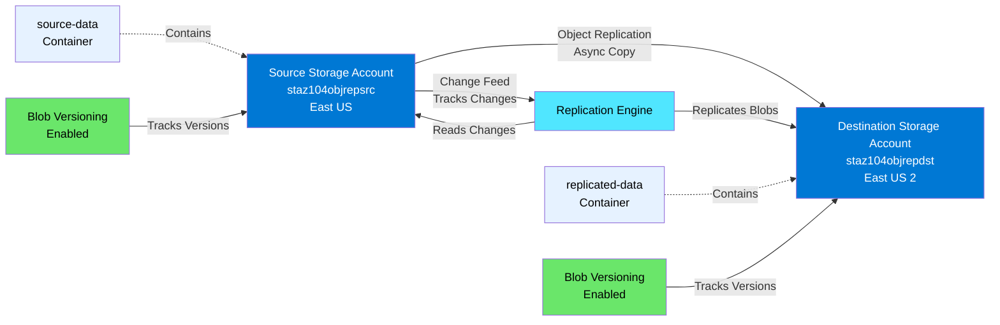
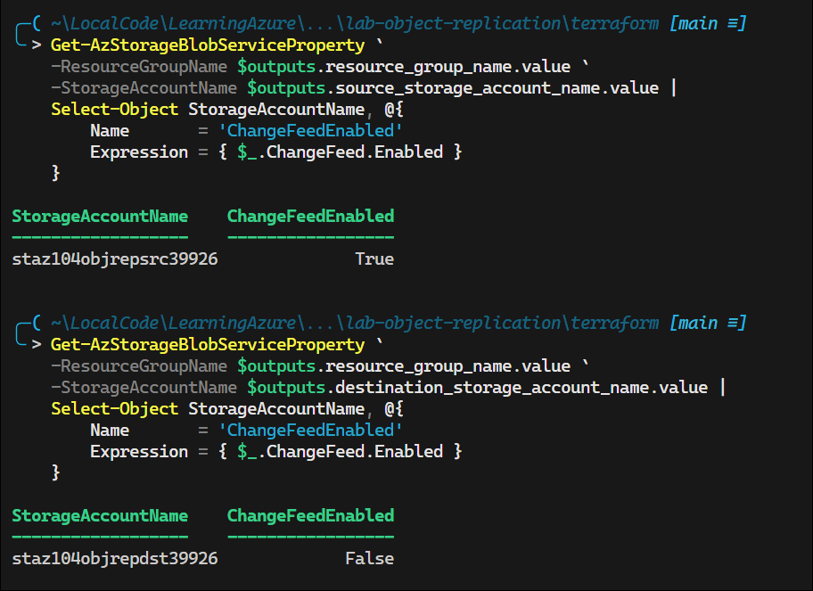
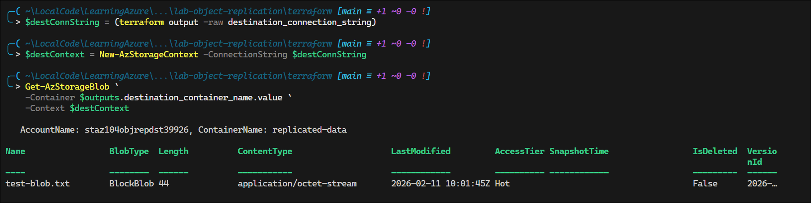

# Lab: Configure Azure Storage Object Replication

## Exam Question Scenario

You plan to configure object replication between storage accounts in two different regions.

You need to ensure that Azure Storage features are configured to support object storage replication. You want to minimize the configuration changes that you make.

How should you configure the Azure Storage features? To answer, select the configuration settings from the drop-down menus.

- **Change feed**: [Select option]
- **Blob versioning**: [Select option]

## Scenario Analysis

This scenario tests understanding of **Azure Storage object replication prerequisites**. Object replication asynchronously copies block blobs between storage accounts, providing benefits such as:

- **Disaster recovery**: Minimize latency by replicating data to a secondary region
- **Data distribution**: Copy data closer to users for improved performance
- **Compliance**: Meet data residency requirements by keeping copies in specific regions

### Critical Configuration Requirements

To configure object replication, you must enable specific features on the source and destination storage accounts:

1. **Blob Versioning**: Must be enabled on **BOTH** source and destination accounts
   - Tracks changes to blob objects over time
   - Required for the replication engine to identify and replicate changes
   - Each modification creates a new version

2. **Change Feed**: Must be enabled on the **SOURCE** account only
   - Provides an ordered, durable log of all changes to blobs
   - The replication engine reads the change feed to identify what needs replication
   - Not required on the destination (it receives replicated data, doesn't track changes)

### Answer: Minimal Configuration Changes

To **minimize configuration changes** while meeting requirements:

| Feature | Source Account | Destination Account |
|---------|---------------|---------------------|
| **Blob Versioning** | ✅ Enabled | ✅ Enabled |
| **Change Feed** | ✅ Enabled | ❌ Not Required |

**Important**: Both accounts need blob versioning, but only the source needs change feed. Not enabling change feed on the destination minimizes unnecessary configuration.

## Solution Architecture

This lab creates two storage accounts in different Azure regions with object replication configured between them.



### Architecture Components

1. **Source Storage Account** (East US)
   - Blob versioning: Enabled
   - Change feed: Enabled (7-day retention)
   - Container: `source-data`
   - Role: Origin of replicated data

2. **Destination Storage Account** (East US 2)
   - Blob versioning: Enabled
   - Change feed: Not enabled (not required)
   - Container: `replicated-data`
   - Role: Target for replicated data

3. **Object Replication Policy**
   - Links source and destination accounts
   - Defines replication rules (source container → destination container)
   - Asynchronous replication (eventual consistency)

## Lab Objectives

1. **Create two storage accounts** in different Azure regions with replication support
2. **Configure blob versioning** on both source and destination accounts
3. **Enable change feed** on the source account only (minimizing configuration)
4. **Set up object replication policy** to replicate blobs from source to destination
5. **Validate replication** by uploading blobs to the source and verifying they appear in the destination

## Prerequisites

- Azure CLI or Azure PowerShell installed
- Contributor or Owner role on the Azure subscription
- Terraform >= 1.0 installed
- Lab subscription ID: `e091f6e7-031a-4924-97bb-8c983ca5d21a`
- Understanding of Azure Storage accounts and blob storage concepts

## Testing the Solution

### Step 1: Verify Storage Account Configuration

```powershell
# Switch to Lab Azure profile
Use-AzProfile Lab

# Get Terraform outputs
$outputs = terraform output -json | ConvertFrom-Json

# Verify blob versioning is enabled on both accounts
Get-AzStorageBlobServiceProperty `
    -ResourceGroupName $outputs.resource_group_name.value `
    -StorageAccountName $outputs.source_storage_account_name.value |
    Select-Object StorageAccountName, IsVersioningEnabled

Get-AzStorageBlobServiceProperty `
    -ResourceGroupName $outputs.resource_group_name.value `
    -StorageAccountName $outputs.destination_storage_account_name.value |
    Select-Object StorageAccountName, IsVersioningEnabled
```

**Expected**: Both accounts show `IsVersioningEnabled: True`


### Step 2: Verify Change Feed Configuration

```powershell
# Verify change feed on source account (should be enabled)
Get-AzStorageBlobServiceProperty `
    -ResourceGroupName $outputs.resource_group_name.value `
    -StorageAccountName $outputs.source_storage_account_name.value |
    Select-Object StorageAccountName, @{
        Name       = 'ChangeFeedEnabled'
        Expression = { $_.ChangeFeed.Enabled }
    }

# Verify change feed on destination account (should be false/not required)
Get-AzStorageBlobServiceProperty `
    -ResourceGroupName $outputs.resource_group_name.value `
    -StorageAccountName $outputs.destination_storage_account_name.value |
    Select-Object StorageAccountName, @{
        Name       = 'ChangeFeedEnabled'
        Expression = { $_.ChangeFeed.Enabled }
    }
```

**Expected**:

- Source account: `ChangeFeedEnabled: True`
- Destination account: `ChangeFeedEnabled: False` (minimized configuration)



### Step 3: Test Object Replication

```powershell
# Create a test file
"This is a test blob for object replication" | Out-File -FilePath .\test-blob.txt

# Get source connection string
$sourceConnString = (terraform output -raw source_connection_string)

# Create storage context and upload blob to source
$sourceContext = New-AzStorageContext -ConnectionString $sourceConnString
Set-AzStorageBlobContent `
    -File .\test-blob.txt `
    -Container $outputs.source_container_name.value `
    -Blob "test-blob.txt" `
    -Context $sourceContext

# Wait for replication (can take a few minutes)
Write-Host "Waiting 2 minutes for replication to complete..." -ForegroundColor Yellow
Start-Sleep -Seconds 120

# Verify blob exists in destination
$destConnString = (terraform output -raw destination_connection_string)
$destContext = New-AzStorageContext -ConnectionString $destConnString
Get-AzStorageBlob `
    -Container $outputs.destination_container_name.value `
    -Context $destContext
```

**Expected**: The `test-blob.txt` should appear in the destination container after replication completes.




### Step 4: Verify Replication Policy

```powershell
# List object replication policies
Get-AzStorageObjectReplicationPolicy `
    -ResourceGroupName $outputs.resource_group_name.value `
    -StorageAccountName $outputs.source_storage_account_name.value |
    Format-List
```

**Expected**: Replication policy with source and destination container mappings.

## Key Learning Points

- **Blob versioning is required on both accounts** for object replication to work
- **Change feed is only required on the source account** to track changes for replication
- **Object replication is asynchronous** - there's a delay between source upload and destination availability
- **Replication minimizes latency** by creating copies closer to users in different regions
- **Both accounts must be in different regions** for replication to provide disaster recovery benefits
- **Standard storage accounts (LRS, GRS, ZRS, etc.)** all support object replication
- **Minimizing configuration** means only enabling required features on each account

## Related AZ-104 Exam Objectives

This lab covers the following AZ-104 exam objectives:

- **Implement and manage storage (15-20%)**
  - Configure access to storage
  - Configure storage accounts
  - Configure Azure Blob Storage
  - Configure storage redundancy
  
- **Configure storage accounts**
  - Configure blob versioning
  - Configure storage replication
  - Configure change feed for blob storage

## Additional Resources

- [Object replication for block blobs](https://learn.microsoft.com/en-us/azure/storage/blobs/object-replication-overview)
- [Configure object replication for block blobs](https://learn.microsoft.com/en-us/azure/storage/blobs/object-replication-configure)
- [Blob versioning overview](https://learn.microsoft.com/en-us/azure/storage/blobs/versioning-overview)
- [Change feed support in Azure Blob Storage](https://learn.microsoft.com/en-us/azure/storage/blobs/storage-blob-change-feed)
- [AZ-104: Implement and manage storage](https://learn.microsoft.com/en-us/training/paths/az-104-manage-storage/)
