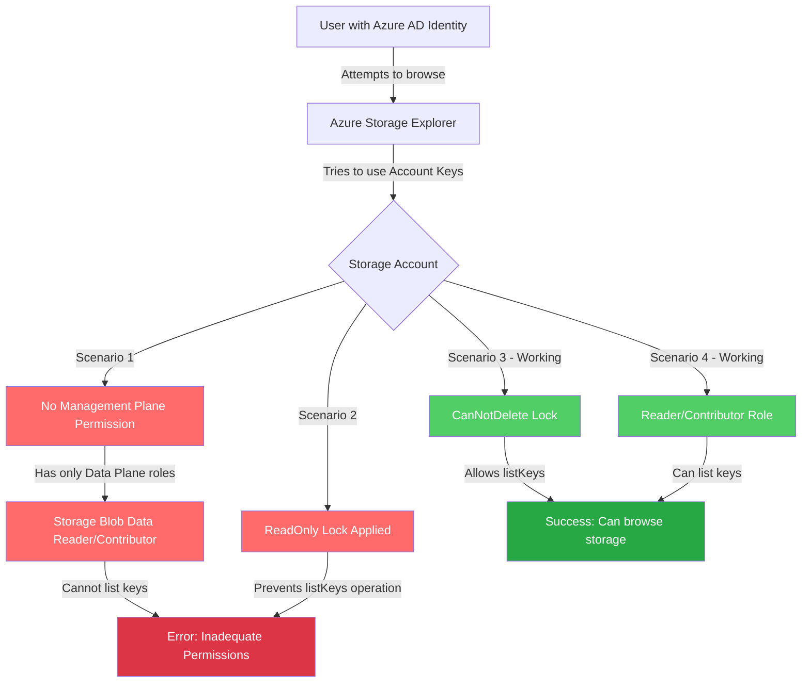

# Lab: Azure Storage Explorer Permission Troubleshooting

## Exam Question Scenario

You have storage accounts in your Azure subscription for different purposes. The storage accounts have blob containers and file shares configured.

Some users access these storage accounts by using the Microsoft Azure Storage Explorer desktop application. They are reporting that they get the error message shown in the exhibit when they try to browse the contents of the storage account.

You need to resolve the issue.

**Error Message:** "Unable to list resources in account due to inadequate permissions. Permission to list containers or to list account keys is required."

**Question:** What are two possible reasons why users are getting this error message? Each correct answer presents a complete solution.

**Options:**
- Your users have the Storage Blob Data Reader role assigned in the storage accounts
- There is a ReadOnly resource lock configured
- There is a CanNotDelete resource lock configured
- Your users have the Read role assigned in the storage accounts
- Your users have the Storage Blob Data Contributor role assigned in the storage accounts

## Scenario Analysis

This scenario tests understanding of:

1. **Azure Storage authentication methods:**
   - Account key-based authentication (default in Storage Explorer)
   - Azure AD authentication with RBAC roles

2. **RBAC role types:**
   - **Data plane roles**: Storage Blob Data Reader, Storage Blob Data Contributor (access to blob data only)
   - **Management plane roles**: Reader, Contributor (access to resource configuration and keys)

3. **Resource locks:**
   - **ReadOnly**: Prevents modifications, including the `listKeys` operation
   - **CanNotDelete**: Prevents deletion but allows other operations including `listKeys`

## Solution Architecture

This lab creates storage accounts with different configurations to demonstrate the permission issues:

1. **Storage account without locks** - Baseline for testing
2. **Storage account with ReadOnly lock** (optional) - Demonstrates lock-based permission issue
3. **Storage account with CanNotDelete lock** (optional) - Shows this lock type does NOT cause the error



**Cost Optimization:** This lab uses cost-effective resources:
- Storage Accounts: Standard LRS tier (lowest cost)
- No compute resources required
- Minimal storage used (blob containers and file shares with no significant data)

## Prerequisites

- Azure CLI installed and authenticated
- Terraform (>= 1.0) installed
- Azure subscription with appropriate permissions
- Resource provider registered: `Microsoft.Storage`

**CRITICAL:** Before executing ANY Azure CLI or Terraform commands, you MUST switch to the Lab Azure profile:

```powershell
Use-AzProfile Lab
```

This ensures all commands execute in the correct Lab subscription environment. The profile switch persists for the terminal session.

### Terraform Prerequisites

**CRITICAL:** Switch to Lab Azure profile before any Terraform operations:

```powershell
Use-AzProfile Lab
```

Ensure you have a `terraform.tfvars` file with your subscription ID:

```bash
# The terraform.tfvars should contain:
lab_subscription_id = "e091f6e7-031a-4924-97bb-8c983ca5d21a"
```

Register the storage provider if needed:
```bash
az provider register --namespace Microsoft.Storage
```

## Lab Objectives

1. Deploy storage accounts with different permission configurations
2. Understand the difference between data plane and management plane RBAC roles
3. Test Azure Storage Explorer authentication behavior
4. Observe the impact of resource locks on key listing operations
5. Implement solutions to resolve Storage Explorer permission errors

## Deployment

### Terraform Deployment

1. **CRITICAL:** Switch to Lab Azure profile:
   ```powershell
   Use-AzProfile Lab
   ```

2. Navigate to the terraform directory:
   ```bash
   cd terraform
   ```

3. Verify `terraform.tfvars` exists with your subscription ID:
   ```bash
   # File should already exist with lab subscription ID
   cat terraform.tfvars
   ```

4. Initialize Terraform:
   ```bash
   terraform init
   ```

5. Validate the configuration:
   ```bash
   terraform validate
   ```

6. Review the planned changes:
   ```bash
   terraform plan
   ```

7. Deploy the infrastructure:
   ```bash
   terraform apply
   ```

8. (Optional) Deploy with resource locks to test those scenarios:
   ```bash
   # Test ReadOnly lock scenario
   terraform apply -var="enable_readonly_lock=true"
   
   # Test CanNotDelete lock scenario
   terraform apply -var="enable_cannotdelete_lock=true"
   
   # Test both scenarios
   terraform apply -var="enable_readonly_lock=true" -var="enable_cannotdelete_lock=true"
   ```

## Validation Steps

### Using the Validation Script

1. **CRITICAL:** Ensure Lab profile is active:
   ```powershell
   Use-AzProfile Lab
   ```

2. Run the validation script:
   ```powershell
   cd ../validation
   .\test-storage-permissions.ps1
   ```

3. Assign a role to a user for testing:
   ```powershell
   # Test with Storage Blob Data Reader (will cause error in Storage Explorer)
   .\test-storage-permissions.ps1 `
       -UserPrincipalName "user@yourdomain.com" `
       -RoleToAssign "StorageBlobDataReader"
   
   # Test with Reader role (should work in Storage Explorer)
   .\test-storage-permissions.ps1 `
       -UserPrincipalName "user@yourdomain.com" `
       -RoleToAssign "Reader"
   ```

### Manual Validation

1. **List deployed storage accounts:**
   ```bash
   az storage account list \
       --resource-group az104-storage-storage-explorer-permissions-tf \
       --output table
   ```

2. **Check resource locks:**
   ```bash
   # Get resource group ID first
   $rgId = (az group show --name az104-storage-storage-explorer-permissions-tf --query id -o tsv)
   
   # List locks
   az lock list --resource-group az104-storage-storage-explorer-permissions-tf --output table
   ```

3. **Try to list account keys** (should succeed on unlocked accounts):
   ```bash
   az storage account keys list \
       --resource-group az104-storage-storage-explorer-permissions-tf \
       --account-name <storage-account-name>
   ```

4. **Test in Azure Portal:**
   - Navigate to the storage account
   - Try to access "Access keys" blade
   - Observe any errors if ReadOnly lock is present

## Testing the Solution

### Scenario 1: Storage Blob Data Reader/Contributor Role Only

**Setup:**
1. Assign "Storage Blob Data Reader" role to a user on a storage account
2. Ensure the user does NOT have Reader/Contributor role

**Test:**
1. Open Azure Storage Explorer
2. Sign in as the test user
3. Try to browse the storage account

**Expected Result:**
- Error: "Unable to list resources in account due to inadequate permissions"
- Reason: Data plane role doesn't grant permission to list account keys

**Solution:**
- Add "Reader" role (management plane) to the user, OR
- Configure Storage Explorer to use Azure AD authentication instead of account keys

### Scenario 2: ReadOnly Resource Lock

**Setup:**
1. Deploy with `enable_readonly_lock = true`
2. Assign Contributor role to a user on the storage account

**Test:**
1. Try to list account keys via CLI or Storage Explorer
2. Try to access "Access keys" blade in Azure Portal

**Expected Result:**
- Error when trying to list keys: operation prevented by lock
- Reason: `listKeys` is a POST operation, blocked by ReadOnly lock

**Solution:**
- Remove the ReadOnly lock, OR
- Configure Storage Explorer to use Azure AD authentication

### Scenario 3: CanNotDelete Lock (Should Work)

**Setup:**
1. Deploy with `enable_cannotdelete_lock = true`
2. Assign Reader role to a user on the storage account

**Test:**
1. Try to list account keys
2. Try to browse in Storage Explorer

**Expected Result:**
- ✓ Key listing succeeds
- ✓ Storage Explorer can browse the account
- Reason: CanNotDelete lock does NOT prevent listKeys operation

### Using Azure Storage Explorer with Azure AD Auth

To avoid account key issues entirely:

1. Open Azure Storage Explorer
2. Go to Edit → Azure Active Directory
3. Ensure "Use Azure Active Directory" is enabled
4. Sign in with an account that has appropriate data plane roles
5. Browse should work with Storage Blob Data Reader/Contributor roles

## Cleanup

### Terraform Cleanup

**CRITICAL:** Ensure you're using the Lab profile before cleanup:

```powershell
Use-AzProfile Lab
```

```bash
cd terraform
terraform destroy
```

**Note:** If resource locks are enabled, you may need to remove them first:
```bash
# Remove locks before destroying
az lock delete --name lock-readonly --resource-group az104-storage-storage-explorer-permissions-tf
az lock delete --name lock-cannotdelete --resource-group az104-storage-storage-explorer-permissions-tf

# Then destroy
terraform destroy
```

## Key Learning Points

1. **Storage Explorer uses account keys by default:**
   - Requires management plane permissions (Reader or higher)
   - Or requires specific "Storage Account Key Operator Service Role"

2. **Data plane vs Management plane roles:**
   - **Data plane**: Storage Blob Data Reader, Storage Blob Data Contributor
     - Grant access to blob/file/queue/table data
     - Do NOT grant permission to list account keys
   - **Management plane**: Reader, Contributor, Owner
     - Grant access to resource configuration and operations
     - Include permission to list account keys

3. **Resource locks behavior:**
   - **ReadOnly**: Prevents ALL write operations, including listKeys (POST operation)
   - **CanNotDelete**: Prevents deletion ONLY, allows other operations

4. **Solutions for Storage Explorer errors:**
   - Add management plane role (Reader) in addition to data plane roles
   - Remove ReadOnly locks
   - Configure Storage Explorer to use Azure AD authentication
   - Use Azure Portal with appropriate RBAC permissions

5. **Correct exam answers:**
   - ✓ Storage Blob Data Reader role (data plane only - can't list keys)
   - ✓ ReadOnly resource lock (blocks listKeys operation)
   - ✗ CanNotDelete lock (does NOT block listKeys)
   - ✗ Read role (would allow key listing - no error)
   - ✓ Storage Blob Data Contributor role (data plane only - can't list keys)

## Related AZ-104 Exam Objectives

- **AZ-104: Manage Azure identities and governance (20-25%)**
  - Manage Azure role-based access control (RBAC)
  - Manage subscriptions and governance
  
- **AZ-104: Implement and manage storage (15-20%)**
  - Configure access to storage
  - Manage storage accounts
  - Configure Azure Storage security

## Additional Resources

- [Azure Storage authentication overview](https://learn.microsoft.com/azure/storage/common/storage-auth)
- [Azure RBAC roles for storage](https://learn.microsoft.com/azure/storage/blobs/authorize-access-azure-active-directory)
- [Azure resource locks](https://learn.microsoft.com/azure/azure-resource-manager/management/lock-resources)
- [Azure Storage Explorer](https://azure.microsoft.com/products/storage/storage-explorer/)
- [Troubleshoot Storage Explorer](https://learn.microsoft.com/azure/storage/common/storage-explorer-troubleshooting)
