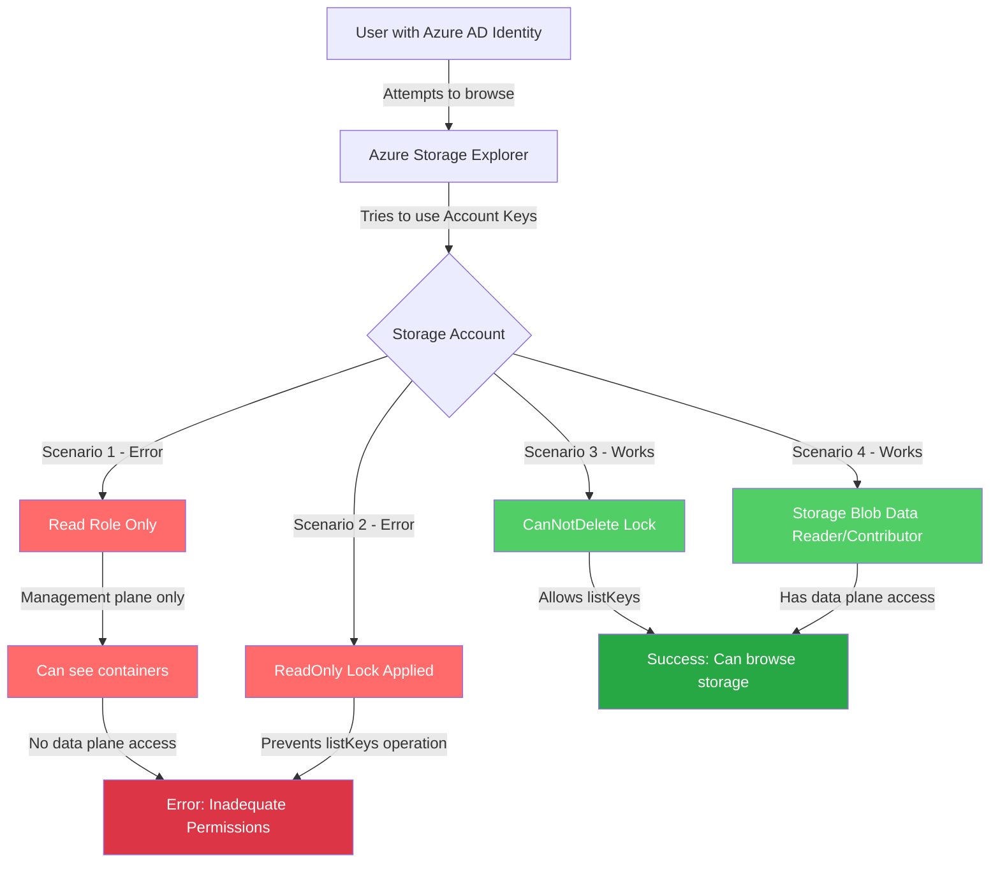
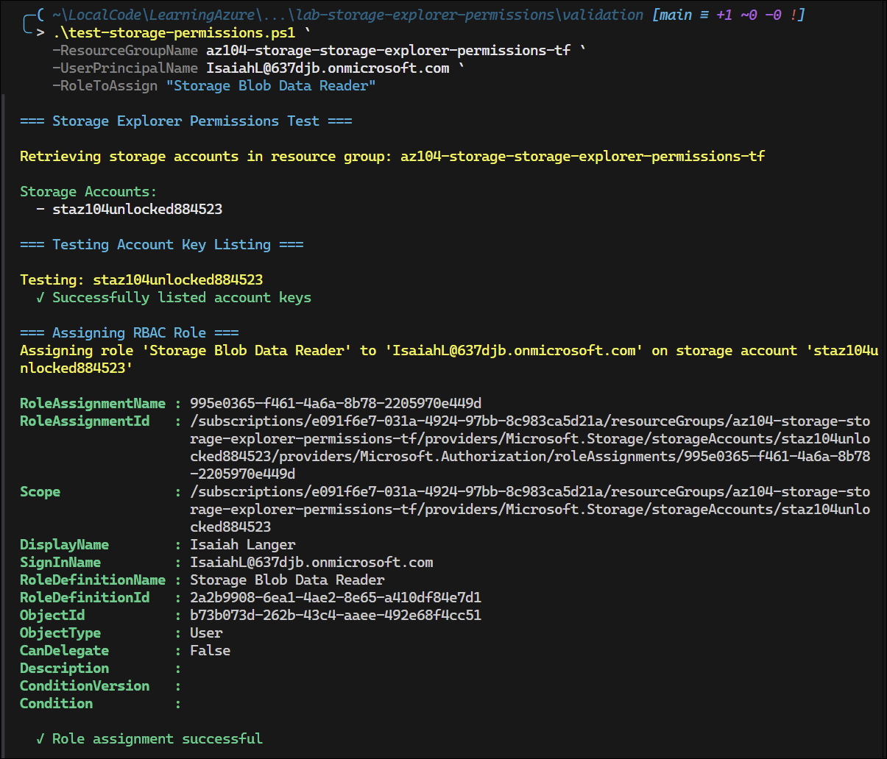
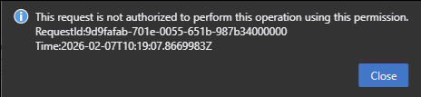

# Lab: Azure Storage Explorer Permission Troubleshooting

## Exam Question Scenario

You have storage accounts in your Azure subscription for different purposes. The storage accounts have blob containers and file shares configured.

Some users access these storage accounts by using the Microsoft Azure Storage Explorer desktop application. They are reporting that they get the error message shown in the exhibit when they try to browse the contents of the storage account.

You need to resolve the issue.

**Error Message:** "Unable to list resources in account due to inadequate permissions. Permission to list containers or to list account keys is required."

**Question:** What are two possible reasons why users are getting this error message? Each correct answer presents a complete solution.

**Options:**

- Your users have the Storage Blob Data Reader role assigned in the storage accounts ✗ **Incorrect** - Users with this role CAN browse data
- There is a ReadOnly resource lock configured ✓ **Correct** - Prevents listing storage account keys
- There is a CanNotDelete resource lock configured ✗ **Incorrect** - Does NOT prevent access
- Your users have the Read role assigned in the storage accounts ✓ **Correct** - Users can see containers but cannot browse contents
- Your users have the Storage Blob Data Contributor role assigned in the storage accounts ✗ **Incorrect** - Users with this role CAN browse contents

**Correct Exam Answers (TWO):**

1. **ReadOnly resource lock** - Prevents the `listKeys` operation required by Storage Explorer
2. **Read role assigned** - Management plane access only, lacks data plane permissions to browse blob contents

**Lab Validation:** These answers have been verified through hands-on lab testing and are consistent with the analysis documented in the [MeasureUp AZ-104 Assessment notes](/AZ-104/practice-exams/MU%20AZ-104%20Assessment/notes.md#wrong-answers-review).

## Scenario Analysis

This scenario tests understanding of:

1. **Azure Storage authentication methods:**
   - Account key-based authentication (default in Storage Explorer)
   - Azure AD authentication with RBAC roles

2. **RBAC role types:**
   - **Data plane roles**: Storage Blob Data Reader, Storage Blob Data Contributor (access to blob data - CAN browse contents)
   - **Management plane roles**: Read, Contributor (access to resource configuration and keys)
   - **Read role limitation**: Provides management plane access but NOT data plane access

3. **Resource locks:**
   - **ReadOnly**: Prevents modifications, including the `listKeys` operation
   - **CanNotDelete**: Does NOT prevent Storage Explorer access (allows key listing)

## Solution Architecture

This lab creates storage accounts with different configurations to demonstrate the permission issues:

1. **Storage account without locks** - Baseline for testing
2. **Storage account with ReadOnly lock** (optional) - Demonstrates lock-based permission issue
3. **Storage account with CanNotDelete lock** (optional) - Shows this lock does NOT cause access issues



**Cost Optimization:** This lab uses cost-effective resources:

- Storage Accounts: Standard LRS tier (lowest cost)
- No compute resources required
- Minimal storage used (blob containers and file shares with no significant data)

## Prerequisites

- Azure CLI installed and authenticated
- Terraform (>= 1.0) installed
- Azure subscription with appropriate permissions
- Resource provider registered: `Microsoft.Storage`

### Terraform Prerequisites

**CRITICAL:** Switch to Lab Azure profile before any Terraform operations:

```powershell
Use-AzProfile Lab
```

Ensure you have a `terraform.tfvars` file with your subscription ID:

```bash
# The terraform.tfvars should contain:
lab_subscription_id = "e091f6e7-031a-4924-97bb-8c983ca5d21a"
```

Register the storage provider if needed:

```bash
az provider register --namespace Microsoft.Storage
```

## Lab Objectives

1. Deploy storage accounts with different permission configurations
2. Understand the difference between data plane and management plane RBAC roles
3. Test Azure Storage Explorer authentication behavior
4. Observe the impact of resource locks on key listing operations
5. Implement solutions to resolve Storage Explorer permission errors

## Deployment

### Terraform Deployment

1. **CRITICAL:** Switch to Lab Azure profile:

   ```powershell
   Use-AzProfile Lab
   ```

2. Navigate to the terraform directory:

   ```bash
   cd terraform
   ```

3. Verify `terraform.tfvars` exists with your subscription ID:

   ```bash
   # File should already exist with lab subscription ID
   cat terraform.tfvars
   ```

4. Initialize Terraform:

   ```bash
   terraform init
   ```

5. Validate the configuration:

   ```bash
   terraform validate
   ```

6. Review the planned changes:

   ```bash
   terraform plan
   ```

7. Deploy the infrastructure:

   ```bash
   terraform apply
   ```

8. (Optional) Deploy with resource locks to test those scenarios:

   ```bash
   # Test ReadOnly lock scenario
   terraform apply -var="enable_readonly_lock=true"
   
   # Test CanNotDelete lock scenario
   terraform apply -var="enable_cannotdelete_lock=true"
   
   # Test both scenarios
   terraform apply -var="enable_readonly_lock=true" -var="enable_cannotdelete_lock=true"
   ```

## Validation Steps

### Using the Validation Script

1. **CRITICAL:** Ensure Lab profile is active:

   ```powershell
   Use-AzProfile Lab
   ```

2. Run the validation script:

   ```powershell
   cd ../validation
   .\test-storage-permissions.ps1
   ```

3. Assign a role to a user for testing:

   ```powershell
   # Test with Read role (will cause error - can see but not browse)
   .\test-storage-permissions.ps1 `
       -UserPrincipalName "user@yourdomain.com" `
       -RoleToAssign "Read"
   
   # Test with Storage Blob Data Reader (should work - data plane access)
   .\test-storage-permissions.ps1 `
       -UserPrincipalName "user@yourdomain.com" `
       -RoleToAssign "Storage Blob Data Reader"
   ```

    

### Manual Validation

1. **List deployed storage accounts:**

   ```bash
   az storage account list \
       --resource-group az104-storage-storage-explorer-permissions-tf \
       --output table
   ```

2. **Check resource locks:**

   ```bash
   # Get resource group ID first
   $rgId = (az group show --name az104-storage-storage-explorer-permissions-tf --query id -o tsv)
   
   # List locks
   az lock list --resource-group az104-storage-storage-explorer-permissions-tf --output table
   ```

3. **Try to list account keys** (should succeed on unlocked accounts):

   ```bash
   az storage account keys list \
       --resource-group az104-storage-storage-explorer-permissions-tf \
       --account-name <storage-account-name>
   ```

4. **Test in Azure Portal:**
   - Navigate to the storage account
   - Try to access "Access keys" blade
   - Observe any errors if ReadOnly lock is present



## Testing the Solution

### Scenario 1: Read Role Only (Management Plane)

**Setup:**

1. Assign "Read" role to a user on a storage account
2. Ensure the user does NOT have data plane roles (Storage Blob Data Reader/Contributor)

**Test:**

1. Open Azure Storage Explorer
2. Sign in as the test user
3. Try to browse the storage account

**Expected Result:**

- ✗ Error: "Unable to list resources in account due to inadequate permissions"
- User can see containers but cannot browse blob contents
- Reason: Read role provides management plane access only, lacks data plane permissions

**Solution:**

- Add "Storage Blob Data Reader" or "Storage Blob Data Contributor" role (data plane), OR
- Add "Contributor" role which includes both management and data access


### Scenario 2: ReadOnly Resource Lock

**Setup:**

1. Deploy with `enable_readonly_lock = true`
2. Assign Contributor role to a user on the storage account

**Test:**

1. Try to list account keys via CLI or Storage Explorer
2. Try to access "Access keys" blade in Azure Portal

**Expected Result:**

- Error when trying to list keys: operation prevented by lock
- Reason: `listKeys` is a POST operation, blocked by ReadOnly lock

**Solution:**

- Remove the ReadOnly lock, OR
- Configure Storage Explorer to use Azure AD authentication

### Scenario 3: CanNotDelete Lock

**Setup:**

1. Deploy with `enable_cannotdelete_lock = true`
2. Assign appropriate roles to a user on the storage account

**Test:**

1. Try to list account keys
2. Try to browse in Storage Explorer

**Expected Result (Confirmed through testing):**

- ✓ Key listing succeeds
- ✓ Storage Explorer can browse the account
- Reason: CanNotDelete lock does NOT prevent listKeys operation

**Note:** CanNotDelete lock only prevents resource deletion, not access operations.

### Scenario 4: Storage Blob Data Reader/Contributor Role

**Setup:**

1. Assign "Storage Blob Data Reader" or "Storage Blob Data Contributor" role to a user
2. User has data plane access

**Test:**

1. Open Azure Storage Explorer
2. Sign in as the test user
3. Try to browse the storage account

**Expected Result:**

- ✓ Success: User can browse blob contents
- Reason: Data plane roles provide direct access to blob data

**Note:** When using account key authentication, Storage Explorer works with data plane roles.

### Using Azure Storage Explorer with Azure AD Auth

To use Azure AD authentication instead of account keys:

1. Open Azure Storage Explorer
2. Go to Edit → Azure Active Directory
3. Ensure "Use Azure Active Directory" is enabled
4. Sign in with an account that has appropriate data plane roles
5. Browse should work with Storage Blob Data Reader/Contributor roles

## Cleanup

### Terraform Cleanup

**CRITICAL:** Ensure you're using the Lab profile before cleanup:

```powershell
Use-AzProfile Lab
```

```bash
cd terraform
terraform destroy
```

**Note:** If ReadOnly resource lock is enabled, you may need to remove it first:

```bash
# Remove ReadOnly lock before destroying (if enabled)
az lock delete --name lock-readonly --resource-group az104-storage-storage-explorer-permissions-tf

# CanNotDelete lock can be removed by terraform destroy
# Then destroy
terraform destroy
```

**Important:** ReadOnly locks prevent management operations including `terraform destroy`. CanNotDelete locks allow modifications but prevent deletion.

## Key Learning Points

1. **Storage Explorer authentication:**
   - Can use account keys (requires management plane to list keys)
   - Can use Azure AD authentication with data plane roles
   - Account key method requires both management and data plane access

2. **Data plane vs Management plane roles:**
   - **Data plane**: Storage Blob Data Reader, Storage Blob Data Contributor
     - Grant direct access to blob/file/queue/table data
     - Allow browsing contents in Storage Explorer
     - Work with Azure AD authentication
   - **Management plane**: Read, Contributor, Owner
     - Read role: Can see containers but NOT browse contents (lacks data plane)
     - Contributor/Owner: Include both management and data access

3. **Resource locks behavior:**
   - **ReadOnly**: Prevents ALL write operations, including listKeys (POST operation)
   - **CanNotDelete**: Allows all operations except deletion (does NOT prevent listKeys)

4. **Solutions for Storage Explorer errors:**
   - For Read role only: Add data plane role (Storage Blob Data Reader/Contributor)
   - For ReadOnly locks: Remove the lock OR use Azure AD authentication
   - Configure Storage Explorer to use Azure AD authentication with data plane roles
   - Use Azure Portal with appropriate RBAC permissions

5. **Correct exam answers (2 out of 5 options cause the error):**
   - ✗ Storage Blob Data Reader role - Users CAN browse (data plane access)
   - ✓ ReadOnly resource lock - Prevents listKeys operation
   - ✗ CanNotDelete lock - Does NOT prevent access
   - ✓ Read role - Can see containers but cannot browse contents
   - ✗ Storage Blob Data Contributor role - Users CAN browse (data plane access)

6. **Key distinction:**
   - **Read role** = Management plane only (can see but not browse)
   - **Storage Blob Data Reader/Contributor** = Data plane access (can browse)
   - **Contributor role** = Both management and data plane access
   - **These findings are verified through hands-on testing and consistent with the MeasureUp AZ-104 Assessment analysis**

## Related AZ-104 Exam Objectives

- **AZ-104: Manage Azure identities and governance (20-25%)**
  - Manage Azure role-based access control (RBAC)
  - Manage subscriptions and governance
  
- **AZ-104: Implement and manage storage (15-20%)**
  - Configure access to storage
  - Manage storage accounts
  - Configure Azure Storage security

## Additional Resources

- [Azure Storage authentication overview](https://learn.microsoft.com/azure/storage/common/storage-auth)
- [Azure RBAC roles for storage](https://learn.microsoft.com/azure/storage/blobs/authorize-access-azure-active-directory)
- [Azure resource locks](https://learn.microsoft.com/azure/azure-resource-manager/management/lock-resources)
- [Azure Storage Explorer](https://azure.microsoft.com/products/storage/storage-explorer/)
- [Troubleshoot Storage Explorer](https://learn.microsoft.com/azure/storage/common/storage-explorer-troubleshooting)
