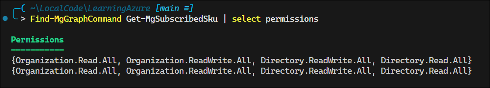
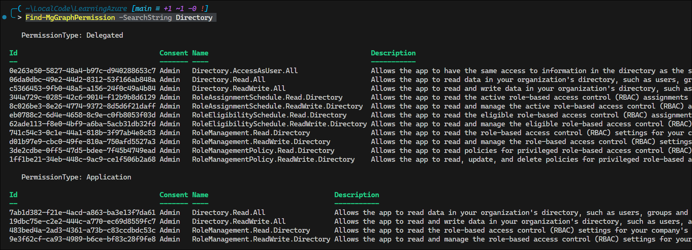
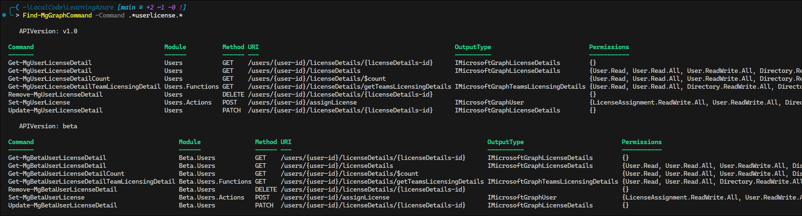

# Lab 1 – Deep Dive: Using the Microsoft Graph and Entra PowerShell Commands

## Overview

This article covers basic topics in using the Microsoft Graph and Entra PowerShell commands.

## Find Required Permissions

```pwsh
Find-MgGraphCommand Get-MgSubscribedSku | select permissions
```



## List Available Permissions

```pwsh
Find-MgGraphPermission -SearchString Directory
```



You can also use `Find-EntraPermission`.

## Find Graph Commands

Use the formal wildcard regex `.*` to find commands.

```pwsh
Find-MgGraphCommand -Command .*userlicense.*
```



[Find-MgGraphCommand](https://learn.microsoft.com/en-us/powershell/microsoftgraph/find-mg-graph-command?view=graph-powershell-1.0)