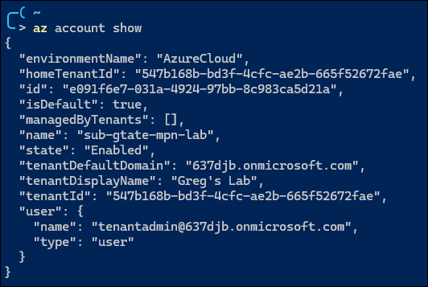

# Lab 1 – Deep Dive: Setup Identity Baseline

## Exercise 1 - Create Internal Users

### Using the `az` command

**Show login context:**  

```pwsh
az account show
```



**Create user (simple):**

```pwsh
az ad user create `
 --display-name "Alex Smith" `
 --user-principal-name 'user1@637djb.onmicrosoft.com' `
 --password "P@ssword123!" `
 --force-change-password-next-sign-in
```

**Remove user:**

```pwsh
az ad user delete --id 'user1@637djb.onmicrosoft.com'
```

**Create user (with more attributes):**

To create a new Azure AD user with both `givenName` and `surname` using the
Azure CLI (az), you’ll need to use the Microsoft Graph REST API via `az rest`,
because the standard `az ad` user create command does not directly support all
user properties.

```pwsh
$body = @'
{
  "accountEnabled": true,
  "displayName": "Alex Smith",
  "mailNickname": "alexs",
  "userPrincipalName": "user1@637djb.onmicrosoft.com",
  "givenName": "Alex",
  "surname": "Smith",
  "passwordProfile": {
    "forceChangePasswordNextSignIn": true,
    "password": "P@ssword123!"
  }
}
'@

# Validate & compress to a single-line JSON string
$json = $body | ConvertFrom-Json | ConvertTo-Json -Depth 5 -Compress

az rest `
  --method post `
  --uri "https://graph.microsoft.com/v1.0/users" `
  --headers "Content-Type=application/json" `
  --body $json
```


**References:**  

* [Quoting differences in Azure CLI](https://learn.microsoft.com/en-us/cli/azure/use-azure-cli-successfully-quoting?view=azure-cli-latest&tabs=bash1%2Cbash2%2Cbash3#json-strings)
* [Error: Failed to parse string as JSON](https://learn.microsoft.com/en-us/cli/azure/use-azure-cli-successfully-troubleshooting?view=azure-cli-latest#error-failed-to-parse-string-as-json)
