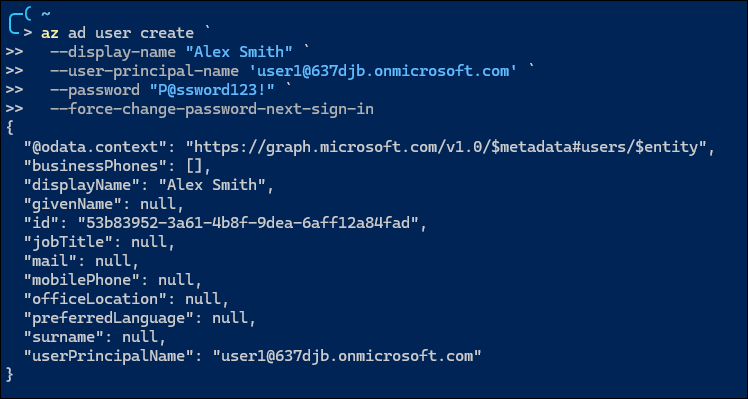
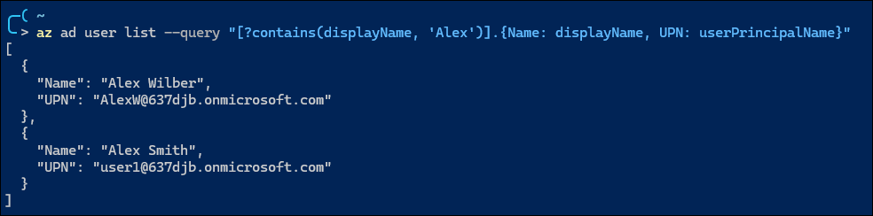

# **Lab 1 – Setup and Identity Baseline**

**Domain:** Manage Azure identities and governance
**Difficulty:** Medium-High (≈1.5–2 hrs)
**Dependencies:** None – requires only an Azure subscription

---

## 🎯 **Lab Objective**

Establish a secure and well-organized Microsoft Entra ID (Azure AD) identity baseline for a new Azure environment.
You will:

* Create and manage users, groups, and licenses
* Configure external (guest) user collaboration
* Enable and validate self-service password reset (SSPR)
* Explore licensing differences across Free, P1, P2, and Governance tiers

---

## 🧱 **Skills Measured (Exam Outline)**

* Create users and groups
* Manage user and group properties
* Manage license assignments
* Manage external users
* Configure self-service password reset (SSPR)

---

## 🧠 **Scenario**

You’ve been asked to prepare a clean Entra ID tenant for a project team called **Project AZ104**.
You’ll configure users, groups, and identity features to establish a governance baseline and verify tier-based feature differences.

---

## ⚙️ **Environment Setup**

| Component | Example                                            |
| --------- | -------------------------------------------------- |
| Tenant    | `637djb.onmicrosoft.com`                           |
| Users     | 3 internal users, 1 guest                          |
| Groups    | `Lab-Admins`, `Lab-Users`                          |
| Licenses  | M365 E5 or Entra ID Premium P1/P2                  |
| Tools     | Azure Portal, Azure CLI, VS Code (Bicep/Terraform) |

---

## ⏱ **Estimated Duration**

**90–120 minutes**

---

## 🔹 **Exercise 1 – Create Internal Users**

**Goal:** Create baseline users with key identity attributes.

1. **In Portal:**
   Create the following users:

   | UPN                                                                 | Display Name | Department | Job Title  |
   | ------------------------------------------------------------------- | ------------ | ---------- | ---------- |
   | [user1@637djb.onmicrosoft.com](mailto:user1@637djb.onmicrosoft.com) | Alex Smith   | Finance    | Analyst    |
   | [user2@637djb.onmicrosoft.com](mailto:user2@637djb.onmicrosoft.com) | Dana White   | IT         | Admin      |
   | [user3@637djb.onmicrosoft.com](mailto:user3@637djb.onmicrosoft.com) | Jamie Cruz   | HR         | Specialist |

2. **In CLI:**

   ```pwsh
   az ad user create `
     --display-name "Alex Smith" `
     --user-principal-name 'user1@637djb.onmicrosoft.com' `
     --password "P@ssword123!" `
     --force-change-password-next-sign-in
   ```

   

    See [Using the `az` command](./Lab01_Deep-Dive.md#using-the-az-command) for a deep dive on creating users via the CLI.


3. Verify users:

   ```pwsh
    az ad user list --query "[?contains(displayName, 'Alex')].{Name: displayName, UPN: userPrincipalName}"
   ```

   

   See [JMESPath Examples](https://jmespath.org/examples.html) for query syntax.

---

## 🔹 **Exercise 2 – Create and Configure Groups**

**Goal:** Organize users using static and dynamic membership.

1. **Static Group** – `Nebula-Admins`:

   * Members: `user2`
   * Owner: `user2`

2. **Dynamic Group** – `Nebula-Finance`:

   ```
   (user.department -eq "Finance")
   ```

3. Verify configuration:

   ```bash
   az ad group list --query "[].{Name:displayName, MembershipRule:membershipRule}"
   ```

💡 **Exam Insight:** Understand propagation latency of dynamic membership updates.

---

## 🔹 **Exercise 3 – Assign Licenses**

**Goal:** Enable features through license assignment.

1. Assign **Entra ID Premium P1** to `Nebula-Admins`.
2. Set **UsageLocation** before assigning:

   ```bash
   az ad user update --id user1@637djb.onmicrosoft.com --usage-location US
   ```
3. Validate:

   ```bash
   az ad user show --id user1@637djb.onmicrosoft.com --query assignedLicenses
   ```

---

## 🔹 **Exercise 4 – Invite and Manage a Guest User**

**Goal:** Enable secure collaboration.

1. Invite an external user:

   ```bash
   az ad user invite \
     --user-principal-name externaluser@gmail.com \
     --invite-redirect-url "https://portal.azure.com"
   ```
2. Add the guest to `Nebula-Users`.
3. Verify with:

   ```bash
   az ad user list --filter "userType eq 'Guest'"
   ```

🔍 **Exam Tip:** Guests need explicit RBAC assignments to access resources.

---

## 🔹 **Exercise 5 – Enable and Validate SSPR**

**Goal:** Enable and test self-service password reset for a group.

1. Go to **Entra ID → Password Reset → Properties**.
2. Enable SSPR for **Selected users** → `Nebula-Admins`.
3. Configure **authentication methods** (Email + Authenticator).
4. Test with a user from `Nebula-Admins`.
5. Review reset events under **Audit Logs → Password reset activity**.

---

## 🔹 **Exercise 6 – Explore License Tier Differences**

**Goal:** Compare capabilities across Free, P1, P2, and Governance tiers.

Create the following groups and assign appropriate licenses:

| Group     | License             | Features to Test                            |
| --------- | ------------------- | ------------------------------------------- |
| Tier-Free | None                | Basic SSPR (cloud users only)               |
| Tier-P1   | Entra ID Premium P1 | Conditional Access, group-based licensing   |
| Tier-P2   | Entra ID Premium P2 | Risk-based CA, Access Reviews               |
| Tier-Gov  | Entra ID Governance | Entitlement Management, Lifecycle Workflows |

🔬 Perform quick validation:

* Attempt to create Conditional Access policy (fails on Free).
* Open **Identity Governance** → Access Reviews (only visible on P2+).
* Try creating an **Entitlement Management catalog** (Governance only).

📄 See `/docs/License-Feature-Matrix.md` for detailed feature comparison.

---

## 🔹 **Optional – Automate via IaC**

**Bicep Example:**

```bicep
resource user1 'Microsoft.Entra/users@2023-01-01-preview' = {
  name: 'user1@637djb.onmicrosoft.com'
  properties: {
    displayName: 'Alex Smith'
    mailNickname: 'user1'
  }
}
```

**Terraform Example:**

```hcl
resource "azuread_user" "alex" {
  user_principal_name = "user1@637djb.onmicrosoft.com"
  display_name        = "Alex Smith"
  password            = "P@ssword123!"
}
```

---

## 🧩 **Validation Checklist**

| Task                      | Verification Command / Location                   |
| ------------------------- | ------------------------------------------------- |
| Users created             | `az ad user list`                                 |
| Groups created            | Portal → Groups                                   |
| Licenses assigned         | `az ad user show`                                 |
| Guest invited             | `az ad user list --filter "userType eq 'Guest'"`  |
| SSPR working              | Test “Forgot Password” flow                       |
| License features verified | Portal → Identity Governance / Conditional Access |

---

## 🧭 **Reflection & Readiness**

Be able to answer:

1. Why does license assignment fail without UsageLocation?
2. What’s the difference between P1 and P2 for Conditional Access?
3. How does SSPR behave for guest users?
4. What happens if two group-based licenses overlap?
5. Which license tier adds Entitlement Management?

---

## 🧹 **Cleanup**

```bash
az ad user delete --id user1@637djb.onmicrosoft.com
az ad group delete --group "Nebula-Admins"
az ad group delete --group "Tier-P1"
az ad group delete --group "Tier-P2"
az ad group delete --group "Tier-Gov"
```

---

## 📚 **References**

* [Compare Microsoft Entra ID Free, P1, P2, Governance](https://learn.microsoft.com/en-us/entra/fundamentals/licensing-comparison)
* [Enable and test self-service password reset](https://learn.microsoft.com/en-us/entra/identity/authentication/tutorial-enable-sspr)
* [Manage users and groups in Microsoft Entra ID](https://learn.microsoft.com/en-us/entra/identity/users/groups-settings)
* [Azure CLI reference: az ad user/group](https://learn.microsoft.com/en-us/cli/azure/ad/user)

---
