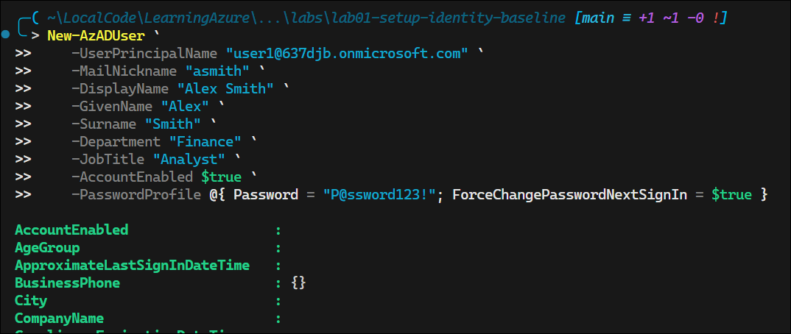
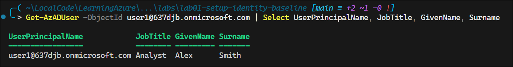
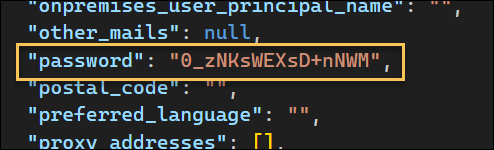
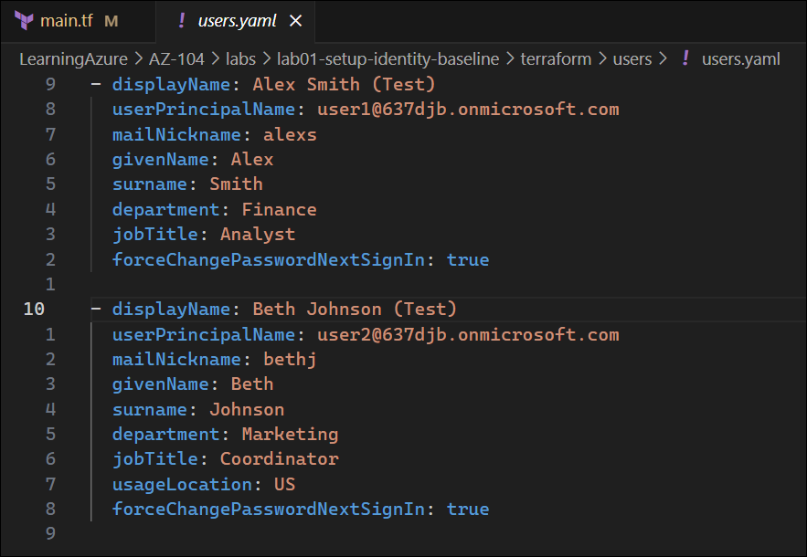
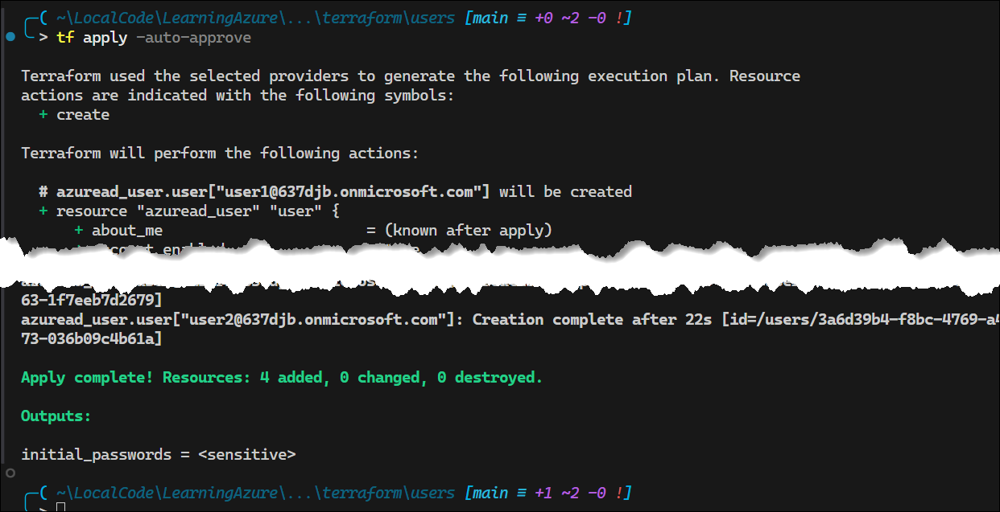
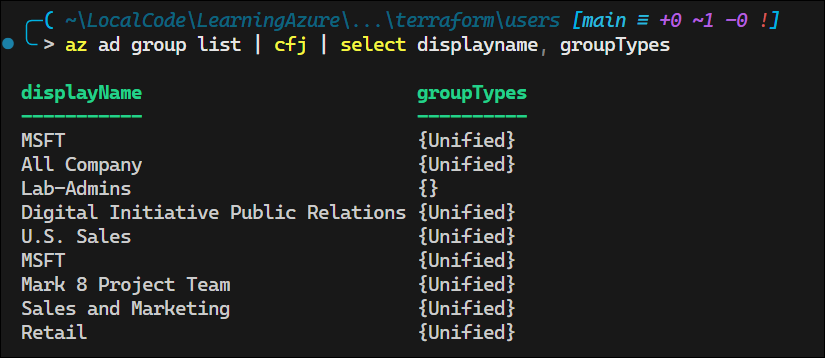
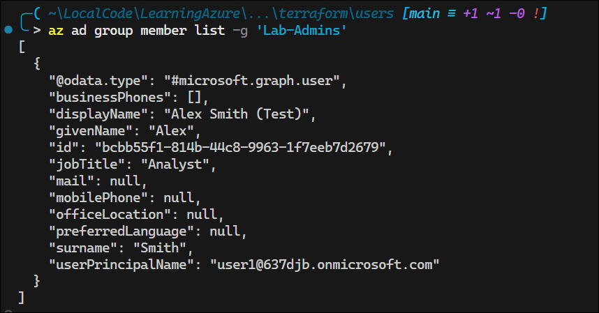
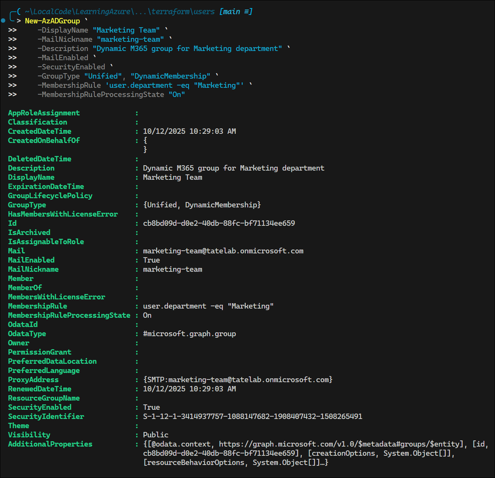
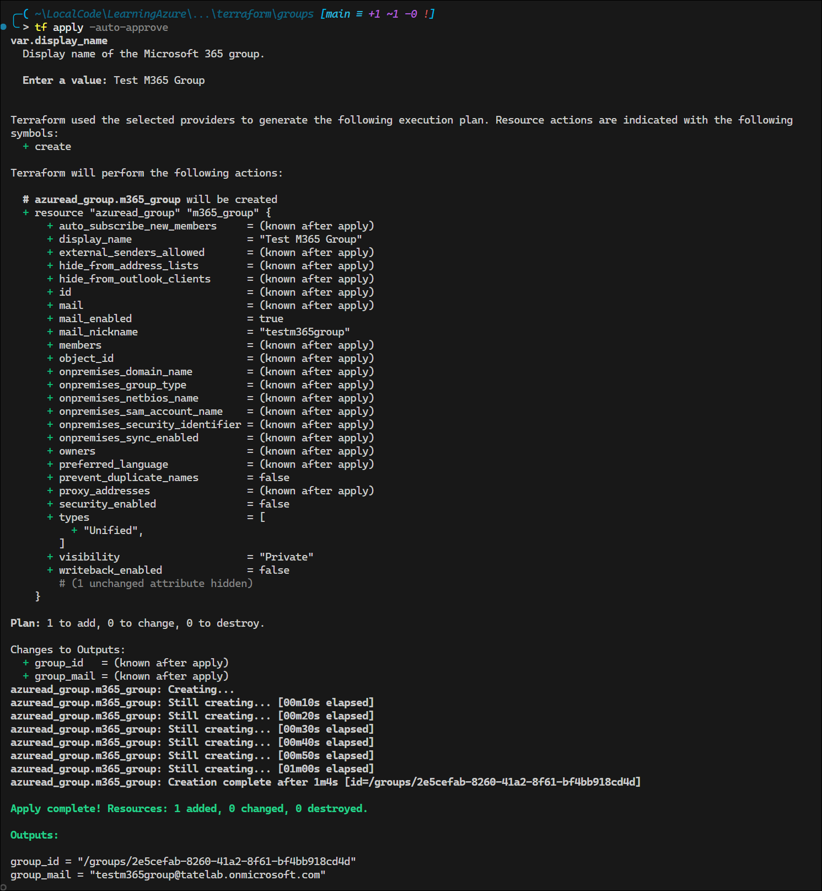

# Lab 1 – Setup and Identity Baseline

**Domain:** Manage Azure identities and governance  
**Difficulty:** Medium-High (≈1.5–2 hrs)  
**Dependencies:** None – requires only an Azure subscription

---

<!-- omit in toc -->
## 🧾 Contents

* [🎯 **Lab Objective**](#-lab-objective)
* [🧱 **Skills Measured (Exam Outline)**](#-skills-measured-exam-outline)
* [🧠 **Scenario**](#-scenario)
* [⚙️ **Environment Setup**](#️-environment-setup)
* [⏱ **Estimated Duration**](#-estimated-duration)
* [🔹 **Exercise 1 – Create Internal Users**](#-exercise-1--create-internal-users)
  * [Azure Portal](#azure-portal)
  * [Using `Az` CLI](#using-az-cli)
    * [Create user](#create-user)
    * [Verify user](#verify-user)
  * [Using PowerShell](#using-powershell)
    * [Create user](#create-user-1)
    * [Verify and Remove User](#verify-and-remove-user)
  * [Using Infrastructure as Code (IaC)](#using-infrastructure-as-code-iac)
    * [Bicep Example](#bicep-example)
    * [Terraform Example](#terraform-example)
* [🔹 Exercise 2 – Create and Configure Groups](#-exercise-2--create-and-configure-groups)
  * [Static Group – `Lab-Admins`](#static-group--lab-admins)
    * [Using `Az` CLI](#using-az-cli-1)
    * [Using PowerShell](#using-powershell-1)
    * [Using Infrastructure as Code (IaC)](#using-infrastructure-as-code-iac-1)
      * [Terraform Example](#terraform-example-1)
* [🔹 **Exercise 3 – Assign Licenses**](#-exercise-3--assign-licenses)
* [🔹 **Exercise 4 – Invite and Manage a Guest User**](#-exercise-4--invite-and-manage-a-guest-user)
* [🔹 **Exercise 5 – Enable and Validate SSPR**](#-exercise-5--enable-and-validate-sspr)
* [🔹 **Exercise 6 – Explore License Tier Differences**](#-exercise-6--explore-license-tier-differences)
* [🧩 **Validation Checklist**](#-validation-checklist)
* [🧭 **Reflection \& Readiness**](#-reflection--readiness)
* [🧹 **Cleanup**](#-cleanup)
* [📚 **References**](#-references)

## 🎯 **Lab Objective**

Establish a secure and well-organized Microsoft Entra ID (Azure AD) identity baseline for a new Azure environment.
You will:

* Create and manage users, groups, and licenses
* Configure external (guest) user collaboration
* Enable and validate self-service password reset (SSPR)
* Explore licensing differences across Free, P1, P2, and Governance tiers

---

## 🧱 **Skills Measured (Exam Outline)**

* Create users and groups
* Manage user and group properties
* Manage license assignments
* Manage external users
* Configure self-service password reset (SSPR)

---

## 🧠 **Scenario**

You’ve been asked to prepare a clean Entra ID tenant for a project team called **Project AZ104**.
You’ll configure users, groups, and identity features to establish a governance baseline and verify tier-based feature differences.

---

## ⚙️ **Environment Setup**

| Component | Example                                            |
| --------- | -------------------------------------------------- |
| Tenant    | `637djb.onmicrosoft.com`                           |
| Users     | 3 internal users, 1 guest                          |
| Groups    | `Lab-Admins`, `Lab-Users`                          |
| Licenses  | M365 E5 or Entra ID Premium P1/P2                  |
| Tools     | Azure Portal, Azure CLI, VS Code (Bicep/Terraform) |

---

## ⏱ **Estimated Duration**

**90–120 minutes**  

---

## 🔹 **Exercise 1 – Create Internal Users**

**Goal:** Create baseline users with key identity attributes.

### Azure Portal

Create the following users:

   | UPN                                                                 | Display Name | Department | Job Title  |
   | ------------------------------------------------------------------- | ------------ | ---------- | ---------- |
   | [user1@637djb.onmicrosoft.com](mailto:user1@637djb.onmicrosoft.com) | Alex Smith   | Finance    | Analyst    |
   | [user2@637djb.onmicrosoft.com](mailto:user2@637djb.onmicrosoft.com) | Dana White   | IT         | Admin      |
   | [user3@637djb.onmicrosoft.com](mailto:user3@637djb.onmicrosoft.com) | Jamie Cruz   | HR         | Specialist |

### Using `Az` CLI

#### Create user

```pwsh
az ad user create `
 --display-name "Alex Smith" `
 --user-principal-name 'user1@637djb.onmicrosoft.com' `
 --password "P@ssword123!" `
 --force-change-password-next-sign-in
```


The built-in `az ad user create` command does not support other attributes, such as `givenName` and `surname`, directly. For that, use the `az rest` method as shown in the Deep Dive link below.

🥽 Deep Dive: [Using the `az` command](./Lab01_Deep-Dive-Users.md#using-the-az-command).

Documentation: [az ad user](https://learn.microsoft.com/en-us/cli/azure/ad/user?view=azure-cli-latest)

#### Verify user

```pwsh
az ad user list --query "[?contains(displayName, 'Alex')].{Name: displayName, UPN: userPrincipalName}"
```


See [JMESPath Examples](https://jmespath.org/examples.html) for query syntax.

### Using PowerShell

#### Create user

```pwsh
New-AzADUser `
   -UserPrincipalName "user1@637djb.onmicrosoft.com" `
   -MailNickname "asmith" `
   -DisplayName "Alex Smith" `
   -GivenName "Alex" `
   -Surname "Smith" `
   -Department "Finance" `
   -JobTitle "Analyst" `
   -AccountEnabled $true `
   -PasswordProfile @{ Password = "P@ssword123!"; ForceChangePasswordNextSignIn = $true }
```



**Note:** The PowerShell version supports `givenName` and `surname` directly, among other properties.

#### Verify and Remove User

```pwsh
Get-AzADUser -ObjectId 'user1@637djb.onmicrosoft.com'

Remove-AzADUser -UPNOrObjectId 'user1@637djb.onmicrosoft.com'
```



Documentation: [New-AzADUser](https://learn.microsoft.com/en-us/powershell/module/az.resources/new-azaduser?view=azps-14.4.0)

### Using Infrastructure as Code (IaC)

#### Bicep Example

Azure Bicep cannot directly create Azure AD (Entra ID) user accounts, because Bicep operates through the Azure Resource Manager (ARM), and user objects live in Microsoft Entra ID, which is managed by the Microsoft Graph API, not ARM.

#### Terraform Example

For production scenarios, avoid using Terraform to create users because Terraform stores the passwords in plain text within the state file.

*terraform.tfstate*:  



See [main.tf](./terraform/users/main.tf) for a working example. This example uses the [users.yaml](./terraform/users/users.yaml) file for user definitions.





---

## 🔹 Exercise 2 – Create and Configure Groups

**Goal:** Organize users using static and dynamic membership.

### Static Group – `Lab-Admins`

#### Using `Az` CLI

The following command creates an Azure security group.

```pwsh
az ad group create --display-name 'Lab-Admins' --mail-nickname 'lab-admins'
```

Run the following command to list and verify the group:

```pwsh
az ad group list | cfj | select displayname, groupTypes
```

**Note:** `cfj` is a custom alias for `ConvertFrom-Json` in PowerShell.



**Note:** The `az ad group` command is limited to creating static security groups.

To add a member:

```pwsh
az ad group member add -g 'Lab-Admins' --member-id 'bcbb55f1-814b-44c8-9963-1f7eeb7d2679'
```

You must use the user's **object ID** (not UPN) to add them as a member. Use `az ad user list` to find the object ID.

Use `az ad group member list` to verify members:



The `az ad group` command provides limited functionality for group management. For fuller functionality, use either `az rest` or Microsoft Graph PowerShell.

#### Using PowerShell

The following command creates a dynamic M365 security group:

```pwsh
New-AzADGroup `                                                   
   -DisplayName "Marketing Team" `
   -MailNickname "marketing-team" `
   -Description "Dynamic M365 group for Marketing department" `
   -MailEnabled `
   -SecurityEnabled `
   -GroupType "Unified", "DynamicMembership" `
   -MembershipRule 'user.department -eq "Marketing"' `
   -MembershipRuleProcessingState "On"
```



💡 **Exam Insight:** Understand propagation latency of dynamic membership updates.


#### Using Infrastructure as Code (IaC)

##### Terraform Example

See [main.tf](./terraform/groups/main.tf) for a working example. 



---

## 🔹 **Exercise 3 – Assign Licenses**

**Goal:** Enable features through license assignment.

1. Assign **Entra ID Premium P1** to `Lab-Admins`.
2. Set **UsageLocation** before assigning:

   ```bash
   az ad user update --id user1@637djb.onmicrosoft.com --usage-location US
   ```

3. Validate:

   ```bash
   az ad user show --id user1@637djb.onmicrosoft.com --query assignedLicenses
   ```

---

## 🔹 **Exercise 4 – Invite and Manage a Guest User**

**Goal:** Enable secure collaboration.

1. Invite an external user:

   ```bash
   az ad user invite \
     --user-principal-name externaluser@gmail.com \
     --invite-redirect-url "https://portal.azure.com"
   ```

2. Add the guest to `Lab-Users`.
3. Verify with:

   ```bash
   az ad user list --filter "userType eq 'Guest'"
   ```

🔍 **Exam Tip:** Guests need explicit RBAC assignments to access resources.

---

## 🔹 **Exercise 5 – Enable and Validate SSPR**

**Goal:** Enable and test self-service password reset for a group.

1. Go to **Entra ID → Password Reset → Properties**.
2. Enable SSPR for **Selected users** → `Lab-Admins`.
3. Configure **authentication methods** (Email + Authenticator).
4. Test with a user from `Lab-Admins`.
5. Review reset events under **Audit Logs → Password reset activity**.

---

## 🔹 **Exercise 6 – Explore License Tier Differences**

**Goal:** Compare capabilities across Free, P1, P2, and Governance tiers.

Create the following groups and assign appropriate licenses:

| Group     | License             | Features to Test                            |
| --------- | ------------------- | ------------------------------------------- |
| Tier-Free | None                | Basic SSPR (cloud users only)               |
| Tier-P1   | Entra ID Premium P1 | Conditional Access, group-based licensing   |
| Tier-P2   | Entra ID Premium P2 | Risk-based CA, Access Reviews               |
| Tier-Gov  | Entra ID Governance | Entitlement Management, Lifecycle Workflows |

🔬 Perform quick validation:

* Attempt to create Conditional Access policy (fails on Free).
* Open **Identity Governance** → Access Reviews (only visible on P2+).
* Try creating an **Entitlement Management catalog** (Governance only).

📄 See `/docs/License-Feature-Matrix.md` for detailed feature comparison.

---

## 🧩 **Validation Checklist**

| Task                      | Verification Command / Location                   |
| ------------------------- | ------------------------------------------------- |
| Users created             | `az ad user list`                                 |
| Groups created            | Portal → Groups                                   |
| Licenses assigned         | `az ad user show`                                 |
| Guest invited             | `az ad user list --filter "userType eq 'Guest'"`  |
| SSPR working              | Test “Forgot Password” flow                       |
| License features verified | Portal → Identity Governance / Conditional Access |

---

## 🧭 **Reflection & Readiness**

Be able to answer:

1. Why does license assignment fail without UsageLocation?
2. What’s the difference between P1 and P2 for Conditional Access?
3. How does SSPR behave for guest users?
4. What happens if two group-based licenses overlap?
5. Which license tier adds Entitlement Management?

---

## 🧹 **Cleanup**

```bash
az ad user delete --id user1@637djb.onmicrosoft.com
az ad group delete --group "Lab-Admins"
az ad group delete --group "Tier-P1"
az ad group delete --group "Tier-P2"
az ad group delete --group "Tier-Gov"
```

---

## 📚 **References**

* [Compare Microsoft Entra ID Free, P1, P2, Governance](https://learn.microsoft.com/en-us/entra/fundamentals/licensing-comparison)
* [Enable and test self-service password reset](https://learn.microsoft.com/en-us/entra/identity/authentication/tutorial-enable-sspr)
* [Manage users and groups in Microsoft Entra ID](https://learn.microsoft.com/en-us/entra/identity/users/groups-settings)
* [Azure CLI reference: az ad user/group](https://learn.microsoft.com/en-us/cli/azure/ad/user)

---
