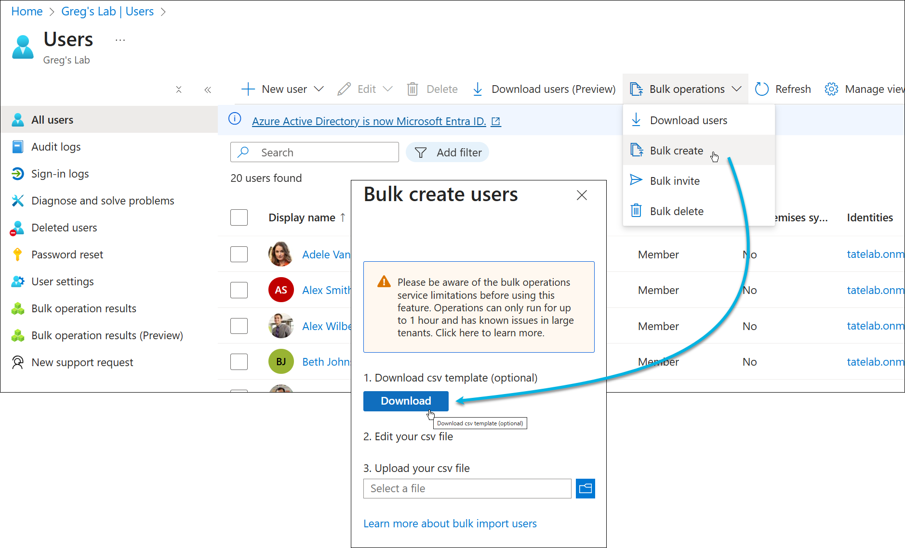
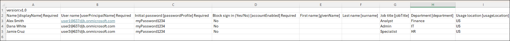
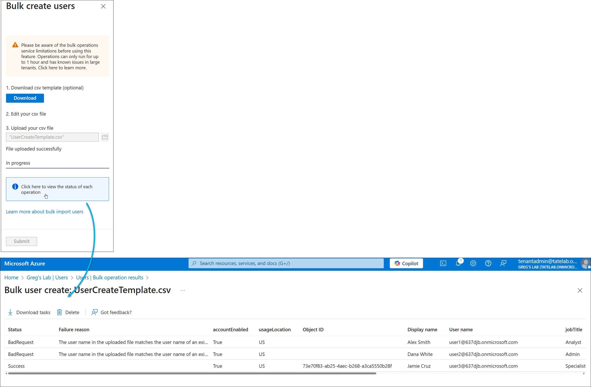

# Lab 1 – Setup and Identity Baseline

**Domain:** Manage Azure identities and governance  
**Difficulty:** Medium-High (≈1.5–2 hrs)  
**Dependencies:** None – requires only an Azure subscription

---

<!-- omit in toc -->
## 🧾 Contents

* [🎯 Lab Objective](#-lab-objective)
* [🧱 Skills Measured (Exam Outline)](#-skills-measured-exam-outline)
* [🧠 Scenario](#-scenario)
* [⚙️ Environment Setup](#️-environment-setup)
* [⏱ Estimated Duration](#-estimated-duration)
* [🔹 Exercise 1 – Create Internal Users](#-exercise-1--create-internal-users)
  * [Azure Portal (Bulk Users)](#azure-portal-bulk-users)
  * [Using `Az` CLI](#using-az-cli)
    * [Create user](#create-user)
    * [Verify user](#verify-user)
  * [Using PowerShell](#using-powershell)
    * [Create user](#create-user-1)
    * [Verify and Remove User](#verify-and-remove-user)
  * [Using Infrastructure as Code (IaC)](#using-infrastructure-as-code-iac)
    * [Bicep Example](#bicep-example)
    * [Terraform Example](#terraform-example)
    * [Exam Insights](#exam-insights)
* [🔹 Exercise 2 – Create and Configure Groups](#-exercise-2--create-and-configure-groups)
  * [Static Group – `Lab-Admins`](#static-group--lab-admins)
    * [Using `Az` CLI](#using-az-cli-1)
    * [Using Terraform](#using-terraform)
  * [Dynamic Group - `Marketing Team`](#dynamic-group---marketing-team)
    * [Using PowerShell](#using-powershell-1)
    * [Exam Insights](#exam-insights-1)
* [🔹 Exercise 3 – Assign Licenses](#-exercise-3--assign-licenses)
  * [Licensing Assignment through PowerShell](#licensing-assignment-through-powershell)
  * [Group-Based Licensing](#group-based-licensing)
    * [Exam Insights](#exam-insights-2)
* [🔹 Exercise 4 – Invite and Manage a Guest User](#-exercise-4--invite-and-manage-a-guest-user)
* [🔹 Exercise 5 – Enable and Validate SSPR](#-exercise-5--enable-and-validate-sspr)
* [🔹 Exercise 6 – Explore License Tier Differences](#-exercise-6--explore-license-tier-differences)
* [🧩 Validation Checklist](#-validation-checklist)
* [🧭 Reflection \& Readiness](#-reflection--readiness)
* [🧹 Cleanup](#-cleanup)
* [📚 References](#-references)

## 🎯 Lab Objective

Establish a secure and well-organized Microsoft Entra ID (Azure AD) identity baseline for a new Azure environment.
You will:

* Create and manage users, groups, and licenses
* Configure external (guest) user collaboration
* Enable and validate self-service password reset (SSPR)
* Explore licensing differences across Free, P1, P2, and Governance tiers

---

## 🧱 Skills Measured (Exam Outline)

* Create users and groups
* Manage user and group properties
* Manage license assignments
* Manage external users
* Configure self-service password reset (SSPR)

---

## 🧠 Scenario

You’ve been asked to prepare a clean Entra ID tenant for a project team called **Project AZ104**.
You’ll configure users, groups, and identity features to establish a governance baseline and verify tier-based feature differences.

---

## ⚙️ Environment Setup

| Component | Example                                            |
| --------- | -------------------------------------------------- |
| Tenant    | `637djb.onmicrosoft.com`                           |
| Users     | 3 internal users, 1 guest                          |
| Groups    | `Lab-Admins`, `Lab-Users`                          |
| Licenses  | M365 E5 or Entra ID Premium P1/P2                  |
| Tools     | Azure Portal, Azure CLI, VS Code (Bicep/Terraform) |

---

## ⏱ Estimated Duration

**90–120 minutes**  

---

## 🔹 Exercise 1 – Create Internal Users

**Goal:** Create baseline users with key identity attributes.

### Azure Portal (Bulk Users)

Create the following users:

   | UPN                                                                 | Display Name | Department | Job Title  |
   | ------------------------------------------------------------------- | ------------ | ---------- | ---------- |
   | [user1@637djb.onmicrosoft.com](mailto:user1@637djb.onmicrosoft.com) | Alex Smith   | Finance    | Analyst    |
   | [user2@637djb.onmicrosoft.com](mailto:user2@637djb.onmicrosoft.com) | Dana White   | IT         | Admin      |
   | [user3@637djb.onmicrosoft.com](mailto:user3@637djb.onmicrosoft.com) | Jamie Cruz   | HR         | Specialist |



Notes on the .csv template:

* The first two rows of the upload template must not be removed or modified, or the upload can't be processed.
* The required columns are listed first.
* We don't recommend adding new columns to the template. Any additional columns you add are ignored and not processed.
* We recommend that you download the latest version of the CSV template as often as possible.
* Make sure to check there is no unintended whitespace before/after any field. For User principal name, having such whitespace would cause import failure.
* Ensure that values in Initial password comply with the currently active password policy.



The process will create other users even if some rows have errors.



See [Create users in bulk](https://learn.microsoft.com/en-us/entra/identity/users/users-bulk-add)

### Using `Az` CLI

#### Create user

```pwsh
az ad user create `
 --display-name "Alex Smith" `
 --user-principal-name 'user1@637djb.onmicrosoft.com' `
 --password "P@ssword123!" `
 --force-change-password-next-sign-in
```


The built-in `az ad user create` command only supports required attributes. It does does not support other attributes, such as `givenName` and `surname`, directly. For that, use the `az rest` method as shown in the Deep Dive link below.

🥽 Deep Dive: [Using the `az` command](./Lab01_Deep-Dive-Users.md#using-the-az-command).

Documentation: [az ad user](https://learn.microsoft.com/en-us/cli/azure/ad/user?view=azure-cli-latest)

#### Verify user

```pwsh
az ad user list --query "[?contains(displayName, 'Alex')].{Name: displayName, UPN: userPrincipalName}"
```


See [JMESPath Examples](https://jmespath.org/examples.html) for query syntax.

### Using PowerShell

#### Create user

```pwsh
New-AzADUser `
   -UserPrincipalName "user1@637djb.onmicrosoft.com" `
   -MailNickname "asmith" `
   -DisplayName "Alex Smith" `
   -GivenName "Alex" `
   -Surname "Smith" `
   -Department "Finance" `
   -JobTitle "Analyst" `
   -AccountEnabled $true `
   -PasswordProfile @{ Password = "P@ssword123!"; ForceChangePasswordNextSignIn = $true }
```


**Note:** The PowerShell version supports `givenName` and `surname` directly, among other properties.

#### Verify and Remove User

```pwsh
Get-AzADUser -ObjectId 'user1@637djb.onmicrosoft.com'

Remove-AzADUser -UPNOrObjectId 'user1@637djb.onmicrosoft.com'
```


Documentation: [New-AzADUser](https://learn.microsoft.com/en-us/powershell/module/az.resources/new-azaduser?view=azps-14.4.0)

### Using Infrastructure as Code (IaC)

#### Bicep Example

Azure Bicep cannot directly create Azure AD (Entra ID) user accounts, because Bicep operates through the Azure Resource Manager (ARM), and user objects live in Microsoft Entra ID, which is managed by the Microsoft Graph API, not ARM.

#### Terraform Example

For production scenarios, avoid using Terraform to create users because Terraform stores the passwords in plain text within the state file.

*terraform.tfstate*:  


See [main.tf](./terraform/users/main.tf) for a working example. This example uses the [users.yaml](./terraform/users/users.yaml) file for user definitions.


#### Exam Insights

💡 Know the difference between creating users via Portal, CLI, PowerShell, and Graph API—each method has different attribute support.

💡 Understand that `ForceChangePasswordNextSignIn` is a security best practice for initial passwords and is commonly tested.

💡 Remember that user accounts require a valid `UsageLocation` before licenses can be assigned—this is a frequent exam scenario.

💡 Be familiar with bulk user operations using CSV files in the Portal—the exam may ask about the most efficient way to create multiple users.

---

## 🔹 Exercise 2 – Create and Configure Groups

**Goal:** Organize users using static and dynamic membership.

### Static Group – `Lab-Admins`

#### Using `Az` CLI

The following command creates an Azure security group.

```pwsh
az ad group create --display-name 'Lab-Admins' --mail-nickname 'lab-admins'
```

Run the following command to list and verify the group:

```pwsh
az ad group list | cfj | select displayname, groupTypes
```

**Note:** `cfj` is a custom alias for `ConvertFrom-Json` in PowerShell.


**Note:** The `az ad group` command is limited to creating static security groups.

To add a member:

```pwsh
az ad group member add -g 'Lab-Admins' --member-id 'bcbb55f1-814b-44c8-9963-1f7eeb7d2679'
```

You must use the user's **object ID** (not UPN) to add them as a member. Use `az ad user list` to find the object ID.

Use `az ad group member list` to verify members:


The `az ad group` command provides limited functionality for group management. For fuller functionality, use either `az rest` or Microsoft Graph PowerShell.

#### Using Terraform

See [main.tf](./terraform/groups/main.tf) for a working example.


### Dynamic Group - `Marketing Team`

#### Using PowerShell

The following command creates a dynamic M365 security group:

```pwsh
New-AzADGroup `                                                   
   -DisplayName "Marketing Team" `
   -MailNickname "marketing-team" `
   -Description "Dynamic M365 group for Marketing department" `
   -MailEnabled `
   -SecurityEnabled `
   -GroupType "Unified", "DynamicMembership" `
   -MembershipRule 'user.department -eq "Marketing"' `
   -MembershipRuleProcessingState "On"
```


💡 **Exam Insight:** Understand propagation latency of dynamic membership updates.

#### Exam Insights

💡 Know the difference between Security Groups and Microsoft 365 Groups—Security Groups are for access control, M365 Groups include collaboration features like shared mailbox and Teams.

💡 Understand that dynamic groups require Entra ID Premium P1 or P2 licenses and are based on user or device attributes using membership rules.

💡 Remember that nested groups are supported for security groups but not for dynamic groups—this is a common exam scenario question.

💡 Be familiar with the membership rule syntax for dynamic groups (e.g., `user.department -eq "Marketing"`)—the exam may ask you to identify correct or incorrect rule syntax.

💡 Know that group-based license assignment is only available with Entra ID Premium P1 or higher and requires groups to be security-enabled—this is frequently tested.

---

## 🔹 Exercise 3 – Assign Licenses

**Goal:** Enable features through license assignment.

### Licensing Assignment through PowerShell

Use the following PowerShell commands to assign licenses to individual users:

```pwsh
# Set the UsageLocation property for the user (required for license assignment)
Set-AzADUser -ObjectId "user1@637djb.onmicrosoft.com" -UsageLocation "US"

# Assign a license to the user
Set-AzADUserLicense -ObjectId "user1@637djb.onmicrosoft.com" -AddLicenses "ENTERPRISEPREMIUM"
```

💡 **Note:** Replace `"ENTERPRISEPREMIUM"` with the appropriate SKU ID for the license you want to assign. Use `Get-AzADSubscribedSku` to list available SKUs.

### Group-Based Licensing

Group-based licensing simplifies license management by assigning licenses to groups instead of individual users. Follow these steps:

1. **Create a Security Group**  
   Use the following command to create a security group for licensing:

   ```pwsh
   New-AzADGroup `
      -DisplayName "License-Group-P1" `
      -MailNickname "license-group-p1" `
      -SecurityEnabled $true
   ```

2. **Assign Licenses to the Group**  
   Assign a license to the group using the Azure Portal or Microsoft Graph API. Group-based licensing requires Entra ID Premium P1 or higher.

3. **Add Users to the Group**  
   Add users to the group to inherit the assigned licenses:

   ```pwsh
   Add-AzADGroupMember -GroupObjectId "<GroupObjectId>" -MemberObjectId "<UserObjectId>"
   ```

4. **Verify License Assignment**  
   Verify that the users in the group have inherited the licenses:

   ```pwsh
   Get-AzADUser -ObjectId "user1@637djb.onmicrosoft.com" | Select-Object DisplayName, AssignedLicenses
   ```

💡 **Exam Insight:** Group-based licensing is a key feature of Entra ID Premium P1 and is often tested in scenarios involving license management at scale.

#### Exam Insights

💡 Understand that `UsageLocation` is a required property for license assignment—this is a common exam scenario.

💡 Know the difference between assigning licenses to individual users versus groups—group-based licensing simplifies management at scale.

💡 Be familiar with the PowerShell cmdlets for license assignment, such as `Set-AzADUserLicense`, and their required parameters.

💡 Remember that group-based licensing requires the group to be security-enabled and is only available with Entra ID Premium P1 or higher.

💡 Understand how to verify license assignments using commands like `Get-AzADUser` and the `AssignedLicenses` property—this is frequently tested.

---

## 🔹 Exercise 4 – Invite and Manage a Guest User

**Goal:** Enable secure collaboration.

1. Invite an external user:

   ```bash
   az ad user invite \
     --user-principal-name externaluser@gmail.com \
     --invite-redirect-url "https://portal.azure.com"
   ```

2. Add the guest to `Lab-Users`.
3. Verify with:

   ```bash
   az ad user list --filter "userType eq 'Guest'"
   ```

🔍 **Exam Tip:** Guests need explicit RBAC assignments to access resources.

---

## 🔹 Exercise 5 – Enable and Validate SSPR

**Goal:** Enable and test self-service password reset for a group.

1. Go to **Entra ID → Password Reset → Properties**.
2. Enable SSPR for **Selected users** → `Lab-Admins`.
3. Configure **authentication methods** (Email + Authenticator).
4. Test with a user from `Lab-Admins`.
5. Review reset events under **Audit Logs → Password reset activity**.

---

## 🔹 Exercise 6 – Explore License Tier Differences

**Goal:** Compare capabilities across Free, P1, P2, and Governance tiers.

Create the following groups and assign appropriate licenses:

| Group     | License             | Features to Test                            |
| --------- | ------------------- | ------------------------------------------- |
| Tier-Free | None                | Basic SSPR (cloud users only)               |
| Tier-P1   | Entra ID Premium P1 | Conditional Access, group-based licensing   |
| Tier-P2   | Entra ID Premium P2 | Risk-based CA, Access Reviews               |
| Tier-Gov  | Entra ID Governance | Entitlement Management, Lifecycle Workflows |

🔬 Perform quick validation:

* Attempt to create Conditional Access policy (fails on Free).
* Open **Identity Governance** → Access Reviews (only visible on P2+).
* Try creating an **Entitlement Management catalog* (Governance only).

📄 See `/docs/License-Feature-Matrix.md` for detailed feature comparison.

---

## 🧩 Validation Checklist

| Task                      | Verification Command / Location                   |
| ------------------------- | ------------------------------------------------- |
| Users created             | `az ad user list`                                 |
| Groups created            | Portal → Groups                                   |
| Licenses assigned         | `az ad user show`                                 |
| Guest invited             | `az ad user list --filter "userType eq 'Guest'"`  |
| SSPR working              | Test “Forgot Password” flow                       |
| License features verified | Portal → Identity Governance / Conditional Access |

---

## 🧭 Reflection & Readiness

Be able to answer:

1. Why does license assignment fail without UsageLocation?
2. What’s the difference between P1 and P2 for Conditional Access?
3. How does SSPR behave for guest users?
4. What happens if two group-based licenses overlap?
5. Which license tier adds Entitlement Management?

---

## 🧹 Cleanup

```bash
az ad user delete --id user1@637djb.onmicrosoft.com
az ad group delete --group "Lab-Admins"
az ad group delete --group "Tier-P1"
az ad group delete --group "Tier-P2"
az ad group delete --group "Tier-Gov"
```

---

## 📚 References

* [Compare Microsoft Entra ID Free, P1, P2, Governance](https://learn.microsoft.com/en-us/entra/fundamentals/licensing-comparison)
* [Enable and test self-service password reset](https://learn.microsoft.com/en-us/entra/identity/authentication/tutorial-enable-sspr)
* [Manage users and groups in Microsoft Entra ID](https://learn.microsoft.com/en-us/entra/identity/users/groups-settings)
* [Azure CLI reference: az ad user/group](https://learn.microsoft.com/en-us/cli/azure/ad/user)

---
