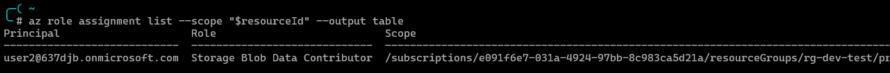
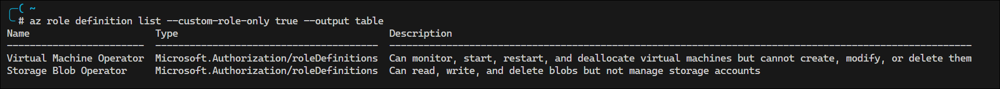

# Lab 2 – Role-Based Access & Scoping

**Domain:** Manage Azure identities and governance  
**Difficulty:** Medium (≈1.5–2 hrs)  
**Dependencies:** Lab 1 – Setup and Identity Baseline

---

<!-- omit in toc -->
## 🧾 Contents

* [🎯 Lab Objective](#-lab-objective)
* [🧱 Skills Measured (Exam Outline)](#-skills-measured-exam-outline)
* [🧠 Scenario](#-scenario)
* [⚙️ Environment Setup](#️-environment-setup)
* [⏱ Estimated Duration](#-estimated-duration)
* [🔹 Exercise 1 – Explore Built-in Azure Roles](#-exercise-1--explore-built-in-azure-roles)
  * [Using the Azure Portal](#using-the-azure-portal)
  * [Using PowerShell (`Get-AzRoleDefinition`)](#using-powershell-get-azroledefinition)
  * [Using Azure CLI (`az role definition list`)](#using-azure-cli-az-role-definition-list)
  * [Understanding Key Built-in Roles](#understanding-key-built-in-roles)
  * [Exam Insights](#exam-insights)
* [🔹 Exercise 2 – Assign Roles at Different Scopes](#-exercise-2--assign-roles-at-different-scopes)
  * [Understanding Scope Hierarchy](#understanding-scope-hierarchy)
  * [Assign Role at Subscription Scope](#assign-role-at-subscription-scope)
    * [Using the Azure Portal](#using-the-azure-portal-1)
    * [Using PowerShell (`New-AzRoleAssignment`)](#using-powershell-new-azroleassignment)
    * [Using Azure CLI (`az role assignment create`)](#using-azure-cli-az-role-assignment-create)
  * [Assign Role at Resource Group Scope](#assign-role-at-resource-group-scope)
    * [Using the Azure Portal](#using-the-azure-portal-2)
    * [Using PowerShell](#using-powershell)
    * [Using Azure CLI](#using-azure-cli)
  * [Assign Role at Resource Scope](#assign-role-at-resource-scope)
    * [Using PowerShell](#using-powershell-1)
    * [Using Azure CLI](#using-azure-cli-1)
  * [Using Bicep for Role Assignments](#using-bicep-for-role-assignments)
  * [Using Terraform for Role Assignments](#using-terraform-for-role-assignments)
  * [Exam Insights](#exam-insights-1)
* [🔹 Exercise 3 – Verify Role Inheritance and Effective Permissions](#-exercise-3--verify-role-inheritance-and-effective-permissions)
  * [Understanding Permission Inheritance](#understanding-permission-inheritance)
  * [Verify Effective Permissions](#verify-effective-permissions)
    * [Using the Azure Portal](#using-the-azure-portal-3)
    * [Using PowerShell (`Get-AzRoleAssignment`)](#using-powershell-get-azroleassignment)
    * [Get role assignments for a resource group (includes inherited)](#get-role-assignments-for-a-resource-group-includes-inherited)
    * [Using Azure CLI (`az role assignment list`)](#using-azure-cli-az-role-assignment-list)
  * [Exam Insights](#exam-insights-2)
* [🔹 Exercise 4 – Implement Just-Enough-Access (JEA) Principle](#-exercise-4--implement-just-enough-access-jea-principle)
  * [Scenario: Developer Access to Specific Resources](#scenario-developer-access-to-specific-resources)
  * [Remove Excessive Permissions](#remove-excessive-permissions)
  * [Exam Insights](#exam-insights-3)
* [🔹 Exercise 5 – Understand Deny Assignments](#-exercise-5--understand-deny-assignments)
  * [What are Deny Assignments?](#what-are-deny-assignments)
  * [View Deny Assignments](#view-deny-assignments)
    * [Using the Azure Portal](#using-the-azure-portal-4)
    * [Using PowerShell (`Get-AzDenyAssignment`)](#using-powershell-get-azdenyassignment)
  * [Exam Insights](#exam-insights-4)
* [🔹 Exercise 6 – Assign Roles to Service Principals](#-exercise-6--assign-roles-to-service-principals)
  * [Understanding App Registrations vs Service Principals](#understanding-app-registrations-vs-service-principals)
  * [Create a Service Principal](#create-a-service-principal)
    * [Using Azure CLI (`az ad sp create-for-rbac`)](#using-azure-cli-az-ad-sp-create-for-rbac)
    * [Using PowerShell (`New-AzADServicePrincipal`)](#using-powershell-new-azadserviceprincipal)
  * [Assign Role to Service Principal](#assign-role-to-service-principal)
  * [Exam Insights](#exam-insights-5)
* [🔹 Exercise 7 – Review Access Using Access Control (IAM)](#-exercise-7--review-access-using-access-control-iam)
  * [Check Access for a User](#check-access-for-a-user)
  * [Review All Role Assignments](#review-all-role-assignments)
  * [Exam Insights](#exam-insights-6)
* [🔹 Exercise 8 – Create and Manage Custom Roles](#-exercise-8--create-and-manage-custom-roles)
  * [What are Custom Roles?](#what-are-custom-roles)
  * [Custom Role Structure](#custom-role-structure)
  * [Create a Custom Role Using PowerShell](#create-a-custom-role-using-powershell)
    * [Method 1: Modify an Existing Role](#method-1-modify-an-existing-role)
    * [Method 2: Create from Scratch](#method-2-create-from-scratch)
    * [Method 3: Create from JSON File](#method-3-create-from-json-file)
  * [Create a Custom Role Using Azure CLI](#create-a-custom-role-using-azure-cli)
  * [Create a Custom Role Using Azure Portal](#create-a-custom-role-using-azure-portal)
  * [Assign Custom Role](#assign-custom-role)
  * [Update a Custom Role](#update-a-custom-role)
  * [Delete a Custom Role](#delete-a-custom-role)
  * [Custom Role Best Practices](#custom-role-best-practices)
  * [Exam Insights](#exam-insights-7)

## 🎯 Lab Objective

Implement and validate Azure role-based access control (RBAC) across different scopes. You will:

* Explore Azure built-in roles and their permissions
* Create custom roles with specific permissions
* Assign roles at management group, subscription, resource group, and resource scopes
* Verify permission inheritance and effective access
* Implement least privilege access principles
* Understand deny assignments and their precedence
* Manage service principal access

---

## 🧱 Skills Measured (Exam Outline)

* Manage built-in Azure roles
* Create and manage custom Azure roles
* Assign roles at different scopes
* Interpret access assignments

---

## 🧠 Scenario

Your organization, **Contoso Ltd**, is scaling its Azure environment and needs proper access control. The security team has mandated that:

* **Finance team** needs read-only access to all resources across the subscription
* **Development team** needs contributor access to their specific resource groups only
* **Operations team** needs owner access to production resource groups
* **Service principals** for automation need targeted permissions
* All access must follow the principle of least privilege

You are responsible for implementing this RBAC strategy and validating that users have appropriate access.

---

## ⚙️ Environment Setup

| Component | Example |
| --------- | ------- |
| Subscription | Visual Studio Enterprise Subscription |
| Resource Groups | `rg-finance-prod`, `rg-dev-test`, `rg-ops-prod` |
| Users | Users from Lab 1 (`user1`, `user2`, `user3`) |
| Groups | `Lab-Admins`, `Lab-Users`, `Finance-Team`, `Dev-Team` |
| Service Principal | `sp-automation` |
| Tools | Azure Portal, Azure CLI, PowerShell, Bicep, Terraform |

**Prerequisites:**

* Completed Lab 1 with users and groups created
* At least one resource group deployed
* User Access Administrator or Owner role on the subscription

---

## ⏱ Estimated Duration

**90–120 minutes**

---

## 🔹 Exercise 1 – Explore Built-in Azure Roles

**Goal:** Understand the permission structure of Azure built-in roles.

### Using the Azure Portal

1. Navigate to **Subscriptions** → Select your subscription
2. Go to **Access control (IAM)** → **Roles**
3. Explore the following built-in roles:
   * **Owner** – Full access including role assignment
   * **Contributor** – Manage all resources but cannot assign roles
   * **Reader** – View all resources but cannot make changes
   * **User Access Administrator** – Manage user access to resources
4. Click on a role and select **Permissions** to view detailed actions

    

5. Note the difference between `Actions`, `NotActions`, `DataActions`, and `NotDataActions`

    <br>**Understanding Control Plane vs. Data Plane Permissions:**

    Azure RBAC distinguishes between two types of operations:

    * **Control Plane (Management Plane):** Operations that manage Azure resources themselves
      * Examples: Create VM, delete storage account, configure network settings
      * Handled by Azure Resource Manager (`https://management.azure.com`)
      * Use `Actions` and `NotActions`

    * **Data Plane:** Operations that interact with data inside Azure resources
      * Examples: Read/write blobs, read queue messages, query database
      * Handled by the resource provider directly
      * Use `DataActions` and `NotDataActions`

    **Permission Properties Explained:**

    | Property | Type | Purpose | Examples |
    |----------|------|---------|----------|
    | **Actions** | Control Plane | Specifies allowed management operations | `Microsoft.Compute/virtualMachines/write`<br>`Microsoft.Storage/storageAccounts/delete`<br>`*/read` (read all resources) |
    | **NotActions** | Control Plane | Excludes specific operations from allowed `Actions` | Contributor has `Actions: ["*"]` but `NotActions` excludes RBAC operations like `Microsoft.Authorization/*/Write` |
    | **DataActions** | Data Plane | Specifies allowed data operations inside resources | `Microsoft.Storage/storageAccounts/blobServices/containers/blobs/read`<br>`Microsoft.Storage/storageAccounts/queueServices/queues/messages/write` |
    | **NotDataActions** | Data Plane | Excludes specific data operations from allowed `DataActions` | Grant all blob operations except delete:<br>`DataActions: ["Microsoft.Storage/.../blobs/*"]`<br>`NotDataActions: ["Microsoft.Storage/.../blobs/delete"]` |

    **Effective Permissions Formula:**

    ```text
    Effective Control Plane Permissions = Actions - NotActions
    Effective Data Plane Permissions = DataActions - NotDataActions
    ```

    **Key Concepts:**

    1. **Historical Context - DataActions Introduction (Early 2018):**
       * **Previously:** Role-based access control was NOT used for data actions. Authorization for data actions varied across resource providers
       * **Change:** Azure extended the RBAC model to support data plane actions via `DataActions` and `NotDataActions`
       * **Timeline:** DataActions were introduced in **API version `2018-01-01-preview`** (early 2018)
       * **REST API Support:** To use DataActions in REST API, you must use **API version `2018-07-01` or later**
       * **Tool Requirements:** Updated tool versions were required:
         * Azure PowerShell 1.1.0 or later
         * Azure CLI 2.0.30 or later
       * **Why the change:** This separation prevents roles with wildcards (`*`) from suddenly having unrestricted access to data, maintaining security boundaries between resource management and data access

    2. **Separation of Concerns:** Control plane access does NOT automatically grant data plane access
       * Example: Having `Reader` role lets you see a storage account exists, but you cannot read the blobs inside
       * You need `Storage Blob Data Reader` role (which has `DataActions`) to read blob data

    3. **NotActions is NOT a Deny:** It's a subtraction from allowed actions, not a deny rule
       * If Role A has `NotActions: ["delete"]` but Role B grants `Actions: ["delete"]`, the user CAN delete
       * For true deny, use Deny Assignments (covered in Exercise 5)

    4. **Wildcards:** `*` grants all current AND future operations
       * `Actions: ["Microsoft.Compute/*"]` = all Compute operations
       * `DataActions: ["Microsoft.Storage/.../blobs/*"]` = all blob data operations

    5. **Authentication Methods Matter:** Data plane access only works when using Microsoft Entra authentication
       * If storage account uses "Access Key" authentication, RBAC data plane roles are bypassed
       * Set container authentication to "Microsoft Entra User Account" for RBAC to apply

    **Real-World Example: Storage Blob Data Contributor Role**

    ```json
    {
      "Name": "Storage Blob Data Contributor",
      "Actions": [
        "Microsoft.Storage/storageAccounts/blobServices/containers/delete",
        "Microsoft.Storage/storageAccounts/blobServices/containers/read",
        "Microsoft.Storage/storageAccounts/blobServices/containers/write",
        "Microsoft.Storage/storageAccounts/blobServices/generateUserDelegationKey/action"
      ],
      "NotActions": [],
      "DataActions": [
        "Microsoft.Storage/storageAccounts/blobServices/containers/blobs/delete",
        "Microsoft.Storage/storageAccounts/blobServices/containers/blobs/read",
        "Microsoft.Storage/storageAccounts/blobServices/containers/blobs/write",
        "Microsoft.Storage/storageAccounts/blobServices/containers/blobs/move/action",
        "Microsoft.Storage/storageAccounts/blobServices/containers/blobs/add/action"
      ],
      "NotDataActions": []
    }
    ```

    

    

    **Analysis:**
    * **Control Plane (Actions):** Can manage blob containers (create, delete, list containers)
    * **Data Plane (DataActions):** Can read/write/delete blob data inside containers
    * This role provides BOTH management and data access

    **Comparison Example: Owner vs. Storage Blob Data Contributor**

    | Scenario | Owner Role | Storage Blob Data Contributor |
    |----------|------------|-------------------------------|
    | Create storage account | ✅ Yes (`Actions: ["*"]`) | ❌ No |
    | Delete storage account | ✅ Yes | ❌ No |
    | View storage account properties | ✅ Yes | ✅ Yes |
    | Create blob container | ✅ Yes | ✅ Yes (`Actions` includes container operations) |
    | Read blob data | ❌ No (no `DataActions`) | ✅ Yes (`DataActions` includes blob read) |
    | Write blob data | ❌ No | ✅ Yes |
    | Assign RBAC roles | ✅ Yes | ❌ No |

    **Important:** Owner has wildcard `Actions: ["*"]` for all control plane operations, but has ZERO `DataActions`, so Owner **cannot** read/write blob data by default without additional data plane role assignment.

    **📚 Related Documentation:**
    * [Understand Azure role definitions - Control and data actions](https://learn.microsoft.com/en-us/azure/role-based-access-control/role-definitions#control-and-data-actions)
    * [Azure control plane and data plane](https://learn.microsoft.com/en-us/azure/azure-resource-manager/management/control-plane-and-data-plane)

### Using PowerShell (`Get-AzRoleDefinition`)

```powershell
# List all built-in roles
Get-AzRoleDefinition | Where-Object {$_.IsCustom -eq $false} | Select-Object Name, Description

# Get details of a specific role
Get-AzRoleDefinition -Name "Contributor" | Format-List

# View permissions for a role
$role = Get-AzRoleDefinition -Name "Virtual Machine Contributor"
$role.Actions
$role.NotActions
$role.DataActions

# Find roles that can perform a specific action
Get-AzRoleDefinition | Where-Object {$_.Actions -like "*Microsoft.Compute/virtualMachines/write*"}
```

**Output Example:**

```pwsh
> Get-AzRoleDefinition Contributor

Name             : Contributor                                                     
Id               : b24988ac-6180-42a0-ab88-20f7382dd24c
IsCustom         : False
Description      : Grants full access to manage all resources, but does not allow 
                   you to assign roles in Azure RBAC, manage assignments in Azure 
                   Blueprints, or share image galleries.
Actions          : {*}
NotActions       : {Microsoft.Authorization/*/Delete, 
                   Microsoft.Authorization/*/Write, 
                   Microsoft.Authorization/elevateAccess/Action,                   
                   Microsoft.Blueprint/blueprintAssignments/write…}
DataActions      : {}
NotDataActions   : {}
AssignableScopes : {/}
Condition        : 
ConditionVersion : 
```

### Using Azure CLI (`az role definition list`)

```bash
# List all built-in roles
az role definition list --query "[?roleType=='BuiltInRole'].{Name:roleName, Description:description}" --output table

# Get details of a specific role
az role definition list --name "Contributor" --output json

# Find roles with specific permissions
az role definition list --query "[?contains(permissions[0].actions[0], 'Microsoft.Storage')]"

# Find roles that can manage storage resources
az role definition list `
  --query "[?permissions[0].actions && contains(join('', permissions[0].actions), 'Microsoft.Storage')]" `
  --output table
```

### Understanding Key Built-in Roles

| Role | Scope | Can Assign Roles? | Common Use Case |
|------|-------|-------------------|-----------------|
| **Owner** | All levels | ✅ Yes | Full administrative access |
| **Contributor** | All levels | ❌ No | Manage resources without RBAC |
| **Reader** | All levels | ❌ No | View-only access, auditing |
| **User Access Administrator** | All levels | ✅ Yes (RBAC only) | Delegate access management |
| **Virtual Machine Contributor** | Resource-specific | ❌ No | Manage VMs without networking |
| **Storage Blob Data Contributor** | Storage-specific | ❌ No | Read/write/delete blob data |
| **Network Contributor** | Networking | ❌ No | Manage network resources |

**Key Differences:**

* **Owner vs User Access Administrator:**
  * Owner: Full resource management + RBAC
  * User Access Administrator: RBAC only, no resource management

* **Contributor vs Owner:**
  * Contributor: Cannot assign roles or manage RBAC
  * Owner: Can do everything including RBAC

* **Actions vs DataActions:**
  * Actions: Control plane operations (create, delete, update resources)
  * DataActions: Data plane operations (read/write data within resources)

### Exam Insights

💡 **Exam Tip:** The difference between Owner, Contributor, and User Access Administrator is frequently tested. Remember: only Owner and User Access Administrator can assign roles.

💡 **Exam Tip:** Understand that built-in roles have `AssignableScopes: ["/"]`, meaning they can be assigned at any scope level.

💡 **Exam Tip:** Know that `NotActions` are permissions denied within an allowed `Actions` set. They don't grant access—they restrict it.

💡 **Exam Tip:** Data plane roles (like Storage Blob Data Contributor) require both RBAC role assignment AND potentially storage account configurations (like "Allow Blob public access").

---

## 🔹 Exercise 2 – Assign Roles at Different Scopes

**Goal:** Implement role assignments across the Azure hierarchy.

### Understanding Scope Hierarchy

```
Management Group (Broadest)
    ↓
Subscription
    ↓
Resource Group
    ↓
Resource (Most Specific)
```

**Scope Format:**

```text
/providers/Microsoft.Management/managementGroups/{managementGroupName}
/subscriptions/{subscriptionId}
/subscriptions/{subscriptionId}/resourceGroups/{resourceGroupName}
/subscriptions/{subscriptionId}/resourceGroups/{resourceGroupName}/providers/{providerName}/{resourceType}/{resourceName}
```

### Assign Role at Subscription Scope

#### Using the Azure Portal

1. Navigate to **Subscriptions** → Select your subscription
2. Go to **Access control (IAM)** → **+ Add** → **Add role assignment**
3. **Role:** Select **Reader**
4. **Assign access to:** User, group, or service principal
5. **Members:** Search and select `Finance-Team` group
6. Click **Review + assign**

#### Using PowerShell (`New-AzRoleAssignment`)

```powershell
# Get subscription ID
$subscriptionId = (Get-AzContext).Subscription.Id

# Assign Reader role to a user at subscription scope
New-AzRoleAssignment `
    -ObjectId (Get-AzADUser -UserPrincipalName "user1@637djb.onmicrosoft.com").Id `
    -RoleDefinitionName "Reader" `
    -Scope "/subscriptions/$subscriptionId"

# Assign Reader role to a group at subscription scope
$groupId = (Get-AzADGroup -DisplayName "Finance-Team").Id
New-AzRoleAssignment `
    -ObjectId $groupId `
    -RoleDefinitionName "Reader" `
    -Scope "/subscriptions/$subscriptionId"

# Verify assignment
Get-AzRoleAssignment -Scope "/subscriptions/$subscriptionId" | 
    Where-Object {$_.DisplayName -eq "Finance-Team"}
```


#### Using Azure CLI (`az role assignment create`)

```bash
# Get subscription ID
subscriptionId=$(az account show --query id --output tsv)

# Assign Reader role to a user
az role assignment create \
    --assignee "user1@637djb.onmicrosoft.com" \
    --role "Reader" \
    --scope "/subscriptions/$subscriptionId"

# Assign Reader role to a group
groupId=$(az ad group show --group "Finance-Team" --query id --output tsv)
az role assignment create \
    --assignee $groupId \
    --role "Reader" \
    --scope "/subscriptions/$subscriptionId"
```


### Assign Role at Resource Group Scope

#### Using the Azure Portal

1. Navigate to **Resource groups** → Select `rg-dev-test`
2. Go to **Access control (IAM)** → **+ Add** → **Add role assignment**
3. **Role:** Select **Contributor**
4. **Members:** Search and select `Dev-Team` group
5. Click **Review + assign**

#### Using PowerShell

```powershell
# Create resource group if it doesn't exist
New-AzResourceGroup -Name "rg-dev-test" -Location "eastus"

# Assign Contributor role to Dev-Team at resource group scope
$resourceGroupName = "rg-dev-test"
$groupId = (Get-AzADGroup -DisplayName "Dev-Team").Id

New-AzRoleAssignment `
    -ObjectId $groupId `
    -RoleDefinitionName "Contributor" `
    -ResourceGroupName $resourceGroupName

# Verify assignment
Get-AzRoleAssignment -ResourceGroupName $resourceGroupName
```


#### Using Azure CLI

```bash
# Create resource group
az group create --name rg-dev-test --location eastus

# Assign Contributor role
subscriptionId=$(az account show --query id -o tsv)
groupId=$(az ad group show --group "Dev-Team" --query id --output tsv)
az role assignment create \
    --assignee $groupId \
    --role "Contributor" \
    --scope "/subscriptions/$subscriptionId/resourceGroups/rg-dev-test"

# Verify assignment
az role assignment list --resource-group rg-dev-test --output table
```


### Assign Role at Resource Scope

First, create a storage account for testing:

```powershell
# Create storage account
New-AzStorageAccount `
    -ResourceGroupName "rg-dev-test" `
    -Name "stdevtest$(Get-Random -Maximum 9999)" `
    -Location "eastus" `
    -SkuName "Standard_LRS"
```


#### Using PowerShell

```powershell
# Get storage account resource ID
$storageAccount = Get-AzStorageAccount -ResourceGroupName "rg-dev-test" -Name "stdevtest7689"
$resourceId = $storageAccount.Id

# Assign Storage Blob Data Contributor to a user at resource scope
$userId = (Get-AzADUser -UserPrincipalName "user2@637djb.onmicrosoft.com").Id

New-AzRoleAssignment `
    -ObjectId $userId `
    -RoleDefinitionName "Storage Blob Data Contributor" `
    -Scope $resourceId

# Verify assignment
Get-AzRoleAssignment -Scope $resourceId
```


#### Using Azure CLI

```bash
# Get storage account resource ID
resourceId=$(az storage account show \
    --name stdevtest7689 \
    --resource-group rg-dev-test \
    --query id --output tsv)

# Assign role at resource scope
az role assignment create \
    --assignee "user2@637djb.onmicrosoft.com" \
    --role "Storage Blob Data Contributor" \
    --scope "$resourceId"

# Verify assignment
az role assignment list --scope "$resourceId" --output table
```



### Using Bicep for Role Assignments

Create a file named `role-assignment.bicep`:

```bicep
targetScope = 'resourceGroup'

@description('Principal ID of the user, group, or service principal')
param principalId string

@description('Built-in role ID')
param roleDefinitionId string = 'b24988ac-6180-42a0-ab88-20f7382dd24c' // Contributor

@description('Principal Type')
@allowed([
  'User'
  'Group'
  'ServicePrincipal'
])
param principalType string = 'User'

resource roleAssignment 'Microsoft.Authorization/roleAssignments@2022-04-01' = {
  name: guid(resourceGroup().id, principalId, roleDefinitionId)
  properties: {
    roleDefinitionId: subscriptionResourceId('Microsoft.Authorization/roleDefinitions', roleDefinitionId)
    principalId: principalId
    principalType: principalType
  }
}

output roleAssignmentId string = roleAssignment.id
```

Deploy the Bicep template:

```powershell
# Get user principal ID
$principalId = (Get-AzADUser -UserPrincipalName "user3@637djb.onmicrosoft.com").Id

# Deploy Bicep template
New-AzResourceGroupDeployment `
    -ResourceGroupName "rg-dev-test" `
    -TemplateFile "./role-assignment.bicep" `
    -principalId $principalId `
    -principalType "User"
```


### Using Terraform for Role Assignments

Create `role-assignment.tf`:

```hcl
terraform {
  required_providers {
    azurerm = {
      source  = "hashicorp/azurerm"
      version = "~> 3.0"
    }
    azuread = {
      source  = "hashicorp/azuread"
      version = "~> 2.0"
    }
  }
}

provider "azurerm" {
  features {}
}

provider "azuread" {}

# Data sources
data "azurerm_subscription" "current" {}

data "azurerm_resource_group" "dev" {
  name = "rg-dev-test"
}

data "azuread_user" "dev_user" {
  user_principal_name = "user3@637djb.onmicrosoft.com"
}

# Role assignment at resource group scope
resource "azurerm_role_assignment" "dev_contributor" {
  scope                = data.azurerm_resource_group.dev.id
  role_definition_name = "Contributor"
  principal_id         = data.azuread_user.dev_user.object_id
}

# Role assignment at subscription scope
resource "azurerm_role_assignment" "subscription_reader" {
  scope                = data.azurerm_subscription.current.id
  role_definition_name = "Reader"
  principal_id         = data.azuread_user.dev_user.object_id
}

output "role_assignment_id" {
  value = azurerm_role_assignment.dev_contributor.id
}
```

Deploy with Terraform:

```bash
terraform init
terraform plan
terraform apply
```


### Exam Insights

💡 **Exam Tip:** Lower scopes inherit permissions from higher scopes. A Reader at subscription scope can read all resources in all resource groups.

💡 **Exam Tip:** You can assign multiple roles to the same principal at different scopes. Permissions are cumulative (union).

💡 **Exam Tip:** Role assignments can take up to 5-10 minutes to propagate, especially at management group scope.

💡 **Exam Tip:** The most restrictive scope should be used to follow least privilege principle. Avoid broad assignments when narrow ones suffice.

💡 **Exam Tip:** When using Bicep/ARM templates, use `guid()` function to generate consistent role assignment names to avoid duplicates.

---

## 🔹 Exercise 3 – Verify Role Inheritance and Effective Permissions

**Goal:** Understand how permissions flow through the scope hierarchy.

### Understanding Permission Inheritance

**Key Principles:**

1. Permissions assigned at parent scope are inherited by child scopes
2. Permissions are cumulative (additive)
3. Deny assignments take precedence over role assignments
4. Lower scopes cannot remove permissions granted at higher scopes

**Example Scenario:**

* User has **Reader** at subscription scope
* User has **Contributor** at resource group scope
* **Effective permission at resource group:** Contributor (more permissive)
* **Effective permission at other resource groups:** Reader (inherited from subscription)

### Verify Effective Permissions

#### Using the Azure Portal

1. Navigate to a resource group (e.g., `rg-dev-test`)
2. Go to **Access control (IAM)** → **Check access**
3. Search for a user (e.g., `user1@637djb.onmicrosoft.com`)
4. Click **View** to see:
   * Direct assignments
   * Inherited assignments
   * Effective permissions
5. Review the role assignments showing **access at this scope and inherited to this scope** to understand where permissions come fromm


#### Using PowerShell (`Get-AzRoleAssignment`)

```powershell
# Get all role assignments for a specific user
$userId = (Get-AzADUser -UserPrincipalName "user2@637djb.onmicrosoft.com").Id

Get-AzRoleAssignment -ObjectId $userId | 
    Select-Object RoleDefinitionName, Scope, ObjectId | 
    Format-Table
```


```powershell
# Get role assignments at subscription scope (includes inherited)
$subscriptionId = (Get-AzContext).Subscription.Id
Get-AzRoleAssignment -AtScope -Scope "/subscriptions/$subscriptionId" | 
    Where-Object {$_.SignInName -match "user2"} |
    Format-Table DisplayName, RoleDefinitionName, Scope
```


#### Get role assignments for a resource group (includes inherited)

```powershell
Get-AzRoleAssignment -ResourceGroupName "rg-dev-test" -ObjectId $userId
```


#### Using Azure CLI (`az role assignment list`)

```bash
# Get all role assignments for a user

az role assignment list \
    --assignee user2@637djb.onmicrosoft.com \
    --include-inherited \
    --output table
```


```bash
# Get role assignments at a specific scope
az role assignment list \
    --scope "/subscriptions/$(az account show --query id --output tsv)" \
    --assignee $userId \
    --output table

# Include inherited assignments
az role assignment list \
    --resource-group "rg-dev-test" \
    --assignee $userId \
    --include-inherited \
    --output table
```

### Exam Insights

💡 **Exam Tip:** Use "Check access" in the Portal for quick verification of effective permissions during troubleshooting scenarios.

💡 **Exam Tip:** Inheritance cannot be blocked or disabled. If a user has Owner at subscription, they have Owner everywhere below.

💡 **Exam Tip:** When troubleshooting access issues, check all scopes from resource → resource group → subscription → management group.

💡 **Exam Tip:** Group memberships can cause inherited permissions. Always check both direct assignments and group memberships.

---

## 🔹 Exercise 4 – Implement Just-Enough-Access (JEA) Principle

**Goal:** Apply least privilege by removing excessive permissions.

### Scenario: Developer Access to Specific Resources

**Current State:**

* `Dev-Team` has Contributor at subscription scope (too broad)

**Desired State:**

* `Dev-Team` should only have Contributor on `rg-dev-test`
* `Dev-Team` should have Reader on other resource groups

**Implementation:**

```powershell
# Remove overly permissive assignment
$subscriptionId = (Get-AzContext).Subscription.Id
$groupId = (Get-AzADGroup -DisplayName "Dev-Team").Id

# List current assignments
Get-AzRoleAssignment -ObjectId $groupId

# Remove Contributor at subscription scope if it exists
$assignment = Get-AzRoleAssignment -ObjectId $groupId -Scope "/subscriptions/$subscriptionId" `
    | Where-Object {$_.RoleDefinitionName -eq "Contributor"}

if ($assignment) {
    Remove-AzRoleAssignment -ObjectId $groupId -RoleDefinitionName "Contributor" -Scope "/subscriptions/$subscriptionId"
    Write-Host "Removed Contributor role at subscription scope"
}
```


```powershell

# Assign Reader at subscription scope (for visibility)
New-AzRoleAssignment `
    -ObjectId $groupId `
    -RoleDefinitionName "Reader" `
    -Scope "/subscriptions/$subscriptionId"

# Assign Contributor only to dev resource group
New-AzRoleAssignment `
    -ObjectId $groupId `
    -RoleDefinitionName "Contributor" `
    -ResourceGroupName "rg-dev-test"

# Verify new configuration
Get-AzRoleAssignment -ObjectId $groupId | Format-Table RoleDefinitionName, Scope
```


### Remove Excessive Permissions

```powershell
# Audit overly permissive assignments
$subscriptionId = (Get-AzContext).Subscription.Id

# Find all Owner and Contributor assignments at subscription scope
Get-AzRoleAssignment -Scope "/subscriptions/$subscriptionId" | 
    Where-Object {$_.RoleDefinitionName -in @("Owner", "Contributor")} |
    Select-Object DisplayName, RoleDefinitionName, ObjectType, Scope |
    Format-Table

# Remove a specific assignment
Remove-AzRoleAssignment `
    -ObjectId $groupId `
    -RoleDefinitionName "Contributor" `
    -Scope "/subscriptions/$subscriptionId" `
    -Verbose
```


### Exam Insights

💡 **Exam Tip:** Always assign roles at the most restrictive scope necessary. Avoid subscription-level assignments when resource group-level is sufficient.

💡 **Exam Tip:** Use Reader at broad scopes for visibility, and higher permissions at narrow scopes for specific work.

💡 **Exam Tip:** Regular access reviews should identify and remove excessive permissions (this requires Azure AD Premium P2).

💡 **Exam Tip:** The `Remove-AzRoleAssignment` cmdlet requires exact match of ObjectId, Role, and Scope—all three must be specified.

---

## 🔹 Exercise 5 – Understand Deny Assignments

**Goal:** Learn how deny assignments work and take precedence over role assignments.

### What are Deny Assignments?

**Deny assignments** block users from performing specific actions even if a role assignment grants them access.

[List Azure deny assignments](https://learn.microsoft.com/en-us/azure/role-based-access-control/deny-assignments?tabs=azure-portal)

**Key Characteristics:**

* Deny assignments take precedence over role assignments
* Created by Azure services automatically (e.g., Azure Deployment Stacks)
* Cannot be created manually by users
* Applied to protect system-critical resources

**Precedence Order:**

1. **Deny assignments** (highest priority)
2. **Role assignments**
3. **No access** (default)

### View Deny Assignments

#### Using the Azure Portal

1. Navigate to a resource with deny assignments
2. Go to **Access control (IAM)** → **Deny assignments** tab
3. Review any deny assignments
4. Click on a deny assignment to see:
   * Denied actions
   * Denied data actions
   * Principals (who is denied)
   * Scope

**Note:** Most tenants won't have deny assignments unless Deployment Stacks are in use.

#### Using PowerShell (`Get-AzDenyAssignment`)

```powershell
# List all deny assignments in the subscription
Get-AzDenyAssignment

# Get deny assignments for a specific resource group
Get-AzDenyAssignment -ResourceGroupName "rg-dev-test"

# Get details of a specific deny assignment
$denyAssignment = Get-AzDenyAssignment | Select-Object -First 1
$denyAssignment | Format-List *

# View denied actions
$denyAssignment.Permissions.Actions
$denyAssignment.Permissions.NotActions
```

Using Azure CLI:

```bash
# List all deny assignments
az role assignment list --query "[?type=='Microsoft.Authorization/denyAssignments']" --output table
```

### Exam Insights

💡 **Exam Tip:** Deny assignments always take precedence. Even an Owner cannot override a deny assignment.

💡 **Exam Tip:** Users cannot create deny assignments manually—only Azure services can create them.

💡 **Exam Tip:** If a user cannot access a resource despite having a role assignment, check for deny assignments first.

💡 **Exam Tip:** Deny assignments are commonly used with Azure Blueprints and are a key governance tool.

---

## 🔹 Exercise 6 – Assign Roles to Service Principals

**Goal:** Manage automated access using service principals.

### Understanding App Registrations vs Service Principals

Before creating service principals, it's important to understand the relationship between **App Registrations** and **Service Principals**, as these terms are often used interchangeably but represent different concepts.


**App Registration (Entra Application):**

* The **global definition** of your application across all Microsoft Entra ID tenants
* Created in your "home" Microsoft Entra ID tenant
* Defines the application's identity and configuration
* Contains:
  * Application (Client) ID - unique identifier
  * Redirect URIs
  * API permissions required
  * Certificates & secrets (credentials)
* **One App Registration** can be used by multiple Service Principals across different tenants

**Service Principal (Enterprise Application):**

* The **local representation** of the application in a specific Microsoft Entra ID tenant
* The security principal that actually performs actions and has permissions assigned
* The object that receives role assignments (RBAC)
* Think of it as the "instance" or "local copy" of the app registration in a tenant

**Analogy:**

* **App Registration** = Class definition in code (blueprint)
* **Service Principal** = Object instance created from that class (actual running instance)

**Relationship:**

```text
App Registration (1)  ──creates──>  Service Principal (1 or more)
     (Global)                            (Per Tenant)
```

**Real-World Example:**

1. You create an **App Registration** named "MyApp" in your Microsoft Entra ID tenant
   * Gets Application ID: `12345678-1234-1234-1234-123456789abc`

2. When you grant this app access to resources in your tenant:
   * A **Service Principal** is automatically created in your tenant
   * This Service Principal is what you assign RBAC roles to
   * The Service Principal references the App Registration by Application ID

3. If another organization wants to use "MyApp" (multi-tenant scenario):
   * They consent to your App Registration (global definition)
   * A new **Service Principal** is created in *their* tenant
   * Your App Registration remains unchanged (still one global definition)
   * Now there are two Service Principals (one per tenant) referencing the same App Registration

**Terminology Across Tools:**

| Concept | Azure Portal (Entra) | Azure CLI | PowerShell |
|---------|---------------------|-----------|------------|
| **App Registration** | "App registrations" blade | `az ad app` | `New-AzADApplication` |
| | Entra Application | Application object | Application object |
| **Service Principal** | "Enterprise applications" blade | `az ad sp` | `New-AzADServicePrincipal` |
| | Enterprise Application | Service principal object | Service Principal object |

**Why This Matters for RBAC:**

* **You assign Azure RBAC roles to the Service Principal, NOT the App Registration**
* When using `az ad sp create-for-rbac`:
  * Creates App Registration (global definition)
  * Creates Service Principal (local instance)
  * Assigns RBAC role to the Service Principal
  * Returns credentials for authentication

**Object IDs:**

* **Application (Client) ID:** Identifies the App Registration globally across all tenants
* **Service Principal Object ID:** Identifies the Service Principal in a specific tenant
* **When assigning roles:** Use the Service Principal Object ID, not the Application ID

**Example Commands:**

```bash
# List app registrations
az ad app list --output table
```


```bash
# List service principals (Enterprise Applications)
az ad sp list --all --output table
```


```bash
# List service principals created by the current user
az ad sp list --show-mine --output table
```


```bash
# Create App Registration
az ad app create --display-name "MyApp"
# Output: Application (Client) ID

# Create Service Principal from App Registration
az ad sp create --id <Application-Client-ID>
# Output: Service Principal Object ID (different from Application ID)

# Create application and service principal with RBAC in one step
az ad sp create-for-rbac -n "MyApp2"
```


```bash

# Assign role to Service Principal (use SP Object ID)
az role assignment create \
    --assignee 7cb40571-7f21-43a9-8800-ef55b7e89eda \
    --scope 'subscriptions/e091f6e7-031a-4924-97bb-8c983ca5d21a' \
    --role Contributor
```


**📚 Related Documentation:**

* [Application and service principal objects in Microsoft Entra ID](https://learn.microsoft.com/en-us/entra/identity-platform/app-objects-and-service-principals)
* [How to: Use the portal to create a Microsoft Entra application and service principal](https://learn.microsoft.com/en-us/entra/identity-platform/howto-create-service-principal-portal)

---

### Create a Service Principal

#### Using Azure CLI (`az ad sp create-for-rbac`)

```bash
# Create service principal with Contributor role at resource group scope
az ad sp create-for-rbac \
    --name 'sp-automation' \
    --role 'Contributor' \
    --scopes "/subscriptions/$(az account show --query id --output tsv)/resourceGroups/rg-dev-test"t

# Output includes:
# - appId (Application ID / Client ID)
# - password (Client Secret)
# - tenant (Tenant ID)
```


⚠️ **Security Note:** Store the password securely immediately. It cannot be retrieved later.

To clean up, you need to delete both the service principal and the app registration:

```bash
az ad sp delete --id "20159753-aee2-41d1-a0d3-5b9802f71f52"       # AppID, not object ID
az ad app delete --id "20159753-aee2-41d1-a0d3-5b9802f71f52"
```

#### Using PowerShell (`New-AzADServicePrincipal`)

```powershell
# Create a Microsoft Entra application
$app = New-AzADApplication -DisplayName "sp-automation"

# Create a service principal for the application
$sp = New-AzADServicePrincipal -ApplicationId $app.AppId

# Create a credential (password)
$credential = New-AzADAppCredential -ApplicationId $app.AppId

# Display important values
Write-Host "Application (Client) ID: $($app.AppId)"
Write-Host "Service Principal Object ID: $($sp.Id)"
Write-Host "Client Secret: $($credential.SecretText)"
Write-Host "Tenant ID: $((Get-AzContext).Tenant.Id)"
```


### Assign Role to Service Principal

```powershell
# Assign Contributor role at resource group scope
$spObjectId = (Get-AzADServicePrincipal -DisplayName "sp-automation").Id

New-AzRoleAssignment `
    -ObjectId $spObjectId `
    -RoleDefinitionName "Contributor" `
    -ResourceGroupName "rg-dev-test"

# Verify assignment
Get-AzRoleAssignment -ObjectId $spObjectId
```


Using Azure CLI:

```bash
# Get service principal object ID
spObjectId=$(az ad sp list --display-name "sp-automation" --query "[0].id" --output tsv)

# Assign role
az role assignment create \
    --assignee $spObjectId \
    --role "Contributor" \
    --resource-group "rg-dev-test"
```

**Best Practices for Service Principals:**

1. **Use Managed Identities when possible** (System-assigned or User-assigned)
   * No credentials to manage
   * Automatic credential rotation
   * More secure than service principals

2. **Limit scope to minimum required**
   * Assign at resource group or resource level, not subscription

3. **Use short-lived credentials**
   * Rotate secrets regularly (90 days or less)
   * Use certificate-based authentication for higher security

4. **Monitor service principal activity**
   * Review sign-in logs in Microsoft Entra ID
   * Set up alerts for unusual activity

### Exam Insights

💡 **Exam Tip:** Service principals are used for non-interactive authentication (automation, CI/CD pipelines).

💡 **Exam Tip:** Managed Identities are preferred over service principals for Azure resources—no credential management needed.

💡 **Exam Tip:** Service principals can be assigned roles just like users and groups.

💡 **Exam Tip:** The `az ad sp create-for-rbac` command creates the app registration, service principal, AND role assignment in one command.

💡 **Exam Tip:** Service principal passwords (client secrets) expire. Certificate-based authentication is more secure and doesn't expire as quickly.

---

## 🔹 Exercise 7 – Review Access Using Access Control (IAM)

**Goal:** Use Azure Portal IAM blade to audit and troubleshoot access.

### Check Access for a User

1. Navigate to **Subscriptions** → Select your subscription
2. Go to **Access control (IAM)** → **Check access**
3. Search for a user: `user1@637djb.onmicrosoft.com`
4. Review:
   * **Current role assignments** (direct and inherited)
   * **Scope** of each assignment
   * **Source** (direct or group membership)
5. Click **View details** to see:
   * Role permissions (Actions, NotActions, DataActions)
   * Assignment path (which scope granted the permission)

### Review All Role Assignments

```powershell
# Generate a report of all role assignments in the subscription
$subscriptionId = (Get-AzContext).Subscription.Id

$report = Get-AzRoleAssignment -Scope "/subscriptions/$subscriptionId" -IncludeClassicAdministrators | 
    Select-Object DisplayName, SignInName, RoleDefinitionName, ObjectType, Scope |
    Sort-Object RoleDefinitionName, DisplayName

# Export to CSV for review
$report | Export-Csv -Path ".\rbac-assignments-report.csv" -NoTypeInformation

# Count assignments by role
$report | Group-Object RoleDefinitionName | 
    Select-Object Name, Count | 
    Sort-Object Count -Descending
```


```powershell
# Find high-privilege assignments (Owner, Contributor, User Access Administrator)
$highPrivilegeRoles = @("Owner", "Contributor", "User Access Administrator")
$report | Where-Object {$_.RoleDefinitionName -in $highPrivilegeRoles} |
    Format-Table DisplayName, RoleDefinitionName, Scope -AutoSize
```


Using Azure CLI:

```bash
# Export all role assignments to JSON
az role assignment list --include-inherited > rbac-assignments.json
```


```bash
# Get summary by role
az role assignment list --include-inherited --query "[].{Role:roleDefinitionName}" --output tsv | sort | uniq -c
```


```bash
# Find Owner assignments
az role assignment list --include-inherited --role "Owner" --output table
```


### Exam Insights

💡 **Exam Tip:** The "Check access" feature in IAM is the fastest way to troubleshoot "why can't user X do Y?"

💡 **Exam Tip:** Classic subscription administrators (Service Administrator, Co-Administrators) automatically have Owner role at subscription scope.

💡 **Exam Tip:** Regular access reviews help identify stale assignments and over-privileged accounts (requires Microsoft Entra ID Premium P2).

💡 **Exam Tip:** Use Azure Policy to enforce tagging on role assignments for better tracking (custom metadata).

---

## 🔹 Exercise 8 – Create and Manage Custom Roles

**Goal:** Create custom Azure roles with specific permissions when built-in roles don't meet requirements.

### What are Custom Roles?

**Custom roles** allow you to create role definitions with specific permissions tailored to your organization's needs when built-in roles are either too permissive or too restrictive.

**📚 Related Documentation:**

* [Azure custom roles](https://learn.microsoft.com/en-us/azure/role-based-access-control/custom-roles)
* [Azure RBAC Available permissions](https://learn.microsoft.com/en-us/azure/role-based-access-control/resource-provider-operations)
* [Tutorial: Create an Azure custom role using the Azure portal](https://learn.microsoft.com/en-us/azure/role-based-access-control/custom-roles-portal)
* [Tutorial: Create an Azure custom role using Azure PowerShell](https://learn.microsoft.com/en-us/azure/role-based-access-control/tutorial-custom-role-powershell)
* [Tutorial: Create an Azure custom role using Azure CLI](https://learn.microsoft.com/en-us/azure/role-based-access-control/tutorial-custom-role-cli)
* [Create or update Azure custom roles using an ARM template](https://learn.microsoft.com/en-us/azure/role-based-access-control/custom-roles-template)
* [Create or update Azure custom roles using the REST API](https://learn.microsoft.com/en-us/azure/role-based-access-control/custom-roles-rest)

**When to Use Custom Roles:**

* Built-in roles grant too many permissions (violates least privilege)
* Need combination of permissions from multiple built-in roles
* Need to restrict specific actions within a resource provider
* Require granular control for compliance requirements

**Key Limitations:**

* Maximum of **5,000 custom roles** per Microsoft Entra ID tenant
* Cannot use root scope (`"/"`) as assignable scope (built-in roles only)
* Only **one management group** in `AssignableScopes`
* Custom roles with `DataActions` **cannot** be assigned at management group scope
* Requires `Microsoft.Authorization/roleDefinitions/write` permission on all assignable scopes

### Custom Role Structure

A custom role definition consists of:

**📚 Related Documentation:**

* [Understand Azure role definitions](https://learn.microsoft.com/en-us/azure/role-based-access-control/role-definitions)

```json
{
  "Name": "Custom Role Name",
  "Id": "guid",
  "IsCustom": true,
  "Description": "Description of what this role does",
  "Actions": [
    "Microsoft.ResourceProvider/resource/action"
  ],
  "NotActions": [
    "Microsoft.ResourceProvider/resource/restrictedAction"
  ],
  "DataActions": [
    "Microsoft.Storage/storageAccounts/blobServices/containers/blobs/read"
  ],
  "NotDataActions": [],
  "AssignableScopes": [
    "/subscriptions/{subscription-id}",
    "/subscriptions/{subscription-id}/resourceGroups/{resource-group}"
  ]
}
```

**Important Note on AssignableScopes:**

`AssignableScopes` defines where the role **can be assigned**, not where it **is assigned**. Including both a subscription and a resource group within it is redundant since subscription scope already includes all resource groups. Use multiple specific scopes only when you want to restrict where admins can assign the role.

**Property Definitions:**

| Property | Required | Description |
|----------|----------|-------------|
| `Name` | Yes | Display name of the custom role |
| `Id` | No | Unique GUID (auto-generated if not specified) |
| `IsCustom` | Yes | Must be `true` for custom roles |
| `Description` | Yes | Clear description of the role's purpose |
| `Actions` | Yes | Control plane operations allowed |
| `NotActions` | No | Control plane operations excluded from `Actions` |
| `DataActions` | No | Data plane operations allowed |
| `NotDataActions` | No | Data plane operations excluded from `DataActions` |
| `AssignableScopes` | Yes | Where the role can be assigned (management group, subscription, resource group) |

**Permission Wildcards:**

* `*` matches all operations: `Microsoft.Compute/*` = all Compute operations
* Specific action: `Microsoft.Compute/virtualMachines/start/action`
* Read-only: `*/read` = all read operations

**📚 Resource Provider Operations Reference:**

* [Azure resource provider operations](https://learn.microsoft.com/en-us/azure/role-based-access-control/resource-provider-operations)

### Create a Custom Role Using PowerShell

**📚 Related Documentation:**

* [Create or update Azure custom roles using Azure PowerShell](https://learn.microsoft.com/en-us/azure/role-based-access-control/custom-roles-powershell)
* [New-AzRoleDefinition cmdlet reference](https://learn.microsoft.com/en-us/powershell/module/az.resources/new-azroledefinition)

#### Method 1: Modify an Existing Role

```powershell
# Start with an existing built-in role
$role = Get-AzRoleDefinition "Virtual Machine Contributor"

# Modify properties
$role.Id = $null  # Clear ID to create new role
$role.Name = "Virtual Machine Operator"
$role.Description = "Can monitor, start, and restart virtual machines"
$role.IsCustom = $true

# Clear and rebuild Actions
$role.Actions.Clear()
$role.Actions.Add("Microsoft.Storage/*/read")
$role.Actions.Add("Microsoft.Network/*/read")
$role.Actions.Add("Microsoft.Compute/*/read")
$role.Actions.Add("Microsoft.Compute/virtualMachines/start/action")
$role.Actions.Add("Microsoft.Compute/virtualMachines/restart/action")
$role.Actions.Add("Microsoft.Authorization/*/read")
$role.Actions.Add("Microsoft.ResourceHealth/availabilityStatuses/read")
$role.Actions.Add("Microsoft.Resources/subscriptions/resourceGroups/read")
$role.Actions.Add("Microsoft.Insights/alertRules/*")
$role.Actions.Add("Microsoft.Support/*")

# Set assignable scopes
$role.AssignableScopes.Clear()
$subscriptionId = (Get-AzContext).Subscription.Id
$role.AssignableScopes.Add("/subscriptions/$subscriptionId")

# Create the custom role
New-AzRoleDefinition -Role $role
```


#### Method 2: Create from Scratch

```powershell
# Create new role object from scratch
$role = [Microsoft.Azure.Commands.Resources.Models.Authorization.PSRoleDefinition]::new()
$role.Name = 'Storage Blob Operator'
$role.Description = 'Can read, write, and delete blobs but not manage storage accounts'
$role.IsCustom = $true

# Define permissions
$perms = @(
    'Microsoft.Storage/*/read'
    'Microsoft.Storage/storageAccounts/blobServices/containers/read'
    'Microsoft.Authorization/*/read'
    'Microsoft.Resources/subscriptions/resourceGroups/read'
)
$role.Actions = $perms

# Define data actions (data plane operations)
$role.DataActions = @(
    'Microsoft.Storage/storageAccounts/blobServices/containers/blobs/read'
    'Microsoft.Storage/storageAccounts/blobServices/containers/blobs/write'
    'Microsoft.Storage/storageAccounts/blobServices/containers/blobs/delete'
)

# Set assignable scopes
$subscriptionId = (Get-AzContext).Subscription.Id
$role.AssignableScopes = @("/subscriptions/$subscriptionId")

# Create the custom role
New-AzRoleDefinition -Role $role
```


#### Method 3: Create from JSON File

Create a file named `custom-vm-operator.json`:

```json
{
  "Name": "Virtual Machine Operator",
  "IsCustom": true,
  "Description": "Can monitor, start, and restart virtual machines",
  "Actions": [
    "Microsoft.Storage/*/read",
    "Microsoft.Network/*/read",
    "Microsoft.Compute/*/read",
    "Microsoft.Compute/virtualMachines/start/action",
    "Microsoft.Compute/virtualMachines/restart/action",
    "Microsoft.Authorization/*/read",
    "Microsoft.ResourceHealth/availabilityStatuses/read",
    "Microsoft.Resources/subscriptions/resourceGroups/read",
    "Microsoft.Insights/alertRules/*",
    "Microsoft.Support/*"
  ],
  "NotActions": [],
  "DataActions": [],
  "NotDataActions": [],
  "AssignableScopes": [
    "/subscriptions/{subscription-id}"
  ]
}
```

**Deploy the custom role:**

```powershell
# Update subscription ID in JSON file
$subscriptionId = (Get-AzContext).Subscription.Id
$jsonPath = ".\vm-operator.json"
$content = Get-Content $jsonPath -Raw
$content = $content -replace '\{subscription-id\}', $subscriptionId
$content | Set-Content $jsonPath

# Create role from JSON file
New-AzRoleDefinition -InputFile $jsonPath
```


### Create a Custom Role Using Azure CLI

**📚 Related Documentation:**

* [Create or update Azure custom roles using Azure CLI](https://learn.microsoft.com/en-us/azure/role-based-access-control/custom-roles-cli)
* [az role definition create command reference](https://learn.microsoft.com/en-cli/azure/role/definition#az-role-definition-create)

```bash
# Create JSON file for custom role
cat > storage-blob-operator.json << EOF
{
  "Name": "Storage Blob Operator",
  "IsCustom": true,
  "Description": "Can read, write, and delete blobs but not manage storage accounts",
  "Actions": [
    "Microsoft.Storage/*/read",
    "Microsoft.Storage/storageAccounts/blobServices/containers/read",
    "Microsoft.Authorization/*/read",
    "Microsoft.Resources/subscriptions/resourceGroups/read"
  ],
  "NotActions": [],
  "DataActions": [
    "Microsoft.Storage/storageAccounts/blobServices/containers/blobs/read",
    "Microsoft.Storage/storageAccounts/blobServices/containers/blobs/write",
    "Microsoft.Storage/storageAccounts/blobServices/containers/blobs/delete"
  ],
  "NotDataActions": [],
  "AssignableScopes": [
    "/subscriptions/$(az account show --query id --output tsv)"
  ]
}
EOF

# Create the custom role
az role definition create --role-definition @storage-blob-operator.json
```


**List custom roles:**

```bash
# List all custom roles
az role definition list --custom-role-only true --output table
```



```bash
# Get specific custom role
az role definition list --name "Storage Blob Operator" --output json
```


### Create a Custom Role Using Azure Portal

**📚 Related Documentation:**

* [Create or update Azure custom roles using the Azure portal](https://learn.microsoft.com/en-us/azure/role-based-access-control/custom-roles-portal)

1. Navigate to **Subscriptions** → Select your subscription
2. Go to **Access control (IAM)** → **+ Add** → **Add custom role**
3. **Basics tab:**
   * **Custom role name:** `Storage Blob Operator`
   * **Description:** `Can read, write, and delete blobs`
   * **Baseline permissions:** Start from scratch or clone a role
4. **Permissions tab:**
   * Click **+ Add permissions**
   * Search for `Microsoft.Storage`
   * Select control plane actions (Actions)
   * Select data plane actions (DataActions):
     * `Microsoft.Storage/storageAccounts/blobServices/containers/blobs/read`
     * `Microsoft.Storage/storageAccounts/blobServices/containers/blobs/write`
     * `Microsoft.Storage/storageAccounts/blobServices/containers/blobs/delete`
   * Click **Add**
5. **Assignable scopes tab:**
   * Keep current subscription or add resource groups
   * **Note:** Cannot add root scope or multiple management groups
6. **JSON tab:**
   * Review and edit JSON if needed
7. **Review + create:**
   * Click **Create**

### Assign Custom Role

Once created, assign the custom role like any built-in role:

```powershell
# Assign custom role at resource group scope
$userId = (Get-AzADUser -UserPrincipalName "user1@637djb.onmicrosoft.com").Id

New-AzRoleAssignment `
    -ObjectId $userId `
    -RoleDefinitionName "Virtual Machine Operator" `
    -ResourceGroupName "rg-dev-test"

# Verify assignment
Get-AzRoleAssignment -ObjectId $userId -ResourceGroupName "rg-dev-test"
```

Using Azure CLI:

```bash
# Assign custom role
az role assignment create \
    --assignee "user1@637djb.onmicrosoft.com" \
    --role "Storage Blob Operator" \
    --resource-group "rg-dev-test"
```

### Update a Custom Role

**📚 Related Documentation:**

* [Set-AzRoleDefinition cmdlet reference](https://learn.microsoft.com/en-us/powershell/module/az.resources/set-azroledefinition)
* [az role definition update command reference](https://learn.microsoft.com/en-cli/azure/role/definition#az-role-definition-update)

```powershell
# Get existing custom role
$role = Get-AzRoleDefinition "Virtual Machine Operator"

# Add new action
$role.Actions.Add("Microsoft.Compute/virtualMachines/deallocate/action")

# Update description
$role.Description = "Can monitor, start, restart, and deallocate virtual machines"

# Update the role
Set-AzRoleDefinition -Role $role
```

Using Azure CLI:

```bash
# Get role definition
az role definition list --name "Storage Blob Operator" --output json > role.json

# Edit role.json file to add permissions

# Update the role
az role definition update --role-definition @role.json
```

### Delete a Custom Role

**📚 Related Documentation:**

* [Remove-AzRoleDefinition cmdlet reference](https://learn.microsoft.com/en-us/powershell/module/az.resources/remove-azroledefinition)
* [az role definition delete command reference](https://learn.microsoft.com/en-cli/azure/role/definition#az-role-definition-delete)

**Prerequisites:**

* No active role assignments using the custom role
* Must have permission to delete role definitions

```powershell
# Check for role assignments
$role = Get-AzRoleDefinition "Virtual Machine Operator"
$assignments = Get-AzRoleAssignment -RoleDefinitionId $role.Id

if ($assignments) {
    Write-Host "Cannot delete: Role has $($assignments.Count) active assignments"
    $assignments | Format-Table DisplayName, Scope
} else {
    # Delete the custom role
    Remove-AzRoleDefinition -Name "Virtual Machine Operator" -Force
    Write-Host "Custom role deleted successfully"
}
```

Using Azure CLI:

```bash
# List role assignments using this role
roleId=$(az role definition list --name "Storage Blob Operator" --query [0].id --output tsv)
az role assignment list --role "$roleId" --output table

# Delete role (only if no assignments exist)
az role definition delete --name "Storage Blob Operator"
```

**Error if assignments exist:**

```text
There are existing role assignments referencing role (code: RoleDefinitionHasAssignments)
```

**Solution:** Remove all role assignments first, then delete the role.

### Custom Role Best Practices

**1. Use Least Privilege**

* Grant only the minimum permissions needed
* Prefer specific actions over wildcards
* Review and remove unused permissions regularly

**2. Meaningful Names and Descriptions**

* Use clear, descriptive role names
* Document the purpose and intended use case
* Include version or date if role evolves

**3. Appropriate Assignable Scopes**

* Use narrowest scope possible (resource group > subscription)
* Document why subscription scope is needed if used
* Cannot use management group if role has DataActions

**4. Version Control**

* Store role definitions in source control (Git)
* Track changes and who made them
* Use JSON files for repeatability

**5. Test Before Production**

* Create and test custom roles in dev/test environments
* Verify permissions work as expected
* Document test results

**6. Monitor and Audit**

* Regular access reviews of custom role assignments
* Alert on changes to custom role definitions
* Document approval process for custom roles

**7. Avoid Common Pitfalls**

* Don't use wildcards (`*`) unnecessarily
* Don't create duplicate built-in role functionality
* Don't exceed 5,000 custom roles per tenant
* Don't forget to update role when Azure adds new actions

**Example: Compliance-Approved Custom Role**

```json
{
  "Name": "Approved Storage Admin",
  "IsCustom": true,
  "Description": "Can manage storage accounts but cannot delete them or change access keys (Compliance requirement)",
  "Actions": [
    "Microsoft.Storage/storageAccounts/*"
  ],
  "NotActions": [
    "Microsoft.Storage/storageAccounts/delete",
    "Microsoft.Storage/storageAccounts/listkeys/action",
    "Microsoft.Storage/storageAccounts/regeneratekey/action"
  ],
  "DataActions": [],
  "NotDataActions": [],
  "AssignableScopes": [
    "/subscriptions/{subscription-id}/resourceGroups/rg-storage-prod"
  ]
}
```

### Exam Insights

💡 **Exam Tip:** Custom roles require `Microsoft.Authorization/roleDefinitions/write` permission on **all** assignable scopes. Owner and User Access Administrator have this permission.

💡 **Exam Tip:** Maximum of 5,000 custom roles per tenant. Plan role definitions carefully to avoid hitting this limit.

💡 **Exam Tip:** Custom roles with `DataActions` cannot be assigned at management group scope. Use subscription or resource group scope instead.

💡 **Exam Tip:** Only one management group can be specified in `AssignableScopes` for custom roles.

💡 **Exam Tip:** `NotActions` are not deny permissions—they simply exclude actions from the allowed `Actions`
