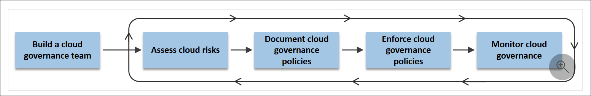
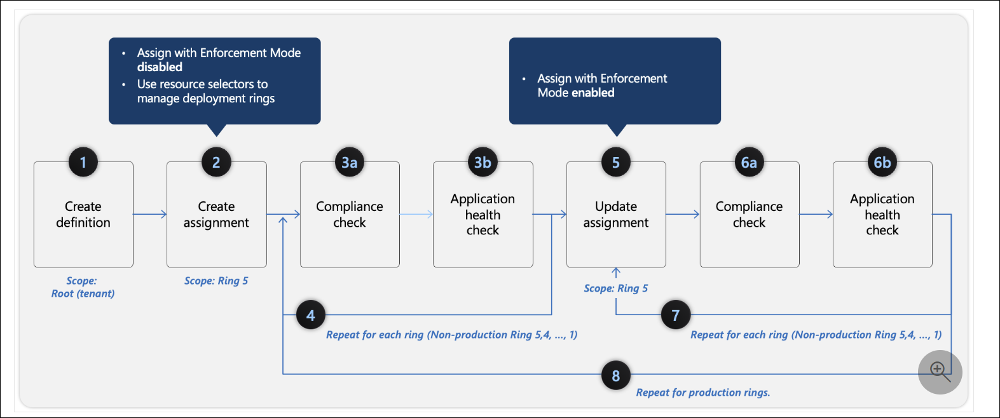

# Learning Path 1: Manage Identities and Governance

**Learning Path** [AZ-104: Manage identities and governance in Azure](https://learn.microsoft.com/en-us/training/paths/az-104-manage-identities-governance/)

* [Entra ID P1 vs P2 Features](#entra-id-p1-vs-p2-features)
* [Microsoft Entra Domain Services](#microsoft-entra-domain-services)
* [Microsoft Entra ID: Restore or Remove Deleted Users](#microsoft-entra-id-restore-or-remove-deleted-users)
* [Change Group License Assignments (Microsoft Entra ID)](#change-group-license-assignments-microsoft-entra-id)
* [Azure Physical Infrastructure](#azure-physical-infrastructure)
* [Azure Management Infrastructure](#azure-management-infrastructure)
* [Cloud Adoption Framework for Azure](#cloud-adoption-framework-for-azure)
* [Azure Policy design principles](#azure-policy-design-principles)
* [Azure Policy resources](#azure-policy-resources)
* [Azure Policy definitions](#azure-policy-definitions)
* [Evaluation of resources through Azure Policy](#evaluation-of-resources-through-azure-policy)

---

<!-- omit in toc -->
## 📋 Modules

| # | Module | Status |
|---|--------|--------|
| 1 | [Understand Microsoft Entra ID](https://learn.microsoft.com/en-us/training/modules/understand-azure-active-directory/)| ✅ |
| 2 | [Create, configure, and manage identities](https://learn.microsoft.com/en-us/training/modules/create-configure-manage-identities/) | ✅ |
| 3 | [Describe the core architectural components of Azure](https://learn.microsoft.com/en-us/training/modules/describe-core-architectural-components-of-azure/) | ✅ |
| 4 | [Azure Policy Initiatives](https://learn.microsoft.com/en-us/training/modules/sovereignty-policy-initiatives) | ✅ |
| 5 | [Secure your Azure resources with Azure role-based access control (Azure RBAC)](https://learn.microsoft.com/en-us/training/modules/secure-azure-resources-with-rbac/) | 🚧 |
| 6 | [Allow users to reset their password with Microsoft Entra self-service password reset](https://learn.microsoft.com/en-us/training/modules/allow-users-reset-their-password/) | 🕒 |

**Legend:** 🕒 Not Started | 🚧 In Progress | ✅ Complete

---

## Entra ID P1 vs P2 Features

[Module Reference](https://learn.microsoft.com/en-us/training/modules/understand-azure-active-directory/5-compare-azure-premium-p1-p2-plans)

Here's a simplified table breaking down the Microsoft Entra ID features by edition:

| Feature | P1 | P2 |
|---------|:---:|:--:|
| **Self-service group management** - Users can create/manage groups, request to join others, owners approve requests | ✓ | ✓ |
| **Advanced security reports and alerts** - ML-based logs showing anomalies and inconsistent access patterns | ✓ | ✓ |
| **Multi-factor authentication (MFA)** - Works with on-premises apps (VPN, RADIUS), Azure, Microsoft 365, Dynamics 365, and Entra gallery apps | ✓ | ✓ |
| **Microsoft Identity Manager (MIM) licensing** - Hybrid identity solutions bridging on-premises auth stores with Entra ID | ✓ | ✓ |
| **Enterprise SLA of 99.9%** - Guaranteed availability | ✓ | ✓ |
| **Password reset with writeback** - Self-service reset following on-premises AD password policy | ✓ | ✓ |
| **Cloud App Discovery** - Discovers frequently used cloud-based applications | ✓ | ✓ |
| **Conditional Access** - Based on device, group, or location for critical resources | ✓ | ✓ |
| **Microsoft Entra Connect Health** - Operational insights with alerts, performance counters, and usage patterns | ✓ | ✓ |
| **Microsoft Entra ID Protection** - User risk policies, sign-in policies, behavior monitoring, risk flagging | | ✓ |
| **Microsoft Entra Privileged Identity Management (PIM)** - Permanent/temporary admin roles, policy workflows for privileged access | | ✓ |

**Summary:** P2 includes everything in P1, plus **ID Protection** and **Privileged Identity Management** for enhanced security monitoring and privileged access control.

---

## Microsoft Entra Domain Services

[Module Reference](https://learn.microsoft.com/en-us/training/modules/understand-azure-active-directory/6-examine-azure-domain-services)

**🎯 What It Is**

**Microsoft Entra Domain Services** (formerly Azure AD Domain Services) is a **Microsoft-managed** domain service that provides traditional Active Directory features in Azure **without deploying or managing domain controllers**.

**📌 Critical Exam Highlights**

| Concept | Key Points to Remember |
|---------|------------------------|
| **Managed Service** | Microsoft handles all DC management:  patching, backups, availability, monitoring |
| **No Domain Controllers Needed** | You do NOT deploy, manage, or maintain DCs yourself |
| **Core AD Features Provided** | Domain join, Group Policy, LDAP, Kerberos, NTLM authentication |
| **Synchronization** | Automatically syncs users, passwords, and groups from Microsoft Entra ID |
| **Use Case** | Lift-and-shift **legacy applications** that require traditional AD features to Azure |

**🔑 Supported Features (Memorize These!)**

| Feature | Purpose |
|---------|---------|
| **Domain Join** | Join Azure VMs to the managed domain |
| **Group Policy (GPOs)** | Centralized security/config management |
| **LDAP** | Directory lookups for legacy apps |
| **Kerberos/NTLM** | Authentication protocols for legacy apps |

**⚡ Key Exam Takeaways**

1. **Primary Purpose**: Run legacy/on-premises apps in Azure that need traditional AD services
2. **Fully Managed**: No infrastructure overhead—Azure handles everything
3. **High Availability**: Multiple DCs deployed automatically in your chosen Azure region
4. **Integration**: Seamlessly integrates with Microsoft Entra ID (cloud identities)
5. **Hybrid Scenarios**:  Bridges on-premises AD and cloud identity management

**🚫 What It Does NOT Do**

* Does **not** replace on-premises AD DS for complex environments
* Does **not** provide schema extensions or forest trusts (limited customization)
* You **cannot** directly manage the domain controllers

**💡 Exam Tip**
>
> If a question mentions needing **domain join, LDAP, Kerberos, or NTLM** for Azure VMs or legacy apps **without managing domain controllers**, the answer is **Microsoft Entra Domain Services**.

---

## Microsoft Entra ID: Restore or Remove Deleted Users

[Module Reference](https://learn.microsoft.com/en-us/training/modules/create-configure-manage-identities/3-exercise-assign-licenses-users)

**Deleted user lifecycle**

* When a user is deleted, the account is placed in a **soft-deleted (suspended) state for 30 days**.
* During this **30-day window**, the user **can be restored with all properties**.
* After 30 days, the account is **permanently deleted automatically**.

**Important**

* **Permanently deleted users cannot be restored.**

**Where this is managed**

* Microsoft Entra ID user interface → view restorable users, restore users, or permanently delete users.

**Required roles to restore or permanently delete**

* Global Administrator
* User Administrator
* Partner Tier-1 Support
* Partner Tier-2 Support

---

## Change Group License Assignments (Microsoft Entra ID)

**Group-based licensing overview**

* Assign licenses to a **security group** so all current/future members get licenses automatically; removing a user from the group removes the group-assigned license. ([Microsoft Learn][1])
* Group/user license assignment is managed through the **Microsoft 365 Admin Center**. ([Microsoft Learn][2])

**Where to do it (high level)**

* Microsoft 365 Admin Center → **Billing → Licenses** → select product → **Groups** tab → assign to a group. ([Microsoft Learn][1])

**Status concepts**

* Assignments can be processing or completed; failures are recorded as an **error state on the user** and can be investigated (including via audit logs). ([Microsoft Learn][3])

**Error types you should recognize**
(These show up as licensing assignment error categories, including in Microsoft Graph.)

* **CountViolation** — not enough licenses available (license count exceeded). ([Microsoft Learn][4])
* **MutuallyExclusiveViolation** — conflicting plans can’t coexist. ([Microsoft Learn][4])
* **DependencyViolation** — missing required/dependent service plan. ([Microsoft Learn][4])
* **ProhibitedInUsageLocationViolation** — usage location missing/invalid or service not available in that location (usage location must be set). ([Microsoft Learn][4])
* **UniquenessViolation** — uniqueness constraint failure (commonly surfaced as conflicts like duplicate values). ([Microsoft Learn][4])
* **Other** — miscellaneous licensing interaction/processing failures. ([Microsoft Learn][4])

[1]: https://learn.microsoft.com/en-us/entra/identity/users/licensing-admin-center?utm_source=chatgpt.com "Assign licenses to a group using the Microsoft 365 admin ..."
[2]: https://learn.microsoft.com/en-us/entra/identity/users/licensing-group-advanced?utm_source=chatgpt.com "Scenarios, limitations, and known issues using groups to ..."
[3]: https://learn.microsoft.com/en-us/entra/fundamentals/licensing-groups-resolve-problems?utm_source=chatgpt.com "Resolve group license assignment problems."
[4]: https://learn.microsoft.com/en-us/graph/api/resources/licenseassignmentstate?view=graph-rest-1.0&utm_source=chatgpt.com "licenseAssignmentState resource type - Microsoft Graph v1.0"

---

## Azure Physical Infrastructure

[Module Reference](https://learn.microsoft.com/en-us/training/modules/describe-core-architectural-components-of-azure/5-describe-azure-physical-infrastructure)

**Azure datacenter foundation**

* Azure is built on **global datacenters** that house compute, storage, and networking hardware with redundant power, cooling, and connectivity.

**Regions**

* A **region** is a geographic location with **multiple datacenters** connected by high-speed, low-latency networks.
* Regions are where you **deploy Azure resources**; region choice affects performance, compliance, and availability.

**Availability Zones**

* **Availability Zones** are **physically separate datacenters** within the same region.
* Each zone has independent power, networking, and cooling.
* Zones improve **fault tolerance**: failure in one zone doesn’t affect others.

**Region pairs**

* Regions are paired within the same geography to support **disaster recovery and data residency**.
* Azure places **priority for recovery** across paired regions in major outages.

**Sovereign regions**

* **Sovereign regions** are isolated instances of Azure designed to meet **special regulatory and data-residency requirements**.

**Purpose of physical distribution**

* The combination of **regions, availability zones, and region pairs** provides:

  * **Resiliency** against failures
  * **Low latency** for customers
  * **Compliance boundaries** for data sovereignty and regulations

**Key concepts to remember**

* Region = one or more datacenters in a geography.
* Availability Zones = separate locations within a region for redundancy.
* Region pairs = disaster recovery alignment across regions.
* Sovereign regions = specialized isolated Azure deployments.

---

## Azure Management Infrastructure

[Module Reference](https://learn.microsoft.com/en-us/training/modules/describe-core-architectural-components-of-azure/6-describe-azure-management-infrastructure)

**Overview**

* Azure provides a hierarchical management structure to organize resources, apply governance, and control access at scale.
* Management layers allow consistent policy, RBAC, and compliance enforcement across large environments.

**Management Hierarchy (Top → Bottom)**

* **Management Groups**

  * Used to organize subscriptions.
  * Policies and RBAC assigned at a management group are inherited by all child management groups and subscriptions.
  * A management group tree supports **up to six levels of depth** (excluding the tenant root).
  * The **tenant root management group** is the top-level container and is created automatically.
* **Subscriptions**

  * Logical containers for billing, access control, and quotas.
  * A subscription can belong to only **one** management group.
* **Resource Groups**

  * Containers that hold related Azure resources.
  * Resources can exist in only one resource group at a time.
  * Resource groups are used for lifecycle management (deploy, update, delete as a unit).
* **Resources**

  * Individual Azure services (VMs, storage accounts, VNets, databases, etc.).

**Azure Resource Manager (ARM)**

* The control plane for Azure.
* Handles deployment, updates, and deletion of resources.
* Provides:

  * Declarative infrastructure via templates (ARM templates, Bicep).
  * Consistent management layer across Azure services.
  * Role-based access control (RBAC).
  * Policy enforcement.
  * Tagging support for cost and organization.

**Role-Based Access Control (RBAC)**

* Controls **who** can do **what** at a given scope.
* Scopes include:

  * Management group
  * Subscription
  * Resource group
  * Individual resource
* Access is inherited down the hierarchy.
* Uses built-in roles (Owner, Contributor, Reader) and custom roles.

**Azure Policy**

* Used to enforce standards and assess compliance.
* Can:

  * Deny non-compliant resources.
  * Audit existing resources.
  * Append or modify resource settings.
* Assigned at management group, subscription, or resource group scope.
* Policies are inherited by child scopes.

**Tags**

* Key-value pairs applied to resources or resource groups.
* Used for:

  * Cost management and chargeback.
  * Organization and reporting.
* Tags are **not automatically inherited** from parent scopes.

**Key Exam Takeaways**

* Management groups are for **organization and governance across subscriptions**.
* RBAC controls access; Azure Policy enforces rules and compliance.
* ARM is the unified management layer for Azure.
* Inheritance flows **downward** through the management hierarchy.
* Management group hierarchy depth limit: **6 levels**.

---

## Cloud Adoption Framework for Azure

[Module Reference](https://learn.microsoft.com/en-us/training/modules/sovereignty-policy-initiatives/cloud-adoption-framework)

**Overview**

* The Cloud Adoption Framework for Azure provides end-to-end technical guidance to help organizations achieve cloud adoption objectives.
* The framework includes best practices, documentation, and tools contributed by Microsoft and partners.
* Azure Policy is integral to the governance methodology, helping enforce guardrails and compliance.

**Cloud Governance**

* **Definition** – Continuous process to manage cloud usage, minimize risks, enforce compliance, and optimize operations.
* **Purpose** – Ensure cloud activities are consistent with strategy and business objectives.

**Steps for Cloud Governance**

1. **Build a governance team** – Define, maintain, and report on cloud governance policy.
2. **Assess cloud risks** – Identify risks across compliance, security, operations, cost, and data.
3. **Document cloud governance policies** – Translate risk decisions into clear rules and guidelines.
4. **Enforce cloud governance policies** – Use automated and manual tools to ensure compliance.
5. **Monitor cloud governance** – Continuously evaluate usage against policies and iterate improvements.



**Considerations for Defining Governance Policy**

* **Business risk** – Align policies with business tolerance for risk and data classification.
* **Policy and compliance** – Convert risk decisions into enforceable policies.
* **Process** – Establish mechanisms to monitor and respond to violations.


**Core Disciplines of Cloud Governance**

* **Cost management** – Monitor and control cloud expenditures and resource rightsizing.
* **Security baseline** – Apply security controls consistently across the environment.
* **Resource consistency** – Standardize resource configuration and onboarding practices.
* **Identity baseline** – Enforce consistent identity and access controls.
* **Deployment acceleration** – Centralize and standardize deployment patterns.

**Azure Policy in Governance**

* **Role** – Primary governance tool to enforce organizational standards and assess compliance at scale.
* **Capabilities**

  * Establish guardrails across resources.
  * Provide a compliance dashboard with aggregated and per-resource views.
  * Track compliance status and root causes.
  * Automate bulk remediation for existing resources.
  * Prevent creation of non-compliant resources.
* **Common controls enforced with Azure Policy**

  * Restrict deployments to allowed regions.
  * Enforce geo-replication and other compliance-related rules.
  * Mandate resource tags, identity and access control settings, and diagnostic logging.
* **Integration** – Can integrate with DevOps pipelines to enforce pre- and post-deployment policies.

**Key Facts to Remember**

* **Cloud Adoption Framework** is structured to support strategy, planning, readiness, governance, security, and operations across the cloud lifecycle.
* **Governance process** is continuous, iterative, and must balance control with operational efficiency.
* **Azure Policy** is central to governance in the Cloud Adoption Framework, enabling automated enforcement and compliance tracking.
* **Core governance disciplines** include cost, security, resource consistency, identity, and deployment acceleration.
* **Enforcement** can include bulk remediation and prevention of non-compliant resource creation.

---

## Azure Policy design principles

[Module Reference](URL)

**Governance Overview**

* Governance provides mechanisms and processes to maintain control over applications and resources in Azure
* Governance involves planning Azure Policy and setting strategic priorities
* Cloud resources must be organized to **secure**, **manage**, and **track costs** related to workloads

**Hierarchy for Governance**

* Azure provides **four levels of management**:

  * **Management groups**
  * **Subscriptions**
  * **Resource groups**
  * **Resources**
* Management groups and subscriptions can be structured hierarchically for unified policy and access management
* The hierarchy starts with the **tenant root group**
* Management groups can extend **up to six levels** beneath the root

**Management Hierarchy Concepts**

* **Resources**

  * Basic building blocks of Azure
  * Include services such as virtual machines, virtual networks, databases, and AI services

* **Resource groups**

  * Logical groupings of resources
  * Each resource must belong to **one and only one** resource group
  * Actions applied to a resource group apply to **all contained resources**
  * Deleting a resource group deletes **all resources** in it
  * Access granted or denied at the resource group applies to all its resources

* **Subscriptions**

  * Unit of **management, billing, and scale**
  * Used to logically organize resource groups
  * Each subscription has **limits and quotas**
  * Used to manage costs and control resource usage by users, teams, and projects
  * Required to use Azure
  * Linked to an Azure account in **Microsoft Entra ID** or a trusted directory

* **Management groups**

  * Provide a scope **above subscriptions**
  * Used to manage access, policies, and compliance across multiple subscriptions
  * Subscriptions are organized into management groups
  * Governance conditions applied at the management group are **inherited** by all subscriptions
  * Management groups can be **nested**

**Policy Scope and Inheritance**

* Policies can be applied at any level of the hierarchy
* Lower levels inherit settings from higher levels
* Applying a policy at:

  * **Management group** → affects all subscriptions under it
  * **Subscription** → affects all resource groups and resources in that subscription
  * **Resource group** → affects only that resource group and its resources

**Introduction to Azure Resource Manager**

* Azure Resource Manager is the **deployment and management service** for Azure
* Provides a management layer to **create, update, and delete** resources
* Azure operations are divided into:

  * **Control plane**
  * **Data plane**

**Control Plane**

* Used to manage resources in a subscription
* Azure Policy operates in the **control plane**
* Azure Resource Manager manages all control plane operations
* Azure Policy is integrated with Azure Resource Manager
* Azure Resource Manager manages:

  * Template-based deployments
  * Role-based access control (RBAC)
  * Auditing
  * Monitoring
  * Tagging
* All Azure portals, tools, SDKs, PowerShell, Azure CLI, and REST APIs use the **same API**
* Requests are authenticated and authorized before being sent to the resource provider
* Azure Policy is evaluated **after RBAC**

**Data Plane**

* Handles **direct data operations** on resources
* Examples include:

  * Uploading or downloading files
  * Querying databases
  * Reading secrets
* Data plane requests bypass Azure Resource Manager
* Managed directly by the service’s resource provider
* Access is controlled by service-specific mechanisms such as **RBAC or ACLs**
* Azure Policy ensures resources accessed in the data plane remain compliant

**Azure Policy Data Plane Resource Provider Modes**

* **Microsoft.Kubernetes.Data** – Kubernetes clusters and components
* **Microsoft.KeyVault.Data** – Vaults and certificates
* **Microsoft.Network.Data** – Virtual Network Manager custom membership policies
* **Microsoft.ManagedHSM.Data** – Managed HSM keys
* **Microsoft.DataFactory.Data** – Data Factory outbound traffic domain names
* **Microsoft.MachineLearningServices.v2.Data** – Machine Learning model deployments

  * Reports compliance for newly created and updated components

**Operation Flows of Azure Resource Manager**

* Two scenarios:

  * **Greenfield**
  * **Brownfield**

**Greenfield Scenario (Policy-first)**

* Policy exists **before** resource creation or update
* Requests pass through:

  * RBAC
  * Azure Policy
* If RBAC fails, Azure Policy is **not evaluated**
* For updates:

  * Only the delta is sent
  * Azure Policy merges the delta with the current resource state
  * The resulting target state is evaluated against policies

**Brownfield Scenario (Resource-first)**

* Resources already exist when a new policy is assigned
* Policy evaluation occurs through a **compliance scan**
* Compliance scan:

  * Runs automatically every **24 hours**
  * Can be manually triggered
  * Duration is unpredictable
* Existing noncompliant resources are **flagged**, not deleted
* Future noncompliant resource creation attempts are **denied**

**Key Facts to Remember**

* Azure governance hierarchy has **four levels**
* Management groups can extend **six levels** below the tenant root group
* Policies inherit from higher scopes to lower scopes
* Azure Policy operates in the **control plane**
* Azure Policy is evaluated **after RBAC**
* Data plane operations bypass Azure Resource Manager
* Compliance scans for existing resources run every **24 hours**

---

## Azure Policy resources

[Module Reference](https://learn.microsoft.com/training/modules/azure-policy/azure-policy-resources)

**Overview**

* **Azure Policy** enforces organizational standards and assesses compliance at scale.
* Evaluates Azure resources and actions by comparing resource properties against **business rules**.
* Provides an **aggregated view of compliance** across the environment.
* Supports **granular analysis** down to individual resources and policy levels.
* **Six policy resources** are available in Azure, with multiple concepts applying across them.


**Policy Definitions**

* **Policy definitions** describe:

  * The **compliance conditions** for resources.
  * The **effect** to take when conditions are met.
* Several settings control which resources are evaluated.
* The primary concept these settings apply to is **scope**.

**Scope**

* Azure Policy scope aligns with Azure governance hierarchy.
* Four levels of management scope under the root tenant:

  * **Management groups**
  * **Subscriptions**
  * **Resource groups**
  * **Resources**
* Definitions can be saved at:

  * A **management group**, or
  * A **subscription**
* The **definition location** determines where a policy or initiative can be assigned.
* Assignments include properties that define:

  * Which resources are evaluated.
  * Which resources count toward compliance.
* Lower scopes **inherit settings** from higher scopes.

**Initiatives (Policy Sets)**

* **Initiatives** group multiple policy definitions into a single manageable unit.
* Simplify assignment and management by working with one item instead of many.
* Support governance at scale and tracking compliance for broader goals.
* Initiative definitions:

  * Contain all included policy definitions.
  * Are often used for organizational or regulatory compliance goals.
* Example:

  * Multiple tagging policies grouped into one initiative.
* Initiative definitions are created using **JSON**.

**Built-in and Custom Initiatives**

* **Built-in policy**

  * Generated by Azure Resource Providers.
  * Available by default.
* **Built-in initiative**

  * A collection of built-in policy definitions.
  * Supports regulatory frameworks, industry standards, and security best practices.
* **Custom policy**

  * Authored when no built-in policy meets requirements.
* **Custom initiative**

  * A collection of custom policy definitions.
  * Tailored to organization-specific governance needs.
* **Microsoft for Sovereignty initiatives**

  * Extend Azure built-in initiatives.
  * Provide additional compliance mappings.
  * Available as both built-in and custom initiatives.
  * Support regulatory compliance and enhanced data protection.

**Assignments**

* **Policy assignments** define which resources are evaluated.
* Assignments can be created using:

  * Azure portal
  * API
  * Command-line interface
* Policies and initiatives are:

  * Defined at a **definition location** (management group or subscription).
  * Assigned to a **scope** (management group, subscription, or resource group).

**Assignment Options and Properties**

* Optional **resource selectors** for gradual rollout by:

  * Resource location
  * Resource type
* Optional **overrides** to change a policy effect without editing the definition.
* **enforcementMode**

  * Can be disabled for *what-if* scenarios.
  * Equivalent to audit behavior at assignment level.
* Optional **excluded scopes** to exclude child resources or containers.
* **Noncompliance messages** can be specified.
* **Parameters** can be assigned values.
* **Managed identity** (system- or user-assigned) can be used for:

  * `deployIfNotExists` remediation actions.
* Assignment scope concepts:

  * **Inclusion**
  * **Exclusion**

**Exemptions**

* **Policy exemptions** exclude resources or scopes from evaluation after assignment.
* Exempt resources:

  * Count toward overall compliance.
  * Are not evaluated.
* Exemptions are created as child objects on:

  * Resource hierarchy, or
  * Individual resources.
* Exemption categories:

  * **Mitigated** – Policy intent met through another method.
  * **Waiver** – Temporary acceptance of noncompliance.

**Attestations**

* **Policy attestations** set compliance states for:

  * Resources, or
  * Scopes
* Used for **manual policies**.
* Each applicable resource requires:

  * One attestation per manual policy assignment.
* Manual policies should target the scope that defines the compliance boundary.

**Remediations**

* **Remediation tasks** bring noncompliant resources into compliance.
* Applies to:

  * `modify` effects
  * `deployIfNotExists` effects
* Existing noncompliant resources can be remediated manually.
* Newly created or updated resources:

  * Are automatically remediated when applicable.

**Key Facts to Remember**

* **Six Azure Policy resources** are available.
* **Scope levels**: management group → subscription → resource group → resource.
* **Definition location** limits where policies and initiatives can be assigned.
* **Initiatives** are collections of policy definitions managed as a single unit.
* **Assignments** control evaluation scope, parameters, exclusions, and enforcement mode.
* **Exemptions** allow mitigated or temporary waivers without changing assignments.
* **Attestations** apply only to manual policies.
* **Remediation tasks** enforce compliance for modify and deployIfNotExists effects.

---

## Azure Policy definitions

[Module Reference](https://learn.microsoft.com/training/modules/azure-policy-initiatives/azure-policy-definitions)

**Overview**

* An **Azure Policy definition** describes **resource compliance conditions** and the **effect** applied when conditions are met.
* A policy has two core parts:

  * **Condition** – Compares a resource property field or value (using aliases) to a required value.
  * **Effect** – Determines what happens when the condition evaluates as true.
* Effects behave differently for:

  * New resources
  * Updated resources
  * Existing resources

**Anatomy of a Policy Definition (JSON Elements)**

* **displayName** (string, max **128 characters**)

  * Identifies the policy definition.
* **description** (string, max **512 characters**)

  * Provides usage context.
* **policyType** (read-only string)

  * Indicates origin of the policy:

    * **BuiltIn** – Provided and maintained by Microsoft
    * **Custom** – Created by the customer
    * **Static** – Regulatory Compliance policy with Microsoft ownership
* **mode** (string)

  * Determines evaluation target:

    * **Resource Manager modes**

      * **All** – Evaluates resource groups, subscriptions, and all resource types
      * **Indexed** – Evaluates resource groups, subscriptions, and all resource types
    * **Resource Provider modes (Built-in, fully supported)**

      * Microsoft.Kubernetes.Data
      * Microsoft.KeyVault.Data
      * Microsoft.Network.Data
    * **Resource Provider modes (Built-in, preview)**

      * Microsoft.ManagedHSM.Data
      * Microsoft.DataFactory.Data
* **version** (string, optional)

  * Built-in definitions can have multiple versions under the same definitionId.
  * If omitted, the **latest version** is used.
* **metadata** (object, optional, max **1,024 characters**)

  * Common properties:

    * **version** (string)
    * **category** (string)
    * **preview** (Boolean)
    * **deprecated** (Boolean)
    * **portalReview** (string)
* **parameters** (object, optional)

  * Enables reuse of a single policy definition.
  * Properties:

    * **name**
    * **type** (String, Array, Object, Boolean, Integer, Float, DateTime)
    * **metadata** (description, displayName, strongType, assignPermissions)
    * **defaultValue**
    * **allowedValues**
    * **schema**
* **policyRule** (object)

  * Contains:

    * **if** – Conditions defining when the policy applies
    * **then** – Effect applied when conditions evaluate to true

**Example:**

```json
{
  "displayName": "Allowed locations",
  "description": "This policy enables you to restrict the locations your organization can specify when deploying resources. Use to enforce your geo-compliance requirements. Excludes resource groups, Microsoft.AzureActiveDirectory/b2cDirectories, and resources that use the 'global' region.",
  "policyType": "BuiltIn",
  "mode": "Indexed",
  "metadata": {
    "version": "1.0.0",
    "category": "General"
  },
  "parameters": {
    "listOfAllowedLocations": {
      "type": "Array",
      "metadata": {
        "description": "The list of locations that can be specified when deploying resources.",
        "strongType": "location",
        "displayName": "Allowed locations"
      }
    }
  },
    "policyRule": {
      "if": {
        "allOf": [
          {
            "field": "location",
            "notIn": "[parameters('listOfAllowedLocations')]"
          },
          {
            "field": "location",
            "notEquals": "global"
          },
          {
            "field": "type",
            "notEquals": "Microsoft.AzureActiveDirectory/b2cDirectories"
          }
        ]
      },
      "then": {
        "effect": "deny"
      }
    }
}
```


**Policy Logic Example Notes**

* Resources such as **Microsoft.AzureActiveDirectory/b2cDirectories** may be excluded when fields (like location) do not represent Azure regions.
* Exclusions can be enforced through separate policies.

**Logical Operators in the `if` Block**

* **not**

  * Inverts the result of a condition.
* **allOf**

  * All conditions must be true (logical AND).
* **anyOf**

  * One or more conditions must be true (logical OR).
* Logical operators:

  * Are optional
  * Can be **nested** for complex scenarios

**Conditions**

* Conditions evaluate whether values meet criteria.
* Condition types:

  * **Field**

    * Examples: name, fullName, kind, type, location, id, identity.type, tags, tags['tagName'], property aliases
  * **Value**

    * Evaluates literal or computed values
  * **Count**

    * Counts array members meeting criteria
    * Supports **field count** and **value count**
    * **current()** returns the array item being evaluated
* If a condition evaluation results in an error, the policy results in a **deny**.

  * Can be avoided during testing by disabling **enforcementMode**.

**Evaluation Criteria Operators**

* **String comparisons**

  * equals, notEquals, like, notLike
  * match, notMatch
  * matchInsensitively, notMatchInsensitively
  * contains, notContains
* **Array comparisons**

  * in, notIn
* **Key checks**

  * containsKey, notContainsKey
* **Date, string, and integer comparisons**

  * less, lessOrEquals
  * greater, greaterOrEquals
* **Existence**

  * exists (bool)

**Policy Functions**

* Functions add logic within policy rules and parameter values.
* Most ARM template functions are supported, except policy-specific and user-defined functions.
* **utcNow()**

  * Returns current UTC time in **ISO 8601** format
  * Can be used outside defaultValue in policies
* Functions available only in policy rules:

  * **addDays(dateTime, numberOfDaysToAdd)**
  * **field(fieldName)**
  * **requestContext().apiVersion**
  * **policy()**

    * assignmentId
    * definitionId
    * setDefinitionId
    * definitionReferenceId
  * **ipRangeContains(range, targetRange)**

    * Returns Boolean
    * Empty ranges or mixed IP families cause evaluation failure
  * **current(indexName)**

    * Used only inside count expressions

**Effect Types (then Block)**

* **disabled**

  * Deactivates the policy assignment
  * Checked first
  * Synchronous
* **append**

  * Adds fields during create/update
  * Mostly obsolete
  * Synchronous
* **modify**

  * Adds, updates, or removes properties or tags
  * Synchronous
* **deny**

  * Blocks noncompliant requests
  * Synchronous
* **denyAction**

  * Blocks actions (currently **DELETE** only)
  * Synchronous
* **audit**

  * Logs noncompliance without blocking
  * Asynchronous
* **auditIfNotExists**

  * Audits related resources missing required properties
  * Asynchronous
* **deployIfNotExists**

  * Triggers a deployment when conditions are met
  * Asynchronous
* **manual**

  * Allows self-attestation of compliance
  * Manual attestation

**Effect Interchangeability Guidance**

* **audit**, **deny**, and **modify/append** – Often interchangeable
* **auditIfNotExists** and **deployIfNotExists** – Often interchangeable
* **manual** – Not interchangeable
* **disabled** – Interchangeable with any effect
* Multiple policies:

  * Are evaluated independently
  * Result is **cumulative and most restrictive**

**Key Facts to Remember**

* Policy definitions consist of **if** (conditions) and **then** (effects).
* **policyType** is read-only and indicates origin.
* **mode** determines evaluation scope and supported resource providers.
* Logical operators can be nested for complex evaluations.
* Errors during condition evaluation result in **deny**.
* Effect evaluation can be **synchronous**, **asynchronous**, or **manual**.
* When multiple policies apply, enforcement is **cumulatively most restrictive**.

---

## Evaluation of resources through Azure Policy

[Module Reference](URL)

**Overview**

* Azure Policy provides insight and control over resources in a subscription or management group.
* Common uses include:

  * Preventing resource creation in incorrect locations
  * Enforcing consistent tag usage
  * Auditing existing resources for required configurations
* Understanding **evaluation triggers**, **evaluation timing**, and **resource compliance states** is required before reacting to compliance data.

**Evaluation Triggers**

Evaluations of assigned policies and initiatives occur when:

* A policy or initiative is newly assigned to a scope
* An existing policy or initiative assignment is updated
* A resource is deployed or updated in a scope with an assignment via:

  * Azure Resource Manager
  * REST API
  * Supported SDK
* A subscription (`Microsoft.Resources/subscriptions`) is:

  * Created, or
  * Moved within a management group hierarchy that has an assigned policy targeting subscriptions
* A policy exemption is created, updated, or deleted
* The standard compliance evaluation cycle runs
* The machine configuration resource provider reports compliance data
* An on-demand scan is triggered

**Evaluation Timing**

Compliance scans are triggered in the following ways:

* **Automatic full scan**

  * Runs every **24 hours**
* **Manual scan (Brownfield scenarios)**

  * Used when new policies are applied to existing resources
  * Triggered with `az policy state trigger-scan`

**Policy Assignment Propagation Delay**

* New policy assignments can take up to **30 minutes** to take effect
* Delay is caused by the Azure Resource Manager session cache
* Signing out and back in refreshes the cache and applies the policy immediately

**Factors Affecting Scan Duration**

* **Policy definitions**

  * Increased size or complexity increases scan time
* **Number of policies**

  * More policies result in longer scans
* **Scope size**

  * Larger scopes take longer to evaluate
* **System load**

  * Compliance scans are **low-priority**
  * Scans may take minutes or tens of minutes, even for small environments
* **Synchronous scan (low-priority execution)**

  * Scans are delayed when the system is busy, extending completion time

**Resource Compliance States**

Each evaluated resource is assigned one compliance state:

1. **Non-compliant**
2. **Compliant**
3. **Error** – Template or evaluation error
4. **Conflicting** – Contradicting policy assignments in the same scope
5. **Protected** – Resource covered by a `denyAction` effect
6. **Exempted**
7. **Unknown** – Default state for definitions with a manual effect

* Compliance is evaluated per **resource** and per **policy assignment**
* When multiple states apply, Azure Policy uses a **ranking order**
* Ranking order follows the list above (top has highest priority)

**Compliance Percentage Calculation**

* Calculated as:
  *(**Compliant + Exempt + Unknown**) ÷ **Total resources**
* Total resources include:

  * Compliant
  * Non-compliant
  * Unknown
  * Exempt
  * Conflicting
  * Error

**Enforcement Mode**

* `enforcementMode` is a property of a **policy assignment**
* Allows evaluation without enforcing the policy effect
* Used to test policy impact on existing resources
* Does not trigger Azure Activity Log entries when disabled
* Can be switched to **Enabled** after validation

**Difference Between enforcementMode and Disabled Effect**

* **enforcementMode**

  * Evaluation occurs
  * Policy effect is not enforced
* **Disabled effect**

  * Evaluation does not occur at all

**enforcementMode Values**

* **Enabled**

  * JSON value: `Default`
  * Policy effect is enforced
  * Activity log entries are created
  * Manual remediation allowed

* **Disabled**

  * JSON value: `DoNotEnforce`
  * Policy effect is not enforced
  * No activity log entries
  * Manual remediation allowed

* If not specified, `Default` is used

* Remediation tasks for `deployIfNotExists` policies can run even when `DoNotEnforce` is set

**Policy Enforcement and Safe Deployment Best Practices**

* Applying policies directly to production can cause unintended behavior
* Treat policy as code:

  * Store definitions in source control
  * Test and validate all changes
* Goal: minimize impact while ensuring compliance

**Safe Deployment Framework – Two Aspects**

* **Aspect 1: Start with enforcementMode Disabled**

  * Assign policies with `deny` or `modify` effects in **Disabled** mode
  * Evaluate compliance without enforcement
  * Enables a “what-if” scenario

* **Aspect 2: Deploy in deployment rings**

  * Gradual rollout from small to large scopes
  * Start with test and development environments
  * Expand to production incrementally

**Safe Deployment Steps**

1. **Create definition**

   * Define policy with scope at the root (tenant)
2. **Create assignment**

   * Define deployment rings (1–5) using resource selectors
   * Assign policy to Ring 5
   * Set `enforcementMode` to **Disabled**
3. **Compliance check**

   * Verify expected compliance state in Ring 5
4. **Application health check**

   * Validate no unintended side effects
5. **Repeat for non-production rings**
6. **Update assignment (optional)**

   * Modify policy or assignment if needed
   * Reassign with `enforcementMode` **Enabled**
7. **Revalidate**

   * Repeat compliance and health checks
8. **Deploy to production rings**

   * Start with a small production ring
   * Gradually expand scope
 


**Reacting to Policy State Changes**

* Azure Policy emits events when policy states change
* Events are sent to **Azure Event Grid**
* Enables event-driven reactions without polling

**Event Grid Capabilities**

* Reliable delivery
* Retry policies
* Dead-letter handling
* Event routing, filtering, and multicasting

**Event Handlers**

Events can be handled by:

* Azure Functions
* Azure Logic Apps
* Custom HTTP listeners
* Webhooks

**Key Facts to Remember**

* Automatic compliance scans run every **24 hours**
* New policy assignments can take up to **30 minutes** to propagate
* Compliance scans are **low-priority** and synchronous
* Compliance states are ranked, with **Non-compliant** having highest priority
* Compliance percentage includes **Compliant, Exempt, and Unknown** resources
* `enforcementMode` allows evaluation without enforcement
* Safe deployment relies on **Disabled enforcement** and **deployment rings**

---


*Last updated: 2026-01-14*
