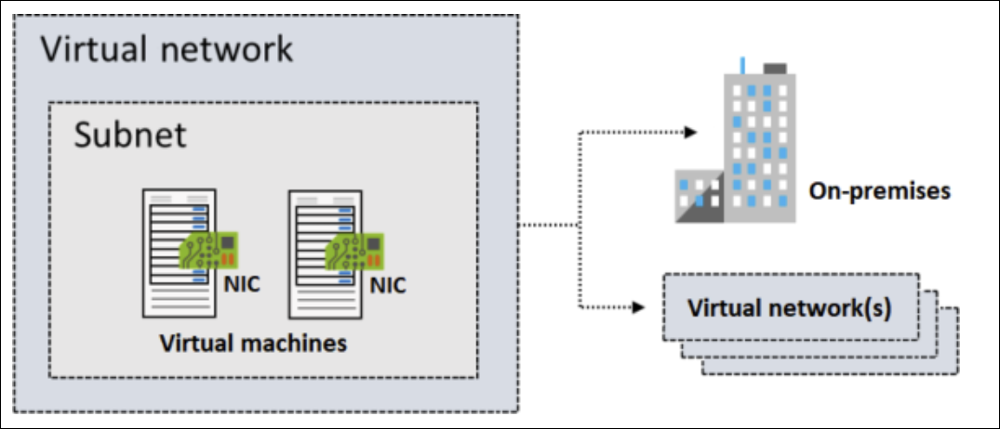
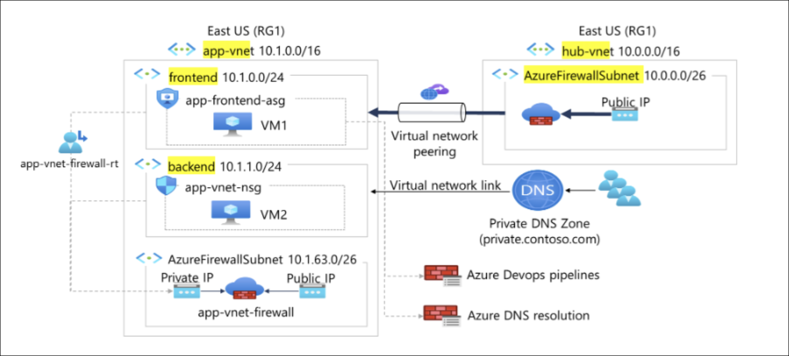
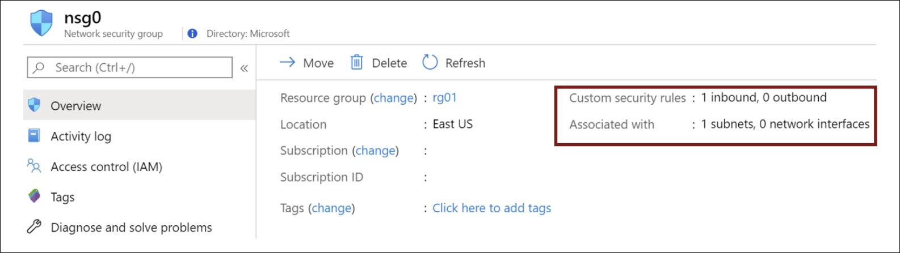
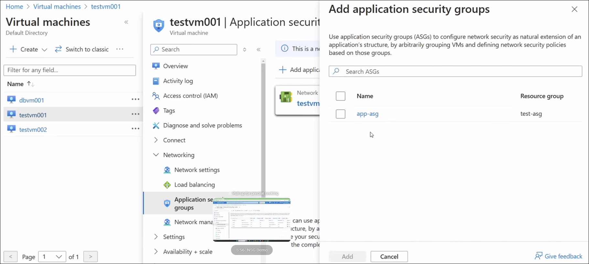
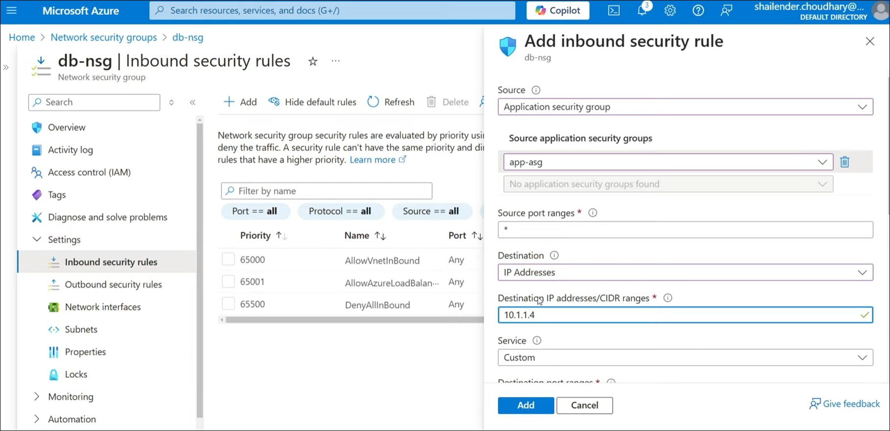
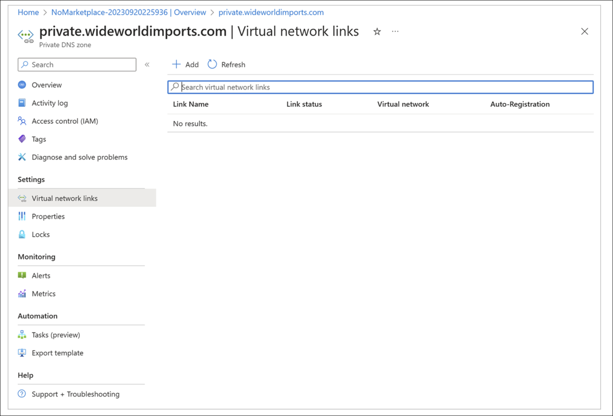
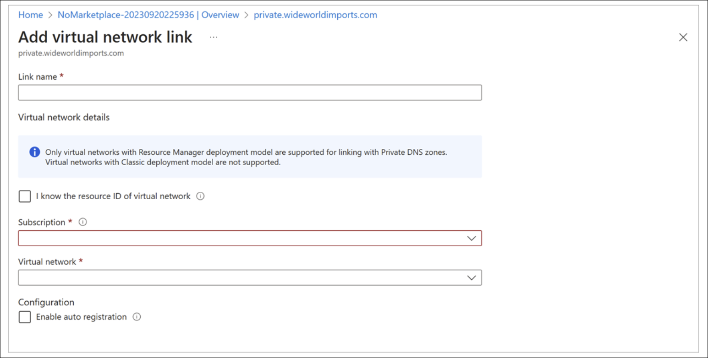

# Learning Path 2: Configure and Manage Virtual Networks

**Learning Path** [Microsoft Learn](https://learn.microsoft.com/en-us/training/paths/az-104-manage-virtual-networks/)

* [Plan virtual networks](#plan-virtual-networks)
* [Create subnets](#create-subnets)
* [Create virtual networks](#create-virtual-networks)
* [Plan IP addressing](#plan-ip-addressing)
* [Create public IP addressing](#create-public-ip-addressing)
* [Associate public IP addresses](#associate-public-ip-addresses)
* [Allocate or assign private IP addresses](#allocate-or-assign-private-ip-addresses)
* [Exercise: Create and configure virtual networks](#exercise-create-and-configure-virtual-networks)
* [Implement network security groups](#implement-network-security-groups)
* [Determine network security group rules](#determine-network-security-group-rules)
* [Determine network security group effective rules](#determine-network-security-group-effective-rules)
* [Create network security group rules](#create-network-security-group-rules)
* [Implement application security groups](#implement-application-security-groups)
* [What is Azure DNS?](#what-is-azure-dns)
* [Configure Azure DNS to host your domain](#configure-azure-dns-to-host-your-domain)

---

<!-- omit in toc -->
## 📋 Modules

| # | Module | Status | Completed |
|---|--------|--------|-----------|
| 1 | [Configure virtual networks](https://learn.microsoft.com/en-us/training/modules/configure-virtual-networks/) | ✅ | 1/18/26 |
| 2 | [Configure network security groups](https://learn.microsoft.com/en-us/training/modules/configure-network-security-groups/) | ✅ | 1/19/26 |
| 3 | [Host your domain on Azure DNS](https://learn.microsoft.com/en-us/training/modules/host-domain-azure-dns/) | 🕒 | |
| 4 | [Configure Azure Virtual Network peering](https://learn.microsoft.com/en-us/training/modules/configure-vnet-peering/) | 🕒 | |
| 5 | [Manage and control traffic flow in your Azure deployment with routes](https://learn.microsoft.com/en-us/training/modules/control-network-traffic-flow-with-routes/) | 🕒 | |
| 6 | [Introduction to Azure Load Balancer](https://learn.microsoft.com/en-us/training/modules/intro-to-azure-load-balancer/) | 🕒 | |
| 7 | [Introduction to Azure Application Gateway](https://learn.microsoft.com/en-us/training/modules/intro-to-azure-application-gateway/) | 🕒 | |
| 8 | [Introduction to Azure Network Watcher](https://learn.microsoft.com/en-us/training/modules/intro-to-azure-network-watcher/) | 🕒 | |

**Legend:** 🕒 Not Started | 🚧 In Progress | ✅ Complete

---

## Plan virtual networks

[Module Reference](https://learn.microsoft.com/training/modules/configure-virtual-networks/)

**Purpose of Moving to Azure**

* Enables IT departments to transition server resources to the cloud
* Reduces costs and simplifies administration
* Eliminates the need to maintain:

  * Datacenters
  * Uninterruptible power supplies
  * Generators
  * Multiple fail-safes
  * Clustered database servers
* Particularly attractive for **small and medium-sized companies** that lack expertise to maintain robust infrastructure

**Things to Know About Azure Virtual Networks**

* **Azure Virtual Network (VNet)** provides a virtual representation of a network in the cloud
* VNets enable more effective deployment and connection of cloud resources
* An Azure virtual network is a **logical isolation** of Azure cloud resources
* VNets can be used to provision and manage **virtual private networks (VPNs)** in Azure
* Each VNet has its own **CIDR block**
* VNets can be linked to:

  * Other virtual networks
  * On-premises networks
* Hybrid or cross-premises solutions are supported when **CIDR blocks do not overlap**
* You control:

  * **DNS server settings**
  * **Segmentation into subnets**

**Common Virtual Network Scenarios**

* **Create a dedicated private cloud-only virtual network**

  * No cross-premises connectivity required
  * Resources communicate securely within the cloud
  * Internet access can still be configured via endpoints as needed

* **Securely extend your data center**

  * Uses **site-to-site VPNs**
  * Securely scales datacenter capacity
  * Site-to-site VPNs use **IPSEC**
  * Connects corporate VPN gateway to Azure

* **Enable hybrid cloud scenarios**

  * Supports a wide range of hybrid configurations
  * Securely connects cloud-based applications to on-premises systems
  * Works with systems such as **mainframes** and **Unix systems**

**Key Facts to Remember**

* Azure VNets provide **logical isolation** of cloud resources
* Every VNet requires a **CIDR address block**
* **Non-overlapping CIDR blocks** are required for connected networks
* VNets support **VPNs, hybrid, and cloud-only** scenarios
* DNS configuration and subnet design are fully controlled by the user

---

## Create subnets

[Module Reference](https://learn.microsoft.com/training/modules/configure-virtual-networks/create-subnets)

**Overview**

* **Azure subnets** provide logical segmentation within a virtual network.
* Subnets help **improve security**, **increase performance**, and **simplify management**.

**Subnet IP Address Requirements**

* Each subnet contains an IP address range that falls **within the virtual network address space**.
* Each subnet’s address range must be **unique** within the virtual network.
* Subnet IP ranges **cannot overlap** with other subnets in the same virtual network.
* Subnet address space must be specified using **CIDR notation**.
* A virtual network can be segmented into **one or more subnets**.

**Reserved Addresses**

* Azure reserves **five IP addresses per subnet**.
* The **first four IP addresses** and the **last IP address** are reserved.

**Reserved Address Example (192.168.1.0/24)**

| Reserved Address              | Purpose                                |
| ----------------------------- | -------------------------------------- |
| **192.168.1.0**               | Identifies the virtual network address |
| **192.168.1.1**               | Default gateway                        |
| **192.168.1.2 – 192.168.1.3** | Azure DNS IP addresses                 |
| **192.168.1.255**             | Broadcast address                      |

**Things to Consider When Using Subnets**

* **Service requirements**

  * Some services require **their own subnet**.
  * Ensure enough **unallocated IP space** for service needs.
  * Azure VPN Gateway requires a **dedicated gateway subnet**.
* **Network virtual appliances**

  * Azure routes traffic between subnets **by default**.
  * Default routing can be overridden to:

    * Block inter-subnet traffic
    * Route traffic through a **network virtual appliance**
  * Deploy resources to **different subnets** if traffic must flow through an appliance.
* **Network security groups (NSGs)**

  * Each subnet can have **zero or one NSG**.
  * The same NSG can be reused across subnets or assigned individually.
  * NSGs contain rules to **allow or deny inbound and outbound traffic**.
* **Private Link**

  * Provides **private connectivity** from a virtual network to:

    * Azure PaaS services
    * Customer-owned services
    * Microsoft partner services
  * Eliminates data exposure to the **public internet**.

**Key Facts to Remember**

* **5 IP addresses** are always reserved per subnet.
* Subnet IP ranges **must not overlap**.
* CIDR notation is **required** for subnet address space.
* Azure VPN Gateway requires a **dedicated subnet**.
* Only **one NSG per subnet** is allowed.

---

## Create virtual networks

[Module Reference](URL)

**Overview**

* You can create a virtual network at any time.
* You can also create a virtual network during virtual machine creation.

**IP Address Space Requirements**

* You must define an **IP address space** when creating a virtual network.
* The address space must **not already be in use** within your organization.
* The address space can be **on-premises or cloud-based**, but **not both**.
* Once created, the **IP address space cannot be changed**.
* Planning cloud-only address spaces is important if future **on-premises connectivity** is expected.

**Subnet Requirements**

* At least **one subnet** is required to create a virtual network.
* Each subnet:

  * Contains a **range of IP addresses** within the virtual network address space.
  * Must have a **unique address range**.
  * **Cannot overlap** with any other subnet in the same virtual network.

**Creation in Azure Portal**

* Required inputs:

  * **Azure subscription**
  * **Resource group**
  * **Virtual network name**
  * **Service region**

**Limits and Considerations**

* Default limits on Azure networking resources **can change over time**.
* Always review the latest Azure networking documentation before deployment.

**Key Facts to Remember**

* **IP address space is immutable** after creation.
* **At least one subnet is mandatory**.
* **Subnet IP ranges must be unique and non-overlapping**.
* Address space must be **unused and either cloud or on-premises only**, not both.

---

## Plan IP addressing

[Module Reference](https://learn.microsoft.com/training/modules/configure-virtual-networks/plan-ip-addressing)

**Overview**

* IP addresses enable Azure resources to communicate with:

  * Other Azure resources
  * On-premises networks
  * The internet
* Azure supports **two types of IP addresses**:

  * **Private IP addresses**
  * **Public IP addresses**

**Private IP Addresses**

* Enable communication **within an Azure virtual network**
* Enable communication with **on-premises networks**
* Created when you extend your network to Azure using:

  * **VPN gateway**
  * **Azure ExpressRoute circuit**

**Public IP Addresses**

* Allow Azure resources to communicate with the **internet**
* Used to connect with **Azure public-facing services**

**IP Address Assignment Types**

* IP addresses can be:

  * **Statically assigned**
  * **Dynamically assigned**
* You can separate static and dynamic IP resources into **different subnets**

**Static IP Address Characteristics**

* **Do not change**
* Best suited for scenarios requiring consistent addressing, including:

  * **DNS name resolution** where IP changes would require host record updates
  * **IP-based security models** that require fixed IPs
  * **TLS/SSL certificates** linked to an IP address
  * **Firewall rules** that allow or deny traffic based on IP ranges
  * **Role-based virtual machines**, such as:

    * Domain Controllers
    * DNS servers

**Key Facts to Remember**

* Azure uses **private and public IP addresses**
* **Private IPs** are for internal and hybrid connectivity
* **Public IPs** enable internet access
* IPs can be **static or dynamic**
* **Static IPs** are required for DNS, security rules, certificates, firewalls, and critical infrastructure roles

---

## Create public IP addressing

[Module Reference](https://learn.microsoft.com/training/modules/configure-virtual-networks/create-public-ip-addressing)

**Overview**

* You can create a **public IP address** for an Azure resource using the **Azure portal**
* A common use case is assigning a public IP address to a **virtual machine**
* Public IP addresses are **often used with load balancers**

**Configuration Settings for Public IP Addresses**

* **IP Version**

  * **IPv4**

    * Can be attached to:

      * Load balancers
      * Network interfaces
  * **IPv6**

    * Can only be attached to **load balancers**
  * **IPv4 and IPv6 are charged at the same rate**

* **SKU**

  * Select the SKU for the public IP address
  * The **Public IP SKU must match** the SKU of the **Load Balancer** it is used with

* **Tier**

  * Must match the **load balancer tier**
  * **Cross-region**

    * Distributes traffic across **regional backends**
  * **Regional**

    * Distributes traffic **within a virtual network**

* **IP Address Assignment**

  * Public IP addresses are **static**
  * Assigned **when the public IP address is created**
  * Not released until the **public IP address resource is deleted**

**Key Facts to Remember**

* Public IPs are created in the **Azure portal**
* Frequently used with **load balancers**
* **IPv6 public IPs** can only be used with load balancers
* **SKU and tier must match** the associated load balancer
* Public IP addresses are **static by default** and persist until deletion

---

## Associate public IP addresses

[Module Reference](https://learn.microsoft.com/training/modules/configure-virtual-networks/associate-public-ip-addresses)

**Overview**

* A **public IP address resource** can be associated with:

  * Virtual machine **network interfaces**
  * Internet-facing **load balancers**
  * **VPN gateways**
  * **Application gateways**
* Resources can use **dynamic or static** public IP addresses.

**Important**

* **Basic SKU public IPs were retired on September 30, 2025**.

**Association by Resource Type**

* **Virtual machine**

  * Associated at the **network interface configuration**
* **Virtual Network Gateway (VPN)**

  * Associated at the **gateway IP configuration**
* **Virtual Network Gateway (ER)**

  * Associated at the **gateway IP configuration**
* **NAT Gateway**

  * Associated at the **gateway IP configuration**
* **Public Load Balancer**

  * Associated at the **front-end configuration**
* **Application Gateway**

  * Associated at the **front-end configuration**
* **Azure Firewall**

  * Associated at the **front-end configuration**
* **Route Server**

  * Associated at the **front-end configuration**
* **API Management**

  * Associated at the **front-end configuration**
* **Bastion host**

  * Associated at the **public IP configuration**

**Public IP Address SKU Features**

* **Standard SKU**

  * **Allocation method**: Static
  * **Security**: Secure by default model
  * **Availability zones**: Supported

    * Can be **nonzonal**, **zonal**, or **zone-redundant**

**Key Facts to Remember**

* Public IPs attach at **different configuration levels** depending on resource type.
* **Standard SKU** is the supported option after **Basic SKU retirement**.
* Standard public IPs are **static**, **secure by default**, and **zone-aware**.

---

## Allocate or assign private IP addresses

[Module Reference](https://learn.microsoft.com/training/modules/configure-virtual-networks/allocate-or-assign-private-ip-addresses)

**Overview**

* A **private IP address resource** can be associated with:

  * Virtual machine **network interfaces (NICs)**
  * **Internal load balancers**
  * **Application gateways**
* Private IP addresses can be **dynamically assigned by Azure** or **statically assigned by you**.

**Association by Resource Type**

* **Virtual machine**

  * Association: **NIC**
  * Dynamic IP: **Yes**
  * Static IP: **Yes**
* **Internal load balancer**

  * Association: **Front-end configuration**
  * Dynamic IP: **Yes**
  * Static IP: **Yes**
* **Application gateway**

  * Association: **Front-end configuration**
  * Dynamic IP: **Yes**
  * Static IP: **Yes**

**Private IP Address Assignment**

* Private IPs are allocated from the **address range of the subnet** where the resource is deployed.
* Two allocation options are available:

  * **Dynamic**
  * **Static**

**Dynamic Assignment**

* Azure assigns the **next available unassigned or unreserved IP address** in the subnet.
* **Default allocation method**
* Example:

  * Assigned: `10.0.0.4` – `10.0.0.9`
  * Next assigned by Azure: **`10.0.0.10`**

**Static Assignment**

* You manually select **any unassigned or unreserved IP address** in the subnet.
* Example:

  * Subnet range: `10.0.0.0/16`
  * Assigned: `10.0.0.4` – `10.0.0.9`
  * Valid static range: **`10.0.0.10` – `10.0.255.254`**

**Key Facts to Remember**

* Private IPs are always allocated **from the subnet address range**.
* **Dynamic assignment** is the default and automatic.
* **Static assignment** requires manual selection of a valid, unused IP.
* NICs and front-end configurations determine **where private IPs are associated**.

---

## Exercise: Create and configure virtual networks

[Module Reference](URL)

**Exercise scenario**

* Your organization is migrating a **web-based application** to **Azure**.
* First task: set up **virtual networks** and **subnets**.
* You also need to **securely peer** the virtual networks.

**Requirements**

* Create **two virtual networks**:

  * **app-vnet**
  * **hub-vnet**
* These virtual networks simulate a **hub-and-spoke network architecture**.
* **app-vnet** hosts the application and requires **two subnets**:

  * **frontend subnet** – hosts the **web servers**
  * **backend subnet** – hosts the **database servers**
* **hub-vnet** requires **one subnet**:

  * subnet for the **firewall**
* Configure the two virtual networks to communicate **securely and privately** using **virtual network peering**.
* Both virtual networks should be in the **same region**.

**Job skills**

* Create a **virtual network**
* Create a **subnet**
* Configure **virtual network peering** (**optional**)

**Notes**

* Estimated time: **30 minutes**
* Requires an **Azure subscription**
* Launch the exercise and follow the instructions; when finished, return to continue learning.

**Key Facts to Remember**

* Virtual networks required: **2** (**app-vnet**, **hub-vnet**) in the **same region**
* Subnets: **app-vnet = 2** (frontend/web, backend/database); **hub-vnet = 1** (firewall)
* Connectivity between vnets uses **virtual network peering** for **secure, private** communication

---

## Implement network security groups

[Module Reference](URL)

**Network Security Group (NSG) Overview**

* Used to **limit network traffic** to resources in a virtual network
* Can be assigned to a **subnet** or a **network interface**
* Security rules control **inbound and outbound** traffic

**Things to Know About Network Security Groups**

* An NSG contains a list of **security rules** that **allow or deny** network traffic
* An NSG can be associated to:

  * A **subnet**
  * A **network interface**
* An NSG can be **associated multiple times**
* NSGs and rules are created in the **Azure portal**
* The **virtual machine Overview page** shows:

  * Associated NSGs
  * Assigned subnets
  * Assigned network interfaces
  * Defined security rules

**Network Security Groups and Subnets**

* An NSG can be assigned to a subnet to create a **screened subnet (DMZ)**
* A **DMZ** acts as a buffer between:

  * Resources in the virtual network
  * The internet
* NSG rules apply to **all machines in the subnet**
* Each subnet can have **a maximum of one NSG**

**Network Security Groups and Network Interfaces**

* An NSG can be assigned to a **network interface card (NIC)**
* NSG rules control **all traffic through the network interface**
* Each NIC can have:

  * **Zero or one** associated NSG

**Key Facts to Remember**

* NSGs control **inbound and outbound** traffic using rules
* NSGs can be applied at the **subnet or NIC** level
* **One NSG per subnet maximum**
* **Zero or one NSG per network interface**
* DMZs are implemented using **subnet-level NSGs**

---

## Determine network security group rules

[Module Reference](URL)

**Security Rules Overview**

* Security rules filter **network traffic**
* Rules control traffic **into and out of**:

  * Virtual network **subnets**
  * **Network interfaces**
* Rules are defined within a **network security group (NSG)**

**Default Security Rules**

* Azure automatically creates **default security rules** in every NSG
* Default rules include **inbound** and **outbound** traffic rules
* Examples of default rules:

  * **DenyAllInbound**
  * **AllowInternetOutbound**
* Default security rules **cannot be removed**
* Default rules are created **for every NSG** you create

**Custom Security Rules**

* You can add **custom security rules** by defining conditions
* Common rule settings include:

| Setting                | Description                                                                  |
| ---------------------- | ---------------------------------------------------------------------------- |
| **Source**             | Any, IP Addresses, My IP address, Service Tag, or Application security group |
| **Source port ranges** | Ports on which traffic is allowed or denied                                  |
| **Destination**        | Any, IP Addresses, Service Tag, or Application security group                |
| **Protocol**           | TCP, UDP, ICMP, or **Any** (default)                                         |
| **Action**             | Allow or Deny                                                                |
| **Priority**           | Value from **100 to 4096**, unique within the NSG                            |

**Rule Priority Processing**

* Every security rule has a **Priority** value
* Rules are processed in **priority order**
* **Lower priority numbers = higher precedence**
* You can override a default rule by:

  * Creating a custom rule with a **higher priority** (lower number)

**Inbound Traffic Rules**

* Azure creates **three default inbound rules**
* Default inbound rules:

  * Deny all inbound traffic **except**:

    * Traffic from the **virtual network**
    * Traffic from **Azure load balancers**

**Outbound Traffic Rules**

* Azure creates **three default outbound rules**
* Default outbound rules allow traffic to:

  * The **internet**
  * The **virtual network**

**Key Facts to Remember**

* NSG rules control **inbound and outbound** traffic
* Default NSG rules are **created automatically**
* Default rules **cannot be deleted**
* Rule priority range is **100–4096**
* **Lower priority value = higher rule precedence**
* Custom rules can **override default rules** using higher priority

---

## Determine network security group effective rules

[Module Reference](https://learn.microsoft.com/training/modules/configure-network-security-groups/)

**How Network Security Groups Are Evaluated**

* Each **network security group (NSG)** is evaluated **independently**
* Azure processes **all rules** defined for each virtual machine
* Rule effectiveness is determined by **priority and processing order**

**Inbound Traffic Evaluation**

* Azure first evaluates NSG rules applied to the **subnet**
* Then evaluates NSG rules applied to the **network interface (NIC)**

**Outbound Traffic Evaluation**

* Azure first evaluates NSG rules applied to the **network interface (NIC)**
* Then evaluates NSG rules applied to the **subnet**

**Intra-Subnet Traffic**

* Azure evaluates how rules apply to **virtual machines in the same subnet**
* Intra-subnet traffic refers to traffic **between VMs within the same subnet**
* Subnet-level NSG rules can affect **all VMs** in that subnet

**NSG Evaluation When Applied at Multiple Levels**

* When NSGs are applied to both a **subnet and a NIC**:

  * Each NSG is evaluated **separately**
  * Both **inbound and outbound rules** are considered
  * Rule **priority and order** determine the final outcome

**Considerations for Creating Effective Rules**

* **Allow all traffic**

  * If no NSG is associated with a subnet or NIC, traffic is allowed based on **default Azure security rules**
  * Use this approach if traffic control at that level is not required

* **Importance of allow rules**

  * If an NSG is associated at both subnet and NIC levels, an **allow rule must exist at both levels**
  * Traffic is **denied** at any level that does not explicitly allow it

* **Intra-subnet traffic control**

  * Subnet-level NSG rules can block traffic between VMs in the same subnet
  * You can block all VM-to-VM traffic by defining a **deny all inbound and outbound** rule

* **Rule priority**

  * Rules are processed in **priority order**
  * Lower priority numbers are processed first
  * Use spaced numbering (for example: **100, 200, 300**) to allow future rule insertion

**Viewing Effective Security Rules**

* Use **Effective security rules** in the Azure portal to:

  * See which rules apply to a **VM**
  * View rules inherited from **subnets and NICs**
* Helps verify rule conflicts or unexpected behavior

**Additional Tool**

* **Network Watcher**

  * Provides a **consolidated view** of infrastructure security rules

**Key Facts to Remember**

* **Inbound order**: Subnet → NIC
* **Outbound order**: NIC → Subnet
* **NSGs are evaluated independently**
* **Allow rules must exist at every applied level**
* **Subnet NSGs affect all VMs in the subnet**
* **Lower priority number = higher rule precedence**
* **Effective security rules** show final applied rules

---

## Create network security group rules

[Module Reference](https://learn.microsoft.com/training/modules/configure-network-security-groups/)

**Overview**

* Security rules control **inbound and outbound traffic** in a network security group (NSG).
* Rules are configured in the **Azure portal**.
* You can select from predefined services such as **HTTPS, RDP, FTP, and DNS**, or define custom settings.

**Source**

* Identifies how the rule controls **inbound traffic**.
* Specifies the **source IP address range** to allow or deny.
* Supported source filters:

  * Any resource
  * IP address range
  * Application security group
  * Default tag

**Destination**

* Identifies how the rule controls **outbound traffic**.
* Specifies the **destination IP address range** to allow or deny.
* Supported destination filters:

  * Any resource
  * IP address range
  * Application security group
  * Default tag

**Service**

* Specifies the **destination protocol and port range**.
* Options include:

  * Predefined services (for example, **RDP**, **SSH**)
  * Custom port ranges
* A large set of predefined services is available.

**Priority**

* Defines the **order in which rules are processed**.
* Applies across all rules in the NSG, including those associated with:

  * Subnets
  * Network interfaces
* **Lower priority numbers are evaluated first** (higher precedence).

**Key Facts to Remember**

* NSG rules can allow or deny both inbound and outbound traffic.
* Source and destination filters support IP ranges, application security groups, and default tags.
* Service defines protocol and port range, either predefined or custom.
* Rule processing is determined by priority; **lowest value wins**.

---

## Implement application security groups

[Module Reference](URL)

**Application Security Groups (ASGs) Overview**

* **Application security groups (ASGs)** logically group virtual machines by **workload**
* ASGs are used as **source or destination** entries in **network security group (NSG) rules**
* ASGs provide an **application-centric** approach to securing infrastructure
* Virtual machines are joined to ASGs via their **network interfaces**

**How ASGs Work with NSGs**

* ASGs function similarly to NSGs but focus on **applications instead of IP addresses**
* NSG rules reference ASGs rather than individual IP addresses
* This approach simplifies rule management as environments scale or change

**Scenario Architecture**

* Two-tier application:

  * **Web servers**

    * Handle **HTTP (80)** and **HTTPS (443)** internet traffic
  * **Application servers**

    * Process **SQL Server** requests from web servers
* Goal: Control traffic flow between tiers using ASGs and NSGs

**Solution Configuration**

1. **Create ASGs**

   * One ASG for **web servers**
   * One ASG for **application servers**

2. **Assign Network Interfaces**

   * Each virtual machine’s **NIC** is associated with the appropriate ASG

3. **Create NSG and Security Rules**

   * **Rule 1**

     * **Priority**: 100
     * **Action**: Allow
     * **Source**: Internet
     * **Destination**: Web server ASG
     * **Ports**: HTTP (80), HTTPS (443)
     * **Reason**: Lowest priority value gives highest precedence

   * **Rule 2**

     * **Priority**: 110
     * **Action**: Allow
     * **Source**: Web server ASG
     * **Destination**: Application server ASG
     * **Port**: SQL (1433)

   * **Rule 3**

     * **Priority**: 120
     * **Action**: Deny
     * **Source**: Anywhere
     * **Destination**: Application server ASG
     * **Ports**: HTTP (80), HTTPS (443)

* **Result**: Only web servers can access application servers; external access is blocked

**Advantages of Using ASGs**

* **Reduced IP address maintenance**

  * No need to manage or update individual IP addresses in rules
* **No subnet dependency**

  * VMs do not need to be placed in specific subnets to control traffic
* **Simplified rule management**

  * Single rule applies to all VMs in an ASG
  * New VMs automatically inherit applicable rules
* **Workload-based organization**

  * Easier to understand and maintain security aligned to application roles
* **Complementary to service tags**

  * **Service tags** simplify Azure service IP management
  * **ASGs** group VMs and enforce workload-based security policies

**Key Facts to Remember**

* ASGs group **virtual machines by workload**, not by subnet or IP
* ASGs are referenced in **NSG rules** as sources or destinations
* **Lower NSG priority numbers take precedence**
* ASGs simplify security rule management in **dynamic environments**
* Service tags and ASGs serve **different but complementary purposes**

**Additional Notes**  

ASGs are a dedicated resource and must be created.

You then tie them to a Virtual Machine:

From there, you create an ASG rule in an NSG:

---

## What is Azure DNS?

[Module Reference](https://learn.microsoft.com/training/modules/host-domain-azure-dns/)

**Overview**

* **Azure DNS** is a hosting service for **Domain Name System (DNS)** domains that provides name resolution using **Microsoft Azure infrastructure**.
* Azure DNS enables you to **host and manage DNS domains**, but **does not register domain names**.
* Domains must be registered through a **third-party domain registrar**.
* Azure DNS acts as the **Start of Authority (SOA)** for the domain.

**What is DNS**

* **DNS (Domain Name System)** is a protocol within the **TCP/IP standard**.
* DNS translates **human-readable domain names** (for example, `www.wideworldimports.com`) into **IP addresses**.
* DNS operates as a **global distributed directory** hosted on servers worldwide.
* A DNS server is also called a **DNS name server**.

**How DNS Works**

A DNS server performs two primary functions:

* **Caching**

  * Maintains a local cache of recently resolved domain names and IP addresses.
  * Speeds up resolution for repeat requests.
  * For unresolved requests, forwards queries to other DNS servers until resolved or timed out.
* **Authoritative resolution**

  * Maintains a **key-value database** of domains and IP addresses for which it has authority.
  * Commonly used for web, mail, and internet services.

**DNS Server Assignment**

* DNS settings depend on the network connection:

  * **On-premises network** – DNS settings provided by the organization’s server.
  * **External networks (for example, hotels)** – DNS settings provided by the ISP.

**Domain Lookup Process**

1. DNS server checks its **short-term cache**.
2. If not found, it queries other DNS servers on the internet.
3. If resolved, the result is cached and returned.
4. If unresolved after multiple attempts, a **domain not found** error is returned.

**IPv4 and IPv6**

* **IPv4**

  * Four numbers (0–255) separated by dots.
  * Example: `127.0.0.1`
  * Most commonly used today.
* **IPv6**

  * Eight groups of hexadecimal values separated by colons.
  * Example: `fe80:11a1:ac15:e9gf:e884:edb0:ddee:fea3`
* DNS can resolve domain names to **both IPv4 and IPv6 addresses**.
* Many devices are provisioned with **both address types**.

**DNS Settings for Your Domain**

* DNS servers must be configured for each **host type**, such as:

  * Web
  * Email
  * Other services
* When using Azure DNS, it functions as the **SOA** for the domain.

**DNS Record Types**

Most commonly used records:

* **A** – Maps a domain or host name to an IP address.
* **CNAME** – Creates an alias from one domain name to another.
* **MX** – Routes email to a mail server.
* **TXT** – Stores text strings; used for **domain ownership verification** by Azure and Microsoft 365.

Additional record types:

* Wildcards

* **CAA**

* **NS**

* **SOA**

* **SPF**

* **SRV**

* **SOA and NS records** are created automatically when a DNS zone is created in Azure DNS.

**Record Sets**

* Some DNS record types support **record sets**, allowing multiple values per record.
* Example: One domain mapped to multiple IP addresses using an **A record**.
* **SOA and CNAME records do not support record sets**.

**What is Azure DNS**

* Azure DNS provides **globally distributed name servers**.
* Enables DNS management using **existing Azure credentials**.
* Acts as the **authoritative DNS service (SOA)** for hosted domains.

**Why Use Azure DNS**

Azure DNS is built on **Azure Resource Manager**, providing:

* **Improved security**

* **Ease of use**

* **Private DNS domains**

* **Alias record sets**

* Azure DNS **does not support DNSSEC**.

* Domains requiring DNSSEC must be hosted with a **third-party provider**.

**Security Features**

* **Role-based access control (RBAC)** – Granular control over user access.
* **Activity logs** – Track changes and identify faults.
* **Resource locking** – Restrict or prevent changes to Azure resources.

**Ease of Use**

* Manages DNS for **Azure and external resources**.
* Uses the same **Azure credentials, billing, and support** as other Azure services.
* Management options:

  * Azure portal
  * Azure PowerShell
  * Azure CLI
  * REST API and SDK for automation

**Private DNS Domains**

* Azure DNS supports **private DNS zones**.
* Provide name resolution for:

  * VMs within a virtual network
  * VMs across virtual networks
* Private zones use **custom domain names** instead of Azure-provided names.
* Virtual networks must be explicitly linked to resolve records.

**Private DNS Zone Benefits**

* Fully managed as part of Azure infrastructure.
* Supports record types: **A, CNAME, TXT, MX, SOA, AAAA, PTR, SRV**.
* VM host names are **automatically maintained**.
* **Split-horizon DNS**:

  * Same domain name can exist in public and private zones.
  * Resolution depends on request origin.

**Alias Record Sets**

* Alias records can point directly to **Azure resources**, including:

  * Azure public IP addresses
  * Azure Traffic Manager profiles
  * Azure Content Delivery Network endpoints
* Supported record types:

  * **A**
  * **AAAA**
  * **CNAME**

**Key Facts to Remember**

* **Azure DNS hosts and manages domains**, but does **not register** them.
* Azure DNS acts as the **SOA** for hosted domains.
* **SOA and NS records** are created automatically.
* **DNSSEC is not supported** in Azure DNS.
* Private DNS zones support **split-horizon DNS**.
* Alias record sets can point directly to **Azure resources**.

---

## Configure Azure DNS to host your domain

[Module Reference](https://learn.microsoft.com/training/modules/host-domain-azure-dns/)

**Overview**

* Azure DNS is used to **host DNS records** for an existing domain.
* Domains must already be **registered with a third-party registrar**.
* DNS zones in Azure store **all DNS records** for a domain.
* Azure DNS becomes the **Start of Authority (SOA)** for the domain.

**Step 1: Create a DNS Zone in Azure**

* A **DNS zone** contains all DNS records for a domain.
* Required configuration when creating a DNS zone:

  * **Subscription** – Azure subscription to use
  * **Resource group** – Container for managing DNS resources
  * **Name** – Fully qualified domain name (for example, `wideworldimports.com`)
  * **Resource group location** – Defaults to the resource group location

**Step 2: Get Azure DNS Name Servers**

* Azure DNS automatically creates an **NS (name server) record** for the zone.
* The NS record contains **four Azure DNS name servers**.
* These name servers are required to delegate the domain to Azure DNS.

**Step 3: Update Domain Registrar Settings**

* Sign in to the **domain registrar’s management portal**.
* Replace existing NS records with the **four Azure DNS name servers**.
* This process is called **domain delegation**.
* All four Azure-provided name servers must be used.

**Step 4: Verify Domain Delegation**

* Delegation can take **10 minutes or longer** to complete.
* Verification is done by querying the **SOA record**.
* The SOA record is created automatically with the DNS zone.
* Verification example:

  * `nslookup -type=SOA wideworldimports.com`
* A valid SOA response confirms successful delegation.

**Step 5: Configure Custom DNS Records**

* DNS records define how domain names resolve to resources.

**A Record**

* Maps a host name to an **IP address**.
* Required properties:

  * **Name** – Host name (for example, `webserver1`)
  * **Type** – A
  * **TTL** – Time-to-live in seconds
  * **IP address** – Destination IP address

**CNAME Record**

* Creates an **alias** to another domain name.
* Used when multiple domain names resolve to the same endpoint.
* Example use case:

  * `www.wideworldimports.com` and `wideworldimports.com` resolving to the same IP
* Example configuration:

  * **Name** – `www`
  * **TTL** – 600 seconds
  * **Record type** – CNAME
* Can be used to resolve to **Azure resources**, such as Azure Functions.

**Configure a Private DNS Zone**

* **Private DNS zones** are not visible on the internet.
* Do **not require a domain registrar**.
* Used for **internal name resolution** within Azure virtual networks.
* Commonly used to assign DNS names to **VMs**.

**Step 1: Create a Private DNS Zone**

* Create a private DNS zone in the Azure portal.
* Required inputs:

  * **Resource group**
  * **Zone name** (for example, `private.wideworldimports.com`)

**Step 2: Identify Virtual Networks**

* Determine which **virtual networks** host VMs requiring DNS resolution.
* Each virtual network must be explicitly linked to the private DNS zone.

**Step 3: Link Virtual Networks to the Private DNS Zone**

* Create a **virtual network link** from the private DNS zone.
* Navigate to **Virtual network links** in the private DNS zone.
* Add a link for **each virtual network** that requires name resolution.
* Linked networks can resolve records in the private DNS zone.

**Key Facts to Remember**

* Azure DNS hosts DNS records but **does not register domains**.
* A DNS zone is required before delegating a domain to Azure DNS.
* **Four name servers** must be configured during domain delegation.
* SOA records are **automatically created** in Azure DNS zones.
* **A records** map host names to IP addresses.
* **CNAME records** create aliases to other domain names.
* Private DNS zones provide **internal-only name resolution**.
* Virtual networks must be **explicitly linked** to private DNS zones.

---

*Last updated: 2026-01-14*
