# Learning Path 2: Configure and Manage Virtual Networks

**Learning Path** [Microsoft Learn](https://learn.microsoft.com/en-us/training/paths/az-104-manage-virtual-networks/)

* [Plan virtual networks](#plan-virtual-networks)
* [Create subnets](#create-subnets)
* [Create virtual networks](#create-virtual-networks)
* [Plan IP addressing](#plan-ip-addressing)
* [Create public IP addressing](#create-public-ip-addressing)
* [Associate public IP addresses](#associate-public-ip-addresses)
* [Allocate or assign private IP addresses](#allocate-or-assign-private-ip-addresses)
* [Exercise: Create and configure virtual networks](#exercise-create-and-configure-virtual-networks)
* [Implement network security groups](#implement-network-security-groups)
* [Determine network security group rules](#determine-network-security-group-rules)
* [Determine network security group effective rules](#determine-network-security-group-effective-rules)
* [Create network security group rules](#create-network-security-group-rules)
* [Implement application security groups](#implement-application-security-groups)
* [What is Azure DNS?](#what-is-azure-dns)
* [Configure Azure DNS to host your domain](#configure-azure-dns-to-host-your-domain)
* [Dynamically resolve resource name by using alias record](#dynamically-resolve-resource-name-by-using-alias-record)
* [Exercise - Create alias records for Azure DNS](#exercise---create-alias-records-for-azure-dns)
* [Determine Azure Virtual Network peering uses](#determine-azure-virtual-network-peering-uses)
* [Determine gateway transit and connectivity](#determine-gateway-transit-and-connectivity)
* [Create virtual network peering](#create-virtual-network-peering)
* [Extend peering with user-defined routes and service chaining](#extend-peering-with-user-defined-routes-and-service-chaining)
* [Exercise - Implement Intersite Connectivity](#exercise---implement-intersite-connectivity)
* [Identify routing capabilities of an Azure virtual network](#identify-routing-capabilities-of-an-azure-virtual-network)
* [Exercise - Create custom routes](#exercise---create-custom-routes)
* [What is an NVA?](#what-is-an-nva)
* [Exercise - Create an NVA and virtual machines](#exercise---create-an-nva-and-virtual-machines)
* [Exercise - Route traffic through the NVA](#exercise---route-traffic-through-the-nva)
* [What is Azure Load Balancer?](#what-is-azure-load-balancer)
* [How Azure Load Balancer works](#how-azure-load-balancer-works)
* [When to use Azure Load Balancer](#when-to-use-azure-load-balancer)
* [What is Azure Application Gateway?](#what-is-azure-application-gateway)
* [How Azure Application Gateway works](#how-azure-application-gateway-works)
* [When to use Azure Application Gateway](#when-to-use-azure-application-gateway)
* [What is Azure Network Watcher?](#what-is-azure-network-watcher)
* [How Azure Network Watcher works](#how-azure-network-watcher-works)


---

<!-- omit in toc -->
## 📋 Modules

| # | Module | Status | Completed |
|---|--------|--------|-----------|
| 1 | [Configure virtual networks](https://learn.microsoft.com/en-us/training/modules/configure-virtual-networks/) | ✅ | 1/18/26 |
| 2 | [Configure network security groups](https://learn.microsoft.com/en-us/training/modules/configure-network-security-groups/) | ✅ | 1/19/26 |
| 3 | [Host your domain on Azure DNS](https://learn.microsoft.com/en-us/training/modules/host-domain-azure-dns/) | ✅ | 1/19/26 |
| 4 | [Configure Azure Virtual Network peering](https://learn.microsoft.com/en-us/training/modules/configure-vnet-peering/) | ✅ | 1/20/26|
| 5 | [Manage and control traffic flow in your Azure deployment with routes](https://learn.microsoft.com/en-us/training/modules/control-network-traffic-flow-with-routes/) | ✅ | 1/20/26 |
| 6 | [Introduction to Azure Load Balancer](https://learn.microsoft.com/en-us/training/modules/intro-to-azure-load-balancer/) | ✅ | 1/20/26 |
| 7 | [Introduction to Azure Application Gateway](https://learn.microsoft.com/en-us/training/modules/intro-to-azure-application-gateway/) | ✅ | 1/21/26 |
| 8 | [Introduction to Azure Network Watcher](https://learn.microsoft.com/en-us/training/modules/intro-to-azure-network-watcher/) | 🕒 | |

**Legend:** 🕒 Not Started | 🚧 In Progress | ✅ Complete

---

## Plan virtual networks

[Module Reference](https://learn.microsoft.com/training/modules/configure-virtual-networks/)

**Purpose of Moving to Azure**

* Enables IT departments to transition server resources to the cloud
* Reduces costs and simplifies administration
* Eliminates the need to maintain:

  * Datacenters
  * Uninterruptible power supplies
  * Generators
  * Multiple fail-safes
  * Clustered database servers
* Particularly attractive for **small and medium-sized companies** that lack expertise to maintain robust infrastructure


**Things to Know About Azure Virtual Networks**

* **Azure Virtual Network (VNet)** provides a virtual representation of a network in the cloud
* VNets enable more effective deployment and connection of cloud resources
* An Azure virtual network is a **logical isolation** of Azure cloud resources
* VNets can be used to provision and manage **virtual private networks (VPNs)** in Azure
* Each VNet has its own **CIDR block**
* VNets can be linked to:

  * Other virtual networks
  * On-premises networks
* Hybrid or cross-premises solutions are supported when **CIDR blocks do not overlap**
* You control:

  * **DNS server settings**
  * **Segmentation into subnets**

**Common Virtual Network Scenarios**

* **Create a dedicated private cloud-only virtual network**

  * No cross-premises connectivity required
  * Resources communicate securely within the cloud
  * Internet access can still be configured via endpoints as needed

* **Securely extend your data center**

  * Uses **site-to-site VPNs**
  * Securely scales datacenter capacity
  * Site-to-site VPNs use **IPSEC**
  * Connects corporate VPN gateway to Azure

* **Enable hybrid cloud scenarios**

  * Supports a wide range of hybrid configurations
  * Securely connects cloud-based applications to on-premises systems
  * Works with systems such as **mainframes** and **Unix systems**

**Key Facts to Remember**

* Azure VNets provide **logical isolation** of cloud resources
* Every VNet requires a **CIDR address block**
* **Non-overlapping CIDR blocks** are required for connected networks
* VNets support **VPNs, hybrid, and cloud-only** scenarios
* DNS configuration and subnet design are fully controlled by the user

---

## Create subnets

[Module Reference](https://learn.microsoft.com/training/modules/configure-virtual-networks/create-subnets)

**Overview**

* **Azure subnets** provide logical segmentation within a virtual network.
* Subnets help **improve security**, **increase performance**, and **simplify management**.

**Subnet IP Address Requirements**

* Each subnet contains an IP address range that falls **within the virtual network address space**.
* Each subnet’s address range must be **unique** within the virtual network.
* Subnet IP ranges **cannot overlap** with other subnets in the same virtual network.
* Subnet address space must be specified using **CIDR notation**.
* A virtual network can be segmented into **one or more subnets**.


**Reserved Addresses**

* Azure reserves **five IP addresses per subnet**.
* The **first four IP addresses** and the **last IP address** are reserved.

**Reserved Address Example (192.168.1.0/24)**

| Reserved Address              | Purpose                                |
| ----------------------------- | -------------------------------------- |
| **192.168.1.0**               | Identifies the virtual network address |
| **192.168.1.1**               | Default gateway                        |
| **192.168.1.2 – 192.168.1.3** | Azure DNS IP addresses                 |
| **192.168.1.255**             | Broadcast address                      |

**Things to Consider When Using Subnets**

* **Service requirements**

  * Some services require **their own subnet**.
  * Ensure enough **unallocated IP space** for service needs.
  * Azure VPN Gateway requires a **dedicated gateway subnet**.
* **Network virtual appliances**

  * Azure routes traffic between subnets **by default**.
  * Default routing can be overridden to:

    * Block inter-subnet traffic
    * Route traffic through a **network virtual appliance**
  * Deploy resources to **different subnets** if traffic must flow through an appliance.
* **Network security groups (NSGs)**

  * Each subnet can have **zero or one NSG**.
  * The same NSG can be reused across subnets or assigned individually.
  * NSGs contain rules to **allow or deny inbound and outbound traffic**.
* **Private Link**

  * Provides **private connectivity** from a virtual network to:

    * Azure PaaS services
    * Customer-owned services
    * Microsoft partner services
  * Eliminates data exposure to the **public internet**.

**Key Facts to Remember**

* **5 IP addresses** are always reserved per subnet.
* Subnet IP ranges **must not overlap**.
* CIDR notation is **required** for subnet address space.
* Azure VPN Gateway requires a **dedicated subnet**.
* Only **one NSG per subnet** is allowed.

---

## Create virtual networks

[Module Reference](URL)

**Overview**

* You can create a virtual network at any time.
* You can also create a virtual network during virtual machine creation.

**IP Address Space Requirements**

* You must define an **IP address space** when creating a virtual network.
* The address space must **not already be in use** within your organization.
* The address space can be **on-premises or cloud-based**, but **not both**.
* Once created, the **IP address space cannot be changed**.
* Planning cloud-only address spaces is important if future **on-premises connectivity** is expected.

**Subnet Requirements**

* At least **one subnet** is required to create a virtual network.
* Each subnet:

  * Contains a **range of IP addresses** within the virtual network address space.
  * Must have a **unique address range**.
  * **Cannot overlap** with any other subnet in the same virtual network.

**Creation in Azure Portal**

* Required inputs:

  * **Azure subscription**
  * **Resource group**
  * **Virtual network name**
  * **Service region**

**Limits and Considerations**

* Default limits on Azure networking resources **can change over time**.
* Always review the latest Azure networking documentation before deployment.

**Key Facts to Remember**

* **IP address space is immutable** after creation.
* **At least one subnet is mandatory**.
* **Subnet IP ranges must be unique and non-overlapping**.
* Address space must be **unused and either cloud or on-premises only**, not both.

---

## Plan IP addressing

[Module Reference](https://learn.microsoft.com/training/modules/configure-virtual-networks/plan-ip-addressing)

**Overview**

* IP addresses enable Azure resources to communicate with:

  * Other Azure resources
  * On-premises networks
  * The internet
* Azure supports **two types of IP addresses**:

  * **Private IP addresses**
  * **Public IP addresses**

**Private IP Addresses**

* Enable communication **within an Azure virtual network**
* Enable communication with **on-premises networks**
* Created when you extend your network to Azure using:

  * **VPN gateway**
  * **Azure ExpressRoute circuit**

**Public IP Addresses**

* Allow Azure resources to communicate with the **internet**
* Used to connect with **Azure public-facing services**


**IP Address Assignment Types**

* IP addresses can be:

  * **Statically assigned**
  * **Dynamically assigned**
* You can separate static and dynamic IP resources into **different subnets**

**Static IP Address Characteristics**

* **Do not change**
* Best suited for scenarios requiring consistent addressing, including:

  * **DNS name resolution** where IP changes would require host record updates
  * **IP-based security models** that require fixed IPs
  * **TLS/SSL certificates** linked to an IP address
  * **Firewall rules** that allow or deny traffic based on IP ranges
  * **Role-based virtual machines**, such as:

    * Domain Controllers
    * DNS servers

**Key Facts to Remember**

* Azure uses **private and public IP addresses**
* **Private IPs** are for internal and hybrid connectivity
* **Public IPs** enable internet access
* IPs can be **static or dynamic**
* **Static IPs** are required for DNS, security rules, certificates, firewalls, and critical infrastructure roles

---

## Create public IP addressing

[Module Reference](https://learn.microsoft.com/training/modules/configure-virtual-networks/create-public-ip-addressing)

**Overview**

* You can create a **public IP address** for an Azure resource using the **Azure portal**
* A common use case is assigning a public IP address to a **virtual machine**
* Public IP addresses are **often used with load balancers**


**Configuration Settings for Public IP Addresses**

* **IP Version**

  * **IPv4**

    * Can be attached to:

      * Load balancers
      * Network interfaces
  * **IPv6**

    * Can only be attached to **load balancers**
  * **IPv4 and IPv6 are charged at the same rate**

* **SKU**

  * Select the SKU for the public IP address
  * The **Public IP SKU must match** the SKU of the **Load Balancer** it is used with

* **Tier**

  * Must match the **load balancer tier**
  * **Cross-region**

    * Distributes traffic across **regional backends**
  * **Regional**

    * Distributes traffic **within a virtual network**

* **IP Address Assignment**

  * Public IP addresses are **static**
  * Assigned **when the public IP address is created**
  * Not released until the **public IP address resource is deleted**

**Key Facts to Remember**

* Public IPs are created in the **Azure portal**
* Frequently used with **load balancers**
* **IPv6 public IPs** can only be used with load balancers
* **SKU and tier must match** the associated load balancer
* Public IP addresses are **static by default** and persist until deletion

---

## Associate public IP addresses

[Module Reference](https://learn.microsoft.com/training/modules/configure-virtual-networks/associate-public-ip-addresses)

**Overview**

* A **public IP address resource** can be associated with:

  * Virtual machine **network interfaces**
  * Internet-facing **load balancers**
  * **VPN gateways**
  * **Application gateways**
* Resources can use **dynamic or static** public IP addresses.

**Important**

* **Basic SKU public IPs were retired on September 30, 2025**.

**Association by Resource Type**

* **Virtual machine**

  * Associated at the **network interface configuration**
* **Virtual Network Gateway (VPN)**

  * Associated at the **gateway IP configuration**
* **Virtual Network Gateway (ER)**

  * Associated at the **gateway IP configuration**
* **NAT Gateway**

  * Associated at the **gateway IP configuration**
* **Public Load Balancer**

  * Associated at the **front-end configuration**
* **Application Gateway**

  * Associated at the **front-end configuration**
* **Azure Firewall**

  * Associated at the **front-end configuration**
* **Route Server**

  * Associated at the **front-end configuration**
* **API Management**

  * Associated at the **front-end configuration**
* **Bastion host**

  * Associated at the **public IP configuration**

**Public IP Address SKU Features**

* **Standard SKU**

  * **Allocation method**: Static
  * **Security**: Secure by default model
  * **Availability zones**: Supported

    * Can be **nonzonal**, **zonal**, or **zone-redundant**

**Key Facts to Remember**

* Public IPs attach at **different configuration levels** depending on resource type.
* **Standard SKU** is the supported option after **Basic SKU retirement**.
* Standard public IPs are **static**, **secure by default**, and **zone-aware**.

---

## Allocate or assign private IP addresses

[Module Reference](https://learn.microsoft.com/training/modules/configure-virtual-networks/allocate-or-assign-private-ip-addresses)

**Overview**

* A **private IP address resource** can be associated with:

  * Virtual machine **network interfaces (NICs)**
  * **Internal load balancers**
  * **Application gateways**
* Private IP addresses can be **dynamically assigned by Azure** or **statically assigned by you**.

**Association by Resource Type**

* **Virtual machine**

  * Association: **NIC**
  * Dynamic IP: **Yes**
  * Static IP: **Yes**
* **Internal load balancer**

  * Association: **Front-end configuration**
  * Dynamic IP: **Yes**
  * Static IP: **Yes**
* **Application gateway**

  * Association: **Front-end configuration**
  * Dynamic IP: **Yes**
  * Static IP: **Yes**

**Private IP Address Assignment**

* Private IPs are allocated from the **address range of the subnet** where the resource is deployed.
* Two allocation options are available:

  * **Dynamic**
  * **Static**

**Dynamic Assignment**

* Azure assigns the **next available unassigned or unreserved IP address** in the subnet.
* **Default allocation method**
* Example:

  * Assigned: `10.0.0.4` – `10.0.0.9`
  * Next assigned by Azure: **`10.0.0.10`**

**Static Assignment**

* You manually select **any unassigned or unreserved IP address** in the subnet.
* Example:

  * Subnet range: `10.0.0.0/16`
  * Assigned: `10.0.0.4` – `10.0.0.9`
  * Valid static range: **`10.0.0.10` – `10.0.255.254`**

**Key Facts to Remember**

* Private IPs are always allocated **from the subnet address range**.
* **Dynamic assignment** is the default and automatic.
* **Static assignment** requires manual selection of a valid, unused IP.
* NICs and front-end configurations determine **where private IPs are associated**.

---

## Exercise: Create and configure virtual networks

[Module Reference](URL)

**Exercise scenario**

* Your organization is migrating a **web-based application** to **Azure**.
* First task: set up **virtual networks** and **subnets**.
* You also need to **securely peer** the virtual networks.


**Requirements**

* Create **two virtual networks**:

  * **app-vnet**
  * **hub-vnet**
* These virtual networks simulate a **hub-and-spoke network architecture**.
* **app-vnet** hosts the application and requires **two subnets**:

  * **frontend subnet** – hosts the **web servers**
  * **backend subnet** – hosts the **database servers**
* **hub-vnet** requires **one subnet**:

  * subnet for the **firewall**
* Configure the two virtual networks to communicate **securely and privately** using **virtual network peering**.
* Both virtual networks should be in the **same region**.

**Job skills**

* Create a **virtual network**
* Create a **subnet**
* Configure **virtual network peering** (**optional**)

**Notes**

* Estimated time: **30 minutes**
* Requires an **Azure subscription**
* Launch the exercise and follow the instructions; when finished, return to continue learning.

**Key Facts to Remember**

* Virtual networks required: **2** (**app-vnet**, **hub-vnet**) in the **same region**
* Subnets: **app-vnet = 2** (frontend/web, backend/database); **hub-vnet = 1** (firewall)
* Connectivity between vnets uses **virtual network peering** for **secure, private** communication

---

## Implement network security groups

[Module Reference](URL)

**Network Security Group (NSG) Overview**

* Used to **limit network traffic** to resources in a virtual network
* Can be assigned to a **subnet** or a **network interface**
* Security rules control **inbound and outbound** traffic


**Things to Know About Network Security Groups**

* An NSG contains a list of **security rules** that **allow or deny** network traffic
* An NSG can be associated to:

  * A **subnet**
  * A **network interface**
* An NSG can be **associated multiple times**
* NSGs and rules are created in the **Azure portal**
* The **virtual machine Overview page** shows:

  * Associated NSGs
  * Assigned subnets
  * Assigned network interfaces
  * Defined security rules

**Network Security Groups and Subnets**

* An NSG can be assigned to a subnet to create a **screened subnet (DMZ)**
* A **DMZ** acts as a buffer between:

  * Resources in the virtual network
  * The internet
* NSG rules apply to **all machines in the subnet**
* Each subnet can have **a maximum of one NSG**

**Network Security Groups and Network Interfaces**

* An NSG can be assigned to a **network interface card (NIC)**
* NSG rules control **all traffic through the network interface**
* Each NIC can have:

  * **Zero or one** associated NSG

**Key Facts to Remember**

* NSGs control **inbound and outbound** traffic using rules
* NSGs can be applied at the **subnet or NIC** level
* **One NSG per subnet maximum**
* **Zero or one NSG per network interface**
* DMZs are implemented using **subnet-level NSGs**

---

## Determine network security group rules

[Module Reference](URL)

**Security Rules Overview**

* Security rules filter **network traffic**
* Rules control traffic **into and out of**:

  * Virtual network **subnets**
  * **Network interfaces**
* Rules are defined within a **network security group (NSG)**

**Default Security Rules**

* Azure automatically creates **default security rules** in every NSG
* Default rules include **inbound** and **outbound** traffic rules
* Examples of default rules:

  * **DenyAllInbound**
  * **AllowInternetOutbound**
* Default security rules **cannot be removed**
* Default rules are created **for every NSG** you create

**Custom Security Rules**

* You can add **custom security rules** by defining conditions
* Common rule settings include:

| Setting                | Description                                                                  |
| ---------------------- | ---------------------------------------------------------------------------- |
| **Source**             | Any, IP Addresses, My IP address, Service Tag, or Application security group |
| **Source port ranges** | Ports on which traffic is allowed or denied                                  |
| **Destination**        | Any, IP Addresses, Service Tag, or Application security group                |
| **Protocol**           | TCP, UDP, ICMP, or **Any** (default)                                         |
| **Action**             | Allow or Deny                                                                |
| **Priority**           | Value from **100 to 4096**, unique within the NSG                            |

**Rule Priority Processing**

* Every security rule has a **Priority** value
* Rules are processed in **priority order**
* **Lower priority numbers = higher precedence**
* You can override a default rule by:

  * Creating a custom rule with a **higher priority** (lower number)

**Inbound Traffic Rules**

* Azure creates **three default inbound rules**
* Default inbound rules:

  * Deny all inbound traffic **except**:

    * Traffic from the **virtual network**
    * Traffic from **Azure load balancers**


**Outbound Traffic Rules**

* Azure creates **three default outbound rules**
* Default outbound rules allow traffic to:

  * The **internet**
  * The **virtual network**


**Key Facts to Remember**

* NSG rules control **inbound and outbound** traffic
* Default NSG rules are **created automatically**
* Default rules **cannot be deleted**
* Rule priority range is **100–4096**
* **Lower priority value = higher rule precedence**
* Custom rules can **override default rules** using higher priority

---

## Determine network security group effective rules

[Module Reference](https://learn.microsoft.com/training/modules/configure-network-security-groups/)

**How Network Security Groups Are Evaluated**

* Each **network security group (NSG)** is evaluated **independently**
* Azure processes **all rules** defined for each virtual machine
* Rule effectiveness is determined by **priority and processing order**


**Inbound Traffic Evaluation**

* Azure first evaluates NSG rules applied to the **subnet**
* Then evaluates NSG rules applied to the **network interface (NIC)**

**Outbound Traffic Evaluation**

* Azure first evaluates NSG rules applied to the **network interface (NIC)**
* Then evaluates NSG rules applied to the **subnet**

**Intra-Subnet Traffic**

* Azure evaluates how rules apply to **virtual machines in the same subnet**
* Intra-subnet traffic refers to traffic **between VMs within the same subnet**
* Subnet-level NSG rules can affect **all VMs** in that subnet

**NSG Evaluation When Applied at Multiple Levels**

* When NSGs are applied to both a **subnet and a NIC**:

  * Each NSG is evaluated **separately**
  * Both **inbound and outbound rules** are considered
  * Rule **priority and order** determine the final outcome

**Considerations for Creating Effective Rules**

* **Allow all traffic**

  * If no NSG is associated with a subnet or NIC, traffic is allowed based on **default Azure security rules**
  * Use this approach if traffic control at that level is not required

* **Importance of allow rules**

  * If an NSG is associated at both subnet and NIC levels, an **allow rule must exist at both levels**
  * Traffic is **denied** at any level that does not explicitly allow it

* **Intra-subnet traffic control**

  * Subnet-level NSG rules can block traffic between VMs in the same subnet
  * You can block all VM-to-VM traffic by defining a **deny all inbound and outbound** rule

* **Rule priority**

  * Rules are processed in **priority order**
  * Lower priority numbers are processed first
  * Use spaced numbering (for example: **100, 200, 300**) to allow future rule insertion

**Viewing Effective Security Rules**

* Use **Effective security rules** in the Azure portal to:

  * See which rules apply to a **VM**
  * View rules inherited from **subnets and NICs**
* Helps verify rule conflicts or unexpected behavior


**Additional Tool**

* **Network Watcher**

  * Provides a **consolidated view** of infrastructure security rules

**Key Facts to Remember**

* **Inbound order**: Subnet → NIC
* **Outbound order**: NIC → Subnet
* **NSGs are evaluated independently**
* **Allow rules must exist at every applied level**
* **Subnet NSGs affect all VMs in the subnet**
* **Lower priority number = higher rule precedence**
* **Effective security rules** show final applied rules

---

## Create network security group rules

[Module Reference](https://learn.microsoft.com/training/modules/configure-network-security-groups/)

**Overview**

* Security rules control **inbound and outbound traffic** in a network security group (NSG).
* Rules are configured in the **Azure portal**.
* You can select from predefined services such as **HTTPS, RDP, FTP, and DNS**, or define custom settings.


**Source**

* Identifies how the rule controls **inbound traffic**.
* Specifies the **source IP address range** to allow or deny.
* Supported source filters:

  * Any resource
  * IP address range
  * Application security group
  * Default tag

**Destination**

* Identifies how the rule controls **outbound traffic**.
* Specifies the **destination IP address range** to allow or deny.
* Supported destination filters:

  * Any resource
  * IP address range
  * Application security group
  * Default tag

**Service**

* Specifies the **destination protocol and port range**.
* Options include:

  * Predefined services (for example, **RDP**, **SSH**)
  * Custom port ranges
* A large set of predefined services is available.


**Priority**

* Defines the **order in which rules are processed**.
* Applies across all rules in the NSG, including those associated with:

  * Subnets
  * Network interfaces
* **Lower priority numbers are evaluated first** (higher precedence).


**Key Facts to Remember**

* NSG rules can allow or deny both inbound and outbound traffic.
* Source and destination filters support IP ranges, application security groups, and default tags.
* Service defines protocol and port range, either predefined or custom.
* Rule processing is determined by priority; **lowest value wins**.

---

## Implement application security groups

[Module Reference](URL)

**Application Security Groups (ASGs) Overview**

* **Application security groups (ASGs)** logically group virtual machines by **workload**
* ASGs are used as **source or destination** entries in **network security group (NSG) rules**
* ASGs provide an **application-centric** approach to securing infrastructure
* Virtual machines are joined to ASGs via their **network interfaces**

**How ASGs Work with NSGs**

* ASGs function similarly to NSGs but focus on **applications instead of IP addresses**
* NSG rules reference ASGs rather than individual IP addresses
* This approach simplifies rule management as environments scale or change

**Scenario Architecture**

* Two-tier application:

  * **Web servers**

    * Handle **HTTP (80)** and **HTTPS (443)** internet traffic
  * **Application servers**

    * Process **SQL Server** requests from web servers
* Goal: Control traffic flow between tiers using ASGs and NSGs


**Solution Configuration**

1. **Create ASGs**

   * One ASG for **web servers**
   * One ASG for **application servers**

2. **Assign Network Interfaces**

   * Each virtual machine’s **NIC** is associated with the appropriate ASG

3. **Create NSG and Security Rules**

   * **Rule 1**

     * **Priority**: 100
     * **Action**: Allow
     * **Source**: Internet
     * **Destination**: Web server ASG
     * **Ports**: HTTP (80), HTTPS (443)
     * **Reason**: Lowest priority value gives highest precedence

   * **Rule 2**

     * **Priority**: 110
     * **Action**: Allow
     * **Source**: Web server ASG
     * **Destination**: Application server ASG
     * **Port**: SQL (1433)

   * **Rule 3**

     * **Priority**: 120
     * **Action**: Deny
     * **Source**: Anywhere
     * **Destination**: Application server ASG
     * **Ports**: HTTP (80), HTTPS (443)

* **Result**: Only web servers can access application servers; external access is blocked

**Advantages of Using ASGs**

* **Reduced IP address maintenance**

  * No need to manage or update individual IP addresses in rules
* **No subnet dependency**

  * VMs do not need to be placed in specific subnets to control traffic
* **Simplified rule management**

  * Single rule applies to all VMs in an ASG
  * New VMs automatically inherit applicable rules
* **Workload-based organization**

  * Easier to understand and maintain security aligned to application roles
* **Complementary to service tags**

  * **Service tags** simplify Azure service IP management
  * **ASGs** group VMs and enforce workload-based security policies

**Key Facts to Remember**

* ASGs group **virtual machines by workload**, not by subnet or IP
* ASGs are referenced in **NSG rules** as sources or destinations
* **Lower NSG priority numbers take precedence**
* ASGs simplify security rule management in **dynamic environments**
* Service tags and ASGs serve **different but complementary purposes**

**Additional Notes**  

ASGs are a dedicated resource and must be created.

You then tie them to a Virtual Machine:


From there, you create an ASG rule in an NSG:


---

## What is Azure DNS?

[Module Reference](https://learn.microsoft.com/training/modules/host-domain-azure-dns/)

**Overview**

* **Azure DNS** is a hosting service for **Domain Name System (DNS)** domains that provides name resolution using **Microsoft Azure infrastructure**.
* Azure DNS enables you to **host and manage DNS domains**, but **does not register domain names**.
* Domains must be registered through a **third-party domain registrar**.
* Azure DNS acts as the **Start of Authority (SOA)** for the domain.

**What is DNS**

* **DNS (Domain Name System)** is a protocol within the **TCP/IP standard**.
* DNS translates **human-readable domain names** (for example, `www.wideworldimports.com`) into **IP addresses**.
* DNS operates as a **global distributed directory** hosted on servers worldwide.
* A DNS server is also called a **DNS name server**.

**How DNS Works**

A DNS server performs two primary functions:

* **Caching**

  * Maintains a local cache of recently resolved domain names and IP addresses.
  * Speeds up resolution for repeat requests.
  * For unresolved requests, forwards queries to other DNS servers until resolved or timed out.
* **Authoritative resolution**

  * Maintains a **key-value database** of domains and IP addresses for which it has authority.
  * Commonly used for web, mail, and internet services.

**DNS Server Assignment**

* DNS settings depend on the network connection:

  * **On-premises network** – DNS settings provided by the organization’s server.
  * **External networks (for example, hotels)** – DNS settings provided by the ISP.

**Domain Lookup Process**

1. DNS server checks its **short-term cache**.
2. If not found, it queries other DNS servers on the internet.
3. If resolved, the result is cached and returned.
4. If unresolved after multiple attempts, a **domain not found** error is returned.

**IPv4 and IPv6**

* **IPv4**

  * Four numbers (0–255) separated by dots.
  * Example: `127.0.0.1`
  * Most commonly used today.
* **IPv6**

  * Eight groups of hexadecimal values separated by colons.
  * Example: `fe80:11a1:ac15:e9gf:e884:edb0:ddee:fea3`
* DNS can resolve domain names to **both IPv4 and IPv6 addresses**.
* Many devices are provisioned with **both address types**.

**DNS Settings for Your Domain**

* DNS servers must be configured for each **host type**, such as:

  * Web
  * Email
  * Other services
* When using Azure DNS, it functions as the **SOA** for the domain.

**DNS Record Types**

Most commonly used records:

* **A** – Maps a domain or host name to an IP address.
* **CNAME** – Creates an alias from one domain name to another.
* **MX** – Routes email to a mail server.
* **TXT** – Stores text strings; used for **domain ownership verification** by Azure and Microsoft 365.

Additional record types:

* Wildcards

* **CAA**

* **NS**

* **SOA**

* **SPF**

* **SRV**

* **SOA and NS records** are created automatically when a DNS zone is created in Azure DNS.

**Record Sets**

* Some DNS record types support **record sets**, allowing multiple values per record.
* Example: One domain mapped to multiple IP addresses using an **A record**.
* **SOA and CNAME records do not support record sets**.

**What is Azure DNS**

* Azure DNS provides **globally distributed name servers**.
* Enables DNS management using **existing Azure credentials**.
* Acts as the **authoritative DNS service (SOA)** for hosted domains.

**Why Use Azure DNS**

Azure DNS is built on **Azure Resource Manager**, providing:

* **Improved security**

* **Ease of use**

* **Private DNS domains**

* **Alias record sets**

* Azure DNS **does not support DNSSEC**.

* Domains requiring DNSSEC must be hosted with a **third-party provider**.

**Security Features**

* **Role-based access control (RBAC)** – Granular control over user access.
* **Activity logs** – Track changes and identify faults.
* **Resource locking** – Restrict or prevent changes to Azure resources.

**Ease of Use**

* Manages DNS for **Azure and external resources**.
* Uses the same **Azure credentials, billing, and support** as other Azure services.
* Management options:

  * Azure portal
  * Azure PowerShell
  * Azure CLI
  * REST API and SDK for automation

**Private DNS Domains**

* Azure DNS supports **private DNS zones**.
* Provide name resolution for:

  * VMs within a virtual network
  * VMs across virtual networks
* Private zones use **custom domain names** instead of Azure-provided names.
* Virtual networks must be explicitly linked to resolve records.

**Private DNS Zone Benefits**

* Fully managed as part of Azure infrastructure.
* Supports record types: **A, CNAME, TXT, MX, SOA, AAAA, PTR, SRV**.
* VM host names are **automatically maintained**.
* **Split-horizon DNS**:

  * Same domain name can exist in public and private zones.
  * Resolution depends on request origin.

**Alias Record Sets**

* Alias records can point directly to **Azure resources**, including:

  * Azure public IP addresses
  * Azure Traffic Manager profiles
  * Azure Content Delivery Network endpoints
* Supported record types:

  * **A**
  * **AAAA**
  * **CNAME**

**Key Facts to Remember**

* **Azure DNS hosts and manages domains**, but does **not register** them.
* Azure DNS acts as the **SOA** for hosted domains.
* **SOA and NS records** are created automatically.
* **DNSSEC is not supported** in Azure DNS.
* Private DNS zones support **split-horizon DNS**.
* Alias record sets can point directly to **Azure resources**.

---

## Configure Azure DNS to host your domain

[Module Reference](https://learn.microsoft.com/training/modules/host-domain-azure-dns/)

**Overview**

* Azure DNS is used to **host DNS records** for an existing domain.
* Domains must already be **registered with a third-party registrar**.
* DNS zones in Azure store **all DNS records** for a domain.
* Azure DNS becomes the **Start of Authority (SOA)** for the domain.

**Step 1: Create a DNS Zone in Azure**

* A **DNS zone** contains all DNS records for a domain.
* Required configuration when creating a DNS zone:

  * **Subscription** – Azure subscription to use
  * **Resource group** – Container for managing DNS resources
  * **Name** – Fully qualified domain name (for example, `wideworldimports.com`)
  * **Resource group location** – Defaults to the resource group location

**Step 2: Get Azure DNS Name Servers**

* Azure DNS automatically creates an **NS (name server) record** for the zone.
* The NS record contains **four Azure DNS name servers**.
* These name servers are required to delegate the domain to Azure DNS.

**Step 3: Update Domain Registrar Settings**

* Sign in to the **domain registrar’s management portal**.
* Replace existing NS records with the **four Azure DNS name servers**.
* This process is called **domain delegation**.
* All four Azure-provided name servers must be used.

**Step 4: Verify Domain Delegation**

* Delegation can take **10 minutes or longer** to complete.
* Verification is done by querying the **SOA record**.
* The SOA record is created automatically with the DNS zone.
* Verification example:

  * `nslookup -type=SOA wideworldimports.com`
* A valid SOA response confirms successful delegation.

**Step 5: Configure Custom DNS Records**

* DNS records define how domain names resolve to resources.

**A Record**

* Maps a host name to an **IP address**.
* Required properties:

  * **Name** – Host name (for example, `webserver1`)
  * **Type** – A
  * **TTL** – Time-to-live in seconds
  * **IP address** – Destination IP address

**CNAME Record**

* Creates an **alias** to another domain name.
* Used when multiple domain names resolve to the same endpoint.
* Example use case:

  * `www.wideworldimports.com` and `wideworldimports.com` resolving to the same IP
* Example configuration:

  * **Name** – `www`
  * **TTL** – 600 seconds
  * **Record type** – CNAME
* Can be used to resolve to **Azure resources**, such as Azure Functions.

**Configure a Private DNS Zone**

* **Private DNS zones** are not visible on the internet.
* Do **not require a domain registrar**.
* Used for **internal name resolution** within Azure virtual networks.
* Commonly used to assign DNS names to **VMs**.

**Step 1: Create a Private DNS Zone**

* Create a private DNS zone in the Azure portal.
* Required inputs:

  * **Resource group**
  * **Zone name** (for example, `private.wideworldimports.com`)

**Step 2: Identify Virtual Networks**

* Determine which **virtual networks** host VMs requiring DNS resolution.
* Each virtual network must be explicitly linked to the private DNS zone.

**Step 3: Link Virtual Networks to the Private DNS Zone**

* Create a **virtual network link** from the private DNS zone.
* Navigate to **Virtual network links** in the private DNS zone.
* Add a link for **each virtual network** that requires name resolution.
* Linked networks can resolve records in the private DNS zone.


**Key Facts to Remember**

* Azure DNS hosts DNS records but **does not register domains**.
* A DNS zone is required before delegating a domain to Azure DNS.
* **Four name servers** must be configured during domain delegation.
* SOA records are **automatically created** in Azure DNS zones.
* **A records** map host names to IP addresses.
* **CNAME records** create aliases to other domain names.
* Private DNS zones provide **internal-only name resolution**.
* Virtual networks must be **explicitly linked** to private DNS zones.

---

## Dynamically resolve resource name by using alias record

[Module Reference](https://learn.microsoft.com/training/modules/host-domain-azure-dns/)

**Scenario Context**

* Domain was delegated from registrar to **Azure DNS**
* An **A record** was previously configured to point to a web server
* Next requirement is **improved resiliency** using a **load balancer**
* **A** and **CNAME** records **cannot directly connect** an apex domain to Azure load-balancing resources

**Apex Domain (Zone Apex)**

* The **apex domain** is the highest level of the domain (for example, `wideworldimports.com`)
* Also called:

  * **Zone apex**
  * **Root apex**
* Represented by **@** in DNS zone records
* Default apex records created automatically:

  * **NS**
  * **SOA**
* **CNAME records are not supported** at the zone apex

**Alias Records**

* **Azure alias records** allow the **zone apex** to reference **Azure resources directly**
* Eliminate the need for complex redirection or manual IP updates
* Enable routing all traffic through **Traffic Manager**

**Azure Resources Supported by Alias Records**

* **Traffic Manager profile**
* **Azure Content Delivery Network (CDN) endpoints**
* **Public IP resource**
* **Front Door profile**

**Alias Record Benefits**

* **Lifecycle tracking**

  * DNS records automatically reflect changes to the target Azure resource
* **Prevents dangling DNS records**

  * Avoids stale IP references when resources change
* **Automatic DNS updates**

  * DNS record sets refresh automatically if IP addresses change
* **Supports load-balanced applications**

  * Enables routing at the **zone apex**
* **Direct CDN integration**

  * Zone apex can point directly to Azure CDN endpoints

**Alias Record Set Types Supported**

* **A** – IPv4 domain name mapping
* **AAAA** – IPv6 domain name mapping
* **CNAME** – Alias that links to an A record

**Primary Use Case Highlighted**

* Link the **zone apex** (`wideworldimports.com`) to a **load balancer**
* Alias records create a **resource-based link**, not an IP-based link
* DNS continues to function even if the load balancer IP changes

**Key Facts to Remember**

* **CNAME records cannot be used at the zone apex**
* **Alias records are required** to connect apex domains to Azure load-balancing services
* Alias records automatically track and update Azure resource changes
* Alias records support **Traffic Manager**, **CDN**, **Public IPs**, and **Front Door**
* Alias records are essential for **high availability at the zone apex**

---

## Exercise - Create alias records for Azure DNS

[Module Reference](https://learn.microsoft.com/training/modules/host-domain-azure-dns/)

**Scenario Overview**

* Website traffic exceeds capacity of a single VM
* Load must be distributed across multiple servers
* **Azure DNS alias records** are used to dynamically map the **zone apex** to an Azure load balancer

**Exercise Objectives**

* Set up a **virtual network**, **two VMs**, and a **load balancer**
* Configure an **Azure DNS alias record at the zone apex**
* Verify DNS resolution routes traffic through the load balancer to either VM

**Prerequisites and Notes**

* Exercise is **optional**
* Requires an **Azure subscription**
* Can be completed by reviewing steps without deploying resources

**Automated Environment Setup (Bash Script)**

* GitHub repository provides a setup script to reduce manual configuration time
* Script actions:

  * Creates a **network security group**
  * Creates **two NICs** and **two VMs**
  * Creates a **virtual network** and assigns VMs
  * Creates a **public IP address**
  * Creates a **load balancer** with rules
  * Links NICs to the load balancer
* Script outputs the **public IP address of the load balancer**

**Alias Record Configuration (Zone Apex)**

* DNS zone: `wideworldimportsXXXX.com`
* Record set settings:

  * **Name**: Blank (represents zone apex)
  * **Type**: **A**
  * **Alias record set**: **Yes**
  * **Alias type**: **Azure resource**
  * **Azure resource**: Public IP associated with the load balancer
* Propagation can take **up to 15 minutes**


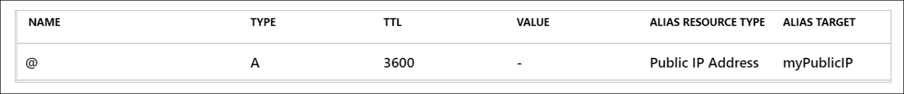

**Alias Record Characteristics**

* Alias records dynamically reference Azure resources
* Automatically update when the resource IP changes
* Supported base record types:

  * **A**
  * **AAAA**
  * **CNAME**

**Verification Process**

* Copy the **public IP address** of the load balancer
* Paste the IP into a web browser
* Result:

  * Web page displays the **name of the VM** that handled the request
  * Confirms traffic is being distributed by the load balancer

**Key Facts to Remember**

* **Zone apex cannot directly use CNAME records**
* **Azure alias records enable apex-to-resource mapping**
* Alias records **auto-refresh** when Azure resource IPs change
* Base record type must still be **A, AAAA, or CNAME**
* Alias propagation may take **up to 15 minutes**

---

## Determine Azure Virtual Network peering uses

[Module Reference](https://learn.microsoft.com/training/modules/configure-azure-virtual-network-peering/)

**Azure Virtual Network Peering Overview**

* **Azure Virtual Network peering** connects two Azure virtual networks so they operate as a **single network** for connectivity.
* Provides a **simple and quick** way to connect virtual networks.

**Types of Azure Virtual Network Peering**

* **Regional peering**

  * Connects virtual networks **within the same Azure region**
* **Global peering**

  * Connects virtual networks **across different Azure regions**

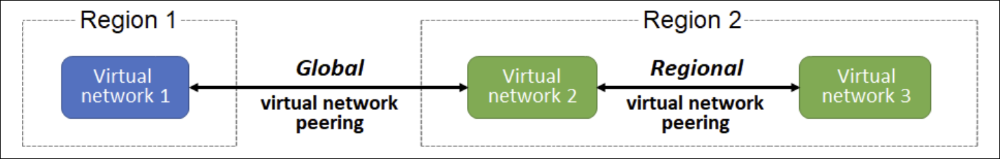

**Regional Peering Rules**

* Virtual networks must be in:

  * The **same Azure public cloud region**, or
  * The **same China cloud region**, or
  * The **same Microsoft Azure Government cloud region**

**Global Peering Rules**

* Allowed between virtual networks in:

  * **Any Azure public cloud region**
  * **Any China cloud region**
* **Not permitted** between different **Azure Government cloud regions**

**Management and Scope**

* Peered virtual networks remain **separate resources**
* Virtual networks can be peered:

  * **Across subscriptions**
  * **Across tenants**

**Benefits of Azure Virtual Network Peering**

* **Private network connections**

  * Traffic stays on the **Azure backbone network**
  * **No public internet**, **no gateways**, **no encryption required**
* **Strong performance**

  * **Low latency**
  * **High bandwidth**
* **Simplified communication**

  * Resources communicate directly across peered networks
* **Seamless data transfer**

  * Works across **subscriptions**, **deployment models**, and **regions**
* **No resource disruptions**

  * **No downtime** during or after peering creation

**Key Facts to Remember**

* Two peering types: **regional** and **global**
* Global peering **cannot** span Azure Government regions
* Peering does **not merge** virtual networks into a single resource
* Traffic remains **private on the Azure backbone**
* Peering supports **cross-subscription** and **cross-tenant** connectivity

---

## Determine gateway transit and connectivity

[Module Reference](https://learn.microsoft.com/training/modules/configure-azure-virtual-network-peering/)

**Gateway Transit Overview**

* When virtual networks are peered, an **Azure VPN Gateway** in one virtual network can act as a **transit point**.
* A peered virtual network can use a **remote VPN gateway** to access other resources.

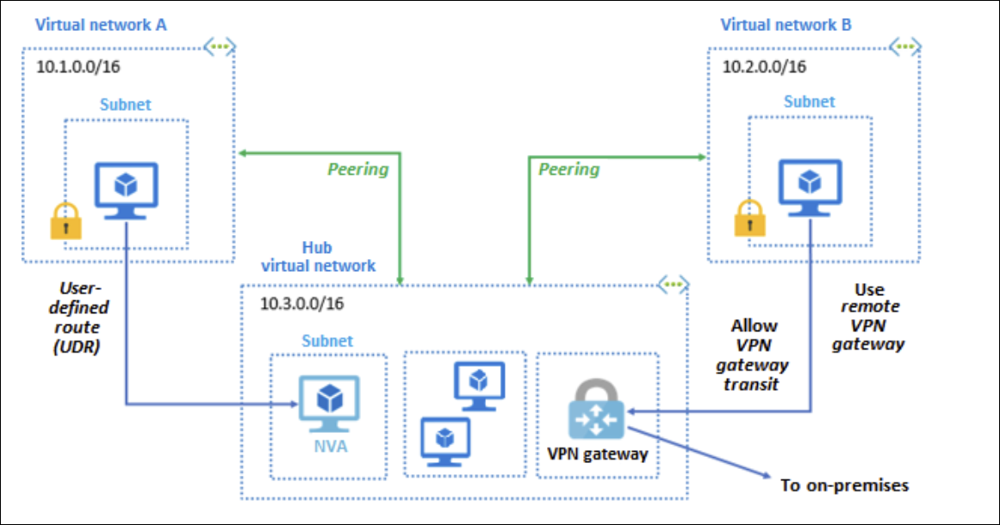

**Transit and Connectivity Scenario**

* Multiple virtual networks are connected using **virtual network peering**
* A **hub virtual network** contains:

  * A **gateway subnet**
  * An **Azure VPN gateway**
* The VPN gateway is configured to **allow gateway transit**
* A spoke virtual network:

  * Accesses hub resources
  * Uses the **remote VPN gateway** for connectivity

**Azure Portal Configuration Notes**

* The Azure portal does **not explicitly label** settings as gateway transit
* Configuration is done through options for:

  * **Allowing**
  * **Forwarding** network traffic

**Azure VPN Gateway Characteristics**

* A virtual network can have **only one VPN gateway**
* **Gateway transit** is supported for:

  * **Regional** virtual network peering
  * **Global** virtual network peering

**Capabilities Enabled by Gateway Transit**

When VPN gateway transit is allowed, the gateway can:

* Connect to an **on-premises network** using a **site-to-site VPN**
* Connect to another virtual network using a **vnet-to-vnet connection**
* Connect clients using a **point-to-site VPN**

**Benefits of Gateway Transit**

* Peered virtual networks can **share a single VPN gateway**
* Eliminates the need to deploy a **VPN gateway in each peered virtual network**
* Enables access to **external resources** beyond the peered networks

**Network Security Groups (NSGs)**

* **Network security groups** can be used to:

  * Allow access
  * Block access
* During virtual network peering configuration, you can:

  * **Open**
  * **Close**
    NSG rules between virtual networks

**Key Facts to Remember**

* Only **one VPN gateway per virtual network**
* Gateway transit works with **regional and global peering**
* Gateway transit enables access to **external networks**
* Peered networks can **share a gateway**
* NSGs control traffic flow between peered networks

---

## Create virtual network peering

[Module Reference](https://learn.microsoft.com/en-us/training/modules/configure-vnet-peering/4-create)

**Overview**

* Azure Virtual Network peering can be configured using:

  * Azure portal
  * Azure PowerShell
  * Azure CLI
* This module focuses on creating peering in the **Azure portal** for virtual networks deployed using **Azure Resource Manager (ARM)**

**Things to Know Before Creating Peering**

* Your Azure account must have one of the following:

  * **Network Contributor** role
  * A **custom role** with permissions to perform peering actions
* **Two virtual networks** are required to create a peering
* The second virtual network is referred to as the **remote network**
* Before peering:

  * Virtual machines in each virtual network **cannot communicate**
* After peering is established:

  * Virtual machines **can communicate** based on the configured peering settings

**Peering Connectivity Behavior**

* Peering enables communication **within the peered networks**
* Communication behavior depends on **configuration settings** applied during peering

**Checking Peering Status**

* Peering status can be viewed in the **Azure portal**
* Peering is **not successfully established** until **both virtual networks** show a status of **Connected**

**Peering Status Conditions (Azure Resource Manager)**

* **Initiated**

  * Occurs when the peering is created from the first virtual network to the remote virtual network
* **Connected**

  * Occurs after the peering is created from the remote virtual network back to the first virtual network
  * Once complete, **both virtual networks** show a status of **Connected**

**Classic Deployment Model Status**

* In addition to **Initiated** and **Connected**, the **Updating** status may appear

**Key Facts to Remember**

* **Two peerings are required** for a complete connection (one from each virtual network)
* Peering is only active when **both sides show Connected**
* Initial peering always starts in the **Initiated** state
* Full connectivity is achieved only after the **second peering is created**

---

## Extend peering with user-defined routes and service chaining

[Module Reference](https://learn.microsoft.com/training/modules/configure-azure-virtual-network-peering/)

**Nontransitive Virtual Network Peering**

* Virtual network peering is **nontransitive**
* Communication is limited to:

  * The **two virtual networks** in the peering
  * **Resources** within those networks
* Peering between:

  * **VNet A ↔ VNet B**
  * **VNet B ↔ VNet C**
* Does **NOT** enable communication between:

  * **VNet A ↔ VNet C**
* Additional mechanisms are required to enable traffic outside the direct peering relationship

**Ways to Extend Peering Capabilities**

* Extends connectivity to:

  * Other virtual networks
  * Resources outside the private peering network

**Hub-and-Spoke Network**

* A **hub virtual network** hosts shared infrastructure components
* Common hub components:

  * **Network Virtual Appliance (NVA)**
  * **Azure VPN gateway**
* **Spoke virtual networks** peer with the hub
* Traffic flows:

  * From spoke VNets
  * Through NVAs or VPN gateways in the hub

**User-Defined Routes (UDRs)**

* Virtual network peering allows UDRs with next hop as:

  * IP address of a **virtual machine** in a peered virtual network
  * A **VPN gateway**
* Used to control traffic flow beyond default routing


**Service Chaining**

* Used to **direct traffic** through:

  * Virtual appliances
  * Gateways
* Enabled by configuring **UDRs** that:

  * Point to virtual machines in peered virtual networks as the **next hop**
  * Or point to **virtual network gateways**
* Commonly used with hub-and-spoke architectures

**Key Facts to Remember**

* **Peering is nontransitive** — no automatic multi-hop communication
* **Hub-and-spoke** enables centralized routing and shared services
* **UDRs** extend routing by specifying custom next hops
* **Service chaining** relies on UDRs to steer traffic through NVAs or gateways
* NVAs and VPN gateways are typically placed in the **hub virtual network**

---

## Exercise - Implement Intersite Connectivity

[Module Reference](https://learn.microsoft.com/training/modules/configure-azure-virtual-network-peering/)

**Lab Scenario**

* Organization separates **core IT apps and services** (for example, DNS and security services) from other business areas such as **manufacturing**
* Some scenarios require **communication between segmented areas**
* Demonstrates a **common networking pattern**:

  * Separating production from development
  * Separating subsidiaries or business units
* Objective is to **configure connectivity** between segmented virtual networks

**Architecture**

* Two **separate virtual networks**
* Each virtual network contains its own **virtual machine**
* Connectivity is enabled through **virtual network peering**
* Connection validation is performed using **Network Watcher** and **Azure PowerShell**


**Job Skills Practiced**

* Create a **virtual machine** in a virtual network
* Create a **virtual machine** in a different virtual network
* Configure **virtual network peering** between virtual networks
* Use **Network Watcher** to test connectivity between virtual machines
* Use **Azure PowerShell** to test connectivity between virtual machines
* Create a **custom route** (optional)

**Exercise Details**

* **Estimated time**: 50 minutes
* **Azure subscription required**
* Exercise is launched externally and must be completed before continuing

**Key Facts to Remember**

* Virtual network peering enables **communication between isolated network segments**
* Connectivity does not exist **until peering is configured**
* Network Watcher is used to **validate network connectivity**
* Azure PowerShell can be used for **connection testing**
* Custom routes are **optional** and extend routing control

---

## Identify routing capabilities of an Azure virtual network

[Module Reference](https://learn.microsoft.com/en-us/training/modules/control-network-traffic-flow-with-routes/2-azure-virtual-network-route)

**Azure routing**

* Network traffic in Azure is automatically routed across subnets, virtual networks, and on-premises networks by **system routes**
* System routes are assigned by default to each subnet
* Virtual machines in the same virtual network can communicate by default
* Virtual machines can be accessible from on-premises networks or the internet
* System routes **can’t be created or deleted**, but **can be overridden** with custom routes

**Default system routes**

* **Unique to the virtual network** → Virtual network
* **0.0.0.0/0** → Internet
* **10.0.0.0/8** → None
* **172.16.0.0/12** → None
* **192.168.0.0/16** → None
* **100.64.0.0/10** → None

**Next hop types**

* **Virtual network**

  * Routes traffic within address ranges defined at the virtual-network level
* **Internet**

  * Default route (0.0.0.0/0) to the internet unless overridden
* **None**

  * Drops traffic and does not route it outside the subnet
  * Includes private IPv4 ranges and shared address space
  * These address ranges are not globally routable


**Additional system routes**

Azure creates additional system routes when these capabilities are enabled:

* Virtual network peering
* Service chaining
* Virtual network gateway
* Virtual network service endpoint

**Virtual network peering and service chaining**

* Enables connectivity between virtual networks in the same or different regions
* Allows virtual machines to communicate across peered networks
* Creates additional routes in the default route table
* **Service chaining** allows overriding these routes with user-defined routes
* Traffic can be routed through an NVA or Azure VPN gateway


**Virtual network gateway**

* Sends encrypted traffic:

  * Between Azure and on-premises over the internet
  * Between Azure virtual networks
* Contains routing tables and gateway services

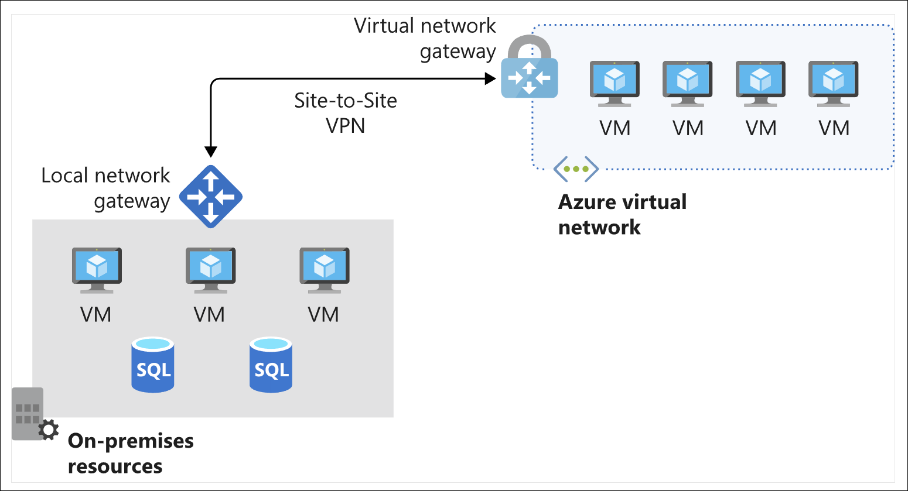

**Virtual network service endpoint**

* Extends private address space to Azure services
* Enables private access to Azure resources (for example, storage accounts)
* Restricts access from public virtual machines
* Automatically creates routes to direct endpoint traffic

**Custom routes**

* Used to control traffic flow beyond default system routing
* Common scenarios include routing through:

  * Network virtual appliances (NVAs)
  * Firewalls
* Implemented using:

  * **User-defined routes**
  * **Border Gateway Protocol (BGP)**

**User-defined routes**

* Override default system routes
* Commonly used to route traffic through firewalls or NVAs
* Can prevent direct traffic flow between subnets

**Supported next hop types for user-defined routes**

* **Virtual appliance**

  * Typically a firewall or NVA
  * Uses a private IP of a NIC or internal load balancer
* **Virtual network gateway**

  * Routes traffic to a VPN gateway
* **Virtual network**

  * Overrides default routing within the virtual network
* **Internet**

  * Routes traffic for a specific prefix to the internet
* **None**

  * Drops traffic for a specified address prefix
* Cannot use **VirtualNetworkServiceEndpoint** as a next hop type

**Service tags for user-defined routes**

* Service tags can be used instead of IP address ranges
* Represent a group of IP prefixes for an Azure service
* Address prefixes are managed and updated automatically by Microsoft
* Reduce route maintenance and number of routes required

**Border Gateway Protocol (BGP)**

* Exchanges routes between:

  * On-premises network gateways
  * Azure virtual network gateways
* Standard routing protocol for exchanging routes between networks
* Commonly used with:

  * Azure ExpressRoute
  * VPN site-to-site connections
* Improves network stability by dynamically rerouting traffic if paths fail


**Route selection and priority**

* Azure selects routes using **longest prefix match**
* More specific prefixes take priority over broader ones
* Multiple user-defined routes with the same address prefix are not allowed

**Route priority order**

1. **User-defined routes**
2. **BGP routes**
3. **System routes**

**Key Facts to Remember**

* System routes are default and cannot be deleted
* Custom routes override system routes
* Longest prefix match determines route selection
* User-defined routes have the highest priority
* BGP routes take precedence over system routes
* Service tags simplify route management

---

## Exercise - Create custom routes

[Module Reference](https://learn.microsoft.com/training/modules/manage-control-traffic-flow-with-routes/)

**Scenario and Goal**

* Control how network traffic is routed across an Azure infrastructure as part of a security strategy.
* Use a **network virtual appliance (NVA)** to secure/monitor traffic so communication between **front-end public servers** and **internal private servers** is always routed through the appliance.
* Configure routing so traffic from the **public subnet** to the **private subnet** is routed through the NVA by:

  * Creating a **custom route** for the public subnet that routes traffic to a **perimeter-network (dmz) subnet**
  * Deploying the NVA later to the **perimeter-network subnet**

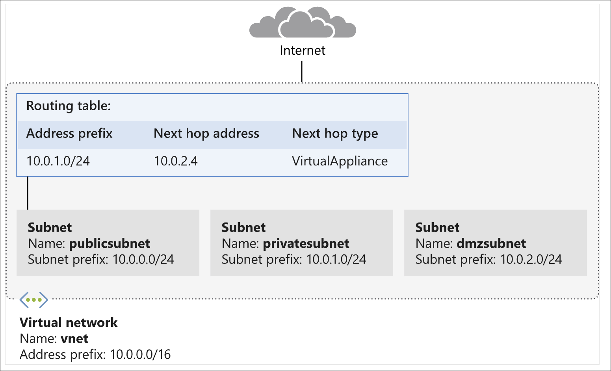

**Exercise Notes and Requirements**

* Exercise is **optional**.
* To complete it, you need an **Azure subscription**.
* You need a **resource group**:

  * Use an existing one, or create a new one for easier cleanup.
* Replace **myResourceGroupName** in examples with your resource group name.
* If you see an error: **“This command is implicitly deprecated.”** ignore it for this module.
* In Azure Cloud Shell: **Settings > Go to Classic version**.

**Create a route table and custom route**

1. Create the route table:

   ```azurecli
   az network route-table create \
       --name publictable \
       --resource-group "myResourceGroupName" \
       --disable-bgp-route-propagation false
   ```

2. Create a custom route for traffic intended for the private subnet:

   ```azurecli
   az network route-table route create \
       --route-table-name publictable \
       --resource-group "myResourceGroupName" \
       --name productionsubnet \
       --address-prefix 10.0.1.0/24 \
       --next-hop-type VirtualAppliance \
       --next-hop-ip-address 10.0.2.4
   ```

**Create a virtual network and subnets**

* Create virtual network **vnet** and subnet **publicsubnet**:

  ```azurecli
  az network vnet create \
      --name vnet \
      --resource-group "myResourceGroupName" \
      --address-prefixes 10.0.0.0/16 \
      --subnet-name publicsubnet \
      --subnet-prefixes 10.0.0.0/24
  ```

* Create subnet **privatesubnet**:

  ```azurecli
  az network vnet subnet create \
      --name privatesubnet \
      --vnet-name vnet \
      --resource-group "myResourceGroupName" \
      --address-prefixes 10.0.1.0/24
  ```

* Create subnet **dmzsubnet**:

  ```azurecli
  az network vnet subnet create \
      --name dmzsubnet \
      --vnet-name vnet \
      --resource-group "myResourceGroupName" \
      --address-prefixes 10.0.2.0/24
  ```

* List all subnets in **vnet**:

  ```azurecli
  az network vnet subnet list \
      --resource-group "myResourceGroupName" \
      --vnet-name vnet \
      --output table
  ```

**Associate the route table with the public subnet**

1. Associate route table **publictable** with subnet **publicsubnet**:

   ```azurecli
   az network vnet subnet update \
       --name publicsubnet \
       --vnet-name vnet \
       --resource-group "myResourceGroupName" \
       --route-table publictable
   ```

**Key Facts to Remember**

* Goal: route traffic from **public subnet** to **private subnet** through an **NVA**.
* Route table created: **publictable**.
* Custom route targets **10.0.1.0/24** with next hop **VirtualAppliance** at **10.0.2.4**.
* VNet: **10.0.0.0/16** with subnets:

  * **publicsubnet**: **10.0.0.0/24**
  * **privatesubnet**: **10.0.1.0/24**
  * **dmzsubnet**: **10.0.2.0/24**
* Route table association is applied to **publicsubnet**.

---

## What is an NVA?

[Module Reference](https://learn.microsoft.com/training/modules/manage-control-traffic-flow-azure-deployment-routes/)

**Definition**

* A **network virtual appliance (NVA)** is a **virtual machine** that controls the flow of network traffic by managing **routing** within an Azure virtual network.

**Common NVA Functions**

* **Firewall**
* **WAN optimizer**
* **Application-delivery controller**
* **Router**
* **Load balancer**
* **IDS/IPS**
* **Proxy**

**NVA Providers**

* NVAs can be deployed from **Azure Marketplace**
* Common providers include:

  * Cisco
  * Check Point
  * Barracuda
  * Sophos
  * WatchGuard
  * SonicWall

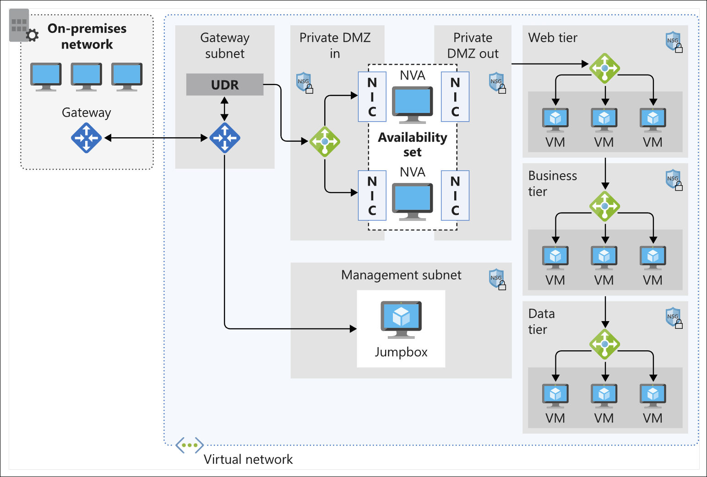

**Why Use an NVA**

* Filter **inbound traffic** to a virtual network
* Block **malicious requests**
* Block traffic from **unexpected or unauthorized resources**
* Prevent **unwanted or unsecured traffic** from reaching critical systems
* Secure both:

  * **Virtual machine networking**
  * **Azure services networking**

**Traffic Control Role**

* NVAs are typically used to:

  * Manage traffic from a **perimeter network** to internal subnets
  * Inspect and control traffic before it reaches internal resources
* When deployed, an NVA **acts as a router** that forwards traffic between subnets

**Deployment Models**

* **Perimeter subnet deployment**

  * Firewall appliance placed in a dedicated perimeter subnet
* **Microsegmentation approach**

  * Dedicated subnet for the firewall
  * Workloads deployed in separate subnets
  * **All traffic is routed through the firewall**
  * Traffic is inspected by the NVA before reaching target subnets

**Inspection Capabilities**

* Inspects packets at:

  * **OSI Layer 4**
  * **OSI Layer 7** (for application-aware appliances)

**Network Interfaces**

* Some NVAs require **multiple network interfaces**

  * One interface for **management**
  * Additional interfaces for **traffic processing**
* Traffic is routed through the appropriate interface after configuration
* **IP forwarding** must be enabled on appliance network interfaces

**User-Defined Routes (UDRs)**

* Default Azure system routes are sufficient for most environments
* Custom route tables are required for scenarios such as:

  * **Forced tunneling** (internet access via on-premises network)
  * **Routing traffic through NVAs**
* Key rules:

  * You can create **multiple route tables**
  * A route table can be associated with **multiple subnets**
  * A subnet can be associated with **only one route table**

**High Availability Considerations**

* NVAs are **critical infrastructure components**
* NVA failure directly affects service communication
* **Highly available architectures** are required for production deployments
* Multiple high-availability designs are supported (details provided later in the module)

**Key Facts to Remember**

* **NVA purpose**: Control and inspect traffic flow through routing
* **Primary benefit**: Allow only traffic that meets security requirements to pass from the perimeter network
* **Microsegmentation** ensures all subnet traffic is inspected
* **UDRs** are required to force traffic through an NVA
* **Subnets** can be linked to only **one route table**
* **NVA failures impact availability**, so HA design is essential

---

## Exercise - Create an NVA and virtual machines

[Module Reference](https://learn.microsoft.com/training/modules/manage-control-traffic-flow-azure-deployment-routes/)

**Purpose of the Exercise**

* Deploy a **network virtual appliance (NVA)** to secure and monitor traffic between **front-end public servers** and **internal private servers**
* Ensure traffic routed through the NVA reaches its destination by enabling **IP forwarding**
* Place the NVA in the **dmzsubnet** subnet
* Forward traffic that matches custom routes to the **privatesubnet**

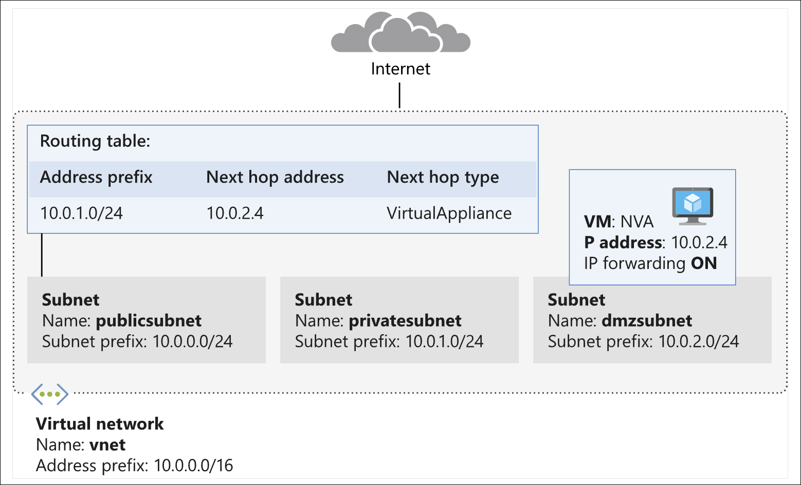

**Important Prerequisites**

* Exercise is **optional**
* Requires an **Azure subscription**
* If no subscription is available, instructions can be reviewed conceptually

**Deploy the Network Virtual Appliance**

* The NVA is implemented using an **Ubuntu LTS virtual machine**
* Deployed into the **dmzsubnet** subnet of the virtual network

1. Create the NVA virtual machine:

   ```azurecli
   az vm create \
       --resource-group "myResourceGroupName" \
       --name nva \
       --vnet-name vnet \
       --subnet dmzsubnet \
       --image Ubuntu2204 \
       --admin-username azureuser \
       --admin-password <password>
   ```

**Enable IP Forwarding on the Azure Network Interface**

* IP forwarding must be enabled at the **Azure NIC level**
* Without this, traffic routed through the NVA will not be forwarded

1. Retrieve the network interface ID:

   ```azurecli
   NICID=$(az vm nic list \
       --resource-group "myResourceGroupName" \
       --vm-name nva \
       --query "[].{id:id}" --output tsv)

   echo $NICID
   ```

2. Retrieve the network interface name:

   ```azurecli
   NICNAME=$(az vm nic show \
       --resource-group "myResourceGroupName" \
       --vm-name nva \
       --nic $NICID \
       --query "{name:name}" --output tsv)

   echo $NICNAME
   ```

3. Enable IP forwarding on the NIC:

   ```azurecli
   az network nic update --name $NICNAME \
       --resource-group "myResourceGroupName" \
       --ip-forwarding true
   ```

**Enable IP Forwarding Inside the Appliance**

* IP forwarding must also be enabled **within the Linux operating system**
* Both Azure-level and OS-level forwarding are required

1. Capture the public IP address of the NVA:

   ```azurecli
   NVAIP="$(az vm list-ip-addresses \
       --resource-group "myResourceGroupName" \
       --name nva \
       --query "[].virtualMachine.network.publicIpAddresses[*].ipAddress" \
       --output tsv)"

   echo $NVAIP
   ```

2. Enable IP forwarding in the Ubuntu VM:

   ```bash
   ssh -t -o StrictHostKeyChecking=no azureuser@$NVAIP 'sudo sysctl -w net.ipv4.ip_forward=1; exit;'
   ```

* Enter the **admin password** when prompted

**Key Facts to Remember**

* **IP forwarding must be enabled in two places**: Azure NIC and guest OS
* **Ubuntu 22.04 LTS** is used for the NVA
* NVA is deployed to the **dmzsubnet**
* Traffic using **custom routes** is forwarded to the **privatesubnet**
* Without IP forwarding, routed traffic **will not reach its destination**

---

## Exercise - Route traffic through the NVA

[Module Reference](https://learn.microsoft.com/training/modules/manage-control-traffic-flow-with-routes/)

**Exercise Overview**

* Route traffic between subnets through a **network virtual appliance (NVA)**.
* Validate routing behavior using **traceroute**.
* Demonstrate how **user-defined routes (UDRs)** affect traffic flow.


**Prerequisites**

* An **Azure subscription** is required to complete the exercise.
* Three VMs must exist:

  * **public** VM (public subnet)
  * **private** VM (private subnet)
  * **nva** VM (DMZ subnet)

**Create Cloud-Init Configuration**

* Used to automatically install **traceroute** on VM creation.

1. Create a cloud-init file:

   ```bash
   code cloud-init.txt
   ```

2. Add configuration:

   ```text
   #cloud-config
   package_upgrade: true
   packages:
      - inetutils-traceroute
   ```

**Create the Public VM**

1. Deploy the public VM:

   ```azurecli
   az vm create \
       --resource-group "myResourceGroupName" \
       --name public \
       --vnet-name vnet \
       --subnet publicsubnet \
       --image Ubuntu2204 \
       --admin-username azureuser \
       --no-wait \
       --custom-data cloud-init.txt \
       --admin-password <password>
   ```

**Create the Private VM**

1. Deploy the private VM:

   ```azurecli
   az vm create \
       --resource-group "myResourceGroupName" \
       --name private \
       --vnet-name vnet \
       --subnet privatesubnet \
       --image Ubuntu2204 \
       --admin-username azureuser \
       --no-wait \
       --custom-data cloud-init.txt \
       --admin-password <password>
   ```

**Verify VM Deployment**

* Monitor VM status until all show:

  * **ProvisioningState** = `Succeeded`
  * **PowerState** = `VM running`

1. Watch VM status:

   ```bash
   watch -d -n 5 "az vm list \
       --resource-group "myResourceGroupName" \
       --show-details \
       --query '[*].{Name:name, ProvisioningState:provisioningState, PowerState:powerState}' \
       --output table"
   ```

**Capture VM IP Addresses**

* Save public VM IP:

  ```azurecli
  PUBLICIP="$(az vm list-ip-addresses \
      --resource-group "myResourceGroupName" \
      --name public \
      --query "[].virtualMachine.network.publicIpAddresses[*].ipAddress" \
      --output tsv)"
  ```

* Save private VM IP:

  ```azurecli
  PRIVATEIP="$(az vm list-ip-addresses \
      --resource-group "myResourceGroupName" \
      --name private \
      --query "[].virtualMachine.network.publicIpAddresses[*].ipAddress" \
      --output tsv)"
  ```

**Test Routing: Public → Private**

* Traces ICMP traffic from **public VM** to **private VM**.

1. Run traceroute:

   ```bash
   ssh -t -o StrictHostKeyChecking=no azureuser@$PUBLICIP 'traceroute private --type=icmp; exit'
   ```

* Expected behavior:

  * **Hop 1**: NVA private IP (e.g., `10.0.2.4`)
  * **Hop 2**: Private VM IP (e.g., `10.0.1.4`)
* Confirms traffic from **publicsubnet** is routed through the **NVA** via a custom route.

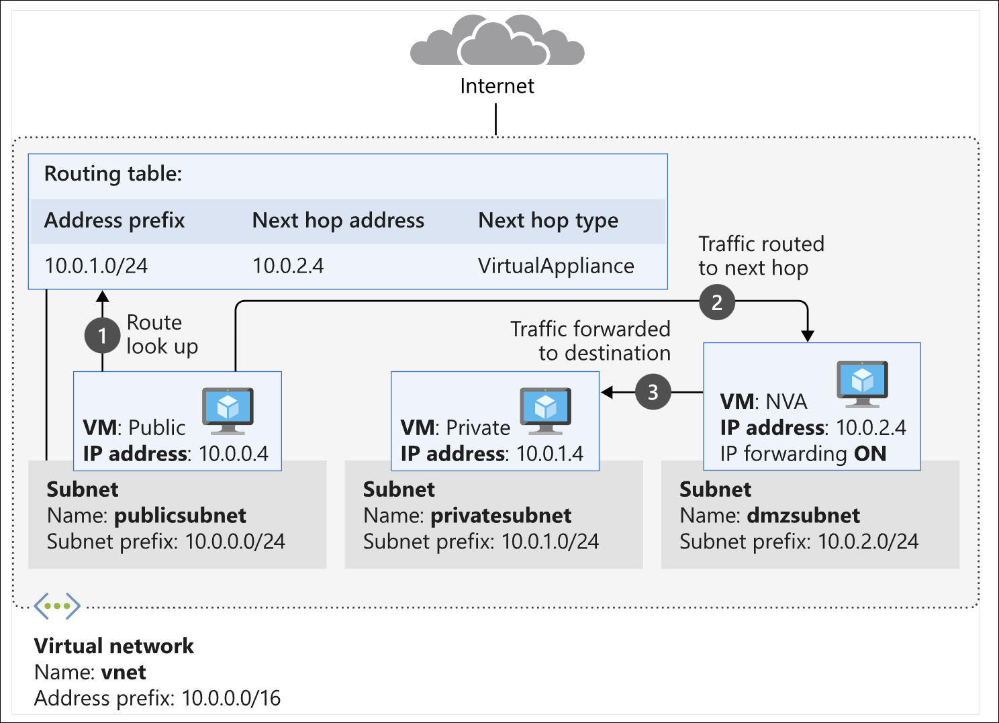

**Test Routing: Private → Public**

* Traces ICMP traffic from **private VM** to **public VM**.

1. Run traceroute:

   ```bash
   ssh -t -o StrictHostKeyChecking=no azureuser@$PRIVATEIP 'traceroute public --type=icmp; exit'
   ```

* Expected behavior:

  * Direct hop to public VM IP (e.g., `10.0.0.4`)
* Confirms **default routing** is used with no NVA involvement.


**Routing Outcome**

* Traffic from **public → private** is forced through the **NVA** using a UDR.
* Traffic from **private → public** follows **system default routes**.
* The NVA in the **dmzsubnet** can inspect and block traffic before it reaches the private subnet.

**Key Facts to Remember**

* **User-defined routes (UDRs)** control traffic flow at the subnet level.
* Routing behavior is **asymmetric** unless explicitly defined.
* **Traceroute** validates the actual packet path.
* Installing tools via **cloud-init** automates VM configuration.
* NVAs can be used for **inspection, filtering, and security enforcement**.

---

## What is Azure Load Balancer?

[Module Reference]([URL](https://learn.microsoft.com/en-us/training/modules/intro-to-azure-load-balancer/2-what-is-azure-load-balancer))

**Load Balancing Overview**

* **Load balancing** distributes incoming traffic equitably across multiple computers.
* A pool of computers with lower individual resources can respond more effectively than a single high-performance server.
* Load balancing helps avoid overloading a single server without continuously adding hardware resources.

**Azure Load Balancer**

* **Azure Load Balancer** evenly distributes incoming network traffic across:

  * A group of **Azure virtual machines (VMs)**
  * Instances in a **Virtual Machine Scale Set**
* Designed to deliver **high availability** and **high network performance**.

**Core Components**

* **Load-balancing rules**

  * Define how traffic is distributed to back-end instances.
* **Health probes**

  * Verify that back-end resources are healthy.
  * Prevent traffic from being sent to unhealthy instances.

**Types of Azure Load Balancers**

* **Public Load Balancer**

  * Load balances **internet traffic** to VMs.
  * Maps a **public IP address and port** to **private IP addresses and ports** of back-end VMs.
  * Commonly used for spreading web traffic across multiple web servers.
  * Can also provide **outbound connections** for VMs in a virtual network.

* **Internal (Private) Load Balancer**

  * Directs traffic **within a virtual network** or from **on-premises networks via VPN**.
  * Front-end IP addresses are **never exposed to the internet**.
  * Used for **internal line-of-business (LOB) applications**.
  * Commonly balances traffic between application tiers (for example, web tier to processing tier).

**Internal Load Balancer Scenarios**

* **Within a virtual network**

  * Load balancing between VMs in the same virtual network.
* **Cross-premises virtual network**

  * Load balancing from on-premises computers to Azure VMs.
* **Multi-tier applications**

  * Back-end tiers that are not internet-facing receive traffic from the front-end tier.
* **LOB applications**

  * Load balancing for Azure-hosted LOB apps without additional hardware or software.
  * Can include on-premises servers in the load-balanced set.

**Scale and Protocol Support**

* Supports **inbound and outbound** scenarios.
* Scales to **millions of TCP and UDP application flows**.

**Key Facts to Remember**

* **Azure Load Balancer** operates at the network level to distribute traffic.
* **Health probes** ensure traffic is sent only to healthy back-end instances.
* **Public load balancers** handle internet-facing traffic.
* **Internal load balancers** are used for private, internal, and multi-tier scenarios.
* Supports **TCP and UDP** at very large scale.

---

## How Azure Load Balancer works

[Module Reference](https://learn.microsoft.com/training/modules/intro-to-azure-load-balancer/how-azure-load-balancer-works)

**Azure Load Balancer Overview**

* Operates at **Layer 4 (transport layer)** of the OSI model
* Manages traffic based on:

  * **Source IP address**
  * **Destination IP address**
  * **TCP or UDP protocol**
  * **Port number**
* Cannot inspect or route traffic based on **Layer 7 (application layer)** content


**Core Load Balancer Components**

* **Front-end IP**
* **Load balancer rules**
* **Back-end pool**
* **Health probes**
* **Inbound NAT rules**
* **High availability ports**
* **Outbound rules**

**Front-end IP**

* Address clients use to connect to the application
* Can be **public** or **private**
* A load balancer can have **multiple front-end IPs**
* Choice of IP type determines load balancer type:

  * **Public load balancer**

    * Maps public IP and port to private IP and port of VMs
    * Used to distribute internet traffic to VMs or services
    * Responses are mapped back to the public IP and port
  * **Internal load balancer**

    * Uses private IP addresses only
    * Distributes traffic within a virtual network
    * Not exposed to the internet
    * Accessed from Azure or on-premises via **VPN** or **ExpressRoute**

**Load Balancer Rules**

* Define how traffic is distributed to the back-end pool
* Map a **front-end IP and port** to **back-end IPs and ports**
* Use a **five-tuple hash**:

  * Source IP
  * Source port
  * Destination IP
  * Destination port
  * Protocol (TCP or UDP)
* Supports:

  * Multiple ports
  * Multiple IP addresses
  * Separate rules per front-end IP
* **Multiple front-end configurations** are supported only with **IaaS VMs**
* Cannot apply rules based on traffic content (Layer 7)


**Back-end Pool**

* Group of **VMs** or **Virtual Machine Scale Set instances**
* Handles incoming requests
* Scaling guidance:

  * Add instances to handle increased traffic
* Automatically reconfigures when instances are added or removed
* Traffic is redistributed using existing rules

**Health Probes**

* Determine whether back-end instances are healthy
* Unhealthy instances stop receiving **new connections**
* Existing connections continue until:

  * Application ends the flow
  * Idle timeout occurs
  * VM shuts down
* Probe types:

  * **TCP**

    * Succeeds if TCP session can be established
    * Configurable: **Port**, **Interval**, **Unhealthy threshold**
  * **HTTP / HTTPS**

    * Probed every **15 seconds (default)**
    * Timeout: **31 seconds (default)**
    * Healthy only if **HTTP 200** is returned
    * Configurable: **Port**, **URI**, **Interval**, **Unhealthy threshold**

**Session Persistence (Session Affinity)**

* Default behavior: **None**

  * Any healthy VM can handle successive requests
* Stickiness applies only within a transport session
* Uses hash-based routing:

  * **2-tuple** or **3-tuple**
* Options:

  * **None (default)**
  * **Client IP (2-tuple)**: Source IP + Destination IP
  * **Client IP and protocol (3-tuple)**: Source IP + Destination IP + Protocol

**High Availability Ports**

* Load balancer rule with:

  * **Protocol: All**
  * **Port: 0**
* Applies only to **internal standard load balancers**
* Load balances **all TCP and UDP traffic on all ports**
* Uses a **five-tuple flow-based decision**
* Common use cases:

  * High availability
  * Network virtual appliances (NVAs)
  * Scenarios with large numbers of ports

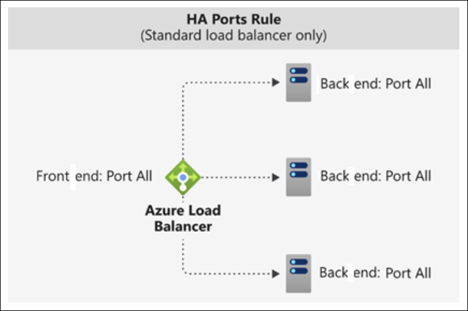

**Inbound NAT Rules**

* Used with load balancing rules
* Enable direct access to specific VM ports
* Example use case:

  * Map public IP to **TCP 3389** for Remote Desktop access

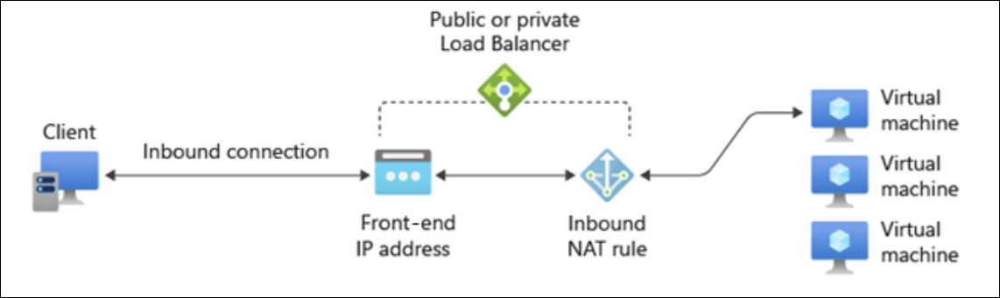

**Outbound Rules**

* Configure **Source Network Address Translation (SNAT)**
* Apply to all VMs or instances in a back-end pool
* Enable outbound connectivity to:

  * Internet
  * Public endpoints


**Key Facts to Remember**

* **Azure Load Balancer operates at Layer 4**
* **Traffic distribution uses a five-tuple hash**
* **HTTP probes require an HTTP 200 response**
* **Default health probe interval is 15 seconds**
* **Default session persistence is None**
* **HA ports use protocol = all and port = 0**
* **Layer 7 routing requires Azure Application Gateway**

---

## When to use Azure Load Balancer

[Module Reference](https://learn.microsoft.com/training/modules/intro-to-azure-load-balancer/when-to-use-azure-load-balancer)

**When to Use Azure Load Balancer**

* Best suited for applications that require **ultra-low latency** and **high performance**
* Appropriate when replacing **existing on-premises network hardware load balancers**
* Supports applications that use **multiple VM tiers**, similar to traditional on-premises architectures
* Operates at **Layer 4 (TCP/UDP)**, matching the functionality of legacy hardware devices
* Uses **health probes** to prevent traffic from being sent to failed VM instances
* Supports **session persistence** to ensure clients communicate with the same VM during a session
* Supports **public load balancers** for front-end traffic to web application tiers
* Supports **internal load balancers** for traffic between application tiers (for example, web tier to data processing tier)
* Supports **inbound NAT rules** to allow **RDP access** to individual VM instances for administration

**When Not to Use Azure Load Balancer**

* Not appropriate for applications running on a **single IaaS VM** that do not require load balancing
* Unnecessary when applications receive **low traffic** and existing infrastructure already handles the load
* No benefit if there is no need for a **back-end pool of VMs**

**Alternative Azure Load-Balancing Solutions**

* **Azure Front Door**

  * Global application delivery network
  * Provides **Layer 7** features including:

    * TLS/SSL offload
    * Path-based routing
    * Fast failover
    * Web application firewall
    * Caching
  * Best for **web apps deployed across multiple Azure regions**

* **Azure Traffic Manager**

  * **DNS-based** traffic load balancer
  * Distributes traffic across global Azure regions
  * Load balances at the **domain level only**
  * Slower failover due to **DNS caching** and TTL behavior

* **Azure Application Gateway**

  * **Application Delivery Controller (ADC)** as a service
  * Provides **Layer 7** load-balancing features
  * Offloads **TLS/SSL termination** to reduce backend CPU usage
  * Operates **within a single region**, not globally

**Azure Load Balancer Comparison Highlights**

* **Layer 4** load balancing for **TCP and UDP**
* Handles **millions of requests per second**
* Provides **inbound and outbound** load balancing
* **Zone-redundant**, ensuring high availability across availability zones
* Does **not** provide **web application firewall** functionality

**Key Facts to Remember**

* **Layer**: Layer 4 (TCP/UDP)
* **Performance**: Ultra-low latency, high throughput
* **Scope**: Regional, zone-redundant
* **Use Case**: VM-based workloads requiring hardware-style load balancing
* **Limitation**: No Layer 7 or WAF capabilities

---

## What is Azure Application Gateway?

[Module Reference](https://learn.microsoft.com/training/modules/intro-to-azure-application-gateway/)

**Overview**

* **Azure Application Gateway** manages requests from client applications to web apps hosted on a **pool of web servers**
* Back-end pool can include:

  * **Azure Virtual Machines**
  * **Azure Virtual Machine Scale Sets**
  * **Azure App Service**
  * **On-premises servers**


**Traffic Management and Security**

* Performs **HTTP load balancing** for web traffic
* Supports **TLS/SSL encryption**:

  * Between users and the Application Gateway
  * Between Application Gateway and application servers
* Uses **round-robin** routing to distribute requests across back-end servers
* Supports **session stickiness** to ensure requests from the same client session go to the same back-end server

  * Especially important for **e-commerce applications** to prevent transaction disruption

**Supported Protocols**

* **HTTP**
* **HTTPS**
* **HTTP/2**
* **WebSocket**

**Built-in Capabilities**

* **Web Application Firewall (WAF)** to protect against common web application vulnerabilities
* **End-to-end request encryption**
* **Autoscaling** to dynamically adjust capacity as web traffic changes
* **Connection draining** to gracefully remove back-end pool members during planned service updates

**Key Facts to Remember**

* **Layer 7 (application-layer) load balancer** for web traffic
* Supports **session persistence (stickiness)**
* Includes **WAF** for application-layer security
* Can route traffic to **Azure and on-premises** back-end servers
* Supports **autoscaling** and **connection draining**

---

## How Azure Application Gateway works

[Module Reference](https://learn.microsoft.com/training/modules/introduction-to-azure-application-gateway/)


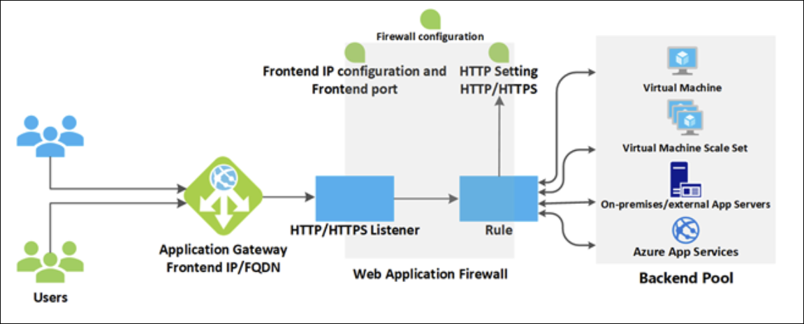

**Core Components**

* **Front-end IP address**

  * Receives client requests
  * Can be **public**, **private**, or **both**
  * Maximum of **one public IP** and **one private IP**

* **Listeners**

  * Accept incoming requests based on **protocol, port, host, and IP**
  * Route requests to back-end pools using routing rules
  * Types:

    * **Basic listener** – routes based on URL path only
    * **Multi-site listener** – routes based on hostname and URL path
  * Handle **TLS/SSL certificates** between clients and the gateway

* **Routing rules**

  * Bind a listener to a back-end pool
  * Define how hostname and path are interpreted
  * Include **HTTP settings**, such as:

    * Protocol
    * Session stickiness
    * Connection draining
    * Request timeout period
    * Health probes
  * Specify whether traffic is encrypted between gateway and back end

**Load Balancing**

* Uses **round-robin** load-balancing
* Operates at **OSI Layer 7**

  * Routes based on **hostnames and paths**
* Supports **session stickiness** to keep client sessions on the same server
* Differs from Azure Load Balancer, which operates at **OSI Layer 4**

**Web Application Firewall (WAF)**

* Optional component that processes requests **before** listeners
* Protects against common threats defined by **OWASP**
* Threats include:

  * SQL injection
  * Cross-site scripting
  * Command injection
  * HTTP request smuggling
  * HTTP response splitting
  * Remote file inclusion
  * Bots, crawlers, and scanners
  * HTTP protocol violations and anomalies
* Uses **OWASP Core Rule Sets (CRS)**:

  * **3.2**
  * **3.1** (default)
  * **3.0**
  * **2.2.9**
* Supports:

  * Selecting specific rules
  * Custom inspection targets
  * Message size limits

**Back-End Pools**

* Collection of web servers, including:

  * Virtual machines
  * Virtual machine scale sets
  * Azure App Service apps
  * On-premises servers
* All servers must be configured **consistently**
* Each pool has an associated load balancer
* TLS/SSL behavior:

  * Requires HTTP settings referencing a certificate for authentication
  * Traffic is **re-encrypted** before reaching back-end servers
* Azure App Service back ends:

  * Certificates not required
  * Traffic is automatically encrypted
  * Trust is managed by Azure

**Routing Methods**

* **Path-based routing**

  * Routes requests to different back-end pools based on URL paths
  * Example:

    * `/video/*` → video-optimized servers
    * `/images/*` → image servers


* **Multiple-site routing**

  * Hosts multiple web apps on one gateway
  * Uses multiple DNS names (CNAMEs)
  * Separate listeners and rules per site
  * Commonly used for **multitenant applications**

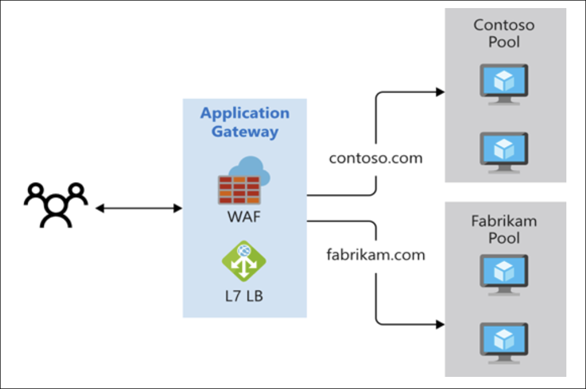

**Additional Routing Features**

* Redirection (for example, HTTP to HTTPS)
* HTTP header rewrite
* Custom error pages with branding

**TLS/SSL Termination**

* Gateway offloads TLS/SSL processing from back-end servers
* Certificates not required on servers when terminating at the gateway
* Supports **end-to-end encryption** by decrypting and re-encrypting traffic
* Only ports **80** and **443** are exposed externally
* Back-end servers are not directly accessible from the internet


**Health Probes**

* Determine which back-end servers are available
* Server is healthy if HTTP status code is **200–399**
* Default probe:

  * Waits **30 seconds** before marking a server unavailable
* Prevents routing traffic to failed or nonresponsive servers

**Autoscaling**

* Automatically scales up or down based on traffic load
* No need to select deployment size or instance count

**WebSocket and HTTP/2 Support**

* Native support for **WebSocket** and **HTTP/2**
* Enables full-duplex, bidirectional communication
* Uses long-running TCP connections
* Operates over ports **80** and **443**
* Improves efficiency through connection reuse and lower overhead

**Key Facts to Remember**

* **Layer 7 load balancer** using hostname and path-based routing
* **One public and one private IP maximum**
* **CRS 3.1** is the default WAF rule set
* Health probe success range: **HTTP 200–399**
* Default health probe timeout: **30 seconds**
* Supports **autoscaling**, **WebSocket**, and **HTTP/2**
* TLS/SSL can be terminated or re-encrypted end to end

---

## When to use Azure Application Gateway

[Module Reference](https://learn.microsoft.com/training/modules/intro-to-azure-application-gateway/)

**Reasons to Use Azure Application Gateway**

* **Application-level routing**

  * Routes traffic from an Azure endpoint to a back-end pool, including servers running in an on-premises datacenter.
  * Uses **health probes** to ensure traffic is sent only to healthy back-end servers.

* **TLS termination**

  * Offloads encryption and decryption from back-end servers.
  * Reduces **CPU utilization** on application servers.

* **Web Application Firewall (WAF) support**

  * Blocks common web attacks such as **cross-site scripting (XSS)** and **SQL injection** before traffic reaches back-end servers.

* **Session affinity**

  * Supports **cookie-based session affinity**.
  * Required when applications store **user session state locally** on individual back-end servers.

**When Not to Use Azure Application Gateway**

* Not appropriate when:

  * The web application **does not require load balancing**.
  * Traffic volume is low and existing infrastructure already handles the load effectively.
  * There is no need for a back-end pool of web apps or virtual machines.

**Alternative Azure Load-Balancing Services**

* **Azure Front Door**

  * Global **application delivery network (Layer 7)**.
  * Features:

    * TLS/SSL offload
    * Path-based routing
    * Fast failover
    * Web Application Firewall
    * Caching
  * Best for **multi-region web applications** requiring global load balancing and acceleration.

* **Azure Traffic Manager**

  * **DNS-based** global traffic distribution.
  * Load-balances at the **domain level only**.
  * Slower failover compared to Front Door due to:

    * DNS caching
    * DNS TTL not always being honored.

* **Azure Load Balancer**

  * **Layer 4 (TCP/UDP)** load balancing.
  * Ultra-low latency and high throughput.
  * Handles **millions of requests per second**.
  * **Zone-redundant** for high availability.
  * Operates **within a single Azure region**, not globally.

**Key Facts to Remember**

* **Azure Application Gateway** operates at **Layer 7** and is optimized for HTTP/HTTPS traffic.
* **Session affinity** is critical when session state is stored locally on back-end servers.
* **Front Door** is global and application-focused; **Load Balancer** is regional and transport-layer focused.
* **Traffic Manager** relies on DNS and cannot provide rapid failover.

---

## What is Azure Network Watcher?

[Module Reference](https://learn.microsoft.com/training/modules/introduction-to-azure-network-watcher/)

**Overview**

* **Azure Network Watcher** provides tools to **monitor, diagnose, view metrics, and enable or disable logs** for Azure **IaaS** resources.
* Designed to monitor and repair **network health** for:

  * Virtual machines (VMs)
  * Virtual networks (VNets)
  * Application gateways
  * Load balancers
* **Not intended** for **PaaS monitoring** or **web analytics**.


**Major Capability Areas**

* **Monitoring**
* **Network Diagnostic**
* **Traffic**

**Monitoring Tools**

* **Topology**

  * Visualizes the **entire network configuration**
  * Shows resources and relationships across:

    * Multiple subscriptions
    * Resource groups
    * Locations
  * Useful at the **start of troubleshooting** to identify hidden issues
* **Connection monitor**

  * Provides **end-to-end connection monitoring**
  * Monitors **network performance** between endpoints
  * Supports:

    * Azure-to-Azure (e.g., multi-tier VM apps)
    * Hybrid connectivity scenarios

**Network Diagnostic Tools**

* **IP flow verify**

  * Detects traffic filtering issues at the **VM level**
  * Verifies whether traffic is **allowed or denied**
  * Identifies the **specific security rule** responsible
* **NSG diagnostics**

  * Detects filtering issues at:

    * VM
    * VM scale set
    * Application gateway
  * Supports IP address, IP prefix, and service tags
  * Identifies the rule and allows adding a **higher-priority rule**
* **Next hop**

  * Detects **routing issues**
  * Shows:

    * Next hop type
    * Next hop IP address
    * Route table ID
* **Effective security rules**

  * Displays the **effective rules** applied to a network interface
  * Includes:

    * NIC-level rules
    * Subnet-level rules
    * Aggregated view
* **Connection troubleshoot**

  * Tests connectivity **at a point in time**
  * Supports sources:

    * VM
    * VM scale set
    * Application gateway
    * Bastion host
  * Supports destinations:

    * VM
    * FQDN
    * URI
    * IPv4 address
* **Packet capture**

  * Remotely captures **network traffic**
  * Supported on:

    * VM
    * VM scale set
* **VPN troubleshoot**

  * Troubleshoots **virtual network gateways** and VPN connections

**Traffic Tools**

* **Flow logs**

  * Logs Azure IP traffic
  * Stores data in **Azure Storage**
  * Supports:

    * Network security groups
    * Azure virtual networks
* **Traffic analytics**

  * Provides **visualizations** based on flow log data

**Key Facts to Remember**

* **Azure Network Watcher is for IaaS only**
* **Topology** is best for **visual network understanding**
* **Connection monitor** tracks connectivity **over time**
* **Connection troubleshoot** tests connectivity **at a single point in time**
* **IP flow verify** and **NSG diagnostics** identify **which rule allows or blocks traffic**
* **Flow logs** store traffic data; **Traffic analytics** visualizes it

---

## How Azure Network Watcher works

[Module Reference](https://learn.microsoft.com/training/modules/introduction-to-azure-network-watcher/how-azure-network-watcher-works)

**Availability and Access**

* **Azure Network Watcher** is **automatically enabled** when you create a **virtual network** in an Azure region.
* You can access it directly in the **Azure portal** by searching for **Network Watcher**.


**Topology Tool**

* Provides a **visual view** of all resources in a virtual network and their **relationships**.

* Displays both:

  * Resources in the virtual network
  * Resources associated with those resources

* **Resources shown include**:

  * Subnets
  * Network interfaces
  * Network security groups (NSGs)
  * Load balancers
  * Load balancer health probes
  * Public IP addresses
  * Virtual network peering
  * Virtual network gateways
  * VPN gateway connections
  * Virtual machines
  * Virtual Machine Scale Sets

* **Topology resource properties**:

  * **Name** – resource name
  * **Id** – resource URI
  * **Location** – Azure region
  * **Associations**

    * **AssociationType**: `Contains` or `Associated`
    * **Name** – referenced resource name
    * **ResourceId** – referenced resource URI

**Connection Monitor**

* Provides **end-to-end connection monitoring**.

* Supports both **Azure** and **hybrid** (on-premises) environments.

* Measures **latency** between resources.

* Detects connectivity changes caused by:

  * Network configuration changes
  * NSG rule modifications

* Can probe VMs at **regular intervals**.

* Diagnoses issues and explains:

  * Why the issue occurred
  * Steps to fix it

* **Agent requirement**:

  * Requires **monitoring agents** on monitored hosts.
  * Azure VMs use the **Network Watcher Agent VM** (Network Watcher extension).

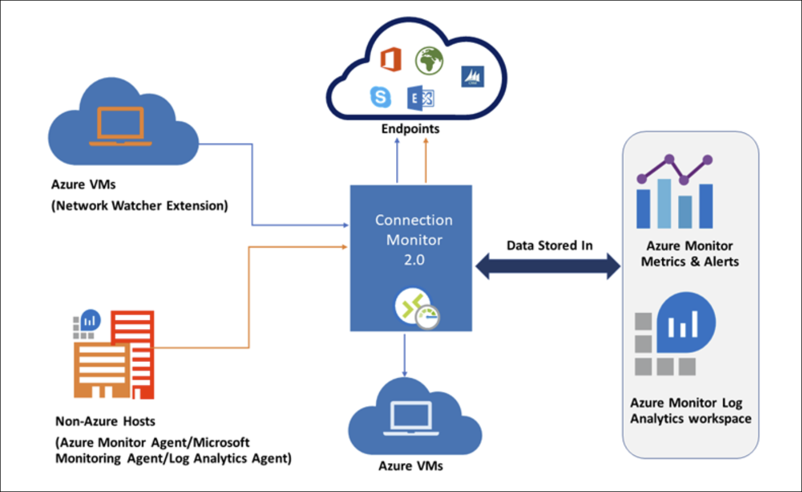

**IP Flow Verify**

* Uses **5-tuple packet verification** to determine if traffic is **allowed or denied**.
* Parameters include:

  * Protocol (**TCP or UDP**)
  * Local IP and port
  * Remote IP and port
  * VM and network adapter
* Verifies both **inbound and outbound** traffic.

**Next Hop**

* Determines how traffic from an **IaaS VM** is routed.
* Returns:

  * **Next hop type**
  * **Next hop IP address**
  * **Route table** used
* If the route is:

  * **User-defined** → returns that route
  * **System-defined** → returns **System Route**
* Helps identify misconfigured routes that cause connectivity issues.

**Effective Security Rules**

* Evaluates all **NSG rules** applied to a resource.
* Accounts for **multiple NSGs** applied at different scopes.
* Explains **why traffic is allowed or denied** based on effective rules.

**Packet Capture**

* Implemented as a **VM extension** triggered remotely.
* Can be started via:

  * Azure portal
  * PowerShell
  * Azure CLI
  * REST API
* Supports **5-tuple filtering**:

  * Protocol
  * Local IP
  * Remote IP
  * Local port
  * Remote port
* Captured data is stored:

  * On the **local disk**
  * Or in a **storage blob**

**Connection Troubleshoot**

* Tests **TCP connectivity** between a source and destination.

* Destination can be specified using:

  * FQDN
  * URI
  * IP address

* **Successful results include**:

  * Latency (milliseconds)
  * Number of probe packets sent
  * Number of hops to destination

* **Failure fault types**:

  * **CPU** – high CPU utilization
  * **Memory** – high memory utilization
  * **GuestFirewall** – firewall outside Azure blocked traffic
  * **DNSResolution** – destination IP could not be resolved
  * **NetworkSecurityRule** – NSG blocked traffic
  * **UserDefinedRoute** – incorrect route table entry

**VPN Troubleshoot**

* Diagnoses **VPN gateways** and **connections**.

* Can be run via:

  * Azure portal
  * PowerShell
  * Azure CLI
  * REST API

* Operates as a **long-running transaction**.

* Returns overall health plus detailed diagnostics.

* **Returned values**:

  * **startTime**
  * **endTime**
  * **code** – `UnHealthy` if any diagnosis fails
  * **results** – collection of diagnostics

    * **id** – fault type
    * **summary** – fault summary
    * **detailed** – detailed description
    * **recommendedActions**

      * **actionText**
      * **actionUri**
      * **actionUriText**

**Key Facts to Remember**

* Network Watcher is **enabled automatically** with a virtual network.
* **Topology** shows resources and their relationships.
* **Connection Monitor** requires agents and supports hybrid monitoring.
* **IP flow verify** and **Effective security rules** explain traffic allow/deny behavior.
* **Next hop** distinguishes between **user-defined** and **system routes**.
* **Packet capture** uses 5-tuple filtering and runs via a VM extension.
* **Connection troubleshoot** identifies specific failure causes.
* **VPN troubleshoot** returns health, diagnostics, and recommended actions.

---
