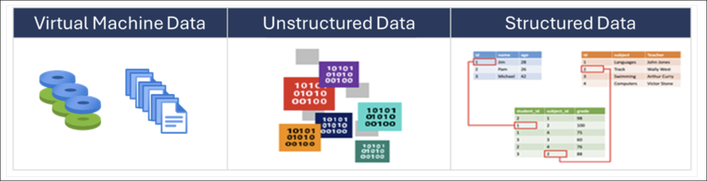
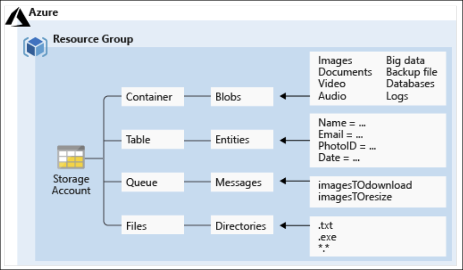
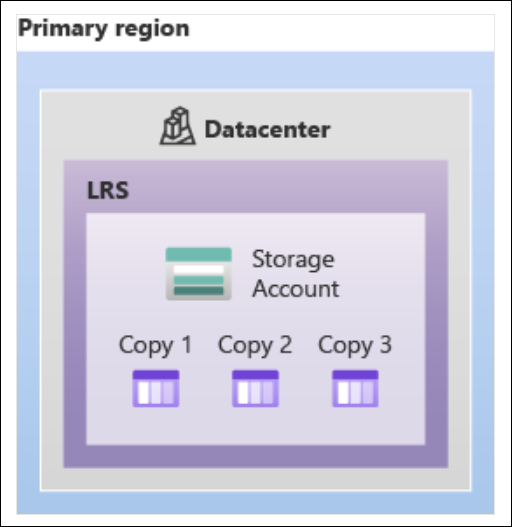
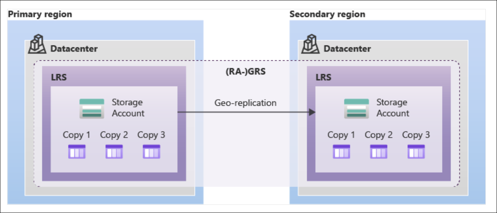
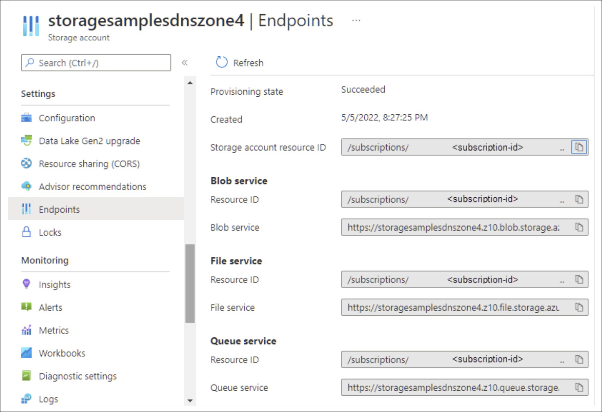
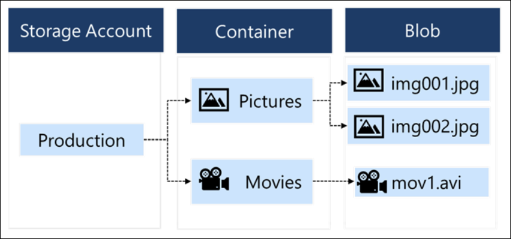
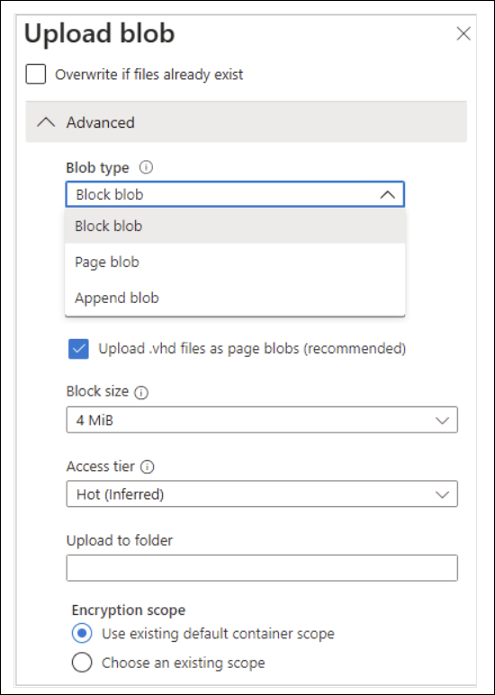
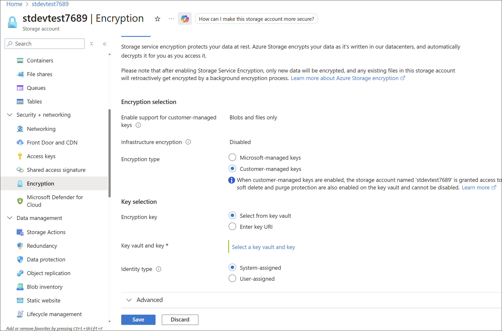
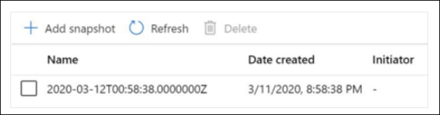

# Learning Path 2: Implement and Manage Storage

**Link:** [Microsoft Learn](https://learn.microsoft.com/en-us/training/paths/az-104-manage-storage/)

* [Implement Azure Storage](#implement-azure-storage)
* [Explore Azure Storage services](#explore-azure-storage-services)
* [Determine storage account types](#determine-storage-account-types)
* [Determine replication strategies](#determine-replication-strategies)
* [Access storage](#access-storage)
* [Secure storage endpoints](#secure-storage-endpoints)
* [Implement Azure Blob Storage](#implement-azure-blob-storage)
* [Create blob containers](#create-blob-containers)
* [Assign blob access tiers](#assign-blob-access-tiers)
* [Add blob lifecycle management rules](#add-blob-lifecycle-management-rules)
* [Determine blob object replication](#determine-blob-object-replication)
* [Manage blobs](#manage-blobs)
* [Determine Blob Storage pricing](#determine-blob-storage-pricing)
* [Review Azure Storage security strategies](#review-azure-storage-security-strategies)
* [Create shared access signatures](#create-shared-access-signatures)
* [Identify URI and SAS parameters](#identify-uri-and-sas-parameters)
* [Determine Azure Storage encryption](#determine-azure-storage-encryption)
* [Create customer-managed keys](#create-customer-managed-keys)
* [Apply Azure Storage security best practices](#apply-azure-storage-security-best-practices)
* [Compare storage for file shares and blob data](#compare-storage-for-file-shares-and-blob-data)
* [Manage Azure file shares](#manage-azure-file-shares)
* [Create file share snapshots](#create-file-share-snapshots)


---

<!-- omit in toc -->
## 📋 Modules

| # | Module | Status | Completed |
|---|--------|--------|-------|
| 1 | [Configure storage accounts](https://learn.microsoft.com/en-us/training/modules/configure-storage-accounts/) | ✅ | 1/21/26 |
| 2 | [Configure Azure Blob Storage](https://learn.microsoft.com/en-us/training/modules/configure-blob-storage/) | ✅ | 1/22/26|
| 3 | [Configure Azure Storage security](https://learn.microsoft.com/en-us/training/modules/configure-storage-security/) | ✅ | 1/22/26|
| 4 | [Configure Azure Files](https://learn.microsoft.com/en-us/training/modules/configure-azure-files-file-sync/) | 🕒 | |

**Legend:** 🕒 Not Started | 🚧 In Progress | ✅ Complete


---

## Implement Azure Storage

[Module Reference](https://learn.microsoft.com/training/modules/configure-storage-accounts/)

**Overview**

* **Azure Storage** is Microsoft’s cloud storage solution for modern data storage scenarios.
* Provides:

  * **Object storage** for massive scalability
  * **File system services** for cloud-based file shares
  * **Messaging storage** for reliable messaging
  * **NoSQL storage** for structured data
* Designed to be **AI-ready** and supports storing files, messages, tables, and other data types.
* Used by:

  * Application developers for **working data** (websites, mobile apps, desktop apps)
  * **IaaS virtual machines**
  * **PaaS cloud services**

 

**Categories of Data Supported**

* **Virtual machine data**

  * Includes **disks** and **files**
  * **Disks**: Persistent block storage for Azure IaaS virtual machines
  * **Files**: Fully managed file shares in the cloud
  * Provided through **Azure managed disks**
  * **Data disks** store:

    * Database files
    * Website static content
    * Custom application code
  * Number of data disks depends on **virtual machine size**

* **Unstructured data**

  * Least organized, **nonrelational** format
  * Stored using:

    * **Azure Blob Storage**

      * Highly scalable, REST-based cloud object store
    * **Azure Data Lake Storage**

      * Hadoop Distributed File System (HDFS) as a service

* **Structured data**

  * Stored in a **relational format** with a shared schema
  * Organized as tables with rows, columns, and keys
  * Stored using:

    * **Azure Table Storage** (autoscaling NoSQL store)
    * **Azure Cosmos DB** (globally distributed database service)
    * **Azure SQL Database** (fully managed database-as-a-service built on SQL)

**Key Considerations When Using Azure Storage**

* **Durability and availability**

  * Data is **highly durable and highly available**
  * **Redundancy** protects against:

    * Transient hardware failures
    * Local catastrophes
    * Natural disasters
  * Data can be replicated across:

    * Datacenters
    * Geographical regions
  * Replicated data remains available during unexpected outages

* **Secure access**

  * **All data is encrypted**
  * Provides **fine-grained access control** to data

* **Scalability**

  * Designed to be **massively scalable**
  * Supports modern application data storage and performance needs

* **Manageability**

  * Microsoft handles:

    * Hardware maintenance
    * Updates
    * Critical infrastructure issues

* **Data accessibility**

  * Accessible worldwide over **HTTP or HTTPS**
  * SDK support for:

    * .NET, Java, Node.js, Python, PHP, Ruby, Go
  * Supports:

    * REST API
    * Azure PowerShell
    * Azure CLI
  * Visual tools:

    * Azure portal
    * Azure Storage Explorer

**Key Facts to Remember**

* **Azure Storage** supports **virtual machine, structured, and unstructured data**
* **Azure managed disks** provide persistent storage for IaaS VMs
* **Blob Storage** and **Data Lake Storage** are used for unstructured data
* **Table Storage, Cosmos DB, and Azure SQL Database** support structured data
* Data is **encrypted by default** and **globally accessible**
* **Redundancy** ensures durability and availability during failures

---

## Explore Azure Storage services

[Module Reference](https://learn.microsoft.com/training/modules/configure-storage-accounts/)

 

**Azure Blob Storage**

* **Object storage** optimized for **massive amounts of unstructured or nonrelational data**
* Ideal for:

  * Serving **images or documents** directly to a browser
  * **Distributed file access**
  * **Streaming video and audio**
  * **Backup, restore, disaster recovery, and archiving**
  * **Data analysis** by on-premises or Azure-hosted services
* Blobs are accessible worldwide via **HTTP or HTTPS**
* Access methods:

  * URLs
  * Azure Storage REST API
  * Azure PowerShell
  * Azure CLI
  * Azure Storage client libraries
* Client libraries available for **.NET, Java, Node.js, Python, PHP, and Ruby**
* Supports access using the **NFS protocol**

**Azure Files**

* Provides **highly available network file shares**
* Supports access using:

  * **Server Message Block (SMB)**
  * **Network File System (NFS)**
* Multiple virtual machines can share files with **read and write access**
* Files can also be accessed via:

  * REST interface
  * Storage client libraries
* Common use cases:

  * **Lift-and-shift migration** of on-premises apps using file shares
  * Shared **configuration files** across multiple VMs
  * Centralized storage for **tools and utilities**
  * Storage of **diagnostic logs, metrics, and crash dumps**
* **Storage account credentials** are used for authentication
* All users mounting the share have **full read/write access**

**Azure Queue Storage**

* Used to **store and retrieve messages**
* **Queue message size limit: 64 KB**
* A queue can contain **millions of messages**
* Designed for **asynchronous message processing**
* Common scenario:

  * Decoupling application components
  * Creating a **backlog of work**
  * Independent scaling of processing components (for example, using Azure Functions)

**Azure Table Storage**

* Stores **structured, nonrelational (NoSQL) data**
* Provides a **key/attribute store** with a **schemaless design**
* Benefits:

  * Easy schema evolution as application needs change
  * **Fast and cost-effective** access
  * Typically **lower cost than traditional SQL** for similar data volumes
* Azure Cosmos DB Table API:

  * **Throughput-optimized tables**
  * **Global distribution**
  * **Automatic secondary indexes**

**Choosing the Right Azure Storage Service**

* **Massive unstructured data**: Use **Azure Blob Storage**
* **Highly available shared file storage**: Use **Azure Files**
* **Asynchronous message processing**: Use **Azure Queue Storage**
* **Structured, nonrelational data**: Use **Azure Table Storage / Cosmos DB Table API**

**Key Facts to Remember**

* **Blob Storage**: Unstructured data, HTTP/HTTPS access, NFS supported
* **Azure Files**: SMB and NFS file shares, shared VM access, lift-and-shift friendly
* **Queue Storage**: 64 KB message limit, millions of messages, async processing
* **Table Storage**: Schemaless NoSQL, cost-effective, Cosmos DB integration

---

## Determine storage account types

[Module Reference](https://learn.microsoft.com/training/modules/configure-storage-accounts/)

**Storage Account Types Overview**

* General-purpose Azure storage accounts have **two basic types**:

  * **Standard**
  * **Premium**

**Standard Storage Accounts**

* Backed by **magnetic hard disk drives (HDD)**
* Provide the **lowest cost per GB**
* Best suited for:

  * Bulk storage
  * Data that is **infrequently accessed**
* Common use cases include general application data and cost-sensitive workloads

**Premium Storage Accounts**

* Backed by **solid-state drives (SSD)**
* Provide **consistent low-latency and high-performance**
* Best suited for:

  * **I/O-intensive workloads**
  * Azure virtual machine disks
  * Databases and high-transaction applications

**Important Notes**

* **Standard and Premium storage accounts cannot be converted** between types

  * A new storage account must be created
  * Data must be copied manually if needed
* **All storage account types are encrypted at rest**

  * Encryption uses **Storage Service Encryption (SSE)**

**Storage Account Types and Supported Services**

* **Standard general-purpose v2**

  * Supports: Blob Storage (including Data Lake Storage), Queue Storage, Table Storage, Azure Files
  * Recommended for **most scenarios**, including blobs, file shares, queues, tables, and disks (page blobs)

* **Premium block blobs**

  * Supports: Blob Storage (including Data Lake Storage)
  * Recommended for:

    * Block blobs and append blobs
    * Applications with **high transaction rates**
    * Smaller objects or workloads requiring **consistently low latency**

* **Premium file shares**

  * Supports: Azure Files only
  * Recommended for:

    * Enterprise or high-performance scale applications
    * Scenarios requiring both **SMB and NFS** support

* **Premium page blobs**

  * Supports: Page blobs only
  * Recommended for:

    * Index-based and sparse data structures
    * Operating systems
    * Virtual machine data disks
    * Databases

**Key Facts to Remember**

* **Two base storage types**: Standard (HDD) and Premium (SSD)
* **No conversion** between Standard and Premium storage accounts
* **SSE encryption** is enabled for all storage accounts by default
* **Premium accounts are workload-specific** (block blobs, file shares, page blobs)
* **Standard GPv2** is the default choice for most Azure storage scenarios

---

## Determine replication strategies

[Module Reference](https://learn.microsoft.com/training/modules/configure-storage-accounts/)

**Azure Storage Replication Overview**

* Data in an Azure storage account is **always replicated** to ensure **durability** and **high availability**.
* Replication protects against:

  * Transient hardware failures
  * Network or power outages
  * Data center failures
  * Regional disasters
* Replication options span:

  * Within a **single datacenter**
  * Across **availability zones** in a region
  * Across **geographically paired regions**
* Replication helps meet Azure Storage **SLA** even during failures.


**Locally Redundant Storage (LRS)**

* **Lowest-cost** replication option
* Data is replicated **three times within a single datacenter**
* **Lowest durability** compared to other strategies
* **All replicas may be lost** during a datacenter-level disaster
* Appropriate when:

  * Data can be **easily reconstructed**
  * Data is **nonessential or constantly changing**
  * **Data residency** requires a single location



**Zone-Redundant Storage (ZRS)**

* Data is **synchronously replicated across three availability zones** in one region
* Each zone:

  * Is **physically separated**
  * Has **independent power, networking, and cooling**
* Ensures data access if **one zone becomes unavailable**
* Provides **excellent performance and low latency**
* Limitations:

  * **Not available in all regions**
  * Converting to ZRS requires **physical data movement**

 

**Geo-Redundant Storage (GRS)**

* Replicates data to a **secondary region** hundreds of miles away
* Designed for **regional disaster recovery**
* Provides **99.99999999999999% (16 9’s) durability**
* Secondary data is **read-only after Microsoft-initiated failover**
* Replication process:

  * Data written to primary region using **LRS**
  * Replicated **asynchronously** to secondary region
  * Secondary region also uses **LRS**
* Replication unit: **storage scale unit**



**Read-Access Geo-Redundant Storage (RA-GRS)**

* Based on **GRS**
* Adds **read access to the secondary region at all times**
* Read access is available **even without failover**

**Geo-Zone-Redundant Storage (GZRS)**

* Combines **ZRS + GRS**
* Data is:

  * Replicated across **three availability zones** in the primary region
  * Replicated to a **secondary paired region**
* Supports:

  * **Read/write access** during zone failures
  * **Durability during regional outages**
* Designed for **99.99999999999999% (16 9’s) durability**
* Same scalability targets as **LRS, ZRS, GRS, RA-GRS**
* Optional **read access to secondary region** with **RA-GZRS**
* Microsoft **recommends GZRS** for:

  * High availability
  * Strong consistency
  * Disaster recovery
  * Excellent performance

**Replication Strategy Capabilities**

* **Node failure protection**:

  * LRS, ZRS, GRS, RA-GRS, GZRS, RA-GZRS
* **Datacenter failure protection**:

  * ZRS, GRS, RA-GRS, GZRS, RA-GZRS
* **Region-wide outage protection**:

  * GRS, RA-GRS, GZRS, RA-GZRS
* **Read access during regional outage**:

  * RA-GRS, RA-GZRS

**Key Facts to Remember**

* **LRS**: Lowest cost, lowest durability, single datacenter
* **ZRS**: Synchronous replication across **3 availability zones**
* **GRS**: Asynchronous replication to **secondary region**
* **RA-GRS**: Read access to secondary region **without failover**
* **GZRS**: ZRS + GRS combined
* **RA-GZRS**: Read access to secondary region during disasters
* **16 nines durability** applies to **GRS, RA-GRS, GZRS, RA-GZRS**
* All geo-replication uses **LRS at both primary and secondary regions**

---

## Access storage

[Module Reference](https://learn.microsoft.com/training/modules/configure-storage-accounts/)

**Storage Account Endpoints**

* Every object in **Azure Storage** has a **unique URL**
* The **storage account name** forms the **subdomain** of the URL
* The **service type** determines the **domain name**
* The combination creates a **service endpoint**

**Default Service Endpoints**

| Service                      | Default Endpoint                             |
| ---------------------------- | -------------------------------------------- |
| **Blob (Container) service** | `//<storage-account>.blob.core.windows.net`  |
| **Table service**            | `//<storage-account>.table.core.windows.net` |
| **Queue service**            | `//<storage-account>.queue.core.windows.net` |
| **File service**             | `//<storage-account>.file.core.windows.net`  |

**Accessing Objects in Storage**

* Object URLs are created by **appending the object path** to the service endpoint

* Format:

  * `//<storage-account>.<service>.core.windows.net/<container>/<object>`

* Example:

  * Blob name: `myblob`
  * Container: `mycontainer`
  * URL:

    * `//mystorageaccount.blob.core.windows.net/mycontainer/myblob`

**Configure Custom Domains**

* You can configure a **custom domain** for **Azure Blob Storage**
* Default blob endpoint format:

  * `<storage-account>.blob.core.windows.net`
* Custom domains allow users to access blob data using a **friendly domain name**

**Direct Mapping with CNAME**

* **Direct mapping** enables a custom **subdomain** for a storage account
* Requires creating a **CNAME record** in DNS
* The CNAME maps the custom subdomain to the **blob or web endpoint**

**Direct Mapping Example**

* Custom subdomain: `blobs.contoso.com`
* Azure blob endpoint:

  * `<storage-account>.blob.core.windows.net`
* DNS CNAME record points the subdomain to the storage endpoint

 

**Key Facts to Remember**

* **Every Azure Storage object has a unique URL**
* **Storage account name = URL subdomain**
* **Service type determines the endpoint domain**
* **Custom domains apply to Blob Storage**
* **Direct mapping uses a DNS CNAME record**
* **Custom domains map to blob or web endpoints**

---

## Secure storage endpoints

[Module Reference](https://learn.microsoft.com/training/modules/configure-storage-accounts/secure-storage-endpoints)

**Firewall and Virtual Network Settings**

* Storage account network access is configured through **Firewalls and virtual networks** in the Azure portal.
* You explicitly define which **virtual networks and subnets** are allowed to access the storage account.
* This configuration **restricts access** to:

  * Specific **subnets** within virtual networks
  * Specific **public IP addresses or IP ranges**

 

**Service Endpoints**

* Azure Storage provides **service endpoint base URLs** for:

  * Blob
  * Queue
  * Table
  * File
* These base URLs are used to construct the full address for individual storage resources.

 

**Configuration Considerations**

* Access can be allowed from **one or more public IP ranges**.
* Virtual networks and subnets must be:

  * In the **same Azure region** as the storage account, **or**
  * In a supported **region pair**
* After configuration, you should **test the service endpoint** to confirm access is restricted as intended.

**Key Facts to Remember**

* **Firewalls and virtual networks** control network-level access to storage accounts.
* **Service endpoints** provide the base URL for all Azure Storage services.
* **Region alignment is required** between storage accounts and allowed virtual networks.
* **Testing access** after configuration is required to verify security behavior.

---

## Implement Azure Blob Storage

[Module Reference](https://learn.microsoft.com/training/modules/configure-azure-blob-storage/)

**Overview**

* **Azure Blob Storage** stores **unstructured data** in the cloud as objects (blobs)
* Blob = **Binary Large Object**
* Also referred to as **object storage** or **container storage**
* Supports **text and binary data** (documents, images, videos, application installers)


**Blob Storage Architecture**

* Blob Storage uses **three core resources**:

  * **Azure storage account**
  * **Containers** within the storage account
  * **Blobs** stored inside containers



**Configuration Areas When Implementing Blob Storage**

* **Blob container options**
* **Blob types and upload options**
* **Blob Storage access tiers**
* **Blob lifecycle rules**
* **Blob object replication options**

**Common Usage Scenarios**

* **Browser uploads**

  * Serve images or documents directly to a browser
* **Distributed access**

  * Store files for use across distributed systems (for example, installers)
* **Streaming data**

  * Stream video and audio content
* **Archiving and recovery**

  * Backup, restore, disaster recovery, and long-term archiving
* **Application access**

  * Store data for analysis by on-premises or Azure-hosted services

**Key Facts to Remember**

* Blob Storage is designed for **unstructured data**
* Data is organized as **storage account → container → blob**
* Multiple configuration options affect **cost, access, and lifecycle management**
* Suitable for **web, streaming, backup, and analytics workloads**

---

## Create blob containers

[Module Reference](https://learn.microsoft.com/training/modules/configure-azure-blob-storage/)

**Containers and Blobs Overview**

* **All blobs must be stored in a container**
* **Blobs cannot exist independently** in Azure Blob Storage
* **Containers organize blob storage** within a storage account
* A **container can store an unlimited number of blobs**
* An **Azure storage account can contain an unlimited number of containers**
* You **must create a container before uploading any blobs**

**Container Configuration**

* **Name**

  * Must be **unique within the storage account**
  * Allowed characters: **lowercase letters, numbers, hyphens**
  * Must **begin with a letter or number**
  * **Minimum length**: 3 characters
  * **Maximum length**: 63 characters

* **Public Access Level**

  * Determines whether the container and/or blobs are publicly accessible
  * **Private (Default)**

    * No anonymous access to the container or blobs
  * **Blob**

    * Allows anonymous **read access to blobs only**
  * **Container**

    * Allows anonymous **read and list access to the container and all blobs**

 

**Key Facts to Remember**

* **Blobs require containers** — no exceptions
* **Unlimited containers per storage account**
* **Unlimited blobs per container**
* **Default access level is Private**
* **Container naming rules are strict and enforced**
* **Public access level applies to anonymous users only**

---

## Assign blob access tiers

[Module Reference](https://learn.microsoft.com/training/modules/configure-azure-blob-storage/assign-blob-access-tiers)

**Overview**

* Azure Blob Storage supports four access tiers: **Hot**, **Cool**, **Cold**, and **Archive**
* Each tier is optimized for a specific data access pattern and cost profile

**Hot tier**

* Optimized for **frequent reads and writes**
* Intended for **actively used or processed data**
* **Highest storage costs**
* **Lowest access costs**
* Online tier with immediate access

**Cool tier**

* Optimized for **infrequently accessed data**
* Data should remain for **at least 30 days**
* Common use cases:

  * Short-term backup
  * Disaster recovery datasets
  * Older media content
* **Lower storage costs** than Hot
* **Higher access costs** than Hot
* Data is **immediately available**

**Cold tier**

* Optimized for **very infrequently accessed data**
* Data should remain for **at least 90 days**
* **Lower storage costs** than Cool
* **Higher access costs** than Cool
* Data is **immediately available**

**Archive tier**

* **Offline tier** with **hours of retrieval latency**
* Data must remain for **at least 180 days** or incur **early deletion charges**
* Common use cases:

  * Secondary backups
  * Original raw data
  * Compliance and legal retention data
* **Lowest storage costs**
* **Highest access costs**
* Blob content **cannot be read or modified directly**
* Metadata and index tags **are accessible**
* Accessing data requires **rehydration** to Hot, Cool, or Cold tier

**Rehydration**

* Required to access Archive tier blob content
* Performed by changing the blob’s tier to:

  * Hot
  * Cool
  * Cold
* Retrieval can take **several hours**

**Access tier comparison**

| Feature                          | Hot          | Cool         | Cold         | Archive  |
| -------------------------------- | ------------ | ------------ | ------------ | -------- |
| **Availability**                 | 99.9%        | 99%          | 99%          | 99%      |
| **Availability (RA-GRS reads)**  | 99.99%       | 99.9%        | 99.9%        | 99.9%    |
| **Latency (time to first byte)** | Milliseconds | Milliseconds | Milliseconds | Hours    |
| **Minimum storage duration**     | N/A          | 30 days      | 90 days      | 180 days |

**Key Facts to Remember**

* **Hot** = frequent access, highest storage cost
* **Cool** = infrequent access, 30-day minimum
* **Cold** = very infrequent access, 90-day minimum
* **Archive** = offline, hours of latency, 180-day minimum
* Archive blobs require **rehydration** before content access
* Storage cost decreases and access cost increases as you move from Hot → Archive

---

## Add blob lifecycle management rules

[Module Reference](https://learn.microsoft.com/training/modules/configure-azure-blob-storage/add-blob-lifecycle-management-rules)

**Overview**

* **Azure Blob Storage** supports **lifecycle management** for datasets with changing access patterns over time.
* Lifecycle management uses **rule-based policies** to:

  * Transition data between access tiers.
  * Expire and delete data at the end of its lifecycle.
* Supported for **GPv2** and **Blob Storage** accounts.

**Things to Know About Lifecycle Management**

* Lifecycle policy rules can:

  * Transition blobs to cooler tiers:

    * **Hot → Cool**
    * **Hot → Archive**
    * **Cool → Archive**
  * Delete:

    * Current versions of blobs
    * Previous versions of blobs
    * Blob snapshots
* Rules can be scoped to:

  * An entire storage account
  * Specific containers
  * A subset of blobs using **name prefixes** or **blob index tags**

**Business Scenario Example**

* **Early lifecycle**: Data frequently accessed → **Hot tier**
* **After ~2 weeks**: Occasional access → **Cool tier**
* **After ~1 month**: Rarely accessed → **Archive tier**
* Lifecycle management rules automate these tier transitions based on data age.

**Configure Lifecycle Management Policy Rules**

* Rules are created in the **Azure portal** for a storage account.
* Each rule consists of an **If–Then** structure.


 
**If Clause (Evaluation Condition)**

* Determines when the rule is applied.
* Evaluates data based on:

  * **Access time** or **modification time**
* **More than (days ago)**:

  * Specifies the number of days used in the evaluation condition.

**Then Clause (Action Condition)**

* Executes when the If clause evaluates to true.
* Available actions:

  * **Move to cool storage** – transitions blob to **Cool tier**
  * **Move to cold storage** – transitions blob to **Cold tier**
  * **Move to archive storage** – transitions blob to **Archive tier**
  * **Delete the blob** – permanently deletes the blob

**Design Considerations**

* Align tier transitions with the **age of data**.
* Use lifecycle rules to minimize storage cost while maintaining required performance.

**Key Facts to Remember**

* Lifecycle management is **rule-based** and automated.
* Supports **tier transitions** and **data deletion**.
* Rules use **If–Then** logic based on time since access or modification.
* Can target entire accounts, containers, or filtered blob subsets.
* Optimizes cost by matching storage tiers to data usage patterns.

---

## Determine blob object replication

[Module Reference](https://learn.microsoft.com/training/modules/configure-azure-blob-storage/)

**Overview**

* **Object replication** asynchronously copies blobs between containers based on configured policy rules.
* Replication includes:

  * **Blob content**
  * **Metadata properties**
  * **Blob versions**


**Requirements and Limitations**

* **Blob versioning must be enabled** on both the **source** and **destination** storage accounts.
* Object replication **does not support blob snapshots**.

  * Snapshots in the source account are **not replicated**.
* Supported storage tiers:

  * **Hot**
  * **Cool**
  * **Cold**
* Source and destination accounts **can use different tiers**.

**Replication Policy Configuration**

* Object replication uses a **replication policy** that defines:

  * **Source storage account**
  * **Destination storage account**
* A replication policy includes **one or more rules**.

  * Each rule specifies:

    * A **source container**
    * A **destination container**
* The policy determines **which blobs** in the source container are replicated.


**Scenarios and Considerations**

* **Latency reduction**

  * Reduce read latency by allowing clients to access data from a geographically closer region.
* **Compute workload efficiency**

  * Enable compute workloads in different regions to process the **same blob datasets**.
* **Data distribution**

  * Process or analyze data in one region and replicate only the **results** to other regions.
* **Cost optimization**

  * After replication, reduce storage costs by moving data to the **Archive tier** using **lifecycle management policies**.

**Versioning Considerations**

* **Blob versioning** automatically maintains previous versions of blobs.
* Enables recovery of:

  * **Modified data**
  * **Deleted data**

**Key Facts to Remember**

* **Blob versioning is required** on both source and destination accounts.
* **Snapshots are not replicated**.
* Supported tiers: **Hot, Cool, Cold**.
* Replication is **asynchronous**.
* Replication policies define **account pairs, containers, and rules**.
* Object replication supports **multi-region access, compute scaling, and cost optimization**.

---

## Manage blobs

[Module Reference](https://learn.microsoft.com/training/modules/configure-azure-blob-storage/manage-blobs)

**Blob Types**

* **Block blobs**

  * Consist of blocks of data assembled into a blob
  * **Default blob type** if no type is specified during creation
  * Ideal for storing **text and binary data**
  * Common use cases: **files, images, videos**
* **Append blobs**

  * Similar to block blobs but optimized for **append operations**
  * Data can only be added to the end of the blob
  * Ideal for **logging scenarios** where data grows over time
* **Page blobs**

  * Support blobs **up to 8 TB** in size
  * Optimized for **frequent read/write operations**
  * Used by **Azure Virtual Machines** for OS disks and data disks



**Important Limitation**

* **Blob type cannot be changed after creation**

**Managing Blobs in the Azure Portal**

* Suitable for **uploading and managing a small number of files**
* When uploading blobs, you configure:

  * **Blob type**
  * **Block size**
  * **Container folder**
  * **Access tier**
  * **Encryption scope**

**Tools for Managing Large Numbers of Files**

* **Azure Storage Explorer**

  * Upload, download, and manage blobs, files, queues, and tables
  * Supports Azure Data Lake Storage entities and managed disks
  * Allows previewing data and configuring permissions and access controls
* **AzCopy**

  * Command-line tool for **Windows and Linux**
  * Copies data to and from Blob Storage
  * Supports copying across containers and storage accounts
* **Azure Data Box Disk**

  * Used for **large datasets** or when **network constraints** prevent online transfer
  * Microsoft ships **SSDs** to you
  * You copy data locally and return disks for upload to Blob Storage

**Key Facts to Remember**

* **Three blob types**: block blob, append blob, page blob
* **Default blob type**: block blob
* **Maximum size**: page blobs support up to **8 TB**
* **Blob type is immutable** after creation
* **Portal** is best for few files; **tools** are recommended for large-scale transfers

---

## Determine Blob Storage pricing

[Module Reference](https://learn.microsoft.com/training/modules/configure-blob-storage/)

**Cost drivers for block blob storage**

* Primary tool for estimating costs: **Azure pricing calculator**

  * Can calculate **migration**, **monthly estimates**, and **future pricing estimates** based on workload-driven input you specify
* Block blob storage cost depends on:

  * **Volume of data stored per month**
  * **Quantity and types of operations performed**, plus any **data transfer costs**
  * **Data redundancy option selected**

**Things to know about pricing for Blob Storage**

* **Performance tiers**

  * The Blob Storage tier determines amount of data stored and the cost for storing that data
  * As the performance tier gets **cooler**, **per-gigabyte cost decreases**
* **Data access costs**

  * Data access charges increase as the tier gets **cooler**
  * For data in **Cool** and **Archive** tiers, you’re billed a **per-gigabyte data access charge for reads**
* **Transaction costs**

  * There’s a **per-transaction charge for all tiers**
  * The charge increases as the tier gets **cooler**
* **Geo-replication data transfer costs**

  * Applies only when geo-replication is configured (including **GRS** and **RA-GRS**)
  * Geo-replication data transfer incurs a **per-gigabyte** charge
* **Outbound data transfer costs**

  * Outbound data transfers incur billing for bandwidth usage on a **per-gigabyte** basis
  * Billing is consistent with general-purpose Azure storage accounts
* **Changes to the storage tier**

  * Change account storage tier **Cool → Hot**: charge equal to **reading all data** existing in the storage account
  * Change account storage tier **Hot → Cool**: charge equal to **writing all data** into the Cool tier (**GPv2 accounts only**)

**Key Facts to Remember**

* **Azure pricing calculator** is the primary tool to estimate Blob Storage costs (migration, monthly, future estimates).
* Block blob costs are driven by **stored data volume**, **operations + data transfers**, and **redundancy option**.
* As tiers get **cooler**: **storage cost/GB decreases**, but **data access** and **transaction charges increase**.
* **Cool/Archive**: billed **per-GB read access** charge.
* **GRS/RA-GRS**: geo-replication transfer billed **per-GB**.
* Tier changes can trigger full-data read/write charges (**Cool→Hot = read all**; **Hot→Cool = write all**, **GPv2 only**).

---

## Review Azure Storage security strategies

[Module Reference](https://learn.microsoft.com/training/modules/configure-azure-storage-security/)

**Azure Storage Security Overview**

* Azure Storage provides security capabilities aligned to common strategies:

  * **Encryption**
  * **Authentication**
  * **Authorization**
  * **User access control**
* Designed to support **defense in depth** by layering multiple security controls.


**Encryption at Rest**

* **Storage Service Encryption (SSE)** encrypts all data written to Azure Storage.
* Uses **256-bit Advanced Encryption Standard (AES)**.
* Data is automatically decrypted when read.
* No additional cost and no performance degradation.
* Includes encryption of **virtual hard disks (VHDs)**:

  * **BitLocker** for Windows images
  * **dm-crypt** for Linux images

**Encryption in Transit**

* Secure data using **transport-level security**.
* Always use **HTTPS** for public internet communication.
* You can enforce HTTPS by enabling **secure transfer required** on the storage account.
* After enabling secure transfer:

  * **HTTP connections are refused**
  * **SMB requires SMB 3.0** for all file share mounts

**Encryption Models**

* Supported encryption options include:

  * **Server-side encryption with service-managed keys**
  * **Server-side encryption with customer-managed keys in Key Vault**
  * **Customer-managed keys on customer-controlled hardware**
* **Client-side encryption** allows keys to be managed on-premises or in another secure location.

**Authorization Recommendations**

* Microsoft recommends using **Microsoft Entra ID with managed identities** to authorize access to:

  * **Blob data**
  * **Queue data**
  * **Table data**
* Provides better security and usability than **Shared Key authorization**.

**Role-Based Access Control (RBAC)**

* Controls access to storage account resources.
* Ensures access is granted only to:

  * Approved users or applications
  * The appropriate scope
* RBAC roles are assigned at the **storage account scope**.

**Storage Analytics**

* **Azure Storage Analytics** provides logging for storage accounts.
* Enables:

  * Request tracing
  * Usage trend analysis
  * Issue diagnosis

**Authorization Strategies**

| Authorization strategy             | Description                                                                                           |
| ---------------------------------- | ----------------------------------------------------------------------------------------------------- |
| **Microsoft Entra ID**             | Cloud-based identity and access management with fine-grained RBAC for users, groups, and applications |
| **Shared Key**                     | Uses storage account access keys to generate an encrypted signature in the Authorization header       |
| **Shared access signatures (SAS)** | Delegates time-limited and permission-scoped access to specific storage resources                     |
| **Anonymous access**               | Allows public read access to containers or blobs without authorization                                |

**Key Facts to Remember**

* **SSE uses AES-256** and is enabled by default.
* **Secure transfer required** blocks HTTP and enforces SMB 3.0.
* **Microsoft Entra ID with managed identities** is the recommended authorization method.
* **RBAC** controls who can access storage resources and at what scope.
* **SAS** provides temporary, scoped access without sharing account keys.

---

## Create shared access signatures

[Module Reference](https://learn.microsoft.com/training/modules/configure-azure-storage-security/)

**Shared access signature (SAS) overview**

* A **shared access signature (SAS)** is a **URI** that grants **restricted access** to Azure Storage resources.
* SAS enables secure sharing **without exposing storage account keys**.
* A SAS is typically provided to clients that need **temporary read/write access** to storage resources.
* Access is granted for a **specified period of time** and with **explicit permissions**.

**Types of SAS**

* **User delegation SAS**

  * Secured with **Microsoft Entra credentials**.
  * Permissions are defined by the SAS.
  * Supported for:

    * **Blob Storage**
    * **Data Lake Storage**

* **Account-level SAS**

  * Grants access to:

    * All capabilities of a **service-level SAS**
    * Additional resources and abilities
  * Example:

    * Allows the ability to **create file systems**

* **Service-level SAS**

  * Grants access to **specific resources** within a storage account.
  * Example use cases:

    * Retrieve a **list of files** in a file system
    * **Download a file**

* **Stored access policy**

  * Used with **service-level SAS**.
  * Provides:

    * Grouping of SAS tokens
    * Additional access restrictions
    * Ability to **revoke permissions without regenerating account keys**

**Recommendations for managing risks**

* **Always use HTTPS**

  * Prevents interception and misuse of SAS tokens.
  * Mitigates man-in-the-middle attacks.

* **Reference stored access policies where possible**

  * Enables revocation without regenerating storage account keys.
  * Set storage account key expiration far in the future.

* **Set near-term expiry for unplanned SAS**

  * Limits damage if a SAS is compromised.
  * Especially important when not using a stored access policy.
  * Reduces the amount of data that can be written.

* **Require clients to automatically renew SAS**

  * Renew well before expiration.
  * Allows retry time if the SAS service is unavailable.

* **Plan SAS start and expiry times carefully**

  * Clock skew can cause intermittent failures.
  * Best practices:

    * Set start time **at least 15 minutes in the past**, or
    * Omit the start time to make the SAS valid immediately
  * Up to **15 minutes of clock skew** may occur in either direction.
  * For REST API versions earlier than **2012-02-12**:

    * Maximum SAS duration without a stored access policy is **1 hour**
    * Longer durations will fail

* **Define minimum required permissions**

  * Follow least-privilege principles.
  * Grant only the permissions needed (for example, read-only instead of read/write/delete).
  * Reduces impact if a SAS is compromised.

* **Validate data written using a SAS**

  * Validate data **after it is written but before it is used**.
  * Protects against corrupt or malicious data.

* **Don’t assume SAS is always the right choice**

  * For high-risk operations:

    * Use a middle-tier service for validation, authentication, and auditing.
  * For public access scenarios:

    * Consider making a container **public** instead of issuing SAS tokens.

**Key Facts to Remember**

* **SAS** provides time-bound, permission-scoped access without exposing account keys.
* **User delegation SAS** uses Microsoft Entra credentials.
* **Account-level SAS** provides broader permissions than service-level SAS.
* **Stored access policies** enable revocation without key regeneration.
* **Clock skew** can affect SAS validity by up to **15 minutes**.
* **Older REST API versions** limit SAS duration to **1 hour** without a stored access policy.

---

## Identify URI and SAS parameters

[Module Reference](https://learn.microsoft.com/training/modules/configure-azure-storage-security/)

**Overview**

* A **shared access signature (SAS)** creates a **URI** composed of:

  * The **Azure Storage resource URI**
  * A **SAS token** made up of parameters and values
* SAS URIs control **scope**, **permissions**, and **access constraints** to Azure Storage resources

**Example SAS URI**

* Service-level SAS granting **read** and **write** permissions to a blob:

  ```
  https://myaccount.blob.core.windows.net/?restype=service&comp=properties&sv=2015-04-05&ss=bf&st=2015-04-29T22%3A18%3A26Z&se=2015-04-30T02%3A23%3A26Z&sr=b&sp=rw&sip=168.1.5.60-168.1.5.70&spr=https&sig=...
  ```

**URI and SAS Parameters**

* **Resource URI**

  * Defines the Azure Storage endpoint and request context
  * Example indicates:

    * Blob Storage endpoint
    * Service-level operations (`restype=service`)
    * Storage properties operations (`comp=properties`)
  * Behavior:

    * `GET` → retrieves storage properties
    * `SET` → configures storage properties

* **Storage version (`sv`)**

  * Indicates the Azure Storage API version to use
  * Applies to versions **2012-02-12 and later**
  * Example: `2015-04-05`

* **Storage service (`ss`)**

  * Specifies which Azure Storage services the SAS applies to
  * Example: `bf` = Blob Storage and Azure Files

* **Start time (`st`)**

  * *(Optional)*
  * Specifies when the SAS becomes valid (UTC)
  * If omitted, the SAS is valid immediately

* **Expiry time (`se`)**

  * Required
  * Specifies when the SAS expires (UTC)

* **Resource (`sr`)**

  * Defines the resource type accessible via the SAS
  * Example: `b` = Blob resource

* **Permissions (`sp`)**

  * Lists allowed operations
  * Example: `rw` = read and write permissions

* **IP range (`sip`)**

  * Restricts access to a specific IP address range
  * Example: `168.1.5.60–168.1.5.70`

* **Protocol (`spr`)**

  * Restricts which protocols can be used
  * Example: `https` = HTTPS only

* **Signature (`sig`)**

  * Authenticates access using **HMAC**
  * Computed with:

    * A storage account key
    * **SHA256** hashing algorithm
    * **Base64** encoding

**Key Facts to Remember**

* A SAS URI = **resource URI + SAS token**
* **Start time is optional**; omit it for immediate validity
* **Expiry time is required**
* **Permissions, resource scope, protocol, and IP range** are enforced by SAS parameters
* The **signature (`sig`)** secures the SAS using **HMAC with SHA256**
* Service-level SAS can control **storage service operations**, not just individual objects

---

## Determine Azure Storage encryption

[Module Reference](https://learn.microsoft.com/training/modules/configure-azure-storage-security/)

**Azure Storage Encryption Overview**

* **Encryption at rest** protects data to meet organizational security and compliance requirements.
* **Encryption and decryption are automatic** and require **no code or application changes**.
* Data is **secured by default** for all Azure Storage accounts.

**Storage Account Access Keys**

* When a storage account is created, Azure generates **two 512-bit storage account access keys**.
* These keys are used for:

  * **Shared Key authorization**
  * **Shared Access Signature (SAS) tokens** signed with the shared key
* **Microsoft recommendation**:

  * Use **Azure Key Vault** to manage access keys.
  * **Regularly rotate and regenerate keys**.
  * Key Vault enables **key rotation without application interruption**.
  * Keys can also be **manually rotated**.

**Things to Know About Azure Storage Encryption**

* Data is **automatically encrypted before being written** to storage.
* Data is **automatically decrypted when retrieved**.
* Encryption, decryption, and key management are **transparent to users**.
* All data is encrypted using **256-bit Advanced Encryption Standard (AES)**.
* Encryption is **enabled for all new and existing storage accounts**.
* Encryption **cannot be disabled**.

**Configure Azure Storage Encryption**

* Encryption is configured in the **Azure portal** by specifying the **encryption type**.
* You can choose:

  * **Microsoft-managed keys**
  * **Customer-managed keys**


**Infrastructure Encryption**

* Can be enabled:

  * For the **entire storage account**
  * For an **encryption scope** within an account
* When enabled:

  * Data is **encrypted twice**:

    * Once at the **service level**
    * Once at the **infrastructure level**
  * Uses **two different encryption algorithms**
  * Uses **two different keys**

**Platform-Managed Keys (PMK)**

* Keys are **generated, stored, and managed entirely by Azure**.
* Customers **do not interact** with these keys.
* PMKs are the **default** for Azure Data Encryption-at-Rest.

**Customer-Managed Keys (CMK)**

* Keys are **read, created, deleted, updated, or administered by customers**.
* Keys are stored in:

  * A **customer-owned key vault**
  * A **hardware security module (HSM)**
* **Bring Your Own Key (BYOK)**:

  * A CMK scenario where customers **import keys from an external location**.

**Key Facts to Remember**

* **Encryption standard**: 256-bit AES
* **Encryption status**: Enabled by default and cannot be disabled
* **Access keys**: Two 512-bit keys per storage account
* **Infrastructure encryption**: Encrypts data twice with different keys and algorithms
* **PMK vs CMK**: PMKs are Azure-managed; CMKs are customer-managed
* **Recommended key management**: Azure Key Vault

---

## Create customer-managed keys

[Module Reference]()

**Overview**

* Azure Storage supports **customer-managed keys (CMK)** for encryption by integrating with **Azure Key Vault**
* Encryption keys can be:

  * Generated using **Azure Key Vault APIs**
  * Created externally and stored in a key vault

**Things to know about customer-managed keys**

* **Customer-managed keys** provide:

  * Greater flexibility
  * More direct control over encryption
* You can:

  * **Create**
  * **Disable**
  * **Audit**
  * **Rotate**
  * **Define access controls** for keys
* Customer-managed keys can be used with **Azure Storage encryption**
* You can use:

  * A **new key**, or
  * An **existing key vault and key**
* **Region requirement**:

  * The **storage account** and **key vault** must be in the **same region**
  * They **can be in different subscriptions**

**Configure customer-managed keys**

* Configuration is done in the **Azure portal**
* Key management options:

  * **Microsoft-managed keys**
  * **Customer-managed keys**
* When configuring encryption:

  * **Encryption type**: Select whether keys are managed by Microsoft or by the customer
  * **Encryption key**:

    * Enter a **key URI**, or
    * Select a key from an **existing Azure Key Vault**



**Key Facts to Remember**

* **Customer-managed keys** increase control over encryption and key lifecycle
* **Azure Key Vault** is required for managing customer-managed keys
* **Storage account and key vault must be in the same region**
* Keys can be **audited, rotated, disabled, and access-controlled**
* Configuration is performed through the **Azure portal**

---

## Apply Azure Storage security best practices

[Module Reference](https://learn.microsoft.com/en-us/training/modules/configure-storage-security/7-apply-best-practices)

**Storage Insights Overview**

* **Storage Insights** provides comprehensive monitoring for **Azure Storage accounts**
* Delivers a **unified view** of storage **performance, capacity, and availability**


**Benefits of Storage Insights**

* **Detailed Metrics and Logs**

  * Provides metrics, logs, and diagnostic data
  * Enables monitoring of key KPIs:

    * **Latency**
    * **Throughput**
    * **Capacity utilization**
    * **Transactions**
* **Enhanced Security and Compliance**

  * Delivers actionable insights and alerts
  * Helps quickly identify and resolve **security issues**
* **Role-Based Access Control (RBAC) Integration**

  * Integrates with:

    * **Role-based access control (RBAC)**
    * **Microsoft Entra ID**
    * **Connection strings**
    * **Access control lists (ACLs)**
  * Ensures secure access to storage data and resources
* **Unified View**

  * Centralized visibility across Azure Storage services
  * Supports secure and efficient storage account management

**Security Uses for Storage Insights**

* **Real-Time Monitoring**

  * Tracks usage trends and performance
  * Supports alerting for **anomalies**
* **Security Auditing**

  * Provides detailed logs for auditing
  * Supports **compliance** and security investigations
* **Health Analysis and Optimization**

  * Assists with storage account health analysis
  * Helps maintain **secure and optimal performance**

**Key Facts to Remember**

* **Storage Insights** focuses on monitoring **performance, capacity, availability, and security**
* Supports **real-time monitoring**, **security auditing**, and **health optimization**
* Integrates with **RBAC**, **Microsoft Entra ID**, connection strings, and **ACLs**
* Provides a **single, unified view** of Azure Storage services

---

## Compare storage for file shares and blob data

[Module Reference](https://learn.microsoft.com/training/modules/compare-storage-file-shares-blob-data/)

**Azure Files Overview**

* **Fully managed file shares** provided as a PaaS service
* Accessible using **SMB**, **NFS**, and **HTTP** protocols
* Supported clients: **Windows**, **Linux**, and **macOS**

**Key Characteristics of Azure Files**

* **Serverless deployment**

  * No virtual machines, operating systems, or patching required
* **Storage limits**

  * Up to **100 TiB** per file share
  * Up to **4 TiB** per file
  * Uses a **hierarchical folder structure**
* **Data encryption**

  * Encrypted **at rest** in Azure datacenters
  * Encrypted **in transit** over the network
* **Access from anywhere**

  * Internet-accessible by default
* **Identity integration**

  * Access controlled using **Microsoft Entra identities** or **AD DS identities synced to Microsoft Entra ID**
  * Provides a familiar experience similar to on-premises file servers
* **Previous versions and backups**

  * Supports **file share snapshots**
  * Integrates with **Previous Versions** in File Explorer
  * Supports **Azure Backup**
* **Data redundancy**

  * Data is replicated within a datacenter or across multiple datacenters
  * Controlled by the **storage account replication setting**

**Common Azure Files Use Cases**

* Replace or supplement **on-premises file servers or NAS**
* Enable **global access** to file shares across operating systems
* **Lift-and-shift applications** that depend on file system APIs
* Use **Azure File Sync** to replicate shares to Windows Servers for local performance and caching
* Store **shared application configuration files**
* Centralize **diagnostic data** (logs, metrics, crash dumps)
* Store **tools and utilities** used across Azure VMs or cloud services

**Azure Files vs. Azure Blob Storage**

| Feature / Scenario | Azure Files (File Shares)                            | Azure Blob Storage (Blobs)             |
| ------------------ | ---------------------------------------------------- | -------------------------------------- |
| Access model       | SMB, NFS, REST                                       | REST and client libraries              |
| Data structure     | **True directories** with hierarchical structure     | **Flat namespace**                     |
| Data access        | Accessed through **file shares** across multiple VMs | Accessed through **containers**        |
| Ideal workloads    | Lift-and-shift apps using file system APIs           | Massive-scale unstructured data        |
| Sharing model      | Shared files across applications and VMs             | Data accessed by applications directly |
| Typical use cases  | Shared tools, debugging, app settings                | Streaming and random-access scenarios  |
| Global access      | Optimized for shared file access                     | Optimized for application data access  |

**Key Facts to Remember**

* **Azure Files max share size**: 100 TiB
* **Azure Files max file size**: 4 TiB
* **Azure Files supports**: SMB, NFS, HTTP
* **Azure Blob Storage uses**: flat namespace with containers
* **Lift-and-shift scenarios favor**: Azure Files
* **Streaming and large-scale object storage favor**: Azure Blob Storage

---

## Manage Azure file shares

[Module Reference]()

**Azure Files Protocol Support**

* Azure Files supports **Server Message Block (SMB)** and **Network File System (NFS)** protocols
* A single Azure file share supports **either SMB or NFS**, not both
* SMB and NFS file shares can coexist within the **same storage account**

**Types of Azure File Shares**

* Azure Files supports **two storage tiers**:

  * **Premium**
  * **Standard**

| Storage tier | Description                                                                                                                                                                                                             |
| ------------ | ----------------------------------------------------------------------------------------------------------------------------------------------------------------------------------------------------------------------- |
| **Premium**  | Stores data on **SSDs**; available only in **FileStorage** storage accounts; provides **consistent high performance and low latency**; supports **LRS** and **ZRS (in some regions)**; **not available in all regions** |
| **Standard** | Stores data on **HDDs**; deployed in **GPv2** storage accounts; suitable for **general-purpose and dev/test workloads**; supports **LRS, ZRS, GRS, and GZRS**; available in **all Azure regions**                       |

**Authentication Methods**

* Azure Files supports **three authentication methods**:

  * **Identity-based authentication over SMB**

    * Provides **single sign-on (SSO)** similar to on-premises file shares
  * **Access key**

    * Storage accounts have **two static access keys**
    * Provide **full control access**
    * **Bypass all access control restrictions**
    * Best practice is to **avoid sharing access keys**
  * **Shared Access Signature (SAS) token**

    * Dynamically generated **URI**
    * Provides **restricted access** based on:

      * Permissions
      * Start and expiry time
      * Allowed IP addresses
      * Allowed protocols
    * With Azure Files, SAS is used **only for REST API access from code**

**Creating SMB Azure File Shares (Classic)**

* Classic Azure file shares:

  * Exist **inside a storage account**
  * Follow the **limits of the storage account**
* Storage options:

  * **SSD (Premium)** – low latency, single-digit milliseconds
  * **HDD (Standard)** – cost-effective, general-purpose
* SMB file shares allow selection of access tiers:

  * **Transaction optimized**
  * **Hot**
  * **Cool**


* SMB connectivity:

  * Uses **port 445**
  * Azure provides **ready-to-use scripts** for Windows and Linux

**Important Notes**

* **File shares (preview)** are a new **top-level Azure resource**
* File shares (preview) **do not require a storage account**

**Key Facts to Remember**

* **SMB and NFS cannot be used on the same file share**
* **Premium = SSD + FileStorage account**
* **Standard = HDD + GPv2 account**
* **SAS tokens for Azure Files are REST-only**
* **SMB traffic uses port 445**
* **File shares (preview) do not require storage accounts**

---

## Create file share snapshots

[Module Reference](https://learn.microsoft.com/training/modules/configure-azure-files/)

**Overview**

* Azure Files supports **file share snapshots** that capture a **point-in-time, read-only copy** of a file share.
* Snapshots operate at the **file share level**, not at the individual storage account level.



**Characteristics of File Share Snapshots**

* **Share-level capability**: Snapshots apply to an entire Azure file share.
* **Incremental snapshots**:

  * Only data changed since the **most recent snapshot** is stored.
  * Reduces **snapshot creation time** and **storage costs**.
* **Restore efficiency**:

  * Despite being incremental, you only need the **most recent snapshot** to restore the share.
* **Granular recovery**:

  * Individual files can be restored from a share snapshot.
  * Avoids restoring the entire file share when only a single file is needed.
* **Deletion behavior**:

  * Deleting a file share **also deletes all associated snapshots**.

**Benefits of Using File Share Snapshots**

* **Protection against application errors and data corruption**

  * Useful before deploying new application code.
  * Enables rollback to a previous state if a deployment introduces bugs or data corruption.
* **Protection against accidental deletions or unintended changes**

  * Allows recovery of files that were deleted, renamed, or overwritten.
  * Provides access to previous versions after changes are committed.
* **Backup and recovery support**

  * Periodic snapshots can serve as **data backups**.
  * Supports **audit requirements** and **disaster recovery** scenarios by retaining historical versions of data.

**Key Facts to Remember**

* Snapshots are **read-only** and **point-in-time**.
* Snapshots are **incremental**, saving only changed data.
* **Most recent snapshot** is sufficient for restoration.
* **Individual file restore** is supported.
* Deleting a file share **removes all snapshots**.

---
