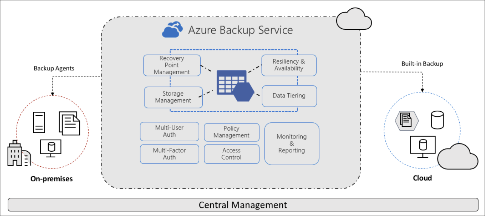
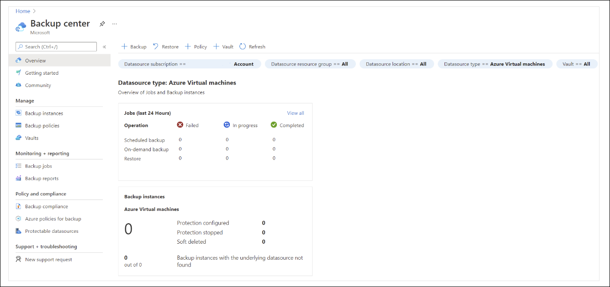
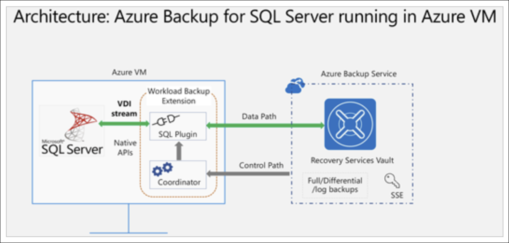

# Learning Path 5: Monitor and Back Up Resources

**Link:** [Microsoft Learn](https://learn.microsoft.com/en-us/training/paths/az-104-monitor-backup-resources/)
* [Introduction to Azure Backup](#introduction-to-azure-backup)
* [What is Azure Backup?](#what-is-azure-backup)
* [How Azure Backup works](#how-azure-backup-works)
* [When to use Azure Backup](#when-to-use-azure-backup)
* [Azure Backup features and scenarios](#azure-backup-features-and-scenarios)
* [Back up an Azure virtual machine by using Azure Backup](#back-up-an-azure-virtual-machine-by-using-azure-backup)
* [Exercise - Back up an Azure virtual machine](#exercise---back-up-an-azure-virtual-machine)
* [Restore virtual machine data](#restore-virtual-machine-data)

---
<!-- omit in toc -->
## 📋 Modules

| # | Module | Status | Completed |
|---|--------|--------|-----------|
| 1 | [Introduction to Azure Backup](https://learn.microsoft.com/en-us/training/modules/intro-to-azure-backup/) | ✅ | 1/25/26 |
| 2 | [Protect your virtual machines by using Azure Backup](https://learn.microsoft.com/en-us/training/modules/protect-virtual-machines-with-azure-backup/) | 🕒 | |

**Legend:** 🕒 Not Started | 🚧 In Progress | ✅ Complete

---

## Introduction to Azure Backup

[Module Reference](https://learn.microsoft.com/en-us/training/modules/intro-to-azure-backup/)

**Purpose of Backups**

* Data protection drives decisions around **storage**, **backup frequency**, **retention duration**, and **restore policies**.
* Traditional on-premises backups often relied on:

  * **Local redundant storage**
  * **Off-site storage** (for example, tape backups)
* Off-site and tape-based backups can cause:

  * **Long restore times**
  * **Significant downtime** due to transport and manual restore processes

**Limitations of Traditional Backup Solutions**

* May not adequately address:

  * **Backup security**
  * **Ransomware protection**
  * **Human error** during backup or restore
* Often lack simplicity or cost efficiency

**Azure Backup Overview**

* Azure Backup is designed to be:

  * **Cost-effective**
  * **Simple to use**
  * **Secure**
* Provides a cloud-based, Azure-native backup solution
* Uses Azure storage as the backup target

**Supported Workloads**

Azure Backup supports backing up the following resources:

* **Azure Virtual Machines**
* **Azure Managed Disks**
* **Azure Files**
* **SQL Server in Azure VMs**
* **SAP HANA databases in Azure VMs**
* **Azure Database for PostgreSQL servers**
* **Azure Database for PostgreSQL – Flexible servers**
* **Azure Database for MySQL – Flexible servers**
* **Azure Blobs**
* **Azure Kubernetes clusters**

**Example Scenario**

* SQL Server databases running in an **Always On availability group** across **three Azure VMs**
* Requirements:

  * Use an **Azure-native backup service**
  * Retain backups for **10 years** in **lower-cost storage**
  * Meet **audit and compliance** needs
  * **Daily monitoring** of backup jobs

**Module Objectives**

* Evaluate whether:

  * Azure Backup can meet organizational backup requirements
  * Required data can be **backed up and restored**
  * Backup data can be stored **securely**
* Enable informed decisions on using Azure Backup for **data protection**

**Key Facts to Remember**

* Azure Backup addresses both **on-premises** and **Azure-based** backup scenarios
* Long-term retention (for example, **10 years**) is supported
* Designed to reduce downtime compared to traditional tape or off-site backups
* Focuses on **security**, **simplicity**, and **cost efficiency**

---

## What is Azure Backup?

[Module Reference](https://learn.microsoft.com/en-us/training/modules/intro-to-azure-backup/)

**Azure Backup Overview**

* **Azure Backup** is an Azure service that provides **cost-effective, secure, zero-infrastructure backup solutions** for Azure-managed data assets.
* Eliminates the need to deploy or manage backup servers or backup storage.
* Backup storage is **automatically managed and scaled** by Azure.

 

**Azure Backup Definition**

* Provides **centralized management** for defining backup policies.
* Protects a wide range of enterprise workloads, including:

  * **On-premises files, folders, and system state**
  * **Azure Virtual Machines (VMs)**
  * **Azure Managed Disks**
  * **Azure File Shares**
  * **SQL Server in Azure VMs**
  * **SAP HANA databases in Azure VMs**
  * **Azure Database for PostgreSQL servers**
  * **Azure Database for PostgreSQL – Flexible servers**
  * **Azure Database for MySQL – Flexible servers**
  * **Azure Blobs**
  * **Azure Kubernetes clusters**

 

**When to Use Azure Backup**

* Designed for organizations with **compliance and data-protection requirements**.
* Supports **self-service backup and restore** for application administrators.
* Protects **all workloads** from a **centralized management interface**.
* Addresses scenarios such as:

  * Data corruption
  * Accidental deletions
  * Rogue administrator actions
  * Disaster recovery requirements

**Key Features**

* **Zero-infrastructure backup solution**

  * No backup servers or storage to deploy.
  * Reduces **capital expenses** and **operational expenses**.
  * Automates storage management.
* **At-scale management**

  * Centralized management through **Backup Center**.
  * Supports **APIs, PowerShell, and Azure CLI** for automation.
  * Enables discovery, governance, monitoring, operation, and optimization of backups.
* **Security**

  * Built-in protection for data **in transit and at rest**.
  * Uses encryption, private endpoints, alerts, and other security capabilities.
  * Protects against ransomware, malicious admins, and accidental deletions.

**Recovery Objectives**

* **Recovery Time Objective (RTO)**

  * Target time to restore a business process after a disaster.
  * Example: If maximum tolerated downtime is four hours, RTO is **four hours**.
* **Recovery Point Objective (RPO)**

  * Maximum acceptable data loss measured in time.
  * Example: An RPO of **one hour** means backups occur hourly, with no more than one hour of data loss.
* Example scenario:

  * RPO: **1 hour**
  * RTO: **3 hours**
  * Data loss is limited to one hour, and system access is restored within three hours.

**Key Facts to Remember**

* **Azure Backup requires no backup infrastructure**
* **Backup Center** is the central management console
* Supports **Azure, on-premises, and database workloads**
* **RTO = restore time target**
* **RPO = acceptable data loss window**
* Built-in security protects backups from **ransomware and accidental deletion**

---

## How Azure Backup works

[Module Reference](https://learn.microsoft.com/en-us/training/modules/intro-to-azure-backup/)

**Azure Backup Service Overview**

* Azure Backup provides data protection for **on-premises machines**, **Azure virtual machines**, and **workloads**
* Backed-up data is stored in **Recovery Services vaults** or **Backup vaults**
* Protects **data**, **machine state**, and **workloads**

**Azure Backup Architecture Layers**

* **Workload integration layer – Backup Extension**

  * Integrates directly with workloads such as **Azure VMs**, **Azure Blobs**, and databases
  * Backup extensions are installed on source VMs or worker VMs
  * Backup types generated:

    * **Snapshots** for Azure VMs and Azure Files
    * **Stream backups** for databases such as SQL Server and HANA

* **Data Plane – Access Tiers**

  * **Snapshot tier**

    * First phase of VM backup
    * Snapshots stored in the customer’s subscription and resource group
    * Faster restores because data is locally available
  * **Vault-standard tier**

    * Online storage in Microsoft-managed tenant
    * Stores isolated copy of backup data
    * Ensures availability even if source data is deleted or compromised
  * **Archive tier**

    * Used for **long-term retention (LTR)**
    * Optimized for rarely accessed data
    * Supports compliance-based retention requirements
  * Each tier has different **RTOs** and pricing

 

* **Data Plane – Availability and Security**

  * Data replication options:

    * **Locally redundant storage (LRS)**
    * **Zone-redundant storage (ZRS)**
    * **Geo-redundant storage (GRS)**
  * Security features:

    * **Encryption**
    * **Azure RBAC**
    * **Soft delete**

      * Deleted backups retained for **14 days** at no cost
  * Supports **backup data lifecycle management** for retention policies

* **Management Plane – Vaults and Backup Center**

  * **Recovery Services vaults** and **Backup vaults**

    * Manage backups and store backup data
    * Contain **backup policies** that define schedules and retention
  * Vault usage models:

    * Single vault for single subscription/resource
    * Multiple vaults across subscriptions and regions
  * **Backup center**

    * Centralized management (“single pane of glass”)
    * Supports multiple workloads, vaults, subscriptions, regions, and Azure Lighthouse tenants

 

**What Data Is Backed Up**

* On-premises Windows machines:

  * Direct backup using **MARS agent**
  * Indirect backup using **DPM** or **MABS** (Microsoft Azure Backup Server), then backed up to Azure
* Azure VMs:

  * Full VM backup using VM backup extension
  * File and folder backup using MARS agent

**Supported Backup Types**

* **Full backup**

  * Initial backup type
* **Incremental backup**

  * Backs up only changed data blocks
  * Used for all Azure backups and DPM/MABS disk backups

**SQL Server Backup Support**

| Backup Type              | Description                           | Limits                                         |
| ------------------------ | ------------------------------------- | ---------------------------------------------- |
| Full                     | Entire database backup including logs | Max **1 per day**                              |
| Differential             | Changes since last full backup        | Max **1 per day**; cannot run same day as full |
| Multiple backups per day | Azure VM backups                      | RPO **4–24 hours** using Enhanced policy       |
| Selective disk backup    | Backup selected VM disks only         | Supported via Enhanced policy                  |
| Transaction log          | Point-in-time recovery                | Every **15 minutes** maximum                   |

 


**Key Facts to Remember**

* Azure Backup uses **vaults** to store and manage backup data
* Backup extensions generate **snapshots** or **stream backups**
* Three access tiers: **Snapshot**, **Vault-standard**, **Archive**
* Soft delete retains backups for **14 days**
* SQL log backups can run every **15 minutes**
* Enhanced backup policy enables **hourly VM backups** and **selective disk backup**

---

## When to use Azure Backup

[Module Reference](https://learn.microsoft.com/en-us/training/modules/intro-to-azure-backup/)

**Overview**

* **Azure Backup** is a secure, zero-infrastructure Azure service for protecting Azure-managed data assets.
* Designed to ensure:

  * **Data availability**
  * **Protection of Azure workloads**
  * **Data security**

**Decision Criteria**

* **Azure workloads supported**

  * Azure Virtual Machines (Windows and Linux)
  * Azure Disks
  * SQL Server in Azure VMs
  * SAP HANA databases in Azure VMs
  * Azure Blobs
  * Azure File shares
  * Azure Database for PostgreSQL
* **Compliance**

  * Customer-defined backup policies
  * Long-term retention across multiple zones or regions
* **Operational recoveries**

  * Self-service backup and restore
  * Supports recovery from accidental deletion or data corruption

**Applying the Criteria**

* Azure Backup:

  * Protects entire Azure VMs using backup extensions
  * Supports file, folder, and system state backup using the **Microsoft Azure Recovery Services (MARS) agent**
  * Supports **SQL Server–only backups** on Azure VMs using a specialized, stream-based solution
* **Cross-region considerations**

  * Cross-region backup is **not supported for most workloads**
  * **Cross-region restore** is supported in a paired secondary region

**SQL Server Backup Capabilities**

* Workload-aware backups support:

  * **Full**
  * **Differential**
  * **Log**
* **Recovery Point Objective (RPO)**: as low as **15 minutes**
* **Point-in-time recovery**: up to **one second**
* **Granularity**

  * Individual database-level backup and restore
* Benefits include:

  * Zero infrastructure
  * Long-term retention
  * Centralized management

 

**Compliance and Retention**

* Backup management is handled through:

  * Recovery Services vaults and Backup vaults
  * Azure portal, Backup Center, Vault dashboards
  * SDK, CLI, and REST APIs
* Vaults act as an **Azure RBAC boundary**, allowing access restriction to authorized Backup Admins
* **Retention types**

  * Short-term retention: minutes or daily
  * Long-term retention: weekly, monthly, or yearly
* **Long-term retention scenarios**

  * **Planned**: known compliance requirements
  * **Unplanned**: on-demand backups with custom retention
* **On-demand backups**

  * Not governed by scheduled backup policy retention
  * Useful for unscheduled or granular backups (for example, multiple VM backups per day)

**Policy Management**

* Azure Backup Policies define:

  * Backup schedule
  * Retention duration
* Policies can be reused and applied across multiple protected items within a vault

**Monitoring and Administration**

* Integrates with **Log Analytics** for monitoring and reporting
* Provides:

  * Built-in job monitoring for backup, restore, delete, and configuration operations
  * Vault-scoped monitoring for individual vaults
* **Backup Explorer**

  * Azure Monitor workbook
  * Centralized view across tenants, regions, subscriptions, resource groups, and vaults
  * Supports drill-down analysis and troubleshooting

**Key Facts to Remember**

* Azure Backup is **zero-infrastructure** and **Azure-native**
* Supports **long-term retention**, including **up to 10+ years**
* **15-minute RPO** for SQL Server log backups
* **Cross-region restore** is supported; **cross-region backup** generally is not
* On-demand backups use **custom retention**, independent of scheduled policies

---

## Azure Backup features and scenarios

[Module Reference](https://learn.microsoft.com/en-us/training/modules/protect-virtual-machines-with-azure-backup/)

**What is Azure Backup**

* **Azure Backup** is a built-in Azure service that provides secure backup for Azure-managed data assets.
* Uses **zero-infrastructure** solutions with self-service backup and restore.
* Provides **at-scale management** with lower and predictable cost.
* Supports:

  * Azure virtual machines (Windows and Linux)
  * On-premises virtual machines
  * Workloads such as **SQL Server** and **SAP HANA** running in Azure VMs
* Managed entirely through the **Azure portal**, unlike traditional backup solutions that require complex setup.

**Azure Backup vs. Azure Site Recovery**

* **Azure Backup**

  * Maintains copies of **stateful data**
  * Allows you to **go back in time**
  * Used for:

    * Accidental data loss
    * Data corruption
    * Ransomware attacks
* **Azure Site Recovery**

  * Replicates data in **near real time**
  * Enables **failover**
  * Used for:

    * Region-wide disasters (for example, natural disasters)
* Choice depends on:

  * Application criticality
  * **Recovery Point Objective (RPO)**
  * **Recovery Time Objective (RTO)**
  * Cost implications

**Why use Azure Backup**

* **Zero-infrastructure backup**

  * No need to deploy or manage backup servers or storage
* **Long-term retention**

  * Retain backups for many years
  * Automatic pruning of recovery points using lifecycle management
* **Security**

  * **Azure role-based access control (RBAC)** for least-privilege access
  * **Encryption**

    * Encrypted at rest using Microsoft-managed keys
    * Optional customer-managed keys stored in Azure Key Vault
  * **No internet connectivity required**

    * Data transfer occurs only on the Azure backbone network
    * No IP or FQDN access required
  * **Soft delete**

    * Retains backup data for **14 days** after deletion
    * Protects against accidental or malicious deletion
    * **Enhanced soft delete** allows longer retention
  * Supports VMs encrypted with **Azure Disk Encryption**
* **High availability**

  * **Locally redundant storage (LRS)**

    * Lowest cost
    * Protects against rack and drive failures
    * Recommended for noncritical scenarios
  * **Geo-redundant storage (GRS)**

    * Replicates to a secondary region
    * Recommended for backup scenarios
  * **Zone-redundant storage (ZRS)**

    * Replicates synchronously across three availability zones
    * Protects against datacenter-level failures
    * Recommended for high-availability scenarios
* **Centralized monitoring and management**

  * Built-in monitoring and alerting
  * Managed through a **Recovery Services vault**
  * No additional management infrastructure required

**Azure Backup supported scenarios**

* **Azure virtual machines**

  * Back up Windows and Linux Azure VMs
  * Independent, isolated backups stored in a Recovery Services vault
  * Optimized backups with simple configuration and scaling
* **On-premises workloads**

  * Back up files, folders, and system state using the **Microsoft Azure Recovery Services (MARS) agent**
  * Protect on-premises VMs using:

    * **Microsoft Azure Backup Server (MABS)**
    * **Data Protection Manager (DPM)**
  * Supports Hyper-V and VMware
* **Azure Files shares**

  * Snapshot management provided by Azure Backup
* **SQL Server and SAP HANA in Azure VMs**

  * Stream-based, workload-aware backups
  * Supports:

    * Full, differential, and log backups
    * **15-minute RPO**
    * Point-in-time recovery

**Key Facts to Remember**

* Azure Backup is **backup-based recovery**, not real-time replication.
* Soft delete retains data for **14 days** by default.
* Backup data is stored in a **Recovery Services vault**.
* Supports **LRS, GRS, and ZRS** replication options.
* SQL Server and SAP HANA backups support **15-minute RPO** and point-in-time restore.

---

## Back up an Azure virtual machine by using Azure Backup

[Module Reference](https://learn.microsoft.com/en-us/training/modules/protect-virtual-machines-by-using-azure-backup/)

**Overview**

* Azure virtual machines can be backed up using **Azure Backup** without installing extra software.
* Backups are created by taking **snapshots of VM disks** at user-defined intervals.
* Snapshots are transferred to a **Recovery Services vault** based on the configured backup policy.

**Recovery Services vault**

* Central storage and management entity for Azure Backup data.
* Eliminates the need to deploy or manage storage accounts.
* Backup data is stored in Azure Backup storage accounts in a **separate fault domain**.
* Acts as a **role-based access control (RBAC) boundary** for secure access.
* Used to monitor and manage backup and restore operations.

 

**Snapshots**

* A snapshot is a **point-in-time backup** of all disks on a VM.
* Snapshot extensions depend on the VM operating system:

| Extension        | OS      | Description                                                           |
| ---------------- | ------- | --------------------------------------------------------------------- |
| VM Snapshot      | Windows | Uses Volume Shadow Copy Service (VSS) to capture disk data and memory |
| VM SnapshotLinux | Linux   | Captures a copy of the disk                                           |

**Backup consistency levels**

* **Application consistent**

  * Captures memory, disk data, and pending I/O operations.
  * Uses VSS writers on Windows.
  * Requires custom pre- and post-scripts on Linux.
  * Provides full VM and application consistency.
* **File system consistent**

  * Used if VSS or Linux scripts fail.
  * Prevents file system corruption.
  * Applications must self-recover during startup.
* **Crash consistent**

  * Typically occurs when the VM is shut down.
  * No memory or I/O captured.
  * Does not guarantee OS or application consistency.

**Backup policy**

* Defines **backup frequency** and **retention duration**.
* Backup frequency options:

  * Daily
  * Weekly
  * Hourly (Enhanced policy only)
* Retention can span **multiple years**.
* Supports two access tiers:

  * Snapshot tier
  * Vault tier

**Selective disk backup (Enhanced policy)**

* Allows backup and restore of **specific data disks only**.
* Enables restoring a subset of disks from a recovery point.
* Useful for:

  * Protecting critical disks only
  * Reducing backup costs
  * Using database-specific backup solutions
  * Backing up only the OS disk when required

**Snapshot tier**

* Stores snapshots **locally for up to five days**.
* Enables **instant restore**.
* Recommended for faster restore operations.

**Vault tier**

* Snapshots are copied to the vault for **long-term retention**.
* Recovery point type becomes **snapshot and vault**.
* Provides higher durability and security.

**Backup process for Azure virtual machines**

1. Azure Backup starts a backup job based on the configured policy.
2. During the first backup:

   * Windows VMs install the **VM Snapshot** extension.
   * Linux VMs install the **VM SnapshotLinux** extension.
3. A snapshot is taken.
4. Data is stored locally, then transferred to the vault.
5. Disks are backed up **in parallel**.
6. Only **changed blocks (delta)** since the last backup are transferred.
7. Snapshot data may take several hours to reach the vault during peak times.
8. Total backup time is **less than 24 hours** for daily policies.

**Security and protection features**

* Vault encryption can be enabled using **customer-managed keys (CMK)**.
* **Enhanced soft delete** protects backups from accidental or malicious deletion.
* Enhanced soft delete can be locked **always on** for additional protection.

 

**Key Facts to Remember**

* Azure VM backups use **disk snapshots**, not agents.
* Snapshots are stored locally for **up to five days**.
* Enhanced policy enables **hourly backups** and **selective disk backup**.
* Recovery Services vault provides **RBAC, storage isolation, and retention management**.
* Daily VM backups complete in **less than 24 hours**.

---

## Exercise - Back up an Azure virtual machine

[Module Reference](https://learn.microsoft.com/en-us/training/modules/protect-virtual-machines-with-azure-backup/)

**Exercise Purpose**

* Demonstrate that **Azure Backup** supports both **Windows** and **Linux** virtual machines
* Enable and run backups using both the **Azure portal** and **Azure CLI**

**Supported Management Methods**

* Azure portal
* Azure CLI
* PowerShell

**Environment Setup**

* Sign in to the **Azure portal**
* Open **Azure Cloud Shell**
* Create a resource group for all exercise resources

```azurecli
RGROUP=$(az group create --name vmbackups --location westus2 --output tsv --query name)
```

**Create Virtual Network and Subnet**

```azurecli
az network vnet create \
    --resource-group $RGROUP \
    --name NorthwindInternal \
    --address-prefixes 10.0.0.0/16 \
    --subnet-name NorthwindInternal1 \
    --subnet-prefixes 10.0.0.0/24
```

**Create a Windows Virtual Machine**

* VM name: **NW-APP01**
* Image: **Win2016Datacenter**
* Size: **Standard_DS1_v2**
* Authentication: Username and password

```azurecli
az vm create \
    --resource-group $RGROUP \
    --name NW-APP01 \
    --size Standard_DS1_v2 \
    --public-ip-sku Standard \
    --vnet-name NorthwindInternal \
    --subnet NorthwindInternal1 \
    --image Win2016Datacenter \
    --admin-username admin123 \
    --no-wait \
    --admin-password "<password>"
```

**Create a Linux Virtual Machine**

* VM name: **NW-RHEL01**
* Image: **RedHat:RHEL:8-gen2:latest**
* Authentication: **SSH keys**

```azurecli
az vm create \
    --resource-group $RGROUP \
    --name NW-RHEL01 \
    --size Standard_DS1_v2 \
    --image RedHat:RHEL:8-gen2:latest \
    --authentication-type ssh \
    --generate-ssh-keys \
    --vnet-name NorthwindInternal \
    --subnet NorthwindInternal1
```

**Optional Feature Registration (If Required)**

* Used to resolve `securityProfile.securityType is invalid` error

```azurecli
az feature register --name UseStandardSecurityType --namespace Microsoft.Compute
az feature show --name UseStandardSecurityType --namespace Microsoft.Compute
```

**Enable Backup Using the Azure Portal (Linux VM)**

* Navigate to **Virtual machines**
* Select **NW-RHEL01**
* Go to **Capabilities → Backup**
* Backup settings:

  * **Backup vault**: vaultXXX (default)
  * **Backup policy**: DailyPolicy-xxxxxxxx

    * Daily at **12:00 PM UTC**
    * **180-day** retention
* Select **Enable backup**
* Trigger first backup using **Backup now**

**Create a Recovery Services Vault (CLI)**

```azurecli
az backup vault create \
    --resource-group vmbackups \
    --location westus2 \
    --name azure-backup
```

**Enable Backup Using Azure CLI (Windows VM)**

```azurecli
az backup protection enable-for-vm \
    --resource-group vmbackups \
    --vault-name azure-backup \
    --vm NW-APP01 \
    --policy-name EnhancedPolicy
```

**Monitor Backup Jobs (CLI)**

```azurecli
az backup job list \
    --resource-group vmbackups \
    --vault-name azure-backup \
    --output table
```

* Wait until **ConfigureBackup** status shows **Completed**

**Run an On-Demand Backup (CLI)**

```azurecli
az backup protection backup-now \
    --resource-group vmbackups \
    --vault-name azure-backup \
    --container-name NW-APP01 \
    --item-name NW-APP01 \
    --retain-until 18-10-2030 \
    --backup-management-type AzureIaasVM
```

**Monitor Backup Status in the Portal**

* **Single VM**

  * Virtual machine → **Capabilities → Backup**
  * Check **Last backup status**
* **Recovery Services Vault**

  * Open **azure-backup** vault
  * View **Backup** tab for:

    * Protected items
    * Storage usage
    * Job status

 

**Key Facts to Remember**

* Azure Backup supports **Windows and Linux** Azure VMs
* Backups can be enabled via **portal or CLI**
* Default daily policy runs at **12:00 PM UTC**
* Default retention period is **180 days**
* On-demand backups can be triggered without waiting for the schedule
* Backup status is visible at both **VM** and **vault** levels

---

## Restore virtual machine data

[Module Reference](https://learn.microsoft.com/en-us/training/modules/protect-virtual-machines-using-azure-backup/restore-virtual-machine-data)

**Overview**

* Used as part of **business continuity and disaster recovery (BCDR)** testing.
* Azure Backup supports restoring an Azure virtual machine (VM) from:

  * **Snapshot tier** (instant restore, optimized for operational recovery)
  * **Vault tier** (Recovery Services vault)

**Restore Types**

* **Create a new VM**

  * Quickly creates a basic VM from a restore point.
  * The new VM **must be created in the same region** as the source VM.

* **Restore disk**

  * Restores VM disks to a specified resource group.
  * Disks can be:

    * Used to create a new VM (template provided by Azure Backup)
    * Attached to an existing VM
  * Useful for:

    * Customizing VM configuration
    * Adding settings not present at backup time
    * Using ARM templates or PowerShell

* **Replace existing**

  * Restores disks and replaces disks on an **existing VM**.
  * Azure Backup:

    * Takes a snapshot of the current VM
    * Stores it in a staging location
    * Replaces existing disks with the selected restore point
  * Limitations:

    * The VM **must exist**
    * Not supported if the VM is deleted

**Cross Region (Secondary Region) Restore**

* Restores Azure VMs to the **secondary region** of an Azure paired region.
* Supported restore options:

  * Create a VM
  * Restore disks
* Not supported:

  * Replace existing disks

**Cross Subscription Restore**

* Allows restore to a **different subscription** in the same tenant.
* Requirements and capabilities:

  * Cross Subscription Restore must be **enabled on the Recovery Services vault**
  * Supported only for **managed VMs**
  * Works with:

    * Cross Region Restore
    * Cross Zonal Restore
  * Supported for **Restore with Managed System Identities (MSI)**
* Not supported:

  * Snapshot tier recovery points
  * Unmanaged VMs
  * VMs encrypted with Advanced Digital Encryption (ADE)

**Cross Zonal Restore**

* Restores VMs or disks to **different availability zones**.
* Zone selection is **logical**, not physical.
* Supported scenarios:

  * Managed virtual machines only
  * Restore with Managed System Identities (MSI)
  * Vaults with **Zone-Redundant Storage (ZRS)** enabled
  * Restore from secondary regions
* Not supported:

  * Snapshot restore points
  * Encrypted Azure VMs

**Selective Disk Backup**

* Available through **Enhanced policy**.
* Allows:

  * Backup of only selected data disks
  * Restore of a subset of disks from a recovery point
* Supported from:

  * Instant restore
  * Vault tier
* Useful when:

  * Only certain disks contain critical data
  * Using database backups and only the OS disk needs VM-level backup
  * Reducing backup storage costs

**Recover Files from a Backup**

* Individual files can be recovered by:

  * Mounting the snapshot on the target machine
  * Using the **iSCSI initiator**
* File recovery is performed without restoring the entire VM.

**Restore Encrypted Virtual Machines**

* Azure Backup supports VMs encrypted using **Azure Disk Encryption**.
* Encryption uses **Azure Key Vault** to manage secrets.
* Key Encryption Keys (KEKs) can add an extra layer of protection.

**Encrypted VM Restore Limitations**

* Only **standalone key encryption** is supported.
* File-level or folder-level restores are **not supported**.
* Entire VM must be restored for file access.
* **Replace existing VM** restore option is not available.

**Key Facts to Remember**

* **Replace existing** restore fails if the VM is deleted.
* Cross Region Restore does **not** support replacing existing disks.
* Cross Subscription and Cross Zonal Restore support **managed VMs only**.
* Snapshot tier recovery points do **not** support cross-subscription or cross-zonal restore.
* Encrypted VMs cannot use file-level restore or replace existing VM options.

---
