# MeasureUp Assessment AZ-104: Microsoft Azure Administrator

* [Overview](#overview)
* [Assessment Results](#assessment-results)
* [Wrong Answers Review](#wrong-answers-review)
* [Correctly Answered but Unsure Questions](#correctly-answered-but-unsure-questions)
* [Correctly Answered Questions](#correctly-answered-questions)

## Overview

Notes and insights from the MeasureUp practice assessment for AZ-104. I took this assessment on Friday, January 30th, after reviewing the Microsoft Learn content and the John Savill video course, but prior to completing the hands-on labs and practice exams.

## Assessment Results


<details>
<summary>Click to expand details</summary>


</details>

---

## Wrong Answers Review


<details>
<summary>Click to expand explanation</summary>

**Your Answer vs. The Correct Sequence**

**Your selected order:**

1. Create a Microsoft Entra group and add users to the group ✓
2. Select the Microsoft Entra group for which you want to allow SSPR ✗
3. Register an authentication method for SSPR ✗
4. Enable SSPR with the Selected option ✗

**The Issue:**

The main problem is with **steps 2-4**. You're trying to select a group for SSPR (step 2) before SSPR is even enabled (step 4). Additionally, you should configure the authentication method requirements before enabling SSPR.

**The Correct Order Should Be:**

1. **Create a Microsoft Entra group and add users to the group** ✓
   - This satisfies the requirement to "add and remove users" by managing group membership

2. **Register an authentication method for SSPR**
   - This configures "one additional piece of personal information" that users must provide (like security questions, phone, email, etc.)

3. **Enable SSPR with the Selected option**
   - You use "Selected" (not "All") because you only want a subset of users to have SSPR access
   - This must be done before you can assign groups to SSPR

4. **Select the Microsoft Entra group for which you want to allow SSPR**
   - Now you can specify which group(s) should have SSPR enabled
   - Users can be added/removed from SSPR by managing group membership

**Key Takeaway:**

You must **configure the authentication requirements and enable SSPR** before you can **assign it to specific groups**. Think of it as: configure what → enable it → specify who gets it.

</details>

---

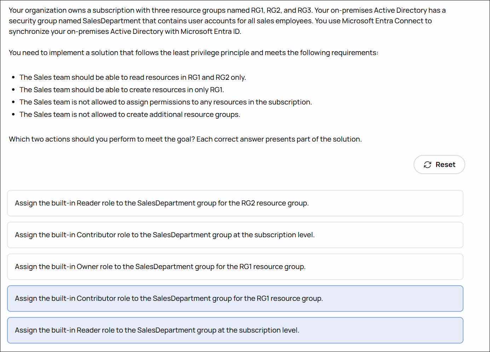

<details>
<summary>Click to expand explanation</summary>

Looking at your selected answers, I can help you understand why this approach doesn't meet the requirements.

**Your Selected Answer:**

1. ✓ Assign the built-in Contributor role to the SalesDepartment group for the RG1 resource group
2. ✗ Assign the built-in Reader role to the SalesDepartment group at the subscription level

**The Problem with Your Answer:**

**The second selection violates the least privilege principle:**

When you assign **Reader at the subscription level**, the Sales team gets read access to **ALL** resource groups in the subscription, including:

- RG1 ✓ (needed)
- RG2 ✓ (needed)
- **RG3 ✗ (NOT allowed by requirements)**

The requirement explicitly states: "The Sales team should be able to read resources in RG1 and RG2 **only**."

**The Correct Answer Should Be:**

1. **Assign the built-in Contributor role to the SalesDepartment group for the RG1 resource group** ✓
   - Allows creating resources in RG1
   - Allows reading resources in RG1
   - Does NOT allow assigning permissions (Contributor lacks this ability)

2. **Assign the built-in Reader role to the SalesDepartment group for the RG2 resource group** ✓
   - Allows reading resources in RG2 only
   - Does NOT allow creating resources
   - No access to RG3

**Why This Meets All Requirements:**

✓ Read resources in RG1 and RG2 only (not RG3)  
✓ Create resources in only RG1  
✓ Cannot assign permissions (Contributor doesn't include this)  
✓ Cannot create resource groups (no subscription-level permissions)  
✓ Follows least privilege principle

**Key Takeaway:**

Avoid assigning roles at higher scopes (like subscription level) when you can achieve the same result at lower scopes (resource group level). Always grant the minimum access needed at the most specific scope possible.

</details>

---


<details>
<summary>Click to expand explanation</summary>

Looking at your selected answers, I can help you understand what went wrong.

**Your Selected Answers:**

1. ✗ Create a tag named CostCenter and assign it to each **resource group**
2. ✓ Instruct the accounting department to use the Cost Analysis blade in the subscription panel

**The Problem with Your Answer:**

You got **one correct** (Cost Analysis), but your tagging strategy is at the **wrong level of granularity**.

**Why Resource Group Tagging is Insufficient:**

**Resource group-level tags** can cause issues when:

- Multiple resources in the same resource group belong to **different cost centers**
- You need **granular cost allocation** at the resource level
- Resources are moved between resource groups

For example, if RG1 contains:

- 5 VMs for Cost Center A
- 3 VMs for Cost Center B

Tagging the resource group only gives you one cost center value, preventing accurate cost allocation.

**The Correct Answers Should Be:**

1. **Create a tag named CostCenter and assign it to each resource** ✓
   - Provides granular cost tracking at the resource level
   - Each resource can be assigned to its specific cost center
   - More accurate cost allocation

2. **Instruct the accounting department to use the Cost Analysis blade in the subscription panel** ✓
   - This is the correct tool for CSP-managed subscriptions
   - Azure Account Center is NOT available for CSP subscriptions
   - Cost Analysis can filter and group costs by tags

**Why "Azure Account Center" is Wrong:**

The **Azure Account Center** is not accessible in **Cloud Service Provider (CSP) managed subscriptions**. Only direct Enterprise Agreement (EA) or other subscription types have access to it.

**Key Takeaway:**

For cost center allocation:

- Tag at the **resource level** (not resource group level) for accurate, granular tracking
- Use **Cost Analysis** (not Account Center) for CSP subscriptions
- Cost Analysis allows filtering and grouping by tags to assign costs to cost centers

</details>

---


<details>
<summary>Click to expand explanation</summary>

Looking at your selected answers, I can see you've made the same mistake again with this question (which appears to be the same as image 3).

**Your Selected Answers:**

1. ✗ Your users have the Storage Blob Data Reader role assigned in the storage accounts
2. ✗ Your users have the Storage Blob Data Contributor role assigned in the storage accounts

**The Problem - You're Still Selecting SOLUTIONS Instead of PROBLEMS:**

The error message clearly states:
> "**Unable to list resources in account due to inadequate permissions**. Permission to list containers or to list account keys is required."

You selected answers that indicate users **already have proper data access roles**. If they had Storage Blob Data Reader or Contributor, they **wouldn't be getting this error** - the problem would already be solved!

**The Correct Answers Should Be:**

1. **Your users have the Read role assigned in the storage accounts** ✓
   - **This IS a problem**: The generic "Read" role only provides management plane access
   - It does NOT grant data plane access to browse blob/file contents
   - Users can see the storage account exists but cannot access the data inside

2. **There is a ReadOnly resource lock configured** ✓
   - **This IS a problem**: ReadOnly locks can block operations in Storage Explorer
   - Locks can override permissions and prevent certain actions

**Understanding the Logic:**

**Error exists** = Something is wrong/missing

- ❌ "Users have Storage Blob Data Reader" = No error (they have correct access)
- ✓ "Users have Read role" = Error! (they lack data plane access)
- ✓ "ReadOnly lock configured" = Error! (lock blocks operations)

**Key Takeaway:**

When a question asks for "**reasons why users are getting an error**," you need to identify what's **CAUSING the problem** (wrong role, locks), not what would **FIX the problem** (correct roles).

**More Detail:**

Great question! Let me explain how ReadOnly locks interact with Azure Storage Explorer and why they can cause issues.

**What ReadOnly Locks Do:**

**ReadOnly locks** in Azure prevent **any modifications** to a resource, including:

- Changing resource configuration
- Modifying properties
- Regenerating access keys
- Updating firewall rules
- ANY write operation at the management plane

**How Storage Explorer Accesses Storage:**

Azure Storage Explorer can authenticate and access storage using **multiple methods**:

**1. Account Keys (Management Plane):**

- Storage Explorer attempts to **list and retrieve storage account keys**
- This is a **write-equivalent operation** (POST request to list keys)
- ReadOnly lock **BLOCKS** this operation
- Result: ❌ Access denied

**2. Azure AD / RBAC (Data Plane):**

- Uses your Azure AD identity with data plane roles
- Directly accesses blobs/files without needing account keys
- ReadOnly lock does **NOT** block this
- Result: ✓ Should work

**3. SAS Tokens:**

- Uses pre-generated shared access signatures
- ReadOnly lock does **NOT** block this
- Result: ✓ Should work

**Why ReadOnly Locks Cause the Error:**

When Storage Explorer opens and tries to browse a storage account:

```
1. Storage Explorer connects to storage account
2. Attempts to list containers/shares
3. Tries to retrieve account keys (common default method)
4. POST /listKeys operation is attempted
5. ReadOnly lock intercepts: "NO MODIFICATIONS ALLOWED"
6. Error: "Unable to list resources due to inadequate permissions"
```

**The Confusing Part:**

The error message says "**inadequate permissions**," but it's actually:

- Not about RBAC permissions ✗
- About the **lock preventing the listKeys operation** ✓

Even if you have **Owner** or **Contributor** role, the ReadOnly lock **overrides** your permissions and blocks management plane operations.

**Visual Representation:**

```
Without ReadOnly Lock:
User → Storage Explorer → List Keys API → ✓ Success → Browse Storage

With ReadOnly Lock:
User → Storage Explorer → List Keys API → ✗ BLOCKED by Lock → Error Message
```

**How to Verify This is the Issue:**

1. Check if a ReadOnly lock exists:

   ```
   Storage Account → Locks → See "ReadOnly" lock
   ```

2. Remove the lock temporarily and test Storage Explorer
   - If it works now, the lock was the problem

**Solutions When ReadOnly Lock Exists:**

**Option 1: Remove the Lock** (if policy allows)

- Not always possible due to governance requirements

**Option 2: Use Azure AD Authentication**

- In Storage Explorer, explicitly connect using "Azure AD"
- Assign proper data plane roles (Storage Blob Data Reader)
- Bypasses the need for account keys

**Option 3: Use SAS Tokens**

- Generate SAS token before the lock was applied
- Connect to storage using SAS URL

**Option 4: Use Azure Portal**

- Portal has built-in handling for locked resources
- May provide better error messages

**Key Takeaway:**

ReadOnly locks block the **listKeys operation** that Storage Explorer commonly uses for authentication. While users might have proper RBAC permissions, the lock creates a hard stop at the management plane level, preventing Storage Explorer from retrieving the keys needed to access the data using the default authentication method.

The solution is either:

- Remove the lock, OR
- Use authentication methods that don't require listing keys (Azure AD, SAS tokens)

</details>

---


<details>
<summary>Click to expand explanation</summary>

Looking at your answer, I can explain why you got the File storage authorization wrong.

**Your Answer:**

- **Blob storage**: Microsoft Entra ID, access keys, and SAS ✓
- **File storage**: Microsoft Entra ID only ✗

**The Problem:**

You selected **Microsoft Entra ID only** for File storage, which is incorrect because:

**1. Microsoft Entra ID has LIMITED/NO support for Azure Files with AzCopy:**

While Microsoft Entra ID (Azure AD) works excellently for **Blob storage** with AzCopy, it has **very limited or no support** for **Azure Files** (File shares).

AzCopy's Azure AD authentication is primarily designed for:

- ✓ Blob storage
- ✓ Azure Data Lake Storage Gen2
- ✗ Azure Files (not supported or very limited)

**2. You Excluded Valid Methods:**

The scenario explicitly states:
> "You have access to the storage account access keys for the source storage accounts and for DevStore. You also have valid Microsoft Entra user accounts and **shared access signatures (SAS)**."

For Azure Files, AzCopy **DOES support**:

- ✓ **SAS tokens** - Fully supported and commonly used
- ✓ **Access keys** - Supported
- ✗ **Microsoft Entra ID** - Not supported/limited

**The Correct Answer Should Be:**

- **Blob storage**: Microsoft Entra ID, access keys, and SAS ✓
- **File storage**: **Access keys and SAS** (or possibly just SAS)

**Why This Matters:**

The critical distinction:

| Storage Type | Entra ID | Access Keys | SAS |
|-------------|----------|-------------|-----|
| **Blob Storage** | ✓ Yes | ✓ Yes | ✓ Yes |
| **File Storage** | ✗ Limited/No | ✓ Yes | ✓ Yes |

**Key Detail: "Commands target only the file share or the account":**

This hint suggests:

- **File share level**: Use SAS tokens (most common)
- **Account level**: Use access keys

Both are valid for Azure Files, but **not** Microsoft Entra ID.

**AzCopy Command Examples:**

**For Blob (with Entra ID):**

```bash
azcopy login
azcopy copy "source" "https://devstore.blob.core.windows.net/container"
```

**For File Storage (with SAS):**

```bash
azcopy copy "source" "https://devstore.file.core.windows.net/share?<SAS-token>"
```

**For File Storage (with Account Key):**

```bash
# Set environment variable
export AZCOPY_ACCOUNT_KEY="<account-key>"
azcopy copy "source" "https://devstore.file.core.windows.net/share"
```

**Key Takeaway:**

**Microsoft Entra ID authentication is NOT supported for Azure Files with AzCopy**, unlike Blob storage where it works perfectly. For File storage, you must use **SAS tokens or access keys**. Don't assume that authentication methods work the same across all storage types!

</details>

---


<details>
<summary>Click to expand explanation</summary>

Looking at your answer, I can explain why you got the object replication configuration wrong.

**Your Selected Answers:**

- **Change feed**: Destination account only ✗
- **Blob versioning**: Source account only ✗

**The Problem - You Have Both Settings Backwards:**

You've essentially reversed the requirements for object replication. Let me explain what each feature does and where it's needed.

**What Object Replication Requires:**

**Change Feed:**

**Purpose**: Tracks all create, modify, and delete operations on blobs

- **Where needed**: **SOURCE account only** ✓
- **Why**: The source needs to track what changed so it knows what to replicate
- **Destination doesn't need it**: The destination is passively receiving data

**Blob Versioning:**

**Purpose**: Maintains previous versions of blobs when they're modified or deleted

- **Where needed**: **BOTH source and destination accounts** ✓
- **Why source needs it**: To track and maintain versions of objects being replicated
- **Why destination needs it**: To properly receive and store the replicated blob versions

**The Correct Answer Should Be:**

- **Change feed**: **Source account only** ✓
- **Blob versioning**: **Both source and destination accounts** ✓

**Why Your Answer Was Wrong:**

**Issue #1: Change Feed on Wrong Account:**

**You selected**: Destination account only ✗

**Problem**:

- The destination account doesn't need to track changes - it's just receiving replicated data
- The SOURCE account needs change feed to detect which blobs have changed and need replication
- Without change feed on the source, object replication cannot track what to replicate

**Issue #2: Blob Versioning on Only One Account:**

**You selected**: Source account only ✗

**Problem**:

- Object replication replicates blob **versions**, not just the latest blob
- BOTH accounts must support versioning to properly handle the replication
- Without versioning on the destination, it cannot properly receive and store the versioned blobs

**The Logic Flow:**

```
SOURCE ACCOUNT                    DESTINATION ACCOUNT
┌─────────────────┐              ┌──────────────────┐
│ Blob versioning │ ✓ Required   │ Blob versioning  │ ✓ Required
│ Change feed     │ ✓ Required   │ Change feed      │ ✗ Not needed
└─────────────────┘              └──────────────────┘
         │                                │
         │   Detects changes              │
         │   Creates replication          │
         │   tasks                        │
         │                                │
         └────────── Replicates ─────────>│
                     blob versions
```

**Visual Comparison:**

| Feature | Your Answer | Correct Answer | Why |
|---------|------------|----------------|-----|
| **Change feed** | Destination only | **Source only** | Source tracks changes to replicate |
| **Blob versioning** | Source only | **Both accounts** | Both need to handle blob versions |

**Why "Minimize Configuration Changes" Matters:**

The question asks to "minimize configuration changes." The correct answer requires:

- 1 account with change feed (source)
- 2 accounts with blob versioning (both)
- Total: 3 configuration changes

If you enabled change feed on both accounts, that would be 4 changes (unnecessary).

**Key Takeaway:**

For **Azure Storage Object Replication**:

1. **Change feed = Source only** (to detect what needs replicating)
2. **Blob versioning = Both accounts** (to support version replication)

Think of it this way:

- **Change feed** = The "sensor" that detects changes (only needed where changes originate)
- **Blob versioning** = The "infrastructure" that both accounts need to support versioned objects

You had the logic completely reversed - change feed on the wrong end, and versioning on only one side when both need it!

**References:**

- [Prerequisites and caveats for object replication](https://learn.microsoft.com/en-us/azure/storage/blobs/object-replication-overview#prerequisites-and-caveats-for-object-replication)
- [Enable and manage blob versioning](https://learn.microsoft.com/en-us/azure/storage/blobs/versioning-enable?tabs=portal)
- [Change feed support in Azure Blob Storage](https://learn.microsoft.com/en-us/azure/storage/blobs/storage-blob-change-feed?tabs=azure-portal)

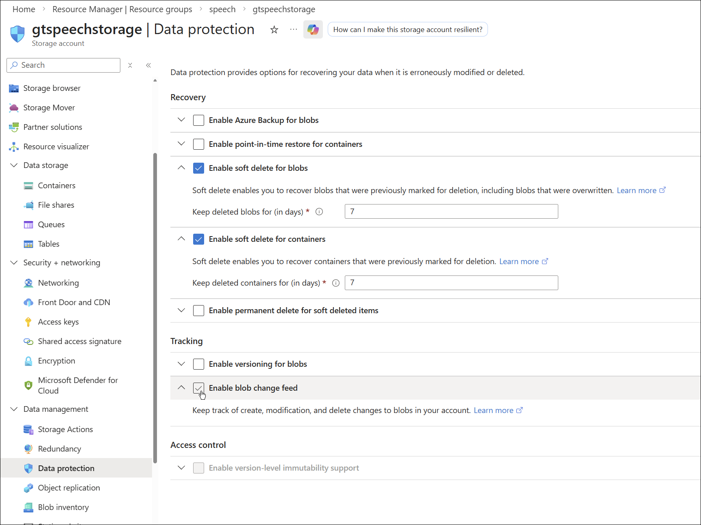


</details>

---


<details>
<summary>Click to expand explanation</summary>

You're absolutely right! Let me correct my response.

**Your Selected Answers:**

- **$action** (not visible in dropdown, but should be first): ✗ Wrong cmdlet used
- **$filter**: New-AzStorageAccountManagementPolicyFilter ✓
- **$rule2**: New-AzStorageBlobInventoryPolicyRule ✗
- **Final command**: Set-AzStorageBlobInventoryPolicy ✗

**The Problem - You Mixed Up Two Different Features:**

You confused **Lifecycle Management Policies** with **Blob Inventory Policies**, AND the first command uses the wrong cmdlet structure.

**The Correct Script Structure:**

```powershell
$rgName = "RgGroup01"
$accountName = "storageaccount01"

$action = Add-AzStorageAccountManagementPolicyAction `  ✓ CORRECT
    -BaseBlobAction TierToCool `
    -daysAfterModificationGreaterThan 30

$filter = New-AzStorageAccountManagementPolicyFilter `  ✓ CORRECT
    -PrefixMatch ef,gh `
    -BlobType blockBlob

$rule2 = New-AzStorageAccountManagementPolicyRule `  ✓ CORRECT
    -Name test-rule `
    -Action $action `
    -Filter $filter

Set-AzStorageAccountManagementPolicy `  ✓ CORRECT
    -ResourceGroupName $rgName `
    -StorageAccountName $accountName `
    -Rule $rule2
```

**The Correct Cmdlets:**

1. **$action**: `Add-AzStorageAccountManagementPolicyAction`
   - **ADD** an action to the policy (TierToCool after 30 days)

2. **$filter**: `New-AzStorageAccountManagementPolicyFilter` ✓ You got this one
   - **CREATE** a filter (which blobs to target)

3. **$rule2**: `New-AzStorageAccountManagementPolicyRule`
   - **CREATE** a rule by combining action + filter
   - ✗ You used: `New-AzStorageBlobInventoryPolicyRule` (wrong - for inventory)

4. **Final**: `Set-AzStorageAccountManagementPolicy`
   - **SET/APPLY** the management policy to the storage account
   - Creates or modifies the management policy of an Azure Storage account.
   - ✗ You used: `Set-AzStorageBlobInventoryPolicy` (wrong - for inventory)

**Why Your Answer Was Wrong:**

**Issue #1: Wrong Cmdlet Pattern for $action:**

The first command should use `Add-AzStorageAccountManagementPolicyAction` to **add an action** (what to do with the blobs).

**Issue #2: Inventory vs Management (Last Two Cmdlets):**

**You selected:**

- `New-AzStorageBlobInventoryPolicyRule` ✗ (creates inventory reports)
- `Set-AzStorageBlobInventoryPolicy` ✗ (applies inventory policy)

**Should be:**

- `New-AzStorageAccountManagementPolicyRule` ✓ (creates lifecycle rule)
- `Set-AzStorageAccountManagementPolicy` ✓ (applies lifecycle policy)

**The Logic Flow:**

1. **$action** = `Add-AzStorageAccountManagementPolicyAction`
   - Define WHAT to do: "Tier to Cool after 30 days"

2. **$filter** = `New-AzStorageAccountManagementPolicyFilter` ✓
   - Define WHICH blobs: "blockBlobs with prefix ef,gh"

3. **$rule2** = `New-AzStorageAccountManagementPolicyRule`
   - Combine action + filter = complete rule

4. **Apply** = `Set-AzStorageAccountManagementPolicy`
   - Apply the rule to the storage account

**Cmdlet Naming Pattern:**

| Step | Verb | Object |
|------|------|--------|
| Create action | **Add**-AzStorageAccount**ManagementPolicyAction** | Action definition |
| Create filter | **New**-AzStorageAccount**ManagementPolicyFilter** | Filter definition |
| Create rule | **New**-AzStorageAccount**ManagementPolicyRule** | Rule (action + filter) |
| Apply policy | **Set**-AzStorageAccount**ManagementPolicy** | Complete policy |

**Key Differences:**

**Lifecycle Management (What you need):**

```powershell
Add-AzStorageAccountManagementPolicyAction      # Define action
New-AzStorageAccountManagementPolicyFilter      # Define filter
New-AzStorageAccountManagementPolicyRule        # Combine to rule
Set-AzStorageAccountManagementPolicy            # Apply policy
# Purpose: Move blobs between tiers, delete old blobs
```

**Blob Inventory (What you incorrectly selected):**

```powershell
New-AzStorageBlobInventoryPolicyRule            # \u2717 Wrong!
Set-AzStorageBlobInventoryPolicy                # \u2717 Wrong!
# Purpose: Generate CSV/Parquet reports of blob metadata
```

**Key Takeaway:**

1. **Use `Add-` for actions**, `New-` for filters and rules, `Set-` to apply
2. **Management Policy ≠ Inventory Policy**
   - **Management Policy** = Lifecycle automation (tier/delete based on rules)
   - **Inventory Policy** = Generate reports about blob metadata
3. All cmdlets must have `*ManagementPolicy*` in the name for lifecycle management tasks
4. The cmdlet structure follows a pattern: Add action → Create filter → Create rule → Set policy

</details>

---

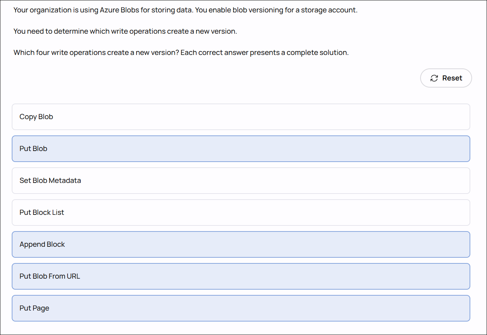

<details>
<summary>Click to expand explanation</summary>

You're absolutely correct to question this. I made an error in my original response.

**The correct four operations that create new versions are:**

1. **Put Blob** ✓ (You selected this correctly)
2. **Put Block List** (You did not select this)
3. **Copy Blob** (You did not select this)
4. **Set Blob Metadata** (You did not select this)

**Why your selected answers were wrong:**

- **Append Block** – Does NOT create a new version. It appends data to an append blob without overwriting the blob itself.
- **Put Blob From URL** – I incorrectly stated this creates a version. The documentation does NOT list this as a versioning operation. While it creates or overwrites a blob, it's not explicitly mentioned in Microsoft's versioning documentation as triggering a new version.
- **Put Page** – Does NOT create a new version. It updates page ranges within a page blob in place.

**Why Set Blob Metadata creates a version:**

I incorrectly stated that metadata changes don't trigger versioning. According to Microsoft's documentation, **Set Blob Metadata** is explicitly listed as a write operation that creates a new version. This is a key exam concept: metadata changes are considered blob modifications that warrant version tracking.

**Key takeaway:**

The four versioning operations are **Put Blob**, **Put Block List**, **Copy Blob**, and **Set Blob Metadata**. These are the operations Microsoft explicitly lists in their documentation. Don't assume operations like "Put Blob From URL" trigger versioning unless explicitly documented.

**References:**

- [Blob versioning - How blob versioning works](https://learn.microsoft.com/en-us/azure/storage/blobs/versioning-overview#how-blob-versioning-works)

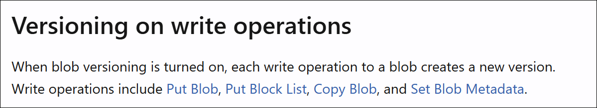

</details>

---


<details>
<summary>Click to expand explanation</summary>

**Why the selected answer is wrong (Isolated)**
You chose **Isolated**, which corresponds to an App Service Environment (ASE). While this does meet the requirement that compute resources are **dedicated to your company**, it is **not a minimal-cost solution**. Isolated plans are designed for scenarios requiring **network isolation, private endpoints, and high compliance**, and they carry **significantly higher fixed costs** (ASE infrastructure + workers), regardless of scale.
The question did **not** require VNet isolation, internal load balancing, or compliance-driven isolation—only dedicated compute.

This is a common exam trap: *“dedicated” does not automatically mean “Isolated/ASE.”*

**Why the correct answer is right (Premium V3)**
**Premium V3** satisfies **all stated requirements at lower cost**:

* **Scales to 10 instances** → Supported by Premium tiers
* **Minimal storage (< 5 GB)** → Storage is not a differentiator here
* **Enhanced compute for complex calculations** → Premium V3 provides higher CPU/memory SKUs
* **Dedicated VMs** → Premium (and Standard) plans run on **dedicated hosts**, not shared multi-tenant compute
* **Minimal cost** → Premium V3 avoids the large fixed overhead of an App Service Environment

Premium V3 is specifically positioned as the **cost-effective choice for high-performance, dedicated App Service workloads** without the complexity of ASE.

**Key takeaway**
On Azure exams, **“dedicated to your company” means “not shared (Free/Shared)”**, not “App Service Environment.”
Choose **Isolated (ASE)** only when **network isolation or compliance requirements are explicitly stated**. Otherwise, **Premium V3** is the correct balance of performance and cost.

**References**

* [https://learn.microsoft.com/azure/app-service/overview-hosting-plans](https://learn.microsoft.com/azure/app-service/overview-hosting-plans)
* [https://learn.microsoft.com/azure/app-service/environment/overview](https://learn.microsoft.com/azure/app-service/environment/overview)
* [https://learn.microsoft.com/azure/app-service/plan-manage-costs](https://learn.microsoft.com/azure/app-service/plan-manage-costs)

**Why Standard is not the correct answer**

Although **Standard** App Service plans do run on **dedicated VMs**, they fail to meet the **enhanced compute** requirement in the question.

Key limitations of Standard in this scenario:

* **Compute performance**: Standard tiers (S1–S3) offer significantly lower CPU and memory compared to Premium V3. They are intended for general-purpose workloads, not applications performing **complex calculations**.
* **Exam wording matters**: The phrase *“will perform complex calculations and will require enhanced compute capabilities”* is a strong signal on Microsoft exams to choose **Premium**, not Standard.
* **Scale headroom vs. suitability**: While Standard *can* scale to multiple instances, scaling more **underpowered instances** does not satisfy a requirement for **high-performance compute per instance**.

This is another common exam trap: focusing only on instance count and missing the **compute class** requirement.

**Why Premium V3 is still the best fit**

Premium V3 provides:

* Higher vCPU-to-memory ratios
* Better performance per instance for CPU-intensive workloads
* Faster scaling and more modern VM hardware
* Dedicated compute without ASE-level cost overhead

It is explicitly designed for **compute-heavy and performance-sensitive web applications**, which is exactly what the question describes.

**Key takeaway**

On Azure exams, when you see:

* *complex calculations*
* *enhanced compute*
* *minimal cost but not cheapest*

➡️ **Standard is too weak**, **Isolated is too expensive**, **Premium V3 is the correct balance**.


**References**

* [https://learn.microsoft.com/azure/app-service/overview-hosting-plans](https://learn.microsoft.com/azure/app-service/overview-hosting-plans)
* [https://learn.microsoft.com/azure/app-service/plan-manage-costs](https://learn.microsoft.com/azure/app-service/plan-manage-costs)
* [https://learn.microsoft.com/azure/app-service/environment/overview](https://learn.microsoft.com/azure/app-service/environment/overview)

</details>

---

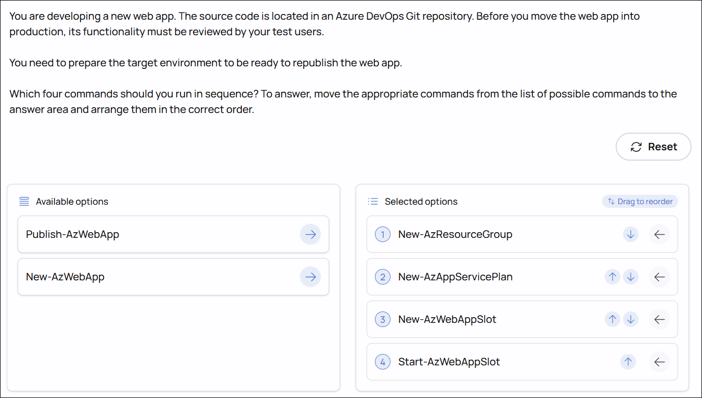

<details>
<summary>Click to expand explanation</summary>

**Why the selected answer is wrong**

Your sequence prepares Azure infrastructure objects but **never deploys the application code** from the Azure DevOps Git repository.
The exam question explicitly states that the target environment must be ready to **republish the web app** so test users can review functionality. That implies pushing code into an App Service (or slot), not just provisioning resources.

Specific issues with your sequence:

* **New-AzWebAppSlot** is unnecessary unless the question explicitly mentions deployment slots. Slots are optional, not required to republish.
* **Start-AzWebAppSlot** is redundant in most exam scenarios. Newly created web apps and slots start automatically.
* **Publish-AzWebApp** (or equivalent deployment command) is missing, which is the key step that actually deploys the application.
* You created infrastructure only; no deployment occurred.

This is a common exam trap: confusing *environment preparation* with *application deployment*.

---

**Why the correct answer is right**

The correct sequence includes the deployment step and follows the required dependency order:

1. **New-AzResourceGroup**
   A resource group must exist before any App Service resources can be created.

2. **New-AzAppServicePlan**
   An App Service Plan is required before creating a web app.

3. **New-AzWebApp**
   Creates the App Service that will host the application.

4. **Publish-AzWebApp**
   Deploys the application code so testers can access and validate functionality.

This sequence ensures:

* Infrastructure dependencies are respected.
* The web app actually contains code to test.
* The environment is truly “ready to republish,” per the wording of the question.

---

**Key takeaway**

On Azure exams, **“prepare the environment to republish” always includes deploying code**, not just creating resources.
If a deployment-related command is available (like `Publish-AzWebApp`) and the scenario involves testers or validation, it is almost always required.

---

**References**

* [https://learn.microsoft.com/azure/app-service/overview](https://learn.microsoft.com/azure/app-service/overview)
* [https://learn.microsoft.com/powershell/module/az.websites/new-azwebapp](https://learn.microsoft.com/powershell/module/az.websites/new-azwebapp)
* [https://learn.microsoft.com/powershell/module/az.websites/publish-azwebapp](https://learn.microsoft.com/powershell/module/az.websites/publish-azwebapp)
* [https://learn.microsoft.com/azure/app-service/deploy-local-git](https://learn.microsoft.com/azure/app-service/deploy-local-git)

</details>

---


<details>
<summary>Click to expand explanation</summary>

**Why your selected answers are incorrect**

* **Outbound flow on LB01 uses IP02 and IP03 at the same time — you selected No (incorrect).**
  A *Standard* Load Balancer with multiple outbound public IP addresses can use **multiple SNAT IPs concurrently**. Azure hashes outbound flows (per 5-tuple) across the available frontend public IPs. This means LB01 **can actively use both IP02 and IP03 at the same time**, even though any single flow uses only one IP.

* **Outbound flow on VM03 will use IP02 or IP03 for UDP traffic — you selected Yes (incorrect).**
  Your load balancing rule is configured for **TCP only**. UDP traffic is **not associated with the load balancer rule**, so it does **not** use the load balancer’s outbound SNAT IPs (IP02/IP03). Instead, UDP outbound traffic from VM03 uses the VM’s **own assigned public IP if present**, or default outbound behavior if not. The presence of a TCP-only rule is the key trap here.

**Why the correct answers are correct**

* **Outbound flow on VM01 will always use IP02 — No (correct).**
  VM01 has its own public IP (IP01). Azure prefers a VM’s **directly assigned public IP** for outbound traffic over load balancer SNAT. Therefore, VM01 does not “always” use IP02.

* **Outbound flow on LB01 uses IP02 and IP03 at the same time — Yes (correct).**
  Standard Load Balancer supports **multiple outbound frontend IPs**, distributing outbound connections across them. This increases SNAT port capacity and resiliency.

* **Outbound flow on VM03 will use IP02 or IP03 for UDP traffic — No (correct).**
  Since the load balancing rule is TCP-only, UDP traffic bypasses the load balancer’s SNAT configuration entirely.

**Key takeaway**

* **Standard Load Balancer outbound SNAT applies only to traffic matching its rules (TCP in this case).**
* **Multiple outbound public IPs can be used concurrently.**
* **A VM’s own public IP always takes precedence for outbound traffic.**

**References**

* [https://learn.microsoft.com/azure/load-balancer/load-balancer-outbound-connections](https://learn.microsoft.com/azure/load-balancer/load-balancer-outbound-connections)
* [https://learn.microsoft.com/azure/load-balancer/load-balancer-standard-overview](https://learn.microsoft.com/azure/load-balancer/load-balancer-standard-overview)
* [https://learn.microsoft.com/azure/virtual-network/ip-services/public-ip-addresses](https://learn.microsoft.com/azure/virtual-network/ip-services/public-ip-addresses)

</details>

---


<details>
<summary>Click to expand explanation</summary>

**Why the selected answer is wrong**

**Configure separate backend pool VMs per application** does not address the actual failure mode.
The issue described is a **backend VM attempting to access the internal load balancer (ILB) frontend**, which causes **hairpin (loopback) traffic**. Azure **Standard Internal Load Balancer does not support backend-to-frontend flows without an intermediary**, even if health probes succeed. Splitting applications into separate backend pools does not change the traffic pattern, so the data path still fails.

This option is a design reorganization, not a troubleshooting or functional fix.

**Why the correct answers are right**

**Combine the Azure internal load balancer with a third-party proxy (e.g., Nginx)**
A proxy running on a VM breaks the hairpin scenario by terminating the connection and re-initiating traffic to the backend. This is a valid workaround because:

* Azure ILB does not support backend instances directly calling the ILB frontend
* A proxy introduces a new source IP and symmetric flow
* This is a documented and supported pattern for resolving ILB loopback limitations

**Use internal Application Gateway with HTTP/HTTPS**
Application Gateway **does support backend-to-frontend scenarios** because it operates at Layer 7 and manages connections differently:

* It avoids the SNAT/loopback limitation of Azure Load Balancer
* It is explicitly designed for HTTP/HTTPS internal routing
* Backend instances can safely access the frontend endpoint

This is a complete architectural fix when the workload is HTTP/HTTPS-based.

**Why the other option is not correct**

**Evaluate and reconfigure NSGs on the backend VMs**
NSGs are not the problem here:

* Health probes are succeeding, which already proves NSGs allow required traffic
* The failure is due to **load balancer behavior**, not packet filtering
* NSG changes cannot fix ILB hairpin traffic limitations

**Key takeaway**

Azure **Internal Load Balancer does not support backend VMs accessing the ILB frontend**. When this traffic pattern is required, you must introduce an intermediary (proxy) or switch to a service like **Application Gateway** that supports it. Configuration-only changes (backend pools, NSGs) do not resolve this limitation.

**References**

* [Cause 4: Access of the internal load balancer frontend from the participating load balancer backend pool VM](https://learn.microsoft.com/en-us/azure/load-balancer/load-balancer-troubleshoot-backend-traffic#cause-4-access-of-the-internal-load-balancer-frontend-from-the-participating-load-balancer-backend-pool-vm)

* Azure Load Balancer limitations and hairpinning:
  [https://learn.microsoft.com/azure/load-balancer/load-balancer-troubleshoot#hairpinning](https://learn.microsoft.com/azure/load-balancer/load-balancer-troubleshoot#hairpinning)

* Azure Application Gateway overview:
  [https://learn.microsoft.com/azure/application-gateway/overview](https://learn.microsoft.com/azure/application-gateway/overview)

* Azure Load Balancer architecture and behavior:
  [https://learn.microsoft.com/azure/load-balancer/load-balancer-overview](https://learn.microsoft.com/azure/load-balancer/load-balancer-overview)

</details>

---

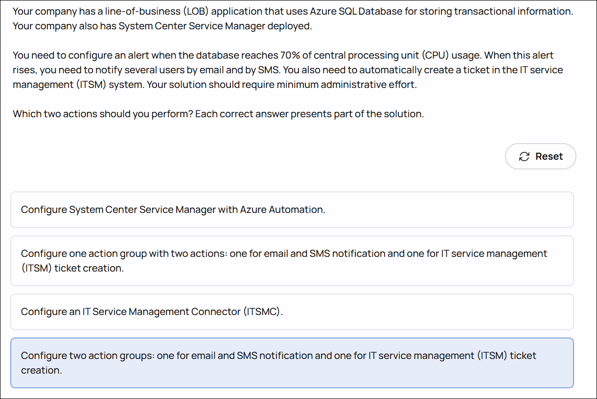

<details>
<summary>Click to expand explanation</summary>

**Why the selected answer is wrong**

“Configure two action groups: one for email and SMS notification and one for IT service management (ITSM) ticket creation” adds unnecessary administrative overhead. Azure Monitor alert rules can reference a **single action group** that contains multiple actions. Splitting actions into separate action groups does not provide additional capability here and violates the requirement for *minimum administrative effort*. This is a common exam trap—assuming separation is required when Azure already supports multiple actions per action group.

**Why the correct answers are right**

“Configure one action group with two actions: one for email and SMS notification and one for IT service management (ITSM) ticket creation” is correct because Azure Monitor action groups are explicitly designed to fan out multiple notification and automation actions from a single alert. One action group can include email, SMS, voice, webhook, Logic App, and ITSM actions together, making it the simplest and lowest-effort configuration.

“Configure an IT Service Management Connector (ITSMC)” is correct because System Center Service Manager integration with Azure Monitor alerts requires the ITSM Connector. The connector enables Azure Monitor to automatically create incidents in the ITSM system when alerts fire. Without the ITSMC, ticket creation is not possible regardless of how the action group is configured.

**Key takeaway**

For Azure Monitor alerts, use **one action group with multiple actions** whenever possible, and remember that **ITSM ticket creation requires an ITSM Connector**. The exam consistently favors solutions that minimize configuration objects while using native Azure Monitor capabilities.

**References**

* [https://learn.microsoft.com/azure/azure-monitor/alerts/action-groups](https://learn.microsoft.com/azure/azure-monitor/alerts/action-groups)
* [https://learn.microsoft.com/azure/azure-monitor/alerts/itsmc-overview](https://learn.microsoft.com/azure/azure-monitor/alerts/itsmc-overview)
* [https://learn.microsoft.com/azure/azure-monitor/alerts/alerts-overview](https://learn.microsoft.com/azure/azure-monitor/alerts/alerts-overview)

</details>

---

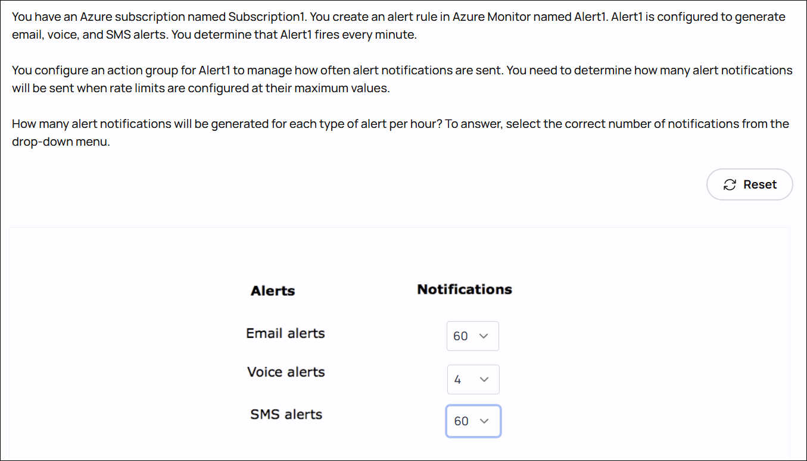

<details>
<summary>Click to expand explanation</summary>

**Why the selected answer is wrong**

* The dropdown values shown (Email **60**, Voice **4**, SMS **60** per hour) don’t match Azure Monitor’s **service-level notification rate limits** for action groups. Even if an alert fires every minute, Azure Monitor will **throttle notifications per recipient** (email address/phone number) based on those limits—not based on the alert frequency.

**Why the correct answer is right**
Azure Monitor action group notification limits (production) are:

* **Email:** **No more than 100 emails per hour** per email address (per region). ([Microsoft Learn][1])
* **SMS:** **No more than 1 SMS every 5 minutes** per phone number ⇒ 60 / 5 = **12 per hour**. ([Microsoft Learn][1])
* **Voice:** **No more than 1 voice call every 5 minutes** per phone number ⇒ 60 / 5 = **12 per hour**. ([Microsoft Learn][1])

So, with Alert1 firing every minute (60 times/hour), the **maximum notifications actually sent per hour** are:

* **Email:** **60** (because the alert only fires 60 times/hour, which is under the 100/hour cap) ([Microsoft Learn][1])
* **SMS:** **12** (throttled by 1 per 5 minutes) ([Microsoft Learn][1])
* **Voice:** **12** (throttled by 1 per 5 minutes) ([Microsoft Learn][1])

**Key takeaway**
Action group notification “rate limiting” questions are testing that **notification throttles are per recipient**, and for **SMS/voice** they effectively translate to **12/hour** (1 per 5 minutes). Email has a higher cap (100/hour), so the alert’s firing rate (60/hour) becomes the limiting factor. ([Microsoft Learn][2])

**References**

* Azure Monitor service limits (Action groups: Email/SMS/Voice limits): [https://learn.microsoft.com/en-us/azure/azure-monitor/fundamentals/service-limits](https://learn.microsoft.com/en-us/azure/azure-monitor/fundamentals/service-limits#action-groups)
* Create and manage action groups in Azure Monitor (rate limiting behavior overview): [https://learn.microsoft.com/en-us/azure/azure-monitor/alerts/action-groups](https://learn.microsoft.com/en-us/azure/azure-monitor/alerts/action-groups)
* Troubleshoot Azure Monitor alerts and notifications (SMS/voice throttling explanation): [https://learn.microsoft.com/en-us/azure/azure-monitor/alerts/alerts-troubleshoot](https://learn.microsoft.com/en-us/azure/azure-monitor/alerts/alerts-troubleshoot)

[1]: https://learn.microsoft.com/en-us/azure/azure-monitor/fundamentals/service-limits "Azure Monitor service limits - Azure Monitor | Microsoft Learn"
[2]: https://learn.microsoft.com/en-us/azure/azure-monitor/alerts/action-groups?utm_source=chatgpt.com "Create and manage action groups in Azure Monitor"

</details>

---


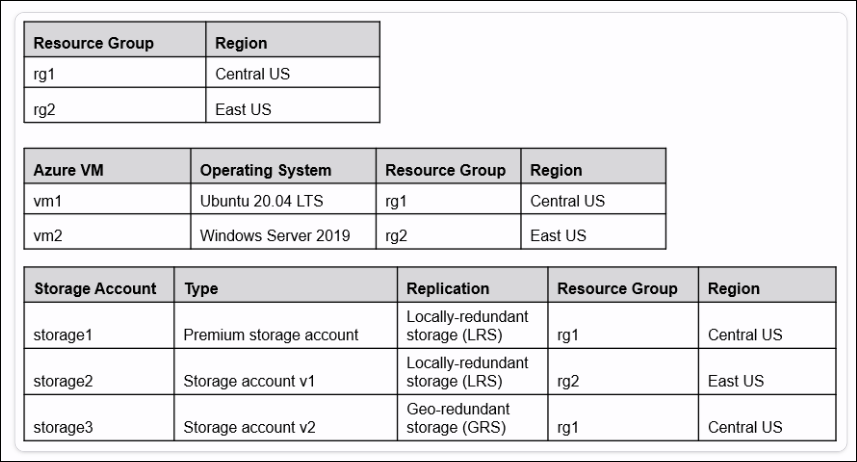

<details>
<summary>Click to expand explanation</summary>

**Why the selected answers are wrong**

* **Using storage1 for vm1**
  Boot diagnostics **cannot use a Premium storage account**. Boot diagnostics requires a **Standard** storage account (Blob service). `storage1` is explicitly a **Premium storage account**, so it is not eligible, even though it is in the same region and resource group as vm1.

* **Using storage2 for vm2**
  While `storage2` is a Standard storage account, it is a **Storage account v1 (Classic)**. Boot diagnostics **does not support storage account v1**. Only **Storage account v2 (General-purpose v2)** or supported Standard accounts are valid.

**Why the correct answers are right**

* **vm1 → storage3**
  `storage3` is a **Storage account v2**, which is supported for boot diagnostics. It is also in the **same region (Central US)** as vm1.
  Replication type (GRS vs LRS) and resource group **do not matter** for boot diagnostics—only account type and region do.

* **vm2 → storage3**
  Boot diagnostics **does not require the storage account to be in the same resource group**, but it **must be in the same region** as the VM.
  vm2 is in **East US**, so none of the available accounts in East US meet the requirements (`storage2` fails due to v1). Therefore, **storage3 is the only valid supported account**, and this question is testing that **account type restrictions override resource group and replication considerations**.

**Key takeaway**

Boot diagnostics requires:

* **Standard storage**
* **Storage account v2**
* **Same region as the VM**

Premium storage accounts and storage account v1 are **not supported**, regardless of region or resource group.


**References**  

* [Limitations](https://learn.microsoft.com/en-us/azure/virtual-machines/boot-diagnostics#limitations)
* [https://learn.microsoft.com/azure/virtual-machines/boot-diagnostics](https://learn.microsoft.com/azure/virtual-machines/boot-diagnostics)
* [https://learn.microsoft.com/azure/storage/common/storage-account-overview](https://learn.microsoft.com/azure/storage/common/storage-account-overview)
* [https://learn.microsoft.com/azure/virtual-machines/troubleshooting/boot-diagnostics#requirements](https://learn.microsoft.com/azure/virtual-machines/troubleshooting/boot-diagnostics#requirements)

</details>

---

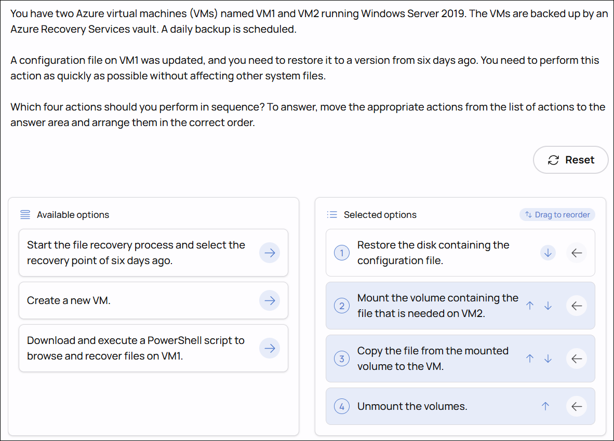

<details>
<summary>Click to expand explanation</summary>

**Why the selected answer is wrong**

“Restore the disk containing the configuration file” is incorrect because a disk restore is a **full disk–level operation**. It replaces or attaches an entire managed disk from a recovery point. That is slower and risks overwriting or impacting other files on the disk, which directly violates the requirement to restore **only one file** as quickly as possible and **without affecting other system files**.
On Azure exams, disk restore is a common trap when the scenario clearly calls for **granular recovery**.

**Why the correct answer is right**

The scenario is testing **Azure VM File Recovery** from a Recovery Services vault. File Recovery allows you to restore individual files from a specific recovery point **without restoring the VM or disk**.

The correct sequence is:

1. Start the file recovery process and select the recovery point of six days ago.
2. Download and execute the PowerShell script to mount the recovery volume.
3. Copy the required configuration file from the mounted volume to the VM.
4. Unmount the volumes.

This approach is the **fastest**, least disruptive method and is exactly what Azure Backup File Recovery is designed for.

**Key takeaway**

If the requirement is **one or a few files**, always choose **File Recovery**, not disk or VM restore.
Disk restore = coarse-grained, higher impact.
File Recovery = granular, fast, exam-preferred.

**References**

Azure VM file recovery
[https://learn.microsoft.com/azure/backup/backup-azure-restore-files-from-vm](https://learn.microsoft.com/azure/backup/backup-azure-restore-files-from-vm)

Restore Azure VM data using Azure Backup
[https://learn.microsoft.com/azure/backup/backup-azure-vms-restore](https://learn.microsoft.com/azure/backup/backup-azure-vms-restore)

Azure Recovery Services vault overview
[https://learn.microsoft.com/azure/backup/backup-azure-recovery-services-vault-overview](https://learn.microsoft.com/azure/backup/backup-azure-recovery-services-vault-overview)

</details>

---

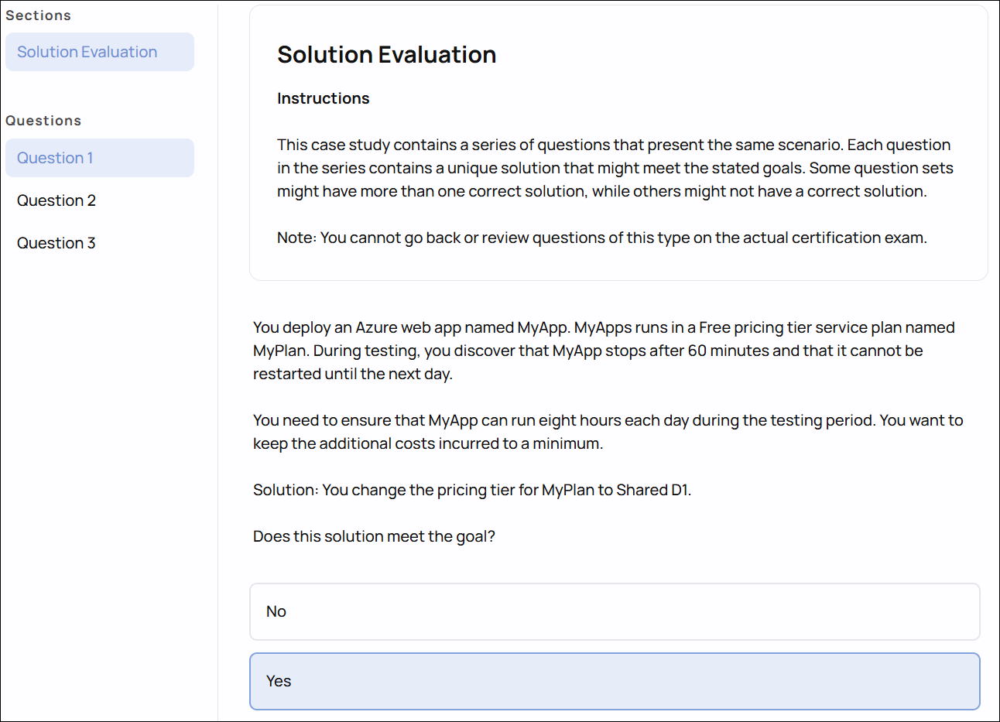

<details>
<summary>Click to expand explanation</summary>

**Why the selected answer is wrong (Yes)**
Moving from **Free (F1)** to **Shared (D1)** increases the daily CPU quota, but it **does not remove quotas**. Your symptom (“stops after 60 minutes and can’t be restarted until the next day”) matches hitting the **CPU (Day)** quota, which causes the app to be stopped until the quota resets. In Shared (D1), the app can still hit **CPU (Day)** and be stopped again—just later—so it won’t reliably run **8 hours/day**.

**Why the correct answer is correct (No)**
To meet “run 8 hours each day,” you need a plan where you **don’t get stopped due to Free/Shared quotas**. That generally means moving to a **Dedicated compute** tier (Basic/Standard/Premium), where the app runs on dedicated VMs and the Free/Shared CPU (Day) quota enforcement doesn’t apply in the same way. Shared (D1) remains a shared-compute tier with quota enforcement, so it doesn’t meet the requirement.

**Why other options are incorrect or less appropriate**

* **Stay on Free (F1):** guaranteed to stop once the quota is exceeded (as observed).
* **Shared (D1):** still quota-enforced; may extend runtime but not to the required 8 hours consistently.
* **Basic (B1) or higher:** costs more than Shared, but it’s the minimum tier change that aligns with the requirement to keep the app running during the testing window.

**Key takeaway**
**Free and Shared tiers have CPU quotas that can stop the app until the daily reset.** If you need predictable multi-hour runtime, move to a **Dedicated compute** tier (Basic or higher).

**References**

* [https://learn.microsoft.com/en-us/azure/app-service/overview-hosting-plans](https://learn.microsoft.com/en-us/azure/app-service/overview-hosting-plans)
* [https://learn.microsoft.com/en-us/azure/app-service/web-sites-monitor](https://learn.microsoft.com/en-us/azure/app-service/web-sites-monitor)

</details>

---


<details>
<summary>Click to expand explanation</summary>

**Correct answer: No**

**Why the selected answer is incorrect**
Changing the App Service plan from **Free (F1)** to **Standard S1** does remove the 60-minute daily execution limit, so the app can run for eight hours per day. However, the solution also explicitly requires keeping **additional costs to a minimum**. Standard S1 is **not the lowest-cost plan** that satisfies the runtime requirement, so the solution does not fully meet the goal.

**Why the correct answer is correct**
While Standard S1 technically works from a functionality standpoint, it fails the cost-minimization requirement. A **Basic (B1)** plan would also allow the app to run continuously beyond 60 minutes and is **cheaper than Standard S1**, making S1 an unnecessarily expensive choice for testing.

**Why other options are less appropriate**

* Staying on **Free (F1)** is not viable because of the enforced 60-minute daily limit and the inability to restart the app the same day.
* Moving to **Standard S1** overprovisions features (such as scaling and advanced capabilities) that are not required for this scenario and increases cost unnecessarily.

**Key takeaway**
For App Service questions, always evaluate both **technical capability and cost efficiency**. If multiple plans meet the runtime requirement, the **lowest-cost qualifying tier** is the correct exam choice.

**References**

* [https://learn.microsoft.com/azure/app-service/overview-hosting-plans](https://learn.microsoft.com/azure/app-service/overview-hosting-plans)
* [https://learn.microsoft.com/azure/app-service/management-scale-up](https://learn.microsoft.com/azure/app-service/management-scale-up)
* [https://learn.microsoft.com/azure/app-service/operating-system-functionality#app-service-plan-tiers](https://learn.microsoft.com/azure/app-service/operating-system-functionality#app-service-plan-tiers)


**What the ACU/vCPU column represents**

The **ACU/vCPU** column indicates the **relative CPU performance available per virtual CPU** for that App Service plan.

**ACU (Azure Compute Unit)**

* ACU is a **normalized performance score**, not a physical measurement.
* Microsoft uses it to compare CPU performance **across different underlying hardware generations**.
* Higher ACU means **more compute power per vCPU**.

**How to read the values**

* **N/A (Free F1 / Shared D1)**
  These tiers don’t provide dedicated vCPUs. They run on shared infrastructure with enforced time quotas, so ACU isn’t applicable.

* **100 ACU**
  Baseline compute performance. This is common for **Basic (B-series)** and **Standard (S-series)** plans and many legacy Premium plans.

* **195 ACU / 210 ACU**
  Indicates **newer, faster CPU hardware** (for example, Premium v3 or Premium v2).
  Each vCPU delivers roughly **~2× the compute performance** of a 100 ACU vCPU.

**What this means in practice (exam-relevant)**

* ACU is about **CPU speed per vCPU**, not total compute.
* Total compute = **ACU × number of vCPUs**.
* Two plans with the same vCPU count but different ACU values will have **different performance**.
* ACU does **not** change memory, storage, features, or scaling rules—only relative CPU power.

**Common exam trap**

* Assuming “1 vCPU = same performance everywhere.”
  This is incorrect. A **1-vCPU plan at 195 ACU** is significantly faster than **1 vCPU at 100 ACU**.

**Key takeaway**

ACU/vCPU is a **relative CPU performance indicator**. Higher numbers mean **faster CPUs per core**, typically reflecting newer App Service hardware generations.

---

</details>

## Correctly Answered but Unsure Questions

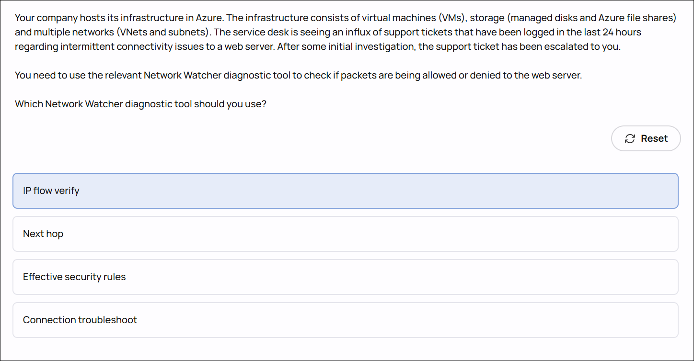

<details>
<summary>Click to expand explanation</summary>

**Why the selected answer is correct (IP flow verify)**
IP flow verify is the Network Watcher tool specifically designed to determine whether traffic is **allowed or denied** to or from a VM. You define the 5-tuple (source IP, destination IP, source port, destination port, protocol), and Azure evaluates the effective NSG rules applied to the NIC and subnet to return an **Allow** or **Deny** decision. This directly answers the requirement to check whether packets are being allowed or denied to the web server.

**Why the other options are incorrect**

* **Next hop**: Shows where traffic is routed (e.g., Internet, virtual appliance, VNet peering). It does not evaluate security rules or allow/deny decisions.
* **Effective security rules**: Lists the merged NSG rules applied to a NIC or subnet, but does not simulate a specific packet flow or return an explicit allow/deny result for given traffic.
* **Connection troubleshoot**: Tests end-to-end connectivity between a source and destination and identifies potential failures, but it is broader than required and not focused on evaluating packet allow/deny decisions at the NSG level.

**Key takeaway**
When the question asks whether packets are **allowed or denied**, the correct Network Watcher tool is **IP flow verify**.

**References**

* [https://learn.microsoft.com/azure/network-watcher/network-watcher-ip-flow-verify-overview](https://learn.microsoft.com/azure/network-watcher/network-watcher-ip-flow-verify-overview)
* [https://learn.microsoft.com/azure/network-watcher/network-watcher-monitoring-overview](https://learn.microsoft.com/azure/network-watcher/network-watcher-monitoring-overview)
* [https://learn.microsoft.com/azure/virtual-network/security-overview](https://learn.microsoft.com/azure/virtual-network/security-overview)

No. **Windows Firewall rules do not impact IP flow verify results.**

**Why**
IP flow verify evaluates traffic **only at the Azure networking layer**, specifically:

* Network Security Groups (NSGs) applied to the **subnet** and **NIC**
* Azure’s effective security rule evaluation (priority-based NSG processing)

It does **not** inspect or consider:

* Guest OS firewalls (Windows Firewall, iptables, etc.)
* Application-level listeners or services
* VM-level routing inside the OS

**Common exam trap**
It is easy to assume that “packet allowed or denied” includes the OS firewall. On Azure exams, **IP flow verify = NSG evaluation only**. If IP flow verify returns **Allow** but connectivity still fails, the next suspects are:

* Windows Firewall rules
* Application not listening on the port
* Local OS routing or security software

**Key takeaway**
IP flow verify answers: *“Would Azure networking allow this packet?”*
It does **not** answer: *“Can the VM actually accept this connection?”*

**References**

* [https://learn.microsoft.com/azure/network-watcher/network-watcher-ip-flow-verify-overview](https://learn.microsoft.com/azure/network-watcher/network-watcher-ip-flow-verify-overview)
* [https://learn.microsoft.com/azure/virtual-network/network-security-groups-overview](https://learn.microsoft.com/azure/virtual-network/network-security-groups-overview)

</details>

---


<details>
<summary>Click to expand explanation</summary>

**Why the selected answer is right**
Azure Backup uses **Soft Delete** for Azure IaaS VM backups. When a VM and its backup data are deleted (intentionally or accidentally), the backup data is **retained for 14 days** in a soft-deleted state. During this window, the VM’s backup data can be recovered by undeleting the backup item from the Recovery Services vault. After 14 days, the data is permanently deleted and cannot be recovered.

**Key takeaway**
For Azure IaaS VMs protected by a Recovery Services vault, **soft delete provides a fixed 14-day recovery window** after deletion—independent of the configured backup retention policy.


**References**

* [Soft delete for virtual machines](https://learn.microsoft.com/en-us/azure/backup/soft-delete-virtual-machines?utm_source=chatgpt.com&tabs=azure-portal)

</details>

---


<details>
<summary>Click to expand explanation</summary>

**Why “Yes” is correct**
Changing the App Service plan from **Free (F1)** to **Basic (B1)** removes the **Free/Shared quota enforcement** behavior. In Free/Shared tiers, Azure enforces CPU/Bandwidth quotas; when the app exceeds its quota (for example, CPU (Day)), the app is **stopped until the quota resets** (which matches “stops after 60 minutes” and “can’t be restarted until the next day”). Scaling up to a dedicated tier (Basic) avoids those per-app CPU-minute/day quotas, allowing the app to run for the required **8 hours/day**.

**Why “No” would be a trap**
A common misconception is that “Free just means no SLA” or “it only affects performance.” In reality, Free/Shared tiers have **hard quotas** that can stop the app for the rest of the day once exceeded.

**Cost reasoning (exam perspective)**
Basic **B1** is typically the lowest-cost **dedicated compute** App Service plan tier. Since the requirement is to run several hours daily, moving to the cheapest dedicated tier is the minimal-cost way to meet the runtime goal.

**Key takeaway**
Free/Shared App Service plans can stop apps when usage quotas are exceeded; moving to a dedicated tier like **Basic B1** eliminates that daily CPU-minute quota enforcement and meets the 8-hours/day requirement.


**References**

* [https://learn.microsoft.com/en-us/azure/app-service/web-sites-monitor](https://learn.microsoft.com/en-us/azure/app-service/web-sites-monitor)
* [https://learn.microsoft.com/en-us/azure/app-service/overview-hosting-plans](https://learn.microsoft.com/en-us/azure/app-service/overview-hosting-plans)

</details>

---

## Correctly Answered Questions

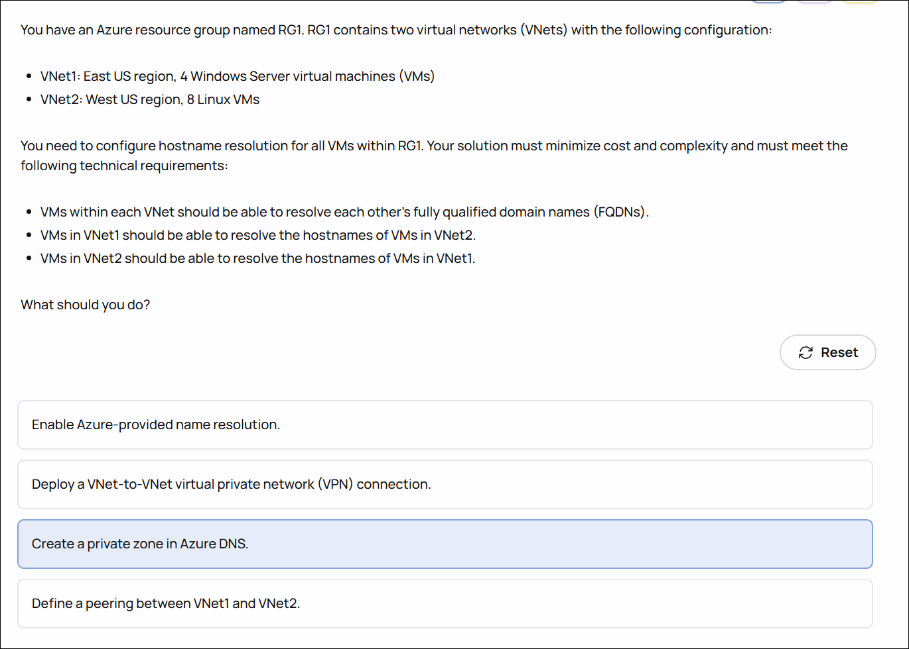

---

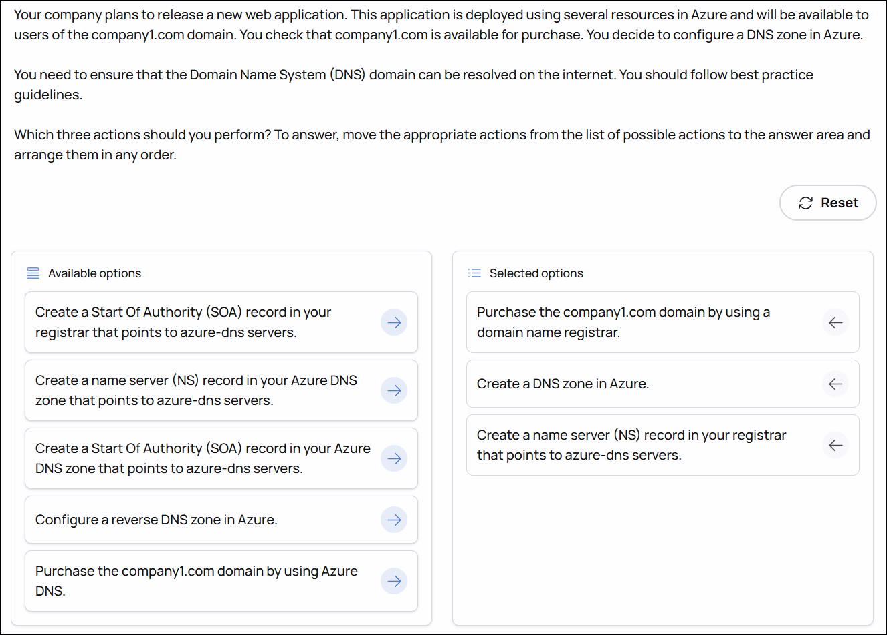

---

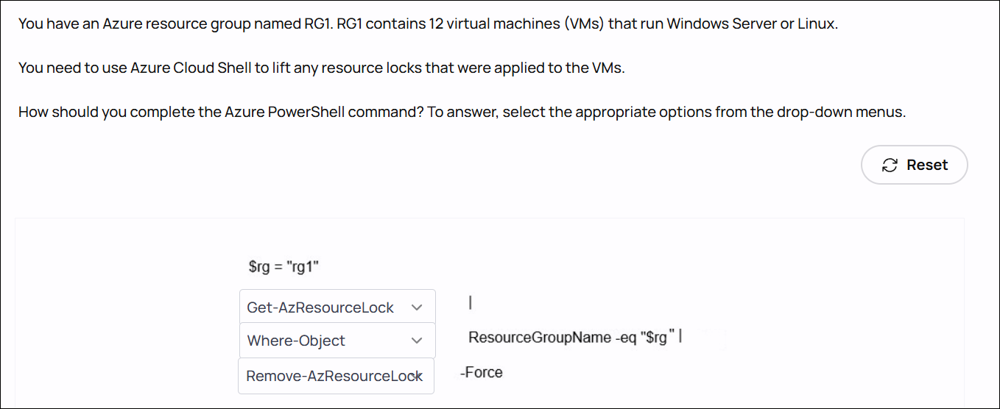

---

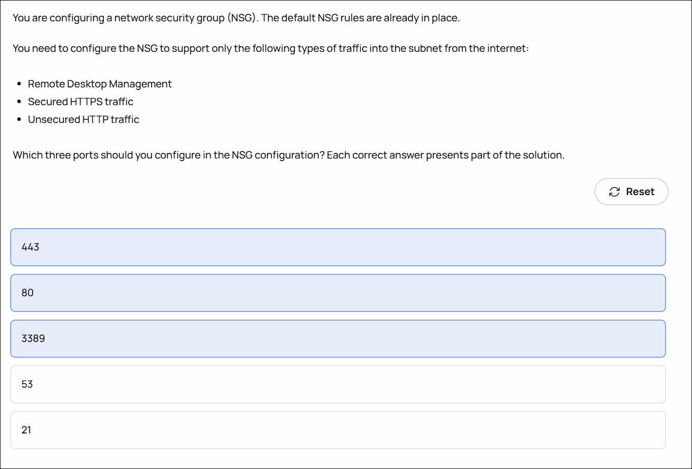

---

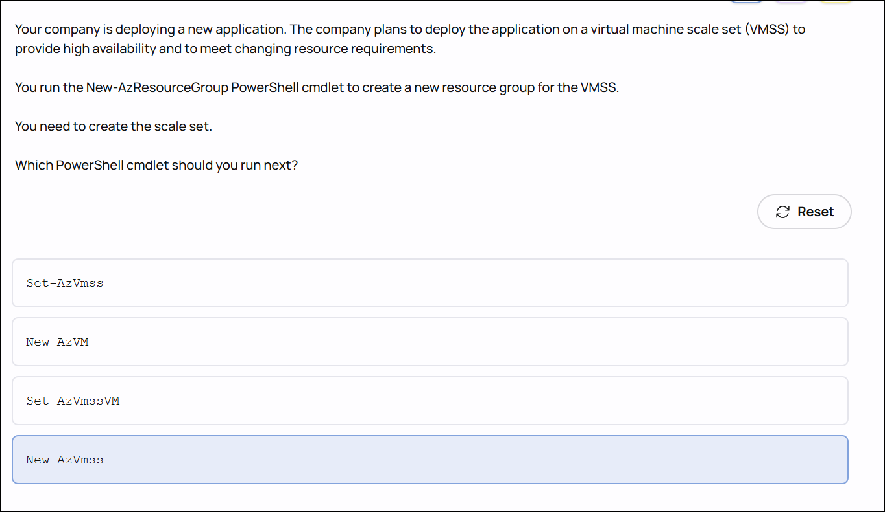

---

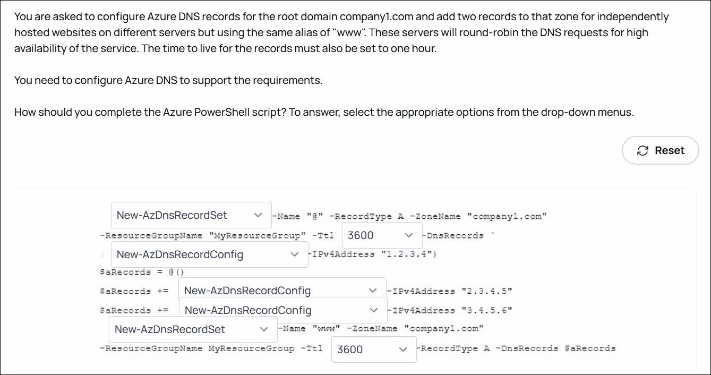

---


---


---

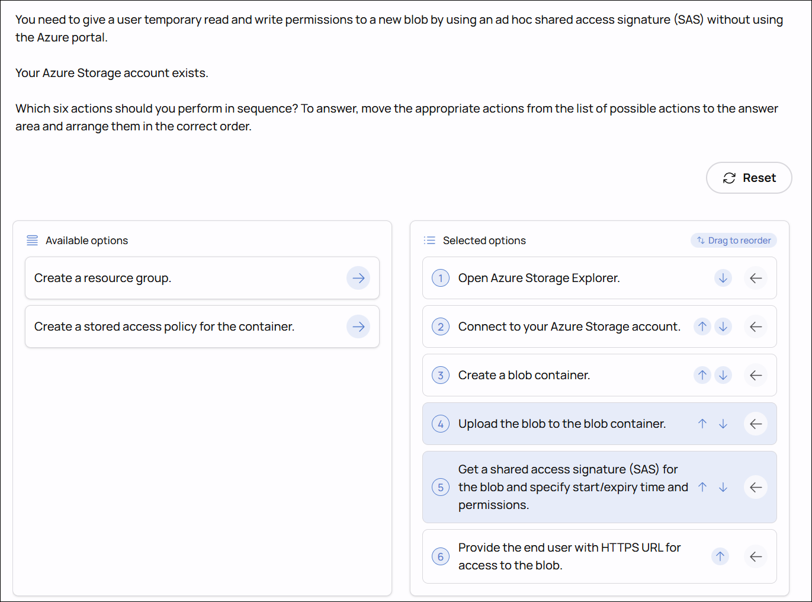

---


---


