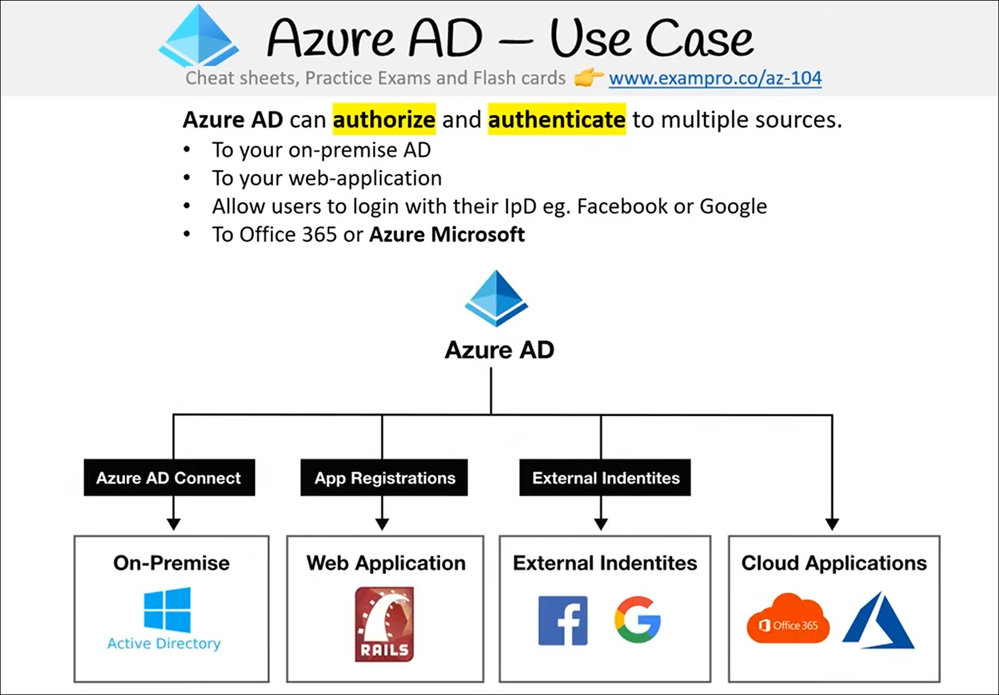
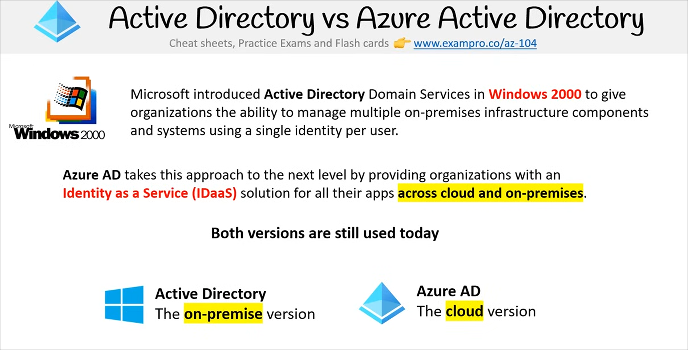
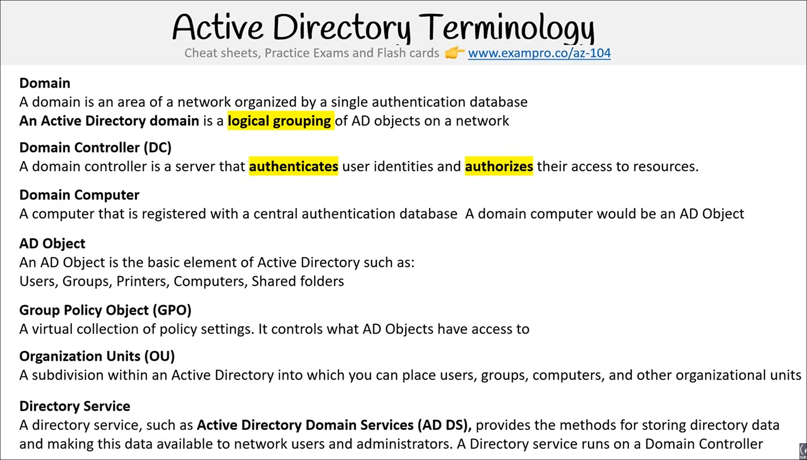
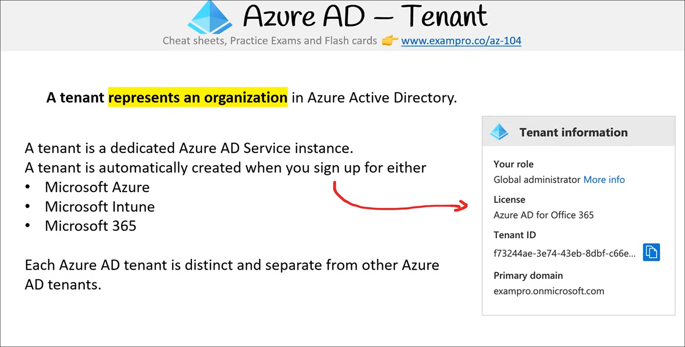
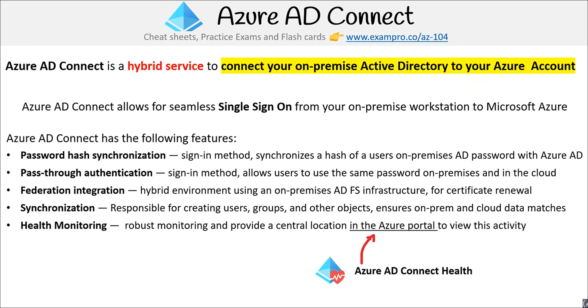
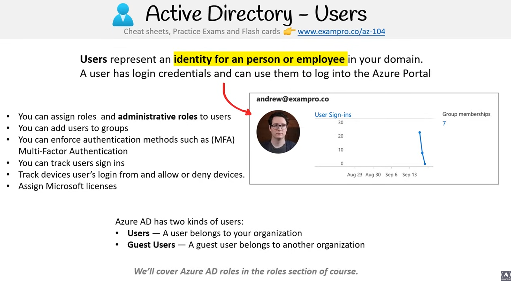
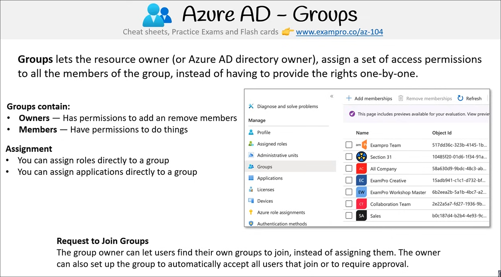

# Azure AD

**Channel:** freeCodeCamp.org
**Duration:** 11:16:25
**URL:** <https://www.youtube.com/watch?v=10PbGbTUSAg>

## Azure AD Intro

**Timestamp**: 00:19:45 – 00:21:43

**Key Concepts**  

- Azure Active Directory (Azure AD) is a cloud-based identity and access management service.  
- It manages user sign-ins and access to both external and internal resources.  
- Supports single sign-on (SSO) to enable users to log into multiple applications with one set of credentials.  
- Azure AD integrates with various platforms including Microsoft Office 365, Azure Portal, SaaS apps, on-premises applications, and workstations.  
- Azure AD comes in four editions with increasing features: Free, Office 365 Apps, Premium P1, and Premium P2.  
- Higher tiers include advanced features like hybrid identity synchronization, conditional access, identity protection, and governance.  
- Custom access controls require Premium P1 or P2 licenses.

**Definitions**  

- **Azure Active Directory (Azure AD)**: Microsoft’s cloud-based identity and access management service that helps employees sign in and access resources securely.  
- **Single Sign-On (SSO)**: A user authentication process that permits a user to access multiple applications with one set of login credentials.  
- **Hybrid Architecture**: A setup that integrates on-premises Active Directory with Azure AD for seamless identity management across environments.

**Key Facts**  

- Free tier includes MFA (Multi-Factor Authentication), SSO, basic security, usage reports, and user management.  
- Office 365 Apps tier adds company branding, SLA, and sync capabilities between on-premises and cloud.  
- Premium tiers (P1 and P2) target enterprise and hybrid environments with advanced group access, conditional access, identity protection, and governance.  
- Custom access controls are only available in Premium tiers.  
- Azure AD is widely adopted in enterprises and used in real-world scenarios such as Exam Pro’s integration with Microsoft Teams, AWS, and Azure.

**Examples**  

- Exam Pro uses Azure AD for:  
  - Microsoft Teams authentication  
  - Admin panel login for the Exam Pro platform  
  - Logging into AWS and Azure portals  

**Key Takeaways 🎯**  

- Understand Azure AD as a core cloud identity and access management service essential for enterprise environments.  
- Know the four Azure AD editions and their feature differences, especially the limitations of the free tier vs. premium tiers.  
- Remember that SSO is a major benefit of Azure AD, simplifying user access across multiple platforms.  
- Be aware that custom access controls require Premium licenses—important for exam scenarios involving access management.  
- Recognize the practical use cases of Azure AD in real organizations to contextualize its importance.

---

## Use Cases

**Timestamp**: 00:21:43 – 00:22:44

**Key Concepts**  

- Azure AD can authenticate and authorize users across multiple sources.  
- Integration with on-premise Active Directory via Azure AD Connect.  
- Support for external identity providers (IdPs) like Facebook and Google for user login.  
- Connection to cloud applications such as Office 365 and Microsoft Azure through Azure AD.  
- App registrations enable web applications to connect and authenticate via Azure AD.

**Definitions**  

- **Azure AD Connect**: A tool that synchronizes on-premise Active Directory with Azure AD to enable hybrid identity scenarios.  
- **Identity Provider (IdP)**: A service that authenticates users, e.g., Facebook, Google, allowing users to log in using those credentials.  
- **App Registration**: The process of registering an application in Azure AD to enable authentication and authorization.

 

**Key Facts**  

- Azure AD supports authentication to on-premise AD, web applications, external IdPs, and cloud services.  
- External identities allow users to log in using social accounts like Facebook or Google.  
- Azure AD acts as a central identity platform bridging on-premise and cloud environments.

**Examples**  

- Using Azure AD Connect to sync on-premise AD with Azure AD.  
- Web applications authenticating users via Azure AD app registrations.  
- Users logging into applications using Facebook or Google accounts as external IdPs.  
- Cloud applications like Office 365 and Microsoft Azure integrated with Azure AD for authentication.

**Key Takeaways 🎯**  

- Understand that Azure AD is a versatile identity platform supporting hybrid and cloud-only scenarios.  
- Remember Azure AD Connect is essential for linking on-premise AD with Azure AD.  
- Know that Azure AD supports external IdPs, enabling social logins.  
- App registrations are critical for enabling web apps to use Azure AD authentication.  
- Azure AD centralizes identity management across diverse environments and applications.

---

## AD vs AAD

**Timestamp**: 00:22:44 – 00:23:37

**Key Concepts**  

- Active Directory (AD) is a long-established on-premise identity management service.  
- Azure Active Directory (Azure AD or AAD) is a cloud-based identity as a service (IDaaS) solution.  
- Both AD and Azure AD coexist and serve different purposes but can be connected.  
- AD manages on-premise infrastructure with a single user identity across systems.  
- Azure AD extends identity management to cloud and hybrid environments.

**Definitions**  

- **Active Directory Domain Services (AD DS)**: Introduced in Windows 2000, it allows organizations to manage multiple on-premise infrastructure components and systems using a single user identity.  
- **Azure Active Directory (Azure AD)**: A cloud-hosted identity as a service (IDaaS) solution for managing user identities and access to applications across cloud and on-premise environments.

 

**Key Facts**  

- Active Directory has been around for over 20 years (since Windows 2000).  
- Azure AD provides identity management as a cloud service, supporting both cloud and on-premise apps.  
- AD is primarily for on-premise use; Azure AD is cloud-based.  
- AD and Azure AD can be connected to work together.

**Examples**  

- None specifically mentioned in this section.

**Key Takeaways 🎯**  

- Remember that AD is the traditional on-premise directory service, while Azure AD is the modern cloud-based identity service.  
- Both services are still relevant and often integrated in enterprise environments.  
- Azure AD is not just a cloud version of AD but an identity as a service platform designed for cloud and hybrid scenarios.  
- Understanding the distinction and relationship between AD and Azure AD is critical for exam questions on identity management in Microsoft environments.

---

## Terminology

**Timestamp**: 00:23:37 – 00:25:54

**Key Concepts**  

- Active Directory (AD) terminology is important to understand even if not core to Azure exams.  
- Domains organize AD objects logically, similar to Azure resource groups.  
- Domain controllers authenticate users and authorize access, often deployed redundantly.  
- AD objects include users, groups, computers, printers, shared folders, etc.  
- Group Policy Objects (GPOs) control policy settings and access permissions for AD objects.  
- Organizational Units (OUs) are subdivisions within AD for further logical grouping of objects.  
- Directory services store and provide access to directory data, running on domain controllers.  
- A tenant represents an organization in Azure AD and is created automatically with Azure, Intune, or Microsoft 365 sign-up.

 

**Definitions**  

- **Domain**: A logical grouping of Active Directory objects on a network, organized by a single authentication database.  
- **Domain Controller**: A server that authenticates user identities and authorizes access to resources; multiple domain controllers provide redundancy and availability.  
- **Domain Computer**: A computer registered with the central authentication database; considered an AD object.  
- **AD Object**: The basic element in Active Directory such as users, groups, computers, printers, shared folders, etc.  
- **Group Policy Object (GPO)**: A virtual collection of policy settings that controls what an AD object can access.  
- **Organizational Unit (OU)**: A subdivision within Active Directory used to group users, groups, computers, and other OUs logically.  
- **Directory Service**: A service that stores directory data and makes it available to network users and administrators; runs on domain controllers.  
- **Tenant**: Represents an organization in Azure AD; each tenant is distinct and created automatically when signing up for Azure, Intune, or Microsoft 365.

**Key Facts**  

- Domains are logical groupings similar to Azure resource groups but for AD objects.  
- Multiple domain controllers are common to ensure redundancy and availability.  
- A tenant has a unique tenant ID and is tied to the Azure AD service instance.  
- Tenants are separate and distinct from each other.  
- Example tenant shown: "ExamPro" tenant licensed for Office 365 tier of Azure AD.

**Examples**  

- Domain controller redundancy allows users to log in from different locations.  
- Tenant example: "ExamPro" tenant with its own tenant ID and Office 365 licensing.

**Key Takeaways 🎯**  

- Understand the role and purpose of domains, domain controllers, and AD objects as foundational AD concepts.  
- Know that Group Policy Objects and Organizational Units help manage and organize AD objects and their permissions.  
- Remember that directory services run on domain controllers to provide authentication and directory data access.  
- Recognize that an Azure AD tenant represents an organization and is created automatically with Microsoft cloud services sign-up.  
- While Azure exams focus more on Azure AD, familiarity with traditional AD terminology helps in understanding documentation and hybrid environments.

---

## Tenant

**Timestamp**: 00:25:54 – 00:26:42

**Key Concepts**  

- A tenant represents an organization within Azure Active Directory (Azure AD).  
- Each tenant is dedicated to a single Azure AD service instance.  
- Tenants are distinct and separate from one another.  
- A tenant is automatically created when signing up for Microsoft Azure, Microsoft Intune, or Microsoft 365.  
- Tenant information includes a unique tenant ID and licensing details (e.g., Office 365 tier).  
- Azure AD provides a domain controller for authentication, but enterprises may choose to set up their own domain controller if needed.

**Definitions**  

- **Tenant**: An organization’s dedicated instance within Azure Active Directory, created automatically upon subscription to Microsoft cloud services.  
- **Domain Controller**: The server responsible for authenticating users to the directory service.

 

**Key Facts**  

- Each Azure AD tenant has a unique tenant ID.  
- Tenants are licensed for specific service tiers, such as Office 365.  
- Azure automatically sets up a domain controller when creating an Active Directory in the cloud.  
- Enterprises with existing on-premises Active Directory may migrate to Azure AD for a fully managed cloud directory but might need to maintain their own domain controller for certain domain services not available in Azure AD.

**Examples**  

- The speaker’s tenant named "ExamPro one" with its own tenant ID and licensed for Office 365.  

**Key Takeaways 🎯**  

- Remember that a tenant is the fundamental organizational unit in Azure AD and is created automatically with Microsoft cloud subscriptions.  
- Each tenant is isolated and has its own unique tenant ID.  
- Understanding tenant licensing (e.g., Office 365) helps identify the Azure AD service tier in use.  
- Know that Azure AD provides domain controllers by default, but enterprises may need to deploy their own domain controllers to support features not available in Azure AD’s managed domain services.

---

## AD DS

**Timestamp**: 00:26:42 – 00:27:51

**Key Concepts**  

- Azure Active Directory Domain Services (Azure AD DS) provide managed domain services in the cloud.  
- Azure AD DS supports domain joins, group policies, LDAP, and NTLM authentication.  
- Azure AD DS eliminates the need to deploy, manage, or patch domain controllers manually.  
- Organizations with existing on-premises Active Directory can move to Azure AD for a fully managed cloud directory but may need Azure AD DS for full domain controller features.

**Definitions**  

- **Domain Controller**: A server that users authenticate against to access directory services.  
- **Azure Active Directory Domain Services (Azure AD DS)**: A managed domain service in Azure that provides traditional domain controller features without the need for manual deployment or management.

**Key Facts**  

- Azure sets up an Active Directory automatically, but enterprises may choose to set up their own domain controller in Azure for full feature support.  
- Azure AD DS supports key domain services such as domain join, group policies, LDAP, and NTLM authentication.  
- Azure AD DS is fully managed by Azure, meaning no manual patching or management is required.

**Examples**  

- An enterprise with an existing on-premises Active Directory may move to Azure AD but still require Azure AD DS to access domain controller features not available in the default Azure AD setup.

**Key Takeaways 🎯**  

- Understand the difference between Azure AD and Azure AD DS: Azure AD is primarily identity management, while Azure AD DS provides traditional domain controller capabilities in a managed service.  
- Remember that Azure AD DS supports legacy authentication protocols like NTLM and LDAP, which are not natively supported in Azure AD alone.  
- For exam scenarios involving hybrid or cloud migrations, know when to use Azure AD DS to maintain domain services without managing domain controllers yourself.

---

## AD Connect

**Timestamp**: 00:27:51 – 00:29:04

**Key Concepts**  

- Azure AD Connect is a hybrid service connecting on-premise Active Directory (AD) to Azure AD.  
- Enables seamless single sign-on (SSO) from on-premise workstations to Microsoft Azure.  
- Supports multiple sign-in methods and synchronization features.  
- Provides health monitoring through Azure AD Connect Health.

**Definitions**  

- **Azure AD Connect**: A tool/service that synchronizes and integrates on-premise Active Directory with Azure Active Directory to enable hybrid identity management.  
- **Password Hash Synchronization**: A sign-in method that synchronizes a hash of the on-premise AD user password with Azure AD.  
- **Password Authentication**: A sign-in method allowing users to use the same password on-premise and in the cloud.  
- **Federation Integration**: Uses on-premise AD FS infrastructure to enable hybrid environments and certificate renewal.  
- **Synchronization**: The process of creating and matching users, groups, and other AD objects between on-premise AD and Azure AD.  
- **Azure AD Connect Health**: A monitoring service providing a centralized view of Azure AD Connect activity and health status in the Azure portal.

 

**Key Facts**  

- Azure AD Connect supports:  
  - Password hash synchronization  
  - Password authentication  
  - Federation integration (using AD FS)  
  - Synchronization of users, groups, and objects  
  - Health monitoring via Azure AD Connect Health  
- Enables seamless single sign-on experience for users across on-premise and cloud environments.

**Examples**  

- None specifically mentioned for Azure AD Connect itself, but the service is described as enabling seamless SSO from on-premise workstations to Azure.

**Key Takeaways 🎯**  

- Remember Azure AD Connect is essential for hybrid identity setups connecting on-prem AD with Azure AD.  
- Know the different sign-in methods: password hash sync, password authentication, and federation integration.  
- Synchronization ensures AD objects are consistent across on-prem and cloud.  
- Azure AD Connect Health is important for monitoring and troubleshooting the hybrid connection.  
- Focus on the hybrid nature and seamless SSO capabilities for exam scenarios.

---

## Users

**Timestamp**: 00:29:04 – 00:30:04

**Key Concepts**  

- Users represent identities for people or employees within a domain.  
- Users have login credentials to access the Azure portal.  
- Users can be assigned roles, including administrative roles.  
- Users can be added to groups to simplify permission management.  
- Authentication enforcement (e.g., MFA) can be applied to users.  
- User sign-ins and device access can be tracked and managed.  
- Microsoft licenses can be assigned to users.  
- Azure AD distinguishes between two types of users: organizational users and guest users from other organizations.  
- Groups allow resource owners to assign access permissions collectively rather than individually.  
- Group owners manage membership and permissions within groups.  
- Roles and applications can be assigned directly to groups.  
- Group owners can enable self-service group joining with options for automatic acceptance or approval.

 

**Definitions**  

- **User**: An identity representing a person or employee in a domain, with credentials to log into Azure portal.  
- **Guest User**: A user from an external organization invited to access resources.  
- **Group Owner**: A user with permissions to add or remove members from a group.  
- **Group Member**: A user who has rights to perform actions as assigned within the group.

**Key Facts**  

- Users can be tracked for sign-in activity and device usage.  
- Groups can contain owners and members with distinct permission levels.  
- Assigning permissions to groups simplifies access management.

**Examples**  

- The presenter shows their own user account with login counts and group memberships in Azure AD.  
- Groups in "Exam Pro" contain owners who manage membership and members who have assigned rights.

**Key Takeaways 🎯**  

- Remember that users are the fundamental identity objects in Azure AD with credentials and access rights.  
- Distinguish between organizational users and guest users for access scenarios.  
- Use groups to efficiently manage permissions and role assignments at scale.  
- Leverage group owners and self-service group joining to reduce manual administrative tasks.  
- Track user sign-ins and device access to maintain security and compliance.

---

## Groups

**Timestamp**: 00:30:04 – 00:30:53

**Key Concepts**  

- Groups in Azure AD allow resource owners to assign access permissions collectively to all group members.  
- Groups can have owners and members; owners manage group membership, members receive assigned rights.  
- Roles and applications can be assigned directly to groups.  
- Group owners can enable users to request to join groups, with options for automatic acceptance or approval required.

 

**Definitions**  

- **Group Owner**: A user with permissions to add or remove members from the group.  
- **Group Member**: A user who belongs to the group and inherits the access permissions assigned to the group.

**Key Facts**  

- Assigning permissions to groups avoids the need to assign rights individually to each user.  
- Group owners can configure join settings to allow self-service group membership requests.  
- Role and application assignments can be made directly to groups, simplifying access management.

**Examples**  

- Example given: In the "Exam Pro" tenant, multiple groups exist with owners and members managing access.

**Key Takeaways 🎯**  

- Remember that groups streamline access management by bundling permissions for multiple users.  
- Know that group owners control membership and can set join policies to reduce administrative overhead.  
- Understand that roles and applications can be assigned at the group level, not just to individual users.  
- Be familiar with the concept of self-service group joining and approval workflows as a practical feature.

---

## Assign Access Rights

**Timestamp**: 00:30:53 – 00:31:38

**Key Concepts**  

- There are four different ways to assign users rights to access resources in Azure AD.  
- Access can be assigned directly to users or indirectly via groups or rules.  
- External authorities can also provide access rights.

**Definitions**  

- **Direct Assignment**: The resource owner assigns access rights directly to an individual user.  
- **Group Assignment**: The resource owner assigns access rights to a group, automatically granting access to all group members.  
- **Rule-Based Assignment**: The resource owner creates a group and uses rules to dynamically assign users to the resource based on criteria.  
- **External Authority Assignment**: Access rights are granted based on an external source such as an on-premises directory or SaaS application.

**Key Facts**  

- Four methods to assign access rights: Direct, Group, Rule-based, External authority.  
- Group assignment simplifies management by granting access to all members of a group at once.  
- Rule-based assignment automates user membership in groups based on defined rules.  
- External authority assignment integrates external identity providers or directories for access control.

**Examples**  

- None specifically mentioned in this segment.

**Key Takeaways 🎯**  

- Understand the four methods of assigning access rights and when to use each.  
- Group assignment is efficient for managing multiple users at once.  
- Rule-based assignment helps automate access based on user attributes or conditions.  
- External authority assignment is important for hybrid or SaaS environments integrating external identities.  
- Be prepared to identify and differentiate these assignment methods on the exam.

---

## External Identities

**Timestamp**: 00:31:38 – 00:32:17

**Key Concepts**  

- External identities in Azure AD enable users outside your organization to access your apps and resources.  
- External users can sign in using their preferred identity providers.  
- Supports collaboration with partners, distributors, suppliers, vendors, and other guests.  
- Allows sharing of apps with external users (B2B scenarios).  
- Supports development of apps for Azure AD tenants (single-tenant or multi-tenant).  
- Azure AD B2C enables creation of white-label apps for consumers and customers.

**Definitions**  

- **External Identities**: Azure AD feature that allows external users to access organizational resources using their own identity providers (e.g., Google, Facebook).  
- **Azure AD B2C**: A service to develop consumer-facing applications that allow users to sign in with social or local accounts.

**Key Facts**  

- External identities can come from social identity providers like Google or Facebook.  
- External identities facilitate business-to-business (B2B) collaboration.  
- Azure AD supports both single-tenant and multi-tenant app development for external access.

**Examples**  

- Partners, distributors, suppliers, vendors accessing resources using their own identities.  
- Sharing apps with external users for B2B purposes.  
- Developing white-label consumer apps using Azure AD B2C.

**Key Takeaways 🎯**  

- Remember that external identities allow external users to use their preferred login methods without needing an Azure AD account in your tenant.  
- Use external identities to enable secure B2B collaboration.  
- Azure AD B2C is specifically for consumer-facing applications, distinct from B2B external identities.  
- Understand the difference between B2B (external users accessing your resources) and B2C (consumer apps with external identities).

---

## Create a Tenant

**Timestamp**: 00:32:17 – 00:35:14

**Key Concepts**  

- Azure Active Directory (Azure AD) tenants are logical containers grouping users within an organization.  
- A tenant is essentially an instance of Azure Active Directory.  
- You can create multiple tenants to represent different organizations or isolated environments.  
- There are two main types of tenants: B2B (Business to Business) and B2C (Business to Consumer).  
- B2B tenants allow collaboration between different businesses.  
- B2C tenants enable users to access consumer-facing applications and share administration experiences.  
- When creating a tenant, you must provide a unique organization name and initial domain name.  
- The initial domain is appended with “.onmicrosoft.com” (not Microsoft.com as misstated in the transcript).  
- The tenant’s default location can be set (e.g., Canada), but data center deployment is typically in the US.  
- Tenant creation requires a unique domain name; if the chosen name is taken, you must try alternatives.  

**Definitions**  

- **Tenant**: An instance of Azure Active Directory that logically groups users and resources for an organization.  
- **B2B (Business to Business)**: Tenant type that facilitates collaboration between multiple organizations.  
- **B2C (Business to Consumer)**: Tenant type designed for consumer-facing applications allowing external users to access services.  

**Key Facts**  

- Every Azure account starts with a single default tenant representing your organization.  
- Tenant names and initial domains must be unique across Azure AD.  
- The initial domain uses the format: `[chosenname].onmicrosoft.com`.  
- Tenant creation can take a few minutes to complete.  
- Location selection affects defaults but does not necessarily change the physical data center location.  

**Examples**  

- Created a tenant named “Starfleet” but had to modify the domain name multiple times due to naming conflicts (e.g., tried “USS Starfleet” but it was invalid due to characters, ended with “Starfleet1984”).  
- Switched between multiple tenants such as “Hushnook,” “ExamPro,” and “Starfleet” to isolate users per tenant.  

**Key Takeaways 🎯**  

- Understand that tenants are the fundamental boundary for users and resources in Azure AD.  
- Know the difference between B2B and B2C tenants and their use cases.  
- When creating a tenant, ensure the organization name and domain are unique and valid (no special characters, numeric allowed).  
- Tenant creation is done via the Azure portal under Azure Active Directory > Manage tenants.  
- You can switch between tenants in the portal to manage different isolated environments.  
- Remember that the initial domain ends with “.onmicrosoft.com” and must be unique globally.  
- Tenant location setting is mostly for administrative purposes; actual data center location may differ.  
- Practice creating tenants to get familiar with naming constraints and the creation workflow.

---

## Upgrade License

**Timestamp**: 00:35:14 – 00:37:58

**Key Concepts**  

- Azure Active Directory (Azure AD) tenants can be switched to isolate users and resources.  
- Azure AD has different license tiers, with higher tiers offering more features.  
- Azure AD Premium P2 is a popular enterprise tier with advanced features.  
- You can upgrade an Azure AD tenant license to Premium P2 via the Azure portal.  
- A free trial for Azure AD Premium P2 is available but limited to one trial per account.  
- Upgrading to Premium P2 enables additional features like multi-factor authentication, policy-driven management, and end-user self-service.  

**Definitions**  

- **Azure AD Tenant**: A dedicated instance of Azure Active Directory that contains users, groups, and applications isolated from other tenants.  
- **Azure AD Premium P2**: A paid license tier of Azure Active Directory offering advanced security and management features, including dynamic role assignment and enhanced identity protection.  

**Key Facts**  

- Azure AD Free is the default tier with basic functionality.  
- Upgrading to Premium P2 costs money but includes a free trial period during which you are not billed.  
- The free trial must be explicitly activated via the "Licenses" section in the Azure portal under "All products" → "Try and buy."  
- Activation of the Premium P2 license may take some time to reflect in the Azure portal UI.  

**Examples**  

- Switching tenants from "ExamPro," "Hushnook," and "Starfleet" to isolate users.  
- Activating the Azure AD Premium P2 free trial by navigating to Licenses → All products → Azure AD Premium 2 → Free trial → Activate.  

**Key Takeaways 🎯**  

- Know how to switch between Azure AD tenants to manage isolated user sets.  
- Understand the difference between Azure AD Free and Premium tiers, especially Premium P2.  
- Be able to locate and activate the Azure AD Premium P2 free trial in the Azure portal.  
- Remember that the Premium P2 license unlocks advanced features useful in enterprise environments.  
- The UI may not immediately update after license activation—refresh or wait a few moments.  
- While Premium P2 features are important, some may not be directly tested but knowing the upgrade process is essential.  

---

## User and Groups

**Timestamp**: 00:37:58 – 00:41:39

**Key Concepts**  

- Tenants in Azure AD and how to identify/switch between them  
- Creating groups before creating users for easier assignment  
- Types of groups: Security groups vs Microsoft 365 groups  
- Membership types: Static vs Dynamic (Dynamic requires Azure AD Premium P2)  
- User creation process including auto-generated passwords and group/role assignment  
- Soft-delete and recovery of users and groups within 30 days  

**Definitions**  

- **Tenant**: A dedicated instance of Azure Active Directory representing an organization.  
- **Security Group**: A group used primarily for managing access to Azure resources and permissions.  
- **Microsoft 365 Group**: A group that provides access to collaboration tools like mailbox, calendar, files, and SharePoint.  
- **Dynamic Group**: A group where membership is automatically managed based on rules or queries (requires Azure AD Premium P2).  
- **Soft Delete**: A feature where deleted users or groups are retained for 30 days before permanent deletion, allowing recovery.  

**Key Facts**  

- You can see the current tenant in the top right corner of the Azure portal.  
- Switching tenants can be done via the "Switch Tenant" button or by searching for Azure Active Directory.  
- Security groups are used for Azure-related access; Microsoft 365 groups are for collaboration tools.  
- Dynamic membership is only available with Azure AD Premium P2 license; free tier users cannot use dynamic groups.  
- Auto-generated passwords for new users are typically 4 letters followed by 4 numbers (easy to remember but not very secure).  
- Deleted users and groups remain recoverable for 30 days.  

**Examples**  

- Created a security group named "developers" with manual membership assignment.  
- Created a user named "Kevin Uxbridge" with an auto-generated password and assigned him to the "developers" group and specific roles.  
- Demonstrated restoring a deleted user named "Rishon" from the soft-delete state.  

**Key Takeaways 🎯**  

- Always create groups before users to simplify user management and access assignment.  
- Understand the difference between security groups and Microsoft 365 groups for correct usage.  
- Dynamic groups require Azure AD Premium P2; know your licensing limitations.  
- Auto-generated passwords are temporary; users must reset them on first login.  
- Deleted users and groups can be restored within 30 days—useful for accidental deletions.  
- Tenant context is important—always verify which tenant you are working in before making changes.

---

## Guest Users

**Timestamp**: 00:41:39 – 00:43:53

**Key Concepts**  

- Guest users allow inviting users from other Azure AD tenants into your tenant.  
- Inviting guest users is simpler than setting up federation between Active Directories.  
- Federation involves joining multiple Active Directories (on-premises or external), which has significant administrative overhead.  
- Azure AD guest user invitations are done via email and can be assigned to groups and roles.  

**Definitions**  

- **Guest User**: A user invited from an external Azure AD tenant to collaborate within your tenant without needing federation.  
- **Federation**: The process of linking two or more Active Directories to allow shared authentication and access, typically complex and administratively heavy.  

**Key Facts**  

- Guest users show up in the tenant’s user list marked as "guest."  
- Invitations to guest users are sent via their email address.  
- Guest user creation can be done through the Azure portal under "Users" → "New guest user."  
- You can assign guest users to groups and roles just like regular users.  

**Examples**  

- Created a user named "Hushnook" in one tenant (Hushnuk one) with email <hushnook@microsoft.com>.  
- Switched to another tenant (Starfleet) and invited "Hushnook" as a guest user by entering their email and sending an invitation.  

**Key Takeaways 🎯**  

- Remember that guest users simplify cross-tenant collaboration without federation complexity.  
- Guest users must be invited via their email address and will receive an invitation to join.  
- Guest users appear distinctly as "guest" in the user list.  
- Assigning groups and roles to guest users works the same as for internal users.  
- Federation is more complex and generally avoided if all parties use Azure AD.  

---

## Mass Import

**Timestamp**: 00:43:53 – 00:46:45

**Key Concepts**  

- Bulk operations allow importing multiple users into an account simultaneously.  
- A CSV template is provided to facilitate bulk user creation.  
- The CSV must include required fields such as principal username and password.  
- After filling out the CSV, it can be uploaded to the system for processing.  
- The system provides status updates on the bulk import operation, including success or failure counts.  
- Successfully imported users appear in the user list after completion.

**Definitions**  

- **Bulk Create**: A feature that enables the creation of multiple user accounts at once by uploading a CSV file with user details.  
- **Principal Username**: The unique identifier for a user in the system, required in the CSV for bulk import.

**Key Facts**  

- The CSV template can be downloaded directly from the bulk create interface.  
- Required CSV fields include principal username and password; other fields may be optional.  
- The bulk import process may take a short time to complete and can be monitored via a status page.  
- The example used the principal username "Picard" repeatedly for multiple users.  
- The bulk import result shows total requests, successes, and failures.

**Examples**  

- Downloaded a CSV template, edited it in Excel to add multiple users with principal username "Picard" and a password.  
- Uploaded the CSV file via drag-and-drop or file selection and submitted it for processing.  
- Checked the bulk import results page to confirm success with 0 failures.  
- Verified that the imported users appeared in the user list labeled as "mass imported."

**Key Takeaways 🎯**  

- Always use the provided CSV template to ensure correct formatting for bulk imports.  
- Make sure to include all required fields, especially principal username and password.  
- Monitor the bulk import status to confirm successful user creation and troubleshoot failures.  
- Bulk import is an efficient way to add many users at once, saving time compared to manual entry.  
- Remember that after import, users will appear in the system and can be managed like any other user.

---

## MFA

**Timestamp**: 00:46:45 – 00:50:51

**Key Concepts**  

- Multi-Factor Authentication (MFA) adds a secondary step to confirm user identity during login.  
- MFA can be enabled per user or in bulk for multiple users.  
- MFA options include phone call, text message, mobile app notification, verification codes, and hardware tokens (e.g., UbiKey).  
- App passwords allow users to sign into non-browser apps when MFA is enabled.  
- Trusted IP addresses can be whitelisted to bypass MFA prompts.  
- MFA enforcement can require users to create app passwords for non-browser apps.  
- Remember MFA on trusted devices can be configured for a set number of days to reduce repeated prompts.

**Definitions**  

- **Multi-Factor Authentication (MFA)**: A security process requiring users to provide two or more verification factors to gain access to a resource, enhancing account security beyond just a password.  
- **App Passwords**: Special passwords generated to allow non-browser applications (like Outlook or Lynx) to authenticate when MFA is enabled.  
- **Hardware Token**: A physical device (e.g., UbiKey) used as a second factor for authentication.

**Key Facts**  

- MFA is often disabled by default, especially on free Azure AD versions.  
- Azure AD Premium P2 license is required to enable MFA features fully.  
- Verification options include:  
  - Call to phone (user receives a call and enters letters/numbers)  
  - Text message  
  - Mobile app notification (via companion app on Android, iOS, Windows)  
  - Verification code from mobile app or hardware token  
- Bulk enabling MFA can be done by downloading a sample CSV file, editing user MFA status, and uploading it back.  
- Enforcing MFA means users must create app passwords for non-browser apps.  
- Remember MFA on trusted devices can be set for a custom number of days or disabled for maximum security.

**Examples**  

- Enabling MFA for a single user named Kevin by clicking "Enable" next to his name.  
- Bulk update example: downloading a sample file, pasting user names and MFA status, then uploading it to enable MFA for multiple users.  
- Using a UbiKey as a hardware token for MFA.  
- Enforcing MFA so users must create app passwords to use Outlook or Lynx.

**Key Takeaways 🎯**  

- Know that MFA adds an essential security layer beyond passwords and is highly recommended.  
- Understand the different verification methods available and when hardware tokens might be used.  
- Remember that Azure AD Premium P2 is required for full MFA capabilities; free tiers may not support it.  
- Be familiar with the process to enable MFA both individually and in bulk.  
- App passwords are necessary for non-browser apps once MFA is enforced.  
- Consider the trade-off between user convenience (remember MFA on trusted devices) and security (require MFA every time).  
- Enforcing MFA is a best practice to ensure users comply with security policies.

---

## Self Service Rest Password

**Timestamp**: 00:50:51 – 00:53:22

**Key Concepts**  

- Enabling self-service password reset (SSPR) allows users to reset their own passwords without administrator intervention.  
- Password reset can be enabled for all users or targeted groups (e.g., developers).  
- Authentication methods can be configured to require multiple verification steps for password reset.  
- Custom and predefined security questions can be used as part of the authentication process.  
- Users can be required to register their authentication methods upon sign-in.  
- Admins and users can be notified about password reset events.  
- A customizable help desk link/email can be provided for users needing assistance.  
- Usage and insights provide data on password reset activity.

**Definitions**  

- **Self-Service Password Reset (SSPR)**: A feature that allows users to reset their own passwords securely without needing to contact an administrator.  
- **Authentication Methods**: Verification steps (e.g., security questions, phone, email) required to confirm user identity during password reset.  
- **Registration**: The process where users set up their authentication methods, often required at first sign-in or periodically thereafter.

**Key Facts**  

- Password reset can be enabled tenant-wide or scoped to specific groups.  
- Number of authentication methods required for reset can be set (e.g., two methods for higher security).  
- Custom security questions can be created and added by administrators.  
- Default reconfirmation period for authentication methods is 180 days.  
- Notifications can be sent to users upon password reset and to all admins when other admins reset passwords.  
- Help desk contact info (URL or email) can be customized for user support.  

**Examples**  

- Adding a custom security question such as "What is the best song?" to the pool of questions users can answer during password reset.  
- Enabling notifications for password resets and admin password changes.  
- Providing an email address as a help desk contact for users needing assistance.

**Key Takeaways 🎯**  

- Always enable self-service password reset to reduce admin workload and improve user experience.  
- Configure multiple authentication methods to enhance security during password resets.  
- Use a mix of custom and predefined security questions to provide flexibility and security.  
- Require users to register authentication methods and periodically reconfirm them (default 180 days).  
- Enable notifications for password reset events to maintain security awareness.  
- Customize help desk contact information to ensure users know where to get help.  
- Monitor usage and insights to track password reset activity and identify potential issues.

---

## AD CheatSheet

**Timestamp**: 00:53:22 – 00:57:31

**Key Concepts**  

- Active Directory (AD) is Microsoft’s Identity and Access Management (IAM) service for on-premises environments.  
- Azure Active Directory (Azure AD) is the cloud-based version of AD, offered as Identity as a Service (IDaaS).  
- Azure AD comes in four editions: Free, Office 365 Apps, Premium P1, and Premium P2.  
- Azure AD supports authentication and authorization to multiple sources (on-premises, web apps, external identities like Facebook/Google, Office 365, Azure).  
- Key AD terminologies: domain, domain controller, domain computer, AD objects, Group Policy Objects (GPO), organizational units (OUs), directory services.  
- Azure AD tenant represents an organization and is a dedicated Azure AD instance created automatically upon sign-up.  
- Azure AD Domain Services (ADDS) provide managed domain services in Azure (domain join, group policies, LDAP).  
- Azure AD Connect synchronizes on-prem AD with Azure AD and supports features like password hash sync, pass-through authentication, federation, health monitoring.  
- Users in Azure AD are AD objects representing identities; two types exist: member users (belong to your org) and guest users (external).  
- Groups in Azure AD allow bulk assignment of access permissions; groups have owners and members.  
- Role and application assignments can be made directly to groups.  
- Group owners can configure self-service group join requests with auto-approval or approval workflows.  
- Four ways to assign resource access rights: direct assignment, group assignment, rule-based assignment, external authority assignment.

**Definitions**  

- **Active Directory (AD)**: Microsoft’s on-premises identity and access management service.  
- **Azure Active Directory (Azure AD)**: Cloud-based version of AD, offered as Identity as a Service (IDaaS).  
- **Domain**: A network area organized by a single authentication database; logical grouping of AD objects.  
- **Domain Controller (DC)**: Server that authenticates user identities and authorizes access to resources.  
- **Domain Computer**: A computer registered with the central authentication database (an AD object).  
- **AD Objects**: Base elements in AD such as users, groups, printers, etc.  
- **Group Policy Object (GPO)**: A virtual collection of policy settings applied to AD objects.  
- **Organizational Unit (OU)**: A subdivision within AD to organize users, groups, and computers.  
- **Directory Service**: Service like Active Directory Domain Services (ADDS) that stores directory data and provides access to network users.  
- **Tenant**: A dedicated Azure AD instance representing an organization, created automatically on sign-up.  
- **Azure AD Domain Services (ADDS)**: Managed domain services in Azure providing domain join, group policies, LDAP, etc.  
- **Azure AD Connect**: Tool to synchronize on-prem AD with Azure AD, supporting password hash sync, pass-through authentication, federation, and health monitoring.  
- **User (Azure AD)**: Identity object representing a person with login credentials; can be member or guest.  
- **Group (Azure AD)**: Collection of users to assign access permissions collectively.  

**Key Facts**  

- Azure AD editions: Free, Office 365 Apps, Premium P1, Premium P2.  
- Azure AD Connect features: password hash sync, pass-through authentication, federation, synchronization, health monitoring.  
- Four ways to assign access rights: direct, group, rule-based, external authority.  
- Tenant is distinct and separate from other tenants.  
- Lift and shift of AD to Azure may require ADDS as not all features are supported natively.  

**Examples**  

- External identities such as Facebook or Google can be used for authentication via Azure AD.  
- Group owners can configure groups to allow users to request to join, with options for auto-approval or requiring approval.  
- Assigning roles and applications directly to groups simplifies access management.  

**Key Takeaways 🎯**  

- Understand the difference between on-prem AD and Azure AD (cloud-based IDaaS).  
- Know the four Azure AD editions and their significance.  
- Be familiar with key AD terminologies and their roles (domain, DC, OU, GPO, objects).  
- Know the purpose and features of Azure AD Connect for hybrid identity scenarios.  
- Remember the two user types in Azure AD: member and guest.  
- Groups are critical for scalable access management; know how assignments and self-service group joins work.  
- Be able to list and explain the four methods of assigning resource access rights.  
- Recognize that tenants are isolated Azure AD instances per organization.  
- Understand that ADDS provides managed domain services in Azure when migrating on-prem AD.

---
