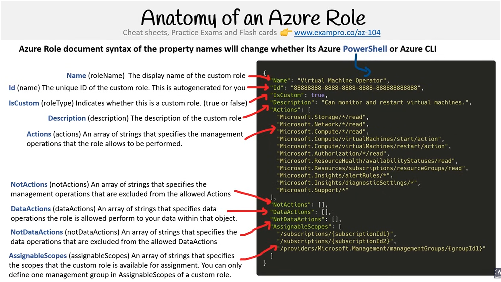

# Roles

**Channel:** freeCodeCamp.org
**Duration:** 11:16:25
**URL:** <https://www.youtube.com/watch?v=10PbGbTUSAg>

## Type of Roles

**Timestamp**: 01:13:38 – 01:14:32

**Key Concepts**  

- Azure has three types of roles for access and management.  
- Classic subscription administrator roles are the original Azure role system but are largely legacy.  
- Azure Roles are part of Role-Based Access Control (RBAC), built on Azure Resource Manager.  
- Azure Active Directory (Azure AD) Roles manage Azure AD resources within a directory.  
- IAM (Identity Access Management) in Azure is the system to create and assign roles to users.  
- Azure RBAC roles restrict access to resource actions (operations).  

**Definitions**  

- **Classic Subscription Administrator Roles**: The original Azure role system used to manage subscriptions; mostly legacy now.  
- **Azure Roles (RBAC)**: Authorization system built on Azure Resource Manager that controls access to Azure resources by assigning roles.  
- **Azure Active Directory (Azure AD) Roles**: Roles used to manage Azure AD resources within a directory.  
- **IAM (Identity Access Management)**: The system that allows creation and assignment of roles to users to control access.  

**Key Facts**  

- Azure has three distinct role types: Classic subscription administrator roles, Azure RBAC roles, and Azure AD roles.  
- RBAC roles are tied to Azure Resource Manager and control access to resource operations.  

**Examples**  

- None mentioned explicitly in this segment.  

**Key Takeaways 🎯**  

- Understand the difference between the three Azure role types and their purposes.  
- Know that Classic roles are legacy but still exist.  
- Azure RBAC is the primary authorization system for managing access to Azure resources.  
- Azure AD roles specifically manage directory-related resources.  
- IAM is the overarching system for assigning these roles to users.

---

## IAM Access Controls

**Timestamp**: 01:14:32 – 01:16:04

**Key Concepts**  

- IAM (Identity Access Management) in Azure is used to create and assign roles to users for access control.  
- Azure Roles are part of Role-Based Access Control (RBAC), which restricts access to resource operations.  
- There are two types of Azure RBAC roles: built-in roles and custom roles.  
- Role assignment applies roles to users, groups, or service principals.  
- Deny assignments explicitly block users from performing specific actions, even if a role grants access.  
- Classic administrators represent the original Azure role system, now largely replaced by RBAC.

**Definitions**  

- **IAM (Identity Access Management)**: A system that allows creation and assignment of roles to users to control access.  
- **Azure Roles**: Roles used in Azure RBAC to restrict access to resource actions.  
- **Built-in Roles**: Predefined, read-only roles managed by Microsoft (e.g., Owner, Contributor, Reader).  
- **Custom Roles**: User-created roles with custom permissions.  
- **Role Assignment**: The process of assigning a role to a user, group, or service principal.  
- **Deny Assignment**: A mechanism to block specific actions regardless of role assignments; can only be applied via Azure Blueprints.  
- **Classic Administrators**: The original Azure role system with three roles: Account Administrator, Service Administrator, and Co-Administrator.

**Key Facts**  

- Built-in roles are managed by Microsoft and are read-only.  
- Common built-in roles include Owner, Contributor, and Reader.  
- Deny assignments can only be applied through Azure Blueprints.  
- Account Administrator: Billing owner of the subscription, no Azure portal access.  
- Service Administrator: Has full access to the Azure portal, equivalent to Owner role at subscription scope.  

**Examples**  

- Role assignments can be applied to service principals, user groups, or individual users.  
- Deny assignments act as guardrails to prevent certain actions regardless of other permissions.  
- Classic Administrator roles:  
  - Account Administrator (billing only, no portal access)  
  - Service Administrator (full portal access, owner-level permissions)  

**Key Takeaways 🎯**  

- Always prefer using RBAC over Classic Administrator roles for access control.  
- Understand the difference between built-in and custom roles in RBAC.  
- Remember that deny assignments override role assignments and are only set via Azure Blueprints.  
- Know the three classic administrator roles and their access scopes, especially the distinction between Account and Service Administrator.  
- Role assignments can be applied to users, groups, or service principals—know these entities for exam scenarios.

---

## Classic Administrator

**Timestamp**: 01:16:04 – 01:17:14

**Key Concepts**  

- Classic Administrator is the original Azure role system, predating Azure RBAC.  
- It is accessed via the "Classic Administrator" tab under Access Control in the Azure portal.  
- There are three types of classic administrator roles: Account Administrator, Service Administrator, and Co-Administrator.  
- Classic Administrator roles differ in scope and portal access compared to RBAC roles.  
- Although largely replaced by RBAC, a classic administrator role is still created automatically when an Azure account is set up.

**Definitions**  

- **Account Administrator**: The billing owner of the subscription; does **not** have access to the Azure portal.  
- **Service Administrator**: Has the same access as a user assigned the Owner role at the subscription scope; has full access to the Azure portal.  
- **Co-Administrator**: Has the same access as a user assigned the Owner role at the subscription scope; can manage services but is distinct from the Service Administrator.

**Key Facts**  

- Classic Administrator roles are simpler and more limited compared to RBAC roles.  
- When an Azure account is created, it automatically assigns one classic administrator role (typically the Account Administrator).  
- The Service Administrator and Co-Administrator roles have Owner-level access at the subscription scope.  
- The Account Administrator role is primarily for billing and does not grant portal access.

**Examples**  

- The instructor mentions that when their Azure account was set up by a colleague ("Baker"), one classic administrator role was automatically assigned.  
- No other specific examples mentioned.

**Key Takeaways 🎯**  

- Prefer using Azure RBAC over Classic Administrator roles for managing access.  
- Understand the distinctions between the three classic administrator roles, especially regarding portal access and billing.  
- Remember that classic administrator roles are still created by default with new Azure subscriptions but are mostly legacy.  
- Know that Service Administrator and Co-Administrator roles have Owner-level permissions at the subscription scope.  
- Classic Administrator roles are managed under the "Classic Administrator" tab in Access Control.  

---

## RBAC

**Timestamp**: 01:17:14 – 01:20:06

**Key Concepts**  

- Role-Based Access Control (RBAC) manages who has access to Azure resources, what actions they can perform, and the scope of their access.  
- A role assignment consists of three elements: security principal, role definition, and scope.  
- Azure has fundamental built-in roles and many additional built-in roles (over 70).  
- Azure AD roles are distinct from Azure RBAC roles and manage Azure Active Directory resources.

**Definitions**  

- **Security Principal**: The identity requesting access to an Azure resource. This can be:  
  - A user in Azure Active Directory (AAD)  
  - A group in AAD  
  - A service principal (security identity used by applications or services)  
  - A managed identity (AAD identity automatically managed by Azure)  
- **Scope**: The set of resources the role assignment applies to. Scope levels include management groups, subscriptions, resource groups, or individual resources.  
- **Role Definition**: A collection of permissions that specify allowed operations such as read, write, delete. Roles can be broad (e.g., Owner) or specific (e.g., Virtual Machine Reader).  
- **Azure AD Roles**: Roles used to manage Azure Active Directory resources like users, licenses, domains, and administrative privileges.

**Key Facts**  

- Four fundamental Azure RBAC built-in roles to know:  
  1. **Owner** – Full access including managing access permissions.  
  2. **Contributor** – Can read and create/update/delete resources but cannot grant access to others.  
  3. **Reader** – Read-only access to resources.  
  4. **User Access Administrator** – Can grant access permissions to others but cannot create or modify resources.  
- Azure RBAC includes over 70 built-in roles beyond the fundamental four.  
- Azure AD roles include predefined roles such as Application Administrator and Application Developer.

**Examples**  

- None explicitly detailed, but the explanation of roles implies practical usage such as:  
  - Owner role assigned at subscription scope has full control.  
  - Contributor can manage resources but not assign roles.  
  - User Access Administrator manages access permissions without modifying resources.

**Key Takeaways 🎯**  

- Understand the three elements of role assignment: security principal, role definition, and scope.  
- Memorize the four fundamental Azure RBAC roles and their permission levels.  
- Know the difference between Azure RBAC roles (resource management) and Azure AD roles (directory management).  
- Remember scope hierarchy: management groups > subscriptions > resource groups > resources.  
- Recognize that service principals and managed identities are types of security principals used for applications and services.  
- Azure AD roles are essential for managing directory-level tasks like user creation and license management.

---

## AD Roles

**Timestamp**: 01:20:06 – 01:21:30

**Key Concepts**  

- Azure AD roles are used to manage Azure Active Directory resources.  
- These roles control actions like creating/editing users, assigning admin roles, resetting passwords, managing licenses, and domains.  
- Azure AD has many predefined built-in roles accessible under "Roles and Administrators" in the Azure portal.  
- Important built-in roles include Global Administrator, User Administrator, and Billing Administrator.  
- Custom Azure AD roles can be created but require an Azure AD Premium (P1 or P2) subscription.  
- Role definitions can be inspected to understand their permissions rather than relying solely on role names.  
- Azure role documents have different syntaxes depending on whether PowerShell or CLI is used.

**Definitions**  

- **Azure AD Roles**: Roles specifically designed to manage Azure Active Directory resources and administrative tasks within the directory.  
- **Global Administrator**: A built-in role with full access to all Azure AD features and settings.  
- **User Administrator**: A built-in role with full access to create and manage users.  
- **Billing Administrator**: A built-in role responsible for managing purchases, subscriptions, and support tickets.  
- **Custom Roles**: User-defined roles that can be created to tailor permissions but require Azure AD Premium licensing.

**Key Facts**  

- Custom Azure AD roles require Azure AD Premium P1 or P2 licenses (paid feature).  
- Azure AD Premium tiers (P1 and P2) provide enhanced control and features for role management.  
- Azure role definitions can be viewed and analyzed using PowerShell or CLI, with slight syntax differences.  
- Azure AD roles are distinct from Azure built-in roles like Owner, Contributor, Reader, and User Access Administrator.

**Examples**  

- Built-in roles mentioned: Global Administrator, User Administrator, Billing Administrator.  
- Role management location: Azure Portal > Azure Active Directory > Roles and Administrators.  
- PowerShell example syntax for role inspection mentioned (no detailed script provided).

**Key Takeaways 🎯**  

- Know the purpose of Azure AD roles: managing directory resources and administrative tasks.  
- Remember key built-in Azure AD roles and their primary responsibilities.  
- Understand that creating custom roles requires Azure AD Premium licensing (P1 or P2).  
- Always review role permissions in detail rather than assuming based on role names alone.  
- Be aware of the difference in syntax when managing roles via PowerShell vs CLI.  
- This knowledge is important for exam questions on Azure AD role management and licensing requirements.  

---

## Roles

**Timestamp**: 01:21:30 – 01:24:21

**Key Concepts**  

- Azure roles define permissions to control access to Azure resources.  
- Custom roles require Azure Active Directory Premium (P1 or P2).  
- Roles have specific properties that define their behavior and scope.  
- Wildcards (*) can be used in role definitions to represent all actions within a category.  
- Roles differ from Azure policies, which enforce compliance rather than access control.

 

**Definitions**

- **Azure Role**: A set of permissions that define what actions a user or service principal can perform on Azure resources.  
- **Custom Role**: A user-defined role with specific permissions, requiring Azure AD Premium P1 or P2.  
- **Assignable Scopes**: The specific Azure management groups or subscriptions where a custom role can be assigned.  
- **Actions**: Permissions explicitly allowed by the role.  
- **Not Actions**: Permissions explicitly denied by the role, acting as guardrails.  
- **Data Actions**: Permissions related to data operations within a resource.  
- **Not Data Actions**: Data operations explicitly denied by the role.  
- **Wildcard (*)**: A symbol used in role definitions to indicate all possible actions or data actions within a category.

**Key Facts**  

- Creating custom roles requires Azure Active Directory Premium P1 or P2 license.  
- Role properties include: Name, ID (auto-generated), IsCustom (boolean), Description, Actions, NotActions, DataActions, NotDataActions, and AssignableScopes.  
- AssignableScopes for custom roles can only include one management group.  
- Role definitions can be represented in JSON or PowerShell syntax, with slight differences in property names.  
- Wildcards (*) can be used in Actions, NotActions, DataActions, and NotDataActions to match all permissions in that category.

**Examples**  

- The transcript references a JSON example of a role definition (not fully shown) and notes that PowerShell uses slightly different property names (e.g., "Name" vs. "RoleName").  
- Example of wildcard usage: Using "*" in actions to represent all operations like read, write, delete, run, etc., within a category such as cost management.

**Key Takeaways 🎯**  

- Always review built-in managed roles to understand what permissions they grant instead of relying solely on the role name.  
- Custom roles require Azure AD Premium P1 or P2, so plan licensing accordingly.  
- Understand the difference between Actions and NotActions to effectively design roles with appropriate permissions and restrictions.  
- Use wildcards carefully to avoid overly broad permissions.  
- Remember that Azure roles control access (who can do what), whereas Azure policies enforce compliance (what state resources must be in).  
- Be familiar with the syntax differences between JSON and PowerShell role definitions for exam scenarios.

---

## Policies vs RBAC

**Timestamp**: 01:24:21 – 01:25:35

**Key Concepts**  

- Azure Policies ensure compliance of resources by evaluating resource states against business rules.  
- Azure Roles (RBAC) control access to Azure resources by managing user actions and applying restrictions.  
- Policies evaluate resource properties and do not restrict actions directly.  
- RBAC focuses on restricting what actions users can perform at various scopes.  
- Even if a user has permission to perform an action, Azure Policy can block the action if it results in a non-compliant resource.

**Definitions**  

- **Azure Policies**: Tools used to enforce compliance by evaluating resource states and ensuring they meet organizational standards, regardless of who performs the action.  
- **Azure Roles (RBAC)**: Role-based access control mechanisms that manage and restrict user permissions to perform actions on Azure resources.

**Key Facts**  

- Azure Policies examine properties of resources represented in Azure Resource Manager and some resource providers.  
- Policies do not restrict operations (actions) but enforce compliance by blocking non-compliant resource creation or updates.  
- RBAC restricts user actions at different scopes within Azure resources.  
- Azure Policies and RBAC serve complementary but distinct purposes: compliance vs access control.

**Examples**  

- None mentioned explicitly in this section.

**Key Takeaways 🎯**  

- Remember that Azure Policies focus on *what* state a resource should be in (compliance), not *who* can do what.  
- RBAC controls *who* can perform *which* actions on Azure resources.  
- Even with RBAC permissions, Azure Policy can block changes if they violate compliance rules.  
- Policies and RBAC work together to ensure secure and compliant resource management in Azure.

---

## AD Roles vs RBAC

**Timestamp**: 01:25:35 – 01:26:50

**Key Concepts**  

- Azure AD roles control access to Azure Active Directory resources.  
- Azure roles (RBAC) control access to Azure resources.  
- AD roles and Azure roles operate independently by default and do not span across each other’s domains.  
- Global Administrator in Azure AD does not have access to Azure resources by default.  
- Access to Azure resources for AD Global Administrators requires explicit assignment of an Azure role (e.g., User Access Administrator).  

**Definitions**  

- **Azure AD Roles**: Roles that manage permissions related to Azure Active Directory resources such as users, groups, billing, licensing, and application registrations.  
- **Azure Roles (RBAC)**: Role-Based Access Control roles that manage permissions on Azure resources like virtual machines, databases, storage, and networking.  

**Key Facts**  

- Azure AD roles focus on identity and directory-related resources.  
- Azure RBAC roles focus on managing access to Azure infrastructure and services.  
- The Global Administrator role in Azure AD does not inherently grant access to Azure resources.  
- To manage Azure resources, Global Administrators must be assigned an Azure RBAC role explicitly.  

**Examples**  

- AD resources: users, groups, billing, licensing, application registration.  
- Azure resources: virtual machines, databases, cloud storage, cloud networking.  

**Key Takeaways 🎯**  

- Understand the clear separation between Azure AD roles and Azure RBAC roles.  
- Remember that Azure AD roles do not grant access to Azure resources by default.  
- Know that Global Administrator access to Azure resources requires an additional Azure RBAC role assignment.  
- Be able to distinguish between managing identity-related resources (Azure AD roles) versus managing cloud infrastructure and services (Azure RBAC).  
- When studying IAM in Azure, differentiate between classic subscription administrator roles, Azure RBAC roles, and Azure AD roles.

---

## Roles CheatSheet

**Timestamp**: 01:26:50 – 01:28:32

**Key Concepts**  

- Azure has three types of roles related to Identity and Access Management (IAM):  
  1. Classic subscription administrator roles  
  2. Azure Roles (Role-Based Access Control - RBAC)  
  3. Azure Active Directory (Azure AD) roles  
- Roles restrict access to resource actions (operations) by assigning permissions.  
- Role assignments consist of three components: security principal, role definition, and scope.  
- There are built-in roles and custom roles:  
  - Built-in roles are Microsoft-managed and often read-only or predefined (e.g., Owner, Contributor, Reader, User Access Administrator).  
  - Custom roles are user-created with custom permissions.  
- Classic administrator roles include Account Administrator, Service Administrator, and Co-administrator.  
- Important Azure AD roles include Global Administrator, User Administrator, and Billing Administrator.  
- Custom Azure AD roles require Azure AD Premium P1 or P2 licenses.  

**Definitions**  

- **Classic subscription administrator roles**: Legacy roles managing Azure subscriptions before RBAC was introduced.  
- **Azure Roles (RBAC)**: Role-Based Access Control roles built on Azure Resource Manager (ARM) to manage access to Azure resources.  
- **Azure AD roles**: Roles that manage permissions within Azure Active Directory, separate from Azure resource access.  
- **Role assignment**: The process of applying a role to a user, consisting of a security principal (user/group/service principal), role definition (permissions), and scope (resource level).  
- **Built-in roles**: Predefined roles provided by Microsoft for common access scenarios.  
- **Custom roles**: Roles created by users to tailor permissions beyond built-in roles.  

**Key Facts**  

- By default, Azure roles and Azure AD roles do NOT span across Azure and Azure AD.  
- The Global Administrator role in Azure AD does NOT have access to Azure resources by default.  
- Global Administrators can gain Azure resource access if assigned the User Access Administrator role in Azure RBAC.  
- Built-in Azure RBAC roles to know: Owner, Contributor, Reader, User Access Administrator.  
- Classic administrator roles to know: Account Administrator, Service Administrator, Co-administrator.  
- Important Azure AD roles to remember: Global Administrator, User Administrator, Billing Administrator.  
- Creating custom Azure AD roles requires Azure AD Premium P1 or P2 licenses.  

**Examples**  

- None specifically mentioned in this section.  

**Key Takeaways 🎯**  

- Understand the difference between classic subscription roles, Azure RBAC roles, and Azure AD roles.  
- Remember that Azure AD roles and Azure resource roles are separate and do not overlap by default.  
- Know the main built-in Azure RBAC roles and classic administrator roles for the exam.  
- Global Administrator in Azure AD does not automatically have Azure resource access—requires explicit role assignment.  
- Custom Azure AD roles require premium licensing (P1 or P2).  
- Be familiar with role assignments as the combination of security principal, role definition, and scope.

---
