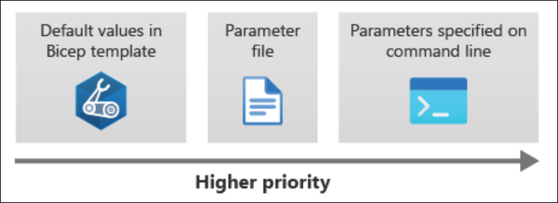
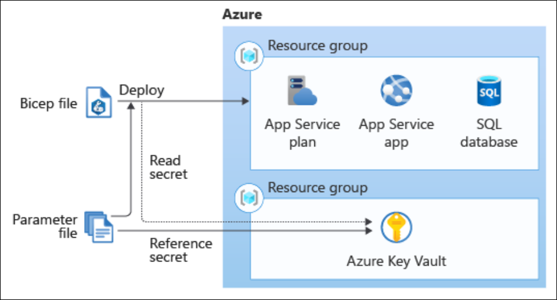

[Microsoft Learn - Build reusable Bicep files by using parameters](https://learn.microsoft.com/en-us/training/modules/build-reusable-bicep-files-parameters/)

<!-- omit in toc -->
# Learning Module 2: Build reusable Bicep files by using parameters
- [Understand parameters](#understand-parameters)
  - [Declare a parameter](#declare-a-parameter)
  - [Add a default value](#add-a-default-value)
  - [Understand parameter types](#understand-parameter-types)
    - [Objects](#objects)
    - [Arrays](#arrays)
  - [Specify a list of allowed values](#specify-a-list-of-allowed-values)
  - [Restrict parameter length and values](#restrict-parameter-length-and-values)
  - [Add descriptions to parameters](#add-descriptions-to-parameters)
- [Exercise - Add parameters and decorators](#exercise---add-parameters-and-decorators)
  - [Add parameter descriptions](#add-parameter-descriptions)
  - [Limit input values](#limit-input-values)
  - [Limit input lengths](#limit-input-lengths)
  - [Limit numeric values](#limit-numeric-values)
  - [Run the deployment](#run-the-deployment)
- [Provide values using parameter files](#provide-values-using-parameter-files)
  - [Create parameter files](#create-parameter-files)
  - [Use parameter files at deployment time](#use-parameter-files-at-deployment-time)
  - [Override parameter values](#override-parameter-values)
- [Secure your parameters](#secure-your-parameters)
  - [Define secure parameters](#define-secure-parameters)
  - [Avoid using parameter files for secrets](#avoid-using-parameter-files-for-secrets)
  - [Integrate with Azure Key Vault](#integrate-with-azure-key-vault)
  - [Use Key Vault with modules](#use-key-vault-with-modules)
    - [Exercise - Add a parameter file and secure parameters](#exercise---add-a-parameter-file-and-secure-parameters)


## Understand parameters

You can use parameters to pass information into a Bicep template when you deploy it. This makes your template more flexible and reusable, since it can work with different values each time it's used.

Decorators let you add rules and extra details to parameters—like limits or helpful descriptions—so that anyone using the template knows exactly what kind of input is expected.

### Declare a parameter

Use the `param` keyword to declare a parameter:

```bicep
param environmentName string
```

Parts:
- `param` is the keyword to declare a parameter.
- `environmentName` is the name of the parameter. Parameter names must be unique; they can't have the same name as a variable or resource in the same Bicep file.
- `string` is the type of the parameter. Other types include `int`, `bool`, `array`, and `object`.

### Add a default value

You can provide a default value for a parameter, which is used if no value is provided during deployment:

```bicep
param environmentName string = 'dev'
```

You can also use expressions to set a default value:

```bicep
param location string = resourceGroup().location
```

### Understand parameter types

Bicep supports several parameter types, including:
- `string`: A sequence of characters, like text.
- `int`: An integer number, like 42.
- `bool`: A boolean value, which can be either `true` or `false`.
- `object` and `array`: Represent structured data and lists.

#### Objects

An `object` is a collection of key-value pairs, similar to a dictionary or JSON object. You can define an object parameter like this:

```bicep
param appServicePlanSku object = {
  name: 'F1'
  tier: 'Free'
  capacity: 1
}
```

When you reference this parameter in a template, you can access its properties using dot notation:

```bicep
resource appServicePlan 'Microsoft.Web/serverfarms@2024-04-01' = {
  name: appServicePlanName
  location: location
  sku: {
    name: appServicePlanSku.name                // Reference the name property of the appServicePlanSku object
    tier: appServicePlanSku.tier
    capacity: appServicePlanSku.capacity
  }
}
```

You  also use parameters to specify resource tags:

```bicep
param resourceTags object = {
  EnvironmentName: 'Test'
  CostCenter: '1000100'
  Team: 'Human Resources'
}
```

Then you can reuse it whereever you defin the `tags` property:

```bicep
resource appServicePlan 'Microsoft.Web/serverfarms@2024-04-01' = {
  name: appServicePlanName
  location: location
  tags: resourceTags            // Use the resourceTags parameter
  sku: {
    name: 'S1'
  }
}

resource appServiceApp 'Microsoft.Web/sites@' = {
  name: appServiceAppName
  location: location
  tags: resourceTags
  kind: 'app'
  properties: {
    serverFarmId: appServicePlan.id
  }
}
```

#### Arrays

An array is a list of items. In Bicep, you can't specify the type of individual items in an array. 

You can create an array parameter like this:

```bicep
param cosmosDBAccountLocations array = [
  {
    locationName: 'australiaeast'
  }
  {
    locationName: 'southcentralus'
  }
  {
    locationName: 'westeurope'
  }
]
```

You can then use this array parameter to define resources in your Bicep file:

```bicep
resource account 'Microsoft.DocumentDB/databaseAccounts@2024-11-15' = {
  name: accountName
  location: location
  properties: {
    locations: cosmosDBAccountLocations             // Use the cosmosDBAccountLocations array parameter
  }
}
```

### Specify a list of allowed values

You can use the `@allowed` decorator to specify a list of allowed values for a parameter. This helps ensure that only valid values are used when deploying the Bicep file.

```bicep
@allowed([
  'P1v3'
  'P2v3'
  'P3v3'
])
param appServicePlanSkuName string
```

### Restrict parameter length and values

You can use the `@minLength` and `@maxLength` decorators to restrict the length of a string parameter:

```bicep
@minLength(5)
@maxLength(24)
param storageAccountName string
```

You can also use the `@minValue` and `@maxValue` decorators to restrict the range of an integer parameter:

```bicep
@minValue(1)
@maxValue(10)
param appServicePlanInstanceCount int
```

### Add descriptions to parameters

You can add descriptions to parameters to provide more context for users:

```bicep
@description('The locations into which this Cosmos DB account should be configured. This parameter needs to be a list of objects, each of which has a locationName property.')
param cosmosDBAccountLocations array
```

## Exercise - Add parameters and decorators

Create a new Bicep file called `main.bicep` with the following content:

[main.bicep](LP1%20-%20Fundamentals/LM2/main.bicep)
```bicep
param environmentName string = 'dev'
param solutionName string = 'toyhr${uniqueString(resourceGroup().id)}'      // Use uniqueString to create globally unique resource names
param appServicePlanInstanceCount int = 1
param appServicePlanSku object = {
  name: 'F1'
  tier: 'Free'
}
param location string = 'eastus'

var appServicePlanName = '${environmentName}-${solutionName}-plan'
var appServiceAppName = '${environmentName}-${solutionName}-app'
```

Then introduce the following code to the file:

[main.bicep](LP1%20-%20Fundamentals/LM2/main.bicep)
```bicep
resource appServicePlan 'Microsoft.Web/serverfarms@2024-04-01' = {
  name: appServicePlanName
  location: location                                    // Note use of the location parameter
  sku: {
    name: appServicePlanSku.name                        // Reference the appServicePlanSku object parameter
    tier: appServicePlanSku.tier
    capacity: appServicePlanInstanceCount
  }
}

resource appServiceApp 'Microsoft.Web/sites@2024-04-01' = {
  name: appServiceAppName
  location: location
  properties: {
    serverFarmId: appServicePlan.id
    httpsOnly: true
  }
}
```

### Add parameter descriptions

Add descriptions to the parameters to provide more context for users:

[main.bicep](LP1%20-%20Fundamentals/LM2/main.bicep)
```bicep
@description('The name of the environment. This must be dev, test, or prod.')
param environmentName string = 'dev'

@description('The unique name of the solution. This is used to ensure that resource names are unique.')
param solutionName string = 'toyhr${uniqueString(resourceGroup().id)}'

@description('The number of App Service plan instances.')
param appServicePlanInstanceCount int = 1

@description('The name and tier of the App Service plan SKU.')
param appServicePlanSku object = {
  name: 'F1'
  tier: 'Free'
}

@description('The Azure region into which the resources should be deployed.')
param location string = 'eastus'
```

### Limit input values

You can use the `@allowed` decorator to limit the values that can be used for a parameter:

[main.bicep](LP1%20-%20Fundamentals/LM2/main.bicep)
```bicep
@description('The name of the environment. This must be dev, test, or prod.')
@allowed([
  'dev'
  'test'
  'prod'
])
param environmentName string = 'dev'
```

### Limit input lengths

You can use the `@minLength` and `@maxLength` decorators to limit the length of a string parameter:

[main.bicep](LP1%20-%20Fundamentals/LM2/main.bicep)
```bicep
@description('The unique name of the solution. This is used to ensure that resource names are unique.')
@minLength(5)
@maxLength(30)
param solutionName string = 'toyhr${uniqueString(resourceGroup().id)}'
```

### Limit numeric values

You can use the `@minValue` and `@maxValue` decorators to limit the range of an integer parameter:

[main.bicep](LP1%20-%20Fundamentals/LM2/main.bicep)
```bicep
@description('The number of App Service plan instances.')
@minValue(1)
@maxValue(10)
param appServicePlanInstanceCount int = 1
```

### Run the deployment

```pwsh
New-AzResourceGroup -Name BicepDeployment -Location eastu
Set-AzDefault -ResourceGroupName BicepDeployment

New-AzResourceGroupDeployment -Name main -TemplateFile main.bicep

DeploymentName          : main
ResourceGroupName       : BicepDeployment
ProvisioningState       : Succeeded
Timestamp               : 8/1/2025 9:36:45 AM
Mode                    : Incremental
TemplateLink            : 
Parameters              : 
                          Name                           Type                       Value
                          =============================  =========================  ==========
                          environmentName                String                     "dev"
                          solutionName                   String                     "toyhrfce5rpzidzts4"
                          appServicePlanInstanceCount    Int                        1
                          appServicePlanSku              Object                     {"name":"F1","tier":"Free"}
                          location                       String                     "eastus"

Outputs                 : 
DeploymentDebugLogLevel : 
```

## Provide values using parameter files

### Create parameter files

Parameter files let you group and define values for your Bicep template's parameters. 

These files can use the `.bicepparam` extension or be in JSON format. 

Example JSON parameter file:

```json
{
  "$schema": "https://schema.management.azure.com/schemas/2019-04-01/deploymentParameters.json#",
  "contentVersion": "1.0.0.0",
  "parameters": {
    "appServicePlanInstanceCount": {
      "value": 3
    },
    "appServicePlanSku": {
      "value": {
        "name": "P1v3",
        "tier": "PremiumV3"
      }
    },
    "cosmosDBAccountLocations": {
      "value": [
        {
          "locationName": "australiaeast"
        },
        {
          "locationName": "southcentralus"
        },
        {
          "locationName": "westeurope"
        }
      ]
    }
  }
}
```
Here's a breakdown of the key parts of a parameters file:

* `$schema` tells Azure Resource Manager that the file is a parameters file.
* `contentVersion` helps track changes to the file. It's optional and usually set to "1.0.0.0".
* `parameters` lists each parameter and its value. Each parameter is defined as an object with a **value** property that holds the actual value to use.

It's common to create a separate parameters file for each environment. A good practice is to include the environment name in the file name. For example:

* `main.parameters.dev.json` for development
* `main.parameters.production.json` for production

### Use parameter files at deployment time

When using the `New-AzResourceGroupDeployment` cmdlet to start a new deployment, you can specify the parameters file with the `-TemplateParameterFile` argument.

```pwsh
New-AzResourceGroupDeployment -Name main -TemplateFile main.bicep -TemplateParameterFile main.parameters.json
```

### Override parameter values

There are three ways to set parameter values: default values, command-line input, and parameters files. It's common to use more than one method for the same parameter. 

If you define a default value but provide a different one through the command line, the command-line value overrides the default. 

Parameters files also follow this order of precedence:



The following Bicep file defines three parameters with default values:

```bicep
param location string = resourceGroup().location
param appServicePlanInstanceCount int = 1
param appServicePlanSku object = {
  name: 'F1'
  tier: 'Free'
}
```

The following parameters file overrides the value of two of the parameters but doesn't specify a value for the `location` parameter:

```json
{
  "$schema": "https://schema.management.azure.com/schemas/2019-04-01/deploymentParameters.json#",
  "contentVersion": "1.0.0.0",
  "parameters": {
    "appServicePlanInstanceCount": {                // Override the default value of appServicePlanInstanceCount
      "value": 3
    },
    "appServicePlanSku": {                          // Override the default value of appServicePlanSku
      "value": {
        "name": "P1v3",
        "tier": "PremiumV3"
      }
    }
  }
}
```

When you create the deployment, you override one of the parameter values:

```pwsh
New-AzResourceGroupDeployment `
  -Name main ` 
  -TemplateFile main.bicep `
  -TemplateParameterFile main.parameters.json `
  -appServicePlanInstanceCount 5                    # Override the appServicePlanInstanceCount parameter
```

## Secure your parameters

Sometimes deployments require sensitive values, like passwords or API keys. These need to be protected. 

In some cases, the person running the deployment shouldn't see the secrets. In others, they may enter the values, but those values must not be logged. 

### Define secure parameters

The `@secure` decorator is used for string and object parameters that may contain secrets. When a parameter is marked as `@secure`, its value won't appear in deployment logs. If you're entering the value interactively through Azure CLI or PowerShell, it also won't be shown on the screen.

```bicep
@secure()
param sqlServerAdministratorLogin string

@secure()
param sqlServerAdministratorPassword string
```
Neither parameter has a default value, which is intentional. It's best not to set defaults for usernames, passwords, or other secrets. 

### Avoid using parameter files for secrets

As covered earlier, parameter files are useful for setting values for different environments. However, you should avoid using them to store secrets. These files are often checked into version control systems like Git, which may be accessible to many people. Version control isn't meant for storing sensitive information, so keeping secrets out of these files is important for security.

### Integrate with Azure Key Vault

Azure Key Vault is built to store and manage secrets securely. You can connect your Bicep templates to Key Vault by referencing secrets in a parameters file.

Instead of storing the actual value, you reference the Key Vault and the secret name. This keeps the secret hidden. During deployment, Azure Resource Manager retrieves the secret directly from Key Vault.



Here's an example of a parameters file that uses Key Vault references to retrieve the SQL logical server admin login and password:

```json
{
  "$schema": "https://schema.management.azure.com/schemas/2019-04-01/deploymentParameters.json#",
  "contentVersion": "1.0.0.0",
  "parameters": {
    "sqlServerAdministratorLogin": {
      "reference": {                        // Uses reference object instead of value
        "keyVault": {
          "id": "/subscriptions/f0750bbe-ea75-4ae5-b24d-a92ca601da2c/resourceGroups/PlatformResources/providers/Microsoft.KeyVault/vaults/toysecrets"
        },
        "secretName": "sqlAdminLogin"
      }
    },
    "sqlServerAdministratorPassword": {
      "reference": {
        "keyVault": {
          "id": "/subscriptions/f0750bbe-ea75-4ae5-b24d-a92ca601da2c/resourceGroups/PlatformResources/providers/Microsoft.KeyVault/vaults/toysecrets"
        },
        "secretName": "sqlAdminLoginPassword"
      }
    }
  }
}
```

### Use Key Vault with modules

Modules let you reuse Bicep files to deploy specific parts of your solution. They can take parameters, including secrets. To pass secret values securely, you can use Key Vault integration.

```bicep
resource keyVault 'Microsoft.KeyVault/vaults@2023-07-01' existing = {       // Use of existing keyword to tell Bicep this Key Vault already exists and not to redeploy it
  name: keyVaultName
}

module applicationModule 'application.bicep' = {
  name: 'application-module'
  params: {
    apiKey: keyVault.getSecret('ApiKey')                                    // Use the getSecret() function to retrieve the secret value from Key Vault
  }
}
```

#### Exercise - Add a parameter file and secure parameters
