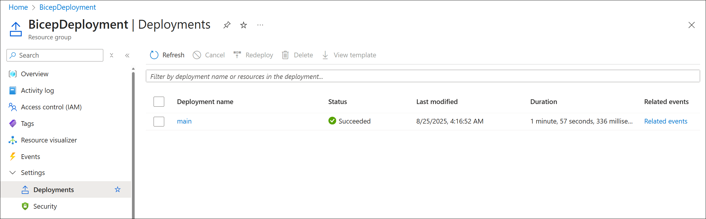
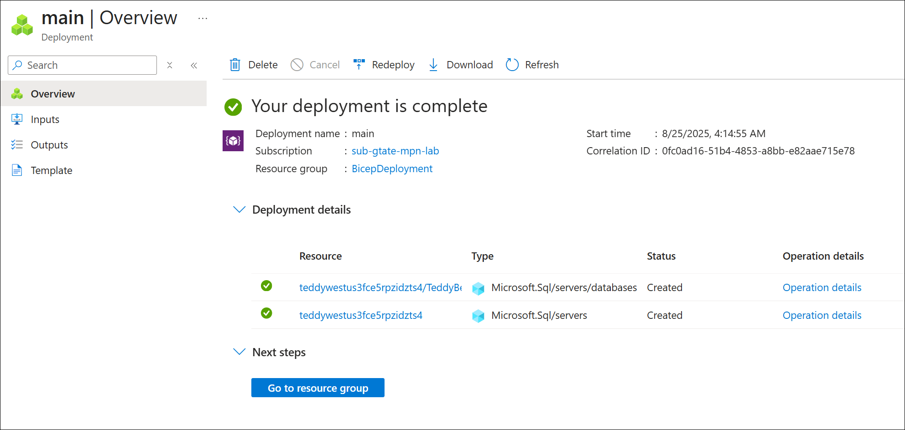
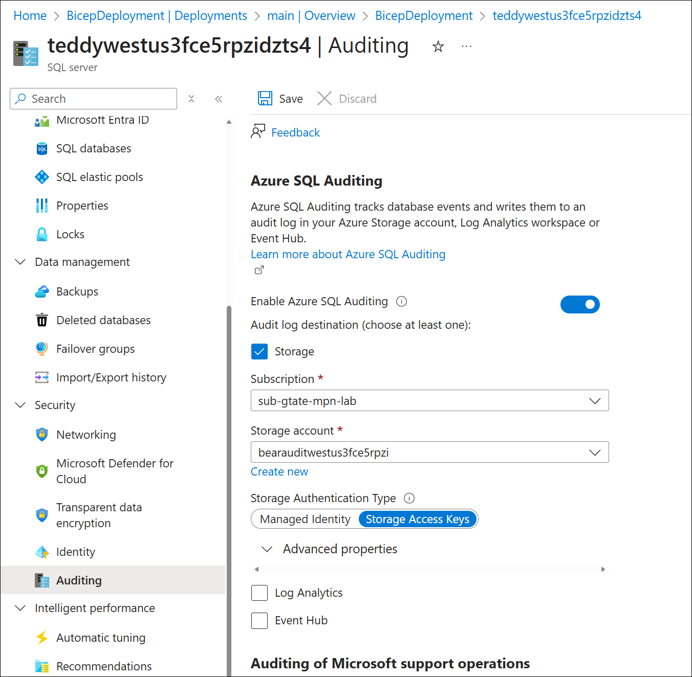
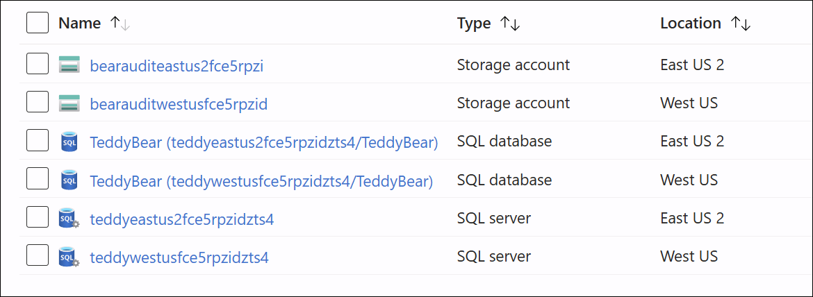
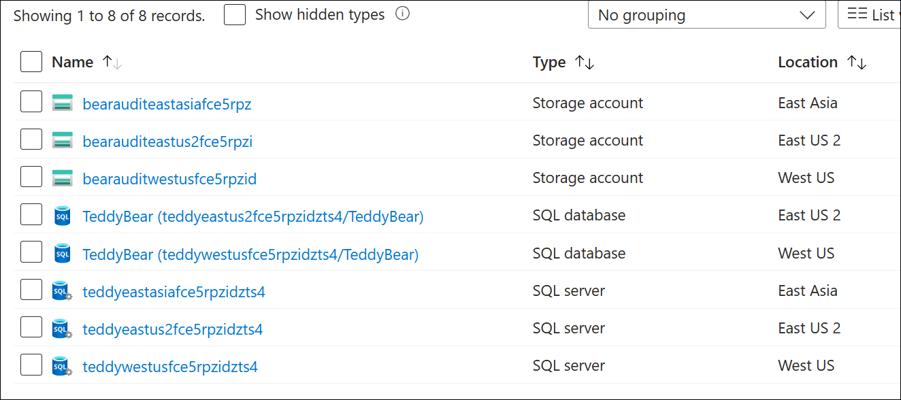

[Build flexible Bicep files by using conditions and loops](https://learn.microsoft.com/en-us/training/modules/build-flexible-bicep-files-conditions-loops/)

<!-- omit in toc -->
# Learning Module 3: Build flexible Bicep files by using conditions and loops
- [Introduction](#introduction)
  - [Example scenario](#example-scenario)
  - [What we will learn?](#what-we-will-learn)
  - [What is the main goal?](#what-is-the-main-goal)
- [Deploy resources conditionally](#deploy-resources-conditionally)
  - [Use basic conditions](#use-basic-conditions)
  - [Use expressions as conditions](#use-expressions-as-conditions)
  - [Depend on condtionally deployed resources](#depend-on-condtionally-deployed-resources)
- [Exercise - Deploy resources conditionally](#exercise---deploy-resources-conditionally)
  - [Create a Bicep file that defines a logical server and database](#create-a-bicep-file-that-defines-a-logical-server-and-database)
  - [Add a storage account](#add-a-storage-account)
  - [Add auditing settings](#add-auditing-settings)
  - [Deploy the Bicep file to Azure (Development environment)](#deploy-the-bicep-file-to-azure-development-environment)
  - [Verify the deployment](#verify-the-deployment)
  - [Redeploy for the production environment](#redeploy-for-the-production-environment)
  - [Verify the production deployment](#verify-the-production-deployment)
- [Deploy multiple resources by using loops](#deploy-multiple-resources-by-using-loops)
  - [Use copy loops](#use-copy-loops)
  - [Loop based on a count](#loop-based-on-a-count)
  - [Access the iteration index](#access-the-iteration-index)
  - [Filter items with loops](#filter-items-with-loops)
- [Exercise - Deploy multiple resources by using loops](#exercise---deploy-multiple-resources-by-using-loops)
  - [Mmove resources into a module](#mmove-resources-into-a-module)
  - [Deply multiple instances by using a copy loop](#deply-multiple-instances-by-using-a-copy-loop)
  - [Deploy the Bicep file to Azure](#deploy-the-bicep-file-to-azure)
  - [Verify the deployment](#verify-the-deployment-1)
  - [Update and redeploy the Bicep file with an additional location](#update-and-redeploy-the-bicep-file-with-an-additional-location)
  - [Verify the deployment](#verify-the-deployment-2)
- [Control loop execution and nest loops](#control-loop-execution-and-nest-loops)


## Introduction

When working with Bicep files, you can use conditions and loops to make deployments more flexible. Conditions let you deploy resources only when certain requirements are met. Loops allow you to deploy multiple resources that share similar settings.

### Example scenario

You’re responsible for deploying and configuring Azure infrastructure for a toy company. The company is launching a new smart teddy bear, which relies on back-end server components and SQL databases hosted in Azure.

For production environments, you must ensure auditing is enabled on all Azure SQL logical servers to meet security requirements.

Because the toy will launch in multiple countries/regions, each location needs its own database server and virtual network. Resources must be deployed in specific regions to comply with local laws. You’ve been tasked with deploying these logical servers and virtual networks and making the process scalable, so new ones can be added easily as the product expands to more countries/regions.

 

### What we will learn?

In this module, you'll extend a Bicep file by using conditions and loops. You'll:

- Use conditions to deploy Azure resources only when they're required.
- Use loops to deploy multiple instances of Azure resources.
- Learn how to control loop parallelism.
- Learn how to create nested loops.
- Combine loops with variables and outputs.

### What is the main goal?

By the end of this module, you'll be able to create Bicep files by using conditions and loops, and write Bicep code that configures how loops are executed. You'll also be able to create variable loops and output loops to make your files even more flexible.

## Deploy resources conditionally

You can use conditions in Bicep to deploy resources only when certain requirements are met.

For example, your toy company needs to deploy resources to multiple environments. In production, auditing must be enabled for Azure SQL logical servers. In development, auditing should remain disabled. Instead of using separate files, you can handle both cases with a single Bicep file.

This unit shows you how to deploy resources conditionally.

### Use basic conditions

In Bicep, you can use the `if` keyword with a condition when deploying a resource. The condition must evaluate to either true or false. If true, the resource is deployed; if false, it isn’t.

Conditions are often based on parameter values. For example, this code deploys a storage account only if the `deployStorageAccount` parameter is set to true:

```bicep
param deployStorageAccount bool

resource storageAccount 'Microsoft.Storage/storageAccounts@2023-05-01' = if (deployStorageAccount) {
  name: 'teddybearstorage'
  location: resourceGroup().location
  kind: 'StorageV2'
  // ...
}
```

The `if` keyword must be placed on the same line as the resource definition.

### Use expressions as conditions

The earlier example used a Boolean parameter, making the condition straightforward. But in Bicep, conditions can also use expressions.

For example, this code deploys a SQL auditing resource only when the `environmentName` parameter is set to `Production`:

```bicep
@allowed([
  'Development'
  'Production'
])
param environmentName string

resource auditingSettings 'Microsoft.Sql/servers/auditingSettings@2024-05-01-preview' = if (environmentName == 'Production') {
  parent: server
  name: 'default'
  properties: {
  }
}
```

To make your Bicep file easier to read, it’s often better to assign the expression to a variable and use that in the condition:

```bicep
@allowed([
  'Development'
  'Production'
])
param environmentName string

var auditingEnabled = environmentName == 'Production'           // Using an expression to set a variable

resource auditingSettings 'Microsoft.Sql/servers/auditingSettings@2024-05-01-preview' = if (auditingEnabled) {
  parent: server
  name: 'default'
  properties: {
  }
}
```

### Depend on condtionally deployed resources

When deploying conditionally, be mindful of how Bicep/ARM evaluate dependencies.

Here’s a SQL auditing setup that also declares a storage account, both gated by the same condition:

```bicep
@allowed([
  'Development'
  'Production'
])
param environmentName string
param location string = resourceGroup().location
param auditStorageAccountName string = 'bearaudit${uniqueString(resourceGroup().id)}'

var auditingEnabled = environmentName == 'Production'
var storageAccountSkuName = 'Standard_LRS'

// Conditionally deploy the storage account only if auditing is enabled
resource auditStorageAccount 'Microsoft.Storage/storageAccounts@2023-05-01' = if (auditingEnabled) {
  name: auditStorageAccountName
  location: location
  sku: {
    name: storageAccountSkuName
  }
  kind: 'StorageV2'
}

// Conditionally deploy the auditing settings only if auditing is enabled
resource auditingSettings 'Microsoft.Sql/servers/auditingSettings@2024-05-01-preview' = if (auditingEnabled) {
  parent: server
  name: 'default'
  properties: {
  }
}
```

You can then reference the storage account safely using conditional expressions:

```bicep
resource auditingSettings 'Microsoft.Sql/servers/auditingSettings@2024-05-01-preview' = if (auditingEnabled) {
  parent: server
  name: 'default'
  properties: {
    state: 'Enabled'
    // The ternaries below are evaluated before the 'if' conditions in the resource statement.
    storageEndpoint: environmentName == 'Production' ? auditStorageAccount.properties.primaryEndpoints.blob : ''
    storageAccountAccessKey: environmentName == 'Production' ? listKeys(auditStorageAccount.id, auditStorageAccount.apiVersion).keys[0].value : ''
  }
}
```

**IMPORTANT:** Azure Resource Manager evaluates property expressions before it evaluates resource `if` conditions. Without the ternaries, references to `auditStorageAccount` would be resolved even in non‑production, causing `ResourceNotFound`.

You can’t define two resources with the same name in one Bicep file and conditionally pick one; that’s a conflict. If many resources share the same condition, put them in a module and apply the condition to the module in the main file.

## Exercise - Deploy resources conditionally

Deploy resources to multiple environments by using parameters and conditions.

In this exercise, you’ll create an Azure SQL logical server and database. You’ll add auditing settings that are enabled only in production. You’ll also deploy a storage account solely for production to support auditing.

You will:
- Create a Bicep file that defines a logical server and database.
- Add a storage account and SQL auditing settings, each guarded by a condition.
- Deploy to the development environment and verify the result.
- Redeploy to production and review the changes.

### Create a Bicep file that defines a logical server and database

Open Visual Studio Code and create a file named `main.bicep`.

Add the following content to define a logical server and database, along with the needed parameters and variables:

```bicep
@description('The Azure region into which the resources should be deployed.')
param location string

@secure()
@description('The administrator login username for the SQL server.')
param sqlServerAdministratorLogin string

@secure()
@description('The administrator login password for the SQL server.')
param sqlServerAdministratorLoginPassword string

@description('The name and tier of the SQL database SKU.')
param sqlDatabaseSku object = {
  name: 'Standard'
  tier: 'Standard'
}

var sqlServerName = 'teddy${location}${uniqueString(resourceGroup().id)}'
var sqlDatabaseName = 'TeddyBear'

resource sqlServer 'Microsoft.Sql/servers@2024-05-01-preview' = {
  name: sqlServerName
  location: location
  properties: {
    administratorLogin: sqlServerAdministratorLogin
    administratorLoginPassword: sqlServerAdministratorLoginPassword
  }
}

resource sqlDatabase 'Microsoft.Sql/servers/databases@2024-05-01-preview' = {
  parent: sqlServer
  name: sqlDatabaseName
  location: location
  sku: sqlDatabaseSku
}
```
Each parameter includes a `@description` to make them easier to understand in tooling. The `@secure` decorator on the login and password ensures these values are treated as sensitive, so they won’t be printed in logs.

### Add a storage account

Update your `main.bicep` file so the auditing storage account is created only when auditing is enabled.

Add these parameters below the existing parameter declarations:

```bicep
@description('The name of the environment. This must be Development or Production.')
@allowed([
  'Development'
  'Production'
])
param environmentName string = 'Development'

@description('The name of the audit storage account SKU.')
param auditStorageAccountSkuName string = 'Standard_LRS'
```

Add these variables below the variable declarations:

```bicep
var auditingEnabled = environmentName == 'Production'
var auditStorageAccountName = take('bearaudit${location}${uniqueString(resourceGroup().id)}', 24)
```

The `auditingEnabled` variable makes the condition easy to read. The `take()` function ensures the storage account name stays within the 24-character limit.

Finally, add this resource at the bottom of the file, after the other resources:

```bicep
resource auditStorageAccount 'Microsoft.Storage/storageAccounts@2023-05-01' = if (auditingEnabled) {
  name: auditStorageAccountName
  location: location
  sku: {
    name: auditStorageAccountSkuName
  }
  kind: 'StorageV2'
}
```
This resource uses the `if` keyword so it is deployed only in production.

### Add auditing settings

Add the SQL auditing settings resource just below the storage account definition:

```bicep
resource sqlServerAudit 'Microsoft.Sql/servers/auditingSettings@2024-05-01-preview' = if (auditingEnabled) {
  parent: sqlServer
  name: 'default'
  properties: {
    state: 'Enabled'
    storageEndpoint: environmentName == 'Production' ? auditStorageAccount.properties.primaryEndpoints.blob : ''
    storageAccountAccessKey: environmentName == 'Production' ? auditStorageAccount.listKeys().keys[0].value : ''
  }
}
```

This resource uses the same `if` condition as the storage account. The ternary operator (`? :`) ensures `storageEndpoint` and `storageAccountAccessKey` resolve to safe values. Without these expressions, ARM would try to evaluate the storage account properties even when the resource isn’t deployed, causing errors.

### Deploy the Bicep file to Azure (Development environment)

In the Visual Studio Code terminal, run the following command to deploy your `main.bicep` file:

```pwsh
> Set-AzDefault -ResourceGroupName BicepDeployment

Id         : /subscriptions/e091f6e7-031a-4924-97bb-8c983ca5d21a/resourceGroups/BicepDeployment
Name       : BicepDeployment
Properties : Microsoft.Azure.Management.Internal.Resources.Models.ResourceGroupProperties
Location   : westus
ManagedBy  : 
Tags       : 
```

You’ll be prompted to enter values for `sqlServerAdministratorLogin` and `sqlServerAdministratorLoginPassword`.

Keep in mind:

* `sqlServerAdministratorLogin` must start with a letter, contain only alphanumeric characters, and cannot be common names like `admin` or `root`.
* `sqlServerAdministratorLoginPassword` must be at least 8 characters and include uppercase, lowercase, numbers, and symbols.

If the values don’t meet these rules, the SQL server won’t deploy. Be sure to record the login and password you use — you’ll need them later.

Since you didn’t specify a value for `environmentName`, the deployment will default to `Development`, so no auditing resources or storage account will be created.

Wait for the deployment to complete. If you receive an error that the chosen region isn’t accepting new SQL servers, try another region such as `eastus` or `eastus2`.

```pwsh
> New-AzResourceGroupDeployment -Name main -TemplateFile .\main.bicep -location westus3

cmdlet New-AzResourceGroupDeployment at command pipeline position 1
Supply values for the following parameters:
(Type !? for Help.)
sqlServerAdministratorLogin: ********
sqlServerAdministratorLoginPassword: ********************

DeploymentName          : main
ResourceGroupName       : BicepDeployment
ProvisioningState       : Succeeded
Timestamp               : 8/25/2025 9:16:52 AM
Mode                    : Incremental
TemplateLink            : 
Parameters              : 
                          Name                                   Type                       Value
                          =====================================  =========================  ==========
                          location                               String                     "westus3"
                          sqlServerAdministratorLogin            SecureString               null
                          sqlServerAdministratorLoginPassword    SecureString               null
                          sqlDatabaseSku                         Object                     {"name":"Standard","tier":"Standard"}
                          environmentName                        String                     "Development"
                          auditStorageAccountSkuName             String                     "Standard_LRS"

Outputs                 : 
DeploymentDebugLogLevel : 
```

### Verify the deployment

In the Azure portal, confirm what was deployed. Note: only the development environment was deployed, so auditing resources and the storage account won’t be present.

 

In the **Overview** pane, you’ll see:

* **1 deployment succeeded**.
* A logical server and SQL database are present.
* No storage account for auditing (the one starting with `cloudshell` is unrelated — it’s created by the sandbox).

Select **1 Succeeded** next to *Deployments*.

* Pick the deployment named **main**.
* Open **Deployment details** to view the resources created.

You’ll see only the SQL server and database. The storage account and auditing settings don’t appear because the deployment used the default environment of **Development**.

 

Keep this page open; you’ll revisit it after deploying to production.

### Redeploy for the production environment

This time, set the `environmentName` parameter explicitly to `Production` so that the storage account and auditing settings are deployed.

```bicep
@description('The name of the environment. This must be Development or Production.')
@allowed([
  'Development'
  'Production'
])
param environmentName string = 'Production'
```

In the Visual Studio Code terminal, run:

```powershell
New-AzResourceGroupDeployment -Name main -TemplateFile main.bicep -environmentName Production -location westus3
```

**Important:** Use the same `sqlServerAdministratorLogin` and `sqlServerAdministratorLoginPassword` values you entered in the earlier deployment. If you change them, the deployment won’t complete.

After a few minutes, the deployment should succeed. At this point, you’ll have the logical server, SQL database, auditing settings, and the audit storage account deployed.

```pwsh
> New-AzResourceGroupDeployment -Name main -TemplateFile .\main.bicep -location westus3

cmdlet New-AzResourceGroupDeployment at command pipeline position 1
Supply values for the following parameters:
(Type !? for Help.)
sqlServerAdministratorLogin: ********
sqlServerAdministratorLoginPassword: ********************

DeploymentName          : main
ResourceGroupName       : BicepDeployment
ProvisioningState       : Succeeded
Timestamp               : 8/25/2025 9:23:11 AM
Mode                    : Incremental
TemplateLink            : 
Parameters              : 
                          Name                                   Type                       Value
                          =====================================  =========================  ==========
                          location                               String                     "westus3"
                          sqlServerAdministratorLogin            SecureString               null
                          sqlServerAdministratorLoginPassword    SecureString               null
                          sqlDatabaseSku                         Object                     {"name":"Standard","tier":"Standard"}
                          environmentName                        String                     "Production"
                          auditStorageAccountSkuName             String                     "Standard_LRS"

Outputs                 : 
DeploymentDebugLogLevel : 
```

### Verify the production deployment

Go back to the Azure portal and open your sandbox resource group. If it’s already open, select **Refresh**.

You should now see an extra **storage account** created for auditing.

Next:

1. In the resource list, select your **SQL server** (type: *SQL server*).
2. Use the **Search** box to look for *Auditing*.
3. Under **Security**, select **Auditing**.

Confirm that **auditing is enabled** for this logical server.

 

This verifies that the redeployment with `environmentName = Production` successfully added the audit storage account and turned on auditing.

## Deploy multiple resources by using loops

When you need to deploy several similar resources, you can use loops in Bicep to avoid repeating resource definitions. Loops let you specify how many instances to create and allow you to customize properties for each one.

In your toy company scenario, you need back-end infrastructure to support the smart teddy bear launch. A dedicated SQL logical server must be deployed in every country or region where the toy is sold, so that local data-protection laws are met.

All servers share the same configuration except for their deployment location. By using a parameter for regions and a loop in Bicep, you can create multiple logical servers dynamically.

In this unit, you’ll learn how to use copy loops to deploy multiple resource instances.

### Use copy loops

You can use the `for` keyword in a resource or module declaration to create multiple instances of the same resource. Usually, you loop over an array of values or objects.

Here’s an example that deploys several storage accounts based on parameter values:

```bicep
param storageAccountNames array = [
  'saauditus'
  'saauditeurope'
  'saauditapac'
]

resource storageAccountResources 'Microsoft.Storage/storageAccounts@2023-05-01' = [for storageAccountName in storageAccountNames: {
  name: storageAccountName
  location: resourceGroup().location
  kind: 'StorageV2'
  sku: {
    name: 'Standard_LRS'
  }
}]
```

The loop goes through each item in `storageAccountNames`. On each iteration, the current value is assigned to `storageAccountName`, which is then used for the resource name.

Note the required brackets: `[` before `for` and `]` after the resource definition.

If you deploy this code, three storage accounts are created with names from the array.

### Loop based on a count

Sometimes you need to loop to create a set number of resources without using an existing array. Bicep provides the range() function, which generates an array of numbers.

For example, to create four storage accounts named sa1 through sa4, you could write:

```bicep
resource storageAccountResources 'Microsoft.Storage/storageAccounts@2023-05-01' = [for i in range(1, 4): {
  name: 'sa${i}'
  location: resourceGroup().location
  kind: 'StorageV2'
  sku: {
    name: 'Standard_LRS'
  }
}]
```

The range() function takes two arguments: the starting value and the number of values to generate.

For instance:

* `range(0, 3)` creates `[0, 1, 2]`, so the accounts would be sa0, sa1, and sa2.
* `range(3, 4)` creates `[3, 4, 5, 6]`.

**Note:** Be careful with the second argument—it specifies how many values to return, not the ending value. This is especially important if you start at 0.

### Access the iteration index

In Bicep, you can loop through arrays and access both the element and its index.

For example, if you want to create a logical server in each location from an array, and name them sqlserver-1, sqlserver-2, and so on, you could write:

```bicep
param locations array = [
  'westeurope'
  'eastus2'
  'eastasia'
]

resource sqlServers 'Microsoft.Sql/servers@2024-05-01-preview' = [for (location, i) in locations: {
  name: 'sqlserver-${i+1}'
  location: location
  properties: {
    administratorLogin: administratorLogin
    administratorLoginPassword: administratorLoginPassword
  }
}]
```

Here, the index variable `i` starts at 0. To make server names begin with 1, you add `+1`.

By convention, the index variable is usually named `i`, but you can choose any name you prefer.

### Filter items with loops

You can combine `for` loops with `if` conditions in Bicep to control which resources get deployed.

In the example below, an array parameter defines several logical servers. The loop includes a condition so that only servers with `environmentName` set to `Production` are deployed:

```bicep
param sqlServerDetails array = [
  {
    name: 'sqlserver-we'
    location: 'westeurope'
    environmentName: 'Production'
  }
  {
    name: 'sqlserver-eus2'
    location: 'eastus2'
    environmentName: 'Development'
  }
  {
    name: 'sqlserver-eas'
    location: 'eastasia'
    environmentName: 'Production'
  }
]

resource sqlServers 'Microsoft.Sql/servers@2024-05-01-preview' = [for sqlServer in sqlServerDetails: if (sqlServer.environmentName == 'Production') {
  name: sqlServer.name
  location: sqlServer.location
  properties: {
    administratorLogin: administratorLogin
    administratorLoginPassword: administratorLoginPassword
  }
  tags: {
    environment: sqlServer.environmentName
  }
}]
```

When deployed, this creates `sqlserver-we` and `sqlserver-eas`, but not `sqlserver-eus2`, since that server’s environment is set to `Development` instead of `Production`.

## Exercise - Deploy multiple resources by using loops

Your current Bicep file deploys one Azure SQL logical server with auditing for production. Now you need one server per region where the smart teddy bear is launching.

Extend your existing Bicep to deploy databases across multiple regions.

Do the following:

1. Move the existing Bicep code into a module.
2. Create a new Bicep file that uses a copy loop to deploy the module multiple times.
3. Deploy the new Bicep file and verify the resources.
4. Add another location to the parameter, redeploy, and verify the new resources are created.

### Mmove resources into a module

In Visual Studio Code:

1. In the same folder where your current `main.bicep` file is located, create a new folder named `modules`.
2. Move `main.bicep` into the `modules` folder.
3. Rename `main.bicep` to `database.bicep`.

### Deply multiple instances by using a copy loop

Create a new `main.bicep` file in the root folder (next to the `modules` folder).

Add the parameters and module declaration:

```bicep
@description('The Azure regions into which the resources should be deployed.')
param locations array = [
  'westus'
  'eastus2'
]

@secure()
@description('The administrator login username for the SQL server.')
param sqlServerAdministratorLogin string

@secure()
@description('The administrator login password for the SQL server.')
param sqlServerAdministratorLoginPassword string

module databases 'modules/database.bicep' = [for location in locations: {
  name: 'database-${location}'
  params: {
    location: location
    sqlServerAdministratorLogin: sqlServerAdministratorLogin
    sqlServerAdministratorLoginPassword: sqlServerAdministratorLoginPassword
  }
}]
```

This loops through every location in the `locations` array and deploys the `database.bicep` module for each one.

### Deploy the Bicep file to Azure

In the Visual Studio Code terminal, run:

```powershell
New-AzResourceGroupDeployment -Name main -TemplateFile main.bicep
```

When prompted, enter the same SQL administrator login and password you used before. Using different credentials will cause the deployment to fail.

Wait for the deployment to complete before continuing.

### Verify the deployment

1. In the Azure portal, switch to the sandbox subscription.
2. Open the sandbox resource group.
3. Confirm the new logical server and database exist and are in East US 2 (from the `locations` default).
4. Leave the page open for later verification.

 

### Update and redeploy the Bicep file with an additional location

Update `main.bicep` to include East Asia and redeploy.

Add East Asia to the `locations` parameter:

```bicep
@description('The Azure regions into which the resources should be deployed.')
param locations array = [
  'westus'
  'eastus2'
  'eastasia'
]
```

Save the file, then redeploy from the terminal:

```powershell
New-AzResourceGroupDeployment -Name main -TemplateFile main.bicep
```

Use the same SQL admin login and password you used previously, or the deployment will fail.

### Verify the deployment

After redeploying, confirm the new logical server and database exist in East Asia.
In the Azure portal, open the sandbox resource group. Select Refresh if needed.
Verify both resources show the East Asia region.

```pwsh
> New-AzResourceGroupDeployment -Name main -TemplateFile .\main.bicep 

cmdlet New-AzResourceGroupDeployment at command pipeline position 1
Supply values for the following parameters:
(Type !? for Help.)
sqlServerAdministratorLogin: ********
sqlServerAdministratorLoginPassword: ********************

DeploymentName          : main
ResourceGroupName       : BicepDeployment
ProvisioningState       : Succeeded
Timestamp               : 8/26/2025 9:30:07 AM
Mode                    : Incremental
TemplateLink            : 
Parameters              : 
                          Name                                   Type                       Value
                          =====================================  =========================  ==========
                          locations                              Array                      ["westus","eastus2","eastasia"]
                          sqlServerAdministratorLogin            SecureString               null
                          sqlServerAdministratorLoginPassword    SecureString               null

Outputs                 : 
DeploymentDebugLogLevel : 
```

 

## Control loop execution and nest loops

Copy loops in Bicep let you create resources dynamically and with flexibility. You can control how these loops execute, use them to set resource properties, and even nest them.

In this unit, you'll explore:

* How to manage execution of copy loops
* How to apply loops to resource properties
* How to work with nested loops

Note: The commands shown here are for illustration only. Don’t run them yet—you’ll practice later.
