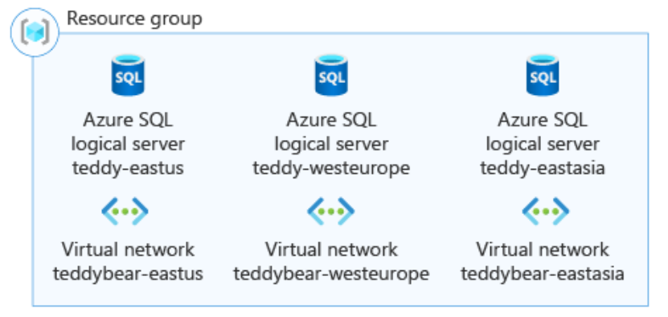

[Build flexible Bicep files by using conditions and loops](https://learn.microsoft.com/en-us/training/modules/build-flexible-bicep-files-conditions-loops/)

<!-- omit in toc -->
# Learning Module 3: Build flexible Bicep files by using conditions and loops
- [Introduction](#introduction)
  - [Example scenario](#example-scenario)

## Introduction

When working with Bicep files, you can use conditions and loops to make deployments more flexible. Conditions let you deploy resources only when certain requirements are met. Loops allow you to deploy multiple resources that share similar settings.

### Example scenario

You’re responsible for deploying and configuring Azure infrastructure for a toy company. The company is launching a new smart teddy bear, which relies on back-end server components and SQL databases hosted in Azure.

For production environments, you must ensure auditing is enabled on all Azure SQL logical servers to meet security requirements.

Because the toy will launch in multiple countries/regions, each location needs its own database server and virtual network. Resources must be deployed in specific regions to comply with local laws. You’ve been tasked with deploying these logical servers and virtual networks and making the process scalable, so new ones can be added easily as the product expands to more countries/regions.

 
