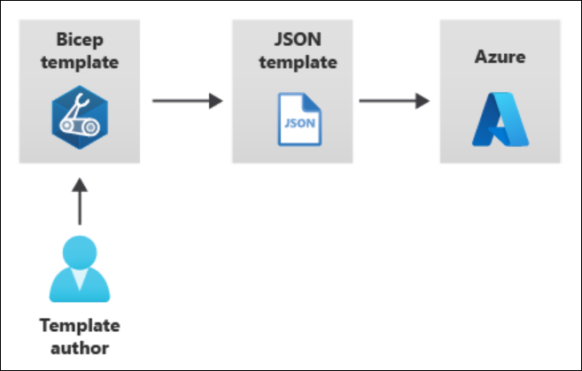
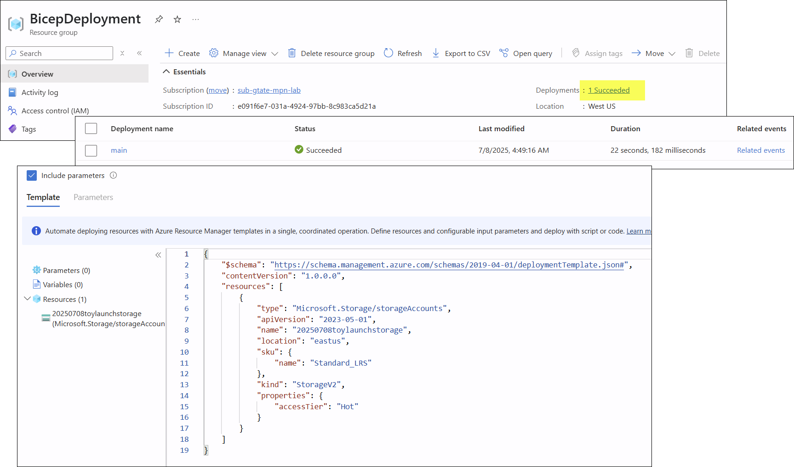
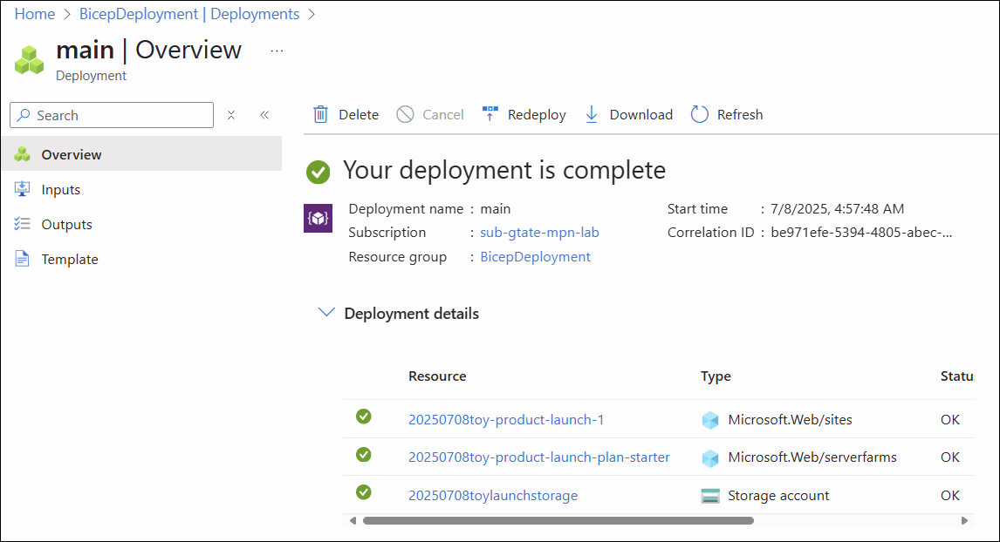
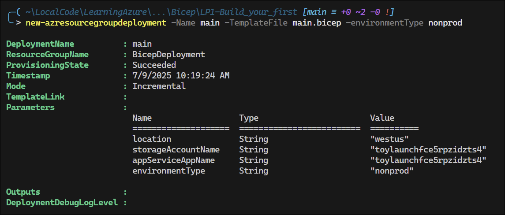
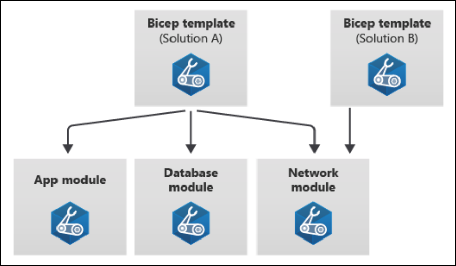
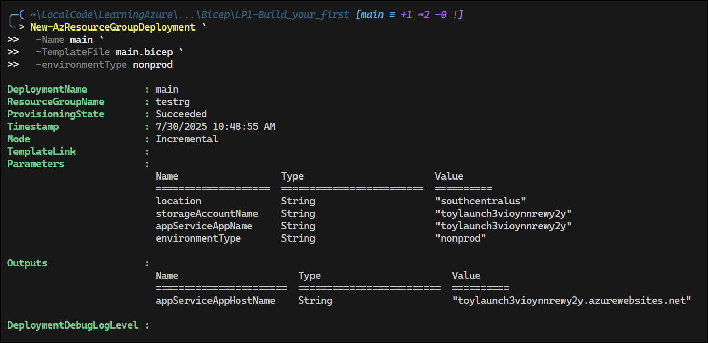
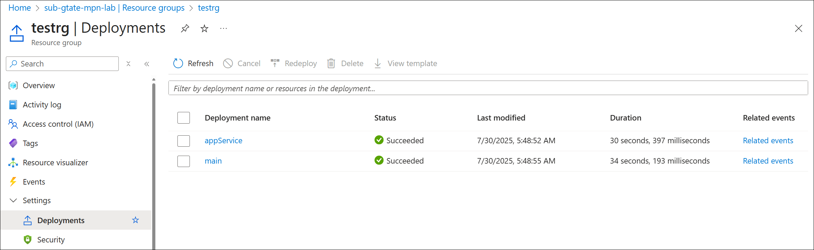

# Azure Bicep

<!-- omit in toc -->
## Contents
- [Bicep Command Reference](#bicep-command-reference)
- [Install the Bicep CLI](#install-the-bicep-cli)
  - [Bicep Quickstart](#bicep-quickstart)
- [Learning Path - Part 1: Fundamentals of Bicep](#learning-path---part-1-fundamentals-of-bicep)
  - [Module: Build your first Bicep file](#module-build-your-first-bicep-file)
    - [Defining resources](#defining-resources)
      - [Resource Dependencies](#resource-dependencies)
    - [Exercise: Define resources in a Bicep file](#exercise-define-resources-in-a-bicep-file)
      - [Add flexibility by using parameters and variables](#add-flexibility-by-using-parameters-and-variables)
      - [Add a parameter](#add-a-parameter)
    - [Exercise: Add parameters and variables to your Bicep file](#exercise-add-parameters-and-variables-to-your-bicep-file)
      - [Add a variable](#add-a-variable)
      - [Expressions](#expressions)
      - [Deploying the updated Bicep file](#deploying-the-updated-bicep-file)
    - [Group related resources by using modules](#group-related-resources-by-using-modules)
      - [Outputs](#outputs)
      - [Define a module](#define-a-module)
      - [Design your modules](#design-your-modules)
    - [Exercise: Refactor your Bicep file to use modules](#exercise-refactor-your-bicep-file-to-use-modules)
      - [Add a new module file](#add-a-new-module-file)
      - [Add a reference to the module in `main.bicep`](#add-a-reference-to-the-module-in-mainbicep)
      - [Add the host name as an output](#add-the-host-name-as-an-output)
      - [Verify your Bicep files](#verify-your-bicep-files)
      - [Deploy the updated Bicep file](#deploy-the-updated-bicep-file)
  - [Module: Build reusable Bicep files by using parameters](#module-build-reusable-bicep-files-by-using-parameters)
    - [Understand parameters](#understand-parameters)
      - [Declare a parameter](#declare-a-parameter)
      - [Add a default value](#add-a-default-value)
      - [Understand parameter types](#understand-parameter-types)
      - [Specify a list of allowed values](#specify-a-list-of-allowed-values)
      - [Restrict parameter length and values](#restrict-parameter-length-and-values)
      - [Add descriptions to parameters](#add-descriptions-to-parameters)
    - [Exercise - Add parameters and decorators](#exercise---add-parameters-and-decorators)
      - [Add parameter descriptions](#add-parameter-descriptions)
      - [Limit input values](#limit-input-values)
      - [Limit input lengths](#limit-input-lengths)
      - [Limit numeric values](#limit-numeric-values)
      - [Run the deployment](#run-the-deployment)
    - [Provide values using parameter files](#provide-values-using-parameter-files)
      - [Create parameter files](#create-parameter-files)
      - [Use parameter files at deployment time](#use-parameter-files-at-deployment-time)
      - [Override parameter values](#override-parameter-values)
    - [Secure your parameters](#secure-your-parameters)
      - [Define secure parameters](#define-secure-parameters)
      - [Avoid using parameter files for secrets](#avoid-using-parameter-files-for-secrets)
      - [Integrate with Azure Key Vault](#integrate-with-azure-key-vault)
      - [Use Key Vault with modules](#use-key-vault-with-modules)


## Bicep Command Reference

```pwsh
New-AzResourceGroupDeployment -ResourceGroupName BicepDeployment -TemplateFile .\main.bicep
```
- [Azure Bicep Documentation](https://learn.microsoft.com/en-us/azure/azure-resource-manager/bicep/)
- [Bicep GitHub Page](https://github.com/Azure/bicep) - Interesting read

## Install the Bicep CLI

Use the following command to install the self-contained version of the Bicep CLI from `az`:

```powershell
az bicep install
Installing Bicep CLI v0.36.1...
The configuration value of bicep.use_binary_from_path has been set to 'false'.
Successfully installed Bicep CLI to "C:\Users\gregt\.azure\bin\bicep.exe".
```

Check version:

```powershell
az bicep version
Bicep CLI version 0.36.1 (a727ed087a)
```

Note the self-contained instance isn't available with PowerShell commnands, so Azure deployments will fail if you haven't manually installed the Bicep CLI.

To manually install the Bicep CLI:

```powershell
winget install bicep
Found Bicep CLI [Microsoft.Bicep] Version 0.36.1
This application is licensed to you by its owner.
Microsoft is not responsible for, nor does it grant any licenses to, third-party packages.
Downloading https://github.com/Azure/bicep/releases/download/v0.36.1/bicep-setup-win-x64.exe
  ██████████████████████████████  38.5 MB / 38.5 MB
Successfully verified installer hash
Starting package install...
Successfully installed
```

Check version:

```powershell
bicep --version
Bicep CLI version 0.36.1 (a727ed087a)
```

### Bicep Quickstart
- [Create Bicep files - VS Code](https://learn.microsoft.com/en-us/azure/azure-resource-manager/bicep/quickstart-create-bicep-use-visual-studio-code?tabs=azure-cli)
- [Bicep Playground](https://azure.github.io/bicep/) - lets you view Bicep and JSON side by side

## Learning Path - Part 1: Fundamentals of Bicep

[Part 1: Fundamentals of Bicep](https://learn.microsoft.com/en-us/training/paths/fundamentals-bicep/)

### Module: Build your first Bicep file

[Build your first Bicep file](https://learn.microsoft.com/en-us/training/modules/build-first-bicep-file/)

#### Defining resources

When you submit a Bicep file, it is transpiled to an ARM template. The Bicep file is then validated and deployed to Azure.



Example of a Bicep file:

```bicep
resource storageAccount 'Microsoft.Storage/storageAccounts@2023-05-01' = {
  name: 'toylaunchstorage'
  location: 'westus3'
  sku: {
    name: 'Standard_LRS'
  }
  kind: 'StorageV2'
  properties: {
    accessTier: 'Hot'
  }
}
```
Things to note:
- The `resource` keyword is used to define a resource.
- The *symbolic name* is `storageAccount`. Symbolic names are used within Bicep but do not show up in the ARM template.
- `'Microsoft.Storage/storageAccounts@2023-05-01'` is the *resource type* and *API version*.
- You have to declare a *resource name*, which is the name of the storage account to be assigned in Azure.

##### Resource Dependencies

Often, you need a resource to depend on another resource, e.g. to deploy an App Service, you need and App Service Plan.

Declaring the app service plan:

```bicep
resource appServicePlan 'Microsoft.Web/serverFarms@2023-12-01' = {
  name: 'toy-product-launch-plan'
  location: 'westus3'
  sku: {
    name: 'F1'
  }
}
```
Declaring the app:  
```bicep
resource appServiceApp 'Microsoft.Web/sites@2023-12-01' = {
  name: 'toy-product-launch-1'
  location: 'westus3'
  properties: {
    serverFarmId: appServicePlan.id             // Reference the app service plan; implicit dependency
    httpsOnly: true
  }
}
```

#### Exercise: Define resources in a Bicep file

Create the following `main.bicep` file:

```bicep
resource storageAccount 'Microsoft.Storage/storageAccounts@2023-05-01' = {
  name: '20250708toylaunchstorage'
  location: 'eastus'
  sku: {
    name: 'Standard_LRS'
  }
  kind: 'StorageV2'
  properties: {
    accessTier: 'Hot'
  }
}
```

Deploy the Bicep file to Azure:

```pwsh
Set-AzDefault -ResourceGroupName 'BicepDeployment'

New-AzResourceGroupDeployment -Name main -TemplateFile main.bicep

DeploymentName          : main
ResourceGroupName       : BicepDeployment
ProvisioningState       : Succeeded
Timestamp               : 7/8/2025 9:49:16 AM
Mode                    : Incremental
TemplateLink            : 
Parameters              : 
Outputs                 : 
DeploymentDebugLogLevel : 


Get-AzResourceGroupDeployment -ResourceGroupName BicepDeployment

DeploymentName          : main
ResourceGroupName       : BicepDeployment
ProvisioningState       : Succeeded
Timestamp               : 7/8/2025 9:49:16 AM
Mode                    : Incremental
TemplateLink            : 
Parameters              : 
Outputs                 : 
DeploymentDebugLogLevel : 
```



**Add an App Service Plan**

```bicep
resource storageAccount 'Microsoft.Storage/storageAccounts@2023-05-01' = {
  name: '20250708toylaunchstorage'
  location: 'eastus'
  sku: {
    name: 'Standard_LRS'
  }
  kind: 'StorageV2'
  properties: {
    accessTier: 'Hot'
  }
}

resource appServicePlan 'Microsoft.Web/serverfarms@2024-04-01' = {
  name: '20250708toy-product-launch-plan-starter'
  location: 'eastus'
  sku: {
    name: 'F1'
  }
}

resource appServiceApp 'Microsoft.Web/sites@2024-04-01' = {
  name: '20250708toy-product-launch-1'
  location: 'eastus'
  properties: {
    serverFarmId: appServicePlan.id
    httpsOnly: true
  }
}
```
Deployment results:



##### Add flexibility by using parameters and variables

Parameters allow you to bring in values from outside the Bicep file. When deploying, you can provide the parameter values in the command line.

You can also create a *parameter file*, which lists all teh parameters and values you want to use for the deployment.

A variable is defined and set within the Bicep file.

Use parameters for things that will change between each deployment:
- Resource names that need to be unique
- Locations into which resources are deployed
- Settings that affect the pricing of resources, like SKUs, pricing tiers, and instance counts
- Credentials and information needed to access other systems that aren't defined in the Bicep file

Use variables when (1) you want to make a value resusable in the file or (2) you want to use expressions to create a complex value.

##### Add a parameter

Parameters are defined like this:

```bicep
param appServiceAppName string
```

How this works:
- `param` is the keyword to define a parameter.
- `appServiceAppName` is the symbolic name of the parameter.
- `string` is the type of the parameter. Other types include `int`, `bool`, `array`, and `object`.

###### Provide default values

You can provide a default value for a parameter, which is used if no value is provided during deployment:

```bicep
param appServiceAppName string = '20250708toy-product-launch-1'
```

#### Exercise: Add parameters and variables to your Bicep file

```bicep
param appServiceAppName string = '20250708toy-product-launch-1'

resource appServicePlan 'Microsoft.Web/serverfarms@2024-04-01' = {
  name: appServiceAppName       // Use the parameter value for the name
  location: 'eastus'
  sku: {
    name: 'F1'
  }
}
```

##### Add a variable

You can define a variable like this:

```bicep
var appServicePlanName = 'toy-product-launch-plan'
```

Requirements for defining variables:
- Use the `var` keyword.
- You must provide a value for a variable.
- Variables don't need types. Bicep infers the type from the value.

##### Expressions

###### Resource Locations

When writing a template, you don't want to specify the location of each resource individually. Instead, you can have a rule that says, *by default all resources into the same location in which the resource group was created.*

```bicep
param location string = resourceGroup().location
```

The default value of this parameter uses a function instead of a literal value.

**Note:** Some resources can be deployed only into certain locations. For these cases, you may need to create separate parameters to set the location of these resources.

You can now use the `location` parameter in your resources:

```bicep
param appServiceAppName string = '20250708toy-product-launch-1'
param location string = resourceGroup().location

resource storageAccount 'Microsoft.Storage/storageAccounts@2023-05-01' = {
  name: '20250708toylaunchstorage'
  location: location                // Use the location parameter
  sku: {
    name: 'Standard_LRS'
  }
  kind: 'StorageV2'
  properties: {
    accessTier: 'Hot'
  }
}

resource appServicePlan 'Microsoft.Web/serverfarms@2024-04-01' = {
  name: appServiceAppName
  location: location                // Use the location parameter
  sku: {
    name: 'F1'
  }
}

resource appServiceApp 'Microsoft.Web/sites@2024-04-01' = {
  name: '20250708toy-product-launch-1'
  location: location                // Use the location parameter
  properties: {
    serverFarmId: appServicePlan.id
    httpsOnly: true
  }
}
```

###### Resource Names

Bicep has the built-in function `uniqueString()` that helps you build unique names for resources. You provide a *seed* value, which allows for uniqueness and consistency across deployments.

```bicep
param storageAccountName string = uniqueString(resourceGroup().id)
```

Here's what `resourceGroup().id` looks like:

```
/subscriptions/aaaa0a0a-bb1b-cc2c-dd3d-eeeeee4e4e4e/resourceGroups/MyResourceGroup
```

The `uniqueString()` function is deterministic, meaning it will always return the same value for the same seed. An example value returned from `resourceGroup().id` might be `7c6b2a3d61a4b`.

`resourceGroup().id` is a good candidate for resource names because:
- The `uniqueString()` function returns the same value every time you deploy resources into the same resource group.
- The `uniqueString()` function returns different values for different resource groups and subscriptions, which helps ensure that resource names are unique across your Azure environment.

###### Combined strings

If you just use the `uniqueString()` function to set resource names, you'll get unique names, but they won't be very descriptive. 

Bicep uses *string interpolation* to combine strings and variables into a single string. You can use this to create more descriptive resource names.

```bicep
param storageAccountName string = 'toylaunch${uniqueString(resourceGroup().id)}'
```

###### Selecting SKUs for resources

You can embed business rules into the file by using a combination of parameters, variables, and expressions.

```bicep
@allowed([
  'nonprod'
  'prod'
])
param environmentType string
```

With these allowed values, Bicep won't let anyone deploy the Bicep file unless they provide one of these values.

Now you can create variables that determine the SKUs to use:

```bicep
var storageAccountSkuName = (environmentType == 'prod') ? 'Standard_GRS' : 'Standard_LRS'
var appServicePlanSkuName = (environmentType == 'prod') ? 'P2V3' : 'F1'
```

##### Deploying the updated Bicep file

Here's the complete Bicep file with parameters and variables:

```bicep
param location string = resourceGroup().location
param storageAccountName string = 'toylaunch${uniqueString(resourceGroup().id)}'
param appServiceAppName string = 'toylaunch${uniqueString(resourceGroup().id)}'
@allowed([
  'nonprod'
  'prod'
])
param environmentType string

var appServicePlanName = 'toy-product-launch-plan'
var storageAccountSkuName = (environmentType == 'prod') ? 'Standard_GRS' : 'Standard_LRS'
var appServicePlanSkuName = (environmentType == 'prod') ? 'P2v3' : 'F1'

resource storageAccount 'Microsoft.Storage/storageAccounts@2023-05-01' = {
  name: storageAccountName
  location: location
  sku: {
    name: storageAccountSkuName
  }
  kind: 'StorageV2'
  properties: {
    accessTier: 'Hot'
  }
}

resource appServicePlan 'Microsoft.Web/serverfarms@2024-04-01' = {
  name: appServicePlanName
  location: location
  sku: {
    name: appServicePlanSkuName
  }
}

resource appServiceApp 'Microsoft.Web/sites@2024-04-01' = {
  name: appServiceAppName
  location: location
  properties: {
    serverFarmId: appServicePlan.id
    httpsOnly: true
  }
}
```

You can specify the `-WhatIf` parameter to preview the deployment without actually deploying it:

```pwsh
New-AzResourceGroupDeployment -Name main -TemplateFile main.bicep -environmentType nonprod -WhatIf
```


Result of running the deployment:



#### Group related resources by using modules

As your Bicep has an increasing number of resources, it can become difficult to manage. You can use *modules* to group related resources together.

Bicep modules are individual Bicep files that can be deployed as part of a larger Bicep file. 

##### Outputs

Use the `output` keyword to define outputs in a Bicep file:

```bicep
output appServiceAppName string = appServiceAppName
output ipFqdn string = publicIPaddress.properties.dnsSettings.fqdn
```

##### Define a module



Use the `module` keyword when you want to include a reference to a module file.

```bicep
module myModule 'modules/mymodule.bicep' = {
    name: 'MyModule'
    params: {
        location: location
    }
}
```
- The `module` keyword tells Bicep you're about to use another Bicep file as a module.
- `myModule` is the symbolic name, which is used when referencing the module outputs.
- `'modules/mymodule.bicep'` is the path to the Bicep file that defines the module.
- The `name` property is mandatory as Azure uses this property to create a separate deployment for each module within the Bicep file. These deployments have names you can use to identify them.
- The `params` property is used to pass parameters to the module.

##### Design your modules

Key principles:
- A module should have a clear purpose.
- Don't put every resource into its own module. Group related resources together.
- A module should have clear parameters and outputs that make sense.
- A module should be as self-contained as possible. It should not depend on resources defined outside the module.
- A module shouldn't output secrets. 

#### Exercise: Refactor your Bicep file to use modules

##### Add a new module file

Create a new `modules` directory and add `appService.bicep` file:

```cmd
C:.
│   main.bicep
│   
└───modules
        appService.bicep
```

[appService.bicep](<./LP1 - Fundamentals/LM1/modules/appService.bicep>):
```bicep
param location string                       // Parameters copied from main.bicep
param appServiceAppName string              

@allowed([
  'nonprod'
  'prod'
])
param environmentType string

var appServicePlanName = 'toy-product-launch-plan'
var appServicePlanSkuName = (environmentType == 'prod') ? 'P2v3' : 'F1'

resource appServicePlan 'Microsoft.Web/serverfarms@2024-04-01' = {
  name: appServicePlanName
  location: location
  sku: {
    name: appServicePlanSkuName
  }
}

resource appServiceApp 'Microsoft.Web/sites@2024-04-01' = {
  name: appServiceAppName
  location: location
  properties: {
    serverFarmId: appServicePlan.id
    httpsOnly: true
  }
}
```

##### Add a reference to the module in `main.bicep`

[main.bicep](<./LP1 - Fundamentals/main.bicep>):
```bicep
module appService 'modules/appService.bicep' = {            // added at the bottom
  name: 'appService'
  params: {
    location: location                                      // Specifying parameters to pass to the module
    appServiceAppName: appServiceAppName                    // Referencing paraemters already defined in main.bicep
    environmentType: environmentType
  }
}
```

Delete the App Service resources and the `appServicePlanName` and the `appServicePlanSkuName` variable definitions from `main.bicep`, since they are now defined in the `appService.bicep` module.

##### Add the host name as an output

[appService.bicep](<./LP1 - Fundamentals/LM1/modules/appService.bicep>):
```bicep
output appServiceAppHostName string = appServiceApp.properties.defaultHostName      // Added at the bottom
```
The output takes its value from the `defaultHostName` property of the `appServiceApp` resource.

##### Verify your Bicep files

[main.bicep](<./LP1 - Fundamentals/main.bicep>):
```bicep
param location string = resourceGroup().location
param storageAccountName string = 'toylaunch${uniqueString(resourceGroup().id)}'
param appServiceAppName string = 'toylaunch${uniqueString(resourceGroup().id)}'
@allowed([
  'nonprod'
  'prod'
])
param environmentType string

var storageAccountSkuName = (environmentType == 'prod') ? 'Standard_GRS' : 'Standard_LRS'

resource storageAccount 'Microsoft.Storage/storageAccounts@2023-05-01' = {
  name: storageAccountName
  location: location
  sku: {
    name: storageAccountSkuName
  }
  kind: 'StorageV2'
  properties: {
    accessTier: 'Hot'
  }
}

module appService 'modules/appService.bicep' = {
  name: 'appService'
  params: {
    location: location
    appServiceAppName: appServiceAppName
    environmentType: environmentType
  }
}

output appServiceAppHostName string = appService.outputs.appServiceAppHostName          // references output from the appService module
```
[appService.bicep](./Bicep/LP1-Build_your_first/modules/appService.bicep):
```bicep
param location string
param appServiceAppName string

@allowed([
  'nonprod'
  'prod'
])
param environmentType string

var appServicePlanName = 'toy-product-launch-plan'
var appServicePlanSkuName = (environmentType == 'prod') ? 'P2v3' : 'F1'

resource appServicePlan 'Microsoft.Web/serverfarms@2024-04-01' = {
  name: appServicePlanName
  location: location
  sku: {
    name: appServicePlanSkuName
  }
}

resource appServiceApp 'Microsoft.Web/sites@2024-04-01' = {
  name: appServiceAppName
  location: location
  properties: {
    serverFarmId: appServicePlan.id
    httpsOnly: true
  }
}

output appServiceAppHostName string = appServiceApp.properties.defaultHostName
```

##### Deploy the updated Bicep file

```pwsh
╭─( ~\LocalCode\LearningAzure\...\Bicep\LP1-Build_your_first [main ≡ +1 ~2 -0 !]
╰╴> New-AzResourceGroupDeployment `
     -Name main `
     -TemplateFile main.bicep `
     -environmentType nonprod
```





### Module: Build reusable Bicep files by using parameters

[Build reusable Bicep files by using parameters](https://learn.microsoft.com/en-us/training/modules/build-reusable-bicep-files-parameters/)

#### Understand parameters

You can use parameters to pass information into a Bicep template when you deploy it. This makes your template more flexible and reusable, since it can work with different values each time it's used.

Decorators let you add rules and extra details to parameters—like limits or helpful descriptions—so that anyone using the template knows exactly what kind of input is expected.

##### Declare a parameter

Use the `param` keyword to declare a parameter:

```bicep
param environmentName string
```

Parts:
- `param` is the keyword to declare a parameter.
- `environmentName` is the name of the parameter. Parameter names must be unique; they can't have the same name as a variable or resource in the same Bicep file.
- `string` is the type of the parameter. Other types include `int`, `bool`, `array`, and `object`.

##### Add a default value

You can provide a default value for a parameter, which is used if no value is provided during deployment:

```bicep
param environmentName string = 'dev'
```

You can also use expressions to set a default value:

```bicep
param location string = resourceGroup().location
```

##### Understand parameter types

Bicep supports several parameter types, including:
- `string`: A sequence of characters, like text.
- `int`: An integer number, like 42.
- `bool`: A boolean value, which can be either `true` or `false`.
- `object` and `array`: Represent structured data and lists.

###### Objects

An `object` is a collection of key-value pairs, similar to a dictionary or JSON object. You can define an object parameter like this:

```bicep
param appServicePlanSku object = {
  name: 'F1'
  tier: 'Free'
  capacity: 1
}
```

When you reference this parameter in a template, you can access its properties using dot notation:

```bicep
resource appServicePlan 'Microsoft.Web/serverfarms@2024-04-01' = {
  name: appServicePlanName
  location: location
  sku: {
    name: appServicePlanSku.name                // Reference the name property of the appServicePlanSku object
    tier: appServicePlanSku.tier
    capacity: appServicePlanSku.capacity
  }
}
```

You  also use parameters to specify resource tags:

```bicep
param resourceTags object = {
  EnvironmentName: 'Test'
  CostCenter: '1000100'
  Team: 'Human Resources'
}
```

Then you can reuse it whereever you defin the `tags` property:

```bicep
resource appServicePlan 'Microsoft.Web/serverfarms@2024-04-01' = {
  name: appServicePlanName
  location: location
  tags: resourceTags            // Use the resourceTags parameter
  sku: {
    name: 'S1'
  }
}

resource appServiceApp 'Microsoft.Web/sites@' = {
  name: appServiceAppName
  location: location
  tags: resourceTags
  kind: 'app'
  properties: {
    serverFarmId: appServicePlan.id
  }
}
```

###### Arrays

An array is a list of items. In Bicep, you can't specify the type of individual items in an array. 

You can create an array parameter like this:

```bicep
param cosmosDBAccountLocations array = [
  {
    locationName: 'australiaeast'
  }
  {
    locationName: 'southcentralus'
  }
  {
    locationName: 'westeurope'
  }
]
```

You can then use this array parameter to define resources in your Bicep file:

```bicep
resource account 'Microsoft.DocumentDB/databaseAccounts@2024-11-15' = {
  name: accountName
  location: location
  properties: {
    locations: cosmosDBAccountLocations             // Use the cosmosDBAccountLocations array parameter
  }
}
```

##### Specify a list of allowed values

You can use the `@allowed` decorator to specify a list of allowed values for a parameter. This helps ensure that only valid values are used when deploying the Bicep file.

```bicep
@allowed([
  'P1v3'
  'P2v3'
  'P3v3'
])
param appServicePlanSkuName string
```

##### Restrict parameter length and values

You can use the `@minLength` and `@maxLength` decorators to restrict the length of a string parameter:

```bicep
@minLength(5)
@maxLength(24)
param storageAccountName string
```

You can also use the `@minValue` and `@maxValue` decorators to restrict the range of an integer parameter:

```bicep
@minValue(1)
@maxValue(10)
param appServicePlanInstanceCount int
```

##### Add descriptions to parameters

You can add descriptions to parameters to provide more context for users:

```bicep
@description('The locations into which this Cosmos DB account should be configured. This parameter needs to be a list of objects, each of which has a locationName property.')
param cosmosDBAccountLocations array
```

#### Exercise - Add parameters and decorators

Create a new Bicep file called `main.bicep` with the following content:

[main.bicep](LP1%20-%20Fundamentals/LM2/main.bicep)
```bicep
param environmentName string = 'dev'
param solutionName string = 'toyhr${uniqueString(resourceGroup().id)}'      // Use uniqueString to create globally unique resource names
param appServicePlanInstanceCount int = 1
param appServicePlanSku object = {
  name: 'F1'
  tier: 'Free'
}
param location string = 'eastus'

var appServicePlanName = '${environmentName}-${solutionName}-plan'
var appServiceAppName = '${environmentName}-${solutionName}-app'
```

Then introduce the following code to the file:

[main.bicep](LP1%20-%20Fundamentals/LM2/main.bicep)
```bicep
resource appServicePlan 'Microsoft.Web/serverfarms@2024-04-01' = {
  name: appServicePlanName
  location: location                                    // Note use of the location parameter
  sku: {
    name: appServicePlanSku.name                        // Reference the appServicePlanSku object parameter
    tier: appServicePlanSku.tier
    capacity: appServicePlanInstanceCount
  }
}

resource appServiceApp 'Microsoft.Web/sites@2024-04-01' = {
  name: appServiceAppName
  location: location
  properties: {
    serverFarmId: appServicePlan.id
    httpsOnly: true
  }
}
```

##### Add parameter descriptions

Add descriptions to the parameters to provide more context for users:

[main.bicep](LP1%20-%20Fundamentals/LM2/main.bicep)
```bicep
@description('The name of the environment. This must be dev, test, or prod.')
param environmentName string = 'dev'

@description('The unique name of the solution. This is used to ensure that resource names are unique.')
param solutionName string = 'toyhr${uniqueString(resourceGroup().id)}'

@description('The number of App Service plan instances.')
param appServicePlanInstanceCount int = 1

@description('The name and tier of the App Service plan SKU.')
param appServicePlanSku object = {
  name: 'F1'
  tier: 'Free'
}

@description('The Azure region into which the resources should be deployed.')
param location string = 'eastus'
```

##### Limit input values

You can use the `@allowed` decorator to limit the values that can be used for a parameter:

[main.bicep](LP1%20-%20Fundamentals/LM2/main.bicep)
```bicep
@description('The name of the environment. This must be dev, test, or prod.')
@allowed([
  'dev'
  'test'
  'prod'
])
param environmentName string = 'dev'
```

##### Limit input lengths

You can use the `@minLength` and `@maxLength` decorators to limit the length of a string parameter:

[main.bicep](LP1%20-%20Fundamentals/LM2/main.bicep)
```bicep
@description('The unique name of the solution. This is used to ensure that resource names are unique.')
@minLength(5)
@maxLength(30)
param solutionName string = 'toyhr${uniqueString(resourceGroup().id)}'
```

##### Limit numeric values

You can use the `@minValue` and `@maxValue` decorators to limit the range of an integer parameter:

[main.bicep](LP1%20-%20Fundamentals/LM2/main.bicep)
```bicep
@description('The number of App Service plan instances.')
@minValue(1)
@maxValue(10)
param appServicePlanInstanceCount int = 1
```

##### Run the deployment

```pwsh
New-AzResourceGroup -Name BicepDeployment -Location eastu
Set-AzDefault -ResourceGroupName BicepDeployment

New-AzResourceGroupDeployment -Name main -TemplateFile main.bicep

DeploymentName          : main
ResourceGroupName       : BicepDeployment
ProvisioningState       : Succeeded
Timestamp               : 8/1/2025 9:36:45 AM
Mode                    : Incremental
TemplateLink            : 
Parameters              : 
                          Name                           Type                       Value
                          =============================  =========================  ==========
                          environmentName                String                     "dev"
                          solutionName                   String                     "toyhrfce5rpzidzts4"
                          appServicePlanInstanceCount    Int                        1
                          appServicePlanSku              Object                     {"name":"F1","tier":"Free"}
                          location                       String                     "eastus"

Outputs                 : 
DeploymentDebugLogLevel : 
```

#### Provide values using parameter files

##### Create parameter files

Parameter files let you group and define values for your Bicep template's parameters. 

These files can use the `.bicepparam` extension or be in JSON format. 

Example JSON parameter file:

```json
{
  "$schema": "https://schema.management.azure.com/schemas/2019-04-01/deploymentParameters.json#",
  "contentVersion": "1.0.0.0",
  "parameters": {
    "appServicePlanInstanceCount": {
      "value": 3
    },
    "appServicePlanSku": {
      "value": {
        "name": "P1v3",
        "tier": "PremiumV3"
      }
    },
    "cosmosDBAccountLocations": {
      "value": [
        {
          "locationName": "australiaeast"
        },
        {
          "locationName": "southcentralus"
        },
        {
          "locationName": "westeurope"
        }
      ]
    }
  }
}
```
Here's a breakdown of the key parts of a parameters file:

* `$schema` tells Azure Resource Manager that the file is a parameters file.
* `contentVersion` helps track changes to the file. It's optional and usually set to "1.0.0.0".
* `parameters` lists each parameter and its value. Each parameter is defined as an object with a **value** property that holds the actual value to use.

It's common to create a separate parameters file for each environment. A good practice is to include the environment name in the file name. For example:

* `main.parameters.dev.json` for development
* `main.parameters.production.json` for production

##### Use parameter files at deployment time

When using the `New-AzResourceGroupDeployment` cmdlet to start a new deployment, you can specify the parameters file with the `-TemplateParameterFile` argument.

```pwsh
New-AzResourceGroupDeployment -Name main -TemplateFile main.bicep -TemplateParameterFile main.parameters.json
```

##### Override parameter values

There are three ways to set parameter values: default values, command-line input, and parameters files. It's common to use more than one method for the same parameter. 

If you define a default value but provide a different one through the command line, the command-line value overrides the default. 

Parameters files also follow this order of precedence:


The following Bicep file defines three parameters with default values:

```bicep
param location string = resourceGroup().location
param appServicePlanInstanceCount int = 1
param appServicePlanSku object = {
  name: 'F1'
  tier: 'Free'
}
```

The following parameters file overrides the value of two of the parameters but doesn't specify a value for the `location` parameter:

```json
{
  "$schema": "https://schema.management.azure.com/schemas/2019-04-01/deploymentParameters.json#",
  "contentVersion": "1.0.0.0",
  "parameters": {
    "appServicePlanInstanceCount": {                // Override the default value of appServicePlanInstanceCount
      "value": 3
    },
    "appServicePlanSku": {                          // Override the default value of appServicePlanSku
      "value": {
        "name": "P1v3",
        "tier": "PremiumV3"
      }
    }
  }
}
```

When you create the deployment, you override one of the parameter values:

```pwsh
New-AzResourceGroupDeployment `
  -Name main ` 
  -TemplateFile main.bicep `
  -TemplateParameterFile main.parameters.json `
  -appServicePlanInstanceCount 5                    # Override the appServicePlanInstanceCount parameter
```

#### Secure your parameters

Sometimes deployments require sensitive values, like passwords or API keys. These need to be protected. 

In some cases, the person running the deployment shouldn't see the secrets. In others, they may enter the values, but those values must not be logged. 

##### Define secure parameters

The `@secure` decorator is used for string and object parameters that may contain secrets. When a parameter is marked as `@secure`, its value won't appear in deployment logs. If you're entering the value interactively through Azure CLI or PowerShell, it also won't be shown on the screen.

```bicep
@secure()
param sqlServerAdministratorLogin string

@secure()
param sqlServerAdministratorPassword string
```
Neither parameter has a default value, which is intentional. It's best not to set defaults for usernames, passwords, or other secrets. 

##### Avoid using parameter files for secrets

As covered earlier, parameter files are useful for setting values for different environments. However, you should avoid using them to store secrets. These files are often checked into version control systems like Git, which may be accessible to many people. Version control isn't meant for storing sensitive information, so keeping secrets out of these files is important for security.

##### Integrate with Azure Key Vault

Azure Key Vault is built to store and manage secrets securely. You can connect your Bicep templates to Key Vault by referencing secrets in a parameters file.

Instead of storing the actual value, you reference the Key Vault and the secret name. This keeps the secret hidden. During deployment, Azure Resource Manager retrieves the secret directly from Key Vault.


Here's an example of a parameters file that uses Key Vault references to retrieve the SQL logical server admin login and password:

```json
{
  "$schema": "https://schema.management.azure.com/schemas/2019-04-01/deploymentParameters.json#",
  "contentVersion": "1.0.0.0",
  "parameters": {
    "sqlServerAdministratorLogin": {
      "reference": {                        // Uses reference object instead of value
        "keyVault": {
          "id": "/subscriptions/f0750bbe-ea75-4ae5-b24d-a92ca601da2c/resourceGroups/PlatformResources/providers/Microsoft.KeyVault/vaults/toysecrets"
        },
        "secretName": "sqlAdminLogin"
      }
    },
    "sqlServerAdministratorPassword": {
      "reference": {
        "keyVault": {
          "id": "/subscriptions/f0750bbe-ea75-4ae5-b24d-a92ca601da2c/resourceGroups/PlatformResources/providers/Microsoft.KeyVault/vaults/toysecrets"
        },
        "secretName": "sqlAdminLoginPassword"
      }
    }
  }
}
```

##### Use Key Vault with modules

Modules let you reuse Bicep files to deploy specific parts of your solution. They can take parameters, including secrets. To pass secret values securely, you can use Key Vault integration.

```bicep
resource keyVault 'Microsoft.KeyVault/vaults@2023-07-01' existing = {       // Use of existing keyword to tell Bicep this Key Vault already exists and not to redeploy it
  name: keyVaultName
}

module applicationModule 'application.bicep' = {
  name: 'application-module'
  params: {
    apiKey: keyVault.getSecret('ApiKey')                                    // Use the getSecret() function to retrieve the secret value from Key Vault
  }
}
```
