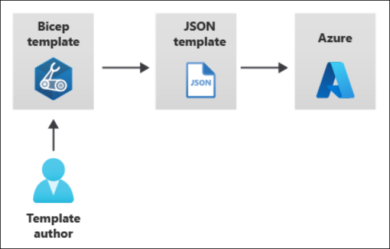

# Exploring Azure

The following notes are based on the Azure documentation and personal exploration of Azure services.

## Azure Bicep

- [Azure Bicep Documentation](https://learn.microsoft.com/en-us/azure/azure-resource-manager/bicep/)
- [Bicep GitHub Page](https://github.com/Azure/bicep) - Interesting read

### Bicep Command Reference

```pwsh
New-AzResourceGroupDeployment -ResourceGroupName BicepDeployment -TemplateFile .\main.bicep
```
### Install the Bicep CLI

Use the following command to install the self-contained version of the Bicep CLI from `az`:

```powershell
az bicep install
Installing Bicep CLI v0.36.1...
The configuration value of bicep.use_binary_from_path has been set to 'false'.
Successfully installed Bicep CLI to "C:\Users\gregt\.azure\bin\bicep.exe".
```

Check version:

```powershell
az bicep version
Bicep CLI version 0.36.1 (a727ed087a)
```

Note the self-contained instance isn't available with PowerShell commnands, so Azure deployments will fail if you haven't manually installed the Bicep CLI.

To manually install the Bicep CLI:

```powershell
winget install bicep
Found Bicep CLI [Microsoft.Bicep] Version 0.36.1
This application is licensed to you by its owner.
Microsoft is not responsible for, nor does it grant any licenses to, third-party packages.
Downloading https://github.com/Azure/bicep/releases/download/v0.36.1/bicep-setup-win-x64.exe
  ██████████████████████████████  38.5 MB / 38.5 MB
Successfully verified installer hash
Starting package install...
Successfully installed
```

Check version:

```powershell
bicep --version
Bicep CLI version 0.36.1 (a727ed087a)
```

### Bicep Quickstart
- [Create Bicep files - VS Code](https://learn.microsoft.com/en-us/azure/azure-resource-manager/bicep/quickstart-create-bicep-use-visual-studio-code?tabs=azure-cli)
- [Bicep Playground](https://azure.github.io/bicep/) - lets you view Bicep and JSON side by side

### Learning Module - Build your first Bicep file

https://learn.microsoft.com/en-us/training/modules/build-first-bicep-file/

When you submit a Bicep file, it is transpiled to an ARM template. The Bicep file is then validated and deployed to Azure.



Example of a Bicep file:

```bicep
resource storageAccount 'Microsoft.Storage/storageAccounts@2023-05-01' = {
  name: 'toylaunchstorage'
  location: 'westus3'
  sku: {
    name: 'Standard_LRS'
  }
  kind: 'StorageV2'
  properties: {
    accessTier: 'Hot'
  }
}
```
Things to note:
- The `resource` keyword is used to define a resource.
- The *symbolic name* is `storageAccount`. Symbolic names are used within Bicep but do not show up in the ARM template.
- `'Microsoft.Storage/storageAccounts@2023-05-01'` is the *resource type* and *API version*.
- You have to declare a *resource name*, which is the name of the storage account to be assigned in Azure.
