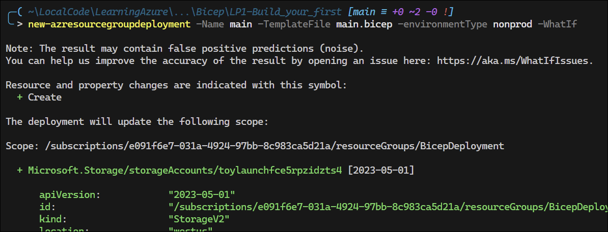
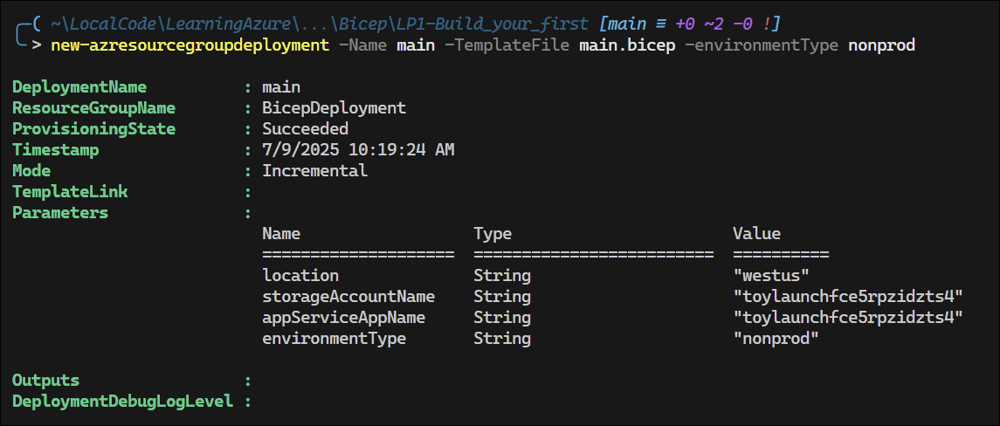
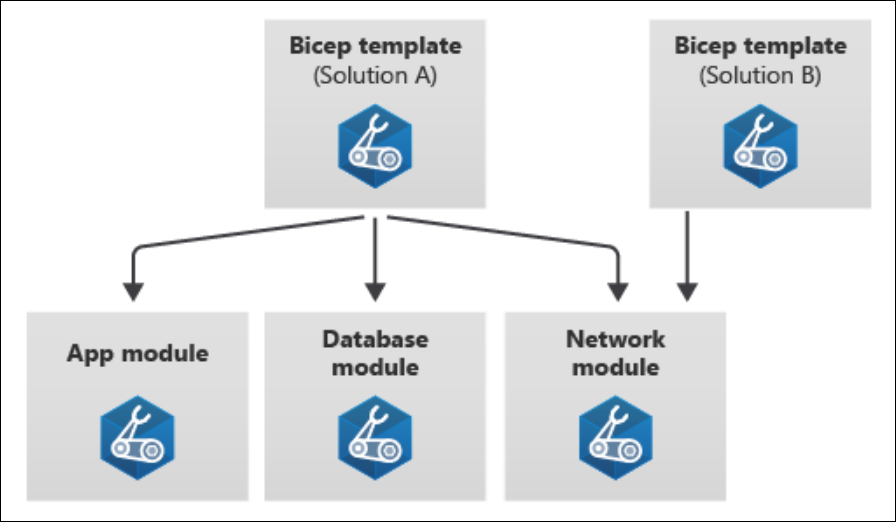
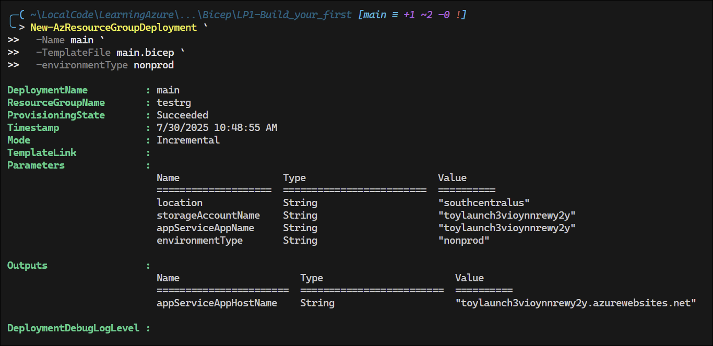
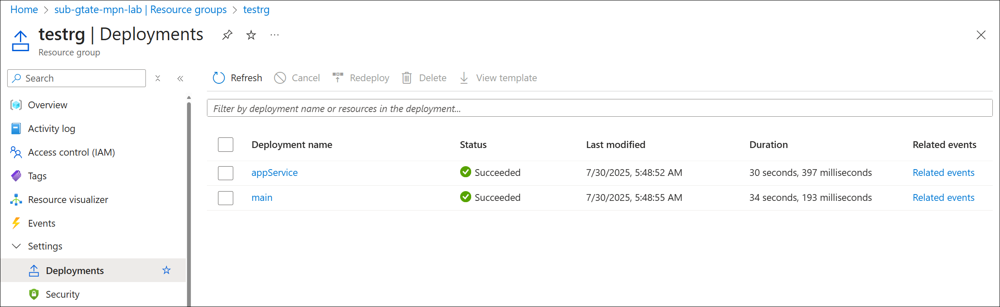

# Azure Bicep

<!-- omit in toc -->
## Contents
- [Bicep Command Reference](#bicep-command-reference)
- [Install the Bicep CLI](#install-the-bicep-cli)
  - [Bicep Quickstart](#bicep-quickstart)
- [Learning Module - Build your first Bicep file](#learning-module---build-your-first-bicep-file)
  - [Defining resources](#defining-resources)
    - [Resource Dependencies](#resource-dependencies)
  - [Exercise: Define resources in a Bicep file](#exercise-define-resources-in-a-bicep-file)
  - [Add flexibility by using parameters and variables](#add-flexibility-by-using-parameters-and-variables)
    - [Add a parameter](#add-a-parameter)
      - [Provide default values](#provide-default-values)
  - [Exercise: Add parameters and variables to your Bicep file](#exercise-add-parameters-and-variables-to-your-bicep-file)
    - [Add a variable](#add-a-variable)
    - [Expressions](#expressions)
      - [Resource Locations](#resource-locations)
      - [Resource Names](#resource-names)
      - [Combined strings](#combined-strings)
      - [Selecting SKUs for resources](#selecting-skus-for-resources)
    - [Deploying the updated Bicep file](#deploying-the-updated-bicep-file)
  - [Group related resources by using modules](#group-related-resources-by-using-modules)
    - [Outputs](#outputs)
    - [Define a module](#define-a-module)
    - [Design your modules](#design-your-modules)
  - [Exercise: Refactor your Bicep file to use modules](#exercise-refactor-your-bicep-file-to-use-modules)
    - [Add a new module file](#add-a-new-module-file)
    - [Add a reference to the module in `main.bicep`](#add-a-reference-to-the-module-in-mainbicep)
    - [Add the host name as an output](#add-the-host-name-as-an-output)
    - [Verify your Bicep files](#verify-your-bicep-files)
    - [Deploy the updated Bicep file](#deploy-the-updated-bicep-file)
  - [Module Assessment](#module-assessment)


## Bicep Command Reference

```pwsh
New-AzResourceGroupDeployment -ResourceGroupName BicepDeployment -TemplateFile .\main.bicep
```
- [Azure Bicep Documentation](https://learn.microsoft.com/en-us/azure/azure-resource-manager/bicep/)
- [Bicep GitHub Page](https://github.com/Azure/bicep) - Interesting read

## Install the Bicep CLI

Use the following command to install the self-contained version of the Bicep CLI from `az`:

```powershell
az bicep install
Installing Bicep CLI v0.36.1...
The configuration value of bicep.use_binary_from_path has been set to 'false'.
Successfully installed Bicep CLI to "C:\Users\gregt\.azure\bin\bicep.exe".
```

Check version:

```powershell
az bicep version
Bicep CLI version 0.36.1 (a727ed087a)
```

Note the self-contained instance isn't available with PowerShell commnands, so Azure deployments will fail if you haven't manually installed the Bicep CLI.

To manually install the Bicep CLI:

```powershell
winget install bicep
Found Bicep CLI [Microsoft.Bicep] Version 0.36.1
This application is licensed to you by its owner.
Microsoft is not responsible for, nor does it grant any licenses to, third-party packages.
Downloading https://github.com/Azure/bicep/releases/download/v0.36.1/bicep-setup-win-x64.exe
  ██████████████████████████████  38.5 MB / 38.5 MB
Successfully verified installer hash
Starting package install...
Successfully installed
```

Check version:

```powershell
bicep --version
Bicep CLI version 0.36.1 (a727ed087a)
```

### Bicep Quickstart
- [Create Bicep files - VS Code](https://learn.microsoft.com/en-us/azure/azure-resource-manager/bicep/quickstart-create-bicep-use-visual-studio-code?tabs=azure-cli)
- [Bicep Playground](https://azure.github.io/bicep/) - lets you view Bicep and JSON side by side

## Learning Module - Build your first Bicep file

[Module: Build your first Bicep file](https://learn.microsoft.com/en-us/training/modules/build-first-bicep-file/)

### Defining resources

When you submit a Bicep file, it is transpiled to an ARM template. The Bicep file is then validated and deployed to Azure.


Example of a Bicep file:

```bicep
resource storageAccount 'Microsoft.Storage/storageAccounts@2023-05-01' = {
  name: 'toylaunchstorage'
  location: 'westus3'
  sku: {
    name: 'Standard_LRS'
  }
  kind: 'StorageV2'
  properties: {
    accessTier: 'Hot'
  }
}
```
Things to note:
- The `resource` keyword is used to define a resource.
- The *symbolic name* is `storageAccount`. Symbolic names are used within Bicep but do not show up in the ARM template.
- `'Microsoft.Storage/storageAccounts@2023-05-01'` is the *resource type* and *API version*.
- You have to declare a *resource name*, which is the name of the storage account to be assigned in Azure.

#### Resource Dependencies

Often, you need a resource to depend on another resource, e.g. to deploy an App Service, you need and App Service Plan.

Declaring the app service plan:

```bicep
resource appServicePlan 'Microsoft.Web/serverFarms@2023-12-01' = {
  name: 'toy-product-launch-plan'
  location: 'westus3'
  sku: {
    name: 'F1'
  }
}
```
Declaring the app:  
```bicep
resource appServiceApp 'Microsoft.Web/sites@2023-12-01' = {
  name: 'toy-product-launch-1'
  location: 'westus3'
  properties: {
    serverFarmId: appServicePlan.id             // Reference the app service plan; implicit dependency
    httpsOnly: true
  }
}
```

### Exercise: Define resources in a Bicep file

Create the following `main.bicep` file:

```bicep
resource storageAccount 'Microsoft.Storage/storageAccounts@2023-05-01' = {
  name: '20250708toylaunchstorage'
  location: 'eastus'
  sku: {
    name: 'Standard_LRS'
  }
  kind: 'StorageV2'
  properties: {
    accessTier: 'Hot'
  }
}
```

Deploy the Bicep file to Azure:

```pwsh
Set-AzDefault -ResourceGroupName 'BicepDeployment'

New-AzResourceGroupDeployment -Name main -TemplateFile main.bicep

DeploymentName          : main
ResourceGroupName       : BicepDeployment
ProvisioningState       : Succeeded
Timestamp               : 7/8/2025 9:49:16 AM
Mode                    : Incremental
TemplateLink            : 
Parameters              : 
Outputs                 : 
DeploymentDebugLogLevel : 


Get-AzResourceGroupDeployment -ResourceGroupName BicepDeployment

DeploymentName          : main
ResourceGroupName       : BicepDeployment
ProvisioningState       : Succeeded
Timestamp               : 7/8/2025 9:49:16 AM
Mode                    : Incremental
TemplateLink            : 
Parameters              : 
Outputs                 : 
DeploymentDebugLogLevel : 
```


**Add an App Service Plan**

```bicep
resource storageAccount 'Microsoft.Storage/storageAccounts@2023-05-01' = {
  name: '20250708toylaunchstorage'
  location: 'eastus'
  sku: {
    name: 'Standard_LRS'
  }
  kind: 'StorageV2'
  properties: {
    accessTier: 'Hot'
  }
}

resource appServicePlan 'Microsoft.Web/serverfarms@2024-04-01' = {
  name: '20250708toy-product-launch-plan-starter'
  location: 'eastus'
  sku: {
    name: 'F1'
  }
}

resource appServiceApp 'Microsoft.Web/sites@2024-04-01' = {
  name: '20250708toy-product-launch-1'
  location: 'eastus'
  properties: {
    serverFarmId: appServicePlan.id
    httpsOnly: true
  }
}
```
Deployment results:


### Add flexibility by using parameters and variables

Parameters allow you to bring in values from outside the Bicep file. When deploying, you can provide the parameter values in the command line.

You can also create a *parameter file*, which lists all teh parameters and values you want to use for the deployment.

A variable is defined and set within the Bicep file.

Use parameters for things that will change between each deployment:
- Resource names that need to be unique
- Locations into which resources are deployed
- Settings that affect the pricing of resources, like SKUs, pricing tiers, and instance counts
- Credentials and information needed to access other systems that aren't defined in the Bicep file

Use variables when (1) you want to make a value resusable in the file or (2) you want to use expressions to create a complex value.

#### Add a parameter

Parameters are defined like this:

```bicep
param appServiceAppName string
```

How this works:
- `param` is the keyword to define a parameter.
- `appServiceAppName` is the symbolic name of the parameter.
- `string` is the type of the parameter. Other types include `int`, `bool`, `array`, and `object`.

##### Provide default values

You can provide a default value for a parameter, which is used if no value is provided during deployment:

```bicep
param appServiceAppName string = '20250708toy-product-launch-1'
```

### Exercise: Add parameters and variables to your Bicep file

```bicep
param appServiceAppName string = '20250708toy-product-launch-1'

resource appServicePlan 'Microsoft.Web/serverfarms@2024-04-01' = {
  name: appServiceAppName       // Use the parameter value for the name
  location: 'eastus'
  sku: {
    name: 'F1'
  }
}
```

#### Add a variable

You can define a variable like this:

```bicep
var appServicePlanName = 'toy-product-launch-plan'
```

Requirements for defining variables:
- Use the `var` keyword.
- You must provide a value for a variable.
- Variables don't need types. Bicep infers the type from the value.

#### Expressions

##### Resource Locations

When writing a template, you don't want to specify the location of each resource individually. Instead, you can have a rule that says, *by default all resources into the same location in which the resource group was created.*

```bicep
param location string = resourceGroup().location
```

The default value of this parameter uses a function instead of a literal value.

**Note:** Some resources can be deployed only into certain locations. For these cases, you may need to create separate parameters to set the location of these resources.

You can now use the `location` parameter in your resources:

```bicep
param appServiceAppName string = '20250708toy-product-launch-1'
param location string = resourceGroup().location

resource storageAccount 'Microsoft.Storage/storageAccounts@2023-05-01' = {
  name: '20250708toylaunchstorage'
  location: location                // Use the location parameter
  sku: {
    name: 'Standard_LRS'
  }
  kind: 'StorageV2'
  properties: {
    accessTier: 'Hot'
  }
}

resource appServicePlan 'Microsoft.Web/serverfarms@2024-04-01' = {
  name: appServiceAppName
  location: location                // Use the location parameter
  sku: {
    name: 'F1'
  }
}

resource appServiceApp 'Microsoft.Web/sites@2024-04-01' = {
  name: '20250708toy-product-launch-1'
  location: location                // Use the location parameter
  properties: {
    serverFarmId: appServicePlan.id
    httpsOnly: true
  }
}
```

##### Resource Names

Bicep has the built-in function `uniqueString()` that helps you build unique names for resources. You provide a *seed* value, which allows for uniqueness and consistency across deployments.

```bicep
param storageAccountName string = uniqueString(resourceGroup().id)
```

Here's what `resourceGroup().id` looks like:

```
/subscriptions/aaaa0a0a-bb1b-cc2c-dd3d-eeeeee4e4e4e/resourceGroups/MyResourceGroup
```

The `uniqueString()` function is deterministic, meaning it will always return the same value for the same seed. An example value returned from `resourceGroup().id` might be `7c6b2a3d61a4b`.

`resourceGroup().id` is a good candidate for resource names because:
- The `uniqueString()` function returns the same value every time you deploy resources into the same resource group.
- The `uniqueString()` function returns different values for different resource groups and subscriptions, which helps ensure that resource names are unique across your Azure environment.

##### Combined strings

If you just use the `uniqueString()` function to set resource names, you'll get unique names, but they won't be very descriptive. 

Bicep uses *string interpolation* to combine strings and variables into a single string. You can use this to create more descriptive resource names.

```bicep
param storageAccountName string = 'toylaunch${uniqueString(resourceGroup().id)}'
```

##### Selecting SKUs for resources

You can embed business rules into the file by using a combination of parameters, variables, and expressions.

```bicep
@allowed([
  'nonprod'
  'prod'
])
param environmentType string
```

With these allowed values, Bicep won't let anyone deploy the Bicep file unless they provide one of these values.

Now you can create variables that determine the SKUs to use:

```bicep
var storageAccountSkuName = (environmentType == 'prod') ? 'Standard_GRS' : 'Standard_LRS'
var appServicePlanSkuName = (environmentType == 'prod') ? 'P2V3' : 'F1'
```

#### Deploying the updated Bicep file

Here's the complete Bicep file with parameters and variables:

```bicep
param location string = resourceGroup().location
param storageAccountName string = 'toylaunch${uniqueString(resourceGroup().id)}'
param appServiceAppName string = 'toylaunch${uniqueString(resourceGroup().id)}'
@allowed([
  'nonprod'
  'prod'
])
param environmentType string

var appServicePlanName = 'toy-product-launch-plan'
var storageAccountSkuName = (environmentType == 'prod') ? 'Standard_GRS' : 'Standard_LRS'
var appServicePlanSkuName = (environmentType == 'prod') ? 'P2v3' : 'F1'

resource storageAccount 'Microsoft.Storage/storageAccounts@2023-05-01' = {
  name: storageAccountName
  location: location
  sku: {
    name: storageAccountSkuName
  }
  kind: 'StorageV2'
  properties: {
    accessTier: 'Hot'
  }
}

resource appServicePlan 'Microsoft.Web/serverfarms@2024-04-01' = {
  name: appServicePlanName
  location: location
  sku: {
    name: appServicePlanSkuName
  }
}

resource appServiceApp 'Microsoft.Web/sites@2024-04-01' = {
  name: appServiceAppName
  location: location
  properties: {
    serverFarmId: appServicePlan.id
    httpsOnly: true
  }
}
```

You can specify the `-WhatIf` parameter to preview the deployment without actually deploying it:

```pwsh
New-AzResourceGroupDeployment -Name main -TemplateFile main.bicep -environmentType nonprod -WhatIf
```


Result of running the deployment:



### Group related resources by using modules

As your Bicep has an increasing number of resources, it can become difficult to manage. You can use *modules* to group related resources together.

Bicep modules are individual Bicep files that can be deployed as part of a larger Bicep file. 

#### Outputs

Use the `output` keyword to define outputs in a Bicep file:

```bicep
output appServiceAppName string = appServiceAppName
output ipFqdn string = publicIPaddress.properties.dnsSettings.fqdn
```

#### Define a module



Use the `module` keyword when you want to include a reference to a module file.

```bicep
module myModule 'modules/mymodule.bicep' = {
    name: 'MyModule'
    params: {
        location: location
    }
}
```
- The `module` keyword tells Bicep you're about to use another Bicep file as a module.
- `myModule` is the symbolic name, which is used when referencing the module outputs.
- `'modules/mymodule.bicep'` is the path to the Bicep file that defines the module.
- The `name` property is mandatory as Azure uses this property to create a separate deployment for each module within the Bicep file. These deployments have names you can use to identify them.
- The `params` property is used to pass parameters to the module.

#### Design your modules

Key principles:
- A module should have a clear purpose.
- Don't put every resource into its own module. Group related resources together.
- A module should have clear parameters and outputs that make sense.
- A module should be as self-contained as possible. It should not depend on resources defined outside the module.
- A module shouldn't output secrets. 

### Exercise: Refactor your Bicep file to use modules

#### Add a new module file

Create a new `modules` directory and add `appService.bicep` file:

```cmd
C:.
│   main.bicep
│   
└───modules
        appService.bicep
```

[appService.bicep](./Bicep/LP1-Build_your_first/modules/appService.bicep):
```bicep
param location string                       // Parameters copied from main.bicep
param appServiceAppName string              

@allowed([
  'nonprod'
  'prod'
])
param environmentType string

var appServicePlanName = 'toy-product-launch-plan'
var appServicePlanSkuName = (environmentType == 'prod') ? 'P2v3' : 'F1'

resource appServicePlan 'Microsoft.Web/serverfarms@2024-04-01' = {
  name: appServicePlanName
  location: location
  sku: {
    name: appServicePlanSkuName
  }
}

resource appServiceApp 'Microsoft.Web/sites@2024-04-01' = {
  name: appServiceAppName
  location: location
  properties: {
    serverFarmId: appServicePlan.id
    httpsOnly: true
  }
}
```

#### Add a reference to the module in `main.bicep`

[main.bicep](./Bicep/LP1-Build_your_first/main.bicep):
```bicep
module appService 'modules/appService.bicep' = {            // added at the bottom
  name: 'appService'
  params: {
    location: location                                      // Specifying parameters to pass to the module
    appServiceAppName: appServiceAppName                    // Referencing paraemters already defined in main.bicep
    environmentType: environmentType
  }
}
```

Delete the App Service resources and the `appServicePlanName` and the `appServicePlanSkuName` variable definitions from `main.bicep`, since they are now defined in the `appService.bicep` module.

#### Add the host name as an output

[appService.bicep](./Bicep/LP1-Build_your_first/modules/appService.bicep):
```bicep
output appServiceAppHostName string = appServiceApp.properties.defaultHostName      // Added at the bottom
```
The output takes its value from the `defaultHostName` property of the `appServiceApp` resource.

#### Verify your Bicep files

[main.bicep](./Bicep/LP1-Build_your_first/main.bicep):
```bicep
param location string = resourceGroup().location
param storageAccountName string = 'toylaunch${uniqueString(resourceGroup().id)}'
param appServiceAppName string = 'toylaunch${uniqueString(resourceGroup().id)}'
@allowed([
  'nonprod'
  'prod'
])
param environmentType string

var storageAccountSkuName = (environmentType == 'prod') ? 'Standard_GRS' : 'Standard_LRS'

resource storageAccount 'Microsoft.Storage/storageAccounts@2023-05-01' = {
  name: storageAccountName
  location: location
  sku: {
    name: storageAccountSkuName
  }
  kind: 'StorageV2'
  properties: {
    accessTier: 'Hot'
  }
}

module appService 'modules/appService.bicep' = {
  name: 'appService'
  params: {
    location: location
    appServiceAppName: appServiceAppName
    environmentType: environmentType
  }
}

output appServiceAppHostName string = appService.outputs.appServiceAppHostName          // references output from the appService module
```
[appService.bicep](./Bicep/LP1-Build_your_first/modules/appService.bicep):
```bicep
param location string
param appServiceAppName string

@allowed([
  'nonprod'
  'prod'
])
param environmentType string

var appServicePlanName = 'toy-product-launch-plan'
var appServicePlanSkuName = (environmentType == 'prod') ? 'P2v3' : 'F1'

resource appServicePlan 'Microsoft.Web/serverfarms@2024-04-01' = {
  name: appServicePlanName
  location: location
  sku: {
    name: appServicePlanSkuName
  }
}

resource appServiceApp 'Microsoft.Web/sites@2024-04-01' = {
  name: appServiceAppName
  location: location
  properties: {
    serverFarmId: appServicePlan.id
    httpsOnly: true
  }
}

output appServiceAppHostName string = appServiceApp.properties.defaultHostName
```

#### Deploy the updated Bicep file

```pwsh
╭─( ~\LocalCode\LearningAzure\...\Bicep\LP1-Build_your_first [main ≡ +1 ~2 -0 !]
╰╴> New-AzResourceGroupDeployment `
     -Name main `
     -TemplateFile main.bicep `
     -environmentType nonprod
```




### Module Assessment
