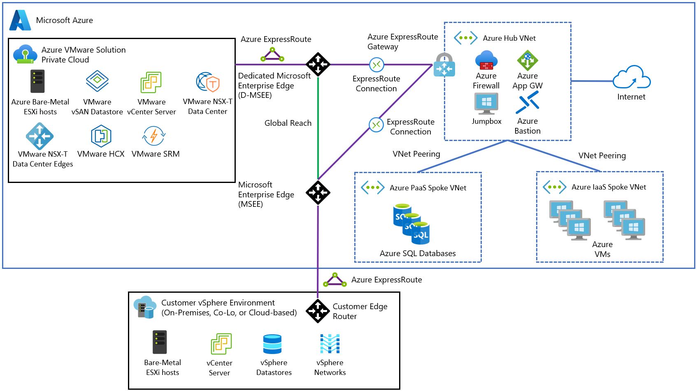
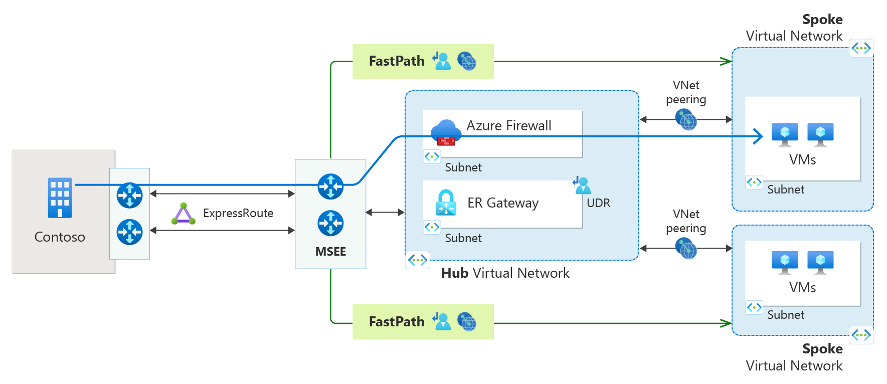
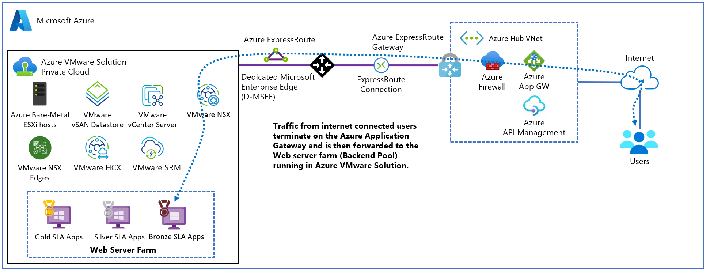
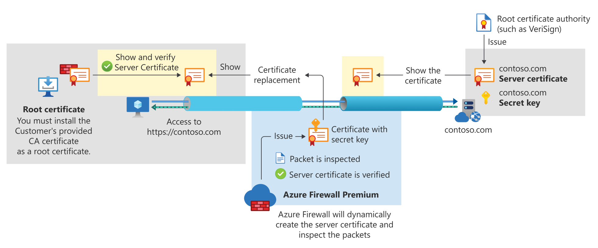
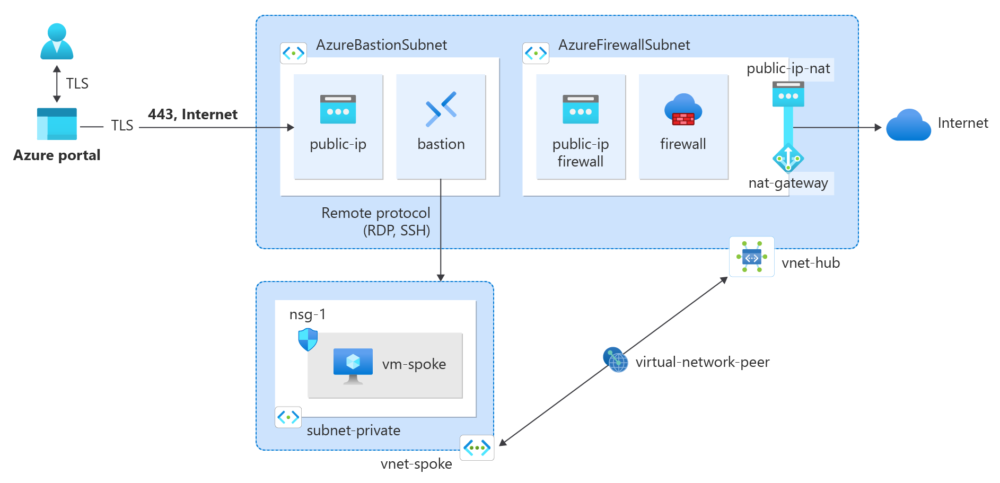
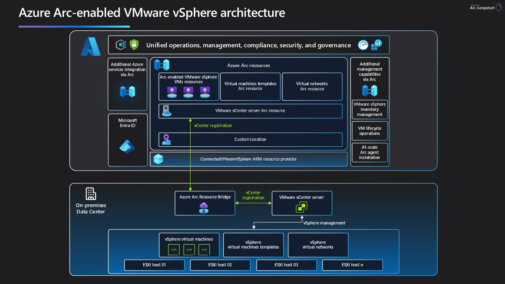
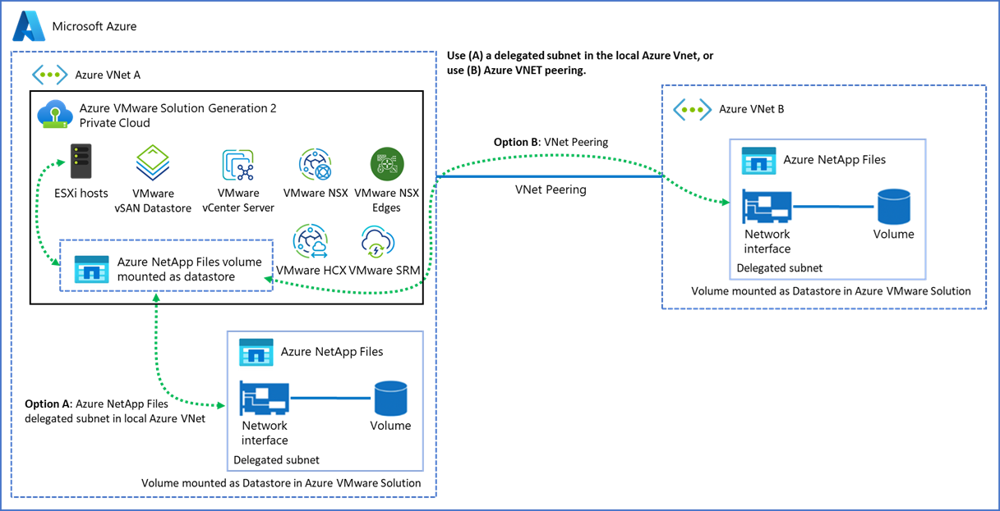
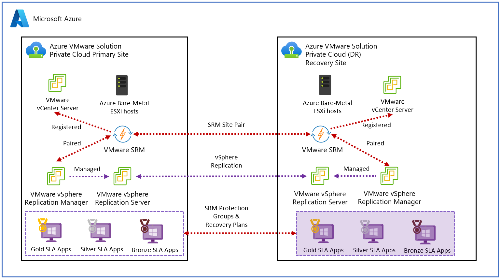
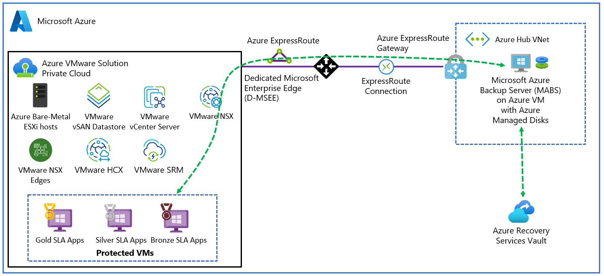
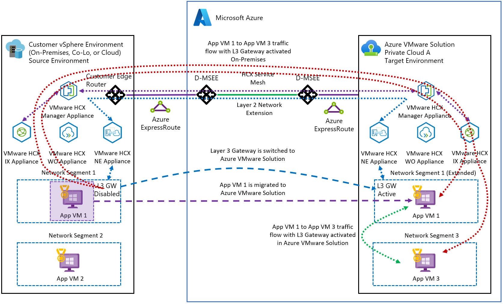

# Azure VMware Solution Architectural Constraints

## Purpose and Source Basis

Azure VMware Solution (AVS) preserves familiar VMware management abstractions, including vCenter Server, VMware NSX, and VMware vSAN, while running dedicated VMware clusters on Azure-managed bare-metal infrastructure. [Introduction to Azure VMware Solution](https://learn.microsoft.com/en-us/azure/azure-vmware/introduction) The resulting architecture is not equivalent to relocating an on-premises VMware data center into another facility; compute, storage, identity, routing, security, and operational control operate within AVS service boundaries and differ between Generation 1 and Generation 2 private clouds. [Azure VMware Solution private cloud and cluster concepts](https://learn.microsoft.com/en-us/azure/azure-vmware/architecture-private-clouds)

This edition preserves the supplied transcript’s substantive content, structure, scenarios, analogies, and calculations, and validates externally verifiable claims against current Microsoft Learn documentation. Official Broadcom technical documentation is used only where Microsoft does not document the VMware-specific behavior. Transcript-only statements, architectural interpretations, operational recommendations, and documentation corrections are identified inline.

---

## 1. Architectural Posture: AVS Is Not a Remote Data Center

A large AVS migration can fail abruptly when teams reuse assumptions developed for traditional hypervisor-based data centers. The transcript frames a 5,000-virtual-machine migration as an example in which conventional lift-and-shift practices could trigger routing failure, vSAN resource exhaustion, and loss of administrative access without a long period of graceful degradation.

* **Core architectural decision:** AVS must be designed as a fusion of VMware operational models and Azure-native infrastructure rather than as a remote extension of an existing physical data center. [Azure VMware Solution private cloud and cluster concepts](https://learn.microsoft.com/en-us/azure/azure-vmware/architecture-private-clouds)

* **Why familiar interfaces are misleading:** Administrators still interact with recognizable components such as vCenter Server, but the underlying compute, storage, networking, identity, and platform-lifecycle responsibilities have changed. [Introduction to Azure VMware Solution](https://learn.microsoft.com/en-us/azure/azure-vmware/introduction)

* **Shared-responsibility consequence:** Microsoft manages the physical hosts and the lifecycle of service-managed VMware components, while customers manage workload resources through the permissions exposed by the service. Customers therefore operate within platform-enforced privilege and configuration boundaries. [Architecture — Identity and access](https://learn.microsoft.com/en-us/azure/azure-vmware/architecture-identity)

* **Failure pattern:** The transcript characterizes several limit violations as hard stops rather than gradual degradations.

  * A Border Gateway Protocol (BGP) session can be dropped when an Azure Route Server peer advertises more routes than the documented limit. [Azure Route Server frequently asked questions](https://learn.microsoft.com/en-us/azure/route-server/route-server-faq)
  * vSAN requires reserved free capacity for internal operations and host rebuilds; AVS documents a 75% usable-capacity limit. [Clusters — maximum limits table](https://learn.microsoft.com/en-us/azure/azure-vmware/architecture-private-clouds#clusters)
  * Administrators can lose normal directory-backed access to the control plane when authentication depends on an unavailable external path; AVS retains the local CloudAdmin account for emergency access. [Architecture — Identity and access](https://learn.microsoft.com/en-us/azure/azure-vmware/architecture-identity)
  * HCX routing and network-extension state consume documented appliance and route-scale capacity; exceeding applicable limits can interrupt migration connectivity. [Route architecture for Azure VMware Solution Gen 2 — Route limitations for HCX](https://learn.microsoft.com/en-us/azure/azure-vmware/native-network-routing-architecture#route-limitations-for-hcx)

> **Transcript-derived analogy:** Treating AVS as an ordinary remote VMware data center is compared to forcing a square peg into a round hole. The interfaces may appear compatible, but the underlying “physics” are different.

* **Checklist interpretation:** Strict requirements such as subnet sizes, route limits, storage thresholds, and account restrictions should be read as anti-pattern warnings based on prior migration failures, not merely as optional configuration preferences.

**Operational implication:** Architecture reviews must identify platform limits and failure-domain dependencies before migration tooling, workload waves, or automation are approved.

---

## 2. Identity, Authentication, and Privileged Access

Identity is the first architectural dependency because administrators must retain access to AVS even when on-premises connectivity fails. AVS supports external identity sources for vCenter Server and VMware NSX, while the built-in `cloudadmin` credential is intended for emergency access rather than routine administration. [Architecture — Identity and access](https://learn.microsoft.com/en-us/azure/azure-vmware/architecture-identity)

### 2.1 Deploy Active Directory Services in Azure

* **Operational recommendation:** Deploy Active Directory Domain Services (AD DS) domain controllers in Azure, preferably in the identity platform subscription or landing-zone location, rather than relying exclusively on on-premises domain controllers. Microsoft documents deploying AD DS domain controllers on Azure virtual machines and recommends an additional domain controller on the AVS side in its hub-and-spoke reference architecture. [Install Active Directory Domain Services on an Azure virtual machine](https://learn.microsoft.com/en-us/windows-server/identity/ad-ds/deploy/virtual-dc/adds-on-azure-vm) [Integrate Azure VMware Solution in a hub-and-spoke architecture](https://learn.microsoft.com/en-us/azure/azure-vmware/architecture-hub-and-spoke)

> **Documentation correction:** Microsoft documents Azure-local identity placement as an architecture recommendation, not as a universal AVS platform requirement. AVS can use a reachable supported external identity source; the Azure-local placement in this guide removes a WAN dependency. [Set an external identity source for vCenter Server](https://learn.microsoft.com/en-us/azure/azure-vmware/configure-identity-source-vcenter)

* **Affected AVS components:** The Azure-hosted directory services can provide authentication for components such as:

  * vCenter Server through a supported external identity source. [Set an external identity source for vCenter Server](https://learn.microsoft.com/en-us/azure/azure-vmware/configure-identity-source-vcenter)
  * VMware NSX Manager through an LDAP identity source. [Set an external identity source for VMware NSX](https://learn.microsoft.com/en-us/azure/azure-vmware/configure-external-identity-source-nsx-t)
  * Other AVS management functions integrated with the enterprise identity provider.

* **Dependency being removed:** Relying entirely on on-premises AD extends the critical authentication path across a geographic and physical connectivity failure domain. [Integrate Azure VMware Solution in a hub-and-spoke architecture](https://learn.microsoft.com/en-us/azure/azure-vmware/architecture-hub-and-spoke)

* **Transcript-derived scenario:** An organization has a 10-gigabit private connection to a Chicago data center and points vCenter to domain controllers in that facility over Lightweight Directory Access Protocol over TLS, commonly called LDAPS.

  * A fiber cut, edge-router failure, or dropped BGP session removes access to those domain controllers.
  * AVS workloads may continue running normally in Azure.
  * Administrators may nevertheless be unable to authenticate to vCenter.
  * The organization then loses the ability to troubleshoot, reconfigure, or initiate recovery actions through the normal management plane.

> **Transcript-derived analogy:** Keeping all cloud authentication in the physical data center is like keeping the keys to a new house in a safety-deposit box in another city. When the road between the two locations closes, the owner is locked out of the house.

* **Implementation approach:**

  * Deploy domain controllers as native Azure infrastructure-as-a-service virtual machines. [Install Active Directory Domain Services on an Azure virtual machine](https://learn.microsoft.com/en-us/windows-server/identity/ad-ds/deploy/virtual-dc/adds-on-azure-vm)
  * Define an Azure-local Active Directory site and subnet in Active Directory Sites and Services. [Designing the Site Topology](https://learn.microsoft.com/en-us/windows-server/identity/ad-ds/plan/designing-the-site-topology)
  * Configure AVS identity integrations to use the reachable Azure-local directory services. [Set an external identity source for vCenter Server](https://learn.microsoft.com/en-us/azure/azure-vmware/configure-identity-source-vcenter)
  * Keep directory lookups on the Azure backbone where possible.

> **Documentation correction:** The transcript’s “Azure IAS” wording is a transcription error. The documented hosting model is Azure infrastructure as a service (IaaS), with Windows Server AD DS installed on Azure virtual machines. [Install Active Directory Domain Services on an Azure virtual machine](https://learn.microsoft.com/en-us/windows-server/identity/ad-ds/deploy/virtual-dc/adds-on-azure-vm)

* **Performance behavior:** The transcript states that local directory lookups can reduce authentication latency to single-digit milliseconds, accelerating logins and identity-dependent API operations.

> **Not directly supported by the reviewed documentation:** Microsoft documents the topology and resilience benefits of Azure-local domain controllers, but the reviewed official sources do not publish a single-digit-millisecond AVS authentication target.

* **Resilience behavior:** Azure-local domain controllers decouple cloud-management authentication from the uptime of the on-premises data center and its WAN connection.

**Takeaway:** Azure-local directory services are both a latency optimization and a control-plane survivability requirement.

### 2.2 Integrate vCenter and NSX-T with Named Enterprise Identities

* **Requirement for named enterprise administration:** Configure a supported external identity source for vCenter Server and VMware NSX. Windows Server Active Directory integration can use LDAP/LDAPS, and current vCenter guidance also documents Microsoft Entra ID integration. [Set an external identity source for vCenter Server](https://learn.microsoft.com/en-us/azure/azure-vmware/configure-identity-source-vcenter) [Set an external identity source for VMware NSX](https://learn.microsoft.com/en-us/azure/azure-vmware/configure-external-identity-source-nsx-t)

* **Purpose:** Integration enables administrators to use distinct enterprise identities rather than a shared built-in administrator account. [Architecture — Identity and access](https://learn.microsoft.com/en-us/azure/azure-vmware/architecture-identity)

* **Auditability requirement:** Administrative events should be attributable to a specific person. [Architecture — Identity and access](https://learn.microsoft.com/en-us/azure/azure-vmware/architecture-identity)

  * A log entry showing that `cloudadmin` deleted a logical switch does not identify who performed the action.
  * Incident responders cannot distinguish an authorized mistake, malicious insider action, or compromised credential when a shared account is used.
  * Named accounts preserve individual accountability in audit logs.

* **Least-privilege requirement:** Custom roles assigned to named accounts must stay within the privileges available to the AVS CloudAdmin role. [Architecture — Identity and access](https://learn.microsoft.com/en-us/azure/azure-vmware/architecture-identity)

* **Platform boundary:** The customer cannot use custom roles to exceed the permissions Microsoft exposes through the managed-service boundary. [Use run commands in Azure VMware Solution](https://learn.microsoft.com/en-us/azure/azure-vmware/using-run-command)

  * Operations that require privileges beyond CloudAdmin must use supported AVS run commands or Microsoft-managed workflows; direct ESXi root and vCenter administrator access aren't provided. [Use run commands in Azure VMware Solution](https://learn.microsoft.com/en-us/azure/azure-vmware/using-run-command)
  * The restriction preserves tenant isolation and protects Microsoft-managed infrastructure.

* **Role-design recommendation:** Create task-specific roles that provide only the permissions required by each operational function.

### 2.3 Reserve `cloudadmin` for Break-Glass Recovery

The built-in `cloudadmin` account is the local customer emergency-access credential. Microsoft states that it isn't intended for daily administrative activities or service integrations, but it remains available when external identity-backed access is unavailable. [Set an external identity source for vCenter Server — CloudAdmin emergency access](https://learn.microsoft.com/en-us/azure/azure-vmware/configure-identity-source-vcenter)

* **Storage requirement:** Place the credential in a controlled secrets vault, such as CyberArk or Azure Key Vault. This is an operational secrets-management recommendation; AVS documents the account as break-glass and supports credential rotation. [Rotate the cloudadmin credentials for Azure VMware Solution](https://learn.microsoft.com/en-us/azure/azure-vmware/rotate-cloudadmin-credentials)

* **Legitimate emergency conditions include:**

  * Azure-hosted domain controllers are unavailable.
  * LDAPS integration has failed.
  * An LDAPS certificate has expired.
  * Named accounts cannot authenticate to vCenter.
  * External identity services or their network paths are unusable.

* **Break-glass procedure:**

  1. Retrieve the `cloudadmin` credential through the organization’s emergency-access process.
  2. Authenticate locally to vCenter without depending on AD or LDAPS.
  3. Repair the directory, certificate, or identity-provider integration.
  4. Verify that named enterprise accounts can authenticate successfully.
  5. Immediately rotate the `cloudadmin` password. [Rotate the cloudadmin credentials for Azure VMware Solution](https://learn.microsoft.com/en-us/azure/azure-vmware/rotate-cloudadmin-credentials)
  6. Store the replacement credential in the approved vault.
  7. Record the use, reason, operators, and corrective actions in the incident record.

* **Failure scenario:** An expired LDAPS certificate can silently break the binding between vCenter and the identity provider, causing every named administrative login to fail.

* **Security posture:** The transcript characterizes the credential as a “radioactive artifact”: indispensable during an emergency but too powerful and insufficiently attributable for routine use. Microsoft similarly limits it to emergency-access scenarios. [Architecture — Identity and access](https://learn.microsoft.com/en-us/azure/azure-vmware/architecture-identity)

### 2.4 Eliminate Standing Privileges with Privileged Identity Management

The Well-Architected material described in the transcript extends identity controls into a zero-standing-access model. Administrators remain eligible for privileged roles but do not retain those roles continuously.

> **Documentation correction:** The intended service is **Microsoft Entra Privileged Identity Management (PIM)**. PIM provides time-based and approval-based role activation for Microsoft Entra and Azure resource roles. [What is Privileged Identity Management?](https://learn.microsoft.com/en-us/entra/id-governance/privileged-identity-management/pim-configure)

* **Risk addressed:** A permanently active privileged role remains continuously usable if the account is compromised; PIM reduces that exposure with eligible and time-bound assignments. [Assign Azure resource roles in Privileged Identity Management](https://learn.microsoft.com/en-us/entra/id-governance/privileged-identity-management/pim-resource-roles-assign-roles)

* **Resting-access model:** An eligible engineer doesn't receive the privileged role until activation requirements are satisfied. [Activate Microsoft Entra roles in PIM](https://learn.microsoft.com/en-us/entra/id-governance/privileged-identity-management/pim-how-to-activate-role)

* **Activation process:**

  1. The engineer requests role activation through the portal or supported interfaces. [Activate Microsoft Entra roles in PIM](https://learn.microsoft.com/en-us/entra/id-governance/privileged-identity-management/pim-how-to-activate-role)
  2. The request can require a business justification. [Configure Azure resource role settings in PIM](https://learn.microsoft.com/en-us/entra/id-governance/privileged-identity-management/pim-resource-roles-configure-role-settings)
  3. The policy may require an IT service management ticket, such as a ServiceNow ticket number.
  4. Sensitive roles can require approval by a designated approver. [Configure Azure resource role settings in PIM](https://learn.microsoft.com/en-us/entra/id-governance/privileged-identity-management/pim-resource-roles-configure-role-settings)
  5. The platform grants the role for a defined period.
  6. The role activation expires automatically when the configured activation window ends. [Configure Azure resource role settings in PIM](https://learn.microsoft.com/en-us/entra/id-governance/privileged-identity-management/pim-resource-roles-configure-role-settings)

* **Example activation windows:** The transcript gives two-hour and four-hour access periods as examples; PIM role settings allow administrators to configure the maximum activation duration. [Configure Azure resource role settings in PIM](https://learn.microsoft.com/en-us/entra/id-governance/privileged-identity-management/pim-resource-roles-configure-role-settings)

* **Security consequence:** Time-bound activation dynamically reduces the duration during which a stolen credential can exercise privileged access.

**Operational implication:** AVS administration requires three distinct identity layers: Azure-local authentication services, individually attributable accounts, and time-bound privileged-role activation.

---

## 3. Connectivity, ExpressRoute, and Routing Constraints

Azure VMware Solution networking depends on the private-cloud generation. Generation 1 uses a Microsoft-managed ExpressRoute circuit, whereas Generation 2 deploys into an Azure virtual network and uses standard Azure networking. Customer designs can also include ExpressRoute or VPN gateways, Azure Route Server, and network virtual appliances, each with separate limits and failure behavior. [Introduction to Azure VMware Solution — private cloud types](https://learn.microsoft.com/en-us/azure/azure-vmware/introduction#azure-vmware-solution-private-cloud-types) [Azure VMware Solution Generation 2 private cloud design considerations](https://learn.microsoft.com/en-us/azure/azure-vmware/native-network-design-consideration)

### 3.1 Understand the Built-In AVS ExpressRoute Topology

* **Generation 1 service behavior:** Provisioning an AVS Generation 1 private cloud includes Microsoft-managed ExpressRoute connectivity. Generation 2 instead deploys the private cloud into a delegated Azure virtual network and doesn't require the Generation 1 managed-circuit topology. [Introduction to Azure VMware Solution — private cloud types](https://learn.microsoft.com/en-us/azure/azure-vmware/introduction#azure-vmware-solution-private-cloud-types)

* **Purpose of the service circuit:** The Generation 1 service circuit connects the private cloud to Azure networking through Microsoft Enterprise Edge infrastructure. [Network interconnectivity — Azure virtual network interconnectivity](https://learn.microsoft.com/en-us/azure/azure-vmware/architecture-networking#azure-virtual-network-interconnectivity)

* **Customer-side dependency:** An enterprise commonly has a separate customer-managed ExpressRoute circuit connecting on-premises routers to Azure. [Peer on-premises environments to Azure VMware Solution — Prerequisites](https://learn.microsoft.com/en-us/azure/azure-vmware/tutorial-expressroute-global-reach-private-cloud#prerequisites)

* **Connectivity problem:** For Generation 1, on-premises systems don't gain transit between the customer circuit and the AVS service circuit merely because both connect to an ExpressRoute gateway; ExpressRoute gateways don't provide transit between attached circuits. [Network interconnectivity — On-premises interconnectivity](https://learn.microsoft.com/en-us/azure/azure-vmware/architecture-networking#on-premises-interconnectivity)

### 3.2 Use ExpressRoute Global Reach for On-Premises-to-AVS Traffic

* **Generation 1 requirement for direct ExpressRoute interconnection:** Use ExpressRoute Global Reach to connect the customer’s on-premises ExpressRoute circuit with the AVS-managed ExpressRoute circuit. [Peer on-premises environments to Azure VMware Solution](https://learn.microsoft.com/en-us/azure/azure-vmware/tutorial-expressroute-global-reach-private-cloud)

* **Traffic behavior:**

  * Traffic enters Microsoft’s edge through the customer circuit and is exchanged with the AVS circuit through Global Reach. [Network interconnectivity — On-premises interconnectivity](https://learn.microsoft.com/en-us/azure/azure-vmware/architecture-networking#on-premises-interconnectivity)
  * Microsoft Enterprise Edge routers route it toward the AVS service circuit.
  * The private traffic traverses Microsoft’s backbone rather than the public internet. [ExpressRoute Global Reach](https://learn.microsoft.com/en-us/azure/azure-vmware/tutorial-expressroute-global-reach-private-cloud)
  * The path avoids unnecessary traversal through intermediate Azure compute resources.

* **Architectural benefit:** Global Reach provides a direct private connection between the on-premises environment and the Generation 1 AVS private cloud. [Peer on-premises environments to Azure VMware Solution](https://learn.microsoft.com/en-us/azure/azure-vmware/tutorial-expressroute-global-reach-private-cloud)

> **Documentation correction:** Generation 2 uses standard Azure Virtual Network connectivity. On-premises connectivity can use a standard ExpressRoute connection or site-to-site VPN; the Generation 1 Global Reach circuit-to-circuit pattern doesn't apply unchanged. [Connect Azure VMware Solution Generation 2 to an on-premises environment](https://learn.microsoft.com/en-us/azure/azure-vmware/native-connect-on-premises)

*Source: [Microsoft Learn — Integrate Azure VMware Solution in a hub-and-spoke architecture](https://learn.microsoft.com/en-us/azure/azure-vmware/architecture-hub-and-spoke)*

> **Architectural interpretation:** The transcript describes the edge-routing behavior as a hairpin between the two ExpressRoute circuits. The essential point is that the path is established through Microsoft’s backbone rather than through public internet routing.

### 3.3 Enable FastPath for High-Performance External Storage

External storage can create sustained, latency-sensitive traffic. For Generation 1 Azure NetApp Files datastores, Microsoft recommends an UltraPerformance or ErGw3AZ gateway with FastPath for optimized performance; Generation 2 can use same-VNet or peered-VNet connectivity. [Attach Azure NetApp Files datastores — Performance best practices](https://learn.microsoft.com/en-us/azure/azure-vmware/attach-azure-netapp-files-to-azure-vmware-solution-hosts#performance-best-practices)

* **External-storage examples:**

  * Azure NetApp Files volumes.
  * Network File System (NFS) storage.
  * Internet Small Computer Systems Interface (iSCSI) storage.

* **Standard gateway limitation:** An ExpressRoute virtual network gateway exchanges routes and normally participates in the data path between the circuit and the virtual network. [About ExpressRoute virtual network gateways](https://learn.microsoft.com/en-us/azure/expressroute/expressroute-about-virtual-network-gateways)

  * The gateway handles packets, routing decisions, and forwarding.
  * Sustained high-volume storage traffic can saturate the gateway’s compute capacity.
  * Saturation increases latency and reduces achievable storage input/output operations per second (IOPS).

* **FastPath behavior:** FastPath sends supported data-plane traffic directly to resources in the virtual network, bypassing the virtual network gateway. [Azure ExpressRoute FastPath — Features, availability, and limitations](https://learn.microsoft.com/en-us/azure/expressroute/about-fastpath)

* **Expected consequence:** Bypassing the gateway improves data-path performance, including packets per second and connections per second. [Azure ExpressRoute FastPath — Features, availability, and limitations](https://learn.microsoft.com/en-us/azure/expressroute/about-fastpath)

*Source: [Microsoft Learn — Azure ExpressRoute FastPath: Features, availability, and limitations](https://learn.microsoft.com/en-us/azure/expressroute/about-fastpath)*

> **Documentation correction:** FastPath is supported with UltraPerformance, ErGw3AZ, and qualifying ErGwScale configurations. For Generation 1 Azure NetApp Files datastores, AVS guidance specifically recommends UltraPerformance or ErGw3AZ with FastPath. The transcript’s “MS address” wording isn't documented terminology. [Configure ExpressRoute FastPath](https://learn.microsoft.com/en-us/azure/expressroute/expressroute-about-virtual-network-gateways#fastpath) [Attach Azure NetApp Files datastores — Performance best practices](https://learn.microsoft.com/en-us/azure/azure-vmware/attach-azure-netapp-files-to-azure-vmware-solution-hosts#performance-best-practices)

**Dependency:** External-storage performance depends on the complete network path, gateway and FastPath support, service level, volume sizing, and placement—not only on the storage service’s advertised throughput. [Attach Azure NetApp Files datastores — Performance best practices](https://learn.microsoft.com/en-us/azure/azure-vmware/attach-azure-netapp-files-to-azure-vmware-solution-hosts#performance-best-practices)

### 3.4 Keep BGP Route Counts Below the Platform Limit

When Azure Route Server is part of the design, its route-advertisement limit is a hard BGP consideration because an NVA that advertises more than the supported number of routes can have its BGP session dropped. [Azure Route Server frequently asked questions](https://learn.microsoft.com/en-us/azure/route-server/route-server-faq)

* **Documented limit:** An NVA peer must not advertise more than 1,000 routes to Azure Route Server. Separate limits apply to routes advertised from Route Server toward ExpressRoute when branch-to-branch is enabled. [Azure Route Server frequently asked questions](https://learn.microsoft.com/en-us/azure/route-server/route-server-faq)

* **Documented failure condition:** If an NVA advertises more routes than the 1,000-route limit, Azure Route Server drops the BGP session. [Azure Route Server frequently asked questions](https://learn.microsoft.com/en-us/azure/route-server/route-server-faq)

* **Effect of session loss:**

  * Dynamic route exchange stops.
  * On-premises and Azure destinations can become unreachable.
  * Enterprise cloud connectivity may be severed rather than partially degraded.

> **Documentation correction:** The 1,000-route session-drop behavior is documented for routes advertised by an NVA peer to Azure Route Server. It isn't a universal AVS route limit and must not be conflated with Generation 2 private-cloud route-scale limits or ExpressRoute route limits. [Azure Route Server frequently asked questions](https://learn.microsoft.com/en-us/azure/route-server/route-server-faq) [Route architecture for Azure VMware Solution Gen 2](https://learn.microsoft.com/en-us/azure/azure-vmware/native-network-routing-architecture)

#### Transcript-Derived Route-Count Calculation

> **Transcript-derived calculation:**
>
> **Inputs**
>
> * Maximum supported route count: 1,000 routes.
> * Example steady-state count: 990 routes.
> * Example temporary count after a link flap: 1,005 routes.
>
> **Formula**
>
> * Temporary excess = `1,005 - 1,000`
>
> **Result**
>
> * The temporary advertisement exceeds the stated limit by 5 routes.
>
> **Practical interpretation**
>
> * The BGP session may fail even though the normal route count is below the limit.
> * A transient alternative path can therefore create intermittent, difficult-to-diagnose outages.
>
> **Factors that could change the real result**
>
> * How Azure counts learned, advertised, and duplicate routes.
> * Whether limits apply per peer, per Route Server instance, or across the deployment.
> * Platform changes after the source checklist was written.

* **Troubleshooting observation:** When route counts fluctuate around the limit, connectivity may return automatically after routes are withdrawn. This can cause engineers to investigate links, firewalls, or applications while missing the underlying route-capacity problem.

* **Operational recommendation:** Monitor the normal route count, peak observed route count, BGP peer status, and remaining route headroom. [Monitor Azure Route Server with Azure Monitor](https://learn.microsoft.com/en-us/azure/route-server/monitor-route-server)

### 3.5 Summarize Routes Aggressively

* **Requirement:** Do not advertise an unnecessarily fragmented enterprise routing table into the AVS transit design. This is an operational recommendation derived from the documented route limits. [Azure Route Server frequently asked questions](https://learn.microsoft.com/en-us/azure/route-server/route-server-faq)

* **Legacy-network risk:** Older environments may advertise large numbers of individual `/24` networks rather than aggregated address blocks.

* **Recommended approach:** Consolidate individual prefixes into larger supernets where the address plan and security policy permit. Generation 2 guidance explicitly recommends fewer, larger prefixes and route summarization to remain under its combined 1,000-prefix limit. [Route architecture for Azure VMware Solution Gen 2 — How to stay within the limit](https://learn.microsoft.com/en-us/azure/azure-vmware/native-network-routing-architecture#how-to-stay-within-the-limit)

* **Examples from the transcript:** Summarize routes into larger address blocks—such as `/16` or `/8` only where the enterprise address plan genuinely permits it—without creating unintended reachability. [Route architecture for Azure VMware Solution Gen 2 — How to stay within the limit](https://learn.microsoft.com/en-us/azure/azure-vmware/native-network-routing-architecture#how-to-stay-within-the-limit)

* **Design dependency:** Summarization requires a coherent IP allocation strategy. Randomly distributed or overlapping network allocations can make safe aggregation impossible.

* **Security consideration:** Route summaries should not unintentionally expose networks that must remain unreachable. Routing aggregation and firewall policy must be reviewed together.

**Operational implication:** The route design must preserve substantial headroom below the platform maximum rather than treating 1,000 routes as a normal operating target.

### 3.6 Allocate at Least a `/27` Gateway Subnet

* **Documented gateway-subnet rule:** For non-Basic Azure virtual network gateway SKUs, `GatewaySubnet` must be `/27` or larger; Microsoft recommends sizing for future configurations. This applies to customer-deployed VPN or ExpressRoute gateways, not to the service-managed Generation 1 AVS circuit itself. [About VPN Gateway configuration settings — Gateway subnet](https://learn.microsoft.com/en-us/azure/vpn-gateway/vpn-gateway-about-vpn-gateway-settings#gateway-subnet)

* **Why a `/29` is considered insufficient:**

  * An ExpressRoute gateway is not represented by one permanent router address.
  * Microsoft can deploy multiple active compute instances.
  * Each active instance requires addressing.
  * Platform upgrades may create new instances alongside existing instances.
  * The subnet must support temporary overlap between old and new gateway instances during maintenance.

* **Failure condition:** An undersized gateway subnet can run out of available addresses during scaling or platform upgrades.

> **Documentation correction:** A `/29` is applicable only to the Basic VPN Gateway SKU. All other current gateway SKUs require `/27` or larger, and larger subnets may be appropriate for coexistence or future growth. [About VPN Gateway configuration settings — Gateway subnet](https://learn.microsoft.com/en-us/azure/vpn-gateway/vpn-gateway-about-vpn-gateway-settings#gateway-subnet)

### 3.7 Restrict VPN Use to Limited Scenarios

For Generation 1 production migrations, ExpressRoute and Global Reach provide the documented private interconnection pattern. Generation 2 supports standard ExpressRoute or site-to-site VPN connectivity, so the selection should be based on throughput, latency, availability, and migration requirements rather than a universal platform prohibition. [Peer on-premises environments to Azure VMware Solution](https://learn.microsoft.com/en-us/azure/azure-vmware/tutorial-expressroute-global-reach-private-cloud) [Connect Azure VMware Solution Generation 2 to an on-premises environment](https://learn.microsoft.com/en-us/azure/azure-vmware/native-connect-on-premises)

| Connectivity method         | Intended use in the transcript                                               | Advantages                                                                        | Limitations and risks                                                                                      |
| --------------------------- | ---------------------------------------------------------------------------- | --------------------------------------------------------------------------------- | ---------------------------------------------------------------------------------------------------------- |
| ExpressRoute                | Production AVS connectivity and large migrations. [Network interconnectivity](https://learn.microsoft.com/en-us/azure/azure-vmware/architecture-networking)                            | It provides private backbone routing, predictable latency, and higher throughput. | It has greater cost and requires careful circuit, gateway, and BGP design.                                 |
| Site-to-site VPN            | Supported connectivity option; use for scenarios that fit the selected gateway SKU’s aggregate throughput and availability characteristics. [VPN Gateway SKUs](https://learn.microsoft.com/en-us/azure/vpn-gateway/about-gateway-skus) | It is simpler to establish and can provide backup management connectivity.        | It has lower throughput, public-internet jitter, packet-loss exposure, and fragmentation risks.            |
| VPN for large HCX migration | The transcript presents it as an anti-pattern; validate against measured path performance and migration objectives. [Configure on-premises VMware HCX Connector — Network profiles](https://learn.microsoft.com/en-us/azure/azure-vmware/configure-vmware-hcx#create-network-profiles)                                          | It may appear less expensive initially.                                           | TCP retransmissions, replication lag, timeouts, and migration failure can occur under unstable conditions. |

* **Transcript-derived throughput example:** The transcript cites approximately 1.25 Gbps. Current VPN Gateway documentation publishes aggregate benchmark values by SKU rather than a universal per-tunnel maximum. [VPN Gateway SKUs — performance tables](https://learn.microsoft.com/en-us/azure/vpn-gateway/about-gateway-skus)

> **Documentation correction:** VPN Gateway benchmark throughput varies by SKU, generation, tunnel count, packet profile, and encryption algorithm. The 1.25-Gbps figure remains a transcript-derived example, not a current universal maximum. [VPN Gateway SKUs](https://learn.microsoft.com/en-us/azure/vpn-gateway/about-gateway-skus)

* **HCX sensitivity:** HCX migration performance depends on end-to-end connectivity, throughput, latency, loss, and MTU. Microsoft’s HCX configuration guidance requires network-profile and underlay validation before migration. [Configure on-premises VMware HCX Connector](https://learn.microsoft.com/en-us/azure/azure-vmware/configure-vmware-hcx)

### 3.8 Prevent VPN Fragmentation with MTU and MSS Controls

IPsec encapsulation adds headers to each packet. When a full-size Ethernet frame enters the tunnel without sufficient headroom, intermediate devices may fragment the packet, increasing CPU work, latency, buffering, and retransmission exposure.

* **Standard Ethernet maximum transmission unit:** The transcript uses 1,500 bytes, which is also the AVS default HCX MTU documented for most ExpressRoute implementations. [Configure on-premises VMware HCX Connector — Network profiles](https://learn.microsoft.com/en-us/azure/azure-vmware/configure-vmware-hcx#create-network-profiles)

* **Encapsulation behavior:**

  * The original packet is wrapped in a new encrypted packet.
  * IPsec headers consume part of the path’s available packet size.
  * A 1,500-byte original packet can exceed the path MTU after encapsulation.

* **Fragmentation cost:**

  * An intermediate router splits the oversized packet.
  * Additional fragment headers are created.
  * The receiving firewall buffers fragments.
  * All fragments must arrive before reassembly and decryption.
  * Losing one fragment can require retransmission of the original data.

> **Transcript-derived analogy:** IPsec encapsulation is like placing a sealed envelope inside a larger security envelope. The security wrapper adds weight and size, so the original content must be smaller if the finished package must remain within a fixed limit.

* **Recommended control:** For AVS connected through VPN, Microsoft instructs setting the HCX uplink network-profile MTU to 1,350 on both the on-premises Connector and cloud-side HCX profiles. TCP MSS clamping can also be used elsewhere in the path when supported by the network devices. [Configure on-premises VMware HCX Connector — Network profiles](https://learn.microsoft.com/en-us/azure/azure-vmware/configure-vmware-hcx#create-network-profiles)

#### Transcript-Derived MTU Calculation

> **Transcript-derived calculation:**
>
> **Inputs**
>
> * Standard path MTU: 1,500 bytes.
> * First recommended value in the transcript: approximately 1,350 bytes.
> * Later rendered value: “1,300 thrufty bytes,” which appears to be a transcription inconsistency.
>
> **Formula**
>
> * Headroom at 1,350 bytes = `1,500 - 1,350`
> * Headroom at 1,300 bytes = `1,500 - 1,300`
>
> **Result**
>
> * A 1,350-byte setting leaves 150 bytes for encapsulation overhead.
> * A 1,300-byte setting leaves 200 bytes for encapsulation overhead.
>
> **Practical interpretation**
>
> * The smaller payload is intended to allow IPsec headers to be added without fragmentation.
>
> **Factors that could change the real result**
>
> * The IPsec mode and encryption suite.
> * Additional encapsulation layers.
> * IPv4 versus IPv6.
> * The lowest MTU anywhere on the end-to-end path.
> * The actual HCX and gateway configuration.

> **Documentation correction:** Current AVS HCX guidance specifies **1,350 bytes** for HCX uplink network profiles when AVS is connected through VPN. The transcript’s later “1,300 thrufty” value is a transcription error. End-to-end testing is still required because lower path MTUs or additional encapsulation can require further adjustment. [Configure on-premises VMware HCX Connector — Network profiles](https://learn.microsoft.com/en-us/azure/azure-vmware/configure-vmware-hcx#create-network-profiles)

---

## 4. Security Boundaries and Unified Governance

High-speed private connectivity also increases the speed at which a compromised workload can move laterally. AVS security therefore requires coordinated controls for north-south traffic, east-west traffic, encrypted-payload inspection, outbound address translation, application-layer protection, and guest operating-system governance. [Public internet connectivity for Azure VMware Solution](https://learn.microsoft.com/en-us/azure/azure-vmware/architecture-design-public-internet-access) [Hub-and-spoke architecture for Azure VMware Solution](https://learn.microsoft.com/en-us/azure/azure-vmware/architecture-hub-and-spoke)

### 4.1 Do Not Assign Direct Public IP Addresses to AVS Workloads

* **Foundational rule:** Keep workload virtual machines behind controlled ingress and egress paths rather than attaching public addresses directly to guest network interfaces.

* **Requirement:** Do not assign public IP addresses directly to AVS workload VM network interfaces. For Generation 1, Microsoft supports assigning an Azure public IP prefix to the NSX Edge and translating traffic to workload addresses; this is an NSX Edge NAT pattern, not a public IP attached directly to a guest NIC. Generation 2 uses Azure-native VNet connectivity and has separate internet-connectivity patterns. [Enable public IP functionality for Azure VMware Solution](https://learn.microsoft.com/en-us/azure/azure-vmware/enable-public-ip-nsx-edge) [Internet connectivity design considerations for Azure VMware Solution Generation 2](https://learn.microsoft.com/en-us/azure/azure-vmware/native-internet-connectivity-design-considerations)

* **Inbound traffic pattern:** Public traffic can first terminate on an Azure-native security service, such as:

  * Azure Application Gateway with Web Application Firewall (WAF).
  * Azure Firewall.

  Microsoft documents these as design options for providing controlled internet access to AVS workloads. [Public internet connectivity for Azure VMware Solution](https://learn.microsoft.com/en-us/azure/azure-vmware/architecture-design-public-internet-access)

* **North-south security purpose:** These services establish a controlled perimeter between external networks and AVS workloads. [Hub-and-spoke architecture for Azure VMware Solution](https://learn.microsoft.com/en-us/azure/azure-vmware/architecture-hub-and-spoke)

> **Documentation correction:** The transcript’s phrase “AVS VSM” appears to be a transcription error. The applicable documented objects are AVS workload VMs, NSX segments, and the AVS software-defined data center.

### 4.2 Separate North-South and East-West Enforcement

| Traffic direction | Primary control described | Enforcement purpose |
| --- | --- | --- |
| North-south | Azure Firewall or Azure Application Gateway with WAF. [Public internet connectivity for Azure VMware Solution](https://learn.microsoft.com/en-us/azure/azure-vmware/architecture-design-public-internet-access) | These services inspect and control traffic entering or leaving the AVS environment. |
| East-west | NSX Distributed Firewall. [Use portable VMware Cloud Foundation on Azure VMware Solution](https://learn.microsoft.com/en-us/azure/azure-vmware/vmware-cloud-foundations-license-portability) | This control limits communication between workloads inside the VMware environment. |

*Source: [Microsoft Learn — Integrate Azure VMware Solution in a hub-and-spoke architecture](https://learn.microsoft.com/en-us/azure/azure-vmware/architecture-hub-and-spoke)*

* **Perimeter limitation:** A perimeter control cannot stop lateral movement after an attacker has compromised an allowed public-facing application. NSX Distributed Firewall supplies a workload-proximate control plane for microsegmentation, while Azure-native perimeter services control traffic at the Azure boundary. [Use portable VMware Cloud Foundation on Azure VMware Solution](https://learn.microsoft.com/en-us/azure/azure-vmware/vmware-cloud-foundations-license-portability) [Azure Firewall Premium features](https://learn.microsoft.com/en-us/azure/firewall/premium-features)

* **Example threat path:**

  * An attacker exploits a zero-day vulnerability in a web server.
  * The session has already passed the perimeter device.
  * The compromised server scans internal addresses or connects to database systems.
  * A flat internal network allows the compromise to spread.

> **Licensing note:** Current AVS documentation treats non-default NSX Distributed Firewall or Gateway Firewall use as VMware vDefend Firewall add-on functionality under applicable licensing. Confirm entitlement and the exact feature set before enabling policy. [VMware vDefend Firewall add-on cores](https://learn.microsoft.com/en-us/azure/azure-vmware/vmware-cloud-foundations-license-portability#vmware-vdefend-firewall-add-on-cores)

### 4.3 Use NSX-T Distributed Firewall for Microsegmentation

* **Enforcement location:** NSX Distributed Firewall policy is enforced in the distributed data path associated with workload virtual interfaces rather than requiring every east-west flow to traverse a centralized appliance. [VMware vDefend Firewall add-on cores](https://learn.microsoft.com/en-us/azure/azure-vmware/vmware-cloud-foundations-license-portability#vmware-vdefend-firewall-add-on-cores)

* **Architectural advantage:** Traffic can be filtered close to each workload, including traffic between VMs on the same logical network, without hairpinning through a centralized firewall.

* **Policy example:** Web server A may communicate with database server B only on TCP port 1433 and may not initiate any other connection.

* **Same-subnet enforcement:** Distributed policy can apply even when both virtual machines reside on the same NSX segment and IP subnet.

* **Blast-radius effect:** Unauthorized traffic can be dropped before it reaches the broader network, limiting a compromised node’s ability to move laterally.

> **Architectural interpretation:** The enforcement and policy examples above describe the normal distributed-firewall design pattern. Microsoft’s AVS documentation confirms availability and licensing boundaries, while detailed rule semantics remain VMware vDefend/NSX behavior. [Use portable VMware Cloud Foundation on Azure VMware Solution](https://learn.microsoft.com/en-us/azure/azure-vmware/vmware-cloud-foundations-license-portability)

> **Transcript-derived analogy:** Azure perimeter services act as bouncers at the front door, while the NSX Distributed Firewall acts as security personnel inside the building who prevent unauthorized movement between internal areas.

### 4.4 Enable TLS Inspection and Active IDPS Enforcement

* **Azure Firewall Premium capabilities discussed:**

  * Transport Layer Security (TLS) inspection.
  * Intrusion Detection and Prevention System (IDPS).
  * Threat-intelligence-based filtering.
  * Alert-and-deny behavior.

  These capabilities and their SKU availability are documented for Azure Firewall Premium. [Azure Firewall Premium features](https://learn.microsoft.com/en-us/azure/firewall/premium-features) [Azure Firewall features by SKU](https://learn.microsoft.com/en-us/azure/firewall/features-by-sku)

* **Why TLS inspection matters:** TLS inspection terminates and decrypts supported outbound TLS sessions so Azure Firewall can apply application rules and IDPS inspection to the clear-text payload before re-encrypting the flow. [TLS inspection](https://learn.microsoft.com/en-us/azure/firewall/premium-features#tls-inspection)

* **Inspection process described:**

  * The firewall acts as a trusted intermediary.
  * It decrypts the session.
  * It evaluates the payload against security signatures and policy.
  * It re-encrypts approved traffic before forwarding it.

*Source: [Microsoft Learn — Azure Firewall Premium features](https://learn.microsoft.com/en-us/azure/firewall/premium-features)*

* **IDPS enforcement recommendation:** Start with IDPS Alert mode, review detections, and move to Alert and Deny after tuning. In Alert and Deny, matching malicious traffic is blocked; Alert mode records the event without blocking the flow. [Best practices for Azure Firewall performance](https://learn.microsoft.com/en-us/azure/firewall/firewall-best-practices) [IDPS modes](https://learn.microsoft.com/en-us/azure/firewall/premium-features#idps-mode)

* **Alert-only limitation:** Alert mode does not prevent delivery of a matched packet; it produces logs for investigation. [IDPS modes](https://learn.microsoft.com/en-us/azure/firewall/premium-features#idps-mode)

* **Threat-intelligence behavior:** Azure Firewall threat-intelligence filtering can alert on or deny traffic to and from known malicious IP addresses and domains, according to the selected mode. [Threat intelligence-based filtering](https://learn.microsoft.com/en-us/azure/firewall/rule-processing#threat-intelligence-based-filtering)

> **Documentation correction:** TLS inspection requires an enterprise certificate authority and trusted intermediate certificate, and it has certificate-compatibility, privacy, and performance implications. “Alert and Deny” is the documented IDPS blocking mode; beginning in Alert mode before enforcement is Microsoft’s tuning recommendation. [Azure Firewall Premium certificates](https://learn.microsoft.com/en-us/azure/firewall/premium-features#certificates) [Best practices for Azure Firewall performance](https://learn.microsoft.com/en-us/azure/firewall/firewall-best-practices)

### 4.5 Monitor and Mitigate SNAT Port Exhaustion

Source network address translation, or SNAT, allows many private AVS addresses to share one or more public IP addresses. Each simultaneous outbound connection consumes a public-side source-port mapping so return traffic can be mapped to the initiating private workload. [Azure Firewall SNAT](https://learn.microsoft.com/en-us/azure/firewall/firewall-best-practices#optimize-snat-port-utilization)

* **Example translation from the transcript:** Private address `10.0.0.5` may be translated to a firewall public address using an ephemeral port such as `50000`.

* **Documented Azure Firewall allocation:** Azure Firewall provides 2,496 SNAT ports per public IP address per backend virtual machine scale-set instance, with a minimum of two instances. A firewall can have up to 250 public IP addresses. [Scale SNAT ports with Azure NAT Gateway](https://learn.microsoft.com/en-us/azure/firewall/integrate-with-nat-gateway)

* **Legacy-application risk:**

  * Older applications may open hundreds of concurrent outbound connections per second.
  * Applications may fail to close sessions cleanly.
  * Closed TCP sessions can remain unavailable for immediate tuple reuse during timeout handling.
  * High connection churn can therefore consume the available SNAT allocation even when bandwidth is modest.

* **Failure condition:** When no suitable SNAT port is available for a new flow, the new outbound connection fails. [Optimize SNAT port utilization](https://learn.microsoft.com/en-us/azure/firewall/firewall-best-practices#optimize-snat-port-utilization)

* **Blast radius:** The failure can affect unrelated virtual machines when they share the same firewall and public-IP SNAT pool.

* **Monitoring requirement:** Track Azure Firewall SNAT port-utilization metrics and logs, and alert before exhaustion. [Azure Firewall metrics](https://learn.microsoft.com/en-us/azure/firewall/firewall-best-practices#monitor-azure-firewall-capacity)

* **Remediation described:** In a hub virtual network, associate Azure NAT Gateway with `AzureFirewallSubnet` to make NAT Gateway provide outbound SNAT for Azure Firewall. No user-defined route is required for this integration. [Scale SNAT ports with Azure NAT Gateway](https://learn.microsoft.com/en-us/azure/firewall/integrate-with-nat-gateway)

* **NAT Gateway advantage:** NAT Gateway provides 64,512 SNAT ports per public IPv4 address and supports up to 16 public IPv4 addresses, for up to 1,032,192 outbound SNAT ports per gateway. [Scale SNAT ports with Azure NAT Gateway](https://learn.microsoft.com/en-us/azure/firewall/integrate-with-nat-gateway)

*Source: [Microsoft Learn — Integrate NAT gateway with Azure Firewall in a hub and spoke network for outbound connectivity](https://learn.microsoft.com/en-us/azure/nat-gateway/tutorial-hub-spoke-nat-firewall)*

> **Documentation correction:** The transcript’s “roughly 64,000 ports per Azure Firewall public IP” and “millions of SNAT ports” statements conflate the theoretical TCP/UDP port space with product allocation. The current documented values are 2,496 Azure Firewall ports per public IP per backend instance and up to 1,032,192 ports for one NAT Gateway with 16 public IPv4 addresses. NAT Gateway integration is supported with Azure Firewall in a VNet but not on the secured Virtual WAN hub itself; in a Virtual WAN design, place NAT Gateway on applicable spoke VNets. [Scale SNAT ports with Azure NAT Gateway](https://learn.microsoft.com/en-us/azure/firewall/integrate-with-nat-gateway)

**Operational implication:** Firewall sizing must account for connection concurrency, destination tuples, connection lifetime, backend instances, and public-IP allocation—not only aggregate bandwidth.

### 4.6 Introduce WAF in Detection Mode Before Prevention Mode

A web application firewall evaluates Layer 7 HTTP behavior against managed and custom rules. Legacy applications can unintentionally resemble attacks because of unusual cookies, parameters, headers, or request formats. [Azure Web Application Firewall on Azure Application Gateway](https://learn.microsoft.com/en-us/azure/web-application-firewall/ag/ag-overview)

* **WAF technology described:** Application Gateway WAF v2 supports managed rule sets, including Microsoft Default Rule Set and supported OWASP Core Rule Set versions. [WAF policy and rules](https://learn.microsoft.com/en-us/azure/web-application-firewall/ag/ag-overview#waf-policy-and-rules)

* **Risk of immediate prevention mode:** In Detection mode, WAF logs matching requests but does not block them; in Prevention mode, it blocks requests that match configured rules. [WAF modes](https://learn.microsoft.com/en-us/azure/web-application-firewall/ag/ag-overview#waf-modes)

* **Recommended tuning lifecycle:**

  1. Deploy the WAF in Detection mode.
  2. Collect representative production traffic for a defined observation period.
  3. Review events that the WAF would have blocked.
  4. Separate genuine attacks from normal application behavior.
  5. Create narrowly scoped exclusions for confirmed false positives.
  6. Re-evaluate the logs after tuning.
  7. Switch to Prevention mode only when the false-positive rate is acceptable.
  8. Continue monitoring after enforcement is enabled.

  Microsoft recommends running a newly deployed WAF in Detection mode for a short period before enabling Prevention; “several weeks” is transcript-derived rather than a Microsoft-prescribed duration. [Best practices for Web Application Firewall on Application Gateway](https://learn.microsoft.com/en-us/azure/web-application-firewall/ag/best-practices)

* **Operational failure pattern:** Premature blocking can create an outage, after which application owners may demand that the WAF be disabled entirely.

* **Governance requirement:** Exclusions must be narrowly scoped because an exclusion disables inspection of the selected request attribute for the applicable rules. [Web Application Firewall exclusion lists](https://learn.microsoft.com/en-us/azure/web-application-firewall/ag/application-gateway-waf-configuration#web-application-firewall-exclusion-lists)

> **Documentation correction:** The transcript’s “WFV2” and “wave” wording refers to Application Gateway Web Application Firewall v2.

### 4.7 Extend Azure Governance into AVS with Azure Arc

AVS virtual machines run on VMware hosts and are managed through vCenter from a virtualization perspective. Azure Arc-enabled VMware vSphere projects vCenter inventory and selected VM operations into Azure Resource Manager; guest management then enables Azure extensions and guest-level services. [Deploy Arc-enabled Azure VMware Solution](https://learn.microsoft.com/en-us/azure/azure-vmware/deploy-arc-for-azure-vmware-solution) [Enable guest management and install extensions](https://learn.microsoft.com/en-us/azure/azure-vmware/arc-enable-guest-management)

* **Historical management problem:**

  * VMware virtual machines are managed through vCenter.
  * Native Azure virtual machines are managed through Azure tools.
  * Patching, policy evaluation, vulnerability management, and compliance reporting can become fragmented.

* **Onboarding mechanism:** First connect the AVS private cloud through Arc-enabled VMware vSphere. Guest management installs the Azure Connected Machine agent inside supported guest operating systems when guest-level Azure management is required. [Deploy Arc-enabled Azure VMware Solution](https://learn.microsoft.com/en-us/azure/azure-vmware/deploy-arc-for-azure-vmware-solution) [Enable guest management and install extensions](https://learn.microsoft.com/en-us/azure/azure-vmware/arc-enable-guest-management)

* **Projection behavior:** Arc creates Azure Resource Manager representations of the vCenter and VMware resources; guest management creates a connected-machine representation and enables VM extensions. [Monitor and protect VMs with Azure native services](https://learn.microsoft.com/en-us/azure/azure-vmware/integrate-azure-native-services)

*Source: [Microsoft Learn — What is Azure Arc-enabled VMware vSphere?](https://learn.microsoft.com/en-us/azure/azure-arc/vmware-vsphere/overview)*

* **Governance capabilities described:**

  * Apply Azure Policy and machine configuration through Arc-enabled server capabilities.
  * Use Microsoft Defender for Cloud for supported security-posture and vulnerability-management scenarios.
  * Coordinate operating-system patching through Azure Update Manager where the guest and extension prerequisites are met.
  * Produce a more unified inventory and security posture across native Azure and AVS assets.

  [Monitor and protect VMs with Azure native services](https://learn.microsoft.com/en-us/azure/azure-vmware/integrate-azure-native-services) [Integrate Microsoft Defender for Cloud with Azure VMware Solution](https://learn.microsoft.com/en-us/azure/azure-vmware/azure-security-integration)

* **Architectural effect:** Azure Arc reduces the operational distinction between a VMware-hosted guest and a native Azure virtual machine at the governance layer, while vCenter remains the virtualization control plane.

* **Organizational implication:** As infrastructure abstractions converge, operational roles may shift from hypervisor-specific administration toward cloud-policy and application-governance responsibilities.

> **Architectural interpretation:** The transcript describes Arc as creating a “digital twin.” The precise documented behavior is registration of VMware resources and, when guest management is enabled, the guest machine in Azure Resource Manager; the underlying VM continues to run on VMware infrastructure. [Deploy Arc-enabled Azure VMware Solution](https://learn.microsoft.com/en-us/azure/azure-vmware/deploy-arc-for-azure-vmware-solution)

---

## 5. vSAN Capacity, Storage Policies, and Cluster Survivability

AVS uses hyperconverged infrastructure: each host contributes compute, memory, and local storage to the cluster. Microsoft also supports external datastore options that can expand storage without adding AVS hosts. [Hosts, clusters, and private clouds](https://learn.microsoft.com/en-us/azure/azure-vmware/introduction#hosts-clusters-and-private-clouds) [Datastore capacity expansion options](https://learn.microsoft.com/en-us/azure/azure-vmware/ecosystem-external-storage-solutions)

### 5.1 Keep Backups and Content Libraries Off vSAN

* **High-severity operational recommendation:** Do not use the production vSAN datastore as the primary repository for backup archives, ISO libraries, dormant templates, or other cold data. This is an architectural recommendation derived from the HCI capacity model, not a documented AVS platform prohibition.

* **Why vSAN is finite:** Storage devices are embedded in the same bare-metal hosts that provide CPU and memory. [Hosts, clusters, and private clouds](https://learn.microsoft.com/en-us/azure/azure-vmware/introduction#hosts-clusters-and-private-clouds)

* **Scaling constraint:** Native vSAN capacity increases when hosts are added; supported external datastores provide a separate way to expand capacity without scaling the AVS cluster. [Datastore capacity expansion options](https://learn.microsoft.com/en-us/azure/azure-vmware/ecosystem-external-storage-solutions)

* **Capacity expansion behavior:** Adding AVS hosts increases compute, memory, and vSAN capacity together; adding a supported external datastore can add storage independently. [Datastore capacity expansion options](https://learn.microsoft.com/en-us/azure/azure-vmware/ecosystem-external-storage-solutions)

* **Economic consequence:** When only native vSAN is used, an organization may purchase additional host compute and memory to obtain more storage.

* **Data that should be moved elsewhere when performance, retention, and product support permit:**

  * Backup archives.
  * ISO images.
  * Dormant virtual-machine templates.
  * Other cold or infrequently accessed content-library objects.

* **Alternative destinations named in the transcript:**

  * Azure Blob Storage for backup products and archive workflows that support it.
  * Azure NetApp Files as an external NFS datastore or workload file service, subject to supported configuration. [Attach Azure NetApp Files datastores to Azure VMware Solution hosts](https://learn.microsoft.com/en-us/azure/azure-vmware/attach-azure-netapp-files-to-azure-vmware-solution-hosts)
  * Other Microsoft-listed partner or Azure external-datastore options. [Datastore capacity expansion options](https://learn.microsoft.com/en-us/azure/azure-vmware/ecosystem-external-storage-solutions)

* **Purpose:** Preserve the high-performance vSAN datastore for active workloads and required resilience overhead.

*Source: [Microsoft Learn — Attach Azure NetApp Files datastores to Azure VMware Solution hosts](https://learn.microsoft.com/en-us/azure/azure-vmware/attach-azure-netapp-files-to-azure-vmware-solution-hosts)*

> **Documentation correction:** Microsoft documents external datastore expansion, but the blanket statement that backup repositories and content libraries are forbidden on vSAN is not a platform rule in the reviewed documentation. Treat it as a capacity-management recommendation and verify backup-vendor placement requirements.

**Operational implication:** Every non-production gigabyte retained on vSAN consumes capacity that might otherwise support active workloads or recovery operations.

### 5.2 Prefer Thin Provisioning

* **Thick-provisioning behavior:** A thick-provisioned virtual disk reserves its configured storage allocation rather than growing only as guest data is written.

* **Thin-provisioning behavior:** A thin-provisioned virtual disk initially consumes storage according to written blocks and grows toward its configured maximum.

* **Default AVS behavior:** The AVS datastore’s default RAID-1 FTT=1 storage policy is thin provisioned, and the migration workflow can select a destination disk format. [If a thick-provisioned VM is migrated, does it remain thick?](https://learn.microsoft.com/en-us/azure/azure-vmware/faq#if-we-migrate-a-vm-created-with-thick-provisioning-on-the-on-premises-side-to-azure-vmware-solution-does-the-vm-remain-thick)

* **Requirement:** Apply thin-provisioned storage policies where appropriate to reduce premature vSAN consumption. [Configure storage policy in Azure VMware Solution](https://learn.microsoft.com/en-us/azure/azure-vmware/configure-storage-policy)

* **Benefit:** Thin provisioning permits logical allocation to exceed current physical use because many virtual machines consume only a fraction of their assigned capacity.

* **Risk:** Thin provisioning does not eliminate capacity limits. It increases the need for accurate monitoring because logical commitments can grow into physical consumption.

#### Transcript-Derived Provisioning Calculation

> **Transcript-derived calculation:**
>
> **Inputs**
>
> * Configured virtual disk: 500 GB.
> * Actual guest data: 20 GB.
>
> **Formula**
>
> * Reserved but unwritten capacity under the described thick-provisioning model = `500 GB - 20 GB`
> * Percentage of assigned capacity actively used = `(20 GB ÷ 500 GB) × 100`
>
> **Result**
>
> * 480 GB is reserved without containing active guest data.
> * The virtual machine is using 4% of its assigned capacity.
> * The remaining 96% is allocated but unused.
>
> **Practical interpretation**
>
> * A thin-provisioned disk containing 20 GB of written data could consume approximately 20 GB rather than reserving the full 500 GB, before policy, metadata, swap, snapshot, and other overhead.
>
> **Factors that could change the real result**
>
> * vSAN storage-policy overhead.
> * Swap, snapshot, checksum, deduplication, compression, or metadata consumption.
> * Guest file-system behavior.
> * Future data growth.
> * Reclamation and trim support.

### 5.3 Treat 70% as Warning and 75% as Critical

The transcript defines a narrow operational range for vSAN capacity because the datastore needs free space for routine internal operations and for recovery from host failure.

* **Monitoring thresholds:**

  * Generate an internal warning at 70% datastore usage as an operational buffer.
  * Treat 75% datastore usage as critical because Microsoft’s AVS limits guidance specifies that only 75% of total vSAN capacity is usable and 25% must remain available to maintain the SLA. [Clusters — maximum limits table](https://learn.microsoft.com/en-us/azure/azure-vmware/architecture-private-clouds#clusters)
  * Microsoft also states that customers are alerted when vSAN consumption exceeds 75%. [Microsoft Azure VMware Solution FAQ](https://learn.microsoft.com/en-us/azure/azure-vmware/faq)

* **Required slack:** Operating at 75% leaves 25% of physical capacity unused for service resilience and vSAN operations. [Clusters — maximum limits table](https://learn.microsoft.com/en-us/azure/azure-vmware/architecture-private-clouds#clusters)

#### Transcript-Derived Slack-Space Calculation

> **Transcript-derived calculation:**
>
> **Inputs**
>
> * Total datastore capacity: 100%.
> * Critical usage threshold: 75%.
>
> **Formula**
>
> * Remaining slack = `100% - 75%`
>
> **Result**
>
> * 25% of the datastore remains available.
>
> **Practical interpretation**
>
> * The remaining capacity is not ordinary workload headroom; Microsoft identifies it as capacity that must remain available to maintain the AVS SLA.
>
> **Factors that could change the real result**
>
> * Cluster size and host type.
> * vSAN OSA versus ESA.
> * Storage policy and fault-domain layout.
> * Resynchronization activity.
> * Current failure or maintenance state.
> * Applicable service terms.

* **Backend uses for free space include:**

  * Policy overhead and object placement.
  * Block rebalancing.
  * Resynchronization.
  * Rebuilding data after a host failure.
  * Temporary capacity needed during maintenance. [Planning capacity in vSAN](https://techdocs.broadcom.com/us/en/vmware-cis/vsan/vsan/8-0/planning-and-deployment/designing-and-sizing-a-virtual-san-cluster/sizing-a-virtual-san-datastore/planning-capacity-in-virtual-san.html)

* **Failure scenario:**

  * An ESXi host fails.
  * vSAN must recreate affected data components on surviving hosts.
  * The surviving hosts lack sufficient free capacity.
  * Rebuild or resynchronization cannot complete.
  * The storage policy remains non-compliant.
  * A subsequent failure can then threaten data availability or durability.

> **Documentation correction:** The 75% value is documented as the AVS usable-capacity/SLA boundary, not as Microsoft “voiding” an SLA after one threshold crossing. The reviewed documentation does not use the word “void.” The 70% alert is a prudent internal warning threshold, not a Microsoft-published AVS limit. [Clusters — maximum limits table](https://learn.microsoft.com/en-us/azure/azure-vmware/architecture-private-clouds#clusters)

**Operational implication:** Capacity remediation should begin before 75%, not after the documented usable-capacity boundary is crossed.

### 5.4 Update Failures-to-Tolerate Policies as the Cluster Grows

Failures to tolerate (FTT) defines the number of failures a vSAN storage policy is designed to tolerate. AVS maintenance guidance ties required policy compliance to cluster size, while the exact RAID layout also depends on host SKU, vSAN architecture, and fault-domain availability. [Azure VMware Solution private cloud maintenance](https://learn.microsoft.com/en-us/azure/azure-vmware/azure-vmware-solution-private-cloud-maintenance) [Hosts, clusters, and private clouds](https://learn.microsoft.com/en-us/azure/azure-vmware/introduction#hosts-clusters-and-private-clouds)

| Cluster size and scope | Required resilience in current AVS guidance | Documented implementation notes |
| --- | --- | --- |
| 3–5 hosts | FTT=1. [Azure VMware Solution private cloud maintenance](https://learn.microsoft.com/en-us/azure/azure-vmware/azure-vmware-solution-private-cloud-maintenance) | RAID-1 FTT=1 is the AVS default policy; on OSA, RAID-5 FTT=1 requires at least four hosts. [Hosts, clusters, and private clouds](https://learn.microsoft.com/en-us/azure/azure-vmware/introduction#hosts-clusters-and-private-clouds) |
| 6–16 hosts | FTT=2 for the normal SLA-aligned policy described by AVS maintenance guidance. [Azure VMware Solution private cloud maintenance](https://learn.microsoft.com/en-us/azure/azure-vmware/azure-vmware-solution-private-cloud-maintenance) | RAID-6 FTT=2 requires at least six hosts on the documented AV64/OSA matrix; RAID-1 FTT=2 requires at least five. [AV64 cluster vSAN fault-domain design and recommendations](https://learn.microsoft.com/en-us/azure/azure-vmware/introduction#av64-cluster-vsan-fault-domain-fd-design-and-recommendations) |
| AV64 in regions constrained to five fault domains | Microsoft may allow RAID-5 FTT=1 at six or more nodes to meet the SLA. [AV64 cluster vSAN fault-domain design and recommendations](https://learn.microsoft.com/en-us/azure/azure-vmware/introduction#av64-cluster-vsan-fault-domain-fd-design-and-recommendations) | This is a documented exception; verify the region-to-host-type mapping and the private cloud’s vSAN architecture. |

* **Reasoning in the transcript:** Larger clusters have a higher probability of encountering multiple component failures.

* **Policy behavior:** A cluster-size change does not itself rewrite each VM or object’s assigned storage policy. Storage policies are explicitly configured and assigned to workloads. [Configure storage policy in Azure VMware Solution](https://learn.microsoft.com/en-us/azure/azure-vmware/configure-storage-policy)

* **Failure scenario:**

  * A cluster begins with five hosts and FTT=1.
  * Scaling later expands it to eight hosts.
  * Existing data remains governed by its assigned FTT=1 policy unless the policy assignment is changed.
  * The cluster has grown, but those objects still tolerate only one failure.
  * The environment may be out of alignment with the applicable AVS SLA policy guidance.

* **Required control:** Incorporate a manual or scripted storage-policy review whenever cluster size, host type, vSAN architecture, or fault-domain count crosses a resilience threshold.

* **Validation steps:**

  1. Detect the new cluster node count and host type.
  2. Identify the applicable FTT and RAID policy for that SKU, vSAN architecture, region, and fault-domain layout.
  3. Enumerate virtual machines and objects using the old policy.
  4. Evaluate whether sufficient capacity exists for policy conversion.
  5. Update the policy or reassign affected objects.
  6. Monitor resynchronization.
  7. Confirm that all objects return to compliant status.

> **Documentation correction:** “FTT=1 for 3–5 and FTT=2 for 6–16” is the general AVS maintenance rule, but it is not universal across every AV64 region and vSAN architecture. Apply the documented AV64 exceptions and RAID minimum-host requirements rather than assuming one fixed table for all deployments. [AV64 cluster vSAN fault-domain design and recommendations](https://learn.microsoft.com/en-us/azure/azure-vmware/introduction#av64-cluster-vsan-fault-domain-fd-design-and-recommendations)

**Dependency:** Cluster scaling, available capacity, fault-domain balance, and storage-policy compliance must be managed as one coordinated process.

---

## 6. Backup, Business Continuity, and Disaster Recovery

The recovery design depends on the source and target platform. VMware-to-VMware recovery, recovery into native Azure virtual machines, standard backup, and availability-zone protection use different products and impose different networking and failure-domain requirements. [Disaster recovery solutions for Azure VMware Solution virtual machines](https://learn.microsoft.com/en-us/azure/azure-vmware/ecosystem-disaster-recovery-vms)

### 6.1 Select the Recovery Tool by Target Platform

| Recovery requirement | Tool identified in the transcript | Target | Key behavior |
| --- | --- | --- | --- |
| AVS-to-AVS regional disaster recovery | VMware Live Site Recovery, formerly Site Recovery Manager (SRM). [Deploy disaster recovery with VMware Live Site Recovery](https://learn.microsoft.com/en-us/azure/azure-vmware/disaster-recovery-using-vmware-site-recovery-manager) | A second AVS private cloud, normally in another Azure region. | Live Site Recovery orchestrates failover/failback with vSphere Replication, including recovery plans and nondisruptive testing. Only individual VMs are protected with vSphere Replication in the documented AVS implementation. |
| AVS-to-native-Azure disaster recovery | Azure Site Recovery (ASR) in the transcript. | Native Azure VMs and Azure storage. | The reviewed ASR VMware documentation explicitly covers on-premises VMware-to-Azure replication; it does not directly document AVS as the protected VMware source. [Enable replication for on-premises VMware VMs](https://learn.microsoft.com/en-us/azure/site-recovery/vmware-azure-enable-replication) |
| AVS-to-native-Azure disaster recovery with an explicitly documented AVS source | Zerto. [Scenario 3: Azure VMware Solution to Azure VMs cloud disaster recovery](https://learn.microsoft.com/en-us/azure/azure-vmware/deploy-zerto-disaster-recovery#scenario-3-azure-vmware-solution-to-azure-vms-cloud-disaster-recovery) | Azure Blob storage and native Azure VMs. | Microsoft’s AVS integration article explicitly identifies AVS-to-Azure-VM recovery as a supported Zerto scenario. |
| Standard backup | Microsoft Azure Backup Server (MABS). [Set up Azure Backup Server for Azure VMware Solution](https://learn.microsoft.com/en-us/azure/azure-vmware/set-up-backup-server-for-azure-vmware-solution) | Disk pools and an Azure Recovery Services vault outside the protected AVS datastore. | MABS is deployed as an Azure IaaS VM, discovers vCenter-managed VMs, and protects them to disk and Azure Backup. |

*Source: [Microsoft Learn — Deploy disaster recovery with VMware Live Site Recovery](https://learn.microsoft.com/en-us/azure/azure-vmware/disaster-recovery-using-vmware-site-recovery-manager)*

* **Live Site Recovery strength:** It is Microsoft’s documented VMware-to-VMware orchestration option for on-premises-to-AVS, AVS-to-AVS, and stretched-cluster-to-AVS scenarios. [Supported scenarios](https://learn.microsoft.com/en-us/azure/azure-vmware/disaster-recovery-using-vmware-site-recovery-manager#supported-scenarios)

* **Live Site Recovery cost implication:** A secondary AVS private cloud requires provisioned bare-metal capacity; sizing and licensing should be included in the DR cost model.

* **ASR behavior described in the transcript:**

  * A mobility service operates inside a protected VMware virtual machine.
  * Operating-system and data disks are replicated to Azure storage.
  * Failover creates an Azure VM from the replicated data.
  * Prerequisites and support depend on the operating system, configuration server or replication appliance model, and current ASR support matrix. [Enable replication for on-premises VMware VMs](https://learn.microsoft.com/en-us/azure/site-recovery/vmware-azure-enable-replication)

> **Documentation correction:** The reviewed Microsoft ASR article documents **on-premises VMware-to-Azure**, not an AVS-private-cloud source. The AVS FAQ mentions Azure Site Recovery among customer-managed DR choices but does not define the AVS-to-native-Azure implementation described in the transcript. Do not approve that pattern solely from the transcript; validate it with Microsoft for the exact workload and architecture. Microsoft does explicitly document AVS-to-Azure-VM recovery with Zerto. [Are there built-in capabilities across multiple private clouds?](https://learn.microsoft.com/en-us/azure/azure-vmware/faq#are-there-built-in-capabilities-to-run-workloads-across-multiple-azure-vmware-solution-private-clouds-for-drha) [Scenario 3: Azure VMware Solution to Azure VMs cloud disaster recovery](https://learn.microsoft.com/en-us/azure/azure-vmware/deploy-zerto-disaster-recovery#scenario-3-azure-vmware-solution-to-azure-vms-cloud-disaster-recovery)

### 6.2 Place Microsoft Azure Backup Server Outside AVS

* **Requirement:** Deploy MABS as an Azure IaaS virtual machine. Microsoft’s AVS deployment architecture explicitly places Azure Backup Server in Azure to protect AVS VMs. [Deployment architecture](https://learn.microsoft.com/en-us/azure/azure-vmware/set-up-backup-server-for-azure-vmware-solution#deployment-architecture)

*Source: [Microsoft Learn — Set up Azure Backup Server for Azure VMware Solution](https://learn.microsoft.com/en-us/azure/azure-vmware/set-up-backup-server-for-azure-vmware-solution)*

* **Failure-domain principle:** Keep the MABS server, its disk pools, Recovery Services vault, credentials, and catalog outside the vSAN datastore being protected.

* **Failure scenario:**

  * vSAN experiences a catastrophic availability event.
  * Production workloads become unavailable.
  * A backup server hosted on the same datastore would also be unavailable.
  * The organization could lose both the protected systems and the immediate restoration control plane.

* **Isolation benefit:** A MABS server in an Azure virtual network remains independently available when the AVS host or vSAN failure domain is unavailable, subject to its own Azure-region and network dependencies.

* **Backup behavior:** MABS provides agentless VMware VM backup through vCenter credentials, writes short-term backups to disk pools, and can send recovery points to the Azure cloud. [Set up Azure Backup Server for Azure VMware Solution](https://learn.microsoft.com/en-us/azure/azure-vmware/set-up-backup-server-for-azure-vmware-solution) [Back up Azure VMware Solution VMs with Azure Backup Server](https://learn.microsoft.com/en-us/azure/azure-vmware/backup-azure-vmware-solution-virtual-machines)

* **Additional dependency:** Protect the backup server’s credentials, catalog, configuration, disk pools, vault access, and network path independently.

> **Operational recommendation:** Microsoft documents the Azure IaaS placement; the stronger failure-domain rule to avoid co-locating the backup control plane with protected vSAN is an architectural resilience recommendation.

### 6.3 Use Non-Overlapping Address Spaces Across Regions

* **Requirement:** Use non-overlapping address spaces among AVS management ranges, workload segments, Azure VNets, on-premises networks, and recovery sites unless a specifically supported network-virtualization design provides deterministic overlap handling. AVS deployment guidance requires non-overlapping address planning. [Network planning checklist for Azure VMware Solution](https://learn.microsoft.com/en-us/azure/azure-vmware/tutorial-network-checklist)

* **Example from the transcript:**

  * Primary region: `10.0.0.0/16`.
  * Secondary region: `192.168.0.0/16`.

* **Why overlapping networks fail in a conventional Layer 3 DR design:**

  * The same prefix can be advertised from two locations.
  * Routers receive ambiguous or competing reachability information.
  * Traffic can be delivered to the wrong site or black-holed.
  * Failover behavior becomes nondeterministic.

* **Recommended Layer 3 design:** Create distinct regional subnets and use DNS changes or another deterministic traffic-management mechanism during failover.

* **Failover sequence:**

  1. Recover the workload in the secondary region.
  2. Assign or use the secondary region’s non-overlapping address.
  3. Validate application and dependency reachability.
  4. Update DNS records or the approved traffic-management layer to direct clients to the secondary address.
  5. Verify routing convergence and application health.
  6. Prevent the failed or isolated primary site from continuing to advertise conflicting service paths.

* **Rejected shortcut:** Extending the same Layer 2 subnet across distant regions can introduce failure-domain coupling, routing asymmetry, and operational ambiguity.

> **Documentation correction:** Non-overlap is the default AVS address-planning rule, but some migration or DR products can preserve addresses through specialized network extension or re-IP workflows. Apply the rule to the chosen recovery architecture rather than treating all address-preservation designs as unsupported. [Network planning checklist for Azure VMware Solution](https://learn.microsoft.com/en-us/azure/azure-vmware/tutorial-network-checklist) [Mobility Optimized Networking guidance](https://learn.microsoft.com/en-us/azure/azure-vmware/vmware-hcx-mon-guidance)

### 6.4 Understand Stretched-Cluster Tradeoffs

A Generation 1 AVS stretched cluster spans two Azure availability zones within one region and maintains one private-cloud control plane. Generation 2 currently does not support vSAN stretched clusters. [Stretched clusters for Azure VMware Solution](https://learn.microsoft.com/en-us/azure/azure-vmware/architecture-stretched-clusters) [Does Azure VMware Solution Gen2 support vSAN stretched clusters?](https://learn.microsoft.com/en-us/azure/azure-vmware/faq#does-azure-vmware-solution-gen2-support-vsan-stretched-clusters-across-availability-zones)

* **Placement model:** Hosts are distributed evenly across two availability zones, with a vSAN witness in a third zone where the regional implementation supports the design. [Stretched clusters for Azure VMware Solution](https://learn.microsoft.com/en-us/azure/azure-vmware/architecture-stretched-clusters)

*Source: [Microsoft Learn — Design vSAN stretched clusters](https://learn.microsoft.com/en-us/azure/azure-vmware/architecture-stretched-clusters)*

* **Write behavior:** vSAN stretched-cluster storage uses synchronous replication across the two data sites; write latency therefore includes the inter-zone storage path. [Stretched clusters for Azure VMware Solution](https://learn.microsoft.com/en-us/azure/azure-vmware/architecture-stretched-clusters)

* **Zone-failure behavior:**

  * VMs running on hosts in the failed zone are interrupted.
  * vSphere High Availability restarts affected VMs on surviving hosts in the other zone when quorum and capacity permit.
  * Synchronously replicated data is available from the surviving data site. [Stretched clusters for Azure VMware Solution](https://learn.microsoft.com/en-us/azure/azure-vmware/architecture-stretched-clusters)

* **Resilience objective:** The design targets availability-zone resilience with a stated recovery point objective of zero for committed storage writes and a recovery time objective dependent on HA restart and application recovery. [Stretched clusters for Azure VMware Solution](https://learn.microsoft.com/en-us/azure/azure-vmware/architecture-stretched-clusters)

* **Latency dependency:** Synchronous storage replication makes workload latency sensitive to the inter-zone path.

#### Backup and Tool Compatibility

* **Compatibility requirement:** Explicitly confirm that backup and recovery products support the AVS stretched-vSAN topology.

* **Failure scenario:** A product that assumes a conventional single-site snapshot or transport topology may fail operations or create extended VM stun times.

* **Vendor-review requirement:** Verify current support before approving the stretched-cluster design.

* **Current Live Site Recovery status:** Live Site Recovery for AVS stretched clusters is generally available and is listed as a supported stretched-cluster-to-AVS DR scenario. [Supported scenarios](https://learn.microsoft.com/en-us/azure/azure-vmware/disaster-recovery-using-vmware-site-recovery-manager#supported-scenarios) [What's new in Azure VMware Solution](https://learn.microsoft.com/en-us/azure/azure-vmware/azure-vmware-solution-platform-updates#may-2026)

#### Dual ExpressRoute Requirement

* **Network requirement:** A Generation 1 stretched cluster exposes two AVS-managed ExpressRoute circuits, one for each availability-zone side. [Deploy a vSAN stretched cluster](https://learn.microsoft.com/en-us/azure/azure-vmware/deploy-vsan-stretched-clusters)

* **Connectivity requirement:** Connect both circuits to the enterprise connectivity design.

* **Global Reach requirement:** For direct on-premises connectivity, configure ExpressRoute Global Reach separately for both AVS circuits, using the distinct authorization keys documented by the deployment workflow. [Peer on-premises environments to Azure VMware Solution](https://learn.microsoft.com/en-us/azure/azure-vmware/deploy-vsan-stretched-clusters#peer-on-premises-environments-to-azure-vmware-solution)

* **Why both paths matter:**

  * If one zone fails, workloads may restart in the other zone.
  * A complete path tied only to the failed zone does not preserve on-premises reachability.
  * Compute and storage availability without network availability does not restore the application service.

* **Routing requirement:** Preserve redundant routing so either surviving circuit can provide the required end-to-end path. [Deploy a vSAN stretched cluster](https://learn.microsoft.com/en-us/azure/azure-vmware/deploy-vsan-stretched-clusters)

* **Cost consequence:** The organization operates the customer-side connectivity needed for both AVS circuits.

> **Documentation correction:** The stretched-cluster pattern applies to supported Generation 1 regions and configurations. Generation 2 uses VNet-native networking and currently does not support a single vSAN cluster stretched across availability zones. [Azure VMware Solution private cloud types](https://learn.microsoft.com/en-us/azure/azure-vmware/introduction#azure-vmware-solution-private-cloud-types) [Microsoft Azure VMware Solution FAQ](https://learn.microsoft.com/en-us/azure/azure-vmware/faq)

**Operational implication:** A stretched cluster must be evaluated as a compute, storage, witness, backup, licensing, and network design. Synchronous storage alone does not create a complete availability solution.

---

## 7. HCX Migration and Mobility-Optimized Networking

VMware HCX supports workload mobility and temporary Layer 2 network extension. Mobility Optimized Networking (MON) reduces inefficient WAN hairpinning after a VM has moved while retaining an address from an extended source network. [Install VMware HCX in Azure VMware Solution](https://learn.microsoft.com/en-us/azure/azure-vmware/install-vmware-hcx) [Mobility Optimized Networking guidance](https://learn.microsoft.com/en-us/azure/azure-vmware/vmware-hcx-mon-guidance)

### 7.1 Understand the Routing Trombone Effect

* **Initial migration behavior:** A virtual machine moves to AVS while keeping an IP address from a Layer 2 network extended from the source site. HCX is the supported AVS method for Layer 2 extension between on-premises and AVS or supported cloud-to-cloud patterns. [Can I migrate vSphere VMs to AVS?](https://learn.microsoft.com/en-us/azure/azure-vmware/faq#can-i-migrate-vsphere-vms-from-on-premises-environments-to-azure-vmware-solution-private-clouds) [Configure VMware HCX Network Extension](https://learn.microsoft.com/en-us/azure/azure-vmware/configure-hcx-network-extension)

* **Gateway problem:** Without MON or gateway relocation, the VM’s default gateway remains at the source site. [Mobility Optimized Networking guidance](https://learn.microsoft.com/en-us/azure/azure-vmware/vmware-hcx-mon-guidance)

* **Inefficient path:**

  * The migrated VM sends routed traffic across the interconnect to the source gateway.
  * The source gateway routes the traffic.
  * Azure-destined or internet-destined traffic may then traverse the interconnect again.
  * The path adds latency and consumes migration/interconnect bandwidth. [Mobility Optimized Networking guidance](https://learn.microsoft.com/en-us/azure/azure-vmware/vmware-hcx-mon-guidance)

> **Transcript-derived analogy:** The traffic moves back and forth across the WAN like the slide of a trombone, which gives the pattern its “routing trombone” name.

### 7.2 Use MON to Localize Routing

* **MON behavior:** MON moves the default gateway function for selected migrated VMs to the target site and advertises host-specific routes for optimized reachability. In AVS Generation 2, Microsoft explicitly counts MON host routes as `/32` prefixes in the private cloud’s route limits. [Mobility Optimized Networking guidance](https://learn.microsoft.com/en-us/azure/azure-vmware/vmware-hcx-mon-guidance) [Route limitations for HCX](https://learn.microsoft.com/en-us/azure/azure-vmware/native-network-routing-architecture#route-limitations-for-hcx)

* **Effect:** The migrated VM can route through an Azure-side gateway rather than sending applicable traffic back to the source site. [Mobility Optimized Networking guidance](https://learn.microsoft.com/en-us/azure/azure-vmware/vmware-hcx-mon-guidance)

*Source: [Microsoft Learn — VMware HCX Mobility Optimized Networking (MON) guidance](https://learn.microsoft.com/en-us/azure/azure-vmware/vmware-hcx-mon-guidance)*

* **Performance benefit:** Localized routing reduces inter-site latency and avoids unnecessary consumption of the HCX and ExpressRoute/VPN path.

* **Control-plane cost:** HCX maintains the extended-network state, gateway location, and host-route information required for MON. [About HCX Mobility Optimized Networking](https://learn.microsoft.com/en-us/azure/azure-vmware/vmware-hcx-mon-guidance)

* **Generation 2 compatibility:** MON is not supported between two AVS Generation 2 private clouds because peered VNets cannot overlap; it is supported between Generation 1 and Generation 2 private clouds. [HCX MON compatibility](https://learn.microsoft.com/en-us/azure/azure-vmware/native-network-routing-architecture#hcx-mon-compatibility)

### 7.3 Respect HCX Scale Limits

* **Transcript-stated standard limit:** Approximately 400 VMs using MON simultaneously.

* **Transcript-stated large-appliance limit:** Approximately 1,000 VMs using MON simultaneously.

* **Transcript-stated network-extension limit:** No more than 100 extended networks.

> **Not directly supported by the reviewed documentation:** The current Microsoft AVS and Broadcom HCX pages reviewed for this guide did not confirm the transcript’s fixed **400-VM MON**, **1,000-VM MON by “large appliance,”** or **100-network-extension** limits as general AVS limits. Do not use those three figures as approval criteria without a version-specific Broadcom Configuration Maximums source or Microsoft support confirmation.

* **Documented Generation 2 route limit:** A Generation 2 private cloud supports a maximum of 1,000 combined VNet prefixes, including NSX segment prefixes, service `/32` routes, and MON `/32` routes. If the private-cloud address is the only other entry, at most 999 MON `/32` routes remain; every segment and service route reduces that headroom. [Route limitations for Gen 2](https://learn.microsoft.com/en-us/azure/azure-vmware/native-network-routing-architecture#route-limitations-for-gen-2) [Route limitations for HCX](https://learn.microsoft.com/en-us/azure/azure-vmware/native-network-routing-architecture#route-limitations-for-hcx)

* **Documented migration scale:** Broadcom’s HCX system requirements describe up to 1,000 concurrent VM migrations for the applicable HCX release; this is a migration-concurrency limit, not a MON-route entitlement. [System requirements for HCX](https://techdocs.broadcom.com/us/en/vmware-cis/hcx/vmware-hcx/4-10/vmware-hcx-user-guide-4-10/preparing-for-hcx-installations/system-requirements-for-hcx.html)

* **Documented Network Extension performance:** Microsoft states that an HCX Network Extension appliance has approximately 4–6 Gbps throughput and recommends deploying multiple NE appliances when more aggregate throughput or flow distribution is needed. [How to optimize AVS NSX data-path performance—HCX use case](https://learn.microsoft.com/en-us/azure/azure-vmware/azure-vmware-solution-nsx-scale-and-performance-recommendations-for-vmware-hcx#how-to-optimize-azure-vmware-solution-nsx-data-path-performance---hcx-use-case)

* **Failure scenario:**

  * An architect stretches 200 VLANs.
  * The team attempts to enable MON for 5,000 migrated VMs.
  * HCX appliance, NSX Edge, or Generation 2 route capacity is exceeded.
  * Route programming, appliance performance, or migration progress can fail or degrade.
  * Workload connectivity can be affected.

> **Documentation correction:** The transcript’s “M1” wording refers to **MON**. Current capacity planning must separately account for migration concurrency, NE appliance throughput, HCX version-specific configuration maximums, NSX Edge data-path capacity, and—in Generation 2—the documented 1,000 combined-prefix limit. [Route architecture for Azure VMware Solution Generation 2](https://learn.microsoft.com/en-us/azure/azure-vmware/native-network-routing-architecture) [NSX scale and performance recommendations for VMware HCX](https://learn.microsoft.com/en-us/azure/azure-vmware/azure-vmware-solution-nsx-scale-and-performance-recommendations-for-vmware-hcx)

#### Transcript-Derived Migration-Wave Calculation

> **Transcript-derived calculation:**
>
> **Inputs**
>
> * Migration population: 5,000 virtual machines.
> * Transcript-stated standard-appliance MON capacity: 400 virtual machines.
> * Transcript-stated large-appliance MON capacity: 1,000 virtual machines.
>
> **Formula**
>
> * Standard appliance waves = `ceiling(5,000 ÷ 400)`
> * Large appliance waves = `ceiling(5,000 ÷ 1,000)`
>
> **Result**
>
> * Standard appliance: `ceiling(12.5) = 13` minimum waves.
> * Large appliance: `5` minimum waves.
>
> **Practical interpretation**
>
> * The arithmetic is correct at the transcript’s inputs.
> * The 400-VM and “large appliance” 1,000-VM MON inputs were not confirmed in the reviewed current official documentation, so these results are illustrative and must not be represented as current Microsoft-published limits.
> * For Generation 2, calculate actual route consumption from all MON `/32`, NSX segment, and service prefixes and keep the combined total below 1,000. [Example route calculation](https://learn.microsoft.com/en-us/azure/azure-vmware/native-network-routing-architecture#example-scenario)
>
> **Factors that could change the real result**
>
> * The number of VMs that actually require MON.
> * Existing Generation 2 segment and service-route consumption.
> * Application grouping and dependency constraints.
> * HCX release and version-specific configuration maximums.
> * Number and placement of Network Extension appliances.
> * Available migration bandwidth.
> * Cutover duration and rollback requirements.

### 7.4 Migrate in Controlled Waves

1. Inventory virtual machines, application dependencies, VLANs, gateways, and required network extensions.
2. Identify the AVS generation and calculate the applicable route, appliance, and migration-concurrency limits. [Route architecture for Azure VMware Solution Generation 2](https://learn.microsoft.com/en-us/azure/azure-vmware/native-network-routing-architecture)
3. Group workloads into migration waves that remain below the applicable limits and tested throughput.
4. Extend only the networks required for the active wave. [Configure VMware HCX Network Extension](https://learn.microsoft.com/en-us/azure/azure-vmware/configure-hcx-network-extension)
5. Replicate and migrate the selected virtual machines.
6. Enable MON only where local routing is required. [Mobility Optimized Networking guidance](https://learn.microsoft.com/en-us/azure/azure-vmware/vmware-hcx-mon-guidance)
7. Validate application connectivity, asymmetric-routing behavior, and performance.
8. Move the network’s default gateway permanently to Azure when the application group is ready.
9. Remove the temporary Layer 2 extension.
10. Disable MON and remove associated host-route state for completed networks; in Generation 2, leaving MON enabled continues to consume `/32` route capacity. [Route limitations for HCX](https://learn.microsoft.com/en-us/azure/azure-vmware/native-network-routing-architecture#route-limitations-for-hcx)
11. Confirm that HCX and NSX capacity has been released.
12. Begin the next wave.

* **Why gateway relocation matters:** Permanently moving the gateway ends the temporary trombone-routing condition and permits the network extension and MON state to be removed. [Mobility Optimized Networking guidance](https://learn.microsoft.com/en-us/azure/azure-vmware/vmware-hcx-mon-guidance)

* **Migration-program dependency:** Network teams and application teams must coordinate each gateway move. HCX cannot be treated solely as a server-migration tool.

**Operational implication:** HCX appliance throughput, migration concurrency, network-extension state, and route capacity are consumable migration resources that must be monitored and released after each wave.

---

## 8. Automated Scale-Out and Scale-In

AVS scaling adds or removes physical bare-metal hosts from a stateful vSAN cluster. Scaling automation must account for cluster health, active storage policies, capacity, host quotas, and—on AV64—fault-domain balance. [Scale clusters in a private cloud](https://learn.microsoft.com/en-us/azure/azure-vmware/tutorial-scale-private-cloud) [AV64 host-removal workflow and best practices](https://learn.microsoft.com/en-us/azure/azure-vmware/introduction#av64-host-removal-workflow-and-best-practices)

### 8.1 Do Not Run Parallel Scaling Operations

* **Cloud-native contrast:** An Azure virtual-machine scale set manages independent Azure VMs, while an AVS host joins or leaves a vSphere/vSAN cluster.

* **AVS behavior:** Adding or removing an AVS host changes physical cluster membership, vSAN capacity and placement, and the set of hosts available for workloads. AVS clusters support 3–16 hosts, up to 12 clusters and 96 hosts per private cloud. [Scale clusters in a private cloud](https://learn.microsoft.com/en-us/azure/azure-vmware/tutorial-scale-private-cloud)

* **Serialization recommendation:** Complete and validate one potentially conflicting host-add or host-removal workflow before issuing the next operation against the same cluster or dependent automation domain.

* **Failure scenario from the transcript:**

  * Automation detects high CPU in cluster A and cluster B.
  * It submits node-add requests at the same time.
  * One operation succeeds.
  * The other is described as receiving a conflict response.

* **Automation requirement:** Use idempotency, operation-state checks, bounded retries, and a queue for scaling workflows whose concurrency has not been explicitly validated.

* **Scale-out procedure:**

  1. Detect the scale-out condition.
  2. Confirm host quota and the 16-host-per-cluster and 96-host-per-private-cloud limits. [Scale clusters in a private cloud](https://learn.microsoft.com/en-us/azure/azure-vmware/tutorial-scale-private-cloud)
  3. Verify that no conflicting cluster operation or platform maintenance is running.
  4. Place the request in a centralized queue.
  5. Submit the host-add operation.
  6. Wait for the host to join the cluster.
  7. Wait for storage synchronization and network configuration to complete.
  8. Confirm that the cluster and vSAN report a healthy and maintainable state. [Azure VMware Solution private cloud maintenance](https://learn.microsoft.com/en-us/azure/azure-vmware/azure-vmware-solution-private-cloud-maintenance)
  9. Reassess the applicable FTT policy.
  10. Process the next queued request.

> **Not directly supported by the reviewed documentation:** The reviewed Microsoft pages did not confirm the transcript’s claim that **parallel scaling operations across different AVS clusters are always rejected** or define a private-cloud-wide lock scope. The queue is therefore an operational safety pattern, not a documented universal platform requirement. Test the API behavior used by the automation and handle `409 Conflict` and long-running operation states explicitly.

### 8.2 Make Scale-In Storage-Policy Aware

Removing a host can make an active vSAN policy impossible to satisfy or create an AV64 fault-domain imbalance. CPU utilization alone is therefore insufficient as a scale-in signal. [Azure VMware Solution storage concepts](https://learn.microsoft.com/en-us/azure/azure-vmware/architecture-storage) [AV64 host-removal workflow and best practices](https://learn.microsoft.com/en-us/azure/azure-vmware/introduction#av64-host-removal-workflow-and-best-practices)

* **Example policy:** A four-node OSA cluster uses an FTT=1 RAID-5 erasure-coding policy.

* **Minimum-node dependency:** The current AV64 policy matrix documents a four-host minimum for RAID-5 FTT=1, a six-host minimum for RAID-6 FTT=2, and other minima for mirrored policies. [AV64 cluster vSAN fault-domain design and recommendations](https://learn.microsoft.com/en-us/azure/azure-vmware/introduction#av64-cluster-vsan-fault-domain-fd-design-and-recommendations)

* **Architecture caveat:** vSAN ESA can have different RAID-5 minimums from OSA. Determine the private cloud generation, host SKU, vSAN architecture, and policy rather than applying the four-host example universally. [Azure VMware Solution private cloud types](https://learn.microsoft.com/en-us/azure/azure-vmware/introduction#azure-vmware-solution-private-cloud-types)

* **Failure scenario:**

  * CPU utilization falls to 10%.
  * Automation attempts to reduce a four-node OSA cluster to three nodes.
  * An assigned RAID-5 FTT=1 policy can no longer satisfy its four-host placement requirement.
  * The request must be blocked or the policy changed and data made compliant before removal.

* **AV64 fault-domain behavior:** AVS checks proposed AV64 host removals for fault-domain imbalance and can reject a request with HTTP `409 Conflict`; multiple simultaneous removals are also evaluated so only removals that preserve balance proceed. [AV64 host-removal workflow and best practices](https://learn.microsoft.com/en-us/azure/azure-vmware/introduction#av64-host-removal-workflow-and-best-practices)

* **Required scale-in logic:**

  1. Query vCenter for all active vSAN storage policies.
  2. Determine the minimum cluster and fault-domain layout required by each policy.
  3. Identify objects that are already non-compliant or rebuilding.
  4. Confirm that vSAN utilization will remain at or below the documented 75% usable-capacity boundary after removal. [Azure VMware Solution private cloud maintenance](https://learn.microsoft.com/en-us/azure/azure-vmware/azure-vmware-solution-private-cloud-maintenance)
  5. Confirm that the cluster will retain the required FTT level and at least three hosts. [Scale clusters in a private cloud](https://learn.microsoft.com/en-us/azure/azure-vmware/tutorial-scale-private-cloud)
  6. For AV64, identify a removable host that preserves fault-domain balance. [AV64 host-removal workflow and best practices](https://learn.microsoft.com/en-us/azure/azure-vmware/introduction#av64-host-removal-workflow-and-best-practices)
  7. Enforce the highest calculated minimum as a hard lower bound.
  8. Reject or postpone scale-in when the proposed node count or placement violates that bound.
  9. Remove hosts conservatively and monitor the long-running operation.
  10. Wait for evacuation, resynchronization, and health validation before another dependent operation.

* **State-awareness requirement:** Automation must combine:

  * Compute and memory utilization.
  * Current node count and host quota.
  * Host SKU, vSAN OSA/ESA architecture, and fault domains.
  * Active storage policies.
  * Capacity consumption.
  * Resynchronization status.
  * Current failure and maintenance state.
  * SLA and maintainability thresholds.

> **Documentation correction:** The four-host RAID-5 minimum is directly documented for the AV64 policy matrix and standard OSA behavior, but it is not a universal minimum for every vSAN ESA configuration. The more general control is to derive scale-in bounds from the active policy and the actual AVS architecture. [Azure VMware Solution storage concepts](https://learn.microsoft.com/en-us/azure/azure-vmware/architecture-storage) [Using vSAN policies](https://techdocs.broadcom.com/us/en/vmware-cis/vsan/vsan/8-0/vsan-administration/using-vsan-policies/about-vsan-policies.html)

**Operational implication:** AVS autoscaling is stateful infrastructure orchestration, not merely a CPU-triggered elasticity function.

---

## 9. Consolidated Limits and Trigger Conditions

Platform limits should be treated as design inputs rather than values discovered during production incidents. The table distinguishes documented limits from transcript-only planning inputs.

| Area | Current documented limit or transcript threshold | Consequence of violation | Required response |
| --- | --- | --- | --- |
| Azure Route Server learned routes from an NVA | 1,000 routes per NVA BGP peer; when an NVA advertises more than 1,000, Route Server drops the BGP session. [Azure Route Server FAQ](https://learn.microsoft.com/en-us/azure/route-server/route-server-faq) | Dynamic routing through that peer is lost until the route count returns within limits and the session is restored. | Summarize prefixes, monitor learned-route counts, and preserve headroom. [Monitor Azure Route Server](https://learn.microsoft.com/en-us/azure/route-server/monitor-route-server) |
| AVS Generation 2 VNet prefixes | 1,000 combined prefixes, including NSX segments, service `/32`s, and HCX MON `/32`s. [Route limitations for Gen 2](https://learn.microsoft.com/en-us/azure/azure-vmware/native-network-routing-architecture#route-limitations-for-gen-2) | New route programming can exceed the supported private-cloud scale. | Calculate all entries and keep the combined total below 1,000. |
| ExpressRoute/VPN gateway subnet | Basic VPN Gateway can use `/29`; all other current gateway SKUs require `/27` or larger, and larger subnets are recommended for future configurations. [Gateway subnet](https://learn.microsoft.com/en-us/azure/vpn-gateway/vpn-gateway-about-vpn-gateway-settings#gateway-subnet) | Insufficient addresses can block gateway deployment, scaling, or upgrades. | Allocate at least `/27` for non-Basic deployments and prefer additional headroom where the address plan permits. |
| VPN throughput example | The transcript’s approximately 1.25-Gbps value is not universal; documented aggregate and per-tunnel benchmarks vary by VPN Gateway SKU, generation, packet size, and tunnel count. [Gateway SKUs](https://learn.microsoft.com/en-us/azure/vpn-gateway/about-gateway-skus) | Migration throughput can be lower than required and sensitive to internet-path loss or jitter. | Size from current SKU benchmarks and validate the end-to-end path; use ExpressRoute for predictable production-scale connectivity where required. |
| HCX over VPN MTU | 1,350-byte uplink MTU in Microsoft’s HCX-over-VPN configuration guidance; 1,500 bytes is typical for ExpressRoute. [Configure VMware HCX](https://learn.microsoft.com/en-us/azure/azure-vmware/configure-vmware-hcx) | Oversized encrypted packets can fragment or fail across a lower-MTU path. | Configure the documented HCX uplink MTU and validate path MTU/MSS end to end. |
| Azure Firewall SNAT | 2,496 SNAT ports per public IP per backend instance, with a minimum of two instances; up to 250 public IPs. [Scale SNAT ports with Azure NAT Gateway](https://learn.microsoft.com/en-us/azure/firewall/integrate-with-nat-gateway) | New outbound flows fail when no suitable allocation is available. | Monitor SNAT utilization; add firewall public IPs or integrate NAT Gateway in a supported VNet architecture. |
| NAT Gateway SNAT | 64,512 ports per public IPv4 address; up to 16 addresses, or 1,032,192 ports per gateway. [Scale SNAT ports with Azure NAT Gateway](https://learn.microsoft.com/en-us/azure/firewall/integrate-with-nat-gateway) | New outbound flows fail when the gateway’s usable port inventory for the destination tuple is exhausted. | Scale IP inventory, distribute destinations, reuse connections, and correct connection leaks. |
| vSAN internal warning | 70% used is the guide’s operational warning, not a Microsoft limit. | The cluster is approaching the documented maintainability boundary. | Start offload or scale planning before the service threshold. |
| vSAN usable-capacity boundary | 75% of total vSAN capacity is usable; 25% must remain available to maintain the AVS SLA. [Clusters — maximum limits table](https://learn.microsoft.com/en-us/azure/azure-vmware/architecture-private-clouds#clusters) | The cluster becomes unmaintainable and performance, repair, and SLA compliance are at risk. [Azure VMware Solution private cloud maintenance](https://learn.microsoft.com/en-us/azure/azure-vmware/azure-vmware-solution-private-cloud-maintenance) | Add hosts or external capacity, or reduce vSAN utilization urgently. |
| General FTT guidance | FTT=1 for 3–5 hosts and FTT=2 for 6–16 hosts, subject to documented host-SKU and fault-domain exceptions. [Azure VMware Solution private cloud maintenance](https://learn.microsoft.com/en-us/azure/azure-vmware/azure-vmware-solution-private-cloud-maintenance) | Existing objects can remain on a policy below the applicable SLA guidance after scaling. | Review policy assignment after every topology change. |
| RAID-5 FTT=1 example | Four-host minimum in the AV64/OSA policy matrix; vSAN ESA requirements can differ. [AV64 cluster vSAN fault-domain design and recommendations](https://learn.microsoft.com/en-us/azure/azure-vmware/introduction#av64-cluster-vsan-fault-domain-fd-design-and-recommendations) | A scale-in can make policy placement impossible. | Derive the lower bound from the actual vSAN architecture and assigned policies. |
| HCX MON on Generation 2 | At most 999 `/32` MON routes only when the private-cloud address is the sole other VNet entry; normal segment and service routes reduce this value. [Route limitations for HCX](https://learn.microsoft.com/en-us/azure/azure-vmware/native-network-routing-architecture#route-limitations-for-hcx) | MON routes consume the 1,000-prefix private-cloud limit. | Disable MON and remove host routes after each completed migration wave. |
| HCX MON, “standard” | Approximately 400 VMs in the transcript; not documented in the reviewed current official sources. | Not documented in the reviewed official sources; validate against the deployed HCX release. | Obtain the applicable Broadcom configuration maximum and size migration waves conservatively. |
| HCX MON, “large” | Approximately 1,000 VMs in the transcript; not documented as a MON appliance limit. Broadcom documents up to 1,000 concurrent migrations for the applicable release, which is a different metric. [System requirements for HCX](https://techdocs.broadcom.com/us/en/vmware-cis/hcx/vmware-hcx/4-10/vmware-hcx-user-guide-4-10/preparing-for-hcx-installations/system-requirements-for-hcx.html) | Conflating migration concurrency with MON route capacity can produce an invalid plan. | Track migration concurrency, MON routes, and appliance capacity separately. |
| HCX network extensions | 100 extensions in the transcript; not documented as a current general AVS limit in the reviewed official sources. | Not documented in the reviewed official sources; validate against the deployed HCX release and topology. | Use current Broadcom configuration maximums and remove extensions promptly after cutover. |
| HCX Network Extension throughput | Approximately 4–6 Gbps per NE appliance. [NSX scale and performance recommendations for VMware HCX](https://learn.microsoft.com/en-us/azure/azure-vmware/azure-vmware-solution-nsx-scale-and-performance-recommendations-for-vmware-hcx) | A single heavy flow or appliance can bottleneck migration and stretched-network traffic. | Deploy and place multiple NE appliances where aggregate scale requires them. |
| Scaling concurrency | “One operation at a time” is an operational recommendation; a universal cross-cluster lock was not documented. | Overlapping workflows can conflict with cluster state or return operation errors. | Check long-running operation state, serialize dependent changes, and handle conflicts idempotently. |
| AVS cluster scale | 3–16 hosts per cluster, 12 clusters and 96 hosts per private cloud. [Scale clusters in a private cloud](https://learn.microsoft.com/en-us/azure/azure-vmware/tutorial-scale-private-cloud) | Requests beyond hard limits fail. | Include cluster and private-cloud ceilings in capacity automation. |

> **Documentation note:** Numerical values are scoped to the linked service, architecture, and current documentation. Revalidate them for the deployed AVS generation, host SKU, HCX release, gateway SKU, and vSAN architecture before implementation.

---

## 10. Failure Scenarios and Troubleshooting Observations

Many AVS failures are cross-domain failures. The visible symptom may appear in networking, authentication, storage, or application availability even when the initiating condition occurred elsewhere.

| Symptom | Likely cause or hypothesis | Diagnostic focus | Immediate operational response |
| --- | --- | --- | --- |
| Administrators cannot log in, but workloads continue running. | The configured identity source is unreachable, the LDAPS bind or certificate is invalid, or named-account authorization has failed. [Configure an external identity source for vCenter Server](https://learn.microsoft.com/en-us/azure/azure-vmware/configure-identity-source-vcenter) | Test DNS and directory reachability, LDAPS certificate validity, identity-source state, and named-account login. | Use the vaulted `cloudadmin` account only as break glass, restore identity integration, then rotate the credential. [Rotate CloudAdmin credentials](https://learn.microsoft.com/en-us/azure/azure-vmware/rotate-cloudadmin-credentials) |
| Hybrid connectivity drops intermittently and later returns. | An NVA advertises more than 1,000 routes to Azure Route Server, causing the BGP session to be dropped, or another route-scale condition is being crossed. [Azure Route Server FAQ](https://learn.microsoft.com/en-us/azure/route-server/route-server-faq) | Capture peak learned-route counts and BGP state rather than only steady-state counts. [Monitor Azure Route Server](https://learn.microsoft.com/en-us/azure/route-server/monitor-route-server) | Withdraw or summarize prefixes, restore headroom, and verify session recovery. |
| Generation 2 routes or MON connectivity fail near scale. | Combined NSX segment, service, and MON prefixes approach the 1,000-entry VNet limit, or a T0 NIC prefix limit is reached. [Route architecture for Azure VMware Solution Generation 2](https://learn.microsoft.com/en-us/azure/azure-vmware/native-network-routing-architecture) | Calculate VNet entries, per-T0-NIC entries, segment decomposition, and lingering MON `/32`s. | Summarize routes, reduce segments or MON routes, and remove completed extensions. |
| External storage latency rises sharply under load. | A Generation 1 ExpressRoute data path traverses a gateway without FastPath, a gateway is undersized, or the storage/network service is saturated. [Attach Azure NetApp Files datastores to AVS hosts](https://learn.microsoft.com/en-us/azure/azure-vmware/attach-azure-netapp-files-to-azure-vmware-solution-hosts) | Review the actual generation-specific data path, gateway SKU, FastPath state, latency, packet rate, and storage metrics. | Use a supported FastPath architecture for Generation 1 where applicable, resize the gateway or storage service, and retest. |
| HCX migration repeatedly falls behind or times out. | VPN jitter, packet loss, fragmentation, insufficient throughput, or HCX/NSX appliance bottlenecks. [Configure VMware HCX](https://learn.microsoft.com/en-us/azure/azure-vmware/configure-vmware-hcx) [NSX scale and performance recommendations for VMware HCX](https://learn.microsoft.com/en-us/azure/azure-vmware/azure-vmware-solution-nsx-scale-and-performance-recommendations-for-vmware-hcx) | Review retransmissions, MTU, tunnel throughput, latency variation, NE/IX CPU reservation, and Edge flow distribution. | Correct MTU/MSS and appliance placement; use ExpressRoute or another path that meets the migration requirement. |
| Public-facing application fails after WAF enforcement. | Prevention mode is blocking legitimate request patterns or an exclusion is too narrow or incorrectly scoped. [WAF modes](https://learn.microsoft.com/en-us/azure/web-application-firewall/ag/ag-overview#waf-modes) | Review rule IDs, anomaly scores, matched variables, cookies, parameters, and headers. | Return to Detection mode if necessary, create narrow exclusions, and retest. [Web Application Firewall exclusion lists](https://learn.microsoft.com/en-us/azure/web-application-firewall/ag/application-gateway-waf-configuration#web-application-firewall-exclusion-lists) |
| New outbound connections fail broadly. | Azure Firewall or NAT Gateway SNAT resources are exhausted for relevant destination tuples. [Scale SNAT ports with Azure NAT Gateway](https://learn.microsoft.com/en-us/azure/firewall/integrate-with-nat-gateway) | Inspect SNAT utilization, connection churn, destination concentration, public-IP allocation, and application connection reuse. | Add supported SNAT capacity, distribute flows, and correct applications that leak or churn connections. |
| A vSAN object remains non-compliant after a host failure. | The cluster lacks free capacity, fault-domain placement, or sufficient hosts for rebuild or resynchronization. [Azure VMware Solution private cloud maintenance](https://learn.microsoft.com/en-us/azure/azure-vmware/azure-vmware-solution-private-cloud-maintenance) | Check datastore usage, resynchronization, failed components, fault domains, and assigned policy. | Restore capacity or host health and protect remaining replicas; engage Microsoft support when the private cloud is unmaintainable. |
| The cluster grows but data still tolerates only one failure. | Existing objects remain assigned to FTT=1 because policy assignment is not automatically updated with cluster size. [Azure VMware Solution storage concepts](https://learn.microsoft.com/en-us/azure/azure-vmware/architecture-storage) | Compare node count, host SKU, fault domains, and active VM/object policies. | Apply the correct policy, confirm capacity for conversion, and monitor resynchronization to compliance. |
| Recovered VMs run in the surviving zone but cannot reach on-premises services. | Only one stretched-cluster ExpressRoute circuit has complete Global Reach or hub connectivity. [Peer on-premises environments to Azure VMware Solution](https://learn.microsoft.com/en-us/azure/azure-vmware/deploy-vsan-stretched-clusters#peer-on-premises-environments-to-azure-vmware-solution) | Validate both circuits, authorization keys, peerings, route advertisements, and customer-side hub paths. | Restore the second path and verify independent end-to-end connectivity through each circuit. |
| HCX routes disappear or connectivity degrades during a large migration. | In Generation 2, combined route capacity may be exceeded; in either generation, HCX NE/IX or NSX Edge resources may be saturated. The transcript’s 400/1,000 MON and 100-extension values are not confirmed current limits. [Route limitations for HCX](https://learn.microsoft.com/en-us/azure/azure-vmware/native-network-routing-architecture#route-limitations-for-hcx) | Check route counts, lingering MON routes, appliance CPU/memory, NE throughput, service-mesh health, and current version-specific maximums. | Reduce the active wave, move gateways, disable completed MON state, and remove unused extensions. |
| AVS automation receives `409 Conflict`. | A requested AV64 removal would imbalance fault domains, or another long-running/conflicting operation is active. A universal cross-cluster scaling lock is not documented. [AV64 host-removal workflow and best practices](https://learn.microsoft.com/en-us/azure/azure-vmware/introduction#av64-host-removal-workflow-and-best-practices) | Review operation status, selected host/fault domain, correlation ID, and API error body. | Recalculate the eligible host, wait for dependent operations, and retry idempotently. |
| Scale-in fails despite low CPU. | The proposed node count cannot satisfy an active vSAN policy, 75% capacity boundary, three-host minimum, or AV64 fault-domain balance. [Scale clusters in a private cloud](https://learn.microsoft.com/en-us/azure/azure-vmware/tutorial-scale-private-cloud) | Query policies, minimum hosts, projected capacity, resynchronization, and fault-domain state. | Retain the host and update automation’s policy-derived lower-bound logic. |

---

## 11. Operational Design Recommendations

The controls in this guide form a set of connected operational disciplines. Implementing one control without its dependencies can leave the architecture exposed to another failure mode.

### 11.1 Before AVS Deployment

1. Identify whether the private cloud is Generation 1 or Generation 2; do not apply ExpressRoute-based Generation 1 assumptions to the VNet-native Generation 2 architecture. [Azure VMware Solution private cloud types](https://learn.microsoft.com/en-us/azure/azure-vmware/introduction#azure-vmware-solution-private-cloud-types)
2. Place Azure-local directory services where required by the organization’s control-plane survivability and latency objectives, and define the associated AD site and subnet. [Deploy AD DS in an Azure virtual network](https://learn.microsoft.com/en-us/windows-server/identity/ad-ds/deploy/virtual-dc/adds-on-azure-vm) [Designing the site topology](https://learn.microsoft.com/en-us/windows-server/identity/ad-ds/plan/designing-the-site-topology)
3. Configure vCenter and NSX with individually attributable enterprise identities and roles that remain within the AVS customer privilege boundary. [Configure an external identity source for vCenter Server](https://learn.microsoft.com/en-us/azure/azure-vmware/configure-identity-source-vcenter) [Configure an external identity source for NSX](https://learn.microsoft.com/en-us/azure/azure-vmware/configure-external-identity-source-nsx-t)
4. Establish vaulting, approval, testing, use-recording, and rotation procedures for the `cloudadmin` break-glass credential. [Rotate CloudAdmin credentials](https://learn.microsoft.com/en-us/azure/azure-vmware/rotate-cloudadmin-credentials)
5. Configure time-bound privileged-role activation for Azure control-plane roles. [What is Microsoft Entra Privileged Identity Management?](https://learn.microsoft.com/en-us/entra/id-governance/privileged-identity-management/pim-configure)
6. Create a non-overlapping IP plan that supports route summarization, migration extensions, and recovery regions. [Network planning checklist for Azure VMware Solution](https://learn.microsoft.com/en-us/azure/azure-vmware/tutorial-network-checklist)
7. For gateway-based connectivity, reserve a correctly sized gateway subnet—normally `/27` or larger for non-Basic SKUs. [Gateway subnet](https://learn.microsoft.com/en-us/azure/vpn-gateway/vpn-gateway-about-vpn-gateway-settings#gateway-subnet)
8. Calculate normal and worst-case BGP and, for Generation 2, VNet/T0 route consumption. [Route architecture for Azure VMware Solution Generation 2](https://learn.microsoft.com/en-us/azure/azure-vmware/native-network-routing-architecture) [Azure Route Server FAQ](https://learn.microsoft.com/en-us/azure/route-server/route-server-faq)
9. Select north-south and east-west security controls, including licensing and supported-feature checks for NSX/vDefend. [Public internet connectivity for Azure VMware Solution](https://learn.microsoft.com/en-us/azure/azure-vmware/architecture-design-public-internet-access) [Use portable VMware Cloud Foundation on Azure VMware Solution](https://learn.microsoft.com/en-us/azure/azure-vmware/vmware-cloud-foundations-license-portability)
10. Define vSAN capacity, FTT, external-datastore, and operational-reserve policies. [Azure VMware Solution storage concepts](https://learn.microsoft.com/en-us/azure/azure-vmware/architecture-storage) [Datastore capacity expansion options](https://learn.microsoft.com/en-us/azure/azure-vmware/ecosystem-external-storage-solutions)
11. Select recovery tooling from a documented source/target scenario; do not assume the transcript’s AVS-to-native-Azure ASR pattern is supported. [Disaster recovery solutions for Azure VMware Solution virtual machines](https://learn.microsoft.com/en-us/azure/azure-vmware/ecosystem-disaster-recovery-vms)
12. Validate backup-tool compatibility with the intended vSAN, external-datastore, and stretched-cluster topology.

### 11.2 Before Migration

1. Validate the generation-appropriate on-premises path: Global Reach for the documented Generation 1 direct pattern, or standard VNet ExpressRoute/VPN connectivity for Generation 2. [Connect on-premises environments to Azure VMware Solution Generation 2](https://learn.microsoft.com/en-us/azure/azure-vmware/native-connect-on-premises) [Peer on-premises environments to Azure VMware Solution with Global Reach](https://learn.microsoft.com/en-us/azure/azure-vmware/tutorial-expressroute-global-reach-private-cloud)
2. Enable and test FastPath when a supported Generation 1 external-storage or high-throughput VNet path depends on it. [ExpressRoute FastPath](https://learn.microsoft.com/en-us/azure/expressroute/about-fastpath) [Attach Azure NetApp Files datastores to AVS hosts](https://learn.microsoft.com/en-us/azure/azure-vmware/attach-azure-netapp-files-to-azure-vmware-solution-hosts)
3. Confirm that no steady-state or failover route-count scenario approaches the applicable platform ceiling.
4. Test MTU, MSS, latency, packet loss, and throughput on the migration path; use the documented 1,350-byte HCX uplink MTU for the Microsoft HCX-over-VPN pattern. [Configure VMware HCX](https://learn.microsoft.com/en-us/azure/azure-vmware/configure-vmware-hcx)
5. Inventory HCX network extensions, MON-eligible workloads, existing routes, and service-mesh appliance placement.
6. Divide the workload estate into waves below verified migration, route, appliance, and throughput limits; do not use the transcript-only 400/1,000 MON or 100-extension values without version-specific confirmation.
7. Sequence gateway moves, MON disablement, and extension removal. [Mobility Optimized Networking guidance](https://learn.microsoft.com/en-us/azure/azure-vmware/vmware-hcx-mon-guidance)
8. Confirm that backup and recovery systems are operational outside the protected AVS datastore and host failure domain. [Set up Azure Backup Server for Azure VMware Solution](https://learn.microsoft.com/en-us/azure/azure-vmware/set-up-backup-server-for-azure-vmware-solution)
9. Establish an internal warning below 75% and a critical response at the documented 75% vSAN usable-capacity boundary. [Clusters — maximum limits table](https://learn.microsoft.com/en-us/azure/azure-vmware/architecture-private-clouds#clusters)
10. Verify that the initial FTT policy matches the starting host count, SKU, vSAN architecture, fault-domain layout, and SLA guidance. [Azure VMware Solution storage concepts](https://learn.microsoft.com/en-us/azure/azure-vmware/architecture-storage)

### 11.3 During Steady-State Operations

* **Monitor:**

  * Authentication, DNS, directory reachability, and LDAPS certificate health.
  * Privileged-role activations and break-glass account use.
  * BGP session health, peak Route Server learned routes, and Generation 2 combined-prefix consumption.
  * ExpressRoute gateway and FastPath performance where those components exist.
  * Azure Firewall IDPS events, TLS-inspection failures, and certificate health.
  * WAF false positives, exclusions, and Detection-to-Prevention changes.
  * Azure Firewall and NAT Gateway SNAT utilization.
  * vSAN capacity, policy compliance, fault-domain balance, and resynchronization.
  * HCX NE/IX utilization, NSX Edge performance, migration concurrency, and lingering MON routes.
  * Scaling-operation states, conflicts, and failed long-running operations.

* **Review storage policy whenever:**

  * The cluster adds or removes a host.
  * FTT requirements or SLA conditions change.
  * The datastore approaches or crosses a capacity threshold.
  * A host or fault domain fails.
  * A new storage-intensive workload or external datastore is introduced.
  * The cluster’s host SKU or vSAN architecture differs from the original design.

* **Exercise emergency procedures:**

  * Test retrieval and rotation of the break-glass credential.
  * Test named-account failure and recovery.
  * Test both ExpressRoute paths in a Generation 1 stretched design. [Deploy a vSAN stretched cluster](https://learn.microsoft.com/en-us/azure/azure-vmware/deploy-vsan-stretched-clusters)
  * Test recovery with deterministic, non-overlapping regional routing or the product’s supported re-IP/network-extension workflow.
  * Test restoration when the AVS management or storage failure domain is unavailable.
  * Test DR plans nondisruptively where the selected product supports it. [Deploy disaster recovery with VMware Live Site Recovery](https://learn.microsoft.com/en-us/azure/azure-vmware/disaster-recovery-using-vmware-site-recovery-manager)

---

## Architecture Summary

AVS combines a Microsoft-managed VMware platform with Azure-native identity, connectivity, security, governance, and recovery services. A resilient implementation preserves storage and routing headroom, localizes critical dependencies where appropriate, and uses bounded migration and state-aware scaling.

1. **Administrative access is survivable and attributable.**

   * Azure-local AD DS domain controllers can remove an on-premises WAN dependency from cloud-management authentication; this is an operational resilience design, not a universal AVS deployment prerequisite. [Deploy AD DS in an Azure virtual network](https://learn.microsoft.com/en-us/windows-server/identity/ad-ds/deploy/virtual-dc/adds-on-azure-vm)
   * vCenter and NSX use named enterprise identities through secure identity-source integration. [Configure an external identity source for vCenter Server](https://learn.microsoft.com/en-us/azure/azure-vmware/configure-identity-source-vcenter) [Configure an external identity source for NSX](https://learn.microsoft.com/en-us/azure/azure-vmware/configure-external-identity-source-nsx-t)
   * `cloudadmin` remains vaulted for break-glass use and is rotated after use. [Rotate CloudAdmin credentials](https://learn.microsoft.com/en-us/azure/azure-vmware/rotate-cloudadmin-credentials)
   * Azure privileged roles are activated temporarily through PIM rather than assigned permanently. [What is Microsoft Entra Privileged Identity Management?](https://learn.microsoft.com/en-us/entra/id-governance/privileged-identity-management/pim-configure)

2. **Connectivity follows the AVS generation.**

   * Generation 1 uses a Microsoft-managed AVS ExpressRoute circuit; direct on-premises connectivity commonly uses Global Reach between the customer and AVS circuits. [Peer on-premises environments with Global Reach](https://learn.microsoft.com/en-us/azure/azure-vmware/tutorial-expressroute-global-reach-private-cloud)
   * Generation 2 attaches the AVS private cloud directly to an Azure VNet and uses standard VNet connectivity, including ExpressRoute or VPN Gateway, for on-premises access. [Introduction to Azure VMware Solution Generation 2](https://learn.microsoft.com/en-us/azure/azure-vmware/native-introduction) [Connect on-premises environments to Generation 2](https://learn.microsoft.com/en-us/azure/azure-vmware/native-connect-on-premises)
   * FastPath bypasses the ExpressRoute gateway data path for supported routes and SKUs; it is especially relevant to documented Generation 1 external-storage patterns. [ExpressRoute FastPath](https://learn.microsoft.com/en-us/azure/expressroute/about-fastpath) [Attach Azure NetApp Files datastores to AVS hosts](https://learn.microsoft.com/en-us/azure/azure-vmware/attach-azure-netapp-files-to-azure-vmware-solution-hosts)

3. **Routing remains deliberately constrained.**

   * Enterprise prefixes are summarized and monitored before they reach Route Server or the AVS routing domain.
   * An NVA that advertises more than 1,000 routes to Azure Route Server loses its BGP session. [Azure Route Server FAQ](https://learn.microsoft.com/en-us/azure/route-server/route-server-faq)
   * Generation 2 has a separate 1,000 combined-prefix private-cloud limit that includes NSX segments, service routes, and MON `/32`s. [Route architecture for Azure VMware Solution Generation 2](https://learn.microsoft.com/en-us/azure/azure-vmware/native-network-routing-architecture)
   * Gateway subnets and VPN throughput are sized from current SKU documentation rather than a universal `/27` or 1.25-Gbps assumption. [Gateway subnet](https://learn.microsoft.com/en-us/azure/vpn-gateway/vpn-gateway-about-vpn-gateway-settings#gateway-subnet) [Gateway SKUs](https://learn.microsoft.com/en-us/azure/vpn-gateway/about-gateway-skus)

4. **Security is enforced at multiple layers.**

   * Workload VM NICs are not assigned Azure public IP resources directly; supported ingress uses Azure-native perimeter patterns or, in Generation 1, public IP prefix translation through NSX Edge. [Public internet connectivity for Azure VMware Solution](https://learn.microsoft.com/en-us/azure/azure-vmware/architecture-design-public-internet-access) [Enable public IP functionality for NSX Edge](https://learn.microsoft.com/en-us/azure/azure-vmware/enable-public-ip-nsx-edge)
   * Azure Firewall and Application Gateway WAF protect north-south paths, with TLS inspection, IDPS, and Detection-to-Prevention tuning applied where appropriate. [Azure Firewall Premium features](https://learn.microsoft.com/en-us/azure/firewall/premium-features) [Azure Web Application Firewall on Application Gateway](https://learn.microsoft.com/en-us/azure/web-application-firewall/ag/ag-overview)
   * NSX Distributed Firewall provides east-west microsegmentation, subject to current vDefend licensing and feature support. [VMware vDefend Firewall add-on cores](https://learn.microsoft.com/en-us/azure/azure-vmware/vmware-cloud-foundations-license-portability#vmware-vdefend-firewall-add-on-cores)
   * SNAT capacity is based on the documented Azure Firewall and NAT Gateway allocation models rather than the transcript’s generic 64,000-port assumption. [Scale SNAT ports with Azure NAT Gateway](https://learn.microsoft.com/en-us/azure/firewall/integrate-with-nat-gateway)

5. **Governance extends through Azure Arc.**

   * Arc-enabled VMware vSphere registers AVS vCenter inventory and resources with Azure Resource Manager.
   * Guest management installs the Connected Machine agent where guest-level Azure extensions and services are required.
   * Azure Policy, Defender for Cloud, monitoring, and update capabilities apply according to each service’s prerequisites and support scope. [Monitor and protect VMs with Azure native services](https://learn.microsoft.com/en-us/azure/azure-vmware/integrate-azure-native-services)

6. **vSAN is preserved as finite production capacity.**

   * Offloading backup archives and cold content is an operational recommendation; supported external datastores can expand storage independently of AVS host count. [Datastore capacity expansion options](https://learn.microsoft.com/en-us/azure/azure-vmware/ecosystem-external-storage-solutions)
   * The default AVS datastore policy is thin provisioned. [Microsoft Azure VMware Solution FAQ](https://learn.microsoft.com/en-us/azure/azure-vmware/faq)
   * The guide warns internally at 70%; Microsoft documents 75% usable vSAN capacity and requires the remaining 25% for the AVS SLA. [Clusters — maximum limits table](https://learn.microsoft.com/en-us/azure/azure-vmware/architecture-private-clouds#clusters)
   * FTT policies are reviewed whenever host count, SKU, fault domains, or vSAN architecture changes. [Azure VMware Solution storage concepts](https://learn.microsoft.com/en-us/azure/azure-vmware/architecture-storage)

7. **Recovery tooling follows a documented source and target.**

   * VMware Live Site Recovery supports on-premises-to-AVS, AVS-to-AVS, and stretched-cluster-to-AVS scenarios. [Supported scenarios](https://learn.microsoft.com/en-us/azure/azure-vmware/disaster-recovery-using-vmware-site-recovery-manager#supported-scenarios)
   * The transcript’s AVS-to-native-Azure ASR pattern was not directly confirmed by the reviewed ASR documentation; Zerto is explicitly documented for AVS-to-Azure-VM recovery. [Scenario 3: AVS to Azure VMs](https://learn.microsoft.com/en-us/azure/azure-vmware/deploy-zerto-disaster-recovery#scenario-3-azure-vmware-solution-to-azure-vms-cloud-disaster-recovery)
   * MABS runs as an Azure IaaS VM and protects AVS VMs through vCenter. [Set up Azure Backup Server for Azure VMware Solution](https://learn.microsoft.com/en-us/azure/azure-vmware/set-up-backup-server-for-azure-vmware-solution)
   * Generation 1 stretched clusters require supported backup/DR tooling and complete connectivity through both AVS ExpressRoute circuits. [Deploy a vSAN stretched cluster](https://learn.microsoft.com/en-us/azure/azure-vmware/deploy-vsan-stretched-clusters)

8. **Migration proceeds in bounded HCX waves.**

   * MON localizes routing and prevents source-site tromboning. [Mobility Optimized Networking guidance](https://learn.microsoft.com/en-us/azure/azure-vmware/vmware-hcx-mon-guidance)
   * Current planning separates migration concurrency, NE appliance throughput, version-specific extension maximums, and Generation 2 route capacity.
   * The transcript’s 400-VM, 1,000-VM “large appliance,” and 100-extension values remain unconfirmed as current general AVS limits.
   * Each completed wave moves or fails over its gateway, disables unnecessary MON, and removes temporary extensions.

9. **Scaling remains policy-aware.**

   * AVS clusters scale from 3 to 16 hosts, with up to 12 clusters and 96 hosts per private cloud. [Scale clusters in a private cloud](https://learn.microsoft.com/en-us/azure/azure-vmware/tutorial-scale-private-cloud)
   * Sequential queuing is a conservative automation pattern; a universal cross-cluster one-operation lock was not documented.
   * Scale-in verifies capacity, active storage policies, vSAN architecture, and AV64 fault-domain balance before host removal. [AV64 host-removal workflow and best practices](https://learn.microsoft.com/en-us/azure/azure-vmware/introduction#av64-host-removal-workflow-and-best-practices)

10. **The complete traffic flow is controlled end to end.**

    * Users and external services enter through approved Azure-native or NSX Edge perimeter patterns.
    * Approved traffic traverses generation-appropriate private Azure routing into AVS.
    * NSX enforces workload-level east-west restrictions.
    * AVS workloads reach enterprise services through Global Reach in the applicable Generation 1 pattern or VNet routing in Generation 2.
    * Outbound internet traffic passes through monitored firewall and NAT capacity.
    * Azure Arc supplies a unified governance plane while vCenter remains the virtualization control plane.

The governing principle is to respect both platforms simultaneously: VMware’s stateful cluster, storage, and migration mechanics remain relevant, while Azure’s generation-specific networking, identity, security, governance, and managed-service boundaries determine how the environment must be operated.

---

## Documentation and Interpretation Notes

* **Material corrections:** The guide now distinguishes Generation 1 ExpressRoute networking from Generation 2 VNet-native networking; scopes the 1,000-route BGP-session behavior to Azure Route Server peers; corrects gateway-subnet requirements, Azure Firewall/NAT Gateway SNAT capacities, HCX-over-VPN MTU, the AVS 75% vSAN boundary, current stretched-cluster DR support, and AV64 storage-policy exceptions.

* **Claims remaining unsupported after targeted research:** Current official sources did not confirm the transcript’s single-digit authentication latency, universal 1.25-Gbps VPN figure, 400-VM MON limit, “large appliance” 1,000-VM MON limit, 100-network-extension limit, universal rejection of parallel scaling across different clusters, or direct AVS-to-native-Azure ASR workflow as described. Those claims remain explicitly labeled rather than silently removed.

* **Combined or easily confused patterns:** Azure Route Server limits are separate from AVS Generation 2 route limits; HCX migration concurrency is separate from MON route scale; Generation 1 Global Reach and dual-circuit stretched-cluster designs do not apply unchanged to Generation 2; Azure Firewall SNAT allocation is separate from NAT Gateway allocation; vSAN OSA and ESA RAID minimums can differ.

* **Interpretive and operational recommendations:** Azure-local directory services, a 70% internal vSAN warning, keeping cold data off vSAN, queuing dependent scale operations, and staged HCX migration waves are resilience practices derived from documented platform behavior. They should be implemented through the organization’s architecture standards and tested against the actual region, SKU, generation, version, and topology.
