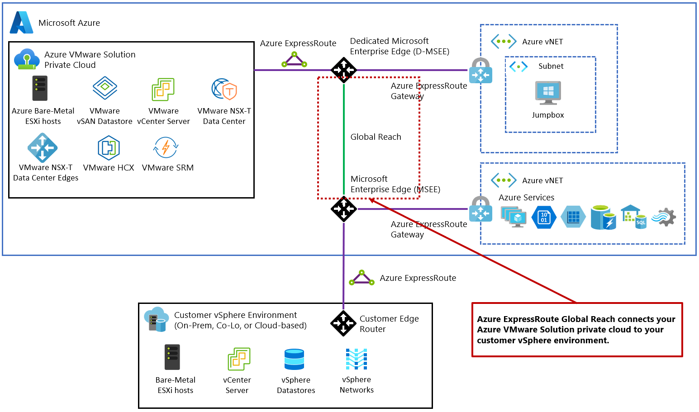
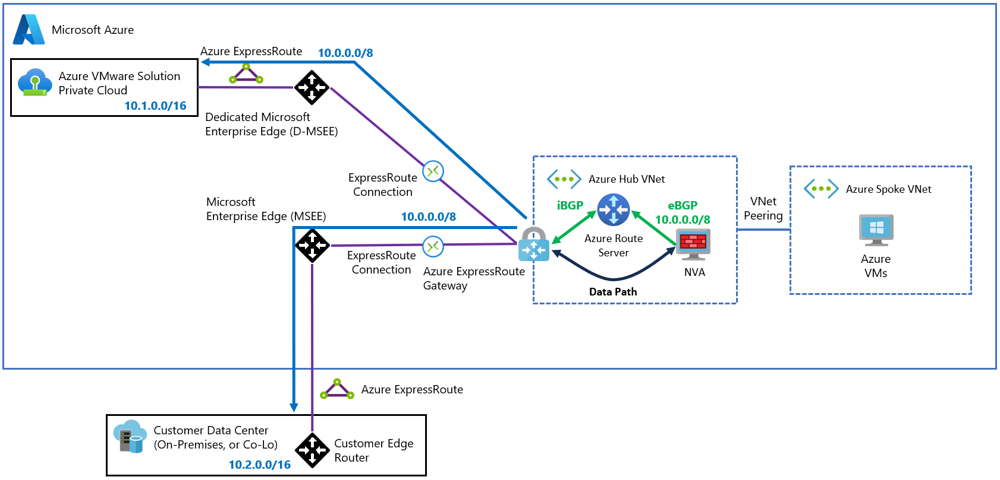
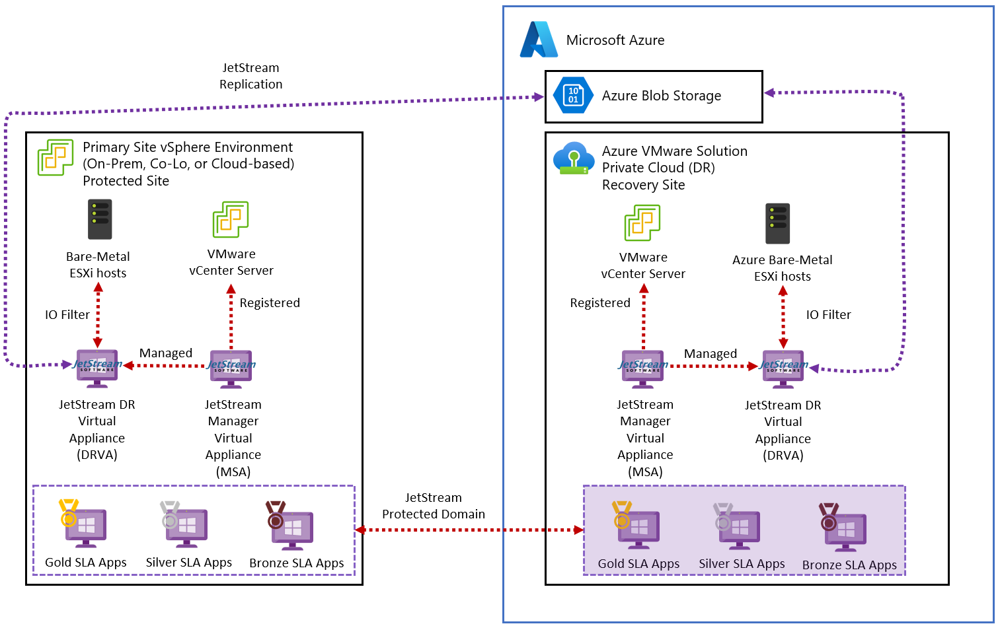
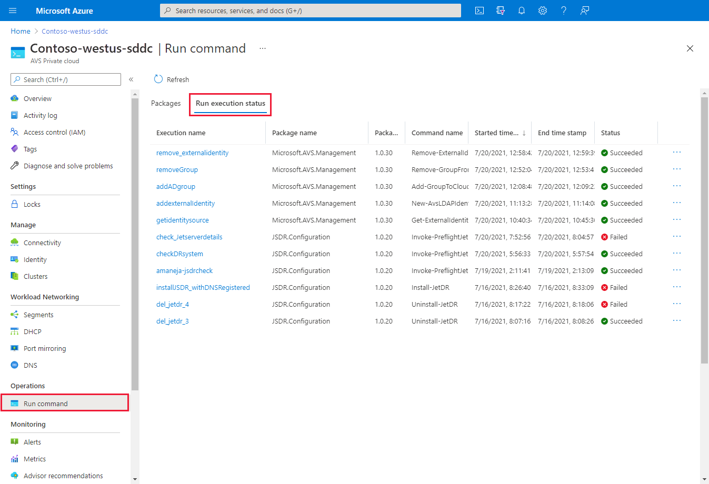
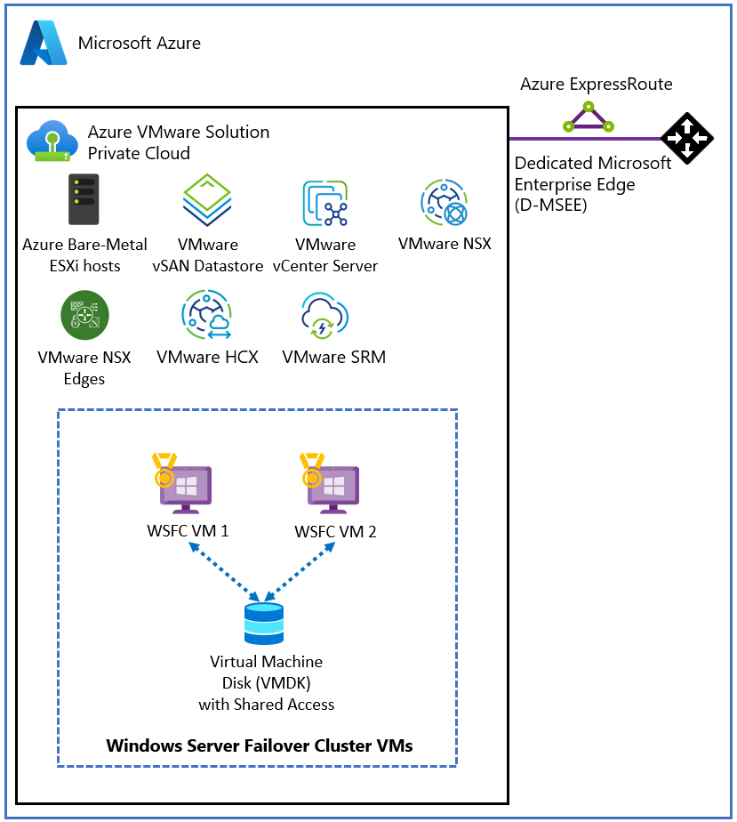

# JetStream Disaster Recovery for Azure VMware Solution

## Architecture, Deployment, Recovery, and Operational Guide

## 1. Purpose and Operating Scenario

This guide describes an architecture for continuously replicating an on-premises VMware vSphere environment into Azure and recovering the workloads on Azure VMware Solution (AVS) by using JetStream Disaster Recovery. [Deploy disaster recovery using JetStream DR software](https://learn.microsoft.com/en-us/azure/azure-vmware/deploy-disaster-recovery-using-jetstream). The design assumes a high-impact failure scenario in which the primary data center becomes completely unavailable and hundreds of mission-critical virtual machines must be restored without direct administrative access to the destination hypervisor hosts.

* **Representative failure scenario:** The transcript uses an example in which approximately 300 mission-critical virtual machines become unavailable when the primary data center goes dark.
* **Business impact:** Every second of downtime may cost the organization tens of thousands of dollars, creating intense pressure to restore service quickly.
* **Administrative constraint:** The recovery target is a managed AVS private cloud where the customer does not receive root access to the ESXi hosts.
* **Primary objective:** Continuously replicate the on-premises environment into Azure Blob Storage and rehydrate the replicated data as running virtual machines in AVS following a disaster.
* **Consulting challenge:** A VMware administrator must understand not only JetStream, but also the non-negotiable architectural, networking, identity, storage, and support boundaries imposed by AVS.
* **Failure risk:** Treating AVS as an ordinary on-premises VMware cluster can cause deployment failures, prolonged troubleshooting, and misdirected support escalations.

> **Architectural interpretation:** The central design problem is not simply how to copy virtual machine disks. It is how to provide hypervisor-level continuous data protection inside a managed service where the customer cannot directly modify the hypervisor.

---

## 2. Azure VMware Solution Foundation

AVS provides a native VMware environment on dedicated bare-metal Azure infrastructure in an Azure data center. It is not a nested VMware deployment running inside ordinary Azure virtual machines. [Introduction to Azure VMware Solution](https://learn.microsoft.com/en-us/azure/azure-vmware/introduction).

### 2.1 Physical and Software Architecture

* **Bare-metal service:** Microsoft provisions dedicated physical servers for the customer’s AVS private cloud. [Azure VMware Solution private cloud and cluster concepts](https://learn.microsoft.com/en-us/azure/azure-vmware/architecture-private-clouds).
* **Node families mentioned in the transcript:** Depending on regional availability and the selected generation, an AVS deployment may use documented host types including AV36, AV36P, AV48, AV52, and AV64. [Hosts](https://learn.microsoft.com/en-us/azure/azure-vmware/introduction#hosts-clusters-and-private-clouds).
* **Hypervisor:** The physical nodes run the native VMware ESXi hypervisor. [Azure VMware Solution private cloud and cluster concepts](https://learn.microsoft.com/en-us/azure/azure-vmware/architecture-private-clouds).
* **Management plane:** The environment includes VMware vCenter Server for cluster and virtual machine administration. [Azure VMware Solution private cloud and cluster concepts](https://learn.microsoft.com/en-us/azure/azure-vmware/architecture-private-clouds).
* **Network virtualization:** The environment includes VMware NSX for virtual networking and segmentation. [Azure VMware Solution private cloud and cluster concepts](https://learn.microsoft.com/en-us/azure/azure-vmware/architecture-private-clouds).
* **Storage layer:** The environment uses VMware vSAN as its native, cluster-wide datastore. [Azure VMware Solution storage concepts](https://learn.microsoft.com/en-us/azure/azure-vmware/architecture-storage).
* **Operational model:** The customer manages workloads and permitted logical VMware constructs, while Microsoft manages the physical infrastructure and the deployment, patching, and upgrade lifecycle of ESXi, vCenter Server, NSX, and vSAN. [Azure VMware Solution responsibility matrix—Microsoft versus customer](https://learn.microsoft.com/en-us/azure/azure-vmware/introduction#azure-vmware-solution-responsibility-matrix---microsoft-vs-customer).

*Source: [Microsoft Learn — Azure VMware Solution private cloud and cluster concepts](https://learn.microsoft.com/en-us/azure/azure-vmware/architecture-private-clouds)*

An isolated AVS private cloud cannot support this JetStream disaster-recovery scenario by itself. JetStream requires connectivity between its appliances and the Azure Storage blob instance, plus DNS resolution for AVS management and JetStream service endpoints. [Scenario 1 prerequisites](https://learn.microsoft.com/en-us/azure/azure-vmware/deploy-disaster-recovery-using-jetstream#scenario-1-on-premises-vmware-vsphere-to-azure-vmware-solution-dr).

### 2.2 Traditional VMware Versus AVS

| Area                     | Traditional on-premises vSphere                                              | Azure VMware Solution                                                              |
| ------------------------ | ---------------------------------------------------------------------------- | ---------------------------------------------------------------------------------- |
| Physical hardware        | Owned or directly controlled by the customer.                                | Dedicated bare-metal hardware is provisioned and operated by Microsoft. [Azure VMware Solution responsibility matrix—Microsoft versus customer](https://learn.microsoft.com/en-us/azure/azure-vmware/introduction#azure-vmware-solution-responsibility-matrix---microsoft-vs-customer) |
| ESXi root access         | The customer can typically obtain root access and use Secure Shell (SSH).    | Administrator access to ESXi is restricted; the customer does not receive the ESXi root account. [Access and identity architecture](https://learn.microsoft.com/en-us/azure/azure-vmware/architecture-identity) |
| Hypervisor customization | Administrators can install drivers, agents, and VMware Installation Bundles. | CloudAdmin cannot perform arbitrary privileged host installation; approved partner integrations use supported automation such as Run Command. [Use Run Commands in Azure VMware Solution](https://learn.microsoft.com/en-us/azure/azure-vmware/using-run-command) |
| Hardware troubleshooting | Administrators may inspect and manipulate the physical system directly.      | Microsoft owns the bare-metal and VMware platform lifecycle responsibilities. [Azure VMware Solution responsibility matrix—Microsoft versus customer](https://learn.microsoft.com/en-us/azure/azure-vmware/introduction#azure-vmware-solution-responsibility-matrix---microsoft-vs-customer) |
| Administrative role      | Full local or directory-based administrative control is common.              | The customer receives the restricted CloudAdmin role in vCenter Server and admin access in NSX Manager. [Access and identity architecture](https://learn.microsoft.com/en-us/azure/azure-vmware/architecture-identity) |
| Lifecycle responsibility | The customer controls hardware and hypervisor maintenance.                   | Microsoft is responsible for physical infrastructure and the ESXi, vCenter Server, NSX, and vSAN platform lifecycle. [Azure VMware Solution responsibility matrix—Microsoft versus customer](https://learn.microsoft.com/en-us/azure/azure-vmware/introduction#azure-vmware-solution-responsibility-matrix---microsoft-vs-customer) |

> **Transcript-derived analogy:** An on-premises environment is like owning a building and possessing the keys to every utility room. AVS is more like renting a fully furnished luxury apartment: the tenant can rearrange the furniture, represented by the virtual machines, but cannot enter the boiler room or main electrical panel, represented by ESXi root access.

**Operational implication:** Any disaster recovery product selected for AVS must operate within CloudAdmin restrictions and use an approved privileged workflow for host-level actions. JetStream installation on AVS is automated through Run Command because CloudAdmin lacks sufficient privileges for direct installation. [Install JetStream DR on Azure VMware Solution](https://learn.microsoft.com/en-us/azure/azure-vmware/deploy-disaster-recovery-using-jetstream#install-jetstream-dr-on-azure-vmware-solution).

---

## 3. Connectivity Between On-Premises vSphere and AVS

Continuous replication requires reliable connectivity between the primary-site JetStream appliances and Azure Storage, and the recovery design also needs reachability to the AVS environment. For AVS Generation 1, Microsoft documents direct ExpressRoute Global Reach as the preferred on-premises connectivity pattern, while alternative routed designs are available where Global Reach cannot be used. [Connectivity between Azure VMware Solution and an on-premises network](https://learn.microsoft.com/en-us/azure/azure-vmware/architecture-network-design-considerations#connectivity-between-azure-vmware-solution-and-an-on-premises-network).

### 3.1 ExpressRoute Architecture

* **Customer circuit:** In the direct Generation 1 pattern, the customer establishes an ExpressRoute circuit connecting the on-premises network to Microsoft. [Azure ExpressRoute overview](https://learn.microsoft.com/en-us/azure/expressroute/expressroute-introduction).
* **AVS circuit:** Each AVS Generation 1 environment has its own managed ExpressRoute circuit and Microsoft Enterprise Edge context. [Azure VMware Solution networking and interconnectivity concepts](https://learn.microsoft.com/en-us/azure/azure-vmware/architecture-networking).
* **Routing gap:** Terminating two circuits on the same ExpressRoute virtual network gateway does not make the gateway a transit router between those circuits. [Azure VMware Solution networking and interconnectivity concepts](https://learn.microsoft.com/en-us/azure/azure-vmware/architecture-networking).
* **Direct-pattern bridge:** ExpressRoute Global Reach links the customer circuit and the AVS circuit at the Microsoft edge. [Peer on-premises environments to Azure VMware Solution](https://learn.microsoft.com/en-us/azure/azure-vmware/tutorial-expressroute-global-reach-private-cloud).
* **Direct traffic path:** Global Reach connects the circuits directly at the Microsoft Edge level and avoids the additional NVA hairpin required by alternative routed topologies. [Azure VMware Solution networking and interconnectivity concepts](https://learn.microsoft.com/en-us/azure/azure-vmware/architecture-networking).
* **Architectural interpretation:** Avoiding unnecessary intermediate hops can reduce latency and avoid placing an additional NVA or gateway in the replication path; actual performance must be measured in the customer environment. [Network design considerations](https://learn.microsoft.com/en-us/azure/azure-vmware/architecture-network-design-considerations).

*Source: [Microsoft Learn — Tutorial: Peer on-premises environments to Azure VMware Solution](https://learn.microsoft.com/en-us/azure/azure-vmware/tutorial-expressroute-global-reach-private-cloud)*

> **Documentation correction:** Microsoft describes direct ExpressRoute Global Reach as the **preferred**, not universally mandatory, Generation 1 connection between AVS and on-premises. Where Global Reach is unavailable or traffic must traverse an inspection appliance, Microsoft documents NVA-based supernet and transit-spoke patterns; AVS Generation 2 instead uses native virtual-network attachment and must be designed under its separate routing model. [Connectivity between Azure VMware Solution and an on-premises network](https://learn.microsoft.com/en-us/azure/azure-vmware/architecture-network-design-considerations#connectivity-between-azure-vmware-solution-and-an-on-premises-network).

### 3.2 Symmetric Routing Requirement

Where a stateful firewall or NVA is inserted, routing must be designed so both directions of a connection traverse the intended inspection path. Azure Firewall is a fully stateful service, and Microsoft’s AVS network-design guidance uses route advertisements and UDRs to force the required hairpin through the NVA. [Azure Firewall FAQ](https://learn.microsoft.com/en-us/azure/firewall/firewall-faq); [Supernet design topology](https://learn.microsoft.com/en-us/azure/azure-vmware/architecture-network-design-considerations#supernet-design-topology).

*Source: [Microsoft Learn — Azure VMware Solution network design considerations](https://learn.microsoft.com/en-us/azure/azure-vmware/architecture-network-design-considerations#supernet-design-topology)*

#### Failure Mechanics

> **Architectural interpretation:** The following packet-level sequence illustrates a common asymmetric-routing failure for a stateful firewall. Microsoft documents Azure Firewall as fully stateful and documents route advertisements and UDRs as the controls used to force AVS traffic through an inspection NVA. [Azure Firewall FAQ](https://learn.microsoft.com/en-us/azure/firewall/firewall-faq); [Supernet design topology](https://learn.microsoft.com/en-us/azure/azure-vmware/architecture-network-design-considerations#supernet-design-topology).

1. The on-premises JetStream replication appliance sends a Transmission Control Protocol (TCP) SYN packet toward AVS.
2. Border Gateway Protocol (BGP) routing sends the packet over the direct Global Reach path.
3. The AVS-side system receives the SYN packet and returns a SYN-ACK packet.
4. A route advertisement or preference error causes the return packet to use another path, such as:

   * A public IP route.
   * An Azure Firewall in a hub virtual network.
   * Another network or security appliance.
5. The stateful firewall on the alternate path receives the SYN-ACK packet.
6. Because the firewall did not observe the original SYN packet, it does not possess a valid session entry.
7. The firewall treats the SYN-ACK as unsolicited traffic and drops it.
8. The TCP three-way handshake never completes.

### 3.3 Observable Symptoms

> **Operational interpretation:** These symptoms are plausible indicators of route, DNS, firewall, or endpoint problems, but they are not diagnostic by themselves. Validate the documented JetStream prerequisites and the AVS route design before attributing the fault to the product. [Scenario 1 prerequisites](https://learn.microsoft.com/en-us/azure/azure-vmware/deploy-disaster-recovery-using-jetstream#scenario-1-on-premises-vmware-vsphere-to-azure-vmware-solution-dr); [Network design considerations](https://learn.microsoft.com/en-us/azure/azure-vmware/architecture-network-design-considerations).

* JetStream may report the target environment as disconnected.
* Connections may appear to time out without a clear application-level explanation.
* Administrators may repeatedly restart services or inspect appliance logs without finding the root cause.
* The true problem may remain hidden at Layer 3 because the replication software itself is functioning correctly.
* Firewall logs may show dropped return packets, but only if the correct device and traffic direction are examined.

### 3.4 Network Validation Procedure

1. Engage the customer’s network engineering team before installing JetStream.
2. Document the customer ExpressRoute circuit and the Microsoft-managed AVS ExpressRoute circuit.
3. Verify that Global Reach is provisioned and operational.
4. Review BGP route advertisements in both directions.
5. Confirm that the source-to-AVS and AVS-to-source paths are symmetric.
6. Identify any firewalls, network virtual appliances, public routes, or hub virtual networks that could attract the return traffic.
7. Test the complete TCP path from the networks where the JetStream appliances will operate.
8. Validate Domain Name System (DNS) resolution over the same hybrid network path.
9. Capture routing and firewall evidence before proceeding to application deployment.

> **Operational recommendation:** Do not begin JetStream deployment until the network team has demonstrated end-to-end reachability and, where stateful inspection is used, a consistent forward and return path. A healthy ExpressRoute circuit alone does not prove that route propagation, UDRs, or firewall state are correct. [Network planning checklist](https://learn.microsoft.com/en-us/azure/azure-vmware/architecture-network-design-considerations).

---

## 4. AVS Identity, Privilege, and Shared Responsibility

The AVS privilege model creates the main compatibility problem for disaster-recovery products that expect unrestricted host administration. Microsoft retains responsibility for the physical infrastructure and the ESXi, vCenter Server, NSX, and vSAN lifecycle, while customers operate with the restricted CloudAdmin role. [Azure VMware Solution responsibility matrix—Microsoft versus customer](https://learn.microsoft.com/en-us/azure/azure-vmware/introduction#azure-vmware-solution-responsibility-matrix---microsoft-vs-customer); [Access and identity architecture](https://learn.microsoft.com/en-us/azure/azure-vmware/architecture-identity).

### 4.1 Cloud Admin Limitations

* **No ESXi root access:** Customers do not receive the ESXi root account. [Access and identity architecture](https://learn.microsoft.com/en-us/azure/azure-vmware/architecture-identity).
* **No unrestricted SSH:** CloudAdmin does not provide an unrestricted host shell or ESXi root workflow. [Can I have administrator access to ESXi hosts?](https://learn.microsoft.com/en-us/azure/azure-vmware/faq#can-have-administrator-access-to-esxi-hosts).
* **No kernel modification:** CloudAdmin cannot freely modify Microsoft-managed host and platform components. [Access and identity architecture](https://learn.microsoft.com/en-us/azure/azure-vmware/architecture-identity).
* **No direct agent installation:** A product that requires privileges beyond CloudAdmin needs a supported privileged automation path; JetStream uses AVS Run Command for installation. [Install JetStream DR on Azure VMware Solution](https://learn.microsoft.com/en-us/azure/azure-vmware/deploy-disaster-recovery-using-jetstream#install-jetstream-dr-on-azure-vmware-solution).
* **Support dependency:** Approved elevated operations are exposed through supported mechanisms such as curated Run Command packages. [Use Run Commands in Azure VMware Solution](https://learn.microsoft.com/en-us/azure/azure-vmware/using-run-command).

### 4.2 Why Legacy Disaster Recovery Tools Fail

> **Architectural interpretation:** A product workflow that requires the ESXi root account or privileges beyond CloudAdmin is incompatible with AVS unless the vendor and Microsoft provide an approved privileged integration. JetStream’s approved integration is Run Command. [Access and identity architecture](https://learn.microsoft.com/en-us/azure/azure-vmware/architecture-identity); [Install JetStream DR on Azure VMware Solution](https://learn.microsoft.com/en-us/azure/azure-vmware/deploy-disaster-recovery-using-jetstream#install-jetstream-dr-on-azure-vmware-solution).

Many traditional disaster recovery products assume the customer controls the hypervisor.

* They may open an SSH session to each ESXi host.
* They may install proprietary agents directly into the hypervisor.
* They may require the administrator to install a custom VMware Installation Bundle (VIB).
* They may modify host-level services or configuration files.
* Their deployment scripts may terminate immediately with an access-denied error under the AVS Cloud Admin role.

### 4.3 VMware Installation Bundles

* **Definition:** A VIB is VMware’s packaging format for software installed on an ESXi host.
* **Typical content:** A VIB may contain a driver, monitoring component, filter, or host-level agent.
* **Analogy:** A VIB serves a role comparable to an executable installer on Windows or a package on Linux.
* **AVS restriction:** CloudAdmin does not have sufficient privilege to install JetStream directly; Microsoft’s documented AVS workflow invokes the JetStream Run Command package, which installs the approved VIB as part of the deployment. [Install JetStream DR on Azure VMware Solution](https://learn.microsoft.com/en-us/azure/azure-vmware/deploy-disaster-recovery-using-jetstream#install-jetstream-dr-on-azure-vmware-solution).

JetStream provides hypervisor integration while respecting this restriction. Its AVS deployment uses the Azure VMware Solution Run Command workflow rather than giving the customer host-level credentials. [Use Run Commands in Azure VMware Solution](https://learn.microsoft.com/en-us/azure/azure-vmware/using-run-command).

---

## 5. JetStream Architecture

JetStream is a Continuous Data Protection platform whose documented components separate management, I/O capture, replication-log and transport functions, object storage, and recovery. [Core components of the JetStream DR solution](https://learn.microsoft.com/en-us/azure/azure-vmware/deploy-disaster-recovery-using-jetstream#core-components-of-the-jetstream-dr-solution).

### 5.1 Component Overview

| Component                                           | Primary role                                                                                                        | Data-plane involvement                                                |
| --------------------------------------------------- | ------------------------------------------------------------------------------------------------------------------- | --------------------------------------------------------------------- |
| Management Server Appliance (MSA)                   | Provides Day 0 and Day 2 configuration, statistics, protection-domain and recovery management, and vCenter integration. [Core components of the JetStream DR solution](https://learn.microsoft.com/en-us/azure/azure-vmware/deploy-disaster-recovery-using-jetstream#core-components-of-the-jetstream-dr-solution) | Does not handle protected-VM replication data. |
| Disaster Recovery Virtual Appliance (DRVA)          | Receives replication data from source ESXi hosts, maintains the replication log, and transfers VM data to object storage; JetStream also documents inline compression. [Core components of the JetStream DR solution](https://learn.microsoft.com/en-us/azure/azure-vmware/deploy-disaster-recovery-using-jetstream#core-components-of-the-jetstream-dr-solution); [JetStream DR key concepts](https://jetstreamsoft.com/portal/online-docs/jsdr-admin_5.0/concepts.html) | Performs the main replication data movement. |
| VMware vSphere APIs for I/O Filtering (VAIO) filter | Runs in the virtual-machine I/O path and enables continuous data interception for protected virtual disks. [Filtering virtual machine I/O in vSphere](https://techdocs.broadcom.com/us/en/vmware-cis/vsphere/vsphere/8-0/vsphere-storage/filtering-virtual-machine-i-o-in-vsphere.html); [Elements of JetStream DR](https://jetstreamsoft.com/portal/online-docs/jsdr-admin_5.0/keyelements.html) | Captures protected I/O for replication. |
| Azure Blob Storage                                  | Acts as the object-storage site for continuously replicated VM data and recovery state. [Deploy disaster recovery using JetStream DR software](https://learn.microsoft.com/en-us/azure/azure-vmware/deploy-disaster-recovery-using-jetstream) | Retains recovery data until failover, restore, or testing. |
| Recovery appliances in AVS                          | Read protected data from object storage and facilitate rehydration onto an AVS-accessible datastore; JetStream documentation identifies the temporary RocVA for this function. [JetStream DR key concepts](https://jetstreamsoft.com/portal/online-docs/jsdr-admin_5.0/concepts.html) | Performs recovery-side reconstruction. |

*Source: [Microsoft Learn — Deploy disaster recovery using JetStream DR software](https://learn.microsoft.com/en-us/azure/azure-vmware/deploy-disaster-recovery-using-jetstream#scenario-1-on-premises-vmware-vsphere-to-azure-vmware-solution-dr)*

### 5.2 Management Server Appliance

* **Deployment format:** The MSA is deployed from an OVA file on a vSphere node. [Core components of the JetStream DR solution](https://learn.microsoft.com/en-us/azure/azure-vmware/deploy-disaster-recovery-using-jetstream#core-components-of-the-jetstream-dr-solution).
* **Configuration role:** It creates and manages replication policies.
* **Orchestration role:** It manages protection, failover, recovery, and runbook execution.
* **User-interface integration:** It implements a vCenter Server plug-in and can be managed through the vSphere Client. [Core components of the JetStream DR solution](https://learn.microsoft.com/en-us/azure/azure-vmware/deploy-disaster-recovery-using-jetstream#core-components-of-the-jetstream-dr-solution).
* **Metadata role:** It manages configuration and replication metadata.
* **Data-path limitation:** It does not handle protected-VM replication data. [Core components of the JetStream DR solution](https://learn.microsoft.com/en-us/azure/azure-vmware/deploy-disaster-recovery-using-jetstream#core-components-of-the-jetstream-dr-solution).

> **Transcript-derived analogy:** The MSA is the air traffic control tower. It assigns routes, coordinates schedules, and monitors operations, but it does not carry the passengers or cargo.

### 5.3 Disaster Recovery Virtual Appliance

* **Appliance type:** Microsoft documents the DRVA as a Linux-based virtual-machine appliance. [Core components of the JetStream DR solution](https://learn.microsoft.com/en-us/azure/azure-vmware/deploy-disaster-recovery-using-jetstream#core-components-of-the-jetstream-dr-solution).
* **Source-side function:** It receives protected-VM replication data from the source ESXi host after the I/O filter captures the data. [Core components of the JetStream DR solution](https://learn.microsoft.com/en-us/azure/azure-vmware/deploy-disaster-recovery-using-jetstream#core-components-of-the-jetstream-dr-solution).
* **Log function:** It maintains the replication log. [JetStream DR key concepts](https://jetstreamsoft.com/portal/online-docs/jsdr-admin_5.0/concepts.html).
* **Transport preparation:** JetStream documents inline compression; encryption behavior and key management should be validated against the exact JetStream 5.x administration guide and deployment configuration. [Elements of JetStream DR](https://jetstreamsoft.com/portal/online-docs/jsdr-admin_5.0/keyelements.html).
* **Network function:** It streams the blocks across the hybrid network path to Azure.
* **Recovery-side function:** JetStream uses recovery appliances to retrieve data from object storage and rehydrate protected VMs during recovery; the current JetStream terminology identifies the temporary Recovery from Object Cloud Virtual Appliance (RocVA). [JetStream DR key concepts](https://jetstreamsoft.com/portal/online-docs/jsdr-admin_5.0/concepts.html).

### 5.4 Azure Blob Storage

* **Purpose:** Azure Blob Storage can hold the continuously replicated data while the recovery environment consumes minimal resources. [Deploy disaster recovery using JetStream DR software](https://learn.microsoft.com/en-us/azure/azure-vmware/deploy-disaster-recovery-using-jetstream).
* **Durability model:** The transcript presents Blob Storage as the durable off-site repository for recovery data.
* **Cost role:** JetStream’s object-storage model is designed to reduce resources consumed at the recovery site; whether it eliminates all continuously reserved recovery-datastore capacity depends on the selected recovery mode, replication-log placement, and near-zero-RTO configuration. [JetStream scenarios on Azure VMware Solution](https://learn.microsoft.com/en-us/azure/azure-vmware/deploy-disaster-recovery-using-jetstream#jetstream-scenarios-on-azure-vmware-solution).
* **Activation model:** The data is converted back into virtual machine disks only during a failover, recovery exercise, or similar recovery operation.

### 5.5 VAIO I/O Filtering

VAIO stands for VMware vSphere APIs for I/O Filtering. VMware documents I/O filters as software components placed directly in the virtual-machine I/O path, and JetStream uses them for continuous data interception without using snapshot-based capture. [Filtering virtual machine I/O in vSphere](https://techdocs.broadcom.com/us/en/vmware-cis/vsphere/vsphere/8-0/vsphere-storage/filtering-virtual-machine-i-o-in-vsphere.html); [Elements of JetStream DR](https://jetstreamsoft.com/portal/online-docs/jsdr-admin_5.0/keyelements.html).

1. An operating system inside a protected virtual machine issues a disk-write operation.
2. The VAIO filter intercepts the write in the ESXi I/O path.
3. The filter creates a mirrored copy of the changed block.
4. The mirrored block is sent to the source-side DRVA.
5. The original write is allowed to continue to the local datastore.
6. The virtual machine continues operating without a snapshot creation or consolidation event.

* **Application transparency:** The guest operating system does not need to know that its disk writes are being replicated.
* **No delta disk dependency:** The process does not redirect writes into a temporary snapshot delta file.
* **No snapshot consolidation:** Because JetStream’s capture mechanism does not depend on periodic VMware snapshots, it avoids snapshot-removal and consolidation operations as part of normal replication. [Continuous Data Protection for Near Zero RPO](https://jetstreamsoft.com/product-portfolio/jetstream-dr/#continuous-data-protection-for-near-zero-rpo).
* **Recovery objective:** JetStream describes continuous capture as providing a near-zero RPO; actual achieved RPO depends on workload, replication-log performance, network throughput, and object-storage performance. [Continuous Data Protection for Near Zero RPO](https://jetstreamsoft.com/product-portfolio/jetstream-dr/#continuous-data-protection-for-near-zero-rpo).

---

## 6. Snapshot-Based Protection Versus VAIO

The transcript contrasts conventional snapshot-based backup with JetStream’s inline write interception. Broadcom documents that snapshot removal consolidates delta-disk changes and can stun a VM, with the impact increasing when substantial delta data has accumulated. [Snapshot removal stops a virtual machine for a long time](https://knowledge.broadcom.com/external/article/323397/snapshot-removal-stops-a-virtual-machine.html).

### 6.1 Conventional Snapshot Sequence

Broadcom documents snapshot delta disks, snapshot removal, and consolidation behavior; the sequence below is a simplified operational explanation. [Overview of virtual machine snapshots in vSphere](https://knowledge.broadcom.com/external/article/342618/overview-of-virtual-machine-snapshots-in.html); [Snapshot removal stops a virtual machine for a long time](https://knowledge.broadcom.com/external/article/323397/snapshot-removal-stops-a-virtual-machine.html).

1. The protection platform requests a VMware snapshot.
2. VMware makes the base virtual disk read-only for the duration of the snapshot.
3. New writes are redirected into a temporary delta disk.
4. The protection software copies the stable base disk.
5. When the copy operation finishes, VMware merges the delta-disk changes back into the base disk.
6. The merge process performs snapshot consolidation.
7. The virtual machine may be paused, or “stunned,” while storage metadata and outstanding writes are reconciled.

### 6.2 Snapshot Consolidation Risks

* **Stun duration:** The consolidation stun is normally brief but can become noticeable or disruptive when a temporary snapshot has accumulated substantial delta data. [Snapshot removal stops a virtual machine for a long time](https://knowledge.broadcom.com/external/article/323397/snapshot-removal-stops-a-virtual-machine.html).
* **Growth dependency:** A larger accumulated delta can increase consolidation work and VM stun exposure. [Snapshot removal stops a virtual machine for a long time](https://knowledge.broadcom.com/external/article/323397/snapshot-removal-stops-a-virtual-machine.html).
* **Low-impact workload:** A brief pause on a lightly used file server during an overnight backup may be operationally acceptable.
* **High-impact workload:** A pause on a heavily transactional database can cause application-visible disruption; Broadcom advises against treating VM snapshots as a database backup mechanism and documents sensitivity of database workloads to snapshot stun. [Guidance on using snapshots for database virtual machines in VMware vSphere](https://knowledge.broadcom.com/external/article/426571/guidance-on-using-snapshots-for-database.html).
* **Monitoring effects:** Database or application monitoring may report corruption warnings or availability failures even when the underlying disk remains recoverable.
* **Continuous-replication limitation:** Repeated snapshot and consolidation cycles are unsuitable for highly active Tier 1 workloads when a very low RPO is required.

### 6.3 Behavioral Comparison

| Characteristic                | Snapshot-based protection                                 | JetStream VAIO-based protection                              |
| ----------------------------- | --------------------------------------------------------- | ------------------------------------------------------------ |
| Capture event                 | Periodic snapshot.                                        | Every write is intercepted inline.                           |
| Temporary delta disk          | Required.                                                 | Not required.                                                |
| Consolidation                 | Required after the copy.                                  | Not required.                                                |
| Stun exposure                 | May occur during snapshot creation or consolidation. [Snapshot removal stops a virtual machine for a long time](https://knowledge.broadcom.com/external/article/323397/snapshot-removal-stops-a-virtual-machine.html) | JetStream does not use snapshots for its continuous capture path, so snapshot-consolidation stun is not part of normal replication. [Continuous Data Protection for Near Zero RPO](https://jetstreamsoft.com/product-portfolio/jetstream-dr/#continuous-data-protection-for-near-zero-rpo) |
| Transactional workload impact | Can cause timeouts or dropped sessions.                   | Designed for continuous protection of active workloads.      |
| Typical RPO                   | Depends on the backup schedule and product behavior. | JetStream documents near-zero RPO from continuous capture; achieved RPO is environment-dependent. [Continuous Data Protection for Near Zero RPO](https://jetstreamsoft.com/product-portfolio/jetstream-dr/#continuous-data-protection-for-near-zero-rpo) |

> **Documentation correction:** “No stun time” should be read narrowly as avoiding snapshot-related stun in the continuous replication path, not as a guarantee of zero latency or zero workload impact. VMware I/O filters execute in the VM I/O path, and JetStream sizing must account for workload, replication-log, network, and storage performance. [Filtering virtual machine I/O in vSphere](https://techdocs.broadcom.com/us/en/vmware-cis/vsphere/vsphere/8-0/vsphere-storage/filtering-virtual-machine-i-o-in-vsphere.html); [JetStream DR key concepts](https://jetstreamsoft.com/portal/online-docs/jsdr-admin_5.0/concepts.html).

---

## 7. Protected Domains and Replication Organization

JetStream uses protected domains to group a VM or set of VMs that will be protected and restored together. [Key Concepts](https://jetstreamsoft.com/portal/online-docs/jsdr-admin_5.0/concepts.html).

### 7.1 Protected Domain Characteristics

* **Policy grouping:** Virtual machines in a protected domain share the same service-level objectives and protection policies.
* **RPO grouping:** The workloads use the same RPO target.
* **Runbook grouping:** They share the same failover sequence and recovery runbook.
* **Administrative boundary:** The domain allows related systems to be operated and monitored as one recovery unit.
* **Storage relationship:** JetStream documents that all VMs in a protected domain are replicated to the same storage-site container. [JetStream DR key concepts](https://jetstreamsoft.com/portal/online-docs/jsdr-admin_5.0/concepts.html).
* **Appliance relationship:** A protected domain is configured with a DRVA and replication-log volume, but JetStream supports one or more DRVAs per protected cluster and does not document a universal one-DRVA-per-domain scaling rule. [Configure JetStream DR](https://learn.microsoft.com/en-us/azure/azure-vmware/deploy-disaster-recovery-using-jetstream#configure-jetstream-dr); [JetStream DR key concepts](https://jetstreamsoft.com/portal/online-docs/jsdr-admin_5.0/concepts.html).

> **Documentation correction:** The same-container relationship is directly documented for the VMs in a protected domain. A strict one-to-one protected-domain-to-DRVA relationship is not documented; JetStream states that at least one DRVA is required per protected cluster and that additional DRVAs can be deployed, subject to sizing. [JetStream DR key concepts](https://jetstreamsoft.com/portal/online-docs/jsdr-admin_5.0/concepts.html).

### 7.2 Example Domain Design

> **Architectural interpretation:** The following names and service levels are examples. JetStream documents protected domains as groups of VMs protected and restored together; the customer defines the business grouping and runbook. [Key Concepts](https://jetstreamsoft.com/portal/online-docs/jsdr-admin_5.0/concepts.html).

| Protected domain | Example workloads                                              | Intended service level                                          |
| ---------------- | -------------------------------------------------------------- | --------------------------------------------------------------- |
| Tier 1 Gold      | Customer-facing databases and critical application components. | Lowest RPO and highest-priority recovery runbook.               |
| Tier 3 Bronze    | Internal development or test servers.                          | Lower-priority recovery and less aggressive service objectives. |

A protected domain should group systems according to application dependency, recovery order, business priority, and common protection requirements. A multi-tier application may need its database, middleware, and web components in the same domain or in coordinated runbooks.

---

## 8. End-to-End Replication Data Flow

The following sequence traces a write from an on-premises virtual machine to its durable copy in Azure Blob Storage.

1. **The application generates a write.**
   An end user or application saves a transaction, causing the guest operating system to issue a disk-write operation.

2. **The VAIO filter intercepts the write.**
   The filter operating in the ESXi I/O path observes the block without creating a snapshot or pausing the virtual machine for snapshot consolidation.

3. **The block is mirrored to the source DRVA.**
   The original write continues to the local datastore while the copy enters the JetStream data pipeline.

4. **The DRVA processes the block.**
   The appliance records it in the replication stream and compresses it. The transcript also states that the DRVA encrypts the block; the reviewed public component documentation directly confirms compression but does not separately document that encryption step. [Core components of the JetStream DR solution](https://learn.microsoft.com/en-us/azure/azure-vmware/deploy-disaster-recovery-using-jetstream#core-components-of-the-jetstream-dr-solution).

5. **The block crosses the hybrid connection.**
   The DRVA transmits it over the ExpressRoute Global Reach path.

6. **The block reaches Azure Blob Storage.**
   The protected data is transferred to the object-store container. The replication log itself is maintained on the replication-log volume at the protected site; JetStream distinguishes that local log from the protected-domain objects in cloud storage. [JetStream DR key concepts](https://jetstreamsoft.com/portal/online-docs/jsdr-admin_5.0/concepts.html).

7. **The recovery history remains dormant.**
   The replicated data remains in object storage until a failover, test, or recovery operation requests rehydration.

* **Data location:** The protected block is now off-site from the primary data center.
* **RPO effect:** Because each write is streamed continuously, the available recovery point can closely follow the production state.
* **Control-plane separation:** The MSA monitors and orchestrates this process but does not carry the write payload.

**Takeaway:** Successful replication depends simultaneously on I/O-filter capture, DRVA and replication-log performance, network reachability and route design, DNS resolution, supported Blob Storage configuration, and object-store access. [Scenario 1 prerequisites](https://learn.microsoft.com/en-us/azure/azure-vmware/deploy-disaster-recovery-using-jetstream#scenario-1-on-premises-vmware-vsphere-to-azure-vmware-solution-dr).

---

## 9. Storage Economics and Rehydration

The architecture can separate object-storage retention from the compute and datastore capacity used to run recovered VMs. JetStream documents a cost-effective model that uses Azure Blob Storage and can recover to AVS vSAN, Azure NetApp Files, or Azure Elastic SAN, depending on the configuration. [Disaster recovery with external storage, JetStream DR, and Azure VMware Solution](https://learn.microsoft.com/en-us/azure/azure-vmware/deploy-disaster-recovery-using-jetstream#disaster-recovery-with-external-storage-jetstream-dr-and-azure-vmware-solution).

### 9.1 vSAN Capacity Model

* **Hyper-converged design:** Local storage in each cluster host is claimed into the cluster-wide vSAN datastore. [vSAN clusters](https://learn.microsoft.com/en-us/azure/azure-vmware/architecture-storage#vsan-clusters).
* **Coupled scaling:** Native vSAN raw capacity grows with host count because each host contributes local capacity devices. [vSAN clusters](https://learn.microsoft.com/en-us/azure/azure-vmware/architecture-storage#vsan-clusters).
* **Compute consequence:** A customer may be forced to purchase CPU and memory even when only additional storage is required.
* **Cost consequence:** Maintaining a large AVS cluster solely to hold dormant disaster recovery data can undermine the financial value of cloud-based recovery.
* **Billing model:** AVS host pricing and reservation options vary by host type, region, and purchase model; use the current Azure pricing calculator rather than the transcript for financial estimates. [Hosts, clusters, and private clouds](https://learn.microsoft.com/en-us/azure/azure-vmware/introduction#hosts-clusters-and-private-clouds).
* **Idle-resource problem:** A large standby cluster may remain unused during normal operations while still generating substantial cost.

### 9.2 Blob Storage Configuration

The transcript specifies the following storage-account characteristics:

* The JetStream prerequisite permits an Azure Blob Storage account using either the Standard or Premium performance tier. [Scenario 1 prerequisites](https://learn.microsoft.com/en-us/azure/azure-vmware/deploy-disaster-recovery-using-jetstream#scenario-1-on-premises-vmware-vsphere-to-azure-vmware-solution-dr).
* The Blob access tier must be set to Hot for the documented JetStream deployment. [Scenario 1 prerequisites](https://learn.microsoft.com/en-us/azure/azure-vmware/deploy-disaster-recovery-using-jetstream#scenario-1-on-premises-vmware-vsphere-to-azure-vmware-solution-dr).
* The storage account must expose the standard Azure Blob interface expected by JetStream; enabling Hierarchical Namespace changes Blob Storage to the Data Lake Storage Gen2 namespace and is not supported for this deployment. [Scenario 1 prerequisites](https://learn.microsoft.com/en-us/azure/azure-vmware/deploy-disaster-recovery-using-jetstream#scenario-1-on-premises-vmware-vsphere-to-azure-vmware-solution-dr); [The benefits of a hierarchical namespace](https://learn.microsoft.com/en-us/azure/storage/blobs/data-lake-storage-namespace).
* Hierarchical Namespace must not be enabled for the JetStream Blob account. [Scenario 1 prerequisites](https://learn.microsoft.com/en-us/azure/azure-vmware/deploy-disaster-recovery-using-jetstream#scenario-1-on-premises-vmware-vsphere-to-azure-vmware-solution-dr).
* The account must be reachable from the participating DRVA networks through the customer’s permitted routing, DNS, and firewall design. [Scenario 1 prerequisites](https://learn.microsoft.com/en-us/azure/azure-vmware/deploy-disaster-recovery-using-jetstream#scenario-1-on-premises-vmware-vsphere-to-azure-vmware-solution-dr).
* The DRVA must authenticate to the storage endpoint by using credentials supported by the installed JetStream release. The reviewed Microsoft deployment page does not enumerate every supported authentication method, so validate this detail against the current JetStream guide. [Object Storage](https://jetstreamsoft.com/portal/online-docs/jsdr-admin/ObjectStorage.html).

> **Operational recommendation:** Microsoft documents the Standard-or-Premium, Hot-tier, and HNS-disabled prerequisites, but it does not enumerate every supported redundancy, authentication, private-endpoint, firewall, and account-kind combination on the AVS deployment page. Validate those details against the current JetStream 5.x guide and test the exact storage-account configuration. [Scenario 1 prerequisites](https://learn.microsoft.com/en-us/azure/azure-vmware/deploy-disaster-recovery-using-jetstream#scenario-1-on-premises-vmware-vsphere-to-azure-vmware-solution-dr).

### 9.3 Rehydration Process

When failover is initiated, the protected objects are rehydrated into VMs on an AVS-accessible datastore. Microsoft documents importing protected domains, deploying recovery appliances, configuring placement, and triggering failover; the detailed sequence is controlled by JetStream. [Install JetStream DR](https://learn.microsoft.com/en-us/azure/azure-vmware/deploy-disaster-recovery-using-jetstream#install-jetstream-dr); [JetStream DR key concepts](https://jetstreamsoft.com/portal/online-docs/jsdr-admin_5.0/concepts.html).

1. The MSA initiates the selected recovery runbook.
2. The Azure-side DRVA connects to the appropriate Blob container.
3. The DRVA reads the stored replication stream.
4. The DRVA reconstructs native virtual machine disk files on the selected AVS-accessible datastore.
5. The recovery process registers the virtual machines with AVS vCenter.
6. The runbook applies the required recovery ordering and configuration.
7. The virtual machines are powered on.
8. Network access is either enabled for production or restricted for forensic validation.

### 9.4 Storage Placement Choices

| Recovery datastore | Advantages                                                                                              | Limitations                                                                                                          |
| ------------------ | ------------------------------------------------------------------------------------------------------- | -------------------------------------------------------------------------------------------------------------------- |
| Native AVS vSAN    | Provides native cluster-wide storage from disks in the AVS hosts. [Azure VMware Solution storage concepts](https://learn.microsoft.com/en-us/azure/azure-vmware/architecture-storage) | Raw capacity scales with host count; usable capacity depends on storage policy, utilization, and reserved operational headroom. |
| Azure NetApp Files | Provides an NFSv3 datastore backed by Azure NetApp Files and lets storage scale separately from AVS host count. [Attach Azure NetApp Files datastores to Azure VMware Solution hosts](https://learn.microsoft.com/en-us/azure/azure-vmware/attach-azure-netapp-files-to-azure-vmware-solution-hosts) | Requires supported networking, volume configuration, capacity, service level, permissions, and regional availability. |
| Azure Elastic SAN  | Provides VMFS datastores backed by Elastic SAN volumes over iSCSI and is documented as a JetStream recovery target. [Use Azure VMware Solution with Azure Elastic SAN](https://learn.microsoft.com/en-us/azure/azure-vmware/configure-azure-elastic-san); [Disaster recovery with external storage, JetStream DR, and Azure VMware Solution](https://learn.microsoft.com/en-us/azure/azure-vmware/deploy-disaster-recovery-using-jetstream#disaster-recovery-with-external-storage-jetstream-dr-and-azure-vmware-solution) | Gen 1 and Gen 2 use different private-endpoint and connectivity models; follow the generation-specific configuration. |

> **Documentation correction:** The service is Azure Elastic SAN. Microsoft documents Elastic SAN as an Azure-native iSCSI block-storage option for AVS and explicitly identifies it as a supported JetStream recovery datastore. Gen 1 and Gen 2 attachment designs differ. [Azure Elastic SAN](https://learn.microsoft.com/en-us/azure/azure-vmware/ecosystem-external-storage-solutions#azure-elastic-san); [Configure private endpoint](https://learn.microsoft.com/en-us/azure/azure-vmware/configure-azure-elastic-san#configure-private-endpoint).

### 9.5 Azure NetApp Files as an External Datastore

* Azure NetApp Files volumes can be attached to AVS clusters as NFSv3 datastores. [Attach Azure NetApp Files datastores to Azure VMware Solution hosts](https://learn.microsoft.com/en-us/azure/azure-vmware/attach-azure-netapp-files-to-azure-vmware-solution-hosts).
* The AVS nodes provide the processor and memory required to run the recovered virtual machines.
* The ANF volume provides independently scalable storage.
* This design addresses a storage-heavy, compute-light recovery requirement.
* It may reduce the need to add AVS hosts only to gain vSAN capacity.
* It changes the recovery cost model by allowing compute and storage to scale separately.

*Source: [Microsoft Learn — Attach Azure NetApp Files datastores to Azure VMware Solution hosts](https://learn.microsoft.com/en-us/azure/azure-vmware/attach-azure-netapp-files-to-azure-vmware-solution-hosts)*

### 9.6 Transcript-Derived 300 TB Scenario

> **Transcript-derived calculation:**

**Inputs**

* Recovery dataset: 300 TB.
* Estimated additional AVS nodes mentioned in the scenario: approximately 10 to 15.
* The transcript does not provide a specific node model, vSAN policy, or usable capacity per node.

**Formula**

* Implied data allocation with 10 nodes:
  `300 TB ÷ 10 nodes = 30 TB per node`
* Implied data allocation with 15 nodes:
  `300 TB ÷ 15 nodes = 20 TB per node`

**Result**

* The scenario implies an effective requirement of approximately 20–30 TB of recovery data per added node.

**Practical interpretation**

* A 300 TB recovery could require many additional AVS hosts if the data must reside entirely on vSAN.
* The organization could incur a substantial cost for CPU and memory that are not required solely to satisfy the storage demand.
* Rehydrating to an independently scalable external datastore may materially reduce the number of AVS hosts required.

**Factors that could change the real result**

* AVS node type and raw capacity. Current documented capacity-tier values include 15.20 TB for AV36, 19.20 TB for AV36P, 25.6 TB for AV48, 38.40 TB for AV52, and 15.36 TB OSA or 19.25 TB ESA for AV64, before storage-policy and operational overhead. [Hosts](https://learn.microsoft.com/en-us/azure/azure-vmware/introduction#hosts-clusters-and-private-clouds).
* Existing vSAN utilization.
* RAID, mirroring, or failure-tolerance policy.
* Reserved slack space and maintenance capacity.
* Deduplication, compression, or data-reduction behavior.
* Temporary space required during rehydration.
* Performance and throughput requirements.
* Whether all 300 TB must be recovered concurrently.
* The amount of CPU and memory actually required to run the workloads.

> **Transcript-derived analogy:** Azure Blob Storage is compared to a low-cost off-site unit holding a bulky winter wardrobe. AVS vSAN is the limited closet in an expensive downtown apartment. The wardrobe is moved into the premium space only when a blizzard—the failover event—actually occurs.

---

## 10. Ransomware Recovery and Clean-Room Isolation

Ordinary replication can faithfully copy destructive or encrypted writes to the recovery location. Microsoft documents JetStream point-in-time recovery and isolated-network recovery as mechanisms for selecting an earlier state and performing forensic validation before exposing recovered applications to north-south traffic. [Ransomware recovery](https://learn.microsoft.com/en-us/azure/azure-vmware/deploy-disaster-recovery-using-jetstream#ransomware-recovery).

### 10.1 Why Simple Failover Is Insufficient

Microsoft’s JetStream guidance notes that finding a safe point of return can be difficult because sleeping malware or vulnerable applications can cause attacks to recur. [Ransomware recovery](https://learn.microsoft.com/en-us/azure/azure-vmware/deploy-disaster-recovery-using-jetstream#ransomware-recovery).

* A ransomware payload may encrypt production virtual machines.
* Continuous replication may immediately transmit the encrypted blocks to Azure.
* Failing over to the latest replicated state can therefore produce encrypted or compromised virtual machines in AVS.
* A structurally successful failover does not prove that the restored applications are clean.
* Malware may have existed in a dormant state long before encryption began.
* Restoring to a point immediately before encryption may still restore the original malicious implant.

### 10.2 Point-in-Time Recovery

JetStream point-in-time recovery allows the recovery team to select an available earlier recovery state within the configured PITR window. [Point-in-Time Recovery](https://jetstreamsoft.com/portal/online-docs/jsdr-admin_5.0/concepts.html).

> **Transcript-derived calculation:**

**Inputs**

* Encryption event: 12:00 midnight.
* Selected recovery point: 11:58 p.m.

**Formula**

`12:00 a.m. – 11:58 p.m. = 2 minutes`

**Result**

* The selected recovery point is two minutes before the visible encryption event.

**Practical interpretation**

* The organization can avoid rehydrating blocks written by the encryption process after 11:58 p.m.
* The recovery team does not need to accept the latest replicated state automatically.

**Factors that could change the real result**

* The initial compromise may have occurred days or weeks earlier.
* The first visible encryption event may not represent the first malicious write.
* Multiple systems may have different compromise timelines.
* The replication log retention period may limit the available rewind range.
* Application consistency may require coordination across several virtual machines.

### 10.3 NSX-T Isolated Recovery Network

The recovery design can place restored virtual machines on an isolated NSX segment; Microsoft documents an isolated network where applications can communicate internally without north-south exposure while security teams conduct forensics. [Ransomware recovery](https://learn.microsoft.com/en-us/azure/azure-vmware/deploy-disaster-recovery-using-jetstream#ransomware-recovery).

* **Isolation objective:** Prevent recovered systems from reaching production networks or the internet before they are verified.
* **East-west behavior:** Virtual machines on the isolated segment may communicate with one another so that a multi-tier application can function.
* **North-south restriction:** The isolated environment is severed from external networks, internet destinations, and the normal corporate network.
* **Forensic use:** Security teams can inspect the systems, run malware detection tools, and assess application integrity.
* **Remediation use:** The Security Operations Center can remove malicious components, rotate credentials, and verify data.
* **Promotion condition:** Routing is changed only after the environment has been declared safe.

### 10.4 Ransomware Recovery Workflow

> **Operational recommendation:** The following workflow expands Microsoft’s documented point-in-time, isolated-network, and forensic-recovery pattern into an incident-response procedure. [Ransomware recovery](https://learn.microsoft.com/en-us/azure/azure-vmware/deploy-disaster-recovery-using-jetstream#ransomware-recovery).

1. Declare the security incident and stop automatic promotion to production.
2. Determine the earliest known encryption or destructive event.
3. Review the continuous replication timeline.
4. Select a candidate recovery point before the destructive writes.
5. Rehydrate the required application set into an isolated NSX-T segment.
6. Start the application components in the required dependency order.
7. Confirm that the components can communicate within the isolated segment.
8. Prevent internet and corporate-network connectivity.
9. Perform forensic inspection for dormant malware and persistence mechanisms.
10. Remediate the systems and validate the application data.
11. Repeat the recovery at an earlier point if the candidate state remains compromised.
12. Approve the clean point of return.
13. Change routing and security policies to promote the recovered environment into production.

> **Operational recommendation:** The point before encryption is not automatically the point before compromise. Recovery drills must include forensic validation rather than treating successful virtual machine startup as proof of a clean environment.

---

## 11. JetStream Deployment in AVS

Installation differs between the on-premises vSphere environment and AVS. On premises, administrators deploy the MSA and install the I/O-filter package with their own vSphere privileges; in AVS, the documented workflow uses the curated `JSDR.Configuration` Run Command package. [Install JetStream DR](https://learn.microsoft.com/en-us/azure/azure-vmware/deploy-disaster-recovery-using-jetstream#install-jetstream-dr).

### 11.1 On-Premises Installation

Microsoft’s AVS article summarizes the on-premises JetStream workflow as deploying the MSA OVA, installing the I/O-filter package, creating the Blob target, deploying a DRVA and replication-log volume, creating protected domains, and starting protection. [Install JetStream DR](https://learn.microsoft.com/en-us/azure/azure-vmware/deploy-disaster-recovery-using-jetstream#install-jetstream-dr).

The transcript describes the on-premises workflow as the standard JetStream installation process:

1. Download the JetStream installation bundle.
2. Deploy the MSA OVA through vCenter.
3. Configure the MSA and vCenter integration.
4. Install the VAIO VIBs on the local ESXi hosts by using the normal privileged VMware installation method.
5. Deploy the source-side DRVAs.
6. Create protected domains and associate the required virtual machines.
7. Configure the Azure Blob Storage target and replication policies.
8. Validate write capture and data transmission.

The local administrators can perform these tasks because they possess the required ESXi privilege level.

### 11.2 AVS Run Command Model

AVS Run Command exposes approved PowerShell cmdlets for operations that require privileges beyond CloudAdmin. [Use Run Commands in Azure VMware Solution](https://learn.microsoft.com/en-us/azure/azure-vmware/using-run-command).

* **Customer action:** The Cloud Admin selects an approved command in the Azure portal and supplies the required parameters.
* **Azure control plane:** Azure Resource Manager receives the request.
* **Privileged execution:** Microsoft-controlled backend services use elevated internal access to perform the operation against the AVS management plane.
* **Result reporting:** The execution status and output are returned through the Azure portal.
* **Security boundary:** The customer requests the action but never receives the underlying Microsoft credentials or ESXi root access.
* **Curated packages:** The portal exposes approved Run Command packages and cmdlets rather than an unrestricted host shell. [Use Run Commands in Azure VMware Solution](https://learn.microsoft.com/en-us/azure/azure-vmware/using-run-command).

### 11.3 Portal Navigation

1. Sign in to the Azure portal.
2. Open the target AVS private cloud resource.
3. Locate **Run Command** under the operations area.
4. Open the **Packages** tab.
5. Select the **JSDR.Configuration** package. [Install JetStream DR on Azure VMware Solution](https://learn.microsoft.com/en-us/azure/azure-vmware/deploy-disaster-recovery-using-jetstream#install-jetstream-dr-on-azure-vmware-solution).
6. Choose the required operation.
7. Supply the parameters and a descriptive execution name.
8. Submit the command.
9. Open the execution-status view to monitor the backend process.

> **Documentation correction:** The current Microsoft article names the package **JSDR.Configuration** and places it at **Run command > Packages** in the AVS private-cloud resource. [Install JetStream DR on Azure VMware Solution](https://learn.microsoft.com/en-us/azure/azure-vmware/deploy-disaster-recovery-using-jetstream#install-jetstream-dr-on-azure-vmware-solution).

---

## 12. AVS Installation Sequence

The transcript describes a strict order of operations for installing JetStream in AVS.

### 12.1 Preflight Validation

The first documented AVS operation is the JetStream installation preflight cmdlet, `Invoke-PreflightJetDRInstall`. [Install JetStream DR on Azure VMware Solution](https://learn.microsoft.com/en-us/azure/azure-vmware/deploy-disaster-recovery-using-jetstream#install-jetstream-dr-on-azure-vmware-solution).

* It checks the AVS cluster against minimum hardware requirements.
* It identifies virtual machine naming conflicts that could block appliance deployment.
* It validates available vSAN capacity.
* It allows the installation to fail early rather than during an appliance or host-filter deployment.

> **Documentation correction:** The current cmdlet name is `Invoke-PreflightJetDRInstall`. Microsoft documents parameters for the network, datastore, protected cluster, deployment cluster, VM name, execution name, and timeout. [Install JetStream DR on Azure VMware Solution](https://learn.microsoft.com/en-us/azure/azure-vmware/deploy-disaster-recovery-using-jetstream#install-jetstream-dr-on-azure-vmware-solution).

### 12.2 MSA Deployment Options

The Run Command package provides two installation approaches:

| Method                | Configuration behavior                                      | Advantages                                                             | Risks or requirements                                                                                                   |
| --------------------- | ----------------------------------------------------------- | ---------------------------------------------------------------------- | ----------------------------------------------------------------------------------------------------------------------- |
| DHCP-based deployment | An NSX-T segment provides addressing to the MSA through DHCP. | Requires fewer IP parameters. | Uses `Install-JetDRWithDHCP`; the selected segment, datastore, cluster, hostname, credentials, and unique execution name must be supplied. [DHCP-based IP address](https://learn.microsoft.com/en-us/azure/azure-vmware/deploy-disaster-recovery-using-jetstream#dhcp-based-ip-address) |
| Static-IP deployment  | The administrator supplies `MSIp`, netmask, gateway, DNS, hostname, network, datastore, cluster, and credentials. | Provides a predictable management address. | Uses `Install-JetDRWithStaticIP`; incorrect network or DNS parameters can cause deployment or connectivity failure. [Static IP address](https://learn.microsoft.com/en-us/azure/azure-vmware/deploy-disaster-recovery-using-jetstream#static-ip-address) |

> **Documentation correction:** The current static-address Run Command package is `Install-JetDRWithStaticIP`; the DHCP package is `Install-JetDRWithDHCP`. [Install the JetStream DR MSA](https://learn.microsoft.com/en-us/azure/azure-vmware/deploy-disaster-recovery-using-jetstream#install-the-jetstream-dr-msa).

### 12.3 DHCP Deployment Requirements

The documented DHCP installation uses `Install-JetDRWithDHCP` and requires the protected cluster, datastore, VM name, deployment cluster, MSA root credentials, hostname, NSX network, and a unique execution name. [DHCP-based IP address](https://learn.microsoft.com/en-us/azure/azure-vmware/deploy-disaster-recovery-using-jetstream#dhcp-based-ip-address).

* An NSX-T network segment must already exist.
* A functioning DHCP server must serve that segment.
* The command requires the AVS cluster name.
* It requires the target datastore.
* It requires the target network segment.
* It requires the necessary administrative credentials or approved credential reference.
* The script deploys the OVA and boots the appliance after an address is assigned.

### 12.4 Static-IP Deployment Requirements

* The MSA’s static IP address must be reserved and unused.
* The subnet mask must be entered correctly.
* The default gateway must be reachable.
* The DNS server addresses must be supplied.
* The NSX-T segment and routing must support the required destinations.
* Firewall rules must allow the appliance to reach vCenter, ESXi management endpoints where required, Azure Storage, and JetStream services.
* Forward and reverse DNS behavior should be tested where the product requires it.

> **Documentation correction:** The current static-IP parameter is `MSIp`, defined as the IP address of the JetStream MSA VM. [Static IP address](https://learn.microsoft.com/en-us/azure/azure-vmware/deploy-disaster-recovery-using-jetstream#static-ip-address).

### 12.5 DNS Dependencies

The JetStream prerequisite requires DNS resolution for the following endpoints: [Scenario 1 prerequisites](https://learn.microsoft.com/en-us/azure/azure-vmware/deploy-disaster-recovery-using-jetstream#scenario-1-on-premises-vmware-vsphere-to-azure-vmware-solution-dr).

* The AVS vCenter Server.
* The AVS ESXi hosts.
* The Azure Storage account endpoints.
* The JetStream marketplace or service endpoints mentioned in the transcript.

DNS must also be routable across the hybrid network. A correctly entered IP address does not compensate for unreachable DNS servers or incorrect conditional forwarding.

### 12.6 Additional AVS Clusters

The installation command deploys the MSA and, according to the transcript, installs the VAIO VIB on the default AVS cluster. Each additional AVS cluster requires a separate enablement operation.

1. Identify every cluster in the AVS private cloud.
2. Determine which clusters will run protected or recovered workloads.
3. Run the cluster-enable command against each additional cluster.
4. Monitor the execution status.
5. Validate that the I/O filter is present on every intended host.
6. Confirm that new hosts added later inherit or receive the required enablement.

> **Documentation correction:** The current cmdlet is `Enable-JetDRForCluster`. Microsoft documents using it to add JetStream DR to a new AVS cluster. The reviewed Microsoft page does not state that customers must rerun it after an individual Microsoft-managed host replacement; verify that lifecycle case with JetStream support. [Add JetStream DR to new Azure VMware Solution clusters](https://learn.microsoft.com/en-us/azure/azure-vmware/deploy-disaster-recovery-using-jetstream#add-jetstream-dr-to-new-azure-vmware-solution-clusters).

---

## 13. Monitoring Run Command Executions

Submitting a Run Command request does not by itself prove that the operation succeeded. Run Commands execute one at a time in submission order, and the execution status must be checked before a dependent operation begins. [Use Run Commands in Azure VMware Solution](https://learn.microsoft.com/en-us/azure/azure-vmware/using-run-command#use-run-command).

### 13.1 Execution-Naming Practice

* JetStream Run Command forms include a **Specify name for execution** field, and Microsoft states that the execution name should be unique for each run. [Install the JetStream DR MSA](https://learn.microsoft.com/en-us/azure/azure-vmware/deploy-disaster-recovery-using-jetstream#install-the-jetstream-dr-msa).
* The name should identify the action, addressing method, cluster, and sequence.
* A generic default name makes later troubleshooting more difficult.
* A useful example would be `Install-JetDR-Static-Cluster01`.
* Each retry should use a new execution name so that logs are not confused.

### 13.2 Status Monitoring Procedure

1. Enter a unique, descriptive execution name.
2. Submit the Run Command operation.
3. Move from the Packages tab to the execution-status tab.
4. Locate the row matching the execution name.
5. Review the start time and timestamp.
6. Watch the execution status and do not treat submission as completion. [Use Run Commands in Azure VMware Solution](https://learn.microsoft.com/en-us/azure/azure-vmware/using-run-command#use-run-command).
7. Confirm that the final state becomes **Succeeded** or **Failed**.
8. Do not begin the next dependent operation until the current execution has succeeded.

*Source: [Microsoft Learn — Use run commands in Azure VMware Solution](https://learn.microsoft.com/en-us/azure/azure-vmware/using-run-command)*

### 13.3 Failure Inspection

When an execution fails:

1. Select the failed execution name.
2. Open the side panel or details view.
3. Review the returned execution details, including structured output and any PowerShell error information available in the portal. [Troubleshoot Run Command in Azure VMware Solution](https://learn.microsoft.com/en-us/azure/azure-vmware/troubleshoot-run-command).
4. Review the PowerShell error text returned by the backend.
5. Identify whether the failure occurred:

   * Before the AVS cluster was contacted.
   * During appliance deployment.
   * During network configuration.
   * During VIB or I/O-filter enablement.
   * During storage or service authentication.
6. Correct the underlying issue.
7. Rerun the operation under a new descriptive execution name.
8. Preserve the original output for the support case or project record.

### 13.4 Common Hidden Causes

* DNS servers cannot resolve the AVS or Azure endpoints.
* The static IP, mask, or gateway is incorrect.
* The NSX-T segment is not connected to the expected route.
* BGP routing is asymmetric.
* A virtual machine with the intended appliance name already exists.
* vSAN lacks the required free capacity.
* The target cluster name does not match the portal resource.
* The selected Blob Storage account uses an unsupported API mode.
* A firewall blocks access to the storage or JetStream endpoint.

**Operational implication:** Preserve the Run Command execution record and JetStream logs together. The execution record establishes whether the approved automation completed; product logs establish what occurred inside JetStream. Current Microsoft compatibility guidance routes JetStream and JetStream Run Command errors to JetStream support. [Third-party backup and disaster recovery solutions: limitations, compatibility, and known issues](https://learn.microsoft.com/en-us/azure/azure-vmware/ecosystem-disaster-recovery-vms).

---

## 14. Architectural Constraints and Project-Blocking Limitations

Several design choices can make the JetStream solution unsupported or operationally impractical. Microsoft maintains a current partner-compatibility and known-issues page that should be reviewed alongside the JetStream deployment prerequisites before the AVS environment is built. [Third-party backup and disaster recovery solutions: limitations, compatibility, and known issues](https://learn.microsoft.com/en-us/azure/azure-vmware/ecosystem-disaster-recovery-vms).

## 14.1 AVS Stretched Clusters

An AVS stretched cluster spans two Azure availability zones and uses synchronous vSAN replication across those zones. The transcript describes the feature as providing 99.99% availability against the loss of an entire Azure data center location.

* **JetStream restriction:** Microsoft lists JetStream among the disaster-recovery add-ons that are currently unsupported in an AVS stretched-cluster environment. [What are the limitations I should be aware of?](https://learn.microsoft.com/en-us/azure/azure-vmware/architecture-stretched-clusters#what-are-the-limitations-i-should-be-aware-of).
* **Technical explanation given:** The combination of cross-zone synchronous vSAN writes, complex fault domains, and additional latency is described as incompatible with JetStream’s asynchronous VAIO-based replication model.
* **Design consequence:** A customer cannot assume that stretched-cluster availability and JetStream disaster recovery can be layered onto the same cluster.
* **Deployment consequence:** A private cloud created as stretched cannot be converted to standard, and a standard private cloud cannot be converted to stretched after creation. [What are the limitations I should be aware of?](https://learn.microsoft.com/en-us/azure/azure-vmware/architecture-stretched-clusters#what-are-the-limitations-i-should-be-aware-of).
* **Remediation consequence:** Selecting the wrong topology may require rebuilding the AVS environment.

*Source: [Microsoft Learn — Design vSAN stretched clusters](https://learn.microsoft.com/en-us/azure/azure-vmware/architecture-stretched-clusters)*

| Design objective                                                        | Architecture choice described in the transcript |
| ----------------------------------------------------------------------- | ----------------------------------------------- |
| Multi-availability-zone continuity for workloads already running in AVS | AVS vSAN stretched cluster across two availability zones, subject to the documented six-host minimum and storage-policy conditions. [What kind of SLA does Azure VMware Solution provide with the stretched clusters?](https://learn.microsoft.com/en-us/azure/azure-vmware/architecture-stretched-clusters#what-kind-of-sla-does-azure-vmware-solution-provide-with-the-stretched-clusters) |
| JetStream disaster recovery target for on-premises workloads            | Standard, non-stretched AVS private cloud. [What are the limitations I should be aware of?](https://learn.microsoft.com/en-us/azure/azure-vmware/architecture-stretched-clusters#what-are-the-limitations-i-should-be-aware-of) |
| Both capabilities on the same cluster                                   | Described as unsupported.                       |

> **Documentation correction:** Current Microsoft documentation directly confirms both points for AVS stretched private clouds: JetStream is unsupported, and standard/stretched topology cannot be converted after private-cloud creation. Because support matrices change, recheck the current pages before ordering. [What are the limitations I should be aware of?](https://learn.microsoft.com/en-us/azure/azure-vmware/architecture-stretched-clusters#what-are-the-limitations-i-should-be-aware-of).

### Design Decision

> **Operational recommendation:** Because Microsoft does not support JetStream on stretched clusters and does not permit conversion between stretched and standard private clouds after creation, this topology decision belongs in predeployment architecture governance. [What are the limitations I should be aware of?](https://learn.microsoft.com/en-us/azure/azure-vmware/architecture-stretched-clusters#what-are-the-limitations-i-should-be-aware-of).

The customer must decide early whether a cluster’s primary purpose is:

* Multi-zone availability for workloads that already run in AVS.
* JetStream-based disaster recovery for workloads replicated from on-premises.
* A broader design using separate clusters or private clouds, subject to support and cost validation.

---

## 14.2 Three-Host Operation Versus Four-Host Upgrades

The transcript distinguishes the minimum host count for ordinary operation from the minimum host count needed for software upgrades.

* **Baseline cluster:** A standard AVS cluster has a documented minimum of three hosts. [Clusters](https://learn.microsoft.com/en-us/azure/azure-vmware/architecture-private-clouds#clusters).
* **vSAN rationale:** The three-host model allows the storage system to maintain data components and a witness or quorum relationship across separate hosts.
* **JetStream operation:** Microsoft lists a minimum three-node AVS private cloud as a JetStream deployment prerequisite. [Scenario 1 prerequisites](https://learn.microsoft.com/en-us/azure/azure-vmware/deploy-disaster-recovery-using-jetstream#scenario-1-on-premises-vmware-vsphere-to-azure-vmware-solution-dr).
* **Upgrade requirement:** Current Microsoft compatibility guidance states that JetStream on AVS requires a minimum of four hosts per cluster for upgrade. [Disaster recovery limitations, unsupported, and known issues](https://learn.microsoft.com/en-us/azure/azure-vmware/ecosystem-disaster-recovery-vms#disaster-recovery-limitations-unsupported-and-known-issues).
* **Maintenance behavior:** A host must enter maintenance mode before its software or hypervisor components are updated.
* **Evacuation behavior:** Virtual machines and relevant vSAN components must be evacuated, migrated, or rebuilt on the remaining hosts.
* **Redundancy concern:** With one of three hosts unavailable, only two remain to support the workload and data-protection policy.
* **Operational recommendation:** Budget for a fourth host before a JetStream upgrade. Whether that host must be permanent or can be added temporarily depends on capacity, commercial commitments, and the then-current AVS and JetStream lifecycle procedure. [Disaster recovery limitations, unsupported, and known issues](https://learn.microsoft.com/en-us/azure/azure-vmware/ecosystem-disaster-recovery-vms#disaster-recovery-limitations-unsupported-and-known-issues).

> **Transcript-derived calculation:**

**Three-host cluster**

* Inputs: 3 total hosts and 1 host in maintenance.
* Formula: `3 – 1 = 2`.
* Result: Two hosts remain active.
* Practical interpretation: The transcript considers two hosts insufficient to maintain the required quorum, policy compliance, and spare capacity during an upgrade.

**Four-host cluster**

* Inputs: 4 total hosts and 1 host in maintenance.
* Formula: `4 – 1 = 3`.
* Result: Three hosts remain active.
* Practical interpretation: The fourth host preserves a three-host operating set while one host is upgraded.

**Factors that could change the real requirement**

* vSAN storage policy.
* Actual free capacity.
* Workload memory and CPU consumption.
* Host node type.
* Upgrade method.
* Whether temporary host addition is supported.
* Current AVS and JetStream lifecycle procedures.

> **Documentation correction:** Microsoft’s current partner-compatibility page explicitly states a four-host-per-cluster minimum for JetStream upgrade. The JetStream uninstall preflight also checks for at least four hosts. The detailed evacuation and quorum explanation in this guide remains an architectural interpretation, not a Microsoft-published JetStream upgrade sequence. [Disaster recovery limitations, unsupported, and known issues](https://learn.microsoft.com/en-us/azure/azure-vmware/ecosystem-disaster-recovery-vms#disaster-recovery-limitations-unsupported-and-known-issues); [Uninstall JetStream DR](https://learn.microsoft.com/en-us/azure/azure-vmware/deploy-disaster-recovery-using-jetstream#uninstall-jetstream-dr).

---

## 14.3 Shared Disks and Windows Failover Clustering

Microsoft’s JetStream prerequisite explicitly states that protecting a shared disk, such as one used by Windows Failover Clustering, is unsupported. AVS itself can host supported WSFC configurations with native shared disks, but those workloads need a recovery method compatible with their shared-storage design. [Scenario 1 prerequisites](https://learn.microsoft.com/en-us/azure/azure-vmware/deploy-disaster-recovery-using-jetstream#scenario-1-on-premises-vmware-vsphere-to-azure-vmware-solution-dr); [Configure Windows Server Failover Cluster on Azure VMware Solution](https://learn.microsoft.com/en-us/azure/azure-vmware/configure-windows-server-failover-cluster).

### Unsupported or High-Risk Workload Pattern

* Two or more virtual machines access the same virtual disk.
* The design uses shared Virtual Machine Disk files, raw device mappings, or an equivalent shared-block mechanism.
* Microsoft Windows Server Failover Clustering (WSFC) is the representative example. [Configure Windows Server Failover Cluster on Azure VMware Solution](https://learn.microsoft.com/en-us/azure/azure-vmware/configure-windows-server-failover-cluster).
* The clustered nodes use Small Computer System Interface (SCSI) reservation or locking semantics to coordinate disk ownership.
* Writes can originate from multiple virtual machines against the same shared device.

*Source: [Microsoft Learn — Configure Windows Server Failover Cluster on Azure VMware Solution vSAN](https://learn.microsoft.com/en-us/azure/azure-vmware/configure-windows-server-failover-cluster)*

### Why the Model Conflicts with JetStream

> **Architectural interpretation:** Microsoft directly documents only the support outcome—shared-disk protection such as WSFC is unsupported. The following explanation is a technical interpretation and should not be treated as JetStream’s published failure mechanism. [Scenario 1 prerequisites](https://learn.microsoft.com/en-us/azure/azure-vmware/deploy-disaster-recovery-using-jetstream#scenario-1-on-premises-vmware-vsphere-to-azure-vmware-solution-dr).

* The VAIO filter observes I/O through an individual virtual machine’s host data path.
* The replication model is not described as negotiating shared SCSI reservations among multiple clustered nodes.
* Independent replication streams may not reproduce the exact shared-disk coordination state.
* The transcript warns that replication may fail or produce a corrupted target disk.

### Required Assessment

> **Operational recommendation:** Use the documented shared-disk exclusion as a workload-discovery gate before creating protected domains. [Scenario 1 prerequisites](https://learn.microsoft.com/en-us/azure/azure-vmware/deploy-disaster-recovery-using-jetstream#scenario-1-on-premises-vmware-vsphere-to-azure-vmware-solution-dr).

1. Inventory every protected virtual machine.
2. Identify shared VMDKs, raw device mappings, guest clustering, and multi-writer settings.
3. Map each shared disk to the participating cluster nodes.
4. Exclude unsupported shared-disk workloads from JetStream protected domains.
5. Design a workload-native disaster recovery method.
6. Test failover at the application level.

### Alternative Cited in the Transcript

* SQL Server Always On availability groups provide a high-availability and disaster-recovery mechanism for a set of user databases and can use synchronous or asynchronous replica data movement. [Overview of Always On availability groups](https://learn.microsoft.com/en-us/sql/database-engine/availability-groups/windows/overview-of-always-on-availability-groups-sql-server).
* This approach avoids relying on hypervisor-level shared-disk block replication.
* The database architecture must be designed and operated separately from the JetStream-protected virtual machines.

> **Operational recommendation:** Treat the Microsoft JetStream statement as a broad shared-disk exclusion and obtain JetStream confirmation for each shared-VMDK, multi-writer, RDM, or guest-cluster pattern. Application-native alternatives such as SQL Server availability groups have their own prerequisites and do not automatically replace every shared-disk workload. [Scenario 1 prerequisites](https://learn.microsoft.com/en-us/azure/azure-vmware/deploy-disaster-recovery-using-jetstream#scenario-1-on-premises-vmware-vsphere-to-azure-vmware-solution-dr).

---

## 14.4 Hierarchical Namespace Must Be Disabled

Azure Storage accounts can expose an **Enable hierarchical namespace** setting. Microsoft’s JetStream prerequisite states that HNS is unsupported for the JetStream Blob account. [Scenario 1 prerequisites](https://learn.microsoft.com/en-us/azure/azure-vmware/deploy-disaster-recovery-using-jetstream#scenario-1-on-premises-vmware-vsphere-to-azure-vmware-solution-dr).

### Standard Blob Behavior

Azure Blob Storage uses a flat namespace unless HNS is enabled; HNS adds directory semantics and cannot be reverted to a flat namespace after enablement. [Azure Data Lake Storage hierarchical namespace](https://learn.microsoft.com/en-us/azure/storage/blobs/data-lake-storage-namespace).

* Standard Blob Storage uses a flat object namespace.
* Folder-like structures are represented through name prefixes rather than true directories.
* JetStream is described as using the standard Azure Blob Representational State Transfer (REST) interface.

### Hierarchical Namespace Behavior

* Enabling Hierarchical Namespace adds Azure Data Lake Storage directory semantics to Blob Storage. [Azure Data Lake Storage hierarchical namespace](https://learn.microsoft.com/en-us/azure/storage/blobs/data-lake-storage-namespace).
* The account gains true directory semantics.
* It supports Portable Operating System Interface (POSIX)-style access control behavior used by data-analytics workloads.
* Enabling HNS changes supported Blob features and semantics; JetStream explicitly marks the option unsupported for its Blob target. [Blob Storage feature support in Azure storage accounts](https://learn.microsoft.com/en-us/azure/storage/blobs/storage-feature-support-in-storage-accounts); [Scenario 1 prerequisites](https://learn.microsoft.com/en-us/azure/azure-vmware/deploy-disaster-recovery-using-jetstream#scenario-1-on-premises-vmware-vsphere-to-azure-vmware-solution-dr).

### Failure Scenario

1. An engineer creates the Blob Storage account.
2. The engineer enables Hierarchical Namespace because directory organization appears beneficial.
3. The JetStream DRVA attempts to write the continuous replication log.
4. The appliance encounters an unsupported storage interface or endpoint behavior.
5. The connection fails.
6. Administrators investigate firewalls, credentials, and DNS even though the root cause is the storage-account mode.

| Storage setting                      | Required state according to the transcript |
| ------------------------------------ | ------------------------------------------ |
| Standard or Premium performance tier | Either is permitted by the JetStream prerequisite. [Scenario 1 prerequisites](https://learn.microsoft.com/en-us/azure/azure-vmware/deploy-disaster-recovery-using-jetstream#scenario-1-on-premises-vmware-vsphere-to-azure-vmware-solution-dr) |
| Hot access tier                      | Required by the documented JetStream prerequisite. [Scenario 1 prerequisites](https://learn.microsoft.com/en-us/azure/azure-vmware/deploy-disaster-recovery-using-jetstream#scenario-1-on-premises-vmware-vsphere-to-azure-vmware-solution-dr) |
| Hierarchical Namespace               | Disabled; HNS is unsupported for this JetStream target. [Scenario 1 prerequisites](https://learn.microsoft.com/en-us/azure/azure-vmware/deploy-disaster-recovery-using-jetstream#scenario-1-on-premises-vmware-vsphere-to-azure-vmware-solution-dr) |
| Standard Blob API compatibility      | Required.                                  |

> **Operational recommendation:** Include the Hierarchical Namespace value in the formal deployment checklist and configuration evidence. Do not rely on a generic statement that “an Azure Storage account exists.”

---

## 15. Support Boundaries and Escalation

The solution spans Microsoft infrastructure, VMware technology, JetStream software, customer networking, and Azure Storage. Current Microsoft partner-compatibility guidance routes all JetStream support—including install, uninstall, upgrade, configuration, replication, and JetStream-related Run Command errors—to JetStream support. General AVS platform and physical-host incidents remain within Microsoft’s AVS responsibility boundary. [Third-party backup and disaster recovery solutions: limitations, compatibility, and known issues](https://learn.microsoft.com/en-us/azure/azure-vmware/ecosystem-disaster-recovery-vms); [Azure VMware Solution responsibility matrix—Microsoft versus customer](https://learn.microsoft.com/en-us/azure/azure-vmware/introduction#azure-vmware-solution-responsibility-matrix---microsoft-vs-customer).

### 15.1 Microsoft Support Scope Described in the Transcript

Microsoft owns the AVS platform and the generic Run Command service, but the current partner-compatibility page directs customers to JetStream for JetStream product and JetStream Run Command issues. [Third-party backup and disaster recovery solutions: limitations, compatibility, and known issues](https://learn.microsoft.com/en-us/azure/azure-vmware/ecosystem-disaster-recovery-vms).

Examples include:

* Azure Resource Manager fails before the request reaches AVS.
* Run Command returns a platform timeout.
* The Azure portal cannot start or track an approved command.
* The backend automation service fails to execute the requested operation.
* The failure is associated with the Microsoft-managed infrastructure or restricted AVS control plane.

> **Documentation correction:** The older JetStream deployment article says to contact Microsoft for Run Command service issues and JetStream for install/uninstall cmdlets. The newer partner-compatibility article is broader and directs all JetStream support, including Run Command errors, to JetStream. Use the current compatibility page as the initial routing authority; open a Microsoft case when evidence shows a general AVS platform, Azure portal, Azure Resource Manager, or physical-host incident rather than a JetStream package error. [Support](https://learn.microsoft.com/en-us/azure/azure-vmware/deploy-disaster-recovery-using-jetstream#support); [Compatibility overview](https://learn.microsoft.com/en-us/azure/azure-vmware/ecosystem-disaster-recovery-vms#compatibility-overview).

### 15.2 JetStream Support Scope Described in the Transcript

JetStream owns product-level behavior after the supporting Azure platform is functioning.

Examples include:

* The VAIO filter does not capture I/O correctly.
* The MSA interface crashes or behaves incorrectly.
* A DRVA cannot process or transmit replication data.
* A DRVA fails to authenticate to Blob Storage because of JetStream configuration or product behavior.
* Replication integrity is in question.
* A protected domain is not functioning as expected.
* A failover runbook stops partway through execution.
* A recovery test halts at a percentage such as 80%.
* The recovered virtual machine data is incomplete or inconsistent.

Microsoft’s current compatibility guidance states that JetStream handles install, uninstall, upgrade, configuration, replication, and other JetStream support. [Compatibility overview](https://learn.microsoft.com/en-us/azure/azure-vmware/ecosystem-disaster-recovery-vms#compatibility-overview).

### 15.3 Escalation Decision Table

| Symptom                                                                | Initial owner after documentation correction                         |
| ---------------------------------------------------------------------- | ------------------------------------------------------------------- |
| Azure portal or Run Command service is broadly unavailable for non-JetStream packages as well. | Microsoft AVS support, after ruling out a JetStream-package-specific error. [Use Run Commands in Azure VMware Solution](https://learn.microsoft.com/en-us/azure/azure-vmware/using-run-command) |
| Azure Resource Manager or AVS platform operation fails independently of the JetStream package. | Microsoft AVS support. [Azure VMware Solution responsibility matrix—Microsoft versus customer](https://learn.microsoft.com/en-us/azure/azure-vmware/introduction#azure-vmware-solution-responsibility-matrix---microsoft-vs-customer) |
| JetStream Run Command or JetStream install/uninstall cmdlet returns an error. | JetStream support under current partner-compatibility guidance. [Compatibility overview](https://learn.microsoft.com/en-us/azure/azure-vmware/ecosystem-disaster-recovery-vms#compatibility-overview) |
| MSA service or user interface fails.                                   | JetStream support. [Compatibility overview](https://learn.microsoft.com/en-us/azure/azure-vmware/ecosystem-disaster-recovery-vms#compatibility-overview) |
| VAIO filter is installed but does not capture writes.                  | JetStream support. [Compatibility overview](https://learn.microsoft.com/en-us/azure/azure-vmware/ecosystem-disaster-recovery-vms#compatibility-overview) |
| DRVA replication logic fails.                                          | JetStream support. [Compatibility overview](https://learn.microsoft.com/en-us/azure/azure-vmware/ecosystem-disaster-recovery-vms#compatibility-overview) |
| Failover runbook stops during product orchestration.                   | JetStream support. [Compatibility overview](https://learn.microsoft.com/en-us/azure/azure-vmware/ecosystem-disaster-recovery-vms#compatibility-overview) |
| BGP routing is asymmetric.                                             | Customer network team and relevant connectivity providers. [On-premises and Azure VMware Solution network traffic](https://learn.microsoft.com/en-us/azure/azure-vmware/architecture-network-design-considerations#on-premises-and-azure-vmware-solution-network-traffic) |
| DNS cannot resolve required hybrid endpoints.                          | Customer platform or network team. [Scenario 1 prerequisites](https://learn.microsoft.com/en-us/azure/azure-vmware/deploy-disaster-recovery-using-jetstream#scenario-1-on-premises-vmware-vsphere-to-azure-vmware-solution-dr) |
| Blob account has Hierarchical Namespace enabled.                       | Customer configuration team, with JetStream confirmation as needed. [Scenario 1 prerequisites](https://learn.microsoft.com/en-us/azure/azure-vmware/deploy-disaster-recovery-using-jetstream#scenario-1-on-premises-vmware-vsphere-to-azure-vmware-solution-dr) |
| Physical AVS host or Microsoft-managed hypervisor health issue occurs. | Microsoft AVS support. [Azure VMware Solution responsibility matrix—Microsoft versus customer](https://learn.microsoft.com/en-us/azure/azure-vmware/introduction#azure-vmware-solution-responsibility-matrix---microsoft-vs-customer) |

### 15.4 Operational Preparation

> **Operational recommendation:** Base the escalation matrix on the current Microsoft compatibility page and the AVS responsibility matrix, then validate contact paths during exercises. [Compatibility overview](https://learn.microsoft.com/en-us/azure/azure-vmware/ecosystem-disaster-recovery-vms#compatibility-overview); [Azure VMware Solution responsibility matrix—Microsoft versus customer](https://learn.microsoft.com/en-us/azure/azure-vmware/introduction#azure-vmware-solution-responsibility-matrix---microsoft-vs-customer).

* Document the support scope for Microsoft, JetStream, VMware-related components, and the customer’s internal teams.
* Record the correct support portals, contract identifiers, severity process, and JetStream AVS channel.
* Store representative Run Command outputs and JetStream logs in the operational runbook.
* Train the operations team to distinguish an Azure automation failure from a JetStream software failure.
* Conduct escalation drills during business hours.
* Define who can declare a severity-one incident.
* Ensure that support access does not depend on a single administrator.
* Avoid opening a Microsoft case for a confirmed JetStream product defect, because it may be triaged and redirected after valuable recovery time has been lost.

> **Operational recommendation:** Escalation routing is part of the disaster recovery architecture. It should be tested with the same discipline as network failover and virtual machine startup.

---

## 16. Validation and Readiness Procedure

A successful installation is not equivalent to a validated disaster recovery capability. The following sequence consolidates the transcript’s technical and operational recommendations with the documented JetStream prerequisites, installation workflow, and recovery capabilities. [Deploy disaster recovery using JetStream DR software](https://learn.microsoft.com/en-us/azure/azure-vmware/deploy-disaster-recovery-using-jetstream).

### Phase 1: Architecture Validation

1. Confirm that the target is a standard AVS cluster rather than an unsupported stretched cluster. [What are the limitations I should be aware of?](https://learn.microsoft.com/en-us/azure/azure-vmware/architecture-stretched-clusters#what-are-the-limitations-i-should-be-aware-of).
2. Confirm the planned AVS node type and cluster size.
3. Budget for at least four hosts before a JetStream upgrade. [Disaster recovery limitations, unsupported, and known issues](https://learn.microsoft.com/en-us/azure/azure-vmware/ecosystem-disaster-recovery-vms#disaster-recovery-limitations-unsupported-and-known-issues).
4. Inventory workloads and identify shared disks or Windows Failover Clusters, which the JetStream prerequisite excludes from protection. [Scenario 1 prerequisites](https://learn.microsoft.com/en-us/azure/azure-vmware/deploy-disaster-recovery-using-jetstream#scenario-1-on-premises-vmware-vsphere-to-azure-vmware-solution-dr).
5. Separate unsupported workloads into application-native recovery designs.
6. Define protected domains according to application and service-level requirements.
7. Decide whether failover data will be rehydrated to vSAN, ANF, or another supported external datastore.
8. Estimate recovery storage, compute, and network throughput.
9. Define ransomware isolation and forensic-network requirements.

### Phase 2: Network Validation

1. Provision the customer ExpressRoute circuit.
2. Confirm the Microsoft-managed AVS ExpressRoute connection.
3. For the direct AVS Generation 1 design, configure ExpressRoute Global Reach; otherwise implement and validate the applicable documented routed alternative. [Connectivity between Azure VMware Solution and an on-premises network](https://learn.microsoft.com/en-us/azure/azure-vmware/architecture-network-design-considerations#connectivity-between-azure-vmware-solution-and-an-on-premises-network).
4. Validate BGP advertisements in both directions.
5. Prove symmetric routing.
6. Validate stateful firewall behavior.
7. Confirm that the source and recovery DRVAs can reach all required endpoints.
8. Validate DNS resolution for vCenter, ESXi, Blob Storage, and JetStream services.

### Phase 3: Storage Validation

1. Create the required Azure Storage account.
2. Select a supported Standard or Premium configuration.
3. Set the Blob access tier to Hot.
4. Verify that Hierarchical Namespace is disabled. [Scenario 1 prerequisites](https://learn.microsoft.com/en-us/azure/azure-vmware/deploy-disaster-recovery-using-jetstream#scenario-1-on-premises-vmware-vsphere-to-azure-vmware-solution-dr).
5. Configure supported authentication and network access.
6. Confirm that the source DRVA can connect and write.
7. Measure write throughput under expected replication load.
8. Confirm recovery-side read performance.
9. Validate external datastore capacity if ANF or another service will be used.

### Phase 4: JetStream Installation

1. Deploy the on-premises MSA OVA.
2. Install the source-side VAIO filter through the normal privileged VMware process.
3. Deploy the required source DRVAs.
4. Open Run Command in the AVS private cloud.
5. Select the `JSDR.Configuration` package. [Install JetStream DR on Azure VMware Solution](https://learn.microsoft.com/en-us/azure/azure-vmware/deploy-disaster-recovery-using-jetstream#install-jetstream-dr-on-azure-vmware-solution).
6. Run `Invoke-PreflightJetDRInstall`. [Install JetStream DR on Azure VMware Solution](https://learn.microsoft.com/en-us/azure/azure-vmware/deploy-disaster-recovery-using-jetstream#install-jetstream-dr-on-azure-vmware-solution).
7. Review the result and correct all reported conflicts.
8. Deploy the AVS-side MSA with `Install-JetDRWithDHCP` or `Install-JetDRWithStaticIP`. [Install the JetStream DR MSA](https://learn.microsoft.com/en-us/azure/azure-vmware/deploy-disaster-recovery-using-jetstream#install-the-jetstream-dr-msa).
9. Use static addressing when management predictability is required.
10. Supply valid subnet, gateway, and DNS information.
11. Enable JetStream on each additional AVS cluster with `Enable-JetDRForCluster`. [Add JetStream DR to new Azure VMware Solution clusters](https://learn.microsoft.com/en-us/azure/azure-vmware/deploy-disaster-recovery-using-jetstream#add-jetstream-dr-to-new-azure-vmware-solution-clusters).
12. Monitor every execution through the status view.
13. Preserve JSON output and PowerShell errors for the project record.

### Phase 5: Replication Validation

JetStream configuration requires an I/O-filter-enabled cluster, DRVA, storage site, replication-log volume, and protected domain before protection starts. [Configure JetStream DR](https://learn.microsoft.com/en-us/azure/azure-vmware/deploy-disaster-recovery-using-jetstream#configure-jetstream-dr).

1. Create the protected domains.
2. Assign representative virtual machines.
3. Generate controlled write activity.
4. Confirm that the VAIO filter captures the writes.
5. Confirm that the DRVA receives, compresses, and transmits the blocks; validate encryption behavior and key-management requirements against the current JetStream release documentation. [Core components of the JetStream DR solution](https://learn.microsoft.com/en-us/azure/azure-vmware/deploy-disaster-recovery-using-jetstream#core-components-of-the-jetstream-dr-solution).
6. Confirm that the data reaches the correct Blob container.
7. Measure replication lag.
8. Validate the achieved RPO.
9. Test behavior during network interruption and restoration.
10. Confirm that failures are visible through monitoring.

### Phase 6: Recovery Validation

JetStream supports failover runbooks, failover, failback, and recovery to vSAN or supported external datastores; validate the selected mode under production-like conditions. [Configure JetStream DR](https://learn.microsoft.com/en-us/azure/azure-vmware/deploy-disaster-recovery-using-jetstream#configure-jetstream-dr); [Disaster recovery with external storage, JetStream DR, and Azure VMware Solution](https://learn.microsoft.com/en-us/azure/azure-vmware/deploy-disaster-recovery-using-jetstream#disaster-recovery-with-external-storage-jetstream-dr-and-azure-vmware-solution).

1. Execute a planned recovery test.
2. Rehydrate representative workloads.
3. Confirm disk reconstruction.
4. Confirm vCenter registration.
5. Validate runbook order and virtual machine power-on behavior.
6. Verify application dependencies.
7. Measure recovery throughput and Recovery Time Objective.
8. Test both native vSAN and external-datastore recovery where applicable.
9. Record required manual actions.
10. Return the test environment to a clean state.

### Phase 7: Ransomware Validation

Microsoft documents recovering an available point in time into a functional isolated network without north-south exposure so security teams can perform forensics. [Ransomware recovery](https://learn.microsoft.com/en-us/azure/azure-vmware/deploy-disaster-recovery-using-jetstream#ransomware-recovery).

1. Select an earlier point in the continuous log.
2. Rehydrate workloads onto an isolated NSX-T segment.
3. Confirm that east-west application communication works.
4. Confirm that north-south communication is blocked.
5. Run security and forensic tools.
6. Practice selecting an earlier recovery point when the first candidate remains compromised.
7. Document the clean-point approval process.
8. Practice production-network promotion.
9. Validate rollback procedures if reinfection occurs.

### Phase 8: Operational Handover

Use the current compatibility, responsibility, Run Command, and JetStream deployment documentation as controlled runbook references rather than relying on transcript-derived names or support assumptions. [Third-party backup and disaster recovery solutions: limitations, compatibility, and known issues](https://learn.microsoft.com/en-us/azure/azure-vmware/ecosystem-disaster-recovery-vms); [Use Run Commands in Azure VMware Solution](https://learn.microsoft.com/en-us/azure/azure-vmware/using-run-command).

1. Document support ownership.
2. Record the Run Command package and operation names.
3. Preserve network diagrams, BGP evidence, and DNS dependencies.
4. Store storage-account configuration evidence.
5. Document the four-host lifecycle requirement.
6. Identify excluded shared-disk workloads.
7. Train the operations and security teams.
8. Schedule recurring recovery exercises.
9. Revalidate the architecture after AVS, JetStream, network, or storage changes.

---

## 17. Troubleshooting Guide

Troubleshooting should begin at the lowest layer capable of explaining the symptom. Restarting JetStream components before validating routing, DNS, and storage compatibility can obscure the real problem.

| Symptom                                                | Likely area                                    | Investigation                                                                      |
| ------------------------------------------------------ | ---------------------------------------------- | ---------------------------------------------------------------------------------- |
| Target appears disconnected or times out.              | Routing, DNS, firewall, or endpoint reachability. | Validate the JetStream prerequisites and inspect BGP/UDR propagation and any stateful inspection path. [Scenario 1 prerequisites](https://learn.microsoft.com/en-us/azure/azure-vmware/deploy-disaster-recovery-using-jetstream#scenario-1-on-premises-vmware-vsphere-to-azure-vmware-solution-dr); [Network design considerations](https://learn.microsoft.com/en-us/azure/azure-vmware/architecture-network-design-considerations) |
| TCP connection starts but never establishes.           | Asymmetric routing.                            | Confirm that SYN and SYN-ACK packets traverse the same expected path.              |
| Static-IP MSA deployment fails without a clear reason. | DNS, gateway, or subnet configuration.         | Validate DNS reachability and resolution from the target NSX-T segment.            |
| Run Command remains in Executing state.                | Run Command execution.                         | Review the execution status and determine whether the issue affects only the JetStream package or the generic AVS Run Command service. [Use Run Commands in Azure VMware Solution](https://learn.microsoft.com/en-us/azure/azure-vmware/using-run-command) |
| Run Command reports Failed.                            | Parameter, capacity, name, or platform error.  | Open the execution details and inspect JSON and PowerShell output.                 |
| MSA OVA deployment is blocked.                         | Naming conflict or datastore capacity.         | Run preflight and inspect existing virtual machines and free vSAN space.           |
| Additional cluster does not capture I/O.               | Cluster enablement.                            | Confirm that the cluster-specific JetStream enable command succeeded.              |
| DRVA cannot write to Blob Storage.                     | Storage mode, DNS, network controls, or authentication. | Confirm HNS is disabled, Hot tier is selected, and the endpoint is resolvable and reachable. [Scenario 1 prerequisites](https://learn.microsoft.com/en-us/azure/azure-vmware/deploy-disaster-recovery-using-jetstream#scenario-1-on-premises-vmware-vsphere-to-azure-vmware-solution-dr) |
| Replication is inconsistent for clustered workloads.   | Shared-disk incompatibility.                   | Identify Windows Failover Clustering, shared VMDKs, or raw device mappings.        |
| Recovery consumes excessive AVS capacity.              | vSAN-coupled storage scaling.                  | Evaluate recovery to ANF or another supported external datastore.                  |
| Restored ransomware workload reinfects itself.         | Insufficient isolation or earlier compromise.  | Recover to an isolated segment and select an earlier clean point.                  |
| Software upgrade cannot proceed on a small cluster.    | JetStream upgrade host-count requirement.      | Confirm at least four hosts per cluster and sufficient operational capacity. [Disaster recovery limitations, unsupported, and known issues](https://learn.microsoft.com/en-us/azure/azure-vmware/ecosystem-disaster-recovery-vms#disaster-recovery-limitations-unsupported-and-known-issues) |
| Microsoft redirects the support ticket.                | Partner-product support routing.               | Use JetStream support for JetStream product and JetStream Run Command issues under the current compatibility guidance. [Compatibility overview](https://learn.microsoft.com/en-us/azure/azure-vmware/ecosystem-disaster-recovery-vms#compatibility-overview) |

---

## 18. Strategic Architecture Implication

The architecture can change the economics of a secondary disaster-recovery site. JetStream is designed to use minimal recovery-site resources and cost-effective object storage, with protected VMs rehydrated to AVS vSAN or supported external datastores when recovery is required. [Disaster recovery with external storage, JetStream DR, and Azure VMware Solution](https://learn.microsoft.com/en-us/azure/azure-vmware/deploy-disaster-recovery-using-jetstream#disaster-recovery-with-external-storage-jetstream-dr-and-azure-vmware-solution).

* The replication storage layer is decoupled from the active compute layer.
* The standby data remains dormant in Azure Blob Storage.
* AVS compute is used when workloads must actually run.
* Azure NetApp Files and Azure Elastic SAN can provide external AVS datastores that scale independently of native host-contributed vSAN capacity. [External storage solutions overview](https://learn.microsoft.com/en-us/azure/azure-vmware/ecosystem-external-storage-solutions).
* The organization avoids maintaining a second physical facility solely for standby purposes.
* The financial model shifts from continuously owning and operating idle hardware toward on-demand materialization of the recovery environment.
* The viability of this model still depends on:

  * Recovery provisioning time.
  * Regional capacity and quota.
  * Network throughput.
  * Blob read performance.
  * External datastore availability.
  * Automation quality.
  * Tested recovery procedures.
  * Support readiness.

> **Not directly supported by the reviewed documentation:** The broad claim that the same recovery data can be rehydrated onto hardware in **any** Azure region on demand was not confirmed. Microsoft documents on-premises-to-AVS and AVS-to-AVS JetStream scenarios, but the target region must have AVS capacity, the required host and external-storage services, supported networking, quota, and an intentional storage/replication design. [JetStream scenarios on Azure VMware Solution](https://learn.microsoft.com/en-us/azure/azure-vmware/deploy-disaster-recovery-using-jetstream#jetstream-scenarios-on-azure-vmware-solution).

---

### Architecture Summary

The completed design creates a continuous, off-site recovery stream without requiring the customer to maintain a fully populated AVS standby cluster. AVS provides the managed VMware recovery environment, JetStream captures and transports write data, and Azure Blob Storage retains the dormant recovery state until the organization initiates failover.

1. **A protected on-premises virtual machine writes data.**

   * The write passes through the ESXi storage path.
   * The JetStream VAIO filter intercepts and mirrors the changed block.

2. **The source DRVA processes the replicated block.**

   * It receives the mirrored data.
   * It updates the protected domain’s replication log.
   * It compresses the block. The transcript also states that the DRVA encrypts it; validate the encryption behavior against the current JetStream release documentation. [Core components of the JetStream DR solution](https://learn.microsoft.com/en-us/azure/azure-vmware/deploy-disaster-recovery-using-jetstream#core-components-of-the-jetstream-dr-solution).

3. **The block travels to Azure.**

   * For AVS Generation 1, direct ExpressRoute Global Reach is the preferred on-premises route; documented alternatives exist, and Generation 2 uses native VNet connectivity. [Connectivity between Azure VMware Solution and an on-premises network](https://learn.microsoft.com/en-us/azure/azure-vmware/architecture-network-design-considerations#connectivity-between-azure-vmware-solution-and-an-on-premises-network).
   * Where stateful inspection is used, forward and return traffic must traverse the intended inspection path. [Supernet design topology](https://learn.microsoft.com/en-us/azure/azure-vmware/architecture-network-design-considerations#supernet-design-topology).
   * DNS and firewall policy must support every required endpoint. [Scenario 1 prerequisites](https://learn.microsoft.com/en-us/azure/azure-vmware/deploy-disaster-recovery-using-jetstream#scenario-1-on-premises-vmware-vsphere-to-azure-vmware-solution-dr).

4. **Azure Blob Storage retains the recovery state.**

   * The account uses a Standard or Premium performance tier, Hot access tier, and HNS-disabled configuration. [Scenario 1 prerequisites](https://learn.microsoft.com/en-us/azure/azure-vmware/deploy-disaster-recovery-using-jetstream#scenario-1-on-premises-vmware-vsphere-to-azure-vmware-solution-dr).
   * The access tier is Hot. [Scenario 1 prerequisites](https://learn.microsoft.com/en-us/azure/azure-vmware/deploy-disaster-recovery-using-jetstream#scenario-1-on-premises-vmware-vsphere-to-azure-vmware-solution-dr).
   * Hierarchical Namespace remains disabled. [Scenario 1 prerequisites](https://learn.microsoft.com/en-us/azure/azure-vmware/deploy-disaster-recovery-using-jetstream#scenario-1-on-premises-vmware-vsphere-to-azure-vmware-solution-dr).
   * The protected objects remain in object storage until a recovery, failover, or failback workflow uses them. [Key Concepts](https://jetstreamsoft.com/portal/online-docs/jsdr-admin_5.0/concepts.html).

5. **The MSA coordinates protection and recovery.**

   * It provides administrative functions for VM protection and recovery orchestration, including protected-domain and runbook configuration. [Elements of JetStream DR](https://jetstreamsoft.com/portal/online-docs/jsdr-admin_5.0/keyelements.html); [Runbook Setup](https://jetstreamsoft.com/portal/online-docs/jsdr-admin_5.0/runbooksetup.html).
   * The documented data path assigns interception to the I/O filter and object-store transfer to the DRVA, rather than to the MSA. [Elements of JetStream DR](https://jetstreamsoft.com/portal/online-docs/jsdr-admin_5.0/keyelements.html).

6. **A disaster or test triggers rehydration.**

   * JetStream deploys temporary recovery appliances to rehydrate protected VMs from object storage. [Key Concepts](https://jetstreamsoft.com/portal/online-docs/jsdr-admin_5.0/concepts.html).
   * Recovery can target AVS vSAN or supported external storage such as Azure NetApp Files. [Disaster recovery with external storage, JetStream DR, and Azure VMware Solution](https://learn.microsoft.com/en-us/azure/azure-vmware/deploy-disaster-recovery-using-jetstream#disaster-recovery-with-external-storage-jetstream-dr-and-azure-vmware-solution).
   * JetStream rehydrates the protected virtual machines into the recovery-site vSphere environment. [Key Concepts](https://jetstreamsoft.com/portal/online-docs/jsdr-admin_5.0/concepts.html).

7. **The runbook starts the recovered workloads.**

   * A runbook can control VM startup sequence and recovery properties for a protected domain. [Architecture](https://jetstreamsoft.com/portal/online-docs/jsdr-admin_5.0/architecture.html).
   * Ordinary disaster recovery can proceed through JetStream failover and recovery configuration. [Configure JetStream DR](https://learn.microsoft.com/en-us/azure/azure-vmware/deploy-disaster-recovery-using-jetstream#configure-jetstream-dr).
   * Microsoft’s ransomware-recovery pattern places the recovered application on an isolated network before north-south access is enabled. [Ransomware recovery](https://learn.microsoft.com/en-us/azure/azure-vmware/deploy-disaster-recovery-using-jetstream#ransomware-recovery).

8. **Security teams validate a clean point of return.**

   * Security teams inspect the isolated recovered environment for malware and persistence. [Ransomware recovery](https://learn.microsoft.com/en-us/azure/azure-vmware/deploy-disaster-recovery-using-jetstream#ransomware-recovery).
   * JetStream point-in-time recovery permits another available recovery state to be selected when necessary. [Start a Point-in-Time Recovery Session](https://jetstreamsoft.com/portal/online-docs/jsdr-admin_5.0/startpitrsession.html).
   * Enabling production routing only after security approval is an operational control built on Microsoft’s documented isolated-network recovery pattern. [Ransomware recovery](https://learn.microsoft.com/en-us/azure/azure-vmware/deploy-disaster-recovery-using-jetstream#ransomware-recovery).

9. **The architecture remains subject to hard constraints.**

   * JetStream is currently unsupported on AVS stretched clusters. [What are the limitations I should be aware of?](https://learn.microsoft.com/en-us/azure/azure-vmware/architecture-stretched-clusters#what-are-the-limitations-i-should-be-aware-of).
   * A minimum of four hosts per cluster is currently documented for JetStream upgrade. [Disaster recovery limitations, unsupported, and known issues](https://learn.microsoft.com/en-us/azure/azure-vmware/ecosystem-disaster-recovery-vms#disaster-recovery-limitations-unsupported-and-known-issues).
   * Shared-disk protection, including the WSFC example, is unsupported by the documented JetStream prerequisite and requires another recovery method. [Scenario 1 prerequisites](https://learn.microsoft.com/en-us/azure/azure-vmware/deploy-disaster-recovery-using-jetstream#scenario-1-on-premises-vmware-vsphere-to-azure-vmware-solution-dr).
   * Hierarchical Namespace must remain disabled. [Scenario 1 prerequisites](https://learn.microsoft.com/en-us/azure/azure-vmware/deploy-disaster-recovery-using-jetstream#scenario-1-on-premises-vmware-vsphere-to-azure-vmware-solution-dr).
   * Current Microsoft compatibility guidance routes all JetStream and JetStream Run Command support to JetStream; Microsoft remains responsible for the AVS platform and physical infrastructure. [Compatibility overview](https://learn.microsoft.com/en-us/azure/azure-vmware/ecosystem-disaster-recovery-vms#compatibility-overview).

10. **Operational success depends on prior validation.**

    * Network symmetry, DNS, storage compatibility, capacity, recovery throughput, forensic isolation, upgrade readiness, and escalation procedures must all be tested before the environment is treated as production-ready.

---

## 19. Documentation and Interpretation Notes

* **Connectivity correction:** Direct ExpressRoute Global Reach is Microsoft’s preferred AVS Generation 1 path between on-premises and AVS, not an absolute requirement in every architecture. Microsoft documents routed NVA alternatives, and AVS Generation 2 uses native virtual-network connectivity. [Connectivity between Azure VMware Solution and an on-premises network](https://learn.microsoft.com/en-us/azure/azure-vmware/architecture-network-design-considerations#connectivity-between-azure-vmware-solution-and-an-on-premises-network)
* **JetStream command corrections:** The current package and cmdlets are `JSDR.Configuration`, `Invoke-PreflightJetDRInstall`, `Install-JetDRWithStaticIP`, `Install-JetDRWithDHCP`, and `Enable-JetDRForCluster`. [Install JetStream DR on Azure VMware Solution](https://learn.microsoft.com/en-us/azure/azure-vmware/deploy-disaster-recovery-using-jetstream#install-jetstream-dr-on-azure-vmware-solution)
* **Component terminology correction:** JetStream distinguishes the protected-site DRVA from the temporary recovery-side RocVA; the replication log is maintained on a replication-log volume, while protected-domain objects are stored in the object-store container. [JetStream DR key concepts](https://jetstreamsoft.com/portal/online-docs/jsdr-admin_5.0/concepts.html)
* **Hard support constraints:** Current Microsoft documentation states that JetStream is unsupported on AVS stretched clusters, shared-disk protection such as WSFC is unsupported, HNS must be disabled for the Blob target, and a minimum of four hosts per cluster is required for JetStream upgrade. [What are the limitations I should be aware of?](https://learn.microsoft.com/en-us/azure/azure-vmware/architecture-stretched-clusters#what-are-the-limitations-i-should-be-aware-of) [Scenario 1 prerequisites](https://learn.microsoft.com/en-us/azure/azure-vmware/deploy-disaster-recovery-using-jetstream#scenario-1-on-premises-vmware-vsphere-to-azure-vmware-solution-dr) [Disaster recovery limitations, unsupported, and known issues](https://learn.microsoft.com/en-us/azure/azure-vmware/ecosystem-disaster-recovery-vms#disaster-recovery-limitations-unsupported-and-known-issues)
* **Support-routing correction:** The newer Microsoft partner-compatibility guidance directs all JetStream support, including JetStream Run Command errors, to JetStream. General AVS platform and physical-infrastructure incidents remain Microsoft responsibilities. [Compatibility overview](https://learn.microsoft.com/en-us/azure/azure-vmware/ecosystem-disaster-recovery-vms#compatibility-overview)
* **Interpretive recommendations:** Symmetric inspection paths, a permanent fourth host, application dependency grouping, clean-room forensic procedures, and the 300-TB cost scenario are architecture or operational recommendations derived from documented platform behavior and the transcript; they are not universal Microsoft prescriptions.
* **Unsupported broad claim:** The reviewed official documentation did not confirm that protected data can be rehydrated onto hardware in *any* Azure region on demand. Region choice remains dependent on AVS and storage availability, quota and capacity, networking, data placement, and the supported JetStream topology. [JetStream scenarios on Azure VMware Solution](https://learn.microsoft.com/en-us/azure/azure-vmware/deploy-disaster-recovery-using-jetstream#jetstream-scenarios-on-azure-vmware-solution)
