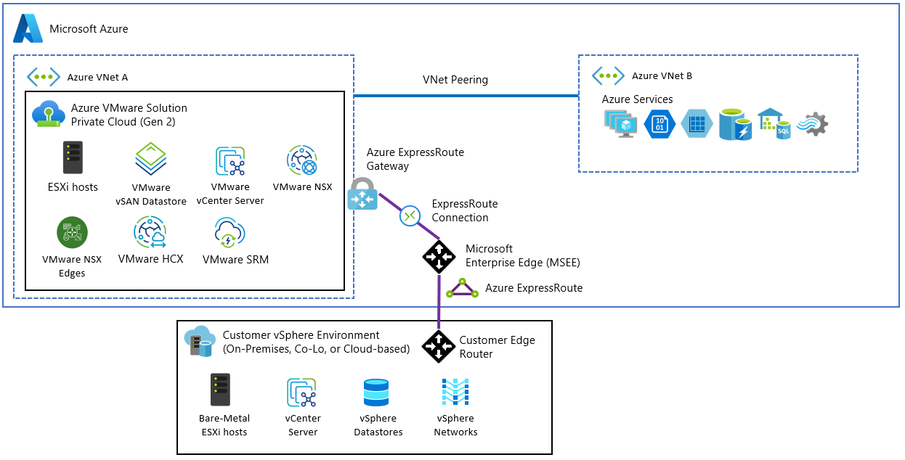
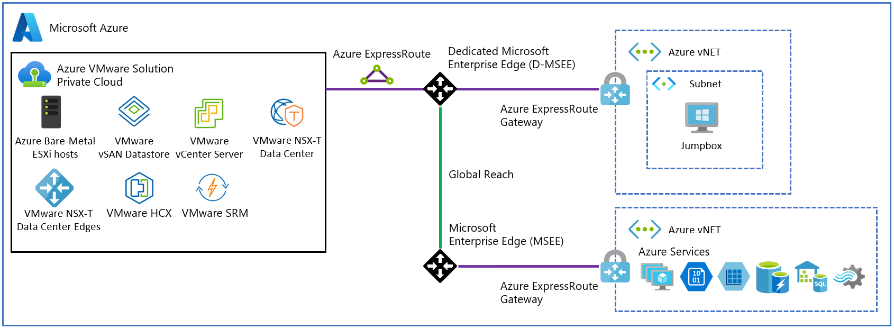
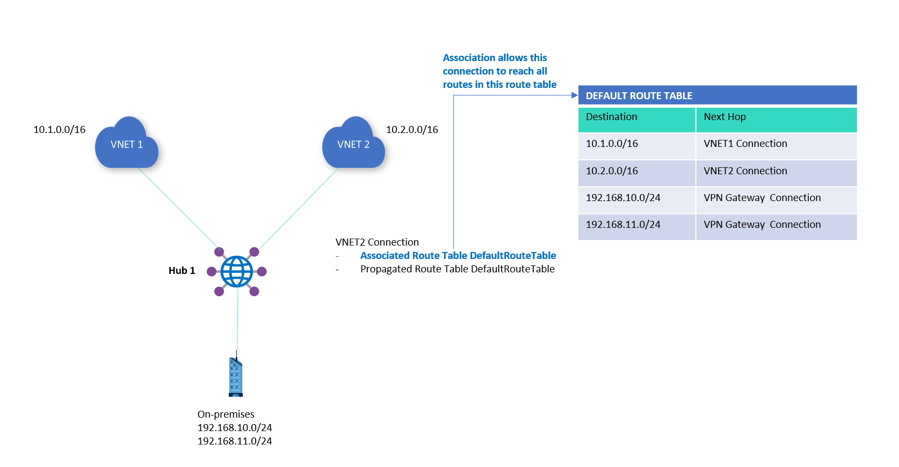
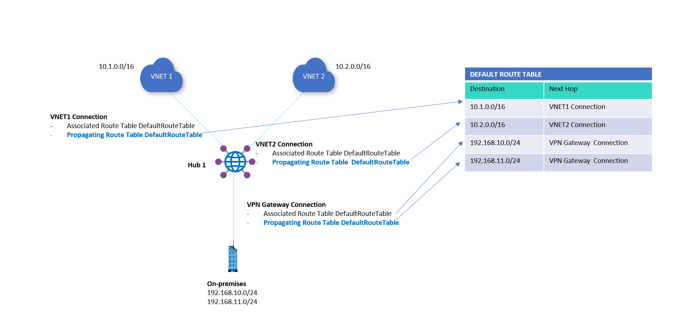

# Oracle Exadata Natively Inside Microsoft Azure

## Provisioning, Networking, Validation, and Day-Two Operations Guide

## 1. Purpose and Scope

Oracle AI Database@Azure places OCI-managed Oracle database infrastructure in Microsoft data centers and exposes service operations through Azure and OCI interfaces. [Overview - Oracle AI Database@Azure](https://learn.microsoft.com/en-us/azure/oracle/oracle-db/database-overview) The architecture differs fundamentally from a conventional multicloud deployment because the infrastructure is colocated in Microsoft data centers and attached to an Azure virtual network. [Overview - Oracle AI Database@Azure](https://learn.microsoft.com/en-us/azure/oracle/oracle-db/database-overview)

This guide addresses four implementation directives:

1. Provision Oracle Exadata infrastructure in Azure for disaster recovery.
2. Connect Exadata to Azure VMware Solution and existing Azure services.
3. Validate deployment, storage, and interconnect performance.
4. Support infrastructure updates, incident response, and ongoing operations.

The intended reader is an Azure-experienced architect or consultant who has limited prior experience with Exadata.

### Transcript Source Set

The transcript describes a source stack that includes:

* An overview of Oracle on Azure virtual machines.
* The Oracle AI Database at Azure Network Planning Guide.
* Known Issues in Oracle Database at Azure.
* Support documentation for Oracle AI Database at Azure.
* An Oracle Exadata Database on Dedicated Infrastructure logging deep dive.
* The Azure VMware Solution Landing Zone Accelerator and current Azure VMware Solution networking documentation. [Azure VMware Solution documentation](https://learn.microsoft.com/en-us/azure/azure-vmware/)
* Current Oracle AI Database@Azure overview, networking, regional, logging, and support documentation. [Oracle AI Database@Azure documentation](https://learn.microsoft.com/en-us/azure/oracle/oracle-db/)

Microsoft Learn and Oracle documentation have been used to validate, correct, and link the transcript-derived statements in this updated guide.

---

## 2. Architectural Model: Native Colocation Rather Than Conventional Multicloud

Traditional multicloud architectures connect independently operated cloud environments across internet-based tunnels, private circuits, or carrier networks. Oracle Database at Azure instead places Oracle-managed Exadata hardware within Azure facilities and connects the Oracle and Azure control planes through a jointly operated integration.

* **Physical deployment model:** Oracle-managed Exadata infrastructure is colocated in Microsoft data centers. [Overview - Oracle AI Database@Azure](https://learn.microsoft.com/en-us/azure/oracle/oracle-db/database-overview)
* **Not a nested workload:** The service uses Oracle-managed Exadata infrastructure rather than an Exadata appliance nested on ordinary Azure virtual machines. [Overview - Oracle AI Database@Azure](https://learn.microsoft.com/en-us/azure/oracle/oracle-db/database-overview)
* **Not an internet-based cloud bridge:** Customer connectivity is provided through Azure Virtual Network attachment; Oracle separately operates the infrastructure through its OCI management connection. [Overview - Oracle AI Database@Azure](https://learn.microsoft.com/en-us/azure/oracle/oracle-db/database-overview)
* **Oracle responsibility:** Oracle Cloud Infrastructure operations personnel manage the Exadata infrastructure and perform software patching, infrastructure updates, and other platform operations through a connection to OCI. [Overview - Oracle AI Database@Azure](https://learn.microsoft.com/en-us/azure/oracle/oracle-db/database-overview)
* **Azure responsibility:** The customer continues to manage the Azure virtual network and the customer-controlled Azure routing, governance, security, and connected-service configuration. [Network planning for Oracle AI Database@Azure](https://learn.microsoft.com/en-us/azure/oracle/oracle-db/oracle-database-network-plan)
* **Customer database responsibility:** The customer manages database and VM-cluster administration within the service boundary, while Oracle manages the underlying Exadata infrastructure. [Oracle AI Database@Azure interfaces](https://learn.microsoft.com/en-us/azure/oracle/oracle-db/database-overview#oracle-ai-databaseazure-interfaces)

> **Architectural interpretation:** The service is described as a native integration because Oracle infrastructure is embedded within the Azure environment while remaining operationally managed through an Oracle back-end control plane.

### Why the Model Matters

* The architecture can reduce the latency and complexity normally associated with moving data between separate public-cloud regions.
* It allows Azure governance, identity, monitoring, routing, and security services to participate in the solution.
* It also introduces dependencies on two providers, two control planes, and two support organizations.
* Architects must understand that “native to Azure” does not mean that every layer is operated exclusively by Microsoft.

**Operational implication:** Treat Oracle Database at Azure as a shared physical and operational architecture, not as a standard Azure platform-as-a-service database.

---

# Part I — Provisioning Exadata for Disaster Recovery

## 3. Commercial and Procurement Model

The service is purchased through an Azure Marketplace private offer, and eligible Oracle AI Database@Azure payments count toward the Microsoft Azure Consumption Commitment, or MACC. [Purchase Oracle AI Database@Azure](https://learn.microsoft.com/en-us/azure/oracle/oracle-db/database-overview#purchase-oracle-ai-databaseazure)

* **Marketplace procurement:** The Oracle service is acquired through an Azure private offer rather than through an entirely separate cloud procurement workflow.
* **MACC drawdown:** Consumption is charged against the customer’s Microsoft Azure commitment.
* **Billing presentation:** Oracle AI Database@Azure charges appear on the regular Microsoft Azure invoice alongside other Azure Marketplace charges. [Purchase Oracle AI Database@Azure](https://learn.microsoft.com/en-us/azure/oracle/oracle-db/database-overview#purchase-oracle-ai-databaseazure)
* **Procurement benefit:** The model may reduce the need for separate billing pipelines and may simplify enterprise legal, procurement, and finance processes.
* **Architectural consequence:** Commercial onboarding still requires an OCI tenancy, even though most service activities occur in Azure. [Overview - Oracle AI Database@Azure](https://learn.microsoft.com/en-us/azure/oracle/oracle-db/database-overview)

> **Documentation correction:** Microsoft documents that payment for Oracle AI Database@Azure counts toward MACC and that charges appear on the regular Azure invoice. Offer eligibility, licensing choices, and contractual scope still require account-team confirmation. [Purchase Oracle AI Database@Azure](https://learn.microsoft.com/en-us/azure/oracle/oracle-db/database-overview#purchase-oracle-ai-databaseazure)

---

## 4. Regional Availability and Disaster-Recovery Placement

Oracle AI Database@Azure services are available only in the Azure regions and physical zones listed for each service. Disaster-recovery planning must therefore begin with the current region-availability matrix. [Region availability for Oracle AI Database@Azure](https://learn.microsoft.com/en-us/azure/oracle/oracle-db/oracle-database-regions)

### Region Categories Described in the Transcript

| Region type                                 | Availability characteristics                                            | Intended use                                                      |
| ------------------------------------------- | ----------------------------------------------------------------------- | ----------------------------------------------------------------- |
| Standard business region with dual zones    | At least two Azure zones are available for the service in the region. [Region availability for Oracle AI Database@Azure](https://learn.microsoft.com/en-us/azure/oracle/oracle-db/oracle-database-regions) | In-region multi-zone placement where the selected service and zones are available. |
| Standard business region with a single zone | One Azure zone is available with a corresponding paired DR region. [Region availability for Oracle AI Database@Azure](https://learn.microsoft.com/en-us/azure/oracle/oracle-db/oracle-database-regions) | Primary or secondary placement subject to the documented pairing and service availability. |
| Disaster-recovery-only region               | The region is designated as disaster-recovery-only. [Region availability for Oracle AI Database@Azure](https://learn.microsoft.com/en-us/azure/oracle/oracle-db/oracle-database-regions) | Secondary deployment and failover target for supported services. |

* **Requirement:** Select a region that supports the necessary Oracle service tier and intended disaster-recovery topology.
* **Dependency:** A standard Azure region pairing does not automatically guarantee that the required Exadata configuration is available in both regions.
* **Capacity concern:** Physical Exadata hardware must be available in the target region; the service cannot be assumed to have elastic capacity equivalent to a general-purpose virtual-machine platform.
* **Data-residency concern:** The selected primary and disaster-recovery regions must satisfy organizational data-residency and regulatory requirements.
* **Failover concern:** A disaster-recovery-only region should be assessed as a failover target rather than assumed to offer every production-region feature.

---

## 5. Business Continuity, Data Guard, and Transfer Charges

The transcript describes business continuity and disaster recovery, or BCDR, as relying on Oracle-managed capabilities such as Oracle Backup and Oracle Data Guard.

* **Replication mechanism:** Oracle Data Guard maintains a standby database by transmitting and applying redo data from the primary database. [Oracle Maximum Availability Architecture for Oracle Database@Azure](https://docs.oracle.com/en/database/oracle/oracle-database/19/haovw/oracle-maximum-availability-architecture-oracle-databaseazure.html)
* **Backup mechanism:** Microsoft documents OCI-managed backup options through Oracle Database Autonomous Recovery Service and OCI Object Storage, plus self-managed Azure storage and third-party options. [Business continuity and disaster recovery considerations for Oracle Exadata Database@Azure](https://learn.microsoft.com/en-us/azure/cloud-adoption-framework/scenarios/oracle-on-azure/oracle-disaster-recovery-oracle-database-azure)
* **Network path:** Data Guard connectivity can use Azure networking or OCI networking; Microsoft states that Azure is the default primary route, while Oracle MAA recommends OCI peering for performance in specified designs. [Design considerations](https://learn.microsoft.com/en-us/azure/cloud-adoption-framework/scenarios/oracle-on-azure/oracle-disaster-recovery-oracle-database-azure#design-considerations) [Oracle Maximum Availability Architecture for Oracle Database@Azure](https://docs.oracle.com/en/database/oracle/oracle-database/19/haovw/oracle-maximum-availability-architecture-oracle-databaseazure.html)
* **Public internet avoidance:** The documented Azure and OCI private-network designs do not require ordinary public-internet transport for Data Guard redo. [Oracle Maximum Availability Architecture for Oracle Database@Azure](https://docs.oracle.com/en/database/oracle/oracle-database/19/haovw/oracle-maximum-availability-architecture-oracle-databaseazure.html)
* **Cost assertion:** Oracle documents no ingress or egress cost for the OCI-managed network path in the same-region design, but its cross-region MAA guidance also states that the first 10 TB per month is free rather than describing unlimited free transfer. [Oracle Maximum Availability Architecture for Oracle Database@Azure](https://docs.oracle.com/en/database/oracle/oracle-database/19/haovw/oracle-maximum-availability-architecture-oracle-databaseazure.html)
* **Performance consequence:** Data Guard can be configured for high-performance synchronization without the cost model normally associated with cross-cloud data transfer.
* **TCO consequence:** Eliminating per-gigabyte replication charges can materially alter the total cost of ownership for large disaster-recovery databases.

> **Documentation correction:** Do not generalize “zero ingress and egress charges” to every Data Guard topology. Oracle documents no ingress/egress cost for the OCI-managed same-region path, while its cross-region guidance states that the first 10 TB per month is free. Validate the planned regions, route, and current commercial terms. [Oracle Maximum Availability Architecture for Oracle Database@Azure](https://docs.oracle.com/en/database/oracle/oracle-database/19/haovw/oracle-maximum-availability-architecture-oracle-databaseazure.html)

### Disaster-Recovery Placement Workflow

1. Identify the Azure region hosting the primary workload.
2. Determine which Azure regions support the required Oracle Exadata service.
3. Identify whether the intended secondary location is a standard region or a disaster-recovery-only region.
4. Confirm that Oracle Data Guard and the required protection mode are supported between the chosen locations.
5. Verify data-residency, latency, recovery-point objective, and recovery-time objective requirements.
6. Confirm that the claimed no-ingress/no-egress charging model applies to the planned replication path.
7. Reserve capacity before finalizing the disaster-recovery architecture.

**Takeaway:** Regional Exadata availability is a foundational architectural dependency. It must be resolved before networking, capacity, or recovery procedures are designed.

---

## 6. Account Linking and Identity Federation

Although the service is acquired and surfaced through Azure, onboarding includes linking an OCI account to the Azure account. [Onboard Oracle AI Database@Azure](https://learn.microsoft.com/en-us/azure/oracle/oracle-db/onboard-oracle-database)

### Why an OCI Account Is Still Required

* Oracle uses the OCI tenancy to perform fleet management for the Exadata hardware.
* Oracle operations personnel require a secure back-end management path for firmware, hypervisors, compute nodes, storage servers, and related infrastructure.
* The OCI tenancy supports the Oracle-managed portion of the shared-responsibility model.
* Azure remains the primary environment for the customer’s virtual network and related Azure resources.

### Identity Model

Oracle documents Microsoft Entra ID federation with the associated OCI tenancy as an optional onboarding configuration that lets users sign in to OCI with Entra ID credentials. [Federation for Oracle AI Database@Azure](https://docs.oracle.com/en-us/iaas/Content/database-at-azure/onboard-federation.htm)

* **Federation protocol:** The current Oracle Database@Azure federation procedure uses SAML. OpenID Connect is not presented as an alternative in that service-specific procedure. [Federation for Oracle AI Database@Azure](https://docs.oracle.com/en-us/iaas/Content/database-at-azure/onboard-federation.htm)
* **Primary identity provider:** In the documented federation pattern, Microsoft Entra ID is configured as the identity provider for the OCI identity domain. [Federation for Oracle AI Database@Azure](https://docs.oracle.com/en-us/iaas/Content/database-at-azure/onboard-federation.htm)
* **Authentication behavior:** Federated users sign in to the associated OCI tenancy using Microsoft Entra ID credentials. [Federation for Oracle AI Database@Azure](https://docs.oracle.com/en-us/iaas/Content/database-at-azure/onboard-federation.htm)
* **Conditional access:** Microsoft Entra Conditional Access can govern the enterprise application, but the service-specific Oracle procedure does not prescribe a particular compliant-device policy. [What is Conditional Access?](https://learn.microsoft.com/en-us/entra/identity/conditional-access/overview)
* **Token exchange:** The documented federation uses SAML assertions between Entra ID and OCI to provide single sign-on to the OCI console. [Federation for Oracle AI Database@Azure](https://docs.oracle.com/en-us/iaas/Content/database-at-azure/onboard-federation.htm)
* **Security benefit:** Multifactor authentication, device compliance, user lifecycle management, and centralized access policies remain anchored in the Azure identity system.
* **Operational recommendation:** Use federation and automated provisioning where they fit the organization’s identity design, while retaining documented break-glass access. [Federation for Oracle AI Database@Azure](https://docs.oracle.com/en-us/iaas/Content/database-at-azure/onboard-federation.htm)

### One-Time Onboarding Sequence

1. Obtain and accept the Azure private offer.
2. Confirm that the target Azure subscription is permitted to purchase and deploy the offer.
3. Link the existing OCI account or tenancy to the Azure account.
4. Optionally configure SAML federation between Microsoft Entra ID and OCI. [Federation for Oracle AI Database@Azure](https://docs.oracle.com/en-us/iaas/Content/database-at-azure/onboard-federation.htm)
5. Map Azure identities or groups to the appropriate Oracle administrative roles.
6. Test conditional access and multifactor authentication.
7. Verify that administrators can reach the Oracle control plane using federated Azure credentials.
8. Proceed with service provisioning only after the identity linkage is operational.

---

## 7. Critical Governance Failure: The East US Managed Resource Group

Microsoft documents a purchase failure in governed subscriptions when the service creates a managed resource group containing the `OracleSubscription` billing object. [Creating an OracleSubscription resource fails because of 'deny' policy action during offer purchase](https://learn.microsoft.com/en-us/azure/oracle/oracle-db/oracle-database-known-issues#creating-an-oraclesubscription-resource-fails-because-of-deny-policy-action-during-offer-purchase)

### Automated Resource-Group Characteristics

The back-end process is described as creating the resource group under three fixed conditions:

| Characteristic | Automated behavior                             | Common enterprise-policy conflict                                              |
| -------------- | ---------------------------------------------- | ------------------------------------------------------------------------------ |
| Region         | The resource group must be created in East US. [Creating an OracleSubscription resource fails because of 'deny' policy action during offer purchase](https://learn.microsoft.com/en-us/azure/oracle/oracle-db/oracle-database-known-issues#creating-an-oraclesubscription-resource-fails-because-of-deny-policy-action-during-offer-purchase) | The subscription may restrict deployments to approved regions. |
| Naming         | The managed resource group must use the service-required name. [Creating an OracleSubscription resource fails because of 'deny' policy action during offer purchase](https://learn.microsoft.com/en-us/azure/oracle/oracle-db/oracle-database-known-issues#creating-an-oraclesubscription-resource-fails-because-of-deny-policy-action-during-offer-purchase) | The organization may enforce a custom naming convention. |
| Tags           | The group is initially created without tags. [Creating an OracleSubscription resource fails because of 'deny' policy action during offer purchase](https://learn.microsoft.com/en-us/azure/oracle/oracle-db/oracle-database-known-issues#creating-an-oraclesubscription-resource-fails-because-of-deny-policy-action-during-offer-purchase) | The organization may require cost-center, owner, environment, or billing tags. |

* **Failure condition:** Azure Policy evaluates the automated resource-write operation and denies it as noncompliant.
* **Immediate consequence:** The managed resource group is not created.
* **Service consequence:** The hidden Oracle subscription object is not instantiated.
* **Deployment consequence:** The Exadata purchase or deployment hangs and eventually fails.
* **Portal limitation:** Microsoft documents the terminal provisioning error text and directs operators to the Activity Log to identify the denying policy. [Creating an OracleSubscription resource fails because of 'deny' policy action during offer purchase](https://learn.microsoft.com/en-us/azure/oracle/oracle-db/oracle-database-known-issues#creating-an-oraclesubscription-resource-fails-because-of-deny-policy-action-during-offer-purchase)
* **Troubleshooting limitation:** The portal error may not identify the Oracle subscription object or explicitly name the tagging or regional policy that caused the denial.

### Diagnostic Procedure

1. Record the exact time window in which the private-offer purchase or deployment was attempted.
2. Open the Azure Activity Log for the affected subscription.
3. Bypass the simplified portal error and inspect the raw event data or JSON payload.
4. Search for the failed `deny` Policy action associated with the `OracleSubscriptions_Update` operation. [Creating an OracleSubscription resource fails because of 'deny' policy action during offer purchase](https://learn.microsoft.com/en-us/azure/oracle/oracle-db/oracle-database-known-issues#creating-an-oraclesubscription-resource-fails-because-of-deny-policy-action-during-offer-purchase)
5. Inspect the target resource associated with the denial.
6. Verify whether the target is the automatically generated East US managed resource group.
7. Identify the Azure Policy assignment ID responsible for the denial.
8. Determine whether the blocking rule is a location restriction, mandatory-tagging policy, naming policy, or another governance control.
9. Retain the activity-log evidence for the governance and security teams.

### Temporary Exemption Procedure

1. Define a narrowly scoped policy exemption for the Oracle onboarding operation.
2. Limit the exemption to the affected subscription, deployment, or managed resource scope.
3. Include only the identified policy assignments that block the automated operation.
4. Create the exemption through the Azure portal or another supported Azure Policy deployment interface. [Azure Policy exemption structure](https://learn.microsoft.com/en-us/azure/governance/policy/concepts/exemption-structure)
5. Allow at least two hours for the exemption window; Microsoft notes that an exemption can take up to 30 minutes to take effect. [Creating an OracleSubscription resource fails because of 'deny' policy action during offer purchase](https://learn.microsoft.com/en-us/azure/oracle/oracle-db/oracle-database-known-issues#creating-an-oraclesubscription-resource-fails-because-of-deny-policy-action-during-offer-purchase)
6. Reinitiate the Azure private-offer purchase.
7. Confirm that the untagged East US resource group is created.
8. Confirm that the Oracle subscription object is successfully instantiated.
9. Allow the exemption to expire so that ordinary corporate policies resume enforcement.
10. Validate that no additional ungoverned resources were created during the exemption period.

> **Documentation correction:** The reviewed Microsoft procedure directs the operator to create a time-bound Azure Policy exemption and does not require an artifact called an “RM template.” Use a supported Azure Policy exemption interface. [Azure Policy exemption structure](https://learn.microsoft.com/en-us/azure/governance/policy/concepts/exemption-structure)

> **Operational recommendation:** Obtain advance approval for the temporary exemption. Attempting to negotiate a governance exception during the deployment window creates avoidable outage and schedule risk.

**Takeaway:** The Azure governance layer can block Oracle onboarding before any Exadata resource becomes visible. Activity Log JSON, rather than the portal error alone, is the primary diagnostic source described in the transcript.

---

# Part II — Network Integration with Azure and Azure VMware Solution

## 8. Delegated Subnet Architecture

Oracle AI Database@Azure connects infrastructure resources to the customer’s Azure virtual network through virtual NICs from a delegated subnet. [Network planning for Oracle AI Database@Azure](https://learn.microsoft.com/en-us/azure/oracle/oracle-db/oracle-database-network-plan)

> **Transcript-derived analogy:** The Azure virtual network is compared to a secure hotel. The delegated subnet is a quarantined hallway whose internal rooms are managed by Oracle, while all movement from that hallway into the rest of the building still passes through Azure-controlled security checkpoints.

* **Customer ownership:** The customer supplies and manages the Azure virtual network and address plan. [Plan IP address space for Oracle AI Database@Azure](https://learn.microsoft.com/en-us/azure/oracle/oracle-db/oracle-database-plan-ip)
* **Delegated control:** Oracle AI Database@Azure resources consume virtual NICs and addresses from the delegated subnet. [Delegated subnet limits](https://learn.microsoft.com/en-us/azure/oracle/oracle-db/oracle-database-delegated-subnet-limits)
* **Azure enforcement:** Supported Azure controls depend on the selected network feature tier; current documentation lists UDR support in both tiers and NSG support only with advanced networking. [Constraints](https://learn.microsoft.com/en-us/azure/oracle/oracle-db/oracle-database-network-plan#constraints)
* **Delegation identifier:** The current documented delegation value is `Oracle.Database/networkAttachment`. [Network planning for Oracle AI Database@Azure](https://learn.microsoft.com/en-us/azure/oracle/oracle-db/oracle-database-network-plan)
* **CIDR dependency:** The delegated CIDR must be sized for VM-cluster, SCAN, and reserved networking addresses before provisioning. [Plan IP address space for Oracle AI Database@Azure](https://learn.microsoft.com/en-us/azure/oracle/oracle-db/oracle-database-plan-ip)
* **Immutability:** Microsoft documents that the delegated network mask cannot be altered after the delegated network is created. [Constraints](https://learn.microsoft.com/en-us/azure/oracle/oracle-db/oracle-database-network-plan#constraints)

> **Documentation correction:** Use the literal delegation value `Oracle.Database/networkAttachment`; the transcript rendering is not the documented identifier. [Delegated subnet limits](https://learn.microsoft.com/en-us/azure/oracle/oracle-db/oracle-database-delegated-subnet-limits)

---

## 9. Default and Advanced Network Features

Microsoft documents default and advanced network feature tiers for Oracle AI Database@Azure. [Network features](https://learn.microsoft.com/en-us/azure/oracle/oracle-db/oracle-database-network-plan#network-features)

| Capability                                           | Default network features | Advanced network features |
| ---------------------------------------------------- | -----------------------: | ------------------------: |
| Basic communication within a local or same-region peered virtual network | Supported | Supported |
| Network security groups on the delegated subnet | Not supported | Supported |
| User-defined routes on the delegated subnet | Supported | Supported |
| Connectivity to a private endpoint in the same virtual network | Not supported | Supported |
| Global virtual-network peering | Not supported | Supported |
| ExpressRoute FastPath | Not supported | Supported |
| Secured-hub or NVA connectivity | Supported | Supported |
| Active/active VPN gateways | Not supported | Supported |

[Supported topologies](https://learn.microsoft.com/en-us/azure/oracle/oracle-db/oracle-database-network-plan#supported-topologies) and [Constraints](https://learn.microsoft.com/en-us/azure/oracle/oracle-db/oracle-database-network-plan#constraints)

* **Design decision:** Advanced networking is required when the design depends on delegated-subnet NSGs, ExpressRoute FastPath, Global VNet Peering, same-VNet private-endpoint connectivity, active/active VPN gateways, or other advanced-only capabilities. It is not documented as universally mandatory for every AVS or DR topology. [Supported topologies](https://learn.microsoft.com/en-us/azure/oracle/oracle-db/oracle-database-network-plan#supported-topologies)
* **Security dependency:** NSGs on Oracle AI Database@Azure delegated subnets require advanced network features. [Constraints](https://learn.microsoft.com/en-us/azure/oracle/oracle-db/oracle-database-network-plan#constraints)
* **Routing dependency:** UDRs are supported with both default and advanced network features and are used when a topology must steer traffic through an NVA or firewall. [Constraints](https://learn.microsoft.com/en-us/azure/oracle/oracle-db/oracle-database-network-plan#constraints)
* **AVS dependency:** For AVS Generation 1, ExpressRoute FastPath can reduce the gateway data-path bottleneck for supported VNet connectivity; AVS Generation 2 instead attaches natively to an Azure VNet. [Azure VMware Solution Generation 2 differences](https://learn.microsoft.com/en-us/azure/azure-vmware/native-introduction#differences) [Azure VMware Solution network design considerations](https://learn.microsoft.com/en-us/azure/azure-vmware/architecture-network-design-considerations)
* **Hybrid dependency:** Global peering and Private Link may be required for broader enterprise-service access patterns.

**Operational implication:** Select the feature tier from the exact topology requirements. Default networking already supports UDRs and secured-hub connectivity, while advanced networking adds NSGs, FastPath, Global VNet Peering, service tags, flow logs, and other listed capabilities. [Network features](https://learn.microsoft.com/en-us/azure/oracle/oracle-db/oracle-database-network-plan#network-features)

---

## 10. Advanced Networking Feature Registration

Advanced network features require subscription feature registration before a new delegated subnet is created. The current documentation shows Azure PowerShell commands for both `Microsoft.Baremetal` and `Microsoft.Network`. [Registration required for delegated subnets](https://learn.microsoft.com/en-us/azure/oracle/oracle-db/oracle-database-network-plan#registration-required-for-delegated-subnets)

### Registration Behavior

* **Explicit enablement:** Register `EnableRotterdamSdnApplianceForOracle` under both `Microsoft.Baremetal` and `Microsoft.Network` before creating the delegated subnet. [Registration required for delegated subnets](https://learn.microsoft.com/en-us/azure/oracle/oracle-db/oracle-database-network-plan#registration-required-for-delegated-subnets)
* **Documented feature name:** `EnableRotterdamSdnApplianceForOracle`. [Registration required for delegated subnets](https://learn.microsoft.com/en-us/azure/oracle/oracle-db/oracle-database-network-plan#registration-required-for-delegated-subnets)
* **Registration delay:** The feature can remain in `Registering` for up to 60 minutes before changing to `Registered`. [Registration required for delegated subnets](https://learn.microsoft.com/en-us/azure/oracle/oracle-db/oracle-database-network-plan#registration-required-for-delegated-subnets)
* **Polling requirement:** The feature state must be checked until it reaches `Registered`.
* **Failure condition:** Creating the delegated subnet while the feature is still registering can cause deployment failure.
* **Not directly supported by the reviewed documentation:** Microsoft says to wait for `Registered` before creating the subnet, but the reviewed page does not state that premature creation corrupts the virtual network. [Registration required for delegated subnets](https://learn.microsoft.com/en-us/azure/oracle/oracle-db/oracle-database-network-plan#registration-required-for-delegated-subnets)
* **Scheduling consequence:** The feature-registration delay must be placed ahead of the deployment window, not treated as an instantaneous configuration step.

> **Architectural interpretation:** The transcript infers from the feature’s name that Azure deploys a dedicated software-defined networking bridge between the Oracle network stack and the Azure control plane. The internal implementation is not exposed in the transcript.

> **Documentation correction:** Use `Register-AzProviderFeature -FeatureName "EnableRotterdamSdnApplianceForOracle" -ProviderNamespace "Microsoft.Baremetal"` and repeat it for `Microsoft.Network`. These are Azure PowerShell cmdlets, despite the article’s parenthetical reference to AZCLI. [Registration required for delegated subnets](https://learn.microsoft.com/en-us/azure/oracle/oracle-db/oracle-database-network-plan#registration-required-for-delegated-subnets)

### Registration Procedure

1. Run the required subscription feature-registration command with Azure CLI or PowerShell.
2. Query the feature state.
3. Confirm that the state changes from `Registering` to `Registered`.
4. Allow up to 60 minutes for completion.
5. Do not create the Oracle-delegated subnet while the state remains `Registering`.
6. Review route tables, address plans, and firewall dependencies during the registration interval.
7. Begin delegated-subnet deployment only after the registration state is confirmed.

---

## 11. Hub-and-Spoke Security Topology

The described network places a stateful firewall or NVA in a customer-managed hub VNet or a secured Virtual WAN hub. Azure Virtual WAN routing intent can steer private traffic to Azure Firewall, an integrated NVA, or a supported security SaaS next hop. [How to configure Virtual WAN Hub routing intent and routing policies](https://learn.microsoft.com/en-us/azure/virtual-wan/how-to-routing-policies)

* **Hub function:** The transit virtual network provides centralized inspection and routing.
* **Spoke function:** The Oracle-delegated subnet resides in a connected virtual network or spoke.
* **Traffic policy:** Traffic between Azure VMware Solution and Exadata must pass through the firewall.
* **Azure enforcement:** The applicable route table must be associated with the source or gateway subnet specified by the chosen topology; Microsoft’s Oracle-specific hub-and-spoke guidance places the UDR on the gateway subnet and requires the Oracle prefix or a more-specific prefix. [UDR requirements for routing traffic to Oracle AI Database@Azure](https://learn.microsoft.com/en-us/azure/oracle/oracle-db/oracle-database-network-plan#udr-requirements-for-routing-traffic-to-oracle-ai-databaseazure)
* **Statefulness:** Azure Firewall and typical third-party firewalls maintain connection state, so asymmetric routing can cause session failure. [Azure Firewall known issues](https://learn.microsoft.com/en-us/azure/firewall/firewall-known-issues)
* **Availability dependency:** The NVA must be deployed with sufficient resilience and throughput to avoid becoming the database-path bottleneck.
* **Route dependency:** Return routes from Azure VMware Solution must also point through the same inspection path.

---

## 12. UDR Specificity and Symmetric Routing

Microsoft establishes the following Oracle-specific routing rule: [UDR requirements for routing traffic to Oracle AI Database@Azure](https://learn.microsoft.com/en-us/azure/oracle/oracle-db/oracle-database-network-plan#udr-requirements-for-routing-traffic-to-oracle-ai-databaseazure)

> The UDR prefix must be at least as specific as the delegated subnet prefix.

For a delegated `/27` subnet, Microsoft’s table accepts `/27` and `/32` and rejects `/24` as too broad. [UDR requirements for routing traffic to Oracle AI Database@Azure](https://learn.microsoft.com/en-us/azure/oracle/oracle-db/oracle-database-network-plan#udr-requirements-for-routing-traffic-to-oracle-ai-databaseazure)

### Prefix Comparison

| Delegated subnet | Candidate UDR | Relative specificity | Transcript assessment                          |
| ---------------- | ------------- | -------------------: | ---------------------------------------------- |
| `/27`            | `/24`         | Less specific | Too broad; rejected in the documented Oracle routing example. [UDR requirements for routing traffic to Oracle AI Database@Azure](https://learn.microsoft.com/en-us/azure/oracle/oracle-db/oracle-database-network-plan#udr-requirements-for-routing-traffic-to-oracle-ai-databaseazure) |
| `/27`            | `/27`         | Equal specificity | Acceptable in the documented example. [UDR requirements for routing traffic to Oracle AI Database@Azure](https://learn.microsoft.com/en-us/azure/oracle/oracle-db/oracle-database-network-plan#udr-requirements-for-routing-traffic-to-oracle-ai-databaseazure) |
| `/27`            | `/28`         |        More specific | Acceptable for the covered subrange            |
| `/27`            | `/32`         | Host-specific | Acceptable for a single address in the documented example. [UDR requirements for routing traffic to Oracle AI Database@Azure](https://learn.microsoft.com/en-us/azure/oracle/oracle-db/oracle-database-network-plan#udr-requirements-for-routing-traffic-to-oracle-ai-databaseazure) |

### Failure Scenario: Asymmetric Routing

1. The Oracle database sends a packet to a node in Azure VMware Solution.
2. A broad `/24` UDR is present on the Oracle subnet.
3. The Azure software-defined network evaluates the available routes.
4. A more specific system route can take precedence over the broad UDR.
5. The outbound packet bypasses the central firewall and reaches Azure VMware Solution directly.
6. The Azure VMware Solution return path uses a different routing table.
7. The return packet is sent through the central NVA.
8. The stateful firewall sees a TCP acknowledgment for a session whose initiating packet it never observed.
9. No valid session entry exists in the firewall’s state table.
10. The firewall drops the return packet as invalid.
11. The database connection times out.
12. Data Guard replication or application connectivity can fail.

### Corrected Routing Behavior

* Matching the UDR to the delegated subnet’s `/27` prefix makes the custom route at least as specific as the Oracle subnet.
* The Azure routing fabric then selects the intended UDR rather than a broader or competing system route.
* Outbound traffic passes through the firewall.
* Return traffic is also routed through the firewall.
* The firewall sees the full session and maintains a valid connection state.
* Application sessions and Data Guard synchronization avoid asymmetric-routing drops.

> **Operational recommendation:** Validate effective routes and firewall session state in both directions; the Oracle network guide warns that asymmetric routing can cause traffic loss. [Constraints](https://learn.microsoft.com/en-us/azure/oracle/oracle-db/oracle-database-network-plan#constraints)

**Takeaway:** Prefix specificity is not merely an address-management preference. It is a functional requirement for stateful firewall traversal in the transcript’s topology.

---

## 13. Azure VMware Solution, ExpressRoute, and Virtual WAN

Azure VMware Solution networking depends on generation: Generation 1 uses an ExpressRoute attachment model, while Generation 2 is deployed directly inside an Azure virtual network. [Introduction to Azure VMware Solution Generation 2](https://learn.microsoft.com/en-us/azure/azure-vmware/native-introduction)

### Traffic Flow

> **Documentation correction:** The following ExpressRoute-to-vWAN traffic flow applies to an AVS Generation 1 design. For AVS Generation 2, use the native VNet attachment, its system-created subnets, and the Gen 2 route-table/NSG guidance instead of assuming the Generation 1 ExpressRoute model. [Network interconnectivity - Azure VMware Solution](https://learn.microsoft.com/en-us/azure/azure-vmware/architecture-networking) [Delegated Subnets and Network Security Groups for Gen 2](https://learn.microsoft.com/en-us/azure/azure-vmware/native-network-design-consideration#delegated-subnets-and-network-security-groups-for-gen-2)



*Source: [Microsoft Learn — Introduction to Azure VMware Solution Generation 2 Private Clouds](https://learn.microsoft.com/en-us/azure/azure-vmware/native-introduction)*

1. An AVS workload sends traffic toward the Oracle database.
2. AVS learns the Oracle subnet through Border Gateway Protocol, or BGP.
3. The route points traffic from AVS toward the vWAN hub and the central firewall.
4. The firewall inspects the session.
5. The firewall forwards the packet to the Oracle-delegated subnet according to the UDR.
6. Return traffic follows the same path in reverse.



*Source: [Microsoft Learn — Azure VMware Solution networking and interconnectivity concepts](https://learn.microsoft.com/en-us/azure/azure-vmware/architecture-networking)*

### vWAN with Routing Intent

When vWAN routing intent is enabled:

* A private-traffic routing policy causes branch and VNet traffic in and out of the Virtual WAN hub to be forwarded to the configured security next hop. [How to configure Virtual WAN Hub routing intent and routing policies](https://learn.microsoft.com/en-us/azure/virtual-wan/how-to-routing-policies)
* Add the Oracle delegated prefix to the Routing Intent additional-prefix list when it is outside the built-in private-prefix set or when the Oracle-specific network guidance requires it. [UDR requirements for routing traffic to Oracle AI Database@Azure](https://learn.microsoft.com/en-us/azure/oracle/oracle-db/oracle-database-network-plan#udr-requirements-for-routing-traffic-to-oracle-ai-databaseazure) [How to configure Virtual WAN Hub routing intent and routing policies](https://learn.microsoft.com/en-us/azure/virtual-wan/how-to-routing-policies)
* The Virtual WAN hub router exchanges routes between connected gateways and VNets using BGP and hub route tables, subject to the selected association and propagation configuration. [About virtual hub routing](https://learn.microsoft.com/en-us/azure/virtual-wan/about-virtual-hub-routing)
* AVS dynamically learns that the database network is reachable through the secured hub path.
* The firewall and Oracle-subnet UDR complete the route toward Exadata.

### vWAN Without Routing Intent

When routing intent is not enabled:

1. Add the Oracle delegated prefix to the applicable Virtual WAN route table. [UDR requirements for routing traffic to Oracle AI Database@Azure](https://learn.microsoft.com/en-us/azure/oracle/oracle-db/oracle-database-network-plan#udr-requirements-for-routing-traffic-to-oracle-ai-databaseazure)
2. Set the next hop to the NVA firewall IP address.
3. Confirm that the route is associated with the relevant AVS and Azure connections.
4. Verify route-table association and propagation to the ExpressRoute connection. [About virtual hub routing](https://learn.microsoft.com/en-us/azure/virtual-wan/about-virtual-hub-routing)
5. Confirm that AVS learns the Oracle network through BGP.



*Source: [Microsoft Learn — About virtual hub routing](https://learn.microsoft.com/en-us/azure/virtual-wan/about-virtual-hub-routing)*



*Source: [Microsoft Learn — About virtual hub routing](https://learn.microsoft.com/en-us/azure/virtual-wan/about-virtual-hub-routing)*

* **Failure condition:** If the Oracle prefix is missing from vWAN routing, AVS nodes do not know how to reach the Exadata subnet.
* **Troubleshooting observation:** A correctly configured Oracle-subnet UDR does not compensate for a missing route on the AVS or vWAN side.
* **Validation requirement:** Inspect effective routes and BGP-learned routes at each relevant hop: the Oracle-connected VNet, Virtual WAN hub, firewall/NVA, and AVS Generation 1 ExpressRoute connection. [About virtual hub routing](https://learn.microsoft.com/en-us/azure/virtual-wan/about-virtual-hub-routing)

---

## 14. Subnet Immutability and Capacity Planning

The delegated network mask cannot be altered after creation. [Constraints](https://learn.microsoft.com/en-us/azure/oracle/oracle-db/oracle-database-network-plan#constraints)

### Destructive Recovery from an Undersized Subnet

1. Terminate the affected VM cluster and dependent resources using the documented service workflow.
2. Delete the delegated subnet.
3. Recreate the virtual-network layout with a larger CIDR block.
4. Reapply delegation and advanced-network configuration.
5. Recreate routing, security, and vWAN propagation.
6. Provision the Exadata environment again.
7. Restore or resynchronize the database.

* **Limitation:** A delegated network mask cannot be altered in place. [Constraints](https://learn.microsoft.com/en-us/azure/oracle/oracle-db/oracle-database-network-plan#constraints)
* **Operational consequence:** Address planning must account for initial deployment, Oracle-managed endpoints, high availability, and future scaling.
* **Change-management consequence:** Subnet resizing is effectively an infrastructure rebuild.

---

## 15. IP Address Requirements

A two-VM Exadata client subnet requires 11 service addresses—eight VM addresses and three SCAN addresses—plus 13 addresses reserved for networking services, for 24 total addresses. [Client subnet requirements](https://learn.microsoft.com/en-us/azure/oracle/oracle-db/oracle-database-plan-ip#client-subnet-requirements)

* Four client-subnet IP addresses are required per VM. [Client subnet requirements](https://learn.microsoft.com/en-us/azure/oracle/oracle-db/oracle-database-plan-ip#client-subnet-requirements)
* The per-VM client-subnet allocation covers the VM’s service addresses, including client and virtual-IP requirements. [Client subnet requirements](https://learn.microsoft.com/en-us/azure/oracle/oracle-db/oracle-database-plan-ip#client-subnet-requirements)
* Each VM cluster requires three SCAN IP addresses. [Client subnet requirements](https://learn.microsoft.com/en-us/azure/oracle/oracle-db/oracle-database-plan-ip#client-subnet-requirements)
* Internal cluster communication endpoints also consume addresses.
* Oracle AI Database@Azure reserves 13 networking-service addresses in a client subnet and three in a backup subnet; these service-specific reservations are more extensive than the generic Azure five-address reservation. [Plan IP address space for Oracle AI Database@Azure](https://learn.microsoft.com/en-us/azure/oracle/oracle-db/oracle-database-plan-ip)
* Existing resources or interfaces may consume additional addresses before Exadata provisioning begins.

### Calculation 1: `/27` Address Capacity

> **Transcript-derived calculation:**

**Inputs**

* Prefix length: `/27`
* IPv4 address width: 32 bits

**Formula**

```text
Total addresses = 2^(32 - prefix length)
                = 2^(32 - 27)
                = 2^5
```

**Result**

```text
Total addresses = 32
```

**Practical interpretation**

* A `/27` contains 32 total IPv4 addresses; Microsoft documents 15 usable client-subnet addresses after the 13 Oracle networking-service reservations. [Usable IPs for client and backup subnets by CIDR size](https://learn.microsoft.com/en-us/azure/oracle/oracle-db/oracle-database-plan-ip#usable-ips-for-client-and-backup-subnets-by-cidr-size)
* The service-specific client subnet reserves 13 addresses for networking services. [Client subnet requirements](https://learn.microsoft.com/en-us/azure/oracle/oracle-db/oracle-database-plan-ip#client-subnet-requirements)
* Oracle consumes addresses for database nodes, VIPs, SCAN listeners, and internal cluster functions.
* A two-VM cluster consumes 11 client addresses, leaving four of the 15 service-usable addresses in a `/27`. [Scenarios: CIDR size required for a client subnet](https://learn.microsoft.com/en-us/azure/oracle/oracle-db/oracle-database-plan-ip#scenarios-cidr-size-required-for-a-client-subnet)

**Factors that can change usable capacity**

* Azure-reserved addresses.
* Existing network interfaces.
* Oracle management endpoints.
* Cluster size.
* Additional database nodes.
* Future scale-out requirements.

### Calculation 2: Why a `/29` Cannot Satisfy the Stated Minimum

> **Transcript-derived calculation:**

**Inputs**

* Prefix length: `/29`
* Required available addresses: 11

**Formula**

```text
Total addresses = 2^(32 - 29)
                = 2^3
```

**Result**

```text
Total addresses = 8
```

**Practical interpretation**

* A `/29` has only eight total IPv4 addresses and is smaller than the documented client-subnet table’s minimum `/27` sizing for Exadata VM clusters. [Plan IP address space for Oracle AI Database@Azure](https://learn.microsoft.com/en-us/azure/oracle/oracle-db/oracle-database-plan-ip)
* It cannot provide 11 available addresses under any circumstance.
* A proof-of-concept deployment using `/29` fails the stated Exadata preflight check.

**Factors that make the real result worse**

* Azure reserves a portion of the subnet.
* Service-managed interfaces consume additional addresses.
* High-availability endpoints increase address requirements.

### Provisioning Failure

* **Failure condition:** The client subnet lacks the documented addresses for the selected VM-cluster count plus networking-service reservations. [Client subnet requirements](https://learn.microsoft.com/en-us/azure/oracle/oracle-db/oracle-database-plan-ip#client-subnet-requirements)
* **Not directly supported by the reviewed documentation:** The current IP-planning page documents the sizing rules but does not state that every insufficient-address failure returns the same HTTP 400 invalid-parameter response.
* **Documented starting size:** A two- or three-VM client subnet can fit in `/27`; Microsoft recommends overallocating, for example at least `/25` instead of `/27`, to reduce the relative impact of reserved addresses. [Plan IP address space for Oracle AI Database@Azure](https://learn.microsoft.com/en-us/azure/oracle/oracle-db/oracle-database-plan-ip)
* **Capacity recommendation:** Select a size that covers both the minimum deployment and the intended scale-out model.

> **Documentation correction:** Eleven is the client-address requirement for a minimum two-VM cluster, not the complete subnet requirement. Add the 13 reserved networking-service addresses, and add four client addresses for every additional VM. [Client subnet requirements](https://learn.microsoft.com/en-us/azure/oracle/oracle-db/oracle-database-plan-ip#client-subnet-requirements)

---

## 16. Azure NSGs and OCI Security Lists

Advanced networking supports Azure NSGs on the Oracle delegated subnet. Microsoft also warns that Azure NSG rules must be reviewed against Oracle-side security rules to avoid conflicts. [Constraints](https://learn.microsoft.com/en-us/azure/oracle/oracle-db/oracle-database-network-plan#constraints)

### Dual-Control Model

| Control plane | Security control       | Enforcement point                                  |
| ------------- | ---------------------- | -------------------------------------------------- |
| Azure         | Network security group | Azure delegated-subnet boundary when advanced networking is enabled. [Constraints](https://learn.microsoft.com/en-us/azure/oracle/oracle-db/oracle-database-network-plan#constraints) |
| OCI           | OCI security list      | Oracle-controlled side of the Exadata network path |

At first glance, the model appears to provide defense in depth. The principal risk is configuration divergence.

### Example: Opening Oracle SQL*Net Port 1521

1. An application team requests access to TCP port 1521.
2. The Azure network engineer updates the NSG.
3. The OCI security list must also be updated.
4. If only the NSG is changed, Azure permits the packet.
5. The OCI security list still blocks the packet.
6. Azure telemetry may show that traffic successfully left the Azure virtual network.
7. The session fails later in the Oracle-controlled path.
8. Troubleshooting becomes difficult because the two enforcement layers expose different evidence.

### Failure Characteristics

* The packet can pass the Azure NSG and be silently dropped by the OCI security list.
* Azure-side monitoring may report no deny event.
* An incident responder can incorrectly conclude that the Azure network is healthy.
* Manual portal changes create a high risk of configuration drift.
* The problem is particularly difficult during a Severity 1 incident because two administrative teams may inspect different policy sets.

### Infrastructure-as-Code Control

The transcript recommends a unified Terraform pipeline; Microsoft’s Oracle landing-zone guidance likewise recommends standardized automation and DevOps patterns. [Platform Automation and DevOps for Oracle Exadata Database@Azure](https://learn.microsoft.com/en-us/azure/cloud-adoption-framework/scenarios/oracle-on-azure/oracle-platform-automation-devops-oracle-database-azure)

1. Define the required port, protocol, source, and destination once in source control.
2. Use the Azure provider to update the Azure NSG.
3. Use the OCI provider to update the OCI security list.
4. Trigger both changes through the same continuous integration and continuous delivery, or CI/CD, workflow.
5. Review the combined plan before deployment.
6. Apply the changes to both control planes in a coordinated operation.
7. Store the resulting Terraform state securely.
8. Detect and remediate out-of-band portal changes.

* **Operational recommendation:** Manage the Azure and Oracle policy sets through coordinated infrastructure as code because Microsoft explicitly warns that manual synchronization is required and misalignment can disrupt access. [Constraints](https://learn.microsoft.com/en-us/azure/oracle/oracle-db/oracle-database-network-plan#constraints)
* **Audit benefit:** A Git-based workflow creates a common approval trail.
* **Consistency benefit:** The same logical rule can be rendered into both providers.
* **Rollback benefit:** A coordinated configuration can be reverted from a single version-controlled change.
* **Security benefit:** Human synchronization is replaced with declarative automation.

**Takeaway:** Dual firewalls improve control only when they are governed as one logical policy system.

---

# Part III — Hardware, Storage, and Performance Validation

## 17. Exadata X9M Hardware Model

The transcript states that the service runs exclusively on Exadata X9M hardware. Oracle documents Exadata as a scale-out architecture of database servers, intelligent storage servers, and an internal RDMA network fabric. [Oracle Exadata Architecture](https://docs.oracle.com/en/engineered-systems/exadata-database-machine/dbmso/oracle-exadata-database-machine-architecture.html)

### Minimum Configuration

> **Documentation correction:** X9M is no longer the exclusive generation for Oracle AI Database@Azure. Current Oracle troubleshooting documentation explicitly covers X11M provisioning in Azure, while the dedicated-infrastructure service description lists X11M and X9M shapes. Retain the X9M details below only for an X9M deployment. [Unable to Provision X11M Infrastructure Using Terraform](https://docs.oracle.com/en-us/iaas/Content/database-at-azure/azutr-troubleshoot-tr-oracle-exadata-database-service-dedicated-infrastructure.html#GUID-D92166C5-E718-4CBF-B1FA-8601B67FA83C) [Exadata Database Service on Dedicated Infrastructure](https://docs.oracle.com/en-us/iaas/exadatacloud/doc/exa-service-desc.html)

The X9M base configuration described by Oracle starts with:

* Two database servers. [Exadata Database Service on Dedicated Infrastructure](https://docs.oracle.com/en-us/iaas/exadatacloud/doc/exa-service-desc.html)
* Three storage servers. [Exadata Database Service on Dedicated Infrastructure](https://docs.oracle.com/en-us/iaas/exadatacloud/doc/exa-service-desc.html)
* An internal RDMA over Converged Ethernet fabric between database and storage servers. [Exadata Database Service on Dedicated Infrastructure](https://docs.oracle.com/en-us/iaas/exadatacloud/doc/exa-service-desc.html)

### Scale-Out Model

* Supported scalable X9M/X11M cloud infrastructure can expand to as many as 32 database servers. [Exadata Database Service on Dedicated Infrastructure](https://docs.oracle.com/en-us/iaas/exadatacloud/doc/exa-service-desc.html)
* Supported scalable X9M/X11M cloud infrastructure can expand to as many as 64 storage servers. [Exadata Database Service on Dedicated Infrastructure](https://docs.oracle.com/en-us/iaas/exadatacloud/doc/exa-service-desc.html)
* X8M and X9M use RoCE networking for high bandwidth and low latency; verify the exact link rate for the deployed generation and shape rather than treating 100 Gb/s as universal. [Exadata Database Service on Dedicated Infrastructure](https://docs.oracle.com/en-us/iaas/exadatacloud/doc/exa-service-desc.html)
* Scale-out capacity is intended to increase compute and storage resources within the engineered-system architecture.

> **Documentation correction:** Oracle’s dedicated-infrastructure service description applies the 32-database-server and 64-storage-server maxima to scalable X11M, X9M, and X8M cloud infrastructure. Confirm Azure-region capacity and the selected shape before treating those maxima as deployable entitlement. [Exadata Database Service on Dedicated Infrastructure](https://docs.oracle.com/en-us/iaas/exadatacloud/doc/exa-service-desc.html)

---

## 18. RDMA and the Exadata Interconnect

RDMA provides direct memory-oriented data transfer with reduced operating-system involvement; Exadata uses an internal RDMA Network Fabric between database and storage servers. [Oracle Exadata Architecture](https://docs.oracle.com/en/engineered-systems/exadata-database-machine/dbmso/oracle-exadata-database-machine-architecture.html)

* Exadata’s RDMA capabilities enable low-latency data access between database and storage tiers; the precise memory-access behavior varies by Exadata generation and feature. [Exadata Database Service on Dedicated Infrastructure](https://docs.oracle.com/en-us/iaas/exadatacloud/doc/exa-service-desc.html)
* Bypassing ordinary kernel processing reduces software overhead.
* Lower overhead contributes to microsecond-scale latency.
* The RoCE fabric is the internal Exadata database-to-storage network; validate the deployed generation’s documented link speed. [Oracle Exadata Architecture](https://docs.oracle.com/en/engineered-systems/exadata-database-machine/dbmso/oracle-exadata-database-machine-architecture.html)
* Generic Azure virtual-machine storage architectures do not provide the same engineered coupling between the Oracle database engine and the storage servers.
* Performance validation must distinguish the internal Exadata RDMA fabric from the Azure-to-Exadata application network path.

### Validation Distinction

| Path                         | What it connects                                     | Primary validation concern                                                      |
| ---------------------------- | ---------------------------------------------------- | ------------------------------------------------------------------------------- |
| Internal Exadata RDMA fabric | Database nodes to Exadata storage servers | RDMA latency, storage throughput, cell health, and internal fabric behavior. [Oracle Exadata Architecture](https://docs.oracle.com/en/engineered-systems/exadata-database-machine/dbmso/oracle-exadata-database-machine-architecture.html) |
| Azure delegated-subnet path | Azure or AVS workloads to Exadata database endpoints | Routing, NSGs, Oracle-side security rules, firewall throughput, and application latency. [Network planning for Oracle AI Database@Azure](https://learn.microsoft.com/en-us/azure/oracle/oracle-db/oracle-database-network-plan) |
| Data Guard path | Primary database to standby database | Redo transport lag, apply lag, errors, and recovery objectives. [Business continuity and disaster recovery considerations for Oracle Exadata Database@Azure](https://learn.microsoft.com/en-us/azure/cloud-adoption-framework/scenarios/oracle-on-azure/oracle-disaster-recovery-oracle-database-azure) |

---

## 19. Automatic Storage Management

Exadata uses Oracle Automatic Storage Management, or ASM, to manage Oracle database storage. [Introducing Oracle Automatic Storage Management](https://docs.oracle.com/en/database/oracle/oracle-database/26/cncpt/automatic-storage-management.html)

* ASM distributes files across disks in a disk group. [Introducing Oracle Automatic Storage Management](https://docs.oracle.com/en/database/oracle/oracle-database/26/cncpt/automatic-storage-management.html)
* ASM provides striping and, for normal or high redundancy disk groups, software mirroring. [Oracle ASM Mirroring and Disk Group Redundancy](https://docs.oracle.com/en/database/oracle/oracle-database/18/ostmg/mirroring-diskgroup-redundancy.html)
* Exadata failure groups and ASM redundancy protect data across storage-server failure domains. [Maximum Availability with Oracle ASM](https://docs.oracle.com/en/engineered-systems/exadata-database-machine/sagug/maximum-availability-oracle-asm.html)
* Ordinary Azure managed-disk layout guidance does not describe Exadata storage, which is managed by Oracle’s Exadata and ASM stack. [Exadata Software Overview](https://docs.oracle.com/en/engineered-systems/exadata-database-machine/sagug/exadata-software-overview.html)
* Storage configuration should be validated through Oracle-specific tooling and telemetry rather than Azure managed-disk metrics.

---

## 20. Mandatory Three-Way Redundancy

The transcript’s “high GH redundancy” phrase corresponds to Oracle ASM `HIGH` redundancy, which uses three-way mirroring by default. [Oracle ASM Mirroring and Disk Group Redundancy](https://docs.oracle.com/en/database/oracle/oracle-database/18/ostmg/mirroring-diskgroup-redundancy.html)

> **Documentation correction:** The documented term is Oracle ASM `HIGH` redundancy. [Oracle ASM Mirroring and Disk Group Redundancy](https://docs.oracle.com/en/database/oracle/oracle-database/18/ostmg/mirroring-diskgroup-redundancy.html)

### Stated Behavior

* In an ASM `HIGH` redundancy disk group, Oracle ASM uses three-way mirroring by default. [Oracle ASM Mirroring and Disk Group Redundancy](https://docs.oracle.com/en/database/oracle/oracle-database/18/ostmg/mirroring-diskgroup-redundancy.html)
* The copies are placed across distinct partner storage servers.
* `HIGH` redundancy tolerates the loss of two ASM disks when they are in different failure groups. [Oracle ASM Mirroring and Disk Group Redundancy](https://docs.oracle.com/en/database/oracle/oracle-database/18/ostmg/mirroring-diskgroup-redundancy.html)
* Read operations can continue from surviving mirrors.
* ASM automatically rebuilds degraded extents in the background.
* **Not directly supported by the reviewed Oracle AI Database@Azure documentation:** The reviewed ASM and Exadata sources recommend or describe `HIGH` redundancy, but they do not establish that every Azure deployment forbids all lower-redundancy configurations.
* `NORMAL` redundancy means two-way mirroring in ASM; the claim that it is unsupported for every Oracle AI Database@Azure deployment remained unconfirmed in the reviewed service-specific sources. [Introducing Oracle Automatic Storage Management](https://docs.oracle.com/en/database/oracle/oracle-database/26/cncpt/automatic-storage-management.html)

### Calculation 3: Raw Capacity for Three-Way Mirroring

> **Transcript-derived calculation:**

**Inputs**

* Logical database data: 1 TB
* Number of mirrored copies: 3

**Formula**

```text
Raw mirrored capacity = Logical data × Number of copies
                      = 1 TB × 3
```

**Result**

```text
Raw mirrored capacity = 3 TB
```

**Practical interpretation**

* At three-way mirroring, one terabyte of allocated logical data requires approximately three terabytes of mirror capacity before metadata, reserve, recovery, and other overhead. [Oracle ASM Mirroring and Disk Group Redundancy](https://docs.oracle.com/en/database/oracle/oracle-database/18/ostmg/mirroring-diskgroup-redundancy.html)
* Storage budgets must not be based on logical database size alone.
* A large data warehouse can require materially more raw capacity than its application-visible size.

**Factors that can make actual consumption different**

* ASM metadata.

* Database recovery files.

* Temporary space.

* Indexes.

* Unused allocated blocks.

* Compression.

* Snapshot or backup behavior.

* Rebuild reserve.

* Service-specific usable-capacity calculations.

* **Resilience tradeoff:** The architecture prioritizes fault tolerance over raw-capacity efficiency.

* **Not directly supported by the reviewed documentation:** The transcript’s prohibition on switching to two-way mirroring was not confirmed for all Oracle AI Database@Azure dedicated-infrastructure configurations.

* **Operational benefit:** ASM `HIGH` redundancy tolerates loss of two disks in different failure groups. [Oracle ASM Mirroring and Disk Group Redundancy](https://docs.oracle.com/en/database/oracle/oracle-database/18/ostmg/mirroring-diskgroup-redundancy.html)

---

## 21. Storage Tiers and Automatic Data Placement

X9M high-capacity storage servers contain persistent memory, NVMe flash, and hard-disk storage components. [High Capacity Exadata Storage Server X9M-2 Hardware Components](https://docs.oracle.com/en/engineered-systems/exadata-database-machine/dbmso/high-capacity-exadata-storage-server-x9m-2-components.html)

| Tier                           | Relative role                            | Workload behavior                                         |
| ------------------------------ | ---------------------------------------- | --------------------------------------------------------- |
| Persistent memory | Low-latency acceleration tier on X9M | Supports X9M persistent-memory acceleration; exact write-path behavior depends on Exadata software. [Exadata Database Service on Dedicated Infrastructure](https://docs.oracle.com/en-us/iaas/exadatacloud/doc/exa-service-desc.html) |
| NVMe flash | High-performance flash tier | Used by Exadata Smart Flash Cache and other flash features. [High Capacity Exadata Storage Server X9M-2 Hardware Components](https://docs.oracle.com/en/engineered-systems/exadata-database-machine/dbmso/high-capacity-exadata-storage-server-x9m-2-components.html) |
| High-capacity hard disk drives | Capacity tier | Provides the bulk disk capacity in X9M high-capacity storage servers. [High Capacity Exadata Storage Server X9M-2 Hardware Components](https://docs.oracle.com/en/engineered-systems/exadata-database-machine/dbmso/high-capacity-exadata-storage-server-x9m-2-components.html) |

### Data Lifecycle

* Exadata storage software provides database-aware storage services and caching; verify specific automatic-placement behavior for the deployed software release. [Exadata Software Overview](https://docs.oracle.com/en/engineered-systems/exadata-database-machine/sagug/exadata-software-overview.html)
* Persistent memory is used as a synchronous write cache.
* Three-way mirrored writes can be absorbed at very low latency.
* Exadata Smart Flash Cache can cache frequently accessed data in flash. [Exadata Software Overview](https://docs.oracle.com/en/engineered-systems/exadata-database-machine/sagug/exadata-software-overview.html)
* **Architectural interpretation:** Less-active data remains primarily on the capacity tier while hot blocks benefit from flash caching; this should not be described as generic Azure-style automatic tiering.
* Tiering is transparent to the application.
* The database engine manages placement based on the “heat” of the data.

### Performance Optimization

* Oracle Hybrid Columnar Compression can reduce storage consumption for suitable workloads. [Exadata Software Overview](https://docs.oracle.com/en/engineered-systems/exadata-database-machine/sagug/exadata-software-overview.html)
* Partitioning can separate active data from historical data.
* Compression allows more active data to remain in the NVMe tier.
* Keeping a larger share of the working set in flash can effectively increase high-performance capacity.
* Partitioning can also reduce unnecessary scanning of cold data.

> **Operational recommendation:** Validate compression and partitioning against the workload rather than treating them as universal defaults. The transcript recommends them as tools for improving effective high-performance capacity.

---

## 22. Physical Deployment Validation

A deployment-validation process should verify the provisioned Exadata shape, server counts, storage, and VM-cluster health against the service resource details. [Exadata Database Service on Dedicated Infrastructure](https://docs.oracle.com/en-us/iaas/exadatacloud/doc/exa-service-desc.html)

### Validation Sequence

1. Confirm that the deployed platform is the intended Exadata X9M service.
2. Confirm the expected rack size, beginning with the quarter-rack minimum described in the transcript.
3. Verify that the expected two database servers are visible and healthy.
4. Verify that the expected three storage servers are visible and healthy.
5. Confirm the configured ASM redundancy mode.
6. Verify the available and usable storage values.
7. Confirm that the RoCE fabric is healthy.
8. Verify that persistent-memory, NVMe, and hard-disk tiers are recognized.
9. Confirm that no storage rebuild or degraded-mirror activity is active.
10. Validate database connectivity from Azure and Azure VMware Solution.
11. Run workload-representative read, write, and transaction tests.
12. Record baseline latency, throughput, and CPU utilization for future comparison.

---

# Part IV — Monitoring, Logging, and Security Analytics

## 23. Azure Monitor Integration

Azure Monitor exposes metrics for Oracle databases on dedicated Exadata, Exascale, and Autonomous database services. [Integration with Azure Monitor](https://learn.microsoft.com/en-us/azure/oracle/oracle-db/database-overview#integration-with-azure-monitor)

* Oracle metrics can be monitored in Azure Monitor alongside other Azure resource metrics. [Integration with Azure Monitor](https://learn.microsoft.com/en-us/azure/oracle/oracle-db/database-overview#integration-with-azure-monitor)
* An operator can monitor Oracle CPU utilization on the same Azure dashboard used for Azure VMware Solution node health.
* This creates a single operational view across the application, AVS, Azure network, and Oracle database layers.
* Azure Monitor metrics and alerts can support trend analysis and threshold-based operations. [Overview of Azure Monitor alerts](https://learn.microsoft.com/en-us/azure/azure-monitor/alerts/alerts-overview)
* A green health state alone is not sufficient evidence of end-to-end performance.

### Recommended Dashboard Domains

* Exadata infrastructure health.
* Database-node CPU and memory.
* Storage-server health.
* AVS node and cluster health.
* Firewall throughput and connection state.
* Data Guard lag and errors.
* Azure network-path health.
* Log-ingestion continuity.

---

## 24. Azure Diagnostic Settings

Exadata infrastructure and VM-cluster logs can be sent through Azure diagnostic settings to Log Analytics, Storage, Event Hubs, or a partner destination. [Create and configure a diagnostic setting](https://learn.microsoft.com/en-us/azure/oracle/oracle-db/oracle-exadata-database-dedicated-infrastructure-logs#create-and-configure-a-diagnostic-setting)

* **Platform limit:** Up to five diagnostic settings can be created per Exadata resource. [A few things to know](https://learn.microsoft.com/en-us/azure/oracle/oracle-db/oracle-exadata-database-dedicated-infrastructure-logs#a-few-things-to-know)
* **Design consequence:** Log destinations and categories must be planned rather than added without limit.
* **Supported categories:** Microsoft lists Exadata VM-cluster lifecycle-management logs, Exadata database logs, Exadata infrastructure logs, and Exadata Data Guard logs. [Oracle Exadata Database on dedicated infrastructure logs on Azure for Enhanced Observability](https://learn.microsoft.com/en-us/azure/oracle/oracle-db/oracle-exadata-database-dedicated-infrastructure-logs)
* **DR priority:** Data Guard logs require immediate alerting because replication lag may otherwise remain undetected until failover is needed.
* **Destination:** Logs are routed to an Azure Log Analytics workspace.

> **Documentation validation:** Microsoft currently documents a limit of five diagnostic settings per Exadata resource and prohibits duplicate category/destination combinations. [A few things to know](https://learn.microsoft.com/en-us/azure/oracle/oracle-db/oracle-exadata-database-dedicated-infrastructure-logs#a-few-things-to-know)

### Logging Configuration Procedure

1. Open the Oracle resource in Azure.
2. Create or edit its diagnostic settings.
3. Select Exadata VM cluster logs.
4. Select lifecycle-management logs.
5. Select Data Guard logs.
6. Choose the target Log Analytics workspace.
7. Save the configuration.
8. Generate a known event or wait for expected platform activity.
9. Confirm that the logs appear in the workspace.
10. Create an alert for missing ingestion so that telemetry failures are detected.

---

## 25. Log Analytics and KQL

After ingestion, Microsoft documents the Log Analytics table name as `OracleCloudDatabase`; Kusto Query Language, or KQL, is used to query the records. [Set up Log Analytics workspace](https://learn.microsoft.com/en-us/azure/oracle/oracle-db/oracle-exadata-database-dedicated-infrastructure-logs#set-up-log-analytics-workspace)

> **Documentation correction:** The documented table identifier is `OracleCloudDatabase`, without spaces. [Set up Log Analytics workspace](https://learn.microsoft.com/en-us/azure/oracle/oracle-db/oracle-exadata-database-dedicated-infrastructure-logs#set-up-log-analytics-workspace)

### Foundational Query Example

The transcript provides a spoken query equivalent to:

```kusto
OracleCloudDatabase
| where tostring(OperationName) contains "terminate"
```

The purpose is to find automated or user-initiated termination attempts involving VM-cluster nodes.

> **Operational recommendation:** Start with `OracleCloudDatabase | take 10` and inspect the schema before relying on `OperationName` or another field name; Microsoft documents the table but the field set depends on the emitted log records. [Set up Log Analytics workspace](https://learn.microsoft.com/en-us/azure/oracle/oracle-db/oracle-exadata-database-dedicated-infrastructure-logs#set-up-log-analytics-workspace)

### Query Use Cases

* Identify termination attempts.
* Measure provisioning durations.
* Track lifecycle events.
* Isolate network-interconnect latency spikes.
* Monitor Data Guard transport lag.
* Monitor Data Guard apply lag.
* Detect repeated provisioning failures.
* Correlate database events with AVS, firewall, and Azure activity.

### Validation Workflow

1. Confirm that the expected Oracle table is receiving records.
2. Run a broad time-range query to establish the schema.
3. Identify the timestamp, operation, resource, severity, and message fields.
4. Filter for a known lifecycle event.
5. Verify the event timestamp against the Azure Activity Log.
6. Create a query for Data Guard lag or error events.
7. Define acceptable thresholds.
8. Convert the query into an Azure Monitor alert rule.
9. Route alerts to the operational and incident-response teams.
10. Retain a baseline query set in source control.

---

## 26. Microsoft Sentinel Integration

The transcript recommends Microsoft Sentinel as the cloud-native SIEM and SOAR platform. [Microsoft Sentinel overview](https://learn.microsoft.com/en-us/azure/sentinel/overview)

* Microsoft Sentinel can be enabled on the Log Analytics workspace that receives `OracleCloudDatabase` records. [Set up Microsoft Sentinel](https://learn.microsoft.com/en-us/azure/oracle/oracle-db/oracle-exadata-database-dedicated-infrastructure-logs#set-up-microsoft-sentinel)
* After `OracleCloudDatabase` is created, Microsoft Sentinel treats it like other workspace tables for KQL analytics and incident rules. [Set up Microsoft Sentinel](https://learn.microsoft.com/en-us/azure/oracle/oracle-db/oracle-exadata-database-dedicated-infrastructure-logs#set-up-microsoft-sentinel)
* Sentinel can correlate Oracle activity with AVS, identity, network, and firewall events.
* Detection logic can identify behavior that would appear unrelated when viewed in separate cloud consoles.
* Microsoft Sentinel automation rules and playbooks can trigger response workflows; the exact containment action must be designed and authorized by the customer. [Automate threat response with playbooks in Microsoft Sentinel](https://learn.microsoft.com/en-us/azure/sentinel/automation/automate-responses-with-playbooks)

### Transcript-Derived Attack Scenario

> **Transcript-derived scenario:**

1. A compromised credential initiates a brute-force attack against an AVS node.
2. Sentinel detects the suspicious AVS authentication activity.
3. Five minutes later, Data Guard synchronization errors spike in the Oracle logs.
4. The Data Guard errors suggest that the disaster-recovery pipeline may be under attack or being disrupted.
5. Sentinel correlates the AVS credential attack with the Oracle replication failures.
6. The system creates a high-severity incident representing a cross-platform attack chain.
7. A security-automation playbook invokes an Azure Function.
8. The Azure Function modifies the NSG associated with the Oracle-delegated subnet, which requires advanced networking. [Constraints](https://learn.microsoft.com/en-us/azure/oracle/oracle-db/oracle-database-network-plan#constraints)
9. The compromised AVS node is isolated from the database.
10. Containment occurs without waiting for a manual firewall change.

### Design Considerations

* An automated NSG change must not create configuration drift with the OCI security list.
* The Terraform-based dual-policy approach must account for emergency containment.
* Automated isolation should include rollback criteria.
* The playbook must distinguish a malicious AVS node from a legitimate but malfunctioning workload.
* Sentinel’s visibility depends on continuous diagnostic-log delivery into the workspace. [Create and configure a diagnostic setting](https://learn.microsoft.com/en-us/azure/oracle/oracle-db/oracle-exadata-database-dedicated-infrastructure-logs#create-and-configure-a-diagnostic-setting)
* A failure in diagnostic settings or Log Analytics ingestion can create a security blind spot.

**Takeaway:** Centralized logging is not only an observability feature. It enables detection and response across the Azure, AVS, and Oracle boundaries.

---

# Part V — Day-Two Operations and Support

## 27. Shared-Responsibility Model

Oracle operates the Exadata infrastructure and platform updates, while customers manage database and Azure-side configuration within the service boundary. [Overview - Oracle AI Database@Azure](https://learn.microsoft.com/en-us/azure/oracle/oracle-db/database-overview)

| Layer                                              | Primary responsibility described in the transcript |
| -------------------------------------------------- | -------------------------------------------------- |
| Exadata storage servers                            | Oracle Cloud Infrastructure operations             |
| Compute-node firmware                              | Oracle Cloud Infrastructure operations             |
| RoCE network switches                              | Oracle Cloud Infrastructure operations             |
| Bare-metal infrastructure software and patching    | Oracle Cloud Infrastructure operations             |
| Secure back-end fleet-management connection        | Oracle Cloud Infrastructure operations             |
| Oracle Grid Infrastructure                         | Customer                                           |
| Database schemas and database-level administration | Customer                                           |
| Azure virtual network topology                     | Customer                                           |
| Azure NSGs and UDRs                                | Customer                                           |
| AVS and Azure routing integration                  | Customer                                           |
| Cross-platform operational coordination            | Shared                                             |

[Overview - Oracle AI Database@Azure](https://learn.microsoft.com/en-us/azure/oracle/oracle-db/database-overview) and [Support for Oracle AI Database@Azure](https://learn.microsoft.com/en-us/azure/oracle/oracle-db/oracle-database-support)

* Oracle manages the underlying Exadata infrastructure and performs platform software patching and infrastructure updates. [Overview - Oracle AI Database@Azure](https://learn.microsoft.com/en-us/azure/oracle/oracle-db/database-overview)
* The customer does not flash Exadata storage-array firmware or patch the hardware control plane.
* The customer remains responsible for database and network configuration within the documented boundary.
* Operational runbooks must identify the owner of each layer before an incident occurs.
* Change calendars must account for Oracle-performed infrastructure maintenance and customer-managed database maintenance.

---

## 28. Infrastructure Updates

Oracle’s OCI operations team performs software patching, infrastructure updates, and related operations through the OCI management connection. [Overview - Oracle AI Database@Azure](https://learn.microsoft.com/en-us/azure/oracle/oracle-db/database-overview)

* Oracle manages Exadata infrastructure updates, including platform components covered by the service. [Overview - Oracle AI Database@Azure](https://learn.microsoft.com/en-us/azure/oracle/oracle-db/database-overview)
* Oracle manages compute-node firmware.
* Oracle manages the RoCE switching infrastructure.
* Oracle manages the underlying physical platform.
* Customer teams must monitor maintenance notifications and assess application impact.
* Customer responsibilities include database/VM-cluster administration and customer-controlled Azure network configuration; confirm exact patch ownership for Grid Infrastructure and database homes in the current service documentation and maintenance plan.
* Patch validation must include both database functionality and application connectivity from Azure and AVS.

### Maintenance Validation Procedure

1. Review the planned Oracle maintenance scope.
2. Identify affected database nodes, storage servers, or network components.
3. Confirm the expected redundancy and failover behavior.
4. Validate that Data Guard is healthy before maintenance.
5. Confirm that monitoring and alerting are active.
6. Observe database, AVS, firewall, and Data Guard metrics during the update.
7. Test application connectivity after completion.
8. Confirm that no routes, NSGs, security lists, or diagnostic settings changed unexpectedly.
9. Record performance against the pre-maintenance baseline.
10. Escalate any cross-boundary failure through the co-support process.

---

## 29. Co-Support Model

Microsoft documents a co-support model that requires valid licenses, subscriptions, and support agreements with both Microsoft and Oracle. [Support for Oracle AI Database@Azure](https://learn.microsoft.com/en-us/azure/oracle/oracle-db/oracle-database-support)

### Initial Incident Routing

> **Documentation correction:** Oracle Support is the documented first line of support for all Oracle AI Database@Azure issues. Azure Support covers Azure virtual networking, NAT, firewalls, DNS, traffic management, delegated subnets, Bastion, VM issues, and VM metrics, collaborating with Oracle as needed. [Support for Oracle AI Database@Azure](https://learn.microsoft.com/en-us/azure/oracle/oracle-db/oracle-database-support)

| Symptom or affected layer                                                                                    | Initial support owner                                                 |
| ------------------------------------------------------------------------------------------------------------ | --------------------------------------------------------------------- |
| Database performance degradation                                                                             | Oracle Support                                                        |
| Oracle Transparent Network Substrate, or TNS, connection timeout believed to originate in the database stack | Oracle                                                                |
| OCI control-plane issue                                                                                      | Oracle                                                                |
| Exadata hardware or storage issue                                                                            | Oracle                                                                |
| Delegated subnet routing failure                                                                             | Contact Oracle first; Azure Support owns the Azure virtual-network scope and collaborates as needed. |
| Azure Bastion connectivity failure                                                                           | Contact Oracle first for the integrated-service incident; Azure Support owns Bastion troubleshooting. |
| Diagnostic logs no longer reaching Log Analytics                                                             | Contact Oracle first; Azure Support owns the Azure Monitor/Log Analytics path and collaborates as needed. |
| Azure Policy blocking deployment                                                                             | Contact Oracle first for the purchase incident; Azure Support owns Azure Policy troubleshooting. |
| Unclear cross-boundary network failure                                                                       | Either provider may begin triage, followed by co-support coordination |

* **Oracle-first rule:** Oracle Support is the documented first line for all Oracle AI Database@Azure issues. [Oracle support scope and contact information](https://learn.microsoft.com/en-us/azure/oracle/oracle-db/oracle-database-support#oracle-support-scope-and-contact-information)
* **Azure scope:** Azure Support covers virtual networking, NAT, firewalls, DNS, traffic management, delegated subnets, Bastion, VM issues, and VM metrics, but the current co-support article still advises customers to start with Oracle. [Azure support scope and contact information](https://learn.microsoft.com/en-us/azure/oracle/oracle-db/oracle-database-support#azure-support-scope-and-contact-information)
* **Ambiguous incidents:** A transient failure in the integrated network bridge may not have an obvious owner.
* **Co-support behavior:** Customer consent is required to exchange case data, and Microsoft and Oracle jointly troubleshoot until root cause and resolution are identified. [Support for Oracle AI Database@Azure](https://learn.microsoft.com/en-us/azure/oracle/oracle-db/oracle-database-support)
* **Joint diagnostics:** The providers exchange telemetry and continue troubleshooting rather than simply redirecting the customer.
* **Contract requirement:** Both support agreements must be active and valid.
* **Runbook requirement:** Support identifiers, subscription IDs, tenancy identifiers, service names, regions, and escalation paths should be stored in the incident-response system.

> **Documentation validation:** The current co-support page requires valid agreements with both providers and customer consent for case-data exchange. [Support for Oracle AI Database@Azure](https://learn.microsoft.com/en-us/azure/oracle/oracle-db/oracle-database-support)

---

## 30. Troubleshooting an Unknown Connectivity Failure

Consider an application on AVS that suddenly loses its Oracle database connection. The failure could originate in several layers.

### Potential Causes

* The AVS ExpressRoute path has failed.
* A vWAN route is missing or withdrawn.
* A UDR points to the wrong next hop.
* A broad route has created asymmetric routing.
* The Azure NSG blocks the session.
* The OCI security list blocks the session.
* The NVA has no connection-state entry.
* The NVA has reached throughput or connection limits.
* The Oracle listener is unavailable.
* The database node is degraded.
* The Oracle control plane is undergoing maintenance.
* Diagnostic data is missing, making a healthy path appear opaque.

### Cross-Layer Troubleshooting Sequence

Use the Oracle network constraints, AVS generation-specific networking model, and co-support scopes together during triage. [Network planning for Oracle AI Database@Azure](https://learn.microsoft.com/en-us/azure/oracle/oracle-db/oracle-database-network-plan) [Network interconnectivity - Azure VMware Solution](https://learn.microsoft.com/en-us/azure/azure-vmware/architecture-networking) [Support for Oracle AI Database@Azure](https://learn.microsoft.com/en-us/azure/oracle/oracle-db/oracle-database-support)

1. Confirm the exact application, source address, destination address, destination port, and failure time.
2. Check whether the failure affects one AVS node, one application, or all clients.
3. Verify the Oracle listener and database service state.
4. Inspect Data Guard and database logs for concurrent errors.
5. Inspect Azure NSG flow evidence or equivalent telemetry.
6. Compare the Azure NSG rule with the OCI security-list rule.
7. Inspect effective routes on the Oracle-delegated subnet.
8. Confirm that the Oracle prefix is present in the vWAN route table.
9. Confirm that AVS receives the Oracle route through BGP.
10. Verify that both traffic directions traverse the same NVA.
11. Inspect firewall session logs for incomplete or invalid TCP state.
12. Check ExpressRoute and FastPath health.
13. Verify that Oracle diagnostic logs are still reaching Log Analytics.
14. Correlate the event in Sentinel.
15. Open the incident with the provider that owns the most likely failing layer.
16. Request co-support coordination if ownership remains ambiguous.

> **Troubleshooting observation:** Azure-side allow evidence does not prove that Oracle-side rules also allow the session; Microsoft explicitly warns that misaligned Azure and OCI security policies can cause access disruption. [Constraints](https://learn.microsoft.com/en-us/azure/oracle/oracle-db/oracle-database-network-plan#constraints)

---

## 31. Oracle Telephone Escalation Sequence

Microsoft currently publishes the following Oracle telephone escalation procedure for Oracle AI Database@Azure. [Oracle support scope and contact information](https://learn.microsoft.com/en-us/azure/oracle/oracle-db/oracle-database-support#oracle-support-scope-and-contact-information)

### Stated Procedure

1. Call `1-800-223-1711`.
2. Select option 2 to open a new service request.
3. Select option 4 for “unsure” regarding the product category.
4. When prompted for the Customer Support Identifier, or CSI, press the pound sign three times.
5. The transcript states that this bypasses automated CSI validation.
6. The call is routed to a live Oracle support agent.
7. Explain that the affected system is a multicloud Oracle Database at Azure environment.
8. Ask the agent to open the internal cross-cloud support case.

> **Operational recommendation:** The number and menu sequence are currently documented by Microsoft, but validate them periodically because support routing can change. [Oracle support scope and contact information](https://learn.microsoft.com/en-us/azure/oracle/oracle-db/oracle-database-support#oracle-support-scope-and-contact-information)

### Incident-Response Preparation

* Store the Oracle CSI even if a bypass procedure exists.
* Store the Azure subscription ID.
* Store the OCI tenancy identifier.
* Store the Exadata infrastructure and VM-cluster identifiers.
* Store the primary and disaster-recovery region names.
* Store the current Microsoft and Oracle severity definitions.
* Preauthorize the personnel who may consent to cross-provider telemetry sharing.
* Test the support process during a noncritical exercise.

---

# Part VI — End-to-End Implementation Workflow

## 32. Phase 1: Commercial and Regional Preparation

1. Confirm that the organization’s offer and payment are eligible for MACC benefit. [Purchase Oracle AI Database@Azure](https://learn.microsoft.com/en-us/azure/oracle/oracle-db/database-overview#purchase-oracle-ai-databaseazure)
2. Obtain the Oracle service private offer through Azure Marketplace. [Purchase Oracle AI Database@Azure](https://learn.microsoft.com/en-us/azure/oracle/oracle-db/database-overview#purchase-oracle-ai-databaseazure)
3. Review Exadata service availability in the intended primary and disaster-recovery regions. [Region availability for Oracle AI Database@Azure](https://learn.microsoft.com/en-us/azure/oracle/oracle-db/oracle-database-regions)
4. Determine whether the target is a standard region, dual-zone region, single-zone region, or disaster-recovery-only region.
5. Validate data-residency requirements.
6. Confirm Data Guard support, transport mode, and automation limits between the selected locations. [Business continuity and disaster recovery considerations for Oracle Exadata Database@Azure](https://learn.microsoft.com/en-us/azure/cloud-adoption-framework/scenarios/oracle-on-azure/oracle-disaster-recovery-oracle-database-azure)
7. Confirm the charging model for the selected Azure or OCI replication path; do not assume all cross-region traffic is unlimited and free. [Oracle Maximum Availability Architecture for Oracle Database@Azure](https://docs.oracle.com/en/database/oracle/oracle-database/19/haovw/oracle-maximum-availability-architecture-oracle-databaseazure.html)
8. Reserve the required Exadata capacity.
9. Maintain valid Microsoft and Oracle licenses, subscriptions, and support agreements. [Support for Oracle AI Database@Azure](https://learn.microsoft.com/en-us/azure/oracle/oracle-db/oracle-database-support)

---

## 33. Phase 2: Governance and Identity Readiness

1. Review Azure Policies applied at the management-group, subscription, and resource-group levels.
2. Identify mandatory tagging, regional, and naming requirements.
3. Preapprove a time-bound Azure Policy exemption for any policies known to block the `OracleSubscription` managed resource group. [Creating an OracleSubscription resource fails because of 'deny' policy action during offer purchase](https://learn.microsoft.com/en-us/azure/oracle/oracle-db/oracle-database-known-issues#creating-an-oraclesubscription-resource-fails-because-of-deny-policy-action-during-offer-purchase)
4. Define the exemption’s exact scope.
5. Configure an exemption window of at least two hours, as recommended by Microsoft. [Creating an OracleSubscription resource fails because of 'deny' policy action during offer purchase](https://learn.microsoft.com/en-us/azure/oracle/oracle-db/oracle-database-known-issues#creating-an-oraclesubscription-resource-fails-because-of-deny-policy-action-during-offer-purchase)
6. Accept the private offer.
7. Link the OCI tenancy to the Azure account. [Onboard Oracle AI Database@Azure](https://learn.microsoft.com/en-us/azure/oracle/oracle-db/onboard-oracle-database)
8. Optionally configure Microsoft Entra ID federation through the documented SAML procedure. [Federation for Oracle AI Database@Azure](https://docs.oracle.com/en-us/iaas/Content/database-at-azure/onboard-federation.htm)
9. Map administrative groups and roles.
10. Validate conditional access and multifactor authentication.
11. Confirm that the managed East US resource group and `OracleSubscription` object can be created. [Creating an OracleSubscription resource fails because of 'deny' policy action during offer purchase](https://learn.microsoft.com/en-us/azure/oracle/oracle-db/oracle-database-known-issues#creating-an-oraclesubscription-resource-fails-because-of-deny-policy-action-during-offer-purchase)
12. Allow the policy exemption to expire after successful onboarding.

---

## 34. Phase 3: Addressing and Advanced Networking

1. Forecast four client addresses per VM, three SCAN addresses per VM cluster, and the 13 client-subnet networking-service reservations. [Client subnet requirements](https://learn.microsoft.com/en-us/azure/oracle/oracle-db/oracle-database-plan-ip#client-subnet-requirements)
2. Select a CIDR block that covers the VM-cluster addresses plus the 13 service-reserved addresses; 11 is only the minimum two-VM cluster consumption. [Plan IP address space for Oracle AI Database@Azure](https://learn.microsoft.com/en-us/azure/oracle/oracle-db/oracle-database-plan-ip)
3. Use the documented sizing table; `/27` fits one two- or three-VM cluster, while Microsoft recommends considering at least `/25` to reduce the relative impact of reservations. [Scenarios: CIDR size required for a client subnet](https://learn.microsoft.com/en-us/azure/oracle/oracle-db/oracle-database-plan-ip#scenarios-cidr-size-required-for-a-client-subnet)
4. Confirm that the subnet will not require in-place expansion.
5. When advanced networking is required, register `EnableRotterdamSdnApplianceForOracle` for `Microsoft.Baremetal` and `Microsoft.Network`. [Registration required for delegated subnets](https://learn.microsoft.com/en-us/azure/oracle/oracle-db/oracle-database-network-plan#registration-required-for-delegated-subnets)
6. Poll until the feature state is `Registered`.
7. Create the delegated subnet.
8. Apply the `Oracle.Database/networkAttachment` delegation. [Delegated subnet limits](https://learn.microsoft.com/en-us/azure/oracle/oracle-db/oracle-database-delegated-subnet-limits)
9. Associate the supported NSG.
10. Configure the UDR at the topology-specific gateway/source subnet with a prefix at least as specific as the delegated subnet. [UDR requirements for routing traffic to Oracle AI Database@Azure](https://learn.microsoft.com/en-us/azure/oracle/oracle-db/oracle-database-network-plan#udr-requirements-for-routing-traffic-to-oracle-ai-databaseazure)
11. Set the NVA as the next hop.
12. Validate that the firewall is sized for database and Data Guard traffic.

---

## 35. Phase 4: AVS and vWAN Integration

1. Identify the AVS generation: use the ExpressRoute attachment model for Generation 1; use native VNet connectivity and Gen 2 subnet guidance for Generation 2. [Introduction to Azure VMware Solution Generation 2](https://learn.microsoft.com/en-us/azure/azure-vmware/native-introduction)
2. Determine whether routing intent is enabled.
3. When routing intent is enabled, add the Oracle prefix explicitly.
4. When routing intent is not enabled, add the Oracle route to the default vWAN route table.
5. Set the NVA firewall IP address as the next hop.
6. For AVS Generation 1, confirm route propagation to the ExpressRoute connection; for Generation 2, inspect the VNet and AVS system-created subnet route tables. [Network interconnectivity - Azure VMware Solution](https://learn.microsoft.com/en-us/azure/azure-vmware/architecture-networking) [Routing and subnet considerations](https://learn.microsoft.com/en-us/azure/azure-vmware/native-network-design-consideration#routing-and-subnet-considerations)
7. For AVS Generation 1, verify that the route is learned through the ExpressRoute/BGP path; for Generation 2, verify native VNet effective routes. [About virtual hub routing](https://learn.microsoft.com/en-us/azure/virtual-wan/about-virtual-hub-routing)
8. Test bidirectional connectivity.
9. Confirm that both directions traverse the firewall.
10. Inspect the firewall state table for complete sessions.
11. Test representative Oracle SQL connectivity from AVS.

---

## 36. Phase 5: Security Policy Automation

1. Define coordinated Azure NSG and Oracle-side security policies in infrastructure as code. [Constraints](https://learn.microsoft.com/en-us/azure/oracle/oracle-db/oracle-database-network-plan#constraints)
2. Use both the Azure and OCI providers.
3. Store the configuration in Git.
4. Require peer review for rule changes.
5. Apply corresponding rules to both platforms from one reviewed CI/CD workflow to reduce the manual-synchronization risk documented by Microsoft. [Constraints](https://learn.microsoft.com/en-us/azure/oracle/oracle-db/oracle-database-network-plan#constraints)
6. Detect drift caused by portal changes.
7. Define an emergency-containment mechanism compatible with Sentinel playbooks.
8. Document rollback procedures.
9. Test port 1521 and any other approved service ports.
10. Confirm that denied traffic produces evidence at the correct enforcement layer.

---

## 37. Phase 6: Exadata and Storage Validation

1. Confirm the actual provisioned generation and shape; current Oracle AI Database@Azure documentation includes X11M as well as X9M. [Unable to Provision X11M Infrastructure Using Terraform](https://docs.oracle.com/en-us/iaas/Content/database-at-azure/azutr-troubleshoot-tr-oracle-exadata-database-service-dedicated-infrastructure.html#GUID-D92166C5-E718-4CBF-B1FA-8601B67FA83C)
2. Confirm the expected elastic base configuration or larger topology for the selected generation. [Exadata Database Service on Dedicated Infrastructure](https://docs.oracle.com/en-us/iaas/exadatacloud/doc/exa-service-desc.html)
3. Verify database-server and storage-server counts against the selected shape. [Exadata Database Service on Dedicated Infrastructure](https://docs.oracle.com/en-us/iaas/exadatacloud/doc/exa-service-desc.html)
4. Confirm RoCE health.
5. Confirm the ASM disk-group redundancy mode and failure-group layout. [Oracle ASM Mirroring and Disk Group Redundancy](https://docs.oracle.com/en/database/oracle/oracle-database/18/ostmg/mirroring-diskgroup-redundancy.html)
6. Validate logical, usable, and raw storage capacity.
7. When `HIGH` redundancy is configured, account for three-way mirroring and reserve/rebuild overhead. [Oracle ASM Mirroring and Disk Group Redundancy](https://docs.oracle.com/en/database/oracle/oracle-database/18/ostmg/mirroring-diskgroup-redundancy.html)
8. Confirm persistent-memory, NVMe, and HDD tier behavior.
9. Apply appropriate compression and partitioning strategies.
10. Run representative workload tests.
11. Record latency, throughput, CPU, storage, and network baselines.

---

## 38. Phase 7: Observability and Security

1. Enable and validate Azure Monitor metrics for the supported Oracle resources. [Integration with Azure Monitor](https://learn.microsoft.com/en-us/azure/oracle/oracle-db/database-overview#integration-with-azure-monitor)
2. Add AVS, Exadata, firewall, and Data Guard metrics to a common dashboard.
3. Configure Azure diagnostic settings. [Create and configure a diagnostic setting](https://learn.microsoft.com/en-us/azure/oracle/oracle-db/oracle-exadata-database-dedicated-infrastructure-logs#create-and-configure-a-diagnostic-setting)
4. Export Exadata VM cluster logs.
5. Export lifecycle-management logs.
6. Export Data Guard logs.
7. Route the logs to Log Analytics.
8. Confirm the `OracleCloudDatabase` table and inspect its schema. [Set up Log Analytics workspace](https://learn.microsoft.com/en-us/azure/oracle/oracle-db/oracle-exadata-database-dedicated-infrastructure-logs#set-up-log-analytics-workspace)
9. Develop KQL queries for termination events, provisioning durations, lag, and errors.
10. Create alert rules.
11. Enable Microsoft Sentinel on the Log Analytics workspace. [Set up Microsoft Sentinel](https://learn.microsoft.com/en-us/azure/oracle/oracle-db/oracle-exadata-database-dedicated-infrastructure-logs#set-up-microsoft-sentinel)
12. Develop cross-platform analytic rules.
13. Test an automated isolation playbook.
14. Create an alert for missing log ingestion.

---

## 39. Phase 8: Day-Two Operational Readiness

1. Document the shared-responsibility boundary.
2. Record Oracle-managed hardware and firmware components.
3. Record customer-managed database and Azure-network components.
4. Align Oracle and customer maintenance calendars.
5. Maintain valid licenses, subscriptions, and support agreements with both providers. [Support for Oracle AI Database@Azure](https://learn.microsoft.com/en-us/azure/oracle/oracle-db/oracle-database-support)
6. Document Oracle as the first line of support and map Azure-owned technical scopes for co-support escalation. [Support for Oracle AI Database@Azure](https://learn.microsoft.com/en-us/azure/oracle/oracle-db/oracle-database-support)
7. Define the co-support consent process.
8. Store all account, tenancy, subscription, and service identifiers.
9. Validate the currently published Oracle telephone escalation procedure. [Oracle support scope and contact information](https://learn.microsoft.com/en-us/azure/oracle/oracle-db/oracle-database-support#oracle-support-scope-and-contact-information)
10. Conduct a cross-provider incident-response exercise.
11. Test disaster-recovery failover and failback.
12. Review the architecture after every significant Oracle, Azure, AVS, or firewall change.

---

# Part VII — Common Failure Scenarios

## 40. Failure Matrix

| Failure scenario                                         | Observable symptom                                             | Likely cause                                                          | Corrective action                                                                         |
| -------------------------------------------------------- | -------------------------------------------------------------- | --------------------------------------------------------------------- | ----------------------------------------------------------------------------------------- |
| Private-offer deployment hangs | Generic resource-write failure | Azure Policy blocked the untagged East US managed resource group | Inspect the Activity Log, identify the denying policy, and create a time-bound exemption. [Creating an OracleSubscription resource fails because of 'deny' policy action during offer purchase](https://learn.microsoft.com/en-us/azure/oracle/oracle-db/oracle-database-known-issues#creating-an-oraclesubscription-resource-fails-because-of-deny-policy-action-during-offer-purchase) |
| Delegated-subnet creation fails | Deployment error during network setup | Advanced-network feature is still registering | Poll until the state becomes `Registered`. [Registration required for delegated subnets](https://learn.microsoft.com/en-us/azure/oracle/oracle-db/oracle-database-network-plan#registration-required-for-delegated-subnets) |
| Network configuration becomes unstable                   | VNet or subnet behaves unexpectedly after premature deployment | Subnet created before advanced feature completed registration         | Stop deployment, assess VNet state, and rebuild if required                               |
| VM-cluster deployment fails address validation | Provisioning error | The subnet does not meet VM-cluster plus networking-service address requirements | Recalculate from the documented client/backup subnet tables and allocate a larger non-overlapping CIDR. [Plan IP address space for Oracle AI Database@Azure](https://learn.microsoft.com/en-us/azure/oracle/oracle-db/oracle-database-plan-ip) |
| Application sessions time out through firewall | Session establishment fails | Asymmetric routing caused by an overly broad UDR | Use the delegated prefix or a more-specific prefix in the topology-specific route table. [UDR requirements for routing traffic to Oracle AI Database@Azure](https://learn.microsoft.com/en-us/azure/oracle/oracle-db/oracle-database-network-plan#udr-requirements-for-routing-traffic-to-oracle-ai-databaseazure) |
| AVS cannot reach Exadata                                 | No route to Oracle subnet                                      | Oracle prefix missing from vWAN routing intent or default route table | Add the `/27` and propagate it to AVS via BGP                                             |
| Azure shows traffic leaving, but database is unreachable | Azure-side path appears healthy | Oracle-side security rules conflict with the Azure NSG | Compare both policy sets and deploy coordinated rules. [Constraints](https://learn.microsoft.com/en-us/azure/oracle/oracle-db/oracle-database-network-plan#constraints) |
| Subnet runs out of addresses | New nodes or endpoints cannot be provisioned | Delegated subnet was undersized | Rebuild on a properly sized delegated network because its mask cannot be altered. [Constraints](https://learn.microsoft.com/en-us/azure/oracle/oracle-db/oracle-database-network-plan#constraints) |
| Data Guard falls behind silently | DR lag discovered late | Data Guard logs or alerts were not configured | Export Data Guard logs, query `OracleCloudDatabase`, and create alerts. [Oracle Exadata Database on dedicated infrastructure logs on Azure for Enhanced Observability](https://learn.microsoft.com/en-us/azure/oracle/oracle-db/oracle-exadata-database-dedicated-infrastructure-logs) |
| Security investigation lacks Oracle context              | Sentinel sees Azure events only                                | Oracle diagnostic logs are not ingesting                              | Repair diagnostic settings and Log Analytics ingestion                                    |
| Support case is redirected repeatedly | Ownership remains unclear | Cross-boundary incident without co-support coordination | Start with Oracle Support and consent to Microsoft–Oracle case-data exchange. [Support for Oracle AI Database@Azure](https://learn.microsoft.com/en-us/azure/oracle/oracle-db/oracle-database-support) |
| Post-maintenance application failure                     | Database or network path does not recover                      | Change in Oracle infrastructure, routing, listener, or security state | Run the cross-layer validation procedure and engage the correct support team              |

---

# Part VIII — Architectural Implications

## 41. Shift from Cloud Isolation to Cloud Symbiosis

The transcript frames Oracle AI Database@Azure as a departure from a conventional separated-cloud model. Microsoft documents OCI-managed Oracle database infrastructure colocated in Microsoft data centers, attached to Azure Virtual Network, and integrated with Azure identity and monitoring. [Overview - Oracle AI Database@Azure](https://learn.microsoft.com/en-us/azure/oracle/oracle-db/database-overview)

* Microsoft provides the Azure networking, identity, monitoring, governance, and connected-service environment. [Overview - Oracle AI Database@Azure](https://learn.microsoft.com/en-us/azure/oracle/oracle-db/database-overview)
* Oracle provides and operates the Oracle database infrastructure. [Overview - Oracle AI Database@Azure](https://learn.microsoft.com/en-us/azure/oracle/oracle-db/database-overview)
* Azure services provide virtual networking, identity integration, metrics, logs, and security analytics. [Overview - Oracle AI Database@Azure](https://learn.microsoft.com/en-us/azure/oracle/oracle-db/database-overview) [Oracle Exadata Database on dedicated infrastructure logs on Azure for Enhanced Observability](https://learn.microsoft.com/en-us/azure/oracle/oracle-db/oracle-exadata-database-dedicated-infrastructure-logs)
* Oracle’s OCI operations team retains responsibility for the managed infrastructure and platform operations. [Overview - Oracle AI Database@Azure](https://learn.microsoft.com/en-us/azure/oracle/oracle-db/database-overview)
* The customer selects the appropriate technology without moving the entire application stack to one provider.
* The physical and networking boundaries between the providers become less visible to the workload.
* Vendor lock-in may be reduced at the infrastructure-selection level, although operational dependencies on both providers increase.

> **Architectural interpretation:** The integration challenges the traditional definition of multicloud. Instead of managing separate islands, the customer operates a composite platform in which the providers’ infrastructure and control planes are tightly interconnected.

### Continuing Constraints

The environment is not completely borderless:

* Commercial eligibility still depends on supported offers and contracts.
* Regional and zonal availability remains limited to the current service matrix. [Region availability for Oracle AI Database@Azure](https://learn.microsoft.com/en-us/azure/oracle/oracle-db/oracle-database-regions)
* The customer still manages two provider relationships.
* Security policy can exist in both Azure and Oracle control planes and must be reviewed for conflicts. [Constraints](https://learn.microsoft.com/en-us/azure/oracle/oracle-db/oracle-database-network-plan#constraints)
* Support is delivered through a documented Oracle-first co-support model with Azure technical scopes. [Support for Oracle AI Database@Azure](https://learn.microsoft.com/en-us/azure/oracle/oracle-db/oracle-database-support)
* Network feature registration and delegated-subnet restrictions introduce service-specific operational constraints.
* Product terminology, limits, and support procedures require ongoing documentation validation.

---

# Architecture Summary

The end-to-end architecture places Oracle-managed Exadata X9M infrastructure inside an Azure data center and integrates it with Azure networking, identity, observability, security, and commercial constructs. The resulting platform behaves as a jointly operated environment rather than as two independent public clouds connected across the internet.

1. **Commercial flow**

   * The customer accepts an Azure private offer.
   * Service charges draw against the MACC as described in the transcript.
   * Azure creates a managed East US resource group containing the `OracleSubscription` billing object. [Creating an OracleSubscription resource fails because of 'deny' policy action during offer purchase](https://learn.microsoft.com/en-us/azure/oracle/oracle-db/oracle-database-known-issues#creating-an-oraclesubscription-resource-fails-because-of-deny-policy-action-during-offer-purchase)

2. **Identity flow**

   * The Azure account is linked to an OCI tenancy.
   * Microsoft Entra ID can optionally federate with OCI through the documented SAML procedure. [Federation for Oracle AI Database@Azure](https://docs.oracle.com/en-us/iaas/Content/database-at-azure/onboard-federation.htm)
   * Administrators authenticate through Entra ID and receive access to the Oracle control plane.

3. **Physical infrastructure**

   * Oracle installs and manages supported Exadata infrastructure generations in Microsoft data centers; current Azure documentation includes X11M as well as X9M. [Unable to Provision X11M Infrastructure Using Terraform](https://docs.oracle.com/en-us/iaas/Content/database-at-azure/azutr-troubleshoot-tr-oracle-exadata-database-service-dedicated-infrastructure.html#GUID-D92166C5-E718-4CBF-B1FA-8601B67FA83C)
   * The scalable dedicated-infrastructure base configuration starts with two database servers and three storage servers. [Exadata Database Service on Dedicated Infrastructure](https://docs.oracle.com/en-us/iaas/exadatacloud/doc/exa-service-desc.html)
   * Database and storage nodes communicate over the generation-specific internal RDMA/RoCE fabric. [Oracle Exadata Architecture](https://docs.oracle.com/en/engineered-systems/exadata-database-machine/dbmso/oracle-exadata-database-machine-architecture.html)

4. **Storage flow**

   * ASM stripes and mirrors data.
   * ASM `HIGH` redundancy uses three-way mirroring; verify the configured redundancy mode for the deployment. [Oracle ASM Mirroring and Disk Group Redundancy](https://docs.oracle.com/en/database/oracle/oracle-database/18/ostmg/mirroring-diskgroup-redundancy.html)
   * Persistent memory absorbs writes.
   * NVMe flash serves hot data.
   * High-capacity hard disks hold colder data.

5. **Azure network attachment**

   * Oracle injects VNICs into an Azure delegated subnet.
   * Advanced network features add delegated-subnet NSGs, same-VNet private-endpoint connectivity, Global VNet Peering, ExpressRoute FastPath, service tags, and flow logs; UDRs are supported in both tiers. [Constraints](https://learn.microsoft.com/en-us/azure/oracle/oracle-db/oracle-database-network-plan#constraints)
   * The advanced-networking feature must reach `Registered` before subnet creation.

6. **AVS traffic flow**

   * AVS Generation 1 can learn the Oracle route through ExpressRoute/BGP; AVS Generation 2 uses native Azure VNet connectivity. [Introduction to Azure VMware Solution Generation 2](https://learn.microsoft.com/en-us/azure/azure-vmware/native-introduction)
   * The Oracle `/27` is added to vWAN routing intent or the default vWAN route table.
   * Traffic passes through the hub NVA.
   * A `/27` or more-specific UDR on the Oracle subnet preserves symmetric routing.
   * The NVA sees both directions of each stateful connection.

7. **Security enforcement**

   * Azure NSGs enforce Azure-side policy.
   * OCI security lists enforce Oracle-side policy.
   * Terraform and CI/CD synchronize both policies.
   * Sentinel can trigger automated containment through Azure Functions and NSG changes.

8. **Disaster-recovery flow**

   * Oracle Data Guard transports redo to the standby environment.
   * Data Guard can use Azure or OCI networking; Oracle documents no ingress/egress cost for its same-region OCI-managed path and a first-10-TB-free statement for the reviewed cross-region guidance. [Oracle Maximum Availability Architecture for Oracle Database@Azure](https://docs.oracle.com/en/database/oracle/oracle-database/19/haovw/oracle-maximum-availability-architecture-oracle-databaseazure.html)
   * Data Guard logs are exported to Log Analytics and monitored for lag and errors.

9. **Observability flow**

   * Oracle metrics appear in Azure Monitor.
   * Diagnostic settings can send VM-cluster lifecycle, database, infrastructure, and Data Guard logs to Log Analytics and other supported destinations. [Create and configure a diagnostic setting](https://learn.microsoft.com/en-us/azure/oracle/oracle-db/oracle-exadata-database-dedicated-infrastructure-logs#create-and-configure-a-diagnostic-setting)
   * KQL queries analyze records in the `OracleCloudDatabase` table. [Set up Log Analytics workspace](https://learn.microsoft.com/en-us/azure/oracle/oracle-db/oracle-exadata-database-dedicated-infrastructure-logs#set-up-log-analytics-workspace)
   * Microsoft Sentinel correlates Oracle events with AVS, Azure identity, and network telemetry.

10. **Operational flow**

    * Oracle patches and maintains the Exadata physical infrastructure.
    * The customer manages Grid Infrastructure, databases, schemas, Azure networking, and security policy.
    * Microsoft handles Azure-fabric issues.
    * Oracle handles database and Exadata issues.
    * Oracle and Microsoft jointly troubleshoot cross-boundary incidents after customer consent to exchange case data. [Support for Oracle AI Database@Azure](https://learn.microsoft.com/en-us/azure/oracle/oracle-db/oracle-database-support)

---

## Final Result

A successful implementation depends on several non-negotiable decisions:

* Plan service regions, zones, and capacity before designing the disaster-recovery topology. [Region availability for Oracle AI Database@Azure](https://learn.microsoft.com/en-us/azure/oracle/oracle-db/oracle-database-regions)
* Preapprove a time-bound policy exemption when governance controls would block the required East US managed resource group. [Creating an OracleSubscription resource fails because of 'deny' policy action during offer purchase](https://learn.microsoft.com/en-us/azure/oracle/oracle-db/oracle-database-known-issues#creating-an-oraclesubscription-resource-fails-because-of-deny-policy-action-during-offer-purchase)
* Use the optional SAML federation with Microsoft Entra ID when it fits the identity design. [Federation for Oracle AI Database@Azure](https://docs.oracle.com/en-us/iaas/Content/database-at-azure/onboard-federation.htm)
* When advanced networking is required, register both documented provider features and wait for `Registered`. [Registration required for delegated subnets](https://learn.microsoft.com/en-us/azure/oracle/oracle-db/oracle-database-network-plan#registration-required-for-delegated-subnets)
* Size the client subnet from the documented per-VM, SCAN, and 13-address reservation rules; 11 is only the minimum cluster consumption. [Plan IP address space for Oracle AI Database@Azure](https://learn.microsoft.com/en-us/azure/oracle/oracle-db/oracle-database-plan-ip)
* Treat the delegated network mask as immutable after creation. [Constraints](https://learn.microsoft.com/en-us/azure/oracle/oracle-db/oracle-database-network-plan#constraints)
* Make the Oracle-destination UDR at least as specific as the delegated subnet in the topology-specific route table. [UDR requirements for routing traffic to Oracle AI Database@Azure](https://learn.microsoft.com/en-us/azure/oracle/oracle-db/oracle-database-network-plan#udr-requirements-for-routing-traffic-to-oracle-ai-databaseazure)
* Propagate the exact Oracle prefix through the selected vWAN route tables and, for AVS Generation 1, the ExpressRoute/BGP path; use native VNet routing for AVS Generation 2. [About virtual hub routing](https://learn.microsoft.com/en-us/azure/virtual-wan/about-virtual-hub-routing) [Introduction to Azure VMware Solution Generation 2](https://learn.microsoft.com/en-us/azure/azure-vmware/native-introduction)
* Synchronize Azure NSGs and OCI security lists through infrastructure as code.
* When ASM `HIGH` redundancy is configured, budget for three-way mirroring plus service and rebuild overhead rather than logical database size alone. [Oracle ASM Mirroring and Disk Group Redundancy](https://docs.oracle.com/en/database/oracle/oracle-database/18/ostmg/mirroring-diskgroup-redundancy.html)
* Centralize supported Oracle metrics and logs in Azure Monitor and Log Analytics, and use Microsoft Sentinel when security analytics are required. [Oracle Exadata Database on dedicated infrastructure logs on Azure for Enhanced Observability](https://learn.microsoft.com/en-us/azure/oracle/oracle-db/oracle-exadata-database-dedicated-infrastructure-logs)
* Define the Oracle, Azure, and customer responsibility boundaries before production deployment. [Overview - Oracle AI Database@Azure](https://learn.microsoft.com/en-us/azure/oracle/oracle-db/database-overview) [Support for Oracle AI Database@Azure](https://learn.microsoft.com/en-us/azure/oracle/oracle-db/oracle-database-support)
* Validate every unusually specific command, feature name, table name, commercial statement, and telephone escalation procedure against current product documentation before execution.


---

## Documentation and Interpretation Notes

* **Material corrections:** The current product name is Oracle AI Database@Azure. The delegated-subnet identifier is `Oracle.Database/networkAttachment`; advanced networking is registered with `EnableRotterdamSdnApplianceForOracle` under both `Microsoft.Baremetal` and `Microsoft.Network`; UDRs are supported in both default and advanced tiers; the Log Analytics table is `OracleCloudDatabase`; and a minimum two-VM client subnet consumes 11 cluster addresses plus 13 networking-service reservations. [Network planning for Oracle AI Database@Azure](https://learn.microsoft.com/en-us/azure/oracle/oracle-db/oracle-database-network-plan) [Plan IP address space for Oracle AI Database@Azure](https://learn.microsoft.com/en-us/azure/oracle/oracle-db/oracle-database-plan-ip) [Set up Log Analytics workspace](https://learn.microsoft.com/en-us/azure/oracle/oracle-db/oracle-exadata-database-dedicated-infrastructure-logs#set-up-log-analytics-workspace)
* **Hardware scope:** X9M is not the only current generation documented for Oracle AI Database@Azure. X9M-specific persistent-memory and storage statements must be applied only to confirmed X9M deployments. [Unable to Provision X11M Infrastructure Using Terraform](https://docs.oracle.com/en-us/iaas/Content/database-at-azure/azutr-troubleshoot-tr-oracle-exadata-database-service-dedicated-infrastructure.html#GUID-D92166C5-E718-4CBF-B1FA-8601B67FA83C)
* **Unsupported after targeted research:** The reviewed service-specific sources did not confirm that premature advanced-feature subnet creation corrupts a VNet, that every undersized-subnet failure returns the same HTTP 400 response, or that every Oracle AI Database@Azure dedicated-infrastructure deployment prohibits ASM `NORMAL` redundancy.
* **Combined architectures:** AVS Generation 1 uses an ExpressRoute attachment model; AVS Generation 2 is deployed natively in an Azure VNet and has generation-specific system subnets, route-table behavior, and NSG guidance. Customer-managed hub VNets and secured Virtual WAN hubs also use different route-association and propagation mechanisms. [Introduction to Azure VMware Solution Generation 2](https://learn.microsoft.com/en-us/azure/azure-vmware/native-introduction) [Design considerations for Azure VMware Solution Generation 2 Private Clouds](https://learn.microsoft.com/en-us/azure/azure-vmware/native-network-design-consideration) [How to configure Virtual WAN Hub routing intent and routing policies](https://learn.microsoft.com/en-us/azure/virtual-wan/how-to-routing-policies)
* **Operational recommendations:** Validate effective routes in both directions, govern Azure and Oracle security rules as one logical policy set, baseline performance in the deployed environment, monitor log-ingestion continuity, and exercise the Oracle-first co-support process before production. [Constraints](https://learn.microsoft.com/en-us/azure/oracle/oracle-db/oracle-database-network-plan#constraints) [Support for Oracle AI Database@Azure](https://learn.microsoft.com/en-us/azure/oracle/oracle-db/oracle-database-support)
