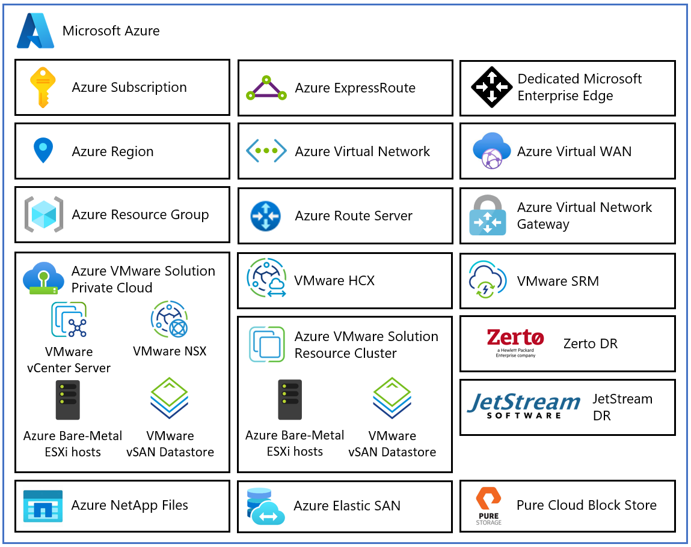
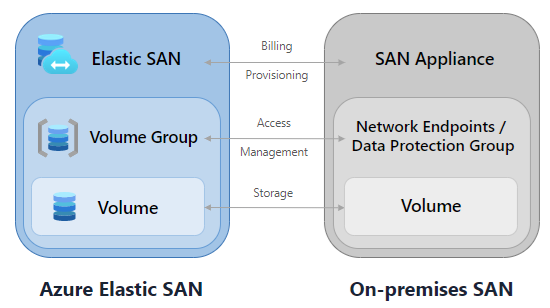
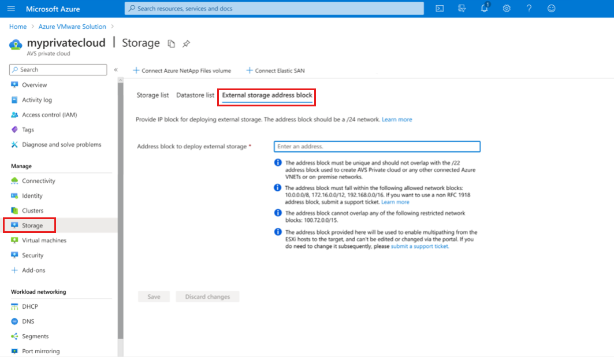
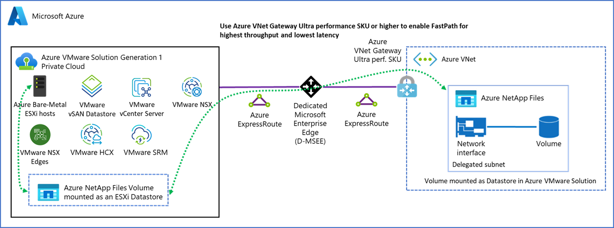
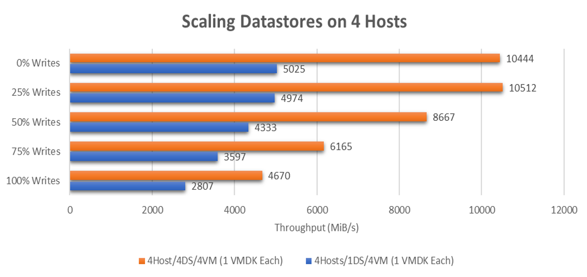
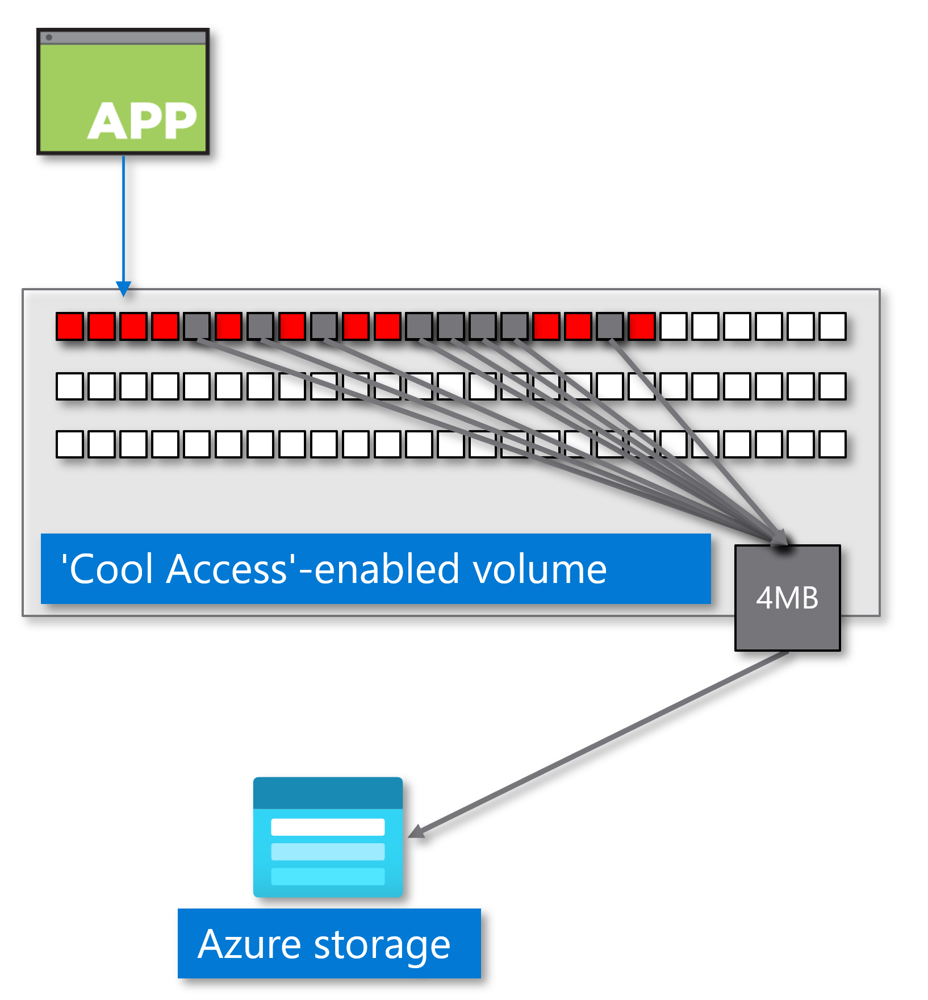
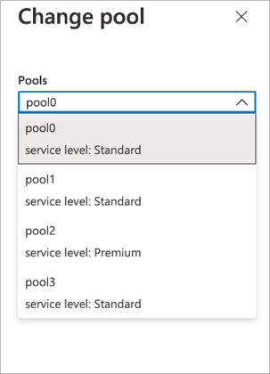
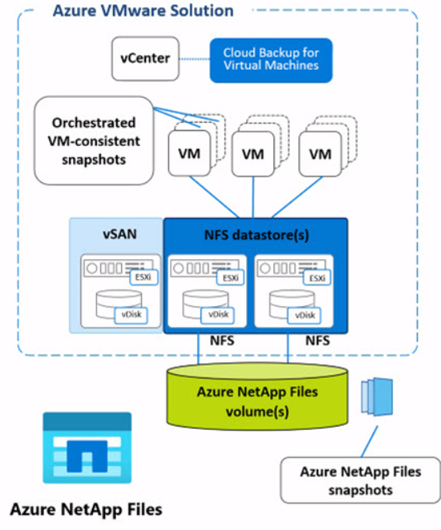

# Detailed Outline: Scaling Azure VMware Solution Storage Without Adding Nodes

> **Source basis:** The outline is derived from the supplied transcript, *Storage – Scaling AVS Storage Without New Nodes*. Microsoft Learn links are added inline where the documentation directly supports or materially relates to a point.
>
> **Linking convention:** Each outline point includes one or more inline Microsoft Learn references when available. Items labeled **Transcript explanation** are analogies, general storage explanations, or conclusions that are not stated directly in the Azure VMware Solution documentation.
>
> **Current-documentation cautions:**
>
> - The AVS storage-concepts page still describes the AV36 example as 1.6 TB NVMe cache plus 15.4 TB raw SSD capacity per host, while the current private-cloud architecture hardware table lists 3.2 TB cache and 15.20 TB capacity for AV36. Validate the actual host generation and SKU before using either figure for capacity planning. ([AVS storage concepts](https://learn.microsoft.com/en-us/azure/azure-vmware/architecture-storage); [private-cloud and cluster architecture](https://learn.microsoft.com/en-us/azure/azure-vmware/architecture-private-clouds))
> - The current Elastic SAN integration page lists **1,280 Mbps** for an UltraPerformance ExpressRoute gateway example, not 12,080 Mbps as stated in the transcript. ([Elastic SAN with AVS](https://learn.microsoft.com/en-us/azure/azure-vmware/configure-azure-elastic-san))
> - Current documentation states that clusters with **more than six hosts** should use FTT-2 for the referenced SLA guidance. It also confirms that storage policies do not update automatically when the cluster grows. ([AVS storage concepts](https://learn.microsoft.com/en-us/azure/azure-vmware/architecture-storage))
> - `nconnect=4` for Azure NetApp Files datastores is now documented as generally available, fixed at four connections, and non-disruptive on both AVS Gen 1 and Gen 2. The current article does not state that a support ticket is required. ([ANF datastore performance for AVS](https://learn.microsoft.com/en-us/azure/azure-netapp-files/performance-azure-vmware-solution-datastore); [AVS platform updates](https://learn.microsoft.com/en-us/azure/azure-vmware/azure-vmware-solution-platform-updates))
> - Cloud Backup for Virtual Machines does not provide an indexed search across backup contents, but the mounted Guest File Browse interface now documents case-sensitive expression filters for the current directory listing. ([Guest file restore](https://learn.microsoft.com/en-us/azure/azure-vmware/restore-guest-files-folders))

---

## I. The “Infinite Cloud” Illusion

### A. How cloud storage is typically presented

1. Major cloud platforms abstract physical storage so that additional capacity appears to be a simple service configuration rather than a hardware change. **Transcript explanation;** for the actual AVS hardware model, see [Azure VMware Solution private-cloud and cluster concepts](https://learn.microsoft.com/en-us/azure/azure-vmware/architecture-private-clouds).
2. Portal-driven deployment and management can make the infrastructure appear detached from the physical hosts underneath it. ([What is Azure VMware Solution?](https://learn.microsoft.com/en-us/azure/azure-vmware/introduction); [private-cloud and cluster concepts](https://learn.microsoft.com/en-us/azure/azure-vmware/architecture-private-clouds))
3. Azure VMware Solution makes the physical constraints more visible because its clusters run on dedicated bare-metal ESXi hosts. ([What is Azure VMware Solution?](https://learn.microsoft.com/en-us/azure/azure-vmware/introduction); [private-cloud and cluster concepts](https://learn.microsoft.com/en-us/azure/azure-vmware/architecture-private-clouds))

### B. Where the abstraction reaches practical limits

1. AVS capacity remains bounded by host, cluster, datastore, networking, and service limits. ([Scale clusters in a private cloud](https://learn.microsoft.com/en-us/azure/azure-vmware/tutorial-scale-private-cloud); [Azure VMware Solution limits](https://learn.microsoft.com/en-us/azure/azure-resource-manager/management/azure-subscription-service-limits#azure-vmware-solution-limits))
2. AVS clusters contain dedicated compute, networking, and vSAN storage resources rather than an unbounded storage pool. ([Private-cloud and cluster concepts](https://learn.microsoft.com/en-us/azure/azure-vmware/architecture-private-clouds); [AVS storage concepts](https://learn.microsoft.com/en-us/azure/azure-vmware/architecture-storage))
3. Storage expansion decisions must account for physical host capacity, fault-tolerance policy overhead, network throughput, and cost. ([AVS storage concepts](https://learn.microsoft.com/en-us/azure/azure-vmware/architecture-storage); [configure a storage policy](https://learn.microsoft.com/en-us/azure/azure-vmware/configure-storage-policy); [external storage solutions](https://learn.microsoft.com/en-us/azure/azure-vmware/ecosystem-external-storage-solutions))

### C. The fundamental hyperconverged-infrastructure problem

1. AVS resource clusters are based on hyperconverged infrastructure in which the local storage of each host contributes to the cluster-wide vSAN datastore. ([Private-cloud and cluster concepts](https://learn.microsoft.com/en-us/azure/azure-vmware/architecture-private-clouds); [AVS storage concepts](https://learn.microsoft.com/en-us/azure/azure-vmware/architecture-storage))
2. Adding native vSAN capacity generally means adding a host, which simultaneously increases CPU, memory, networking, licensing footprint, and storage. ([Scale clusters](https://learn.microsoft.com/en-us/azure/azure-vmware/tutorial-scale-private-cloud); [AVS storage concepts](https://learn.microsoft.com/en-us/azure/azure-vmware/architecture-storage))
3. Storage-heavy workloads can therefore force the purchase of compute capacity that the workload does not require. ([External storage solutions overview](https://learn.microsoft.com/en-us/azure/azure-vmware/ecosystem-external-storage-solutions); [Azure NetApp Files overview](https://learn.microsoft.com/en-us/azure/azure-netapp-files/azure-netapp-files-introduction))
4. Microsoft supports external datastores specifically so storage can be expanded without scaling the AVS cluster. ([AVS storage concepts](https://learn.microsoft.com/en-us/azure/azure-vmware/architecture-storage); [Elastic SAN with AVS](https://learn.microsoft.com/en-us/azure/azure-vmware/configure-azure-elastic-san); [attach ANF datastores](https://learn.microsoft.com/en-us/azure/azure-vmware/attach-azure-netapp-files-to-azure-vmware-solution-hosts))

### D. Objectives of the storage-scaling playbook

1. Optimize the native vSAN storage already available. ([Configure VMware vSAN](https://learn.microsoft.com/en-us/azure/azure-vmware/configure-vsan))
2. Validate and update VM storage policies as the cluster grows. ([Configure a storage policy](https://learn.microsoft.com/en-us/azure/azure-vmware/configure-storage-policy); [AVS storage concepts](https://learn.microsoft.com/en-us/azure/azure-vmware/architecture-storage))
3. Reclaim guest-deleted blocks through TRIM/UNMAP. ([Configure VMware vSAN](https://learn.microsoft.com/en-us/azure/azure-vmware/configure-vsan))
4. Identify and safely remove unassociated vSAN objects. ([Configure a storage policy—unassociated objects](https://learn.microsoft.com/en-us/azure/azure-vmware/configure-storage-policy))
5. Add independent storage through Azure Elastic SAN, Azure NetApp Files, or Pure Storage. ([External storage solutions overview](https://learn.microsoft.com/en-us/azure/azure-vmware/ecosystem-external-storage-solutions))
6. Protect externally stored VMs and VMDKs with documented backup and restore procedures. ([Install Cloud Backup for Virtual Machines](https://learn.microsoft.com/en-us/azure/azure-vmware/install-cloud-backup-virtual-machines); [back up ANF datastores and VMs](https://learn.microsoft.com/en-us/azure/azure-vmware/backup-azure-netapp-files-datastores-vms))

---

## II. Native AVS Storage Architecture

### A. Default storage platform

1. Every AVS private cloud includes VMware vSAN for workload storage. ([What is Azure VMware Solution?](https://learn.microsoft.com/en-us/azure/azure-vmware/introduction); [private-cloud and cluster concepts](https://learn.microsoft.com/en-us/azure/azure-vmware/architecture-private-clouds))
2. Each cluster has its own vSAN datastore. ([Configure VMware vSAN](https://learn.microsoft.com/en-us/azure/azure-vmware/configure-vsan))
3. Local disks from every host in the cluster are claimed by the cluster-wide vSAN datastore. ([AVS storage concepts](https://learn.microsoft.com/en-us/azure/azure-vmware/architecture-storage))
4. Native datastore capacity therefore grows as hosts are added. ([AVS storage concepts](https://learn.microsoft.com/en-us/azure/azure-vmware/architecture-storage); [scale clusters](https://learn.microsoft.com/en-us/azure/azure-vmware/tutorial-scale-private-cloud))

*Source: [Microsoft Learn — Azure VMware Solution private cloud and cluster concepts](https://learn.microsoft.com/en-us/azure/azure-vmware/architecture-private-clouds)*

### B. Transcript AV36 capacity example

1. The transcript uses 1.6 TB of NVMe cache and 15.4 TB of raw SSD capacity per AV36 host. The AVS storage-concepts page contains this same example. ([AVS storage concepts](https://learn.microsoft.com/en-us/azure/azure-vmware/architecture-storage))
2. Four hosts at 15.4 TB each provide 61.6 TB of raw capacity in that example. ([AVS storage concepts](https://learn.microsoft.com/en-us/azure/azure-vmware/architecture-storage))
3. The current hardware table separately lists AV36 as 3.2 TB cache and 15.20 TB capacity, so architects should use the specifications associated with their deployed SKU and generation. ([Private-cloud and cluster concepts](https://learn.microsoft.com/en-us/azure/azure-vmware/architecture-private-clouds))
4. “Raw” capacity does not equal usable workload capacity because storage policies, metadata, operational reserves, and fault tolerance consume capacity. ([Configure a storage policy](https://learn.microsoft.com/en-us/azure/azure-vmware/configure-storage-policy); [AVS storage concepts](https://learn.microsoft.com/en-us/azure/azure-vmware/architecture-storage))

### C. Purpose of OSA cache and capacity tiers

1. vSAN Original Storage Architecture uses disk groups with a cache tier and a capacity tier. ([AVS storage concepts](https://learn.microsoft.com/en-us/azure/azure-vmware/architecture-storage); [private-cloud hardware specifications](https://learn.microsoft.com/en-us/azure/azure-vmware/architecture-private-clouds))
2. The cache tier services active I/O before data is destaged to the capacity tier. ([AVS storage concepts](https://learn.microsoft.com/en-us/azure/azure-vmware/architecture-storage))
3. Deduplication and compression in OSA are applied as data moves from cache to capacity. ([AVS storage concepts](https://learn.microsoft.com/en-us/azure/azure-vmware/architecture-storage))
4. The transcript’s “shock absorber” analogy is an explanatory description rather than Microsoft Learn terminology. **Transcript explanation;** related architecture is documented in [AVS storage concepts](https://learn.microsoft.com/en-us/azure/azure-vmware/architecture-storage).

---

## III. vSAN OSA Versus ESA

### A. Original Storage Architecture

1. Gen 1 AVS private clouds use vSAN OSA. ([Generation 2 introduction](https://learn.microsoft.com/en-us/azure/azure-vmware/native-introduction); [private-cloud and cluster concepts](https://learn.microsoft.com/en-us/azure/azure-vmware/architecture-private-clouds))
2. AV36, AV36P, and AV52 are listed with OSA in the current host table. ([Private-cloud and cluster concepts](https://learn.microsoft.com/en-us/azure/azure-vmware/architecture-private-clouds))
3. OSA uses a distinct cache tier and capacity tier. ([Private-cloud and cluster concepts](https://learn.microsoft.com/en-us/azure/azure-vmware/architecture-private-clouds); [AVS storage concepts](https://learn.microsoft.com/en-us/azure/azure-vmware/architecture-storage))
4. AVS OSA defaults to deduplication and compression, while TRIM/UNMAP is disabled by default. ([Configure VMware vSAN](https://learn.microsoft.com/en-us/azure/azure-vmware/configure-vsan))

### B. Express Storage Architecture

1. AVS supports vSAN ESA as the default architecture for AV48 and AV64 Gen 2 host types. ([AVS platform updates](https://learn.microsoft.com/en-us/azure/azure-vmware/azure-vmware-solution-platform-updates); [private-cloud and cluster concepts](https://learn.microsoft.com/en-us/azure/azure-vmware/architecture-private-clouds))
2. Gen 2 private clouds use ESA and are deployed directly inside an Azure virtual network. ([Generation 2 introduction](https://learn.microsoft.com/en-us/azure/azure-vmware/native-introduction))
3. The hardware table lists no separate cache tier for AV48 and AV64 Gen 2 ESA configurations. ([Private-cloud and cluster concepts](https://learn.microsoft.com/en-us/azure/azure-vmware/architecture-private-clouds))
4. The transcript’s detailed explanation of ESA’s log-structured file system, sequential write aggregation, and write-amplification reduction is not described in the linked AVS Microsoft Learn pages. **Transcript explanation;** the supported architecture mapping is documented in [private-cloud and cluster concepts](https://learn.microsoft.com/en-us/azure/azure-vmware/architecture-private-clouds).

### C. Practical architectural distinction

1. OSA-specific Run Commands for deduplication, compression, and TRIM/UNMAP are documented separately as “Configure VMware vSAN (OSA).” ([Configure VMware vSAN](https://learn.microsoft.com/en-us/azure/azure-vmware/configure-vsan))
2. Storage-policy host-count prerequisites differ slightly between OSA and ESA, including ESA-optimized RAID-5 and RAID-6 policies. ([Configure a storage policy](https://learn.microsoft.com/en-us/azure/azure-vmware/configure-storage-policy))
3. Architects must identify the deployed generation and vSAN architecture before applying OSA-specific operational guidance. ([Generation 2 introduction](https://learn.microsoft.com/en-us/azure/azure-vmware/native-introduction); [configure VMware vSAN](https://learn.microsoft.com/en-us/azure/azure-vmware/configure-vsan))

---

## IV. Storage Policies and Fault Tolerance

### A. Default policy

1. The default workload storage policy is RAID-1 FTT-1 with thin provisioning. ([AVS storage concepts](https://learn.microsoft.com/en-us/azure/azure-vmware/architecture-storage))
2. `R1FTT1` means RAID-1 mirroring that tolerates one host failure. ([Configure a storage policy](https://learn.microsoft.com/en-us/azure/azure-vmware/configure-storage-policy))
3. RAID-1 FTT-1 requires a minimum of three hosts. ([Configure a storage policy](https://learn.microsoft.com/en-us/azure/azure-vmware/configure-storage-policy))
4. The default policy remains in use unless an administrator explicitly changes the default or applies another policy. ([AVS storage concepts](https://learn.microsoft.com/en-us/azure/azure-vmware/architecture-storage); [configure a storage policy](https://learn.microsoft.com/en-us/azure/azure-vmware/configure-storage-policy))

### B. How FTT-1 protects workloads

1. FTT-1 maintains sufficient redundancy to tolerate one host failure in a three-host cluster. ([AVS storage concepts](https://learn.microsoft.com/en-us/azure/azure-vmware/architecture-storage))
2. Microsoft monitors hardware failures and replaces failed hardware as part of operating the service. ([AVS storage concepts](https://learn.microsoft.com/en-us/azure/azure-vmware/architecture-storage); [host maintenance and lifecycle management](https://learn.microsoft.com/en-us/azure/azure-vmware/azure-vmware-solution-private-cloud-maintenance))
3. The transcript’s dual-engine analogy is an explanatory simplification of RAID-1 mirroring. **Transcript explanation;** policy definitions are in [configure a storage policy](https://learn.microsoft.com/en-us/azure/azure-vmware/configure-storage-policy).

### C. Capacity effect of mirroring

1. RAID-1 mirroring consumes additional physical capacity to maintain replica components. ([Configure a storage policy](https://learn.microsoft.com/en-us/azure/azure-vmware/configure-storage-policy))
2. The transcript’s examples of 100 GB becoming approximately 200 GB under FTT-1 and 300 GB under a three-way mirror are conceptual calculations rather than values stated in the AVS documentation. **Transcript explanation;** supported RAID and FTT combinations are documented in [configure a storage policy](https://learn.microsoft.com/en-us/azure/azure-vmware/configure-storage-policy).
3. Capacity planning must use the policy assigned to each object, not only the datastore’s raw capacity. ([Configure a storage policy](https://learn.microsoft.com/en-us/azure/azure-vmware/configure-storage-policy); [AVS storage concepts](https://learn.microsoft.com/en-us/azure/azure-vmware/architecture-storage))

---

## V. The Thick-Provisioning User-Interface Quirk

### A. What administrators may see

1. vSphere can display a “vSAN Default Storage Policy” with Object Space Reservation set to thick provisioning. ([AVS storage concepts](https://learn.microsoft.com/en-us/azure/azure-vmware/architecture-storage))
2. That displayed policy is not the default workload policy applied to the cluster. ([AVS storage concepts](https://learn.microsoft.com/en-us/azure/azure-vmware/architecture-storage))
3. The policy exists for historical purposes and is modified to thin provisioning. ([AVS storage concepts](https://learn.microsoft.com/en-us/azure/azure-vmware/architecture-storage))

### B. Actual default behavior

1. The documented workload default is RAID-1 FTT-1 with Object Space Reservation set to thin provisioning. ([AVS storage concepts](https://learn.microsoft.com/en-us/azure/azure-vmware/architecture-storage))
2. A storage policy’s `vSANObjectSpaceReservation` value of `0` means thin provisioned, while `100` means thick provisioned. ([Configure a storage policy](https://learn.microsoft.com/en-us/azure/azure-vmware/configure-storage-policy))
3. Auditors should distinguish the historical vSAN policy shown in the UI from the policy actually assigned to workload objects. ([AVS storage concepts](https://learn.microsoft.com/en-us/azure/azure-vmware/architecture-storage))

### C. Scope caveat

1. AVS management VMs use the Microsoft vSAN Management Storage Policy, which Microsoft documents as thin provisioned. ([AVS storage concepts](https://learn.microsoft.com/en-us/azure/azure-vmware/architecture-storage))
2. External Elastic SAN VMFS datastores have separate provisioning guidance; the current integration article recommends eager-zeroed thick virtual disks. ([Elastic SAN with AVS](https://learn.microsoft.com/en-us/azure/azure-vmware/configure-azure-elastic-san))

---

## VI. Critical Naming Restrictions

### A. Do not rename AVS clusters or datastores

1. Microsoft explicitly states that AVS datastores and clusters must not be renamed. ([AVS storage concepts](https://learn.microsoft.com/en-us/azure/azure-vmware/architecture-storage))
2. Azure CLI and PowerShell might expose operations that appear to permit changing a resource-cluster name, but Microsoft says the name should never be changed. ([AVS storage concepts](https://learn.microsoft.com/en-us/azure/azure-vmware/architecture-storage))
3. A rename can create a metadata mismatch between Azure portal resource names and vSphere names. ([AVS storage concepts](https://learn.microsoft.com/en-us/azure/azure-vmware/architecture-storage))

### B. Operational consequences

1. The transcript describes downstream API failures, host-replacement failures, backup failures, and orphaning as possible consequences of the metadata mismatch. The Microsoft page directly confirms the mismatch but does not enumerate every transcript scenario. ([AVS storage concepts](https://learn.microsoft.com/en-us/azure/azure-vmware/architecture-storage))
2. Naming should therefore be finalized before deployment and treated as immutable afterward. ([AVS storage concepts](https://learn.microsoft.com/en-us/azure/azure-vmware/architecture-storage))

---

## VII. Moving from FTT-1 to FTT-2

### A. Host-count and policy requirements

1. RAID-6 FTT-2 requires a minimum of six hosts for both OSA and ESA clusters. ([Configure a storage policy](https://learn.microsoft.com/en-us/azure/azure-vmware/configure-storage-policy))
2. The AVS storage-concepts page states that clusters with more than six hosts should use an FTT-2 policy for the referenced SLA guidance. ([AVS storage concepts](https://learn.microsoft.com/en-us/azure/azure-vmware/architecture-storage))
3. RAID-1 FTT-2 is also a supported policy and requires at least five hosts. ([Configure a storage policy](https://learn.microsoft.com/en-us/azure/azure-vmware/configure-storage-policy))
4. The transcript generally focuses on RAID-6 erasure coding when discussing FTT-2; Microsoft supports both RAID-1 FTT-2 and RAID-6 FTT-2. ([Configure a storage policy](https://learn.microsoft.com/en-us/azure/azure-vmware/configure-storage-policy))

### B. Erasure coding

1. Microsoft identifies RAID-5 and RAID-6 policies as erasure-coding policies. ([Configure a storage policy](https://learn.microsoft.com/en-us/azure/azure-vmware/configure-storage-policy))
2. `R6FTT2` means RAID-6 erasure coding that tolerates two failures. ([Configure a storage policy](https://learn.microsoft.com/en-us/azure/azure-vmware/configure-storage-policy))
3. The transcript’s detailed parity-equation and data-reconstruction explanation is general storage theory rather than an AVS-specific Microsoft Learn description. **Transcript explanation;** the AVS policy mapping is in [configure a storage policy](https://learn.microsoft.com/en-us/azure/azure-vmware/configure-storage-policy).

### C. Policy-update trap

1. The storage policy does not automatically update when a cluster grows. ([AVS storage concepts](https://learn.microsoft.com/en-us/azure/azure-vmware/architecture-storage))
2. Changing the cluster default policy does not automatically update running VMs. ([AVS storage concepts](https://learn.microsoft.com/en-us/azure/azure-vmware/architecture-storage))
3. Administrators must set the appropriate default and explicitly apply the intended policy to existing VMs or disks. ([Configure a storage policy](https://learn.microsoft.com/en-us/azure/azure-vmware/configure-storage-policy))
4. Scale-down operations also require all vSAN objects to use policies compatible with the remaining host count and RAID requirements. ([Scale clusters](https://learn.microsoft.com/en-us/azure/azure-vmware/tutorial-scale-private-cloud))

---

## VIII. Optimize Existing vSAN Capacity Before Expanding

### A. Review storage configuration

1. Confirm the vSAN architecture, host type, raw capacity, and assigned storage policies. ([Private-cloud and cluster concepts](https://learn.microsoft.com/en-us/azure/azure-vmware/architecture-private-clouds); [configure a storage policy](https://learn.microsoft.com/en-us/azure/azure-vmware/configure-storage-policy))
2. Review whether deduplication and compression are appropriate for the workload. ([Configure VMware vSAN](https://learn.microsoft.com/en-us/azure/azure-vmware/configure-vsan); [AVS storage concepts](https://learn.microsoft.com/en-us/azure/azure-vmware/architecture-storage))
3. Check whether TRIM/UNMAP is enabled and whether VMs meet the prerequisites. ([Configure VMware vSAN](https://learn.microsoft.com/en-us/azure/azure-vmware/configure-vsan))
4. Scan for unassociated vSAN objects that consume capacity or block cluster operations. ([Configure a storage policy](https://learn.microsoft.com/en-us/azure/azure-vmware/configure-storage-policy))
5. Use Azure Monitor and AVS alerts to track datastore capacity; Microsoft documents alerts when capacity consumption exceeds 75%. ([AVS storage concepts](https://learn.microsoft.com/en-us/azure/azure-vmware/architecture-storage); [configure Azure alerts for AVS](https://learn.microsoft.com/en-us/azure/azure-vmware/configure-alerts-for-azure-vmware-solution))

---

## IX. Deduplication and Compression

### A. Default OSA space efficiency

1. OSA clusters default to deduplication and compression. ([Configure VMware vSAN](https://learn.microsoft.com/en-us/azure/azure-vmware/configure-vsan))
2. Deduplication and compression work together to reduce datastore consumption. ([AVS storage concepts](https://learn.microsoft.com/en-us/azure/azure-vmware/architecture-storage))
3. vSAN applies deduplication first and compression afterward as data moves from cache to capacity. ([AVS storage concepts](https://learn.microsoft.com/en-us/azure/azure-vmware/architecture-storage))

### B. Deduplication mechanics

1. The transcript explains block hashing, duplicate-block indexes, and metadata pointers. These are general vSAN implementation concepts not expanded in the AVS Microsoft Learn pages. **Transcript explanation;** AVS default behavior is documented in [AVS storage concepts](https://learn.microsoft.com/en-us/azure/azure-vmware/architecture-storage).
2. Repeated operating-system blocks across many VMs are presented as the principal deduplication example. **Transcript explanation;** related AVS configuration is documented in [configure VMware vSAN](https://learn.microsoft.com/en-us/azure/azure-vmware/configure-vsan).
3. Hash calculation and index lookups can add CPU and latency overhead. **Transcript explanation;** Microsoft documents the resulting performance recommendation in [AVS storage concepts](https://learn.microsoft.com/en-us/azure/azure-vmware/architecture-storage).

### C. Performance trade-off

1. Microsoft states that disabling deduplication for I/O-intensive VMs can improve overall VM performance by up to 2x. ([AVS storage concepts](https://learn.microsoft.com/en-us/azure/azure-vmware/architecture-storage))
2. The OSA Run Command supports compression-only, deduplication-plus-compression, or disabling both. ([Configure VMware vSAN](https://learn.microsoft.com/en-us/azure/azure-vmware/configure-vsan))
3. Microsoft notes that compression-only provides only slightly better performance, while disabling both produces the greatest performance gains at the cost of space efficiency. ([Configure VMware vSAN](https://learn.microsoft.com/en-us/azure/azure-vmware/configure-vsan))
4. Workload testing should determine whether capacity savings or I/O performance is more valuable. ([Configure VMware vSAN](https://learn.microsoft.com/en-us/azure/azure-vmware/configure-vsan); [AVS storage concepts](https://learn.microsoft.com/en-us/azure/azure-vmware/architecture-storage))

---

## X. Disabling Deduplication Safely

### A. Run Command configuration

1. Use `Set-vSANCompressDedupe` in the AVS Run Command packages to change OSA space-efficiency settings. ([Configure VMware vSAN](https://learn.microsoft.com/en-us/azure/azure-vmware/configure-vsan))
2. Setting compression to `true` and deduplication to `false` configures compression-only. ([Configure VMware vSAN](https://learn.microsoft.com/en-us/azure/azure-vmware/configure-vsan))
3. Setting both values to `false` disables all space-efficiency processing. ([Configure VMware vSAN](https://learn.microsoft.com/en-us/azure/azure-vmware/configure-vsan))
4. Enabling deduplication implicitly enables compression. ([Configure VMware vSAN](https://learn.microsoft.com/en-us/azure/azure-vmware/configure-vsan))

### B. Resynchronization and performance impact

1. Changing the space-efficiency model causes a vSAN resynchronization. ([Configure VMware vSAN](https://learn.microsoft.com/en-us/azure/azure-vmware/configure-vsan))
2. Disks are reformatted during the transition, and performance degrades while the change is occurring. ([Configure VMware vSAN](https://learn.microsoft.com/en-us/azure/azure-vmware/configure-vsan))
3. Microsoft recommends at least 25% available space before changing the configuration. ([Configure VMware vSAN](https://learn.microsoft.com/en-us/azure/azure-vmware/configure-vsan))
4. The transcript’s description of deduplicated data being expanded back into full blocks is an explanatory model for why the operation consumes capacity and I/O. **Transcript explanation;** the documented warning is in [configure VMware vSAN](https://learn.microsoft.com/en-us/azure/azure-vmware/configure-vsan).

### C. Change-management approach

1. Treat the change as a storage maintenance activity rather than a routine toggle. ([Configure VMware vSAN](https://learn.microsoft.com/en-us/azure/azure-vmware/configure-vsan))
2. Validate free space, resync state, datastore health, and workload latency before and during the operation. ([Configure VMware vSAN](https://learn.microsoft.com/en-us/azure/azure-vmware/configure-vsan))
3. Run Commands execute serially in the order submitted. ([Configure VMware vSAN](https://learn.microsoft.com/en-us/azure/azure-vmware/configure-vsan))

---

## XI. TRIM and SCSI UNMAP

### A. Why capacity is not reclaimed automatically

1. The guest operating system can mark blocks free without the hypervisor immediately reclaiming the corresponding physical storage. **Transcript explanation;** the supported reclamation mechanism is documented in [configure VMware vSAN](https://learn.microsoft.com/en-us/azure/azure-vmware/configure-vsan).
2. TRIM/UNMAP allows the guest and virtual storage stack to communicate that blocks can be reclaimed. ([Configure VMware vSAN](https://learn.microsoft.com/en-us/azure/azure-vmware/configure-vsan))
3. OSA clusters have TRIM/UNMAP disabled by default. ([Configure VMware vSAN](https://learn.microsoft.com/en-us/azure/azure-vmware/configure-vsan))

### B. Enablement

1. Use the `Set-AVSVSANClusterUNMAPTRIM` Run Command package to enable or disable the feature. ([Configure VMware vSAN](https://learn.microsoft.com/en-us/azure/azure-vmware/configure-vsan))
2. Microsoft warns that enabling TRIM/UNMAP can negatively affect performance. ([Configure VMware vSAN](https://learn.microsoft.com/en-us/azure/azure-vmware/configure-vsan))
3. A VM-level setting can be used as a stop switch where the behavior must be disabled for an individual VM. ([Configure VMware vSAN](https://learn.microsoft.com/en-us/azure/azure-vmware/configure-vsan))

### C. VM prerequisites

1. The guest operating system must recognize the virtual disk as thin provisioned. ([Configure VMware vSAN](https://learn.microsoft.com/en-us/azure/azure-vmware/configure-vsan))
2. Windows requires VM hardware version 11 or later according to the transcript and linked VMware prerequisites surfaced by Microsoft. ([Configure VMware vSAN](https://learn.microsoft.com/en-us/azure/azure-vmware/configure-vsan))
3. Linux requires VM hardware version 13 or later according to the transcript and linked VMware prerequisites surfaced by Microsoft. ([Configure VMware vSAN](https://learn.microsoft.com/en-us/azure/azure-vmware/configure-vsan))
4. After cluster-level enablement, each affected VM must be powered off and powered back on. ([Configure VMware vSAN](https://learn.microsoft.com/en-us/azure/azure-vmware/configure-vsan))
5. A guest restart is insufficient. ([Configure VMware vSAN](https://learn.microsoft.com/en-us/azure/azure-vmware/configure-vsan))
6. VMX changes also require a restart to take effect when using the per-VM stop-switch setting. ([Configure VMware vSAN](https://learn.microsoft.com/en-us/azure/azure-vmware/configure-vsan))

### D. Deployment planning

1. Inventory VM hardware versions and thin-provisioning status before rollout. ([Configure VMware vSAN](https://learn.microsoft.com/en-us/azure/azure-vmware/configure-vsan))
2. Schedule full VM power cycles rather than relying on operating-system reboots. ([Configure VMware vSAN](https://learn.microsoft.com/en-us/azure/azure-vmware/configure-vsan))
3. Monitor for performance impact and confirm that reclaimed capacity becomes visible after guest UNMAP activity. ([Configure VMware vSAN](https://learn.microsoft.com/en-us/azure/azure-vmware/configure-vsan))

---

## XII. Unassociated vSAN Objects

### A. Definition and causes

1. Unassociated objects are vSAN storage objects not linked to an active VM or namespace. ([Configure a storage policy—unassociated objects](https://learn.microsoft.com/en-us/azure/azure-vmware/configure-storage-policy))
2. They can result from VM deletion, interrupted operations, policy mismatches, failed workflows, or API operations. ([Configure a storage policy](https://learn.microsoft.com/en-us/azure/azure-vmware/configure-storage-policy))
3. They can consume capacity and block cluster operations. ([Configure a storage policy](https://learn.microsoft.com/en-us/azure/azure-vmware/configure-storage-policy))
4. The transcript’s VADP backup-failure scenario is a plausible explanatory example, but the Microsoft page does not limit the cause to backup software. ([Configure a storage policy](https://learn.microsoft.com/en-us/azure/azure-vmware/configure-storage-policy))

### B. Discovery

1. Run `Get-UnassociatedVsanObjectsWithPolicy` from the latest `Microsoft.AVS.Management` Run Command package. ([Configure a storage policy](https://learn.microsoft.com/en-us/azure/azure-vmware/configure-storage-policy))
2. Supply an exact storage-policy name and the cluster name. ([Configure a storage policy](https://learn.microsoft.com/en-us/azure/azure-vmware/configure-storage-policy))
3. The output identifies objects by UUID rather than a friendly VM filename. ([Configure a storage policy](https://learn.microsoft.com/en-us/azure/azure-vmware/configure-storage-policy))
4. Administrators can also change the storage policy of unassociated objects with `Update-StoragePolicyOfUnassociatedVsanObjects`. ([Configure a storage policy](https://learn.microsoft.com/en-us/azure/azure-vmware/configure-storage-policy))

### C. Validation and deletion

1. Verify that an object is not required by a workload, management VM, or system component before deletion. ([Configure a storage policy](https://learn.microsoft.com/en-us/azure/azure-vmware/configure-storage-policy))
2. Microsoft specifically warns about objects related to vCenter, NSX, HCX, SRM, backup, and replication components. ([Configure a storage policy](https://learn.microsoft.com/en-us/azure/azure-vmware/configure-storage-policy))
3. Delete an object with `Remove-AvsUnassociatedObject`, supplying its UUID and cluster name. ([Configure a storage policy](https://learn.microsoft.com/en-us/azure/azure-vmware/configure-storage-policy))
4. Delete objects one at a time to minimize risk. ([Configure a storage policy](https://learn.microsoft.com/en-us/azure/azure-vmware/configure-storage-policy))
5. Deletion is irreversible and permanently removes the object. ([Configure a storage policy](https://learn.microsoft.com/en-us/azure/azure-vmware/configure-storage-policy))
6. If ownership cannot be determined, do not delete the object until it has been investigated. ([Configure a storage policy](https://learn.microsoft.com/en-us/azure/azure-vmware/configure-storage-policy))

---

## XIII. Add Hosts or Decouple Storage

### A. Native scale-out

1. An AVS cluster supports a minimum of three and a maximum of sixteen ESXi hosts. ([Scale clusters](https://learn.microsoft.com/en-us/azure/azure-vmware/tutorial-scale-private-cloud); [AVS FAQ](https://learn.microsoft.com/en-us/azure/azure-vmware/faq))
2. Adding hosts expands native compute and vSAN capacity together. ([Private-cloud and cluster concepts](https://learn.microsoft.com/en-us/azure/azure-vmware/architecture-private-clouds); [scale clusters](https://learn.microsoft.com/en-us/azure/azure-vmware/tutorial-scale-private-cloud))
3. This remains appropriate when both compute and storage demand are increasing. **Architectural inference;** supported scale-out is documented in [scale clusters](https://learn.microsoft.com/en-us/azure/azure-vmware/tutorial-scale-private-cloud).

### B. Independent storage scale

1. Azure NetApp Files and Azure Elastic SAN can expand datastore capacity without scaling AVS clusters. ([AVS storage concepts](https://learn.microsoft.com/en-us/azure/azure-vmware/architecture-storage))
2. Pure Storage options also decouple compute and storage for storage-heavy workloads. ([External storage solutions overview](https://learn.microsoft.com/en-us/azure/azure-vmware/ecosystem-external-storage-solutions))
3. External storage is therefore suited to environments where storage growth is materially greater than CPU and memory growth. ([External storage solutions overview](https://learn.microsoft.com/en-us/azure/azure-vmware/ecosystem-external-storage-solutions); [Azure NetApp Files overview](https://learn.microsoft.com/en-us/azure/azure-netapp-files/azure-netapp-files-introduction))
4. The transcript’s “second car versus roof rack” comparison is an explanatory analogy. **Transcript explanation;** the underlying capability is documented in [AVS storage concepts](https://learn.microsoft.com/en-us/azure/azure-vmware/architecture-storage).

---

## XIV. External Storage Options

### A. Supported categories

1. Azure NetApp Files provides Azure-native NFS file storage backed by NetApp bare-metal all-flash systems. ([External storage solutions overview](https://learn.microsoft.com/en-us/azure/azure-vmware/ecosystem-external-storage-solutions))
2. Azure Elastic SAN provides Azure-native iSCSI block storage. ([External storage solutions overview](https://learn.microsoft.com/en-us/azure/azure-vmware/ecosystem-external-storage-solutions); [Elastic SAN with AVS](https://learn.microsoft.com/en-us/azure/azure-vmware/configure-azure-elastic-san))
3. Pure Storage Cloud Dedicated provides software-delivered Pure Storage on Azure infrastructure. ([External storage solutions overview](https://learn.microsoft.com/en-us/azure/azure-vmware/ecosystem-external-storage-solutions); [configure Pure Cloud Block Store](https://learn.microsoft.com/en-us/azure/azure-vmware/configure-pure-cloud-block-store))
4. Pure Storage Cloud Azure Native provides an Azure-native Pure block-storage experience. ([External storage solutions overview](https://learn.microsoft.com/en-us/azure/azure-vmware/ecosystem-external-storage-solutions); [configure Azure Native Pure Storage Cloud](https://learn.microsoft.com/en-us/azure/azure-vmware/configure-azure-native-pure-storage-cloud))

### B. Selection principle

1. Native vSAN and each external service have different performance and availability characteristics. ([External storage solutions overview](https://learn.microsoft.com/en-us/azure/azure-vmware/ecosystem-external-storage-solutions))
2. Place each VM on the storage platform that matches its performance, availability, protocol, protection, and operational requirements. ([External storage solutions overview](https://learn.microsoft.com/en-us/azure/azure-vmware/ecosystem-external-storage-solutions))
3. Storage selection should include recovery capabilities and operational tooling, not only capacity and price. ([Install Cloud Backup for Virtual Machines](https://learn.microsoft.com/en-us/azure/azure-vmware/install-cloud-backup-virtual-machines); [external storage solutions overview](https://learn.microsoft.com/en-us/azure/azure-vmware/ecosystem-external-storage-solutions))

---

## XV. Azure Elastic SAN Storage Model

### A. Block-storage integration

1. AVS supports attaching Azure Elastic SAN volumes as persistent iSCSI datastores. ([Elastic SAN with AVS](https://learn.microsoft.com/en-us/azure/azure-vmware/configure-azure-elastic-san))
2. Elastic SAN volumes are formatted as VMFS datastores and attached to selected clusters. ([Elastic SAN with AVS](https://learn.microsoft.com/en-us/azure/azure-vmware/configure-azure-elastic-san))
3. Block storage presents storage to ESXi rather than exposing an NFS directory tree. ([External storage solutions overview](https://learn.microsoft.com/en-us/azure/azure-vmware/ecosystem-external-storage-solutions); [Elastic SAN overview](https://learn.microsoft.com/en-us/azure/storage/elastic-san/elastic-san-introduction))
4. External VMFS storage allows datastore expansion without adding AVS hosts. ([Elastic SAN with AVS](https://learn.microsoft.com/en-us/azure/azure-vmware/configure-azure-elastic-san))

*Source: [Microsoft Learn — What is Azure Elastic SAN?](https://learn.microsoft.com/en-us/azure/storage/elastic-san/elastic-san-introduction)*

### B. Deployment prerequisites

1. Deploy Elastic SAN in a supported region and in the same availability zone as the AVS private cloud. ([Elastic SAN with AVS](https://learn.microsoft.com/en-us/azure/azure-vmware/configure-azure-elastic-san))
2. Create an Elastic SAN with at least a 16 TiB base size. ([Elastic SAN with AVS](https://learn.microsoft.com/en-us/azure/azure-vmware/configure-azure-elastic-san))
3. Disable cyclic-redundancy-check protection on the volume group because it is not supported for AVS. ([Elastic SAN with AVS](https://learn.microsoft.com/en-us/azure/azure-vmware/configure-azure-elastic-san))
4. Confirm required RBAC permissions across AVS and Elastic SAN. ([Elastic SAN with AVS](https://learn.microsoft.com/en-us/azure/azure-vmware/configure-azure-elastic-san))
5. Supported hosts include AV36, AV36P, AV48, AV52, and AV64 for Gen 1, and AV64 for Gen 2. ([Elastic SAN with AVS](https://learn.microsoft.com/en-us/azure/azure-vmware/configure-azure-elastic-san))

---

## XVI. Elastic SAN Networking and MPIO

### A. Dedicated external-storage address block

1. AVS Gen 1 requires a dedicated `/24` address block for external storage. ([Elastic SAN with AVS](https://learn.microsoft.com/en-us/azure/azure-vmware/configure-azure-elastic-san))
2. The block cannot overlap the AVS `/22`, connected VNets, or on-premises networks. ([Elastic SAN with AVS](https://learn.microsoft.com/en-us/azure/azure-vmware/configure-azure-elastic-san))
3. The block must normally be drawn from RFC 1918 ranges; non-RFC 1918 use requires a support request. ([Elastic SAN with AVS](https://learn.microsoft.com/en-us/azure/azure-vmware/configure-azure-elastic-san))
4. The address block enables multipathing from ESXi hosts to the storage target. ([Elastic SAN with AVS](https://learn.microsoft.com/en-us/azure/azure-vmware/configure-azure-elastic-san))
5. The block cannot be edited after configuration without a support request. ([Elastic SAN with AVS](https://learn.microsoft.com/en-us/azure/azure-vmware/configure-azure-elastic-san))
6. The dedicated `/24` guidance applies to Gen 1; Gen 2 uses private-cloud connectivity. ([Elastic SAN with AVS](https://learn.microsoft.com/en-us/azure/azure-vmware/configure-azure-elastic-san))

*Source: [Microsoft Learn — Use Azure VMware Solution with Azure Elastic SAN](https://learn.microsoft.com/en-us/azure/azure-vmware/configure-azure-elastic-san)*

### B. Multiple sessions and paths

1. Microsoft recommends multiple private endpoints and sessions for Gen 1 to improve parallel performance and resilience. ([Elastic SAN with AVS](https://learn.microsoft.com/en-us/azure/azure-vmware/configure-azure-elastic-san))
2. Multiple sessions reduce the effect of a single session disconnect and help load-balance traffic. ([Elastic SAN with AVS](https://learn.microsoft.com/en-us/azure/azure-vmware/configure-azure-elastic-san))
3. The transcript’s discussion of round-robin path selection and queue depth is general MPIO context rather than detailed AVS configuration guidance. **Transcript explanation;** Microsoft’s session recommendation is in [Elastic SAN with AVS](https://learn.microsoft.com/en-us/azure/azure-vmware/configure-azure-elastic-san).
4. Configure all private endpoints before attaching the datastore; adding endpoints later requires detaching and reconnecting it. ([Elastic SAN with AVS](https://learn.microsoft.com/en-us/azure/azure-vmware/configure-azure-elastic-san))

---

## XVII. Elastic SAN 128-Connection Limit

### A. Hard connection ceiling

1. One Elastic SAN datastore supports a maximum of 128 connections. ([Elastic SAN with AVS](https://learn.microsoft.com/en-us/azure/azure-vmware/configure-azure-elastic-san))
2. Connecting the datastore to a cluster automatically connects it to every host in that cluster. ([Elastic SAN with AVS](https://learn.microsoft.com/en-us/azure/azure-vmware/configure-azure-elastic-san))
3. Total consumption is determined by host count multiplied by sessions per host. ([Elastic SAN with AVS](https://learn.microsoft.com/en-us/azure/azure-vmware/configure-azure-elastic-san))
4. Multiple clusters connected to the same datastore must be included in the connection calculation. ([Elastic SAN with AVS](https://learn.microsoft.com/en-us/azure/azure-vmware/configure-azure-elastic-san))

### B. Sixteen-host example

1. Sixteen hosts using eight sessions each consume all 128 connections. ([Elastic SAN with AVS](https://learn.microsoft.com/en-us/azure/azure-vmware/configure-azure-elastic-san))
2. At the limit, an additional maintenance host cannot attach to the datastore. ([Elastic SAN with AVS](https://learn.microsoft.com/en-us/azure/azure-vmware/configure-azure-elastic-san))
3. This can prevent maintenance workflows that depend on an extra host seeing the datastore. ([Elastic SAN with AVS](https://learn.microsoft.com/en-us/azure/azure-vmware/configure-azure-elastic-san))

### C. Recommended headroom

1. For a sixteen-host AV36, AV36P, or AV52 cluster, Microsoft recommends six sessions over three private endpoints. ([Elastic SAN with AVS](https://learn.microsoft.com/en-us/azure/azure-vmware/configure-azure-elastic-san))
2. Six sessions across sixteen hosts consume 96 connections, leaving 32 available. ([Elastic SAN with AVS](https://learn.microsoft.com/en-us/azure/azure-vmware/configure-azure-elastic-san))
3. For a sixteen-host AV64 cluster, Microsoft recommends seven sessions over seven private endpoints. ([Elastic SAN with AVS](https://learn.microsoft.com/en-us/azure/azure-vmware/configure-azure-elastic-san))
4. Capacity planning must reserve sessions for maintenance, replacement, and future scale rather than using all 128 in steady state. ([Elastic SAN with AVS](https://learn.microsoft.com/en-us/azure/azure-vmware/configure-azure-elastic-san))

---

## XVIII. Elastic SAN Gen 1 Versus Gen 2 Connectivity

### A. Gen 1

1. Gen 1 reaches Elastic SAN private endpoints through an ExpressRoute virtual network gateway. ([Elastic SAN with AVS](https://learn.microsoft.com/en-us/azure/azure-vmware/configure-azure-elastic-san))
2. ExpressRoute gateway throughput must be sized for the SAN workload. ([Elastic SAN with AVS](https://learn.microsoft.com/en-us/azure/azure-vmware/configure-azure-elastic-san))
3. The current Microsoft example states that one UltraPerformance gateway supports 1,280 Mbps and that one fully utilized Elastic SAN datastore can consume that bandwidth. ([Elastic SAN with AVS](https://learn.microsoft.com/en-us/azure/azure-vmware/configure-azure-elastic-san))
4. Multiple gateways might be required depending on bandwidth requirements. ([Elastic SAN with AVS](https://learn.microsoft.com/en-us/azure/azure-vmware/configure-azure-elastic-san))
5. Gateway maintenance can cause brief connectivity interruptions, though the datastore is expected to remain available as sessions reconnect. ([Elastic SAN with AVS](https://learn.microsoft.com/en-us/azure/azure-vmware/configure-azure-elastic-san))

### B. Gen 2

1. Gen 2 private clouds are deployed inside an Azure VNet and do not require ExpressRoute for this integration. ([Generation 2 introduction](https://learn.microsoft.com/en-us/azure/azure-vmware/native-introduction); [Elastic SAN with AVS](https://learn.microsoft.com/en-us/azure/azure-vmware/configure-azure-elastic-san))
2. Gen 2 uses private-cloud connectivity to the Elastic SAN private endpoint. ([Elastic SAN with AVS](https://learn.microsoft.com/en-us/azure/azure-vmware/configure-azure-elastic-san))
3. A single private endpoint is sufficient because Gen 2 clones iSCSI sessions. ([Elastic SAN with AVS](https://learn.microsoft.com/en-us/azure/azure-vmware/configure-azure-elastic-san))
4. The transcript describes this as bypassing the ExpressRoute gateway and removing that router-level bottleneck. ([Elastic SAN with AVS](https://learn.microsoft.com/en-us/azure/azure-vmware/configure-azure-elastic-san); [Generation 2 introduction](https://learn.microsoft.com/en-us/azure/azure-vmware/native-introduction))

---

## XIX. Elastic SAN Performance and APD Events

### A. Performance claims in the transcript

1. The transcript reports approximately 100,000 IOPS for a 4 KB mixed-read/write test and more than 1,600 MB/s for a 1 MB sequential-read test. **No matching benchmark values were located on the current AVS Elastic SAN integration page;** use [Elastic SAN performance documentation](https://learn.microsoft.com/en-us/azure/storage/elastic-san/elastic-san-performance) and validate against the deployed SAN configuration.
2. The transcript associates small random I/O with OLTP workloads and large sequential I/O with warehousing, file movement, and backups. **General storage guidance;** service positioning is documented in [Elastic SAN with AVS](https://learn.microsoft.com/en-us/azure/azure-vmware/configure-azure-elastic-san).
3. Performance must also account for gateway throughput on Gen 1 and the configured number of sessions and private endpoints. ([Elastic SAN with AVS](https://learn.microsoft.com/en-us/azure/azure-vmware/configure-azure-elastic-san))

### B. All Paths Down

1. Session disconnects can appear as All Paths Down events in vCenter and ESXi logs. ([Elastic SAN with AVS](https://learn.microsoft.com/en-us/azure/azure-vmware/configure-azure-elastic-san))
2. Multiple sessions reduce the effect of a single disconnect while connections are re-established. ([Elastic SAN with AVS](https://learn.microsoft.com/en-us/azure/azure-vmware/configure-azure-elastic-san))
3. Gen 1 gateway maintenance can cause intermittent connectivity, but Microsoft states that it is not expected to affect datastore availability when the connection returns within seconds. ([Elastic SAN with AVS](https://learn.microsoft.com/en-us/azure/azure-vmware/configure-azure-elastic-san))
4. Operations teams should distinguish transient APD events from sustained datastore unavailability. **Operational inference;** the documented behavior is in [Elastic SAN with AVS](https://learn.microsoft.com/en-us/azure/azure-vmware/configure-azure-elastic-san).

---

## XX. Azure NetApp Files Architecture

### A. Service characteristics

1. Azure NetApp Files is an Azure-native, first-party, enterprise-class file-storage service. ([What is Azure NetApp Files?](https://learn.microsoft.com/en-us/azure/azure-netapp-files/azure-netapp-files-introduction))
2. It provides in-Azure bare-metal all-flash performance with submillisecond latency for the Standard, Premium, Ultra, and Flexible service levels. ([ANF service levels](https://learn.microsoft.com/en-us/azure/azure-netapp-files/azure-netapp-files-service-levels); [external storage solutions overview](https://learn.microsoft.com/en-us/azure/azure-vmware/ecosystem-external-storage-solutions))
3. AVS mounts ANF volumes as NFS datastores. ([Attach ANF datastores](https://learn.microsoft.com/en-us/azure/azure-vmware/attach-azure-netapp-files-to-azure-vmware-solution-hosts))
4. Traffic travels from the ESXi VMkernel port directly to the NFS mount over the Azure network. ([Attach ANF datastores](https://learn.microsoft.com/en-us/azure/azure-vmware/attach-azure-netapp-files-to-azure-vmware-solution-hosts))
5. ANF can expand storage without adding AVS compute hosts. ([Attach ANF datastores](https://learn.microsoft.com/en-us/azure/azure-vmware/attach-azure-netapp-files-to-azure-vmware-solution-hosts); [What is ANF?](https://learn.microsoft.com/en-us/azure/azure-netapp-files/azure-netapp-files-introduction))

*Source: [Microsoft Learn — Attach Azure NetApp Files datastores to Azure VMware Solution hosts](https://learn.microsoft.com/en-us/azure/azure-vmware/attach-azure-netapp-files-to-azure-vmware-solution-hosts)*

*Source: [Microsoft Learn — Attach Azure NetApp Files datastores to Azure VMware Solution hosts](https://learn.microsoft.com/en-us/azure/azure-vmware/attach-azure-netapp-files-to-azure-vmware-solution-hosts)*

### B. Datastore attachment

1. Create an ANF NFS volume that meets the AVS prerequisites. ([Attach ANF datastores](https://learn.microsoft.com/en-us/azure/azure-vmware/attach-azure-netapp-files-to-azure-vmware-solution-hosts))
2. In the AVS private cloud, use **Connect Azure NetApp Files volume** and select the subscription, account, capacity pool, and volume. ([Attach ANF datastores](https://learn.microsoft.com/en-us/azure/azure-vmware/attach-azure-netapp-files-to-azure-vmware-solution-hosts))
3. Azure configures the datastore association and ESXi access. ([Attach ANF datastores](https://learn.microsoft.com/en-us/azure/azure-vmware/attach-azure-netapp-files-to-azure-vmware-solution-hosts))
4. Appropriate permissions are required across both AVS and ANF resources. ([Attach ANF datastores](https://learn.microsoft.com/en-us/azure/azure-vmware/attach-azure-netapp-files-to-azure-vmware-solution-hosts))

---

## XXI. ANF Datastore Scale and Performance

### A. Datastore sizing

1. The transcript states that a single ANF datastore can be provisioned up to 64 TB. Confirm current volume and datastore limits for the selected region and service level. ([Azure NetApp Files resource limits](https://learn.microsoft.com/en-us/azure/azure-netapp-files/azure-netapp-files-resource-limits); [attach ANF datastores](https://learn.microsoft.com/en-us/azure/azure-vmware/attach-azure-netapp-files-to-azure-vmware-solution-hosts))
2. Multiple ANF datastores can be attached to one AVS cluster for performance and management separation. ([ANF datastore performance for AVS](https://learn.microsoft.com/en-us/azure/azure-netapp-files/performance-azure-vmware-solution-datastore))
3. Current performance guidance states that AVS supports up to 64 ANF datastores per cluster when scaling with `nconnect=4`. ([ANF datastore performance for AVS](https://learn.microsoft.com/en-us/azure/azure-netapp-files/performance-azure-vmware-solution-datastore))

### B. Performance scaling

1. Performance scales with both the number of AVS hosts and the number of ANF datastores because those factors increase network-flow count. ([ANF datastore performance for AVS](https://learn.microsoft.com/en-us/azure/azure-netapp-files/performance-azure-vmware-solution-datastore))
2. Microsoft testing exceeded 10,500 MiB/s and 585,000 IOPS with four ESXi hosts and one ANF capacity pool. ([ANF datastore performance for AVS](https://learn.microsoft.com/en-us/azure/azure-netapp-files/performance-azure-vmware-solution-datastore))
3. One datastore across four hosts exceeded 5,000 MiB/s in the published test. ([ANF datastore performance for AVS](https://learn.microsoft.com/en-us/azure/azure-netapp-files/performance-azure-vmware-solution-datastore))
4. Four datastores produced more than 10,500 MiB/s and more than 530,000 random 8 KB IOPS in the documented multi-host tests. ([ANF datastore performance for AVS](https://learn.microsoft.com/en-us/azure/azure-netapp-files/performance-azure-vmware-solution-datastore))
5. For best performance, Microsoft recommends starting with at least four datastores when one datastore is insufficient. ([ANF datastore performance for AVS](https://learn.microsoft.com/en-us/azure/azure-netapp-files/performance-azure-vmware-solution-datastore))
6. Workloads can also stripe file systems across VMDKs on multiple datastores, provided backup and DR products can preserve consistency across all disks. ([ANF datastore performance for AVS](https://learn.microsoft.com/en-us/azure/azure-netapp-files/performance-azure-vmware-solution-datastore))

*Source: [Microsoft Learn — Azure VMware Solution datastore performance considerations for Azure NetApp Files](https://learn.microsoft.com/en-us/azure/azure-netapp-files/performance-azure-vmware-solution-datastore)*

---

## XXII. `nconnect` for ANF Datastores

### A. Single-connection limitation

1. Historically, an AVS host established one TCP connection per NFS datastore, equivalent to `nconnect=1`. ([ANF datastore performance for AVS](https://learn.microsoft.com/en-us/azure/azure-netapp-files/performance-azure-vmware-solution-datastore))
2. A single network flow can become a throughput or IOPS bottleneck for one host and one datastore. ([ANF datastore performance for AVS](https://learn.microsoft.com/en-us/azure/azure-netapp-files/performance-azure-vmware-solution-datastore))
3. Spreading workloads across datastores increased performance because it created more TCP flows. ([ANF datastore performance for AVS](https://learn.microsoft.com/en-us/azure/azure-netapp-files/performance-azure-vmware-solution-datastore))

### B. Current `nconnect=4` support

1. AVS now supports `nconnect=4` for ANF NFS datastores. ([ANF datastore performance for AVS](https://learn.microsoft.com/en-us/azure/azure-netapp-files/performance-azure-vmware-solution-datastore); [AVS platform updates](https://learn.microsoft.com/en-us/azure/azure-vmware/azure-vmware-solution-platform-updates))
2. `nconnect=4` opens four parallel TCP connections per NFS datastore on each host. ([ANF datastore performance for AVS](https://learn.microsoft.com/en-us/azure/azure-netapp-files/performance-azure-vmware-solution-datastore))
3. It improves aggregate throughput and IOPS by increasing network parallelism. ([ANF datastore performance for AVS](https://learn.microsoft.com/en-us/azure/azure-netapp-files/performance-azure-vmware-solution-datastore))
4. The value is fixed at four and cannot be customized. ([ANF datastore performance for AVS](https://learn.microsoft.com/en-us/azure/azure-netapp-files/performance-azure-vmware-solution-datastore))
5. It is supported on both AVS Gen 1 and Gen 2. ([ANF datastore performance for AVS](https://learn.microsoft.com/en-us/azure/azure-netapp-files/performance-azure-vmware-solution-datastore))
6. Enablement is documented as non-disruptive to active workloads. ([ANF datastore performance for AVS](https://learn.microsoft.com/en-us/azure/azure-netapp-files/performance-azure-vmware-solution-datastore))
7. It can be disabled to return to `nconnect=1`. ([ANF datastore performance for AVS](https://learn.microsoft.com/en-us/azure/azure-netapp-files/performance-azure-vmware-solution-datastore))
8. The transcript’s requirement to open a support ticket is not stated in the current Microsoft Learn article. ([ANF datastore performance for AVS](https://learn.microsoft.com/en-us/azure/azure-netapp-files/performance-azure-vmware-solution-datastore))

---

## XXIII. Azure NetApp Files Cool Access

### A. Purpose and operation

1. Cool Access moves inactive data blocks from the ANF hot tier to a lower-cost Azure storage tier. ([Manage ANF Cool Access](https://learn.microsoft.com/en-us/azure/azure-netapp-files/manage-cool-access); [Cool Access introduction](https://learn.microsoft.com/en-us/azure/azure-netapp-files/cool-access-introduction))
2. The feature applies at the volume level within a Cool Access-enabled capacity pool. ([Manage ANF Cool Access](https://learn.microsoft.com/en-us/azure/azure-netapp-files/manage-cool-access))
3. Administrators configure a coolness period that determines when inactive blocks become eligible. ([Manage ANF Cool Access](https://learn.microsoft.com/en-us/azure/azure-netapp-files/manage-cool-access))
4. `Auto` tiers active-file-system blocks and snapshot data, while `SnapshotOnly` limits tiering to snapshots. ([Manage ANF Cool Access](https://learn.microsoft.com/en-us/azure/azure-netapp-files/manage-cool-access))
5. Retrieval policies determine whether read data returns to the hot tier. ([Manage ANF Cool Access](https://learn.microsoft.com/en-us/azure/azure-netapp-files/manage-cool-access))

*Source: [Microsoft Learn — Azure NetApp Files storage with cool access](https://learn.microsoft.com/en-us/azure/azure-netapp-files/cool-access-introduction)*

### B. Performance considerations

1. Accessing cool-tier data introduces additional latency. ([Manage ANF Cool Access](https://learn.microsoft.com/en-us/azure/azure-netapp-files/manage-cool-access); [Cool Access performance considerations](https://learn.microsoft.com/en-us/azure/azure-netapp-files/performance-considerations-cool-access))
2. Random reads can be especially sensitive because requested blocks may need to be retrieved from the cool tier. ([Cool Access performance considerations](https://learn.microsoft.com/en-us/azure/azure-netapp-files/performance-considerations-cool-access))
3. Microsoft does not guarantee a maximum client-workload latency for Cool Access across service levels. ([Manage ANF Cool Access](https://learn.microsoft.com/en-us/azure/azure-netapp-files/manage-cool-access))
4. Sequential scanners such as antivirus can unintentionally retrieve cold data; retrieval policy should be chosen with this behavior in mind. ([Manage ANF Cool Access](https://learn.microsoft.com/en-us/azure/azure-netapp-files/manage-cool-access))

### C. Workload placement

1. Archive data, old datasets, inactive project data, templates, and snapshots are natural Cool Access candidates. ([Cool Access introduction](https://learn.microsoft.com/en-us/azure/azure-netapp-files/cool-access-introduction))
2. The transcript strongly advises against placing production databases and OS boot disks on Cool Access volumes because unpredictable retrieval latency can harm transactional workloads. **Architectural recommendation from transcript;** the documented latency risk is in [Cool Access performance considerations](https://learn.microsoft.com/en-us/azure/azure-netapp-files/performance-considerations-cool-access).
3. Evaluate access patterns and retrieval charges before enabling Cool Access. ([Manage ANF Cool Access](https://learn.microsoft.com/en-us/azure/azure-netapp-files/manage-cool-access))

---

## XXIV. Dynamic ANF Service-Level Changes

### A. Service levels

1. ANF supports Standard, Premium, Ultra, Flexible, and an Elastic service level, with availability and characteristics varying by scenario. ([ANF service levels](https://learn.microsoft.com/en-us/azure/azure-netapp-files/azure-netapp-files-service-levels))
2. Standard, Premium, and Ultra provide increasing throughput per provisioned capacity under auto QoS. ([ANF service levels](https://learn.microsoft.com/en-us/azure/azure-netapp-files/azure-netapp-files-service-levels))
3. Service level is associated with the capacity pool containing the volume. ([ANF service levels](https://learn.microsoft.com/en-us/azure/azure-netapp-files/azure-netapp-files-service-levels))

### B. Dynamic change

1. Move a volume to another capacity pool in the same NetApp account to change its service level. ([Dynamically change ANF service level](https://learn.microsoft.com/en-us/azure/azure-netapp-files/dynamic-change-volume-service-level))
2. The in-place change does not require data migration. ([Dynamically change ANF service level](https://learn.microsoft.com/en-us/azure/azure-netapp-files/dynamic-change-volume-service-level))
3. The change does not interrupt access to the volume. ([Dynamically change ANF service level](https://learn.microsoft.com/en-us/azure/azure-netapp-files/dynamic-change-volume-service-level))
4. An AVS datastore remains mounted, and its IP address and mount path remain unchanged. ([Attach ANF datastores](https://learn.microsoft.com/en-us/azure/azure-vmware/attach-azure-netapp-files-to-azure-vmware-solution-hosts))
5. This supports temporary performance increases followed by a lower-cost service level after the peak. ([Dynamically change ANF service level](https://learn.microsoft.com/en-us/azure/azure-netapp-files/dynamic-change-volume-service-level); [ANF datastore performance for AVS](https://learn.microsoft.com/en-us/azure/azure-netapp-files/performance-azure-vmware-solution-datastore))

*Source: [Microsoft Learn — Dynamically change the service level of an Azure NetApp Files volume](https://learn.microsoft.com/en-us/azure/azure-netapp-files/dynamic-change-volume-service-level)*

### C. AVS metadata synchronization

1. Moving the volume changes its Azure resource ID. ([Attach ANF datastores](https://learn.microsoft.com/en-us/azure/azure-vmware/attach-azure-netapp-files-to-azure-vmware-solution-hosts))
2. This creates a metadata mismatch between the AVS datastore association and the updated ANF resource. ([Attach ANF datastores](https://learn.microsoft.com/en-us/azure/azure-vmware/attach-azure-netapp-files-to-azure-vmware-solution-hosts))
3. Rerun `az vmware datastore netapp-volume create` for the existing datastore with the new ANF resource ID. ([Attach ANF datastores](https://learn.microsoft.com/en-us/azure/azure-vmware/attach-azure-netapp-files-to-azure-vmware-solution-hosts))
4. The datastore name, resource group, cluster, and private-cloud parameters must exactly match the existing datastore. ([Attach ANF datastores](https://learn.microsoft.com/en-us/azure/azure-vmware/attach-azure-netapp-files-to-azure-vmware-solution-hosts))
5. The remapping corrects metadata without unmounting or disrupting the datastore. ([Attach ANF datastores](https://learn.microsoft.com/en-us/azure/azure-vmware/attach-azure-netapp-files-to-azure-vmware-solution-hosts))

---

## XXV. Cloud Backup for Virtual Machines

### A. Purpose and deployment

1. Cloud Backup for Virtual Machines is an AVS plug-in for protecting ANF datastores and VMs stored on those datastores. ([Install Cloud Backup for Virtual Machines](https://learn.microsoft.com/en-us/azure/azure-vmware/install-cloud-backup-virtual-machines))
2. It is deployed through an AVS Run Command and installs a virtual appliance in the AVS environment. ([Install Cloud Backup for Virtual Machines](https://learn.microsoft.com/en-us/azure/azure-vmware/install-cloud-backup-virtual-machines))
3. The plug-in integrates with the vSphere client. ([Install Cloud Backup for Virtual Machines](https://learn.microsoft.com/en-us/azure/azure-vmware/install-cloud-backup-virtual-machines))
4. It supports VM-consistent snapshots and rapid restore of VMs and VMDKs on ANF datastores. ([Install Cloud Backup for Virtual Machines](https://learn.microsoft.com/en-us/azure/azure-vmware/install-cloud-backup-virtual-machines))
5. The appliance requires HTTPS outbound connectivity to interact with Azure REST APIs. ([Back up ANF datastores and VMs](https://learn.microsoft.com/en-us/azure/azure-vmware/backup-azure-netapp-files-datastores-vms))

*Source: [Microsoft Learn — Install Cloud Backup for Virtual Machines](https://learn.microsoft.com/en-us/azure/azure-vmware/install-cloud-backup-virtual-machines)*

### B. Backup policy construction

1. Add the Azure subscription and ANF account to the plug-in. ([Back up ANF datastores and VMs](https://learn.microsoft.com/en-us/azure/azure-vmware/backup-azure-netapp-files-datastores-vms))
2. Create a backup policy with retention and frequency settings. ([Back up ANF datastores and VMs](https://learn.microsoft.com/en-us/azure/azure-vmware/backup-azure-netapp-files-datastores-vms))
3. Create resource groups containing the VMs or datastores to protect. ([Back up ANF datastores and VMs](https://learn.microsoft.com/en-us/azure/azure-vmware/backup-azure-netapp-files-datastores-vms))
4. The policy defines frequency, while the resource group defines the actual schedule. ([Back up ANF datastores and VMs](https://learn.microsoft.com/en-us/azure/azure-vmware/backup-azure-netapp-files-datastores-vms))
5. The maximum documented retention count is 255 backups. ([Back up ANF datastores and VMs](https://learn.microsoft.com/en-us/azure/azure-vmware/backup-azure-netapp-files-datastores-vms))

---

## XXVI. Crash-Consistent Versus VM-Consistent Protection

### A. VM consistency option

1. Selecting **VM consistency** pauses VMs and creates a VMware snapshot each time the backup runs. ([Back up ANF datastores and VMs](https://learn.microsoft.com/en-us/azure/azure-vmware/backup-azure-netapp-files-datastores-vms))
2. After the VMware snapshot, Cloud Backup performs the ANF backup and VM operations resume. ([Back up ANF datastores and VMs](https://learn.microsoft.com/en-us/azure/azure-vmware/backup-azure-netapp-files-datastores-vms))
3. VM-consistent backups take longer and require more temporary storage. ([Back up ANF datastores and VMs](https://learn.microsoft.com/en-us/azure/azure-vmware/backup-azure-netapp-files-datastores-vms))
4. VM guest memory is not included in VM-consistent snapshots. ([Back up ANF datastores and VMs](https://learn.microsoft.com/en-us/azure/azure-vmware/backup-azure-netapp-files-datastores-vms))
5. If a VM cannot be paused, the backup can complete with a warning and be marked not VM-consistent. ([Back up ANF datastores and VMs](https://learn.microsoft.com/en-us/azure/azure-vmware/backup-azure-netapp-files-datastores-vms))

### B. Application-consistency explanation

1. The transcript describes VMware Tools, VIX, and Windows VSS coordinating a brief I/O quiesce before the storage snapshot. The linked Microsoft AVS article documents the pause-and-snapshot workflow but does not spell out every API step. ([Back up ANF datastores and VMs](https://learn.microsoft.com/en-us/azure/azure-vmware/backup-azure-netapp-files-datastores-vms))
2. The transcript’s “photograph of a moving subject” analogy is explanatory. **Transcript explanation;** the operational option is documented in [back up ANF datastores and VMs](https://learn.microsoft.com/en-us/azure/azure-vmware/backup-azure-netapp-files-datastores-vms).
3. Database owners should separately validate application-level support and recovery behavior for their database engine. **Operational inference;** the AVS plug-in’s consistency behavior is documented in [back up ANF datastores and VMs](https://learn.microsoft.com/en-us/azure/azure-vmware/backup-azure-netapp-files-datastores-vms).

---

## XXVII. VM and VMDK Recovery

### A. Full VM or VMDK restore

1. Cloud Backup can restore VMs and VM disks from ANF-based recovery points. ([Restore VMs using Cloud Backup](https://learn.microsoft.com/en-us/azure/azure-vmware/restore-azure-netapp-files-vms); [install Cloud Backup](https://learn.microsoft.com/en-us/azure/azure-vmware/install-cloud-backup-virtual-machines))
2. Backups can be mounted to the original ESXi host or a compatible alternate host. ([Configure Cloud Backup for Virtual Machines](https://learn.microsoft.com/en-us/azure/azure-vmware/configure-cloud-backup-virtual-machine))
3. VMDKs can be attached and detached through the Cloud Backup interface. ([Configure Cloud Backup for Virtual Machines](https://learn.microsoft.com/en-us/azure/azure-vmware/configure-cloud-backup-virtual-machine))
4. Linux file recovery requires attaching a VMDK and manually restoring files because guest file restore does not support Linux. ([Guest file restore](https://learn.microsoft.com/en-us/azure/azure-vmware/restore-guest-files-folders))

### B. Recovery planning

1. Test whole-VM, VMDK, and guest-file procedures before an incident. **Operational recommendation;** supported restore functions are documented in [restore VMs](https://learn.microsoft.com/en-us/azure/azure-vmware/restore-azure-netapp-files-vms) and [guest file restore](https://learn.microsoft.com/en-us/azure/azure-vmware/restore-guest-files-folders).
2. Verify that target hosts, datastores, credentials, and proxy VMs meet the documented prerequisites. ([Configure Cloud Backup](https://learn.microsoft.com/en-us/azure/azure-vmware/configure-cloud-backup-virtual-machine); [guest file restore](https://learn.microsoft.com/en-us/azure/azure-vmware/restore-guest-files-folders))
3. Recovery runbooks should include the expected restore location and any alternate-location restrictions. ([Back up ANF datastores and VMs](https://learn.microsoft.com/en-us/azure/azure-vmware/backup-azure-netapp-files-datastores-vms); [restore VMs](https://learn.microsoft.com/en-us/azure/azure-vmware/restore-azure-netapp-files-vms))

---

## XXVIII. Guest File Restore Limitations

### A. Supported guest operating systems

1. Guest file and folder restore supports a Windows guest OS. ([Guest file restore](https://learn.microsoft.com/en-us/azure/azure-vmware/restore-guest-files-folders))
2. Windows Server 2008 R2 or later is required. ([Guest file restore](https://learn.microsoft.com/en-us/azure/azure-vmware/restore-guest-files-folders))
3. VMware Tools must be installed and running. ([Guest file restore](https://learn.microsoft.com/en-us/azure/azure-vmware/restore-guest-files-folders))
4. Restoring files directly from a Linux guest OS is not supported. ([Guest file restore](https://learn.microsoft.com/en-us/azure/azure-vmware/restore-guest-files-folders))
5. For Linux, attach the VMDK and manually restore the files or folders. ([Guest file restore](https://learn.microsoft.com/en-us/azure/azure-vmware/restore-guest-files-folders))

### B. Credential requirements

1. With UAC enabled, the credential must use the built-in domain or local account whose username is `Administrator`. ([Guest file restore](https://learn.microsoft.com/en-us/azure/azure-vmware/restore-guest-files-folders))
2. A differently named account that merely belongs to the local Administrators group does not work with UAC enabled. ([Guest file restore](https://learn.microsoft.com/en-us/azure/azure-vmware/restore-guest-files-folders))
3. Using another administrator account requires disabling UAC in the guest. ([Guest file restore](https://learn.microsoft.com/en-us/azure/azure-vmware/restore-guest-files-folders))
4. Proxy-VM credentials follow the same `Administrator` requirement. ([Guest file restore](https://learn.microsoft.com/en-us/azure/azure-vmware/restore-guest-files-folders))
5. Credentials should be configured before the attach and restore operation begins. ([Guest file restore](https://learn.microsoft.com/en-us/azure/azure-vmware/restore-guest-files-folders))

### C. Session lifetime

1. The attached guest-file-restore VMDK is available for 24 hours by default. ([Guest file restore](https://learn.microsoft.com/en-us/azure/azure-vmware/restore-guest-files-folders))
2. It is automatically detached after 24 hours. ([Guest file restore](https://learn.microsoft.com/en-us/azure/azure-vmware/restore-guest-files-folders))
3. The session can be manually deleted when recovery is complete. ([Guest file restore](https://learn.microsoft.com/en-us/azure/azure-vmware/restore-guest-files-folders))
4. The session can be extended in 24-hour increments, but Microsoft cautions that guest restore sessions consume substantial resources. ([Guest file restore](https://learn.microsoft.com/en-us/azure/azure-vmware/restore-guest-files-folders))
5. Only one attach or restore operation can run at a time on a VM. ([Guest file restore](https://learn.microsoft.com/en-us/azure/azure-vmware/restore-guest-files-folders))

### D. Filesystem and attribute limitations

1. Dynamic disks inside the guest are not supported for guest file restore. ([Guest file restore](https://learn.microsoft.com/en-us/azure/azure-vmware/restore-guest-files-folders))
2. Encrypted-file attributes are not retained, and encrypted files cannot be restored to an encrypted folder. ([Guest file restore](https://learn.microsoft.com/en-us/azure/azure-vmware/restore-guest-files-folders))
3. NTFS security descriptors are not copied to FAT because FAT does not support Windows security attributes. ([Guest file restore](https://learn.microsoft.com/en-us/azure/azure-vmware/restore-guest-files-folders))
4. Guest files cannot be restored from a cloned or uninitialized VMDK. ([Guest file restore](https://learn.microsoft.com/en-us/azure/azure-vmware/restore-guest-files-folders))
5. Restoring an individual nested file does not recreate its directory tree; restore the directory itself when the hierarchy is needed. ([Guest file restore](https://learn.microsoft.com/en-us/azure/azure-vmware/restore-guest-files-folders))
6. Hidden, system, and encrypted attributes are not preserved in the restored file. ([Guest file restore](https://learn.microsoft.com/en-us/azure/azure-vmware/restore-guest-files-folders))

### E. File-location and search limitations

1. Administrators must know the backup snapshot, VMDK, and path containing the target file. ([Guest file restore](https://learn.microsoft.com/en-us/azure/azure-vmware/restore-guest-files-folders))
2. Cloud Backup does not support an indexed search of files or folders to restore. ([Guest file restore](https://learn.microsoft.com/en-us/azure/azure-vmware/restore-guest-files-folders))
3. After mounting the VMDK, the Guest File Browse page supports case-sensitive Perl-expression filters for the displayed directory listing. ([Guest file restore](https://learn.microsoft.com/en-us/azure/azure-vmware/restore-guest-files-folders))
4. Browsing folders can incur latency because the list is fetched at run time. ([Guest file restore](https://learn.microsoft.com/en-us/azure/azure-vmware/restore-guest-files-folders))
5. Recovery documentation should record important file paths so responders do not spend the mount window manually locating data. **Operational recommendation;** the prerequisite to know the path is documented in [guest file restore](https://learn.microsoft.com/en-us/azure/azure-vmware/restore-guest-files-folders).

---

## XXIX. Pure Storage Options

### A. Pure Storage Cloud Dedicated

1. Pure Storage Cloud Dedicated is the renamed successor to Pure Cloud Block Store in the current external-storage overview. ([External storage solutions overview](https://learn.microsoft.com/en-us/azure/azure-vmware/ecosystem-external-storage-solutions))
2. It runs the Purity operating environment on Azure virtual machines. ([External storage solutions overview](https://learn.microsoft.com/en-us/azure/azure-vmware/ecosystem-external-storage-solutions))
3. It provides external block storage to AVS without requiring compute scale-out. ([Configure Pure Cloud Block Store](https://learn.microsoft.com/en-us/azure/azure-vmware/configure-pure-cloud-block-store))
4. It supports VMFS or vVols datastores, snapshots, replication, deduplication, and compression. ([External storage solutions overview](https://learn.microsoft.com/en-us/azure/azure-vmware/ecosystem-external-storage-solutions))
5. Pure Storage manages onboarding and support. ([Configure Pure Cloud Block Store](https://learn.microsoft.com/en-us/azure/azure-vmware/configure-pure-cloud-block-store))

### B. Pure Storage Cloud Azure Native

1. Pure Storage Cloud Azure Native is an iSCSI-based vVols storage solution supported by AVS. ([Configure Azure Native Pure Storage Cloud](https://learn.microsoft.com/en-us/azure/azure-vmware/configure-azure-native-pure-storage-cloud))
2. It is a software-defined Azure-native integration for flexible and scalable block storage. ([Configure Azure Native Pure Storage Cloud](https://learn.microsoft.com/en-us/azure/azure-vmware/configure-azure-native-pure-storage-cloud); [Pure Storage Cloud overview](https://learn.microsoft.com/en-us/azure/partner-solutions/pure-storage/overview))
3. It supports elastic capacity, flexible performance, thin provisioning, snapshots, and independent compute/storage scaling. ([Pure Storage Cloud overview](https://learn.microsoft.com/en-us/azure/partner-solutions/pure-storage/overview))
4. Pure Storage manages onboarding and product support. ([Configure Azure Native Pure Storage Cloud](https://learn.microsoft.com/en-us/azure/azure-vmware/configure-azure-native-pure-storage-cloud))

---

## XXX. VMware VAAI Offload with Pure Storage

### A. VAAI support

1. Pure Storage Cloud Azure Native uses VMware vSphere Storage APIs for Array Integration. ([External storage solutions overview](https://learn.microsoft.com/en-us/azure/azure-vmware/ecosystem-external-storage-solutions))
2. VAAI allows ESXi hosts to offload selected storage tasks to the storage system. ([External storage solutions overview](https://learn.microsoft.com/en-us/azure/azure-vmware/ecosystem-external-storage-solutions))
3. Offloaded operations include cloning and zeroing. ([External storage solutions overview](https://learn.microsoft.com/en-us/azure/azure-vmware/ecosystem-external-storage-solutions))
4. Offload frees ESXi host resources and improves storage-operation performance. ([External storage solutions overview](https://learn.microsoft.com/en-us/azure/azure-vmware/ecosystem-external-storage-solutions))
5. A built-in vSphere plug-in reduces the traditional complexity of configuring storage connections. ([External storage solutions overview](https://learn.microsoft.com/en-us/azure/azure-vmware/ecosystem-external-storage-solutions))

### B. Transcript cloning example

1. The transcript explains that a non-offloaded 2 TB clone could require ESXi to read and rewrite all blocks, consuming host CPU, memory, and network bandwidth. **Transcript explanation;** the documented offload benefit is in [external storage solutions overview](https://learn.microsoft.com/en-us/azure/azure-vmware/ecosystem-external-storage-solutions).
2. It describes VAAI XCopy as sending an array-side clone command instead of moving every block through ESXi. **Transcript explanation;** VAAI cloning support is documented in [external storage solutions overview](https://learn.microsoft.com/en-us/azure/azure-vmware/ecosystem-external-storage-solutions).
3. It further describes metadata-pointer cloning as the mechanism that can make array-side clones nearly instantaneous. **Transcript explanation;** the AVS Microsoft Learn overview confirms offloaded cloning but does not document that internal implementation detail. ([External storage solutions overview](https://learn.microsoft.com/en-us/azure/azure-vmware/ecosystem-external-storage-solutions))

---

## XXXI. Operational Continuity with Existing Storage Platforms

### A. Reuse of Pure Storage expertise

1. Pure Storage Cloud Dedicated offers familiar Purity management capabilities to administrators already using Pure Storage. ([External storage solutions overview](https://learn.microsoft.com/en-us/azure/azure-vmware/ecosystem-external-storage-solutions))
2. Existing snapshot, replication, deduplication, and compression operating knowledge can carry into the Azure deployment. ([External storage solutions overview](https://learn.microsoft.com/en-us/azure/azure-vmware/ecosystem-external-storage-solutions))
3. The transcript additionally cites reuse of Terraform, monitoring integrations, and DR runbooks; these are reasonable operational benefits but are not enumerated in the AVS Microsoft Learn overview. ([Configure Pure Cloud Block Store](https://learn.microsoft.com/en-us/azure/azure-vmware/configure-pure-cloud-block-store))

### B. AVS “bring what you know” model

1. AVS retains VMware vCenter, vSphere, NSX, vSAN, and HCX management models on Azure infrastructure. ([What is Azure VMware Solution?](https://learn.microsoft.com/en-us/azure/azure-vmware/introduction); [private-cloud and cluster concepts](https://learn.microsoft.com/en-us/azure/azure-vmware/architecture-private-clouds))
2. External storage can preserve a familiar data-management platform while compute moves to AVS. ([External storage solutions overview](https://learn.microsoft.com/en-us/azure/azure-vmware/ecosystem-external-storage-solutions))
3. This reduces the need to redesign every operational process at the same time as the infrastructure migration. **Architectural inference;** platform continuity is supported by [AVS introduction](https://learn.microsoft.com/en-us/azure/azure-vmware/introduction) and [external storage solutions overview](https://learn.microsoft.com/en-us/azure/azure-vmware/ecosystem-external-storage-solutions).

---

## XXXII. Strategic Decision Framework

### A. Continue with native vSAN when

1. Compute and storage requirements are growing together. **Architectural inference;** native host scale-out is documented in [scale clusters](https://learn.microsoft.com/en-us/azure/azure-vmware/tutorial-scale-private-cloud).
2. Workloads fit the capacity, performance, resilience, and host-count limits of the native cluster. ([AVS storage concepts](https://learn.microsoft.com/en-us/azure/azure-vmware/architecture-storage); [configure a storage policy](https://learn.microsoft.com/en-us/azure/azure-vmware/configure-storage-policy))
3. Operational simplicity is more valuable than independent storage scaling. **Architectural inference;** the external-storage alternatives are summarized in [external storage solutions overview](https://learn.microsoft.com/en-us/azure/azure-vmware/ecosystem-external-storage-solutions).

### B. Optimize vSAN before adding storage

1. Confirm FTT policy alignment with cluster host count. ([AVS storage concepts](https://learn.microsoft.com/en-us/azure/azure-vmware/architecture-storage); [configure a storage policy](https://learn.microsoft.com/en-us/azure/azure-vmware/configure-storage-policy))
2. Review deduplication and compression against workload I/O characteristics. ([Configure VMware vSAN](https://learn.microsoft.com/en-us/azure/azure-vmware/configure-vsan))
3. Enable and operationalize TRIM/UNMAP where prerequisites are satisfied. ([Configure VMware vSAN](https://learn.microsoft.com/en-us/azure/azure-vmware/configure-vsan))
4. Inventory unassociated objects and delete only those conclusively identified as unnecessary. ([Configure a storage policy](https://learn.microsoft.com/en-us/azure/azure-vmware/configure-storage-policy))
5. Monitor datastore capacity and maintain sufficient operational reserve. ([AVS storage concepts](https://learn.microsoft.com/en-us/azure/azure-vmware/architecture-storage))

### C. Select Elastic SAN when

1. VMFS-backed iSCSI block storage is required. ([Elastic SAN with AVS](https://learn.microsoft.com/en-us/azure/azure-vmware/configure-azure-elastic-san))
2. Independent storage expansion is more economical than adding compute nodes. ([Elastic SAN with AVS](https://learn.microsoft.com/en-us/azure/azure-vmware/configure-azure-elastic-san))
3. The organization can design and operate private endpoints, sessions, MPIO, and connection-count headroom. ([Elastic SAN with AVS](https://learn.microsoft.com/en-us/azure/azure-vmware/configure-azure-elastic-san))
4. Gen 1 gateway throughput or Gen 2 private-cloud connectivity has been evaluated. ([Elastic SAN with AVS](https://learn.microsoft.com/en-us/azure/azure-vmware/configure-azure-elastic-san))

### D. Select Azure NetApp Files when

1. NFS datastores and Azure-native file storage are preferred. ([Attach ANF datastores](https://learn.microsoft.com/en-us/azure/azure-vmware/attach-azure-netapp-files-to-azure-vmware-solution-hosts))
2. Submillisecond bare-metal flash performance and dynamic service levels are valuable. ([What is ANF?](https://learn.microsoft.com/en-us/azure/azure-netapp-files/azure-netapp-files-introduction); [dynamic service-level change](https://learn.microsoft.com/en-us/azure/azure-netapp-files/dynamic-change-volume-service-level))
3. `nconnect=4` or multiple datastores can provide the required performance scale. ([ANF datastore performance for AVS](https://learn.microsoft.com/en-us/azure/azure-netapp-files/performance-azure-vmware-solution-datastore))
4. Cool Access can reduce cost for genuinely inactive data. ([Manage ANF Cool Access](https://learn.microsoft.com/en-us/azure/azure-netapp-files/manage-cool-access))
5. Cloud Backup for Virtual Machines meets the required protection and recovery model. ([Install Cloud Backup](https://learn.microsoft.com/en-us/azure/azure-vmware/install-cloud-backup-virtual-machines); [back up ANF datastores and VMs](https://learn.microsoft.com/en-us/azure/azure-vmware/backup-azure-netapp-files-datastores-vms))

### E. Select Pure Storage when

1. The organization already standardizes on Purity and wants operational continuity. ([External storage solutions overview](https://learn.microsoft.com/en-us/azure/azure-vmware/ecosystem-external-storage-solutions))
2. VAAI offload for cloning and zeroing is valuable. ([External storage solutions overview](https://learn.microsoft.com/en-us/azure/azure-vmware/ecosystem-external-storage-solutions))
3. Independent block-storage scaling and Pure data services are required. ([Pure Storage Cloud overview](https://learn.microsoft.com/en-us/azure/partner-solutions/pure-storage/overview))
4. The organization is prepared to work with Pure Storage for onboarding and support. ([Configure Azure Native Pure Storage Cloud](https://learn.microsoft.com/en-us/azure/azure-vmware/configure-azure-native-pure-storage-cloud); [configure Pure Cloud Block Store](https://learn.microsoft.com/en-us/azure/azure-vmware/configure-pure-cloud-block-store))

### F. Include recovery in the storage decision

1. Determine whether crash-consistent, VM-consistent, or application-level protection is required. ([Back up ANF datastores and VMs](https://learn.microsoft.com/en-us/azure/azure-vmware/backup-azure-netapp-files-datastores-vms))
2. Verify full VM, VMDK, and guest-file restore procedures. ([Restore VMs](https://learn.microsoft.com/en-us/azure/azure-vmware/restore-azure-netapp-files-vms); [guest file restore](https://learn.microsoft.com/en-us/azure/azure-vmware/restore-guest-files-folders))
3. Document Windows credential constraints, Linux limitations, session timeout, and filesystem restrictions. ([Guest file restore](https://learn.microsoft.com/en-us/azure/azure-vmware/restore-guest-files-folders))
4. Test restores under realistic operational conditions. **Operational recommendation;** supported procedures are documented in [Cloud Backup documentation](https://learn.microsoft.com/en-us/azure/azure-vmware/install-cloud-backup-virtual-machines).

---

## XXXIII. Broader Architectural Observation

### A. Hyperconvergence and external storage

1. AVS begins with a hyperconverged model in which compute and local vSAN capacity are delivered by the same hosts. ([Private-cloud and cluster concepts](https://learn.microsoft.com/en-us/azure/azure-vmware/architecture-private-clouds))
2. Microsoft now supports multiple external storage services specifically to scale storage independently. ([External storage solutions overview](https://learn.microsoft.com/en-us/azure/azure-vmware/ecosystem-external-storage-solutions))
3. This introduces an architecture resembling traditional separated compute and storage, but implemented through cloud services, APIs, private endpoints, and software-defined management. **Architectural inference;** the supported services are documented in [external storage solutions overview](https://learn.microsoft.com/en-us/azure/azure-vmware/ecosystem-external-storage-solutions).
4. The transcript frames this trend as “unconverging the datacenter.” **Transcript conclusion;** no Microsoft Learn page uses that term.

---

## XXXIV. Final Operational Takeaways

1. Treat AVS storage as dedicated infrastructure with explicit physical, policy, networking, and service limits. ([Private-cloud and cluster concepts](https://learn.microsoft.com/en-us/azure/azure-vmware/architecture-private-clouds); [AVS storage concepts](https://learn.microsoft.com/en-us/azure/azure-vmware/architecture-storage))
2. Never rename AVS clusters or datastores. ([AVS storage concepts](https://learn.microsoft.com/en-us/azure/azure-vmware/architecture-storage))
3. Reassess VM storage policies whenever cluster size changes. ([AVS storage concepts](https://learn.microsoft.com/en-us/azure/azure-vmware/architecture-storage); [configure a storage policy](https://learn.microsoft.com/en-us/azure/azure-vmware/configure-storage-policy))
4. Do not assume that changing the default policy updates existing VMs. ([AVS storage concepts](https://learn.microsoft.com/en-us/azure/azure-vmware/architecture-storage))
5. Use deduplication only when its capacity benefit justifies its workload overhead. ([Configure VMware vSAN](https://learn.microsoft.com/en-us/azure/azure-vmware/configure-vsan); [AVS storage concepts](https://learn.microsoft.com/en-us/azure/azure-vmware/architecture-storage))
6. Maintain at least 25% free space before changing OSA space-efficiency configuration. ([Configure VMware vSAN](https://learn.microsoft.com/en-us/azure/azure-vmware/configure-vsan))
7. Enable TRIM/UNMAP only after verifying thin disks, guest support, and the required full VM power cycle. ([Configure VMware vSAN](https://learn.microsoft.com/en-us/azure/azure-vmware/configure-vsan))
8. Treat unassociated-object deletion as an irreversible, one-object-at-a-time operation. ([Configure a storage policy](https://learn.microsoft.com/en-us/azure/azure-vmware/configure-storage-policy))
9. For Elastic SAN, calculate all hosts, sessions, clusters, and maintenance headroom against the 128-connection limit. ([Elastic SAN with AVS](https://learn.microsoft.com/en-us/azure/azure-vmware/configure-azure-elastic-san))
10. For Gen 1 Elastic SAN, include ExpressRoute gateway throughput and maintenance behavior in the design. ([Elastic SAN with AVS](https://learn.microsoft.com/en-us/azure/azure-vmware/configure-azure-elastic-san))
11. For Gen 2 Elastic SAN, use private-cloud connectivity and a single private endpoint with cloned iSCSI sessions. ([Elastic SAN with AVS](https://learn.microsoft.com/en-us/azure/azure-vmware/configure-azure-elastic-san))
12. Use `nconnect=4` and/or multiple ANF datastores when one NFS flow does not provide sufficient performance. ([ANF datastore performance for AVS](https://learn.microsoft.com/en-us/azure/azure-netapp-files/performance-azure-vmware-solution-datastore))
13. Use ANF Cool Access only for data whose retrieval latency is acceptable. ([Manage ANF Cool Access](https://learn.microsoft.com/en-us/azure/azure-netapp-files/manage-cool-access); [Cool Access performance considerations](https://learn.microsoft.com/en-us/azure/azure-netapp-files/performance-considerations-cool-access))
14. After changing an ANF datastore’s service level, resynchronize the AVS datastore metadata with the new volume resource ID. ([Attach ANF datastores](https://learn.microsoft.com/en-us/azure/azure-vmware/attach-azure-netapp-files-to-azure-vmware-solution-hosts))
15. Configure VM consistency only with an understanding of the added snapshot time, temporary capacity, and lack of guest-memory capture. ([Back up ANF datastores and VMs](https://learn.microsoft.com/en-us/azure/azure-vmware/backup-azure-netapp-files-datastores-vms))
16. Vault and test the required `Administrator` credentials before relying on guest file restore. ([Guest file restore](https://learn.microsoft.com/en-us/azure/azure-vmware/restore-guest-files-folders))
17. Record file paths because Cloud Backup does not provide indexed backup-content search. ([Guest file restore](https://learn.microsoft.com/en-us/azure/azure-vmware/restore-guest-files-folders))
18. Account for Windows-only guest restore, the 24-hour session, NTFS/FAT limitations, and unsupported encrypted or dynamic-disk scenarios. ([Guest file restore](https://learn.microsoft.com/en-us/azure/azure-vmware/restore-guest-files-folders))
19. Consider Pure Storage when VAAI offload and existing Purity operating practices materially reduce migration and operations risk. ([External storage solutions overview](https://learn.microsoft.com/en-us/azure/azure-vmware/ecosystem-external-storage-solutions))
20. Choose storage based on workload performance, availability, protection, and operating model—not capacity alone. ([External storage solutions overview](https://learn.microsoft.com/en-us/azure/azure-vmware/ecosystem-external-storage-solutions))

---

## Primary Microsoft Learn Reference Set

1. [Azure VMware Solution documentation](https://learn.microsoft.com/en-us/azure/azure-vmware/)
2. [What is Azure VMware Solution?](https://learn.microsoft.com/en-us/azure/azure-vmware/introduction)
3. [Azure VMware Solution private-cloud and cluster concepts](https://learn.microsoft.com/en-us/azure/azure-vmware/architecture-private-clouds)
4. [Azure VMware Solution storage concepts](https://learn.microsoft.com/en-us/azure/azure-vmware/architecture-storage)
5. [Configure a storage policy](https://learn.microsoft.com/en-us/azure/azure-vmware/configure-storage-policy)
6. [Configure VMware vSAN (OSA)](https://learn.microsoft.com/en-us/azure/azure-vmware/configure-vsan)
7. [Scale clusters in a private cloud](https://learn.microsoft.com/en-us/azure/azure-vmware/tutorial-scale-private-cloud)
8. [External storage solutions overview](https://learn.microsoft.com/en-us/azure/azure-vmware/ecosystem-external-storage-solutions)
9. [Use Azure VMware Solution with Azure Elastic SAN](https://learn.microsoft.com/en-us/azure/azure-vmware/configure-azure-elastic-san)
10. [Attach Azure NetApp Files datastores to AVS](https://learn.microsoft.com/en-us/azure/azure-vmware/attach-azure-netapp-files-to-azure-vmware-solution-hosts)
11. [ANF datastore performance considerations for AVS](https://learn.microsoft.com/en-us/azure/azure-netapp-files/performance-azure-vmware-solution-datastore)
12. [Manage Azure NetApp Files Cool Access](https://learn.microsoft.com/en-us/azure/azure-netapp-files/manage-cool-access)
13. [Dynamically change an ANF volume service level](https://learn.microsoft.com/en-us/azure/azure-netapp-files/dynamic-change-volume-service-level)
14. [Install Cloud Backup for Virtual Machines](https://learn.microsoft.com/en-us/azure/azure-vmware/install-cloud-backup-virtual-machines)
15. [Back up ANF datastores and VMs](https://learn.microsoft.com/en-us/azure/azure-vmware/backup-azure-netapp-files-datastores-vms)
16. [Restore VMs using Cloud Backup](https://learn.microsoft.com/en-us/azure/azure-vmware/restore-azure-netapp-files-vms)
17. [Restore guest files and folders](https://learn.microsoft.com/en-us/azure/azure-vmware/restore-guest-files-folders)
18. [Configure Pure Cloud Block Store](https://learn.microsoft.com/en-us/azure/azure-vmware/configure-pure-cloud-block-store)
19. [Configure Azure Native Pure Storage Cloud](https://learn.microsoft.com/en-us/azure/azure-vmware/configure-azure-native-pure-storage-cloud)
