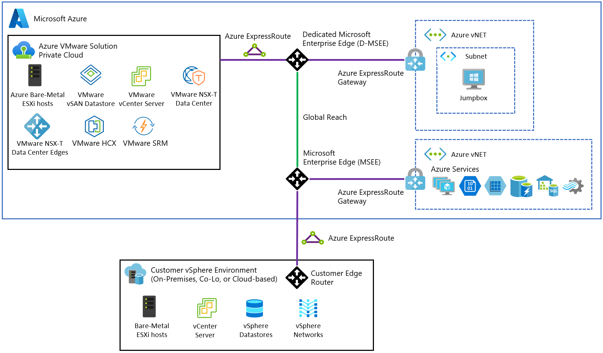
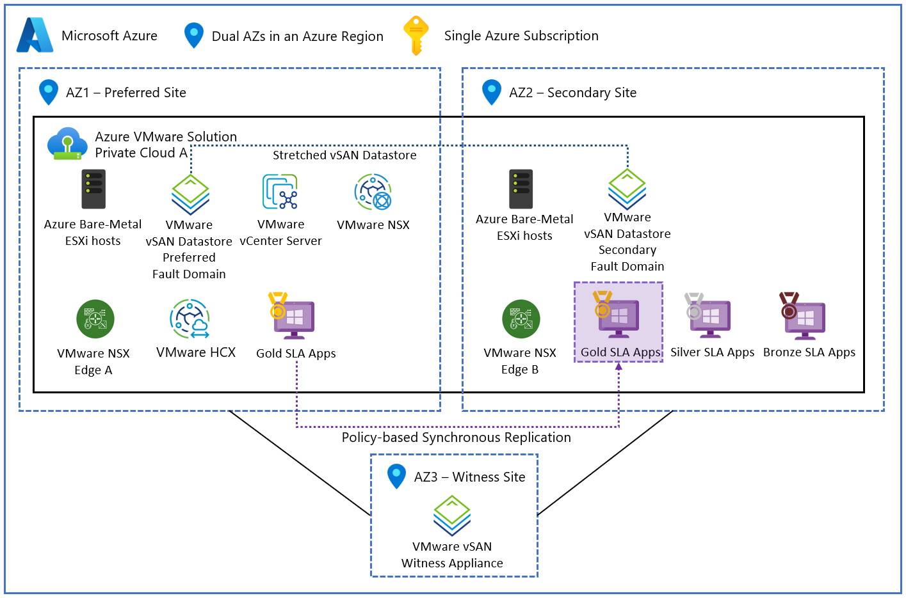

# Azure VMware Solution Generation 1 and Generation 2

## Architecture, Networking, Migration, Resilience, and Operational Trade-offs

## 1. Decision Context

Azure VMware Solution (AVS) allows an organization to move existing VMware workloads into Microsoft Azure without first rewriting the applications for native cloud services. The choice between AVS Generation 1 and Generation 2 is not a routine platform upgrade; it determines the physical host type, storage architecture, network topology, routing constraints, security model, migration behavior, and failure-domain design. [What is Azure VMware Solution?](https://learn.microsoft.com/en-us/azure/azure-vmware/introduction)

* **Purpose of AVS:** AVS addresses cloud-migration scenarios in which an enterprise has thousands of virtual machines, legacy applications, and fragile network dependencies that would be expensive or risky to refactor. [What is Azure VMware Solution?](https://learn.microsoft.com/en-us/azure/azure-vmware/introduction)

  * A conventional cloud migration might require code rewrites, conversion to microservices, application retesting, and redesign of network dependencies.
  * The transcript characterizes that conventional path as a multi-year effort that can consume millions of dollars in developer time even when the applications already function correctly.

* **Service model:** Microsoft provides dedicated bare-metal servers inside Azure data centers and installs the VMware platform on those servers. [What is Azure VMware Solution?](https://learn.microsoft.com/en-us/azure/azure-vmware/introduction)

  * The transcript identifies the platform components as VMware vSphere, vSAN, and NSX.
  * Existing IT operations teams continue to manage a familiar VMware environment through vCenter rather than treating every workload as a newly built Azure-native application. [What is Azure VMware Solution?](https://learn.microsoft.com/en-us/azure/azure-vmware/introduction)

* **Migration model:** Existing virtual machines can be moved into AVS through VMware migration technologies without rewriting the applications. [What is Azure VMware Solution?](https://learn.microsoft.com/en-us/azure/azure-vmware/introduction)

  * The intended operating model is a lift-and-shift migration in which the virtual machine retains its operating system, application stack, and most of its existing operational characteristics.
  * The transcript describes the experience as adding another VMware cluster to the organization’s existing management environment. [What is Azure VMware Solution?](https://learn.microsoft.com/en-us/azure/azure-vmware/introduction)

* **Generation 1:** Generation 1 is the original AVS architecture. It keeps the VMware private cloud logically isolated from native Azure virtual networks and uses ExpressRoute-based connectivity to bridge the environments. [What is Azure VMware Solution?](https://learn.microsoft.com/en-us/azure/azure-vmware/introduction)

* **Generation 2:** Generation 2 is a structural redesign rather than a software update. [What is Azure VMware Solution?](https://learn.microsoft.com/en-us/azure/azure-vmware/introduction)

  * It couples the AVS private cloud directly to an Azure virtual network through VNet injection.
  * It is tied to AV64 hardware, Azure Boost architecture, vSAN Express Storage Architecture, and Azure-native software-defined networking rules.
  * It changes how routing, security enforcement, resource placement, migration, and local failure isolation operate. [Introduction to Azure VMware Solution Generation 2 private clouds](https://learn.microsoft.com/en-us/azure/azure-vmware/native-introduction) [What's new in Azure VMware Solution](https://learn.microsoft.com/en-us/azure/azure-vmware/azure-vmware-solution-platform-updates)

> **Transcript-derived analogy:** Generation 1 resembles a secure luxury home on an isolated country estate. The owner has substantial freedom but must build and manage a private highway—ExpressRoute—to reach the city. Generation 2 places the same home directly in a city grid, providing immediate access to shared services while subjecting the environment to strict zoning and traffic rules.

| Decision dimension            | Generation 1                                                                        | Generation 2                                              |
| ----------------------------- | ----------------------------------------------------------------------------------- | --------------------------------------------------------- |
| Azure integration             | Logically isolated from Azure VNets                                                 | Injected directly into an Azure VNet                      |
| Primary connectivity          | ExpressRoute and, where needed, ExpressRoute Global Reach                           | Native VNet routing and VNet peering                      |
| Hardware options              | Multiple AV-series host types                                                       | AV64 hardware is required for the Gen 2 model             |
| Storage architecture          | Primarily vSAN Original Storage Architecture; AV48 is described as an ESA exception | vSAN Express Storage Architecture by default              |
| Routing flexibility           | VMware and ExpressRoute-based routing provide greater flexibility                   | Azure VNet and T0 interface limits impose hard ceilings   |
| Multi-zone stretched clusters | Supported on identified Gen 1 host types                                            | Not supported in the architecture described               |
| Local fault isolation         | Back-end placement is largely hidden from the customer                              | Explicit vSAN fault domains are visible and enforced      |
| Main advantage                | Proven flexibility and multi-zone resilience                                        | High performance and simplified Azure-native connectivity |
| Main cost                     | Connectivity complexity and ExpressRoute overhead                                   | Rigid routing, placement, and lifecycle constraints       |

*Documentation basis: [What is Azure VMware Solution?](https://learn.microsoft.com/en-us/azure/azure-vmware/introduction), [Introduction to Azure VMware Solution Generation 2 private clouds](https://learn.microsoft.com/en-us/azure/azure-vmware/native-introduction), [Azure VMware Solution network architecture](https://learn.microsoft.com/en-us/azure/azure-vmware/architecture-networking), [Route architecture for Azure VMware Solution Gen 2](https://learn.microsoft.com/en-us/azure/azure-vmware/native-network-routing-architecture), [Design vSAN stretched clusters](https://learn.microsoft.com/en-us/azure/azure-vmware/architecture-stretched-clusters), and [AV64 cluster vSAN fault domain design and recommendations](https://learn.microsoft.com/en-us/azure/azure-vmware/introduction#av64-cluster-vsan-fault-domain-fd-design-and-recommendations). The “main advantage” and “main cost” rows are architectural interpretations rather than Microsoft product claims.*

**Operational implication:** The generation decision must be made as part of the initial architecture and governance process. It should not be treated as a reversible portal setting. [What is Azure VMware Solution?](https://learn.microsoft.com/en-us/azure/azure-vmware/introduction)

---

## 2. Physical Hardware and Storage Architecture

The hardware distinction is central to the Gen 1 versus Gen 2 decision because the documented Gen 2 model uses AV64 hosts. Organizations that do not need AV64-level compute, storage, or network performance may pay for capacity that their workloads cannot use. [Introduction to Azure VMware Solution Generation 2 private clouds](https://learn.microsoft.com/en-us/azure/azure-vmware/native-introduction) [Identify the size hosts](https://learn.microsoft.com/en-us/azure/azure-vmware/plan-private-cloud-deployment#identify-the-size-hosts)

### 2.1 Generation 1 host families

The transcript identifies four principal Generation 1 host families. Current Microsoft specifications complete the values that were absent from the transcript. [Identify the size hosts](https://learn.microsoft.com/en-us/azure/azure-vmware/plan-private-cloud-deployment#identify-the-size-hosts)

| Host type | Documented processor | Physical cores | Memory | Documented vSAN architecture and raw capacity |
| --------- | -------------------- | -------------: | -----: | --------------------------------------------- |
| AV36 | Dual Intel Xeon Gold 6140, Skylake | 36 | 576 GB | OSA; 3.2-TB NVMe cache and 15.20-TB SSD capacity |
| AV36P | Dual Intel Xeon Gold 6240, Cascade Lake | 36 | 768 GB | OSA; 1.5-TB Intel cache and 19.20-TB NVMe capacity |
| AV52 | Dual Intel Xeon Platinum 8270, Cascade Lake | 52 | 1,536 GB | OSA; 1.5-TB Intel cache and 38.40-TB NVMe capacity |
| AV48 | Dual Intel Xeon Gold 6442Y, Sapphire Rapids | 48 | 1,024 GB | ESA; no separate cache tier and 25.6-TB NVMe capacity |

*Documentation basis: [Identify the size hosts](https://learn.microsoft.com/en-us/azure/azure-vmware/plan-private-cloud-deployment#identify-the-size-hosts).*

* **AV36:** The AV36 is presented as the long-standing workhorse of the platform, with 36 physical cores and 576 GB of RAM per host. [Identify the size hosts](https://learn.microsoft.com/en-us/azure/azure-vmware/plan-private-cloud-deployment#identify-the-size-hosts)

* **AV36P and AV52:** These host types move to the Cascade Lake processor architecture. [Identify the size hosts](https://learn.microsoft.com/en-us/azure/azure-vmware/plan-private-cloud-deployment#identify-the-size-hosts)

  * The AV52 provides 1.5 TB of RAM per node.
  * It is positioned for applications that consume large amounts of memory without necessarily requiring proportionally high CPU capacity, such as large in-memory databases. [Identify the size hosts](https://learn.microsoft.com/en-us/azure/azure-vmware/plan-private-cloud-deployment#identify-the-size-hosts)

* **AV48:** The AV48 is identified as using Sapphire Rapids processors. [Identify the size hosts](https://learn.microsoft.com/en-us/azure/azure-vmware/plan-private-cloud-deployment#identify-the-size-hosts)

  * Microsoft documents AV48 as using vSAN Express Storage Architecture rather than Original Storage Architecture. [Identify the size hosts](https://learn.microsoft.com/en-us/azure/azure-vmware/plan-private-cloud-deployment#identify-the-size-hosts)
  * AV48 stretched-cluster support is limited to the regions and availability-zone mappings listed by Microsoft. [Stretched clusters region availability](https://learn.microsoft.com/en-us/azure/azure-vmware/architecture-stretched-clusters#stretched-clusters-region-availability)

> **Documentation correction:** Microsoft’s current host table documents the exact CPU, core, memory, storage-architecture, and raw-capacity values shown above. Regional and availability-zone placement remains capacity-dependent and should be checked for the target region before procurement. [Hosts](https://learn.microsoft.com/en-us/azure/azure-vmware/plan-private-cloud-deployment#identify-the-size-hosts) [Azure region availability zone to host type mapping table](https://learn.microsoft.com/en-us/azure/azure-vmware/architecture-private-clouds#azure-region-availability-zone-to-host-type-mapping-table)

### 2.2 vSAN Original Storage Architecture

Most of the Gen 1 host types described in the transcript use VMware vSAN Original Storage Architecture, or OSA. OSA organizes physical drives into disk groups and separates the storage path into a cache tier and a capacity tier. [Claim storage devices for vSAN Original Storage Architecture](https://techdocs.broadcom.com/us/en/vmware-cis/vsan/vsan/8-0/vsan-administration/device-management-in-a-vsan-cluster/managing-storage-devices-in-vsan-cluster/claim-storage-devices-for-vsan-original-storage-architecture-cluster.html)

* **Disk-group structure:** Each disk group contains a fast cache device and one or more capacity devices. [Claim storage devices for vSAN Original Storage Architecture](https://techdocs.broadcom.com/us/en/vmware-cis/vsan/vsan/8-0/vsan-administration/device-management-in-a-vsan-cluster/managing-storage-devices-in-vsan-cluster/claim-storage-devices-for-vsan-original-storage-architecture-cluster.html)

* **Write behavior:** A virtual machine initially writes data to the cache device. [Claim storage devices for vSAN Original Storage Architecture](https://techdocs.broadcom.com/us/en/vmware-cis/vsan/vsan/8-0/vsan-administration/device-management-in-a-vsan-cluster/managing-storage-devices-in-vsan-cluster/claim-storage-devices-for-vsan-original-storage-architecture-cluster.html)

  * vSAN acknowledges the write so that the virtual machine can continue operating.
  * vSAN later moves the data from the cache device to the long-term capacity devices. [Claim storage devices for vSAN Original Storage Architecture](https://techdocs.broadcom.com/us/en/vmware-cis/vsan/vsan/8-0/vsan-administration/device-management-in-a-vsan-cluster/managing-storage-devices-in-vsan-cluster/claim-storage-devices-for-vsan-original-storage-architecture-cluster.html)

* **Destaging:** The movement of data from cache to capacity is called destaging. [Claim storage devices for vSAN Original Storage Architecture](https://techdocs.broadcom.com/us/en/vmware-cis/vsan/vsan/8-0/vsan-administration/device-management-in-a-vsan-cluster/managing-storage-devices-in-vsan-cluster/claim-storage-devices-for-vsan-original-storage-architecture-cluster.html)

  * The hypervisor must determine when and how to move data between the two tiers.
  * This activity consumes CPU resources and adds storage-management overhead. [Claim storage devices for vSAN Original Storage Architecture](https://techdocs.broadcom.com/us/en/vmware-cis/vsan/vsan/8-0/vsan-administration/device-management-in-a-vsan-cluster/managing-storage-devices-in-vsan-cluster/claim-storage-devices-for-vsan-original-storage-architecture-cluster.html)

* **Historical value:** The cache-and-capacity model was highly effective when slower storage media required a fast front-end device to mask latency. [Claim storage devices for vSAN Original Storage Architecture](https://techdocs.broadcom.com/us/en/vmware-cis/vsan/vsan/8-0/vsan-administration/device-management-in-a-vsan-cluster/managing-storage-devices-in-vsan-cluster/claim-storage-devices-for-vsan-original-storage-architecture-cluster.html)

* **Modern limitation:** With large database operations, bulk migrations, or other sustained write workloads, the cache tier can fill faster than the system can destage data. [Claim storage devices for vSAN Original Storage Architecture](https://techdocs.broadcom.com/us/en/vmware-cis/vsan/vsan/8-0/vsan-administration/device-management-in-a-vsan-cluster/managing-storage-devices-in-vsan-cluster/claim-storage-devices-for-vsan-original-storage-architecture-cluster.html)

  * When that occurs, storage performance can decline sharply.
  * The bottleneck is not only the physical media; it also includes the CPU work required to manage disk groups and destaging. [Claim storage devices for vSAN Original Storage Architecture](https://techdocs.broadcom.com/us/en/vmware-cis/vsan/vsan/8-0/vsan-administration/device-management-in-a-vsan-cluster/managing-storage-devices-in-vsan-cluster/claim-storage-devices-for-vsan-original-storage-architecture-cluster.html)

> **Transcript-derived analogy:** The cache drive operates like a high-speed lobby. Data is accepted quickly at the front desk and moved into long-term storage later. Performance deteriorates when arrivals fill the lobby faster than staff can move them into the building.

### 2.3 AV64 and vSAN Express Storage Architecture

Generation 2 uses the AV64 host and vSAN Express Storage Architecture, or ESA. Microsoft documents ESA for AV64 Gen 2, while Broadcom describes ESA as a single storage pool in which flash devices provide both caching and capacity. [Differences between Gen 1 and Gen 2 private clouds](https://learn.microsoft.com/en-us/azure/azure-vmware/native-introduction) [Glossary of vSAN terms and acronyms](https://knowledge.broadcom.com/external/article/326549/glossary-of-vsan-terms-and-acronyms.html)

* **Single-tier storage:** ESA uses a single storage pool rather than OSA disk groups with separate cache and capacity devices. [Glossary of vSAN terms and acronyms](https://knowledge.broadcom.com/external/article/326549/glossary-of-vsan-terms-and-acronyms.html)

* **Storage media:** Microsoft’s current host table documents **19.25 TB of raw NVMe capacity per AV64 host for Gen 2 ESA**; the 15.36-TB value applies to the AV64 OSA configuration rather than the Gen 2 ESA configuration. [Identify the size hosts](https://learn.microsoft.com/en-us/azure/azure-vmware/plan-private-cloud-deployment#identify-the-size-hosts)

  * NVMe means Non-Volatile Memory Express.
  * The transcript describes the drives as connecting through the server’s PCI bus instead of traditional legacy storage-controller paths.

> **Not directly supported by the reviewed documentation:** The reviewed AVS and Broadcom sources establish the NVMe media type and documented raw capacities, but they do not state this guide’s PCI-bus comparison in the AVS product context.

* **Direct-write behavior:** Because the NVMe devices already provide very low latency, inserting a separate cache tier could add overhead rather than improve performance. [Claim storage devices for vSAN Original Storage Architecture](https://techdocs.broadcom.com/us/en/vmware-cis/vsan/vsan/8-0/vsan-administration/device-management-in-a-vsan-cluster/managing-storage-devices-in-vsan-cluster/claim-storage-devices-for-vsan-original-storage-architecture-cluster.html)

* **Reduced storage-processing overhead:** Removing destaging eliminates much of the CPU work associated with deciding when and how to move data between tiers. [Claim storage devices for vSAN Original Storage Architecture](https://techdocs.broadcom.com/us/en/vmware-cis/vsan/vsan/8-0/vsan-administration/device-management-in-a-vsan-cluster/managing-storage-devices-in-vsan-cluster/claim-storage-devices-for-vsan-original-storage-architecture-cluster.html)

* **Processor and memory:** The transcript states that an AV64 host includes: [Identify the size hosts](https://learn.microsoft.com/en-us/azure/azure-vmware/plan-private-cloud-deployment#identify-the-size-hosts)

  * Two Intel Xeon Platinum processors based on the Ice Lake architecture.
  * 64 physical cores.
  * 128 logical cores when hyper-threading is enabled.
  * 1 TB of RAM. [Identify the size hosts](https://learn.microsoft.com/en-us/azure/azure-vmware/plan-private-cloud-deployment#identify-the-size-hosts)

* **Network interfaces:** Microsoft documents 100-Gbps network-interface throughput for every listed AVS host type, including AV64. [Identify the size hosts](https://learn.microsoft.com/en-us/azure/azure-vmware/plan-private-cloud-deployment#identify-the-size-hosts)

> **Documentation correction:** The documented processor is the **Intel Xeon Platinum 8370C**, with two 32-core CPUs, 64 physical cores, 128 logical cores with hyper-threading, and 1,024 GB of RAM per host. [Identify the size hosts](https://learn.microsoft.com/en-us/azure/azure-vmware/plan-private-cloud-deployment#identify-the-size-hosts)

### 2.4 Workloads that may benefit from AV64

> **Architectural interpretation:** The AV64 specification is well suited to storage-intensive, latency-sensitive, or highly parallel workloads that can use its CPU, memory, NVMe, and network capacity. Microsoft documents the underlying host specification but does not prescribe these workload categories as a universal placement rule. [Identify the size hosts](https://learn.microsoft.com/en-us/azure/azure-vmware/plan-private-cloud-deployment#identify-the-size-hosts)

* **Transactional databases:** Large SQL platforms with heavy transaction volumes may benefit from reduced storage latency and high east-west network throughput.

* **Algorithmic trading:** The transcript cites high-frequency trading as an example in which very small latency differences may have large financial consequences.

* **Virtual desktop infrastructure:** A virtual desktop infrastructure, or VDI, deployment may generate a boot storm when thousands of users start their virtual desktops simultaneously.

> **Transcript-derived scenario:** The guide uses an example of 5,000 employees booting virtual Windows desktops at 8:00 a.m. on Monday.

  * Such an event produces a sudden surge of read and write operations.
  * The transcript expects an OSA cache tier to fill during the surge and the AV64 NVMe/ESA design to absorb the workload more effectively.
  * Microsoft documents the relevant host and storage architectures, but the reviewed sources do not publish this 5,000-user comparison or a measured performance result. [Identify the size hosts](https://learn.microsoft.com/en-us/azure/azure-vmware/plan-private-cloud-deployment#identify-the-size-hosts)

### 2.5 Cost-to-performance analysis

The highest-performing hardware is not automatically the most appropriate architecture. [Introduction to Azure VMware Solution Generation 2 private clouds](https://learn.microsoft.com/en-us/azure/azure-vmware/native-introduction)

* **Overprovisioning risk:** Standard domain controllers, file servers, intranet applications, and ordinary line-of-business workloads may not use 128 logical cores or 19.25 TB of raw NVMe capacity per Gen 2 host. [Identify the size hosts](https://learn.microsoft.com/en-us/azure/azure-vmware/plan-private-cloud-deployment#identify-the-size-hosts)

* **Hardware lock-in:** The native Gen 2 networking experience is tied to the AV64 hardware profile. [Identify the size hosts](https://learn.microsoft.com/en-us/azure/azure-vmware/plan-private-cloud-deployment#identify-the-size-hosts)

  * An organization cannot select the Gen 2 VNet-injected model while continuing to use AV36 hosts. [Supported SKU type](https://learn.microsoft.com/en-us/azure/azure-vmware/native-introduction#supported-sku-type)
  * Microsoft describes Gen 2 as powered by Azure Boost; the transcript uses that platform association to explain the AV64 dependency. [What's new in Azure VMware Solution](https://learn.microsoft.com/en-us/azure/azure-vmware/azure-vmware-solution-platform-updates)

* **Financial consequence:** An enterprise may pay for a large compute and storage ceiling that its applications cannot use. [Introduction to Azure VMware Solution Generation 2 private clouds](https://learn.microsoft.com/en-us/azure/azure-vmware/native-introduction)

* **Gen 1 alternative:** AV36 or AV36P hosts may provide a better cost-to-performance ratio for conventional workloads that do not need the AV64 performance envelope. [Identify the size hosts](https://learn.microsoft.com/en-us/azure/azure-vmware/plan-private-cloud-deployment#identify-the-size-hosts)

* **Supply constraint:** AV64 and Gen 2 availability varies by Azure region and zone, so capacity cannot be assumed in every target location. [Regional availability](https://learn.microsoft.com/en-us/azure/azure-vmware/native-introduction#regional-availability) [Azure region availability zone to host type mapping table](https://learn.microsoft.com/en-us/azure/azure-vmware/architecture-private-clouds#azure-region-availability-zone-to-host-type-mapping-table)

  * Microsoft maintains a current Gen 2 regional-availability list; it now includes substantially more regions than the early rollout examples in the transcript. [Regional availability](https://learn.microsoft.com/en-us/azure/azure-vmware/native-introduction#regional-availability)
  * Gen 2 remains limited to documented regions and capacity within the selected region or availability zone. [Supported SKU type and regional availability](https://learn.microsoft.com/en-us/azure/azure-vmware/native-introduction)
  * Host allocation and quota approval should be requested before deployment or expansion. [How do I request a host quota increase for Azure VMware Solution?](https://learn.microsoft.com/en-us/azure/azure-vmware/introduction)

> **Operational recommendation:** Validate regional availability and obtain quota approval before treating AV64 as an approved architectural dependency. [Regional availability](https://learn.microsoft.com/en-us/azure/azure-vmware/native-introduction#regional-availability)

---

## 3. Generation 1 Connectivity Model

Generation 1 places the VMware private cloud near Azure infrastructure but outside the native Azure VNet routing domain. Connectivity is robust, but the organization must operate a substantial amount of routing and gateway infrastructure. [Network interconnectivity](https://learn.microsoft.com/en-us/azure/azure-vmware/architecture-networking)

### 3.1 Logical isolation

* **Separate routing domains:** The AVS private cloud and Azure VNets are logically isolated even when the underlying equipment is in the same Azure data center. [Network interconnectivity](https://learn.microsoft.com/en-us/azure/azure-vmware/architecture-networking)

* **Internal Azure connectivity:** Traffic between a Gen 1 AVS workload and an Azure-native service must cross a managed ExpressRoute path. [Network interconnectivity](https://learn.microsoft.com/en-us/azure/azure-vmware/architecture-networking)

* **On-premises connectivity:** ExpressRoute Global Reach is used when the design must connect the AVS private cloud to an on-premises data center through existing ExpressRoute connectivity. [Peer on-premises environments to Azure VMware Solution](https://learn.microsoft.com/en-us/azure/azure-vmware/tutorial-expressroute-global-reach-private-cloud)

### 3.2 Required network components

The transcript identifies the following operational elements: [Network interconnectivity](https://learn.microsoft.com/en-us/azure/azure-vmware/architecture-networking)

* Microsoft-managed ExpressRoute circuits.
* Microsoft Enterprise Edge, or MSEE, routing devices.
* Border Gateway Protocol, or BGP, peering sessions.
* Dedicated gateway subnets.
* Firewall rules and port requirements.
* ExpressRoute Global Reach for linked on-premises connectivity. [Peer on-premises environments to Azure VMware Solution](https://learn.microsoft.com/en-us/azure/azure-vmware/tutorial-expressroute-global-reach-private-cloud)

### 3.3 Packet path example

Consider a web-server virtual machine in a Gen 1 AVS environment that needs to query an Azure SQL database in an Azure VNet. [Network interconnectivity](https://learn.microsoft.com/en-us/azure/azure-vmware/architecture-networking)

1. The packet leaves the VMware NSX workload segment.
2. It traverses the ExpressRoute gateway.
3. It reaches the MSEE routing layer.
4. It is routed back into the Azure VNet.
5. It reaches the Azure SQL service.
6. The return traffic follows the corresponding path in reverse. [Network interconnectivity](https://learn.microsoft.com/en-us/azure/azure-vmware/architecture-networking)

* **Hairpinning effect:** Traffic may travel through multiple routing layers even when the source and destination are physically close. [Network interconnectivity](https://learn.microsoft.com/en-us/azure/azure-vmware/architecture-networking)

* **Performance consequence:** The additional path can increase latency. [Network interconnectivity](https://learn.microsoft.com/en-us/azure/azure-vmware/architecture-networking)

* **Operational consequence:** Each gateway, BGP session, route advertisement, firewall rule, and network boundary creates another possible point of misconfiguration. [Network interconnectivity](https://learn.microsoft.com/en-us/azure/azure-vmware/architecture-networking)

* **Cost consequence:** ExpressRoute gateway resources and related network infrastructure add recurring cost. [Network interconnectivity](https://learn.microsoft.com/en-us/azure/azure-vmware/architecture-networking)

**Takeaway:** Gen 1 provides network flexibility and separation, but internal Azure traffic depends on comparatively complex connectivity plumbing. [Network interconnectivity](https://learn.microsoft.com/en-us/azure/azure-vmware/architecture-networking)

*Source: [Microsoft Learn — Azure VMware Solution networking and interconnectivity concepts](https://learn.microsoft.com/en-us/azure/azure-vmware/architecture-networking)*

---

## 4. Generation 2 VNet Injection

Generation 2 replaces the ExpressRoute requirement for internal Azure connectivity by deploying the AVS private cloud directly into an Azure virtual network. This greatly simplifies some traffic flows while making the private cloud subject to Azure-native routing, security, and resource-lifecycle rules. [Introduction to Azure VMware Solution Generation 2 private clouds](https://learn.microsoft.com/en-us/azure/azure-vmware/native-introduction)

### 4.1 Native Azure connectivity

* **Direct VNet placement:** The Gen 2 private cloud is deployed inside an Azure VNet rather than being attached as a logically separate network domain. [Introduction to Azure VMware Solution Generation 2 private clouds](https://learn.microsoft.com/en-us/azure/azure-vmware/native-introduction)

* **No ExpressRoute for internal Azure communication:** AVS workloads can communicate with Azure-native resources without traversing an ExpressRoute gateway. [Network interconnectivity](https://learn.microsoft.com/en-us/azure/azure-vmware/architecture-networking)

* **VNet peering:** An AVS VNet can be peered with other Azure VNets. [Introduction to Azure VMware Solution Generation 2 private clouds](https://learn.microsoft.com/en-us/azure/azure-vmware/native-introduction)

  * Traffic then uses the Microsoft software-defined network backbone.
  * The architecture removes the Gen 1 hairpin through ExpressRoute and MSEE routing. [Network interconnectivity](https://learn.microsoft.com/en-us/azure/azure-vmware/architecture-networking)

* **Routing simplification:** The organization no longer needs to maintain the same number of BGP peering relationships and gateway routing components for internal Azure communication. [Introduction to Azure VMware Solution Generation 2 private clouds](https://learn.microsoft.com/en-us/azure/azure-vmware/native-introduction)

* **Cost reduction:** The organization may avoid the compute cost of ExpressRoute gateway SKUs used solely for AVS-to-Azure traffic. [Network interconnectivity](https://learn.microsoft.com/en-us/azure/azure-vmware/architecture-networking)

* **Operational integration:** The VMware environment behaves more like a native Azure resource rather than a separate third-party network silo. [Introduction to Azure VMware Solution Generation 2 private clouds](https://learn.microsoft.com/en-us/azure/azure-vmware/native-introduction)

*Source: [Microsoft Learn — Introduction to Azure VMware Solution Generation 2 Private Clouds](https://learn.microsoft.com/en-us/azure/azure-vmware/native-introduction)*

### 4.2 Native security and name resolution

* **Network Security Groups:** The transcript states that Azure Network Security Groups, or NSGs, can be applied to VMware-related traffic in the injected environment. [Introduction to Azure VMware Solution Generation 2 private clouds](https://learn.microsoft.com/en-us/azure/azure-vmware/native-introduction)

* **Private DNS:** Azure private Domain Name System resolution can be used more directly. [Introduction to Azure VMware Solution Generation 2 private clouds](https://learn.microsoft.com/en-us/azure/azure-vmware/native-introduction)

* **Security posture:** VNet injection brings VMware management and workload paths into Azure’s native security-control framework. [Introduction to Azure VMware Solution Generation 2 private clouds](https://learn.microsoft.com/en-us/azure/azure-vmware/native-introduction)

### 4.3 Required address block and management subnets

A Gen 2 deployment begins with a customer-provided address block that Azure subdivides into system-managed subnets. [Routing and subnet considerations](https://learn.microsoft.com/en-us/azure/azure-vmware/native-network-design-consideration#routing-and-subnet-considerations)

> **Transcript-derived calculation: Minimum address block**

* **Input:** A minimum `/22` Classless Inter-Domain Routing, or CIDR, block. [Routing and subnet considerations](https://learn.microsoft.com/en-us/azure/azure-vmware/native-network-design-consideration#routing-and-subnet-considerations)

* **Formula:** `2^(32 − 22) = 2^10` [Routing and subnet considerations](https://learn.microsoft.com/en-us/azure/azure-vmware/native-network-design-consideration#routing-and-subnet-considerations)

* **Result:** 1,024 IPv4 addresses. [Routing and subnet considerations](https://learn.microsoft.com/en-us/azure/azure-vmware/native-network-design-consideration#routing-and-subnet-considerations)

* **Practical interpretation:** Azure requires a contiguous block large enough to create the AVS management and gateway subnets. [Routing and subnet considerations](https://learn.microsoft.com/en-us/azure/azure-vmware/native-network-design-consideration#routing-and-subnet-considerations)

* **Real-world variance:** Not all 1,024 addresses are available to workloads because Azure reserves addresses and assigns portions of the range to read-only infrastructure subnets. [Routing and subnet considerations](https://learn.microsoft.com/en-us/azure/azure-vmware/native-network-design-consideration#routing-and-subnet-considerations)

* **Read-only behavior:** The automatically created management subnets cannot be modified by the customer. [Routing and subnet considerations](https://learn.microsoft.com/en-us/azure/azure-vmware/native-network-design-consideration#routing-and-subnet-considerations)

* **Management subnet:** The transcript identifies an `AVS-MGMT` subnet that contains components such as vCenter and NSX Manager. [Routing and subnet considerations](https://learn.microsoft.com/en-us/azure/azure-vmware/native-network-design-consideration#routing-and-subnet-considerations)

* **vMotion subnet:** Microsoft documents the `esx-vmotion-vmk2` `/25` subnet for vMotion VMkernel interfaces. [Routing and subnet considerations](https://learn.microsoft.com/en-us/azure/azure-vmware/native-network-design-consideration#routing-and-subnet-considerations)

* **Gateway subnets:** Microsoft documents `avs-nsx-gw` and `avs-nsx-gw-1` for outbound traffic and, in the current internal architecture, `avs-network-infra-gw` for inbound traffic and NSX segment secondary IPs. [Routing and subnet considerations](https://learn.microsoft.com/en-us/azure/azure-vmware/native-network-design-consideration#routing-and-subnet-considerations)

> **Documentation correction:** The official subnet table uses `avs-mgmt`, `avs-vnet-sync`, `avs-services`, `avs-nsx-gw`, `avs-nsx-gw-1`, `avs-network-infra-gw`, `esx-mgmt-vmk1`, `esx-vmotion-vmk2`, and `esx-vsan-vmk3`. The exact subnet set differs between the initial and current Gen 2 internal architectures. [Routing and subnet considerations](https://learn.microsoft.com/en-us/azure/azure-vmware/native-network-design-consideration#routing-and-subnet-considerations) [Azure Route Table (UDR) association consideration](https://learn.microsoft.com/en-us/azure/azure-vmware/native-network-design-consideration#azure-route-table-udr-association-consideration)

### 4.4 Overlay-to-underlay translation

* **NSX overlay:** VMware workload segments operate within the NSX logical network. [Routing and subnet considerations](https://learn.microsoft.com/en-us/azure/azure-vmware/native-network-design-consideration#routing-and-subnet-considerations)

* **Azure underlay:** The physical and software-defined Azure network carries traffic outside the NSX overlay. [Routing and subnet considerations](https://learn.microsoft.com/en-us/azure/azure-vmware/native-network-design-consideration#routing-and-subnet-considerations)

* **Gateway function:** System-managed gateway subnets route and translate traffic between these two network models. [Routing and subnet considerations](https://learn.microsoft.com/en-us/azure/azure-vmware/native-network-design-consideration#routing-and-subnet-considerations)

* **Dependency:** VNet injection therefore depends on Azure-managed routing and gateway components rather than on customer-managed ExpressRoute paths. [Network interconnectivity](https://learn.microsoft.com/en-us/azure/azure-vmware/architecture-networking)

### 4.5 Invisible system-managed NSGs

Azure applies system-managed security controls to critical Gen 2 interfaces. The transcript emphasizes that some of these controls may not be visible in the standard Azure portal. [Delegated Subnets and Network Security Groups for Gen 2](https://learn.microsoft.com/en-us/azure/azure-vmware/native-network-design-consideration#delegated-subnets-and-network-security-groups-for-gen-2)

* **Default behavior:** Inbound internet traffic to management components such as vCenter is blocked by default. [Delegated Subnets and Network Security Groups for Gen 2](https://learn.microsoft.com/en-us/azure/azure-vmware/native-network-design-consideration#delegated-subnets-and-network-security-groups-for-gen-2)

* **Portal visibility:** The customer may not see the system-managed NSG in the graphical portal. [Delegated Subnets and Network Security Groups for Gen 2](https://learn.microsoft.com/en-us/azure/azure-vmware/native-network-design-consideration#delegated-subnets-and-network-security-groups-for-gen-2)

* **Enforcement location:** The control still exists at the Azure API or platform level and drops unauthorized packets. [Delegated Subnets and Network Security Groups for Gen 2](https://learn.microsoft.com/en-us/azure/azure-vmware/native-network-design-consideration#delegated-subnets-and-network-security-groups-for-gen-2)

* **Audit consequence:** A vulnerability scanner or compliance process may report apparent exposure because the visible portal configuration does not show the underlying control. [Delegated Subnets and Network Security Groups for Gen 2](https://learn.microsoft.com/en-us/azure/azure-vmware/native-network-design-consideration#delegated-subnets-and-network-security-groups-for-gen-2)

* **Management-access requirement:** Access from an on-premises network or a management jump box still requires explicit routing and access configuration. [Delegated Subnets and Network Security Groups for Gen 2](https://learn.microsoft.com/en-us/azure/azure-vmware/native-network-design-consideration#delegated-subnets-and-network-security-groups-for-gen-2)

> **Transcript-derived analogy:** The invisible NSG resembles a security agent standing in a doorway. The homeowner cannot see the guard in the portal, and an external scan may appear alarming, but the guard still blocks unauthorized entry at the platform level.

**Operational implication:** Security teams should understand the difference between customer-visible controls and platform-managed controls before interpreting vulnerability-scan results. [Delegated Subnets and Network Security Groups for Gen 2](https://learn.microsoft.com/en-us/azure/azure-vmware/native-network-design-consideration#delegated-subnets-and-network-security-groups-for-gen-2)

### 4.6 Resource-group and tenant permanence

The injected private cloud is tightly bound to its original Azure placement. [Limitations](https://learn.microsoft.com/en-us/azure/azure-vmware/native-network-design-consideration#limitations)

* **Resource-group constraint:** The transcript states that a Gen 2 private cloud cannot be moved to another Azure resource group after creation. [Limitations](https://learn.microsoft.com/en-us/azure/azure-vmware/native-network-design-consideration#limitations)

* **Tenant constraint:** It also states that the private cloud cannot be moved to another Azure tenant. [Limitations](https://learn.microsoft.com/en-us/azure/azure-vmware/native-network-design-consideration#limitations)

* **VNet dependency:** The private cloud and its host VNet are permanently associated. [Limitations](https://learn.microsoft.com/en-us/azure/azure-vmware/native-network-design-consideration#limitations)

* **Organizational consequence:** A merger, tenant consolidation, subscription restructuring, or governance correction cannot be handled through an ordinary resource move. [Limitations](https://learn.microsoft.com/en-us/azure/azure-vmware/native-network-design-consideration#limitations)

* **Recovery method:** The stated remedy is to dismantle the private cloud and build a new environment in the destination. [Limitations](https://learn.microsoft.com/en-us/azure/azure-vmware/native-network-design-consideration#limitations)

  * Workloads and data must be migrated or otherwise protected before the original private cloud is removed.
  * **Transcript-derived warning:** The transcript warns that simply tearing down the environment would destroy data stored on it.

> **Documentation correction:** Microsoft explicitly states that a Gen 2 private cloud cannot be moved to another resource group or tenant after creation; the private cloud and its VNet must be in the same resource group. The reviewed page does not state a general subscription-move capability, so subscription restructuring should be validated separately. [Limitations](https://learn.microsoft.com/en-us/azure/azure-vmware/native-network-design-consideration#limitations)

> **Operational recommendation:** Treat resource group, subscription, tenant, VNet, address space, naming, ownership, and policy placement as production decisions before deployment begins. [Limitations](https://learn.microsoft.com/en-us/azure/azure-vmware/native-network-design-consideration#limitations)

---

## 5. Gen 2 Routing Limits and Prefix Mathematics

VNet injection removes ExpressRoute complexity but replaces it with Azure software-defined networking limits. These limits can prevent provisioning or cause traffic loss when an enterprise advertises too many routes or advertises networks that are too large. [Network interconnectivity](https://learn.microsoft.com/en-us/azure/azure-vmware/architecture-networking)

### 5.1 Two distinct prefix constraints

| Constraint                    | Documented limit | What consumes it                                                           | Can additional hosts increase it?                              |
| ----------------------------- | -------------------------: | -------------------------------------------------------------------------- | -------------------------------------------------------------- |
| Azure VNet prefix limit       |       1,000 route prefixes | Subnets and routes advertised into the VNet, including HCX MON host routes | No                                                             |
| NSX T0 interface prefix limit |  1,024 prefixes per T0 NIC | `/28` routes created when NSX segment advertisements are divided for ECMP  | Additional cluster scale can increase total interface capacity |

*Documentation basis: [Route architecture for Azure VMware Solution Gen 2](https://learn.microsoft.com/en-us/azure/azure-vmware/native-network-routing-architecture).*

* **VNet ceiling:** Every relevant subnet or route advertised from the VMware environment into the Azure VNet consumes part of the 1,000-prefix limit. [Route architecture for Azure VMware Solution Gen 2](https://learn.microsoft.com/en-us/azure/azure-vmware/native-network-routing-architecture)

* **Enterprise impact:** Development, test, quality-assurance, production, demilitarized-zone, database, and legacy network segments can exhaust the limit much faster than a smaller environment would. [Route architecture for Azure VMware Solution Gen 2](https://learn.microsoft.com/en-us/azure/azure-vmware/native-network-routing-architecture)

* **T0 interface ceiling:** NSX segment advertisements are also constrained by the number of prefixes that can be programmed on each T0 network interface. [Route architecture for Azure VMware Solution Gen 2](https://learn.microsoft.com/en-us/azure/azure-vmware/native-network-routing-architecture)

* **Independent limits:** Solving the T0 interface problem does not increase the Azure VNet’s 1,000-prefix ceiling. [Route architecture for Azure VMware Solution Gen 2](https://learn.microsoft.com/en-us/azure/azure-vmware/native-network-routing-architecture)

### 5.2 Equal-Cost Multi-Path routing behavior

Azure uses Equal-Cost Multi-Path, or ECMP, routing to distribute traffic across multiple physical interfaces associated with the NSX edge layer. [Route architecture for Azure VMware Solution Gen 2](https://learn.microsoft.com/en-us/azure/azure-vmware/native-network-routing-architecture)

* **Reason for subdivision:** A large network prefix cannot simply be directed to one interface without creating an imbalance or bottleneck. [Route architecture for Azure VMware Solution Gen 2](https://learn.microsoft.com/en-us/azure/azure-vmware/native-network-routing-architecture)

* **Subdivision rule described:** The architecture divides advertised NSX segment prefixes into `/28` routes. [Route architecture for Azure VMware Solution Gen 2](https://learn.microsoft.com/en-us/azure/azure-vmware/native-network-routing-architecture)

* **Per-prefix effect:** A single large subnet can therefore consume many T0 interface route entries. [Route architecture for Azure VMware Solution Gen 2](https://learn.microsoft.com/en-us/azure/azure-vmware/native-network-routing-architecture)

### 5.3 Prefix-expansion calculations

> **Transcript-derived calculation: `/24` advertisement**

1. **Input:** One `/24` subnet.
2. **Formula:** `2^(28 − 24) = 2^4`
3. **Result:** 16 separate `/28` routes.
4. **Practical interpretation:** A network that appears to consume one logical subnet entry can consume 16 route entries on the T0 interfaces.
5. **Factors affecting reality:** The arithmetic follows Microsoft’s documented `/28` route-programming model; platform reservations and current implementation details still determine operational headroom. [Route limitations for NSX segments](https://learn.microsoft.com/en-us/azure/azure-vmware/native-network-routing-architecture#route-limitations-for-nsx-segments)

> **Transcript-derived calculation: `/22` advertisement**

1. **Input:** One `/22` subnet.
2. **Formula:** `2^(28 − 22) = 2^6`
3. **Result:** 64 separate `/28` routes.
4. **Practical interpretation:** A large flat application tier consumes 64 T0 route entries.
5. **Factors affecting reality:** Additional infrastructure routes and platform reservations reduce usable headroom. [Route architecture for Azure VMware Solution Gen 2](https://learn.microsoft.com/en-us/azure/azure-vmware/native-network-routing-architecture)

> **Transcript-derived calculation: `/16` advertisement**

1. **Input:** One `/16` subnet containing 65,536 IPv4 addresses.
2. **Formula:** `2^(28 − 16) = 2^12`
3. **Result:** 4,096 separate `/28` routes.
4. **Practical interpretation:** One `/16` advertisement exceeds a 1,024-prefix-per-NIC limit by itself.
5. **Factors affecting reality:** Distribution across multiple T0 interfaces may alter aggregate capacity, but it does not eliminate the need to control segment sizes. [Route architecture for Azure VMware Solution Gen 2](https://learn.microsoft.com/en-us/azure/azure-vmware/native-network-routing-architecture)

### 5.4 Failure behavior

* **Provisioning failure:** A route advertisement that exceeds platform capacity may fail during provisioning. [Route architecture for Azure VMware Solution Gen 2](https://learn.microsoft.com/en-us/azure/azure-vmware/native-network-routing-architecture)

* **Traffic black-holing:** Routes that cannot be programmed correctly may cause traffic to be sent to an unusable path or dropped. [Route architecture for Azure VMware Solution Gen 2](https://learn.microsoft.com/en-us/azure/azure-vmware/native-network-routing-architecture)

* **Network-wide effect:** A poorly sized segment can affect more than the new workload because the routing control plane is shared by the injected environment. [Route architecture for Azure VMware Solution Gen 2](https://learn.microsoft.com/en-us/azure/azure-vmware/native-network-routing-architecture)

* **Design requirement:** Segment sizing must be based on both address requirements and route-consumption mathematics. [Route architecture for Azure VMware Solution Gen 2](https://learn.microsoft.com/en-us/azure/azure-vmware/native-network-routing-architecture)

> **Operational recommendation:** Avoid large, flat NSX segments unless their route expansion has been calculated against both the VNet and T0 limits. [Route architecture for Azure VMware Solution Gen 2](https://learn.microsoft.com/en-us/azure/azure-vmware/native-network-routing-architecture)

---

## 6. HCX Mobility Optimized Networking and Route Exhaustion

VMware HCX is presented as the primary migration tool for large AVS moves. Its Mobility Optimized Networking feature improves traffic locality during migration but can consume the VNet route table one virtual machine at a time. [Route limitations for HCX](https://learn.microsoft.com/en-us/azure/azure-vmware/native-network-routing-architecture#route-limitations-for-hcx)

### 6.1 Mobility Optimized Networking behavior

Mobility Optimized Networking, or MON, allows a migrated virtual machine to retain its original IP address while routing locally in the destination environment. [Route limitations for HCX](https://learn.microsoft.com/en-us/azure/azure-vmware/native-network-routing-architecture#route-limitations-for-hcx)

* **Problem solved:** Without local routing, a migrated VM may send traffic back to the on-premises router even when communicating with cloud resources. [Route limitations for HCX](https://learn.microsoft.com/en-us/azure/azure-vmware/native-network-routing-architecture#route-limitations-for-hcx)

* **Trombone routing:** The transcript calls this indirect path trombone routing and identifies it as a serious latency problem. [Route limitations for HCX](https://learn.microsoft.com/en-us/azure/azure-vmware/native-network-routing-architecture#route-limitations-for-hcx)

* **Local-gateway behavior:** MON injects routing information so that the migrated VM can use a gateway in the cloud. [Route limitations for HCX](https://learn.microsoft.com/en-us/azure/azure-vmware/native-network-routing-architecture#route-limitations-for-hcx)

* **Host-route advertisement:** HCX advertises a `/32` route for each individual migrated virtual machine. [Route limitations for HCX](https://learn.microsoft.com/en-us/azure/azure-vmware/native-network-routing-architecture#route-limitations-for-hcx)

*Source: [Microsoft Learn — VMware HCX Mobility Optimized Networking (MON) guidance](https://learn.microsoft.com/en-us/azure/azure-vmware/vmware-hcx-mon-guidance)*

### 6.2 Eight-hundred-VM migration example

> **Transcript-derived calculation: MON route consumption**

1. **Inputs:** [Route limitations for HCX](https://learn.microsoft.com/en-us/azure/azure-vmware/native-network-routing-architecture#route-limitations-for-hcx)

   * 800 virtual machines.
   * One `/32` route per virtual machine.
   * A 1,000-prefix VNet limit.
2. **Formula:** `800 ÷ 1,000 × 100`
3. **Result:** 80% of the VNet route capacity is consumed.
4. **Remaining capacity:** `1,000 − 800 = 200` prefixes.
5. **Practical interpretation:** A single CRM migration wave could leave only 200 routes for management networks, gateways, native Azure services, later migration waves, and other application segments.
6. **Factors affecting reality:** Existing platform and customer routes may mean that fewer than 1,000 entries were available before the migration began. [Route architecture for Azure VMware Solution Gen 2](https://learn.microsoft.com/en-us/azure/azure-vmware/native-network-routing-architecture)

### 6.3 Failure scenario

> **Transcript-derived scenario:** An enterprise migrates 800 CRM virtual machines over a weekend with MON enabled. The first migration succeeds, but the `/32` routes consume most of the route table. A later HR migration then fails to establish routes, causing traffic to be dropped even though the virtual machines themselves may have been copied successfully.

Microsoft documents the underlying 1,000-entry VNet limit, `/32` MON route consumption, and the need to disable MON and summarize routes; it does not publish this CRM/HR scenario. [Route limitations for HCX](https://learn.microsoft.com/en-us/azure/azure-vmware/native-network-routing-architecture#route-limitations-for-hcx)

### 6.4 Required migration workflow

MON should be treated as a temporary migration state rather than a permanent routing model. [Route limitations for HCX](https://learn.microsoft.com/en-us/azure/azure-vmware/native-network-routing-architecture#route-limitations-for-hcx)

1. Inventory all networks, virtual machines, and existing route consumption.
2. Group migration waves by complete source subnet wherever possible.
3. Enable MON only for the virtual machines that require temporary IP continuity and local routing.
4. Monitor VNet prefix consumption throughout the migration wave.
5. Move every remaining virtual machine associated with the selected subnet.
6. Finalize the migration after the subnet is fully present in AVS.
7. Move the subnet gateway function to the NSX router in the cloud.
8. Withdraw the individual `/32` host routes.
9. Advertise a summarized subnet route, such as a single `/24`.
10. Confirm that the route entries were reclaimed before starting the next migration wave. [Route limitations for HCX](https://learn.microsoft.com/en-us/azure/azure-vmware/native-network-routing-architecture#route-limitations-for-hcx)

> **Transcript-derived calculation: Route reclamation**

* **Input:** 200 individual `/32` host routes associated with one `/24` migration subnet. [Route limitations for HCX](https://learn.microsoft.com/en-us/azure/azure-vmware/native-network-routing-architecture#route-limitations-for-hcx)

* **Before summarization:** 200 route entries. [Route limitations for HCX](https://learn.microsoft.com/en-us/azure/azure-vmware/native-network-routing-architecture#route-limitations-for-hcx)

* **After summarization:** One `/24` route entry. [Route limitations for HCX](https://learn.microsoft.com/en-us/azure/azure-vmware/native-network-routing-architecture#route-limitations-for-hcx)

* **Reclaimed capacity:** `200 − 1 = 199` route entries. [Route limitations for HCX](https://learn.microsoft.com/en-us/azure/azure-vmware/native-network-routing-architecture#route-limitations-for-hcx)

* **Practical interpretation:** Completing and summarizing each subnet creates capacity for the next migration wave. [Route limitations for HCX](https://learn.microsoft.com/en-us/azure/azure-vmware/native-network-routing-architecture#route-limitations-for-hcx)

* **Factors affecting reality:** The route may also be expanded into `/28` entries at the T0 interface layer, so VNet-prefix reclamation and T0-prefix consumption must be tracked separately. [Route architecture for Azure VMware Solution Gen 2](https://learn.microsoft.com/en-us/azure/azure-vmware/native-network-routing-architecture)

* **Bad practice:** Leaving migrated virtual machines indefinitely in a transitional MON state preserves hundreds of unnecessary host routes. [Route limitations for HCX](https://learn.microsoft.com/en-us/azure/azure-vmware/native-network-routing-architecture#route-limitations-for-hcx)

* **Governance requirement:** Migration completion must include route cleanup and summarization, not merely confirmation that the VMs are powered on. [Route limitations for HCX](https://learn.microsoft.com/en-us/azure/azure-vmware/native-network-routing-architecture#route-limitations-for-hcx)

### 6.5 Scaling the T0 route capacity

The transcript states that adding physical hosts increases the total number of edge interfaces available to distribute `/28` routes. [Route architecture for Azure VMware Solution Gen 2](https://learn.microsoft.com/en-us/azure/azure-vmware/native-network-routing-architecture)

| Cluster size                     | Documented aggregate `/28` capacity |
| -------------------------------- | ------------------------------: |
| Minimum three-node private cloud |            4,096 `/28` prefixes |
| Four-node cluster                |            6,144 `/28` prefixes |

*Documentation basis: [Route architecture for Azure VMware Solution Gen 2](https://learn.microsoft.com/en-us/azure/azure-vmware/native-network-routing-architecture).*

* **Why scaling helps:** Additional hosts increase the documented aggregate `/28` route capacity associated with the Gen 2 edge-interface design. [Route architecture for Azure VMware Solution Gen 2](https://learn.microsoft.com/en-us/azure/azure-vmware/native-network-routing-architecture)

* **What scaling does not solve:** The 1,000-prefix Azure VNet ceiling remains unchanged. [Route architecture for Azure VMware Solution Gen 2](https://learn.microsoft.com/en-us/azure/azure-vmware/native-network-routing-architecture)

> **Operational recommendation:** Adding a host solely to increase routing-interface capacity introduces substantial compute cost and should not replace disciplined network summarization. [How to stay within the limit](https://learn.microsoft.com/en-us/azure/azure-vmware/native-network-routing-architecture#how-to-stay-within-the-limit)

> **Documentation correction:** Microsoft currently documents 4,096 `/28` entries for a three-node private cloud and 6,144 `/28` entries for a four-node private cloud, while the 1,000-entry VNet address-space limit remains unchanged. [Capacity by cluster size](https://learn.microsoft.com/en-us/azure/azure-vmware/native-network-routing-architecture)

---

## 7. Migration Throughput and Base-Synchronization Performance

Gen 2 hosts provide high documented interface bandwidth, while Microsoft separately documents that HCX RAV and Bulk migrations can experience slower Base Sync and Online Sync performance. The transcript’s proposed packet-processing cause is evaluated below. [Identify the size hosts](https://learn.microsoft.com/en-us/azure/azure-vmware/plan-private-cloud-deployment#identify-the-size-hosts) [Limitations](https://learn.microsoft.com/en-us/azure/azure-vmware/native-network-design-consideration#limitations)

### 7.1 Replication workflow

* **Migration methods:** The transcript discusses replication-assisted vMotion and standard bulk migration. [Limitations](https://learn.microsoft.com/en-us/azure/azure-vmware/native-network-design-consideration#limitations)

* **Initial base synchronization:** These methods use vSphere Replication to create an initial copy of the virtual machine’s disks in the cloud while the source VM continues running on-premises. [Limitations](https://learn.microsoft.com/en-us/azure/azure-vmware/native-network-design-consideration#limitations)

* **Traffic pattern:** The base synchronization behaves like a large, sustained background file transfer. [Limitations](https://learn.microsoft.com/en-us/azure/azure-vmware/native-network-design-consideration#limitations)

> **Documentation correction:** The Microsoft Gen 2 limitations page names the affected HCX migration types as **Replicated Assisted vMotion (RAV)** and **Bulk migration**. [Limitations](https://learn.microsoft.com/en-us/azure/azure-vmware/native-network-design-consideration#limitations)

### 7.2 Gen 2 processing path

Microsoft directly documents that HCX RAV and Bulk migrations on Gen 2 can experience slower performance because of stalls during Base Sync and Online Sync, and advises longer migration windows. The following packet-processing explanation remains transcript-derived rather than Microsoft-published. [Limitations](https://learn.microsoft.com/en-us/azure/azure-vmware/native-network-design-consideration#limitations)

The transcript proposes that the replication stream may need to:

* Cross the Azure underlay.
* Traverse system-managed gateway subnets.
* Pass through encapsulation and overlay translation.
* Enter the NSX overlay.
* Be fragmented and reassembled when Maximum Transmission Unit, or MTU, constraints require it.

> **Not directly supported by the reviewed documentation:** Microsoft documents the Gen 2 HCX RAV/Bulk slowdown and Base Sync/Online Sync stalls, but the reviewed AVS documentation does not attribute the slowdown specifically to the gateway, overlay translation, encapsulation, fragmentation, or CPU processing. Those mechanisms remain transcript-derived hypotheses. [Limitations](https://learn.microsoft.com/en-us/azure/azure-vmware/native-network-design-consideration#limitations)

### 7.3 Why 100 Gbps does not guarantee faster migration

> **Documentation correction:** Microsoft documents 100-Gbps network-interface throughput for AV64 and separately documents slower HCX RAV/Bulk Base Sync and Online Sync performance on Gen 2. The documentation does not state that the interface itself is saturated or identify the detailed cause proposed by the transcript. [Identify the size hosts](https://learn.microsoft.com/en-us/azure/azure-vmware/plan-private-cloud-deployment#identify-the-size-hosts) [Limitations](https://learn.microsoft.com/en-us/azure/azure-vmware/native-network-design-consideration#limitations)

* **Not a physical-link limitation:** The transcript attributes the slowdown to software-defined processing rather than to the AV64 network interface. This causal attribution is not directly supported by the reviewed documentation.

* **Gateway overhead:** The transcript attributes part of the slowdown to processing through the injected gateway architecture.

* **Encapsulation overhead:** The transcript attributes part of the slowdown to additional headers and tunnel processing.

* **Fragmentation overhead:** The transcript attributes part of the slowdown to packet fragmentation and reassembly when the effective MTU is exceeded.

> **Transcript-derived analogy:** The physical network is a very wide highway, but the gateway is a toll booth that must inspect and process every vehicle. Increasing the number of highway lanes does not help when the toll-booth workflow is the bottleneck.

### 7.4 Operational consequences

* Gen 2 HCX RAV and Bulk migrations can experience slower Base Sync and Online Sync performance. [Limitations](https://learn.microsoft.com/en-us/azure/azure-vmware/native-network-design-consideration#limitations)
* Migration windows should therefore be longer and more conservative.
* Large databases should not automatically be scheduled in the same wave merely because the host interfaces are rated at 100 Gbps.
* **Transcript-derived scenario:** The transcript warns that an organization may be unable to replicate 50 large databases in one weekend even if a similar Gen 1 migration schedule was previously feasible; Microsoft does not publish that exact threshold.

> **Operational recommendation:** Measure effective replication throughput with representative data before finalizing migration-wave size, outage duration, and weekend staffing. [Limitations](https://learn.microsoft.com/en-us/azure/azure-vmware/native-network-design-consideration#limitations)

---

## 8. Availability Zones, Stretch Clusters, and Disaster Recovery

The most consequential resilience difference is that supported Gen 1 deployments can use a single vSAN cluster stretched across two availability zones, while one Gen 2 private cloud cannot be stretched across zones. Gen 2 does allow zone selection and separate private clouds in different zones. [Design vSAN stretched clusters](https://learn.microsoft.com/en-us/azure/azure-vmware/architecture-stretched-clusters) [Does Azure VMware Solution Gen2 support Availability Zones?](https://learn.microsoft.com/en-us/azure/azure-vmware/faq#does-azure-vmware-solution-gen2-support-availability-zones)

### 8.1 Availability-zone definition

* **Physical separation:** An Azure availability zone is a physically separate data center or group of data centers within an Azure region. [Design vSAN stretched clusters](https://learn.microsoft.com/en-us/azure/azure-vmware/architecture-stretched-clusters)

* **Independent infrastructure:** Separate zones have independent power, backup generation, cooling, and physical network paths. [Design vSAN stretched clusters](https://learn.microsoft.com/en-us/azure/azure-vmware/architecture-stretched-clusters)

* **Failure scope:** A flood, utility failure, cooling incident, or other localized disaster can disable one zone without necessarily disabling another. [Design vSAN stretched clusters](https://learn.microsoft.com/en-us/azure/azure-vmware/architecture-stretched-clusters)

### 8.2 Gen 1 stretched-cluster architecture

Stretched-cluster support is region- and host-SKU-specific rather than universally available across every Gen 1 host family. Microsoft currently lists UK South and West Europe on AV36/AV36P, Germany West Central on AV48, and Australia East and East US on AV36P. [Stretched clusters region availability](https://learn.microsoft.com/en-us/azure/azure-vmware/architecture-stretched-clusters#stretched-clusters-region-availability)

> **Documentation correction:** The transcript’s broad AV36/AV36P/AV52/AV48 eligibility statement is too strong. Use the current region-and-SKU table; AV52 is not listed in the current stretched-cluster availability section. [Stretched clusters region availability](https://learn.microsoft.com/en-us/azure/azure-vmware/architecture-stretched-clusters#stretched-clusters-region-availability)

* **Minimum host count:** Six hosts are required. [Design vSAN stretched clusters](https://learn.microsoft.com/en-us/azure/azure-vmware/architecture-stretched-clusters)

* **Physical distribution:** [Design vSAN stretched clusters](https://learn.microsoft.com/en-us/azure/azure-vmware/architecture-stretched-clusters)

  * Three hosts are placed in availability zone 1.
  * Three hosts are placed in availability zone 2. [Design vSAN stretched clusters](https://learn.microsoft.com/en-us/azure/azure-vmware/architecture-stretched-clusters)

* **Logical design:** The hosts operate as one VMware cluster in an active-active configuration. [Design vSAN stretched clusters](https://learn.microsoft.com/en-us/azure/azure-vmware/architecture-stretched-clusters)

* **Synchronous replication:** Each virtual-machine write is stored in both zones before the write is acknowledged as complete. [Design vSAN stretched clusters](https://learn.microsoft.com/en-us/azure/azure-vmware/architecture-stretched-clusters)

* **Data-loss objective:** The design is described as providing zero expected data loss during a complete failure of one zone. [Design vSAN stretched clusters](https://learn.microsoft.com/en-us/azure/azure-vmware/architecture-stretched-clusters)

* **Witness appliance:** A witness is placed in a third failure location. [Design vSAN stretched clusters](https://learn.microsoft.com/en-us/azure/azure-vmware/architecture-stretched-clusters)

  * It stores no workload data.
  * It provides a quorum vote when the two data sites cannot communicate.
  * The site that retains witness connectivity continues operating.
  * The isolated site pauses to prevent split-brain writes and data corruption. [Design vSAN stretched clusters](https://learn.microsoft.com/en-us/azure/azure-vmware/architecture-stretched-clusters)

*Source: [Microsoft Learn — Design vSAN stretched clusters](https://learn.microsoft.com/en-us/azure/azure-vmware/architecture-stretched-clusters)*

### 8.3 Gen 1 zone-failure flow

1. A complete power or infrastructure failure disables all hosts in availability zone 1.
2. vSAN already has a synchronously replicated copy of the virtual disks in availability zone 2.
3. VMware High Availability detects the host and site failure.
4. The surviving hosts in availability zone 2 power on the affected virtual machines.
5. Guest operating systems and applications perform their normal recovery.
6. Services return without restoring virtual disks from backup. [Design vSAN stretched clusters](https://learn.microsoft.com/en-us/azure/azure-vmware/architecture-stretched-clusters)

* **Recovery expectation:** The transcript describes virtual machines restarting within seconds and applications returning in minutes.

> **Not directly supported by the reviewed documentation:** Microsoft does not publish a universal seconds-or-minutes recovery time. It states that RTO depends on how long vSphere HA takes to restart each VM in the surviving availability zone. [What are the limitations I should be aware of?](https://learn.microsoft.com/en-us/azure/azure-vmware/architecture-stretched-clusters#faq)

* **SLA claim:** It associates this architecture with a 99.99% uptime service-level agreement. [Design vSAN stretched clusters](https://learn.microsoft.com/en-us/azure/azure-vmware/architecture-stretched-clusters)

> **Documentation correction:** A stretched private cloud is designed for a 99.99% infrastructure-availability commitment only when at least six nodes are deployed, the workload uses dual-site mirroring with SFTT=1, and the SLA’s additional requirements are met. [What kind of SLA does Azure VMware Solution provide with stretched clusters?](https://learn.microsoft.com/en-us/azure/azure-vmware/architecture-stretched-clusters#faq)

### 8.4 Gen 2 zone limitation

* **No stretched clusters:** The AV64 Gen 2 architecture described does not support stretching a private cloud across multiple availability zones. [Design vSAN stretched clusters](https://learn.microsoft.com/en-us/azure/azure-vmware/architecture-stretched-clusters)

* **Single-zone placement:** A single Gen 2 private cloud is placed in one availability zone; Gen 2 lets the customer select the zone, subject to capacity. Separate private clouds may be deployed in different zones for a customer-managed HA or DR design. [Does Azure VMware Solution Gen2 support Availability Zones?](https://learn.microsoft.com/en-us/azure/azure-vmware/faq#does-azure-vmware-solution-gen2-support-availability-zones)

* **Full-zone failure:** If that zone loses power or becomes unavailable, the entire private cloud becomes unavailable. [Does Azure VMware Solution Gen2 support Availability Zones?](https://learn.microsoft.com/en-us/azure/azure-vmware/faq#does-azure-vmware-solution-gen2-support-availability-zones)

* **Recovery dependency:** Local service restoration depends on Microsoft restoring the affected zone unless the customer activates a separate disaster-recovery environment. [Does Azure VMware Solution Gen2 support Availability Zones?](https://learn.microsoft.com/en-us/azure/azure-vmware/faq#does-azure-vmware-solution-gen2-support-availability-zones)

* **Compliance implication:** Organizations that require synchronous multi-zone availability for regulated or mission-critical applications may be unable to select Gen 2. [Does Azure VMware Solution Gen2 support Availability Zones?](https://learn.microsoft.com/en-us/azure/azure-vmware/faq#does-azure-vmware-solution-gen2-support-availability-zones)

> **Architectural interpretation:** Gen 1 can be designed for continued operation after a zone loss, while Gen 2 must be designed to recover elsewhere after a zone loss. [Does Azure VMware Solution Gen2 support Availability Zones?](https://learn.microsoft.com/en-us/azure/azure-vmware/faq#does-azure-vmware-solution-gen2-support-availability-zones)

### 8.5 Cross-region disaster recovery for Gen 2

Gen 2 customers can use supported disaster-recovery products to replicate workloads asynchronously to another Azure VMware Solution site or supported recovery target, subject to each product’s compatibility and topology requirements. [Disaster recovery for Azure VMware Solution virtual machines](https://learn.microsoft.com/en-us/azure/azure-vmware/ecosystem-disaster-recovery-vms)

* **Example topology:** East US may replicate to West US. [Disaster recovery solutions for Azure VMware Solution virtual machines](https://learn.microsoft.com/en-us/azure/azure-vmware/ecosystem-disaster-recovery-vms)

* **Tools identified:** The transcript names VMware Live Site Recovery and Zerto. [Disaster recovery solutions for Azure VMware Solution virtual machines](https://learn.microsoft.com/en-us/azure/azure-vmware/ecosystem-disaster-recovery-vms)

* **Asynchronous behavior:** Data is copied at intervals measured in seconds or minutes rather than being committed synchronously in two zones. [Disaster recovery solutions for Azure VMware Solution virtual machines](https://learn.microsoft.com/en-us/azure/azure-vmware/ecosystem-disaster-recovery-vms)

* **Recovery Point Objective:** The Recovery Point Objective, or RPO, may therefore include the loss of the most recent transactions. [Disaster recovery solutions for Azure VMware Solution virtual machines](https://learn.microsoft.com/en-us/azure/azure-vmware/ecosystem-disaster-recovery-vms)

* **Suitability:** An RPO of several seconds may be acceptable for some workloads but unacceptable for systems that require zero-loss transaction recovery. [Disaster recovery solutions for Azure VMware Solution virtual machines](https://learn.microsoft.com/en-us/azure/azure-vmware/ecosystem-disaster-recovery-vms)

* **Zerto support statement:** The transcript states that Zerto supported AV64 Gen 2 hosts as of early 2025.

  * The current Microsoft compatibility matrix lists **Zerto 10.9 VAIO for Gen 2 as preview**, not generally available.
  * The matrix states that the legacy z-driver solution is unsupported, a minimum four-host cluster is required, stretched clusters are unsupported, and installation of the VRA and VM protection on Cluster 1 in Gen 2 is not supported in the current preview.
  * Microsoft’s separate Gen 2 design-considerations page still lists Zerto DR under unsupported integrations, creating a documentation inconsistency that should be resolved with Microsoft and Zerto before design approval. [Disaster recovery solutions for Azure VMware Solution virtual machines](https://learn.microsoft.com/en-us/azure/azure-vmware/ecosystem-disaster-recovery-vms) [Unsupported integrations](https://learn.microsoft.com/en-us/azure/azure-vmware/native-network-design-consideration#limitations)

> **Documentation correction:** Treat Zerto on Gen 2 as preview and partner-supported, with the current compatibility-matrix restrictions. VMware Live Site Recovery 9.0.2.1 and JetStream 5.0 are listed as supported on Gen 2 in the July 2026 matrix. [Disaster recovery solutions for Azure VMware Solution virtual machines](https://learn.microsoft.com/en-us/azure/azure-vmware/ecosystem-disaster-recovery-vms) [Unsupported integrations](https://learn.microsoft.com/en-us/azure/azure-vmware/native-network-design-consideration#limitations)

### 8.6 Resilience comparison

| Resilience requirement | Gen 1 stretched design                 | Gen 2 cross-region DR                    |
| ---------------------- | -------------------------------------- | ---------------------------------------- |
| Failure boundary       | Availability-zone loss                 | Zone or regional loss                    |
| Replication            | Synchronous                            | Asynchronous                             |
| Expected data loss     | Described as zero                      | Potential loss of recent transactions    |
| Recovery style         | Automatic VM restart in surviving zone | Orchestrated failover to another region  |
| Additional component   | Witness appliance                      | DR software and secondary environment    |
| Primary strength       | High availability                      | Geographic disaster recovery             |
| Primary limitation     | Cost and architectural complexity      | Non-zero RPO and longer recovery process |

*Documentation basis: [Design vSAN stretched clusters](https://learn.microsoft.com/en-us/azure/azure-vmware/architecture-stretched-clusters) and [Disaster recovery for Azure VMware Solution virtual machines](https://learn.microsoft.com/en-us/azure/azure-vmware/ecosystem-disaster-recovery-vms). The comparative “strength” and “limitation” rows are architectural interpretations.*

---

## 9. vSAN Fault Domains and Rack-Level Resilience

Although Gen 2 lacks multi-zone stretched clusters, it provides an explicit model for handling local rack, power, and top-of-rack switch failures within its assigned availability zone. [Design vSAN stretched clusters](https://learn.microsoft.com/en-us/azure/azure-vmware/architecture-stretched-clusters)

### 9.1 Generation 1 placement model

* **Back-end distribution:** Azure’s fabric controller spreads Gen 1 hosts across physical racks. [AV64 cluster vSAN fault domain design and recommendations](https://learn.microsoft.com/en-us/azure/azure-vmware/introduction#av64-cluster-vsan-fault-domain-fd-design-and-recommendations)

* **Customer visibility:** The physical rack placement and fault boundaries are not normally exposed to the customer. [AV64 cluster vSAN fault domain design and recommendations](https://learn.microsoft.com/en-us/azure/azure-vmware/introduction#av64-cluster-vsan-fault-domain-fd-design-and-recommendations)

* **Operational model:** Administrators trust Microsoft’s placement logic rather than configuring or directly inspecting vSAN fault domains. [AV64 cluster vSAN fault domain design and recommendations](https://learn.microsoft.com/en-us/azure/azure-vmware/introduction#av64-cluster-vsan-fault-domain-fd-design-and-recommendations)

### 9.2 Generation 2 explicit fault domains

* **Visible configuration:** AV64 clusters use explicit vSAN fault domains that administrators can inspect. [AV64 cluster vSAN fault domain design and recommendations](https://learn.microsoft.com/en-us/azure/azure-vmware/introduction#av64-cluster-vsan-fault-domain-fd-design-and-recommendations)

* **Fault-domain count:** The transcript states that the control plane configures seven fault domains. [AV64 cluster vSAN fault domain design and recommendations](https://learn.microsoft.com/en-us/azure/azure-vmware/introduction#av64-cluster-vsan-fault-domain-fd-design-and-recommendations)

  * Some regions may initially provide five instead of seven. [AV64 cluster vSAN fault domain design and recommendations](https://learn.microsoft.com/en-us/azure/azure-vmware/introduction#av64-cluster-vsan-fault-domain-fd-design-and-recommendations)

* **Physical meaning:** A fault domain represents an independent group of infrastructure, described as a rack with separate power and a separate top-of-rack switch. [AV64 cluster vSAN fault domain design and recommendations](https://learn.microsoft.com/en-us/azure/azure-vmware/introduction#av64-cluster-vsan-fault-domain-fd-design-and-recommendations)

* **Automatic balancing:** As a cluster grows from the three-node minimum toward 16 nodes, AVS distributes hosts across the available fault domains. [AV64 cluster vSAN fault domain design and recommendations](https://learn.microsoft.com/en-us/azure/azure-vmware/introduction#av64-cluster-vsan-fault-domain-fd-design-and-recommendations)

* **Fourteen-node example:** With seven fault domains and 14 hosts, the intended balanced placement is two hosts per fault domain. [AV64 cluster vSAN fault domain design and recommendations](https://learn.microsoft.com/en-us/azure/azure-vmware/introduction#av64-cluster-vsan-fault-domain-fd-design-and-recommendations)

### 9.3 Rack-failure scenario

> **Transcript-derived scenario:** A power supply or top-of-rack switch fails in fault domain 1, causing the two hosts in that rack to go offline.

* vSAN redundancy policies maintain data fragments and parity information on hosts in the surviving fault domains.
* The transcript specifically references erasure coding and RAID-5 or RAID-6-style protection.
* The surviving hosts reconstruct or continue serving the protected data.
* The cluster is expected to survive the localized rack failure without data loss. [AV64 cluster vSAN fault domain design and recommendations](https://learn.microsoft.com/en-us/azure/azure-vmware/introduction#av64-cluster-vsan-fault-domain-fd-design-and-recommendations)

### 9.4 Host-removal balance rule

Explicit fault-domain placement introduces a constraint when an administrator removes a host. [AV64 cluster vSAN fault domain design and recommendations](https://learn.microsoft.com/en-us/azure/azure-vmware/introduction#av64-cluster-vsan-fault-domain-fd-design-and-recommendations)

* **Balance requirement:** The difference between the most populated and least populated fault domains must not become greater than one. [AV64 cluster vSAN fault domain design and recommendations](https://learn.microsoft.com/en-us/azure/azure-vmware/introduction#av64-cluster-vsan-fault-domain-fd-design-and-recommendations)

* **Reason:** A larger imbalance could invalidate the intended redundancy distribution and erasure-coding assumptions. [AV64 cluster vSAN fault domain design and recommendations](https://learn.microsoft.com/en-us/azure/azure-vmware/introduction#av64-cluster-vsan-fault-domain-fd-design-and-recommendations)

> **Transcript-derived calculation: Invalid removal**

1. **Initial placement:** Fault domain 1 contains two hosts, and fault domain 2 contains one host.
2. **Proposed action:** Remove the only host from fault domain 2.
3. **Resulting placement:** Fault domain 1 has two hosts, and fault domain 2 has zero.
4. **Formula:** `2 − 0 = 2`
5. **Rule comparison:** `2 > 1`
6. **Result:** The removal is rejected.
7. **Practical interpretation:** The administrator must remove a host from a more populated fault domain instead. [AV64 host removal workflow and best practices](https://learn.microsoft.com/en-us/azure/azure-vmware/introduction#av64-host-removal-workflow-and-best-practices)

* **Error behavior:** The transcript states that the API returns an HTTP 409 Conflict error. [AV64 host removal workflow and best practices](https://learn.microsoft.com/en-us/azure/azure-vmware/introduction#av64-host-removal-workflow-and-best-practices)

> **Transcript-derived analogy:** Removing an AV64 host resembles pulling a block from a Jenga tower. A physically valid block may still be prohibited because its removal would destabilize the overall structure.

### 9.5 Troubleshooting an HTTP 409 host-removal failure

1. Stop repeating the same removal request, because the API is enforcing a placement rule rather than reporting a transient portal error.
2. Open the vSphere client.
3. Navigate to the vSAN cluster configuration.
4. Identify the fault-domain assignment of every host.
5. Count the hosts in each fault domain.
6. Model the distribution that would remain after each possible removal.
7. Select a host from one of the most populated fault domains.
8. Confirm that the post-removal difference between the largest and smallest fault domains will be no greater than one.
9. Retry the host-removal operation.
10. Validate vSAN health and object compliance after the host is evacuated and removed. [AV64 host removal workflow and best practices](https://learn.microsoft.com/en-us/azure/azure-vmware/introduction#av64-host-removal-workflow-and-best-practices)

**Operational implication:** Gen 2 exposes more of the physical-resilience model to the administrator. This improves transparency but requires stronger operational knowledge than the Gen 1 black-box placement approach. [AV64 cluster vSAN fault domain design and recommendations](https://learn.microsoft.com/en-us/azure/azure-vmware/introduction#av64-cluster-vsan-fault-domain-fd-design-and-recommendations)

---

## 10. Mixed-Generation Private Clouds

An enterprise can extend an existing private cloud with AV64 clusters under the same vCenter management boundary. This supports phased adoption but creates CPU-compatibility constraints for live virtual-machine movement. [Enhanced vMotion Compatibility with AV64 extension](https://learn.microsoft.com/en-us/azure/azure-vmware/introduction#enhanced-vmotion-compatibility-evc-with-av64-extension)

### 10.1 Deployment model

* **Existing cluster:** Microsoft’s AV64-extension guidance describes adding AV64 clusters to an existing private cloud; an AV36-based first cluster is one applicable mixed-hardware pattern. [Enhanced vMotion Compatibility with AV64 extension](https://learn.microsoft.com/en-us/azure/azure-vmware/introduction#enhanced-vmotion-compatibility-evc-with-av64-extension)

* **Additional clusters:** It may add separate AV64 clusters, subject to the documented limit of 12 vSphere clusters per private cloud. [Azure VMware Solution limits](https://learn.microsoft.com/en-us/azure/azure-resource-manager/management/azure-subscription-service-limits#azure-vmware-solution-limits)

* **Management:** The clusters remain under the original vCenter server. [Enhanced vMotion Compatibility with AV64 extension](https://learn.microsoft.com/en-us/azure/azure-vmware/introduction#enhanced-vmotion-compatibility-evc-with-av64-extension)

* **Minimum AV64 size:** Each AV64 cluster requires at least three hosts; Microsoft recommends four for AV64 fault-domain operational headroom. [AV64 cluster vSAN fault domain design and recommendations](https://learn.microsoft.com/en-us/azure/azure-vmware/introduction#av64-cluster-vsan-fault-domain-fd-design-and-recommendations)

* **Quota:** Microsoft quota approval is required before AV64 capacity can be added. [Regional availability](https://learn.microsoft.com/en-us/azure/azure-vmware/native-introduction#regional-availability)

* **Heterogeneous processors:** The resulting private cloud contains different processor generations, such as Skylake or Cascade Lake in Gen 1 and Ice Lake in AV64. [Identify the size hosts](https://learn.microsoft.com/en-us/azure/azure-vmware/plan-private-cloud-deployment#identify-the-size-hosts)

### 10.2 Why CPU generations affect vMotion

VMware vMotion can move a running VM between hosts without interrupting active sessions, but the destination CPU must support the instruction sets that the guest operating system is currently using. [Enhanced vMotion Compatibility with AV64 extension](https://learn.microsoft.com/en-us/azure/azure-vmware/introduction#enhanced-vmotion-compatibility-evc-with-av64-extension)

* **CPU evolution:** New processor generations add instructions for encryption, vector processing, and other specialized functions. [Enhanced vMotion Compatibility with AV64 extension](https://learn.microsoft.com/en-us/azure/azure-vmware/introduction#enhanced-vmotion-compatibility-evc-with-av64-extension)

* **Guest discovery:** When a VM boots, the guest operating system can detect and begin using the CPU features exposed by the hypervisor. [Enhanced vMotion Compatibility with AV64 extension](https://learn.microsoft.com/en-us/azure/azure-vmware/introduction#enhanced-vmotion-compatibility-evc-with-av64-extension)

* **Compatibility failure:** If the running VM is moved to a processor that lacks an instruction it is using, the guest may crash. [Enhanced vMotion Compatibility with AV64 extension](https://learn.microsoft.com/en-us/azure/azure-vmware/introduction#enhanced-vmotion-compatibility-evc-with-av64-extension)

* **vMotion safeguard:** vCenter performs a compatibility pre-check and blocks migrations that would expose the guest to an incompatible CPU. [Enhanced vMotion Compatibility with AV64 extension](https://learn.microsoft.com/en-us/azure/azure-vmware/introduction#enhanced-vmotion-compatibility-evc-with-av64-extension)

### 10.3 Enhanced vMotion Compatibility

Enhanced vMotion Compatibility, or EVC, masks newer CPU features so that hosts present a common baseline to virtual machines. [Enhanced vMotion Compatibility with AV64 extension](https://learn.microsoft.com/en-us/azure/azure-vmware/introduction#enhanced-vmotion-compatibility-evc-with-av64-extension)

* **Masking behavior:** A newer processor can hide advanced features and behave like an older processor generation. [Enhanced vMotion Compatibility with AV64 extension](https://learn.microsoft.com/en-us/azure/azure-vmware/introduction#enhanced-vmotion-compatibility-evc-with-av64-extension)

* **Compatibility benefit:** Virtual machines using the lower baseline can move between newer and older hosts. [Enhanced vMotion Compatibility with AV64 extension](https://learn.microsoft.com/en-us/azure/azure-vmware/introduction#enhanced-vmotion-compatibility-evc-with-av64-extension)

* **Performance cost:** The VM cannot use the newer processor instructions that were hidden. [Enhanced vMotion Compatibility with AV64 extension](https://learn.microsoft.com/en-us/azure/azure-vmware/introduction#enhanced-vmotion-compatibility-evc-with-av64-extension)

* **Transcript baseline statement:** AV64 hosts use a newer EVC baseline, while older Gen 1 AV36 clusters are described as operating at their native older baseline without an explicit cluster EVC mode enabled by default. [Enhanced vMotion Compatibility with AV64 extension](https://learn.microsoft.com/en-us/azure/azure-vmware/introduction#enhanced-vmotion-compatibility-evc-with-av64-extension)

> **Documentation correction:** Microsoft documents Ice Lake EVC mode on AV64, no explicit EVC mode by default on AV36/AV36P/AV52 base clusters, the supported migration directions, and VM-level EVC or cold vMotion as mitigations. [Enhanced vMotion Compatibility with AV64 extension](https://learn.microsoft.com/en-us/azure/azure-vmware/introduction#enhanced-vmotion-compatibility-evc-with-av64-extension) [Enhanced vMotion Compatibility as a virtual machine attribute](https://techdocs.broadcom.com/us/en/vmware-cis/vsphere/vsphere/8-0/vsphere-virtual-machine-administration/managing-virtual-machinesvsphere-vm-admin/evc-as-a-virtual-machine-attributevsphere-vm-admin.html)

### 10.4 Migration-direction behavior

| Scenario                                              | Expected result in transcript                                  | Reason                                                           |
| ----------------------------------------------------- | -------------------------------------------------------------- | ---------------------------------------------------------------- |
| Live vMotion from Gen 1 to Gen 2                      | Succeeds                                                       | The newer CPU supports the older instruction baseline            |
| Live vMotion back before the VM adopts newer features | May remain possible                                            | The guest may still be operating at the older baseline           |
| VM created directly on Gen 2                          | Reverse live vMotion is blocked                                | The guest may use Ice Lake-era instructions unavailable on Gen 1 |
| VM moved to Gen 2 and then power-cycled               | Reverse live vMotion is blocked                                | Reboot allows the guest to detect and use the newer CPU features |
| Cold migration from Gen 2 to Gen 1                    | Succeeds with downtime                                         | The powered-off VM can boot against the older CPU baseline       |
| VM-level EVC set to the Gen 1 baseline                | Bidirectional live vMotion is supported in the described model | Newer instructions remain masked                                 |

*Documentation basis: [Enhanced vMotion Compatibility with AV64 extension](https://learn.microsoft.com/en-us/azure/azure-vmware/introduction#enhanced-vmotion-compatibility-evc-with-av64-extension).*

> **Transcript-derived analogy:** Moving from Gen 1 to Gen 2 is like moving from economy class to first class and accepting premium glassware. After the VM begins using first-class CPU features, it cannot carry those features back into the older environment.

### 10.5 Cold vMotion fallback

When live migration is blocked by CPU compatibility, the workload can be moved while powered off. [Enhanced vMotion Compatibility with AV64 extension](https://learn.microsoft.com/en-us/azure/azure-vmware/introduction#enhanced-vmotion-compatibility-evc-with-av64-extension)

1. Gracefully shut down the guest operating system.
2. Power off the virtual machine.
3. Migrate the virtual-machine files to the Gen 1 cluster.
4. Power on the VM against the older processor baseline.
5. Validate application recovery and dependent connections. [Enhanced vMotion Compatibility with AV64 extension](https://learn.microsoft.com/en-us/azure/azure-vmware/introduction#enhanced-vmotion-compatibility-evc-with-av64-extension)

* **Downtime:** The transcript estimates five to ten minutes in a representative case.

> **Not directly supported by the reviewed documentation:** Microsoft documents cold vMotion as the fallback but does not publish a universal five-to-ten-minute outage. Actual downtime depends on shutdown, migration, boot, and application-recovery time. [Enhanced vMotion Compatibility with AV64 extension](https://learn.microsoft.com/en-us/azure/azure-vmware/introduction#enhanced-vmotion-compatibility-evc-with-av64-extension)

* **User impact:** All active sessions are interrupted. [Enhanced vMotion Compatibility with AV64 extension](https://learn.microsoft.com/en-us/azure/azure-vmware/introduction#enhanced-vmotion-compatibility-evc-with-av64-extension)

* **Mission-critical impact:** That outage may be unacceptable for a patient-record database, financial system, or other high-availability workload. [Enhanced vMotion Compatibility with AV64 extension](https://learn.microsoft.com/en-us/azure/azure-vmware/introduction#enhanced-vmotion-compatibility-evc-with-av64-extension)

### 10.6 Preventive VM-level EVC procedure

To preserve bidirectional live mobility, the lower CPU baseline must be configured before the VM begins using Gen 2-only instructions. [Enhanced vMotion Compatibility with AV64 extension](https://learn.microsoft.com/en-us/azure/azure-vmware/introduction#enhanced-vmotion-compatibility-evc-with-av64-extension)

1. Determine the processor and EVC baseline used by the Gen 1 cluster.
2. Identify all virtual machines that may need to move between the generations.
3. Before moving each VM to AV64, open its advanced virtual-machine settings.
4. Configure VM-level EVC to match the lower Gen 1 baseline.
5. Confirm that the VM sees only the intended instruction set.
6. Perform the live migration to the AV64 cluster.
7. Test live migration back to Gen 1 before placing the workload into production.
8. Apply the same control to every new VM created in the mixed environment.
9. Audit the setting regularly so that administrator error does not create one-way mobility. [Enhanced vMotion Compatibility with AV64 extension](https://learn.microsoft.com/en-us/azure/azure-vmware/introduction#enhanced-vmotion-compatibility-evc-with-av64-extension)

* **Governance risk:** A single newly created VM without the lower EVC baseline can become trapped on Gen 2 for live-migration purposes. [Enhanced vMotion Compatibility with AV64 extension](https://learn.microsoft.com/en-us/azure/azure-vmware/introduction#enhanced-vmotion-compatibility-evc-with-av64-extension)

* **Performance trade-off:** VM-level EVC can mask newer CPU features to preserve a lower compatibility baseline, so selected workloads may not use all instructions exposed by the AV64 processor. [EVC as a virtual machine attribute](https://techdocs.broadcom.com/us/en/vmware-cis/vsphere/vsphere/8-0/vsphere-virtual-machine-administration/managing-virtual-machinesvsphere-vm-admin/evc-as-a-virtual-machine-attributevsphere-vm-admin.html)

**Takeaway:** A mixed environment provides phased adoption but requires an explicit decision between maximum AV64 CPU capability and reversible live mobility. [Enhanced vMotion Compatibility with AV64 extension](https://learn.microsoft.com/en-us/azure/azure-vmware/introduction#enhanced-vmotion-compatibility-evc-with-av64-extension)

---

## 11. Architectural Selection Guidance

Neither generation is universally superior. The selection depends on workload performance, route scale, availability requirements, existing network investment, migration method, regional capacity, and tolerance for operational constraints. [Differences between Gen 1 and Gen 2 private clouds](https://learn.microsoft.com/en-us/azure/azure-vmware/native-introduction) [Design vSAN stretched clusters](https://learn.microsoft.com/en-us/azure/azure-vmware/architecture-stretched-clusters) [Route architecture for Azure VMware Solution Gen 2](https://learn.microsoft.com/en-us/azure/azure-vmware/native-network-routing-architecture)

### 11.1 Conditions favoring Generation 1

Generation 1 is favored when one or more of the following requirements dominate: [Design vSAN stretched clusters](https://learn.microsoft.com/en-us/azure/azure-vmware/architecture-stretched-clusters)

* **Synchronous multi-zone availability:** The application requires a stretched cluster across availability zones. [Design vSAN stretched clusters](https://learn.microsoft.com/en-us/azure/azure-vmware/architecture-stretched-clusters)

* **Zero expected data loss:** Compliance or business policy cannot accept the non-zero RPO associated with asynchronous regional replication. [Disaster recovery for Azure VMware Solution virtual machines](https://learn.microsoft.com/en-us/azure/azure-vmware/ecosystem-disaster-recovery-vms)

* **Large route scale:** The existing network topology would approach or exceed the 1,000-prefix Azure VNet ceiling. [Route architecture for Azure VMware Solution Gen 2](https://learn.microsoft.com/en-us/azure/azure-vmware/native-network-routing-architecture)

* **Complex segmentation:** The enterprise has extensive development, test, quality-assurance, production, DMZ, legacy, and application-tier networks that cannot easily be summarized. [Design vSAN stretched clusters](https://learn.microsoft.com/en-us/azure/azure-vmware/architecture-stretched-clusters)

* **Existing ExpressRoute investment:** The organization has already built firewalls, BGP routing, operational procedures, and security boundaries around ExpressRoute. [Design vSAN stretched clusters](https://learn.microsoft.com/en-us/azure/azure-vmware/architecture-stretched-clusters)

* **Hardware efficiency:** The workload does not need the full AV64 compute, NVMe, or network profile. [Identify the size hosts](https://learn.microsoft.com/en-us/azure/azure-vmware/plan-private-cloud-deployment#identify-the-size-hosts)

* **Flexible external routing:** The architecture requires routing behavior that is easier to implement outside the native Gen 2 VNet constraints. [Design vSAN stretched clusters](https://learn.microsoft.com/en-us/azure/azure-vmware/architecture-stretched-clusters)

### 11.2 Conditions favoring Generation 2

Generation 2 is favored when the organization can accept its routing and resilience constraints and has workloads that benefit from its architecture. [Introduction to Azure VMware Solution Generation 2 private clouds](https://learn.microsoft.com/en-us/azure/azure-vmware/native-introduction)

* **Azure-native integration:** AVS workloads need direct access to Azure-native services without ExpressRoute gateways and complex BGP plumbing. [Network interconnectivity](https://learn.microsoft.com/en-us/azure/azure-vmware/architecture-networking)

* **Simplified internal routing:** VNet peering and native Azure paths are preferred over the Gen 1 hairpin model. [Introduction to Azure VMware Solution Generation 2 private clouds](https://learn.microsoft.com/en-us/azure/azure-vmware/native-introduction)

* **Security integration:** The design benefits from Azure-native security controls and private DNS. [Introduction to Azure VMware Solution Generation 2 private clouds](https://learn.microsoft.com/en-us/azure/azure-vmware/native-introduction)

* **High throughput:** Workloads can use the stated 100 Gbps network interfaces. [Introduction to Azure VMware Solution Generation 2 private clouds](https://learn.microsoft.com/en-us/azure/azure-vmware/native-introduction)

* **Storage performance:** Databases or VDI systems can benefit from direct NVMe storage and ESA. [Glossary of vSAN terms and acronyms](https://knowledge.broadcom.com/external/article/326549/glossary-of-vsan-terms-and-acronyms.html)

* **CPU demand:** Applications can use 64 physical cores and 128 logical cores per host. [Identify the size hosts](https://learn.microsoft.com/en-us/azure/azure-vmware/plan-private-cloud-deployment#identify-the-size-hosts)

* **Single-zone acceptance:** The business can tolerate local-zone failure by relying on cross-region disaster recovery. [Disaster recovery solutions for Azure VMware Solution virtual machines](https://learn.microsoft.com/en-us/azure/azure-vmware/ecosystem-disaster-recovery-vms)

* **Routing discipline:** The architecture team can enforce prefix budgets, segment sizing, route summarization, and MON cleanup. [Route limitations for HCX](https://learn.microsoft.com/en-us/azure/azure-vmware/native-network-routing-architecture#route-limitations-for-hcx)

### 11.3 Conditions favoring a mixed design

A mixed design may be justified when the enterprise needs both operating models. [Enhanced vMotion Compatibility with AV64 extension](https://learn.microsoft.com/en-us/azure/azure-vmware/introduction#enhanced-vmotion-compatibility-evc-with-av64-extension)

* Core databases remain on Gen 1 stretched clusters for multi-zone synchronous protection.
* Stateless VDI, high-throughput services, or performance-intensive workloads run on AV64.
* The organization accepts that some workloads may require VM-level EVC or cold migration to move back to Gen 1.
* Operational teams can maintain different availability, routing, and lifecycle policies for each cluster type. [Enhanced vMotion Compatibility with AV64 extension](https://learn.microsoft.com/en-us/azure/azure-vmware/introduction#enhanced-vmotion-compatibility-evc-with-av64-extension)

### 11.4 Decision matrix

| Requirement                          |                           Gen 1 |                             Gen 2 |                                                  Mixed |
| ------------------------------------ | ------------------------------: | --------------------------------: | -----------------------------------------------------: |
| Multi-zone stretched cluster         |                      Strong fit |        Not supported as described |                     Retain critical workloads on Gen 1 |
| Native VNet integration              |      Limited; uses ExpressRoute |                        Strong fit | Available only to appropriately placed Gen 2 workloads |
| Very large or fragmented route table |                       Safer fit |                         High risk |                            Requires careful separation |
| Maximum NVMe and network performance |        Limited relative to AV64 |                        Strong fit |                                   Use AV64 selectively |
| Lowest migration-route complexity    | ExpressRoute complexity remains | MON and prefix budgeting required |                         Highest operational complexity |
| Bidirectional live mobility          |     Within homogeneous clusters |       Within homogeneous clusters |                                Requires EVC governance |
| Existing ExpressRoute investment     |            Preserves investment |              May require redesign |                              Allows gradual transition |
| Single-zone failure tolerance        |      Stretched option available |              Requires DR response |                            Workload-specific placement |
| Lower-cost conventional workloads    |          Multiple host profiles |        Potential overprovisioning |                 Place only demanding workloads on AV64 |

*Documentation basis: [Azure VMware Solution network architecture](https://learn.microsoft.com/en-us/azure/azure-vmware/architecture-networking), [Introduction to Azure VMware Solution Generation 2 private clouds](https://learn.microsoft.com/en-us/azure/azure-vmware/native-introduction), [Identify the size hosts](https://learn.microsoft.com/en-us/azure/azure-vmware/plan-private-cloud-deployment#identify-the-size-hosts), [Route architecture for Azure VMware Solution Gen 2](https://learn.microsoft.com/en-us/azure/azure-vmware/native-network-routing-architecture), [Design vSAN stretched clusters](https://learn.microsoft.com/en-us/azure/azure-vmware/architecture-stretched-clusters), and [Enhanced vMotion Compatibility with AV64 extension](https://learn.microsoft.com/en-us/azure/azure-vmware/introduction#enhanced-vmotion-compatibility-evc-with-av64-extension). The “fit,” “risk,” and placement judgments are architectural interpretations.*

---

## 12. Predeployment and Migration Control Points

> **Operational recommendation:** Gen 2 success depends on architectural discipline before deployment and during every migration wave. The underlying documented constraints include host and regional availability, delegated-subnet design, route ceilings, and HCX route behavior. [Plan the Azure VMware Solution deployment](https://learn.microsoft.com/en-us/azure/azure-vmware/plan-private-cloud-deployment) [Native network design considerations](https://learn.microsoft.com/en-us/azure/azure-vmware/native-network-design-consideration) [Route architecture for Azure VMware Solution Gen 2](https://learn.microsoft.com/en-us/azure/azure-vmware/native-network-routing-architecture)

### 12.1 Before deploying a private cloud

* Confirm that AV64 is available in the target Azure region.
* Obtain the required Microsoft quota approval.
* Confirm that workload demand justifies the AV64 cost and capacity.
* Finalize the Azure tenant, subscription, resource group, VNet, naming, policy, and ownership model.
* Allocate at least the required `/22` address block.
* Reserve space for system-managed AVS subnets.
* Calculate the current and projected VNet prefix count.
* Calculate `/28` expansion for every proposed NSX segment.
* Determine whether the application requires stretched-cluster protection.
* Select a cross-region DR tool when Gen 2 is used for workloads that cannot remain unprotected.
* Validate expected RPO and Recovery Time Objective, or RTO, with the business.
* Document the difference between visible customer NSGs and invisible system-managed controls.
* Establish host-removal procedures based on fault-domain balance.

*Documentation basis: [Regional availability](https://learn.microsoft.com/en-us/azure/azure-vmware/native-introduction#regional-availability), [Identify the size hosts](https://learn.microsoft.com/en-us/azure/azure-vmware/plan-private-cloud-deployment#identify-the-size-hosts), [Limitations](https://learn.microsoft.com/en-us/azure/azure-vmware/native-network-design-consideration#limitations), [Routing and subnet considerations](https://learn.microsoft.com/en-us/azure/azure-vmware/native-network-design-consideration#routing-and-subnet-considerations), [Route architecture for Azure VMware Solution Gen 2](https://learn.microsoft.com/en-us/azure/azure-vmware/native-network-routing-architecture), [Design vSAN stretched clusters](https://learn.microsoft.com/en-us/azure/azure-vmware/architecture-stretched-clusters), [Disaster recovery for Azure VMware Solution virtual machines](https://learn.microsoft.com/en-us/azure/azure-vmware/ecosystem-disaster-recovery-vms), and [AV64 host removal workflow and best practices](https://learn.microsoft.com/en-us/azure/azure-vmware/introduction#av64-host-removal-workflow-and-best-practices).*

### 12.2 Before each migration wave

* Count existing VNet routes.
* Reserve route capacity for platform and native Azure dependencies.
* Group VMs by complete subnet.
* Estimate the number of temporary `/32` MON routes.
* Define the threshold at which the migration wave must stop.
* Test base-synchronization throughput instead of relying on the 100 Gbps host-interface rating.
* Account for MTU, fragmentation, encapsulation, and gateway-processing overhead.
* Define the date and owner for finalizing each migrated subnet.
* Plan the gateway cutover and summary-route advertisement.
* Prevent transitional MON routes from becoming permanent.
* For mixed-generation environments, configure VM-level EVC before a VM is moved or rebooted on AV64.

*Documentation basis: [Route architecture for Azure VMware Solution Gen 2](https://learn.microsoft.com/en-us/azure/azure-vmware/native-network-routing-architecture), [VMware HCX Mobility Optimized Networking guidance](https://learn.microsoft.com/en-us/azure/azure-vmware/vmware-hcx-mon-guidance), [Limitations](https://learn.microsoft.com/en-us/azure/azure-vmware/native-network-design-consideration#limitations), and [Enhanced vMotion Compatibility with AV64 extension](https://learn.microsoft.com/en-us/azure/azure-vmware/introduction#enhanced-vmotion-compatibility-evc-with-av64-extension).*

### 12.3 During operations

* Monitor both the VNet prefix total and the T0 `/28` route capacity.
* Investigate packet loss as a possible route-programming issue rather than only as a firewall or physical-network issue.
* Interpret HTTP 409 host-removal errors as potential fault-domain balance violations.
* Verify fault-domain membership in vSphere before removing AV64 hosts.
* Revalidate DR replication after host, cluster, network, or security changes.
* Test cold-migration procedures for workloads that could become EVC-incompatible.
* Maintain documentation showing which workloads can move live between generations and which require downtime.

*Documentation basis: [Route architecture for Azure VMware Solution Gen 2](https://learn.microsoft.com/en-us/azure/azure-vmware/native-network-routing-architecture), [AV64 host removal workflow and best practices](https://learn.microsoft.com/en-us/azure/azure-vmware/introduction#av64-host-removal-workflow-and-best-practices), [Disaster recovery for Azure VMware Solution virtual machines](https://learn.microsoft.com/en-us/azure/azure-vmware/ecosystem-disaster-recovery-vms), and [Enhanced vMotion Compatibility with AV64 extension](https://learn.microsoft.com/en-us/azure/azure-vmware/introduction#enhanced-vmotion-compatibility-evc-with-av64-extension).*

---

## 13. Strategic Direction

The transcript interprets Gen 2 as evidence that Microsoft is integrating VMware workloads more deeply into the Azure control plane. Routing, security, hardware selection, and fault placement increasingly behave as Azure-managed capabilities rather than as customer-managed VMware infrastructure. [Introduction to Azure VMware Solution Generation 2 private clouds](https://learn.microsoft.com/en-us/azure/azure-vmware/native-introduction)

* VMware routing is programmed into Azure VNets by the Gen 2 platform. [NSX routes programming on to Azure Virtual Network](https://learn.microsoft.com/en-us/azure/azure-vmware/native-network-design-consideration#nsx-routes-programming-on-to-azure-virtual-network)
* System-managed network security groups protect delegated management subnets and interfaces. [Delegated Subnets and Network Security Groups for Gen 2](https://learn.microsoft.com/en-us/azure/azure-vmware/native-network-design-consideration#delegated-subnets-and-network-security-groups-for-gen-2)
* AV64 and Azure Boost define a specific hardware and integration model. [What's new in Azure VMware Solution](https://learn.microsoft.com/en-us/azure/azure-vmware/azure-vmware-solution-platform-updates)
* **Architectural interpretation:** Customers increasingly interact with Azure-managed resources that run VMware workloads rather than independently controlling every host and network boundary.
* **Architectural interpretation:** As infrastructure becomes more abstracted, the distinction between a VMware private cloud and native public-cloud infrastructure may continue to narrow.

> **Architectural interpretation:** Gen 2 trades low-level freedom for tighter platform integration. Its future value depends not only on hardware performance but also on whether enterprises are willing to adopt Azure’s increasingly prescriptive software-defined rules. [Introduction to Azure VMware Solution Generation 2 private clouds](https://learn.microsoft.com/en-us/azure/azure-vmware/native-introduction)

---

# Architecture Summary

Azure VMware Solution provides dedicated VMware infrastructure inside Azure so that existing virtual machines can be moved without immediate application refactoring. Generation 1 and Generation 2 deliver that outcome through substantially different hardware, networking, routing, and resilience models. [Introduction to Azure VMware Solution Generation 2 private clouds](https://learn.microsoft.com/en-us/azure/azure-vmware/native-introduction)

## Generation 1 end-to-end flow

1. VMware workloads run on one of several Gen 1 host profiles.
2. Most host profiles use vSAN Original Storage Architecture with cache and capacity tiers; AV48 is described as an ESA-capable exception.
3. NSX provides the VMware workload networks.
4. The private cloud remains logically isolated from Azure VNets.
5. AVS-to-Azure traffic exits NSX through an ExpressRoute gateway.
6. MSEE routing and BGP advertisements direct the traffic into the destination Azure VNet.
7. ExpressRoute Global Reach can extend connectivity to an on-premises data center.
8. A stretched cluster can place hosts across two availability zones with a witness in a third failure location.
9. vSAN synchronously replicates data between the two active zones.
10. Gen 1 is therefore optimized for routing flexibility, existing ExpressRoute investments, and multi-zone availability, at the cost of greater connectivity complexity. [Design vSAN stretched clusters](https://learn.microsoft.com/en-us/azure/azure-vmware/architecture-stretched-clusters)

## Generation 2 end-to-end flow

1. VMware workloads run on AV64 hosts with Ice Lake processors, 1 TB of RAM, 19.25 TB of raw NVMe capacity and 100-Gbps interface throughput as documented by Microsoft.
2. vSAN Express Storage Architecture writes directly to the NVMe capacity tier without OSA disk groups or destaging.
3. The private cloud is injected into an Azure VNet using a customer-provided minimum `/22` address block.
4. Azure creates read-only management, vMotion, and gateway subnets.
5. The gateway layer translates traffic between the NSX overlay and Azure underlay.
6. Standard VNet peering provides direct access to Azure-native networks and services.
7. Platform-managed NSGs protect management interfaces, even when those controls are not visible in the portal.
8. Azure and NSX program workload routes subject to the 1,000-prefix VNet ceiling and the stated 1,024-prefix-per-T0-interface constraint.
9. Advertised segments may be divided into `/28` routes for ECMP distribution.
10. HCX MON adds temporary `/32` routes for individual migrated VMs, making subnet-level migration finalization and summarization mandatory.
11. Explicit vSAN fault domains distribute hosts across independent racks and enforce balance during host removal.
12. The private cloud remains confined to one availability zone, so zone-level protection depends on asynchronous cross-region disaster recovery.
13. Gen 2 is therefore optimized for Azure-native integration and high-performance AV64 workloads, provided the organization can enforce strict routing, migration, placement, and recovery governance. [Route architecture for Azure VMware Solution Gen 2](https://learn.microsoft.com/en-us/azure/azure-vmware/native-network-routing-architecture)

## Mixed-generation flow

1. An existing Gen 1 cluster remains under its original vCenter.
2. Separate three-node-or-larger AV64 clusters are added to the same private cloud.
3. Workloads move easily from older Gen 1 CPUs to newer Gen 2 CPUs.
4. A VM created or rebooted on AV64 may adopt newer CPU instructions.
5. Reverse live migration can then fail because the Gen 1 processors do not support the active instruction baseline.
6. VM-level EVC preserves bidirectional live mobility by masking newer processor features.
7. Without EVC, reverse movement requires a powered-off cold migration and an application outage.
8. A mixed design therefore allows workload-specific use of Gen 1 resilience and Gen 2 performance, but it carries the highest operational-governance burden. [Enhanced vMotion Compatibility with AV64 extension](https://learn.microsoft.com/en-us/azure/azure-vmware/introduction#enhanced-vmotion-compatibility-evc-with-av64-extension)

---

## 14. Documentation and Interpretation Notes

* **Host specifications corrected:** The missing AV36P, AV52, and AV48 table values were replaced with Microsoft’s current CPU, core, memory, vSAN-architecture, and raw-capacity specifications. Gen 2 AV64 ESA is documented with 19.25 TB of raw NVMe capacity per host; 15.36 TB is the AV64 OSA capacity value. [Identify the size hosts](https://learn.microsoft.com/en-us/azure/azure-vmware/plan-private-cloud-deployment#identify-the-size-hosts)

* **Network-throughput scope corrected:** Microsoft documents 100-Gbps network-interface throughput for all listed AVS host types, not only AV64. This is a host-interface specification and does not guarantee end-to-end application or migration throughput. [Identify the size hosts](https://learn.microsoft.com/en-us/azure/azure-vmware/plan-private-cloud-deployment#identify-the-size-hosts) [Limitations](https://learn.microsoft.com/en-us/azure/azure-vmware/native-network-design-consideration#limitations)

* **Stretched-cluster eligibility narrowed:** Current support is region- and SKU-specific. The broad transcript statement that AV36, AV36P, AV52, and AV48 generally support stretched clusters is not current; the Microsoft region list does not currently include AV52. [Stretched clusters region availability](https://learn.microsoft.com/en-us/azure/azure-vmware/architecture-stretched-clusters#stretched-clusters-region-availability)

* **Gen 2 availability-zone distinction:** A Gen 2 private cloud may be placed in a selected availability zone, but one private cloud cannot be stretched across zones. Separate private clouds in different zones require customer-managed replication and orchestration. [Does Azure VMware Solution Gen2 support Availability Zones?](https://learn.microsoft.com/en-us/azure/azure-vmware/faq#does-azure-vmware-solution-gen2-support-availability-zones)

* **HCX migration performance:** Microsoft now directly documents slower Gen 2 HCX RAV and Bulk migration performance caused by Base Sync and Online Sync stalls. The guide’s more detailed gateway, encapsulation, fragmentation, and CPU-bottleneck explanation remains transcript-derived because the reviewed documentation does not identify those mechanisms as the cause. [Limitations](https://learn.microsoft.com/en-us/azure/azure-vmware/native-network-design-consideration#limitations)

* **Zerto documentation conflict:** Microsoft’s July 2026 disaster-recovery compatibility matrix lists Zerto 10.9 VAIO on Gen 2 as preview with specific restrictions, while the Gen 2 design-considerations article still lists Zerto DR as unsupported. Resolve this inconsistency with Microsoft and Zerto for the target region and release before relying on Zerto in a production design. [Disaster recovery solutions for Azure VMware Solution virtual machines](https://learn.microsoft.com/en-us/azure/azure-vmware/ecosystem-disaster-recovery-vms) [Unsupported integrations](https://learn.microsoft.com/en-us/azure/azure-vmware/native-network-design-consideration#limitations)

* **Initial versus current Gen 2 network architecture:** The initial architecture places NSX segment secondary IPs on `avs-nsx-gw`; the current architecture adds `avs-network-infra-gw` for inbound traffic and segment secondary IPs. UDRs and customer NSGs for outbound AVS traffic remain associated with `avs-nsx-gw`, not `avs-network-infra-gw`. [Azure Route Table (UDR) association consideration](https://learn.microsoft.com/en-us/azure/azure-vmware/native-network-design-consideration#azure-route-table-udr-association-consideration)

* **Operational recommendations remain interpretations:** Cost-to-performance selection, migration-wave sizing, prefix budgets, route-reclamation gates, fault-domain-aware host removal, and VM-level EVC governance are derived from documented platform constraints but are not presented as Microsoft mandates unless the linked source explicitly states the recommendation.
