# Practice Exam Questions - AI-102

Accounts for questions missed or unsure about in the practice exams.

* [Plan and Manage an Azure AI Solution](#plan-and-manage-an-azure-ai-solution)
  * [Implement AI solutions responsibly](#implement-ai-solutions-responsibly)
    * [Azure AI Content Safety Features Available](#azure-ai-content-safety-features-available)
* [Implement Generative AI Solutions](#implement-generative-ai-solutions)
  * [Use Azure OpenAI in Foundry Models to generate content](#use-azure-openai-in-foundry-models-to-generate-content)
    * [Azure OpenAI Image Generation and DALL-E Configuration](#azure-openai-image-generation-and-dall-e-configuration)
  * [Optimize and operationalize a generative AI solution](#optimize-and-operationalize-a-generative-ai-solution)
    * [Serverless API Deployment](#serverless-api-deployment)
* [Implement an Agentic Solution](#implement-an-agentic-solution)
  * [Create custom agents](#create-custom-agents)
    * [Azure AI Agent Service File Upload Configuration Issues](#azure-ai-agent-service-file-upload-configuration-issues)
* [Implement Natural Language Processing Solutions](#implement-natural-language-processing-solutions)
  * [Analyze and translate text](#analyze-and-translate-text)
    * [Sentiment Analysis - Mixed Document](#sentiment-analysis---mixed-document)
  * [Process and translate speech](#process-and-translate-speech)
    * [Speech-to-Speech Translation Class](#speech-to-speech-translation-class)
* [Implement Knowledge Mining and Information Extraction Solutions](#implement-knowledge-mining-and-information-extraction-solutions)
  * [Implement an Azure AI Search solution](#implement-an-azure-ai-search-solution)
    * [Azure AI Search Query Performance Optimization](#azure-ai-search-query-performance-optimization)
  * [Implement an Azure Document Intelligence in Foundry Tools solution](#implement-an-azure-document-intelligence-in-foundry-tools-solution)
    * [Automating Invoice Processing with Azure AI Document Intelligence](#automating-invoice-processing-with-azure-ai-document-intelligence)

---

## Plan and Manage an Azure AI Solution

### Implement AI solutions responsibly

#### Azure AI Content Safety Features Available

**Domain:** Plan and Manage an Azure AI Solution
**Skill:** Implement AI solutions responsibly
**Task:** Configure responsible AI insights, including content safety

You are an AI developer at a social media company. Your company wants to use AI solutions to improve aspects of user-generated content management. You are exploring the capabilities of Azure AI Content Safety.

You need to identify which features are currently available in Azure AI Content Safety Studio.

Which two features should you identify? Each correct answer presents a complete solution.

| Statement | Yes | No |
|----------|-----|----|
| Creating traits and highlighting reels | ☐ | ☐ |
| Search for exact moments in videos | ☐ | ☐ |
| Hunting for security threats with search-and-query tools | ☐ | ☐ |
| Moderating image content | ☐ | ☐ |
| Moderating text content | ☐ | ☐ |

📸 Click to expand screenshot

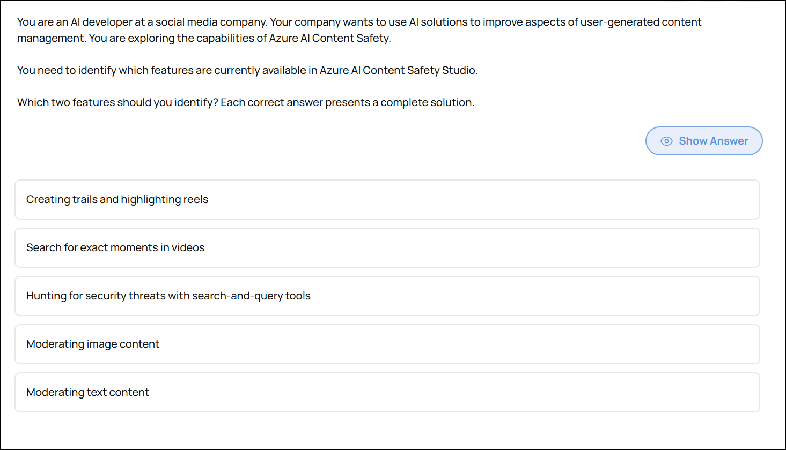

💡 Click to expand explanation

**Why the selected answers are correct**

Azure AI Content Safety Studio currently supports:

* **Moderating image content**
* **Moderating text content**

These are core capabilities of Azure AI Content Safety. The studio allows you to test and configure filters for harmful categories (such as violence, hate, sexual content, and self-harm) across both text and images. You can adjust sensitivity thresholds and export configurations for implementation in your applications. This aligns directly with improving user-generated content management.

**Why the other options are incorrect**

* **Hunting for security threats with search-and-query tools**
  This is a capability of Azure Sentinel (SIEM/SOAR), not Azure AI Content Safety. Content Safety focuses on moderation, not threat hunting or security analytics.

* **Creating trails and highlighting reels**
  This is a feature of Azure AI Video Indexer, which analyzes video content and can generate highlights. It is unrelated to content moderation in Content Safety Studio.

* **Search for exact moments in videos**
  This is also a Video Indexer capability. Azure AI Content Safety does not analyze video timelines or enable moment-level video search.

**Key takeaway**

Azure AI Content Safety Studio is designed specifically for **text and image moderation**. Video analysis, highlight generation, and security threat hunting belong to other Azure services.

▶ Related Lab: [lab-content-safety](../hands-on-labs/ai-services/lab-content-safety/README.md)

---

## Implement Generative AI Solutions

### Use Azure OpenAI in Foundry Models to generate content

#### Azure OpenAI Image Generation and DALL-E Configuration

**Domain:** Implement Generative AI Solutions
**Skill:** Use Azure OpenAI in Foundry Models to generate content
**Task:** Use the DALL-E model to generate images

You are an AI Engineer. You are developing an application that uses Azure OpenAI to generate images from natural language prompts.

You test the functionality of the DALL-E model in Azure AI Foundry as shown in the exhibit.

For each of the following statements, select Yes if the statement is true. Otherwise, select No.

| Statement | Yes | No |
|----------|-----|----|
| Prefilled Python code reflecting your settings is available | ☐ | ☐ |
| You can set the size of the generated images to 1024x1024. | ☐ | ☐ |
| You can save generated images in JPEG format. | ☐ | ☐ |

📸 Click to expand screenshot

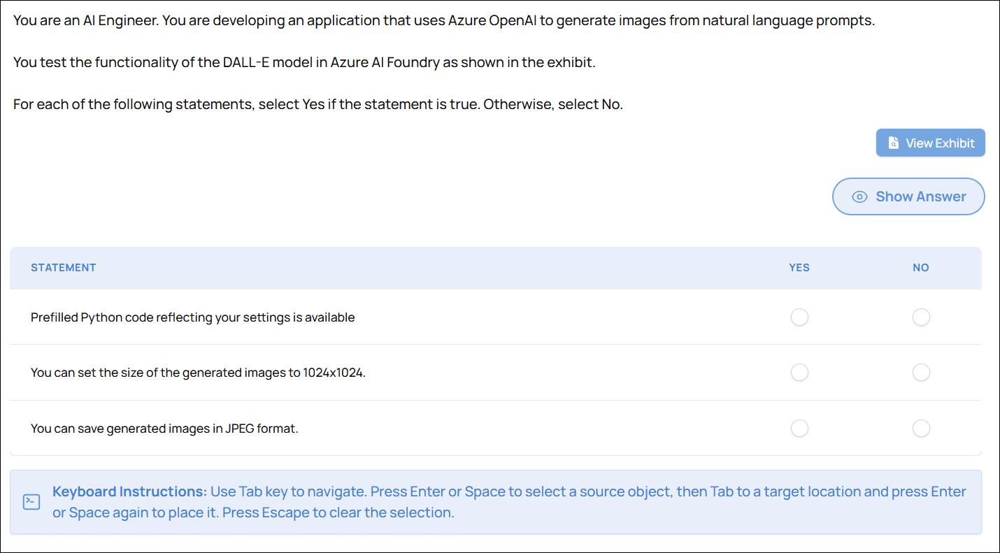

💡 Click to expand explanation

**Why the statements are correct**

**Prefilled Python code reflecting your settings is available — Yes**

The Azure AI Foundry DALL·E playground generates prefilled Python code based on the configuration you select in the UI. This allows you to copy code that already includes your prompt, image size, and other generation settings. This is designed to simplify moving from testing in the playground to application integration.

**You can set the size of the generated images to 1024x1024 — Yes**

The DALL·E model supports specific image sizes, including 1024x1024. The explanation confirms that the model supports 1024x1024, 1024x1792, and 1792x1024. These can be configured in the playground settings.

**You can save generated images in JPEG format — No**

At the time described, DALL·E in Azure AI Foundry supports only PNG output. JPEG is not supported directly from the model output, so this statement is false.

**Key takeaway**

The question tests knowledge of:

* Playground-to-code integration capability
* Supported image sizes
* Supported output formats

For exam purposes, remember:

* Prefilled SDK code is available in Azure AI Foundry.
* 1024x1024 is a valid supported size.
* PNG is supported; JPEG is not.

**References**

* [https://learn.microsoft.com/en-us/azure/ai-services/openai/how-to/dall-e](https://learn.microsoft.com/en-us/azure/ai-services/openai/how-to/dall-e)
* [https://learn.microsoft.com/en-us/azure/ai-services/openai/quickstart?pivots=programming-language-python&tabs=command-line%2Cpython-new](https://learn.microsoft.com/en-us/azure/ai-services/openai/quickstart?pivots=programming-language-python&tabs=command-line%2Cpython-new)

▶ Related Lab: [lab-dalle-image-gen](/certs/AI-102/hands-on-labs/generative-ai/lab-dalle-image-gen/README.md)

---

### Optimize and operationalize a generative AI solution

#### Serverless API Deployment

**Domain:** Implement Generative AI Solutions
**Skill:** Optimize and operationalize a generative AI solution
**Task:** Optimize and manage resources for deployment, including scalability and foundational model updates

A media company is building an interactive content creation tool using Azure AI.

The company wants to generate creative, diverse headlines and taglines from keywords with moderate latency. The tool must cost-efficiently handle unpredictable usage spikes, with costs primarily driven by token consumption.

You need to select an Azure AI deployment strategy to meet these requirements.

Which strategy should you select?

A. A model run as a batch deployment  
B. A model hosted on a managed compute with fine-tuning  
C. A model that utilize provisioned throughput units (PTUs)  
D. A model accessible via a serverless API  

📸 Click to expand screenshot

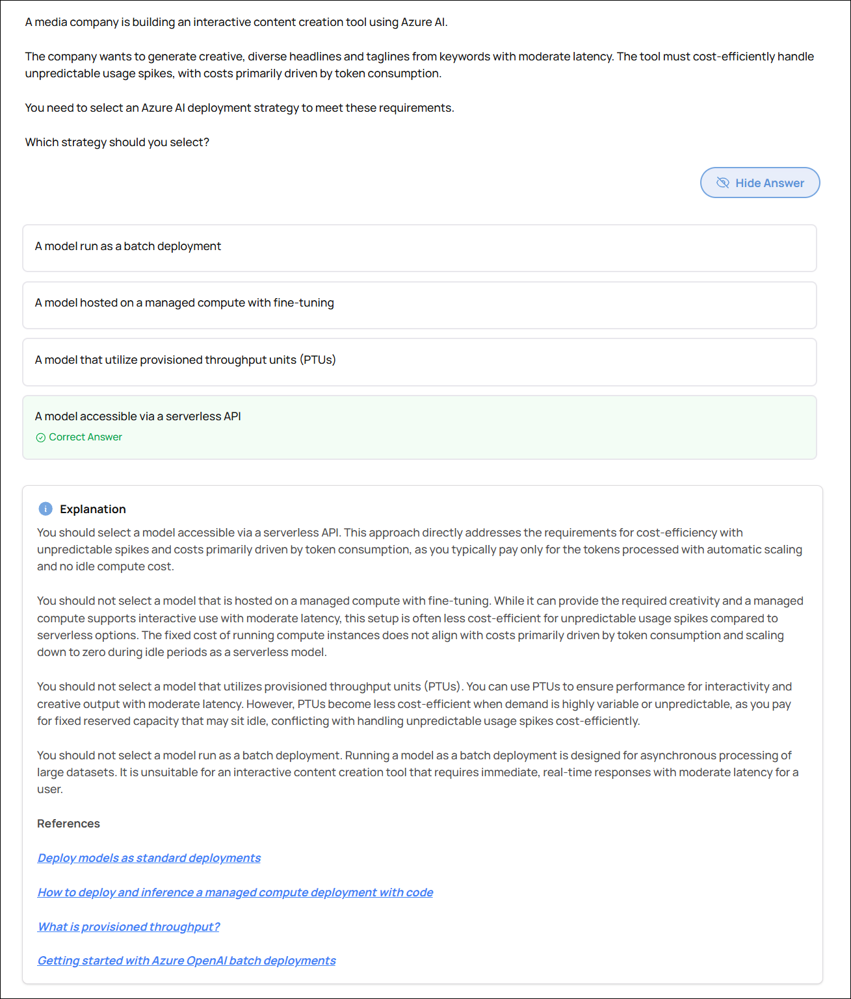

💡 Click to expand explanation

You should select a model accessible via a serverless API. This approach directly addresses the requirements for cost-efficiency with unpredictable spikes and costs primarily driven by token consumption, as you typically pay only for the tokens processed with automatic scaling and no idle compute cost.

You should not select a model that is hosted on a managed compute with fine-tuning. While it can provide the required creativity and a managed compute supports interactive use with moderate latency, this setup is often less cost-efficient for unpredictable usage compared to serverless options. The fixed cost of running compute instances does not align with costs primarily driven by token consumption and scaling down to zero during idle periods as a serverless model.

You should not select a model that utilizes provisioned throughput units (PTUs). You can use PTUs to ensure performance for interactivity and creative output with moderate latency. However, PTUs become less cost-efficient when demand is highly variable or unpredictable, as you pay for fixed reserved capacity that may sit idle, conflicting with handling unpredictable usage spikes cost-efficiently.

You should not select a model run as a batch deployment. Running a model as a batch deployment is designed for asynchronous processing of large datasets. It is unsuitable for an interactive content creation tool that requires immediate, real-time responses with moderate latency for a user.

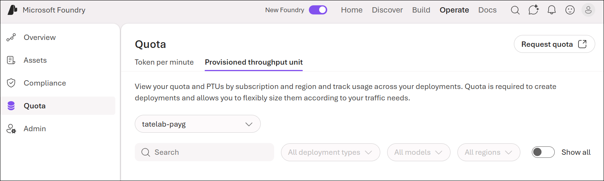

References

* [Deploy models as standard deployments](https://learn.microsoft.com/en-us/azure/foundry-classic/how-to/deploy-models-serverless?tabs=azure-direct&pivots=ai-foundry-portal)
* [How to deploy and inference a managed compute deployment with code](https://learn.microsoft.com/en-us/azure/foundry-classic/how-to/deploy-models-managed?pivots=ai-foundry-portal)
* [What is provisioned throughput?](https://learn.microsoft.com/en-us/azure/foundry/openai/concepts/provisioned-throughput?tabs=global-ptum)
* [Getting started with Azure OpenAI batch deployments](https://learn.microsoft.com/en-us/azure/foundry/openai/how-to/batch?tabs=global-batch%2Cstandard-input%2Cpython-secure&pivots=ai-foundry-portal)

---

## Implement an Agentic Solution

### Create custom agents

#### Azure AI Agent Service File Upload Configuration Issues

**Domain:** Implement an Agentic Solution
**Skill:** Create custom agents
**Task:** Configure the necessary resources to build an agent

You are investigating an issue where user file uploads to an Azure AI Agent Service are failing after implementing a standard agent setup that uses your own storage account resource. You have confirmed that the Azure Storage account exists and has sufficient capacity.

You need to identify the configurations that are causing the upload failure.

Which two configurations should you identify? Each correct answer presents a complete solution.

| Statement | Yes | No |
|----------|-----|----|
| The Azure AI Search resource assigned to the project's capability host has an incorrect connection string to Azure Storage. | ☐ | ☐ |
| The project-managed identity is assigned the Storage Account Contributor role at the subscription level instead of the storage account. | ☐ | ☐ |
| The Azure Storage account connected to the project's capability host is missing a manually created container named uploaded-files. | ☐ | ☐ |
| The project-managed identity lacks the Storage Blob Data Owner role on the <workspaceid>-agents-blobstore container. | ☐ | ☐ |
| The project's capability host was set with an incorrect connection string to the Azure Storage resource. | ☐ | ☐ |

📸 Click to expand screenshot

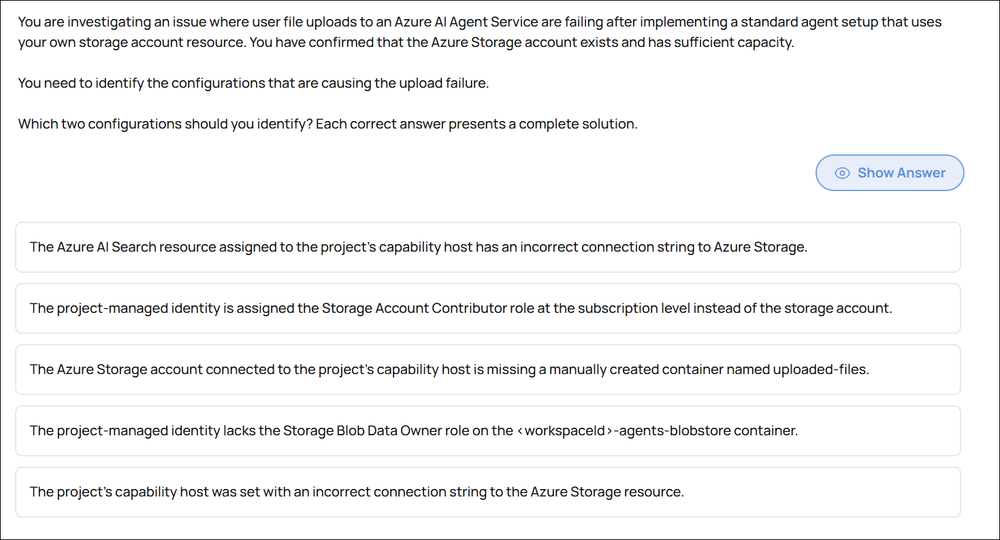

💡 Click to expand explanation

**Why the selected answers are correct**

**The project-managed identity lacks the Storage Blob Data Owner role on the `<workspaceid>-agents-blobstore` container — Yes**

When using your own storage account with Azure AI Agent Service, the project's managed identity must have the **Storage Blob Data Owner** role scoped specifically to the agents blob container. Without this role, the agent service cannot read or write blob data during file uploads, causing the operation to fail. Assigning the role at the wrong scope or assigning an insufficient role will produce the same failure.

**The project's capability host was set with an incorrect connection string to the Azure Storage resource — Yes**

The capability host configuration binds the Azure AI project to the specific storage account used for agent operations. If the connection string in the capability host is incorrect or points to the wrong storage account, the agent service cannot locate or access the storage resource. This is a direct misconfiguration that causes upload failures regardless of whether the storage account itself is healthy.

**Why the other options are incorrect**

**The Azure AI Search resource has an incorrect connection string to Azure Storage**
Azure AI Search is used for indexing and retrieval, not for managing file upload operations in Azure AI Agent Service. A misconfigured Azure AI Search connection string would affect search-based retrieval, not blob file uploads directly.

**The project-managed identity is assigned the Storage Account Contributor role at the subscription level instead of the storage account**
Storage Account Contributor is a management-plane role. It grants the ability to manage the storage account configuration, not to read or write blob data. Even correctly scoped, this role does not grant the data-plane permissions required for file uploads. The correct role is Storage Blob Data Owner, scoped to the container.

**The Azure Storage account is missing a manually created container named `uploaded-files`**
Azure AI Agent Service automatically creates and manages the required containers in the connected storage account. There is no requirement to manually pre-create a container with a specific name. This is not a valid cause of the failure.

**Key takeaway**

When configuring Azure AI Agent Service with bring-your-own storage, two things must be correct: the capability host must reference the storage account using a valid connection string, and the project's managed identity must hold the Storage Blob Data Owner role scoped to the agents blob container. Management-plane roles and auto-created containers are not factors in upload failures.

**References**

* [Standard Agent Setup](https://learn.microsoft.com/en-us/azure/ai-foundry/agents/concepts/standard-agent-setup?view=foundry-classic)  
* [Use Your Own Resources](https://learn.microsoft.com/en-us/azure/ai-foundry/agents/how-to/use-your-own-resources?view=foundry-classic)  
* [Assign Azure Role Data Access](https://learn.microsoft.com/en-us/azure/storage/blobs/assign-azure-role-data-access?tabs=portal)  
* [Built-in Roles for Storage](https://learn.microsoft.com/en-us/azure/role-based-access-control/built-in-roles/storage)

▶ Related Labs:

* [lab-agent-essentials](../hands-on-labs/agentic/lab-agent-essentials/README.md)
* [lab-agent-storage-config](../hands-on-labs/ai-services/lab-agent-storage-config/README.md)

---

## Implement Natural Language Processing Solutions

### Analyze and translate text

#### Sentiment Analysis - Mixed Document

**Domain:** Implement Natural Language Processing Solutions
**Skill:** Analyze and translate text
**Task:** Determine sentiment of text

You want to test the Sentiment Analysis feature of the Azure AI Language API.

You submit your document for analysis. The Azure AI Language API labels your document as mixed with a confidence score of 0.9.

What combination of sentences can generate such results?

A. At least one sentence is positive, and the rest are negative.  
B. All sentences in the document are neutral.  
C. At least one sentence is positive, and the rest are neutral.  
D. At least one sentence is negative, and the rest are neutral.  

📸 Click to expand screenshot

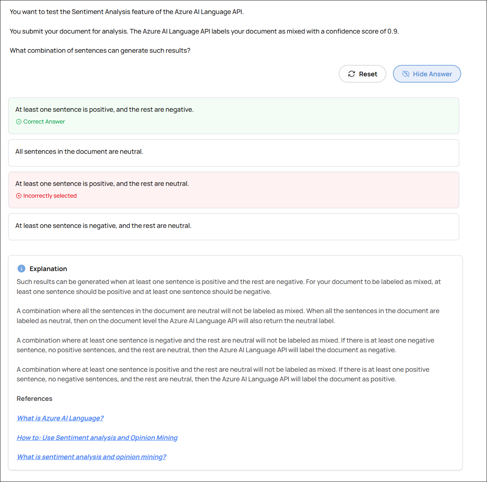

💡 Click to expand explanation

Such results can be generated when at least one sentence is positive and the rest are negative. For your document to be labeled as mixed, at least one sentence should be positive and at least one sentence should be negative.

A combination where all the sentences in the document are neutral will not be labeled as mixed. When all the sentences in the document are labeled as neutral, then on the document level the Azure AI Language API will also return the neutral label.

A combination where at least one sentence is negative and the rest are neutral will not be labeled as mixed. If there is at least one negative sentence, no positive sentences, and the rest are neutral, then the Azure AI Language API will label the document as negative.

A combination where at least one sentence is positive and the rest are neutral will not be labeled as mixed. If there is at least one positive sentence, no negative sentences, and the rest are neutral, then the Azure AI Language API will label the document as positive.

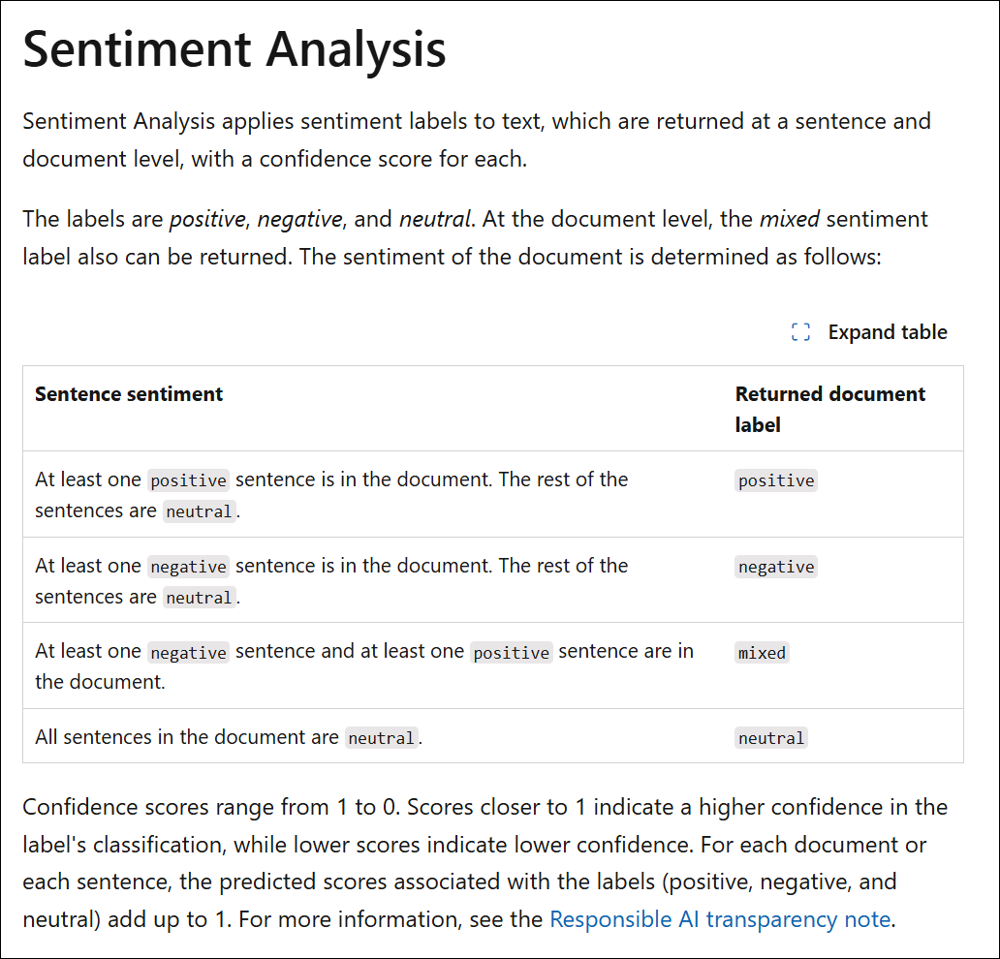

References

- [Language Service - Overview](https://learn.microsoft.com/en-gb/azure/ai-services/language-service/overview)
- [Sentiment Opinion Mining - Overview](https://learn.microsoft.com/en-gb/azure/ai-services/language-service/sentiment-opinion-mining/overview)
- [Sentiment Opinion Mining - Call API](https://learn.microsoft.com/en-us/azure/ai-services/language-service/sentiment-opinion-mining/how-to/call-api)

---

### Process and translate speech

#### Speech-to-Speech Translation Class

**Domain:** Implement Natural Language Processing Solutions
**Skill:** Process and translate speech
**Task:** Translate speech-to-speech and speech-to-text by using the Azure Speech in Foundry Tools service

You want to enable speech-to-speech translation in your app. You deploy a new Azure AI Speech service resource in your Azure subscription and install the Speech software development kit (SDK) for .Net on your computer.

You need to call the Azure AI Speech service using the Speech SDK.

Which class should you instantiate first?

A. SpeechTranslationConfig  
B. TranslationRecognizer  
C. SpeechRecognizer  
D. SpeechSynthesizer  

📸 Click to expand screenshot

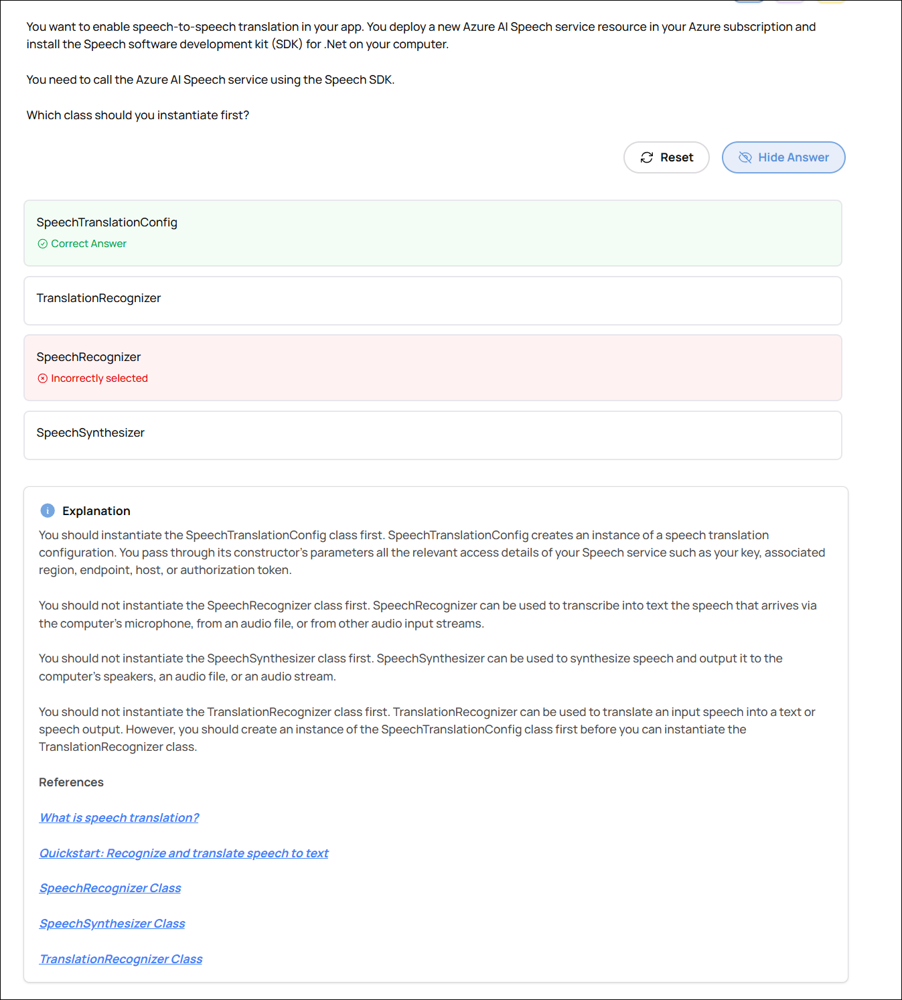

💡 Click to expand explanation

You should instantiate the SpeechTranslationConfig class first. SpeechTranslationConfig creates an instance of a speech translation configuration. You pass through its constructor's parameters all the relevant access details of your Speech service such as your key, associated region, endpoint, host, or authorization token.

You should not instantiate the SpeechRecognizer class first. SpeechRecognizer can be used to transcribe into text the speech that arrives via the computer's microphone, from an audio file, or from other audio input streams.

You should not instantiate the SpeechSynthesizer class first. SpeechSynthesizer can be used to synthesize speech and output it to the computer's speakers, an audio file, or an audio stream.

You should not instantiate the TranslationRecognizer class first. TranslationRecognizer can be used to translate an input speech into a text or speech output. However, you should create an instance of the SpeechTranslationConfig class first before you can instantiate the TranslationRecognizer class.

- SpeechTranslationConfig Class - Speech translation configuration.
- TranslationRecognizer Class - Translates speech input into text and synthesized speech in one or more target languages.
- SpeechRecognizer Class - Transcribes speech into text. Speech can arrive via microphone, audio file, or other audio input stream.
- SpeechSynthesizer Class - Provides access to the functionality of an installed speech synthesis engine.

> <https://learn.microsoft.com/en-us/azure/ai-services/speech-service/get-started-speech-translation?tabs=windows&pivots=programming-language-csharp#translate-speech-from-a-microphone>

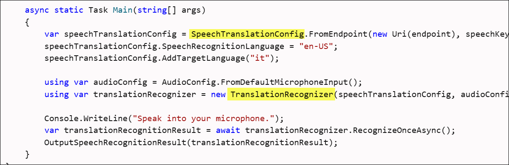

References

- [Speech Translation](https://learn.microsoft.com/en-us/azure/ai-services/speech-service/speech-translation)
- [Get Started Speech Translation](https://learn.microsoft.com/en-us/azure/ai-services/speech-service/get-started-speech-translation?tabs=windows&pivots=programming-language-csharp)
- [SpeechRecognizer](https://learn.microsoft.com/en-us/dotnet/api/microsoft.cognitiveservices.speech.speechrecognizer?view=azure-dotnet)
- [SpeechSynthesizer](https://learn.microsoft.com/en-us/dotnet/api/system.speech.synthesis.speechsynthesizer?view=netframework-4.8)
- [TranslationRecognizer](https://learn.microsoft.com/en-us/dotnet/api/microsoft.cognitiveservices.speech.translation.translationrecognizer?view=azure-dotnet)

---

## Implement Knowledge Mining and Information Extraction Solutions

### Implement an Azure AI Search solution

#### Azure AI Search Query Performance Optimization

**Domain:** Implement Knowledge Mining and Information Extraction Solutions
**Skill:** Implement an Azure AI Search solution
**Task:** Query an index, including syntax, sorting, filtering, and wildcards

You use Azure AI Search to index your organization's documents and data.

Users report that some queries are slow. You repeat the users' queries when there is no load on the service and the queries are still slow.

What should you do to improve performance of slow-running queries?

| Statement | Yes | No |
|----------|-----|----|
| Add fields to the index. | ☐ | ☐ |
| Add replicas. | ☐ | ☐ |
| Add partitions. | ☐ | ☐ |
| Convert fields to complex types. | ☐ | ☐ |

📸 Click to expand screenshot

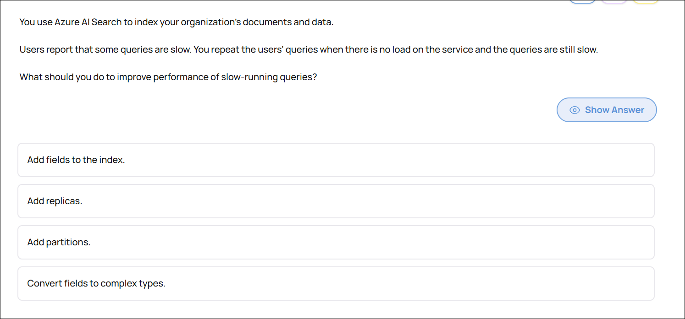

💡 Click to expand explanation

**Why the selected answer is correct (Add partitions)**

Partitions in Azure AI Search split the index across multiple physical storage and compute resources. When a single query is slow even with no load on the service, the issue is not concurrency — it is the amount of data being processed per query.

Adding partitions increases the data processing capacity for each query because the index is distributed and searched in parallel across more compute resources. This improves performance for large indexes and complex queries.

In exam terms:

* **Partitions = scale for data volume and query performance**
* **Replicas = scale for concurrency and availability**

Since the queries are slow even without load, the correct action is to increase partitions.

**Why the other options are incorrect**

**Add replicas**
Replicas help handle more simultaneous users and provide high availability. They do not make a single query execute faster. Since there is no load on the service, replicas will not solve the problem.

**Add fields to the index**
Adding fields increases index size and can negatively impact performance. If anything, reducing unnecessary fields can improve performance.

**Convert fields to complex types**
Complex types increase index size and storage requirements. This can degrade performance rather than improve it.

**Key takeaway**

* Slow queries under no load → add partitions
* Slow queries under heavy load → add replicas
* Larger index size generally reduces performance

**References**

* [https://learn.microsoft.com/en-us/azure/search/search-performance-tips](https://learn.microsoft.com/en-us/azure/search/search-performance-tips)
* [https://learn.microsoft.com/en-us/azure/search/search-capacity-planning](https://learn.microsoft.com/en-us/azure/search/search-capacity-planning)

▶ Related Lab: [lab-search-query-perf](../hands-on-labs/knowledge-mining/lab-search-query-perf/README.md)

---

### Implement an Azure Document Intelligence in Foundry Tools solution

#### Automating Invoice Processing with Azure AI Document Intelligence

**Domain:** Implement Knowledge Mining and Information Extraction Solutions
**Skill:** Implement an Azure Document Intelligence in Foundry Tools solution
**Task:** Use prebuilt models to extract data from documents

Your company wants to automate the processing of incoming invoices using Azure AI Document Intelligence.  

You test the prebuilt invoice model of Azure AI Document Intelligence with a sample invoice.  

For each of the following statements, select Yes if the statement is true. Otherwise, select No.  

| Statement | Yes | No |
|-----------|-----|----|
| The results of the invoice analysis can be downloaded in XML format. | ☐ | ☐ |
| You can access prebuilt invoice model from Document Intelligence Studio. | ☐ | ☐ |
| You can access prebuilt invoice model from C# Software Development Kit (SDK). | ☐ | ☐ |

📸 Click to expand screenshot

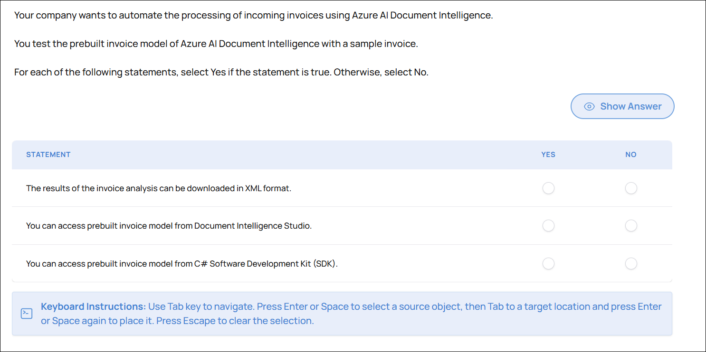

💡 Click to expand explanation

**Correct answers**

- The results of the invoice analysis can be downloaded in XML format. — No  
- You can access prebuilt invoice model from Document Intelligence Studio. — Yes  
- You can access prebuilt invoice model from C# Software Development Kit (SDK). — Yes

**Why these answers are correct**

- Document Intelligence export formats: The service and its web UI provide JSON-based outputs for analysis results. The platform does not offer a native XML export for invoice analysis results, so answering "No" for XML download is correct.
- Access via Document Intelligence Studio: Document Intelligence Studio exposes the prebuilt invoice model in the studio UI, letting you run and inspect analyses and experiment with prebuilt and custom models without writing code. That makes "Yes" correct for Studio access.
- Access via C# SDK: Azure AI Document Intelligence exposes prebuilt models through SDKs (C#, Python, Java, JavaScript), so you can call the prebuilt invoice model programmatically from C# applications. That makes "Yes" correct for the C# SDK.

**Why other interpretations are wrong**

- Expecting an XML export is a common trap; the product's supported export is JSON in the web interface. Relying on XML would require additional transformation steps outside the service.
- Believing the prebuilt model is only available through the UI or only via code is incorrect; Microsoft provides both the Studio web experience and SDK integrations for prebuilt models.

**Key takeaway**

- Use Document Intelligence Studio or the SDKs to run the prebuilt invoice model. Export and integration workflows expect JSON from the service; convert to XML only if an external requirement mandates it.

**References**

- No stable Microsoft Learn link can be guaranteed for this specific exam concept.

▶ Related Lab: [lab-doc-intelligence-invoice](../hands-on-labs/ai-services/lab-doc-intelligence-invoice/README.md)

---
