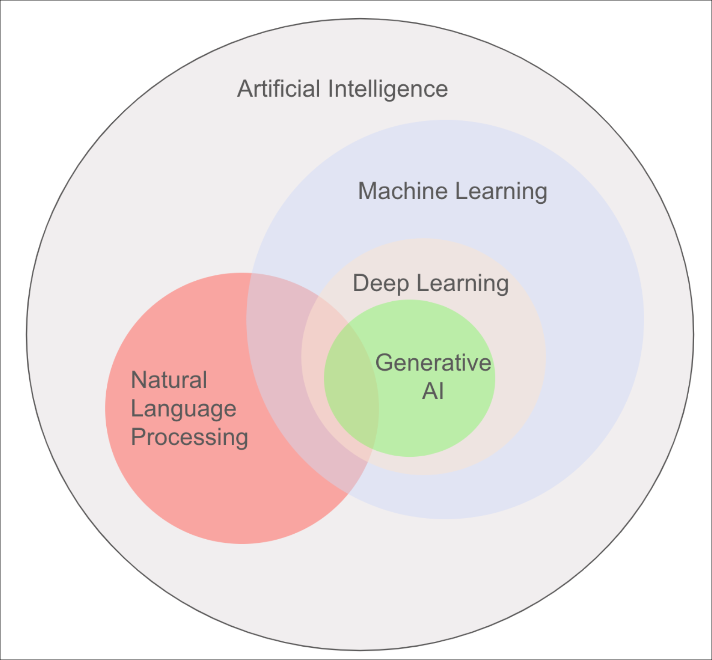

# Module 1: Overview of AI concepts

**Link:** [Overview of AI concepts](https://learn.microsoft.com/en-us/training/modules/get-started-ai-fundamentals/)

* [Generative AI Fundamentals](#generative-ai-fundamentals)
* [Natural Language Processing (NLP)](#natural-language-processing-nlp)
* [Speech](#speech)
* [Computer Vision](#computer-vision)
* [Extracting Insights from Data](#extracting-insights-from-data)
* [Responsible AI](#responsible-ai)

---

## Generative AI Fundamentals

[Module Reference](https://learn.microsoft.com/en-us/training/modules/get-started-ai-fundamentals/2-generative-ai?pivots=text)

**What generative AI is**

* A class of AI systems designed to **create new content** (text, images, audio, code) rather than only analyze or classify existing data.
* Outputs are **probabilistic** and based on patterns learned from large datasets.

**Core capabilities**

* **Text generation**: drafting, summarization, translation, question answering.
* **Image generation**: creating images from text prompts.
* **Code generation**: producing code snippets or entire functions from natural language.
* **Multimodal support**: some models accept and generate across multiple content types.

**How generative AI works (high level)**

* Trained on **large datasets** to learn statistical relationships between tokens (words, pixels, etc.).
* Uses **neural networks** (commonly transformer-based for text) to predict the **next most likely token** given context.
* Generation quality depends on model size, training data, and prompt clarity.

**Prompts**

* A **prompt** is the input that guides the model’s output.
* Clear, specific prompts improve relevance and accuracy.
* Prompts can include instructions, constraints, examples, or formatting requirements.

**Use cases**

* Content creation (emails, reports, marketing copy).
* Knowledge assistance and summarization.
* Software development acceleration.
* Creative tasks (stories, images, brainstorming).

**Limitations and considerations**

* Can produce **hallucinations** (confident but incorrect outputs).
* May reflect **biases** present in training data.
* Outputs are not guaranteed to be factual or up to date without grounding.
* Requires **human review** for accuracy, ethics, and compliance.

**Responsible AI concepts**

* Validate outputs before use.
* Avoid sharing sensitive or confidential data in prompts.
* Apply governance, monitoring, and usage policies.

**Exam-relevant takeaways**

* Generative AI **creates** new content; it is not limited to prediction or classification.
* Prompts directly influence output quality.
* Outputs are probabilistic and require validation.
* Common modalities: text, images, code, and audio.

---

## Natural Language Processing (NLP)

[Module Reference](https://learn.microsoft.com/en-us/training/modules/get-started-ai-fundamentals/5-natural-language-processing?pivots=text)

**Definition**

* Natural Language Processing (NLP) is a branch of artificial intelligence that enables computers to process, analyze, understand, and generate human language.

**Why NLP is difficult**

* Human language is ambiguous and context-dependent.
* The same word can have different meanings depending on usage.
* Language includes slang, idioms, sarcasm, and grammatical variation.

**Common NLP workloads**

* **Text classification**: Assigning categories to text (for example, spam detection).
* **Sentiment analysis**: Identifying whether text expresses positive, negative, or neutral sentiment.
* **Key phrase extraction**: Identifying important terms in text.
* **Named entity recognition (NER)**: Detecting entities such as people, organizations, locations, dates, or quantities.
* **Language detection**: Identifying the language of a text sample.
* **Machine translation**: Translating text between languages.
* **Speech-related tasks**: Speech-to-text and text-to-speech.
* **Question answering / conversational AI**: Understanding user input and generating relevant responses.

**How NLP systems work**

* Text is converted into numerical representations that models can process.
* Machine learning models learn language patterns from large datasets.
* Pre-trained language models can be reused and adapted for specific NLP tasks.

**Modern NLP approaches**

* Deep learning models are commonly used for NLP.
* Transformer-based models analyze relationships between words across entire sentences or documents, improving context awareness.

**Exam-relevant points**

* NLP focuses on enabling computers to work with natural (human) language.
* Ambiguity and context are core challenges in NLP.
* Many NLP solutions rely on pre-trained models rather than training from scratch.

---

## Speech

[Module Reference](https://learn.microsoft.com/en-us/training/modules/get-started-ai-fundamentals/4-speech?pivots=text)

**What speech AI is**

* Speech AI enables systems to recognize, interpret, and generate spoken language.
* It bridges human speech and machine processing.

**Core speech workloads**

* **Speech-to-text (STT)**: Converts spoken language into written text.
* **Text-to-speech (TTS)**: Converts written text into spoken audio.
* **Speech translation**: Converts spoken language in one language into text or speech in another language.

**Why speech processing is challenging**

* Variations in accent, pronunciation, and speaking speed.
* Background noise and audio quality.
* Homonyms and context-dependent meaning.

**How speech systems work**

* Audio signals are captured and digitized.
* Features are extracted from audio waves to represent sound patterns.
* Machine learning models map audio features to words or phonemes.
* Language models help improve accuracy by using context.

**Common real-world applications**

* Voice assistants and smart devices.
* Live captions and transcription services.
* Call center analytics and call transcription.
* Accessibility tools for users with hearing or speech impairments.

**Exam-relevant points**

* Speech AI focuses on spoken language, unlike NLP which focuses on text.
* Speech-to-text and text-to-speech are foundational speech workloads.
* Accuracy depends heavily on audio quality and language context.

---

## Computer Vision

[Module Reference](https://learn.microsoft.com/en-us/training/modules/get-started-ai-fundamentals/3-computer-vision?pivots=text)

**What computer vision is**

* Computer vision is a branch of artificial intelligence that enables systems to interpret and analyze visual data such as images and video.
* The objective is to extract meaningful information from visual content.

**Why computer vision is challenging**

* Images vary due to lighting, scale, orientation, and background.
* Objects may be partially obscured or appear differently in different contexts.
* Visual data is unstructured and high-dimensional.

**Common computer vision workloads**

* **Image classification**: Identifying what an image represents (for example, cat, car, building).
* **Object detection**: Locating and identifying multiple objects within an image.
* **Object tracking**: Following detected objects across video frames.
* **Optical character recognition (OCR)**: Extracting printed or handwritten text from images.
* **Face detection and analysis**: Identifying the presence of faces and facial features.
* **Image analysis**: Extracting tags, descriptions, or metadata from images.

**Types of computer vision models**

* **Image classification models**: Trained on labeled images to predict the main subject of an image.
* **Object detection models**: Trained to identify both the location and type of specific objects in an image.
* **Semantic segmentation models**: An advanced form of object detection that classifies individual pixels, identifying which pixels belong to a particular object.
* **Multi-modal models**: Combine visual features with associated text, enabling the generation of richer descriptions and understanding of images.

**How computer vision systems work**

* Images are represented as numerical pixel data.
* Models learn visual patterns such as edges, shapes, and textures.
* Deep learning models are commonly used to achieve high accuracy.

**Exam-relevant points**

* Computer vision focuses on visual data, unlike NLP (text) or speech AI (audio).
* Image classification, object detection, and OCR are core workloads.
* Semantic segmentation and multi-modal models are advanced but explicitly defined model types.

---

## Extracting Insights from Data

[Module Reference](https://learn.microsoft.com/en-us/training/modules/get-started-ai-fundamentals/6-extract-insights?pivots=text)

**What “extracting insights” means**

* This AI workload focuses on identifying patterns, trends, and relationships in data.
* It is commonly associated with data analytics, machine learning, and predictive modeling.
* The goal is to support decision-making rather than direct interaction (unlike vision, speech, or NLP).

**Common data insight workloads**

* **Anomaly detection**: Identifying unusual patterns or outliers that differ from expected behavior.
* **Forecasting**: Predicting future values based on historical data (for example, sales or demand trends).
* **Clustering**: Grouping similar data points together without predefined labels.
* **Classification**: Assigning data points to predefined categories based on learned patterns.
* **Regression**: Predicting a numerical value based on relationships in the data.

**How insight extraction works**

* Data is collected from structured sources such as databases, tables, or logs.
* Features are selected or engineered from raw data.
* Machine learning models learn statistical patterns and relationships.
* Outputs are predictions, groupings, or alerts rather than natural language or images.

**Types of data used**

* Typically structured or semi-structured data (rows and columns).
* Often numerical, but can include encoded categorical values.
* Less focused on unstructured data like images or free text.

**Real-world applications**

* Fraud detection and risk scoring.
* Demand and capacity planning.
* Predictive maintenance.
* Customer segmentation.
* Business intelligence and analytics.

**Exam-relevant points**

* Extracting insights is about pattern recognition in data, not language, vision, or speech.
* Forecasting and anomaly detection are core workloads.
* These solutions support decisions rather than direct human interaction.

---

## Responsible AI

[Module Reference](https://learn.microsoft.com/en-us/training/modules/get-started-ai-fundamentals/7-responsible-ai?pivots=text)

**What Responsible AI is**

* Responsible AI is an approach to designing, developing, and deploying AI systems in a way that is ethical, trustworthy, and aligned with human values.
* It emphasizes minimizing harm while maximizing benefits to individuals and society.

**Why Responsible AI matters**

* AI systems can influence decisions that affect people’s lives.
* Poorly designed AI can introduce bias, unfairness, privacy violations, or lack of accountability.
* Trust in AI systems depends on transparency, reliability, and ethical use.

**Core principles of Responsible AI**

* **Fairness**: AI systems should treat all people fairly and avoid bias or discrimination.
* **Reliability and safety**: AI systems should perform consistently and safely under expected conditions.
* **Privacy and security**: AI systems must protect user data and respect privacy.
* **Inclusiveness**: AI systems should empower and engage all people, including those with disabilities.
* **Transparency**: AI systems should be understandable, and decisions should be explainable where possible.
* **Accountability**: Humans should remain accountable for AI system behavior and outcomes.

**Responsible AI in practice**

* Evaluate training data for bias and representativeness.
* Monitor model performance over time.
* Provide explanations or confidence indicators for AI outputs.
* Ensure human oversight, especially for high-impact decisions.

**Exam-relevant points**

* Responsible AI focuses on ethical use, not technical performance.
* Fairness, transparency, and accountability are central principles.
* Humans remain responsible for AI-driven decisions and outcomes.

*Last updated: 2026-01-16*
