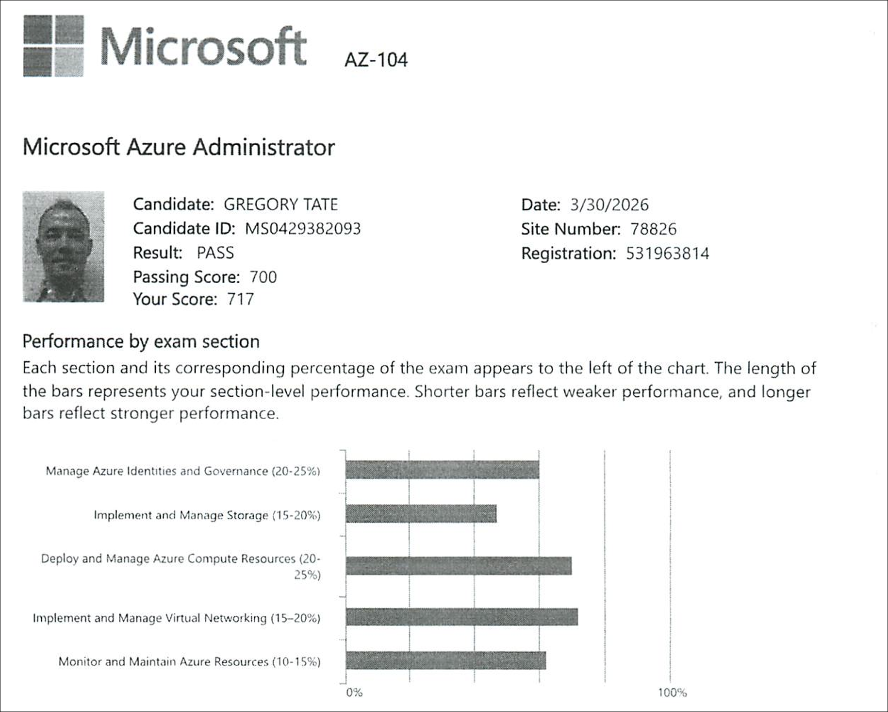

# AZ-104: Microsoft Azure Administrator — Exam

**Date:** March 30, 2026  
**Status:** ✅ Passed

---

## Exam Details

- **Score:** 710 (Passing Score: 700)
- **Number of Questions:** 50
- **Duration:** 2 hrs
- **Questions Marked for Review:** 20+

---

## Exam Experience

### Overall Difficulty

The exam was tough! I brought a lot of confidence into the exam but quickly realized that I didn't know the material quite as deeply as I thought was necessary.  

I used all of the two-hour time limit and felt rushed at the end. I feel that this exam should've come with a 3-hour time limit, especially considering the amount of reading and analysis required for many of the questions.

The exam started off with a case study of an environment comprising Windows and Linux VMs, App Services, and Azure Storage. The 5 questions from the case study were all fairly straightforward, but I found myself second-guessing most of the answers.

After spending around 10-15 minutes on the case study, I was then presented with around 40 questions, about half of which presented three tables of information that I had to read through and analyze before answering the question. These questions caused me to slow down significantly and end up chewing a lot of precious time.

There were many easy questions that I was able to answer with confidence. What I found most challenging though, is that the harder questions used ambiguous language, e.g. referring to a blob as a container.

Around question 30, my palms started to get a little sweaty as I looked at the clock thinking I only have 30 minutes left to answer 20 questions. At this time, I began having thoughts in my mind that I may not be passing this exam. But I told myself to maintain concentration and keep pushing.  

Around the 15 minute mark, I hit question number 45 and began to feel more confident on finishing the exam. The last 5 questions were scenario-based questions which I still found challenging.

I ended up with around 7-10 minutes to review. On review, I went back and changed a number of answers. However, I was not to review all questions I marked for review.

At the end, I watched the timer count down to zero and held my breath. When the results came up, I was relieved to see that I passed (barely).

### Challenging Topics

- Azure Policy
- Azure Container Services
- Azure Storage

### What I Would Do Differently

I spent a lot of time developing hands-on labs, which I found to be very rewarding, but even hands-on labs don't fully prepare you for the level of detail required for the exam.

Going forward, I will spend more time reading throught the Microsoft documentation referenced from the Microsoft Learning Paths.

### Study Hours Breakdown

**Tracked study sessions:** 36.3h across 30 active sessions (3/7 – 3/29)

| Category | Hours | Notes |
| :------- | ----: | :---- |
| Compute (Domain 3) | 6h 13m | ARM templates, App Service, VMs |
| Networking (Domain 4) | 4h 51m | VNets, load balancing, secure access |
| Monitoring & Backup (Domain 5) | 4h 42m | Monitor resources, backup/recovery |
| Microsoft Practice Assessments | 4h 15m | Official AZ-104 practice assessment |
| Practice Question Review | 4h 07m | Final review sessions |
| Storage (Domain 2) | 2h 31m | Storage access, configuration |
| Identities & Governance (Domain 1) | 0h 52m | Policy, RBAC, tags |
| General / Unspecified | 8h 46m | Early sessions (no topic logged) |

**Additional untracked preparation:**

- Microsoft Learning Paths — 11 days (1/14 – 1/25)
- John Savill's training videos — 4 days (1/29 – 2/1)
- Hands-on labs (19 labs) — 30 days (2/2 – 3/4)

---
