# Lab: Enable Boot Diagnostics for Azure VMs

**Domain:** Monitor and Maintain Azure Resources
**Skill:** Monitor resources in Azure
**Task:** Configure and interpret monitoring of VMs, storage accounts, and networks by using Azure Monitor Insights

**Practice Exam Questions:**
- [Enable Guest OS Diagnostics](../../../practice-questions/README.md#enable-guest-os-diagnostics)


## Exam Question Scenario

> **Exam**: AZ-104 — Compute

### Enable Boot Diagnostics for VMs

*Multiple Drop-Down (Fill-in-the-Blank)*

You have two Azure Virtual Machines (VMs) and three storage accounts provisioned in an Azure subscription. The subscription configuration is shown in the exhibit.

You need to enable boot diagnostics in the Azure VMs using the available storage accounts.

Which storage accounts should you use? To answer, select the appropriate options from the drop-down menus.

| Azure VM | Operating System | Resource Group | Region |
|----------|------------------|----------------|--------|
| vm1      | Ubuntu 20.04 LTS| rg1            | Central US |
| vm2      | Windows Server 2019 | rg2        | East US |

| Storage Account | Type                  | Replication                  | Resource Group | Region     |
|-----------------|-----------------------|------------------------------|----------------|------------|
| storage1        | Premium storage account | Locally-redundant storage (LRS) | rg1            | Central US |
| storage2        | Storage account v1    | Locally-redundant storage (LRS) | rg2            | East US    |
| storage3        | Storage account v2    | Geo-redundant storage (GRS)  | rg1            | Central US |

Enable boot diagnostics in vm1 by using:

**[1]**

Enable boot diagnostics in vm2 by using:

**[2]**

Drop-Down Options:

| Blank | Options                                      |
|-------|----------------------------------------------|
| [1]   | storage1 only / storage1 or storage2 only / storage1, storage2, or storage3 / storage2 only / storage2 or storage3 only / storage3 only |
| [2]   | storage1 only / storage1 or storage2 only / storage1, storage2, or storage3 / storage2 only / storage2 or storage3 only / storage3 only |

---

## Solution Architecture

This lab deploys a multi-region environment with two virtual machines and three storage accounts to demonstrate Azure boot diagnostics storage account compatibility constraints. VM1 (Ubuntu) deploys in Central US alongside a Premium storage account and a Standard v2 GRS account, while VM2 (Windows) deploys in East US with a Standard v1 LRS account. The VMs are deployed without boot diagnostics enabled so that participants must determine the correct storage account for each VM based on two rules: the storage account must use a standard (General Purpose) SKU, and it must reside in the same region as the target VM.

---

## Architecture Diagram

```mermaid
%%{init: {
  "theme": "base",
  "themeVariables": {
    "background": "#F5F5F5",
    "primaryColor": "#E8E8E8",
    "primaryTextColor": "#333333",
    "primaryBorderColor": "#999999",
    "lineColor": "#666666",
    "clusterBkg": "#FAFAFA",
    "clusterBorder": "#CCCCCC",
    "edgeLabelBackground": "#F5F5F5",
    "fontFamily": "Segoe UI, Roboto, Arial, sans-serif",
    "fontSize": "14px"
  }
}}%%

graph LR
    subgraph RG["az104-compute-enable-boot-diagnostics-bicep"]
        subgraph CUS["Central US"]
            VM1["VM<br/>vm-boot-1<br/>Ubuntu 20.04"]:::compute
            NIC1["NIC<br/>nic-boot-1"]:::network
            SNET1["Subnet<br/>snet-vm"]:::network
            VNET1["VNet<br/>vnet-boot-centralus"]:::network
            ST1["Storage<br/>staz104boot1<br/>Premium LRS"]:::storage
            ST3["Storage<br/>staz104boot3<br/>Standard v2 GRS"]:::storage
        end
        subgraph EUS["East US"]
            VM2["VM<br/>vm-boot-2<br/>Windows 2019"]:::compute
            NIC2["NIC<br/>nic-boot-2"]:::network
            SNET2["Subnet<br/>snet-vm"]:::network
            VNET2["VNet<br/>vnet-boot-eastus"]:::network
            ST2["Storage<br/>staz104boot2<br/>Standard v1 LRS"]:::storage
        end
    end

    VM1 --> NIC1
    NIC1 --> SNET1
    SNET1 --> VNET1
    VM2 --> NIC2
    NIC2 --> SNET2
    SNET2 --> VNET2
    VM1 -.->|"Boot Diagnostics"| ST3
    VM2 -.->|"Boot Diagnostics"| ST2

    classDef compute    fill:#DCC8EB,stroke:#7B4FA0,color:#2D1045,stroke-width:1.5px;
    classDef network    fill:#C2E6CE,stroke:#3D8B57,color:#102B18,stroke-width:1.5px;
    classDef security   fill:#F2C0C4,stroke:#B5333D,color:#3A0A0E,stroke-width:1.5px;
    classDef storage    fill:#FDE0B8,stroke:#C07A1A,color:#2A1800,stroke-width:1.5px;
    classDef recovery   fill:#B8D8F2,stroke:#2A6BAD,color:#0D2240,stroke-width:1.5px;
    classDef identity   fill:#B0E2E8,stroke:#1A7C86,color:#082628,stroke-width:1.5px;
    classDef monitor    fill:#FFE4AA,stroke:#A07A00,color:#2A1C00,stroke-width:1.5px;
    classDef governance fill:#D5D5D5,stroke:#6B6B6B,color:#1A1A1A,stroke-width:1.5px;

    style CUS stroke:#4A90E2,stroke-width:2.5px
    style EUS stroke:#4A90E2,stroke-width:2.5px
```

---

## Lab Objectives

1. Deploy a multi-region environment with two VMs and three storage accounts of different types
2. Identify which storage account types support boot diagnostics (Standard vs. Premium)
3. Identify the region constraint requiring boot diagnostics storage accounts to be co-located with the VM
4. Enable boot diagnostics on each VM using the correct storage account
5. Verify boot diagnostics configuration and access serial console output

---

## Lab Structure

```
lab-enable-boot-diagnostics/
├── README.md
├── bicep/
│   ├── main.bicep
│   ├── main.bicepparam
│   ├── bicepconfig.json
│   ├── bicep.ps1
│   └── modules/
│       ├── storage.bicep
│       ├── networking.bicep
│       └── compute.bicep
└── validation/
    └── validate-boot-diagnostics.ps1
```

---

## Prerequisites

- Azure subscription with Contributor access
- [Azure CLI](https://learn.microsoft.com/cli/azure/install-azure-cli) installed and authenticated
- [Bicep CLI](https://learn.microsoft.com/azure/azure-resource-manager/bicep/install) installed
- [PowerShell 7+](https://learn.microsoft.com/powershell/scripting/install/installing-powershell) with Az module
- Lab profile active: `Use-AzProfile Lab`

---

## Deployment

```powershell
# Switch to lab subscription
Use-AzProfile Lab

# Navigate to bicep directory
cd certs/AZ-104/hands-on-labs/compute/lab-enable-boot-diagnostics/bicep

# Validate the template
.\bicep.ps1 validate

# Preview the deployment
.\bicep.ps1 plan

# Deploy the lab
.\bicep.ps1 apply
```

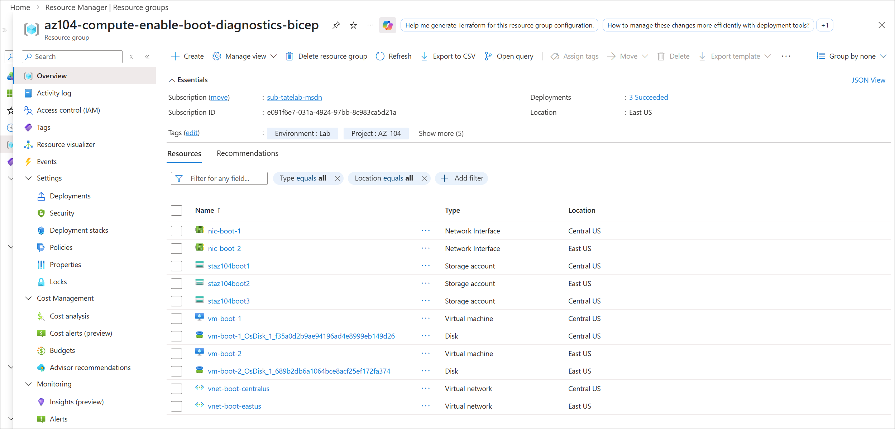

---

## Testing the Solution

### Step 1: Retrieve Deployment Outputs

```powershell
# Get resource group name from deployment outputs
$outputs = .\bicep.ps1 output
$rgName = $outputs.resourceGroupName
```

### Step 2: Examine Storage Account Types and Regions

```powershell
# List all storage accounts with their type, SKU, and region
Get-AzStorageAccount -ResourceGroupName $rgName |
    Format-Table StorageAccountName, Kind, @{n='SkuName';e={$_.Sku.Name}}, PrimaryLocation
```

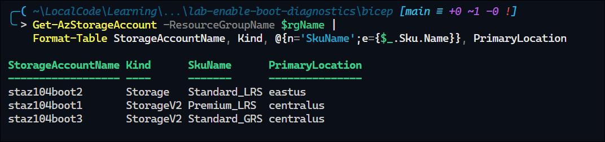

### Step 3: Verify VMs Are Deployed Without Boot Diagnostics

```powershell
# Check boot diagnostics status on both VMs
$vm1 = Get-AzVM -ResourceGroupName $rgName -Name 'vm-boot-1'
$vm2 = Get-AzVM -ResourceGroupName $rgName -Name 'vm-boot-2'

$vm1.DiagnosticsProfile.BootDiagnostics.Enabled  # Expected: not set or False
$vm2.DiagnosticsProfile.BootDiagnostics.Enabled  # Expected: not set or False
```

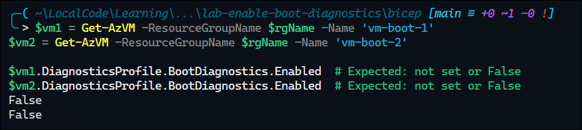

### Step 4: Enable Boot Diagnostics on vm-boot-1

```powershell
# vm-boot-1 is in Central US — use staz104boot3 (Standard v2, Central US)
Set-AzVMBootDiagnostic -VM $vm1 -Enable -ResourceGroupName $rgName -StorageAccountName 'staz104boot3'
Update-AzVM -ResourceGroupName $rgName -VM $vm1
```

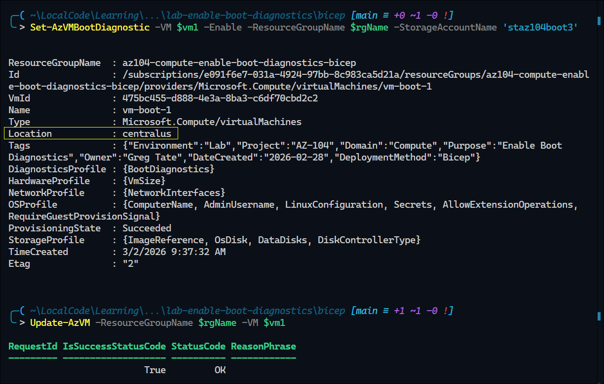

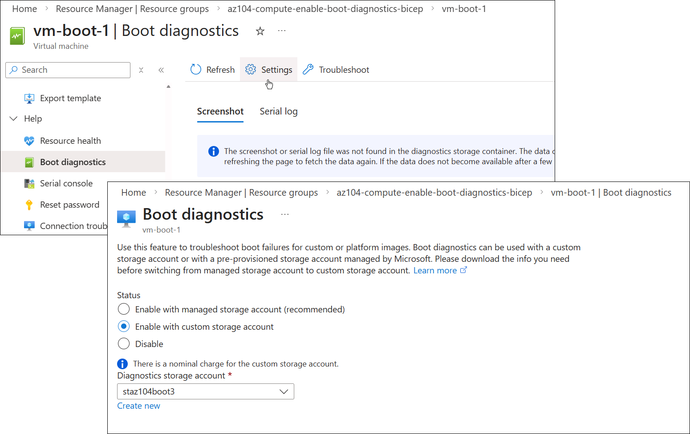

### Step 5: Enable Boot Diagnostics on vm-boot-2

```powershell
# vm-boot-2 is in East US — use staz104boot2 (Standard v1, East US)
Set-AzVMBootDiagnostic -VM $vm2 -Enable -ResourceGroupName $rgName -StorageAccountName 'staz104boot2'
Update-AzVM -ResourceGroupName $rgName -VM $vm2
```

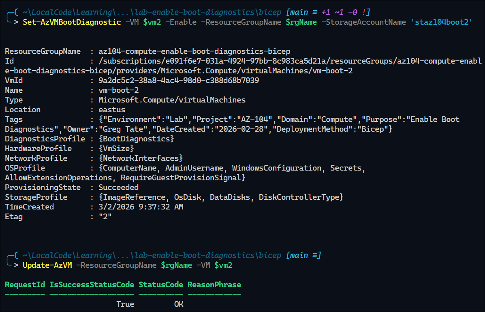

### Step 6: Verify Boot Diagnostics Configuration

```powershell
# Refresh VM objects and confirm boot diagnostics are enabled
$vm1 = Get-AzVM -ResourceGroupName $rgName -Name 'vm-boot-1'
$vm2 = Get-AzVM -ResourceGroupName $rgName -Name 'vm-boot-2'

$vm1.DiagnosticsProfile.BootDiagnostics.Enabled    # Expected: True
$vm1.DiagnosticsProfile.BootDiagnostics.StorageUri  # Expected: https://staz104boot3.blob.core.windows.net/

$vm2.DiagnosticsProfile.BootDiagnostics.Enabled    # Expected: True
$vm2.DiagnosticsProfile.BootDiagnostics.StorageUri  # Expected: https://staz104boot2.blob.core.windows.net/
```

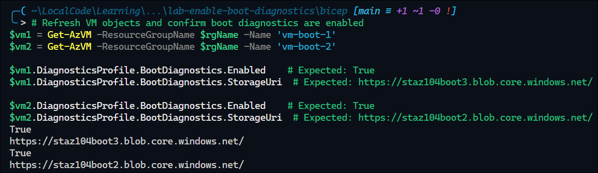

### Step 7: Generate New Boot Diagnostics Content

```powershell
# Trigger a reboot on both VMs to generate fresh boot screenshot and serial log entries
Restart-AzVM -ResourceGroupName $rgName -Name 'vm-boot-1' -NoWait
Restart-AzVM -ResourceGroupName $rgName -Name 'vm-boot-2' -NoWait

# Wait for both VMs to return to running state
do {
  Start-Sleep -Seconds 10
  $state1 = (Get-AzVM -ResourceGroupName $rgName -Name 'vm-boot-1' -Status).Statuses[-1].DisplayStatus
  $state2 = (Get-AzVM -ResourceGroupName $rgName -Name 'vm-boot-2' -Status).Statuses[-1].DisplayStatus
  "$state1 | $state2"
} while ($state1 -ne 'VM running' -or $state2 -ne 'VM running')
```

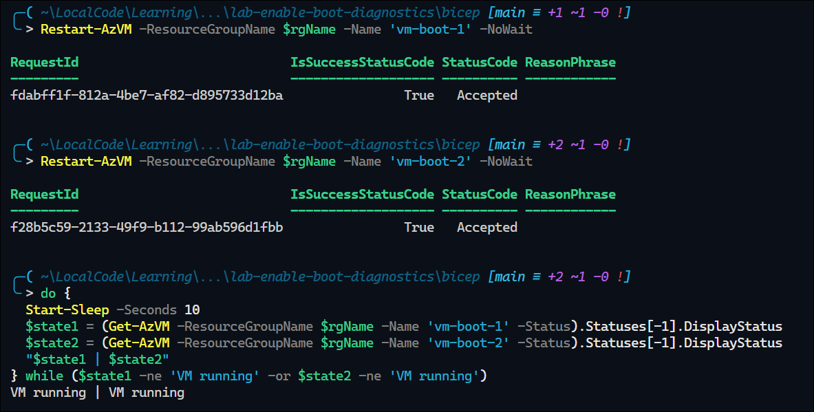

### Step 8: Retrieve and View Linux VM Boot Diagnostics Output (vm-boot-1)

```powershell
# Download Linux VM boot diagnostics artifacts to a local folder
$diagPath = Join-Path $PWD 'bootdiag-output'
New-Item -ItemType Directory -Path $diagPath -Force | Out-Null

# vm-boot-1 is Ubuntu, so use -Linux
$vm1Diag = Get-AzVMBootDiagnosticsData -ResourceGroupName $rgName -Name 'vm-boot-1' -Linux -LocalPath $diagPath

# List downloaded files for vm-boot-1
Get-ChildItem -Path $diagPath -Filter '*vm-boot-1*' | Format-Table Name, Length, LastWriteTime

# Display recent serial log lines for vm-boot-1
Get-ChildItem -Path $diagPath -Filter '*vm-boot-1*serial*.log' | ForEach-Object { Get-Content $_.FullName -Tail 40 }

# Open downloaded screenshot file for vm-boot-1
Get-ChildItem -Path $diagPath -Filter '*vm-boot-1*screen*.bmp' | Select-Object -First 1 | ForEach-Object { Start-Process $_.FullName }
```

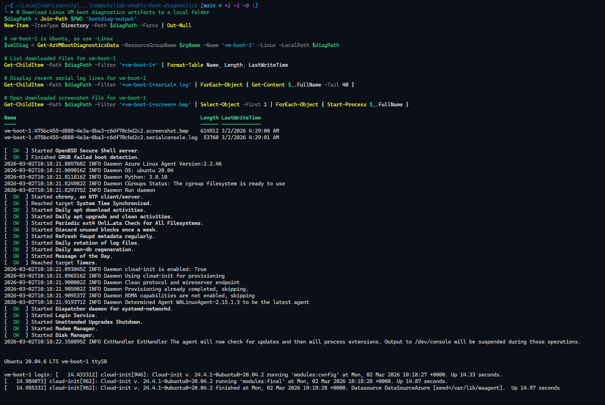

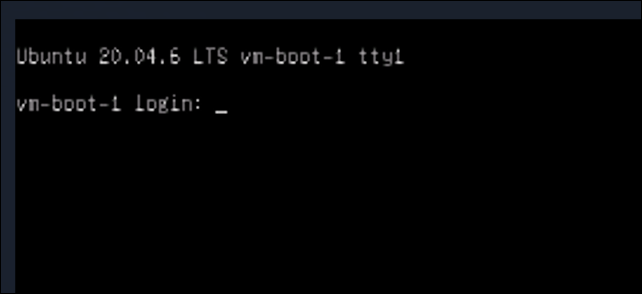

### Step 9: Retrieve and View Windows VM Boot Diagnostics Output (vm-boot-2)

```powershell
# Use the same output folder created in Step 8
$diagPath = Join-Path $PWD 'bootdiag-output'

# vm-boot-2 is Windows, so use -Windows (requires -LocalPath)
$vm2Diag = Get-AzVMBootDiagnosticsData -ResourceGroupName $rgName -Name 'vm-boot-2' -Windows -LocalPath $diagPath

# List downloaded files for vm-boot-2
Get-ChildItem -Path $diagPath -Filter '*vm-boot-2*' | Format-Table Name, Length, LastWriteTime

# Display recent serial log lines for vm-boot-2
Get-ChildItem -Path $diagPath -Filter '*vm-boot-2*serial*.log' | ForEach-Object { Get-Content $_.FullName -Tail 40 }

# Open downloaded screenshot file for vm-boot-2
Get-ChildItem -Path $diagPath -Filter '*vm-boot-2*screen*.bmp' | Select-Object -First 1 | ForEach-Object { Start-Process $_.FullName }
```

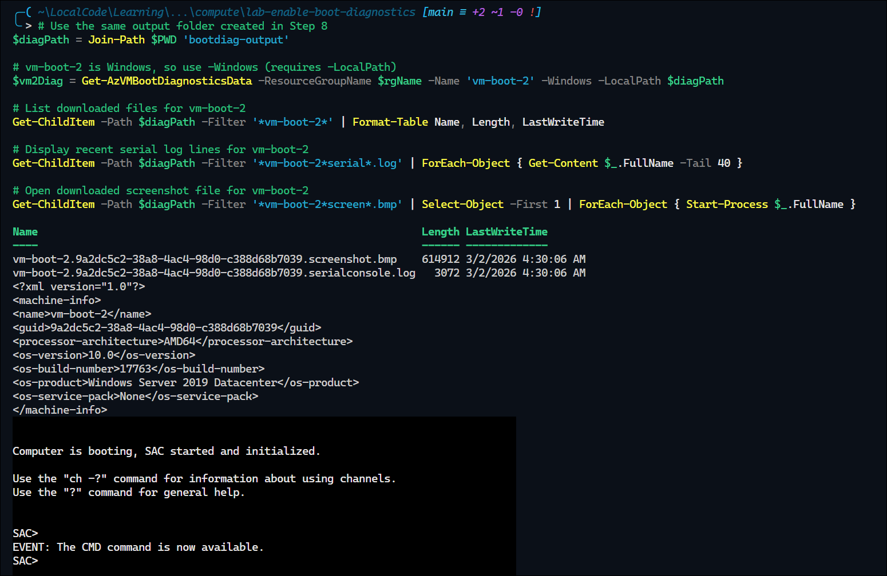

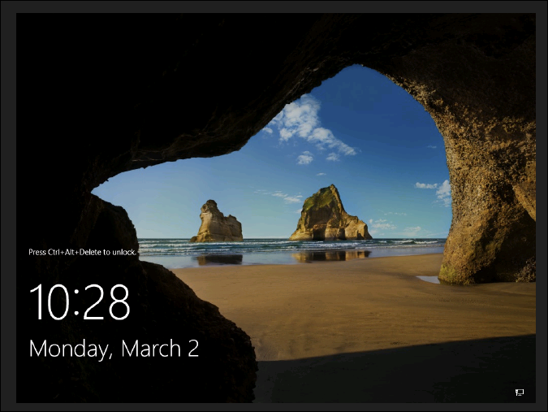

---

## Cleanup

```powershell
cd bicep
.\bicep.ps1 destroy
```

> Destroy within 7 days per governance policy. No soft-delete resources require purging in this lab.

---

## Scenario Analysis

### Correct Answers

| Blank | Correct Answer | Reasoning |
|-------|---------------|-----------|
| **[1]** | **storage3 only** | vm1 is in Central US. Boot diagnostics requires a standard (General Purpose) storage account in the same region as the VM. storage1 is Premium (not supported for boot diagnostics). storage2 is in East US (wrong region). Only storage3 (Standard v2, GRS, Central US) qualifies. |
| **[2]** | **storage2 only** | vm2 is in East US. Boot diagnostics requires a standard (General Purpose) storage account in the same region as the VM. storage1 is Premium and in Central US. storage3 is in Central US (wrong region). Only storage2 (Standard v1, LRS, East US) qualifies. |

### Why Other Options Are Incorrect

**For vm1 (Central US):**

- **storage1 only** — Premium storage accounts do not support boot diagnostics. Even though storage1 is in Central US (correct region), its Premium SKU disqualifies it.
- **storage1 or storage2 only** — Neither qualifies: storage1 is Premium, storage2 is in East US (wrong region).
- **storage1, storage2, or storage3** — Only storage3 is valid. storage1 is Premium and storage2 is in the wrong region.
- **storage2 only** — storage2 is in East US, not Central US. Boot diagnostics requires the storage account to be in the same region as the VM.
- **storage2 or storage3 only** — storage2 is in East US (wrong region for vm1). Only storage3 is valid.

**For vm2 (East US):**

- **storage1 only** — storage1 is Premium (not supported) and in Central US (wrong region).
- **storage1 or storage2 only** — storage1 is Premium and in the wrong region. Only storage2 qualifies from this pair, but the option implies both are valid.
- **storage1, storage2, or storage3** — Only storage2 is valid. storage1 is Premium/wrong region, storage3 is in the wrong region.
- **storage2 or storage3 only** — storage3 is in Central US (wrong region for vm2). Only storage2 is valid.
- **storage3 only** — storage3 is in Central US, not East US. Boot diagnostics requires the same region as the VM.

---

## Key Learning Points

1. **Boot diagnostics requires a standard (General Purpose) storage account** — Premium storage accounts do not support boot diagnostics. This includes Premium_LRS and Premium_ZRS SKUs.

2. **Storage account must be in the same region as the VM** — Boot diagnostics cannot use a storage account in a different Azure region, regardless of the storage account type or replication setting.

3. **Resource group boundaries do not matter** — A VM can use a boot diagnostics storage account from any resource group, as long as the region and SKU constraints are met.

4. **Both Storage v1 and v2 support boot diagnostics** — General Purpose v1 (`Storage`) and General Purpose v2 (`StorageV2`) accounts are both valid for boot diagnostics. The key disqualifier is the Premium tier, not the account generation.

5. **Replication type does not restrict boot diagnostics** — LRS, GRS, ZRS, and other replication types are all compatible with boot diagnostics. Replication is not a constraint in this scenario.

6. **Boot diagnostics stores serial console output and VM screenshots** — The storage account holds the screenshot and serial log files used for VM troubleshooting, visible in the Azure portal under VM > Boot diagnostics.

7. **Managed boot diagnostics is an alternative** — Azure supports managed boot diagnostics (no custom storage account needed), but the exam tests knowledge of custom storage account constraints.

---

## Related Objectives

- **Deploy and manage Azure compute resources**
  - Configure Azure Virtual Machines — VM diagnostics and monitoring settings
  - Manage VM operations — Boot diagnostics and serial console access
- **Implement and manage storage**
  - Configure storage accounts — Understand storage account types and capabilities (Premium vs. Standard, v1 vs. v2)

---

## Additional Resources

- [Boot Diagnostics Overview](https://learn.microsoft.com/azure/virtual-machines/boot-diagnostics)
- [Enable Boot Diagnostics on Azure VMs](https://learn.microsoft.com/azure/virtual-machines/boot-diagnostics#enable-boot-diagnostics-on-existing-virtual-machines)
- [Storage Account Overview](https://learn.microsoft.com/azure/storage/common/storage-account-overview)
- [General Purpose v1 vs. v2 Storage Accounts](https://learn.microsoft.com/azure/storage/common/storage-account-overview#types-of-storage-accounts)
- [Set-AzVMBootDiagnostic Reference](https://learn.microsoft.com/powershell/module/az.compute/set-azvmbootdiagnostic)
