# Configure KEDA Scaling Rule for Azure Container Apps

**Domain:** Deploy and Manage Azure Compute Resources
**Skill:** Provision and manage containers in the Azure portal
**Task:** Manage sizing and scaling for containers, including Azure Container Instances and Azure Container Apps

**Practice Exam Questions:**
- [Configure Scaling Rules in Azure Container Apps](../../../practice-questions/README.md#configure-scaling-rules-in-azure-container-apps)


## Exam Question

> **Exam**: AZ-104 — Compute

### Configure KEDA Scaling Rule for Azure Container Apps

*Yes / No*

You are an Azure Administrator for a company. Your company is using Azure Container Apps to run containerized applications. You are tasked with configuring scaling rules in Azure Container Apps.

You are using a custom Container Apps scaling rule based on any ScaledObject-based Kubernetes-based Event Driven Autoscaler (KEDA) scaler specification. The default scale rule is applied to your container application.

You have created the following scale rule in JSON as shown below:

```json
"minReplicas": 0,
"maxReplicas": 32,
"rules": [
    {
        "name": "azure-servicebus-queue-rule",
        "custom": {
            "type": "azure-servicebus",
            "metadata": {
                "queueName": "my-sample-queue",
                "namespace": "service-bus-namespace",
                "messageCount": "15"
            }
        }
    }
]
```

You need to implement the solution.

For each of the following statements, select Yes if the statement is true. Otherwise, select No.

| Statement | Yes | No |
|---|---|---|
| KEDA checks my-sample-queue once every 30 seconds. | ☐ | ☐ |
| If the queue length is > 15, KEDA scales the app by adding one new instance (aka replica). | ☐ | ☐ |
| The code snippet uses the TriggerAuthentication type for the authentication of objects. | ☐ | ☐ |

---

## Solution Architecture

This lab deploys an Azure Container Apps environment with a container app that uses a KEDA-based custom scaling rule to monitor an Azure Service Bus queue. The Container Apps Environment requires a Log Analytics workspace for platform logging, while the Service Bus namespace hosts the target queue (`my-sample-queue`) that drives KEDA-based autoscaling. The lab demonstrates how KEDA evaluates queue depth against the `messageCount` ratio to calculate the desired number of replicas, and clarifies common misconceptions about polling intervals and authentication configuration.

---

## Architecture Diagram

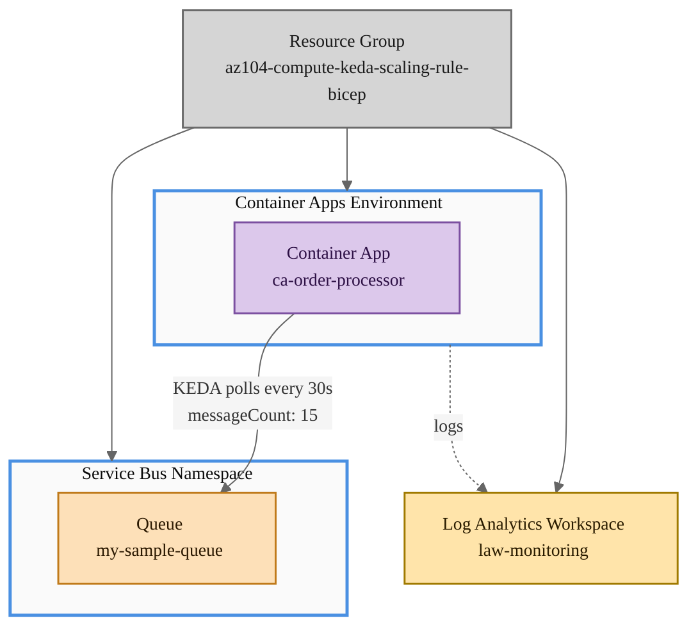

---

## Lab Objectives

1. Deploy an Azure Container Apps environment with a KEDA-based custom scaling rule targeting an Azure Service Bus queue
2. Understand KEDA's default polling interval (30 seconds) and how it checks queue depth
3. Observe how KEDA calculates desired replicas using the `messageCount` ratio (queue length ÷ messageCount), not a simple threshold
4. Verify that the scaling rule snippet does not include `TriggerAuthentication` for credential management
5. Send test messages to the Service Bus queue and observe container app replica scaling behavior

---

## Lab Structure

```
lab-keda-scaling-rule/
├── README.md
├── bicep/
│   ├── main.bicep
│   ├── main.bicepparam
│   ├── bicepconfig.json
│   ├── bicep.ps1
│   └── modules/
│       ├── container-apps.bicep
│       └── messaging.bicep
└── validation/
    └── validate-keda-scaling-rule.ps1
```

---

## Prerequisites

- Azure subscription with Contributor access
- Azure CLI installed and authenticated (`az login`)
- Bicep CLI installed (bundled with Azure CLI)
- PowerShell 7+ with Az module

---

## Deployment

```powershell
cd certs/AZ-104/hands-on-labs/compute/lab-keda-scaling-rule/bicep

# Validate syntax
.\bicep.ps1 validate

# Preview deployment
.\bicep.ps1 plan

# Deploy resources
.\bicep.ps1 apply
```

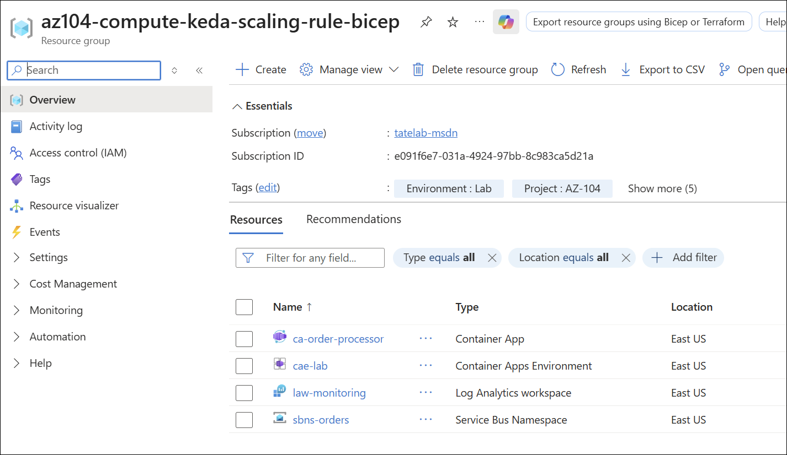

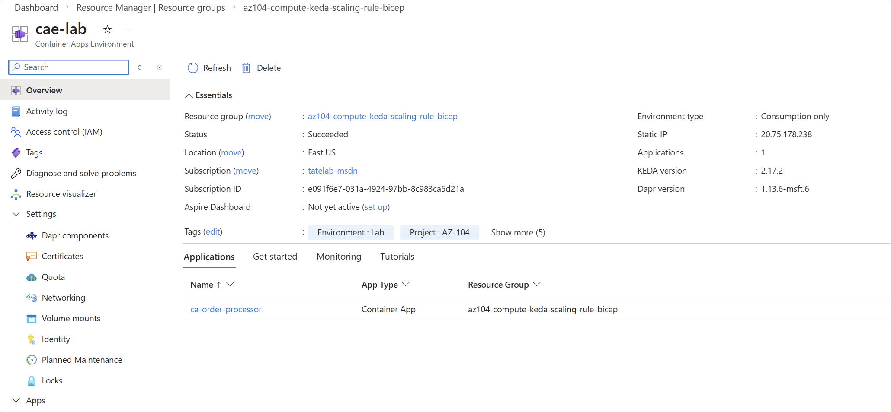

---

## Testing the Solution

### Step 1 — Verify Container App Deployment

```powershell
$rg = 'az104-compute-keda-scaling-rule-bicep'

# Verify the Container App exists and check scaling configuration
az containerapp show `
    --name ca-order-processor `
    --resource-group $rg `
    --query '{Name:name, MinReplicas:properties.template.scale.minReplicas, MaxReplicas:properties.template.scale.maxReplicas}' `
    -o table
# Expected: Name = ca-order-processor, MinReplicas = 0, MaxReplicas = 32
```

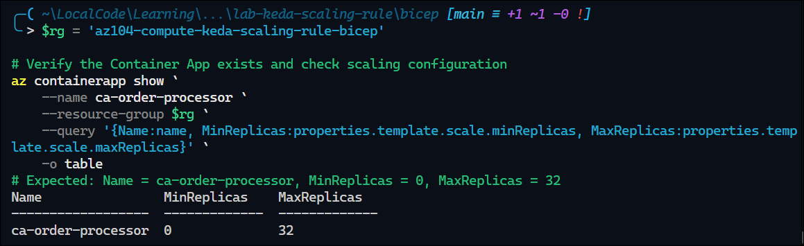

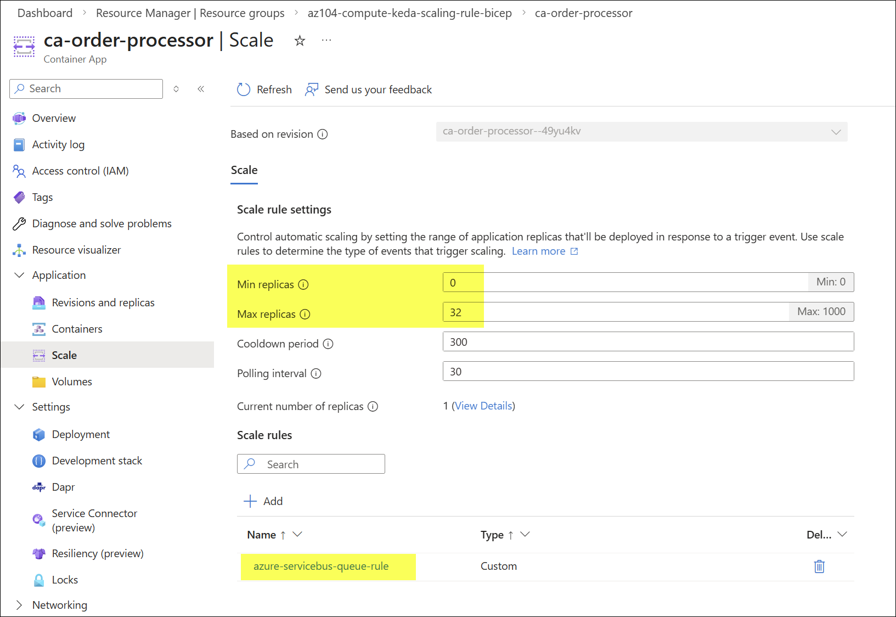

### Step 2 — Verify KEDA Scaling Rule Configuration

```powershell
# Check the scaling rules on the container app
az containerapp show `
    --name ca-order-processor `
    --resource-group $rg `
    --query 'properties.template.scale.rules[0]' `
    -o json
# Expected: name = "azure-servicebus-queue-rule", custom.type = "azure-servicebus", custom.metadata.messageCount = "15"
```

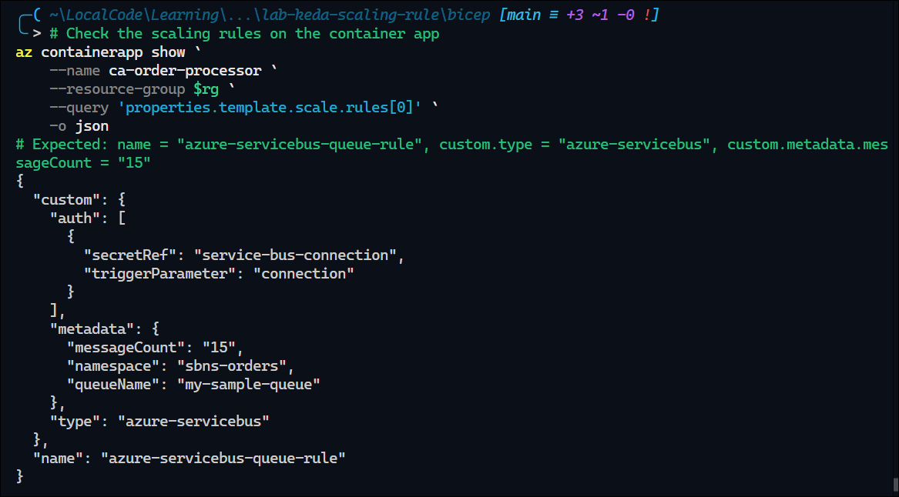

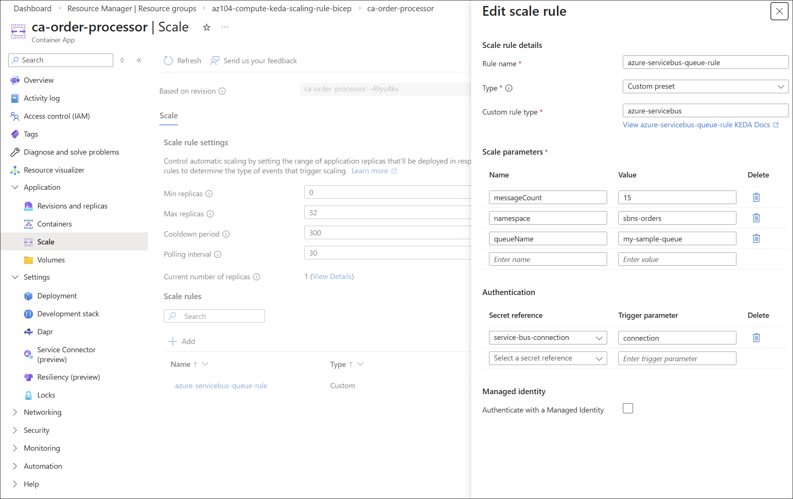

### Step 3 — Verify Service Bus Queue

```powershell
# Verify the Service Bus queue exists
az servicebus queue show `
    --namespace-name sbns-orders `
    --resource-group $rg `
    --name my-sample-queue `
    --query '{Name:name, Status:status}' `
    -o table
# Expected: Name = my-sample-queue, Status = Active
```

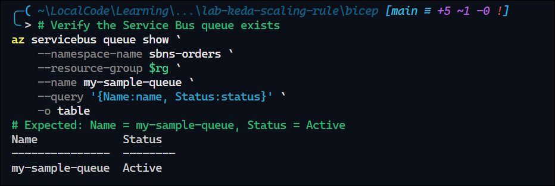

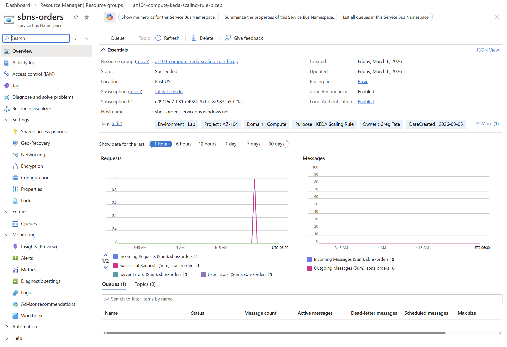

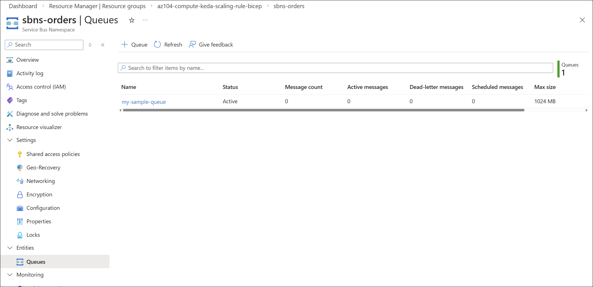

### Step 4 — Observe Scaling Behavior

Send test messages to `my-sample-queue` using the Azure Portal (Service Bus Explorer) or a Service Bus SDK client. After sending messages:

1. Send **15 messages** → wait 30–60 seconds → expect **1 replica** (⌈15 ÷ 15⌉ = 1)
2. Send **30 messages total** → wait 30–60 seconds → expect **2 replicas** (⌈30 ÷ 15⌉ = 2)
3. Drain the queue → wait 5+ minutes → expect **0 replicas** (scale-to-zero)

```powershell
# Check current replica count
az containerapp replica list `
    --name ca-order-processor `
    --resource-group $rg `
    --query "[] | length(@)"
```

Sent 50 messages in Service Bus Explorer:

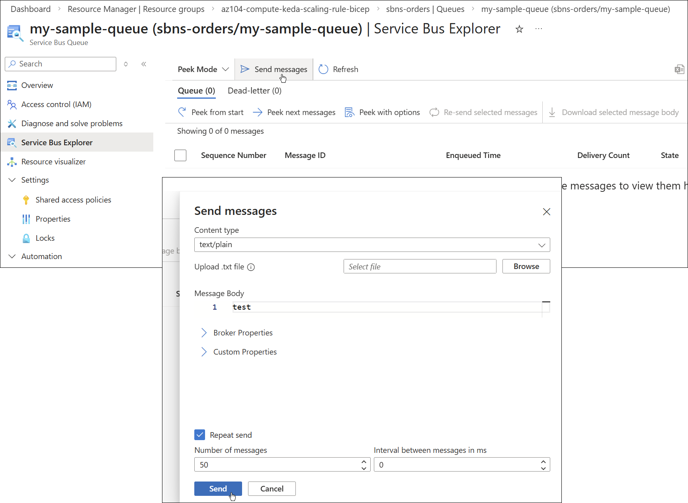

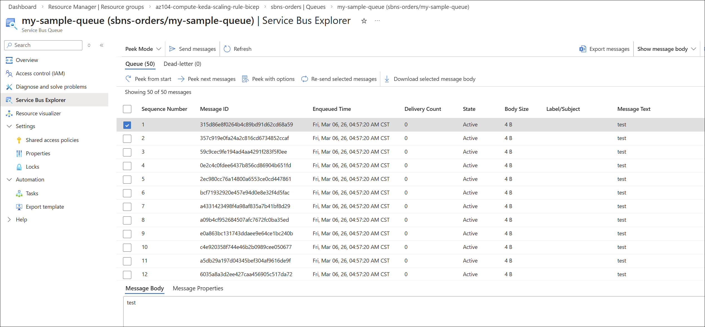

Observed 4 replicas after 30 seconds:

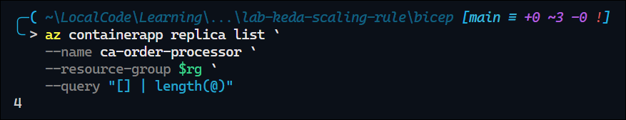

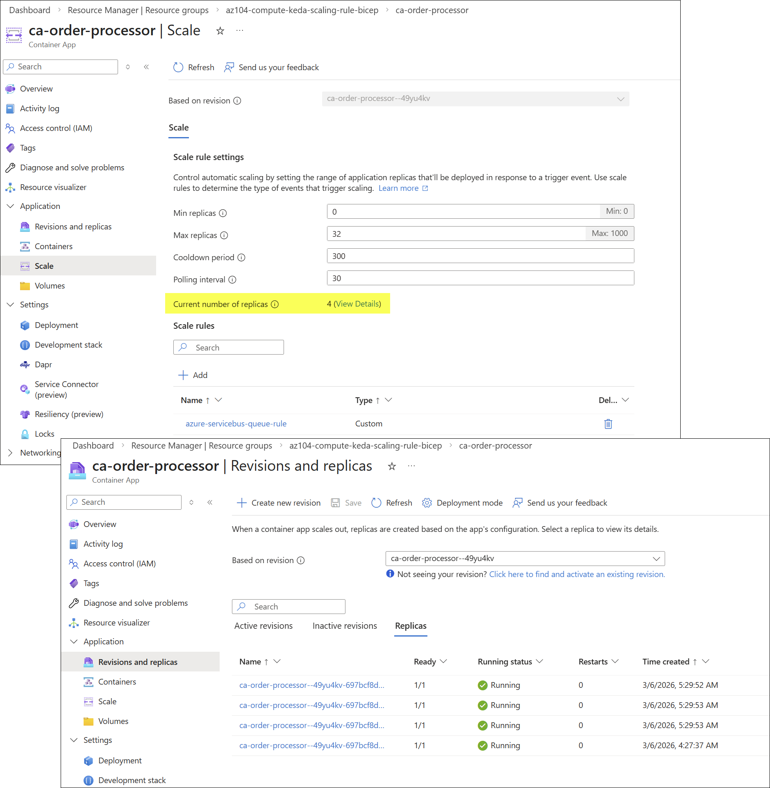

---

## Cleanup

```powershell
cd certs/AZ-104/hands-on-labs/compute/lab-keda-scaling-rule/bicep
.\bicep.ps1 destroy
```

> Destroy within 7 days per governance policy.

---

## Scenario Analysis

### Correct Answers

| Statement | Answer |
|---|---|
| KEDA checks my-sample-queue once every 30 seconds. | **Yes** |
| If the queue length is > 15, KEDA scales the app by adding one new instance (aka replica). | **No** |
| The code snippet uses the TriggerAuthentication type for the authentication of objects. | **No** |

### Statement 1: KEDA checks my-sample-queue once every 30 seconds — Yes

KEDA's default `pollingInterval` is **30 seconds**. Since the scaling rule in the code snippet does not override this value, KEDA checks the Azure Service Bus queue (`my-sample-queue`) for its current message count every 30 seconds. This is a built-in KEDA default that applies to all scalers unless explicitly configured otherwise in the `metadata` section.

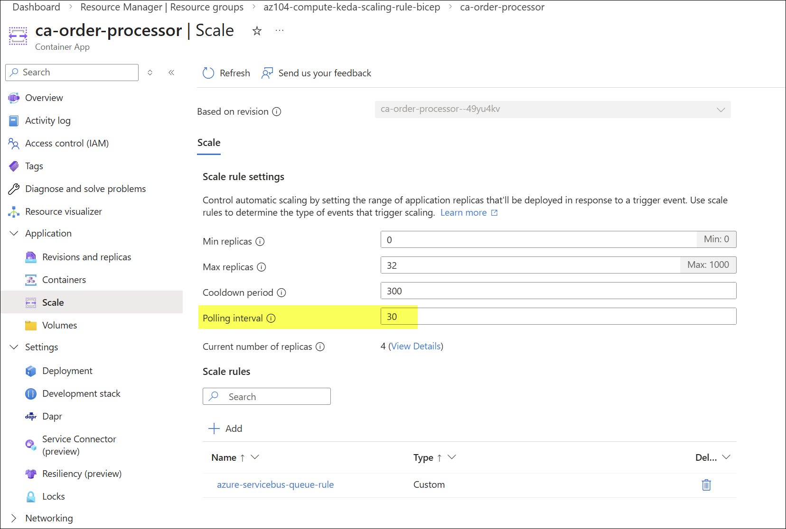

### Statement 2: If the queue length is > 15, KEDA scales the app by adding one new instance — No

The `messageCount` metadata value of `"15"` does **not** act as a simple threshold that adds one replica when exceeded. Instead, KEDA uses it as a **ratio** to calculate the desired number of replicas:

$$\text{Desired Replicas} = \left\lceil \frac{\text{Queue Length}}{\text{messageCount}} \right\rceil$$

For example:

| Queue Length | Calculation | Desired Replicas |
|---|---|---|
| 14 | ⌈14 ÷ 15⌉ | 1 |
| 15 | ⌈15 ÷ 15⌉ | 1 |
| 16 | ⌈16 ÷ 15⌉ | 2 |
| 30 | ⌈30 ÷ 15⌉ | 2 |
| 100 | ⌈100 ÷ 15⌉ | 7 |

KEDA performs **proportional scaling** — it calculates the total number of replicas needed to process all queued messages at the target rate, rather than incrementally adding one replica each time the threshold is exceeded.

<https://learn.microsoft.com/en-us/azure/container-apps/scale-app?pivots=azure-cli#scale-behavior>

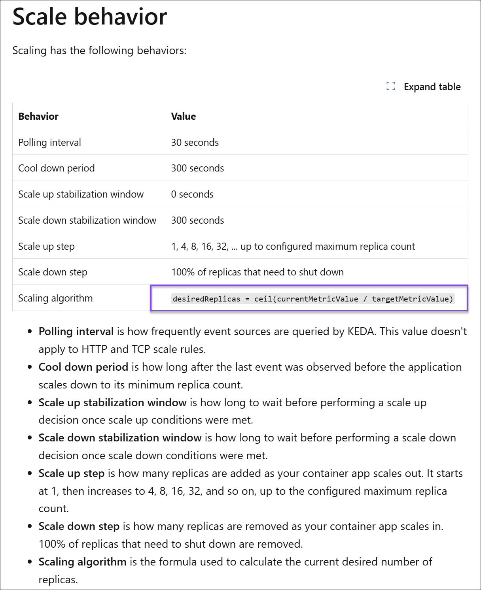

### Statement 3: The code snippet uses the TriggerAuthentication type — No

The code snippet does **not** include any authentication configuration. For KEDA to use `TriggerAuthentication`, the scaling rule would need an explicit `auth` section referencing a `TriggerAuthentication` object, such as:

```json
"auth": [
    {
        "triggerParameter": "connection",
        "secretRef": "service-bus-connection-string"
    }
]
```

The snippet only defines the scaler `type` and `metadata` — there is no `auth` property, no `secretTargetRef`, and no reference to a `TriggerAuthentication` resource. In Azure Container Apps, credential management for KEDA scalers is typically handled through Container App secrets referenced in an `auth` array — but this snippet omits that configuration entirely.

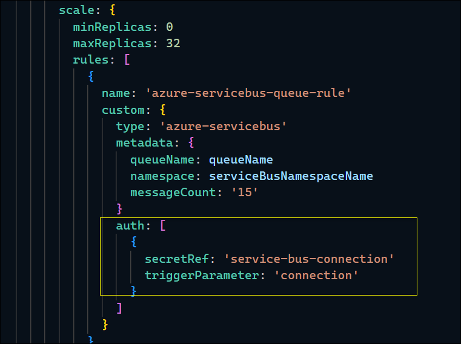

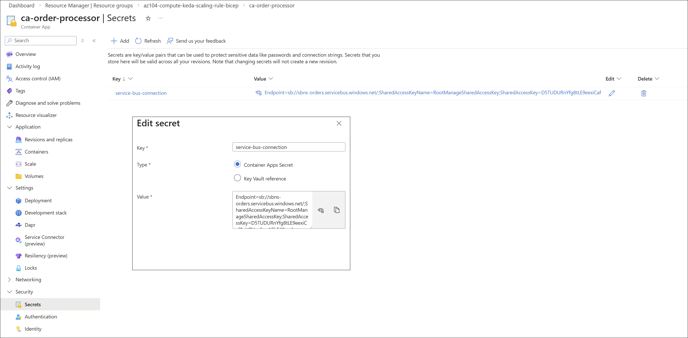

---

## Key Learning Points

1. **KEDA default polling interval is 30 seconds** — Unless overridden with `pollingInterval`, KEDA evaluates the trigger source every 30 seconds to determine whether scaling is needed
2. **messageCount is a ratio, not a threshold** — KEDA calculates desired replicas as ⌈queue length ÷ messageCount⌉, performing proportional scaling rather than incrementally adding one instance
3. **minReplicas: 0 enables scale-to-zero** — Container apps can scale down to zero replicas when the queue is empty, eliminating compute costs for idle workloads
4. **maxReplicas caps the upper bound** — Even if the ratio formula computes more replicas, KEDA will never exceed `maxReplicas` (32 in this scenario)
5. **TriggerAuthentication is a separate KEDA construct** — It must be explicitly referenced in an `auth` section of the scaling rule; without it, the scaler has no credential binding for accessing the trigger source
6. **Azure Container Apps supports any KEDA custom scaler** — Any ScaledObject-based KEDA scaler specification (Azure Service Bus, Kafka, Redis, PostgreSQL, etc.) can be used as a Container Apps scaling rule
7. **Connection string management matters in production** — KEDA scalers in Container Apps should use secrets and `auth` references rather than embedding credentials directly in metadata

---

## Related AZ-104 Objectives

- Deploy and manage Azure Container Apps
- Configure scaling rules and KEDA-based autoscaling for Azure Container Apps
- Monitor and manage compute resources in Azure

---

## Additional Resources

- [Set scaling rules in Azure Container Apps](https://learn.microsoft.com/azure/container-apps/scale-app)
- [KEDA Azure Service Bus scaler](https://keda.sh/docs/latest/scalers/azure-service-bus/)
- [Azure Container Apps overview](https://learn.microsoft.com/azure/container-apps/overview)
- [KEDA concepts and architecture](https://keda.sh/docs/latest/concepts/)
- [Azure Service Bus messaging overview](https://learn.microsoft.com/azure/service-bus-messaging/service-bus-messaging-overview)
