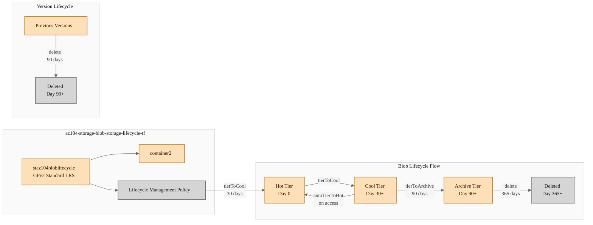

# Configure Blob Storage Lifecycle Management

**Domain:** Implement and Manage Storage
**Skill:** Configure Azure Files and Azure Blob Storage
**Task:** Configure blob lifecycle management

**Practice Exam Questions:**
- [Lifecycle Management Policy Configuration](../../../practice-questions/README.md#lifecycle-management-policy-configuration)
- [Configure Lifecycle Management Policy for Azure Storage](../../../practice-questions/README.md#configure-lifecycle-management-policy-for-azure-storage)


## Exam Question

> **Exam**: AZ-104 — Storage

### Configure Blob Storage Lifecycle Management

*Yes / No*

Your company implements block blob storage in a general-purpose version 2 (GPv2) storage account and uses the following rule to help optimize storage costs:

```json
{
  "rules": [
    {
      "enabled": true,
      "name": "myrule",
      "type": "Lifecycle",
      "definition": {
        "actions": {
          "version": {
            "delete": {
              "daysAfterCreationGreaterThan": 90
            }
          },
          "baseBlob": {
            "enableAutoTierToHotFromCool": true,
            "tierToCool": {
              "daysAfterModificationGreaterThan": 30
            },
            "tierToArchive": {
              "daysAfterModificationGreaterThan": 90
            },
            "delete": {
              "daysAfterModificationGreaterThan": 365
            }
          }
        },
        "filters": {
          "blobTypes": [
            "blockBlob"
          ],
          "prefixMatch": [
            "container2/myblob"
          ]
        }
      }
    }
  ]
}
```

You need to determine how blob storage is configured by this rule.

For each of the following statements, select Yes if the statement is true. Otherwise, select No.

| Statement | Yes | No |
|---|---|---|
| Previous blob versions are deleted automatically 90 days after creation. | ☐ | ☐ |
| Rehydrating a blob from archive with a Copy Blob operation resets the days after modification counter to zero. | ☐ | ☐ |
| You should transition blobs from cool to hot tier storage to optimize performance. | ☐ | ☐ |

---

## Solution Architecture

This lab deploys a GPv2 storage account with blob versioning enabled and a lifecycle management policy that automates tiering, archival, and deletion of block blobs. The lifecycle rule targets blobs under the `container2/myblob` prefix, transitioning base blobs from hot to cool after 30 days, to archive after 90 days, and deleting them after 365 days — while separately deleting previous versions after 90 days. Test blobs are uploaded to observe how lifecycle rules interact with versioning, rehydration via Copy Blob, and the `enableAutoTierToHotFromCool` setting.

---

## Architecture Diagram



---

## Lab Objectives

1. Deploy a GPv2 storage account with blob versioning enabled and a lifecycle management policy via Terraform.
2. Upload test blobs under the `container2/myblob` prefix and verify the lifecycle rule filter applies to them.
3. Examine the lifecycle management policy to confirm version deletion, tier transitions, and auto-tier settings.
4. Demonstrate that rehydrating a blob from archive using Copy Blob creates a new base blob with a reset last-modified timestamp.
5. Verify that `enableAutoTierToHotFromCool` handles cool-to-hot transitions automatically without manual intervention.

---

## Lab Structure

```
AZ-104/hands-on-labs/storage/lab-blob-storage-lifecycle/
├── README.md
├── terraform/
│   ├── main.tf
│   ├── variables.tf
│   ├── outputs.tf
│   ├── providers.tf
│   ├── terraform.tfvars
│   └── modules/
│       └── storage/
│           ├── main.tf
│           ├── variables.tf
│           └── outputs.tf
└── validation/
    └── Confirm-BlobStorageLifecycle.ps1
```

---

## Prerequisites

- Azure subscription with Contributor permissions
- Azure CLI installed and authenticated
- Terraform >= 1.0 installed
- PowerShell 7+ with Az module installed

---

## Deployment

### 1. Navigate to the Terraform directory

```powershell
cd certs/AZ-104/hands-on-labs/storage/lab-blob-storage-lifecycle/terraform
```

### 2. Validate and deploy

```powershell
Use-AzProfile Lab
Test-Path terraform.tfvars
terraform init
terraform validate
terraform fmt
terraform plan
```

### 3. Apply the configuration

```powershell
terraform apply -auto-approve
```

---

## Testing the Solution

### Step 1: Verify the storage account and lifecycle policy

```powershell
# Verify the storage account exists with correct configuration
$sa = Get-AzStorageAccount `
    -ResourceGroupName "az104-storage-blob-storage-lifecycle-tf" `
    -StorageAccountName "staz104bloblifecycle"

$sa.Kind
# Expected: StorageV2

$sa.Sku.Name
# Expected: Standard_LRS

$sa.EnableBlobVersioning
# Expected: True
```

### Step 2: Verify the lifecycle management policy

```powershell
# Retrieve the lifecycle management policy
$ctx = $sa.Context
$policy = Get-AzStorageAccountManagementPolicy `
    -ResourceGroupName "az104-storage-blob-storage-lifecycle-tf" `
    -StorageAccountName "staz104bloblifecycle"

$rule = $policy.Rules | Where-Object { $_.Name -eq "myrule" }

# Verify version deletion action
$rule.Definition.Actions.Version.Delete.DaysAfterCreationGreaterThan
# Expected: 90

# Verify base blob tier transitions
$rule.Definition.Actions.BaseBlob.TierToCool.DaysAfterModificationGreaterThan
# Expected: 30

$rule.Definition.Actions.BaseBlob.TierToArchive.DaysAfterModificationGreaterThan
# Expected: 90

$rule.Definition.Actions.BaseBlob.Delete.DaysAfterModificationGreaterThan
# Expected: 365

# Verify auto-tier setting
$rule.Definition.Actions.BaseBlob.EnableAutoTierToHotFromCool
# Expected: True

# Verify prefix filter
$rule.Definition.Filters.PrefixMatch
# Expected: container2/myblob
```

### Step 3: Upload a test blob and verify filter scope

```powershell
# Upload a test blob matching the prefix filter
$ctx = $sa.Context
$tempFile = New-TemporaryFile
Set-Content -Path $tempFile.FullName -Value "lifecycle test data"

Set-AzStorageBlobContent `
    -File $tempFile.FullName `
    -Container "container2" `
    -Blob "myblob/testfile.txt" `
    -Context $ctx `
    -Force

# Verify the blob exists
Get-AzStorageBlob -Container "container2" -Prefix "myblob/" -Context $ctx |
    Select-Object Name, AccessTier, LastModified, IsLatestVersion

# Clean up temp file
Remove-Item $tempFile.FullName
```

### Step 4: Demonstrate Copy Blob rehydration behavior

```powershell
# Note: Archive tier transition takes time via lifecycle policy.
# This step demonstrates the concept using a Copy Blob operation.
# When a blob is in archive, Copy Blob creates a NEW base blob with
# a new Last-Modified timestamp — effectively resetting the lifecycle counter.

# Upload another test blob for comparison
$tempFile2 = New-TemporaryFile
Set-Content -Path $tempFile2.FullName -Value "copy blob test"

Set-AzStorageBlobContent `
    -File $tempFile2.FullName `
    -Container "container2" `
    -Blob "myblob/copytest.txt" `
    -Context $ctx `
    -Force

# Record original last-modified time
$original = Get-AzStorageBlob -Container "container2" -Blob "myblob/copytest.txt" -Context $ctx
$original.LastModified

# Copy blob (simulating rehydration from archive)
Start-AzStorageBlobCopy `
    -SrcContainer "container2" `
    -SrcBlob "myblob/copytest.txt" `
    -DestContainer "container2" `
    -DestBlob "myblob/copytest-rehydrated.txt" `
    -Context $ctx `
    -DestContext $ctx

# Check the new blob's last-modified time
$rehydrated = Get-AzStorageBlob -Container "container2" -Blob "myblob/copytest-rehydrated.txt" -Context $ctx
$rehydrated.LastModified
# Expected: A new timestamp (later than $original.LastModified)
# This confirms Copy Blob resets the days-after-modification counter

Remove-Item $tempFile2.FullName
```

---

## Cleanup

> Destroy within 7 days per governance policy.

```powershell
cd certs/AZ-104/hands-on-labs/storage/lab-blob-storage-lifecycle/terraform
terraform destroy -auto-approve
```

---

## Scenario Analysis

### Correct Answers

| Statement | Answer |
|---|---|
| Previous blob versions are deleted automatically 90 days after creation. | **Yes** |
| Rehydrating a blob from archive with a Copy Blob operation resets the days after modification counter to zero. | **Yes** |
| You should transition blobs from cool to hot tier storage to optimize performance. | **No** |

### Statement 1: Previous blob versions are deleted automatically 90 days after creation — Yes

The lifecycle rule explicitly includes a `version` action with `"delete": { "daysAfterCreationGreaterThan": 90 }`. This means any previous blob version (created when the base blob is overwritten or modified while versioning is enabled) is automatically deleted 90 days after that version was created. Note that version actions use `daysAfterCreationGreaterThan` (creation time), not `daysAfterModificationGreaterThan` — versions are immutable snapshots and are never modified after creation.

### Statement 2: Rehydrating a blob from archive with a Copy Blob operation resets the days after modification counter — Yes

When you use **Copy Blob** to rehydrate a blob from archive tier, the operation creates a new destination blob with a new `Last-Modified` timestamp. This new blob starts with a fresh modification date, effectively resetting the lifecycle management counter to zero. In contrast, using **Set Blob Tier** to rehydrate in-place does *not* reset the `Last-Modified` timestamp — the blob retains its original modification date, and the lifecycle counter continues from where it was.

### Statement 3: You should transition blobs from cool to hot to optimize performance — No

This statement is incorrect for two reasons:

1. **Automatic handling**: The rule includes `"enableAutoTierToHotFromCool": true`, which means Azure automatically moves cool-tier blobs back to hot tier when they are accessed. There is no need for manual intervention — the platform handles cool-to-hot transitions on demand.

2. **Cost optimization, not performance**: Lifecycle management is a cost optimization feature. Hot and cool storage tiers have identical read/write latency and throughput — there is no performance benefit to manually moving blobs from cool to hot. The difference between tiers is economic: hot has lower access costs but higher storage costs, while cool has lower storage costs but higher access costs. The `enableAutoTierToHotFromCool` setting optimizes costs by automatically promoting frequently-accessed blobs back to the cheaper-to-access hot tier.

---

## Key Learning Points

1. **Lifecycle management actions** differentiate between base blob actions (`tierToCool`, `tierToArchive`, `delete`) and version actions (`delete`), each with their own age counters.
2. **Version deletion uses creation time** (`daysAfterCreationGreaterThan`), not modification time, because versions are immutable after creation.
3. **Base blob actions use modification time** (`daysAfterModificationGreaterThan`), which tracks the last time the blob content was written or modified.
4. **Copy Blob resets the modification counter** because it creates a new blob with a fresh `Last-Modified` timestamp — unlike Set Blob Tier which rehydrates in-place without changing the timestamp.
5. **`enableAutoTierToHotFromCool`** automatically promotes frequently-accessed blobs from cool back to hot tier, eliminating the need for manual tier transitions.
6. **Prefix filters** (`prefixMatch`) scope lifecycle rules to specific containers and blob name prefixes, allowing granular cost management policies.
7. **Lifecycle management is a cost optimization feature**, not a performance optimization feature — all blob access tiers (hot, cool) share the same read/write latency.

---

## Related Objectives

- AZ-104: Configure Azure Blob Storage — Manage the data lifecycle
- [AZ-104: Implement and manage storage — Configure blob lifecycle management](https://learn.microsoft.com/en-us/certifications/resources/study-guides/az-104#implement-and-manage-storage-15-20)

---

## Additional Resources

- [Azure Blob Storage access tiers](https://learn.microsoft.com/en-us/azure/storage/blobs/access-tiers-overview)
- [Manage the Azure Blob Storage lifecycle](https://learn.microsoft.com/en-us/azure/storage/blobs/lifecycle-management-overview)
- [Lifecycle management policy definition](https://learn.microsoft.com/en-us/azure/storage/blobs/lifecycle-management-policy-configure)
- [Blob rehydration from the archive tier](https://learn.microsoft.com/en-us/azure/storage/blobs/archive-rehydrate-overview)
- [Blob versioning](https://learn.microsoft.com/en-us/azure/storage/blobs/versioning-overview)
- [Terraform azurerm_storage_management_policy](https://registry.terraform.io/providers/hashicorp/azurerm/latest/docs/resources/storage_management_policy)
