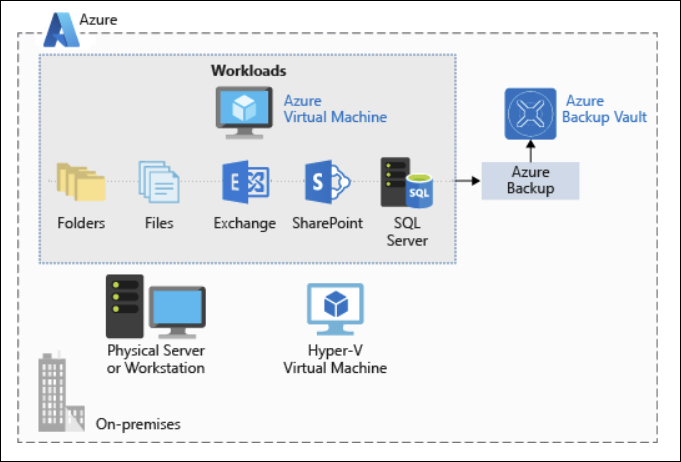
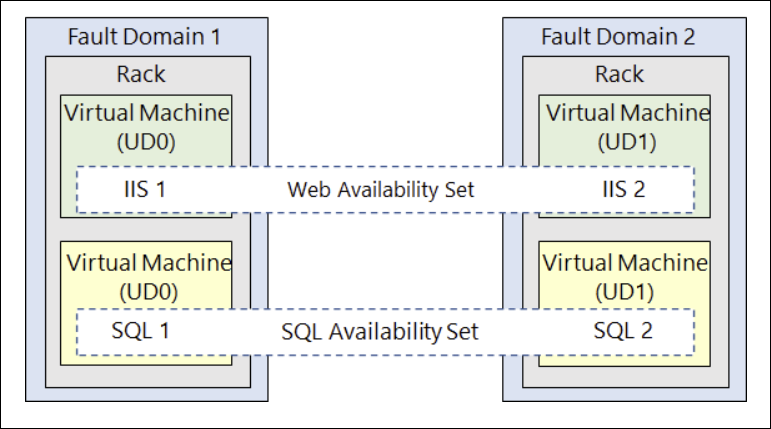
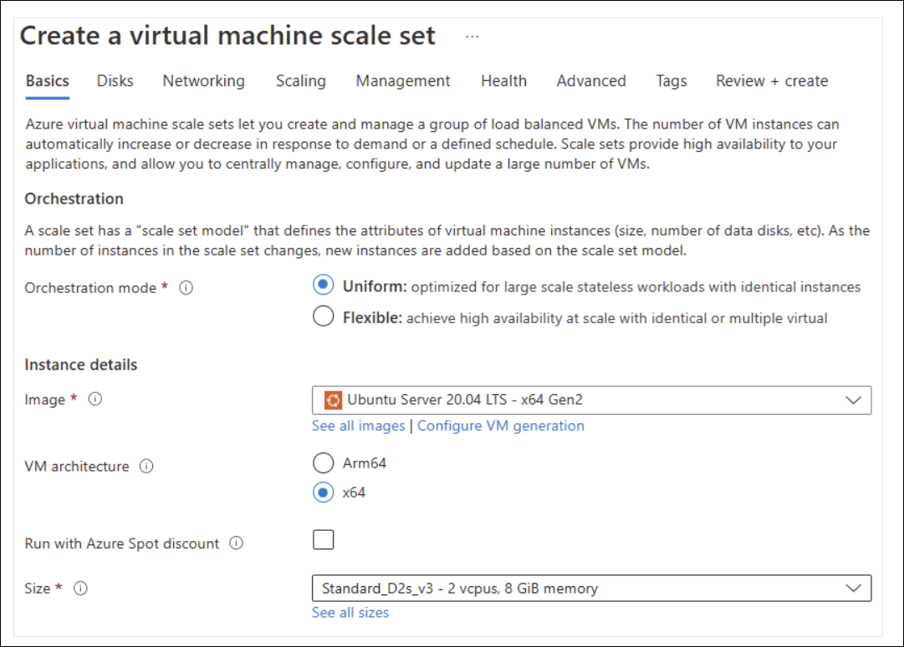
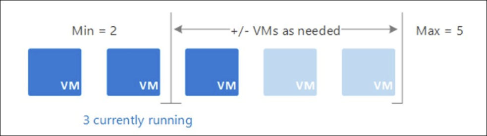
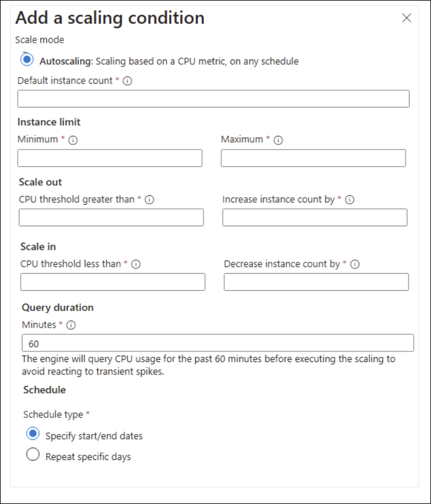
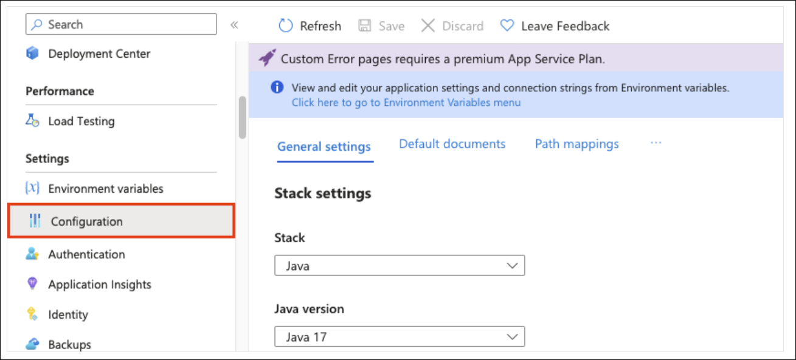
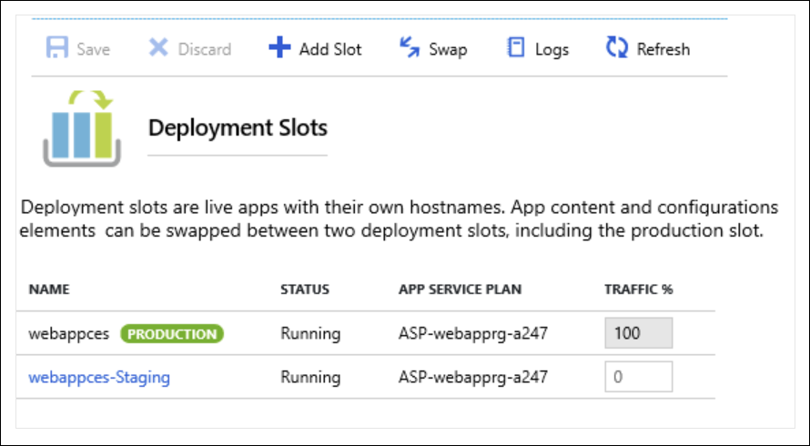
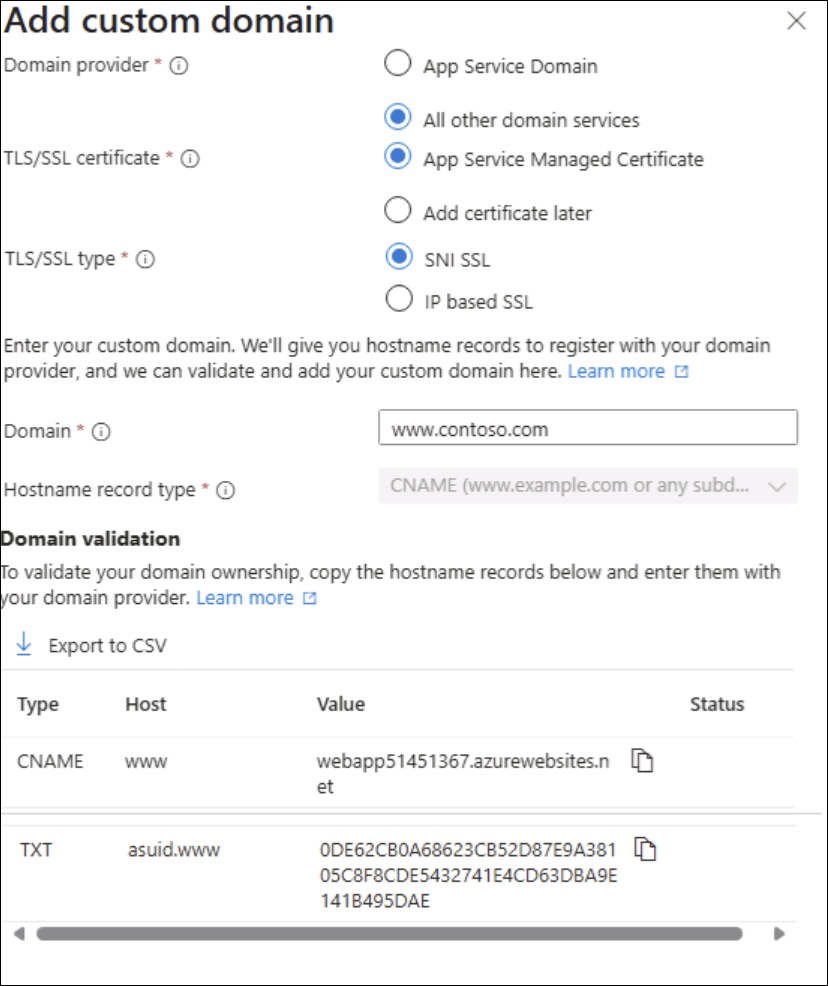

# Learning Path 3: Deploy and Manage Compute Resources

**Link:** [Microsoft Learn](https://learn.microsoft.com/en-us/training/paths/az-104-manage-compute-resources/)

* [Compile a checklist for creating an Azure Virtual Machine](#compile-a-checklist-for-creating-an-azure-virtual-machine)
* [Exercise - Create a VM using the Azure portal](#exercise---create-a-vm-using-the-azure-portal)
* [Describe the options available to create and manage an Azure Virtual Machine](#describe-the-options-available-to-create-and-manage-an-azure-virtual-machine)
* [Manage the availability of your Azure VMs](#manage-the-availability-of-your-azure-vms)
* [Back up your virtual machines](#back-up-your-virtual-machines)
* [Plan for maintenance and downtime](#plan-for-maintenance-and-downtime)
* [Create availability sets](#create-availability-sets)
* [Review update domains and fault domains](#review-update-domains-and-fault-domains)
* [Review availability zones](#review-availability-zones)
* [Compare vertical and horizontal scaling](#compare-vertical-and-horizontal-scaling)
* [Implement Azure Virtual Machine Scale Sets](#implement-azure-virtual-machine-scale-sets)
* [Create Virtual Machine Scale Sets](#create-virtual-machine-scale-sets)
* [Implement autoscale](#implement-autoscale)
* [Configure autoscale](#configure-autoscale)
* [Implement Azure App Service plans](#implement-azure-app-service-plans)
* [Determine Azure App Service plan pricing](#determine-azure-app-service-plan-pricing)
* [Scale up and scale out Azure App Service](#scale-up-and-scale-out-azure-app-service)
* [Configure Azure App Service autoscale](#configure-azure-app-service-autoscale)
* [Implement Azure App Service](#implement-azure-app-service)
* [Create an app with App Service](#create-an-app-with-app-service)
* [Explore continuous integration and deployment](#explore-continuous-integration-and-deployment)
* [Create deployment slots](#create-deployment-slots)
* [Add deployment slots](#add-deployment-slots)
* [Secure your App Service app](#secure-your-app-service-app)
* [Create custom domain names](#create-custom-domain-names)
* [Back up and restore your App Service app](#back-up-and-restore-your-app-service-app)
* [Use Azure Application Insights](#use-azure-application-insights)
* [Exercise: Implement Web Apps](#exercise-implement-web-apps)
* [Compare containers to virtual machines](#compare-containers-to-virtual-machines)
* [Review Azure Container Instances](#review-azure-container-instances)
* [Implement container groups](#implement-container-groups)
* [Review Azure Container Apps](#review-azure-container-apps)

---

<!-- omit in toc -->
## 📋 Modules

| # | Module | Status | Completed |
|---|--------|--------|-------|
| 1 | [Introduction to Azure virtual machines](https://learn.microsoft.com/en-us/training/modules/intro-to-azure-virtual-machines/) | ✅ | 1/23/26 |
| 2 | [Configure virtual machine availability](https://learn.microsoft.com/en-us/training/modules/configure-virtual-machine-availability/) | ✅ | 1/23/26 |
| 3 | [Configure Azure App Service plans](https://learn.microsoft.com/en-us/training/modules/configure-app-service-plans/) | ✅ | 1/24/26 |
| 4 | [Configure Azure App Service](https://learn.microsoft.com/en-us/training/modules/configure-azure-app-services/) | ✅ | 1/24/26 |
| 5 | [Configure Azure Container Instances](https://learn.microsoft.com/en-us/training/modules/configure-azure-container-instances/) | ✅ | 1/24/26 |

**Legend:** 🕒 Not Started | 🚧 In Progress | ✅ Complete

---

## Compile a checklist for creating an Azure Virtual Machine

[Module Reference](https://learn.microsoft.com/en-us/training/modules/intro-to-azure-virtual-machines/2-compile-a-checklist-for-creating-a-vm)

**What is an Azure resource?**

* An **Azure resource** is a manageable item in Azure
* An IaaS VM consists of multiple resources:

  * **Virtual machine**
  * **Disks** for storage
  * **Virtual network**
  * **Network interface**
  * **Network Security Group (NSG)**
  * **IP address** (public, private, or both)
* Azure can create these resources automatically or use existing ones
* Resource names are generated from the **VM name** if Azure creates them
* Consistent VM naming is important because names are difficult to change later

**Required resources checklist**

* **Virtual network**
* **VM name**
* **Location**
* **VM size**
* **Disks**
* **Operating system**

**Network planning**

* Network design should be planned **before** creating VMs
* Consider:

  * What the server communicates with
  * Which ports must be open
* **Virtual Networks (VNets)** provide private connectivity between:

  * Azure VMs
  * Azure services in the same VNet
* External access is blocked by default but can be enabled
* Network address spaces and subnets are difficult to change later
* Address spaces must **not overlap** with:

  * Other VNets
  * On-premises networks
* Common private IP ranges:

  * **10.0.0.0/8**
  * **172.16.0.0/12**
  * **192.168.0.0/16**

**Subnet design**

* Subnets segment the VNet into manageable sections
* Example segmentation:

  * **10.1.0.0** – VMs
  * **10.2.0.0** – Backend services
  * **10.3.0.0** – SQL Server VMs
* Azure reserves:

  * **First four IP addresses**
  * **Last IP address** in each subnet

**Network security**

* No default security boundary exists between subnets
* **Network Security Groups (NSGs)** control traffic:

  * Inbound and outbound
  * At subnet and NIC levels
* NSGs act as software firewalls with custom rules

**VM deployment planning**

* Inventory each on-premises server:

  * OS type
  * Disk space usage
  * Data sensitivity or legal restrictions
  * CPU, memory, and disk I/O usage
  * Burst or peak traffic patterns

**VM naming**

* VM name is used as:

  * Computer name in the OS
  * Azure resource name
* Name length limits:

  * **Linux**: up to **64 characters**
  * **Windows**: up to **15 characters**
* Recommended naming elements:

  * **Environment** (dev, prod, QA)
  * **Location** (eus, jw)
  * **Instance number** (01, 02)
  * **Product or service**
  * **Role** (web, sql, messaging)
* Example: **deveus-webvm01**

**Location selection**

* Azure regions group datacenters geographically
* Consider:

  * Proximity to users
  * Legal, compliance, or tax requirements
  * Hardware availability (varies by region)
  * Regional price differences

**VM size selection**

* VM size defines CPU, memory, and storage combinations
* Size choice directly affects cost
* Workload-based size categories:

  * **General purpose**
  * **Compute optimized**
  * **Memory optimized**
  * **Storage optimized**
  * **GPU**
  * **High performance compute**

**Resizing VMs**

* VM sizes can be changed if supported by hardware
* Resizing a running VM:

  * Causes an **automatic reboot**
  * Only allowed if size is available in the current cluster
* Stopping and deallocating a VM allows:

  * Any size available in the region
* Resizing production VMs can cause outages and IP changes

**VM components and billing**

* Default supporting resources:

  * Virtual network
  * NIC (no separate cost, limited by VM size)
  * Private and/or public IP address
  * NSG (no additional charge)
  * OS disk and local disk
* Local disk storage:

  * **No charge**
* OS disk:

  * Typically **127 GiB**
  * Charged at standard disk rates
* OS licenses:

  * Cost varies by VM size and core count
  * Can be reduced using **Azure Hybrid Benefit**

**Pricing model**

* Two cost categories:

  * **Compute**
  * **Storage**
* Compute costs:

  * Billed per minute
  * Charged only while VM is running
  * Linux is cheaper (no OS license)
* Compute payment options:

  * **Pay-as-you-go**
  * **Reserved Virtual Machine Instances** (1 or 3 years, up to **72% savings**)
* Storage costs:

  * Charged regardless of VM state
  * Continue even when VM is stopped/deallocated

**Storage for VMs**

* Every VM includes:

  * **OS disk**
  * **Temporary disk**
* Additional **data disks** recommended for application data
* Max data disks typically **2 per vCPU**
* Disk types:

  * **Ultra disks**
  * **Premium SSD v2 (preview)**
  * **Premium SSD**
  * **Standard SSD**
  * **Standard HDD**
* OS disk support:

  * Ultra disks and Premium SSD v2: **Not supported**
  * All others: **Supported**

**Operating system selection**

* Azure provides:

  * Windows and multiple Linux distributions
* OS choice affects compute pricing
* Marketplace images can include:

  * OS plus preconfigured software stacks
* Custom images:

  * Can be created and reused
  * Can be managed and replicated using **Azure Compute Gallery**

**Key Facts to Remember**

* VM names are hard to change — plan naming early
* VNets and address spaces are difficult to modify after deployment
* Azure reserves **5 IP addresses per subnet**
* Resizing a running VM causes a reboot
* Compute and storage are billed separately
* Storage charges apply even when VMs are stopped
* Disk type selection directly impacts performance and cost

---

## Exercise - Create a VM using the Azure portal

[Module Reference](https://learn.microsoft.com/training/modules/intro-to-azure-virtual-machines/)

**Purpose of the Exercise**

* Demonstrates how to create an Azure virtual machine using the **Azure portal**
* Shows a **browser-based** approach compared to command-line tools
* Exercise is **optional** and requires an **Azure subscription**
* Intended as a walkthrough, not a full explanation of all VM options

**Prerequisites and Notes**

* An **Azure subscription** is required to complete the exercise
* A **resource group** is required

  * You can use an existing resource group
  * Creating a new resource group makes cleanup easier
* Replace `myResourceGroupName` with your actual resource group name in all examples

**Options to Create and Manage Virtual Machines**

* Azure supports:

  * **Azure portal** (web-based UI)
  * **Command-line tools** (Linux, macOS, Windows)

**Azure Portal Overview**

* Browser-based interface for creating and managing Azure resources
* Supports:

  * Resource creation
  * Scaling compute resources
  * Cost monitoring
* Uses guided wizards, making it suitable for learning and exploration

**Steps to Create an Azure VM Using the Azure Portal**

* Sign in to the **Azure portal**
* On the home page:

  * Select **Create a resource**
  * Choose **Virtual machine**
* The **Create virtual machine** pane opens

**VM Configuration – Basics Tab**

* **Project details**

  * **Subscription**: Select your subscription
  * **Resource group**: Select `myResourceGroupName`
* **Instance details**

  * **Virtual machine name**: `test-ubuntu-cus-vm`
  * **Region**: Select a region close to you
  * **Availability options**: No infrastructure redundancy required
  * **Security type**: Standard
  * **Image**: Ubuntu Server 24.04 LTS – Gen2
  * **VM architecture**: x64
  * **Run with Azure Spot discount**: Unchecked
  * **Size**: Standard D2s V3
* **Administrator account**

  * **Authentication type**: SSH public key
  * **Username**: User-defined
  * **SSH public key source**: Generate a new key pair
  * **Key pair name**: `test-ubuntu-cus-vm_key`
* **Inbound port rules**

  * **Public inbound ports**: Allow selected ports
  * **Select inbound ports**: SSH (22)

**Validation and Deployment**

* Select **Review + create** to validate settings
* Azure performs configuration validation before deployment
* Errors are shown by tab and must be resolved before continuing
* Select **Create** to deploy the VM
* When prompted:

  * Select **Download private key and create resource**

**Monitoring Deployment**

* Deployment progress can be viewed in:

  * **Deployment details** on the Overview pane
  * **Notifications** pane (top-right toolbar icon)
* Deployment takes a few minutes
* A notification confirms successful deployment

**Post-Deployment**

* Select **Go to resource** to open the VM Overview page
* VM Overview displays:

  * Configuration details
  * **Public IP address**
* SSH access is available because SSH public key authentication was enabled

**Key Facts to Remember**

* **Azure portal** provides a guided, browser-based VM creation experience
* A **resource group is mandatory** for VM creation
* SSH (port 22) must be explicitly allowed for Linux VM access
* Azure validates VM settings before deployment
* A **private SSH key** must be downloaded when generated during VM creation
* VM deployment status is available via the **Notifications** pane

---

## Describe the options available to create and manage an Azure Virtual Machine

[Module Reference](https://learn.microsoft.com/training/modules/intro-to-azure-virtual-machines/)

**Overview**

* The **Azure portal** is the easiest way to create VMs when starting out.
* The portal is not efficient for creating or managing **many VMs at scale**.
* Azure provides multiple **automation, scripting, and programmatic options** to create and manage VMs.

**Ways to Create and Manage Azure Virtual Machines**

* **Azure Resource Manager (ARM) templates**
* **Azure CLI**
* **Azure PowerShell**
* **Terraform**
* **Azure REST API**
* **Azure Client SDKs**
* **Azure VM extensions**
* **Azure Automation services**
* **Auto-shutdown**

---

**Azure Resource Manager (ARM) Templates**

* JSON files that **define resources declaratively**
* Used to create **exact copies of VMs** and infrastructure
* Templates can be exported from an existing VM:

  * VM menu → **Automation** → **Export template**
* Templates are:

  * Easy to edit
  * Reusable
  * Parameterized (VM name, network name, storage account, etc.)
* Redeploying a modified template:

  * Updates existing resources to match the template
* Enables consistent environments (test, staging, production)


---

**Azure CLI**

* Cross-platform command-line tool (Windows, Linux, macOS, Cloud Shell)
* Used for **scripting and automation**
* Can be integrated with other languages (Python, Ruby)

**Command example – create a VM**

```bash
az vm create \
    --resource-group TestResourceGroup \
    --name test-wp1-eus-vm \
    --image Ubuntu2204 \
    --admin-username azureuser \
    --generate-ssh-keys
```

---

**Azure PowerShell**

* Best for:

  * One-off interactive tasks
  * Repeated automation
* Cross-platform
* Uses Azure-specific **cmdlets**

**Command example – create a VM**

```powershell
New-AzVm `
    -ResourceGroupName "TestResourceGroup" `
    -Name "test-wp1-eus-vm" `
    -Location "East US" `
    -Image Debian11 `
    -VirtualNetworkName "test-wp1-eus-network" `
    -SubnetName "default" `
    -SecurityGroupName "test-wp1-eus-nsg" `
    -PublicIpAddressName "test-wp1-eus-pubip" `
    -GenerateSshKey `
    -SshKeyName myPSKey `
    -OpenPorts 22
```

---

**Terraform**

* Infrastructure as Code (IaC) tool with an Azure provider
* Uses **HCL (HashiCorp Configuration Language)**
* Workflow:

  * Define infrastructure
  * Generate execution plan
  * Preview changes
  * Apply plan to deploy
* Supports repeatable, predictable deployments

---

**Programmatic Options (APIs)**

* Used for **complex scenarios** or integration into applications

**Azure REST API**

* Direct interaction using:

  * HTTP methods: **GET, PUT, POST, DELETE, PATCH**
* Azure Compute APIs provide VM management capabilities

**Azure Client SDKs**

* Higher-level abstraction over REST API
* Available for:

  * .NET (C#)
  * Java
  * Node.js
  * Python
  * PHP
  * Ruby
  * Go
* Simplifies VM creation and management in code

---

**Azure VM Extensions**

* Small applications that run **after VM deployment**
* Used to:

  * Install software
  * Apply configurations
  * Automate tasks
* Executed and monitored automatically

---

**Azure Automation Services**

* Used to reduce manual effort and operational errors

* Includes:

* **Process Automation**

  * Responds automatically to events or errors

* **Configuration Management**

  * Tracks OS and software updates
  * Supports integration with Microsoft Endpoint Configuration Manager

* **Update Management**

  * Assesses update status
  * Schedules patching
  * Reviews deployment results
  * Enabled per VM or via Automation account

---

**Auto-shutdown**

* Automatically shuts down VMs on a schedule
* Helps **reduce costs**
* Supports:

  * Daily or weekly schedules
  * Time zone configuration
* Configured from the VM blade in the portal under **Operations**

---

**Key Facts to Remember**

* **ARM templates** enable repeatable, parameterized VM deployments
* **Azure CLI and PowerShell** are primary scripting tools for VM management
* **Terraform** provides declarative, previewable infrastructure deployment
* **REST API and SDKs** are used for advanced, application-driven scenarios
* **VM extensions** configure VMs after deployment
* **Azure Automation** handles process, configuration, and update management
* **Auto-shutdown** reduces VM costs by enforcing scheduled shutdowns

---

## Manage the availability of your Azure VMs

[Module Reference](https://learn.microsoft.com/training/modules/manage-availability-azure-vms/)

**Availability**

* **Availability** is the **percentage of time a service is available for use**
* Customers often expect **100% availability**, especially for customer-facing services
* Azure provides built-in capabilities to help manage **availability, security, and monitoring**
* VM administration includes planning for **business continuity and disaster recovery (BCDR)**

**Why Availability Matters in Azure**

* Azure VMs run on **physical servers** in Azure datacenters
* If a **physical host fails**, all VMs on that host fail
* Azure automatically moves affected VMs to a **healthy host**, but:

  * Self-healing migrations can take **several minutes**
  * Applications may be **unavailable during migration**
* **Planned maintenance events** (software updates, hardware upgrades) may:

  * Occur without VM impact
  * Require **VM reboots** in some cases

**Availability Zones**

* An **Availability Zone** is a **physically separate zone** within an Azure region
* Supported regions have **three Availability Zones**
* Each zone has:

  * **Independent power**
  * **Independent networking**
  * **Independent cooling**
* Using **replicated VMs across zones**:

  * Protects against **datacenter-level failures**
  * Ensures apps and data remain available if one zone fails

**Virtual Machine Scale Sets**

* **VM Scale Sets** let you create and manage **load-balanced groups of VMs**
* VM instance count can:

  * **Automatically scale up or down**
  * Respond to **demand or schedules**
* Benefits:

  * **High availability**
  * Centralized **management, configuration, and updates**
* **No additional cost** for scale sets

  * You pay only for **VM instances**
* Deployment options:

  * **Multiple availability zones**
  * **Single availability zone**
  * **Regional**
* Availability zone options depend on the **orchestration mode**

**Load Balancer**

* **Azure Load Balancer** distributes traffic across multiple VMs
* Combining Load Balancer with:

  * **Availability Zones**
  * **Availability Sets**
  * Provides **maximum application resiliency**
* **Standard tier VMs** include Azure Load Balancer
* Not all VM tiers include Load Balancer support

**Azure Storage Redundancy**

* Azure Storage stores **multiple copies of data by default**
* Protects against:

  * Hardware failures
  * Network or power outages
  * Natural disasters
* Redundancy helps meet **availability and durability targets**
* Factors when choosing redundancy:

  * Replication method in the **primary region**
  * Whether data is replicated to a **secondary geographic region**
  * Whether **read access** is required in the secondary region during outages

**Failover Across Locations (Azure Site Recovery)**

* **Azure Site Recovery** replicates workloads from:

  * A **primary site**
  * To a **secondary location**
* If the primary site fails:

  * You can **fail over** to the secondary site
  * Users maintain **uninterrupted access**
* After recovery:

  * You can **fail back** to the primary site

**Business Advantages of Site Recovery**

* Eliminates the need to maintain a **secondary physical datacenter**
* Enables **non-disruptive failover testing** for recovery drills
* Supports **recovery plans** that can include:

  * Custom PowerShell scripts
  * Azure Automation runbooks
  * Manual intervention steps
* Works with:

  * Azure resources
  * Hyper-V
  * VMware
  * Physical on-premises servers
* Plays a central role in **BCDR strategy**
* Enables additional scenarios:

  * Azure migration
  * Temporary capacity bursts
  * Development and testing environments

**Key Facts to Remember**

* Availability is measured as a **percentage of uptime**
* Azure automatically heals VM failures, but **downtime can still occur**
* **Three Availability Zones** exist per supported Azure region
* Scale sets provide **automatic scaling and high availability**
* Azure Storage always maintains **multiple data copies**
* Azure Site Recovery handles **replication, failover, and recovery** across locations

---

## Back up your virtual machines

[Module Reference](https://learn.microsoft.com/training/modules/intro-to-azure-virtual-machines/backup-your-virtual-machines)

**Overview**

* Data backup and recovery is a required part of infrastructure planning.
* Backup supports recovery from accidental data loss, software bugs, or audit requirements.
* **Azure Backup** is a backup-as-a-service solution for physical and virtual machines.
* Protects workloads **on-premises and in the cloud**.



**Supported Backup Scenarios**

* **Files and folders** on Windows OS machines

  * Physical or virtual
  * On-premises or cloud
* **Application-aware snapshots** using **Volume Shadow Copy Service (VSS)**
* Microsoft server workloads:

  * **Microsoft SQL Server**
  * **Microsoft SharePoint**
  * **Microsoft Exchange**
* **Azure Virtual Machines**

  * Windows
  * Linux
* **Client machines**

  * Windows
  * Linux
  * Windows 10

**Advantages of Azure Backup**

* **Automatic storage management**

  * Storage is automatically allocated and managed.
  * Pay-as-you-use pricing model.
* **Unlimited scaling**

  * Uses Azure scalability for high availability.
* **Multiple storage options**

  * **Locally redundant storage (LRS)**: copies stored in the same region.
  * **Geo-redundant storage (GRS)**: data replicated to a secondary region.
* **Unlimited data transfer**

  * No inbound or outbound data transfer limits.
  * No charge for transferred data.
* **Data encryption**

  * Secure transmission and storage of backup data.
* **Application-consistent backups**

  * Recovery points contain all required data for restore.
* **Long-term retention**

  * No limit on how long backup data can be retained.

**Azure Backup Components**

* **Azure Backup agent**
* **System Center Data Protection Manager (DPM)**
* **Azure Backup Server**
* **Azure Backup VM extension**

**Recovery Services Vault**

* Backup data is stored in a **Recovery Services vault**.
* Vaults use **Azure Storage blobs** for efficient, low-cost long-term storage.
* After creating a vault:

  * Select machines to back up.
  * Define a **backup policy**:

    * Snapshot schedule
    * Retention duration

**Key Facts to Remember**

* Azure Backup supports **both on-premises and cloud** workloads.
* Backup storage uses **Azure Storage blobs**.
* **Unlimited scaling and data transfer** are built-in.
* **Application-consistent backups** are supported.
* **No retention time limit** for stored backups.

---

## Plan for maintenance and downtime

[Module Reference](https://learn.microsoft.com/training/modules/configure-virtual-machine-availability/plan-for-maintenance-and-downtime)

**Maintenance Planning Overview**

* Azure administrators must plan for **planned** and **unplanned** failures.
* An availability plan for Azure virtual machines should account for:

  * **Unplanned hardware maintenance**
  * **Unexpected downtime**
  * **Planned maintenance**

**Unplanned Hardware Maintenance**

* Occurs when Azure predicts an impending failure of hardware or platform components.
* Azure issues an **unplanned hardware maintenance event**.
* Azure uses **Live Migration** to move virtual machines to healthy hardware.
* Live Migration characteristics:

  * Preserves the virtual machine state.
  * Causes only a **short pause**.
  * Performance **may be reduced before or after** the event.

**Unexpected Downtime**

* Occurs when hardware or physical infrastructure fails unexpectedly.
* Examples include:

  * Local network failures
  * Local disk failures
  * Rack-level failures
* Azure automatically **heals** the virtual machine by migrating it to healthy hardware in the **same datacenter**.
* During healing:

  * Virtual machines experience **downtime (reboot)**.
  * There may be **loss of the temporary drive** in some cases.

**Planned Maintenance**

* Periodic updates performed by Microsoft.
* Purpose of planned maintenance:

  * Improve **reliability**
  * Improve **performance**
  * Improve **security** of the Azure platform infrastructure.
* Planned maintenance affects the **underlying host and hardware**, not the guest OS.

**Virtual Machine Update Responsibility**

* Microsoft **does not automatically update**:

  * Virtual machine operating systems
  * Software running inside virtual machines
* Customers have **full control and responsibility** for OS and application updates.
* Azure **does** periodically patch:

  * Underlying host software
  * Physical hardware

**Key Facts to Remember**

* **Live Migration** minimizes downtime during predicted hardware failures.
* **Unexpected downtime** can cause VM reboots and temporary disk loss.
* **Planned maintenance** targets Azure infrastructure, not guest operating systems.
* VM OS and application patching is **customer-managed**, not Microsoft-managed.

---

## Create availability sets

[Module Reference](https://learn.microsoft.com/training/modules/configure-virtual-machine-availability/create-availability-sets)

**Overview**

* An **availability set** is a logical grouping used to ensure related virtual machines are deployed together.
* Helps prevent a **single point of failure** from impacting all virtual machines.
* Ensures virtual machines are **not upgraded at the same time** during host OS upgrades in the datacenter.

**Characteristics of Availability Sets**

* All virtual machines should perform **identical functionalities**.
* All virtual machines should have the **same software installed**.
* Azure distributes virtual machines across:

  * Multiple **physical servers**
  * **Compute racks**
  * **Storage units**
  * **Network switches**
* If hardware or Azure software failures occur, **only a subset** of virtual machines is affected.
* Applications remain available during partial failures.
* A virtual machine and an availability set can be **created at the same time**.
* A virtual machine can be added to an availability set **only at creation time**.

  * To change the availability set, the virtual machine must be **deleted and recreated**.
* Availability sets can be created using:

  * Azure portal
  * Azure Resource Manager (ARM) templates
  * Scripting
  * API tools
* Azure provides **Service Level Agreements (SLAs)** for virtual machines in availability sets.

**Limitations**

* Availability sets **do not protect** against:

  * Operating system failures
  * Application-specific failures
* Additional **disaster recovery and backup solutions** are required for application-level protection.

**Design Considerations**

* **Redundancy**

  * Place multiple virtual machines in an availability set to achieve redundancy.
* **Separation of application tiers**

  * Each application tier should be placed in a **separate availability set**.
* **Load balancing**

  * Use Azure Load Balancer to distribute traffic across virtual machines in the availability set.
* **Managed disks**

  * Availability sets support **Azure managed disks** for block-level storage.

**Key Facts to Remember**

* Virtual machines can only join an availability set **at creation time**.
* Availability sets improve **infrastructure-level availability**, not application-level resilience.
* Separate availability sets should be used for **different application tiers**.
* Load balancing is required to achieve **high availability** across virtual machines.

---

## Review update domains and fault domains

[Module Reference](https://learn.microsoft.com/training/modules/availability-virtual-machines/)

**Azure Virtual Machine Availability Sets**

* Use **update domains** and **fault domains** to provide high availability and fault tolerance
* Each virtual machine in an availability set is assigned to:

  * **One update domain**
  * **One fault domain**

**Update Domains**

* An **update domain** is a group of nodes upgraded together during service updates
* Enables **incremental (rolling) upgrades** across a deployment
* Characteristics:

  * Contains virtual machines and associated physical hardware
  * VMs in the same update domain can be **updated and rebooted at the same time**
  * During **planned maintenance**, only **one update domain** is rebooted at a time
  * **Default**: **5 update domains** (not user-configurable)
  * **Maximum configurable**: **Up to 20 update domains**

**Fault Domains**

* A **fault domain** represents a **physical unit of failure**
* Typically maps to a **single server rack**
* Characteristics:

  * VMs in the same fault domain share common hardware components

    * Power
    * Networking switches
  * Protects against:

    * Hardware failures
    * Network outages
    * Power interruptions
    * Software updates
  * Uses **two fault domains** to distribute VMs and reduce single points of failure

**Fault Domain Distribution Scenario**

* Two fault domains with two virtual machines each
* Virtual machines are spread across **different availability sets**

  * **Web availability set**:

    * One VM in fault domain 1
    * One VM in fault domain 2
  * **SQL availability set**:

    * One VM in fault domain 1
    * One VM in fault domain 2
* Ensures availability even if a single fault domain fails



**Key Facts to Remember**

* **Each VM** in an availability set is placed in **one update domain and one fault domain**
* **Update domains** control **planned maintenance and upgrades**
* **Fault domains** protect against **physical infrastructure failures**
* **Default update domains**: **5**
* **Maximum update domains**: **20**
* **Minimum fault domains used**: **2**

---

## Review availability zones

[Module Reference](https://learn.microsoft.com/training/modules/configure-virtual-machine-availability/review-availability-zones)

**Availability Zones Overview**

* Availability zones are a **high-availability offering** that protect applications and data from **datacenter failures**.
* Applications achieve high availability by:

  * Colocating **compute, storage, networking, and data** resources within a zone
  * **Replicating resources across other zones**
* Distributing virtual machines across zones results in:

  * **Three fault domains**
  * **Three update domains**
* Azure ensures that virtual machines in different zones are **not updated at the same time**.

**Characteristics of Availability Zones**

* Availability zones are **unique physical locations** within an Azure region.
* Each zone consists of **one or more datacenters** with:

  * Independent **power**
  * Independent **cooling**
  * Independent **networking**
* Enabled regions have a **minimum of three separate zones**.
* Physical separation protects applications and data from **datacenter-level failures**.
* **Zone-redundant services** replicate data and applications across zones to avoid **single points of failure**.

**Availability Zone Service Categories**

* **Zonal services**

  * Resources are **pinned to a specific zone**
  * Examples:

    * Azure Virtual Machines
    * Azure managed disks
    * Standard IP addresses

* **Zone-redundant services**

  * Azure **automatically replicates** resources across all zones
  * Examples:

    * Zone-redundant Azure Storage
    * Azure SQL Database

**Architecture Consideration**

* For comprehensive business continuity, combine:

  * **Availability zones**
  * **Azure regional pairs**

**Key Facts to Remember**

* **Minimum zones per enabled region**: 3
* **Zonal services** are tied to a specific zone
* **Zone-redundant services** replicate automatically across zones
* Availability zones provide protection against **datacenter failures**

---

## Compare vertical and horizontal scaling

[Module Reference](https://learn.microsoft.com/training/modules/configure-virtual-machine-availability/compare-vertical-horizontal-scaling)

**Scalability Overview**

* **Scalability** allows a virtual machine to handle increased requests without degrading response time or throughput.
* Scaling adjusts capacity in proportion to available hardware resources.
* Two primary scaling approaches are **vertical scaling** and **horizontal scaling**.

**Vertical Scaling (Scale Up / Scale Down)**

* Involves **increasing or decreasing the size of a single virtual machine**.
* Makes a virtual machine more powerful (**scale up**) or less powerful (**scale down**).
* Useful when workloads fluctuate but do not require additional VM instances.

*Common scenarios:*

* Reduce VM size during periods of low utilization (for example, weekends) to **lower costs**.
* Increase VM size to support higher demand **without adding new virtual machines**.

**Horizontal Scaling (Scale Out / Scale In)**

* Involves **increasing or decreasing the number of virtual machine instances**.
* Adds instances to **scale out** or removes instances to **scale in**.
* Designed to support changing workloads by distributing demand across multiple VMs.

**Considerations for Vertical vs. Horizontal Scaling**

* **Limitations**

  * Vertical scaling is limited by available hardware sizes and regional availability.
  * Vertical scaling usually requires the VM to **stop and restart**, causing temporary service disruption.
  * Horizontal scaling generally has **fewer limitations**.

* **Flexibility**

  * Horizontal scaling is more flexible in cloud environments.
  * Can support **potentially thousands of virtual machines** to meet workload demands.

* **Reprovisioning**

  * Reprovisioning replaces an existing VM with a new one.
  * Availability planning should account for reprovisioning-related interruptions.
  * Any required data must be identified and **migrated** if reprovisioning occurs.

**Key Facts to Remember**

* **Vertical scaling** changes VM size; **horizontal scaling** changes VM count.
* Vertical scaling often requires downtime due to restart.
* Horizontal scaling offers greater flexibility and scale.
* Robust availability planning must consider **reprovisioning and data persistence**.

---

## Implement Azure Virtual Machine Scale Sets

[Module Reference](https://learn.microsoft.com/en-us/training/modules/configure-virtual-machine-availability/7-implement-scale-sets)

**Overview**

* **Azure Virtual Machine Scale Sets** are an Azure Compute resource used to deploy and manage a set of **identical virtual machines**.
* Configuring all virtual machines the same way enables **true autoscaling**.
* Scale sets **automatically increase** VM instances as demand rises and **decrease** instances as demand falls.
* Virtual machines **do not need to be pre-provisioned**, simplifying large-scale deployments.
* Suitable for **large-scale services**, **big compute**, **big data**, and **containerized workloads**.
* Scaling actions can be **manual**, **automated**, or a **combination** of both.

**Availability and Traffic Management**

* All virtual machine instances are created from the **same base operating system image and configuration**.
* Supports **Azure Load Balancer** for **layer-4 traffic distribution**.
* Supports **Azure Application Gateway** for **layer-7 traffic distribution** and **TLS/SSL termination**.
* Applications continue to be accessible if one VM instance fails, improving **availability**.

**Autoscaling Behavior**

* Automatically adjusts the number of virtual machine instances based on **customer demand**.
* Scaling responds to usage patterns that change throughout the **day or week**.

**Limits and Capacity**

* Supports **up to 1,000 virtual machine instances**.
* If using **custom virtual machine images**, the limit is **600 virtual machine instances**.

**Key Facts to Remember**

* **Identical configuration** across all VM instances enables simplified management.
* **Autoscaling** increases and decreases VM count automatically based on demand.
* **Azure Load Balancer** = layer 4; **Azure Application Gateway** = layer 7 with TLS/SSL.
* **Maximum instances**: 1,000 (600 with custom images).

---

## Create Virtual Machine Scale Sets

[Module Reference](https://learn.microsoft.com/training/modules/configure-virtual-machine-availability/create-virtual-machine-scale-sets)

**Overview**

* Azure Virtual Machine Scale Sets let you deploy and manage a group of virtual machines as a single resource.
* You specify the **number of VMs**, **VM size**, and preferences such as **Azure Spot instances**, **managed disks**, and **allocation policies**.
* Configuration is performed through the **Azure portal**.



**Orchestration Mode**

* **Flexible**

  * You manually create and add virtual machines.
  * VMs can have **any configuration** within the scale set.
* **Uniform**

  * You define a **single VM model**.
  * Azure automatically creates **identical VM instances** based on that model.

**Image**

* Select the **base operating system** or **application image** for the virtual machines.

**VM Architecture**

* **x64**

  * Provides the **highest software compatibility**.
* **Arm64**

  * Provides **up to 50% better price-performance** compared to similar x64 VMs.

**Size**

* Choose a VM size that matches workload requirements.
* VM size determines:

  * **CPU**
  * **Memory**
  * **Storage capacity**
* Azure charges **per hour** based on:

  * VM size
  * Operating system

**Advanced Settings – Spreading Algorithm**

* Determines how VMs are distributed across **fault domains**.
* **Max spreading**

  * VMs are spread across **as many fault domains as possible** in each zone.
  * Scale set **successfully deploys** even if fewer than five fault domains exist.
  * **Recommended by Microsoft**.
* **Fixed spreading**

  * VMs are spread across **exactly five fault domains**.
  * Deployment **fails** if fewer than five fault domains are available.

**Key Facts to Remember**

* **Uniform orchestration** creates identical VMs from a single model.
* **Flexible orchestration** allows mixed VM configurations.
* **Arm64 VMs** can deliver up to **50% better price-performance**.
* **Max spreading** is recommended to avoid deployment failures.
* VM pricing is **hourly** and depends on **size and OS**.

---

## Implement autoscale

[Module Reference](https://learn.microsoft.com/training/modules/configure-virtual-machine-availability/implement-autoscale)

**Overview**

* **Autoscaling** automatically increases or decreases the number of virtual machine instances in an **Azure Virtual Machine Scale Sets** implementation.
* Autoscaling dynamically adjusts capacity to meet changing workload demands.
* Helps maintain acceptable application performance while optimizing cost.



**Benefits of Autoscaling**

* Minimizes unnecessary virtual machine instances when demand is low.
* Automatically adds instances as demand grows to maintain performance.
* Reduces manual monitoring and operational overhead.

**Things to Consider When Using Autoscaling**

* **Automatic adjusted capacity**

  * Autoscale rules define acceptable performance thresholds.
  * When thresholds are met, autoscale rules adjust the number of VM instances automatically.

* **Scale out**

  * Used when application demand increases consistently.
  * Autoscale rules add virtual machine instances to handle sustained load increases.

* **Scale in**

  * Used when application demand decreases consistently (for example, evenings or weekends).
  * Autoscale rules remove virtual machine instances.
  * Reduces operational costs by running only the required number of instances.

* **Scheduled events**

  * Autoscaling can be configured to increase or decrease capacity at fixed, scheduled times.

* **Management overhead**

  * Autoscaling with Virtual Machine Scale Sets reduces the need for manual performance monitoring and optimization.

**Key Facts to Remember**

* Autoscaling applies to **Azure Virtual Machine Scale Sets**.
* Scaling actions are based on **defined rules and thresholds**.
* Supports both **scale out** (increase instances) and **scale in** (decrease instances).
* Can be triggered by **metrics** or **scheduled events**.
* Improves cost efficiency and application performance.

---

## Configure autoscale

[Module Reference](https://learn.microsoft.com/training/modules/configure-virtual-machine-availability/)

**Overview**

* When creating an **Azure Virtual Machine Scale Sets** implementation, you can enable **manual scaling** or **autoscaling**
* For optimal performance, define **minimum**, **maximum**, and **default** instance counts
* Scaling mode is selected during configuration in the Azure portal


**Scaling Modes**

* **Manually update the capacity**

  * Maintains a **fixed instance count**
  * Instance count range: **0–1000**
  * Configure a **scale-in policy** to determine deletion order

    * Example: balance across zones, then delete the VM with the **highest instance ID**

* **Autoscaling**

  * Automatically adjusts capacity
  * Can scale:

    * On a **schedule**
    * Based on **metrics**
  * You must specify the **maximum number of instances** allowed

**Autoscaling Configuration**

* Autoscaling operates based on a **scaling condition**



* **Default instance count**

  * Initial number of VMs deployed
  * Range: **0–1000**

* **Instance limit**

  * **Minimum** instance count for scale-in
  * **Maximum** instance count for scale-out

* **Scale out rule**

  * Triggered by **CPU usage percentage threshold**
  * Defines the **number of instances to add**

* **Scale in rule**

  * Triggered by **CPU usage percentage threshold**
  * Defines the **number of instances to remove**

* **Query duration**

  * Look-back period used by the autoscale engine
  * Allows metric values to **stabilize** before scaling decisions

* **Schedule**

  * Define **start and end dates**
  * Can repeat on **specific days**

**Key Facts to Remember**

* **Instance range**: 0–1000
* **Manual scaling** = fixed capacity
* **Autoscaling** supports metric-based and scheduled scaling
* **CPU percentage thresholds** control scale-in and scale-out
* **Query duration** stabilizes metrics before action

---

## Implement Azure App Service plans

[Module Reference](https://learn.microsoft.com/training/modules/configure-azure-app-service-plans/)

**What an App Service plan is**

* An **Azure App Service plan** defines the **compute resources** used by applications running in Azure App Service.
* Compute resources are analogous to a **server farm** in traditional web hosting.
* **One or more applications** can run on the **same App Service plan**.
* All apps in the plan share the **same compute resources**.

**Behavior of App Service plans**

* When an App Service plan is created in a **region**, Azure provisions compute resources **in that region**.
* Any application added to the plan runs on the plan’s defined compute resources.
* New applications can be added **as long as sufficient capacity remains**.

**App Service plan settings**

Each App Service plan defines:

* **Operating system**: Linux or Windows
* **Region**: The geographic location (for example, West US, Central India, North Europe)
* **Pricing tier**

  * Determines available App Service features
  * Determines cost
  * Available tiers depend on the selected operating system
* **Number of VM instances**

  * Determined by the plan
* **Size of VM instances**

  * Defined by **CPU**, **memory**, and **remote storage**

**Cost and resource considerations**

* **Cost savings**

  * You pay for the compute resources allocated to the plan
  * Multiple applications in one plan can reduce costs
* **Multiple applications in one plan**

  * Simplifies configuration and maintenance
  * Applications share the same VM instances
  * Requires careful resource and capacity management
* **Plan capacity**

  * Evaluate resource requirements before adding new applications
  * Ensure sufficient remaining capacity

**Important limitation**

* **Overloading an App Service plan can cause downtime** for both new and existing applications.

**Application isolation scenarios**

Create a **new App Service plan** when:

* The application is **resource-intensive**
* The application must **scale independently**
* The application requires resources in a **different geographic region**

**Key Facts to Remember**

* App Service plans define **shared compute resources** for one or more applications
* All apps in a plan share the **same VM instances**
* Pricing tier affects **features, scale, and cost**
* Overloading a plan risks **application downtime**
* Use separate plans for **isolation, scaling, or regional needs**

---

## Determine Azure App Service plan pricing

[Module Reference](https://learn.microsoft.com/training/modules/configure-azure-app-service-plans/)

**Overview**

* The **pricing tier** of an Azure App Service plan determines:

  * Available App Service **features**
  * **Cost** of the plan
* Example pricing tiers:

  * **Free**
  * **Shared**
  * **Basic**
  * **Standard**
  * **Premium**
  * **PremiumV2**
  * **PremiumV3**
  * **Isolated**
  * **IsolatedV2**

**How Apps Run and Scale in App Service Plans**

* An **App Service plan** is the **scale unit** for App Service applications
* All apps in the same plan:

  * Run on the **same VM instances**
  * **Scale together**
* If a plan has **five VM instances**, all apps run on all five instances
* Autoscale settings apply to **all apps** in the plan

**Pricing Tier Categories**

* **Shared compute**

  * Includes **Free** and **Shared**
  * Apps run on **shared Azure VMs** with other apps (including other customers)
  * **CPU quotas per app**
  * **No scale-out**
  * Intended for **development and testing only**

* **Dedicated compute**

  * Includes **Basic**, **Standard**, **Premium**, **PremiumV2**, **PremiumV3**
  * Apps run on **dedicated Azure VMs**
  * Compute resources are shared **only within the same App Service plan**
  * Higher tiers allow **more VM instances for scale-out**

* **Isolated**

  * Includes **Isolated** and **IsolatedV2**
  * Apps run on **dedicated VMs** in **dedicated virtual networks**
  * Provides **network isolation** and **compute isolation**
  * Offers the **maximum scale-out capability**

**Sample Plan Feature Comparison**

* **Free (F1)**

  * Usage: Development, Testing
  * Staging slots: N/A
  * Autoscale: N/A
  * Scale instances: N/A
  * Daily backups: N/A

* **Basic (B1)**

  * Usage: Development, Testing
  * Staging slots: N/A
  * Autoscale: Manual
  * Scale instances: **3**
  * Daily backups: N/A

* **Standard (S1)**

  * Usage: Production workloads
  * Staging slots: **5**
  * Autoscale: Rules
  * Scale instances: **10**
  * Daily backups: **10**

* **Premium (P1V3)**

  * Usage: Enhanced scale and performance
  * Staging slots: **20**
  * Autoscale: Rules, Elastic
  * Scale instances: **30**
  * Daily backups: **50**

**Free and Shared Plans**

* Run on **shared Azure virtual machines**
* Intended for **development and testing only**
* **No SLA**
* **Metered per application**

**Basic Plan**

* Designed for **low traffic** applications
* Does **not** include advanced autoscale or traffic management
* Pricing based on **VM size and instance count**
* Includes **built-in network load balancing**
* Linux runtime supports **Web App for Containers**

**Standard Plan**

* Designed for **production workloads**
* Pricing based on **VM size and instance count**
* Includes:

  * **Built-in load balancing**
  * **Autoscale** based on rules
* Linux runtime supports **Web App for Containers**

**Premium Plan**

* Designed for **enhanced performance** production applications
* Premium v2 features:

  * **Dv2-series VMs**
  * Faster processors
  * **SSD storage**
  * **Double memory-to-core ratio** vs Standard
* Supports **higher scale-out** than Standard
* Original Premium tier remains available for existing customers

**Isolated Plan**

* Designed for **mission-critical workloads**
* Runs in a **private, dedicated environment**
* Uses **App Service Environment**
* Features:

  * **Network isolation**
  * **Dv2-series VMs**
  * SSD storage
  * Double memory-to-core ratio vs Standard
* Can scale to **100 instances** (more available upon request)

**Selecting an App Service Plan**

* Selection criteria:

  * **Hardware requirements**

    * CPU
    * Memory
    * Number of instances
  * **Feature requirements**

    * Backups
    * Staging slots
    * Zone redundancy
* Azure portal steps:

  * Search for **App Service plans**
  * Create a new App Service plan
  * Select **Explore pricing plans**

**Key Facts to Remember**

* **App Service plan = scaling boundary** for all apps in the plan
* **Shared compute tiers** cannot scale out
* **Dedicated compute tiers** allow increasing VM instances
* **Isolated tiers** provide both **network and compute isolation**
* **Autoscale applies to all apps** in the same plan

---

## Scale up and scale out Azure App Service

[Module Reference]([URL](https://learn.microsoft.com/en-us/training/modules/configure-app-service-plans/4-scale-up-scale-out))

**Azure App Service Scaling Methods**

* Azure App Service plans and applications support **two scaling methods**: **scale up** and **scale out**
* Scaling can be performed **manually** or **automatically (autoscale)**

**Scale Up (Vertical Scaling)**

* Increases **CPU, memory, and disk space**
* Performed by **changing the pricing tier** of the App Service plan
* Unlocks additional features, including:

  * **Dedicated virtual machines**
  * **Custom domains and certificates**
  * **Deployment (staging) slots**
  * **Autoscaling**
* App Service plans can be **scaled up or down at any time**

**Scale Out (Horizontal Scaling)**

* Increases the **number of virtual machine instances** running the application
* Maximum instance count depends on the **App Service plan pricing tier**
* **Isolated tier (App Service Environment)** supports up to **100 instances**
* Instance count can be configured:

  * **Manually**
  * **Automatically using autoscale**

**Autoscale**

* Applies to the **scale-out method**
* Automatically adjusts the **instance count**
* Based on:

  * **Predefined rules**
  * **Schedules**
* Helps maintain performance during high load and reduce costs during low load

**Scaling Considerations**

* **Manual tier adjustment**

  * Start with a **lower pricing tier**
  * Scale up only when additional features are required
  * Scale down when features are no longer needed to **reduce costs**
* **Progressive scaling scenario**

  * Free tier → Shared tier (custom DNS)
  * Shared tier → Basic tier (SSL binding)
  * Basic tier → Standard tier (staging slots)
  * Scale within the same tier for **more cores, memory, or storage**
* **No redeployment required**

  * Scaling does **not require code changes**
  * Scale changes apply in **seconds**
  * All apps in the App Service plan are affected
* **Independent scaling of dependent services**

  * Azure App Service plans **do not manage scaling** for dependent services
  * Services like **Azure SQL Database** or **Azure Storage** must be scaled separately

**Key Facts to Remember**

* **Scale up** = change pricing tier to gain more resources and features
* **Scale out** = increase number of VM instances
* **Autoscale** applies only to scale out
* **Isolated tier** supports up to **100 instances**
* Scaling does **not require redeployment**
* App Service plan scaling affects **all apps in the plan**

---

## Configure Azure App Service autoscale

[Module Reference](https://learn.microsoft.com/training/modules/configure-azure-app-service-plans/)

**Autoscale Overview**

* **Autoscale** adjusts resources automatically to handle application load.
* Supports **scaling out** to handle increased load and **scaling in** to reduce cost during idle periods.
* Uses **rules and conditions** to control scaling behavior.

**Autoscale Configuration Basics**

* Define a **minimum** and **maximum** number of instances.
* The autoscale engine automatically adjusts the number of **virtual machine instances** based on defined rules.
* When rule conditions are met, one or more **autoscale actions** are triggered.


**Autoscale Settings and Profiles**

* An **autoscale setting** determines whether to scale in or scale out.
* Autoscale settings are grouped into **profiles**.
* Each profile contains one or more autoscale rules.

**Autoscale Rules**

* Autoscale rules consist of:

  * A **trigger**
  * A **scale action** (scale in or scale out)
* Triggers can be:

  * **Metric-based**

    * Scale based on measured load.
    * Example metrics:

      * **CPU time**
      * **Average response time**
      * **Requests**
    * Example condition: scale when **CPU usage > 50%**
  * **Time-based (schedule-based)**

    * Scale based on predictable time patterns.
    * Example: trigger an action at **8:00 AM on Saturday** in a specific time zone.

**Notifications**

* The autoscale engine uses **notification settings**.
* Notifications are triggered when autoscale events occur.
* Notifications can:

  * Send emails to **one or more email addresses**
  * Call **one or more webhooks**

**Configuration Considerations**

* **Minimum instance count**

  * Ensures the application remains running even with no load.
* **Maximum instance count**

  * Limits total possible **hourly cost**.
* **Adequate scale margin**

  * Minimum and maximum values must be different.
  * Autoscale operates between these values using rules.
* **Scale rule combinations**

  * Always configure both **scale-out** and **scale-in** rules.
  * Missing scale-out rules can cause performance degradation.
  * Missing scale-in rules can lead to unnecessary costs.
* **Metric statistics**

  * Choose the correct statistic:

    * **Average**
    * **Minimum**
    * **Maximum**
    * **Total**
* **Default instance count**

  * Used when metrics are unavailable.
  * Should be a **safe and stable** value.
* **Notifications**

  * Should always be enabled to monitor application behavior during load changes.

**Key Facts to Remember**

* Autoscale uses **profiles**, **rules**, and **conditions**.
* Rules always include a **trigger** and a **scale action**.
* Triggers can be **metric-based** or **time-based**.
* Always configure **minimum, maximum, and default** instance counts.
* Both **scale-out and scale-in rules** are required for effective autoscale.
* Notifications support **email and webhook** targets.

---

## Implement Azure App Service

[Module Reference](https://learn.microsoft.com/en-us/training/modules/configure-azure-app-services/2-implement)

**Overview**

* **Azure App Service** enables building **websites, mobile backends, and web APIs** for any platform or device.
* Applications **run and scale** in both **Windows** and **Linux-based** environments.
* Provides **Quickstarts** for common programming languages.

**Supported Languages**

* **ASP.NET**
* **Java**
* **Node.js**
* **Python**
* **PHP**

**App Service Benefits**

* **Multiple languages and frameworks**

  * First-class support for **ASP.NET, Java, Node.js, PHP, and Python**
  * Supports **PowerShell** and other scripts or executables as background services

* **DevOps optimization**

  * Continuous integration and deployment with:

    * **Azure DevOps**
    * **GitHub**
    * **BitBucket**
    * **Docker Hub**
    * **Azure Container Registry**
  * Support for **test and staging environments**
  * App management via **Azure PowerShell** or **cross-platform CLI**

* **Global scale with high availability**

  * Scale **up or out**, **manually or automatically**
  * Host apps in **Microsoft global datacenter infrastructure**
  * App Service **SLA provides high availability**

* **Security and compliance**

  * Compliant with **ISO**, **SOC**, and **PCI**
  * Authentication using:

    * **Microsoft Entra ID**
    * Social logins (**Google, Facebook, Twitter, Microsoft**)
  * Supports **IP address restrictions**
  * Supports **managed service identities**

* **Application templates**

  * Templates available from **Azure Marketplace**
  * Examples: **WordPress, Joomla, Drupal**

* **Visual Studio integration**

  * Dedicated tools for **creating, deploying, and debugging** applications

* **API and mobile features**

  * Built-in **CORS** support for RESTful APIs
  * Mobile features include:

    * Authentication
    * Offline data sync
    * Push notifications

**Key Facts to Remember**

* **App Service supports Windows and Linux**
* **Automatic and manual scaling are both supported**
* **Integrated CI/CD with multiple DevOps platforms**
* **Built-in security, compliance, and authentication options**
* **Marketplace templates simplify app deployment**

---

## Create an app with App Service

[Module Reference](https://learn.microsoft.com/training/modules/create-app-service-app/)

**App Service App Types**

* Azure App Service supports **Web Apps**, **Mobile Apps**, and **API Apps**
* Apps are created and managed through the **Azure portal**

**Basic Configuration Settings**

* **Name**

  * Must be **globally unique**
  * Used to identify and locate the app in Azure
  * Default format: `appname.azurewebsites.net`
  * Can be mapped to a **custom domain**
* **Publish**

  * Determines how the app is hosted
  * Options:

    * **Code**
    * **Docker Container**
* **Runtime stack**

  * Defines the language and SDK used to run the app
  * Supported stacks:

    * **.NET Core**
    * **.NET Framework**
    * **Node.js**
    * **PHP**
    * **Python**
    * **Ruby**
  * Multiple versions available for **Linux** and **Windows**
  * For Linux and custom containers, an **optional startup command or file** can be configured
* **Operating system**

  * App runtime OS options:

    * **Linux**
    * **Windows**
* **Region**

  * Determines the geographic location of the app
  * Affects which **App Service plans** are available
* **Pricing plans**

  * App must be associated with an **Azure App Service plan**
  * Plan defines:

    * Available resources
    * Features
    * Capacity
  * Pricing tiers depend on the selected region

**Post-Creation Configuration Settings**

* Additional configuration options become available after app creation
* Includes:

  * App deployment options
  * Path mapping



**Additional Application Settings**

* **Always On**

  * Keeps the app loaded even when there is no traffic
  * **Required** for:

    * Continuous WebJobs
    * WebJobs triggered by a **CRON expression**
* **Session affinity**

  * Ensures clients are routed to the **same instance** for the duration of a session
  * Applies to **multi-instance deployments**
* **HTTPS Only**

  * Redirects all HTTP traffic to **HTTPS** when enabled

**Key Facts to Remember**

* App name must be **unique across Azure**
* App Service apps require an **App Service plan**
* Runtime stack defines both **language and SDK version**
* **Always On** is required for continuous and CRON-triggered WebJobs
* **Session affinity** is used to maintain client-to-instance consistency
* **HTTPS Only** enforces secure traffic

---

## Explore continuous integration and deployment

[Module Reference](https://learn.microsoft.com/training/modules/configure-azure-app-service/)

**Overview**

* Azure App Service provides **out-of-the-box continuous integration and deployment (CI/CD)**.
* Supported sources:

  * **Azure DevOps services**
  * **GitHub**
  * **Bitbucket**
  * **FTP**
  * **Local Git repository**
* App Service **automatically synchronizes code** and deploys future changes without manual intervention.
* With Azure DevOps, you can define **custom build and release pipelines**:

  * Compile source code
  * Run tests
  * Build and deploy on every commit
* Deployment operations occur **implicitly**, with **no human administration required**.

**Deployment Options in App Service**

* Deployment methods are configured in the **Deployment Center**.
* Two deployment models are available:

  * **Continuous deployment**
  * **Manual deployment**


**Continuous Deployment (CI/CD)**

* Enables **frequent, automated deployments** with minimal impact on end users.
* Azure supports automated deployment from:

  * **GitHub**

    * Changes pushed to the **production branch** are automatically deployed.
  * **Bitbucket**

    * Similar automated deployment experience as GitHub.
  * **Local Git**

    * App Service provides a **local Git URL** that acts as a repository.
  * **Azure Repos**

    * Version control service for managing code of any project size.
* Best suited for:

  * Rapid feature delivery
  * Automated testing and releases
  * Reducing manual deployment effort

**Manual Deployment**

* Requires **explicit user action** to push code to Azure.
* Supported manual deployment options:

  * **Remote Git**

    * App Service provides a **Git URL** used as a remote repository.
    * Pushing code triggers deployment.
  * **OneDrive**

    * Cloud-based file storage and sharing service.
  * **Dropbox**

    * File hosting service for manual code uploads.

**Key Facts to Remember**

* **Deployment Center** is where CI/CD and manual deployment are configured.
* **Continuous deployment** automatically deploys code changes from connected repositories.
* **Manual deployment** requires direct user action to push code.
* **GitHub production branch commits** trigger automatic deployment.
* Azure DevOps supports **custom build and release pipelines**.

---

## Create deployment slots

[Module Reference](https://learn.microsoft.com/training/modules/configure-azure-app-service/create-deployment-slots)

**Overview**

* When deploying a **web app**, **web app on Linux**, **mobile backend**, or **API app** to Azure App Service, you can deploy to a **deployment slot** instead of the default **production slot**.

**Things to Know About Deployment Slots**

* Deployment slots are **live apps** with their own **hostnames**
* Deployment slots are available only in these **App Service pricing tiers**:

  * **Standard**
  * **Premium**
  * **Isolated**
* Each pricing tier supports a **different number of deployment slots**
* **App content and configuration** can be **swapped** between two slots, including the **production slot**



**Things to Consider When Using Deployment Slots**

* **Validation**

  * Test and validate changes in a **staging slot** before swapping into production
* **Reduced downtime**

  * Swapping ensures all instances are ready before going live
  * **No downtime** during deployment
  * Traffic redirection is **seamless**
  * **No requests are dropped** during swap operations
  * Entire process can be automated using **Auto swap** when pre-swap validation is not required
* **Restore to last known good site**

  * After a swap, the previous production version remains available in the other slot
  * You can immediately swap back if issues occur
* **Auto swap**

  * Automatically swaps the app into production after it is warmed up
  * Designed for **continuous deployment** scenarios
  * Provides **zero cold starts** and **zero downtime**
  * **Not supported for Web Apps on Linux**

**Key Facts to Remember**

* Deployment slots require **Standard, Premium, or Isolated** App Service tiers
* Slots are **fully live apps** with independent hostnames
* **Swap operations** support rollback to the previous production version
* **Auto swap** is unsupported on **Web Apps on Linux**

---

## Add deployment slots

[Module Reference](https://learn.microsoft.com/training/modules/configure-azure-app-service/)

**Overview**

* Deployment slots are configured in the **Azure portal**
* You can **swap app content and configuration** between slots, including the **production slot**

**Creating Deployment Slots**

* New deployment slots can be:

  * **Empty**
  * **Cloned** from an existing slot
* When cloning:

  * The cloned configuration is **fully editable**
  * Some settings **move with the content** during a swap
  * Some settings remain **slot-specific** and stay with the source slot

**Deployment Slot Configuration Categories**

Deployment slot settings fall into three categories:

* **Slot-specific app settings and connection strings** (if applicable)
* **Continuous deployment settings** (when enabled)
* **Azure App Service authentication settings** (when enabled)

**Swapped vs. Slot-Specific Settings**

*Settings that are swapped between slots:*

* Language stack and version, **32/64-bit**
* **App settings***
* **Connection strings***
* **Mounted storage accounts***
* Public certificates
* WebJobs content
* Hybrid connections**
* Service endpoints**
* Azure Content Delivery Network**
* Path mapping

*Settings that remain slot-specific:*

* Custom domain names
* Nonpublic certificates and TLS/SSL settings
* Scale settings
* Always On
* IP restrictions
* WebJobs schedulers
* Diagnostic settings
* Cross-origin resource sharing (CORS)
* Virtual network integration
* Managed identities

* Setting can be configured to be slot-specific
** Feature isn’t currently available

**Key Facts to Remember**

* Deployment slots support **safe testing and staged deployments**
* **Not all settings swap**—slot-specific settings remain with the source slot
* App settings and connection strings are **swapped by default**, but can be marked slot-specific
* Slot swaps can include the **production slot**

---

## Secure your App Service app

[Module Reference](https://learn.microsoft.com/training/modules/secure-your-app-service-app/)

**Overview**

* **Azure App Service** provides built-in **authentication and authorization**.
* Supports **web apps**, **APIs**, **mobile backends**, and **Azure Functions**.
* Enables sign-in and secure data access with **minimal or no application code**.
* Abstracts complex security concepts such as **federation**, **encryption**, **JWT management**, and **grant types**.

**Authentication and Authorization Module**

* Runs **in the same environment** as application code, but **separately**.
* Configured using **app settings**.
* Requires **no SDKs**, **no language-specific features**, and **no code changes**.
* Handles:

  * **User authentication** with the selected identity provider
  * **Token validation, storage, and refresh**
  * **Authenticated session management**
  * **Injection of identity data** into HTTP request headers

**Configuration Options for App Security**

* **Allow anonymous requests**

  * No automatic action taken for unauthenticated traffic.
  * Authorization is handled by the application code.
  * Authentication details are passed in HTTP headers for authenticated users.
  * Allows flexibility and support for **multiple sign-in providers**.

* **Allow only authenticated requests**

  * Redirects anonymous requests to:

    * `/.auth/login/<provider>`
  * Equivalent to **Log in with <provider>**.
  * Native mobile apps receive **HTTP 401 Unauthorized**.
  * Removes the need to write authentication code.
  * Restricts access to **all endpoints**.

**Important Consideration**

* Restricting all access may be unsuitable for apps that require a **public home page**, such as many **single-page applications (SPAs)**.

**Logging and Tracing**

* Authentication and authorization traces are written to **application logs**.
* Useful for diagnosing unexpected authentication errors.
* **Failed request tracing** shows how the security module handled a request.
* Look for log entries referencing:

  * **EasyAuthModule_32**
  * **EasyAuthModule_64**

**Key Facts to Remember**

* App Service authentication runs **alongside but isolated from app code**.
* Configuration is done via **Azure portal settings**, not code.
* Two access modes: **anonymous allowed** or **authentication required**.
* Token handling and identity injection are fully managed by App Service.
* Authentication troubleshooting is done through **standard app logs**.

---

## Create custom domain names

[Module Reference](https://learn.microsoft.com/training/modules/configure-azure-app-service/)

**Default Domain Behavior**

* Azure assigns each web app a default subdomain of **`azurewebsites.net`**
* Example:

  * Web app name: **contoso**
  * Default URL: **contoso.azurewebsites.net**
* Azure also assigns a **virtual IP address** to the app

**What Is a Custom Domain**

* A **domain name** is the address users enter in a browser to reach a website
* A **custom domain** is a domain you own that points to your Azure-hosted app
* Replaces the default Azure-assigned domain

**Examples**

* Default Azure domain: **myapp-00000.westus.azurewebsites.net**
* Custom domain: **[www.contoso.com](http://www.contoso.com)**

**Benefits of Using a Custom Domain**

* Establishes a **branded, user-friendly** web address
* Improves **trust and credibility**
* Helps **manage and secure traffic** to the application

**Steps to Configure a Custom Domain**



1. **Reserve your domain name**

   * You can purchase a domain directly in the **Azure portal**
   * Domain registration and management are handled within Azure
   * This domain is separate from the `*.azurewebsites.net` name

2. **Create DNS records**

   * DNS maps domain names to destinations
   * Supported DNS record types for web apps:

     * **A record**

       * Maps a domain name to an **IP address**
       * Must be updated if the IP address changes
     * **CNAME record**

       * Maps a domain name to **another domain name**
       * Example: `contoso.com` → `webapp.azurewebsites.net`
       * Remains valid if the IP address changes
   * Limitations:

     * Some registrars do **not allow CNAME records** for:

       * Root domains
       * Wildcard domains
     * In these cases, an **A record is required**

3. **Enable the custom domain**

   * Validate the domain in the **Azure portal**
   * Add the custom domain to the web app
   * Test the domain before publishing

**Important Requirements**

* A **paid App Service plan tier** is required to map a custom domain to an app

**Key Facts to Remember**

* Default App Service domains use **`azurewebsites.net`**
* Custom domains must be **owned and configured** by the user
* **CNAME records** are preferred when allowed because they survive IP changes
* **A records** are required when CNAMEs are not supported
* Custom domains **require a paid App Service plan**

---

## Back up and restore your App Service app

[Module Reference](https://learn.microsoft.com/training/modules/backup-restore-azure-app-service/)

**Backup and Restore Overview**

* The **Backup and Restore** feature in **Azure App Service** allows **manual or scheduled backups**
* Backups can be **retained for a specific period or indefinitely**
* Apps or sites can be restored by:

  * **Overwriting the existing app**
  * **Restoring to another app or site**
* The **Backups page** shows all automatic and custom backups with their status


**Requirements**

* App must use a **Standard or Premium** App Service plan
* Requires an **Azure Storage account and container**

  * Must be in the **same subscription** as the app

**What Gets Backed Up**

* **App configuration settings**
* **File content**
* **Connected databases**, including:

  * SQL Database
  * Azure Database for MySQL
  * Azure Database for PostgreSQL
  * MySQL in-app

**Backup File Structure**

* Each backup contains:

  * **ZIP file** – application and database data
  * **XML file** – manifest of ZIP contents

**Backup Types**

* **Full backups**

  * Default option
  * Includes all configuration, files, and databases
* **Partial backups**

  * Supported
  * Allows exclusion of specific files or folders
  * Restored using the same process as full backups

**Restore Behavior**

* **Full restore**

  * Replaces all site content with backup contents
  * Files not present in the backup are **deleted**
* **Partial restore**

  * Excluded files and folders remain **unchanged**

**Limits and Visibility**

* Backups can store up to **10 GB** of app and database content
* Backup files are visible:

  * In the **Containers** page of the storage account
  * On the app or site page in the Azure portal

**Additional Considerations**

* Backup files can be **unzipped and browsed** without restoring
* Storage accounts with a **firewall enabled** cannot be used as backup destinations

**Key Facts to Remember**

* **Plan requirement**: Standard or Premium App Service plan
* **Storage requirement**: Same-subscription Azure Storage account
* **Default backup type**: Full
* **Maximum backup size**: 10 GB
* **Firewall restriction**: Blocks use as backup destination

---

## Use Azure Application Insights

[Module Reference](https://learn.microsoft.com/training/modules/configure-azure-app-service/)

**Overview**

* **Azure Application Insights** is a feature of **Azure Monitor** used to monitor live applications.
* Can be integrated with **Azure App Service** to automatically detect performance anomalies.
* Designed to continuously improve **performance** and **usability** of applications.
* Provides analytics to diagnose issues and understand **user behavior**.

**Key Characteristics**

* Supports multiple platforms:

  * **.NET**
  * **Node.js**
  * **Java EE**
* Can monitor applications hosted:

  * On-premises
  * In a hybrid environment
  * In any public cloud
* Integrates with **Azure Pipelines**.
* Connects with many development tools.
* Supports monitoring mobile apps through **Visual Studio App Center**.

**What to Monitor with Application Insights**

* **Requests**

  * Request rates
  * Response times
  * Failure rates
  * Page popularity, usage times, and user locations
* **Dependencies**

  * Dependency rates
  * Response times
  * Failure rates
  * Identifies performance issues caused by external services
* **Exceptions**

  * Aggregated exception statistics
  * Drill-down into specific instances
  * Stack traces and related requests
  * Reports both server-side and browser exceptions
* **Page Views**

  * Number of page views
  * Page load performance from users’ browsers
* **Users and Sessions**

  * Number of users connected
  * Session counts
* **Performance Counters**

  * CPU usage
  * Memory usage
  * Network usage
  * Collected from Windows or Linux servers
* **Host Diagnostics**

  * Diagnostics from Docker or Azure environments
* **Diagnostic Trace Logs**

  * Application trace logs
  * Correlate trace events with requests
* **Custom Events and Metrics**

  * Custom event tracking via client or server code
  * Business metrics such as:

    * Number of items sold
    * Number of games won

**Key Facts to Remember**

* Application Insights is part of **Azure Monitor**.
* It supports **automatic performance anomaly detection**.
* Works across **multiple platforms and hosting environments**.
* Provides deep visibility into **requests, dependencies, exceptions, users, and performance metrics**.
* Supports **custom telemetry** for business-specific insights.

---

## Exercise: Implement Web Apps

[Module Reference](https://learn.microsoft.com/training/modules/configure-azure-app-service/)

**Lab Scenario**

* Your organization is migrating **on-premises web apps** to **Azure**.
* You are acting as the **Azure Administrator** for this migration.

**Objectives / Job Skills**

* **Create an Azure Web App**
* **Host websites on Windows servers using the PHP runtime stack**
* **Create and use Azure Web App deployment slots**
* **Create a staging deployment slot**
* **Configure Web App deployment settings**
* **Deploy code to the staging deployment slot**
* **Swap deployment slots**
* **Configure and test autoscaling for the Azure Web App**

**Architecture**

* Architecture diagram is provided and explained within the exercise instructions.

**Exercise Details**

* **Estimated time**: 20 minutes
* **Prerequisite**: An active Azure subscription
* The exercise is launched from the page and completed by following step-by-step instructions.
* After completing the lab, you return to the module to continue learning.

**Next Unit**

* **Module assessment**

**Key Facts to Remember**

* **Deployment slots** enable staged deployments and zero-downtime swaps.
* **Staging slots** are used to validate changes before production.
* **Slot swapping** promotes tested code to production.
* **Autoscaling** can be configured and tested on Azure Web Apps.
* **PHP runtime on Windows** is supported in Azure Web Apps.
* This exercise is **hands-on** and requires an Azure subscription.

---

## Compare containers to virtual machines

[Module Reference](https://learn.microsoft.com/training/modules/compare-containers-virtual-machines/)

**Overview**

* **Hardware virtualization** allows multiple isolated operating systems to run concurrently on the same physical hardware.
* **Containers** represent the next stage of virtualization by virtualizing the **operating system** instead of the hardware.
* Containers allow multiple applications to run in the same OS instance while maintaining isolation.
* Containers inside a virtual machine provide functionality similar to virtual machines on a physical server.

**Containers vs. Virtual Machines**

| Compare                | Containers                                                                                                                               | Virtual Machines                                                                                                                                                   |
| ---------------------- | ---------------------------------------------------------------------------------------------------------------------------------------- | ------------------------------------------------------------------------------------------------------------------------------------------------------------------ |
| **Isolation**          | Provides lightweight isolation from the host and other containers, but **not as strong** a security boundary                             | Provides **complete isolation** from the host OS and other VMs; preferred when strong security boundaries are required                                             |
| **Operating system**   | Run the **user mode portion** of an OS and include only required services, using fewer resources                                         | Run a **full OS including the kernel**, requiring more CPU, memory, and storage                                                                                    |
| **Deployment**         | Deploy individual containers using **Docker CLI**; deploy multiple containers using an orchestrator such as **Azure Kubernetes Service** | Deploy individual VMs using **Windows Admin Center** or **Hyper-V Manager**; deploy multiple VMs using **PowerShell** or **System Center Virtual Machine Manager** |
| **Persistent storage** | Use **Azure Disks** for single-node local storage or **Azure Files (SMB)** for shared storage                                            | Use **VHDs** for local storage or **SMB file shares** for shared storage                                                                                           |
| **Fault tolerance**    | If a cluster node fails, the orchestrator **rapidly recreates containers** on another node                                               | VMs **fail over** to another server, where the OS **restarts**                                                                                                     |

**Things to Consider When Using Containers**

* **Flexibility and speed**: Faster development and sharing of containerized applications.
* **Testing**: Simplifies application testing scenarios.
* **App deployment**: Enables streamlined and accelerated deployments.
* **Workload density**: Supports higher workload density and improved resource utilization.

**Key Facts to Remember**

* Containers virtualize the **operating system**, not the hardware.
* Containers provide **lighter isolation** than virtual machines.
* Virtual machines run a **full OS with a kernel**.
* Containers rely on **orchestrators** for fault tolerance and scaling.
* Containers enable **higher density and faster deployment** than virtual machines.

---

## Review Azure Container Instances

[Module Reference](https://learn.microsoft.com/training/modules/configure-azure-container-instances/)

**Azure Container Instances Overview**

* **Azure Container Instances (ACI)** provides the **fastest and simplest way** to run containers in Azure.
* No need to manage **virtual machines**.
* No requirement to adopt a **higher-level orchestration service**.
* Designed for scenarios that can run in **isolated containers**.

**Container Images**

* All containers are created from **container images**.
* A container image is a **lightweight, standalone, executable package**.
* Container images include:

  * **Code**: Application source code
  * **Runtime**: Environment required to execute the application
  * **System tools**: Utilities needed for operation
  * **System libraries**: Shared libraries used by the application
  * **Settings**: Application-specific configuration parameters
* Container images are **portable** and run **consistently across environments**.
* Containers are **runtime instances** of container images.

**Azure Container Instances Architecture**

* Containers run on a **virtual machine** within a **virtual network**.
* The underlying infrastructure is **fully managed by Azure**.


**Benefits of Azure Container Instances**

* **Fast startup times**

  * Containers start in **seconds**.
  * No VM deployment or management required.
* **Public IP connectivity and DNS names**

  * Containers can be exposed directly to the internet.
  * Supports **public IP addresses** and **FQDNs**.
* **Custom sizes**

  * Container resources can be **scaled dynamically** based on demand.
* **Persistent storage**

  * Supports direct mounting of **Azure Files** file shares.
* **Linux and Windows containers**

  * Supports both **Linux** and **Windows** container workloads.
  * OS type is specified when creating container groups.
* **Coscheduled groups**

  * Supports **multi-container groups**.
  * Containers share the same host machine resources.
* **Virtual network deployment**

  * Containers can be deployed directly into an **Azure virtual network**.

**Key Facts to Remember**

* **ACI requires no VM management**
* **Containers start in seconds**
* **Supports Linux and Windows containers**
* **Supports Azure Files for persistent storage**
* **Allows public IP and DNS exposure**
* **Supports multi-container groups**
* **Can be deployed into virtual networks**

---

## Implement container groups

[Module Reference](https://learn.microsoft.com/training/modules/configure-azure-container-instances/implement-container-groups)

**Container Group Overview**

* A **container group** is the top-level resource in **Azure Container Instances**.
* A container group is a collection of containers scheduled on the **same host machine**.
* Containers in a group **share**:

  * Lifecycle
  * Allocated resources
  * Local network
  * Storage volumes

**Relationship to Kubernetes Pods**

* A container group is **similar to a Kubernetes pod**.
* A pod typically maps **1:1 with a container**, but can contain multiple containers.
* Containers in a multi-container pod or group can **share related resources**.

**Resource Allocation**

* Azure Container Instances allocates resources to a multi-container group by **summing the resource requests** of all containers.
* Supported resource types include:

  * CPUs
  * Memory
  * GPUs

**Deployment Methods**

* Two common ways to deploy multi-container groups:

  * **ARM templates**

    * Recommended when deploying container instances **with other Azure resources**, such as Azure Files.
  * **YAML files**

    * Recommended when the deployment includes **only container instances** due to concise syntax.

**Networking and Access**

* Container groups can share:

  * A **single external-facing IP address**
  * **One or more exposed ports** on that IP
  * A **DNS label with an FQDN**
* **External client access**

  * Requires exposing the port on both the **container group IP** and the **container**.
* **Port mapping**

  * **Not supported**
  * Containers share a **single port namespace**.
* **Deleted container groups**

  * The assigned **IP address and FQDN are released** when the group is deleted.

**Multi-Container Group Configuration Example**

* Scheduled on a **single host machine**
* Assigned a **DNS name label**
* Exposes:

  * **One public IP address**
  * **One exposed port**
* Container configuration:

  * One container listens on **port 80**
  * One container listens on **port 1433**
* Storage:

  * Includes **two Azure Files file shares**
  * Each container mounts **one file share locally**


**Use Cases for Multi-Container Groups**

* **Web app updates**

  * One container serves the web app.
  * Another container pulls the latest content from source control.
* **Log data collection**

  * Application container outputs logs and metrics.
  * Logging container collects and writes data to long-term storage.
* **App monitoring**

  * Monitoring container periodically checks application health.
  * Raises alerts if issues are detected.
* **Front-end and back-end support**

  * Front-end container serves the web app.
  * Back-end container retrieves or processes data.

**Key Facts to Remember**

* **Container group** is the top-level Azure Container Instances resource.
* All containers in a group **share lifecycle, networking, and storage**.
* Resource allocation is the **sum of all container requests**.
* **Port mapping is not supported** in container groups.
* Deleting a container group **releases its IP address and FQDN**.

---

## Review Azure Container Apps

[Module Reference](https://learn.microsoft.com/training/modules/configure-azure-container-instances/)

**Things to Know About Azure Container Apps**

* **Azure Container Apps** is a **serverless platform** for running containerized applications with reduced infrastructure management.
* Abstracts **server configuration, container orchestration, and deployment details**.
* Provides **up-to-date server resources** to keep applications **stable and secure**.
* Designed to help teams **save costs** and focus on application logic.

**Common Use Cases**

* Deploying **API endpoints**
* Hosting **background processing jobs**
* Handling **event-driven processing**
* Running **microservices**

**Scaling Capabilities**

Applications can dynamically scale based on:

* **HTTP traffic**
* **Event-driven processing**
* **CPU or memory load**
* **Any KEDA-supported scaler**

**Things to Consider When Using Azure Container Apps**

* Enables **serverless microservices and jobs** using containers.
* Optimized for **general-purpose containers**, especially **microservices-based architectures**.
* Built on **Kubernetes** and open-source technologies:

  * **Dapr**
  * **KEDA**
  * **Envoy**
* Supports Kubernetes-style features:

  * **Service discovery**
  * **Traffic splitting**
* Enables **event-driven architectures**, including:

  * Scaling based on traffic
  * Pulling from event sources like **queues**
  * **Scale to zero**
* Supports:

  * **On-demand jobs**
  * **Scheduled jobs**
  * **Event-driven jobs**
* Does **not provide direct access** to underlying Kubernetes APIs.
* Best suited when Kubernetes-style apps are needed **without full cluster management**.
* Provides a **fully managed experience** based on best practices.

**Compare Container Management Solutions**

| Feature         | Azure Container Apps (ACA)                                                    | Azure Kubernetes Service (AKS)                                             |
| --------------- | ----------------------------------------------------------------------------- | -------------------------------------------------------------------------- |
| **Overview**    | Serverless container platform that abstracts infrastructure for microservices | Managed Kubernetes cluster for complex orchestration needs                 |
| **Deployment**  | PaaS experience with quick deployment and simplified management               | Greater control and customization for Kubernetes environments              |
| **Management**  | Simplified PaaS built on AKS                                                  | Granular Kubernetes control for experienced teams                          |
| **Scalability** | HTTP-based autoscaling and event-driven scaling                               | Horizontal pod autoscaling and cluster autoscaling                         |
| **Use Cases**   | Microservices and serverless apps requiring rapid scaling                     | Complex, long-running applications needing full Kubernetes features        |
| **Integration** | Integrates with Logic Apps, Functions, Event Grid                             | Integrates with Azure Policy, Azure Monitor, Azure Defender for Kubernetes |

**Key Facts to Remember**

* **Azure Container Apps** is **serverless** and abstracts infrastructure management.
* Supports **event-driven scaling** and **scale to zero**.
* Built on **Kubernetes**, but **Kubernetes APIs are not directly accessible**.
* Best for **microservices and containerized serverless workloads**.
* **AKS** is preferred when **full Kubernetes control** is required.

---
