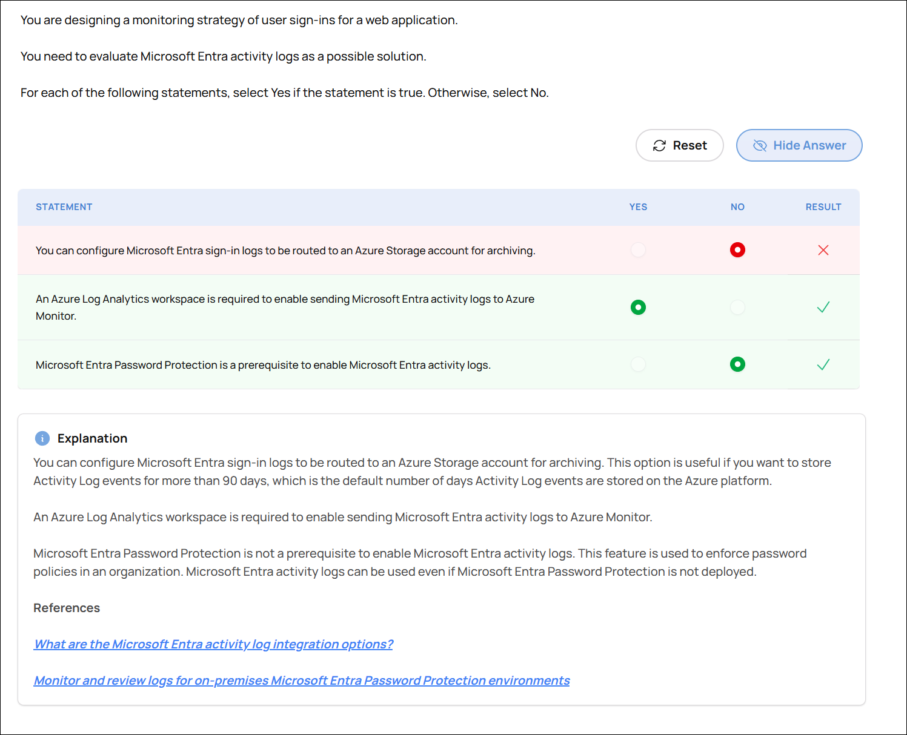

# Practice Questions — Design identity, governance, and monitoring solutions

Accounts for questions missed or unsure about in the practice exams.

* [Design solutions for logging and monitoring](#design-solutions-for-logging-and-monitoring)
  * [Monitoring Solution for a Gaming App](#monitoring-solution-for-a-gaming-app)
  * [Microsoft Entra Activity Logs](#microsoft-entra-activity-logs)
* [Design authentication and authorization solutions](#design-authentication-and-authorization-solutions)
* [Design governance](#design-governance)

---

## Design solutions for logging and monitoring

### Monitoring Solution for a Gaming App

**Domain:** Design identity, governance, and monitoring solutions
**Skill:** Design solutions for logging and monitoring
**Task:** Recommend a monitoring solution
**Answered:** Incorretly
**ID:** 0ed6591

You are designing a monitoring solution for a gaming website hosted in an Azure Web App.

You have the following monitoring requirements:

* Track how often users return to the website in a specified time period.
* Measure how specific events influence user activities.
* View user activity by region.

You need to provide a solution that minimizes administrative effort.

Which monitoring solution should you use?

A. Application Insights  
B. Azure Monitor Alerts  
C. Azure AI Services  
D. Time Series Insights environments  

📸 Click to expand screenshot

💡 Click to expand explanation

**Why Application Insights is correct**

Application Insights is designed for web application telemetry and usage analysis. It supports retention analysis, custom events, and filtering user activity by properties such as region, which matches the requirements for tracking return visits, event influence, and regional activity with minimal administrative effort.

**Why the other options are less appropriate**

Azure Monitor Alerts is for notifying you about threshold breaches and operational conditions, not for analyzing user behavior.

Azure AI Services provides AI capabilities, not monitoring or usage analytics.

Time Series Insights is intended for time-series and IoT-style telemetry analysis, not web app user behavior tracking.

**References**

* [Usage analysis with Application Insights](https://learn.microsoft.com/azure/azure-monitor/app/usage)
* [Azure Monitor overview](https://learn.microsoft.com/azure/azure-monitor/fundamentals/overview)
* [What are Azure Monitor alerts?](https://learn.microsoft.com/azure/azure-monitor/alerts/alerts-overview)
* [Azure Time Series Insights Gen2 data access overview](https://learn.microsoft.com/rest/api/time-series-insights/reference-data-access-overview)
* [Get started with Azure AI Services - Training](https://learn.microsoft.com/training/paths/get-started-azure-ai/)

* [0ed6591 - Azure Observability Blueprint](https://notebooklm.google.com/notebook/c0407f1f-03f4-45c2-8155-ae155499f7d1?artifactId=f28b9767-e325-43e2-8611-c0bc0b6f2951)
* [0ed6591 - Monitoring Quiz](https://notebooklm.google.com/notebook/c0407f1f-03f4-45c2-8155-ae155499f7d1?artifactId=f6960d51-1a14-42fb-96a1-59975710a94f)
* [0ed6591 - Choosing Your Lens: A Student's Guide to Azure Monitoring & Analytics Services](https://docs.google.com/document/d/14CoYV7K63fO4WhOE4MS9PxxS2pLgSjvaB7Ds4dohBog/edit?usp=sharing)
* [0ed6591 - Azure Monitor and Foundry Observability Services Overview](https://docs.google.com/spreadsheets/d/1DPGV4OPnFFNzqLTNHs-VAI64j9Roz8CJQ88gocw0m0w/edit?usp=sharing)
* [0ed6591 - Architectural Framework for Full-Stack Observability with Application Insights and OpenTelemetry](https://docs.google.com/document/d/1aeDHEtY4RaXPU7lHH_QNNIenWJyI0CHvCyt8bhOc1QM/edit?usp=sharing)

---

### Microsoft Entra Activity Logs

**Domain:** Design identity, governance, and monitoring solutions
**Skill:** Design solutions for logging and monitoring
**Task:** Recommend a logging solution
**Answered:** Incorrectly
**ID:** 6f21747

You are designing a monitoring strategy of user sign-ins for a web application.

You need to evaluate Microsoft Entra activity logs as a possible solution.

For each of the following statements, select Yes if the statement is true. Otherwise, select No.

| Statement | Yes | No |
|----------|-----|----|
| You can configure Microsoft Entra sign-in logs to be routed to an Azure Storage account for archiving. | ☐ | ☐ |
| An Azure Log Analytics workspace is required to enable sending Microsoft Entra activity logs to Azure Monitor. | ☐ | ☐ |
| Microsoft Entra Password Protection is a prerequisite to enable Microsoft Entra activity logs. | ☐ | ☐ |

📸 Click to expand screenshot

💡 Click to expand explanation

**Correct Answer**

1. Yes
2. Yes
3. No

Microsoft Entra sign-in logs can be routed to an Azure Storage account for long-term archiving.

Sending Microsoft Entra activity logs to Azure Monitor requires a Log Analytics workspace.

Microsoft Entra Password Protection is a separate feature and is not required to enable Microsoft Entra activity logs.

**Why the other options are incorrect**

The first statement is true because Azure Storage is a supported long-term storage target for Microsoft Entra logs.

The second statement is true because Azure Monitor logs use a Log Analytics workspace as the destination.

The third statement is false because Microsoft Entra Password Protection is unrelated to enabling activity log collection or routing.

**References**

* [What are the Microsoft Entra activity log integration options?](https://learn.microsoft.com/entra/identity/monitoring-health/concept-log-monitoring-integration-options-considerations#integration-options)
* [Monitor and review logs for on-premises Microsoft Entra Password Protection environments](https://learn.microsoft.com/entra/identity/authentication/howto-password-ban-bad-on-premises-monitor)

## Design authentication and authorization solutions

## Design governance
