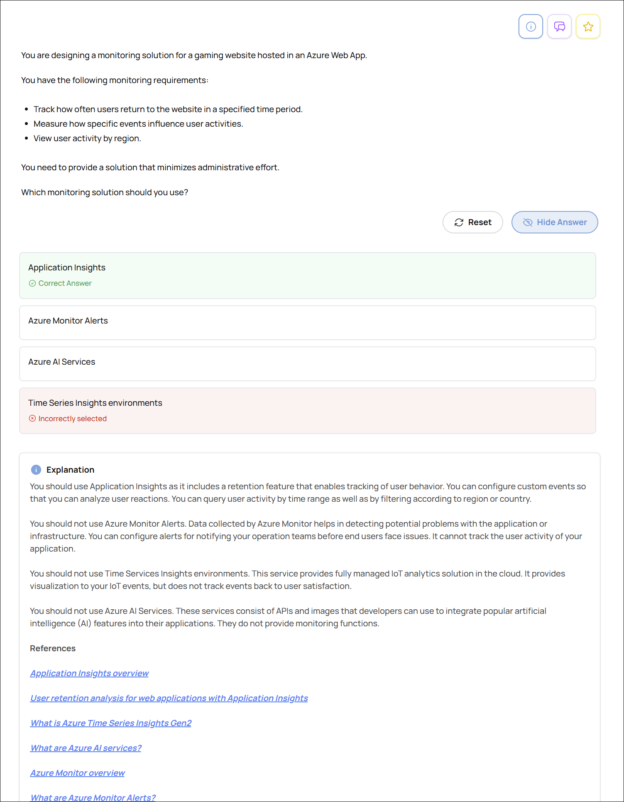

# Practice Questions — Design identity, governance, and monitoring solutions

Accounts for questions missed or unsure about in the practice exams.

* [Design solutions for logging and monitoring](#design-solutions-for-logging-and-monitoring)
  * [Monitoring Solution for a Gaming App](#monitoring-solution-for-a-gaming-app)
* [Design authentication and authorization solutions](#design-authentication-and-authorization-solutions)
* [Design governance](#design-governance)

---

## Design solutions for logging and monitoring

### Monitoring Solution for a Gaming App

**Domain:** Design identity, governance, and monitoring solutions
**Skill:** Design solutions for logging and monitoring
**Task:** Recommend a monitoring solution
**Answer Result:** Wrong
**ID:** 0ed6591

You are designing a monitoring solution for a gaming website hosted in an Azure Web App.

You have the following monitoring requirements:

* Track how often users return to the website in a specified time period.
* Measure how specific events influence user activities.
* View user activity by region.

You need to provide a solution that minimizes administrative effort.

Which monitoring solution should you use?

A. Application Insights  
B. Azure Monitor Alerts  
C. Azure AI Services  
D. Time Series Insights environments  

📸 Click to expand screenshot

💡 Click to expand explanation

**Why Application Insights is correct**

Application Insights is designed for web application telemetry and usage analysis. It supports retention analysis, custom events, and filtering user activity by properties such as region, which matches the requirements for tracking return visits, event influence, and regional activity with minimal administrative effort.

**Why the other options are less appropriate**

Azure Monitor Alerts is for notifying you about threshold breaches and operational conditions, not for analyzing user behavior.

Azure AI Services provides AI capabilities, not monitoring or usage analytics.

Time Series Insights is intended for time-series and IoT-style telemetry analysis, not web app user behavior tracking.

**References**

* [Usage analysis with Application Insights](https://learn.microsoft.com/azure/azure-monitor/app/usage)
* [Azure Monitor overview](https://learn.microsoft.com/azure/azure-monitor/fundamentals/overview)
* [What are Azure Monitor alerts?](https://learn.microsoft.com/azure/azure-monitor/alerts/alerts-overview)
* [Azure Time Series Insights Gen2 data access overview](https://learn.microsoft.com/rest/api/time-series-insights/reference-data-access-overview)
* [Get started with Azure AI Services - Training](https://learn.microsoft.com/training/paths/get-started-azure-ai/)

---

## Design authentication and authorization solutions

## Design governance
