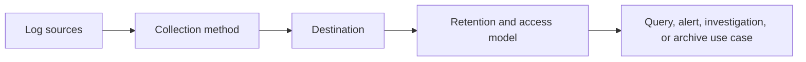
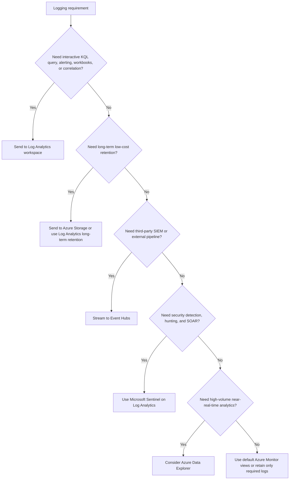
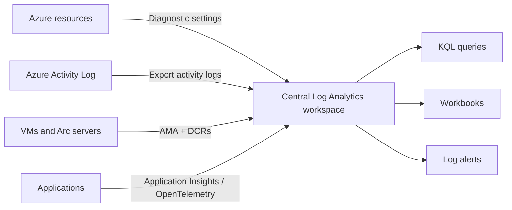
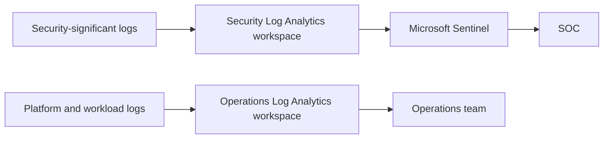
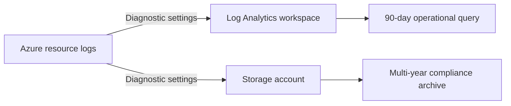
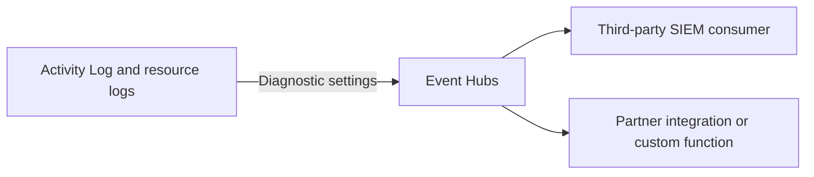
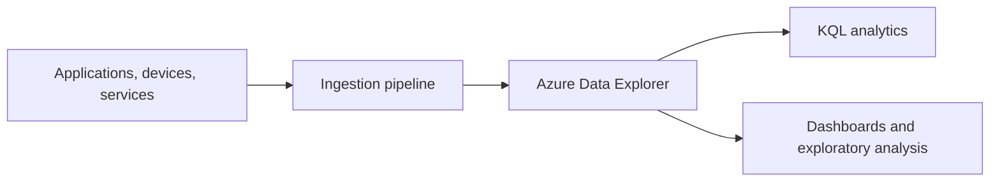

# AZ-305 Study Guide: Recommend a logging solution

> **Exam task:** Design solutions for logging and monitoring — Recommend a logging solution
>
> **Domain:** Design identity, governance, and monitoring solutions
>
> **Estimated reading time:** 45 minutes
>
> **Matched task source:** Exact match from the provided Study Guide Map and the current [official AZ-305 study guide](https://learn.microsoft.com/en-us/credentials/certifications/resources/study-guides/az-305).
>
> **Scope boundary:** This guide focuses on designing where logs come from, how they are collected, where they are stored, how they are queried, how long they are retained, and when to use Azure-native logging versus archive, streaming, SIEM, or large-scale analytics patterns.

---

## How to use this guide

Use this guide as a design-decision reference for scenario questions where the requirement includes **centralized logging**, **auditability**, **troubleshooting**, **security correlation**, **retention**, **data residency**, **KQL querying**, **third-party SIEM export**, or **cost control**.

By the end, you should be able to decide when to use [Azure Monitor](https://learn.microsoft.com/en-us/azure/azure-monitor/fundamentals/overview), [Azure Monitor Logs](https://learn.microsoft.com/en-us/azure/azure-monitor/logs/data-platform-logs), [Log Analytics workspaces](https://learn.microsoft.com/en-us/azure/azure-monitor/logs/log-analytics-workspace-overview), [diagnostic settings](https://learn.microsoft.com/en-us/azure/azure-monitor/platform/diagnostic-settings), [Data Collection Rules](https://learn.microsoft.com/en-us/azure/azure-monitor/data-collection/data-collection-rule-overview), [Azure Monitor Agent](https://learn.microsoft.com/en-us/azure/azure-monitor/agents/azure-monitor-agent-overview), [Application Insights](https://learn.microsoft.com/en-us/azure/azure-monitor/app/app-insights-overview), [Microsoft Sentinel](https://learn.microsoft.com/en-us/azure/sentinel/overview), [Azure Data Explorer](https://learn.microsoft.com/en-us/azure/data-explorer/data-explorer-overview), [Azure Storage](https://learn.microsoft.com/en-us/azure/storage/blobs/storage-blobs-overview), and [Azure Event Hubs](https://learn.microsoft.com/en-us/azure/azure-monitor/platform/stream-monitoring-data-event-hubs).

The exam distinction is important: **logging** is about collecting and retaining event data for query, audit, troubleshooting, investigation, and correlation; **log routing** is about sending logs to destinations; **monitoring** is about health models, alerts, workbooks, metrics, and operational response.

---

## Primary source set

### Exam and module sources

- [Official AZ-305 study guide](https://learn.microsoft.com/en-us/credentials/certifications/resources/study-guides/az-305)
- [Design a solution to log and monitor Azure resources](https://learn.microsoft.com/en-us/training/modules/design-solution-to-log-monitor-azure-resources/)
- [AZ-305 identity, governance, and monitoring learning path](https://learn.microsoft.com/en-us/training/paths/design-identity-governance-monitor-solutions/)
- [Exam Readiness Zone: AZ-305 identity, governance, and monitoring](https://learn.microsoft.com/en-us/shows/exam-readiness-zone/preparing-for-az-305-01-fy25)

### Core product documentation

- [Azure Monitor overview](https://learn.microsoft.com/en-us/azure/azure-monitor/fundamentals/overview)
- [Azure Monitor Logs overview](https://learn.microsoft.com/en-us/azure/azure-monitor/logs/data-platform-logs)
- [Log Analytics workspace overview](https://learn.microsoft.com/en-us/azure/azure-monitor/logs/log-analytics-workspace-overview)
- [Design a Log Analytics workspace architecture](https://learn.microsoft.com/en-us/azure/azure-monitor/logs/workspace-design)
- [Azure Monitor data sources and collection methods](https://learn.microsoft.com/en-us/azure/azure-monitor/fundamentals/data-sources)
- [Diagnostic settings in Azure Monitor](https://learn.microsoft.com/en-us/azure/azure-monitor/platform/diagnostic-settings)
- [Resource logs in Azure Monitor](https://learn.microsoft.com/en-us/azure/azure-monitor/platform/resource-logs)
- [Data Collection Rules in Azure Monitor](https://learn.microsoft.com/en-us/azure/azure-monitor/data-collection/data-collection-rule-overview)
- [Azure Monitor Agent overview](https://learn.microsoft.com/en-us/azure/azure-monitor/agents/azure-monitor-agent-overview)
- [Migrate from Log Analytics agent to Azure Monitor Agent](https://learn.microsoft.com/en-us/azure/azure-monitor/agents/azure-monitor-agent-migration)

### Supporting architecture and framework sources

- [Azure Well-Architected Framework observability guidance](https://learn.microsoft.com/en-us/azure/well-architected/operational-excellence/observability)
- [Well-Architected service guide for Log Analytics](https://learn.microsoft.com/en-us/azure/well-architected/service-guides/azure-log-analytics)
- [Microsoft Entra monitoring and health](https://learn.microsoft.com/en-us/entra/identity/monitoring-health/overview-monitoring-health)
- [Microsoft Entra activity log integration options](https://learn.microsoft.com/en-us/entra/identity/monitoring-health/concept-log-monitoring-integration-options-considerations)
- [Virtual network flow logs](https://learn.microsoft.com/en-us/azure/network-watcher/vnet-flow-logs-overview)
- [NSG flow logs retirement notice](https://learn.microsoft.com/en-us/azure/network-watcher/nsg-flow-logs-overview)
- [Microsoft Sentinel overview](https://learn.microsoft.com/en-us/azure/sentinel/overview)
- [Azure Data Explorer overview](https://learn.microsoft.com/en-us/azure/data-explorer/data-explorer-overview)

### Discovery notes from the Study Guide Map

The Study Guide Map identifies the core product set as **Azure Monitor**, **Azure Monitor Logs**, **Log Analytics workspaces**, **Azure Monitor Agent**, **Data Collection Rules**, **diagnostic settings**, **Azure Activity Log**, **Azure resource logs**, **Microsoft Entra audit and sign-in logs**, **Application Insights**, **OpenTelemetry**, **Container insights**, **Network Watcher**, **virtual network flow logs**, **Microsoft Sentinel**, **Azure Data Explorer**, **Azure Blob Storage**, **Azure Event Hubs**, **Azure Arc**, **Azure Policy**, and the **Azure Well-Architected Framework**.

The forum-discovery note is nonauthoritative and is useful only because public candidate discussions often confuse **Log Analytics workspace design**, **diagnostic settings**, **KQL**, **Application Insights**, **Sentinel**, **VM agents**, **network flow logs**, and the destination tradeoff between **Log Analytics**, **Storage**, and **Event Hubs**.

---

## 1. Exam task scope

This task asks you to recommend a logging architecture, not merely enable logging on a single resource.

A good AZ-305 answer usually starts with these questions:

| Design question | Why it matters |
|---|---|
| What source emits the logs? | [Azure Monitor data sources](https://learn.microsoft.com/en-us/azure/azure-monitor/fundamentals/data-sources) use different collection methods depending on whether the source is Azure platform, resource, VM guest OS, application, identity, network, or custom telemetry. |
| Do the logs need interactive query? | Use [Log Analytics workspaces](https://learn.microsoft.com/en-us/azure/azure-monitor/logs/log-analytics-workspace-overview) when logs must be queried with KQL, correlated, visualized, or used for log alerts. |
| Do the logs need long-term archive only? | Use [Azure Storage](https://learn.microsoft.com/en-us/azure/azure-monitor/platform/resource-logs#azure-storage) when the requirement is low-cost retention and infrequent query. |
| Do the logs need third-party SIEM ingestion? | Use [Event Hubs streaming](https://learn.microsoft.com/en-us/azure/azure-monitor/platform/stream-monitoring-data-event-hubs) when logs must be consumed by external SIEM or analytics tools. |
| Do the logs need security correlation and detection? | Use [Microsoft Sentinel](https://learn.microsoft.com/en-us/azure/sentinel/overview) when the requirement includes SIEM, threat detection, investigation, hunting, automation, or SOAR. |
| Are logs high-volume, semi-structured, or near-real-time analytics data? | Consider [Azure Data Explorer](https://learn.microsoft.com/en-us/azure/data-explorer/data-explorer-overview) when the requirement exceeds normal operational log analysis and emphasizes large-scale, low-latency analytics. |

### In scope

- [Azure Monitor Logs](https://learn.microsoft.com/en-us/azure/azure-monitor/logs/data-platform-logs)
- [Log Analytics workspace architecture](https://learn.microsoft.com/en-us/azure/azure-monitor/logs/workspace-design)
- [Diagnostic settings](https://learn.microsoft.com/en-us/azure/azure-monitor/platform/diagnostic-settings)
- [Resource logs](https://learn.microsoft.com/en-us/azure/azure-monitor/platform/resource-logs)
- [Activity Log export](https://learn.microsoft.com/en-us/azure/azure-monitor/platform/activity-log#export-activity-log)
- [Azure Monitor Agent](https://learn.microsoft.com/en-us/azure/azure-monitor/agents/azure-monitor-agent-overview)
- [Data Collection Rules](https://learn.microsoft.com/en-us/azure/azure-monitor/data-collection/data-collection-rule-overview)
- [Microsoft Entra log integration](https://learn.microsoft.com/en-us/entra/identity/monitoring-health/concept-log-monitoring-integration-options-considerations)
- [Application Insights](https://learn.microsoft.com/en-us/azure/azure-monitor/app/app-insights-overview)
- [Network Watcher virtual network flow logs](https://learn.microsoft.com/en-us/azure/network-watcher/vnet-flow-logs-overview)
- [Microsoft Sentinel](https://learn.microsoft.com/en-us/azure/sentinel/overview)
- [Azure Data Explorer](https://learn.microsoft.com/en-us/azure/data-explorer/data-explorer-overview)
- [Azure Storage archive](https://learn.microsoft.com/en-us/azure/azure-monitor/platform/resource-logs#azure-storage)
- [Event Hubs export](https://learn.microsoft.com/en-us/azure/azure-monitor/platform/stream-monitoring-data-event-hubs)

### Out of scope, except as adjacent context

- Alert rule design belongs primarily to **Recommend a monitoring solution**.
- Route configuration belongs primarily to **Recommend a solution for routing logs**.
- Compliance control selection belongs primarily to **Recommend a solution for managing compliance**.
- Threat detection rule engineering belongs primarily to Sentinel/security operations content, not core AZ-305 logging architecture.

> **Exam tip:** When a question says “retain logs for seven years but rarely query them,” prefer [Azure Storage archive or long-term retention](https://learn.microsoft.com/en-us/azure/azure-monitor/platform/resource-logs#azure-storage); when it says “query and correlate logs,” prefer [Log Analytics](https://learn.microsoft.com/en-us/azure/azure-monitor/logs/log-analytics-workspace-overview); when it says “third-party SIEM,” prefer [Event Hubs](https://learn.microsoft.com/en-us/azure/azure-monitor/platform/stream-monitoring-data-event-hubs).

---

## 2. Product and topic discovery pass

| Product, service, or topic | Why it may be relevant | Primary Microsoft source | In-scope or adjacent? |
|---|---|---|---|
| Azure Monitor | Central service for collecting, analyzing, and acting on logs and metrics across Azure and hybrid resources. | [Azure Monitor overview](https://learn.microsoft.com/en-us/azure/azure-monitor/fundamentals/overview) | In scope |
| Azure Monitor Logs | Core log data platform for KQL query, retention, table plans, and log analytics. | [Azure Monitor Logs overview](https://learn.microsoft.com/en-us/azure/azure-monitor/logs/data-platform-logs) | In scope |
| Log Analytics workspace | Primary operational log store for Azure Monitor Logs. | [Log Analytics workspace overview](https://learn.microsoft.com/en-us/azure/azure-monitor/logs/log-analytics-workspace-overview) | In scope |
| Workspace architecture | Determines single vs multiple workspaces, region placement, access boundary, data residency, chargeback, and security separation. | [Workspace design](https://learn.microsoft.com/en-us/azure/azure-monitor/logs/workspace-design) | In scope |
| Diagnostic settings | Primary routing mechanism for Azure platform logs, activity logs, resource logs, and some metrics. | [Diagnostic settings](https://learn.microsoft.com/en-us/azure/azure-monitor/platform/diagnostic-settings) | In scope |
| Resource logs | Data-plane and service-operation logs emitted by Azure resources. | [Resource logs](https://learn.microsoft.com/en-us/azure/azure-monitor/platform/resource-logs) | In scope |
| Azure Activity Log | Subscription-level control-plane log for Azure Resource Manager operations. | [Activity Log](https://learn.microsoft.com/en-us/azure/azure-monitor/platform/activity-log) | In scope |
| Azure Monitor Agent | Modern VM and hybrid machine guest log collection agent. | [Azure Monitor Agent](https://learn.microsoft.com/en-us/azure/azure-monitor/agents/azure-monitor-agent-overview) | In scope |
| Data Collection Rules | Central configuration for what AMA collects, how data is transformed, and where it is sent. | [DCR overview](https://learn.microsoft.com/en-us/azure/azure-monitor/data-collection/data-collection-rule-overview) | In scope |
| Application Insights | Application logging, distributed tracing, request/dependency telemetry, exceptions, and APM. | [Application Insights](https://learn.microsoft.com/en-us/azure/azure-monitor/app/app-insights-overview) | In scope |
| Microsoft Entra logs | Sign-in, audit, provisioning, and identity activity logs for identity monitoring and security investigation. | [Entra monitoring and health](https://learn.microsoft.com/en-us/entra/identity/monitoring-health/overview-monitoring-health) | In scope |
| Network Watcher flow logs | Network traffic logging for virtual networks. | [Virtual network flow logs](https://learn.microsoft.com/en-us/azure/network-watcher/vnet-flow-logs-overview) | In scope |
| Microsoft Sentinel | SIEM/SOAR layer built on Log Analytics for security operations. | [Microsoft Sentinel](https://learn.microsoft.com/en-us/azure/sentinel/overview) | In scope when security correlation is required |
| Azure Data Explorer | Large-scale, high-volume, low-latency analytics platform for logs, telemetry, and time-series data. | [Azure Data Explorer](https://learn.microsoft.com/en-us/azure/data-explorer/data-explorer-overview) | In scope for high-scale analytics edge cases |
| Azure Storage | Low-cost archival destination for resource logs and activity logs. | [Resource logs to Storage](https://learn.microsoft.com/en-us/azure/azure-monitor/platform/resource-logs#azure-storage) | In scope |
| Azure Event Hubs | Streaming destination for external SIEM and downstream log processors. | [Stream monitoring data to Event Hubs](https://learn.microsoft.com/en-us/azure/azure-monitor/platform/stream-monitoring-data-event-hubs) | In scope |
| Azure Policy | Enforces diagnostic settings, AMA deployment, DCR associations, and logging baselines at scale. | [Deploy AMA with Azure Policy](https://learn.microsoft.com/en-us/azure/azure-monitor/agents/azure-monitor-agent-migration#configure-data-collection-rules-and-deploy-azure-monitor-agent) | Adjacent but important |
| Defender for Cloud | Security posture and recommendations can depend on collected security telemetry. | [Defender for Cloud data in Azure Monitor Logs](https://learn.microsoft.com/en-us/azure/azure-monitor/logs/data-platform-logs#microsoft-defender-for-cloud) | Adjacent |
| Azure Well-Architected Framework | Provides observability design principles. | [Observability guidance](https://learn.microsoft.com/en-us/azure/well-architected/operational-excellence/observability) | Adjacent architecture guidance |

---

## 3. Starting point from Microsoft Learn

Microsoft’s most relevant AZ-305 module is [Design a solution to log and monitor Azure resources](https://learn.microsoft.com/en-us/training/modules/design-solution-to-log-monitor-azure-resources/), which explicitly lists learning objectives for [Azure Monitor data sources](https://learn.microsoft.com/en-us/azure/azure-monitor/fundamentals/data-sources), [Log Analytics workspace design](https://learn.microsoft.com/en-us/azure/azure-monitor/logs/workspace-design), [Azure Workbooks and insights](https://learn.microsoft.com/en-us/azure/azure-monitor/visualize/workbooks-overview), and [Azure Data Explorer](https://learn.microsoft.com/en-us/azure/data-explorer/data-explorer-overview).

For exam readiness, treat that module as the index, then go deeper into the product documentation because scenario questions often test tradeoffs that are only covered in the service docs.

> **Exam tip:** The Microsoft Learn module introduces the right service set, but AZ-305 scenario questions usually hinge on the difference between [queryable Log Analytics retention](https://learn.microsoft.com/en-us/azure/azure-monitor/logs/log-analytics-workspace-overview), [archive-oriented Storage retention](https://learn.microsoft.com/en-us/azure/azure-monitor/platform/resource-logs#azure-storage), [Event Hubs streaming](https://learn.microsoft.com/en-us/azure/azure-monitor/platform/stream-monitoring-data-event-hubs), and [Sentinel security correlation](https://learn.microsoft.com/en-us/azure/sentinel/overview).

---

## 4. Conceptual foundation

### 4.1 The logging architecture model

A logging solution has five layers:

| Layer | Azure examples | Design decision |
|---|---|---|
| Source | [Activity Log](https://learn.microsoft.com/en-us/azure/azure-monitor/platform/activity-log), [resource logs](https://learn.microsoft.com/en-us/azure/azure-monitor/platform/resource-logs), VM guest logs, [Microsoft Entra logs](https://learn.microsoft.com/en-us/entra/identity/monitoring-health/overview-monitoring-health), [Application Insights telemetry](https://learn.microsoft.com/en-us/azure/azure-monitor/app/app-insights-overview), [network flow logs](https://learn.microsoft.com/en-us/azure/network-watcher/vnet-flow-logs-overview) | What data proves what happened? |
| Collection | [Diagnostic settings](https://learn.microsoft.com/en-us/azure/azure-monitor/platform/diagnostic-settings), [DCRs](https://learn.microsoft.com/en-us/azure/azure-monitor/data-collection/data-collection-rule-overview), [AMA](https://learn.microsoft.com/en-us/azure/azure-monitor/agents/azure-monitor-agent-overview), SDK/OpenTelemetry | How does the data get collected? |
| Destination | [Log Analytics](https://learn.microsoft.com/en-us/azure/azure-monitor/logs/log-analytics-workspace-overview), [Storage](https://learn.microsoft.com/en-us/azure/azure-monitor/platform/resource-logs#azure-storage), [Event Hubs](https://learn.microsoft.com/en-us/azure/azure-monitor/platform/stream-monitoring-data-event-hubs), [Sentinel](https://learn.microsoft.com/en-us/azure/sentinel/overview), [ADX](https://learn.microsoft.com/en-us/azure/data-explorer/data-explorer-overview) | Where should logs land? |
| Retention | Workspace retention, table retention, long-term retention, storage lifecycle | How long must data remain available? |
| Use case | KQL query, workbook, alert, audit, investigation, SIEM, archive | What will the organization do with the logs? |

> **Exam tip:** A scenario that only says “collect logs” is incomplete; infer the answer from whether the scenario emphasizes [query](https://learn.microsoft.com/en-us/azure/azure-monitor/logs/log-analytics-workspace-overview), [archive](https://learn.microsoft.com/en-us/azure/azure-monitor/platform/resource-logs#azure-storage), [external integration](https://learn.microsoft.com/en-us/azure/azure-monitor/platform/stream-monitoring-data-event-hubs), or [security operations](https://learn.microsoft.com/en-us/azure/sentinel/overview).

### 4.2 Control plane vs data plane logs

The [Azure Activity Log](https://learn.microsoft.com/en-us/azure/azure-monitor/platform/activity-log) captures subscription-level control-plane events such as resource creation, deletion, policy changes, and Azure Resource Manager operations.

[Resource logs](https://learn.microsoft.com/en-us/azure/azure-monitor/platform/resource-logs) capture service-specific operations from Azure resources, often including data-plane behavior such as firewall events, Key Vault access, database operations, or service-specific diagnostic categories.

[Diagnostic settings](https://learn.microsoft.com/en-us/azure/azure-monitor/platform/diagnostic-settings) are used to send resource logs, platform metrics, and activity logs to destinations such as Log Analytics, Storage, Event Hubs, or partner integrations.

> **Exam tip:** If the requirement is “who changed a resource,” think [Activity Log](https://learn.microsoft.com/en-us/azure/azure-monitor/platform/activity-log); if the requirement is “what happened inside the service,” think [resource logs](https://learn.microsoft.com/en-us/azure/azure-monitor/platform/resource-logs).

### 4.3 Workspace architecture

A [Log Analytics workspace](https://learn.microsoft.com/en-us/azure/azure-monitor/logs/log-analytics-workspace-overview) is the main Azure Monitor Logs store for collected log data.

Microsoft’s workspace design guidance says to start with a **single workspace** and add more only when requirements such as data residency, ownership, access control, retention, chargeback, or regional egress justify separation.

Common reasons to use multiple workspaces include:

- Separate workspaces for regulated data that requires different [RBAC or table-level access](https://learn.microsoft.com/en-us/azure/azure-monitor/logs/manage-access).
- Separate workspaces for regions where [data residency](https://learn.microsoft.com/en-us/azure/azure-monitor/logs/workspace-design) matters.
- Separate workspaces for centralized security operations versus application operations when Sentinel cost, ownership, or access boundaries differ.
- Separate workspaces for tenants or environments when operational ownership is truly separate.

> **Exam tip:** Do not automatically create one workspace per subscription; start with [one workspace](https://learn.microsoft.com/en-us/azure/azure-monitor/logs/workspace-design) unless the scenario gives a concrete separation requirement.

### 4.4 Collection methods

Use [diagnostic settings](https://learn.microsoft.com/en-us/azure/azure-monitor/platform/diagnostic-settings) for Azure platform logs, activity logs, and resource logs.

Use [Azure Monitor Agent](https://learn.microsoft.com/en-us/azure/azure-monitor/agents/azure-monitor-agent-overview) plus [Data Collection Rules](https://learn.microsoft.com/en-us/azure/azure-monitor/data-collection/data-collection-rule-overview) for VM guest OS logs, Windows Event Logs, Syslog, performance counters, IIS logs, and hybrid machines through Azure Arc.

Use [Application Insights](https://learn.microsoft.com/en-us/azure/azure-monitor/app/app-insights-overview) and [OpenTelemetry](https://learn.microsoft.com/en-us/azure/azure-monitor/app/app-insights-overview) for application telemetry, distributed tracing, requests, dependencies, exceptions, and custom application logs.

Use [Microsoft Entra diagnostic settings](https://learn.microsoft.com/en-us/entra/identity/monitoring-health/howto-integrate-activity-logs-with-azure-monitor-logs) for identity logs that must be retained, queried, or integrated with SIEM.

Use [virtual network flow logs](https://learn.microsoft.com/en-us/azure/network-watcher/vnet-flow-logs-overview) for network traffic visibility at the virtual network level.

> **Exam tip:** [Resource logs are not collected by default](https://learn.microsoft.com/en-us/azure/azure-monitor/platform/resource-logs#collecting-resource-logs), so a scenario requiring resource-level diagnostics needs diagnostic settings or policy enforcement.

### 4.5 Resource-specific tables vs AzureDiagnostics

For new resource log designs, prefer [resource-specific mode](https://learn.microsoft.com/en-us/azure/azure-monitor/platform/resource-logs#resource-specific) where supported because it creates individual tables, improves schema discoverability, improves query performance, and enables table-level RBAC.

Use [AzureDiagnostics](https://learn.microsoft.com/en-us/azure/azure-monitor/reference/tables/azurediagnostics) only when a service requires Azure diagnostics mode or when you must support a legacy design.

> **Exam tip:** If the answer choices include `AzureDiagnostics` versus resource-specific tables for a new design, prefer [resource-specific tables](https://learn.microsoft.com/en-us/azure/azure-monitor/platform/resource-logs#resource-specific) unless the service does not support them.

---

## 5. Design decision framework

### 5.1 Destination decision tree

### 5.2 Default recommendation

For most Azure environments, recommend:

1. A centralized [Log Analytics workspace](https://learn.microsoft.com/en-us/azure/azure-monitor/logs/log-analytics-workspace-overview) for queryable operational logs.
2. [Diagnostic settings](https://learn.microsoft.com/en-us/azure/azure-monitor/platform/diagnostic-settings) on Azure resources to collect resource logs.
3. [Activity Log export](https://learn.microsoft.com/en-us/azure/azure-monitor/platform/activity-log#export-activity-log) to Log Analytics for longer retention, correlation, and log alerts.
4. [Azure Monitor Agent](https://learn.microsoft.com/en-us/azure/azure-monitor/agents/azure-monitor-agent-overview) with [DCRs](https://learn.microsoft.com/en-us/azure/azure-monitor/data-collection/data-collection-rule-overview) for VM and hybrid guest logs.
5. [Application Insights](https://learn.microsoft.com/en-us/azure/azure-monitor/app/app-insights-overview) for application telemetry.
6. [Microsoft Sentinel](https://learn.microsoft.com/en-us/azure/sentinel/overview) only when SIEM/SOAR security operations are required.
7. [Storage](https://learn.microsoft.com/en-us/azure/azure-monitor/platform/resource-logs#azure-storage) for low-cost archive and [Event Hubs](https://learn.microsoft.com/en-us/azure/azure-monitor/platform/stream-monitoring-data-event-hubs) for external SIEM streaming.

### 5.3 Workspace design logic

| Requirement | Recommendation |
|---|---|
| Centralized KQL and operational visibility | Use a shared [Log Analytics workspace](https://learn.microsoft.com/en-us/azure/azure-monitor/logs/log-analytics-workspace-overview). |
| Different access boundaries | Use separate workspaces or [table-level access](https://learn.microsoft.com/en-us/azure/azure-monitor/logs/manage-access). |
| Data residency by geography | Place workspaces in required Azure regions using [workspace architecture guidance](https://learn.microsoft.com/en-us/azure/azure-monitor/logs/workspace-design). |
| Security operations with SIEM | Enable [Microsoft Sentinel](https://learn.microsoft.com/en-us/azure/sentinel/overview) on the security workspace. |
| Cost optimization for predictable ingestion | Evaluate [commitment tiers](https://learn.microsoft.com/en-us/azure/azure-monitor/logs/cost-logs) and table plans. |
| Long-term retention with infrequent query | Use [Log Analytics long-term retention](https://learn.microsoft.com/en-us/azure/azure-monitor/logs/data-retention-configure) or [Azure Storage archive](https://learn.microsoft.com/en-us/azure/azure-monitor/platform/resource-logs#azure-storage). |

> **Test yourself**
>
> - A company wants all production Azure resource logs searchable with KQL for 90 days and archived for seven years. What destination pattern should you recommend?
> - A company already uses Splunk and wants Azure Activity Log and resource logs streamed to it. Which Azure service should be used as the integration path?
>
> **Answer guidance:** Use [Log Analytics](https://learn.microsoft.com/en-us/azure/azure-monitor/logs/log-analytics-workspace-overview) for queryable operational retention and [Azure Storage](https://learn.microsoft.com/en-us/azure/azure-monitor/platform/resource-logs#azure-storage) or [long-term retention](https://learn.microsoft.com/en-us/azure/azure-monitor/logs/data-retention-configure) for archive; use [Event Hubs](https://learn.microsoft.com/en-us/azure/azure-monitor/platform/stream-monitoring-data-event-hubs) for third-party SIEM streaming.

---

## 6. Service and feature comparison tables

### 6.1 Destination comparison

| Destination | Best use case | Strength | Limitation or tradeoff |
|---|---|---|---|
| [Log Analytics workspace](https://learn.microsoft.com/en-us/azure/azure-monitor/logs/log-analytics-workspace-overview) | Interactive KQL query, alerts, workbooks, correlation, operational troubleshooting | Central query and analytics plane for Azure Monitor Logs | Ingestion and retention costs require design control |
| [Azure Storage](https://learn.microsoft.com/en-us/azure/azure-monitor/platform/resource-logs#azure-storage) | Long-term archive and compliance retention | Low-cost retention for logs that are rarely queried | Not the best choice for frequent KQL analysis |
| [Event Hubs](https://learn.microsoft.com/en-us/azure/azure-monitor/platform/stream-monitoring-data-event-hubs) | Streaming Azure logs to external SIEM or analytics systems | Decouples Azure log export from external consumers | Requires consumer design, throughput planning, and retention planning |
| [Microsoft Sentinel](https://learn.microsoft.com/en-us/azure/sentinel/overview) | Security monitoring, threat detection, hunting, automation, SOAR | Adds cloud-native SIEM/SOAR over Log Analytics | Adds Sentinel-specific cost and security operations design |
| [Azure Data Explorer](https://learn.microsoft.com/en-us/azure/data-explorer/data-explorer-overview) | High-volume, near-real-time telemetry and exploratory analytics | Optimized for large-scale KQL analytics | More data-platform design responsibility than Log Analytics |

### 6.2 Collection method comparison

| Source | Collection method | Destination options | Exam clue |
|---|---|---|---|
| Azure control-plane operations | [Activity Log export](https://learn.microsoft.com/en-us/azure/azure-monitor/platform/activity-log#export-activity-log) | Log Analytics, Event Hubs, Storage | “Who created, deleted, updated, or changed Azure resources?” |
| Azure resource data-plane/service logs | [Diagnostic settings](https://learn.microsoft.com/en-us/azure/azure-monitor/platform/diagnostic-settings) | Log Analytics, Event Hubs, Storage, partner integrations | “Collect firewall, Key Vault, database, or resource-specific diagnostics.” |
| VM guest OS logs | [Azure Monitor Agent](https://learn.microsoft.com/en-us/azure/azure-monitor/agents/azure-monitor-agent-overview) with [DCRs](https://learn.microsoft.com/en-us/azure/azure-monitor/data-collection/data-collection-rule-overview) | Log Analytics | “Collect Windows Event Logs, Syslog, IIS logs, or guest logs.” |
| Hybrid server logs | [Azure Arc](https://learn.microsoft.com/en-us/azure/azure-arc/servers/overview) plus [AMA](https://learn.microsoft.com/en-us/azure/azure-monitor/agents/azure-monitor-agent-overview) | Log Analytics | “Collect logs from on-premises or multicloud servers.” |
| Application telemetry | [Application Insights](https://learn.microsoft.com/en-us/azure/azure-monitor/app/app-insights-overview) and OpenTelemetry | Application Insights / Log Analytics | “Requests, dependencies, exceptions, traces, distributed transactions.” |
| Identity logs | [Microsoft Entra diagnostic settings](https://learn.microsoft.com/en-us/entra/identity/monitoring-health/howto-integrate-activity-logs-with-azure-monitor-logs) | Log Analytics, Storage, Event Hubs | “Sign-in logs, audit logs, provisioning logs, risky sign-ins.” |
| Network traffic flows | [Virtual network flow logs](https://learn.microsoft.com/en-us/azure/network-watcher/vnet-flow-logs-overview) | Storage, Traffic Analytics, Log Analytics integration patterns | “IP traffic through a virtual network.” |

### 6.3 Log Analytics table plans

| Table plan | Use case | Important design detail |
|---|---|---|
| [Analytics](https://learn.microsoft.com/en-us/azure/azure-monitor/logs/logs-table-plans) | Full query capability and frequent analytics | Default for tables created in the portal. |
| [Basic](https://learn.microsoft.com/en-us/azure/azure-monitor/logs/logs-table-plans) | Lower-cost verbose logs with limited query needs | Only supported tables can be switched to Basic, and switching is limited. |
| [Auxiliary](https://learn.microsoft.com/en-us/azure/azure-monitor/logs/create-custom-table-auxiliary) | Low-cost custom data ingestion and retention | Auxiliary can be set only on DCR-based custom tables created through API and cannot be switched after creation. |

> **Exam tip:** Do not use Basic or Auxiliary plans as a blanket replacement for Analytics; table plans are selected per table and are constrained by table support, query needs, and ingestion path.

---

## 7. Architecture patterns

### Pattern 1: Centralized operational logging

**Use when:** The organization needs centralized troubleshooting, operational analytics, and KQL query across Azure resources, VMs, applications, and identity logs.

**Strengths:** Simple operational model, centralized query, easier correlation, and reduced workspace sprawl.

**Weaknesses:** Requires careful RBAC, retention, cost management, and data residency planning.

**Failure modes:** Missing diagnostic settings, missing DCR associations, duplicate VM agents, unbounded verbose logs, and workspace access that is too broad.

**Microsoft sources:** [Workspace design](https://learn.microsoft.com/en-us/azure/azure-monitor/logs/workspace-design), [Diagnostic settings](https://learn.microsoft.com/en-us/azure/azure-monitor/platform/diagnostic-settings), [Azure Monitor Agent](https://learn.microsoft.com/en-us/azure/azure-monitor/agents/azure-monitor-agent-overview).

### Pattern 2: Operations + security separation

**Use when:** Security operations requires separate access, retention, billing, or SIEM analytics from application operations.

**Strengths:** Clean security boundary, easier SOC ownership, Sentinel scope control, and separation of operational noise from security data.

**Weaknesses:** Cross-workspace queries and duplicate routing can increase complexity and cost.

**Microsoft sources:** [Microsoft Sentinel overview](https://learn.microsoft.com/en-us/azure/sentinel/overview), [Sentinel multiple workspaces](https://learn.microsoft.com/en-us/azure/sentinel/prepare-multiple-workspaces), [workspace design](https://learn.microsoft.com/en-us/azure/azure-monitor/logs/workspace-design).

### Pattern 3: Query + archive split

**Use when:** Logs must be searchable for operational troubleshooting and retained for a much longer compliance period.

**Strengths:** Balances query performance and retention cost.

**Weaknesses:** Archived data is less convenient to query than active Log Analytics data.

**Microsoft sources:** [Resource log destinations](https://learn.microsoft.com/en-us/azure/azure-monitor/platform/resource-logs#destinations), [Log Analytics retention](https://learn.microsoft.com/en-us/azure/azure-monitor/logs/data-retention-configure), [Azure Storage archive destination](https://learn.microsoft.com/en-us/azure/azure-monitor/platform/resource-logs#azure-storage).

### Pattern 4: Third-party SIEM streaming

**Use when:** The organization already uses a non-Microsoft SIEM and requires Azure platform logs in that external tool.

**Strengths:** Native streaming integration and decoupled consumer model.

**Weaknesses:** Requires Event Hubs throughput, partition, retention, and consumer reliability design.

**Microsoft sources:** [Stream monitoring data to Event Hubs](https://learn.microsoft.com/en-us/azure/azure-monitor/platform/stream-monitoring-data-event-hubs), [Diagnostic settings destinations](https://learn.microsoft.com/en-us/azure/azure-monitor/platform/diagnostic-settings#destinations).

### Pattern 5: High-scale telemetry analytics

**Use when:** The scenario emphasizes very high-volume logs, near-real-time analytics, diverse schemas, time-series analysis, or custom analytics beyond normal operational monitoring.

**Strengths:** Designed for large-scale interactive analytics over high-volume telemetry.

**Weaknesses:** More data engineering and cluster design responsibility than using Log Analytics alone.

**Microsoft sources:** [Azure Data Explorer overview](https://learn.microsoft.com/en-us/azure/data-explorer/data-explorer-overview), [Reliability in Azure Data Explorer](https://learn.microsoft.com/en-us/azure/reliability/reliability-data-explorer).

---

## 8. Implementation awareness for architects

Architects should understand the implementation sequence because several design choices must be made before deployment.

| Decision | Why it must be decided early |
|---|---|
| Workspace count and region | [Workspace architecture](https://learn.microsoft.com/en-us/azure/azure-monitor/logs/workspace-design) affects data residency, query scope, RBAC, Sentinel design, and cost allocation. |
| Destination type | [Diagnostic settings](https://learn.microsoft.com/en-us/azure/azure-monitor/platform/diagnostic-settings) must target Log Analytics, Storage, Event Hubs, partner integrations, or multiple destinations. |
| Resource-specific vs AzureDiagnostics | [Resource-specific tables](https://learn.microsoft.com/en-us/azure/azure-monitor/platform/resource-logs#resource-specific) affect query design, schema clarity, performance, and table-level RBAC. |
| AMA and DCR model | [AMA uses DCRs](https://learn.microsoft.com/en-us/azure/azure-monitor/agents/azure-monitor-agent-overview#data-collection) to define what data is collected, processed, and sent. |
| Legacy agent migration | [Log Analytics agent was retired](https://learn.microsoft.com/en-us/azure/azure-monitor/agents/azure-monitor-agent-migration), so new designs should use AMA and DCRs. |
| Policy enforcement | Azure Policy can deploy [AMA and DCR associations](https://learn.microsoft.com/en-us/azure/azure-monitor/agents/azure-monitor-agent-migration#configure-data-collection-rules-and-deploy-azure-monitor-agent) at scale. |
| Retention and table plan | [Retention](https://learn.microsoft.com/en-us/azure/azure-monitor/logs/data-retention-configure) and [table plans](https://learn.microsoft.com/en-us/azure/azure-monitor/logs/logs-table-plans) affect cost and query capability. |

> **Exam tip:** New VM guest log designs should use [Azure Monitor Agent](https://learn.microsoft.com/en-us/azure/azure-monitor/agents/azure-monitor-agent-overview) and [DCRs](https://learn.microsoft.com/en-us/azure/azure-monitor/data-collection/data-collection-rule-overview), not the retired Log Analytics agent.

---

## 9. Security, governance, and compliance considerations

### Security

Use [Microsoft Sentinel](https://learn.microsoft.com/en-us/azure/sentinel/overview) when logs must support detection, investigation, hunting, threat intelligence, automation, and SOAR.

Use [Microsoft Entra activity log integration](https://learn.microsoft.com/en-us/entra/identity/monitoring-health/concept-log-monitoring-integration-options-considerations) when audit logs, sign-in logs, provisioning logs, and identity events must be retained beyond portal defaults or correlated with other security data.

Use [workspace access control](https://learn.microsoft.com/en-us/azure/azure-monitor/logs/manage-access) and [resource-context access](https://learn.microsoft.com/en-us/azure/azure-monitor/logs/manage-access) to avoid giving broad access to all logs when teams only need logs for their own resources.

### Governance

Use [Azure Policy](https://learn.microsoft.com/en-us/azure/governance/policy/overview) to enforce diagnostic settings and logging baselines across subscriptions, management groups, and new resources.

Use [resource-specific tables](https://learn.microsoft.com/en-us/azure/azure-monitor/platform/resource-logs#resource-specific) where supported to improve table-level access control and schema clarity.

Use [diagnostic settings](https://learn.microsoft.com/en-us/azure/azure-monitor/platform/diagnostic-settings) consistently because resource logs are not collected by default.

### Compliance

Use [Azure Storage](https://learn.microsoft.com/en-us/azure/azure-monitor/platform/resource-logs#azure-storage) or [Log Analytics long-term retention](https://learn.microsoft.com/en-us/azure/azure-monitor/logs/data-retention-configure) when compliance requires long retention.

Consider workspace region and data residency using [workspace design guidance](https://learn.microsoft.com/en-us/azure/azure-monitor/logs/workspace-design).

For Microsoft Entra logs, understand that default retention varies by license and log type, and longer retention requires routing to storage or analytics tools. See [Microsoft Entra reporting data retention](https://learn.microsoft.com/en-us/entra/identity/monitoring-health/reference-reports-data-retention).

> **Exam tip:** “Security monitoring” does not automatically mean “Log Analytics only”; if the scenario includes SIEM, SOAR, threat hunting, or security analytics, choose [Microsoft Sentinel](https://learn.microsoft.com/en-us/azure/sentinel/overview) on top of Log Analytics.

---

## 10. Resiliency, availability, and disaster recovery considerations

Logging resiliency is about maintaining enough telemetry to investigate incidents, not about failing over the workload itself.

Key resiliency considerations:

- Use [centralized workspaces](https://learn.microsoft.com/en-us/azure/azure-monitor/logs/workspace-design) carefully because a single workspace simplifies query but can become a single operational dependency.
- Use multiple workspaces when regional isolation, data residency, or operational independence matters.
- Use [Storage archive](https://learn.microsoft.com/en-us/azure/azure-monitor/platform/resource-logs#azure-storage) for long-term compliance retention when active query is not required.
- Use [Event Hubs message retention](https://learn.microsoft.com/en-us/azure/azure-monitor/platform/stream-monitoring-data-event-hubs) for external SIEM pipelines so consumers can recover from short outages.
- Do not assume [resource logs are transactionally lossless](https://learn.microsoft.com/en-us/azure/azure-monitor/platform/resource-logs#collecting-resource-logs); design logging for operational insight, audit, and investigation, but understand platform log delivery semantics.

> **Exam tip:** If the scenario requires external SIEM continuity, Event Hubs retention and consumer reliability matter as much as enabling diagnostic settings.

---

## 11. Cost and licensing considerations

Major cost drivers include:

| Cost area | Design implication |
|---|---|
| Log ingestion | Reduce unnecessary verbose logs by using [DCR filtering and transformations](https://learn.microsoft.com/en-us/azure/azure-monitor/data-collection/data-collection-rule-overview). |
| Workspace retention | Use [retention configuration](https://learn.microsoft.com/en-us/azure/azure-monitor/logs/data-retention-configure) to separate frequently queried retention from long-term retention. |
| Table plan | Use [Analytics, Basic, or Auxiliary table plans](https://learn.microsoft.com/en-us/azure/azure-monitor/logs/logs-table-plans) based on query needs and table support. |
| Sentinel | Use [Microsoft Sentinel](https://learn.microsoft.com/en-us/azure/sentinel/overview) only when SIEM/SOAR capabilities are required, because it adds security analytics cost on top of log ingestion. |
| Export destinations | Some platform log exports to [Storage, Event Hubs, or partner solutions](https://learn.microsoft.com/en-us/azure/azure-monitor/platform/diagnostic-settings-faq) can incur export charges depending on category and destination. |
| Network egress | Workspace region and source region can influence cost, so review [workspace architecture](https://learn.microsoft.com/en-us/azure/azure-monitor/logs/workspace-design). |
| Duplicate collection | Running legacy and modern agents together can create duplicate ingestion, so validate [AMA migration](https://learn.microsoft.com/en-us/azure/azure-monitor/agents/azure-monitor-agent-migration) before removing old agents. |

> **Exam tip:** A cost-constrained logging design is usually not “turn logging off”; it is “collect the right logs, filter at collection, choose the right destination, tune retention, and use table plans appropriately.”

---

## 12. Monitoring and operational considerations

For this task, operational considerations are about keeping the logging pipeline healthy and usable.

| Operational concern | Recommended approach |
|---|---|
| Ensure resources are logging | Use [Azure Policy](https://learn.microsoft.com/en-us/azure/governance/policy/overview) to enforce diagnostic settings and AMA deployment. |
| Ensure logs are queryable | Send operational logs to [Log Analytics](https://learn.microsoft.com/en-us/azure/azure-monitor/logs/log-analytics-workspace-overview). |
| Ensure VM guest logs are collected | Use [AMA with DCRs](https://learn.microsoft.com/en-us/azure/azure-monitor/agents/azure-monitor-agent-overview#data-collection). |
| Ensure application traces are available | Use [Application Insights](https://learn.microsoft.com/en-us/azure/azure-monitor/app/app-insights-overview). |
| Ensure identity logs are retained | Use [Entra diagnostic settings](https://learn.microsoft.com/en-us/entra/identity/monitoring-health/howto-integrate-activity-logs-with-azure-monitor-logs). |
| Ensure network traffic visibility | Use [virtual network flow logs](https://learn.microsoft.com/en-us/azure/network-watcher/vnet-flow-logs-overview). |
| Ensure security correlation | Use [Microsoft Sentinel](https://learn.microsoft.com/en-us/azure/sentinel/overview). |
| Ensure external SIEM delivery | Use [Event Hubs streaming](https://learn.microsoft.com/en-us/azure/azure-monitor/platform/stream-monitoring-data-event-hubs). |

**Adjacent task context:** Alert rules, action groups, health models, and workbook-heavy operational dashboards are closer to **Recommend a monitoring solution**, but a logging architecture must still make the data available for those features.

---

## 13. Common exam traps

| Trap | Tempting wrong answer | Why it seems reasonable | Why it is wrong or incomplete | Better design choice | Microsoft source |
|---|---|---|---|---|---|
| Treating Azure Monitor as only metrics | Azure Monitor metrics only | Metrics are visible by default for many resources | Logging requires log collection, storage, query, retention, and routing decisions | Use [Azure Monitor Logs](https://learn.microsoft.com/en-us/azure/azure-monitor/logs/data-platform-logs) and [Log Analytics](https://learn.microsoft.com/en-us/azure/azure-monitor/logs/log-analytics-workspace-overview) |
| Creating one workspace per resource group | Many small workspaces | Seems isolated and easy to delegate | Creates query fragmentation, management overhead, and inconsistent retention | Start with [one workspace](https://learn.microsoft.com/en-us/azure/azure-monitor/logs/workspace-design) and split only for real requirements |
| Sending everything to Storage | Azure Storage only | Storage is low cost and durable | Storage is not ideal for frequent KQL query, alerting, or correlation | Use [Log Analytics](https://learn.microsoft.com/en-us/azure/azure-monitor/logs/log-analytics-workspace-overview) for query and [Storage](https://learn.microsoft.com/en-us/azure/azure-monitor/platform/resource-logs#azure-storage) for archive |
| Sending everything to Log Analytics forever | Log Analytics only with long retention | Simplifies destination design | Can be expensive if logs are rarely queried | Use [retention configuration](https://learn.microsoft.com/en-us/azure/azure-monitor/logs/data-retention-configure), [table plans](https://learn.microsoft.com/en-us/azure/azure-monitor/logs/logs-table-plans), or [Storage archive](https://learn.microsoft.com/en-us/azure/azure-monitor/platform/resource-logs#azure-storage) |
| Using Log Analytics agent in a new design | Legacy Log Analytics agent | Many older examples use it | The agent is retired and new VM designs should use AMA | Use [Azure Monitor Agent](https://learn.microsoft.com/en-us/azure/azure-monitor/agents/azure-monitor-agent-overview) and [DCRs](https://learn.microsoft.com/en-us/azure/azure-monitor/data-collection/data-collection-rule-overview) |
| Using NSG flow logs in a new design | NSG flow logs | Older material references NSG flow logs | New NSG flow logs can no longer be created after June 30, 2025, and retirement is September 30, 2027 | Use [virtual network flow logs](https://learn.microsoft.com/en-us/azure/network-watcher/vnet-flow-logs-overview) |
| Confusing Sentinel with Log Analytics | Microsoft Sentinel for all logging | Sentinel uses Log Analytics workspaces | Sentinel is for SIEM/SOAR, not every operational logging requirement | Use [Log Analytics](https://learn.microsoft.com/en-us/azure/azure-monitor/logs/log-analytics-workspace-overview) for operations and [Sentinel](https://learn.microsoft.com/en-us/azure/sentinel/overview) for security operations |
| Confusing Application Insights with platform logging | Application Insights only | It captures app telemetry | It does not replace platform, resource, identity, VM, and network logs | Combine [Application Insights](https://learn.microsoft.com/en-us/azure/azure-monitor/app/app-insights-overview) with [Azure Monitor Logs](https://learn.microsoft.com/en-us/azure/azure-monitor/logs/data-platform-logs) |
| Ignoring Entra log retention | Use default Entra portal logs | Portal logs are easy to access | Default retention may not meet audit or security requirements | Route logs using [Microsoft Entra diagnostic settings](https://learn.microsoft.com/en-us/entra/identity/monitoring-health/concept-log-monitoring-integration-options-considerations) |
| Edge case: high-volume analytics | Force all high-volume telemetry into Log Analytics | KQL exists in both services | ADX is better for large-scale, near-real-time exploratory analytics | Consider [Azure Data Explorer](https://learn.microsoft.com/en-us/azure/data-explorer/data-explorer-overview) |

---

## 14. Scenario-based design examples

### Scenario 1: Straightforward default recommendation

**Customer requirement:** A mid-size company wants centralized logs for Azure VMs, App Service, Key Vault, Storage accounts, and Azure SQL for troubleshooting and basic audit.

**Constraints:** Logs must be queryable for 90 days and used by operations engineers.

**Recommended design:** Use a centralized [Log Analytics workspace](https://learn.microsoft.com/en-us/azure/azure-monitor/logs/log-analytics-workspace-overview), enable [diagnostic settings](https://learn.microsoft.com/en-us/azure/azure-monitor/platform/diagnostic-settings) for Azure resources, export the [Activity Log](https://learn.microsoft.com/en-us/azure/azure-monitor/platform/activity-log#export-activity-log), and deploy [AMA with DCRs](https://learn.microsoft.com/en-us/azure/azure-monitor/agents/azure-monitor-agent-overview) for VM guest logs.

**Why:** This satisfies centralized KQL query, operational troubleshooting, and consistent retention.

**Rejected alternatives:** Storage alone fails the query requirement; Sentinel is unnecessary unless security correlation is required.

### Scenario 2: Cost-constrained design

**Customer requirement:** A company needs to retain verbose firewall and application gateway logs but only query them during incidents.

**Constraints:** Cost must be minimized.

**Recommended design:** Send frequently queried operational logs to [Log Analytics](https://learn.microsoft.com/en-us/azure/azure-monitor/logs/log-analytics-workspace-overview), use [Basic logs or long-term retention](https://learn.microsoft.com/en-us/azure/azure-monitor/logs/logs-table-plans) where supported, and send rarely queried compliance copies to [Azure Storage](https://learn.microsoft.com/en-us/azure/azure-monitor/platform/resource-logs#azure-storage).

**Why:** This separates active analytics from archive retention.

**Rejected alternatives:** Keeping all verbose logs in Analytics tables for years is likely more expensive than necessary.

### Scenario 3: Security and compliance design

**Customer requirement:** A regulated company needs Azure Activity Log, Key Vault logs, Microsoft Entra sign-in logs, and firewall logs available to the SOC for detection and investigation.

**Constraints:** Security team requires separate access from application teams.

**Recommended design:** Use a dedicated security [Log Analytics workspace](https://learn.microsoft.com/en-us/azure/azure-monitor/logs/workspace-design), enable [Microsoft Sentinel](https://learn.microsoft.com/en-us/azure/sentinel/overview), route [Entra logs](https://learn.microsoft.com/en-us/entra/identity/monitoring-health/concept-log-monitoring-integration-options-considerations), [Activity Log](https://learn.microsoft.com/en-us/azure/azure-monitor/platform/activity-log#export-activity-log), and security-relevant [resource logs](https://learn.microsoft.com/en-us/azure/azure-monitor/platform/resource-logs) to that workspace.

**Why:** Sentinel provides security correlation, hunting, analytics, and response workflows.

**Rejected alternatives:** A shared operations workspace may not satisfy SOC access separation or Sentinel ownership.

### Scenario 4: Multi-region design

**Customer requirement:** A global company runs workloads in the US and EU and must keep EU operational logs in Europe.

**Constraints:** EU logs must not be stored outside approved regions.

**Recommended design:** Use regionally aligned [Log Analytics workspaces](https://learn.microsoft.com/en-us/azure/azure-monitor/logs/workspace-design) and route resources to the workspace that satisfies regional data residency requirements.

**Why:** Workspace placement is part of data residency and access design.

**Rejected alternatives:** A single US workspace would simplify operations but violate the regional requirement.

### Scenario 5: Third-party SIEM edge case

**Customer requirement:** A company has standardized on Splunk and wants Azure platform logs streamed into it.

**Constraints:** Splunk remains the system of record for security logs.

**Recommended design:** Configure [diagnostic settings](https://learn.microsoft.com/en-us/azure/azure-monitor/platform/diagnostic-settings) to stream logs to [Event Hubs](https://learn.microsoft.com/en-us/azure/azure-monitor/platform/stream-monitoring-data-event-hubs), then configure the external SIEM consumer.

**Why:** Event Hubs is the native Azure Monitor streaming path for external tools.

**Rejected alternatives:** Sentinel would duplicate SIEM capability unless the company is moving to Microsoft Sentinel.

### Scenario 6: Adjacent-task confusion

**Customer requirement:** A company wants an email when CPU exceeds 90% and a dashboard showing VM availability.

**Constraints:** They ask for “logging,” but the actual requirement is health alerting and visualization.

**Recommended design:** Treat this as a [monitoring solution](https://learn.microsoft.com/en-us/azure/well-architected/operational-excellence/observability) requirement, using metrics, alerts, action groups, workbooks, and VM insights.

**Why:** The requirement is not primarily log collection, retention, or log analytics.

**Rejected alternatives:** A logging-only design would not satisfy alerting and dashboard requirements.

---

## 15. Test yourself

> **Test yourself**
>
> - A company wants to collect Windows Security events from Azure VMs and on-premises servers. What collection model should you recommend?
> - A company wants Azure resource logs in a third-party SIEM, but also wants 30 days of KQL troubleshooting. What destination pattern should you recommend?
>
> **Answer guidance:** Use [Azure Arc](https://learn.microsoft.com/en-us/azure/azure-arc/servers/overview), [Azure Monitor Agent](https://learn.microsoft.com/en-us/azure/azure-monitor/agents/azure-monitor-agent-overview), and [DCRs](https://learn.microsoft.com/en-us/azure/azure-monitor/data-collection/data-collection-rule-overview) for hybrid guest logs. Use [Log Analytics](https://learn.microsoft.com/en-us/azure/azure-monitor/logs/log-analytics-workspace-overview) for 30-day KQL troubleshooting and [Event Hubs](https://learn.microsoft.com/en-us/azure/azure-monitor/platform/stream-monitoring-data-event-hubs) for third-party SIEM streaming.

---

## 16. Adjacent task context

| Adjacent task or topic | Why it overlaps | What belongs in this task | What belongs elsewhere |
|---|---|---|---|
| Recommend a solution for routing logs | Diagnostic settings and destinations overlap | Choosing Log Analytics, Storage, Event Hubs, Sentinel, or ADX based on use case | Detailed routing topology and destination configuration |
| Recommend a monitoring solution | Logs support monitoring | Making logs available for query and alerts | Metrics, alert rules, workbooks, dashboards, health models |
| Recommend a solution for managing compliance | Logs prove control activity | Retention, auditability, access control, immutable archive considerations | Compliance frameworks, Azure Policy initiatives, regulatory mappings |
| Recommend a solution to optimize network security | Network logs support investigation | Flow log collection and retention | Firewall, NSG, routing, segmentation, DDoS, WAF design |
| Recommend a solution for authorizing access to Azure resources | Log access requires RBAC | Workspace/table access and separation | Full Azure RBAC and identity design |

---

## 17. Final exam-focused summary

### Key takeaways

- Use [Azure Monitor](https://learn.microsoft.com/en-us/azure/azure-monitor/fundamentals/overview) as the central observability platform.
- Use [Log Analytics workspaces](https://learn.microsoft.com/en-us/azure/azure-monitor/logs/log-analytics-workspace-overview) when logs must be queried, correlated, alerted on, or visualized.
- Use [diagnostic settings](https://learn.microsoft.com/en-us/azure/azure-monitor/platform/diagnostic-settings) for Azure platform, activity, and resource log routing.
- Use [Azure Monitor Agent](https://learn.microsoft.com/en-us/azure/azure-monitor/agents/azure-monitor-agent-overview) and [DCRs](https://learn.microsoft.com/en-us/azure/azure-monitor/data-collection/data-collection-rule-overview) for VM and hybrid guest logs.
- Use [Application Insights](https://learn.microsoft.com/en-us/azure/azure-monitor/app/app-insights-overview) for application telemetry and distributed tracing.
- Use [Microsoft Sentinel](https://learn.microsoft.com/en-us/azure/sentinel/overview) when the requirement is SIEM/SOAR, security correlation, hunting, or automated response.
- Use [Azure Storage](https://learn.microsoft.com/en-us/azure/azure-monitor/platform/resource-logs#azure-storage) for low-cost archival retention.
- Use [Event Hubs](https://learn.microsoft.com/en-us/azure/azure-monitor/platform/stream-monitoring-data-event-hubs) for third-party SIEM and external analytics integration.
- Use [Azure Data Explorer](https://learn.microsoft.com/en-us/azure/data-explorer/data-explorer-overview) for high-volume, near-real-time, custom log analytics.

### Before the exam, make sure you can…

- Choose between [Log Analytics](https://learn.microsoft.com/en-us/azure/azure-monitor/logs/log-analytics-workspace-overview), [Storage](https://learn.microsoft.com/en-us/azure/azure-monitor/platform/resource-logs#azure-storage), [Event Hubs](https://learn.microsoft.com/en-us/azure/azure-monitor/platform/stream-monitoring-data-event-hubs), [Sentinel](https://learn.microsoft.com/en-us/azure/sentinel/overview), and [ADX](https://learn.microsoft.com/en-us/azure/data-explorer/data-explorer-overview).
- Explain why workspace design starts with [one workspace](https://learn.microsoft.com/en-us/azure/azure-monitor/logs/workspace-design) unless separation is justified.
- Identify when to use [diagnostic settings](https://learn.microsoft.com/en-us/azure/azure-monitor/platform/diagnostic-settings) versus [AMA and DCRs](https://learn.microsoft.com/en-us/azure/azure-monitor/agents/azure-monitor-agent-overview).
- Recognize that [resource logs are not collected by default](https://learn.microsoft.com/en-us/azure/azure-monitor/platform/resource-logs#collecting-resource-logs).
- Prefer [resource-specific tables](https://learn.microsoft.com/en-us/azure/azure-monitor/platform/resource-logs#resource-specific) for new resource log designs where supported.
- Avoid using retired [Log Analytics agent](https://learn.microsoft.com/en-us/azure/azure-monitor/agents/azure-monitor-agent-migration) in new designs.
- Use [virtual network flow logs](https://learn.microsoft.com/en-us/azure/network-watcher/vnet-flow-logs-overview), not new NSG flow logs, for new network flow logging designs because NSG flow logs are being retired.

---

## 18. Quick-reference tables

### Requirement-to-service map

| Requirement clue | Best answer |
|---|---|
| “Centralized KQL query across Azure resources” | [Log Analytics workspace](https://learn.microsoft.com/en-us/azure/azure-monitor/logs/log-analytics-workspace-overview) |
| “Collect Azure resource diagnostic logs” | [Diagnostic settings](https://learn.microsoft.com/en-us/azure/azure-monitor/platform/diagnostic-settings) |
| “Collect Windows Event Logs or Syslog from VMs” | [Azure Monitor Agent](https://learn.microsoft.com/en-us/azure/azure-monitor/agents/azure-monitor-agent-overview) with [DCRs](https://learn.microsoft.com/en-us/azure/azure-monitor/data-collection/data-collection-rule-overview) |
| “Collect logs from on-premises servers” | [Azure Arc](https://learn.microsoft.com/en-us/azure/azure-arc/servers/overview) plus [AMA](https://learn.microsoft.com/en-us/azure/azure-monitor/agents/azure-monitor-agent-overview) |
| “Application requests, dependencies, exceptions, traces” | [Application Insights](https://learn.microsoft.com/en-us/azure/azure-monitor/app/app-insights-overview) |
| “Sign-in logs and audit logs” | [Microsoft Entra monitoring and health](https://learn.microsoft.com/en-us/entra/identity/monitoring-health/overview-monitoring-health) |
| “Security detection and investigation” | [Microsoft Sentinel](https://learn.microsoft.com/en-us/azure/sentinel/overview) |
| “Third-party SIEM export” | [Event Hubs](https://learn.microsoft.com/en-us/azure/azure-monitor/platform/stream-monitoring-data-event-hubs) |
| “Long-term low-cost archive” | [Azure Storage](https://learn.microsoft.com/en-us/azure/azure-monitor/platform/resource-logs#azure-storage) |
| “High-volume near-real-time analytics” | [Azure Data Explorer](https://learn.microsoft.com/en-us/azure/data-explorer/data-explorer-overview) |

### Edge-case-to-design-change map

| Edge case | Normal design | Changed recommendation |
|---|---|---|
| Strict regional data residency | Single workspace | Region-specific [Log Analytics workspaces](https://learn.microsoft.com/en-us/azure/azure-monitor/logs/workspace-design) |
| Existing external SIEM | Log Analytics only | Add [Event Hubs streaming](https://learn.microsoft.com/en-us/azure/azure-monitor/platform/stream-monitoring-data-event-hubs) |
| SOC needs detection and SOAR | Operations workspace | Enable [Microsoft Sentinel](https://learn.microsoft.com/en-us/azure/sentinel/overview) |
| Seven-year archive with rare query | Log Analytics active retention | Use [Storage archive](https://learn.microsoft.com/en-us/azure/azure-monitor/platform/resource-logs#azure-storage) or [long-term retention](https://learn.microsoft.com/en-us/azure/azure-monitor/logs/data-retention-configure) |
| High-volume custom telemetry | Log Analytics | Consider [Azure Data Explorer](https://learn.microsoft.com/en-us/azure/data-explorer/data-explorer-overview) |
| New network flow logging | NSG flow logs | Use [virtual network flow logs](https://learn.microsoft.com/en-us/azure/network-watcher/vnet-flow-logs-overview) |
| New VM guest logging | Log Analytics agent | Use [Azure Monitor Agent](https://learn.microsoft.com/en-us/azure/azure-monitor/agents/azure-monitor-agent-overview) and [DCRs](https://learn.microsoft.com/en-us/azure/azure-monitor/data-collection/data-collection-rule-overview) |

### Trap-to-correct-answer map

| Trap clue | Correct interpretation |
|---|---|
| “Store logs cheaply for compliance” | [Azure Storage](https://learn.microsoft.com/en-us/azure/azure-monitor/platform/resource-logs#azure-storage) or [long-term retention](https://learn.microsoft.com/en-us/azure/azure-monitor/logs/data-retention-configure), not necessarily active Log Analytics retention |
| “Analyze logs using KQL” | [Log Analytics](https://learn.microsoft.com/en-us/azure/azure-monitor/logs/log-analytics-workspace-overview) |
| “Send logs to external SIEM” | [Event Hubs](https://learn.microsoft.com/en-us/azure/azure-monitor/platform/stream-monitoring-data-event-hubs) |
| “Threat detection and hunting” | [Microsoft Sentinel](https://learn.microsoft.com/en-us/azure/sentinel/overview) |
| “Guest OS logs” | [AMA with DCRs](https://learn.microsoft.com/en-us/azure/azure-monitor/agents/azure-monitor-agent-overview) |
| “Resource changed by whom?” | [Activity Log](https://learn.microsoft.com/en-us/azure/azure-monitor/platform/activity-log) |
| “Service-specific operations” | [Resource logs](https://learn.microsoft.com/en-us/azure/azure-monitor/platform/resource-logs) |
| “Large-scale raw telemetry analytics” | [Azure Data Explorer](https://learn.microsoft.com/en-us/azure/data-explorer/data-explorer-overview) |
