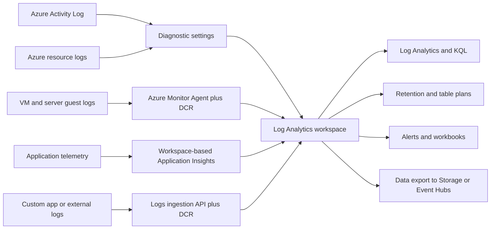
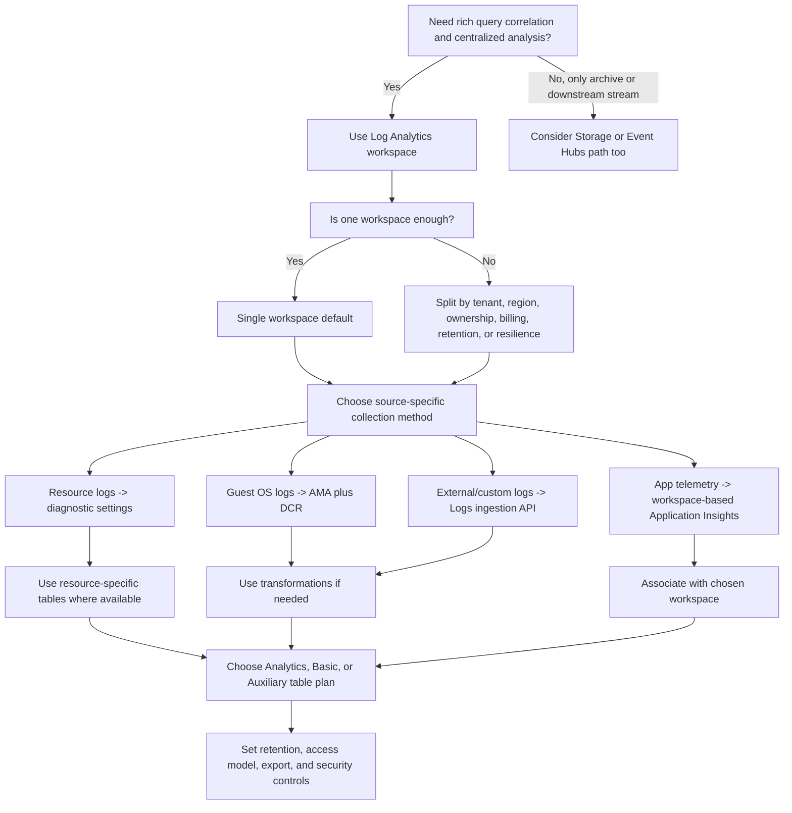
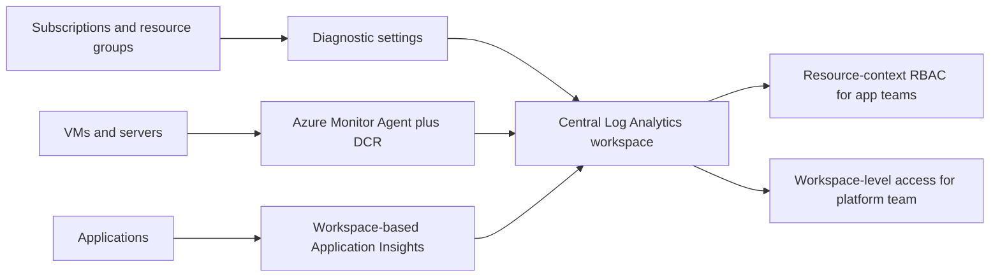

# AZ-305 Study Guide: Recommend a logging solution

> **Exam task:** Design solutions for logging and monitoring — Recommend a logging solution  
> **Estimated reading time:** 45 minutes  
> **Scope boundary:** This guide stays anchored to choosing and structuring an Azure logging architecture with [Azure Monitor](https://learn.microsoft.com/en-us/azure/azure-monitor/), [Azure Monitor Logs](https://learn.microsoft.com/en-us/azure/azure-monitor/logs/data-platform-logs), [Log Analytics workspaces](https://learn.microsoft.com/en-us/azure/azure-monitor/logs/log-analytics-workspace-overview), [data collection rules](https://learn.microsoft.com/en-us/azure/azure-monitor/data-collection/data-collection-rule-overview), [Azure Monitor Agent](https://learn.microsoft.com/en-us/azure/azure-monitor/agents/azure-monitor-agent-overview), [diagnostic settings](https://learn.microsoft.com/en-us/azure/azure-monitor/platform/diagnostic-settings), and related cost, security, and retention choices. It intentionally does **not** turn into a broad guide for [alerting](https://learn.microsoft.com/en-us/azure/azure-monitor/alerts/alerts-overview), [workbooks](https://learn.microsoft.com/en-us/azure/azure-monitor/visualize/workbooks-overview), or full observability design, except where those items clarify the logging decision itself.

## Guide framing

### How to use this guide

Read this guide in order if you want to build an architect’s mental model from the [AZ-305 study guide task statement](https://learn.microsoft.com/en-us/credentials/certifications/resources/study-guides/az-305) to production-grade design choices. The flow starts with what the [Microsoft Learn module](https://learn.microsoft.com/en-us/training/modules/design-solution-to-log-monitor-azure-resources/) teaches, then deepens into the product decisions Microsoft expects you to make when you recommend a logging solution.

By the end, you should be able to decide when to use a single [Log Analytics workspace](https://learn.microsoft.com/en-us/azure/azure-monitor/logs/workspace-design), when to split into multiple workspaces for [tenant](https://learn.microsoft.com/en-us/azure/azure-monitor/logs/workspace-design#azure-tenants), [region](https://learn.microsoft.com/en-us/azure/azure-monitor/logs/workspace-design#azure-regions), [ownership](https://learn.microsoft.com/en-us/azure/azure-monitor/logs/workspace-design#data-ownership), or [retention](https://learn.microsoft.com/en-us/azure/azure-monitor/logs/workspace-design#data-retention) reasons, when to use [resource-specific tables](https://learn.microsoft.com/en-us/azure/azure-monitor/platform/resource-logs#resource-specific) instead of the legacy [AzureDiagnostics](https://learn.microsoft.com/en-us/azure/azure-monitor/reference/tables/azurediagnostics) table, and when to combine or separate operational and security logging based on [workspace design guidance](https://learn.microsoft.com/en-us/azure/azure-monitor/logs/workspace-design#operational-and-security-data).

The exam mapping is narrow. “Recommend a logging solution” is about the **data platform and its structure** in [Azure Monitor Logs](https://learn.microsoft.com/en-us/azure/azure-monitor/logs/data-platform-logs), not merely about whether to create an [alert rule](https://learn.microsoft.com/en-us/azure/azure-monitor/alerts/alerts-types). If a scenario focuses on **where logs land, how they are collected, how they are retained, how access is controlled, and how cost and compliance are managed**, it belongs here. If it focuses mainly on **what signal to alert on, how often to evaluate, or which action group to call**, that leans into the adjacent task of recommending a [monitoring solution](https://learn.microsoft.com/en-us/azure/azure-monitor/alerts/alerts-overview).

### Primary source set

#### Exam and module sources

- [Study guide for Exam AZ-305: Designing Microsoft Azure Infrastructure Solutions](https://learn.microsoft.com/en-us/credentials/certifications/resources/study-guides/az-305)  
- [Design a solution to log and monitor Azure resources](https://learn.microsoft.com/en-us/training/modules/design-solution-to-log-monitor-azure-resources/)  
- [Design for Azure Monitor data sources](https://learn.microsoft.com/en-us/training/modules/design-solution-to-log-monitor-azure-resources/2-design-for-azure-monitor-data-sources)  
- [Design for Azure Monitor Logs workspaces](https://learn.microsoft.com/en-us/training/modules/design-solution-to-log-monitor-azure-resources/3-design-for-log-analytics)

#### Core product documentation

- [Azure Monitor documentation](https://learn.microsoft.com/en-us/azure/azure-monitor/)  
- [Azure Monitor Logs overview](https://learn.microsoft.com/en-us/azure/azure-monitor/logs/data-platform-logs)  
- [Log Analytics workspace overview](https://learn.microsoft.com/en-us/azure/azure-monitor/logs/log-analytics-workspace-overview)  
- [Design a Log Analytics workspace architecture](https://learn.microsoft.com/en-us/azure/azure-monitor/logs/workspace-design)  
- [Azure Monitor data sources and data collection methods](https://learn.microsoft.com/en-us/azure/azure-monitor/fundamentals/data-sources)  
- [Data collection rules in Azure Monitor](https://learn.microsoft.com/en-us/azure/azure-monitor/data-collection/data-collection-rule-overview)  
- [Azure Monitor Agent overview](https://learn.microsoft.com/en-us/azure/azure-monitor/agents/azure-monitor-agent-overview)  
- [Resource logs in Azure Monitor](https://learn.microsoft.com/en-us/azure/azure-monitor/platform/resource-logs)  
- [Diagnostic settings in Azure Monitor](https://learn.microsoft.com/en-us/azure/azure-monitor/platform/diagnostic-settings)  
- [Activity Log in Azure Monitor](https://learn.microsoft.com/en-us/azure/azure-monitor/platform/activity-log)  
- [Select a table plan based on data usage in a Log Analytics workspace](https://learn.microsoft.com/en-us/azure/azure-monitor/logs/logs-table-plans)  
- [Query data in Basic and Auxiliary tables in Azure Monitor Logs](https://learn.microsoft.com/en-us/azure/azure-monitor/logs/basic-logs-query)  
- [Manage data retention in a Log Analytics workspace](https://learn.microsoft.com/en-us/azure/azure-monitor/logs/data-retention-configure)  
- [Azure Monitor Logs cost calculations and options](https://learn.microsoft.com/en-us/azure/azure-monitor/logs/cost-logs)  
- [Analyze usage in a Log Analytics workspace](https://learn.microsoft.com/en-us/azure/azure-monitor/logs/analyze-usage)  
- [Set daily cap on Log Analytics workspace](https://learn.microsoft.com/en-us/azure/azure-monitor/logs/daily-cap)  
- [Manage access to Log Analytics workspaces](https://learn.microsoft.com/en-us/azure/azure-monitor/logs/manage-access)  
- [Log Analytics workspace data export in Azure Monitor](https://learn.microsoft.com/en-us/azure/azure-monitor/logs/logs-data-export)  
- [Configure private link for Azure Monitor](https://learn.microsoft.com/en-us/azure/azure-monitor/fundamentals/private-link-configure)  
- [Enhance resilience by replicating your Log Analytics workspace across regions](https://learn.microsoft.com/en-us/azure/azure-monitor/logs/workspace-replication)  
- [Create and manage a dedicated cluster in Azure Monitor Logs](https://learn.microsoft.com/en-us/azure/azure-monitor/logs/logs-dedicated-clusters)  
- [Azure Monitor customer-managed keys](https://learn.microsoft.com/en-us/azure/azure-monitor/logs/customer-managed-keys)  
- [Create and configure Application Insights resources](https://learn.microsoft.com/en-us/azure/azure-monitor/app/create-workspace-resource)  
- [Integrate Microsoft Entra logs with Azure Monitor logs](https://learn.microsoft.com/en-us/entra/identity/monitoring-health/howto-integrate-activity-logs-with-azure-monitor-logs)

#### Supporting architecture and framework sources

- [Inventory and visibility considerations in the Cloud Adoption Framework](https://learn.microsoft.com/en-us/azure/cloud-adoption-framework/ready/landing-zone/design-area/management-platform)  
- [Monitor Azure platform landing zone components](https://learn.microsoft.com/en-us/azure/cloud-adoption-framework/ready/landing-zone/design-area/management-monitor)  
- [Architecture best practices for Log Analytics in the Well-Architected Framework](https://learn.microsoft.com/en-us/azure/well-architected/service-guides/azure-log-analytics)  
- [Cost optimization in Azure Monitor](https://learn.microsoft.com/en-us/azure/azure-monitor/fundamentals/best-practices-cost)  
- [Preparing for AZ-305: Design identity, governance, and monitoring solutions](https://learn.microsoft.com/en-us/shows/exam-readiness-zone/preparing-for-az-305-01-fy25)

### Exam task scope

The [study guide](https://learn.microsoft.com/en-us/credentials/certifications/resources/study-guides/az-305) places this task inside **Design identity, governance, and monitoring solutions**, under **Design solutions for logging and monitoring**, with three neighboring objectives: [recommend a logging solution, recommend a solution for routing logs, and recommend a monitoring solution](https://learn.microsoft.com/en-us/credentials/certifications/resources/study-guides/az-305#design-identity-governance-and-monitoring-solutions-25-30).

That wording means Microsoft is testing whether you can recommend the **right logging architecture**, not just name the right product. The likely design decisions are the ones in Microsoft’s [workspace architecture guidance](https://learn.microsoft.com/en-us/azure/azure-monitor/logs/workspace-design): single versus multiple workspaces, region placement, tenant boundaries, retention design, cost model, access control, security isolation, and how log sources feed the platform.

In scope are decisions such as choosing [Log Analytics workspaces](https://learn.microsoft.com/en-us/azure/azure-monitor/logs/log-analytics-workspace-overview) as the primary log destination, selecting [resource-specific mode](https://learn.microsoft.com/en-us/azure/azure-monitor/platform/resource-logs#resource-specific) for resource logs, deciding when to use [Analytics, Basic, or Auxiliary table plans](https://learn.microsoft.com/en-us/azure/azure-monitor/logs/data-platform-logs#table-plans), choosing [Azure Monitor Agent](https://learn.microsoft.com/en-us/azure/azure-monitor/agents/azure-monitor-agent-overview) plus [DCRs](https://learn.microsoft.com/en-us/azure/azure-monitor/data-collection/data-collection-rule-overview) for guest OS and custom log collection, and deciding whether you also need [data export](https://learn.microsoft.com/en-us/azure/azure-monitor/logs/logs-data-export), [immutable storage](https://learn.microsoft.com/en-us/azure/azure-monitor/logs/logs-data-export#overview), [Event Hubs](https://learn.microsoft.com/en-us/azure/azure-monitor/platform/diagnostic-settings#destinations), or [Private Link](https://learn.microsoft.com/en-us/azure/azure-monitor/fundamentals/private-link-configure).

Mostly out of scope are detailed designs for [alert evaluation logic](https://learn.microsoft.com/en-us/azure/azure-monitor/alerts/alerts-types), [workbooks and insights](https://learn.microsoft.com/en-us/training/modules/design-solution-to-log-monitor-azure-resources/), and broad observability choices across metrics, dashboards, and response automation. Those items matter only insofar as they influence your logging platform choice, such as choosing [Analytics tables because they support full alerts](https://learn.microsoft.com/en-us/azure/azure-monitor/logs/data-platform-logs#table-plans) or avoiding [Auxiliary tables because they do not support alerts](https://learn.microsoft.com/en-us/azure/azure-monitor/logs/data-platform-logs#table-plans).

## Microsoft Learn baseline and conceptual foundation

### Starting point from the Microsoft Learn module

The [module](https://learn.microsoft.com/en-us/training/modules/design-solution-to-log-monitor-azure-resources/) frames Azure logging around the [common Azure Monitor data platform](https://learn.microsoft.com/en-us/training/modules/design-solution-to-log-monitor-azure-resources/2-design-for-azure-monitor-data-sources), where [logs and metrics](https://learn.microsoft.com/en-us/training/modules/design-solution-to-log-monitor-azure-resources/2-design-for-azure-monitor-data-sources) are the two primary data types. That framing matters because AZ-305 often hides the correct answer behind whether the requirement is **analysis and retention of detailed records** or **near-real-time numeric monitoring**. The module explicitly says [logs enable complex analysis with queries](https://learn.microsoft.com/en-us/training/modules/design-solution-to-log-monitor-azure-resources/2-design-for-azure-monitor-data-sources), while [metrics support near-real-time scenarios](https://learn.microsoft.com/en-us/training/modules/design-solution-to-log-monitor-azure-resources/2-design-for-azure-monitor-data-sources).

The module also introduces the expected collection baseline: [Azure Monitor Agent](https://learn.microsoft.com/en-us/training/modules/design-solution-to-log-monitor-azure-resources/2-design-for-azure-monitor-data-sources) plus [Data Collection Rules](https://learn.microsoft.com/en-us/training/modules/design-solution-to-log-monitor-azure-resources/2-design-for-azure-monitor-data-sources) for guest OS data such as [Windows events, performance counters, Syslog, IIS logs, and custom text or JSON logs](https://learn.microsoft.com/en-us/training/modules/design-solution-to-log-monitor-azure-resources/2-design-for-azure-monitor-data-sources). That is a strong exam clue that legacy agent-first answers are increasingly wrong where the requirement involves new guest-log designs.

For workspace strategy, the module teaches that an [Azure Monitor Logs workspace is both an administrative boundary and a geographic storage boundary](https://learn.microsoft.com/en-us/training/modules/design-solution-to-log-monitor-azure-resources/3-design-for-log-analytics). It also pushes the default guidance that the first design should follow [Microsoft workspace design guidelines](https://learn.microsoft.com/en-us/training/modules/design-solution-to-log-monitor-azure-resources/3-design-for-log-analytics), with a bias toward a [centralized workspace model](https://learn.microsoft.com/en-us/training/modules/design-solution-to-log-monitor-azure-resources/3-design-for-log-analytics) unless there is a real business reason for separation.

The module’s strongest exam-relevant recommendations are these:

- Treat a [single centralized Log Analytics workspace](https://learn.microsoft.com/en-us/training/modules/design-solution-to-log-monitor-azure-resources/3-design-for-log-analytics) as the **default** design because it simplifies cross-resource analysis and centralized administration.  
- Use [workspace-context versus resource-context access](https://learn.microsoft.com/en-us/training/modules/design-solution-to-log-monitor-azure-resources/3-design-for-log-analytics) deliberately, because that decision affects whether users see all workspace data or only data tied to resources they can access.  
- Do **not** split workspaces for scale alone, because [workspaces can grow to petabytes and do not need to be split just for storage scale](https://learn.microsoft.com/en-us/training/modules/design-solution-to-log-monitor-azure-resources/3-design-for-log-analytics).  
- Consider [global company region requirements, outbound transfer concerns, and departmental segregation](https://learn.microsoft.com/en-us/training/modules/design-solution-to-log-monitor-azure-resources/3-design-for-log-analytics) as the real separators.

Where the module is **not** deep enough for exam prep is where the real AZ-305 judgment lives: it does not go far enough into [resource-specific tables versus AzureDiagnostics](https://learn.microsoft.com/en-us/azure/azure-monitor/platform/resource-logs#collection-mode), [table plans and their alert/query limitations](https://learn.microsoft.com/en-us/azure/azure-monitor/logs/data-platform-logs#table-plans), [retention economics](https://learn.microsoft.com/en-us/azure/azure-monitor/logs/data-retention-configure), [data export tradeoffs](https://learn.microsoft.com/en-us/azure/azure-monitor/logs/logs-data-export), [Private Link and AMPLS](https://learn.microsoft.com/en-us/azure/azure-monitor/fundamentals/private-link-configure), [CMK via dedicated clusters](https://learn.microsoft.com/en-us/azure/azure-monitor/logs/customer-managed-keys), or [current retirement notices around legacy ingestion methods](https://learn.microsoft.com/en-us/azure/azure-monitor/logs/private-storage).

> **Exam tip:** If the scenario asks for **rich query correlation, KQL analysis, centralized troubleshooting, or log-based alerting**, your mental default should be a [Log Analytics workspace](https://learn.microsoft.com/en-us/azure/azure-monitor/logs/log-analytics-workspace-overview), not an [Azure Monitor workspace](https://learn.microsoft.com/en-us/azure/azure-monitor/metrics/azure-monitor-workspace-overview), because [Azure Monitor workspaces currently host Prometheus metrics, not general log data](https://learn.microsoft.com/en-us/azure/azure-monitor/metrics/azure-monitor-workspace-overview#contents-of-azure-monitor-workspace).

### Conceptual foundation

A logging solution exists to solve three different architectural problems at once: **operational visibility**, **auditability**, and **retention/compliance**. Microsoft’s [Azure Monitor Logs overview](https://learn.microsoft.com/en-us/azure/azure-monitor/logs/data-platform-logs) describes the platform as a centralized SaaS service for collecting, analyzing, and acting on telemetry from Azure and non-Azure resources. That means the exam is not asking whether you can “turn logging on.” It is asking whether you can build the right **log data supply chain**.

The supply chain starts with **sources**. Azure emits several log classes through different collection paths in [Azure Monitor data sources and data collection methods](https://learn.microsoft.com/en-us/azure/azure-monitor/fundamentals/data-sources):  
- the [Activity Log](https://learn.microsoft.com/en-us/azure/azure-monitor/platform/activity-log) for subscription-level and management-group-level control-plane events,  
- [resource logs](https://learn.microsoft.com/en-us/azure/azure-monitor/platform/resource-logs) for service-specific platform behavior inside a resource,  
- [guest OS data through Azure Monitor Agent](https://learn.microsoft.com/en-us/azure/azure-monitor/agents/azure-monitor-agent-overview) and [DCRs](https://learn.microsoft.com/en-us/azure/azure-monitor/data-collection/data-collection-rule-overview),  
- [Application Insights](https://learn.microsoft.com/en-us/azure/azure-monitor/app/app-insights-overview) for application telemetry,  
- [Microsoft Entra logs](https://learn.microsoft.com/en-us/entra/identity/monitoring-health/howto-integrate-activity-logs-with-azure-monitor-logs), and  
- custom data through the [Logs ingestion API](https://learn.microsoft.com/en-us/azure/azure-monitor/data-collection/data-collection-rule-overview#replaced-legacy-data-collection-methods).

The next step is **transport and shaping**. Azure uses [diagnostic settings](https://learn.microsoft.com/en-us/azure/azure-monitor/platform/diagnostic-settings) for [resource logs, platform metrics, and Activity Log export](https://learn.microsoft.com/en-us/azure/azure-monitor/platform/diagnostic-settings), while [DCRs](https://learn.microsoft.com/en-us/azure/azure-monitor/data-collection/data-collection-rule-overview) define collection, filtering, transformation, and destination for agent-based and API-based workflows. If you need to reduce ingestion cost or remove unwanted fields before storage, [transformations](https://learn.microsoft.com/en-us/azure/azure-monitor/data-collection/data-collection-transformations) are part of the logging design, not an afterthought.

The final step is **storage and access**. In Azure’s logging model, the primary storage unit is the [Log Analytics workspace](https://learn.microsoft.com/en-us/azure/azure-monitor/logs/log-analytics-workspace-overview), and the primary organization unit inside that workspace is the [table](https://learn.microsoft.com/en-us/azure/azure-monitor/logs/data-platform-logs#log-analytics-workspace). Azure then lets you decide how you want to pay for and use each table through [Analytics, Basic, and Auxiliary table plans](https://learn.microsoft.com/en-us/azure/azure-monitor/logs/data-platform-logs#table-plans).

#### How the major services fit together

This diagram is exam-focused because it shows the dominant pattern Microsoft documents today: multiple [Azure Monitor data sources](https://learn.microsoft.com/en-us/azure/azure-monitor/fundamentals/data-sources) converging into a [Log Analytics workspace](https://learn.microsoft.com/en-us/azure/azure-monitor/logs/data-platform-logs#log-analytics-workspace), with [diagnostic settings](https://learn.microsoft.com/en-us/azure/azure-monitor/platform/diagnostic-settings), [Azure Monitor Agent](https://learn.microsoft.com/en-us/azure/azure-monitor/agents/azure-monitor-agent-overview), [DCRs](https://learn.microsoft.com/en-us/azure/azure-monitor/data-collection/data-collection-rule-overview), and [Application Insights](https://learn.microsoft.com/en-us/azure/azure-monitor/app/create-workspace-resource) acting as feed mechanisms.

#### Control plane versus data plane

The [Activity Log](https://learn.microsoft.com/en-us/azure/azure-monitor/platform/activity-log) is fundamentally a **control-plane** log. It records subscription-level events, service health records, and configuration changes, is [collected automatically](https://learn.microsoft.com/en-us/azure/azure-monitor/fundamentals/data-sources#activity-log), and is retained by Azure for [90 days at no charge](https://learn.microsoft.com/en-us/azure/azure-monitor/platform/activity-log#retention-period). If a requirement is “who changed this resource,” “which policy assignment failed,” or “how do I preserve resource creator history,” think [Activity Log](https://learn.microsoft.com/en-us/azure/azure-monitor/platform/activity-log#export-activity-log).

[Resource logs](https://learn.microsoft.com/en-us/azure/azure-monitor/platform/resource-logs) are closer to a **service data-plane and operational view**. They describe operations **within** a resource, vary by provider, and are [not collected by default](https://learn.microsoft.com/en-us/azure/azure-monitor/fundamentals/data-sources#resource-logs). If the requirement is “show every Key Vault audit event,” “capture WAF requests,” or “analyze SQL engine behavior,” think [resource logs enabled through diagnostic settings](https://learn.microsoft.com/en-us/azure/azure-monitor/platform/diagnostic-settings).

Guest OS and workload logs from servers are a separate path. Azure cannot see Windows event logs, Syslog, or text file logs natively without an agent, so the supported design is [Azure Monitor Agent](https://learn.microsoft.com/en-us/azure/azure-monitor/agents/azure-monitor-agent-overview) with [DCRs](https://learn.microsoft.com/en-us/azure/azure-monitor/fundamentals/data-sources#virtual-machine-data).

> **Exam tip:** If the question asks for logs **inside** the guest OS, the answer will usually involve [Azure Monitor Agent](https://learn.microsoft.com/en-us/azure/azure-monitor/agents/azure-monitor-agent-overview) and [Data Collection Rules](https://learn.microsoft.com/en-us/azure/azure-monitor/data-collection/data-collection-rule-overview), not just [diagnostic settings](https://learn.microsoft.com/en-us/azure/azure-monitor/platform/diagnostic-settings), because [diagnostic settings collect platform resource data, while guest data requires agent-based collection](https://learn.microsoft.com/en-us/azure/azure-monitor/fundamentals/data-sources#virtual-machine-data).

#### The most important terms to keep straight

A [Log Analytics workspace](https://learn.microsoft.com/en-us/azure/azure-monitor/logs/log-analytics-workspace-overview) is the main log data store. An [Azure Monitor workspace](https://learn.microsoft.com/en-us/azure/azure-monitor/metrics/azure-monitor-workspace-overview) is a different resource currently focused on Prometheus metrics. A [diagnostic setting](https://learn.microsoft.com/en-us/azure/azure-monitor/platform/diagnostic-settings) routes Activity Log, resource logs, and platform metrics. A [DCR](https://learn.microsoft.com/en-us/azure/azure-monitor/data-collection/data-collection-rule-overview) governs agent-based, API-based, and transformation-driven ingestion. [Resource-specific mode](https://learn.microsoft.com/en-us/azure/azure-monitor/platform/resource-logs#resource-specific) writes each log category to its own table. [AzureDiagnostics](https://learn.microsoft.com/en-us/azure/azure-monitor/reference/tables/azurediagnostics) is the legacy catch-all table used by resources still in diagnostics mode.

> **Exam tip:** Prefer [resource-specific tables](https://learn.microsoft.com/en-us/azure/azure-monitor/platform/resource-logs#resource-specific) for new designs because Microsoft documents easier queries, better schema discoverability, improved performance, and the ability to grant [table-specific RBAC](https://learn.microsoft.com/en-us/azure/azure-monitor/platform/resource-logs#resource-specific). The legacy [AzureDiagnostics](https://learn.microsoft.com/en-us/azure/azure-monitor/reference/tables/azurediagnostics) table is also more prone to the [500-column limit and `AdditionalFields` complexity](https://learn.microsoft.com/en-us/azure/azure-monitor/reference/tables/azurediagnostics#additionalfields-column).

> **Test yourself**
>
> - A company wants to analyze who deleted resources across multiple subscriptions and keep that history for a year. Is this primarily an [Activity Log](https://learn.microsoft.com/en-us/azure/azure-monitor/platform/activity-log) design, a [resource log](https://learn.microsoft.com/en-us/azure/azure-monitor/platform/resource-logs) design, or a guest OS logging design?
> - A team needs Linux application logs written to text files on a VM. Can [diagnostic settings](https://learn.microsoft.com/en-us/azure/azure-monitor/platform/diagnostic-settings) solve that by themselves?
>
> **Answer guidance:** Subscription and management changes point to the [Activity Log](https://learn.microsoft.com/en-us/azure/azure-monitor/platform/activity-log#retention-period), which can be exported to a [Log Analytics workspace](https://learn.microsoft.com/en-us/azure/azure-monitor/platform/activity-log#export-activity-log) for longer retention. Text files on a VM require [Azure Monitor Agent](https://learn.microsoft.com/en-us/azure/azure-monitor/agents/azure-monitor-agent-overview) and a [DCR](https://learn.microsoft.com/en-us/azure/azure-monitor/fundamentals/data-sources#virtual-machine-data), not just [diagnostic settings](https://learn.microsoft.com/en-us/azure/azure-monitor/platform/diagnostic-settings).

## Design decision framework and service comparisons

### Design decision framework

The cleanest way to answer most AZ-305 logging questions is to move through the design in this order.

#### Decide whether the requirement is really about logging

If the scenario emphasizes [centralized query, correlation, retention, or auditability](https://learn.microsoft.com/en-us/azure/azure-monitor/logs/data-platform-logs), it is a logging problem. If it emphasizes proactive detection cadence, threshold logic, and action groups, it is drifting into the neighboring [monitoring solution](https://learn.microsoft.com/en-us/azure/azure-monitor/alerts/alerts-overview) task.

#### Choose the primary destination first

If users need to [query logs with KQL, correlate tables, build workbooks, and create log-based alerts](https://learn.microsoft.com/en-us/azure/azure-monitor/platform/resource-logs#send-the-resource-logs-to-a-log-analytics-workspace), the destination should usually be a [Log Analytics workspace](https://learn.microsoft.com/en-us/azure/azure-monitor/logs/log-analytics-workspace-overview). If the requirement is immutable retention, backup-style archive, or downstream external processing, add [Azure Storage](https://learn.microsoft.com/en-us/azure/azure-monitor/platform/diagnostic-settings#destinations), [Event Hubs](https://learn.microsoft.com/en-us/azure/azure-monitor/platform/diagnostic-settings#destinations), or [workspace data export](https://learn.microsoft.com/en-us/azure/azure-monitor/logs/logs-data-export#overview) as a secondary path.

#### Start with one workspace unless you can defend more

Microsoft’s [workspace design guidance](https://learn.microsoft.com/en-us/azure/azure-monitor/logs/workspace-design#design-strategy) is explicit: start with a single workspace and only add more when requirements such as [multiple tenants](https://learn.microsoft.com/en-us/azure/azure-monitor/logs/workspace-design#azure-tenants), [regional sovereignty](https://learn.microsoft.com/en-us/azure/azure-monitor/logs/workspace-design#azure-regions), [data ownership](https://learn.microsoft.com/en-us/azure/azure-monitor/logs/workspace-design#data-ownership), [split billing](https://learn.microsoft.com/en-us/azure/azure-monitor/logs/workspace-design#split-billing), [different retention on the same table across resources](https://learn.microsoft.com/en-us/azure/azure-monitor/logs/workspace-design#data-retention), or [regional resilience](https://learn.microsoft.com/en-us/azure/azure-monitor/logs/workspace-design#resilience) justify the added complexity.

#### Pick the collection method by source type

Use [diagnostic settings](https://learn.microsoft.com/en-us/azure/azure-monitor/platform/diagnostic-settings) for [resource logs, platform metrics, and Activity Log export](https://learn.microsoft.com/en-us/azure/azure-monitor/platform/diagnostic-settings). Use [Azure Monitor Agent](https://learn.microsoft.com/en-us/azure/azure-monitor/agents/azure-monitor-agent-overview) and [DCRs](https://learn.microsoft.com/en-us/azure/azure-monitor/data-collection/data-collection-rule-overview) for [Windows events, Syslog, perf counters, IIS logs, and custom files](https://learn.microsoft.com/en-us/azure/azure-monitor/fundamentals/data-sources#virtual-machine-data). Use [workspace-based Application Insights](https://learn.microsoft.com/en-us/azure/azure-monitor/app/create-workspace-resource) for app telemetry. Use the [Logs ingestion API](https://learn.microsoft.com/en-us/azure/azure-monitor/data-collection/data-collection-rule-overview#replaced-legacy-data-collection-methods) when external systems or custom producers need API-based ingestion with [OAuth authentication and DCR-governed transformations](https://learn.microsoft.com/en-us/azure/azure-monitor/data-collection/data-collection-rule-overview#replaced-legacy-data-collection-methods).

#### Prefer resource-specific mode when available

For Azure resource logs, choose [resource-specific mode](https://learn.microsoft.com/en-us/azure/azure-monitor/platform/resource-logs#resource-specific) unless a scenario forces compatibility with existing [AzureDiagnostics](https://learn.microsoft.com/en-us/azure/azure-monitor/reference/tables/azurediagnostics) content. Microsoft documents that resource-specific mode improves [query simplicity, schema discoverability, ingestion latency, query performance, and table-level RBAC](https://learn.microsoft.com/en-us/azure/azure-monitor/platform/resource-logs#resource-specific).

#### Match the table plan to the data’s business value

Use [Analytics tables](https://learn.microsoft.com/en-us/azure/azure-monitor/logs/data-platform-logs#table-plans) for high-value data that powers continuous monitoring, rich KQL, dashboards, and full alerting. Use [Basic tables](https://learn.microsoft.com/en-us/azure/azure-monitor/logs/data-platform-logs#table-plans) for medium-touch troubleshooting or incident-response data where reduced ingestion cost matters and the limitations are acceptable. Use [Auxiliary tables](https://learn.microsoft.com/en-us/azure/azure-monitor/logs/data-platform-logs#table-plans) for low-touch, verbose, audit, or compliance data where minimal ingestion cost matters more than interactive analytics.

#### Design retention separately from ingestion

Hot analytics needs point to [Analytics retention](https://learn.microsoft.com/en-us/azure/azure-monitor/logs/data-retention-configure#analytics-long-term-and-total-retention). Long compliance retention points to [table-level total retention up to 12 years](https://learn.microsoft.com/en-us/azure/azure-monitor/logs/data-retention-configure#configure-table-level-retention), or to [Storage with immutability](https://learn.microsoft.com/en-us/azure/azure-monitor/logs/logs-data-export#overview) when tamper protection is required.

#### Design access as part of the logging solution

Use the workspace’s [resource-context access mode](https://learn.microsoft.com/en-us/azure/azure-monitor/logs/manage-access#access-mode) when resource owners should access only their own data. Add [granular RBAC or table-level RBAC](https://learn.microsoft.com/en-us/azure/azure-monitor/logs/manage-access#set-granular-rbac) only when you truly need per-table restrictions across shared workspaces.

> **Exam tip:** “Multiple workspaces” is not the sophisticated answer by default. The sophisticated answer is usually a [single workspace](https://learn.microsoft.com/en-us/azure/azure-monitor/logs/workspace-design#design-strategy) plus appropriate [resource-context access](https://learn.microsoft.com/en-us/azure/azure-monitor/logs/manage-access#access-mode), [table-level controls](https://learn.microsoft.com/en-us/azure/azure-monitor/logs/manage-access#set-granular-rbac), and [table-specific retention](https://learn.microsoft.com/en-us/azure/azure-monitor/logs/data-retention-configure#configure-table-level-retention), unless a documented separation criterion applies.

### Service and feature comparison tables

#### Source and collection method map

| Requirement | Recommended path | Why this fits the task |
|---|---|---|
| Subscription or management-group change history | [Activity Log](https://learn.microsoft.com/en-us/azure/azure-monitor/platform/activity-log) exported through [diagnostic settings](https://learn.microsoft.com/en-us/azure/azure-monitor/platform/diagnostic-settings) to a [Log Analytics workspace](https://learn.microsoft.com/en-us/azure/azure-monitor/platform/activity-log#export-activity-log) | The [Activity Log](https://learn.microsoft.com/en-us/azure/azure-monitor/platform/activity-log#retention-period) is collected automatically, kept by Azure for [90 days](https://learn.microsoft.com/en-us/azure/azure-monitor/platform/activity-log#retention-period), and can be sent to a workspace with [no ingestion charge](https://learn.microsoft.com/en-us/azure/azure-monitor/platform/activity-log#export-activity-log). |
| Service-specific operational and audit events from Azure resources | [Resource logs](https://learn.microsoft.com/en-us/azure/azure-monitor/platform/resource-logs) through [diagnostic settings](https://learn.microsoft.com/en-us/azure/azure-monitor/platform/diagnostic-settings) | [Resource logs are not collected by default](https://learn.microsoft.com/en-us/azure/azure-monitor/fundamentals/data-sources#resource-logs), and [diagnostic settings](https://learn.microsoft.com/en-us/azure/azure-monitor/platform/diagnostic-settings) are the standard routing mechanism. |
| Windows event logs, Syslog, perf counters, IIS logs, local text or JSON logs | [Azure Monitor Agent](https://learn.microsoft.com/en-us/azure/azure-monitor/agents/azure-monitor-agent-overview) with [DCRs](https://learn.microsoft.com/en-us/azure/azure-monitor/data-collection/data-collection-rule-overview) | Azure guest telemetry requires agent-based collection, and the supported design is [AMA plus DCRs](https://learn.microsoft.com/en-us/azure/azure-monitor/fundamentals/data-sources#virtual-machine-data). |
| Application requests, traces, exceptions, availability, dependencies | [Workspace-based Application Insights](https://learn.microsoft.com/en-us/azure/azure-monitor/app/create-workspace-resource) | [Application Insights now integrates with Log Analytics and classic resources have been retired](https://learn.microsoft.com/en-us/azure/azure-monitor/app/create-workspace-resource#important). |
| Sign-ins and tenant audit trail | [Microsoft Entra diagnostic settings](https://learn.microsoft.com/en-us/entra/identity/monitoring-health/howto-configure-diagnostic-settings) to [Azure Monitor logs](https://learn.microsoft.com/en-us/entra/identity/monitoring-health/howto-integrate-activity-logs-with-azure-monitor-logs) | This lets you correlate identity events with application and platform logs in one workspace. |
| Custom data from REST clients or external systems | [Logs ingestion API](https://learn.microsoft.com/en-us/azure/azure-monitor/data-collection/data-collection-rule-overview#replaced-legacy-data-collection-methods) with [DCR schema and transformation control](https://learn.microsoft.com/en-us/azure/azure-monitor/fundamentals/data-sources#custom-sources) | Microsoft positions the [Logs ingestion API](https://learn.microsoft.com/en-us/azure/azure-monitor/data-collection/data-collection-rule-overview#replaced-legacy-data-collection-methods) as the successor to the legacy Data Collector API. |

#### Destination and outcome map

| Destination | Best when | Key strengths | Key limitations |
|---|---|---|---|
| [Log Analytics workspace](https://learn.microsoft.com/en-us/azure/azure-monitor/logs/log-analytics-workspace-overview) | You need centralized KQL, correlation, alerting, and workbook analysis | Supports [queries](https://learn.microsoft.com/en-us/azure/azure-monitor/platform/resource-logs#send-the-resource-logs-to-a-log-analytics-workspace), [log alerts](https://learn.microsoft.com/en-us/azure/azure-monitor/platform/resource-logs#send-the-resource-logs-to-a-log-analytics-workspace), [retention controls](https://learn.microsoft.com/en-us/azure/azure-monitor/logs/data-retention-configure), [table plans](https://learn.microsoft.com/en-us/azure/azure-monitor/logs/data-platform-logs#table-plans), and [RBAC](https://learn.microsoft.com/en-us/azure/azure-monitor/logs/manage-access) | Ingestion and retention drive cost in [Azure Monitor Logs pricing](https://learn.microsoft.com/en-us/azure/azure-monitor/logs/cost-logs). |
| [Azure Storage account](https://learn.microsoft.com/en-us/azure/azure-monitor/platform/diagnostic-settings#destinations) | You need archive, static analysis, backup-style retention, or tamper protection | Can be used with [immutability policies](https://learn.microsoft.com/en-us/azure/azure-monitor/platform/diagnostic-settings#destinations) and is often cheaper for long-term raw retention | Less useful for native interactive investigation than a [Log Analytics workspace](https://learn.microsoft.com/en-us/azure/azure-monitor/logs/log-analytics-workspace-overview). |
| [Azure Event Hubs](https://learn.microsoft.com/en-us/azure/azure-monitor/platform/diagnostic-settings#destinations) | You need streaming to external SIEM or downstream processors | Good for near-real-time fan-out to non-Microsoft tools | Regional and network constraints apply in [diagnostic settings guidance](https://learn.microsoft.com/en-us/azure/azure-monitor/platform/diagnostic-settings#destinations). |
| [Workspace data export](https://learn.microsoft.com/en-us/azure/azure-monitor/logs/logs-data-export#overview) | You want continuous export of selected workspace tables after ingestion | Exports [selected tables as data arrives](https://learn.microsoft.com/en-us/azure/azure-monitor/logs/logs-data-export#overview) and supports [Storage or Event Hubs](https://learn.microsoft.com/en-us/azure/azure-monitor/logs/logs-data-export#overview) | Data is [exported without per-table filtering unless you transform before ingestion](https://learn.microsoft.com/en-us/azure/azure-monitor/logs/logs-data-export#overview), some [tables are unsupported](https://learn.microsoft.com/en-us/azure/azure-monitor/logs/logs-data-export#unsupported-tables), and there are [separate export charges](https://learn.microsoft.com/en-us/azure/azure-monitor/logs/logs-data-export#pricing-model). |

#### Table plan comparison

| Plan | Use it for | Important capabilities | Important constraints |
|---|---|---|---|
| [Analytics](https://learn.microsoft.com/en-us/azure/azure-monitor/logs/data-platform-logs#table-plans) | High-value data for continuous monitoring, detection, troubleshooting, and performance analytics | Supports [full query capabilities, alerts, insights, dashboards, export, restore, and summary rules](https://learn.microsoft.com/en-us/azure/azure-monitor/logs/data-platform-logs#table-plans) | Higher ingestion cost than [Basic or Auxiliary](https://learn.microsoft.com/en-us/azure/azure-monitor/logs/data-platform-logs#table-plans). |
| [Basic](https://learn.microsoft.com/en-us/azure/azure-monitor/logs/data-platform-logs#table-plans) | Medium-touch verbose data for troubleshooting and incident response | Lower ingestion cost and still supports [simple log alerts, dashboards, export, search jobs, and summary rules with limits](https://learn.microsoft.com/en-us/azure/azure-monitor/logs/data-platform-logs#table-plans) | Querying has [single-table limitations and cross-resource restrictions](https://learn.microsoft.com/en-us/azure/azure-monitor/logs/basic-logs-query#limitations), and [Power BI cannot query Basic tables through the Azure API](https://learn.microsoft.com/en-us/azure/azure-monitor/logs/basic-logs-query#limitations). |
| [Auxiliary](https://learn.microsoft.com/en-us/azure/azure-monitor/logs/create-custom-table-auxiliary) | Low-touch audit, compliance, or verbose custom logs | Lowest ingestion cost and designed for [DCR-based custom tables](https://learn.microsoft.com/en-us/azure/azure-monitor/logs/create-custom-table-auxiliary), with [up to 12 years total retention](https://learn.microsoft.com/en-us/azure/azure-monitor/logs/data-platform-logs#table-plans) | Only supports [DCR-based custom tables](https://learn.microsoft.com/en-us/azure/azure-monitor/logs/create-custom-table-auxiliary), does **not** support [alerts, data export, or restore](https://learn.microsoft.com/en-us/azure/azure-monitor/logs/data-platform-logs#table-plans), has slower queries, and [workspace replication does not protect Auxiliary data](https://learn.microsoft.com/en-us/azure/azure-monitor/logs/data-platform-logs#table-plans). |

#### Workspace topology comparison

| Pattern | When to choose it | Why | Tradeoff |
|---|---|---|---|
| [Single workspace](https://learn.microsoft.com/en-us/azure/azure-monitor/logs/workspace-design#design-strategy) | Default case | Simplifies centralized search, correlation, access, and commitment tier economics | Needs careful [RBAC design](https://learn.microsoft.com/en-us/azure/azure-monitor/logs/manage-access). |
| [Multiple workspaces by region](https://learn.microsoft.com/en-us/azure/azure-monitor/logs/workspace-design#azure-regions) | Data residency or regulatory placement requirements | Aligns storage location to sovereignty requirements | Adds query and administration complexity. |
| [Multiple workspaces by owner or business unit](https://learn.microsoft.com/en-us/azure/azure-monitor/logs/workspace-design#data-ownership) | Strong data ownership or segregation requirement | Creates clean administrative boundaries | Weakens cross-estate correlation. |
| [Separate operational and security workspaces](https://learn.microsoft.com/en-us/azure/azure-monitor/logs/workspace-design#operational-and-security-data) | Security team ownership or Sentinel pricing needs drive separation | Segregates ownership and may avoid paying Sentinel pricing on all operational data | Reduces unified visibility unless you query across workspaces. |
| [Dedicated cluster](https://learn.microsoft.com/en-us/azure/azure-monitor/logs/logs-dedicated-clusters) | You need [CMK](https://learn.microsoft.com/en-us/azure/azure-monitor/logs/customer-managed-keys), [Lockbox](https://learn.microsoft.com/en-us/azure/azure-monitor/logs/customer-managed-keys), or combined commitment economics at high ingestion scale | Adds advanced security and shared commitment benefits | Commitment starts at [100 GB/day](https://learn.microsoft.com/en-us/azure/azure-monitor/logs/logs-dedicated-clusters#cluster-pricing-model), and linked workspaces must be in the [same region as the cluster](https://learn.microsoft.com/en-us/azure/azure-monitor/logs/logs-dedicated-clusters#preparation). |

> **Test yourself**
>
> - A company wants to save money on verbose audit-like custom logs, keep them for years, and very rarely query them. Would you choose an [Analytics table](https://learn.microsoft.com/en-us/azure/azure-monitor/logs/data-platform-logs#table-plans), a [Basic table](https://learn.microsoft.com/en-us/azure/azure-monitor/logs/data-platform-logs#table-plans), or an [Auxiliary table](https://learn.microsoft.com/en-us/azure/azure-monitor/logs/create-custom-table-auxiliary)?
> - An architect wants one workspace per region solely because they believe one workspace cannot scale. Is that aligned with [Microsoft workspace design guidance](https://learn.microsoft.com/en-us/azure/azure-monitor/logs/workspace-design#design-strategy)?
>
> **Answer guidance:** Rarely queried compliance-style custom logs align best with the [Auxiliary plan](https://learn.microsoft.com/en-us/azure/azure-monitor/logs/create-custom-table-auxiliary) if its [limitations](https://learn.microsoft.com/en-us/azure/azure-monitor/logs/data-platform-logs#table-plans) are acceptable. Splitting for scale alone is not the documented default because Microsoft says to [start with a single workspace and use the fewest workspaces possible](https://learn.microsoft.com/en-us/azure/azure-monitor/logs/workspace-design#design-strategy).

## Architecture patterns and implementation awareness

### Architecture patterns

#### Centralized platform workspace with resource-context access

This is the default pattern in both the [module](https://learn.microsoft.com/en-us/training/modules/design-solution-to-log-monitor-azure-resources/3-design-for-log-analytics) and the [workspace design guidance](https://learn.microsoft.com/en-us/azure/azure-monitor/logs/workspace-design#design-strategy). It applies when the platform team wants a central operational lens, but application teams still need access only to their own resources.

This pattern works because [resource-context mode](https://learn.microsoft.com/en-us/azure/azure-monitor/logs/manage-access#access-mode) lets application owners query only data associated with resources they can access, while the central team still uses [workspace-context access](https://learn.microsoft.com/en-us/azure/azure-monitor/logs/manage-access#access-mode) for estate-wide analysis. Its strengths are simplicity, broad correlation, and a stronger chance of reaching [commitment-tier pricing benefits](https://learn.microsoft.com/en-us/azure/azure-monitor/logs/workspace-design#commitment-tiers). Its main weakness is that you may need [table-level or granular RBAC](https://learn.microsoft.com/en-us/azure/azure-monitor/logs/manage-access#set-granular-rbac) if some data sets, such as security tables, must be hidden even in a shared workspace.

#### Split operational and security workspaces

This pattern applies when the security boundary matters more than unified visibility, or when [Microsoft Sentinel pricing](https://learn.microsoft.com/en-us/azure/azure-monitor/logs/workspace-design#operational-and-security-data) makes a combined workspace unattractive. Microsoft explicitly notes that enabling Sentinel on a workspace means all data in that workspace is subject to Sentinel pricing, even if some of it is purely operational.

The strength of the split pattern is ownership separation and potentially cleaner cost allocation. The weakness is weaker out-of-the-box cross-correlation and more operational overhead. If the question says the security team must own SIEM data separately while platform teams own operational logging, this pattern is often the better answer than a monolithic shared workspace.

#### Compliance archive plus interactive workspace

This pattern fits heavily regulated environments where teams need both **interactive investigation** and **tamper-resistant retention**. The interactive source remains a [Log Analytics workspace](https://learn.microsoft.com/en-us/azure/azure-monitor/logs/log-analytics-workspace-overview), while long-term or tamper-sensitive copies are sent to [Storage with immutability](https://learn.microsoft.com/en-us/azure/azure-monitor/logs/logs-data-export#overview) through either [diagnostic settings](https://learn.microsoft.com/en-us/azure/azure-monitor/platform/diagnostic-settings#destinations) or [workspace data export](https://learn.microsoft.com/en-us/azure/azure-monitor/logs/logs-data-export#overview).

This pattern solves a subtle exam requirement: a [Log Analytics workspace](https://learn.microsoft.com/en-us/azure/azure-monitor/logs/log-analytics-workspace-overview) is excellent for operations, but it is not the same thing as immutable WORM storage because [workspace data can be purged, while exported data in immutable Storage can be made tamper protected](https://learn.microsoft.com/en-us/azure/azure-monitor/logs/logs-data-export#overview).

#### Private logging plane for restricted networks

This pattern applies when monitored resources must not use public Azure Monitor ingress or query paths. Microsoft’s documented approach is [Azure Monitor Private Link Scope](https://learn.microsoft.com/en-us/azure/azure-monitor/fundamentals/private-link-configure), which connects [Log Analytics workspaces and DCEs](https://learn.microsoft.com/en-us/azure/azure-monitor/fundamentals/private-link-configure#connect-resources-to-the-ampls) to a private endpoint.

The strength is network isolation. The weakness is added DNS, endpoint, and lifecycle complexity. This is usually not the right exam answer unless the scenario explicitly mentions restricted private networking, data exfiltration concerns, or blocking public log ingestion/query access.

#### Multi-region critical logging pattern

This pattern applies when the question says logging must continue or remain available across a regional incident. Microsoft’s [workspace design guidance](https://learn.microsoft.com/en-us/azure/azure-monitor/logs/workspace-design#resilience) suggests ingesting some or all data into multiple workspaces in different regions, while [workspace replication](https://learn.microsoft.com/en-us/azure/azure-monitor/logs/workspace-replication) exists as a dedicated resilience feature for cross-regional protection.

The strength is resilience. The weakness is that [alerts and workbooks do not automatically know to switch when you use multiple workspaces](https://learn.microsoft.com/en-us/azure/azure-monitor/logs/workspace-design#resilience), so the architecture must include operational failover planning. This is exactly the kind of nuance AZ-305 likes to test.

> **Exam tip:** If the requirement is “same data must survive a region failure,” do not stop at “put it in one workspace.” Think about either [multiple regional workspaces](https://learn.microsoft.com/en-us/azure/azure-monitor/logs/workspace-design#resilience) or [workspace replication](https://learn.microsoft.com/en-us/azure/azure-monitor/logs/workspace-replication), and remember that [Auxiliary tables are not protected by workspace replication](https://learn.microsoft.com/en-us/azure/azure-monitor/logs/data-platform-logs#table-plans).

### Implementation awareness for architects

Architects are not expected to memorize every portal click, but AZ-305 expects design decisions that implementation teams cannot safely guess later.

You should decide the [workspace region and count](https://learn.microsoft.com/en-us/azure/azure-monitor/logs/workspace-design#design-strategy), the [access control mode](https://learn.microsoft.com/en-us/azure/azure-monitor/logs/manage-access#access-mode), the [table plan strategy](https://learn.microsoft.com/en-us/azure/azure-monitor/logs/data-platform-logs#table-plans), the [retention model](https://learn.microsoft.com/en-us/azure/azure-monitor/logs/data-retention-configure), and whether you need [export](https://learn.microsoft.com/en-us/azure/azure-monitor/logs/logs-data-export), [Private Link](https://learn.microsoft.com/en-us/azure/azure-monitor/fundamentals/private-link-configure), or a [dedicated cluster](https://learn.microsoft.com/en-us/azure/azure-monitor/logs/logs-dedicated-clusters) **before** delivery teams start building.

You should also understand the collection dependencies. [Diagnostic settings](https://learn.microsoft.com/en-us/azure/azure-monitor/platform/diagnostic-settings) are configured per resource, with [up to five diagnostic settings per resource](https://learn.microsoft.com/en-us/azure/azure-monitor/platform/diagnostic-settings#destinations), and [one destination of each type per setting](https://learn.microsoft.com/en-us/azure/azure-monitor/platform/diagnostic-settings#destinations). [Category groups](https://learn.microsoft.com/en-us/azure/azure-monitor/platform/diagnostic-settings#category-groups) can simplify policy-driven rollout because Microsoft manages their membership over time.

For agent collection, the supported direction is [Azure Monitor Agent](https://learn.microsoft.com/en-us/azure/azure-monitor/agents/azure-monitor-agent-overview), not the legacy Log Analytics agent, because Microsoft documents AMA as the [supported agent](https://learn.microsoft.com/en-us/azure/azure-monitor/agents/azure-monitor-agent-overview). For custom ingestion, the platform direction is the [Logs ingestion API](https://learn.microsoft.com/en-us/azure/azure-monitor/data-collection/data-collection-rule-overview#replaced-legacy-data-collection-methods), not the legacy Data Collector API.

Current-version awareness matters on this task:

- [Classic Application Insights resources have been retired](https://learn.microsoft.com/en-us/azure/azure-monitor/app/create-workspace-resource#important), so new app logging designs should assume [workspace-based Application Insights](https://learn.microsoft.com/en-us/azure/azure-monitor/app/create-workspace-resource).  
- [Auxiliary logs are GA in public cloud regions except Qatar Central and are not available in Azure Government or China clouds](https://learn.microsoft.com/en-us/azure/azure-monitor/logs/create-custom-table-auxiliary).  
- [Creating or updating linked storage accounts for classic custom logs and IIS logs was deprecated after June 30, 2025, and existing links are being removed; Microsoft recommends migrating to Azure Monitor Agent](https://learn.microsoft.com/en-us/azure/azure-monitor/logs/private-storage#prerequisites).  
- [Logs Query API endpoints require TLS 1.2 or higher as of July 1, 2025, and Logs Ingestion API endpoints require TLS 1.2 or higher as of March 1, 2026](https://learn.microsoft.com/en-us/azure/azure-monitor/fundamentals/best-practices-security#secure-logs-data-in-transit).  
- [Portal and API support up to 12 years total retention, while CLI and PowerShell are still limited to seven years for that specific setting at the time of the current retention article](https://learn.microsoft.com/en-us/azure/azure-monitor/logs/data-retention-configure#configure-table-level-retention).

What can usually be deferred to implementation teams are exact resource names, the detailed KQL of specific transformations, and the deployment mechanism itself across [portal, CLI, PowerShell, Bicep, or ARM](https://learn.microsoft.com/en-us/azure/azure-monitor/logs/logs-dedicated-clusters#resource-manager-template-samples), **as long as** the architectural choices are already fixed.

> **Test yourself**
>
> - A design requires private ingestion of custom logs from servers over a private network. What extra components beyond a [workspace](https://learn.microsoft.com/en-us/azure/azure-monitor/logs/log-analytics-workspace-overview) should you be looking for?
> - A design document proposes the legacy HTTP Data Collector API for new custom ingestion because “it’s simpler.” Is that still aligned with Microsoft’s documented direction?
>
> **Answer guidance:** Private ingestion should trigger thinking about [AMPLS](https://learn.microsoft.com/en-us/azure/azure-monitor/fundamentals/private-link-configure) and, for some custom workflows, a [DCE](https://learn.microsoft.com/en-us/azure/azure-monitor/fundamentals/private-link-configure#connect-resources-to-the-ampls). New custom ingestion should favor the [Logs ingestion API](https://learn.microsoft.com/en-us/azure/azure-monitor/data-collection/data-collection-rule-overview#replaced-legacy-data-collection-methods), which Microsoft documents as the successor to the legacy Data Collector API.

## Security, resiliency, cost, and operations

### Security, governance, and compliance considerations

The first security decision is usually not encryption. It is **who can see which logs**. Microsoft recommends [resource-context access](https://learn.microsoft.com/en-us/azure/azure-monitor/logs/manage-access#access-mode) so resource owners can view their data without broad workspace access, and [granular RBAC](https://learn.microsoft.com/en-us/azure/azure-monitor/logs/manage-access#set-granular-rbac) when you need table- or row-level control in shared environments.

The second security decision is network exposure. If the environment has strict private connectivity requirements, use [Azure Monitor Private Link Scope](https://learn.microsoft.com/en-us/azure/azure-monitor/fundamentals/private-link-configure) with [private endpoints](https://learn.microsoft.com/en-us/azure/azure-monitor/fundamentals/private-link-configure#connect-ampls-to-a-private-endpoint). This is especially relevant when the question includes regulated landing zones, no-public-endpoint policies, or east-west-only network paths.

The third security decision is data protection at rest. Azure Monitor already encrypts data with Microsoft-managed keys, but if you need control of the key lifecycle, [customer-managed keys in Azure Monitor require a dedicated cluster](https://learn.microsoft.com/en-us/azure/azure-monitor/logs/customer-managed-keys#customer-managed-key-overview). Microsoft also documents that the [Key Vault, dedicated cluster, and linked workspaces must be in the same region](https://learn.microsoft.com/en-us/azure/azure-monitor/logs/customer-managed-keys#how-customer-managed-keys-work-in-azure-monitor), which is a classic exam constraint.

Compliance often adds retention and immutability. For in-workspace retention, tables can be kept for [up to 12 years total retention](https://learn.microsoft.com/en-us/azure/azure-monitor/logs/data-retention-configure#configure-table-level-retention). For tamper-protected retention, use [Storage with immutability policies](https://learn.microsoft.com/en-us/azure/azure-monitor/logs/logs-data-export#overview). For identity audit requirements, route [Microsoft Entra logs](https://learn.microsoft.com/en-us/entra/identity/monitoring-health/howto-configure-diagnostic-settings) into [Azure Monitor logs](https://learn.microsoft.com/en-us/entra/identity/monitoring-health/howto-integrate-activity-logs-with-azure-monitor-logs).

At scale, governance usually means [Azure Policy built-ins for Azure Monitor](https://learn.microsoft.com/en-us/azure/azure-monitor/fundamentals/policy-reference), including policy definitions that can [audit diagnostic settings](https://learn.microsoft.com/en-us/azure/azure-monitor/fundamentals/policy-reference), enforce [activity log retention expectations](https://learn.microsoft.com/en-us/azure/azure-monitor/fundamentals/policy-reference), and constrain design choices for DCR and Application Insights. In landing-zone thinking, the [Cloud Adoption Framework](https://learn.microsoft.com/en-us/azure/cloud-adoption-framework/ready/landing-zone/design-area/management-platform) recommends a [centralized logging model unless RBAC, sovereignty, or retention requirements justify separation](https://learn.microsoft.com/en-us/azure/cloud-adoption-framework/ready/landing-zone/design-area/management-platform#inventory-and-visibility-recommendations).

> **Exam tip:** If the scenario says “application teams must use the shared platform workspace but must not see other teams’ data,” do **not** jump straight to “multiple workspaces.” The documented first answer is often [resource-context access](https://learn.microsoft.com/en-us/azure/azure-monitor/logs/manage-access#access-mode) plus, if needed, [granular RBAC](https://learn.microsoft.com/en-us/azure/azure-monitor/logs/manage-access#set-granular-rbac).

### Resiliency, availability, and disaster recovery considerations

The baseline retention characteristics matter. The [Activity Log](https://learn.microsoft.com/en-us/azure/azure-monitor/platform/activity-log#retention-period) is retained by Azure for [90 days](https://learn.microsoft.com/en-us/azure/azure-monitor/platform/activity-log#retention-period). If that is not enough, export it to a [Log Analytics workspace](https://learn.microsoft.com/en-us/azure/azure-monitor/platform/activity-log#export-activity-log) or [Storage](https://learn.microsoft.com/en-us/azure/azure-monitor/platform/activity-log#export-activity-log). Inside a workspace, [Analytics retention defaults to 30 days for most tables](https://learn.microsoft.com/en-us/azure/azure-monitor/logs/data-retention-configure#analytics-long-term-and-total-retention), with special cases like [AzureActivity, Usage, and Application Insights tables that keep 90 days at no charge](https://learn.microsoft.com/en-us/azure/azure-monitor/logs/data-retention-configure#log-tables-with-90-day-default-retention).

For regional resilience, Microsoft offers two patterns. One is [ingesting some or all critical data into multiple workspaces in different regions](https://learn.microsoft.com/en-us/azure/azure-monitor/logs/workspace-design#resilience). The other is [workspace replication](https://learn.microsoft.com/en-us/azure/azure-monitor/logs/workspace-replication), which is Microsoft’s more complete service-resilience feature for a workspace. The first pattern is easier to understand conceptually, but Microsoft warns that [dependent objects such as alerts and workbooks do not automatically switch to the alternate workspace](https://learn.microsoft.com/en-us/azure/azure-monitor/logs/workspace-design#resilience). The second pattern is usually more elegant when the question is explicitly about cross-regional continuity of the logging plane itself.

Dedicated clusters can strengthen in-region resilience because Microsoft documents [availability zone support](https://learn.microsoft.com/en-us/azure/azure-monitor/logs/logs-dedicated-clusters#advanced-capabilities) for supported regions. That said, zone resilience is not the same thing as cross-region resilience.

One subtle but important limitation is that [Auxiliary tables are not protected by workspace replication](https://learn.microsoft.com/en-us/azure/azure-monitor/logs/data-platform-logs#table-plans). If the scenario says the data is both **critical in a regional outage** and **best stored in Auxiliary for cost**, the architect must choose which requirement dominates or design a separate protection path.

Data export has resilience implications too. Microsoft documents that [workspace data export retries for up to 12 hours when the destination is unavailable, may duplicate some records, and discards data after the retry window if the destination is still unavailable](https://learn.microsoft.com/en-us/azure/azure-monitor/logs/logs-data-export#data-completeness). That makes export valuable, but not a magic durability guarantee for every failure mode.

### Cost and licensing considerations

The major cost drivers are [ingestion and retention in Log Analytics workspaces](https://learn.microsoft.com/en-us/azure/azure-monitor/logs/cost-logs). That is why the architect’s highest-value cost decisions are usually **what to collect, where to collect it, and which table plan to use**, not how fancy the dashboard is.

Workspace shape affects cost. Microsoft explicitly states that [consolidating data in a single workspace can help you reach commitment tiers](https://learn.microsoft.com/en-us/azure/azure-monitor/logs/workspace-design#commitment-tiers). If your data volume is high enough, that can be cheaper than spreading data across smaller workspaces. At higher scale, a [dedicated cluster](https://learn.microsoft.com/en-us/azure/azure-monitor/logs/logs-dedicated-clusters#cluster-pricing-model) begins at [100 GB/day commitment](https://learn.microsoft.com/en-us/azure/azure-monitor/logs/logs-dedicated-clusters#cluster-pricing-model) and can pool commitment economics across linked workspaces in the same region.

Table plans are the second major lever. Microsoft’s [table plan comparison](https://learn.microsoft.com/en-us/azure/azure-monitor/logs/data-platform-logs#table-plans) makes the intent clear: use [Analytics](https://learn.microsoft.com/en-us/azure/azure-monitor/logs/data-platform-logs#table-plans) for high-value operational data, [Basic](https://learn.microsoft.com/en-us/azure/azure-monitor/logs/data-platform-logs#table-plans) for reduced-cost troubleshooting data, and [Auxiliary](https://learn.microsoft.com/en-us/azure/azure-monitor/logs/create-custom-table-auxiliary) for low-touch compliance-style custom data. The trade is not only price. [Basic and Auxiliary queries have limitations](https://learn.microsoft.com/en-us/azure/azure-monitor/logs/basic-logs-query#limitations), and [Power BI cannot query Basic or Auxiliary tables through the Azure API](https://learn.microsoft.com/en-us/azure/azure-monitor/logs/basic-logs-query#limitations).

Retention has pricing nuance. [31 days of Analytics retention are included in ingestion pricing](https://learn.microsoft.com/en-us/azure/azure-monitor/logs/data-retention-configure#analytics-long-term-and-total-retention), so lowering Analytics retention below [31 days does not reduce cost](https://learn.microsoft.com/en-us/azure/azure-monitor/logs/data-retention-configure#analytics-long-term-and-total-retention). Long-term retention can be extended to [12 years total retention](https://learn.microsoft.com/en-us/azure/azure-monitor/logs/data-retention-configure#configure-table-level-retention), but that is a separate decision from interactive analytics.

The [daily cap](https://learn.microsoft.com/en-us/azure/azure-monitor/logs/daily-cap) is not a cost-optimization strategy. Microsoft is very clear that it is a **safeguard against unexpected spikes**, not the right primary tool for cost reduction, because [hitting the cap blinds monitoring and can drop critical data](https://learn.microsoft.com/en-us/azure/azure-monitor/logs/daily-cap#important). The better cost controls are [transformations](https://learn.microsoft.com/en-us/azure/azure-monitor/logs/daily-cap#important), source reduction, table-plan choice, and [usage analysis](https://learn.microsoft.com/en-us/azure/azure-monitor/logs/analyze-usage).

There is also an exam-specific cost trap around security data. Microsoft notes that when [Microsoft Sentinel is enabled in a workspace, all data in that workspace is subject to Sentinel pricing](https://learn.microsoft.com/en-us/azure/azure-monitor/logs/workspace-design#operational-and-security-data). A combined workspace can still make sense for visibility or commitment discounts, but the answer is no longer “combine everything because one workspace is always cheaper.”

> **Exam tip:** If a question says “cost must be minimized” and offers [daily cap](https://learn.microsoft.com/en-us/azure/azure-monitor/logs/daily-cap) as the main design answer, that is usually a trap. Microsoft’s documented design answer is to reduce data **before or at ingestion** with [transformations](https://learn.microsoft.com/en-us/azure/azure-monitor/logs/daily-cap#important), smarter collection scope, and the right [table plan](https://learn.microsoft.com/en-us/azure/azure-monitor/logs/data-platform-logs#table-plans).

### Monitoring and operational considerations

A logging solution must itself be operated. Microsoft provides several native ways to do that.

Use [Log Analytics Workspace Insights](https://learn.microsoft.com/en-us/azure/azure-monitor/logs/log-analytics-workspace-insights-overview) and [Analyze usage in a Log Analytics workspace](https://learn.microsoft.com/en-us/azure/azure-monitor/logs/analyze-usage) to understand which tables and resources drive ingestion. Use the [Usage table](https://learn.microsoft.com/en-us/azure/azure-monitor/logs/analyze-usage#query-billable-data-volume-from-the-usage-table) and [Usage and estimated costs view](https://learn.microsoft.com/en-us/azure/azure-monitor/logs/analyze-usage#analyze-usage-with-built-in-tools) to catch runaway ingestion early.

Use the [Operation table and `_LogOperation` function](https://learn.microsoft.com/en-us/azure/azure-monitor/logs/monitor-workspace) to monitor workspace health itself, including ingestion and agent issues. Microsoft explicitly recommends [creating alerts for Warning and Error events in workspace operations](https://learn.microsoft.com/en-us/azure/azure-monitor/logs/monitor-workspace).

For agent-based pipelines, the [Heartbeat table](https://learn.microsoft.com/en-us/azure/azure-monitor/logs/data-collection-troubleshoot#azure-monitor-agent-not-sending-data) is a practical operational signal that a machine has stopped reporting. For diagnostic-setting pipelines, it is useful to know that [the default ingestion rate limit for data sent from Azure resources through diagnostic settings is approximately 6 GB/min per workspace](https://learn.microsoft.com/en-us/azure/azure-monitor/logs/data-collection-troubleshoot#ingestion-volume-rate-limit-reached). That does **not** apply to [agents or the Logs ingestion API](https://learn.microsoft.com/en-us/azure/azure-monitor/logs/data-collection-troubleshoot#ingestion-volume-rate-limit-reached), which can matter in high-volume designs.

**Adjacent task context:** Choosing to create [alerts on workspace health, volume spikes, or cap events](https://learn.microsoft.com/en-us/azure/azure-monitor/logs/monitor-workspace) belongs partly to the neighboring monitoring task. For this task, what matters is that the logging solution produces the right signals and operational metadata for those future monitoring decisions.

> **Test yourself**
>
> - A workspace suddenly costs three times more than expected. Which design-oriented tools should you check first: [Workspace Insights](https://learn.microsoft.com/en-us/azure/azure-monitor/logs/log-analytics-workspace-insights-overview), raw [Usage analysis](https://learn.microsoft.com/en-us/azure/azure-monitor/logs/analyze-usage), or only the subscription invoice?
> - A large Azure estate is sending very high diagnostic-setting volume to one workspace and some logs are being dropped. What platform limit should come to mind?
>
> **Answer guidance:** Start with [Workspace Insights and usage analysis](https://learn.microsoft.com/en-us/azure/azure-monitor/logs/analyze-usage#analyze-usage-with-built-in-tools) because they identify the specific tables and resources driving cost. For high-volume resource-log traffic, remember the approximate [6 GB/min per-workspace ingestion rate limit for diagnostic settings](https://learn.microsoft.com/en-us/azure/azure-monitor/logs/data-collection-troubleshoot#ingestion-volume-rate-limit-reached).

## Exam traps, scenarios, and final review

### Common exam traps

| Tempting wrong answer | Why it seems reasonable | Why it is wrong or incomplete | Better design choice |
|---|---|---|---|
| “Create multiple workspaces because one workspace will not scale.” | Architects often assume horizontal partitioning is safer. | Microsoft says to [start with a single workspace and use the fewest workspaces possible](https://learn.microsoft.com/en-us/azure/azure-monitor/logs/workspace-design#design-strategy), and the [module says workspaces do not need to be split for scale](https://learn.microsoft.com/en-us/training/modules/design-solution-to-log-monitor-azure-resources/3-design-for-log-analytics). | Start with [one workspace](https://learn.microsoft.com/en-us/azure/azure-monitor/logs/workspace-design#design-strategy), then split only for [tenant, region, ownership, billing, retention, or resilience](https://learn.microsoft.com/en-us/azure/azure-monitor/logs/workspace-design#design-strategy). |
| “Use AzureDiagnostics because it is the generic log table.” | It sounds universal and familiar. | Microsoft recommends [resource-specific mode](https://learn.microsoft.com/en-us/azure/azure-monitor/platform/resource-logs#resource-specific) for easier queries, better discoverability, better performance, and table-level RBAC, while [AzureDiagnostics has schema and 500-column drawbacks](https://learn.microsoft.com/en-us/azure/azure-monitor/reference/tables/azurediagnostics#additionalfields-column). | Prefer [resource-specific tables](https://learn.microsoft.com/en-us/azure/azure-monitor/platform/resource-logs#resource-specific) when the resource supports them. |
| “Use an Azure Monitor workspace for logs.” | The name sounds like the universal monitor repository. | Microsoft documents that [Azure Monitor workspaces currently contain Prometheus metrics, not general log data](https://learn.microsoft.com/en-us/azure/azure-monitor/metrics/azure-monitor-workspace-overview#contents-of-azure-monitor-workspace). | Use a [Log Analytics workspace](https://learn.microsoft.com/en-us/azure/azure-monitor/logs/log-analytics-workspace-overview) for logs. |
| “Put all verbose logs in Analytics because it supports everything.” | It avoids feature limitations. | It may be unnecessarily expensive when the data is low-touch and suited to [Basic or Auxiliary plans](https://learn.microsoft.com/en-us/azure/azure-monitor/logs/data-platform-logs#table-plans). | Match data value to the [table plan](https://learn.microsoft.com/en-us/azure/azure-monitor/logs/data-platform-logs#table-plans). |
| “Use daily cap to control costs.” | It sounds like a hard budget limit. | Microsoft says the [daily cap should not be the primary cost-reduction mechanism](https://learn.microsoft.com/en-us/azure/azure-monitor/logs/daily-cap#important) because it can blind monitoring and drop needed data. | Use [transformations](https://learn.microsoft.com/en-us/azure/azure-monitor/logs/daily-cap#important), tighter collection scope, and the right [table plans](https://learn.microsoft.com/en-us/azure/azure-monitor/logs/data-platform-logs#table-plans). |
| “Use classic Application Insights.” | Older docs and experience may still mention it. | [Classic Application Insights resources are retired](https://learn.microsoft.com/en-us/azure/azure-monitor/app/create-workspace-resource#important). | Use [workspace-based Application Insights](https://learn.microsoft.com/en-us/azure/azure-monitor/app/create-workspace-resource). |
| “Keep cost down by putting critical alerting data in Auxiliary.” | Auxiliary is the lowest-cost plan. | [Auxiliary does not support alerts](https://learn.microsoft.com/en-us/azure/azure-monitor/logs/data-platform-logs#table-plans) and has slower, more limited analytics. | Keep critical monitored data in [Analytics](https://learn.microsoft.com/en-us/azure/azure-monitor/logs/data-platform-logs#table-plans), or sometimes [Basic](https://learn.microsoft.com/en-us/azure/azure-monitor/logs/data-platform-logs#table-plans) if simple alerting is enough and supported. |
| “One diagnostic setting can send to unlimited destinations of the same type.” | Designers often assume a fan-out setting. | A [single diagnostic setting can define only one of each destination type](https://learn.microsoft.com/en-us/azure/azure-monitor/platform/diagnostic-settings#destinations), and [each resource supports up to five diagnostic settings](https://learn.microsoft.com/en-us/azure/azure-monitor/platform/diagnostic-settings#destinations). | Use [multiple diagnostic settings](https://learn.microsoft.com/en-us/azure/azure-monitor/platform/diagnostic-settings#destinations) deliberately when you need more fan-out. |
| “Activity Log data will stay in Azure forever.” | It feels foundational. | Azure retains it for [90 days by default](https://learn.microsoft.com/en-us/azure/azure-monitor/platform/activity-log#retention-period). | Export to a [workspace or storage](https://learn.microsoft.com/en-us/azure/azure-monitor/platform/activity-log#export-activity-log) for longer retention. |
| “Basic and Auxiliary are fine for Power BI-based analytics.” | They still support queries. | Microsoft states that [Power BI cannot access Basic or Auxiliary tables through the Azure API](https://learn.microsoft.com/en-us/azure/azure-monitor/logs/basic-logs-query#limitations). | Use [Analytics tables](https://learn.microsoft.com/en-us/azure/azure-monitor/logs/data-platform-logs#table-plans) when Power BI integration is central. |

### Scenario-based design examples

#### Straightforward default recommendation

A company with several subscriptions wants centralized troubleshooting, a shared operations view, and per-application-team access only to their own resources. There are no sovereignty or tenant constraints, and ingestion volume is moderate. The best design is a [single Log Analytics workspace](https://learn.microsoft.com/en-us/azure/azure-monitor/logs/workspace-design#design-strategy) with [resource-context access mode](https://learn.microsoft.com/en-us/azure/azure-monitor/logs/manage-access#access-mode), [diagnostic settings](https://learn.microsoft.com/en-us/azure/azure-monitor/platform/diagnostic-settings) for Activity Log and resource logs, [Azure Monitor Agent plus DCRs](https://learn.microsoft.com/en-us/azure/azure-monitor/fundamentals/data-sources#virtual-machine-data) for guest data, and [workspace-based Application Insights](https://learn.microsoft.com/en-us/azure/azure-monitor/app/create-workspace-resource).

This design is appropriate because Microsoft recommends [starting with one workspace](https://learn.microsoft.com/en-us/azure/azure-monitor/logs/workspace-design#design-strategy), the [module recommends a centralized model](https://learn.microsoft.com/en-us/training/modules/design-solution-to-log-monitor-azure-resources/3-design-for-log-analytics), and [resource-context access](https://learn.microsoft.com/en-us/azure/azure-monitor/logs/manage-access#access-mode) solves the “shared workspace but limited visibility” problem.

Alternatives such as one workspace per team are weaker because they create extra overhead and reduce cross-app correlation without a documented need for [ownership segregation](https://learn.microsoft.com/en-us/azure/azure-monitor/logs/workspace-design#data-ownership).

#### Cost-constrained design

A platform team needs to keep large volumes of verbose container and troubleshooting logs but wants to minimize ingestion cost. Only a small subset of data is used for alerting. The best design is to keep high-value operational signals in [Analytics tables](https://learn.microsoft.com/en-us/azure/azure-monitor/logs/data-platform-logs#table-plans), move eligible verbose tables to [Basic](https://learn.microsoft.com/en-us/azure/azure-monitor/logs/data-platform-logs#table-plans), use [transformations](https://learn.microsoft.com/en-us/azure/azure-monitor/data-collection/data-collection-transformations) to reduce noise before ingestion, and use [usage analysis](https://learn.microsoft.com/en-us/azure/azure-monitor/logs/analyze-usage) rather than the [daily cap](https://learn.microsoft.com/en-us/azure/azure-monitor/logs/daily-cap) as the primary cost tool.

This design is appropriate because Microsoft positions [Basic logs](https://learn.microsoft.com/en-us/azure/azure-monitor/logs/data-platform-logs#table-plans) for medium-touch troubleshooting data, cautions that [daily cap is a safeguard instead of a primary cost strategy](https://learn.microsoft.com/en-us/azure/azure-monitor/logs/daily-cap#important), and recommends [usage analysis plus table-plan selection](https://learn.microsoft.com/en-us/azure/azure-monitor/fundamentals/best-practices-cost#azure-monitor-logs).

An alternative of moving everything to [Auxiliary](https://learn.microsoft.com/en-us/azure/azure-monitor/logs/create-custom-table-auxiliary) is weaker because [Auxiliary is limited to DCR-based custom tables and does not support alerts](https://learn.microsoft.com/en-us/azure/azure-monitor/logs/data-platform-logs#table-plans).

#### Security and compliance-driven design

A regulated organization requires private-only connectivity for logging, customer-managed encryption keys, long retention, and tamper-protected archives. The right design is a [Log Analytics workspace](https://learn.microsoft.com/en-us/azure/azure-monitor/logs/log-analytics-workspace-overview) connected through [Azure Monitor Private Link Scope](https://learn.microsoft.com/en-us/azure/azure-monitor/fundamentals/private-link-configure), with [CMK through a dedicated cluster](https://learn.microsoft.com/en-us/azure/azure-monitor/logs/customer-managed-keys#customer-managed-key-overview), [table-level or granular RBAC](https://learn.microsoft.com/en-us/azure/azure-monitor/logs/manage-access#set-granular-rbac) where needed, and [Storage with immutability policies](https://learn.microsoft.com/en-us/azure/azure-monitor/logs/logs-data-export#overview) for tamper-resistant exported copies.

This design is appropriate because [CMK requires a dedicated cluster](https://learn.microsoft.com/en-us/azure/azure-monitor/logs/customer-managed-keys#customer-managed-key-overview), [private access uses AMPLS and private endpoints](https://learn.microsoft.com/en-us/azure/azure-monitor/fundamentals/private-link-configure), and [immutable Storage is Microsoft’s documented answer for tamper-protected archive](https://learn.microsoft.com/en-us/azure/azure-monitor/logs/logs-data-export#overview).

An alternative of “just set long retention in the workspace” is incomplete because [retention alone does not equal immutable WORM storage](https://learn.microsoft.com/en-us/azure/azure-monitor/logs/logs-data-export#overview).

#### Multi-region or resiliency-driven design

A business requires critical operational logging to remain available in a regional outage. The best logging design is either [multiple workspaces in different regions for critical data ingestion](https://learn.microsoft.com/en-us/azure/azure-monitor/logs/workspace-design#resilience) or [workspace replication](https://learn.microsoft.com/en-us/azure/azure-monitor/logs/workspace-replication), depending on whether the requirement emphasizes independent regional ingestion paths or managed service-level continuity.

This design is appropriate because Microsoft’s [workspace design guidance](https://learn.microsoft.com/en-us/azure/azure-monitor/logs/workspace-design#resilience) explicitly calls out multi-workspace regional ingestion for resilience, while [workspace replication](https://learn.microsoft.com/en-us/azure/azure-monitor/logs/workspace-replication) is the more complete feature for regional service resilience.

An alternative of “keep one workspace and rely on availability zones” is incomplete when the requirement is about a **region-wide** incident, because [availability zones improve in-region resilience](https://learn.microsoft.com/en-us/azure/azure-monitor/logs/logs-dedicated-clusters#advanced-capabilities) but do not replace cross-region strategy. It is also important to avoid putting critical replicated data only in [Auxiliary tables because Auxiliary is not protected by workspace replication](https://learn.microsoft.com/en-us/azure/azure-monitor/logs/data-platform-logs#table-plans).

#### Easy-to-confuse adjacent-task scenario

An app owner says, “We need alerts when p95 latency spikes and failed requests rise.” The logging-solution part of the answer is to ensure the application uses [workspace-based Application Insights](https://learn.microsoft.com/en-us/azure/azure-monitor/app/create-workspace-resource) integrated with the chosen [Log Analytics workspace](https://learn.microsoft.com/en-us/azure/azure-monitor/logs/log-analytics-workspace-overview), so requests, traces, dependencies, and failures land in the [Azure Monitor data platform](https://learn.microsoft.com/en-us/azure/azure-monitor/app/app-insights-overview). The adjacent monitoring-solution part is then to choose the right [metric or log alert rule](https://learn.microsoft.com/en-us/azure/azure-monitor/alerts/alerts-types), which is not the primary focus of this task.

This design is appropriate because the exam frequently separates **ensuring telemetry lands in the right place** from **building the alerting and action layer**. If a question asks only for the logging solution, the architect should stop at the point where [Application Insights](https://learn.microsoft.com/en-us/azure/azure-monitor/app/create-workspace-resource) and [Log Analytics](https://learn.microsoft.com/en-us/azure/azure-monitor/logs/log-analytics-workspace-overview) give the future monitoring layer the data it needs.

#### Custom multicloud or external-source logging design

A company needs to ingest logs from a SaaS platform and from non-Azure hosts via a custom REST producer. The right design is the [Logs ingestion API](https://learn.microsoft.com/en-us/azure/azure-monitor/data-collection/data-collection-rule-overview#replaced-legacy-data-collection-methods) with [DCR-based schema control and transformations](https://learn.microsoft.com/en-us/azure/azure-monitor/data-collection/data-collection-rule-overview#replaced-legacy-data-collection-methods), landing data in the [Log Analytics workspace](https://learn.microsoft.com/en-us/azure/azure-monitor/logs/log-analytics-workspace-overview). If the data is low-touch and compliance-oriented, a [custom Auxiliary table](https://learn.microsoft.com/en-us/azure/azure-monitor/logs/create-custom-table-auxiliary) might be a strong cost fit.

This design is appropriate because Microsoft documents the [Logs ingestion API](https://learn.microsoft.com/en-us/azure/azure-monitor/data-collection/data-collection-rule-overview#replaced-legacy-data-collection-methods) as the modern replacement for the Data Collector API and describes [custom-source ingestion options](https://learn.microsoft.com/en-us/azure/azure-monitor/fundamentals/data-sources#custom-sources) in the Azure Monitor data platform.

### Adjacent task context

**Recommend a solution for routing logs** overlaps because [diagnostic settings](https://learn.microsoft.com/en-us/azure/azure-monitor/platform/diagnostic-settings), [data export](https://learn.microsoft.com/en-us/azure/azure-monitor/logs/logs-data-export), [Storage](https://learn.microsoft.com/en-us/azure/azure-monitor/platform/diagnostic-settings#destinations), and [Event Hubs](https://learn.microsoft.com/en-us/azure/azure-monitor/platform/diagnostic-settings#destinations) are also routing decisions. The portion that belongs **here** is deciding whether the logging architecture should include those paths because of compliance, external SIEM, or archive requirements. The portion that belongs **there** is the detailed fan-out design between multiple destinations and integrations.

**Recommend a monitoring solution** overlaps because [Analytics versus Basic versus Auxiliary](https://learn.microsoft.com/en-us/azure/azure-monitor/logs/data-platform-logs#table-plans) changes what the future monitoring layer can do. The portion that belongs **here** is choosing a logging design that enables the required alerting or operations model. The portion that belongs **there** is choosing the specific [alert type, rule logic, evaluation frequency, and automation actions](https://learn.microsoft.com/en-us/azure/azure-monitor/alerts/alerts-types).

**Design governance** overlaps because large-scale logging often uses [Azure Policy built-ins](https://learn.microsoft.com/en-us/azure/azure-monitor/fundamentals/policy-reference) and [landing-zone guidance](https://learn.microsoft.com/en-us/azure/cloud-adoption-framework/ready/landing-zone/design-area/management-platform). The portion that belongs **here** is policy-driven enforcement of the logging baseline. The broader management-group and subscription hierarchy design belongs elsewhere.

### Final exam-focused summary

The default answer for “recommend a logging solution” is usually a [single Log Analytics workspace](https://learn.microsoft.com/en-us/azure/azure-monitor/logs/workspace-design#design-strategy) fed by the right Azure Monitor collection mechanisms, not a scattered collection of separate tools. The architect’s job is to decide **which logs are needed, how they are collected, where they land, how long they stay, who can read them, how much they cost, and how they remain available and compliant**.

The highest-value decisions to know cold are these:

- Use a [Log Analytics workspace](https://learn.microsoft.com/en-us/azure/azure-monitor/logs/log-analytics-workspace-overview) for centralized Azure logging.  
- Start with [one workspace](https://learn.microsoft.com/en-us/azure/azure-monitor/logs/workspace-design#design-strategy), and split only for documented reasons such as [tenant, region, ownership, billing, retention, or resilience](https://learn.microsoft.com/en-us/azure/azure-monitor/logs/workspace-design#design-strategy).  
- Use [diagnostic settings](https://learn.microsoft.com/en-us/azure/azure-monitor/platform/diagnostic-settings) for platform-level resource logging and [Azure Monitor Agent plus DCRs](https://learn.microsoft.com/en-us/azure/azure-monitor/fundamentals/data-sources#virtual-machine-data) for guest OS and custom machine logs.  
- Prefer [resource-specific tables](https://learn.microsoft.com/en-us/azure/azure-monitor/platform/resource-logs#resource-specific) over [AzureDiagnostics](https://learn.microsoft.com/en-us/azure/azure-monitor/reference/tables/azurediagnostics) for new resource-log designs.  
- Match [Analytics, Basic, and Auxiliary table plans](https://learn.microsoft.com/en-us/azure/azure-monitor/logs/data-platform-logs#table-plans) to the business value and access pattern of the data.  
- Use [resource-context access](https://learn.microsoft.com/en-us/azure/azure-monitor/logs/manage-access#access-mode) whenever a shared workspace should still respect resource ownership.  
- Treat [daily cap](https://learn.microsoft.com/en-us/azure/azure-monitor/logs/daily-cap) as a safety valve, not your primary cost strategy.  
- Use [Storage immutability](https://learn.microsoft.com/en-us/azure/azure-monitor/logs/logs-data-export#overview) or [data export](https://learn.microsoft.com/en-us/azure/azure-monitor/logs/logs-data-export#overview) when retention, archive, or downstream processing requirements exceed what an interactive workspace alone should do.  
- Remember that [classic Application Insights is retired](https://learn.microsoft.com/en-us/azure/azure-monitor/app/create-workspace-resource#important), [Auxiliary has regional/cloud restrictions](https://learn.microsoft.com/en-us/azure/azure-monitor/logs/create-custom-table-auxiliary), and [CMK requires a dedicated cluster](https://learn.microsoft.com/en-us/azure/azure-monitor/logs/customer-managed-keys#customer-managed-key-overview).

Before the exam, make sure you can do all of these without hesitation:

- Explain why [one workspace is the default](https://learn.microsoft.com/en-us/azure/azure-monitor/logs/workspace-design#design-strategy).  
- Defend when to split by [region](https://learn.microsoft.com/en-us/azure/azure-monitor/logs/workspace-design#azure-regions), [ownership](https://learn.microsoft.com/en-us/azure/azure-monitor/logs/workspace-design#data-ownership), [billing](https://learn.microsoft.com/en-us/azure/azure-monitor/logs/workspace-design#split-billing), or [retention](https://learn.microsoft.com/en-us/azure/azure-monitor/logs/workspace-design#data-retention).  
- Choose between [diagnostic settings](https://learn.microsoft.com/en-us/azure/azure-monitor/platform/diagnostic-settings), [AMA and DCRs](https://learn.microsoft.com/en-us/azure/azure-monitor/agents/azure-monitor-agent-overview), and the [Logs ingestion API](https://learn.microsoft.com/en-us/azure/azure-monitor/data-collection/data-collection-rule-overview#replaced-legacy-data-collection-methods).  
- Choose between [Analytics, Basic, and Auxiliary](https://learn.microsoft.com/en-us/azure/azure-monitor/logs/data-platform-logs#table-plans).  
- Explain when to add [Storage](https://learn.microsoft.com/en-us/azure/azure-monitor/platform/diagnostic-settings#destinations), [Event Hubs](https://learn.microsoft.com/en-us/azure/azure-monitor/platform/diagnostic-settings#destinations), [data export](https://learn.microsoft.com/en-us/azure/azure-monitor/logs/logs-data-export#overview), [Private Link](https://learn.microsoft.com/en-us/azure/azure-monitor/fundamentals/private-link-configure), or [CMK](https://learn.microsoft.com/en-us/azure/azure-monitor/logs/customer-managed-keys).  
- Explain the difference between a [Log Analytics workspace](https://learn.microsoft.com/en-us/azure/azure-monitor/logs/log-analytics-workspace-overview) and an [Azure Monitor workspace](https://learn.microsoft.com/en-us/azure/azure-monitor/metrics/azure-monitor-workspace-overview).

### Quick-reference tables

#### Requirement-to-service map

| Requirement | Recommended answer |
|---|---|
| Centralized Azure log queries and cross-resource correlation | [Log Analytics workspace](https://learn.microsoft.com/en-us/azure/azure-monitor/logs/log-analytics-workspace-overview) |
| Guest OS logs from Windows or Linux VMs | [Azure Monitor Agent plus DCR](https://learn.microsoft.com/en-us/azure/azure-monitor/fundamentals/data-sources#virtual-machine-data) |
| Azure resource platform and audit logs | [Diagnostic settings](https://learn.microsoft.com/en-us/azure/azure-monitor/platform/diagnostic-settings) with [resource-specific tables](https://learn.microsoft.com/en-us/azure/azure-monitor/platform/resource-logs#resource-specific) when supported |
| Subscription-level control-plane change history | [Activity Log](https://learn.microsoft.com/en-us/azure/azure-monitor/platform/activity-log) |
| Long, cheap retention of verbose custom logs | [Auxiliary custom table](https://learn.microsoft.com/en-us/azure/azure-monitor/logs/create-custom-table-auxiliary) if its [limits](https://learn.microsoft.com/en-us/azure/azure-monitor/logs/data-platform-logs#table-plans) are acceptable |
| Cheaper troubleshooting logs with limited query scope | [Basic table plan](https://learn.microsoft.com/en-us/azure/azure-monitor/logs/data-platform-logs#table-plans) |
| Full alerts, insights, and rich analytics | [Analytics table plan](https://learn.microsoft.com/en-us/azure/azure-monitor/logs/data-platform-logs#table-plans) |
| Identity sign-ins and Entra tenant audit trail | [Microsoft Entra diagnostic settings to Azure Monitor logs](https://learn.microsoft.com/en-us/entra/identity/monitoring-health/howto-integrate-activity-logs-with-azure-monitor-logs) |
| External SIEM stream | [Event Hubs destination](https://learn.microsoft.com/en-us/azure/azure-monitor/platform/diagnostic-settings#destinations) |
| Tamper-protected archive | [Storage with immutability](https://learn.microsoft.com/en-us/azure/azure-monitor/logs/logs-data-export#overview) |
| Private-only logging connectivity | [Azure Monitor Private Link Scope](https://learn.microsoft.com/en-us/azure/azure-monitor/fundamentals/private-link-configure) |
| Customer-managed encryption keys for workspace data | [Dedicated cluster with CMK](https://learn.microsoft.com/en-us/azure/azure-monitor/logs/customer-managed-keys#customer-managed-key-overview) |
| High-scale pooled commitment economics | [Dedicated cluster](https://learn.microsoft.com/en-us/azure/azure-monitor/logs/logs-dedicated-clusters#cluster-pricing-model) |

#### Scenario-to-recommendation map

| Scenario | Best-fit recommendation |
|---|---|
| Default enterprise logging baseline | [Single centralized workspace](https://learn.microsoft.com/en-us/azure/azure-monitor/logs/workspace-design#design-strategy) with [resource-context access](https://learn.microsoft.com/en-us/azure/azure-monitor/logs/manage-access#access-mode) |
| Global company with EU and US data-sovereignty needs | [Separate regional workspaces](https://learn.microsoft.com/en-us/azure/azure-monitor/logs/workspace-design#azure-regions) |
| Merged operations and security teams want unified hunting | [Combined workspace](https://learn.microsoft.com/en-us/azure/azure-monitor/logs/workspace-design#operational-and-security-data) if cost and access tradeoffs are acceptable |
| Separate SecOps ownership and Sentinel cost isolation | [Dedicated operational and security workspaces](https://learn.microsoft.com/en-us/azure/azure-monitor/logs/workspace-design#operational-and-security-data) |
| Very high ingest volume plus CMK requirement | [Dedicated cluster](https://learn.microsoft.com/en-us/azure/azure-monitor/logs/logs-dedicated-clusters) |
| Multicloud or SaaS custom REST ingestion | [Logs ingestion API plus DCR](https://learn.microsoft.com/en-us/azure/azure-monitor/data-collection/data-collection-rule-overview#replaced-legacy-data-collection-methods) |
| Regulated archive requirement beyond interactive analysis | [Workspace plus immutable Storage export](https://learn.microsoft.com/en-us/azure/azure-monitor/logs/logs-data-export#overview) |
| Region-outage survival requirement | [Multiple regional workspaces](https://learn.microsoft.com/en-us/azure/azure-monitor/logs/workspace-design#resilience) or [workspace replication](https://learn.microsoft.com/en-us/azure/azure-monitor/logs/workspace-replication) |

#### Trap-to-correct-answer map

| Trap | Correct answer |
|---|---|
| “Azure Monitor workspace for logs” | [Log Analytics workspace for logs](https://learn.microsoft.com/en-us/azure/azure-monitor/logs/log-analytics-workspace-overview), because [Azure Monitor workspaces currently host Prometheus metrics](https://learn.microsoft.com/en-us/azure/azure-monitor/metrics/azure-monitor-workspace-overview#contents-of-azure-monitor-workspace) |
| “Split workspaces for scale” | [Single workspace first](https://learn.microsoft.com/en-us/azure/azure-monitor/logs/workspace-design#design-strategy) |
| “AzureDiagnostics by default” | [Resource-specific tables where supported](https://learn.microsoft.com/en-us/azure/azure-monitor/platform/resource-logs#resource-specific) |
| “Daily cap as cost strategy” | [Transformations, collection reduction, and table plan design](https://learn.microsoft.com/en-us/azure/azure-monitor/logs/daily-cap#important) |
| “Classic Application Insights” | [Workspace-based Application Insights](https://learn.microsoft.com/en-us/azure/azure-monitor/app/create-workspace-resource#important) |
| “Auxiliary for critical alerting data” | [Analytics](https://learn.microsoft.com/en-us/azure/azure-monitor/logs/data-platform-logs#table-plans) or sometimes [Basic](https://learn.microsoft.com/en-us/azure/azure-monitor/logs/data-platform-logs#table-plans), because [Auxiliary does not support alerts](https://learn.microsoft.com/en-us/azure/azure-monitor/logs/data-platform-logs#table-plans) |
| “Activity Log stays forever” | Export it because Azure keeps it for [90 days by default](https://learn.microsoft.com/en-us/azure/azure-monitor/platform/activity-log#retention-period) |
| “Power BI works fine with Basic and Auxiliary” | Use [Analytics tables](https://learn.microsoft.com/en-us/azure/azure-monitor/logs/data-platform-logs#table-plans) when Power BI is central, because [Basic and Auxiliary are not accessible from Power BI via the Azure API](https://learn.microsoft.com/en-us/azure/azure-monitor/logs/basic-logs-query#limitations) |