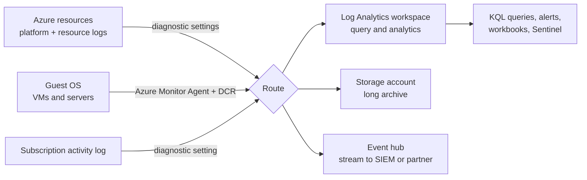
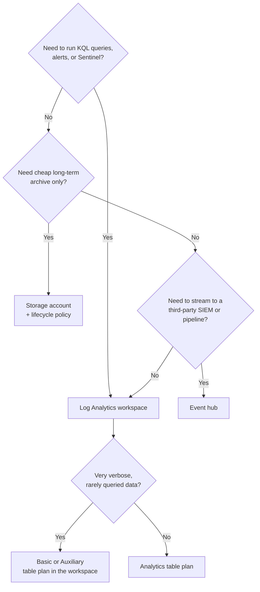
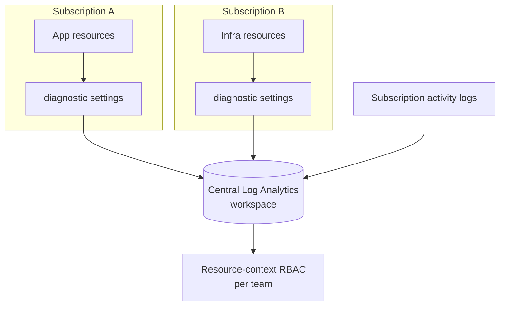
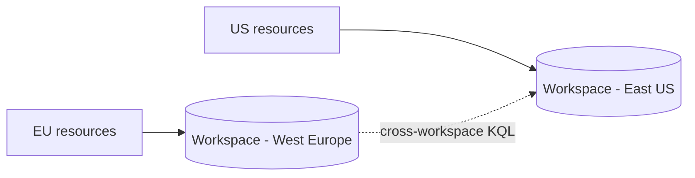
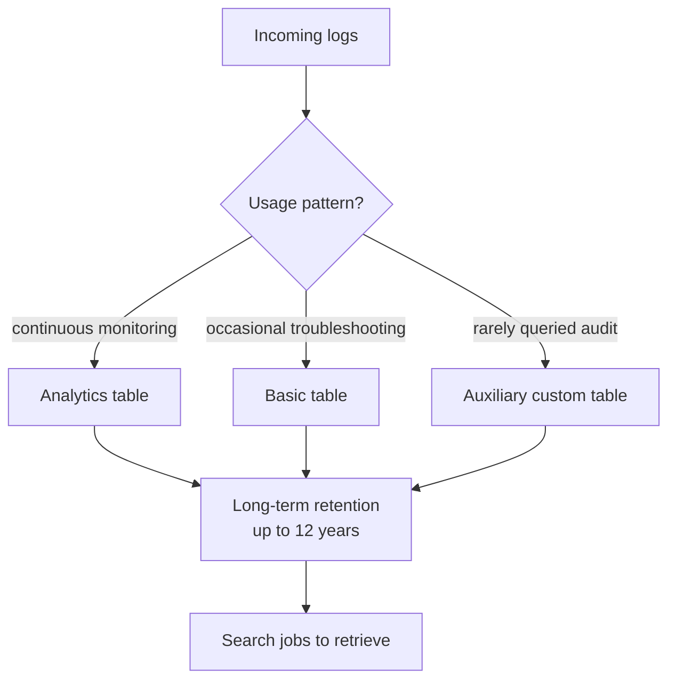
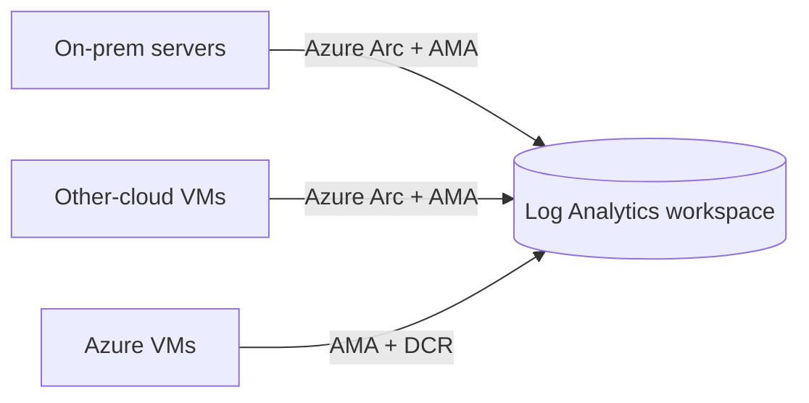

# AZ-305 Study Guide: Recommend a logging solution

> **Exam task:** Design solutions for logging and monitoring. Task: Recommend a logging solution
>
> **Estimated reading time:** 45 minutes
>
> **Scope boundary:** This guide covers how an Azure Solutions Architect designs *where logs go, how they are collected, how long they are kept, and how much that costs*. It centers on [Azure Monitor Logs](https://learn.microsoft.com/en-us/azure/azure-monitor/logs/data-platform-logs), the [Log Analytics workspace](https://learn.microsoft.com/en-us/azure/azure-monitor/logs/log-analytics-workspace-overview), [diagnostic settings](https://learn.microsoft.com/en-us/azure/azure-monitor/platform/create-diagnostic-settings), the [activity log](https://learn.microsoft.com/en-us/azure/azure-monitor/platform/activity-log), [table plans](https://learn.microsoft.com/en-us/azure/azure-monitor/logs/logs-table-plans), and [data retention](https://learn.microsoft.com/en-us/azure/azure-monitor/logs/data-retention-configure). It intentionally excludes the adjacent task *Recommend a monitoring solution*, which covers alerts, workbooks, insights, dashboards, and metric-based health signals. Those topics appear here only where the logging design depends on them.

## How to use this guide

Work through the guide top to bottom once, then use sections 12, 16, and 17 for review before the exam.

By the end you should be able to recommend a log collection and storage design for any Azure scenario: choose the destination (Log Analytics workspace, storage account, or event hub), decide how many workspaces to deploy, select a [table plan](https://learn.microsoft.com/en-us/azure/azure-monitor/logs/data-platform-logs#table-plans) per data type, set [retention](https://learn.microsoft.com/en-us/azure/azure-monitor/logs/data-retention-configure) to meet compliance, and pick a [pricing model](https://learn.microsoft.com/en-us/azure/azure-monitor/logs/cost-logs) that fits the data volume.

This maps to the exam objective *Design solutions for logging and monitoring* within the domain *Design identity, governance, and monitoring solutions* in the [AZ-305 study guide](https://learn.microsoft.com/en-us/credentials/certifications/resources/study-guides/az-305). Logging questions on the exam are almost always destination, workspace topology, retention, or cost questions, not configuration steps.

To avoid confusing this task with the adjacent *monitoring* task, hold one rule in mind: if the question is about **storing and querying log data**, it is logging; if the question is about **detecting a condition and reacting to it** (alerts, autoscale, dashboards, insights), it is monitoring. Many scenarios contain both, so read for the actual decision being asked.

## Primary source set

### Exam and module sources

- [AZ-305 exam study guide](https://learn.microsoft.com/en-us/credentials/certifications/resources/study-guides/az-305)
- [Microsoft Learn module: Design a solution to log and monitor Azure resources](https://learn.microsoft.com/en-us/training/modules/design-solution-to-log-monitor-azure-resources/)
- [Module unit: Design for Azure Monitor data sources](https://learn.microsoft.com/en-us/training/modules/design-solution-to-log-monitor-azure-resources/2-design-for-azure-monitor-data-sources)
- [Module unit: Design for Azure Monitor Logs (Log Analytics) workspaces](https://learn.microsoft.com/en-us/training/modules/design-solution-to-log-monitor-azure-resources/3-design-for-log-analytics)

### Core product documentation

- [Azure Monitor overview](https://learn.microsoft.com/en-us/azure/azure-monitor/fundamentals/overview)
- [Azure Monitor Logs overview](https://learn.microsoft.com/en-us/azure/azure-monitor/logs/data-platform-logs)
- [Log Analytics workspace overview](https://learn.microsoft.com/en-us/azure/azure-monitor/logs/log-analytics-workspace-overview)
- [Design a Log Analytics workspace architecture](https://learn.microsoft.com/en-us/azure/azure-monitor/logs/workspace-design)
- [Create diagnostic settings](https://learn.microsoft.com/en-us/azure/azure-monitor/platform/create-diagnostic-settings)
- [Resource logs](https://learn.microsoft.com/en-us/azure/azure-monitor/platform/resource-logs)
- [Azure Monitor activity log](https://learn.microsoft.com/en-us/azure/azure-monitor/platform/activity-log)
- [Select a table plan](https://learn.microsoft.com/en-us/azure/azure-monitor/logs/logs-table-plans)
- [Manage data retention in a Log Analytics workspace](https://learn.microsoft.com/en-us/azure/azure-monitor/logs/data-retention-configure)
- [Azure Monitor Logs cost calculations and options](https://learn.microsoft.com/en-us/azure/azure-monitor/logs/cost-logs)
- [Azure Monitor Logs dedicated clusters](https://learn.microsoft.com/en-us/azure/azure-monitor/logs/logs-dedicated-clusters)
- [Migrate to Azure Monitor Agent from Log Analytics agent](https://learn.microsoft.com/en-us/azure/azure-monitor/agents/azure-monitor-agent-migration)

### Supporting architecture and framework sources

- [Azure Monitor enterprise monitoring architecture](https://learn.microsoft.com/en-us/azure/azure-monitor/fundamentals/enterprise-monitoring-architecture)
- [Design Azure Monitor Private Link configuration](https://learn.microsoft.com/en-us/azure/azure-monitor/logs/private-link-design)
- [Azure Monitor customer-managed keys](https://learn.microsoft.com/en-us/azure/azure-monitor/logs/customer-managed-keys)
- [Azure Architecture Center](https://learn.microsoft.com/en-us/azure/architecture/)
- [Cloud Adoption Framework](https://learn.microsoft.com/en-us/azure/cloud-adoption-framework/)
- [Well-Architected Framework](https://learn.microsoft.com/en-us/azure/well-architected/what-is-well-architected-framework)
- [Exam Readiness Zone](https://learn.microsoft.com/en-us/shows/exam-readiness-zone/)

## 1. Exam task scope

This task sits in the **domain** *Design identity, governance, and monitoring solutions*, under the **skill** *Design solutions for logging and monitoring*, and the specific **task** is *Recommend a logging solution* per the [AZ-305 study guide](https://learn.microsoft.com/en-us/credentials/certifications/resources/study-guides/az-305).

As an architect you are asked to decide how telemetry that resources and applications emit gets [collected, routed, stored, and retained](https://learn.microsoft.com/en-us/azure/azure-monitor/logs/data-platform-logs#how-azure-monitor-logs-works). The decisions tested most often are: which [destination](https://learn.microsoft.com/en-us/azure/azure-monitor/platform/resource-logs) to send logs to, how many [Log Analytics workspaces](https://learn.microsoft.com/en-us/azure/azure-monitor/logs/workspace-design) to design and where, which [table plan](https://learn.microsoft.com/en-us/azure/azure-monitor/logs/logs-table-plans) fits each data type, what [retention](https://learn.microsoft.com/en-us/azure/azure-monitor/logs/data-retention-configure) period satisfies the requirement, and which [pricing model](https://learn.microsoft.com/en-us/azure/azure-monitor/logs/cost-logs) controls cost.

**In scope** for this task: log destinations and routing through [diagnostic settings](https://learn.microsoft.com/en-us/azure/azure-monitor/platform/create-diagnostic-settings); the [activity log](https://learn.microsoft.com/en-us/azure/azure-monitor/platform/activity-log) and its export; [resource logs](https://learn.microsoft.com/en-us/azure/azure-monitor/platform/resource-logs); guest OS log collection with the [Azure Monitor Agent](https://learn.microsoft.com/en-us/azure/azure-monitor/agents/azure-monitor-agent-migration); [workspace topology](https://learn.microsoft.com/en-us/azure/azure-monitor/logs/workspace-design); [table plans](https://learn.microsoft.com/en-us/azure/azure-monitor/logs/data-platform-logs#table-plans); [retention and archive](https://learn.microsoft.com/en-us/azure/azure-monitor/logs/data-retention-configure); and [log cost design](https://learn.microsoft.com/en-us/azure/azure-monitor/logs/cost-logs).

**Out of scope or mostly adjacent**: alert rules, action groups, autoscale, [workbooks and insights](https://learn.microsoft.com/en-us/training/modules/design-solution-to-log-monitor-azure-resources/4-design-for-azure-workbooks-insights), and metric dashboards belong to *Recommend a monitoring solution*. [Microsoft Sentinel](https://learn.microsoft.com/en-us/azure/sentinel/overview) SIEM design belongs to the security domain, though it shares the same workspace, so the workspace decision touches it.

The mental boundary: this task ends at "the log data is collected and durably stored where the right people can query it for the required time at an acceptable cost." Anything past that point, turning data into a signal or an action, is the monitoring task.

## 2. Starting point from the Microsoft Learn module

The primary module, [Design a solution to log and monitor Azure resources](https://learn.microsoft.com/en-us/training/modules/design-solution-to-log-monitor-azure-resources/), is an Advanced, Solution Architect module whose learning objectives are to design for Azure Monitor data sources, design for Log Analytics workspaces, design for workbooks and insights, and design for Azure Data Explorer.

The module frames Azure Monitor around a [common monitoring data platform](https://learn.microsoft.com/en-us/azure/azure-monitor/data-platform) with two pillars: [Logs](https://learn.microsoft.com/en-us/azure/azure-monitor/logs/data-platform-logs), which collect and organize data you can analyze with log queries, and [Metrics](https://learn.microsoft.com/en-us/azure/azure-monitor/essentials/data-platform-metrics), which capture numeric time-series data for near-real-time scenarios. For the logging task, the Logs pillar is the focus.

The data sources unit lists the guest-level sources the platform collects: [Windows events, performance counters, Syslog, text logs, JSON logs, and IIS logs](https://learn.microsoft.com/en-us/training/modules/design-solution-to-log-monitor-azure-resources/2-design-for-azure-monitor-data-sources). It expects you to know that logs enable complex analysis through [log queries](https://learn.microsoft.com/en-us/azure/azure-monitor/logs/log-query-overview) while metrics support priority alerting, and that monitoring data can be routed to other locations for tracking and reporting.

The workspaces unit is the most exam-relevant. It establishes that a [workspace is an administrative and geographic boundary](https://learn.microsoft.com/en-us/training/modules/design-solution-to-log-monitor-azure-resources/3-design-for-log-analytics) where data is organized into tables, that you set [billing and retention per workspace](https://learn.microsoft.com/en-us/azure/azure-monitor/logs/cost-logs), and that [Azure RBAC](https://learn.microsoft.com/en-us/azure/azure-monitor/logs/manage-access) controls who sees which data. It describes three deployment models and contrasts two access modes:

| Module concept | What it means for the design |
| --- | --- |
| **Centralized** (hub and spoke) | All logs in one workspace, easy cross-resource search and correlation, more access-control overhead, per the [module guidance](https://learn.microsoft.com/en-us/training/modules/design-solution-to-log-monitor-azure-resources/3-design-for-log-analytics). |
| **Decentralized** | One workspace per team, access aligns with resource ownership, but [cross-correlation is hard](https://learn.microsoft.com/en-us/training/modules/design-solution-to-log-monitor-azure-resources/3-design-for-log-analytics). |
| **Hybrid** | Both models in parallel, which the module warns is [complex, expensive, and hard to maintain](https://learn.microsoft.com/en-us/training/modules/design-solution-to-log-monitor-azure-resources/3-design-for-log-analytics). |
| **Workspace-context access** | A user queries all tables in the workspace they have permission to, scoped to the workspace, per the [module](https://learn.microsoft.com/en-us/training/modules/design-solution-to-log-monitor-azure-resources/3-design-for-log-analytics). |
| **Resource-context access** | A user queries only data for resources they can access, which enables [granular RBAC](https://learn.microsoft.com/en-us/azure/azure-monitor/logs/manage-access). |

The module's headline recommendation is a [single centralized workspace](https://learn.microsoft.com/en-us/training/modules/design-solution-to-log-monitor-azure-resources/3-design-for-log-analytics) in the IT organization's subscription, with all resources, solutions, and insights writing to it, and it notes that [workspaces are not limited by storage and need not be split for scale](https://learn.microsoft.com/en-us/training/modules/design-solution-to-log-monitor-azure-resources/3-design-for-log-analytics). It also notes [dedicated clusters](https://learn.microsoft.com/en-us/azure/azure-monitor/logs/logs-dedicated-clusters) exist for customer-managed key encryption, Customer Lockbox, or very high ingestion.

**Where the module is not deep enough for the exam:** it predates or underweights several things the current platform and exam care about. It does not detail the [Analytics, Basic, and Auxiliary table plans](https://learn.microsoft.com/en-us/azure/azure-monitor/logs/data-platform-logs#table-plans), the split between [interactive and long-term retention](https://learn.microsoft.com/en-us/azure/azure-monitor/logs/data-retention-configure), the [Azure Monitor Agent and data collection rules](https://learn.microsoft.com/en-us/azure/azure-monitor/agents/azure-monitor-agent-migration) replacing the retired Log Analytics agent, [resource-specific versus AzureDiagnostics tables](https://learn.microsoft.com/en-us/azure/azure-monitor/platform/resource-logs), or [commitment tier pricing](https://learn.microsoft.com/en-us/azure/azure-monitor/logs/cost-logs). The rest of this guide fills those gaps.

## 3. Conceptual foundation

### Why logging design matters architecturally

Logs are the durable record of what happened inside a system. They serve four distinct jobs that pull a design in different directions: real-time troubleshooting, security investigation, compliance retention, and cost control. A good logging design separates these jobs so that high-value operational data stays cheap to query while high-volume audit data stays cheap to store. [Azure Monitor Logs](https://learn.microsoft.com/en-us/azure/azure-monitor/logs/data-platform-logs) is built specifically to let one workspace hold all of these data types at different price and performance points.

### The problem this capability solves

Azure resources emit telemetry continuously, but most of it is not collected by default. [Resource logs are not collected until you create a diagnostic setting](https://learn.microsoft.com/en-us/azure/azure-monitor/platform/resource-logs) that routes them somewhere. The architect's job is to decide what to capture, where to send it, and how long to keep it, balancing analysis needs against ingestion and retention cost.

### How the major services fit together

Three layers make up a logging solution. The **data sources** are the resources and applications producing telemetry. The **collection and routing** layer moves that telemetry: [diagnostic settings](https://learn.microsoft.com/en-us/azure/azure-monitor/platform/create-diagnostic-settings) for platform and resource logs, the [Azure Monitor Agent with data collection rules](https://learn.microsoft.com/en-us/azure/azure-monitor/agents/azure-monitor-agent-migration) for guest OS logs, and automatic collection for the [activity log](https://learn.microsoft.com/en-us/azure/azure-monitor/platform/activity-log). The **destinations** are where data lands: a [Log Analytics workspace](https://learn.microsoft.com/en-us/azure/azure-monitor/logs/log-analytics-workspace-overview) for query and analytics, a [storage account](https://learn.microsoft.com/en-us/azure/azure-monitor/platform/resource-logs) for cheap long archive, or an [event hub](https://learn.microsoft.com/en-us/azure/azure-monitor/platform/resource-logs) for streaming to external systems.

The diagram shows the one-to-many nature of routing. A single diagnostic setting can fan the same logs out to all three destination types at once, which is how you satisfy "query it now and keep it cheaply for years" in one configuration.

### Key terminology

A [Log Analytics workspace](https://learn.microsoft.com/en-us/azure/azure-monitor/logs/log-analytics-workspace-overview) is the primary Azure Monitor Logs resource and the unit of administration, geography, and billing. Data inside it is organized into [tables](https://learn.microsoft.com/en-us/azure/azure-monitor/logs/manage-logs-tables), each holding one kind of record. A [diagnostic setting](https://learn.microsoft.com/en-us/azure/azure-monitor/platform/create-diagnostic-settings) defines which log categories a resource emits and where they go. [Data collection rules](https://learn.microsoft.com/en-us/azure/azure-monitor/agents/azure-monitor-agent-migration) define what the Azure Monitor Agent collects from a machine. A [table plan](https://learn.microsoft.com/en-us/azure/azure-monitor/logs/data-platform-logs#table-plans) sets the cost and capability profile of a table. [KQL](https://learn.microsoft.com/en-us/azure/azure-monitor/logs/log-query-overview) is the read-only query language for the workspace.

### Control plane versus data plane

Two log streams describe an Azure resource. The [activity log](https://learn.microsoft.com/en-us/azure/azure-monitor/platform/activity-log) is the **control plane** record: who created, changed, or deleted a resource through Azure Resource Manager. [Resource logs](https://learn.microsoft.com/en-us/azure/azure-monitor/platform/resource-logs) are the **data plane** record: what happened *inside* the resource, such as Key Vault secret access or storage requests. The activity log is collected automatically; resource logs require a diagnostic setting. Knowing which stream answers a question ("who deleted the VM" versus "who read the secret") is a common exam discriminator.

> **Exam tip:** The [activity log retains data for 90 days by default at no charge](https://learn.microsoft.com/en-us/azure/azure-monitor/platform/activity-log) and you cannot change that built-in window. To keep control-plane history longer (for audit), you must [export it through a diagnostic setting](https://learn.microsoft.com/en-us/azure/azure-monitor/platform/activity-log) to a workspace, storage account, or event hub. In a workspace it lands in the `AzureActivity` table. If a scenario asks how to retain "who did what" beyond 90 days, the answer is export, not a setting on the activity log itself.

### Identity, networking, cost, and operations implications

Identity and governance: workspace and table access is controlled by [Azure RBAC](https://learn.microsoft.com/en-us/azure/azure-monitor/logs/manage-access), and centralized logging is itself a governance control. Networking: ingestion and query can be locked to private networks with an [Azure Monitor Private Link Scope](https://learn.microsoft.com/en-us/azure/azure-monitor/logs/private-link-design). Cost: ingestion volume and retention length are the two largest drivers, managed through [table plans and pricing tiers](https://learn.microsoft.com/en-us/azure/azure-monitor/logs/cost-logs). Operations: a single workspace simplifies cross-resource queries and reduces the number of places to manage access, which is why the [module recommends consolidation](https://learn.microsoft.com/en-us/azure/azure-monitor/logs/workspace-design).

> **Exam tip:** [Diagnostic settings have hard limits](https://learn.microsoft.com/en-us/azure/azure-monitor/platform/create-diagnostic-settings): each resource supports up to five diagnostic settings, and a single setting can target only one destination of each type (one workspace, one storage account, one event hub). To send the same logs to two workspaces, you create two diagnostic settings. Exam answers that try to send logs to two Log Analytics workspaces in one setting are wrong.

## 4. Design decision framework

### The core questions, in order

Recommend a logging solution by answering these in sequence:

1. **What must be captured?** Map requirements to streams: control-plane history needs the [activity log](https://learn.microsoft.com/en-us/azure/azure-monitor/platform/activity-log); resource behavior needs [resource logs via diagnostic settings](https://learn.microsoft.com/en-us/azure/azure-monitor/platform/resource-logs); guest OS data needs the [Azure Monitor Agent with a DCR](https://learn.microsoft.com/en-us/azure/azure-monitor/agents/azure-monitor-agent-migration).
2. **Where should it go?** Choose destination by purpose: [Log Analytics for query and analytics, storage for cheap archive, event hub for external streaming](https://learn.microsoft.com/en-us/azure/azure-monitor/platform/resource-logs). The [recommended default for resource logs is a Log Analytics workspace](https://learn.microsoft.com/en-us/azure/event-hubs/monitor-event-hubs).
3. **How many workspaces?** Start with one and split only for [data residency, tenancy, or access requirements](https://learn.microsoft.com/en-us/azure/azure-monitor/logs/workspace-design).
4. **Which table plan per data type?** Match usage to [Analytics, Basic, or Auxiliary](https://learn.microsoft.com/en-us/azure/azure-monitor/logs/data-platform-logs#table-plans).
5. **How long to keep it?** Set [interactive and long-term retention](https://learn.microsoft.com/en-us/azure/azure-monitor/logs/data-retention-configure) to the compliance requirement.
6. **What pricing model?** Choose [pay-as-you-go or a commitment tier](https://learn.microsoft.com/en-us/azure/azure-monitor/logs/cost-logs), and consider a [dedicated cluster](https://learn.microsoft.com/en-us/azure/azure-monitor/logs/logs-dedicated-clusters) at high volume.

### Destination decision tree

Most designs land on a Log Analytics workspace because analysis, alerting, and [Sentinel](https://learn.microsoft.com/en-us/azure/sentinel/overview) all depend on it. Storage and event hubs are additive destinations for archive and integration, not replacements when query capability is required. Inside the workspace, the table plan choice then tunes cost against capability.

### Selection criteria and constraints

When choosing **destination**, remember that [storage accounts allow indefinite, low-cost retention](https://learn.microsoft.com/en-us/azure/azure-monitor/platform/resource-logs) but no KQL, and that [event hubs are the path off Azure](https://learn.microsoft.com/en-us/azure/azure-monitor/platform/resource-logs) to external SIEMs. When choosing **workspace count**, the binding constraints are [Azure tenant boundaries and data sovereignty](https://learn.microsoft.com/en-us/azure/azure-monitor/logs/workspace-design): most resources can only send to a workspace in the same tenant, and a global company may need data kept in specific regions. When choosing a **table plan**, the constraint is capability: [Basic and Auxiliary tables do not include query cost and have reduced features](https://learn.microsoft.com/en-us/azure/azure-monitor/logs/data-platform-logs#table-plans).

### Tradeoffs to reason through

- **Cost versus query capability:** [Basic and Auxiliary plans cut ingestion cost sharply but charge per GB scanned at query time](https://learn.microsoft.com/en-us/azure/azure-monitor/logs/cost-logs). Cheap to store, expensive to search often.
- **Centralized versus segregated:** one workspace gives the best [cross-resource correlation](https://learn.microsoft.com/en-us/azure/azure-monitor/logs/workspace-design) but needs careful RBAC; many workspaces give clean ownership boundaries but [break correlation](https://learn.microsoft.com/en-us/training/modules/design-solution-to-log-monitor-azure-resources/3-design-for-log-analytics).
- **Pay-as-you-go versus commitment tier:** [commitment tiers discount predictable high volume](https://learn.microsoft.com/en-us/azure/azure-monitor/logs/cost-logs) but lock in a daily spend; pay-as-you-go suits variable or low volume.

### Common "it depends" scenarios

*A team wants its own workspace.* It depends on whether they need isolation that [resource-context RBAC](https://learn.microsoft.com/en-us/azure/azure-monitor/logs/manage-access) cannot already provide inside the shared workspace. If RBAC is enough, keep one workspace.

*Keep logs for seven years.* It depends on whether the data must be *queryable* for seven years or merely *retained*. Use [long-term retention up to 12 years](https://learn.microsoft.com/en-us/azure/azure-monitor/logs/data-retention-configure) with [search jobs](https://learn.microsoft.com/en-us/azure/azure-monitor/logs/data-retention-configure) for occasional access, or a [storage account](https://learn.microsoft.com/en-us/azure/azure-monitor/platform/resource-logs) if no query is needed.

> **Exam tip:** "Start with a single workspace and split only when a concrete requirement forces it" is the [Microsoft default design stance](https://learn.microsoft.com/en-us/azure/azure-monitor/logs/workspace-design). The forcing requirements to memorize are data sovereignty or regional residency, separate Azure tenants, billing or chargeback separation, and security teams that demand isolation. Scale is never a valid reason to split, because [workspaces are not bounded by storage](https://learn.microsoft.com/en-us/training/modules/design-solution-to-log-monitor-azure-resources/3-design-for-log-analytics).

## 5. Service and feature comparison tables

### Destination comparison

| Destination | Best for | Query | Retention model | Notes |
| --- | --- | --- | --- | --- |
| [Log Analytics workspace](https://learn.microsoft.com/en-us/azure/azure-monitor/logs/log-analytics-workspace-overview) | Interactive analysis, alerting, [Sentinel](https://learn.microsoft.com/en-us/azure/sentinel/overview), insights | Full [KQL](https://learn.microsoft.com/en-us/azure/azure-monitor/logs/log-query-overview) | 30 days default, up to [12 years total](https://learn.microsoft.com/en-us/azure/azure-monitor/logs/data-retention-configure) | The [recommended default destination](https://learn.microsoft.com/en-us/azure/event-hubs/monitor-event-hubs) for resource logs |
| [Storage account](https://learn.microsoft.com/en-us/azure/azure-monitor/platform/resource-logs) | Cheap, indefinite archive, audit, backup | No KQL | Managed by [storage lifecycle policy](https://learn.microsoft.com/en-us/azure/azure-monitor/platform/create-diagnostic-settings) | Lowest cost per GB; the diagnostic-setting retention field is [deprecated](https://learn.microsoft.com/en-us/azure/azure-monitor/platform/create-diagnostic-settings) |
| [Event hub](https://learn.microsoft.com/en-us/azure/azure-monitor/platform/resource-logs) | Streaming to third-party SIEM or external pipelines | No KQL | None (pass-through) | Data leaves Azure as JSON; consumer manages it |
| [Partner / Azure Native ISV](https://learn.microsoft.com/en-us/azure/azure-monitor/platform/create-diagnostic-settings) | Direct integration with ISV monitoring tools | Vendor | Vendor | Requires the partner service installed first |

### Table plan comparison

| Feature | Analytics | Basic | Auxiliary |
| --- | --- | --- | --- |
| Best for | High-value data for [continuous monitoring and analytics](https://learn.microsoft.com/en-us/azure/azure-monitor/logs/data-platform-logs#table-plans) | Medium-touch [troubleshooting and incident response](https://learn.microsoft.com/en-us/azure/azure-monitor/logs/data-platform-logs#table-plans) | Low-touch [verbose, audit, and compliance data](https://learn.microsoft.com/en-us/azure/azure-monitor/logs/data-platform-logs#table-plans) |
| Supported tables | [All table types](https://learn.microsoft.com/en-us/azure/azure-monitor/logs/manage-logs-tables) | [Azure tables that support Basic + DCR custom tables](https://learn.microsoft.com/en-us/azure/azure-monitor/logs/logs-table-plans) | [DCR-based custom tables only](https://learn.microsoft.com/en-us/azure/azure-monitor/logs/logs-table-plans) |
| Ingestion cost | Standard | Reduced | Minimal (lowest) |
| Query cost included | Yes | No, [charged per GB scanned](https://learn.microsoft.com/en-us/azure/azure-monitor/logs/cost-logs) | No, [charged per GB scanned](https://learn.microsoft.com/en-us/azure/azure-monitor/logs/cost-logs) |
| Query performance | Optimized | Optimized single-table | [Unoptimized, slow](https://learn.microsoft.com/en-us/azure/azure-monitor/logs/data-platform-logs#table-plans) |
| Alerts | Yes | [Simple log alerts](https://learn.microsoft.com/en-us/azure/azure-monitor/logs/data-platform-logs#table-plans) | No |
| Insights / dashboards | Yes | Limited | Limited |
| Interactive retention | [30 days, extendable to 2 years](https://learn.microsoft.com/en-us/azure/azure-monitor/logs/data-retention-configure) | [Fixed 30 days](https://learn.microsoft.com/en-us/azure/azure-monitor/logs/data-retention-configure) | [Total retention is queryable](https://learn.microsoft.com/en-us/azure/azure-monitor/logs/data-retention-configure) |
| Total retention | Up to [12 years](https://learn.microsoft.com/en-us/azure/azure-monitor/logs/data-platform-logs#table-plans) | Up to 12 years | Up to 12 years |
| Plan switching | Switch to/from Basic | [Switch to/from Analytics](https://learn.microsoft.com/en-us/azure/azure-monitor/logs/logs-table-plans) | [Set at creation only, cannot switch](https://learn.microsoft.com/en-us/azure/azure-monitor/logs/logs-table-plans) |

### Resource-specific tables versus AzureDiagnostics

| Aspect | Resource-specific mode | Azure diagnostics (AzureDiagnostics) |
| --- | --- | --- |
| Table structure | A [dedicated table per log category](https://learn.microsoft.com/en-us/azure/azure-monitor/platform/resource-logs) | One shared `AzureDiagnostics` table |
| Query efficiency | [More efficient, more flexible](https://learn.microsoft.com/en-us/azure/azure-monitor/platform/create-diagnostic-settings) | Wide, mixed schema, harder to query |
| Microsoft guidance | [Usually select resource-specific](https://learn.microsoft.com/en-us/azure/azure-monitor/platform/create-diagnostic-settings) | Legacy / fallback |
| Migration | Switching leaves [old data in AzureDiagnostics; union to query both](https://learn.microsoft.com/en-us/azure/azure-monitor/platform/resource-logs) | n/a |

### Pricing model comparison

| Model | When it fits | Mechanism |
| --- | --- | --- |
| [Pay-as-you-go](https://learn.microsoft.com/en-us/azure/azure-monitor/logs/cost-logs) | Variable or low ingestion | Per-GB billing, optional [daily cap](https://learn.microsoft.com/en-us/azure/azure-monitor/logs/cost-logs) |
| [Commitment tier](https://learn.microsoft.com/en-us/azure/azure-monitor/logs/cost-logs) | Predictable volume from [100 GB/day](https://learn.microsoft.com/en-us/azure/azure-monitor/logs/cost-logs) | Fixed daily rate at a discount; overage billed at tier rate |
| [Dedicated cluster](https://learn.microsoft.com/en-us/azure/azure-monitor/logs/logs-dedicated-clusters) | [100 GB/day+](https://learn.microsoft.com/en-us/azure/azure-monitor/logs/logs-dedicated-clusters), or needs CMK / Lockbox | Commitment tier pooled across linked workspaces in a region |

> **Exam tip:** The [Auxiliary plan can only be applied to DCR-based custom tables at creation, and the plan cannot be changed afterward](https://learn.microsoft.com/en-us/azure/azure-monitor/logs/logs-table-plans). Built-in Azure tables cannot use Auxiliary. If a scenario proposes putting a built-in table (like `AzureActivity` or a resource-specific table) on the Auxiliary plan, it is wrong. Basic is the cheap option available to [supported built-in tables and DCR custom tables](https://learn.microsoft.com/en-us/azure/azure-monitor/logs/logs-table-plans).

## 6. Architecture patterns

### Pattern A: Single centralized workspace (the default)

**When it applies:** one Azure tenant, no hard data-residency split, you want one place to query everything. This is the [Microsoft-recommended starting point](https://learn.microsoft.com/en-us/azure/azure-monitor/logs/workspace-design) and the [module's headline design](https://learn.microsoft.com/en-us/training/modules/design-solution-to-log-monitor-azure-resources/3-design-for-log-analytics).

**Why it solves the problem:** all resources, insights, and [Application Insights](https://learn.microsoft.com/en-us/azure/azure-monitor/logs/data-platform-logs) write to one workspace, so cross-resource correlation and a single access model are trivial. [Resource-context RBAC](https://learn.microsoft.com/en-us/azure/azure-monitor/logs/manage-access) gives teams a per-resource view without separate workspaces.

**Required services:** one [Log Analytics workspace](https://learn.microsoft.com/en-us/azure/azure-monitor/logs/log-analytics-workspace-overview), [diagnostic settings](https://learn.microsoft.com/en-us/azure/azure-monitor/platform/create-diagnostic-settings) on each resource, and [Azure Policy](https://learn.microsoft.com/en-us/azure/azure-monitor/agents/azure-monitor-agent-migration) to enforce them at scale.

**Strengths:** simplest to operate, best correlation, easiest cost rollup. **Weaknesses:** one large access boundary needs disciplined RBAC. **Failure modes:** an over-broad role grant exposes all data; a single regional workspace is a regional dependency unless [replication](https://learn.microsoft.com/en-us/azure/azure-monitor/logs/data-platform-logs) is configured. **Cost:** consolidated volume may reach a [commitment tier discount](https://learn.microsoft.com/en-us/azure/azure-monitor/logs/cost-logs). **Operations:** [Azure Policy](https://learn.microsoft.com/en-us/azure/azure-monitor/agents/azure-monitor-agent-migration) keeps coverage complete. **Security:** lock down with [Private Link](https://learn.microsoft.com/en-us/azure/azure-monitor/logs/private-link-design). **Monitoring:** one workspace is the single query surface.

### Pattern B: Multi-region or multi-tenant workspaces

**When it applies:** data sovereignty requires logs to stay in a region, or you operate [multiple Azure tenants](https://learn.microsoft.com/en-us/azure/azure-monitor/logs/workspace-design), which need a workspace each.

**Why it solves the problem:** [most resources can send only to a same-tenant workspace](https://learn.microsoft.com/en-us/azure/azure-monitor/logs/workspace-design), and keeping a workspace in the resource's region avoids cross-region egress charges while satisfying residency.

**Required services:** one workspace per region or tenant, plus [cross-workspace queries](https://learn.microsoft.com/en-us/azure/azure-monitor/logs/data-platform-logs) to correlate when needed.

**Strengths:** meets residency and tenancy hard requirements. **Weaknesses:** correlation needs cross-workspace queries and more administration. **Failure modes:** drift between workspace configurations. **Cost:** smaller per-workspace volume may miss commitment-tier discounts unless pooled in a [dedicated cluster](https://learn.microsoft.com/en-us/azure/azure-monitor/logs/logs-dedicated-clusters). **Security and operations:** standardize settings via policy. **Monitoring:** plan for multi-workspace dashboards.

### Pattern C: Tiered logging by table plan

**When it applies:** one workspace carries a mix of high-value operational logs and very high-volume verbose or audit logs.

**Why it solves the problem:** [table plans let one workspace hold each data type at the right price point](https://learn.microsoft.com/en-us/azure/azure-monitor/logs/data-platform-logs#table-plans). Operational data on [Analytics](https://learn.microsoft.com/en-us/azure/azure-monitor/logs/data-platform-logs#table-plans), troubleshooting data on [Basic](https://learn.microsoft.com/en-us/azure/azure-monitor/logs/logs-table-plans), verbose audit data on [Auxiliary](https://learn.microsoft.com/en-us/azure/azure-monitor/logs/logs-table-plans), with [long-term retention](https://learn.microsoft.com/en-us/azure/azure-monitor/logs/data-retention-configure) underneath all of it.

**Strengths:** large cost savings on verbose data. **Weaknesses:** query-time charges and reduced features on Basic and Auxiliary; [Auxiliary excludes alerts, restore, replication, and Customer Lockbox](https://learn.microsoft.com/en-us/azure/azure-monitor/logs/data-platform-logs#table-plans). **Failure modes:** putting data you query often on a per-scan plan inflates query cost. **Cost:** ingestion drops, but [search jobs and long-term retention are billed for all plans](https://learn.microsoft.com/en-us/azure/azure-monitor/logs/cost-logs). **Operations:** model query frequency before assigning plans.

### Pattern D: Hybrid and multicloud collection

**When it applies:** servers run on-premises or in other clouds and must log to Azure.

**Why it solves the problem:** [Azure Arc connects non-Azure machines](https://learn.microsoft.com/en-us/azure/azure-monitor/fundamentals/overview) so the [Azure Monitor Agent and data collection rules](https://learn.microsoft.com/en-us/azure/azure-monitor/agents/azure-monitor-agent-migration) collect their logs into the same workspace as native Azure resources.

**Strengths:** one observability plane across estates. **Weaknesses:** Arc onboarding and agent lifecycle to manage. **Security:** consider [Private Link](https://learn.microsoft.com/en-us/azure/azure-monitor/logs/private-link-design) for ingestion from sensitive networks. **Operations:** the [Log Analytics agent retired on August 31, 2024](https://learn.microsoft.com/en-us/azure/azure-monitor/agents/azure-monitor-agent-migration), so any design must use the Azure Monitor Agent.

## 7. Implementation awareness for architects

AZ-305 tests design judgment, not portal clicks, but a few implementation facts change the design and so are fair game.

**Diagnostic settings are per resource and capped.** Each resource supports up to [five diagnostic settings, each with one destination of each type](https://learn.microsoft.com/en-us/azure/azure-monitor/platform/create-diagnostic-settings). At scale you do not click through hundreds of resources; you enforce settings with [Azure Policy](https://learn.microsoft.com/en-us/azure/azure-monitor/agents/azure-monitor-agent-migration), which is the architect-level answer to "ensure all current and future resources log to the workspace."

**Resource-specific is the table mode to choose.** When a service supports both modes, [select resource-specific for more flexible, efficient queries](https://learn.microsoft.com/en-us/azure/azure-monitor/platform/create-diagnostic-settings). This is a design default to state in a recommendation, not a runtime tweak.

**Guest OS needs an agent and a DCR.** Azure VM platform metrics and the activity log flow without an agent, but Windows events, Syslog, and performance counters require the [Azure Monitor Agent driven by a data collection rule](https://learn.microsoft.com/en-us/azure/azure-monitor/agents/azure-monitor-agent-migration). Decide the DCR scope and the collected data set during design.

**Retention is set per table or at the workspace default.** The [workspace default applies to Analytics tables](https://learn.microsoft.com/en-us/azure/azure-monitor/logs/data-retention-configure), and you override individual tables as needed. Decide retention by data type up front.

**What must be decided before implementation:** workspace count and regions; destination per log type; table plan per data type; retention per requirement; pricing model; and network isolation posture. **What can be deferred to implementation teams:** the exact DCR contents, KQL queries, Policy assignment scopes, and dashboard layouts.

> **Exam tip:** Storage retention is no longer set in the diagnostic setting. The [retention field in diagnostic settings is deprecated](https://learn.microsoft.com/en-us/azure/azure-monitor/platform/create-diagnostic-settings); for a storage account destination you control retention with an [Azure Storage lifecycle management policy](https://learn.microsoft.com/en-us/azure/azure-monitor/platform/create-diagnostic-settings). An answer that sets archive retention inside the diagnostic setting is outdated.

## 8. Security, governance, and compliance considerations

**Access control.** [Azure RBAC](https://learn.microsoft.com/en-us/azure/azure-monitor/logs/manage-access) governs the workspace and individual tables, and [resource-context mode](https://learn.microsoft.com/en-us/azure/azure-monitor/logs/manage-access) lets a single shared workspace expose only the data a team owns. This is usually a better answer than splitting workspaces for "teams should not see each other's logs."

**Encryption and key management.** Workspace data is encrypted at rest by default. For [customer-managed keys (CMK)](https://learn.microsoft.com/en-us/azure/azure-monitor/logs/customer-managed-keys), you must use a [dedicated cluster](https://learn.microsoft.com/en-us/azure/azure-monitor/logs/logs-dedicated-clusters) because CMK is configured at the cluster level using a [managed identity to reach Azure Key Vault](https://learn.microsoft.com/en-us/azure/azure-monitor/logs/customer-managed-keys), and the cluster requires a [commitment of at least 100 GB/day](https://learn.microsoft.com/en-us/azure/azure-monitor/logs/customer-managed-keys).

**Network isolation.** An [Azure Monitor Private Link Scope (AMPLS)](https://learn.microsoft.com/en-us/azure/azure-monitor/logs/private-link-design) limits ingestion and query to private networks. [Access modes are set separately for ingestion and queries](https://learn.microsoft.com/en-us/azure/azure-monitor/logs/private-link-design), and the most secure posture sets the network firewall to block public endpoints so traffic reaches only [private link resources in the AMPLS](https://learn.microsoft.com/en-us/azure/azure-monitor/logs/private-link-design), preventing data exfiltration. Note that [a virtual network connects to only one AMPLS](https://learn.microsoft.com/en-us/azure/azure-monitor/logs/private-link-design), and you should use a single AMPLS per shared DNS to avoid breaking DNS resolution.

**Auditability and compliance retention.** The [activity log](https://learn.microsoft.com/en-us/azure/azure-monitor/platform/activity-log) is the source of "who created this resource," and it is the only place that records the creator. For multi-year audit, route logs to [long-term retention up to 12 years](https://learn.microsoft.com/en-us/azure/azure-monitor/logs/data-retention-configure) or to immutable [storage](https://learn.microsoft.com/en-us/azure/azure-monitor/platform/resource-logs). Customer Lockbox is available on dedicated clusters but [not for Auxiliary-plan data](https://learn.microsoft.com/en-us/azure/azure-monitor/logs/data-platform-logs#table-plans).

**Governance at scale.** Use [management-group-scoped Azure Policy](https://learn.microsoft.com/en-us/azure/azure-monitor/agents/azure-monitor-agent-migration) to deploy diagnostic settings and agents so coverage is complete and consistent, which is the governance control behind a centralized logging design.

> **Exam tip:** Customer-managed keys for logs are a [dedicated-cluster feature, not a per-workspace toggle](https://learn.microsoft.com/en-us/azure/azure-monitor/logs/customer-managed-keys). If a compliance scenario demands CMK or Customer Lockbox, the correct design is a dedicated cluster at the [100 GB/day minimum commitment](https://learn.microsoft.com/en-us/azure/azure-monitor/logs/logs-dedicated-clusters), and you cannot move an existing workspace into a CMK cluster, you create the workspace in the cluster.

## 9. Resiliency, availability, and disaster recovery considerations

Logging is rarely the headline of a resiliency question, but a few points matter for design.

**Regional dependency of a workspace.** A workspace lives in one region. For high availability of the logging platform itself, [Log Analytics workspace replication](https://learn.microsoft.com/en-us/azure/azure-monitor/logs/data-platform-logs) lets you replicate a workspace to a secondary region and switch over during a regional failure. This protects the monitoring plane when you cannot tolerate a logging outage.

**Auxiliary data is not protected.** [Azure Monitor does not replicate Auxiliary-plan data to the secondary workspace](https://learn.microsoft.com/en-us/azure/azure-monitor/logs/data-platform-logs#table-plans), so it is not protected against regional failure and is unavailable after switchover. Do not place data you must retain through a regional outage on Auxiliary.

**Archive durability.** A [storage account destination](https://learn.microsoft.com/en-us/azure/azure-monitor/platform/resource-logs) inherits storage redundancy options (locally redundant, zone-redundant, or geo-redundant), which is the lever for archive durability and is chosen on the storage account, not the diagnostic setting.

**RPO and RTO framing.** For the logging plane, the recovery objective is about how much log data you can lose and how fast you can query again after a regional event. Workspace replication addresses both; a single-region workspace with no archive is the single point of failure to flag.

## 10. Cost and licensing considerations

**Ingestion is the primary cost driver,** billed per GB into the workspace, with [retention billed per GB beyond the included period](https://learn.microsoft.com/en-us/azure/azure-monitor/logs/cost-logs). The two largest levers an architect controls are *how much* you ingest (table plan and data collection transformations) and *how long* you keep it (retention).

**Table plans cut ingestion cost.** [Basic and Auxiliary plans carry significantly reduced ingestion charges](https://learn.microsoft.com/en-us/azure/azure-monitor/logs/cost-logs), at the cost of [per-GB-scanned query charges](https://learn.microsoft.com/en-us/azure/azure-monitor/logs/cost-logs). For rarely queried verbose data this is a large saving; for frequently queried data it can cost more than Analytics.

**Commitment tiers discount predictable volume.** Starting at [100 GB/day, commitment tiers offer a lower per-GB rate than pay-as-you-go](https://learn.microsoft.com/en-us/azure/azure-monitor/logs/cost-logs), with overage billed at the same tier rate. Use the [Usage and estimated costs view](https://learn.microsoft.com/en-us/azure/azure-monitor/logs/cost-logs) to pick the tier.

**Dedicated clusters pool commitment across workspaces.** A [dedicated cluster aggregates volume from linked workspaces in a region](https://learn.microsoft.com/en-us/azure/azure-monitor/logs/logs-dedicated-clusters) so several smaller workspaces can together reach a discount, and it unlocks CMK, Customer Lockbox, and faster cross-workspace queries. The [commitment tier has a 31-day reduction lock](https://learn.microsoft.com/en-us/azure/azure-monitor/logs/logs-dedicated-clusters).

**Free and low-cost items to remember.** [Activity log ingestion and the first 90 days of retention are free](https://learn.microsoft.com/en-us/azure/azure-monitor/platform/activity-log); charges apply only when you extend beyond 90 days. The first [31 days of Analytics retention are included in the ingestion price](https://learn.microsoft.com/en-us/azure/azure-monitor/logs/data-retention-configure), so lowering retention below 31 days saves nothing.

**Legacy pricing tiers limit features.** Workspaces in [legacy tiers (Standard, Premium, Per Node, Standalone, Free Trial)](https://learn.microsoft.com/en-us/azure/azure-monitor/logs/cost-logs) do not support [Basic and Auxiliary plans or long-term retention](https://learn.microsoft.com/en-us/azure/azure-monitor/logs/cost-logs).

> **Exam tip:** The classic cost trap is dumping verbose, high-volume logs (firewall, network flow, application debug) into Analytics tables with long retention. The correct cost design routes those to [Basic or Auxiliary plans](https://learn.microsoft.com/en-us/azure/azure-monitor/logs/data-platform-logs#table-plans), uses [data collection transformations](https://learn.microsoft.com/en-us/azure/azure-monitor/essentials/data-collection-transformations) to drop noise before ingestion, and uses [long-term retention with search jobs](https://learn.microsoft.com/en-us/azure/azure-monitor/logs/data-retention-configure) instead of keeping everything hot. A second trap: choosing a commitment tier below your steady volume, or a tier so high you never use it.

## 11. Monitoring and operational considerations

This task stops at collecting and storing logs, but the logging platform still has to be operated, and the boundary with the *monitoring* task is itself examinable.

What belongs here: confirming [diagnostic settings are present on every resource](https://learn.microsoft.com/en-us/azure/azure-monitor/platform/create-diagnostic-settings) (enforced by [Azure Policy](https://learn.microsoft.com/en-us/azure/azure-monitor/agents/azure-monitor-agent-migration)); confirming the [Azure Monitor Agent is healthy and DCRs are associated](https://learn.microsoft.com/en-us/azure/azure-monitor/agents/azure-monitor-agent-migration); watching ingestion volume and cost in the [Usage and estimated costs view](https://learn.microsoft.com/en-us/azure/azure-monitor/logs/cost-logs); and verifying retention matches policy. [Data export](https://learn.microsoft.com/en-us/azure/azure-monitor/logs/logs-data-export) can continuously push selected tables to storage or event hubs for downstream use.

What belongs to the adjacent *Recommend a monitoring solution* task: [alert rules and action groups, metric alerts, workbooks, and the curated insights experiences](https://learn.microsoft.com/en-us/training/modules/design-solution-to-log-monitor-azure-resources/4-design-for-azure-workbooks-insights). Those *consume* the log data this task makes available. The clean split: logging delivers and stores the data; monitoring turns it into signals and actions.

> **Exam tip:** A question that asks "store and keep the data for analysis" is logging; a question that asks "notify the team when X happens" or "visualize health" is monitoring. The same Log Analytics workspace underlies both, so the presence of a workspace does not tell you which task is being tested. Read for the verb: *store and retain and query* versus *alert and visualize and react*.

## 12. Common exam traps

| Tempting wrong answer | Why it seems reasonable | Why it is wrong | Better design | Source |
| --- | --- | --- | --- | --- |
| Give each team its own workspace for isolation | Feels like the clean way to separate data | Splitting for access alone adds cost and breaks correlation when [resource-context RBAC](https://learn.microsoft.com/en-us/azure/azure-monitor/logs/manage-access) already isolates within one workspace | One workspace with resource-context RBAC | [Workspace design](https://learn.microsoft.com/en-us/azure/azure-monitor/logs/workspace-design) |
| Set archive retention in the diagnostic setting | It used to be there | The [diagnostic-setting retention field is deprecated](https://learn.microsoft.com/en-us/azure/azure-monitor/platform/create-diagnostic-settings) | Storage [lifecycle policy](https://learn.microsoft.com/en-us/azure/azure-monitor/platform/create-diagnostic-settings), or workspace [long-term retention](https://learn.microsoft.com/en-us/azure/azure-monitor/logs/data-retention-configure) | [Create diagnostic settings](https://learn.microsoft.com/en-us/azure/azure-monitor/platform/create-diagnostic-settings) |
| Change the activity log's retention to keep it longer | The log clearly has a 90-day window | [The 90-day window is fixed](https://learn.microsoft.com/en-us/azure/azure-monitor/platform/activity-log); you cannot extend it in place | [Export the activity log](https://learn.microsoft.com/en-us/azure/azure-monitor/platform/activity-log) to a workspace or storage | [Activity log](https://learn.microsoft.com/en-us/azure/azure-monitor/platform/activity-log) |
| Send logs to two workspaces in one diagnostic setting | One config seems efficient | A setting allows [only one destination of each type](https://learn.microsoft.com/en-us/azure/azure-monitor/platform/create-diagnostic-settings) | Create two diagnostic settings | [Create diagnostic settings](https://learn.microsoft.com/en-us/azure/azure-monitor/platform/create-diagnostic-settings) |
| Put a built-in table on the Auxiliary plan to save money | Auxiliary is the cheapest plan | Auxiliary is [DCR-based custom tables only, set at creation](https://learn.microsoft.com/en-us/azure/azure-monitor/logs/logs-table-plans) | Use Basic for [supported built-in tables](https://learn.microsoft.com/en-us/azure/azure-monitor/logs/logs-table-plans) | [Select a table plan](https://learn.microsoft.com/en-us/azure/azure-monitor/logs/logs-table-plans) |
| Use the Log Analytics agent for new VM collection | It is the familiar agent | The [Log Analytics agent retired August 31, 2024](https://learn.microsoft.com/en-us/azure/azure-monitor/agents/azure-monitor-agent-migration) | [Azure Monitor Agent with DCRs](https://learn.microsoft.com/en-us/azure/azure-monitor/agents/azure-monitor-agent-migration) | [AMA migration](https://learn.microsoft.com/en-us/azure/azure-monitor/agents/azure-monitor-agent-migration) |
| Enable CMK on the workspace directly | CMK is a per-resource feature elsewhere | CMK for logs is a [cluster-level feature](https://learn.microsoft.com/en-us/azure/azure-monitor/logs/customer-managed-keys) | Dedicated cluster at [100 GB/day](https://learn.microsoft.com/en-us/azure/azure-monitor/logs/logs-dedicated-clusters) | [Customer-managed keys](https://learn.microsoft.com/en-us/azure/azure-monitor/logs/customer-managed-keys) |
| Split workspaces because volume is large | Big data needs more containers | [Workspaces are not bounded by storage](https://learn.microsoft.com/en-us/training/modules/design-solution-to-log-monitor-azure-resources/3-design-for-log-analytics) | Keep one workspace; use commitment tiers | [Module unit 3](https://learn.microsoft.com/en-us/training/modules/design-solution-to-log-monitor-azure-resources/3-design-for-log-analytics) |
| Choose AzureDiagnostics mode for a new design | It is the default offered | [Resource-specific is more efficient and flexible](https://learn.microsoft.com/en-us/azure/azure-monitor/platform/create-diagnostic-settings) | Resource-specific tables | [Resource logs](https://learn.microsoft.com/en-us/azure/azure-monitor/platform/resource-logs) |
| Use a legacy pricing tier to access Basic logs | Any tier should support cost-saving plans | [Legacy tiers do not support Basic, Auxiliary, or long-term retention](https://learn.microsoft.com/en-us/azure/azure-monitor/logs/cost-logs) | Use the current Pay-as-you-go or commitment tiers | [Cost logs](https://learn.microsoft.com/en-us/azure/azure-monitor/logs/cost-logs) |

## 13. Scenario-based design examples

### Scenario 1: Straightforward default (greenfield single tenant)

**Requirement:** A company in one Azure tenant wants centralized logging across two subscriptions, with teams able to see only their own resources' logs.
**Constraints:** No data-residency rules, moderate volume, prefers simplicity.
**Recommended design:** One [central Log Analytics workspace](https://learn.microsoft.com/en-us/azure/azure-monitor/logs/workspace-design), [diagnostic settings on all resources](https://learn.microsoft.com/en-us/azure/azure-monitor/platform/create-diagnostic-settings) enforced by [Azure Policy](https://learn.microsoft.com/en-us/azure/azure-monitor/agents/azure-monitor-agent-migration), [resource-specific tables](https://learn.microsoft.com/en-us/azure/azure-monitor/platform/resource-logs), and [resource-context RBAC](https://learn.microsoft.com/en-us/azure/azure-monitor/logs/manage-access) for per-team visibility.
**Why appropriate:** Matches the [Microsoft default of one workspace](https://learn.microsoft.com/en-us/azure/azure-monitor/logs/workspace-design); RBAC delivers isolation without splitting.
**Alternatives rejected:** A workspace per team adds cost and [breaks correlation](https://learn.microsoft.com/en-us/training/modules/design-solution-to-log-monitor-azure-resources/3-design-for-log-analytics) for no benefit RBAC cannot provide.

### Scenario 2: Cost-constrained, high-volume verbose data

**Requirement:** A platform team ingests very large volumes of network and firewall logs, queried only during incidents, plus seven-year audit retention.
**Constraints:** Tight budget; data is rarely touched.
**Recommended design:** Route operational logs to [Analytics tables](https://learn.microsoft.com/en-us/azure/azure-monitor/logs/data-platform-logs#table-plans); route verbose firewall and flow data to [Basic, or Auxiliary for DCR-based custom tables](https://learn.microsoft.com/en-us/azure/azure-monitor/logs/logs-table-plans); apply [data collection transformations](https://learn.microsoft.com/en-us/azure/azure-monitor/essentials/data-collection-transformations) to drop noise before ingestion; set [long-term retention up to 12 years](https://learn.microsoft.com/en-us/azure/azure-monitor/logs/data-retention-configure) and use [search jobs](https://learn.microsoft.com/en-us/azure/azure-monitor/logs/data-retention-configure) for incident lookups.
**Why appropriate:** Cuts [ingestion cost on rarely queried data](https://learn.microsoft.com/en-us/azure/azure-monitor/logs/cost-logs) while keeping audit history cheaply.
**Alternatives rejected:** All-Analytics with two-year retention is far more expensive; a storage account alone loses KQL during incidents.

### Scenario 3: Security and compliance driven

**Requirement:** A regulated bank needs logs encrypted with its own keys, isolated to private networks, and full control over support access.
**Constraints:** CMK mandatory; no public network paths; Customer Lockbox required.
**Recommended design:** A [dedicated cluster](https://learn.microsoft.com/en-us/azure/azure-monitor/logs/logs-dedicated-clusters) with [customer-managed keys](https://learn.microsoft.com/en-us/azure/azure-monitor/logs/customer-managed-keys) at the [100 GB/day minimum commitment](https://learn.microsoft.com/en-us/azure/azure-monitor/logs/customer-managed-keys); workspaces created inside the cluster; an [AMPLS with public ingestion and query disabled](https://learn.microsoft.com/en-us/azure/azure-monitor/logs/private-link-design); Customer Lockbox enabled (and verbose data kept off the [Auxiliary plan, which excludes Lockbox](https://learn.microsoft.com/en-us/azure/azure-monitor/logs/data-platform-logs#table-plans)).
**Why appropriate:** CMK and Lockbox are [cluster-level features](https://learn.microsoft.com/en-us/azure/azure-monitor/logs/customer-managed-keys); AMPLS blocks public access and [prevents exfiltration](https://learn.microsoft.com/en-us/azure/azure-monitor/logs/private-link-design).
**Alternatives rejected:** A standalone workspace cannot do CMK; you [cannot move an existing workspace into a CMK cluster](https://learn.microsoft.com/en-us/azure/azure-monitor/logs/logs-dedicated-clusters), so it must be created in the cluster.

### Scenario 4: Multi-region and resiliency driven

**Requirement:** A global firm must keep EU logs in the EU and US logs in the US, and the monitoring plane must survive a regional outage.
**Constraints:** Data sovereignty per region; logging availability is critical.
**Recommended design:** A [workspace per region](https://learn.microsoft.com/en-us/azure/azure-monitor/logs/workspace-design) to satisfy residency, [cross-workspace queries](https://learn.microsoft.com/en-us/azure/azure-monitor/logs/data-platform-logs) for global views, and [workspace replication](https://learn.microsoft.com/en-us/azure/azure-monitor/logs/data-platform-logs) to a secondary region for the critical workspace, keeping resilience-critical data off the [non-replicated Auxiliary plan](https://learn.microsoft.com/en-us/azure/azure-monitor/logs/data-platform-logs#table-plans).
**Why appropriate:** Residency forces regional separation; replication addresses regional failure.
**Alternatives rejected:** A single global workspace violates residency and is a regional single point of failure.

### Scenario 5: Easy to confuse with the adjacent monitoring task

**Requirement:** "When a Key Vault secret is read by an unexpected identity, the security team must be able to investigate later and be alerted at the time."
**Constraints:** Audit retention plus timely notification.
**Recommended design (logging portion only):** Enable a [diagnostic setting on Key Vault](https://learn.microsoft.com/en-us/azure/azure-monitor/platform/create-diagnostic-settings) sending [resource-specific logs](https://learn.microsoft.com/en-us/azure/azure-monitor/platform/resource-logs) to the central workspace, with retention set to the audit requirement.
**Why appropriate:** The *logging* task is satisfied once the secret-access data is collected and durably queryable. The "alert at the time" half is the [monitoring task](https://learn.microsoft.com/en-us/training/modules/design-solution-to-log-monitor-azure-resources/4-design-for-azure-workbooks-insights) and would be answered with a log alert rule, which this task does not own.
**Alternatives rejected:** Treating the whole thing as one alerting question misses that the data must first be collected and retained, which is the part being tested here.

## 14. Test yourself

> **Test yourself (workspace topology)**
>
> - A single-tenant company gives three teams resources across two subscriptions and wants each team to see only its own logs while a central SRE team sees everything. How many workspaces, and how is access handled?
> - The same company now acquires a subsidiary in a separate Azure tenant. What changes?
>
> **Answer guidance:** One workspace with [resource-context RBAC](https://learn.microsoft.com/en-us/azure/azure-monitor/logs/manage-access) handles the first case; splitting is unnecessary because [scale and access alone do not justify it](https://learn.microsoft.com/en-us/azure/azure-monitor/logs/workspace-design). The separate tenant forces an [additional workspace, since most resources send only to a same-tenant workspace](https://learn.microsoft.com/en-us/azure/azure-monitor/logs/workspace-design).

> **Test yourself (retention and cost)**
>
> - You must keep audit logs queryable for occasional investigation for seven years at the lowest cost. What retention design fits?
> - Your firewall logs are 2 TB/day and queried only during incidents. Which table plan, and why?
>
> **Answer guidance:** Use [long-term retention up to 12 years with search jobs](https://learn.microsoft.com/en-us/azure/azure-monitor/logs/data-retention-configure) rather than keeping data in interactive Analytics retention. Put the firewall logs on [Basic or Auxiliary](https://learn.microsoft.com/en-us/azure/azure-monitor/logs/data-platform-logs#table-plans) to slash ingestion cost, accepting [per-GB query charges](https://learn.microsoft.com/en-us/azure/azure-monitor/logs/cost-logs) for rare incident queries.

> **Test yourself (destinations and the activity log)**
>
> - A compliance auditor needs subscription change history for the last three years. The activity log only shows 90 days. What do you recommend?
> - The same logs must also flow to the company's existing Splunk SIEM. How?
>
> **Answer guidance:** Create a [diagnostic setting that exports the activity log](https://learn.microsoft.com/en-us/azure/azure-monitor/platform/activity-log) to a workspace (or storage) with [extended retention](https://learn.microsoft.com/en-us/azure/azure-monitor/logs/data-retention-configure), because the [90-day window is fixed and cannot be changed in place](https://learn.microsoft.com/en-us/azure/azure-monitor/platform/activity-log). For Splunk, add an [event hub destination](https://learn.microsoft.com/en-us/azure/azure-monitor/platform/resource-logs) on the same or an additional diagnostic setting.

> **Test yourself (security)**
>
> - A regulator requires logs encrypted with the customer's own key and no public network access. Outline the design.
>
> **Answer guidance:** A [dedicated cluster](https://learn.microsoft.com/en-us/azure/azure-monitor/logs/logs-dedicated-clusters) with [CMK](https://learn.microsoft.com/en-us/azure/azure-monitor/logs/customer-managed-keys) at the [100 GB/day minimum](https://learn.microsoft.com/en-us/azure/azure-monitor/logs/customer-managed-keys), workspaces created inside it, and an [AMPLS with public ingestion and query disabled](https://learn.microsoft.com/en-us/azure/azure-monitor/logs/private-link-design).

## 15. Adjacent task context

**Recommend a monitoring solution.** This is the closest neighbor and shares the same [Log Analytics workspace](https://learn.microsoft.com/en-us/azure/azure-monitor/logs/log-analytics-workspace-overview). The logging task owns collection, destination, table plan, retention, and cost. The monitoring task owns [alerts, action groups, workbooks, insights, and dashboards](https://learn.microsoft.com/en-us/training/modules/design-solution-to-log-monitor-azure-resources/4-design-for-azure-workbooks-insights) that consume the stored data. Boundary: data at rest and queryable belongs here; turning data into a signal belongs there.

**Design a solution for SIEM (Microsoft Sentinel).** [Sentinel runs on a Log Analytics workspace](https://learn.microsoft.com/en-us/azure/sentinel/overview), so the workspace decision overlaps. The logging task decides whether Sentinel shares or separates the workspace and how data lands; the security domain owns detections, hunting, and incident response. The [workspace-design guidance on combining or separating Sentinel and Azure Monitor](https://learn.microsoft.com/en-us/azure/azure-monitor/logs/workspace-design) is the shared decision point.

**Design governance (Azure Policy and management groups).** [Azure Policy enforces diagnostic settings and agent deployment](https://learn.microsoft.com/en-us/azure/azure-monitor/agents/azure-monitor-agent-migration) at scale. The governance task owns the policy framework; this task owns *what* the policy should enforce for logging coverage.

**Design a solution for Azure Data Explorer.** The [module's last unit](https://learn.microsoft.com/en-us/training/modules/design-solution-to-log-monitor-azure-resources/5-design-for-azure-data-explorer) covers ADX for very large or specialized telemetry analytics. It overlaps where log volume or analytics needs exceed a standard workspace, but ADX design itself is beyond this task's core.

## 16. Final exam-focused summary

**Key takeaways.** Default to [one Log Analytics workspace](https://learn.microsoft.com/en-us/azure/azure-monitor/logs/workspace-design); collect resource logs only after [creating diagnostic settings](https://learn.microsoft.com/en-us/azure/azure-monitor/platform/resource-logs); match each data type to a [table plan](https://learn.microsoft.com/en-us/azure/azure-monitor/logs/data-platform-logs#table-plans); set [retention](https://learn.microsoft.com/en-us/azure/azure-monitor/logs/data-retention-configure) to the requirement; and pick a [pricing model](https://learn.microsoft.com/en-us/azure/azure-monitor/logs/cost-logs) that fits volume.

**Must-know decisions.** Destination (workspace, storage, event hub); workspace count and region; table plan per data type; retention length; pay-as-you-go versus commitment tier versus dedicated cluster.

**Must-know services.** [Log Analytics workspace](https://learn.microsoft.com/en-us/azure/azure-monitor/logs/log-analytics-workspace-overview), [diagnostic settings](https://learn.microsoft.com/en-us/azure/azure-monitor/platform/create-diagnostic-settings), [activity log](https://learn.microsoft.com/en-us/azure/azure-monitor/platform/activity-log), [Azure Monitor Agent and DCRs](https://learn.microsoft.com/en-us/azure/azure-monitor/agents/azure-monitor-agent-migration), [dedicated clusters](https://learn.microsoft.com/en-us/azure/azure-monitor/logs/logs-dedicated-clusters), and [AMPLS](https://learn.microsoft.com/en-us/azure/azure-monitor/logs/private-link-design).

**Must-know limitations.** Activity log [fixed at 90 days in place](https://learn.microsoft.com/en-us/azure/azure-monitor/platform/activity-log); [five diagnostic settings per resource, one destination of each type](https://learn.microsoft.com/en-us/azure/azure-monitor/platform/create-diagnostic-settings); [Auxiliary is custom-table-only and immutable, and is not replicated](https://learn.microsoft.com/en-us/azure/azure-monitor/logs/data-platform-logs#table-plans); CMK and Lockbox require a [dedicated cluster at 100 GB/day](https://learn.microsoft.com/en-us/azure/azure-monitor/logs/customer-managed-keys); the [Log Analytics agent is retired](https://learn.microsoft.com/en-us/azure/azure-monitor/agents/azure-monitor-agent-migration); legacy tiers [lack Basic, Auxiliary, and long-term retention](https://learn.microsoft.com/en-us/azure/azure-monitor/logs/cost-logs).

**Must-know tradeoffs.** Centralized correlation versus segregated ownership; cheap ingestion versus per-query cost on Basic and Auxiliary; commitment-tier savings versus locked daily spend; query-now in a workspace versus archive-cheaply in storage.

**Before the exam, make sure you can:**

- Pick the right destination for a stated purpose, and justify why a workspace is usually the default.
- Decide workspace count and name the forcing requirements (residency, tenancy, billing, security isolation).
- Assign Analytics, Basic, or Auxiliary to a data type and explain the cost and feature consequences.
- Design retention to a compliance number using interactive plus long-term retention or storage.
- Choose pay-as-you-go, commitment tier, or dedicated cluster and tie the choice to volume and CMK or Lockbox needs.
- Explain how to retain the activity log beyond 90 days.
- Separate this task from the monitoring task and from Sentinel design.

## 17. Quick-reference tables

### Requirement-to-solution map

| Requirement | Recommended solution | Source |
| --- | --- | --- |
| Query logs with KQL, alert, run Sentinel | [Log Analytics workspace](https://learn.microsoft.com/en-us/azure/azure-monitor/logs/log-analytics-workspace-overview) | [Logs overview](https://learn.microsoft.com/en-us/azure/azure-monitor/logs/data-platform-logs) |
| Cheap indefinite archive, no query | [Storage account + lifecycle policy](https://learn.microsoft.com/en-us/azure/azure-monitor/platform/resource-logs) | [Create diagnostic settings](https://learn.microsoft.com/en-us/azure/azure-monitor/platform/create-diagnostic-settings) |
| Stream to third-party SIEM | [Event hub](https://learn.microsoft.com/en-us/azure/azure-monitor/platform/resource-logs) | [Resource logs](https://learn.microsoft.com/en-us/azure/azure-monitor/platform/resource-logs) |
| Retain control-plane history beyond 90 days | [Export activity log via diagnostic setting](https://learn.microsoft.com/en-us/azure/azure-monitor/platform/activity-log) | [Activity log](https://learn.microsoft.com/en-us/azure/azure-monitor/platform/activity-log) |
| Lowest ingestion cost for verbose data | [Basic or Auxiliary table plan](https://learn.microsoft.com/en-us/azure/azure-monitor/logs/data-platform-logs#table-plans) | [Table plans](https://learn.microsoft.com/en-us/azure/azure-monitor/logs/logs-table-plans) |
| Multi-year queryable compliance retention | [Long-term retention up to 12 years + search jobs](https://learn.microsoft.com/en-us/azure/azure-monitor/logs/data-retention-configure) | [Data retention](https://learn.microsoft.com/en-us/azure/azure-monitor/logs/data-retention-configure) |
| Customer-managed key encryption | [Dedicated cluster with CMK](https://learn.microsoft.com/en-us/azure/azure-monitor/logs/customer-managed-keys) | [CMK](https://learn.microsoft.com/en-us/azure/azure-monitor/logs/customer-managed-keys) |
| No public network access to logs | [AMPLS, public ingestion and query disabled](https://learn.microsoft.com/en-us/azure/azure-monitor/logs/private-link-design) | [Private Link design](https://learn.microsoft.com/en-us/azure/azure-monitor/logs/private-link-design) |
| Collect Windows events, Syslog, perf counters | [Azure Monitor Agent + DCR](https://learn.microsoft.com/en-us/azure/azure-monitor/agents/azure-monitor-agent-migration) | [AMA migration](https://learn.microsoft.com/en-us/azure/azure-monitor/agents/azure-monitor-agent-migration) |
| Ensure all resources log automatically | [Azure Policy deploys diagnostic settings](https://learn.microsoft.com/en-us/azure/azure-monitor/agents/azure-monitor-agent-migration) | [AMA migration](https://learn.microsoft.com/en-us/azure/azure-monitor/agents/azure-monitor-agent-migration) |

### Retention quick reference

| Data | Default retention | Extend to | Source |
| --- | --- | --- | --- |
| Most workspace tables (Analytics) | [30 days](https://learn.microsoft.com/en-us/azure/azure-monitor/logs/data-retention-configure) | [2 years interactive, 12 years total](https://learn.microsoft.com/en-us/azure/azure-monitor/logs/data-retention-configure) | [Data retention](https://learn.microsoft.com/en-us/azure/azure-monitor/logs/data-retention-configure) |
| Sentinel and Application Insights tables | [90 days](https://learn.microsoft.com/en-us/azure/azure-monitor/logs/data-platform-logs#table-plans) | Up to 12 years total | [Logs overview](https://learn.microsoft.com/en-us/azure/azure-monitor/logs/data-platform-logs) |
| Basic and Auxiliary tables | [30 days interactive](https://learn.microsoft.com/en-us/azure/azure-monitor/logs/data-retention-configure) | 12 years total (long-term) | [Data retention](https://learn.microsoft.com/en-us/azure/azure-monitor/logs/data-retention-configure) |
| Activity log (in place) | [90 days, fixed and free](https://learn.microsoft.com/en-us/azure/azure-monitor/platform/activity-log) | Export to extend | [Activity log](https://learn.microsoft.com/en-us/azure/azure-monitor/platform/activity-log) |

### Trap-to-correct-answer map

| If you are tempted to... | Choose instead | Source |
| --- | --- | --- |
| Split workspaces for scale or access | One workspace + [resource-context RBAC](https://learn.microsoft.com/en-us/azure/azure-monitor/logs/manage-access) | [Workspace design](https://learn.microsoft.com/en-us/azure/azure-monitor/logs/workspace-design) |
| Set retention in the diagnostic setting | [Storage lifecycle or workspace retention](https://learn.microsoft.com/en-us/azure/azure-monitor/platform/create-diagnostic-settings) | [Create diagnostic settings](https://learn.microsoft.com/en-us/azure/azure-monitor/platform/create-diagnostic-settings) |
| Extend activity log in place | [Export it](https://learn.microsoft.com/en-us/azure/azure-monitor/platform/activity-log) | [Activity log](https://learn.microsoft.com/en-us/azure/azure-monitor/platform/activity-log) |
| Auxiliary on a built-in table | [Basic on supported tables](https://learn.microsoft.com/en-us/azure/azure-monitor/logs/logs-table-plans) | [Table plans](https://learn.microsoft.com/en-us/azure/azure-monitor/logs/logs-table-plans) |
| Log Analytics agent for new collection | [Azure Monitor Agent + DCR](https://learn.microsoft.com/en-us/azure/azure-monitor/agents/azure-monitor-agent-migration) | [AMA migration](https://learn.microsoft.com/en-us/azure/azure-monitor/agents/azure-monitor-agent-migration) |
| CMK on the workspace | [CMK on a dedicated cluster](https://learn.microsoft.com/en-us/azure/azure-monitor/logs/customer-managed-keys) | [CMK](https://learn.microsoft.com/en-us/azure/azure-monitor/logs/customer-managed-keys) |
| AzureDiagnostics for a new design | [Resource-specific tables](https://learn.microsoft.com/en-us/azure/azure-monitor/platform/resource-logs) | [Resource logs](https://learn.microsoft.com/en-us/azure/azure-monitor/platform/resource-logs) |

---

*This guide is anchored to the AZ-305 task "Recommend a logging solution." For the broader objective, return to the [AZ-305 study guide](https://learn.microsoft.com/en-us/credentials/certifications/resources/study-guides/az-305) and the [primary Learn module](https://learn.microsoft.com/en-us/training/modules/design-solution-to-log-monitor-azure-resources/).*
