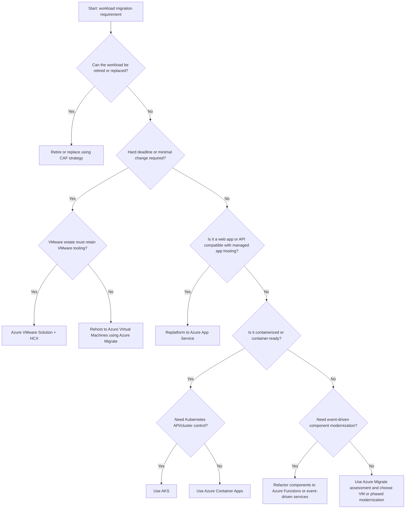
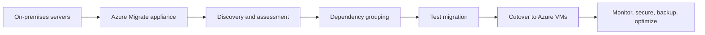
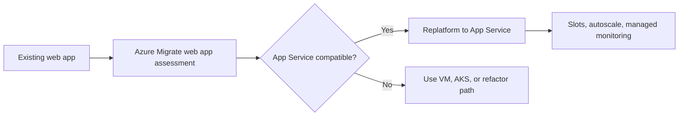
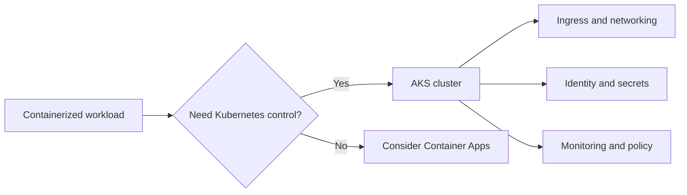
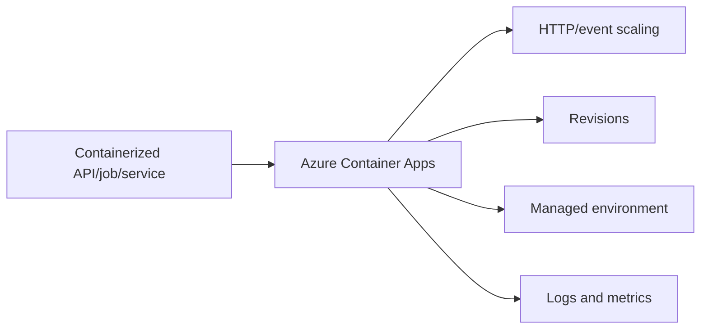
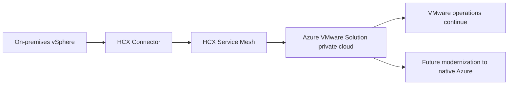

# AZ-305 Study Guide: Recommend a solution for migrating workloads to infrastructure as a service (IaaS) and platform as a service (PaaS)

> **Exam task:** Design migrations — Recommend a solution for migrating workloads to infrastructure as a service (IaaS) and platform as a service (PaaS)
>
> **Domain:** Design infrastructure solutions
>
> **Estimated reading time:** 45 minutes
>
> **Matched task source:** Exact match to the [official AZ-305 study guide](https://learn.microsoft.com/en-us/credentials/certifications/resources/study-guides/az-305) and the provided Study Guide Map.
>
> **Scope boundary:** This guide focuses on choosing migration approaches and Azure target platforms for application and server workloads, especially [Azure Migrate](https://learn.microsoft.com/en-us/azure/migrate/migrate-services-overview), [Azure Virtual Machines](https://learn.microsoft.com/en-us/azure/virtual-machines/overview), [Azure App Service](https://learn.microsoft.com/en-us/azure/app-service/), [Azure Kubernetes Service](https://learn.microsoft.com/en-us/azure/aks/what-is-aks), [Azure Container Apps](https://learn.microsoft.com/en-us/azure/container-apps/overview), and [Azure VMware Solution](https://learn.microsoft.com/en-us/azure/azure-vmware/). Database migration and unstructured-data migration are adjacent AZ-305 tasks and are included only where they affect workload-level IaaS/PaaS recommendations.

---

## How to use this guide

Use this guide to practice the architect-level decision process behind workload migration questions in [AZ-305](https://learn.microsoft.com/en-us/credentials/certifications/resources/study-guides/az-305), not to memorize individual deployment steps. By the end, you should be able to read a scenario and decide whether the best recommendation is [rehost](https://learn.microsoft.com/en-us/azure/cloud-adoption-framework/plan/select-cloud-migration-strategy#2-rehost-like-for-like-migration), [replatform](https://learn.microsoft.com/en-us/azure/cloud-adoption-framework/plan/select-cloud-migration-strategy#3-replatform-modernize-hosting-environment), [refactor](https://learn.microsoft.com/en-us/azure/cloud-adoption-framework/plan/select-cloud-migration-strategy#4-refactor-code-based-modernization), [rearchitect](https://learn.microsoft.com/en-us/azure/cloud-adoption-framework/plan/select-cloud-migration-strategy#5-rearchitect-redesign-for-cloud), [rebuild](https://learn.microsoft.com/en-us/azure/cloud-adoption-framework/plan/select-cloud-migration-strategy#6-rebuild-cloud-native-development), [replace](https://learn.microsoft.com/en-us/azure/cloud-adoption-framework/plan/select-cloud-migration-strategy#7-replace-move-to-saas), or [retire](https://learn.microsoft.com/en-us/azure/cloud-adoption-framework/plan/select-cloud-migration-strategy#1-retire-decommission).

This task is not only about “which tool migrates servers.” It asks you to recommend the right migration destination and migration strategy based on business constraints, technical dependencies, modernization goals, downtime tolerance, operational skills, network readiness, compliance, resiliency, and cost. Use the source links to drill into Microsoft’s current product boundaries and then return to the comparison tables and scenarios for exam-style reasoning.

When reading scenario questions, look for requirement clues such as “minimal code changes,” “must retain OS control,” “modernize web apps,” “avoid Kubernetes management,” “must keep VMware tooling,” “dependency mapping,” “migration waves,” “RTO/RPO,” “network latency,” “regulatory isolation,” “cost estimate,” and “data-center exit deadline.”

---

## Primary source set

### Exam and module sources

- [Official AZ-305 study guide](https://learn.microsoft.com/en-us/credentials/certifications/resources/study-guides/az-305)
- [AZ-305: Design infrastructure solutions learning path](https://learn.microsoft.com/en-us/training/paths/design-infranstructure-solutions/)
- [Design migrations Microsoft Learn module](https://learn.microsoft.com/en-us/training/modules/design-migrations/)

### Core product documentation

- [Azure Migrate overview](https://learn.microsoft.com/en-us/azure/migrate/migrate-services-overview)
- [Azure Migrate server migration overview](https://learn.microsoft.com/en-us/azure/migrate/server-migrate-overview)
- [Azure Migrate web app migration and modernization](https://learn.microsoft.com/en-us/azure/migrate/web-app-migration-modernization)
- [Azure Migrate dependency analysis](https://learn.microsoft.com/en-us/azure/migrate/concepts-dependency-visualization)
- [Azure Migrate business case](https://learn.microsoft.com/en-us/azure/migrate/concepts-business-case-calculation)
- [Azure Virtual Machines overview](https://learn.microsoft.com/en-us/azure/virtual-machines/overview)
- [Azure App Service overview](https://learn.microsoft.com/en-us/azure/app-service/)
- [Azure Kubernetes Service overview](https://learn.microsoft.com/en-us/azure/aks/what-is-aks)
- [Azure Container Apps overview](https://learn.microsoft.com/en-us/azure/container-apps/overview)
- [Azure VMware Solution overview](https://learn.microsoft.com/en-us/azure/azure-vmware/)

### Supporting architecture and framework sources

- [Cloud Adoption Framework migration methodology](https://learn.microsoft.com/en-us/azure/cloud-adoption-framework/migrate/)
- [Select cloud migration strategies](https://learn.microsoft.com/en-us/azure/cloud-adoption-framework/plan/select-cloud-migration-strategy)
- [Plan your migration](https://learn.microsoft.com/en-us/azure/cloud-adoption-framework/migrate/plan-migration)
- [Azure landing zones](https://learn.microsoft.com/en-us/azure/cloud-adoption-framework/ready/landing-zone/)
- [Prepare your landing zone for migration](https://learn.microsoft.com/en-us/azure/cloud-adoption-framework/ready/landing-zone/ready-azure-landing-zone)
- [Choose an Azure compute service](https://learn.microsoft.com/en-us/azure/architecture/guide/technology-choices/compute-decision-tree)
- [Use managed services](https://learn.microsoft.com/en-us/azure/architecture/guide/design-principles/managed-services)
- [Choose an Azure container service](https://learn.microsoft.com/en-us/azure/architecture/guide/choose-azure-container-service)
- [Azure Well-Architected Framework](https://learn.microsoft.com/en-us/azure/well-architected/)
- [Azure reliability documentation](https://learn.microsoft.com/en-us/azure/reliability/)

### Discovery notes from the Study Guide Map

The Study Guide Map identified [Azure Migrate](https://learn.microsoft.com/en-us/azure/migrate/migrate-services-overview), [Cloud Adoption Framework migration guidance](https://learn.microsoft.com/en-us/azure/cloud-adoption-framework/migrate/), [Azure compute decision guidance](https://learn.microsoft.com/en-us/azure/architecture/guide/technology-choices/compute-decision-tree), [Azure Virtual Machines](https://learn.microsoft.com/en-us/azure/virtual-machines/overview), [Azure App Service](https://learn.microsoft.com/en-us/azure/app-service/), [Azure Kubernetes Service](https://learn.microsoft.com/en-us/azure/aks/what-is-aks), [Azure Container Apps](https://learn.microsoft.com/en-us/azure/container-apps/overview), and [Azure VMware Solution](https://learn.microsoft.com/en-us/azure/azure-vmware/) as the core source set for this task.

The forum-discovery note is nonauthoritative and should be treated only as a signal that candidates often discuss [IaaS vs. PaaS](https://learn.microsoft.com/en-us/azure/architecture/guide/design-principles/managed-services), [Azure Migrate assessments](https://learn.microsoft.com/en-us/azure/migrate/migrate-services-overview), [rehost vs. replatform](https://learn.microsoft.com/en-us/azure/cloud-adoption-framework/plan/select-cloud-migration-strategy), [App Service modernization](https://learn.microsoft.com/en-us/azure/migrate/web-app-migration-modernization), [VMware migration](https://learn.microsoft.com/en-us/azure/azure-vmware/architecture-migrate), and scenario-style compute selection.

---

## 1. Exam task scope

The [official AZ-305 study guide](https://learn.microsoft.com/en-us/credentials/certifications/resources/study-guides/az-305) places this task in **Design infrastructure solutions → Design migrations**. The expected architect decision is to recommend a migration approach and target Azure platform for workloads that could land on [IaaS virtual machines](https://learn.microsoft.com/en-us/azure/virtual-machines/overview), [PaaS application hosting](https://learn.microsoft.com/en-us/azure/app-service/), [managed Kubernetes](https://learn.microsoft.com/en-us/azure/aks/what-is-aks), [serverless containers](https://learn.microsoft.com/en-us/azure/container-apps/overview), or [Azure VMware Solution](https://learn.microsoft.com/en-us/azure/azure-vmware/).

The task likely expects the candidate to understand the [Cloud Adoption Framework migration strategy patterns](https://learn.microsoft.com/en-us/azure/cloud-adoption-framework/plan/select-cloud-migration-strategy), the [Azure Migrate assessment and migration workflow](https://learn.microsoft.com/en-us/azure/migrate/migrate-services-overview), and the [Azure Architecture Center compute decision tree](https://learn.microsoft.com/en-us/azure/architecture/guide/technology-choices/compute-decision-tree). It also expects you to understand when a workload should remain close to its current architecture, when it should be replatformed to managed services, and when deeper modernization is justified.

In scope:

- Assessing servers, applications, dependencies, readiness, sizing, cost, and migration groups with [Azure Migrate Discovery and assessment](https://learn.microsoft.com/en-us/azure/migrate/migrate-services-overview).
- Choosing [Azure Virtual Machines](https://learn.microsoft.com/en-us/azure/virtual-machines/overview) when the workload needs OS-level control, legacy compatibility, custom agents, domain-joined infrastructure, or a fast lift-and-shift path.
- Choosing [Azure App Service](https://learn.microsoft.com/en-us/azure/app-service/) when a web app can run on a managed application platform and the requirement is to reduce infrastructure management.
- Choosing [Azure Kubernetes Service](https://learn.microsoft.com/en-us/azure/aks/what-is-aks) when container orchestration, Kubernetes APIs, cluster extensibility, or microservice platform control is required.
- Choosing [Azure Container Apps](https://learn.microsoft.com/en-us/azure/container-apps/overview) when the workload is containerized or can be containerized but does not require direct Kubernetes cluster management.
- Choosing [Azure VMware Solution](https://learn.microsoft.com/en-us/azure/azure-vmware/) when the requirement is to move VMware workloads quickly while keeping VMware operational models and tooling.
- Preparing the destination with [Azure landing zones](https://learn.microsoft.com/en-us/azure/cloud-adoption-framework/ready/landing-zone/) so identity, networking, governance, security, and management foundations exist before migration.

Out of scope as primary topics:

- Database migration design belongs mainly to the AZ-305 task “Recommend a solution for migrating databases,” though [Azure Database Migration Service](https://learn.microsoft.com/en-us/azure/dms/dms-overview) and [Azure SQL Managed Instance](https://learn.microsoft.com/en-us/azure/azure-sql/managed-instance/sql-managed-instance-paas-overview) can affect a combined application migration.
- Unstructured data migration belongs mainly to the AZ-305 task “Recommend a solution for migrating unstructured data,” though [Azure Data Box](https://learn.microsoft.com/en-us/azure/databox/data-box-overview) can affect large offline migration plans.
- Backup, disaster recovery, and high availability are separate AZ-305 domains, though [Azure Backup](https://learn.microsoft.com/en-us/azure/backup/backup-overview) and [Azure Site Recovery](https://learn.microsoft.com/en-us/azure/site-recovery/site-recovery-overview) can be part of a migrated workload’s operating model.
- Detailed CI/CD design belongs mainly to application architecture and automated deployment tasks, though [deployment slots](https://learn.microsoft.com/en-us/azure/app-service/deploy-staging-slots) and [AKS deployment practices](https://learn.microsoft.com/en-us/azure/aks/) can influence a modernization target.

**Mental boundary:** For this task, answer “where should the workload land and how should it move.” For adjacent tasks, answer “how should the database move,” “how should the storage move,” “how should the workload be highly available,” or “how should the workload be monitored.”

> **Exam tip:** When a question says “minimal changes” or “move quickly,” start with [rehost](https://learn.microsoft.com/en-us/azure/cloud-adoption-framework/plan/select-cloud-migration-strategy#2-rehost-like-for-like-migration) or [Azure VMware Solution](https://learn.microsoft.com/en-us/azure/azure-vmware/); when it says “reduce infrastructure management for a web app,” consider [App Service](https://learn.microsoft.com/en-us/azure/app-service/); when it says “Kubernetes APIs” or “orchestration control,” consider [AKS](https://learn.microsoft.com/en-us/azure/aks/what-is-aks); when it says “serverless containers” or “avoid cluster management,” consider [Container Apps](https://learn.microsoft.com/en-us/azure/container-apps/overview).

---

## 2. Product and topic discovery pass

| Product, service, or topic | Why it may be relevant | Primary Microsoft source | In-scope or adjacent? |
|---|---|---|---|
| [Cloud Adoption Framework migration methodology](https://learn.microsoft.com/en-us/azure/cloud-adoption-framework/migrate/) | Provides the migration lifecycle and decision framing for assessing, migrating, releasing, and governing workloads. | [CAF Migrate](https://learn.microsoft.com/en-us/azure/cloud-adoption-framework/migrate/) | In scope |
| [Cloud migration strategies](https://learn.microsoft.com/en-us/azure/cloud-adoption-framework/plan/select-cloud-migration-strategy) | Defines rehost, replatform, refactor, rearchitect, rebuild, replace, retain, and retire. | [Select cloud migration strategies](https://learn.microsoft.com/en-us/azure/cloud-adoption-framework/plan/select-cloud-migration-strategy) | In scope |
| [Azure Migrate](https://learn.microsoft.com/en-us/azure/migrate/migrate-services-overview) | Central hub for discovery, assessment, business case, dependency analysis, and migration tracking. | [Azure Migrate overview](https://learn.microsoft.com/en-us/azure/migrate/migrate-services-overview) | In scope |
| [Azure Migrate appliance](https://learn.microsoft.com/en-us/azure/migrate/migrate-appliance) | Collects discovery and assessment data from VMware, Hyper-V, and physical/server environments. | [Azure Migrate appliance](https://learn.microsoft.com/en-us/azure/migrate/migrate-appliance) | In scope |
| [Dependency analysis](https://learn.microsoft.com/en-us/azure/migrate/concepts-dependency-visualization) | Helps group servers into application waves and avoid missing dependencies during cutover. | [Dependency analysis](https://learn.microsoft.com/en-us/azure/migrate/concepts-dependency-visualization) | In scope |
| [Business case](https://learn.microsoft.com/en-us/azure/migrate/concepts-business-case-calculation) | Helps compare costs and modernization opportunities before choosing a migration strategy. | [Azure Migrate business case](https://learn.microsoft.com/en-us/azure/migrate/concepts-business-case-calculation) | In scope |
| [Azure Virtual Machines](https://learn.microsoft.com/en-us/azure/virtual-machines/overview) | Default IaaS destination for rehosted workloads that require OS control or legacy compatibility. | [VM overview](https://learn.microsoft.com/en-us/azure/virtual-machines/overview) | In scope |
| [Managed disks](https://learn.microsoft.com/en-us/azure/virtual-machines/managed-disks-overview) | VM performance, resiliency, cost, and replication choices depend on disk tier and redundancy. | [Managed disks overview](https://learn.microsoft.com/en-us/azure/virtual-machines/managed-disks-overview) | In scope |
| [Azure App Service](https://learn.microsoft.com/en-us/azure/app-service/) | PaaS destination for web apps that can run without OS-level control. | [App Service docs](https://learn.microsoft.com/en-us/azure/app-service/) | In scope |
| [App Service plans](https://learn.microsoft.com/en-us/azure/app-service/overview-hosting-plans) | Features such as autoscale, deployment slots, backups, custom domains, and TLS depend on plan tier. | [App Service plans](https://learn.microsoft.com/en-us/azure/app-service/overview-hosting-plans) | In scope |
| [Azure Kubernetes Service](https://learn.microsoft.com/en-us/azure/aks/what-is-aks) | PaaS target when Kubernetes orchestration, platform extensibility, or microservice control is required. | [What is AKS?](https://learn.microsoft.com/en-us/azure/aks/what-is-aks) | In scope |
| [Azure Container Apps](https://learn.microsoft.com/en-us/azure/container-apps/overview) | Serverless container platform for APIs, jobs, event-driven apps, and microservices without cluster management. | [Container Apps overview](https://learn.microsoft.com/en-us/azure/container-apps/overview) | In scope |
| [Azure Functions](https://learn.microsoft.com/en-us/azure/azure-functions/functions-overview) | Can be a modernization target for event-driven components rather than a whole-server migration target. | [Functions overview](https://learn.microsoft.com/en-us/azure/azure-functions/functions-overview) | Adjacent/supporting |
| [Azure VMware Solution](https://learn.microsoft.com/en-us/azure/azure-vmware/) | Migration path for VMware workloads that must retain VMware operations, vSphere tooling, or fast data-center exit. | [Azure VMware Solution docs](https://learn.microsoft.com/en-us/azure/azure-vmware/) | In scope |
| [VMware HCX](https://learn.microsoft.com/en-us/azure/azure-vmware/architecture-migrate) | Provides migration options such as cold migration, bulk migration, HCX vMotion, and replication-assisted vMotion for AVS. | [VMware HCX migration considerations](https://learn.microsoft.com/en-us/azure/azure-vmware/architecture-migrate) | In scope when AVS applies |
| [Azure landing zones](https://learn.microsoft.com/en-us/azure/cloud-adoption-framework/ready/landing-zone/) | Provides the destination foundation for governance, identity, networking, security, and management. | [Azure landing zones](https://learn.microsoft.com/en-us/azure/cloud-adoption-framework/ready/landing-zone/) | In scope |
| [ExpressRoute](https://learn.microsoft.com/en-us/azure/expressroute/expressroute-introduction) | Supports private connectivity for migration traffic and hybrid dependencies. | [ExpressRoute overview](https://learn.microsoft.com/en-us/azure/expressroute/expressroute-introduction) | Supporting |
| [VPN Gateway](https://learn.microsoft.com/en-us/azure/vpn-gateway/vpn-gateway-about-vpngateways) | Supports site-to-site migration connectivity where ExpressRoute is not required. | [VPN Gateway overview](https://learn.microsoft.com/en-us/azure/vpn-gateway/vpn-gateway-about-vpngateways) | Supporting |
| [Azure Policy](https://learn.microsoft.com/en-us/azure/governance/policy/overview) | Enforces guardrails for allowed locations, SKUs, tagging, security, and compliance during migration. | [Azure Policy overview](https://learn.microsoft.com/en-us/azure/governance/policy/overview) | Supporting |
| [Azure Monitor](https://learn.microsoft.com/en-us/azure/azure-monitor/fundamentals/overview) | Required to operate migrated workloads after cutover, but not the primary migration-selection decision. | [Azure Monitor overview](https://learn.microsoft.com/en-us/azure/azure-monitor/fundamentals/overview) | Supporting |
| [Microsoft Cost Management](https://learn.microsoft.com/en-us/azure/cost-management-billing/costs/overview-cost-management) | Helps track and optimize migration costs after workloads move to Azure. | [Cost Management overview](https://learn.microsoft.com/en-us/azure/cost-management-billing/costs/overview-cost-management) | Supporting |
| [Azure Database Migration Service](https://learn.microsoft.com/en-us/azure/dms/dms-overview) | Relevant when an application workload includes database migration decisions. | [DMS overview](https://learn.microsoft.com/en-us/azure/dms/dms-overview) | Adjacent |
| [Azure Data Box](https://learn.microsoft.com/en-us/azure/databox/data-box-overview) | Relevant for offline transfer of large datasets that block workload migration. | [Data Box overview](https://learn.microsoft.com/en-us/azure/databox/data-box-overview) | Adjacent |
| [Azure Arc-enabled servers](https://learn.microsoft.com/en-us/azure/azure-arc/servers/overview) | Relevant for hybrid management, retained workloads, or migration staging, but not a primary landing target for this task. | [Azure Arc-enabled servers](https://learn.microsoft.com/en-us/azure/azure-arc/servers/overview) | Supporting/adjacent |

---

## 3. Starting point from Microsoft Learn

The best starting point is the [Design migrations module](https://learn.microsoft.com/en-us/training/modules/design-migrations/), which maps closely to the AZ-305 migration skill and covers [Cloud Adoption Framework migration evaluation](https://learn.microsoft.com/en-us/azure/cloud-adoption-framework/migrate/), [Azure Migrate](https://learn.microsoft.com/en-us/azure/migrate/migrate-services-overview), workload assessment, migration tool selection, database migration, and storage migration. For this specific task, the strongest sections are the ones that help you assess workloads, select migration tools, and choose between IaaS and PaaS targets.

Microsoft Learn expects you to understand that migration is not a single technical copy operation. The [Cloud Adoption Framework](https://learn.microsoft.com/en-us/azure/cloud-adoption-framework/migrate/) frames migration as a lifecycle that includes readiness, assessment, planning, migration, release, governance, and optimization. The [Azure Migrate service](https://learn.microsoft.com/en-us/azure/migrate/migrate-services-overview) provides a hub for discovery, assessment, migration, modernization, and optimization of infrastructure, data, and web application workloads.

The module and source docs are good for identifying tools, phases, and broad migration categories. For AZ-305 scenario readiness, you must add deeper design reasoning from [compute selection guidance](https://learn.microsoft.com/en-us/azure/architecture/guide/technology-choices/compute-decision-tree), [managed service design principles](https://learn.microsoft.com/en-us/azure/architecture/guide/design-principles/managed-services), [container service selection](https://learn.microsoft.com/en-us/azure/architecture/guide/choose-azure-container-service), and [landing zone readiness](https://learn.microsoft.com/en-us/azure/cloud-adoption-framework/ready/landing-zone/ready-azure-landing-zone).

> **Exam tip:** The Microsoft Learn module can make migration look tool-centric, but exam questions are usually requirement-centric; use [Azure Migrate](https://learn.microsoft.com/en-us/azure/migrate/migrate-services-overview) to assess and plan, then use the [Cloud Adoption Framework strategy guidance](https://learn.microsoft.com/en-us/azure/cloud-adoption-framework/plan/select-cloud-migration-strategy) and [compute decision tree](https://learn.microsoft.com/en-us/azure/architecture/guide/technology-choices/compute-decision-tree) to choose the correct target.

---

## 4. Conceptual foundation

### 4.1 Migration strategy is a business and technical fit decision

A workload migration strategy defines how an existing workload transitions to Azure based on business drivers, technical constraints, compliance requirements, operational readiness, and modernization value. Microsoft’s [migration strategies](https://learn.microsoft.com/en-us/azure/cloud-adoption-framework/plan/select-cloud-migration-strategy) include retire, retain, rehost, replatform, refactor, rearchitect, rebuild, and replace.

For this exam task, the most important distinction is between [rehost](https://learn.microsoft.com/en-us/azure/cloud-adoption-framework/plan/select-cloud-migration-strategy#2-rehost-like-for-like-migration) and [replatform](https://learn.microsoft.com/en-us/azure/cloud-adoption-framework/plan/select-cloud-migration-strategy#3-replatform-modernize-hosting-environment). Rehost usually maps to [Azure Virtual Machines](https://learn.microsoft.com/en-us/azure/virtual-machines/overview) or [Azure VMware Solution](https://learn.microsoft.com/en-us/azure/azure-vmware/), while replatform often maps to [Azure App Service](https://learn.microsoft.com/en-us/azure/app-service/), [Azure Kubernetes Service](https://learn.microsoft.com/en-us/azure/aks/what-is-aks), [Azure Container Apps](https://learn.microsoft.com/en-us/azure/container-apps/overview), or managed databases.

A deeper modernization strategy such as [refactor](https://learn.microsoft.com/en-us/azure/cloud-adoption-framework/plan/select-cloud-migration-strategy#4-refactor-code-based-modernization), [rearchitect](https://learn.microsoft.com/en-us/azure/cloud-adoption-framework/plan/select-cloud-migration-strategy#5-rearchitect-redesign-for-cloud), or [rebuild](https://learn.microsoft.com/en-us/azure/cloud-adoption-framework/plan/select-cloud-migration-strategy#6-rebuild-cloud-native-development) is usually selected when the scenario prioritizes scalability, resilience, developer velocity, decoupling, or cloud-native design over fastest migration.

> **Exam tip:** “Migrate to Azure” does not automatically mean “move to VMs.” The better answer can be [App Service](https://learn.microsoft.com/en-us/azure/app-service/), [AKS](https://learn.microsoft.com/en-us/azure/aks/what-is-aks), or [Container Apps](https://learn.microsoft.com/en-us/azure/container-apps/overview) when the requirement says managed platform, modernization, independent scaling, or reduced infrastructure operations.

### 4.2 Azure Migrate is the assessment and migration hub

[Azure Migrate](https://learn.microsoft.com/en-us/azure/migrate/migrate-services-overview) is the central service for migration discovery, assessment, planning, and execution. It supports assessment and migration for servers, databases, and web apps, and it integrates discovery, dependency analysis, business case, migration readiness, sizing, and cost estimation.

[Azure Migrate server migration](https://learn.microsoft.com/en-us/azure/migrate/server-migrate-overview) supports VMware, Hyper-V, physical servers, and cloud-hosted servers. The server migration path is especially relevant when a workload should be rehosted to [Azure Virtual Machines](https://learn.microsoft.com/en-us/azure/virtual-machines/overview) and the organization needs replication, test migration, cutover, and post-cutover validation.

[Azure Migrate web app migration and modernization](https://learn.microsoft.com/en-us/azure/migrate/web-app-migration-modernization) is relevant when ASP.NET or Java web apps might move to [Azure App Service](https://learn.microsoft.com/en-us/azure/app-service/) or [AKS](https://learn.microsoft.com/en-us/azure/aks/what-is-aks). The exam distinction is that web app assessment can point to a PaaS target, while server assessment often points to VM sizing and migration readiness.

[Dependency analysis](https://learn.microsoft.com/en-us/azure/migrate/concepts-dependency-visualization) helps identify servers that communicate with each other and should often be grouped into the same application migration wave. This matters in scenario questions because missing dependencies can cause post-cutover outages even if each individual VM migrates successfully.

> **Exam tip:** Choose [Azure Migrate](https://learn.microsoft.com/en-us/azure/migrate/migrate-services-overview) when the scenario asks for discovery, assessment, readiness, dependencies, sizing, migration planning, business case, or migration execution; choose the destination service only after the assessment context is clear.

### 4.3 IaaS preserves control but retains operational responsibility

[Azure Virtual Machines](https://learn.microsoft.com/en-us/azure/virtual-machines/overview) provide cloud-hosted virtualization without buying or maintaining physical hardware, but the customer still manages the guest operating system, patching, runtime components, agents, and installed software. This makes VMs a strong fit for legacy workloads, custom OS configuration, packaged vendor applications, domain-joined servers, unsupported runtimes, and applications that cannot be changed before migration.

IaaS is often the lowest-risk path for data-center exit deadlines because it minimizes changes to the workload architecture. However, IaaS can preserve technical debt, leave the organization responsible for patching and hardening, and require explicit design for [availability zones](https://learn.microsoft.com/en-us/azure/reliability/availability-zones-overview), [backup](https://learn.microsoft.com/en-us/azure/backup/backup-overview), [monitoring](https://learn.microsoft.com/en-us/azure/azure-monitor/vm/monitor-vm), and [update management](https://learn.microsoft.com/en-us/azure/update-manager/overview).

> **Exam tip:** VM migration is the safe default for “no code changes” and “needs OS control,” but it is not the best default when the scenario emphasizes managed operations, platform scaling, or reduced patching.

### 4.4 PaaS reduces infrastructure management but imposes platform constraints

[Azure App Service](https://learn.microsoft.com/en-us/azure/app-service/) is a managed platform for web apps, REST APIs, and mobile back ends. It is a strong migration target when an application can run within App Service runtime, networking, file system, and platform constraints and the requirement is to reduce infrastructure operations.

[Azure App Service plans](https://learn.microsoft.com/en-us/azure/app-service/overview-hosting-plans) control feature availability, scaling behavior, deployment options, and cost. Features such as deployment slots, autoscale, custom domains, TLS, backups, and network options vary by plan and tier.

[Azure Container Apps](https://learn.microsoft.com/en-us/azure/container-apps/overview) provides a serverless container platform that abstracts server and orchestrator management. It is well suited for containerized APIs, event-driven apps, background processing, microservices, and jobs when the organization does not need to manage Kubernetes clusters directly.

[Azure Kubernetes Service](https://learn.microsoft.com/en-us/azure/aks/what-is-aks) is a managed Kubernetes service that reduces some cluster management complexity but still requires the organization to understand Kubernetes architecture, networking, identity, ingress, scaling, security, upgrades, and workload operations. It is best when the workload needs Kubernetes APIs, orchestrator-level control, ecosystem tooling, service mesh patterns, or complex microservice operations.

> **Exam tip:** [Container Apps](https://learn.microsoft.com/en-us/azure/container-apps/overview) is usually the better answer when the requirement says “containers without Kubernetes management,” while [AKS](https://learn.microsoft.com/en-us/azure/aks/what-is-aks) is usually the better answer when the requirement says “full Kubernetes control,” “custom controllers,” “cluster-level extensibility,” or “existing Kubernetes platform.”

### 4.5 Azure VMware Solution is a migration bridge, not automatic modernization

[Azure VMware Solution](https://learn.microsoft.com/en-us/azure/azure-vmware/) lets organizations run VMware workloads on Azure infrastructure while retaining VMware tooling and operational patterns. It is a strong fit for data-center exit, VMware estate migration, licensing or operational continuity, and workloads that are difficult to replatform immediately.

[VMware HCX migration considerations](https://learn.microsoft.com/en-us/azure/azure-vmware/architecture-migrate) include migration methods such as cold migration, HCX vMotion, bulk migration, replication-assisted vMotion, and OS-assisted migration. [HCX configuration](https://learn.microsoft.com/en-us/azure/azure-vmware/configure-vmware-hcx) involves site pairing, network profiles, compute profiles, and service mesh configuration.

The exam trap is to confuse AVS with PaaS modernization. AVS can accelerate migration, but the workload typically remains a VMware-based workload that still needs modernization planning if the long-term goal is to move to [Azure App Service](https://learn.microsoft.com/en-us/azure/app-service/), [AKS](https://learn.microsoft.com/en-us/azure/aks/what-is-aks), [Container Apps](https://learn.microsoft.com/en-us/azure/container-apps/overview), or managed data services.

> **Exam tip:** Choose [Azure VMware Solution](https://learn.microsoft.com/en-us/azure/azure-vmware/) when retaining VMware tools and minimizing migration change is a hard requirement; choose [Azure Virtual Machines](https://learn.microsoft.com/en-us/azure/virtual-machines/overview) when the goal is native Azure IaaS; choose [PaaS](https://learn.microsoft.com/en-us/azure/architecture/guide/design-principles/managed-services) when the goal is reducing infrastructure operations.

### 4.6 Landing zone readiness controls whether migration can scale

An [Azure landing zone](https://learn.microsoft.com/en-us/azure/cloud-adoption-framework/ready/landing-zone/) provides a scalable foundation for subscriptions, management groups, networking, identity, governance, security, management, and platform operations. Before migration waves begin, the landing zone should support required policies, network connectivity, DNS, identity integration, monitoring, logging, cost management, security baselines, and subscription vending.

[Preparing a landing zone for migration](https://learn.microsoft.com/en-us/azure/cloud-adoption-framework/ready/landing-zone/ready-azure-landing-zone) is important because poorly prepared target environments cause migration delays, rework, policy exceptions, security gaps, and inconsistent operations. The landing zone is not the migration tool, but it is often the difference between a one-off migration and a repeatable migration factory.

> **Exam tip:** If the scenario says “enterprise-scale,” “multiple workloads,” “shared networking,” “policy guardrails,” or “repeatable migration waves,” include [landing zone readiness](https://learn.microsoft.com/en-us/azure/cloud-adoption-framework/ready/landing-zone/ready-azure-landing-zone) in the recommendation.

---

## 5. Design decision framework

### 5.1 Migration target decision tree

Use this decision tree as a starting point, not a substitute for requirements analysis. In exam scenarios, the best answer is usually the lowest-complexity option that satisfies the stated constraints, aligns with the [Cloud Adoption Framework migration strategy](https://learn.microsoft.com/en-us/azure/cloud-adoption-framework/plan/select-cloud-migration-strategy), and fits the [Azure compute decision guidance](https://learn.microsoft.com/en-us/azure/architecture/guide/technology-choices/compute-decision-tree).

### 5.2 Step-by-step design logic

1. **Classify the business driver.** A data-center exit deadline favors [rehost](https://learn.microsoft.com/en-us/azure/cloud-adoption-framework/plan/select-cloud-migration-strategy#2-rehost-like-for-like-migration), a modernization mandate favors [replatform](https://learn.microsoft.com/en-us/azure/cloud-adoption-framework/plan/select-cloud-migration-strategy#3-replatform-modernize-hosting-environment), and a cloud-native transformation favors [refactor](https://learn.microsoft.com/en-us/azure/cloud-adoption-framework/plan/select-cloud-migration-strategy#4-refactor-code-based-modernization) or [rearchitect](https://learn.microsoft.com/en-us/azure/cloud-adoption-framework/plan/select-cloud-migration-strategy#5-rearchitect-redesign-for-cloud).

2. **Discover and assess.** Use [Azure Migrate](https://learn.microsoft.com/en-us/azure/migrate/migrate-services-overview) for discovery, assessment, migration readiness, sizing, cost, and migration tracking, and use [dependency analysis](https://learn.microsoft.com/en-us/azure/migrate/concepts-dependency-visualization) to avoid separating tightly coupled application components.

3. **Select the target platform.** Use the [Azure compute decision tree](https://learn.microsoft.com/en-us/azure/architecture/guide/technology-choices/compute-decision-tree) and [managed services design principle](https://learn.microsoft.com/en-us/azure/architecture/guide/design-principles/managed-services) to balance control, operational burden, scalability, resilience, and cost.

4. **Prepare the landing zone.** Use [Azure landing zones](https://learn.microsoft.com/en-us/azure/cloud-adoption-framework/ready/landing-zone/) and [migration landing zone readiness](https://learn.microsoft.com/en-us/azure/cloud-adoption-framework/ready/landing-zone/ready-azure-landing-zone) before cutover to establish identity, network, governance, management, and security foundations.

5. **Plan waves and cutover.** Use [migration planning guidance](https://learn.microsoft.com/en-us/azure/cloud-adoption-framework/migrate/plan-migration) to sequence workloads by dependencies, business criticality, complexity, downtime tolerance, and risk.

6. **Validate and optimize.** After cutover, use [Azure Monitor](https://learn.microsoft.com/en-us/azure/azure-monitor/fundamentals/overview), [Defender for Cloud](https://learn.microsoft.com/en-us/azure/defender-for-cloud/defender-for-cloud-introduction), and [Cost Management](https://learn.microsoft.com/en-us/azure/cost-management-billing/costs/overview-cost-management) to stabilize, secure, and optimize the migrated workloads.

### 5.3 Hard constraints vs. soft preferences

| Requirement clue | Interpretation | Likely recommendation |
|---|---|---|
| “No code changes,” “same OS,” “custom agent,” “vendor app,” “domain-joined server” | The workload depends on server-level control. | [Rehost to Azure Virtual Machines](https://learn.microsoft.com/en-us/azure/cloud-adoption-framework/plan/select-cloud-migration-strategy#2-rehost-like-for-like-migration) and assess with [Azure Migrate](https://learn.microsoft.com/en-us/azure/migrate/migrate-services-overview). |
| “Retain VMware tooling,” “keep vSphere operations,” “move VMware estate quickly” | VMware operational continuity is a hard requirement. | [Azure VMware Solution](https://learn.microsoft.com/en-us/azure/azure-vmware/) with [VMware HCX](https://learn.microsoft.com/en-us/azure/azure-vmware/architecture-migrate). |
| “Reduce infrastructure management,” “web app,” “managed platform” | The workload can likely move to managed app hosting. | [Azure App Service](https://learn.microsoft.com/en-us/azure/app-service/) if compatible. |
| “Containerized app,” “avoid cluster operations,” “event-driven scale” | The organization wants containers without Kubernetes platform management. | [Azure Container Apps](https://learn.microsoft.com/en-us/azure/container-apps/overview). |
| “Kubernetes APIs,” “custom ingress/controller,” “service mesh,” “platform team” | Kubernetes control is part of the requirement. | [Azure Kubernetes Service](https://learn.microsoft.com/en-us/azure/aks/what-is-aks). |
| “Multiple workloads,” “shared platform,” “policy guardrails,” “central connectivity” | Destination governance and operations matter. | [Azure landing zone](https://learn.microsoft.com/en-us/azure/cloud-adoption-framework/ready/landing-zone/) plus migration waves. |
| “Estimate cost before migration,” “business case,” “right-size” | Assessment and financial modeling are required. | [Azure Migrate business case](https://learn.microsoft.com/en-us/azure/migrate/concepts-business-case-calculation) and [Cost Management](https://learn.microsoft.com/en-us/azure/cost-management-billing/costs/overview-cost-management). |
| “Application dependencies unknown” | Migration groups are uncertain and risk is high. | [Azure Migrate dependency analysis](https://learn.microsoft.com/en-us/azure/migrate/concepts-dependency-visualization). |

> **Test yourself**
>
> - A three-tier app must leave the data center in 90 days, cannot be changed, and uses a Windows service installed on the app server. Which migration strategy fits best?
> - A Java web app can run in a supported managed runtime and the customer wants to reduce server patching. Which Azure service is a better target than a VM?
>
> **Answer guidance:** The first scenario points to [rehost](https://learn.microsoft.com/en-us/azure/cloud-adoption-framework/plan/select-cloud-migration-strategy#2-rehost-like-for-like-migration) on [Azure Virtual Machines](https://learn.microsoft.com/en-us/azure/virtual-machines/overview). The second scenario points to [Azure App Service](https://learn.microsoft.com/en-us/azure/app-service/) if the app is compatible with managed web hosting.

---

## 6. Service and feature comparison tables

### 6.1 Migration target comparison

| Target | Best fit | Avoid when | Operations model | Exam clue |
|---|---|---|---|---|
| [Azure Virtual Machines](https://learn.microsoft.com/en-us/azure/virtual-machines/overview) | Legacy apps, OS control, custom agents, packaged software, fast rehost. | The requirement is to minimize OS patching or use platform-native scaling. | Customer manages guest OS, runtime, patching, and workload software. | “Lift and shift,” “minimal changes,” “needs OS access.” |
| [Azure App Service](https://learn.microsoft.com/en-us/azure/app-service/) | Web apps and APIs that fit supported platform capabilities. | The app needs unsupported OS customization, arbitrary background services, or full server control. | Microsoft manages platform infrastructure; customer manages app code and configuration. | “Web app,” “managed hosting,” “reduce infrastructure management.” |
| [Azure Kubernetes Service](https://learn.microsoft.com/en-us/azure/aks/what-is-aks) | Containerized workloads requiring Kubernetes APIs, orchestration control, cluster extensibility, or microservice platform patterns. | The team lacks Kubernetes skills or only needs simple serverless container hosting. | Microsoft manages control-plane aspects; customer manages cluster and workload architecture. | “Kubernetes,” “custom controllers,” “service mesh,” “orchestrator control.” |
| [Azure Container Apps](https://learn.microsoft.com/en-us/azure/container-apps/overview) | Containerized APIs, microservices, event-driven jobs, and background workers without Kubernetes management. | The workload requires direct Kubernetes API access or cluster-level customization. | Serverless container platform with less infrastructure management. | “Containers without managing Kubernetes,” “event-driven scale.” |
| [Azure VMware Solution](https://learn.microsoft.com/en-us/azure/azure-vmware/) | VMware workloads that must retain vSphere tooling or move quickly with minimal platform change. | The requirement is cloud-native modernization or native Azure PaaS operations. | VMware operational model on Azure infrastructure. | “Keep VMware,” “vSphere,” “HCX,” “data-center exit.” |

### 6.2 Migration strategy comparison

| Strategy | What changes | Typical Azure target | Use when | Watch out |
|---|---|---|---|---|
| [Retire](https://learn.microsoft.com/en-us/azure/cloud-adoption-framework/plan/select-cloud-migration-strategy#1-retire-decommission) | Workload is decommissioned. | None. | App is unused, redundant, or replaced. | Migrating unused systems wastes cost and effort. |
| [Rehost](https://learn.microsoft.com/en-us/azure/cloud-adoption-framework/plan/select-cloud-migration-strategy#2-rehost-like-for-like-migration) | Minimal architecture change. | [Azure VMs](https://learn.microsoft.com/en-us/azure/virtual-machines/overview) or [AVS](https://learn.microsoft.com/en-us/azure/azure-vmware/). | Speed and low change risk matter most. | Technical debt and OS management remain. |
| [Replatform](https://learn.microsoft.com/en-us/azure/cloud-adoption-framework/plan/select-cloud-migration-strategy#3-replatform-modernize-hosting-environment) | Hosting environment modernizes with limited app changes. | [App Service](https://learn.microsoft.com/en-us/azure/app-service/), [Container Apps](https://learn.microsoft.com/en-us/azure/container-apps/overview), [AKS](https://learn.microsoft.com/en-us/azure/aks/what-is-aks), managed databases. | Reduce operations without full rewrite. | Compatibility assessment is essential. |
| [Refactor](https://learn.microsoft.com/en-us/azure/cloud-adoption-framework/plan/select-cloud-migration-strategy#4-refactor-code-based-modernization) | Code changes improve cloud fit. | [App Service](https://learn.microsoft.com/en-us/azure/app-service/), [Functions](https://learn.microsoft.com/en-us/azure/azure-functions/functions-overview), [Container Apps](https://learn.microsoft.com/en-us/azure/container-apps/overview). | Improve scale, reliability, or deployment without total redesign. | More project risk than rehost. |
| [Rearchitect](https://learn.microsoft.com/en-us/azure/cloud-adoption-framework/plan/select-cloud-migration-strategy#5-rearchitect-redesign-for-cloud) | Architecture is redesigned. | Microservices, event-driven services, [AKS](https://learn.microsoft.com/en-us/azure/aks/what-is-aks), [Container Apps](https://learn.microsoft.com/en-us/azure/container-apps/overview). | Existing architecture blocks cloud goals. | Highest planning and delivery complexity. |
| [Rebuild](https://learn.microsoft.com/en-us/azure/cloud-adoption-framework/plan/select-cloud-migration-strategy#6-rebuild-cloud-native-development) | App is rebuilt cloud-native. | Cloud-native platform services. | Existing app cannot meet future requirements. | Not usually the answer for fast migration. |
| [Replace](https://learn.microsoft.com/en-us/azure/cloud-adoption-framework/plan/select-cloud-migration-strategy#7-replace-move-to-saas) | Existing app is replaced with SaaS. | SaaS application. | Business capability is commodity. | Outside IaaS/PaaS if the answer is SaaS. |

### 6.3 Azure Migrate capability mapping

| Need | Azure Migrate capability | Why it matters |
|---|---|---|
| Discover server inventory | [Azure Migrate Discovery and assessment](https://learn.microsoft.com/en-us/azure/migrate/migrate-services-overview) | Creates a fact base for readiness, sizing, dependencies, and migration planning. |
| Group servers by app dependency | [Dependency analysis](https://learn.microsoft.com/en-us/azure/migrate/concepts-dependency-visualization) | Helps avoid separating components that must migrate together. |
| Estimate migration cost | [Azure Migrate business case](https://learn.microsoft.com/en-us/azure/migrate/concepts-business-case-calculation) | Helps compare migration and modernization cost before committing. |
| Rehost servers | [Migration and modernization tool](https://learn.microsoft.com/en-us/azure/migrate/server-migrate-overview) | Supports VM replication, test migration, and cutover to Azure. |
| Modernize web apps | [Web app migration and modernization](https://learn.microsoft.com/en-us/azure/migrate/web-app-migration-modernization) | Helps assess ASP.NET and Java apps for [App Service](https://learn.microsoft.com/en-us/azure/app-service/) and [AKS](https://learn.microsoft.com/en-us/azure/aks/what-is-aks). |
| Migrate VMware with VMware operations | [Azure VMware Solution migration with HCX](https://learn.microsoft.com/en-us/azure/azure-vmware/architecture-migrate) | Supports VMware migration scenarios that require vSphere continuity. |

---

## 7. Architecture patterns

### Pattern 1: Rehost servers to Azure Virtual Machines

**When it applies:** Use this pattern when the workload must migrate quickly, requires OS-level control, uses unsupported PaaS dependencies, or cannot be modified before migration.

**Core services:** [Azure Migrate](https://learn.microsoft.com/en-us/azure/migrate/migrate-services-overview), [Azure Virtual Machines](https://learn.microsoft.com/en-us/azure/virtual-machines/overview), [managed disks](https://learn.microsoft.com/en-us/azure/virtual-machines/managed-disks-overview), [Azure Monitor for VMs](https://learn.microsoft.com/en-us/azure/azure-monitor/vm/monitor-vm), [Azure Backup](https://learn.microsoft.com/en-us/azure/backup/backup-overview), [Defender for Cloud](https://learn.microsoft.com/en-us/azure/defender-for-cloud/defender-for-cloud-introduction), and [Azure Policy](https://learn.microsoft.com/en-us/azure/governance/policy/overview).

**Strengths:** This pattern minimizes application change, supports fast migration, and preserves server-level control. It works well for legacy workloads and packaged applications that cannot be replatformed.

**Weaknesses:** It keeps more operational responsibility with the customer, including guest OS management, patching, backup design, security configuration, monitoring, and capacity optimization.

**Failure modes:** Common failures include missing dependencies, underestimating network requirements, wrong VM sizing, storage performance mismatch, DNS issues, identity issues, and insufficient landing zone readiness.

**Cost considerations:** VM cost is driven by compute size, managed disk tier, backup, monitoring, data transfer, and licensing. Use [Azure Migrate business case](https://learn.microsoft.com/en-us/azure/migrate/concepts-business-case-calculation), [Azure Cost Management](https://learn.microsoft.com/en-us/azure/cost-management-billing/costs/overview-cost-management), [Azure reservations](https://learn.microsoft.com/en-us/azure/cost-management-billing/reservations/save-compute-costs-reservations), and [Azure Hybrid Benefit](https://learn.microsoft.com/en-us/azure/virtual-machines/windows/hybrid-use-benefit-licensing) where appropriate.

> **Exam tip:** If the question says “unsupported PaaS runtime,” “custom Windows service,” or “must keep OS-level access,” [Azure Virtual Machines](https://learn.microsoft.com/en-us/azure/virtual-machines/overview) are usually the correct migration target.

### Pattern 2: Replatform web apps to Azure App Service

**When it applies:** Use this pattern when an existing web app can run on [Azure App Service](https://learn.microsoft.com/en-us/azure/app-service/) and the requirement is to reduce infrastructure management, support managed scaling, improve deployment options, and avoid full VM management.

**Core services:** [Azure Migrate web app migration and modernization](https://learn.microsoft.com/en-us/azure/migrate/web-app-migration-modernization), [Azure App Service](https://learn.microsoft.com/en-us/azure/app-service/), [App Service plans](https://learn.microsoft.com/en-us/azure/app-service/overview-hosting-plans), [deployment slots](https://learn.microsoft.com/en-us/azure/app-service/deploy-staging-slots), [VNet integration](https://learn.microsoft.com/en-us/azure/app-service/overview-vnet-integration), [private endpoints](https://learn.microsoft.com/en-us/azure/app-service/networking/private-endpoint), and [Application Insights](https://learn.microsoft.com/en-us/azure/azure-monitor/app/app-insights-overview).

**Strengths:** App Service reduces infrastructure operations, supports managed runtime hosting, integrates with deployment slots, and can use platform features for scaling, TLS, diagnostics, and identity.

**Weaknesses:** App Service constrains OS customization, local file-system behavior, background process assumptions, and platform networking design. Some applications require code or configuration changes before they fit App Service.

**Failure modes:** Common failures include assuming any IIS app is automatically compatible, missing outbound dependency requirements, choosing an App Service plan without needed features, or confusing [VNet integration](https://learn.microsoft.com/en-us/azure/app-service/overview-vnet-integration) for inbound private access when [private endpoints](https://learn.microsoft.com/en-us/azure/app-service/networking/private-endpoint) are required.

**Cost considerations:** App Service cost depends on the plan tier and instance count. Higher tiers provide more features, and multiple apps in the same plan can share compute if isolation, scaling, and performance requirements allow.

> **Exam tip:** If the requirement is “web app with minimal infrastructure management” and compatibility is acceptable, [App Service](https://learn.microsoft.com/en-us/azure/app-service/) is usually better than a VM.

### Pattern 3: Containerize and migrate to AKS

**When it applies:** Use this pattern when the workload is containerized or can be containerized and the organization needs Kubernetes APIs, orchestrator-level control, custom controllers, service mesh, complex networking, or platform-team governance.

**Core services:** [Azure Kubernetes Service](https://learn.microsoft.com/en-us/azure/aks/what-is-aks), [AKS core concepts](https://learn.microsoft.com/en-us/azure/aks/core-aks-concepts), [AKS managed identities](https://learn.microsoft.com/en-us/azure/aks/managed-identity-overview), [AKS workload identity](https://learn.microsoft.com/en-us/azure/aks/workload-identity-overview), [Azure Monitor for Kubernetes](https://learn.microsoft.com/en-us/azure/azure-monitor/containers/kubernetes-monitoring-overview), and [Defender for Containers](https://learn.microsoft.com/en-us/azure/defender-for-cloud/defender-for-containers-introduction).

**Strengths:** AKS supports Kubernetes-native deployment patterns, multi-service orchestration, extensibility, ecosystem tooling, and complex container operations.

**Weaknesses:** AKS introduces Kubernetes operational complexity, cluster upgrade planning, networking design, workload identity design, container security, and platform management responsibilities.

**Failure modes:** Common failures include choosing AKS only because the app uses containers, underestimating Kubernetes skills, ignoring upgrade windows, omitting ingress and egress design, and failing to design namespace, identity, and policy boundaries.

**Cost considerations:** AKS cost includes node pools, load balancers, storage, monitoring, managed Prometheus/Grafana where used, and operations overhead. AKS can be cost-efficient at scale but may be overkill for simple containerized applications.

> **Exam tip:** [AKS](https://learn.microsoft.com/en-us/azure/aks/what-is-aks) is the answer when Kubernetes is a requirement, not merely when containers exist.

### Pattern 4: Containerize and migrate to Azure Container Apps

**When it applies:** Use this pattern when the workload can run in containers and the organization wants serverless container hosting, event-driven scaling, background jobs, APIs, or microservices without managing Kubernetes directly.

**Core services:** [Azure Container Apps](https://learn.microsoft.com/en-us/azure/container-apps/overview), [Container Apps environments](https://learn.microsoft.com/en-us/azure/container-apps/environment), [Container Apps jobs](https://learn.microsoft.com/en-us/azure/container-apps/jobs), [KEDA scale rules](https://learn.microsoft.com/en-us/azure/container-apps/scale-app), and [Dapr integration](https://learn.microsoft.com/en-us/azure/container-apps/dapr-overview).

**Strengths:** Container Apps reduces infrastructure management, supports event-driven scale, supports microservices patterns, and avoids direct Kubernetes cluster operations.

**Weaknesses:** It is not the right fit when the team needs direct Kubernetes API access, cluster-level customization, or specific Kubernetes ecosystem extensions.

**Failure modes:** Common failures include choosing Container Apps for workloads that require cluster-level controls or choosing AKS for workloads that only need serverless container hosting.

**Cost considerations:** Container Apps can be attractive for bursty or event-driven workloads, but cost depends on resource allocation, scaling behavior, execution profile, logging, and traffic patterns.

> **Exam tip:** “No Kubernetes management” is a strong clue for [Azure Container Apps](https://learn.microsoft.com/en-us/azure/container-apps/overview), not [AKS](https://learn.microsoft.com/en-us/azure/aks/what-is-aks).

### Pattern 5: VMware estate migration to Azure VMware Solution

**When it applies:** Use this pattern when a VMware estate must move to Azure with minimal changes and the organization wants to keep VMware operational tooling, vSphere skills, and VMware-compatible migration methods.

**Core services:** [Azure VMware Solution](https://learn.microsoft.com/en-us/azure/azure-vmware/), [VMware HCX migration considerations](https://learn.microsoft.com/en-us/azure/azure-vmware/architecture-migrate), [HCX configuration](https://learn.microsoft.com/en-us/azure/azure-vmware/configure-vmware-hcx), [ExpressRoute](https://learn.microsoft.com/en-us/azure/expressroute/expressroute-introduction), and Azure landing zone networking.

**Strengths:** AVS supports fast VMware migration, operational continuity, and reduced replatforming risk for complex VMware estates.

**Weaknesses:** AVS is not a cloud-native PaaS destination and can be more expensive than targeted modernization when the workload is compatible with native Azure services.

**Failure modes:** Common failures include underplanning network connectivity, assuming AVS removes all operational responsibility, ignoring HCX limits, or failing to plan a later modernization path.

**Cost considerations:** AVS cost is driven by dedicated nodes, networking, HCX usage, storage, and operational architecture. It can be justified for urgent data-center exits or complex VMware estates, but it is not automatically the lowest-cost landing zone.

> **Exam tip:** If the question says “retain VMware tooling,” choose [Azure VMware Solution](https://learn.microsoft.com/en-us/azure/azure-vmware/); if it says “move to native Azure IaaS,” choose [Azure Virtual Machines](https://learn.microsoft.com/en-us/azure/virtual-machines/overview); if it says “modernize web app,” choose [App Service](https://learn.microsoft.com/en-us/azure/app-service/) where compatible.

---

## 8. Implementation awareness for architects

Architects should know the implementation sequence because it affects the recommendation, even though AZ-305 is not a hands-on migration exam. A typical migration starts with [strategy selection](https://learn.microsoft.com/en-us/azure/cloud-adoption-framework/plan/select-cloud-migration-strategy), proceeds through [Azure Migrate discovery and assessment](https://learn.microsoft.com/en-us/azure/migrate/migrate-services-overview), validates dependencies with [dependency analysis](https://learn.microsoft.com/en-us/azure/migrate/concepts-dependency-visualization), prepares the target with [landing zone readiness](https://learn.microsoft.com/en-us/azure/cloud-adoption-framework/ready/landing-zone/ready-azure-landing-zone), runs test migration, schedules cutover, validates post-cutover operations, and optimizes cost and security.

Key pre-implementation decisions:

- **Scope:** Which workloads are in each migration wave based on [migration planning](https://learn.microsoft.com/en-us/azure/cloud-adoption-framework/migrate/plan-migration) and [dependency analysis](https://learn.microsoft.com/en-us/azure/migrate/concepts-dependency-visualization).
- **Target platform:** Whether each workload lands on [VMs](https://learn.microsoft.com/en-us/azure/virtual-machines/overview), [App Service](https://learn.microsoft.com/en-us/azure/app-service/), [AKS](https://learn.microsoft.com/en-us/azure/aks/what-is-aks), [Container Apps](https://learn.microsoft.com/en-us/azure/container-apps/overview), or [AVS](https://learn.microsoft.com/en-us/azure/azure-vmware/).
- **Network:** Whether the workload requires [VPN Gateway](https://learn.microsoft.com/en-us/azure/vpn-gateway/vpn-gateway-about-vpngateways), [ExpressRoute](https://learn.microsoft.com/en-us/azure/expressroute/expressroute-introduction), hub-spoke routing, private endpoints, DNS forwarding, or hybrid name resolution.
- **Identity:** Whether migrated workloads require [Microsoft Entra ID](https://learn.microsoft.com/en-us/entra/fundamentals/whatis), [hybrid identity](https://learn.microsoft.com/en-us/azure/cloud-adoption-framework/ready/landing-zone/design-area/identity-access-active-directory-hybrid-identity), [managed identities](https://learn.microsoft.com/en-us/entra/identity/managed-identities-azure-resources/overview), or domain connectivity.
- **Governance:** Whether [Azure Policy](https://learn.microsoft.com/en-us/azure/governance/policy/overview), tags, management groups, allowed locations, allowed SKUs, and deployment guardrails are in place.
- **Operations:** Whether [Azure Monitor](https://learn.microsoft.com/en-us/azure/azure-monitor/fundamentals/overview), [Defender for Cloud](https://learn.microsoft.com/en-us/azure/defender-for-cloud/defender-for-cloud-introduction), [Azure Backup](https://learn.microsoft.com/en-us/azure/backup/backup-overview), and [Cost Management](https://learn.microsoft.com/en-us/azure/cost-management-billing/costs/overview-cost-management) are configured before production cutover.

What can usually be deferred to implementation teams includes exact VM naming, individual Bicep parameters, pipeline syntax, migration schedule mechanics, and runbook details. What cannot be deferred is target platform selection, landing zone readiness, dependency grouping, downtime model, security model, and cost model.

> **Exam tip:** In scenario questions, “what should you do first” often points to [discover and assess with Azure Migrate](https://learn.microsoft.com/en-us/azure/migrate/migrate-services-overview) or [prepare the landing zone](https://learn.microsoft.com/en-us/azure/cloud-adoption-framework/ready/landing-zone/ready-azure-landing-zone), not directly to cutover.

---

## 9. Security, governance, and compliance considerations

Migration recommendations must include security and governance because moving workloads without guardrails can reproduce or amplify on-premises risk. [Azure landing zones](https://learn.microsoft.com/en-us/azure/cloud-adoption-framework/ready/landing-zone/) provide a recommended structure for identity, governance, networking, security, management, and platform foundations.

### Identity and access

Use [Microsoft Entra ID](https://learn.microsoft.com/en-us/entra/fundamentals/whatis) and [Azure RBAC](https://learn.microsoft.com/en-us/azure/role-based-access-control/overview) to manage control-plane access to migrated resources. Use [managed identities](https://learn.microsoft.com/en-us/entra/identity/managed-identities-azure-resources/overview) for application-to-resource access when workloads move to [App Service](https://learn.microsoft.com/en-us/azure/app-service/overview-managed-identity), [AKS](https://learn.microsoft.com/en-us/azure/aks/managed-identity-overview), [Container Apps](https://learn.microsoft.com/en-us/azure/container-apps/managed-identity), or Azure VMs.

For hybrid workloads, validate [hybrid identity design](https://learn.microsoft.com/en-us/azure/cloud-adoption-framework/ready/landing-zone/design-area/identity-access-active-directory-hybrid-identity), domain controller placement, DNS resolution, and connectivity before migration waves.

### Network security

For IaaS migrations, design [network security groups](https://learn.microsoft.com/en-us/azure/virtual-network/network-security-groups-overview), route tables, firewalls, DNS, and private connectivity before cutover. For App Service migrations, understand the difference between [VNet integration](https://learn.microsoft.com/en-us/azure/app-service/overview-vnet-integration) for outbound access to virtual networks and [private endpoints](https://learn.microsoft.com/en-us/azure/app-service/networking/private-endpoint) for private inbound access.

For AKS migrations, include [AKS networking concepts](https://learn.microsoft.com/en-us/azure/aks/concepts-network), ingress, egress, network policy, private clusters, and workload identity in the platform decision. For Container Apps, include [environment networking](https://learn.microsoft.com/en-us/azure/container-apps/networking) and ingress controls.

### Governance and compliance

Use [Azure Policy](https://learn.microsoft.com/en-us/azure/governance/policy/overview) to enforce allowed regions, required tags, diagnostic settings, private endpoint usage, public access restrictions, encryption requirements, and SKU constraints. Use [management groups](https://learn.microsoft.com/en-us/azure/governance/management-groups/overview) and subscriptions to isolate workloads by environment, team, compliance boundary, or lifecycle.

Use [Defender for Cloud](https://learn.microsoft.com/en-us/azure/defender-for-cloud/defender-for-cloud-introduction) to assess security posture and receive recommendations for cloud workloads, including servers, containers, databases, and app services.

> **Exam tip:** A migration recommendation is incomplete if it only names the target service; enterprise migration answers often require [landing zone guardrails](https://learn.microsoft.com/en-us/azure/cloud-adoption-framework/ready/landing-zone/), [Azure Policy](https://learn.microsoft.com/en-us/azure/governance/policy/overview), [RBAC](https://learn.microsoft.com/en-us/azure/role-based-access-control/overview), private connectivity, and post-cutover monitoring.

---

## 10. Resiliency, availability, and disaster recovery considerations

Migration changes the reliability model. A workload that was protected by on-premises clustering, SAN replication, or data-center failover may need a new Azure design using [availability zones](https://learn.microsoft.com/en-us/azure/reliability/availability-zones-overview), [Azure Backup](https://learn.microsoft.com/en-us/azure/backup/backup-overview), [Azure Site Recovery](https://learn.microsoft.com/en-us/azure/site-recovery/site-recovery-overview), zone-redundant PaaS features, or multi-region patterns.

For IaaS workloads, design VM resiliency with [availability zones](https://learn.microsoft.com/en-us/azure/reliability/availability-zones-overview), [availability sets](https://learn.microsoft.com/en-us/azure/virtual-machines/availability-set-overview), [managed disk redundancy](https://learn.microsoft.com/en-us/azure/virtual-machines/disks-redundancy), backup, and recovery objectives. For App Service, use [App Service plan scaling](https://learn.microsoft.com/en-us/azure/app-service/manage-scale-up), [autoscale](https://learn.microsoft.com/en-us/azure/azure-monitor/autoscale/autoscale-overview), [deployment slots](https://learn.microsoft.com/en-us/azure/app-service/deploy-staging-slots), and regional redundancy features where available and required.

For AKS, plan node pools, zones, autoscaling, pod disruption budgets, ingress resiliency, persistent storage, backup, and upgrade strategy using [AKS reliability guidance](https://learn.microsoft.com/en-us/azure/reliability/reliability-aks). For Container Apps, understand environment redundancy, scaling behavior, revisions, and dependency reliability using [Container Apps reliability guidance](https://learn.microsoft.com/en-us/azure/reliability/reliability-azure-container-apps).

For AVS, understand that Azure VMware Solution uses a private cloud model and that resiliency design requires VMware and Azure networking considerations. HCX migration choices such as cold migration, bulk migration, vMotion, and replication-assisted vMotion have different downtime and operational tradeoffs.

> **Exam tip:** Do not answer a migration question with [Azure Site Recovery](https://learn.microsoft.com/en-us/azure/site-recovery/site-recovery-overview) just because replication is mentioned; ASR is primarily a disaster recovery service, while [Azure Migrate](https://learn.microsoft.com/en-us/azure/migrate/migrate-services-overview) is the migration assessment and migration hub.

---

## 11. Cost and licensing considerations

Migration cost is not just the target compute bill. It includes assessment effort, parallel run time, replication or migration traffic, compute, storage, monitoring, backup, network egress, support, licensing, and post-migration optimization.

Use [Azure Migrate business case](https://learn.microsoft.com/en-us/azure/migrate/concepts-business-case-calculation) to compare migration and modernization opportunities before migration waves. Use [Microsoft Cost Management](https://learn.microsoft.com/en-us/azure/cost-management-billing/costs/overview-cost-management) after migration to analyze, monitor, and optimize cloud costs.

Major cost drivers by target:

| Target | Major cost drivers | Cost optimization levers |
|---|---|---|
| [Azure Virtual Machines](https://learn.microsoft.com/en-us/azure/virtual-machines/overview) | VM size, disk tier, backup, monitoring, licensing, public IPs, load balancers, data transfer. | [Right-size with Azure Migrate](https://learn.microsoft.com/en-us/azure/migrate/migrate-services-overview), use [reservations](https://learn.microsoft.com/en-us/azure/cost-management-billing/reservations/save-compute-costs-reservations), use [Azure Hybrid Benefit](https://learn.microsoft.com/en-us/azure/virtual-machines/windows/hybrid-use-benefit-licensing), and optimize disk tiers. |
| [Azure App Service](https://learn.microsoft.com/en-us/azure/app-service/) | App Service plan tier, instance count, deployment slots, networking, monitoring, backups. | Consolidate compatible apps in plans, choose the correct [App Service plan](https://learn.microsoft.com/en-us/azure/app-service/overview-hosting-plans), and scale based on measured load. |
| [AKS](https://learn.microsoft.com/en-us/azure/aks/what-is-aks) | Node pools, load balancers, storage, monitoring, managed Prometheus/Grafana, operations. | Use appropriate node sizes, cluster autoscaler, workload right-sizing, and [AKS cost optimization guidance](https://learn.microsoft.com/en-us/azure/aks/best-practices-cost). |
| [Container Apps](https://learn.microsoft.com/en-us/azure/container-apps/overview) | vCPU/memory allocation, replicas, execution model, traffic, logs. | Use scale-to-zero where suitable, configure scale rules carefully, and right-size resource allocations. |
| [Azure VMware Solution](https://learn.microsoft.com/en-us/azure/azure-vmware/) | Dedicated nodes, storage, networking, VMware operations, migration connectivity. | Use AVS when VMware continuity has clear value and plan modernization for workloads that can later move to native Azure services. |

Hidden cost traps:

- Rehosting oversized servers without right-sizing can preserve overprovisioning that [Azure Migrate assessment](https://learn.microsoft.com/en-us/azure/migrate/migrate-services-overview) is meant to identify.
- Moving to PaaS can reduce OS operations but introduce higher-tier requirements for networking, scaling, slots, private endpoints, or zone redundancy.
- AKS can be more expensive operationally than Container Apps when Kubernetes control is not required.
- AVS can accelerate migration but is not automatically cheaper than native Azure IaaS or PaaS.
- Monitoring, logging, and backup costs can become material after migration if retention, verbosity, or protected instance counts are not designed.

> **Exam tip:** If the scenario says “optimize cost before migration,” choose [Azure Migrate assessment/business case](https://learn.microsoft.com/en-us/azure/migrate/concepts-business-case-calculation) before choosing final VM sizes or modernization targets.

---

## 12. Monitoring and operational considerations

This task is not the same as “Recommend a monitoring solution,” but migrated workloads still need operational readiness. After migration, use [Azure Monitor](https://learn.microsoft.com/en-us/azure/azure-monitor/fundamentals/overview) for metrics, logs, alerts, dashboards, application monitoring, infrastructure monitoring, and platform service telemetry.

For VM migrations, use [Azure Monitor for VMs](https://learn.microsoft.com/en-us/azure/azure-monitor/vm/monitor-vm), guest OS logging, update management, backup monitoring, and Defender for Cloud recommendations. For App Service, use [App Service diagnostics](https://learn.microsoft.com/en-us/azure/app-service/overview-diagnostics), [Application Insights](https://learn.microsoft.com/en-us/azure/azure-monitor/app/app-insights-overview), platform metrics, health checks, and deployment slot validation.

For AKS, use [Container Insights and managed Prometheus](https://learn.microsoft.com/en-us/azure/azure-monitor/containers/kubernetes-monitoring-overview), workload logs, Kubernetes events, node health, and application telemetry. For Container Apps, use [Container Apps logging and monitoring](https://learn.microsoft.com/en-us/azure/container-apps/observability) with logs, metrics, revisions, and scale events.

Operational ownership should be explicit. VM-based workloads keep more responsibility with infrastructure teams, App Service shifts more responsibility to app teams and platform configuration, AKS often requires a platform engineering operating model, and Container Apps shifts more infrastructure responsibility to Azure while preserving container application ownership.

> **Exam tip:** Migration success is not cutover alone; a good architect recommendation includes [monitoring](https://learn.microsoft.com/en-us/azure/azure-monitor/fundamentals/overview), [security posture](https://learn.microsoft.com/en-us/azure/defender-for-cloud/defender-for-cloud-introduction), [backup](https://learn.microsoft.com/en-us/azure/backup/backup-overview), and [cost visibility](https://learn.microsoft.com/en-us/azure/cost-management-billing/costs/overview-cost-management) for the target platform.

---

## 13. Common exam traps

| Trap | Tempting wrong answer | Why it seems reasonable | Why it is wrong or incomplete | Better design choice | Microsoft source |
|---|---|---|---|---|---|
| Treating every migration as lift-and-shift | Use [Azure Virtual Machines](https://learn.microsoft.com/en-us/azure/virtual-machines/overview) for every workload | VMs are a broadly compatible migration target | The scenario may require managed services, reduced operations, or app modernization | Use [App Service](https://learn.microsoft.com/en-us/azure/app-service/), [AKS](https://learn.microsoft.com/en-us/azure/aks/what-is-aks), or [Container Apps](https://learn.microsoft.com/en-us/azure/container-apps/overview) when requirements fit PaaS | [Managed services design principle](https://learn.microsoft.com/en-us/azure/architecture/guide/design-principles/managed-services) |
| Treating every web app as App Service-ready | Replatform directly to [App Service](https://learn.microsoft.com/en-us/azure/app-service/) | App Service is the primary web PaaS | App compatibility, runtime, file system, background services, and networking requirements may block direct migration | Use [Azure Migrate web app assessment](https://learn.microsoft.com/en-us/azure/migrate/web-app-migration-modernization) and choose App Service only when compatible | [Web app migration and modernization](https://learn.microsoft.com/en-us/azure/migrate/web-app-migration-modernization) |
| Choosing AKS just because the workload is containerized | Use [AKS](https://learn.microsoft.com/en-us/azure/aks/what-is-aks) for every container | AKS is Azure’s managed Kubernetes service | Kubernetes adds platform complexity when the app only needs serverless container hosting | Use [Azure Container Apps](https://learn.microsoft.com/en-us/azure/container-apps/overview) when Kubernetes control is not required | [Choose an Azure container service](https://learn.microsoft.com/en-us/azure/architecture/guide/choose-azure-container-service) |
| Choosing Container Apps when Kubernetes APIs are required | Use [Container Apps](https://learn.microsoft.com/en-us/azure/container-apps/overview) for simple operations | Container Apps reduces infrastructure management | Direct Kubernetes API access and cluster-level customization are AKS-style requirements | Use [AKS](https://learn.microsoft.com/en-us/azure/aks/what-is-aks) when Kubernetes control is required | [AKS overview](https://learn.microsoft.com/en-us/azure/aks/what-is-aks) |
| Confusing AVS with native Azure modernization | Use [Azure VMware Solution](https://learn.microsoft.com/en-us/azure/azure-vmware/) as the final PaaS strategy | AVS runs VMware workloads in Azure | It retains VMware operations and is not a native PaaS modernization target | Use AVS for VMware continuity and plan later modernization to [native Azure services](https://learn.microsoft.com/en-us/azure/architecture/guide/technology-choices/compute-decision-tree) | [Azure VMware Solution](https://learn.microsoft.com/en-us/azure/azure-vmware/) |
| Skipping dependency analysis | Migrate individual servers independently | Server migration tools can replicate individual machines | Multi-tier apps fail if dependent systems, ports, or databases are left behind | Use [Azure Migrate dependency analysis](https://learn.microsoft.com/en-us/azure/migrate/concepts-dependency-visualization) to define migration groups | [Dependency analysis](https://learn.microsoft.com/en-us/azure/migrate/concepts-dependency-visualization) |
| Starting cutover before landing zone readiness | Move workloads first and govern later | Migration deadlines create urgency | Missing policy, network, DNS, identity, monitoring, or security foundations causes rework and risk | Prepare [Azure landing zones](https://learn.microsoft.com/en-us/azure/cloud-adoption-framework/ready/landing-zone/) before waves | [Prepare landing zone for migration](https://learn.microsoft.com/en-us/azure/cloud-adoption-framework/ready/landing-zone/ready-azure-landing-zone) |
| Using Site Recovery as the default migration answer | Use [Azure Site Recovery](https://learn.microsoft.com/en-us/azure/site-recovery/site-recovery-overview) | ASR performs replication and failover | ASR is primarily disaster recovery, while migration assessment and planning are Azure Migrate responsibilities | Use [Azure Migrate](https://learn.microsoft.com/en-us/azure/migrate/migrate-services-overview) for migration assessment and execution | [Azure Migrate overview](https://learn.microsoft.com/en-us/azure/migrate/migrate-services-overview) |
| Ignoring cost after rehost | Rehost with source-sized VMs | Like-for-like sizing feels safe | Source VMs are often overprovisioned and Azure billing makes waste visible | Use [Azure Migrate assessments](https://learn.microsoft.com/en-us/azure/migrate/migrate-services-overview) and [Cost Management](https://learn.microsoft.com/en-us/azure/cost-management-billing/costs/overview-cost-management) | [Azure Migrate business case](https://learn.microsoft.com/en-us/azure/migrate/concepts-business-case-calculation) |
| Edge cases where the default changes | Use the obvious default without checking constraints | Defaults work in simple scenarios | Region, SKU, networking, identity, compliance, runtime, downtime, or licensing can change the answer | Re-check specific constraints against [compute choice](https://learn.microsoft.com/en-us/azure/architecture/guide/technology-choices/compute-decision-tree), [container choice](https://learn.microsoft.com/en-us/azure/architecture/guide/choose-azure-container-service), and [landing zone](https://learn.microsoft.com/en-us/azure/cloud-adoption-framework/ready/landing-zone/) guidance | [Technology choices](https://learn.microsoft.com/en-us/azure/architecture/guide/technology-choices/technology-choices-overview) |

---

## 14. Scenario-based design examples

### Scenario 1: Straightforward default recommendation — rehost legacy servers

**Customer requirement:** A company must exit a data center in six months and migrate 80 Windows and Linux servers with minimal application changes.

**Constraints:** The applications include vendor software, scheduled tasks, custom services, and unknown dependencies.

**Recommended design:** Use [Azure Migrate](https://learn.microsoft.com/en-us/azure/migrate/migrate-services-overview) for discovery, assessment, dependency analysis, sizing, and migration planning, then rehost compatible servers to [Azure Virtual Machines](https://learn.microsoft.com/en-us/azure/virtual-machines/overview). Use [Azure landing zone readiness](https://learn.microsoft.com/en-us/azure/cloud-adoption-framework/ready/landing-zone/ready-azure-landing-zone) before cutover and configure [Azure Monitor for VMs](https://learn.microsoft.com/en-us/azure/azure-monitor/vm/monitor-vm), [Azure Backup](https://learn.microsoft.com/en-us/azure/backup/backup-overview), and [Defender for Cloud](https://learn.microsoft.com/en-us/azure/defender-for-cloud/defender-for-cloud-introduction).

**Why this design is appropriate:** The requirement emphasizes speed and minimal change, which aligns with [rehost](https://learn.microsoft.com/en-us/azure/cloud-adoption-framework/plan/select-cloud-migration-strategy#2-rehost-like-for-like-migration). The unknown dependency risk makes [dependency analysis](https://learn.microsoft.com/en-us/azure/migrate/concepts-dependency-visualization) important.

**Alternatives considered:** [App Service](https://learn.microsoft.com/en-us/azure/app-service/) and [Container Apps](https://learn.microsoft.com/en-us/azure/container-apps/overview) were rejected because the apps are not yet known to be compatible with managed app or container hosting.

**Exam interpretation notes:** “Minimal changes,” “data-center exit,” and “vendor software” point to Azure VMs, not PaaS.

### Scenario 2: Cost-constrained design — assess before right-sizing

**Customer requirement:** A company wants to migrate 150 VMs but must minimize monthly Azure spend.

**Constraints:** The on-premises VMs were sized years ago and are believed to be overprovisioned.

**Recommended design:** Use [Azure Migrate assessments](https://learn.microsoft.com/en-us/azure/migrate/migrate-services-overview) and [Azure Migrate business case](https://learn.microsoft.com/en-us/azure/migrate/concepts-business-case-calculation) to identify right-sized VM targets, cost estimates, and modernization opportunities. Use [Cost Management](https://learn.microsoft.com/en-us/azure/cost-management-billing/costs/overview-cost-management), [Azure reservations](https://learn.microsoft.com/en-us/azure/cost-management-billing/reservations/save-compute-costs-reservations), and [Azure Hybrid Benefit](https://learn.microsoft.com/en-us/azure/virtual-machines/windows/hybrid-use-benefit-licensing) where appropriate after the target state is validated.

**Why this design is appropriate:** Cost optimization before migration requires assessment and business case modeling, not direct like-for-like VM sizing.

**Alternatives considered:** Direct migration to source-equivalent VM sizes was rejected because it could preserve overprovisioning.

**Exam interpretation notes:** “Minimize cost” plus “overprovisioned” is a clue to use assessment-driven right-sizing.

### Scenario 3: Security and compliance-driven design — private web app modernization

**Customer requirement:** A regulated organization wants to modernize an internal web application while preventing public internet exposure.

**Constraints:** The app can run on a managed web platform, but it must privately access backend services in a virtual network and be reachable only from corporate networks.

**Recommended design:** Replatform the app to [Azure App Service](https://learn.microsoft.com/en-us/azure/app-service/) if compatibility is confirmed with [Azure Migrate web app migration and modernization](https://learn.microsoft.com/en-us/azure/migrate/web-app-migration-modernization). Use [VNet integration](https://learn.microsoft.com/en-us/azure/app-service/overview-vnet-integration) for outbound access to private resources and [private endpoints](https://learn.microsoft.com/en-us/azure/app-service/networking/private-endpoint) for private inbound access. Enforce guardrails with [Azure Policy](https://learn.microsoft.com/en-us/azure/governance/policy/overview) and monitor the app with [Application Insights](https://learn.microsoft.com/en-us/azure/azure-monitor/app/app-insights-overview).

**Why this design is appropriate:** The app is compatible with managed hosting and the security requirements can be met through private networking and governance.

**Alternatives considered:** Rehosting to VMs was rejected because the requirement favors reduced infrastructure management. AKS was rejected because Kubernetes control was not required.

**Exam interpretation notes:** Do not confuse App Service VNet integration with private inbound access; inbound private access uses private endpoints.

### Scenario 4: Multi-region or resiliency-driven design — modernize before expanding

**Customer requirement:** A customer wants a migrated public-facing application to support resilient deployment across regions.

**Constraints:** The application can tolerate moderate code changes and wants independent web tier scaling.

**Recommended design:** Replatform or refactor the web tier to [Azure App Service](https://learn.microsoft.com/en-us/azure/app-service/) or containerize to [Azure Container Apps](https://learn.microsoft.com/en-us/azure/container-apps/overview) depending on application architecture, then design multi-region routing with [Azure Front Door](https://learn.microsoft.com/en-us/azure/frontdoor/front-door-overview) and use platform-native monitoring with [Azure Monitor](https://learn.microsoft.com/en-us/azure/azure-monitor/fundamentals/overview). Use [Azure reliability guidance](https://learn.microsoft.com/en-us/azure/reliability/) to validate service-specific availability and recovery design.

**Why this design is appropriate:** Multi-region resiliency is easier to implement cleanly when the app tier uses managed scaling and deployment patterns.

**Alternatives considered:** Rehosting the existing VMs in one region was rejected because it would not meet the multi-region resiliency goal without additional VM-level HA and DR design.

**Exam interpretation notes:** Multi-region requirements can change the answer from simple rehost to replatform or refactor.

### Scenario 5: Edge case — VMware continuity requirement

**Customer requirement:** A company has 400 VMware VMs and must close a data center quickly while keeping existing VMware operational processes.

**Constraints:** The operations team must continue using familiar VMware tools, and application owners cannot support replatforming during the migration window.

**Recommended design:** Migrate the VMware estate to [Azure VMware Solution](https://learn.microsoft.com/en-us/azure/azure-vmware/) and use [VMware HCX](https://learn.microsoft.com/en-us/azure/azure-vmware/architecture-migrate) for migration options such as bulk migration or vMotion where appropriate. Use [ExpressRoute](https://learn.microsoft.com/en-us/azure/expressroute/expressroute-introduction) or the documented AVS connectivity design required by the migration architecture.

**Why this design is appropriate:** The VMware continuity requirement is stronger than the generic preference for native Azure services.

**Alternatives considered:** Native Azure VM rehost was rejected because it would change the operational model. PaaS modernization was rejected because the timeline does not allow it.

**Exam interpretation notes:** The normal “migrate VMs to Azure VMs” default changes when the scenario explicitly requires VMware continuity.

### Scenario 6: Adjacent-task confusion — database migration mixed with app migration

**Customer requirement:** A three-tier app must move to Azure, and the SQL Server database should be modernized.

**Constraints:** The web tier can move with minor changes, and the database requires minimal administrative overhead.

**Recommended design:** Treat the application tier under this task and the database tier under the adjacent database migration task. Replatform the web tier to [Azure App Service](https://learn.microsoft.com/en-us/azure/app-service/) if compatible, and evaluate the database separately with [Azure Database Migration Service](https://learn.microsoft.com/en-us/azure/dms/dms-overview) and [Azure SQL Managed Instance](https://learn.microsoft.com/en-us/azure/azure-sql/managed-instance/sql-managed-instance-paas-overview) or [Azure SQL Database](https://learn.microsoft.com/en-us/azure/azure-sql/database/sql-database-paas-overview) based on compatibility and operational requirements.

**Why this design is appropriate:** The app hosting decision and database migration decision are related but map to different exam tasks.

**Alternatives considered:** Rehosting the entire stack to VMs was rejected because the requirements explicitly include database modernization and reduced administration.

**Exam interpretation notes:** Do not let the database component dominate the IaaS/PaaS workload migration answer unless the question’s main ask is database migration.

---

## 15. Test yourself

> **Test yourself**
>
> - A workload runs on VMware, the customer must close a data center quickly, and the VMware operations team must keep vCenter-based operations. Which Azure target is most likely?
> - A containerized API needs event-driven scale and the team does not want to manage Kubernetes. Which Azure target is most likely?
> - A web app can run on a supported managed runtime, and the customer wants to stop patching web servers. Which Azure target is most likely?
>
> **Answer guidance:** VMware operational continuity points to [Azure VMware Solution](https://learn.microsoft.com/en-us/azure/azure-vmware/). Serverless containers without Kubernetes management point to [Azure Container Apps](https://learn.microsoft.com/en-us/azure/container-apps/overview). Managed web hosting and reduced server patching point to [Azure App Service](https://learn.microsoft.com/en-us/azure/app-service/).

---

## 16. Adjacent task context

| Adjacent task or topic | Why it overlaps | What belongs in this task | What belongs elsewhere |
|---|---|---|---|
| Evaluate a migration solution that leverages CAF | CAF provides the migration strategy framework. | Use [CAF strategy](https://learn.microsoft.com/en-us/azure/cloud-adoption-framework/plan/select-cloud-migration-strategy) to choose rehost/replatform/modernize. | Deep CAF operating model and cloud adoption planning. |
| Evaluate on-premises servers, data, and applications for migration | Assessment drives the target recommendation. | Use [Azure Migrate](https://learn.microsoft.com/en-us/azure/migrate/migrate-services-overview) assessment outputs to choose IaaS/PaaS. | Detailed inventory and readiness analysis. |
| Recommend a solution for migrating databases | Databases are often part of application workloads. | Mention database migration only when it affects app target choice. | Detailed [DMS](https://learn.microsoft.com/en-us/azure/dms/dms-overview), [Azure SQL](https://learn.microsoft.com/en-us/azure/azure-sql/azure-sql-iaas-vs-paas-what-is-overview), and database compatibility design. |
| Recommend a solution for migrating unstructured data | App workloads often have file or object data dependencies. | Mention storage migration when data movement affects cutover. | Detailed [AzCopy](https://learn.microsoft.com/en-us/azure/storage/common/storage-use-azcopy-v10), [Azure Data Box](https://learn.microsoft.com/en-us/azure/databox/data-box-overview), and storage account design. |
| Recommend a virtual machine-based solution | Rehost often lands on VMs. | Choose VMs as a migration target when required. | Detailed VM family, disk, scale set, and HA design. |
| Recommend a container-based solution | Containerization may be a PaaS modernization path. | Choose [AKS](https://learn.microsoft.com/en-us/azure/aks/what-is-aks) or [Container Apps](https://learn.microsoft.com/en-us/azure/container-apps/overview) based on migration requirements. | Detailed container platform architecture. |
| Recommend a monitoring solution | Migrated workloads require operations. | Include basic monitoring readiness. | Full monitoring architecture, log routing, workspace design, alerting strategy. |
| Recommend backup and recovery solution for compute | Migrated VMs and apps need protection. | Mention backup/DR as post-cutover requirement. | Full RTO/RPO, backup vault, replication, and failover design. |

---

## 17. Final exam-focused summary

Key takeaways:

- Use [Azure Migrate](https://learn.microsoft.com/en-us/azure/migrate/migrate-services-overview) for discovery, assessment, dependency mapping, business case, migration planning, and migration execution.
- Use [Cloud Adoption Framework migration strategies](https://learn.microsoft.com/en-us/azure/cloud-adoption-framework/plan/select-cloud-migration-strategy) to decide whether the workload should be retired, retained, rehosted, replatformed, refactored, rearchitected, rebuilt, or replaced.
- Use [Azure Virtual Machines](https://learn.microsoft.com/en-us/azure/virtual-machines/overview) when OS control, minimal change, custom agents, or legacy compatibility are required.
- Use [Azure App Service](https://learn.microsoft.com/en-us/azure/app-service/) when a web app is compatible with managed hosting and the goal is reduced infrastructure operations.
- Use [Azure Kubernetes Service](https://learn.microsoft.com/en-us/azure/aks/what-is-aks) when Kubernetes control, orchestration, and platform extensibility are required.
- Use [Azure Container Apps](https://learn.microsoft.com/en-us/azure/container-apps/overview) when the app is containerized and needs serverless container hosting without Kubernetes cluster management.
- Use [Azure VMware Solution](https://learn.microsoft.com/en-us/azure/azure-vmware/) when VMware continuity and fast data-center exit are hard requirements.
- Use [Azure landing zones](https://learn.microsoft.com/en-us/azure/cloud-adoption-framework/ready/landing-zone/) to prepare identity, networking, governance, security, and operations before migration waves.

Must-know decisions:

- Rehost vs. replatform vs. refactor/rearchitect.
- VM vs. App Service vs. AKS vs. Container Apps vs. AVS.
- Azure Migrate assessment vs. actual migration target.
- Landing zone readiness before migration wave execution.
- Dependency grouping before cutover.
- Cost estimate and right-sizing before production migration.

Must-know limitations and tradeoffs:

- [VMs](https://learn.microsoft.com/en-us/azure/virtual-machines/overview) preserve control but retain OS management.
- [App Service](https://learn.microsoft.com/en-us/azure/app-service/) reduces management but requires platform compatibility.
- [AKS](https://learn.microsoft.com/en-us/azure/aks/what-is-aks) provides Kubernetes control but adds Kubernetes operations.
- [Container Apps](https://learn.microsoft.com/en-us/azure/container-apps/overview) simplifies containers but does not provide direct Kubernetes cluster control.
- [AVS](https://learn.microsoft.com/en-us/azure/azure-vmware/) preserves VMware operations but is not native Azure modernization.
- [Azure Migrate](https://learn.microsoft.com/en-us/azure/migrate/migrate-services-overview) helps assess and plan, but target selection still depends on workload requirements.

Common requirement clues:

| Requirement clue | Correct direction |
|---|---|
| Minimal change, same OS, custom agents | [Azure Virtual Machines](https://learn.microsoft.com/en-us/azure/virtual-machines/overview) |
| Retain VMware tooling | [Azure VMware Solution](https://learn.microsoft.com/en-us/azure/azure-vmware/) |
| Web app, managed runtime, less patching | [Azure App Service](https://learn.microsoft.com/en-us/azure/app-service/) |
| Containers without Kubernetes management | [Azure Container Apps](https://learn.microsoft.com/en-us/azure/container-apps/overview) |
| Kubernetes APIs or orchestration control | [Azure Kubernetes Service](https://learn.microsoft.com/en-us/azure/aks/what-is-aks) |
| Unknown app dependencies | [Azure Migrate dependency analysis](https://learn.microsoft.com/en-us/azure/migrate/concepts-dependency-visualization) |
| Cost estimate before migration | [Azure Migrate business case](https://learn.microsoft.com/en-us/azure/migrate/concepts-business-case-calculation) |
| Enterprise governance and network foundation | [Azure landing zone](https://learn.microsoft.com/en-us/azure/cloud-adoption-framework/ready/landing-zone/) |

Before the exam, make sure you can:

- Explain the difference between [rehost](https://learn.microsoft.com/en-us/azure/cloud-adoption-framework/plan/select-cloud-migration-strategy#2-rehost-like-for-like-migration), [replatform](https://learn.microsoft.com/en-us/azure/cloud-adoption-framework/plan/select-cloud-migration-strategy#3-replatform-modernize-hosting-environment), [refactor](https://learn.microsoft.com/en-us/azure/cloud-adoption-framework/plan/select-cloud-migration-strategy#4-refactor-code-based-modernization), and [rearchitect](https://learn.microsoft.com/en-us/azure/cloud-adoption-framework/plan/select-cloud-migration-strategy#5-rearchitect-redesign-for-cloud).
- Decide when to use [Azure Migrate](https://learn.microsoft.com/en-us/azure/migrate/migrate-services-overview) vs. [Azure Site Recovery](https://learn.microsoft.com/en-us/azure/site-recovery/site-recovery-overview).
- Choose between [VMs](https://learn.microsoft.com/en-us/azure/virtual-machines/overview), [App Service](https://learn.microsoft.com/en-us/azure/app-service/), [AKS](https://learn.microsoft.com/en-us/azure/aks/what-is-aks), [Container Apps](https://learn.microsoft.com/en-us/azure/container-apps/overview), and [AVS](https://learn.microsoft.com/en-us/azure/azure-vmware/).
- Explain why [dependency analysis](https://learn.microsoft.com/en-us/azure/migrate/concepts-dependency-visualization) and [landing zone readiness](https://learn.microsoft.com/en-us/azure/cloud-adoption-framework/ready/landing-zone/ready-azure-landing-zone) reduce migration risk.
- Identify when database and unstructured data migration are adjacent tasks rather than the main IaaS/PaaS workload migration answer.

---

## 18. Quick-reference tables

### Requirement-to-service map

| Requirement | Recommended service or approach |
|---|---|
| Discover existing workload inventory | [Azure Migrate](https://learn.microsoft.com/en-us/azure/migrate/migrate-services-overview) |
| Assess dependencies between servers | [Azure Migrate dependency analysis](https://learn.microsoft.com/en-us/azure/migrate/concepts-dependency-visualization) |
| Build a migration cost/business case | [Azure Migrate business case](https://learn.microsoft.com/en-us/azure/migrate/concepts-business-case-calculation) |
| Rehost unchanged servers | [Azure Virtual Machines](https://learn.microsoft.com/en-us/azure/virtual-machines/overview) |
| Replatform compatible web apps | [Azure App Service](https://learn.microsoft.com/en-us/azure/app-service/) |
| Migrate to managed Kubernetes | [Azure Kubernetes Service](https://learn.microsoft.com/en-us/azure/aks/what-is-aks) |
| Run serverless containers | [Azure Container Apps](https://learn.microsoft.com/en-us/azure/container-apps/overview) |
| Keep VMware operational model | [Azure VMware Solution](https://learn.microsoft.com/en-us/azure/azure-vmware/) |
| Prepare enterprise target environment | [Azure landing zone](https://learn.microsoft.com/en-us/azure/cloud-adoption-framework/ready/landing-zone/) |
| Govern migrated workloads | [Azure Policy](https://learn.microsoft.com/en-us/azure/governance/policy/overview) |
| Monitor migrated workloads | [Azure Monitor](https://learn.microsoft.com/en-us/azure/azure-monitor/fundamentals/overview) |
| Secure migrated workloads | [Defender for Cloud](https://learn.microsoft.com/en-us/azure/defender-for-cloud/defender-for-cloud-introduction) |
| Optimize cost after migration | [Microsoft Cost Management](https://learn.microsoft.com/en-us/azure/cost-management-billing/costs/overview-cost-management) |

### Scenario-to-recommendation map

| Scenario | Recommendation |
|---|---|
| Legacy app with custom Windows service and no code changes | [Rehost to Azure VMs](https://learn.microsoft.com/en-us/azure/virtual-machines/overview) |
| ASP.NET app compatible with managed hosting | [Replatform to App Service](https://learn.microsoft.com/en-us/azure/app-service/) |
| Containerized API with event-driven scale and no Kubernetes need | [Azure Container Apps](https://learn.microsoft.com/en-us/azure/container-apps/overview) |
| Container platform needs Kubernetes API and service mesh | [AKS](https://learn.microsoft.com/en-us/azure/aks/what-is-aks) |
| VMware estate with vSphere continuity requirement | [Azure VMware Solution](https://learn.microsoft.com/en-us/azure/azure-vmware/) |
| Unknown dependency map | [Azure Migrate dependency analysis](https://learn.microsoft.com/en-us/azure/migrate/concepts-dependency-visualization) |
| Multiple business units and subscriptions | [Azure landing zones](https://learn.microsoft.com/en-us/azure/cloud-adoption-framework/ready/landing-zone/) |
| Cost justification required before migration | [Azure Migrate business case](https://learn.microsoft.com/en-us/azure/migrate/concepts-business-case-calculation) |

### Trap-to-correct-answer map

| Trap | Correct answer pattern |
|---|---|
| “Migrate means VM” | Use [compute decision guidance](https://learn.microsoft.com/en-us/azure/architecture/guide/technology-choices/compute-decision-tree) and consider PaaS. |
| “All containers need AKS” | Use [Container Apps](https://learn.microsoft.com/en-us/azure/container-apps/overview) unless Kubernetes control is required. |
| “App Service means private by default” | Use [private endpoints](https://learn.microsoft.com/en-us/azure/app-service/networking/private-endpoint) for private inbound access and [VNet integration](https://learn.microsoft.com/en-us/azure/app-service/overview-vnet-integration) for outbound access. |
| “AVS is modernization” | Treat [AVS](https://learn.microsoft.com/en-us/azure/azure-vmware/) as VMware continuity and migration acceleration. |
| “Start with cutover” | Start with [discovery and assessment](https://learn.microsoft.com/en-us/azure/migrate/migrate-services-overview). |
| “Migrate individual servers independently” | Use [dependency analysis](https://learn.microsoft.com/en-us/azure/migrate/concepts-dependency-visualization). |
| “Governance comes later” | Prepare [landing zones](https://learn.microsoft.com/en-us/azure/cloud-adoption-framework/ready/landing-zone/) first. |

### Edge-case-to-design-change map

| Edge case | Normal answer | Design change |
|---|---|---|
| VMware operational continuity is mandatory | Native Azure VMs | [Azure VMware Solution](https://learn.microsoft.com/en-us/azure/azure-vmware/) |
| Web app needs private inbound access | Public App Service | [App Service private endpoint](https://learn.microsoft.com/en-us/azure/app-service/networking/private-endpoint) |
| Container app needs custom Kubernetes controllers | Container Apps | [AKS](https://learn.microsoft.com/en-us/azure/aks/what-is-aks) |
| Containerized workload has bursty event-driven traffic and no Kubernetes need | AKS | [Container Apps](https://learn.microsoft.com/en-us/azure/container-apps/overview) |
| Source servers are overprovisioned | Like-for-like VM sizing | [Azure Migrate assessment and business case](https://learn.microsoft.com/en-us/azure/migrate/concepts-business-case-calculation) |
| Multiple workloads have unknown dependencies | Migrate by server list | [Dependency analysis](https://learn.microsoft.com/en-us/azure/migrate/concepts-dependency-visualization) |
| Enterprise policy blocks target SKUs or regions | Proceed to migration | Validate [Azure Policy](https://learn.microsoft.com/en-us/azure/governance/policy/overview) and [landing zone](https://learn.microsoft.com/en-us/azure/cloud-adoption-framework/ready/landing-zone/) readiness first |

---

## 19. Final validation

- The guide is anchored to **Recommend a solution for migrating workloads to infrastructure as a service (IaaS) and platform as a service (PaaS)**.
- The domain, skill, and task are aligned to [AZ-305 Design infrastructure solutions → Design migrations](https://learn.microsoft.com/en-us/credentials/certifications/resources/study-guides/az-305).
- Product coverage is based on the supplied task map and current Microsoft documentation for [Azure Migrate](https://learn.microsoft.com/en-us/azure/migrate/migrate-services-overview), [Cloud Adoption Framework migration](https://learn.microsoft.com/en-us/azure/cloud-adoption-framework/migrate/), [Azure compute selection](https://learn.microsoft.com/en-us/azure/architecture/guide/technology-choices/compute-decision-tree), [Azure Virtual Machines](https://learn.microsoft.com/en-us/azure/virtual-machines/overview), [Azure App Service](https://learn.microsoft.com/en-us/azure/app-service/), [AKS](https://learn.microsoft.com/en-us/azure/aks/what-is-aks), [Container Apps](https://learn.microsoft.com/en-us/azure/container-apps/overview), and [Azure VMware Solution](https://learn.microsoft.com/en-us/azure/azure-vmware/).
- Forum-discovery notes were treated only as discovery signals.
- Adjacent tasks for database migration, unstructured data migration, backup/DR, monitoring, and detailed compute design are separated from the main task.
- The guide uses normal Markdown hyperlinks and avoids internal citation markers.
