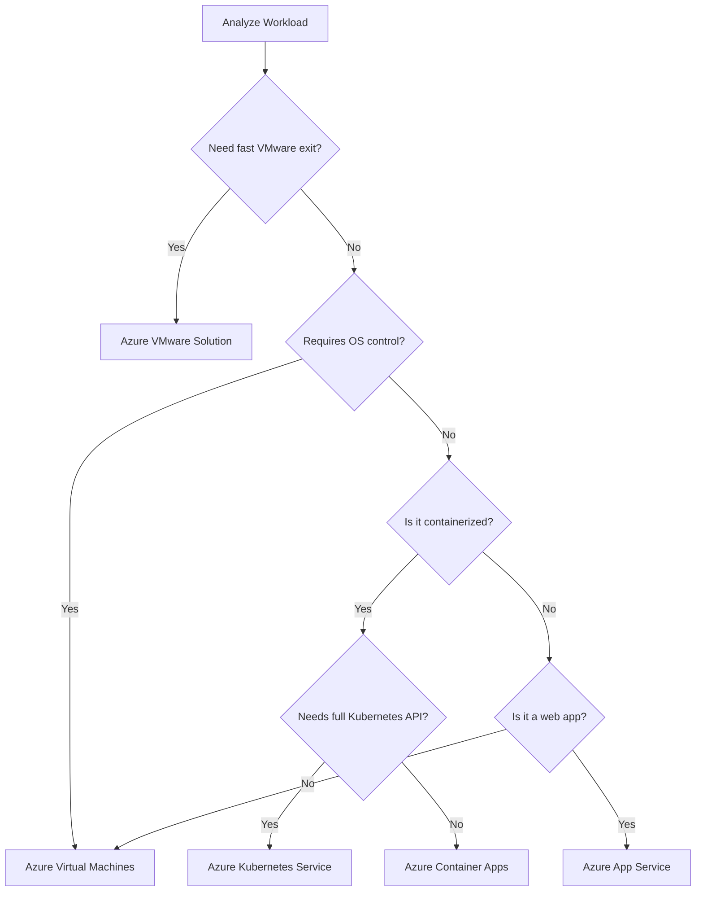
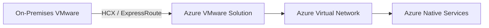

# AZ-305 Study Guide: Recommend a solution for migrating workloads to infrastructure as a service (IaaS) and platform as a service (PaaS)

> **Exam task:** Design migrations — Recommend a solution for migrating workloads to infrastructure as a service (IaaS) and platform as a service (PaaS)
> **Domain:** Design infrastructure solutions
> **Estimated reading time:** 45 minutes
> **Matched task source:** Exact match from the AZ-305 Study Guide Map.
> **Scope boundary:** This guide covers evaluating and recommending target architectures for compute and application workloads moving to Azure. It focuses on the architectural decision-making between IaaS (Virtual Machines, Azure VMware Solution) and PaaS (App Service, AKS, Container Apps). It intentionally excludes detailed data/database migration strategies (e.g., Azure SQL Managed Instance, Database Migration Service), as those belong to adjacent AZ-305 data tasks.

---

## How to use this guide

As an Azure architect, your goal is not just to know *how* to move a server, but to decide *where* it should go and *why*. By the end of this guide, you should be able to evaluate a source workload, identify constraints (e.g., OS dependencies, orchestration needs, licensing), and map it to the correct Azure compute service.

This topic maps directly to scenario-based exam questions where you will be given a customer's on-premises footprint and asked to select the most efficient, cost-effective, or secure migration target. To use the source links effectively, read the scenario requirement clues—like "requires custom OS agents" (points to IaaS) or "wants to minimize infrastructure management" (points to PaaS)—and follow the linked documentation to understand the hard limits of those services.

---

## Primary source set

### Exam and module sources

* [Official AZ-305 study guide](https://learn.microsoft.com/en-us/credentials/certifications/resources/study-guides/az-305)

### Core product documentation

* [Azure Migrate](https://learn.microsoft.com/en-us/azure/migrate/)
* [Azure Migrate — Server migration overview](https://learn.microsoft.com/en-us/azure/migrate/server-migrate-overview)
* [Azure Migrate — Web app migration and modernization](https://learn.microsoft.com/en-us/azure/migrate/web-app-migration-modernization)
* [Azure Virtual Machines](https://learn.microsoft.com/en-us/azure/virtual-machines/overview)
* [Azure App Service](https://learn.microsoft.com/en-us/azure/app-service/)
* [Azure Kubernetes Service](https://learn.microsoft.com/en-us/azure/aks/)
* [Azure Container Apps](https://learn.microsoft.com/en-us/azure/container-apps/overview)
* [Azure VMware Solution](https://learn.microsoft.com/en-us/azure/azure-vmware/)

### Supporting architecture and framework sources

* [Cloud Adoption Framework — Migrate](https://learn.microsoft.com/en-us/azure/cloud-adoption-framework/migrate/)
* [Cloud Adoption Framework — Select cloud migration strategies](https://learn.microsoft.com/en-us/azure/cloud-adoption-framework/plan/select-cloud-migration-strategy)
* [Cloud Adoption Framework — Plan your migration](https://learn.microsoft.com/en-us/azure/cloud-adoption-framework/migrate/plan-migration)
* [Cloud Adoption Framework — Azure landing zones](https://learn.microsoft.com/en-us/azure/cloud-adoption-framework/ready/landing-zone/)
* [Azure Architecture Center — Choose an Azure compute service](https://learn.microsoft.com/en-us/azure/architecture/guide/technology-choices/compute-decision-tree)
* [Azure Architecture Center — Use PaaS options](https://learn.microsoft.com/en-us/azure/architecture/guide/design-principles/managed-services)
* [Azure Architecture Center — Choose an Azure container service](https://learn.microsoft.com/en-us/azure/architecture/guide/choose-azure-container-service)

### Discovery notes from the Study Guide Map

* **Potentially relevant products considered:** Azure Migrate, Cloud Adoption Framework, Azure Architecture Center, Azure Virtual Machines, Azure App Service, Azure Kubernetes Service, Azure Container Apps, Azure VMware Solution.
* **Forum-discovery note:** Public candidate discussions heavily emphasize the IaaS vs. PaaS decision tree, specifically distinguishing when to rehost to VMs versus replatforming to App Service or AKS. *Note: Forum signals are nonauthoritative and used only to identify common exam patterns.*
* **Coverage notes:** Start with the [Cloud Adoption Framework migration strategies](https://learn.microsoft.com/en-us/azure/cloud-adoption-framework/plan/select-cloud-migration-strategy) and the Azure Architecture Center [compute decision tree](https://learn.microsoft.com/en-us/azure/architecture/guide/technology-choices/compute-decision-tree). Azure Migrate is the primary tooling, but understanding the destination (landing zones, compute targets) is critical for architect-level recommendations.

---

## 1. Exam task scope

This task asks an Azure Solutions Architect to evaluate an existing application portfolio and recommend the optimal target architecture in Azure.

* **Domain:** Design infrastructure solutions
* **Skill:** Design migrations
* **Exact task:** Recommend a solution for migrating workloads to infrastructure as a service (IaaS) and platform as a service (PaaS)

**What is expected:** You must know how to translate business requirements (e.g., "reduce operational overhead", "maintain exact OS versions") into technical targets. You must weigh the tradeoffs of a simple "lift and shift" against the effort required to modernize a workload.
**In scope:** Target selection for servers, web apps, and containers. Utilizing [Azure Migrate for assessment and migration](https://learn.microsoft.com/en-us/azure/migrate/server-migrate-overview).
**Out of scope:** Complex data migrations (SQL MI, Cosmos DB), which are covered in the database design domain.
**Scope boundary:** The mental boundary between this and related tasks is compute versus data. If the scenario focuses on the application tier or the operating system, it falls here. If it focuses on schemas, query compatibility, or database licensing, you are stepping into a data migration task.

---

## 2. Product and topic discovery pass

| Product, service, or topic | Why it may be relevant | Primary Microsoft source | In-scope or adjacent? |
| --- | --- | --- | --- |
| **Azure Migrate** | The central hub for discovery, assessment, sizing, and migration tooling. | [Azure Migrate](https://learn.microsoft.com/en-us/azure/migrate/) | In-scope |
| **Azure Virtual Machines** | The primary IaaS target for workloads requiring full OS control or legacy support. | [Azure VMs](https://learn.microsoft.com/en-us/azure/virtual-machines/overview) | In-scope |
| **Azure App Service** | The primary PaaS target for HTTP-based web apps, reducing OS management. | [Azure App Service](https://learn.microsoft.com/en-us/azure/app-service/) | In-scope |
| **Azure Kubernetes Service (AKS)** | Target for containerized microservices requiring orchestration. | [Azure AKS](https://learn.microsoft.com/en-us/azure/aks/) | In-scope |
| **Azure Container Apps** | Serverless container execution when Kubernetes cluster management is overkill. | [Container Apps](https://learn.microsoft.com/en-us/azure/container-apps/overview) | In-scope |
| **Azure VMware Solution (AVS)** | Fast lift-and-shift of VMware workloads without changing the hypervisor. | [Azure VMware Solution](https://learn.microsoft.com/en-us/azure/azure-vmware/) | In-scope |
| **Azure Landing Zones** | Foundational environments to host migrated workloads securely. | [Landing Zones](https://learn.microsoft.com/en-us/azure/cloud-adoption-framework/ready/landing-zone/) | Adjacent (Foundational) |
| **Database Migration Service** | Moving databases that support the PaaS/IaaS application tier. | N/A (Data task) | Adjacent |

---

## 3. Starting point from Microsoft Learn

The best starting point is the [Cloud Adoption Framework (CAF) migration methodology](https://learn.microsoft.com/en-us/azure/cloud-adoption-framework/migrate/). Microsoft expects architects to understand the iterative process of **Assess**, **Migrate**, **Optimize**, and **Promote**.

Core concepts introduced include the "5 Rs" of rationalization, specifically focusing on **Rehost** (lift-and-shift to IaaS) and **Replatform** (modernize to PaaS). The documentation emphasizes that while [using PaaS options](https://learn.microsoft.com/en-us/azure/architecture/guide/design-principles/managed-services) reduces administrative overhead (patching, scaling), it may require application code changes. IaaS offers the path of least resistance for legacy applications but retains the highest operational burden.

> **Exam tip:** If a scenario states a customer wants a "fast migration with no code changes" and they rely on third-party software, [Azure Virtual Machines (IaaS)](https://learn.microsoft.com/en-us/azure/virtual-machines/overview) or [Azure VMware Solution](https://learn.microsoft.com/en-us/azure/azure-vmware/) is the answer. If they want to "minimize ongoing management," look toward [App Service or Container Apps](https://learn.microsoft.com/en-us/azure/architecture/guide/technology-choices/compute-decision-tree).

---

## 4. Conceptual foundation

### Rehost vs. Replatform

At the architect level, migration is a balance between speed and optimization. A **Rehost** strategy (IaaS) moves the workload exactly as it is. A **Replatform** strategy (PaaS) modifies the underlying platform (e.g., moving from an IIS VM to [Azure App Service](https://learn.microsoft.com/en-us/azure/app-service/)) without drastically rewriting the application code.

> **Exam tip:** Migrating an ASP.NET web app using the [Azure Migrate Web App assessment tool](https://learn.microsoft.com/en-us/azure/migrate/web-app-migration-modernization) is considered Replatforming, as you shed the underlying Windows Server OS.

### Control Plane vs. Data Plane

In IaaS, you manage the OS, runtime, and the application (Data Plane). In PaaS, Microsoft manages the OS and runtime, leaving you to manage only the application and configuration. This drastically shifts your operational and security boundaries.

> **Exam tip:** In [managed services (PaaS)](https://learn.microsoft.com/en-us/azure/architecture/guide/design-principles/managed-services), patching the host operating system is physically impossible and managed entirely by Microsoft. If a requirement mandates custom OS-level security agents, PaaS is immediately disqualified.

### Identity and Networking Implications

Migrating to PaaS often requires rethinking networking. IaaS VMs naturally sit inside a Virtual Network (VNet). PaaS services are internet-facing by default. To secure PaaS, you must often recommend [VNet Integration](https://www.google.com/search?q=https://learn.microsoft.com/en-us/azure/app-service/overview-vnet) for outbound traffic and Private Endpoints for inbound traffic.

> **Exam tip:** When migrating internal-only applications to PaaS, always ensure your design includes [Private Endpoints](https://learn.microsoft.com/en-us/azure/architecture/guide/technology-choices/compute-decision-tree) to prevent public internet exposure.

---

## 5. Design decision framework

When recommending a migration target, always evaluate the workload against the [Azure compute decision tree](https://learn.microsoft.com/en-us/azure/architecture/guide/technology-choices/compute-decision-tree).

### Selection Criteria

1. **Do you need to migrate quickly from VMware without changing operations?** Choose AVS.
2. **Does the app require OS-level access or custom third-party agents?** Choose Virtual Machines (IaaS).
3. **Is it a standard web application (HTTP/HTTPS)?** Choose App Service.
4. **Is it containerized and requires complex orchestration/networking?** Choose AKS.
5. **Is it a container that only needs simple event-driven scaling?** Choose Container Apps.

---

## 6. Service and feature comparison tables

| Feature / Requirement | Azure Virtual Machines (IaaS) | Azure App Service (PaaS) | Azure Kubernetes Service (CaaS/PaaS) | Primary Source |
| --- | --- | --- | --- | --- |
| **OS Management** | Customer | Microsoft | Microsoft (Nodes) / Customer (Pods) | [Compute choices](https://learn.microsoft.com/en-us/azure/architecture/guide/technology-choices/compute-decision-tree) |
| **Scaling** | VM Scale Sets (Manual/Autoscale) | Built-in (Scale up/out) | HPA / Cluster Autoscaler | [App Service](https://learn.microsoft.com/en-us/azure/app-service/) |
| **Network Isolation** | Native VNet | VNet Integration / Private Endpoints | Native or CNI networking | [AKS](https://learn.microsoft.com/en-us/azure/aks/) |
| **Migration Tooling** | [Azure Migrate Server Assessment](https://learn.microsoft.com/en-us/azure/migrate/server-migrate-overview) | [Azure Migrate Web App Assessment](https://learn.microsoft.com/en-us/azure/migrate/web-app-migration-modernization) | Azure Migrate / Custom pipelines | [Azure Migrate](https://learn.microsoft.com/en-us/azure/migrate/) |
| **Legacy App Support** | Excellent | Limited to supported runtimes | Requires containerization | [CAF Migration](https://learn.microsoft.com/en-us/azure/cloud-adoption-framework/plan/select-cloud-migration-strategy) |

---

## 7. Architecture patterns

### Pattern: Fast VMware Evacuation (AVS)

* **When to apply:** The customer has a tight data center exit timeline but a large vSphere footprint.
* **Why it works:** It extends the existing VMware control plane into Azure using [Azure VMware Solution](https://learn.microsoft.com/en-us/azure/azure-vmware/), requiring zero re-architecting.
* **Weaknesses:** It is essentially renting bare-metal hardware. It does not modernize the apps or fundamentally alter the operational burden.

*Explanation: VMware HCX provides seamless migration of VMs to AVS, which can then interface with native Azure services over the Azure backbone.*

### Pattern: App Service Modernization

* **When to apply:** Moving legacy ASP.NET or Java web servers to a managed platform.
* **Why it works:** Removes IIS/Tomcat and OS management. Native integration with Azure AD for identity and Azure Monitor for telemetry.
* **Considerations:** File system access is restricted. If the app writes state locally, it must be refactored to use [Azure Storage](https://learn.microsoft.com/en-us/azure/app-service/).

---

## 8. Implementation awareness for architects

While AZ-305 doesn't ask you to click through the portal, you must understand prerequisites.

* **Discovery Constraints:** To use [Azure Migrate](https://learn.microsoft.com/en-us/azure/migrate/), an appliance must be deployed on-premises. Agentless migration relies on hypervisor APIs (vCenter/Hyper-V). If you have physical servers, an agent-based approach is required.
* **Sequencing:** You must create an [Azure Landing Zone](https://learn.microsoft.com/en-us/azure/cloud-adoption-framework/ready/landing-zone/) (network, identity, governance) *before* migrating workloads, otherwise you risk exposing IaaS instances to the public internet or violating compliance boundaries.

---

## 9. Security, governance, and compliance considerations

When shifting to PaaS, identity becomes the new perimeter.

* **Managed Identities:** Ensure migrated PaaS applications (App Service, Functions) are configured to use [Managed Identities](https://learn.microsoft.com/en-us/azure/app-service/overview-managed-identity) to securely connect to other Azure services like Key Vault, removing hardcoded credentials.
* **Azure Policy:** Use policies to enforce that all migrated VMs fall within approved SKUs or are automatically enrolled in Microsoft Defender for Cloud.

> **Exam tip:** If a workload has strict compliance needs dictating total network isolation and no shared multi-tenant infrastructure, standard App Service may fail requirements. You would recommend an [App Service Environment (ASE)](https://learn.microsoft.com/en-us/azure/app-service/environment/overview) or an isolated VM.

---

## 10. Resiliency, availability, and disaster recovery considerations

When recommending target architectures, understand the baseline SLA.

* A single IaaS VM with premium storage has a 99.9% SLA.
* To achieve higher resiliency, you must recommend [Availability Zones](https://learn.microsoft.com/en-us/azure/virtual-machines/availability) or Availability Sets for IaaS.
* For PaaS, [App Service Zone Redundancy](https://learn.microsoft.com/en-us/azure/app-service/how-to-zone-redundancy) requires specific Premium tiers (Premium v2/v3).

---

## 11. Cost and licensing considerations

Cost optimization is a major component of migration design.

* **Azure Hybrid Benefit (AHB):** Allows customers to bring existing Windows Server and SQL Server licenses to Azure. This drastically reduces the cost of [Azure Virtual Machines](https://learn.microsoft.com/en-us/azure/virtual-machines/overview).
* **PaaS vs. IaaS TCO:** While PaaS compute might look more expensive per hour than IaaS, the Total Cost of Ownership (TCO) is often lower because Microsoft handles OS licensing, patching, and maintenance.

> **Exam tip:** Scenario questions heavily feature AHB. If a company has software assurance on their Windows Server licenses and cost is a major constraint, deploying Windows VMs and enabling [Azure Hybrid Benefit](https://learn.microsoft.com/en-us/azure/virtual-machines/windows/hybrid-use-benefit-licensing) is the mathematically correct design choice over Pay-As-You-Go pricing.

---

## 12. Monitoring and operational considerations

Your operational boundary changes post-migration.

* For IaaS, you must deploy the Azure Monitor agent to gather guest OS telemetry.
* For PaaS targets like App Service, infrastructure metrics (CPU, Memory) are collected automatically, but you should enable [Application Insights](https://learn.microsoft.com/en-us/azure/azure-monitor/app/app-insights-overview) for deep code-level tracing.

---

## 13. Common exam traps

| Trap | Tempting wrong answer | Why it seems reasonable | Why it is wrong or incomplete | Better design choice | Microsoft source |
| --- | --- | --- | --- | --- | --- |
| **Simple web app orchestration** | AKS | Containers are modern. | AKS introduces massive cluster management overhead for a basic app. | [App Service](https://learn.microsoft.com/en-us/azure/app-service/) or [Container Apps](https://learn.microsoft.com/en-us/azure/container-apps/overview) | [Choose compute](https://learn.microsoft.com/en-us/azure/architecture/guide/technology-choices/compute-decision-tree) |
| **Legacy software requirements** | App Service | Customer wants to reduce management. | PaaS does not allow installing legacy COM components, custom DLLs, or specialized OS agents. | [Azure Virtual Machines](https://learn.microsoft.com/en-us/azure/virtual-machines/overview) | [PaaS options](https://learn.microsoft.com/en-us/azure/architecture/guide/design-principles/managed-services) |
| **Urgent Data Center Exit** | Refactor to PaaS | It yields the most long-term value. | Refactoring takes months. Urgent exits require immediate lifting. | [Azure VMware Solution](https://learn.microsoft.com/en-us/azure/azure-vmware/) or VM Rehost | [CAF Strategies](https://learn.microsoft.com/en-us/azure/cloud-adoption-framework/plan/select-cloud-migration-strategy) |
| **Edge Case: Custom Hypervisor** | Hyper-V nested in PaaS | PaaS scales well. | PaaS doesn't support nested virtualization. You need bare metal or specific VM sizes. | VM sizes supporting [Nested Virtualization](https://www.google.com/search?q=https://learn.microsoft.com/en-us/azure/virtual-machines/windows/nested-virtualization) | [Azure VMs](https://learn.microsoft.com/en-us/azure/virtual-machines/overview) |

---

## 14. Scenario-based design examples

**Scenario 1: The Default Recommendation**

* **Requirement:** Migrate a standard ASP.NET application currently running on an on-premises IIS server. The customer wants less patching.
* **Constraints:** No third-party OS dependencies.
* **Recommended design:** Replatform to [Azure App Service](https://learn.microsoft.com/en-us/azure/app-service/).
* **Why:** Directly answers the "less patching" requirement by abstracting the OS.
* **Exam interpretation:** "Less patching" = PaaS.

**Scenario 2: The Cost-Constrained Design**

* **Requirement:** Migrate 100 on-premises Windows Server 2022 VMs to Azure. Budget is extremely tight.
* **Constraints:** Customer owns active Software Assurance for all OS licenses.
* **Recommended design:** Rehost to [Azure Virtual Machines](https://learn.microsoft.com/en-us/azure/virtual-machines/overview) using [Azure Migrate](https://learn.microsoft.com/en-us/azure/migrate/server-migrate-overview), applying Azure Hybrid Benefit and 3-year Reserved Instances.
* **Why:** AHB and RIs represent the absolute lowest cost for sustained IaaS workloads.
* **Exam interpretation:** Software Assurance = Azure Hybrid Benefit.

**Scenario 3: The Security/Compliance-Driven Design**

* **Requirement:** Migrate an internal payroll web app. It must be modernized, but cannot be accessible from the public internet.
* **Constraints:** Must use PaaS to reduce management overhead.
* **Recommended design:** [Azure App Service](https://learn.microsoft.com/en-us/azure/app-service/) with [Private Endpoints](https://learn.microsoft.com/en-us/azure/architecture/guide/technology-choices/compute-decision-tree) enabled for inbound traffic, and VNet Integration for outbound.
* **Why:** Meets the PaaS requirement while satisfying the network isolation constraint.

**Scenario 4: Multi-Region / Resiliency-Driven Design**

* **Requirement:** Migrate a microservices workload currently running on Docker Swarm. It must survive a regional failure.
* **Constraints:** Needs orchestrator controls.
* **Recommended design:** Deploy [Azure Kubernetes Service (AKS)](https://learn.microsoft.com/en-us/azure/aks/) clusters in two paired regions, fronted by Azure Front Door.
* **Why:** AKS supports complex microservices, and multi-region deployment satisfies the disaster recovery requirement.

**Scenario 5: The Edge Case Design**

* **Requirement:** Migrate an old accounting app running on Windows Server 2012.
* **Constraints:** The vendor no longer exists; the code cannot be altered. The customer wants to avoid paying high prices for Extended Security Updates (ESUs) on-premises.
* **Recommended design:** Rehost to [Azure Virtual Machines](https://learn.microsoft.com/en-us/azure/virtual-machines/overview).
* **Why:** Older, unsupported OS versions often receive free Extended Security Updates *only* when hosted natively in Azure VMs. You cannot replatform an unalterable legacy app to PaaS easily.

---

## 15. Test yourself

> **Test yourself**
>
> * A customer wants to migrate a custom containerized application. They have no Kubernetes expertise and want Microsoft to handle all cluster scaling and infrastructure management, while supporting event-driven scaling down to zero. What compute service should you recommend?
> * A customer has 500 VMware VMs and must evacuate their datacenter in 45 days. They plan to modernize the apps eventually, but time is the only immediate constraint. What migration strategy is most appropriate?
>
>
> **Answer guidance:** > * For the first scenario, [Azure Container Apps](https://learn.microsoft.com/en-us/azure/container-apps/overview) is the correct choice. AKS requires cluster management, which they lack expertise for.
>
> * For the second scenario, [Azure VMware Solution (AVS)](https://learn.microsoft.com/en-us/azure/azure-vmware/) provides the fastest lift-and-shift for VMware without needing to convert virtual disks to Azure native formats immediately.
>
>

---

## 16. Adjacent task context

| Adjacent task or topic | Why it overlaps | What belongs in this task | What belongs elsewhere |
| --- | --- | --- | --- |
| **Recommend database migrations** | Apps and databases move together. | Recommending the App Service or VM for the web tier. | Recommending Azure SQL MI or using [Database Migration Service](https://learn.microsoft.com/en-us/azure/architecture/guide/technology-choices/compute-decision-tree). |
| **Design network architecture** | Target workloads need connectivity. | Identifying the need for VNet Integration or Private Endpoints. | Designing the actual ExpressRoute or Hub-and-Spoke topology. |

---

## 17. Final exam-focused summary

* **Key takeaways:** Understand the dividing line between IaaS (control, legacy compatibility) and PaaS (low overhead, modernization).
* **Must-know decisions:** Know how to use the [Azure Architecture Center compute decision tree](https://learn.microsoft.com/en-us/azure/architecture/guide/technology-choices/compute-decision-tree).
* **Must-know Azure services:** Azure Migrate, VMs, App Service, Container Apps, AKS, Azure VMware Solution.
* **Common requirement clues:** "Reduce operational overhead" -> PaaS. "Custom agent required" -> IaaS. "Tight deadline, existing vSphere" -> AVS.

**Before the exam, make sure you can:**

* [x] Explain why someone would choose Container Apps over AKS.
* [x] Identify when to recommend a lift-and-shift via Azure Migrate vs. Azure VMware Solution.
* [x] Describe how Azure Hybrid Benefit impacts IaaS migration cost.

---

## 18. Quick-reference tables

| Workload Requirement | Recommended Service | Primary Source |
| --- | --- | --- |
| Standard Web App (HTTP/HTTPS) | [Azure App Service](https://learn.microsoft.com/en-us/azure/app-service/) | [Managed Services Guidance](https://learn.microsoft.com/en-us/azure/architecture/guide/design-principles/managed-services) |
| Containerized, Event-Driven, No K8s overhead | [Azure Container Apps](https://learn.microsoft.com/en-us/azure/container-apps/overview) | [Choose a container service](https://learn.microsoft.com/en-us/azure/architecture/guide/choose-azure-container-service) |
| Containerized, Complex Orchestration | [Azure Kubernetes Service](https://learn.microsoft.com/en-us/azure/aks/) | [Choose a container service](https://learn.microsoft.com/en-us/azure/architecture/guide/choose-azure-container-service) |
| Legacy App / Custom OS Agents | [Azure Virtual Machines](https://learn.microsoft.com/en-us/azure/virtual-machines/overview) | [Compute choices](https://learn.microsoft.com/en-us/azure/architecture/guide/technology-choices/compute-decision-tree) |
| Fast vSphere Datacenter Exit | [Azure VMware Solution](https://learn.microsoft.com/en-us/azure/azure-vmware/) | [Azure VMware Solution](https://learn.microsoft.com/en-us/azure/azure-vmware/) |
