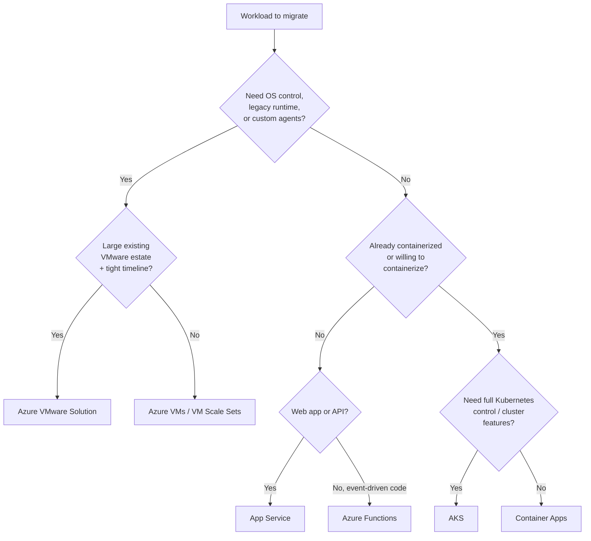
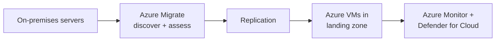
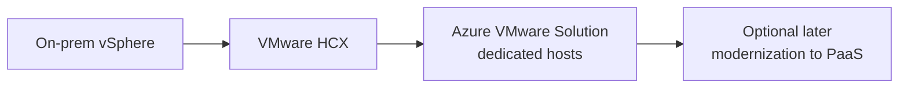

# AZ-305 Study Guide: Recommend a solution for migrating workloads to IaaS and PaaS

> **Exam task:** Design migrations — Recommend a solution for migrating workloads to infrastructure as a service (IaaS) and platform as a service (PaaS)
>
> **Domain:** Design infrastructure solutions
>
> **Estimated reading time:** approximately 45 minutes
>
> **Matched task source:** Exact match. The target task wording matches the "Design migrations" skill entry in the provided Study Guide Map and aligns with the "Design infrastructure solutions" domain in the official [AZ-305 study guide](https://learn.microsoft.com/en-us/credentials/certifications/resources/study-guides/az-305).
>
> **Scope boundary:** This guide covers how to assess workloads, choose a migration strategy (the migration "Rs"), and select IaaS vs PaaS compute targets for application and server workloads. It deliberately excludes the dedicated database-migration task (Azure SQL targets and Database Migration Service appear only as adjacent context), the standalone monitoring-solution task, and the business continuity / disaster recovery domain. Those are referenced only where they shape the migration recommendation.

---

## How to use this guide

By the end of this guide you should be able to read an AZ-305 scenario, identify the workload constraints that force an IaaS or PaaS decision, choose a migration strategy, and name the specific Azure compute target with a defensible reason.

This topic maps to the exam task in three layers. First, the [Cloud Adoption Framework migration methodology](https://learn.microsoft.com/en-us/azure/cloud-adoption-framework/migrate/) gives you the strategy vocabulary (rehost, replatform, and so on). Second, [Azure Migrate](https://learn.microsoft.com/en-us/azure/migrate/) gives you the assessment and execution tooling. Third, the [Azure compute decision tree](https://learn.microsoft.com/en-us/azure/architecture/guide/technology-choices/compute-decision-tree) gives you the service-selection logic. Most scenario questions test the third layer, but the constraints in the question are usually framed in first-layer language.

This task differs from adjacent AZ-305 tasks in a way that the exam exploits. Recommending a *compute* migration target is not the same as recommending a *database* migration target, a *monitoring* solution, or a *business continuity* design. When a scenario mentions SQL Server, the temptation is to jump to [Azure SQL Managed Instance](https://learn.microsoft.com/en-us/azure/azure-sql/managed-instance/sql-managed-instance-paas-overview); read carefully, because the question may only be asking about the application tier.

Use the source links as a follow-up study path. Read the [migration strategy selection guidance](https://learn.microsoft.com/en-us/azure/cloud-adoption-framework/plan/select-cloud-migration-strategy) and the [managed-services design principle](https://learn.microsoft.com/en-us/azure/architecture/guide/design-principles/managed-services) first, then the individual target-service docs only as needed.

When reading scenario questions, hunt for requirement clues that lock the answer: OS-level control, unsupported runtime, third-party agents, timeline pressure, an existing VMware estate, a desire to reduce operational burden, container readiness, or compliance and network-isolation needs. Each clue pushes you toward a specific target.

---

## Primary source set

### Exam and module sources

- Official [AZ-305 study guide](https://learn.microsoft.com/en-us/credentials/certifications/resources/study-guides/az-305)
- [Cloud Adoption Framework: Migrate](https://learn.microsoft.com/en-us/azure/cloud-adoption-framework/migrate/) (migration methodology and phases)
- [Plan your migration](https://learn.microsoft.com/en-us/azure/cloud-adoption-framework/migrate/plan-migration) (wave planning, sequencing, cutover)

### Core product documentation

- [Azure Migrate](https://learn.microsoft.com/en-us/azure/migrate/) and [Server migration overview](https://learn.microsoft.com/en-us/azure/migrate/server-migrate-overview)
- [Azure Migrate web app migration and modernization](https://learn.microsoft.com/en-us/azure/migrate/web-app-migration-modernization)
- [Azure Virtual Machines](https://learn.microsoft.com/en-us/azure/virtual-machines/overview)
- [Azure App Service](https://learn.microsoft.com/en-us/azure/app-service/)
- [Azure Kubernetes Service](https://learn.microsoft.com/en-us/azure/aks/)
- [Azure Container Apps](https://learn.microsoft.com/en-us/azure/container-apps/overview)
- [Azure VMware Solution](https://learn.microsoft.com/en-us/azure/azure-vmware/)

### Supporting architecture and framework sources

- [Choose an Azure compute service](https://learn.microsoft.com/en-us/azure/architecture/guide/technology-choices/compute-decision-tree) (Azure Architecture Center)
- [Use platform as a service options](https://learn.microsoft.com/en-us/azure/architecture/guide/design-principles/managed-services)
- [Choose an Azure container service](https://learn.microsoft.com/en-us/azure/architecture/guide/choose-azure-container-service)
- [Select a cloud migration strategy](https://learn.microsoft.com/en-us/azure/cloud-adoption-framework/plan/select-cloud-migration-strategy)
- [Azure landing zones](https://learn.microsoft.com/en-us/azure/cloud-adoption-framework/ready/landing-zone/)
- [Azure Well-Architected Framework](https://learn.microsoft.com/en-us/azure/well-architected/)

### Discovery notes from the Study Guide Map

The map lists a broad set of products considered for this task, including [Azure Migrate](https://learn.microsoft.com/en-us/azure/migrate/) and its appliance and assessment tooling, the [Cloud Adoption Framework](https://learn.microsoft.com/en-us/azure/cloud-adoption-framework/), [Azure Virtual Machines](https://learn.microsoft.com/en-us/azure/virtual-machines/overview), [App Service](https://learn.microsoft.com/en-us/azure/app-service/), [AKS](https://learn.microsoft.com/en-us/azure/aks/), [Container Apps](https://learn.microsoft.com/en-us/azure/container-apps/overview), [Azure Functions](https://learn.microsoft.com/en-us/azure/azure-functions/functions-overview), [Azure VMware Solution](https://learn.microsoft.com/en-us/azure/azure-vmware/), connectivity options such as [ExpressRoute](https://learn.microsoft.com/en-us/azure/expressroute/expressroute-introduction) and [VPN Gateway](https://learn.microsoft.com/en-us/azure/vpn-gateway/vpn-gateway-about-vpngateways), offline transfer via [Azure Data Box](https://learn.microsoft.com/en-us/azure/databox/data-box-overview), and the database-adjacent [Database Migration Service](https://learn.microsoft.com/en-us/azure/dms/dms-overview) and [SQL Managed Instance](https://learn.microsoft.com/en-us/azure/azure-sql/managed-instance/sql-managed-instance-paas-overview).

The map's forum-discovery note flags that candidates frequently discuss the IaaS-vs-PaaS decision, Azure Migrate assessments, rehost-vs-replatform strategy, App Service modernization, VMware migration, and compute-service selection. These forum signals are nonauthoritative. They are used here only to identify common candidate discussion and confusion patterns, and every recommendation below is grounded in Microsoft documentation.

The map's coverage notes set the priority order this guide follows: start with Azure Migrate, CAF migration guidance, and the compute decision tree, because they anchor assessment, strategy, and service selection. Treat App Service, AKS, Container Apps, Azure VMs, and Azure VMware Solution as the target services. Treat landing zones as readiness support, and treat database migration tooling as adjacent.

---

## 1. Exam task scope

**Domain:** Design infrastructure solutions. **Skill:** Design migrations. **Exact task:** Recommend a solution for migrating workloads to infrastructure as a service (IaaS) and platform as a service (PaaS).

This task asks an Azure Solutions Architect to recommend *how* an existing workload should move to Azure and *what* it should land on. It combines two decisions: the [migration strategy](https://learn.microsoft.com/en-us/azure/cloud-adoption-framework/plan/select-cloud-migration-strategy) (do you rehost, replatform, refactor, rearchitect, rebuild, replace, retain, or retire?) and the [compute target](https://learn.microsoft.com/en-us/azure/architecture/guide/technology-choices/compute-decision-tree) (VMs, App Service, AKS, Container Apps, Functions, or Azure VMware Solution).

The candidate is expected to know how to run a discovery and assessment using [Azure Migrate](https://learn.microsoft.com/en-us/azure/migrate/server-migrate-overview), how to interpret readiness and right-sizing output, and how to map workload constraints to a target service. Likely tested design decisions include: choosing IaaS when a workload needs [OS-level control](https://learn.microsoft.com/en-us/azure/virtual-machines/overview), choosing PaaS to [reduce operational burden](https://learn.microsoft.com/en-us/azure/architecture/guide/design-principles/managed-services), choosing [Azure VMware Solution](https://learn.microsoft.com/en-us/azure/azure-vmware/) for a fast VMware exit, and choosing among [container services](https://learn.microsoft.com/en-us/azure/architecture/guide/choose-azure-container-service) based on the level of orchestration control required.

In scope: assessment tooling, strategy selection, compute-target selection, target-environment readiness via [landing zones](https://learn.microsoft.com/en-us/azure/cloud-adoption-framework/ready/landing-zone/), and the cost, security, resiliency, and operational implications of each target.

Out of scope (adjacent): the database migration task (target SQL platform selection and [Database Migration Service](https://learn.microsoft.com/en-us/azure/dms/dms-overview) mechanics), the standalone monitoring-solution task, and the business continuity design task. These appear only when they change the migration recommendation.

Adjacent tasks that are easy to confuse with this one include "design a solution for migrating databases," "recommend a monitoring solution," and any business continuity task that uses [Azure Site Recovery](https://learn.microsoft.com/en-us/azure/site-recovery/site-recovery-overview). The mental boundary: this task is about *application and server compute*. The moment the question is really about *where the data lives* or *how you fail over for DR*, you have crossed into a different task.

---

## 2. Product and topic discovery pass

| Product, service, or topic | Why it may be relevant | Primary Microsoft source | In-scope or adjacent? |
|---|---|---|---|
| Azure Migrate | Central hub for discovery, assessment, right-sizing, business case, and migration | [Azure Migrate](https://learn.microsoft.com/en-us/azure/migrate/) | In-scope (core) |
| Azure Migrate appliance | Agentless discovery and dependency data for VMware, Hyper-V, physical | [Migrate appliance](https://learn.microsoft.com/en-us/azure/migrate/migrate-appliance) | In-scope |
| Cloud Adoption Framework: Migrate | Defines the migration methodology and the strategy "Rs" | [CAF Migrate](https://learn.microsoft.com/en-us/azure/cloud-adoption-framework/migrate/) | In-scope (core) |
| Compute decision tree | Maps workload constraints to the right compute target | [Compute decision tree](https://learn.microsoft.com/en-us/azure/architecture/guide/technology-choices/compute-decision-tree) | In-scope (core) |
| Managed-services design principle | The reasoning for preferring PaaS over IaaS | [Use PaaS options](https://learn.microsoft.com/en-us/azure/architecture/guide/design-principles/managed-services) | In-scope |
| Azure Virtual Machines | Primary IaaS rehost target needing OS control or legacy compatibility | [Azure VMs](https://learn.microsoft.com/en-us/azure/virtual-machines/overview) | In-scope (target) |
| Azure App Service | Primary PaaS replatform target for web apps and APIs | [App Service](https://learn.microsoft.com/en-us/azure/app-service/) | In-scope (target) |
| Azure Kubernetes Service | PaaS target for containerized workloads needing orchestration control | [AKS](https://learn.microsoft.com/en-us/azure/aks/) | In-scope (target) |
| Azure Container Apps | Serverless container target without cluster management | [Container Apps](https://learn.microsoft.com/en-us/azure/container-apps/overview) | In-scope (target) |
| Azure Functions | Event-driven serverless target for code-only workloads | [Functions](https://learn.microsoft.com/en-us/azure/azure-functions/functions-overview) | In-scope (target) |
| Azure VMware Solution | Fast IaaS exit for an existing vSphere estate, retaining VMware tooling | [AVS](https://learn.microsoft.com/en-us/azure/azure-vmware/) | In-scope (target) |
| Azure landing zones | Target-environment readiness: identity, networking, governance | [Landing zones](https://learn.microsoft.com/en-us/azure/cloud-adoption-framework/ready/landing-zone/) | In-scope (support) |
| ExpressRoute / VPN Gateway | Connectivity for replication and hybrid operation during migration | [ExpressRoute](https://learn.microsoft.com/en-us/azure/expressroute/expressroute-introduction) | In-scope (support) |
| Azure Data Box | Offline bulk transfer when bandwidth is the constraint | [Data Box](https://learn.microsoft.com/en-us/azure/databox/data-box-overview) | In-scope (support) |
| Azure SQL Managed Instance | Database PaaS target in combined workload scenarios | [SQL MI](https://learn.microsoft.com/en-us/azure/azure-sql/managed-instance/sql-managed-instance-paas-overview) | Adjacent |
| Database Migration Service | Database move tooling in combined scenarios | [DMS](https://learn.microsoft.com/en-us/azure/dms/dms-overview) | Adjacent |
| Azure Site Recovery | DR and failover, sometimes confused with migration replication | [Site Recovery](https://learn.microsoft.com/en-us/azure/site-recovery/site-recovery-overview) | Adjacent |
| Azure Arc | Manages servers that stay on-premises or are not yet migrated | [Azure Arc](https://learn.microsoft.com/en-us/azure/azure-arc/overview) | Adjacent |

Products were included only where they affect this task's recommendation. Broadly Azure-related services that do not change a compute-migration decision were left out.

> **Test yourself**
>
> - A scenario says "we run 400 VMware VMs and our data center lease ends in five months." Which discovery and which target should be your first instinct, and why?
> - A scenario mentions SQL Server. Does that automatically pull this task into the database-migration task?
>
> **Answer guidance:** The first instinct is an [Azure Migrate](https://learn.microsoft.com/en-us/azure/migrate/server-migrate-overview) discovery plus [Azure VMware Solution](https://learn.microsoft.com/en-us/azure/azure-vmware/) as the likely target, because the timeline favors a fast, low-change exit. The SQL Server mention does not automatically change the task. If the question asks about the application tier, stay in this task; only move to the database-migration task if it asks where the database should land.

---

## 3. Starting point from Microsoft Learn

The most relevant starting point is the [Cloud Adoption Framework Migrate methodology](https://learn.microsoft.com/en-us/azure/cloud-adoption-framework/migrate/) paired with [Azure Migrate](https://learn.microsoft.com/en-us/azure/migrate/). Together they introduce the core concepts the exam expects.

CAF introduces the migration phases: assess workloads, deploy (migrate) workloads, and release. It also introduces the strategy vocabulary in [Select a cloud migration strategy](https://learn.microsoft.com/en-us/azure/cloud-adoption-framework/plan/select-cloud-migration-strategy), which is the single most important terminology set for this task. Microsoft expects you to understand rehost, replatform, refactor or repackage, rearchitect, rebuild, replace, retain, and retire, and to know which of those land on IaaS versus PaaS.

Azure Migrate introduces the tooling concepts: the [appliance-based agentless discovery](https://learn.microsoft.com/en-us/azure/migrate/migrate-appliance), [assessment and right-sizing](https://learn.microsoft.com/en-us/azure/migrate/server-migrate-overview), [dependency analysis](https://learn.microsoft.com/en-us/azure/migrate/concepts-dependency-visualization), and the [web app assessment for App Service and AKS targets](https://learn.microsoft.com/en-us/azure/migrate/web-app-migration-modernization). Microsoft expects you to know that one tool covers discovery, assessment, business case, and migration across both IaaS and PaaS targets.

The design recommendations from the source material are consistent: assess before you migrate, favor [managed services where they fit](https://learn.microsoft.com/en-us/azure/architecture/guide/design-principles/managed-services) to reduce operational burden, and use the [compute decision tree](https://learn.microsoft.com/en-us/azure/architecture/guide/technology-choices/compute-decision-tree) to pick the target.

The gap to be aware of: the introductory modules describe each service well, but they do not always force the tradeoff decisions the exam tests. AZ-305 scenarios add hard constraints (a timeline, a compliance rule, a legacy dependency) that flip the default answer. This guide's decision framework and scenarios are designed to fill that gap.

> **Exam tip:** Microsoft's tooling distinction matters. [Azure Migrate Server Migration](https://learn.microsoft.com/en-us/azure/migrate/server-migrate-overview) and [Azure Site Recovery](https://learn.microsoft.com/en-us/azure/site-recovery/site-recovery-overview) share replication technology, but Server Migration is the answer for *migrating into Azure*, while Site Recovery is the answer for *disaster recovery and failover*. A migration scenario that names Site Recovery as the primary tool is usually a trap.

---

## 4. Conceptual foundation

### Why this topic matters architecturally

Migration is where most enterprise Azure adoption actually starts, and the IaaS-vs-PaaS choice sets the cost, agility, and operational profile for years. The architectural problem is balancing speed and risk against long-term efficiency. [Rehosting to IaaS](https://learn.microsoft.com/en-us/azure/virtual-machines/overview) is fast and low-risk but carries forward the operational burden of patching and OS management. [Replatforming or rebuilding to PaaS](https://learn.microsoft.com/en-us/azure/architecture/guide/design-principles/managed-services) costs more effort up front but reduces ongoing operations.

> **Exam tip:** The exam rewards "rehost now, modernize later" as a legitimate strategy when the constraint is time or risk. Do not assume PaaS is always the "better" answer; the [CAF strategy guidance](https://learn.microsoft.com/en-us/azure/cloud-adoption-framework/plan/select-cloud-migration-strategy) treats rehost as a valid endpoint when the business case supports it.

### The migration strategies (the "Rs")

The [migration strategies](https://learn.microsoft.com/en-us/azure/cloud-adoption-framework/plan/select-cloud-migration-strategy) you must be able to distinguish:

- **Rehost (lift and shift):** move with no code change, almost always to [Azure VMs](https://learn.microsoft.com/en-us/azure/virtual-machines/overview) or [Azure VMware Solution](https://learn.microsoft.com/en-us/azure/azure-vmware/). IaaS.
- **Replatform:** minor optimization without rewriting, for example moving a web app to [App Service](https://learn.microsoft.com/en-us/azure/app-service/) or a container to [Container Apps](https://learn.microsoft.com/en-us/azure/container-apps/overview). PaaS-leaning.
- **Refactor / repackage:** modest code change to fit a PaaS platform, often containerizing for [AKS](https://learn.microsoft.com/en-us/azure/aks/).
- **Rearchitect:** significant redesign, for example breaking a monolith into microservices.
- **Rebuild:** rewrite from scratch on cloud-native services.
- **Replace:** retire the app and adopt SaaS.
- **Retain and retire:** keep on-premises (often via [Azure Arc](https://learn.microsoft.com/en-us/azure/azure-arc/overview) for management) or decommission.

> **Exam tip:** The exam frequently tests the boundary between *rehost* and *replatform*. Moving a VM as-is is rehost (IaaS). Taking the application code out of the VM and running it on [App Service](https://learn.microsoft.com/en-us/azure/app-service/) is replatform (PaaS). Watch the verb the scenario uses: "move the server" is rehost; "move the application" is often replatform.

### How the major services fit together

[Azure Migrate](https://learn.microsoft.com/en-us/azure/migrate/) sits at the front of every migration: discover, assess, build a business case, then migrate. The targets fan out from there. Server-shaped workloads go to [VMs](https://learn.microsoft.com/en-us/azure/virtual-machines/overview), [VM Scale Sets](https://learn.microsoft.com/en-us/azure/virtual-machine-scale-sets/overview), or [Azure VMware Solution](https://learn.microsoft.com/en-us/azure/azure-vmware/). Application-shaped workloads go to [App Service](https://learn.microsoft.com/en-us/azure/app-service/), container platforms ([AKS](https://learn.microsoft.com/en-us/azure/aks/), [Container Apps](https://learn.microsoft.com/en-us/azure/container-apps/overview)), or [Functions](https://learn.microsoft.com/en-us/azure/azure-functions/functions-overview).

### Control plane vs data plane

The IaaS-vs-PaaS choice is fundamentally about where the management boundary sits. With [IaaS VMs](https://learn.microsoft.com/en-us/azure/virtual-machines/overview), you own the OS, patching, and runtime; Azure owns the hypervisor and below. With [PaaS](https://learn.microsoft.com/en-us/azure/architecture/guide/design-principles/managed-services), Azure owns the OS and platform; you own only the application and its configuration.

> **Exam tip:** "We need to install a custom kernel module / a third-party security agent / an unsupported runtime" almost always pushes you to [IaaS](https://learn.microsoft.com/en-us/azure/virtual-machines/overview), because PaaS hides the OS. This is one of the most reliable requirement clues in the exam.

### Identity, networking, security, and operations implications

Identity: PaaS targets integrate with [managed identities](https://learn.microsoft.com/en-us/entra/identity/managed-identities-azure-resources/overview) and Microsoft Entra ID, reducing credential handling. Networking: PaaS network isolation needs [private endpoints](https://learn.microsoft.com/en-us/azure/private-link/private-link-overview) or VNet integration, whereas IaaS uses standard VNets and NSGs. Operations: IaaS makes you responsible for OS patching and monitoring agents, while PaaS shifts patching to the platform. These differences feed directly into the cost and operations sections below.

> **Exam tip:** Strict network isolation for a web app does not force you to IaaS. [App Service Environment v3](https://learn.microsoft.com/en-us/azure/app-service/environment/overview) provides a fully isolated, single-tenant PaaS deployment inside your VNet. Candidates often wrongly assume isolation requires a VM.

> **Test yourself**
>
> - A workload needs a kernel-level monitoring agent that App Service cannot host. Which strategy and target?
> - A team wants to stop patching operating systems entirely. Which side of the IaaS/PaaS line are they on?
>
> **Answer guidance:** The kernel-agent requirement forces [rehost to IaaS VMs](https://learn.microsoft.com/en-us/azure/virtual-machines/overview), because the agent needs OS access PaaS does not expose. The team that wants to stop patching OSes is asking for [PaaS](https://learn.microsoft.com/en-us/azure/architecture/guide/design-principles/managed-services), where Azure owns OS maintenance.

---

## 5. Design decision framework

The core logic: assess the workload, decide how much change you can absorb, then pick the target that minimizes long-term burden within those constraints.

Hard constraints (these force the answer): OS-level access requirements, unsupported runtimes, third-party agents, and regulatory rules that mandate a specific isolation model push to [IaaS](https://learn.microsoft.com/en-us/azure/virtual-machines/overview). A short timeline or large unchanged VMware estate pushes to rehost, often [Azure VMware Solution](https://learn.microsoft.com/en-us/azure/azure-vmware/).

Soft preferences (these break ties): reducing operational burden, faster scaling, and lower per-unit cost favor [PaaS](https://learn.microsoft.com/en-us/azure/architecture/guide/design-principles/managed-services).

The following decision tree captures the exam-relevant path.

This tree answers scenario questions, not just definitions. Start at the top with the OS-control question because it is the most decisive constraint. If the workload can leave the OS behind, the question becomes whether it is containerized, then whether it needs full Kubernetes control. The [compute decision tree](https://learn.microsoft.com/en-us/azure/architecture/guide/technology-choices/compute-decision-tree) and [container-service comparison](https://learn.microsoft.com/en-us/azure/architecture/guide/choose-azure-container-service) are the Microsoft sources behind these branches.

Common "it depends" cases: a web app that *could* go to App Service but has a packaged third-party dependency requiring registry access may need [Web App for Containers](https://learn.microsoft.com/en-us/azure/app-service/configure-custom-container) or a VM. A containerized workload that needs node-level control (GPUs, custom networking plugins, specific Kubernetes versions) tips from [Container Apps](https://learn.microsoft.com/en-us/azure/container-apps/overview) toward [AKS](https://learn.microsoft.com/en-us/azure/aks/).

> **Test yourself**
>
> - A microservices API runs in containers, is event-driven, and the team explicitly does not want to manage a Kubernetes control plane. Target?
> - The same API, but the team needs custom Istio service mesh, GPU node pools, and fine-grained scheduling. Target?
>
> **Answer guidance:** The first goes to [Container Apps](https://learn.microsoft.com/en-us/azure/container-apps/overview), which gives serverless containers and scale-to-zero without cluster management. The second goes to [AKS](https://learn.microsoft.com/en-us/azure/aks/), where node pools, mesh, and scheduling are exposed.

---

## 6. Service and feature comparison tables

### Compute target comparison

| Target | Service model | Best fit | OS / patch ownership | Key constraint | Source |
|---|---|---|---|---|---|
| Azure VMs | IaaS | Rehost, legacy, full OS control | You | Highest ops burden | [VMs](https://learn.microsoft.com/en-us/azure/virtual-machines/overview) |
| Azure VMware Solution | IaaS (managed VMware) | Fast vSphere estate exit, retain tooling | You (in-guest) | Dedicated host cost | [AVS](https://learn.microsoft.com/en-us/azure/azure-vmware/) |
| App Service | PaaS | Web apps and APIs, replatform | Azure | No raw OS access | [App Service](https://learn.microsoft.com/en-us/azure/app-service/) |
| AKS | PaaS (managed K8s) | Containers needing orchestration control | Shared (you own nodes) | Operational complexity | [AKS](https://learn.microsoft.com/en-us/azure/aks/) |
| Container Apps | PaaS (serverless containers) | Microservices, event-driven, no cluster mgmt | Azure | Less low-level control than AKS | [Container Apps](https://learn.microsoft.com/en-us/azure/container-apps/overview) |
| Azure Functions | PaaS (serverless) | Event-driven code, short tasks | Azure | Execution model limits | [Functions](https://learn.microsoft.com/en-us/azure/azure-functions/functions-overview) |

### Container service comparison

| Dimension | AKS | Container Apps | Web App for Containers |
|---|---|---|---|
| Control level | Full Kubernetes | Managed, abstracted | App Service hosting |
| Cluster management | You | None | None |
| Best for | Complex orchestration, mesh, GPU | Microservices, event-driven, scale to zero | Single containerized web app |
| Source | [AKS](https://learn.microsoft.com/en-us/azure/aks/) | [Container Apps](https://learn.microsoft.com/en-us/azure/container-apps/overview) | [Web App for Containers](https://learn.microsoft.com/en-us/azure/app-service/configure-custom-container) |

### App Service hosting tiers (design-relevant)

| Tier | Design use | Note | Source |
|---|---|---|---|
| Basic / Standard | Dev/test and light production | Limited scale and SLA features | [Hosting plans](https://learn.microsoft.com/en-us/azure/app-service/overview-hosting-plans) |
| Premium v3 | Production web apps | Better performance, autoscale, zone redundancy | [Hosting plans](https://learn.microsoft.com/en-us/azure/app-service/overview-hosting-plans) |
| Isolated v2 (ASE v3) | Network-isolated, single-tenant PaaS in your VNet | For strict isolation without IaaS | [ASE v3](https://learn.microsoft.com/en-us/azure/app-service/environment/overview) |

### Migration tooling comparison

| Tool | Purpose | When it is the answer | Source |
|---|---|---|---|
| Azure Migrate Server Migration | Migrate servers into Azure VMs | Standard rehost into IaaS | [Server migration](https://learn.microsoft.com/en-us/azure/migrate/server-migrate-overview) |
| Azure Migrate web app assessment | Assess web apps for App Service/AKS | Replatform decision support | [Web app migration](https://learn.microsoft.com/en-us/azure/migrate/web-app-migration-modernization) |
| Azure VMware Solution + HCX | Bulk vSphere migration retaining VMware | Large estate, fast exit | [AVS](https://learn.microsoft.com/en-us/azure/azure-vmware/) |
| Azure Data Box | Offline bulk data transfer | Limited bandwidth | [Data Box](https://learn.microsoft.com/en-us/azure/databox/data-box-overview) |
| Database Migration Service | Move databases (adjacent) | Combined scenarios only | [DMS](https://learn.microsoft.com/en-us/azure/dms/dms-overview) |

---

## 7. Architecture patterns

### Pattern A: Lift-and-shift to IaaS

This pattern applies when the workload must move quickly with no code change, often due to a [tight timeline or legacy dependencies](https://learn.microsoft.com/en-us/azure/cloud-adoption-framework/plan/select-cloud-migration-strategy). It solves the problem of getting out of a data center fast. Required services: [Azure Migrate Server Migration](https://learn.microsoft.com/en-us/azure/migrate/server-migrate-overview), [Azure VMs](https://learn.microsoft.com/en-us/azure/virtual-machines/overview), and connectivity such as [ExpressRoute](https://learn.microsoft.com/en-us/azure/expressroute/expressroute-introduction) or [VPN Gateway](https://learn.microsoft.com/en-us/azure/vpn-gateway/vpn-gateway-about-vpngateways) for replication.

Strengths: fast, low-risk, minimal rework. Weaknesses: carries forward OS patching and licensing costs. Failure modes: under-sized VMs from a poor assessment, or missed dependencies causing broken application tiers. Cost: VM compute plus storage, partly offset by [Azure Hybrid Benefit](https://learn.microsoft.com/en-us/azure/virtual-machines/windows/hybrid-use-benefit-licensing) and [reservations](https://learn.microsoft.com/en-us/azure/cost-management-billing/reservations/save-compute-costs-reservations). Operations: you own patching and agents. Security: standard [VNet, NSG](https://learn.microsoft.com/en-us/azure/private-link/private-link-overview), and [Defender for Cloud](https://learn.microsoft.com/en-us/azure/defender-for-cloud/defender-for-cloud-introduction) coverage. Monitoring: [Azure Monitor agent](https://learn.microsoft.com/en-us/azure/azure-monitor/overview) on each VM.

This flow shows assessment feeding replication, then landing in a governed [landing zone](https://learn.microsoft.com/en-us/azure/cloud-adoption-framework/ready/landing-zone/) with monitoring attached.

### Pattern B: Replatform web apps to App Service

This applies when web applications can leave the VM behind without a rewrite. It solves the operational-burden problem by handing OS and platform maintenance to Azure. Required services: [Azure Migrate web app assessment](https://learn.microsoft.com/en-us/azure/migrate/web-app-migration-modernization) and [App Service](https://learn.microsoft.com/en-us/azure/app-service/), often on [Premium v3](https://learn.microsoft.com/en-us/azure/app-service/overview-hosting-plans).

Strengths: lower operations, built-in scaling and deployment slots. Weaknesses: requires runtime compatibility; no raw OS access. Failure modes: an app with an unsupported framework or a kernel dependency that App Service cannot host. Cost: App Service plan tier drives cost. Security: [managed identity](https://learn.microsoft.com/en-us/entra/identity/managed-identities-azure-resources/overview) and [private endpoints](https://learn.microsoft.com/en-us/azure/private-link/private-link-overview). Monitoring: [Application Insights](https://learn.microsoft.com/en-us/azure/azure-monitor/overview).

### Pattern C: Fast VMware estate exit to Azure VMware Solution

This applies when an organization runs a large vSphere estate and needs to exit on-premises quickly while keeping VMware operations. [Azure VMware Solution](https://learn.microsoft.com/en-us/azure/azure-vmware/) runs native VMware on Azure dedicated hosts, and [VMware HCX](https://learn.microsoft.com/en-us/azure/azure-vmware/install-vmware-hcx) performs bulk migration.

Strengths: minimal change, retains tooling and skills, very fast at scale. Weaknesses: dedicated-host cost and a minimum node footprint. Failure modes: treating it as a long-term cost-optimization target rather than a stepping stone. Operations: VMware-native, with in-guest OS still your responsibility. This pattern is the canonical answer to "we have hundreds of VMware VMs and a hard deadline."

The diagram shows AVS as a fast landing spot, with optional later modernization to [PaaS targets](https://learn.microsoft.com/en-us/azure/architecture/guide/design-principles/managed-services).

### Pattern D: Containerize to AKS or Container Apps

This applies when workloads are already containerized or worth containerizing. Choose [AKS](https://learn.microsoft.com/en-us/azure/aks/) when you need full orchestration control and [Container Apps](https://learn.microsoft.com/en-us/azure/container-apps/overview) when you want serverless containers without cluster management, per the [container-service guidance](https://learn.microsoft.com/en-us/azure/architecture/guide/choose-azure-container-service). Strengths: portability and scaling. Weaknesses: AKS adds operational complexity; Container Apps trades control for simplicity. Security: both integrate with [managed identities](https://learn.microsoft.com/en-us/entra/identity/managed-identities-azure-resources/overview) and private networking.

---

## 8. Implementation awareness for architects

AZ-305 is a design exam, but you should understand the moving parts well enough to defend a recommendation.

Architects should understand the [Azure Migrate appliance](https://learn.microsoft.com/en-us/azure/migrate/migrate-appliance) model: a lightweight appliance performs agentless discovery and feeds [assessment and right-sizing](https://learn.microsoft.com/en-us/azure/migrate/server-migrate-overview). [Dependency analysis](https://learn.microsoft.com/en-us/azure/migrate/concepts-dependency-visualization) maps which servers talk to which, which determines migration-wave grouping.

Sequencing matters to the design. [Wave planning](https://learn.microsoft.com/en-us/azure/cloud-adoption-framework/migrate/plan-migration) groups dependent workloads so tiers move together, avoiding broken applications mid-migration. The [landing zone](https://learn.microsoft.com/en-us/azure/cloud-adoption-framework/ready/landing-zone/) must exist before workloads land, so identity, networking, and governance are decided first.

What must be decided before implementation: the strategy per workload, the target service, the landing-zone design, connectivity (online via [ExpressRoute](https://learn.microsoft.com/en-us/azure/expressroute/expressroute-introduction) versus offline via [Data Box](https://learn.microsoft.com/en-us/azure/databox/data-box-overview)), and the cutover and rollback approach. What can be deferred to implementation teams: exact VM SKUs within an assessed range, deployment pipelines, and detailed runbooks.

Do not over-focus on portal click-paths. The exam cares whether the sequence and dependencies are right, not which button is pressed.

---

## 9. Security, governance, and compliance considerations

Identity shifts by target. PaaS services use [managed identities](https://learn.microsoft.com/en-us/entra/identity/managed-identities-azure-resources/overview) to access other Azure resources without stored credentials, while IaaS still benefits from them for app access. Apply least-privilege via [Azure RBAC](https://learn.microsoft.com/en-us/azure/role-based-access-control/overview) on the resource groups that hold migrated workloads.

Governance comes from the [landing zone](https://learn.microsoft.com/en-us/azure/cloud-adoption-framework/ready/landing-zone/): [Azure Policy](https://learn.microsoft.com/en-us/azure/governance/policy/overview) enforces allowed regions, SKUs, tags, and encryption at scale through [management groups](https://learn.microsoft.com/en-us/azure/governance/management-groups/overview). Use [resource locks](https://learn.microsoft.com/en-us/azure/azure-resource-manager/management/lock-resources) to prevent accidental deletion of migrated production resources.

Network isolation: PaaS apps use [private endpoints](https://learn.microsoft.com/en-us/azure/private-link/private-link-overview) and VNet integration, and strict single-tenant isolation uses [App Service Environment v3](https://learn.microsoft.com/en-us/azure/app-service/environment/overview). [Microsoft Defender for Cloud](https://learn.microsoft.com/en-us/azure/defender-for-cloud/defender-for-cloud-introduction) provides posture management and workload protection across both IaaS and PaaS.

> **Exam tip:** A compliance requirement for network isolation does not automatically mean IaaS. [ASE v3](https://learn.microsoft.com/en-us/azure/app-service/environment/overview) and [private endpoints](https://learn.microsoft.com/en-us/azure/private-link/private-link-overview) deliver isolated PaaS. The trap answer pushes you to a VM when a managed option satisfies the requirement.

---

## 10. Resiliency, availability, and disaster recovery considerations

Resiliency implications differ by target. [Azure VMs](https://learn.microsoft.com/en-us/azure/virtual-machines/overview) gain resiliency from [availability zones](https://learn.microsoft.com/en-us/azure/reliability/availability-zones-overview) and from [VM Scale Sets](https://learn.microsoft.com/en-us/azure/virtual-machine-scale-sets/overview) for horizontal scale. [App Service Premium v3](https://learn.microsoft.com/en-us/azure/app-service/overview-hosting-plans) supports zone redundancy. [AKS](https://learn.microsoft.com/en-us/azure/aks/) and [Container Apps](https://learn.microsoft.com/en-us/azure/container-apps/overview) can spread across zones.

Multi-region designs use [Azure region pairs](https://learn.microsoft.com/en-us/azure/reliability/cross-region-replication-azure) and front-door or traffic-management layers, but full DR design belongs to the business continuity task.

> **Adjacent task context:** Disaster recovery and failover design is a separate AZ-305 task. Here, the resiliency point is only that the *chosen migration target* must be able to meet the stated availability requirement. If a scenario demands cross-region failover with a defined RTO and RPO, that is the business continuity task, where [Azure Site Recovery](https://learn.microsoft.com/en-us/azure/site-recovery/site-recovery-overview) and native service replication come into play.

A migration-specific single point of failure trap: migrating all tiers as single VMs with no zone spread satisfies "it runs" but fails any availability requirement. Note the SLA need during assessment, not after cutover.

---

## 11. Cost and licensing considerations

Cost drivers differ sharply across targets. [IaaS VMs](https://learn.microsoft.com/en-us/azure/virtual-machines/overview) bill for the full VM regardless of utilization, plus [managed disk](https://learn.microsoft.com/en-us/azure/virtual-machines/managed-disks-overview) storage. [PaaS](https://learn.microsoft.com/en-us/azure/architecture/guide/design-principles/managed-services) often costs less per unit of work because the platform is shared and can scale down, and [Container Apps](https://learn.microsoft.com/en-us/azure/container-apps/overview) can scale to zero.

Commitment options reduce IaaS cost: [reservations and savings plans](https://learn.microsoft.com/en-us/azure/cost-management-billing/reservations/save-compute-costs-reservations) for steady workloads, and [Azure Hybrid Benefit](https://learn.microsoft.com/en-us/azure/virtual-machines/windows/hybrid-use-benefit-licensing) to reuse existing Windows Server and SQL Server licenses. [Azure VMware Solution](https://learn.microsoft.com/en-us/azure/azure-vmware/) bills for dedicated hosts with a minimum node count, so it is rarely the cheapest long-term option even though it is the fastest exit.

Hidden cost traps: outbound data transfer during and after migration, over-sized VMs from a rushed assessment, and keeping rehosted VMs running unpatched and unoptimized indefinitely. The [Azure Migrate business case](https://learn.microsoft.com/en-us/azure/migrate/concepts-business-case-calculation) feature helps compare IaaS-as-is against PaaS modernization costs.

> **Exam tip:** When a scenario stresses cost minimization for a steady-state web app, the answer often favors [App Service](https://learn.microsoft.com/en-us/azure/app-service/) or [Container Apps](https://learn.microsoft.com/en-us/azure/container-apps/overview) over always-on VMs, and for unavoidable VMs it favors [reservations plus Hybrid Benefit](https://learn.microsoft.com/en-us/azure/virtual-machines/windows/hybrid-use-benefit-licensing). Choosing AVS purely to save money is usually the wrong answer.

---

## 12. Monitoring and operational considerations

Operational ownership is the key distinction. With [IaaS](https://learn.microsoft.com/en-us/azure/virtual-machines/overview) you deploy the [Azure Monitor agent](https://learn.microsoft.com/en-us/azure/azure-monitor/overview) and own OS patching. With [PaaS](https://learn.microsoft.com/en-us/azure/architecture/guide/design-principles/managed-services), the platform handles OS maintenance and you monitor the application, typically with [Application Insights](https://learn.microsoft.com/en-us/azure/azure-monitor/overview).

[Defender for Cloud](https://learn.microsoft.com/en-us/azure/defender-for-cloud/defender-for-cloud-introduction) provides security recommendations across both. [Azure Policy](https://learn.microsoft.com/en-us/azure/governance/policy/overview) can enforce diagnostic settings on migrated resources so logging is consistent from day one.

> **Adjacent task context:** Designing the overall monitoring solution is the separate "Recommend a monitoring solution" task. For this migration task, the relevant point is only that each chosen target must be operable: IaaS shifts patch and agent ownership to you, PaaS shifts it to Azure. Do not turn a migration recommendation into a full monitoring architecture.

---

## 13. Common exam traps

| Trap | Tempting wrong answer | Why it seems reasonable | Why it is wrong or incomplete | Better design choice | Microsoft source |
|---|---|---|---|---|---|
| Always modernize | Replatform everything to PaaS | PaaS reduces ops | Ignores timeline, risk, and legacy dependencies | Rehost first when constrained, modernize later | [Strategy](https://learn.microsoft.com/en-us/azure/cloud-adoption-framework/plan/select-cloud-migration-strategy) |
| VM for isolation | Put the web app on a VM for network isolation | VMs feel "private" | PaaS can be isolated too | [ASE v3](https://learn.microsoft.com/en-us/azure/app-service/environment/overview) / [private endpoints](https://learn.microsoft.com/en-us/azure/private-link/private-link-overview) | [ASE v3](https://learn.microsoft.com/en-us/azure/app-service/environment/overview) |
| Over-engineer to AKS | Use AKS for a simple web app | Containers are modern | AKS adds heavy ops overhead | [App Service](https://learn.microsoft.com/en-us/azure/app-service/) or [Container Apps](https://learn.microsoft.com/en-us/azure/container-apps/overview) | [Choose container service](https://learn.microsoft.com/en-us/azure/architecture/guide/choose-azure-container-service) |
| Site Recovery for migration | Use Azure Site Recovery to migrate | Shares replication tech | ASR is for DR, not the primary migration path | [Azure Migrate Server Migration](https://learn.microsoft.com/en-us/azure/migrate/server-migrate-overview) | [Server migration](https://learn.microsoft.com/en-us/azure/migrate/server-migrate-overview) |
| AVS for cost savings | Choose AVS to cut costs | Familiar VMware | Dedicated hosts are costly; AVS is a speed play | Rehost to VMs or modernize to PaaS for cost | [AVS](https://learn.microsoft.com/en-us/azure/azure-vmware/) |
| Database scope creep | Recommend SQL MI in a compute question | SQL is mentioned | The task may be about the app tier only | Keep compute and database tasks separate | [SQL MI](https://learn.microsoft.com/en-us/azure/azure-sql/managed-instance/sql-managed-instance-paas-overview) |
| Ignoring dependencies | Migrate servers individually | Simpler to plan | Breaks multi-tier apps | Use [dependency analysis](https://learn.microsoft.com/en-us/azure/migrate/concepts-dependency-visualization) and waves | [Plan migration](https://learn.microsoft.com/en-us/azure/cloud-adoption-framework/migrate/plan-migration) |
| **Edge case: constraint flips the default** | App Service for a web app that needs a custom kernel module or unsupported runtime | App Service is the usual web-app answer | PaaS hides the OS, so the dependency cannot be satisfied | Rehost to an [IaaS VM](https://learn.microsoft.com/en-us/azure/virtual-machines/overview) or use [Web App for Containers](https://learn.microsoft.com/en-us/azure/app-service/configure-custom-container) | [VMs](https://learn.microsoft.com/en-us/azure/virtual-machines/overview) |

---

## 14. Scenario-based design examples

### Scenario 1: Straightforward default

**Customer requirement:** A retailer runs a standard ASP.NET web app on Windows VMs and wants to cut server maintenance.
**Constraints:** Supported framework, no OS-level dependencies, moderate timeline.
**Recommended design:** Replatform to [App Service](https://learn.microsoft.com/en-us/azure/app-service/) on Premium v3, assessed via [Azure Migrate web app assessment](https://learn.microsoft.com/en-us/azure/migrate/web-app-migration-modernization).
**Why appropriate:** The app fits a managed runtime, so [PaaS](https://learn.microsoft.com/en-us/azure/architecture/guide/design-principles/managed-services) removes OS patching.
**Alternatives considered:** Rehost to VMs (keeps the burden the customer wants to drop); AKS (over-engineered).
**Exam interpretation note:** "Reduce server maintenance" plus "standard web app" is the classic App Service signal.

### Scenario 2: Cost-constrained design

**Customer requirement:** A finance firm has 60 always-on Windows Server VMs that must move with minimal change and minimal spend.
**Constraints:** Steady utilization, existing Windows licenses, no rewrite budget.
**Recommended design:** Rehost to [Azure VMs](https://learn.microsoft.com/en-us/azure/virtual-machines/overview) using [Azure Migrate](https://learn.microsoft.com/en-us/azure/migrate/server-migrate-overview), with [reserved instances](https://learn.microsoft.com/en-us/azure/cost-management-billing/reservations/save-compute-costs-reservations) and [Azure Hybrid Benefit](https://learn.microsoft.com/en-us/azure/virtual-machines/windows/hybrid-use-benefit-licensing).
**Why appropriate:** Steady load plus existing licenses make reservations and Hybrid Benefit the cheapest path without rework.
**Alternatives considered:** PaaS modernization (rework cost not justified now); AVS (dedicated-host cost too high).
**Exam interpretation note:** "Minimal change + steady-state + existing licenses" points to rehost plus commitment discounts.

### Scenario 3: Security and compliance-driven design

**Customer requirement:** A healthcare provider must run a web API with no public exposure and strict tenant isolation.
**Constraints:** Compliance mandates network isolation; team prefers PaaS.
**Recommended design:** Deploy to [App Service Environment v3](https://learn.microsoft.com/en-us/azure/app-service/environment/overview) inside the VNet, with [private endpoints](https://learn.microsoft.com/en-us/azure/private-link/private-link-overview) and [managed identity](https://learn.microsoft.com/en-us/entra/identity/managed-identities-azure-resources/overview).
**Why appropriate:** ASE v3 delivers isolated single-tenant PaaS, meeting compliance without IaaS overhead.
**Alternatives considered:** IaaS VM behind a firewall (more ops, no benefit here); public App Service with restrictions (does not meet isolation).
**Exam interpretation note:** Isolation requirements do not force IaaS. Recognize the ASE option.

### Scenario 4: Multi-region resiliency-driven design

**Customer requirement:** A SaaS company migrating a web platform needs zone resilience now and a path to multi-region later.
**Constraints:** High availability SLA, containerized services, lean ops team.
**Recommended design:** [Container Apps](https://learn.microsoft.com/en-us/azure/container-apps/overview) with zone-redundant configuration, sequenced through [migration waves](https://learn.microsoft.com/en-us/azure/cloud-adoption-framework/migrate/plan-migration).
**Why appropriate:** Serverless containers give resilience and scaling without an AKS cluster to operate.
**Alternatives considered:** AKS (more control than needed, heavier ops); VMs (manual zone spread, more burden).
**Exam interpretation note:** "Lean ops + containers + resilience" favors Container Apps over AKS. Full multi-region failover design crosses into the business continuity task.

### Scenario 5: Edge case where the default changes

**Customer requirement:** A logistics company wants to move a web app to PaaS, but the app depends on a third-party driver requiring OS-level installation.
**Constraints:** Driver cannot run on managed App Service.
**Recommended design:** Rehost to an [Azure VM](https://learn.microsoft.com/en-us/azure/virtual-machines/overview), or containerize and use [Web App for Containers](https://learn.microsoft.com/en-us/azure/app-service/configure-custom-container) if the dependency can be packaged.
**Why appropriate:** The OS-level dependency removes standard App Service from the table.
**Alternatives considered:** Standard App Service (cannot host the driver).
**Exam interpretation note:** A single OS-level dependency flips the usual web-app answer from PaaS to IaaS or a custom container.

### Scenario 6: Easy to confuse with an adjacent task

**Customer requirement:** A company migrating an app says its SQL Server database must move to a managed service while keeping near-100% compatibility.
**Constraints:** Many SQL Agent jobs and cross-database queries.
**Recommended design (adjacent):** The database goes to [Azure SQL Managed Instance](https://learn.microsoft.com/en-us/azure/azure-sql/managed-instance/sql-managed-instance-paas-overview) via [Database Migration Service](https://learn.microsoft.com/en-us/azure/dms/dms-overview), while the application tier follows this task's compute logic.
**Why appropriate:** SQL MI offers the highest on-prem SQL compatibility for a managed target.
**Exam interpretation note:** This is the database-migration task wearing a compute disguise. Split the decision: app tier here, database in the adjacent task.

---

## 15. Test yourself

> **Test yourself (strategy)**
>
> - A scenario stresses a six-month data-center exit for 300 VMware VMs with no rewrite budget. What strategy and target?
> - A scenario stresses long-term operational savings for a supported web app. What strategy and target?
>
> **Answer guidance:** The first is rehost via [Azure VMware Solution](https://learn.microsoft.com/en-us/azure/azure-vmware/), chosen for speed and tooling retention. The second is replatform to [App Service](https://learn.microsoft.com/en-us/azure/app-service/), chosen to shed OS maintenance.

> **Test yourself (containers)**
>
> - A containerized app needs a service mesh and GPU scheduling. Target?
> - A containerized event-driven API wants scale-to-zero and no cluster to manage. Target?
>
> **Answer guidance:** The first is [AKS](https://learn.microsoft.com/en-us/azure/aks/); the second is [Container Apps](https://learn.microsoft.com/en-us/azure/container-apps/overview), per the [container-service comparison](https://learn.microsoft.com/en-us/azure/architecture/guide/choose-azure-container-service).

---

## 16. Adjacent task context

| Adjacent task or topic | Why it overlaps | What belongs in this task | What belongs elsewhere |
|---|---|---|---|
| Design a database migration solution | Workloads include databases | App and server compute targets | SQL target selection, [DMS](https://learn.microsoft.com/en-us/azure/dms/dms-overview), [SQL MI](https://learn.microsoft.com/en-us/azure/azure-sql/managed-instance/sql-managed-instance-paas-overview) |
| Recommend a monitoring solution | Migrated workloads need monitoring | Operational ownership per target | Full [Azure Monitor](https://learn.microsoft.com/en-us/azure/azure-monitor/overview) and log architecture |
| Business continuity and DR | Targets must meet availability | Resilience options of each target | Cross-region failover, RTO/RPO, [Site Recovery](https://learn.microsoft.com/en-us/azure/site-recovery/site-recovery-overview) |
| Design network solutions | Migration needs connectivity | Connectivity choice for migration | Full hub-spoke and [landing zone](https://learn.microsoft.com/en-us/azure/cloud-adoption-framework/ready/landing-zone/) network design |
| Design governance | Targets land in a governed environment | Readiness prerequisite | Detailed [Azure Policy](https://learn.microsoft.com/en-us/azure/governance/policy/overview) and management-group design |

---

## 17. Final exam-focused summary

**Key takeaways:** Decide the strategy (rehost, replatform, and the other Rs) before the target, then map workload constraints to a compute service using the [compute decision tree](https://learn.microsoft.com/en-us/azure/architecture/guide/technology-choices/compute-decision-tree). Rehost is a valid endpoint when time or risk dominates.

**Must-know decisions:** IaaS vs PaaS based on OS-control needs; VMs vs [Azure VMware Solution](https://learn.microsoft.com/en-us/azure/azure-vmware/) for the IaaS path; [App Service](https://learn.microsoft.com/en-us/azure/app-service/) vs [AKS](https://learn.microsoft.com/en-us/azure/aks/) vs [Container Apps](https://learn.microsoft.com/en-us/azure/container-apps/overview) vs [Functions](https://learn.microsoft.com/en-us/azure/azure-functions/functions-overview) for the PaaS path.

**Must-know services:** [Azure Migrate](https://learn.microsoft.com/en-us/azure/migrate/) for discovery, assessment, and migration; the [CAF migration methodology](https://learn.microsoft.com/en-us/azure/cloud-adoption-framework/migrate/) for strategy; the target compute services above.

**Must-know limitations:** PaaS hides the OS, so kernel-level dependencies force IaaS; [AVS](https://learn.microsoft.com/en-us/azure/azure-vmware/) is a fast exit, not a cost optimization; [Site Recovery](https://learn.microsoft.com/en-us/azure/site-recovery/site-recovery-overview) is DR, not the primary migration tool.

**Must-know tradeoffs:** Speed and low risk (rehost/IaaS) versus long-term operational efficiency (replatform/PaaS), with cost levers like [reservations and Hybrid Benefit](https://learn.microsoft.com/en-us/azure/virtual-machines/windows/hybrid-use-benefit-licensing) on the IaaS side.

**Common requirement clues:** "OS access / custom agent / unsupported runtime" to IaaS; "reduce maintenance / web app" to App Service; "tight timeline + VMware estate" to AVS; "containers, no cluster management" to Container Apps; "full Kubernetes control" to AKS; "network isolation for a web app" to ASE v3, not a VM.

**Before the exam, make sure you can:**

- Name the migration strategies and say which land on IaaS vs PaaS.
- Walk the compute decision tree from a scenario's constraints to a single target.
- Distinguish [Azure Migrate Server Migration](https://learn.microsoft.com/en-us/azure/migrate/server-migrate-overview) from [Site Recovery](https://learn.microsoft.com/en-us/azure/site-recovery/site-recovery-overview).
- Explain when AVS beats individual VM migration.
- Choose among App Service, AKS, Container Apps, and Functions with a one-line reason.
- Recognize when a compute question is really the database, monitoring, or DR task in disguise.

---

## 18. Quick-reference tables

### Requirement-to-target map

| Requirement clue | Recommended target | Source |
|---|---|---|
| OS control, custom agent, unsupported runtime | [Azure VMs](https://learn.microsoft.com/en-us/azure/virtual-machines/overview) | [VMs](https://learn.microsoft.com/en-us/azure/virtual-machines/overview) |
| Large VMware estate, tight deadline | [Azure VMware Solution](https://learn.microsoft.com/en-us/azure/azure-vmware/) | [AVS](https://learn.microsoft.com/en-us/azure/azure-vmware/) |
| Standard web app, reduce maintenance | [App Service](https://learn.microsoft.com/en-us/azure/app-service/) | [App Service](https://learn.microsoft.com/en-us/azure/app-service/) |
| Network-isolated web app | [App Service Environment v3](https://learn.microsoft.com/en-us/azure/app-service/environment/overview) | [ASE v3](https://learn.microsoft.com/en-us/azure/app-service/environment/overview) |
| Containers, no cluster management | [Container Apps](https://learn.microsoft.com/en-us/azure/container-apps/overview) | [Container Apps](https://learn.microsoft.com/en-us/azure/container-apps/overview) |
| Containers, full orchestration control | [AKS](https://learn.microsoft.com/en-us/azure/aks/) | [AKS](https://learn.microsoft.com/en-us/azure/aks/) |
| Event-driven code only | [Azure Functions](https://learn.microsoft.com/en-us/azure/azure-functions/functions-overview) | [Functions](https://learn.microsoft.com/en-us/azure/azure-functions/functions-overview) |

### Strategy-to-model map

| Strategy | Typical target | Model | Source |
|---|---|---|---|
| Rehost | VMs, AVS | IaaS | [Strategy](https://learn.microsoft.com/en-us/azure/cloud-adoption-framework/plan/select-cloud-migration-strategy) |
| Replatform | App Service, Container Apps | PaaS | [Strategy](https://learn.microsoft.com/en-us/azure/cloud-adoption-framework/plan/select-cloud-migration-strategy) |
| Refactor / Rearchitect | AKS, microservices | PaaS | [Strategy](https://learn.microsoft.com/en-us/azure/cloud-adoption-framework/plan/select-cloud-migration-strategy) |
| Rebuild | Functions, cloud-native | PaaS | [Strategy](https://learn.microsoft.com/en-us/azure/cloud-adoption-framework/plan/select-cloud-migration-strategy) |
| Replace | SaaS | n/a | [Strategy](https://learn.microsoft.com/en-us/azure/cloud-adoption-framework/plan/select-cloud-migration-strategy) |

### Trap-to-correct-answer map

| If you are tempted to choose | Choose instead when | Source |
|---|---|---|
| Modernize everything | Timeline or risk dominates: rehost first | [Strategy](https://learn.microsoft.com/en-us/azure/cloud-adoption-framework/plan/select-cloud-migration-strategy) |
| VM for isolation | A web app needs isolation: ASE v3 | [ASE v3](https://learn.microsoft.com/en-us/azure/app-service/environment/overview) |
| AKS for a simple app | App is a basic web app: App Service | [App Service](https://learn.microsoft.com/en-us/azure/app-service/) |
| Site Recovery to migrate | Migrating in: Azure Migrate Server Migration | [Server migration](https://learn.microsoft.com/en-us/azure/migrate/server-migrate-overview) |
| AVS to save money | Cost is the goal: VMs with reservations or PaaS | [AVS](https://learn.microsoft.com/en-us/azure/azure-vmware/) |

### Edge-case-to-design-change map

| Default | Edge case that flips it | New answer | Source |
|---|---|---|---|
| App Service for a web app | Needs kernel module / unsupported runtime | VM or Web App for Containers | [Web App for Containers](https://learn.microsoft.com/en-us/azure/app-service/configure-custom-container) |
| VMs for VMware workloads | Hundreds of VMs, hard deadline | Azure VMware Solution | [AVS](https://learn.microsoft.com/en-us/azure/azure-vmware/) |
| Container Apps for containers | Needs mesh, GPU, node control | AKS | [AKS](https://learn.microsoft.com/en-us/azure/aks/) |
| PaaS to reduce ops | Strict single-tenant isolation required | ASE v3 (still PaaS) | [ASE v3](https://learn.microsoft.com/en-us/azure/app-service/environment/overview) |
